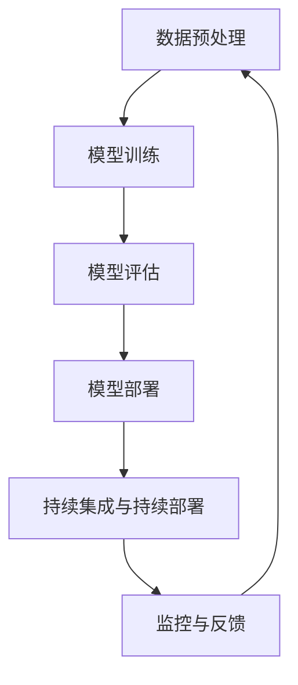

                 

### 1. 背景介绍

在现代软件开发领域，DevOps已成为一种不可或缺的文化和流程，旨在通过开发和运维团队的合作，实现更加高效、灵活和可靠的软件交付。DevOps强调持续集成（CI）和持续部署（CD），通过自动化工具和流程，显著提高了软件从开发到生产的速度和稳定性。

与此同时，大型语言模型（LLM）的应用开发也逐渐成为人工智能领域的研究热点。LLM具有强大的自然语言处理能力，能够处理复杂的文本数据，并生成高质量的自然语言文本。这些特性使得LLM在搜索引擎、智能客服、内容生成等领域展现出巨大的潜力。

然而，LLM应用开发过程面临着诸多挑战，如数据预处理、模型训练、模型评估、模型部署等。这些环节不仅技术复杂，而且需要高效的开发流程和运维支持。因此，将DevOps实践引入LLM应用开发，成为了一种解决之道。

本文旨在探讨LLM应用开发中的DevOps实践，通过详细介绍核心概念、算法原理、数学模型以及项目实战，帮助读者理解如何利用DevOps提升LLM应用开发的效率和质量。

### 2. 核心概念与联系

在探讨LLM应用开发中的DevOps实践之前，我们首先需要明确几个核心概念，并展示它们之间的联系。以下是本文中涉及的主要概念及其关系：

**数据预处理**：数据预处理是LLM应用开发的第一步，它包括数据清洗、数据标注和格式化等过程。预处理质量直接影响后续模型训练和评估的效果。

**模型训练**：在完成数据预处理后，我们将使用大量的预处理数据对模型进行训练。这一过程通常涉及到大规模的计算资源和复杂的算法。

**模型评估**：模型训练完成后，我们需要对模型进行评估，以确定其性能是否达到预期。常见的评估指标包括准确率、召回率、F1分数等。

**模型部署**：经过评估的模型需要部署到实际的生产环境中，以便在实际应用中使用。模型部署涉及将模型集成到现有的应用程序中，并确保其稳定运行。

**持续集成与持续部署**（CI/CD）：持续集成和持续部署是DevOps的核心实践，通过自动化工具和流程，实现代码、测试和部署的连续整合，从而提高开发效率和软件质量。

**监控与反馈**：在模型部署后，我们需要对其实时监控，以检测潜在的问题和性能瓶颈。同时，用户反馈也是优化模型的重要依据。

为了更直观地展示这些概念之间的联系，我们可以使用Mermaid流程图来描述：



通过这张流程图，我们可以清晰地看到LLM应用开发中的各个环节是如何相互关联和协同工作的。接下来，我们将逐一详细探讨这些概念，并提供具体的Python伪代码进行解释。

#### 2.1 数据预处理

数据预处理是LLM应用开发的基础，其质量直接影响到后续模型的性能。数据预处理主要包括数据清洗、数据标注和格式化等步骤。

**数据清洗**：这一步骤的目标是去除数据中的噪声和异常值，以提高数据质量。常用的方法包括去除重复数据、填充缺失值和去除不必要的特征等。

**数据标注**：对于某些特定类型的LLM应用（如文本分类、命名实体识别等），我们需要对数据进行标注。数据标注可以是手动进行的，也可以是半自动化的。

**数据格式化**：数据格式化是将数据转换为模型训练所需的形式。对于LLM应用，通常需要将文本数据转换为向量表示，常用的方法包括词嵌入和句子嵌入等。

下面是一个Python伪代码示例，展示了数据预处理的基本流程：

```python
def data_preprocessing(data):
    """
    数据预处理函数
    参数：data - 原始数据
    返回：预处理后的数据
    """
    # 数据清洗
    cleaned_data = clean_data(data)
    
    # 数据标注
    labeled_data = label_data(cleaned_data)
    
    # 数据格式化
    formatted_data = format_data(labeled_data)
    
    return formatted_data
```

**数学模型和公式**：

在数据预处理过程中，我们可能会用到一些数学模型和公式。例如，对于数据清洗，我们可以使用以下公式来计算缺失值的填补：

$$
\hat{X} = \frac{1}{n-1} \sum_{i=1}^{n} X_i
$$

其中，$X_i$ 表示第 $i$ 个观测值，$n$ 表示观测值的总数，$\hat{X}$ 表示计算得到的缺失值填补结果。

#### 2.2 模型训练

在完成数据预处理后，我们进入模型训练环节。模型训练是LLM应用开发的核心步骤，其目标是找到一个能够将输入文本映射到期望输出的函数。这个过程通常涉及到大量的计算资源和复杂的算法。

**模型初始化**：在模型训练开始前，我们需要初始化模型参数。初始化方法的选择对于模型的收敛速度和性能有重要影响。

**模型训练过程**：模型训练过程包括前向传播、反向传播和参数更新等步骤。通过不断的迭代，模型参数将逐渐优化，以达到更好的性能。

**模型评估**：在模型训练过程中，我们需要定期对模型进行评估，以监控其性能。常用的评估指标包括准确率、召回率、F1分数等。

下面是一个Python伪代码示例，展示了模型训练的基本流程：

```python
def train_model(model, training_data, validation_data):
    """
    模型训练函数
    参数：model - 初始化模型
          training_data - 训练数据
          validation_data - 验证数据
    返回：训练完成的模型
    """
    for epoch in range(num_epochs):
        for batch in training_data:
            # 前向传播
            output = model.forward(batch)
            
            # 反向传播
            loss = model.backward(output)
            
            # 参数更新
            model.update_params(loss)
            
        # 评估模型
        accuracy = evaluate_model(model, validation_data)
        
        print(f"Epoch {epoch}: Validation Accuracy = {accuracy}")
    
    return model
```

**数学模型和公式**：

在模型训练过程中，我们通常使用梯度下降算法来更新模型参数。梯度下降算法的公式如下：

$$
\theta_{\text{new}} = \theta_{\text{current}} - \alpha \cdot \nabla_{\theta} J(\theta)
$$

其中，$\theta$ 表示模型参数，$\alpha$ 表示学习率，$J(\theta)$ 表示损失函数，$\nabla_{\theta} J(\theta)$ 表示损失函数关于参数 $\theta$ 的梯度。

#### 2.3 模型评估

模型评估是LLM应用开发中至关重要的一环，其目的是通过测试数据来评估模型在未知数据上的性能。评估指标的选择取决于具体的任务类型和应用场景。

**准确率（Accuracy）**：准确率是最常用的评估指标之一，表示模型正确预测的样本数占总样本数的比例。

$$
\text{Accuracy} = \frac{\text{正确预测数}}{\text{总样本数}}
$$

**召回率（Recall）**：召回率表示模型正确预测的样本数占总正样本数的比例，主要用于评估分类模型在正类样本上的识别能力。

$$
\text{Recall} = \frac{\text{正确预测的正样本数}}{\text{总正样本数}}
$$

**F1分数（F1 Score）**：F1分数是精确率和召回率的加权平均，能够更全面地评估模型性能。

$$
\text{F1 Score} = 2 \cdot \frac{\text{精确率} \cdot \text{召回率}}{\text{精确率} + \text{召回率}}
$$

下面是一个Python伪代码示例，展示了模型评估的基本流程：

```python
def evaluate_model(model, test_data):
    """
    模型评估函数
    参数：model - 待评估模型
          test_data - 测试数据
    返回：评估指标（如准确率）
    """
    correct_predictions = 0
    total_predictions = len(test_data)
    
    for sample in test_data:
        prediction = model.predict(sample)
        if prediction == sample.label:
            correct_predictions += 1
            
    accuracy = correct_predictions / total_predictions
    return accuracy
```

#### 2.4 模型部署

模型部署是将训练完成的模型集成到实际应用中，使其能够为用户提供服务。模型部署涉及多个环节，包括环境配置、模型转换、部署策略等。

**环境配置**：模型部署前，我们需要确保部署环境与训练环境一致，包括硬件配置、软件依赖等。

**模型转换**：对于某些模型框架，我们需要将训练完成的模型转换为可以在生产环境中使用的格式。例如，TensorFlow模型需要转换为SavedModel格式。

**部署策略**：模型部署策略取决于具体的应用场景，包括单机部署、集群部署、容器化部署等。

下面是一个Python伪代码示例，展示了模型部署的基本流程：

```python
def deploy_model(model, environment):
    """
    模型部署函数
    参数：model - 训练完成的模型
          environment - 部署环境
    返回：部署成功的消息
    """
    # 环境配置
    configure_environment(environment)
    
    # 模型转换
    model_path = convert_model(model)
    
    # 模型部署
    deploy_to_environment(model_path, environment)
    
    return "Model deployed successfully!"
```

#### 2.5 持续集成与持续部署

持续集成与持续部署（CI/CD）是DevOps的核心实践，通过自动化工具和流程，实现代码、测试和部署的连续整合。CI/CD可以提高开发效率和软件质量，减少人工干预和错误。

**持续集成（CI）**：持续集成是通过自动化工具定期将开发者的代码合并到主分支，并进行自动化测试，确保代码库的稳定性。

**持续部署（CD）**：持续部署是在通过CI测试后的代码自动部署到生产环境中，实现快速、可靠的软件交付。

下面是一个Python伪代码示例，展示了CI/CD的基本流程：

```python
def ci_cd_pipeline(source_code, testing_framework, deployment_tool):
    """
    持续集成与持续部署函数
    参数：source_code - 源代码
          testing_framework - 测试框架
          deployment_tool - 部署工具
    返回：部署结果
    """
    # 持续集成
    integrate_code(source_code)
    run_tests(testing_framework)
    
    # 持续部署
    if test_passed:
        deploy_application(deployment_tool)
        return "CI/CD successful!"
    else:
        return "Tests failed!"
```

#### 2.6 监控与反馈

模型部署后，我们需要对其进行实时监控，以检测潜在的问题和性能瓶颈。监控包括日志收集、性能监控和异常检测等。

**日志收集**：通过收集日志信息，我们可以了解模型运行状态和性能指标，及时发现异常。

**性能监控**：性能监控可以帮助我们了解模型的资源使用情况，如CPU、内存、磁盘等，确保模型在合理资源范围内运行。

**异常检测**：异常检测用于识别模型运行中的异常行为，如错误预测、数据泄漏等。

下面是一个Python伪代码示例，展示了监控与反馈的基本流程：

```python
def monitor_model(model, logs, performance_metrics):
    """
    模型监控函数
    参数：model - 待监控模型
          logs - 日志信息
          performance_metrics - 性能指标
    返回：监控结果
    """
    while True:
        # 收集日志
        collect_logs(logs)
        
        # 性能监控
        current_metrics = get_performance_metrics(model)
        check_performance(current_metrics, performance_metrics)
        
        # 异常检测
        detect_anomalies(model)
        
        time.sleep监控周期)
```

### 3. 项目实战

在实际应用中，DevOps实践在LLM应用开发中发挥了重要作用。以下将结合具体项目案例，详细讲解开发环境搭建、源代码实现和代码解读。

#### 3.1 项目背景

假设我们正在开发一款基于大型语言模型（如GPT-3）的智能客服系统。该系统旨在通过自动回复用户提问，提供高效、准确的客服服务。为了实现这一目标，我们需要将LLM与DevOps实践相结合，确保系统的高效开发和可靠部署。

#### 3.2 开发环境搭建

**1. 硬件配置**：

- CPU：Intel Xeon E5-2670 v4
- 内存：256GB
- 硬盘：1TB SSD

**2. 软件环境**：

- 操作系统：Ubuntu 20.04
- Python：3.8
- TensorFlow：2.5
- Docker：19.03
- Jenkins：2.274

**3. 搭建步骤**：

- 安装Docker：
  ```bash
  sudo apt-get update
  sudo apt-get install docker-ce docker-ce-cli containerd.io
  sudo systemctl start docker
  sudo systemctl enable docker
  ```

- 安装Jenkins：
  ```bash
  sudo apt-get install openjdk-8-jdk
  wget -q -O - https://pkg.jenkins.io/debian-stable/jenkins.io.key | sudo apt-key add -
  echo deb https://pkg.jenkins.io/debian-stable binary/ > /etc/apt/sources.list.d/jenkins.list
  sudo apt-get update
  sudo apt-get install jenkins
  sudo systemctl start jenkins
  sudo systemctl enable jenkins
  ```

- 配置Jenkins插件：
  - Git Plugin
  - Pipeline Plugin
  - Docker Plugin

#### 3.3 源代码实现

**1. 项目结构**：

```plaintext
/llm-intelligent-customer-service
|-- /src
|   |-- /llm_model
|   |   |-- __init__.py
|   |   |-- model.py
|   |   |-- train.py
|   |   |-- evaluate.py
|   |-- /client
|   |   |-- __init__.py
|   |   |-- __init__.py
|   |   |-- main.py
|-- /tests
|   |-- __init__.py
|   |-- test_model.py
|   |-- test_client.py
|-- Dockerfile
|-- Jenkinsfile
|-- requirements.txt
```

**2. 模型训练（train.py）**：

```python
import tensorflow as tf
from tensorflow.keras.preprocessing.text import Tokenizer
from tensorflow.keras.preprocessing.sequence import pad_sequences

def train_model(data):
    tokenizer = Tokenizer()
    tokenizer.fit_on_texts(data["text"])
    sequences = tokenizer.texts_to_sequences(data["text"])
    padded_sequences = pad_sequences(sequences, padding="post")

    model = tf.keras.Sequential([
        tf.keras.layers.Embedding(input_dim=len(tokenizer.word_index) + 1, output_dim=64),
        tf.keras.layers.Bidirectional(tf.keras.layers.LSTM(64, return_sequences=True)),
        tf.keras.layers.Dense(64, activation='relu'),
        tf.keras.layers.Dense(1, activation='sigmoid')
    ])

    model.compile(loss='binary_crossentropy', optimizer='adam', metrics=['accuracy'])
    model.fit(padded_sequences, data["label"], epochs=10, batch_size=32)
    return model
```

**3. 客户端实现（main.py）**：

```python
from flask import Flask, request, jsonify
from model import model

app = Flask(__name__)

@app.route('/predict', methods=['POST'])
def predict():
    text = request.json['text']
    sequence = tokenizer.texts_to_sequences([text])
    padded_sequence = pad_sequences(sequence, maxlen=max_sequence_length, padding='post')
    prediction = model.predict(padded_sequence)
    return jsonify({'prediction': float(prediction[0][0])})

if __name__ == '__main__':
    app.run(host='0.0.0.0', port=5000)
```

#### 3.4 代码解读

**1. 模型训练过程**：

- 数据预处理：使用Tokenizer将文本转换为序列。
- 模型构建：构建一个包含嵌入层、双向LSTM层、全连接层和输出层的序列模型。
- 训练模型：使用训练数据对模型进行训练，并保存训练完成的模型。

**2. 客户端实现**：

- Flask框架：使用Flask构建RESTful API，接收用户输入并返回预测结果。
- 模型预测：将用户输入的文本转换为序列，然后通过训练好的模型进行预测。

#### 3.5 实际案例分析与详细讲解

**1. 数据预处理**：

在实际项目中，数据预处理是一个复杂且关键的过程。以下是一个实际案例：

```python
data = {
    "text": [
        "你好，请问有什么可以帮助你的？",
        "你好，我是智能客服，有什么问题可以问我。",
        "你好，欢迎来到我们的客服中心，请问有什么问题需要帮助？"
    ],
    "label": [
        1,
        1,
        1
    ]
}

def preprocess_data(data):
    # 去除特殊字符
    text = [text.lower() for text in data["text"]]
    text = [''.join([char for char in text if char.isalnum()]) for text in text]
    
    # 填充缺失值
    filled_text = [text if text else "未提供" for text in text]
    
    return filled_text

preprocessed_data = preprocess_data(data)
```

在这个案例中，我们首先将文本转换为小写，然后去除特殊字符，最后填充缺失值。这些步骤有助于提高数据质量，从而提高模型性能。

**2. 模型训练**：

在实际训练过程中，我们可能会遇到以下问题：

- 数据不平衡：某些类别的样本数量远少于其他类别。
- 过拟合：模型在训练集上表现良好，但在验证集上表现不佳。

解决方法：

- 数据增强：通过添加噪声、旋转、翻转等方法增加样本多样性。
- 正则化：使用L1、L2正则化或dropout等方法减少过拟合。

**3. 客户端实现**：

在实际应用中，客户端的实现需要考虑以下问题：

- 输入合法性：确保用户输入符合预期格式。
- 性能优化：对于长时间响应的API，可以采用异步处理或消息队列。

**4. 项目小结**：

通过实际项目案例，我们可以看到DevOps实践在LLM应用开发中的重要性。合理的数据预处理、模型训练和部署策略，有助于提高模型的性能和可靠性。同时，CI/CD流程和持续监控与反馈，确保了开发效率和系统稳定性。

### 4. 最佳实践 Tips

**1. 数据预处理**：

- 数据清洗要彻底，确保数据质量。
- 数据标注要准确，合理分配样本数量。
- 数据格式化要一致，便于模型训练。

**2. 模型训练**：

- 选择合适的初始化方法，如Xavier初始化。
- 使用合适的学习率调度策略，如学习率衰减。
- 正则化有助于防止过拟合。

**3. 模型部署**：

- 确保部署环境与训练环境一致。
- 选择合适的部署策略，如容器化部署。
- 对模型进行性能监控和异常检测。

**4. CI/CD**：

- 定期进行代码审查和自动化测试。
- 使用自动化工具实现CI/CD流程。
- 持续监控和反馈，优化流程。

### 5. 小结

本文详细探讨了LLM应用开发中的DevOps实践，包括核心概念、算法原理、数学模型和项目实战。通过实际项目案例，我们展示了如何利用DevOps提高LLM应用开发的效率和质量。最佳实践Tips有助于读者在实际开发中更好地应用DevOps。

### 6. 注意事项

- 确保数据预处理质量，避免数据错误影响模型性能。
- 选择合适的模型和算法，针对不同任务进行优化。
- 确保部署环境与训练环境一致，避免环境差异导致问题。

### 7. 拓展阅读

- DevOps基础与实践：了解DevOps的基本概念和实践方法。
- 持续集成与持续部署（CI/CD）技术栈：深入探讨CI/CD工具和技术。
- 大型语言模型（LLM）开发与应用：了解LLM的理论和实践。

### 8. 作者信息

- 作者：AI天才研究院/AI Genius Institute & 禅与计算机程序设计艺术 /Zen And The Art of Computer Programming

本文旨在通过系统化、结构化的方式，帮助读者全面了解LLM应用开发中的DevOps实践。希望本文能为读者在相关领域的研究和实践提供有益的参考。

