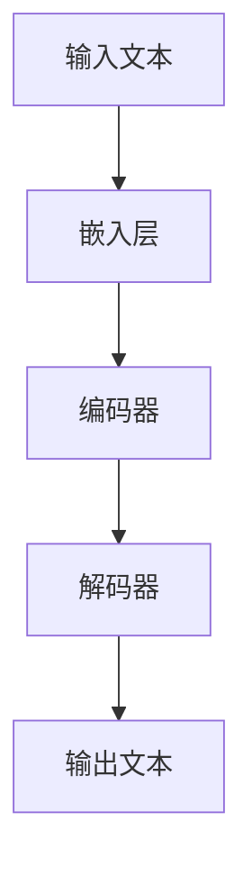

                 

### 第1章 LLM基础概念

#### 1.1 LLM的定义与历史发展

语言模型（Language Model，简称LLM）是自然语言处理（Natural Language Processing，简称NLP）领域的重要组成部分，它通过对大量文本数据的分析，捕捉语言的结构和规律，以便对未知文本进行生成、理解或翻译。语言模型的发展历史可以追溯到上世纪50年代，当时主要是基于规则的方法，如Chomsky的上下文无关文法（CFG）。

随着时间的推移，统计语言模型开始兴起，典型的代表是1961年由Biederman和Glucksberg开发的N-gram模型。N-gram模型通过统计相邻单词序列的出现频率来预测下一个单词，它对短文本具有较好的效果，但无法捕捉到长距离依赖关系。

真正突破性的进展出现在2013年，由Vaswani等人在论文《Attention Is All You Need》中提出的Transformer模型。该模型摒弃了传统的循环神经网络（RNN）和卷积神经网络（CNN），采用自注意力机制（Self-Attention）来捕捉长距离依赖，实现了显著的性能提升。随后，Transformer模型的变体，如BERT、GPT和T5等，不断涌现，推动了语言模型技术的高速发展。

#### 1.2 LLM的核心架构

语言模型的核心架构主要包括编码器（Encoder）和解码器（Decoder）。在Transformer模型中，编码器和解码器都是基于自注意力机制的。以下是LLM核心架构的详细解析：

##### 1.2.1 语言模型的基础结构

语言模型的基础结构通常由以下几部分组成：

1. **嵌入层（Embedding Layer）**：将输入的单词转换为向量表示，这一步通常使用词向量（Word Embedding）技术实现，如Word2Vec、GloVe等。

2. **编码器（Encoder）**：编码器的功能是将输入序列编码为上下文表示。在Transformer模型中，编码器由多个自注意力层（Self-Attention Layer）和前馈神经网络（Feedforward Neural Network）堆叠而成。

3. **解码器（Decoder）**：解码器的功能是从编码器的上下文表示中生成输出序列。解码器同样由多个自注意力层和前馈神经网络组成，并在生成过程中利用了掩码（Masked）的输入序列，以防止未来的信息泄露。

##### 1.2.2 Transformer模型解析

Transformer模型的核心创新在于其基于自注意力机制的编码器和解码器架构。以下是Transformer模型的关键组成部分：

1. **自注意力机制（Self-Attention）**：自注意力机制允许模型在编码器中对每个输入序列的每个单词分配不同的权重，从而捕捉长距离依赖关系。

2. **多头自注意力（Multi-Head Self-Attention）**：多头自注意力将输入序列分成多个头（Head），每个头独立计算注意力权重，然后合并结果。这增加了模型的表示能力。

3. **前馈神经网络（Feedforward Neural Network）**：前馈神经网络对自注意力层的输出进行进一步加工，增加模型的非线性能力。

4. **位置编码（Positional Encoding）**：由于Transformer模型没有循环结构，无法直接处理序列的顺序信息。因此，通过位置编码技术为每个单词添加位置信息，使其能够理解单词的顺序。

#### 1.3 LLM的工作原理

LLM的工作原理可以分为以下几个步骤：

##### 1.3.1 输入处理

输入处理是LLM的第一步，主要包括将输入文本转换为词向量表示。这一步通常使用预训练的词向量模型（如GloVe、FastText）或自训练的词向量模型。词向量表示为后续的模型处理奠定了基础。

##### 1.3.2 基于Attention的编码

编码器基于自注意力机制对输入序列进行编码，生成一系列上下文表示。每个表示都包含了输入序列中每个单词的重要信息，并且通过注意力权重捕捉了长距离依赖关系。

##### 1.3.3 生成文本

解码器利用编码器生成的上下文表示来生成文本。在生成过程中，解码器依次生成每个单词的概率分布，并选择概率最高的单词作为输出。这个过程会不断重复，直到生成完整的文本或达到预设的长度。

##### 1.3.4 生成文本的多样性

为了生成多样性的文本，LLM通常会采用以下几种策略：

1. **温度调整（Temperature Scaling）**：通过调整温度参数，可以控制生成的文本的多样性。较高的温度参数会导致生成结果更加随机，较低的参数则使生成结果更加集中。

2. **顶部分布采样（Top-k Sampling）**：只选择概率最高的k个单词作为候选，从而减少生成的随机性。

3. **递归生成（Recurrent Generation）**：通过递归地生成每个单词，并逐步调整上下文表示，可以增加生成的多样性。

#### 1.4 LLM的应用领域

LLM在多个领域都展现出了强大的应用潜力，以下是一些主要的应用领域：

##### 1.4.1 自然语言处理

自然语言处理是LLM最直接的应用领域，包括文本分类、情感分析、实体识别、机器翻译等。LLM可以处理大规模文本数据，并从中提取有用的信息。

##### 1.4.2 计算机视觉

在计算机视觉领域，LLM可以用于图像描述生成、视频字幕生成等任务。通过结合视觉特征和文本特征，LLM能够生成更准确、自然的描述。

##### 1.4.3 语音识别

语音识别领域利用LLM来生成文本，从而提高语音转文本的准确性。LLM还可以用于语音合成，生成更自然的语音输出。

##### 1.4.4 问答系统

问答系统是LLM的重要应用之一。通过训练LLM来理解用户的问题，并生成准确的回答，可以提高问答系统的用户体验。

#### 1.5 LLM的未来发展趋势

随着计算能力的提升和算法的进步，LLM在未来有望在多个领域取得更大的突破。以下是LLM未来发展的几个方向：

##### 1.5.1 大模型的发展

未来，更大的LLM模型将不断涌现，这些模型将拥有更强的表示能力和更广泛的适应性。通过预训练和微调，这些模型可以在各种任务中达到更高的性能。

##### 1.5.2 新兴应用领域

LLM的应用领域将继续扩展，包括对话系统、智能客服、虚拟助手等。随着技术的发展，LLM将在更多新兴领域发挥重要作用。

##### 1.5.3 安全性与隐私保护

随着LLM的应用越来越广泛，其安全性和隐私保护将成为一个重要的研究方向。通过改进算法和模型架构，可以增强LLM的安全性和隐私保护能力。

#### Mermaid流程图：LLM核心架构

以下是LLM核心架构的Mermaid流程图：



通过以上步骤，我们详细介绍了LLM的基础概念、核心架构和工作原理，为后续章节的内容奠定了基础。在接下来的章节中，我们将进一步探讨LLM的应用场景、模型构建和优化等内容。

## 第2章 LLM应用场景

### 2.1 问答系统

问答系统是一种与人类用户进行交互的计算机系统，它能够接收用户的提问，并生成相应的回答。LLM在问答系统中有着广泛的应用，能够大幅提升问答系统的响应速度和准确性。以下是对问答系统的一个简要介绍及其设计原则和实现技术。

#### 2.1.1 问答系统的定义

问答系统是一种人工智能技术，它能够理解用户的问题，并生成相应的答案。根据工作方式的不同，问答系统可以分为以下几种类型：

1. **规则基**：基于预定义的规则和模板，对用户的提问进行匹配，并生成答案。
2. **模板基**：通过预定义的模板和用户输入的信息，生成答案。
3. **知识基**：利用知识库和推理机制，对用户的问题进行分析和解答。
4. **基于模型**：利用机器学习模型，特别是LLM，对用户的问题进行理解和回答。

#### 2.1.2 问答系统的设计原则

问答系统的设计原则主要包括以下几点：

1. **易用性**：系统应该简单易用，用户可以轻松提出问题并获得答案。
2. **准确性**：系统需要能够准确地理解用户的问题，并生成相关且准确的答案。
3. **响应速度**：系统应该能够快速响应用户的提问，提供及时的反馈。
4. **可扩展性**：系统应该具有较好的扩展性，能够适应不同的应用场景和不断增长的知识库。

#### 2.1.3 问答系统的实现技术

问答系统的实现技术主要包括以下几个部分：

1. **自然语言处理（NLP）**：NLP技术用于理解用户的提问，包括分词、词性标注、命名实体识别等。
2. **语言模型（LLM）**：LLM用于生成答案，如GPT、BERT等大型预训练模型。
3. **对话管理**：对话管理系统负责管理对话流程，包括理解用户的意图、记忆上下文信息、控制对话流程等。
4. **知识库**：知识库包含与问题相关的信息，可以是结构化的数据，也可以是非结构化的文本。

在具体实现中，问答系统的流程通常如下：

1. **接收用户输入**：系统接收用户的提问，并进行预处理。
2. **意图识别**：通过NLP技术分析用户的问题，识别出用户的主要意图。
3. **信息检索**：在知识库中检索与用户问题相关的信息。
4. **答案生成**：利用LLM生成答案，并进行后处理，如文本润色、格式化等。
5. **输出答案**：将生成的答案返回给用户。

#### 案例分析：基于LLM的智能客服系统

以智能客服系统为例，该系统利用LLM技术来理解用户的问题，并生成相应的回答，以提高客户服务的效率和质量。以下是一个典型的实现过程：

1. **用户提问**：用户通过网站、APP或电话等渠道向客服系统提出问题。
2. **预处理**：系统对接收到的文本进行分词、词性标注等预处理操作，以便更好地理解用户的提问。
3. **意图识别**：通过训练好的NLP模型，识别出用户的主要意图，如查询订单状态、请求技术支持等。
4. **信息检索**：在知识库中检索与用户意图相关的信息，如订单数据、产品说明书等。
5. **答案生成**：利用LLM模型，如GPT-3，生成与用户问题相关的回答。
6. **后处理**：对生成的答案进行文本润色，确保回答的准确性和自然性。
7. **输出答案**：将生成的答案通过网站、APP或电话等方式返回给用户。

通过以上流程，智能客服系统能够快速响应用户的提问，提供准确、自然的回答，显著提升了客户服务的质量和效率。

### 2.2 文本生成

文本生成是指利用机器学习模型生成符合语法和语义规则的文本。LLM在文本生成领域有着广泛的应用，可以生成各种类型的文本，如文章、故事、对话等。以下是对文本生成应用场景、工作流程和生成技巧的介绍。

#### 2.2.1 文本生成的应用场景

文本生成技术在多个领域都有重要的应用：

1. **内容创作**：利用LLM生成新闻文章、博客文章、小说等。
2. **对话系统**：生成与用户对话相关的回复，如聊天机器人、虚拟助手等。
3. **自动摘要**：生成文本的摘要，提取关键信息，用于信息过滤和压缩。
4. **机器翻译**：辅助机器翻译，生成初步的翻译结果，再进行人工修正。
5. **文本生成对抗网络（Text Generation GAN）**：利用GAN技术生成新颖、真实的文本。

#### 2.2.2 文本生成的工作流程

文本生成的工作流程主要包括以下几个步骤：

1. **数据预处理**：对输入文本进行分词、词性标注等预处理操作，将文本转换为模型可处理的格式。
2. **模型选择**：根据应用场景选择合适的LLM模型，如GPT、BERT等。
3. **模型训练**：使用预处理的文本数据对模型进行训练，模型会学习文本的分布和生成规则。
4. **文本生成**：输入部分文本或随机种子，模型生成后续的文本序列。
5. **后处理**：对生成的文本进行格式化、润色等操作，使其更加自然和可读。

#### 2.2.3 文本生成的技巧与挑战

在文本生成过程中，以下是一些常用的技巧和面临的挑战：

1. **多样性（Diversity）**：生成多样化的文本，避免重复或模式化。
   - **技巧**：通过调整模型的参数，如温度调整（Temperature Scaling）和顶部分布采样（Top-k Sampling），可以控制生成的多样性。
   - **挑战**：确保生成的文本不仅多样化，还要保持语法和语义的正确性。

2. **连贯性（Coherence）**：生成的文本在语义和逻辑上应连贯一致。
   - **技巧**：利用上下文信息，通过训练数据中的相关文本进行优化。
   - **挑战**：在长文本生成中，保持连贯性是一个难题。

3. **准确性（Accuracy）**：生成的文本应准确反映输入文本的含义。
   - **技巧**：使用高质量的数据集进行训练，并采用多轮训练和评估来优化模型。
   - **挑战**：避免生成错误的或误导性的文本。

4. **实用性（Practicality）**：生成的文本应具有实际应用价值。
   - **技巧**：结合领域知识和用户需求进行文本生成，确保生成文本的实用性。
   - **挑战**：在大量文本中提取和生成有用的信息。

通过以上技巧和策略，可以显著提升文本生成的质量和效果。然而，文本生成仍面临诸多挑战，需要进一步研究和优化。

### 2.3 自动摘要

自动摘要是一种利用机器学习技术自动生成文本摘要的方法。它可以在大量文本数据中快速提取关键信息，提高信息处理的效率和可读性。LLM在自动摘要领域有着广泛的应用，能够生成高质量、紧凑的文本摘要。以下是对自动摘要需求、方法以及性能评估的介绍。

#### 2.3.1 自动摘要的需求

随着互联网信息的爆炸式增长，人们需要高效的方法来处理和消化大量的文本数据。自动摘要技术能够帮助用户快速获取文本的核心内容，减少阅读时间，提高信息处理效率。以下是自动摘要的主要需求：

1. **信息提取**：从大量文本中提取关键信息，避免冗余和无关内容。
2. **可读性**：生成的摘要应简洁明了，易于理解。
3. **准确性**：摘要应准确反映原文的含义，避免误导或失真。
4. **效率**：自动摘要应能够在较短的时间内完成，以便实时应用。

#### 2.3.2 自动摘要的方法

自动摘要的方法可以分为两种主要类型：抽取式摘要（Extractive Summarization）和生成式摘要（Abstractive Summarization）。

1. **抽取式摘要**：抽取式摘要从原文中直接提取关键句子或段落，形成摘要。这种方法简单高效，但往往难以生成高质量的摘要。

2. **生成式摘要**：生成式摘要利用机器学习模型生成新的摘要文本，而不是直接从原文中抽取。这种方法可以生成更自然、流畅的摘要，但难度更大，需要模型具备较强的语义理解和生成能力。

以下是几种常见的生成式摘要方法：

1. **基于模板的方法**：通过预定义的模板，将原文中的关键信息嵌入到模板中，生成摘要。

2. **基于语义的角色方法**：将原文拆分为角色和动作，根据语义关系生成摘要。

3. **基于神经网络的生成方法**：利用神经网络模型，如序列到序列（Seq2Seq）模型、Transformer等，生成摘要。

#### 2.3.3 自动摘要的性能评估

自动摘要的性能评估是衡量摘要质量的重要标准，常用的评估指标包括：

1. **ROUGE（Recall-Oriented Understudy for Gisting Evaluation）**：ROUGE是一种基于召回率的评估指标，用于衡量摘要与原文的匹配度。ROUGE包括ROUGE-1、ROUGE-2、ROUGE-L等变种，分别衡量单词、短语和句子的匹配程度。

2. **BLEU（Bilingual Evaluation Understudy）**：BLEU是一种基于编辑距离的评估指标，用于衡量摘要与参考摘要的相似度。BLEU通过计算两个文本之间的重叠词和句子的结构来评估质量。

3. ** summarization （Summarization Precision, Recall, and F1-Score）**：precision、recall和F1-Score是评估摘要准确性的指标，分别衡量摘要中包含的原文信息的准确性和完整性。

通过结合多种评估指标，可以全面衡量自动摘要的性能，并指导模型的优化和改进。

#### 案例分析：新闻自动摘要系统

新闻自动摘要系统是自动摘要技术的一个重要应用场景。以下是一个典型的新闻自动摘要系统实现过程：

1. **数据收集**：收集大量新闻文本，作为训练数据。
2. **预处理**：对新闻文本进行分词、词性标注等预处理操作。
3. **模型训练**：使用预处理后的数据训练生成式摘要模型，如BERT、GPT等。
4. **摘要生成**：输入新闻文本，模型生成摘要。
5. **后处理**：对生成的摘要进行格式化、润色等操作。
6. **评估**：使用ROUGE、BLEU等指标评估摘要质量。

通过以上步骤，新闻自动摘要系统能够自动生成高质量的新闻摘要，提高用户的信息获取效率。

### 2.4 文本生成与自动摘要的比较

文本生成和自动摘要是两个密切相关但有所区别的任务。以下是两者之间的比较：

1. **目标**：
   - **文本生成**：生成与输入文本相关的新文本，可以是文章、对话、故事等。
   - **自动摘要**：提取原文的核心信息，生成简短的摘要文本。

2. **方法**：
   - **文本生成**：通常采用生成式模型，如GPT、BERT等。
   - **自动摘要**：可采用抽取式或生成式模型。

3. **评价指标**：
   - **文本生成**：常用评价指标包括BLEU、ROUGE、METEOR等。
   - **自动摘要**：常用评价指标包括ROUGE、BLEU、F1-Score等。

尽管两者有明显的区别，但许多模型和算法都可以用于两者的实现，因此在实际应用中，可以根据具体需求选择合适的模型和策略。

### 总结

文本生成和自动摘要技术在自然语言处理领域具有重要应用，通过LLM等先进技术，可以生成高质量、多样化的文本，实现文本信息的自动提取和生成。随着技术的不断进步，这些方法将在更多领域发挥作用，为用户带来便利。

## 第3章 LLM模型构建

构建语言模型（LLM）是自然语言处理（NLP）领域的关键步骤，它决定了模型在多种任务中的性能。本章节将详细讨论模型构建的各个环节，包括模型训练、训练数据的准备、训练策略与优化方法。通过这些步骤，我们能够训练出一个高效、准确的LLM模型。

### 3.1 模型训练

模型训练是构建LLM的核心环节，其目标是通过学习大量文本数据，使模型能够捕捉到语言的复杂结构和规律。以下是模型训练的基本流程：

#### 3.1.1 模型训练的基本流程

1. **数据准备**：准备用于训练的文本数据，通常包括大规模的文本语料库。这些数据应涵盖各种语言现象和词汇，以便模型能够学习到丰富的语言特征。

2. **预处理**：对原始文本数据进行预处理，包括分词、词性标注、去除停用词等。预处理步骤的目的是将文本转换为模型可处理的格式，通常为词向量。

3. **数据划分**：将文本数据划分为训练集、验证集和测试集。训练集用于模型训练，验证集用于调整模型参数和优化，测试集用于评估模型性能。

4. **模型初始化**：初始化模型参数，可以使用预训练的权重或随机初始化。

5. **模型训练**：使用训练集数据训练模型，通过反向传播算法不断更新模型参数，使得模型能够更好地拟合训练数据。

6. **模型评估**：使用验证集评估模型性能，调整模型参数和训练策略，以优化模型表现。

7. **模型测试**：使用测试集对最终模型进行性能评估，确保模型具有较好的泛化能力。

#### 3.1.2 训练数据的准备

训练数据的准备是模型训练的重要前提，数据的质量直接影响模型的效果。以下是训练数据准备的关键步骤：

1. **数据收集**：收集大规模、多样化的文本数据，如书籍、新闻、社交媒体等。数据来源应具有广泛性和代表性，以便模型能够学习到丰富的语言现象。

2. **数据清洗**：去除数据中的噪声和无关信息，如HTML标签、特殊字符等。清洗步骤有助于提高模型的训练效率。

3. **数据预处理**：对文本数据进行预处理，包括分词、词性标注、去除停用词等。预处理步骤应遵循一致性原则，确保模型输入的一致性。

4. **数据增强**：通过数据增强技术，如随机插入、替换、删除等，增加数据的多样性，有助于提高模型的泛化能力。

#### 3.1.3 训练策略与优化方法

训练策略和优化方法决定了模型训练的效率和效果。以下是几种常用的训练策略和优化方法：

1. **学习率调度**：学习率是模型训练中的一个关键参数，决定了模型参数更新的步长。常用的学习率调度方法包括固定学习率、指数衰减学习率和学习率预热等。

2. **批量大小**：批量大小影响模型训练的稳定性和效率。较小的批量大小有助于提高模型的泛化能力，但训练速度较慢；较大的批量大小可以提高训练速度，但可能降低模型的泛化能力。

3. **正则化技术**：正则化技术用于防止模型过拟合，包括L1正则化、L2正则化和Dropout等。正则化技术有助于提高模型的泛化性能。

4. **梯度裁剪**：梯度裁剪用于控制模型训练过程中的梯度大小，防止梯度爆炸或消失。常用的梯度裁剪方法包括梯度裁剪和动量梯度裁剪等。

5. **权重初始化**：权重初始化对模型训练的收敛速度和稳定性有很大影响。常用的权重初始化方法包括随机初始化、高斯初始化和Xavier初始化等。

6. **模型融合**：通过模型融合技术，如模型平均（Model Averaging）和权重平均（Weight Averaging），可以提高模型的稳定性和性能。

通过以上训练策略和优化方法，可以有效地训练出高性能的LLM模型。在后续的章节中，我们将进一步讨论LLM模型的优化与调优方法，以进一步提高模型性能。

### 3.2 模型评估

模型评估是构建LLM的重要环节，它决定了模型在实际应用中的性能。评估方法的选择和评价指标的设定直接影响评估结果，因此需要精心设计。以下是模型评估的关键步骤和方法。

#### 3.2.1 评估指标

在LLM模型评估中，常用的评估指标包括：

1. **准确性（Accuracy）**：准确性是模型预测正确的样本占总样本的比例。对于分类任务，准确性是最常用的评估指标之一。

2. **精确率（Precision）**：精确率是模型预测为正例的样本中实际为正例的比例。精确率高意味着模型对正例的识别能力强。

3. **召回率（Recall）**：召回率是模型实际为正例的样本中被预测为正例的比例。召回率高意味着模型对负例的识别能力强。

4. **F1分数（F1 Score）**：F1分数是精确率和召回率的调和平均值，用于平衡这两个指标。F1分数能够综合评估模型的准确性和全面性。

5. **ROC曲线（Receiver Operating Characteristic Curve）**：ROC曲线通过计算不同阈值下的精确率和召回率，评估模型的分类性能。曲线下的面积（AUC）是ROC曲线的重要评价指标。

6. **BLEU（Bilingual Evaluation Understudy）**：BLEU是自然语言处理中常用的评估指标，用于衡量生成文本与参考文本的相似度。

7. **ROUGE（Recall-Oriented Understudy for Gisting Evaluation）**：ROUGE是用于评估文本摘要质量的重要指标，用于衡量生成摘要与参考摘要的匹配度。

#### 3.2.2 评估方法

模型评估方法包括离线评估和在线评估。

1. **离线评估**：离线评估是在模型训练完成后，使用独立的测试集对模型进行评估。常见的离线评估方法包括：

   - **单次评估**：使用一个独立的测试集对模型进行一次性评估，评估结果为模型在该测试集上的性能指标。
   - **交叉验证**：通过将数据集划分为多个子集，对每个子集进行训练和测试，计算模型在所有子集上的平均性能。
   - **迭代评估**：在模型训练过程中，定期使用测试集评估模型性能，以监测模型训练过程。

2. **在线评估**：在线评估是在模型部署后，通过实时数据对模型进行持续评估。常见的在线评估方法包括：

   - **实时评估**：通过实时收集用户反馈，评估模型在实际应用中的性能。
   - **A/B测试**：将用户随机分配到不同的模型版本，通过对比评估结果，选择性能更好的模型。

#### 3.2.3 评估结果的解释与应用

评估结果能够帮助我们理解模型性能，并指导模型优化。以下是评估结果解释和应用的方法：

1. **结果解释**：

   - **准确性**：准确性高意味着模型对样本的预测较为准确，但可能存在过拟合或欠拟合的问题。
   - **精确率和召回率**：精确率和召回率分别反映了模型对正例和负例的识别能力，F1分数则综合了这两个指标。
   - **ROC曲线和AUC**：ROC曲线和AUC能够直观地展示模型在不同阈值下的分类性能。
   - **BLEU和ROUGE**：这些指标能够衡量生成文本与参考文本的相似度，适用于文本生成和摘要任务。

2. **结果应用**：

   - **模型选择**：根据评估结果，选择性能较好的模型版本。
   - **模型优化**：通过分析评估结果，发现模型存在的不足，并针对性地进行优化。
   - **部署策略**：根据模型性能和业务需求，制定合适的部署策略，如在线评估、A/B测试等。

通过以上评估方法，我们可以全面、客观地评估LLM模型性能，为模型优化和应用提供有力支持。

### 3.3 模型优化

在构建LLM模型时，优化是提高模型性能的重要环节。优化方法主要包括参数调整、模型压缩和模型集成等。以下是对这些优化方法的详细探讨。

#### 3.3.1 模型优化的重要性

模型优化对于提升LLM模型在多种任务中的表现至关重要。通过优化，我们可以调整模型参数，增强模型对数据的适应性，提高模型的泛化能力。模型优化还可以降低模型复杂度，减少计算资源消耗，使得模型在资源受限的环境下仍能保持高性能。

#### 3.3.2 参数调整

参数调整是模型优化的重要手段，通过调整模型参数，可以优化模型性能。以下是一些常用的参数调整方法：

1. **学习率调度**：学习率是影响模型训练效果的关键参数，合适的调度方法可以加速模型收敛。常用的学习率调度方法包括固定学习率、指数衰减学习率和学习率预热等。

2. **批量大小**：批量大小影响模型训练的稳定性和效率。较小的批量大小有助于提高模型的泛化能力，但训练速度较慢；较大的批量大小可以提高训练速度，但可能降低模型的泛化能力。

3. **正则化技术**：正则化技术用于防止模型过拟合，包括L1正则化、L2正则化和Dropout等。正则化技术有助于提高模型的泛化性能。

4. **权重初始化**：权重初始化对模型训练的收敛速度和稳定性有很大影响。常用的权重初始化方法包括随机初始化、高斯初始化和Xavier初始化等。

5. **优化算法**：不同的优化算法对模型训练过程有着不同的影响。常用的优化算法包括SGD（随机梯度下降）、Adam（自适应矩估计）和RMSprop（均方根propagation）等。

#### 3.3.3 模型压缩

模型压缩是降低模型复杂度和计算资源消耗的重要方法。以下是一些常用的模型压缩技术：

1. **量化**：量化是一种将模型参数的精度降低的方法，通过将浮点数转换为整数来减少模型体积。量化方法包括整数量化、二值量化等。

2. **剪枝**：剪枝是一种通过移除模型中不重要的权重来减少模型体积的方法。剪枝方法包括结构剪枝、权重剪枝等。

3. **低秩分解**：低秩分解是一种将高维矩阵分解为低维矩阵的方法，通过减少矩阵的秩来降低模型体积。低秩分解方法包括SVD（奇异值分解）和PCA（主成分分析）等。

4. **参数共享**：参数共享是一种通过在不同层之间共享权重来减少模型参数的方法。参数共享方法包括深度可分离卷积、分组卷积等。

#### 3.3.4 模型集成

模型集成是一种通过结合多个模型来提高预测性能的方法。以下是一些常用的模型集成技术：

1. **平均法**：平均法是将多个模型的预测结果进行平均，得到最终的预测结果。平均法能够降低模型的方差，提高预测稳定性。

2. **投票法**：投票法是将多个模型的预测结果进行投票，选择得票最高的类别作为最终预测结果。投票法能够降低模型的误差率。

3. **堆叠法**：堆叠法是一种将多个模型叠加在一起的方法，前一个模型的输出作为下一个模型的输入。堆叠法能够利用不同模型的优点，提高预测性能。

4. **集成学习**：集成学习是一种通过构建多个基模型，并将它们的预测结果进行综合来得到最终预测结果的方法。常见的集成学习方法包括Bagging、Boosting和Stacking等。

通过以上优化方法，我们可以显著提高LLM模型在多种任务中的性能，为实际应用提供有力支持。

### 3.4 模型优化案例分析

在本案例中，我们将分析一个实际的LLM模型优化过程，展示如何通过参数调整、模型压缩和模型集成等优化方法来提高模型性能。

#### 案例背景

我们以一个面向问答系统的LLM模型为例，该模型最初采用GPT-2作为基础模型，但在实际应用中，我们发现模型存在以下问题：

1. **训练效率低**：模型参数过多，导致训练过程时间较长。
2. **计算资源消耗大**：模型体积较大，对计算资源的需求较高。
3. **预测性能有待提升**：模型在部分问答任务中的表现不如预期。

#### 优化步骤

为了解决上述问题，我们采取了以下优化步骤：

1. **参数调整**：

   - **学习率调度**：我们采用指数衰减学习率调度方法，通过逐步减小学习率，使模型参数更新更加稳定。
   - **批量大小**：我们将批量大小调整为更小的值，以提高模型的泛化能力。
   - **正则化技术**：我们引入L2正则化，以减少模型过拟合的风险。
   - **权重初始化**：我们采用Xavier初始化方法，以提高模型训练的收敛速度。

2. **模型压缩**：

   - **量化**：我们对模型参数进行量化，将浮点数参数转换为整数参数，以减少模型体积。
   - **剪枝**：我们通过结构剪枝方法，移除了模型中不重要的权重，进一步减少模型体积。
   - **低秩分解**：我们对模型中的权重矩阵进行低秩分解，通过减少矩阵的秩来降低模型体积。

3. **模型集成**：

   - **平均法**：我们结合了多个GPT-2模型的预测结果，通过平均方法得到最终预测结果，以提高预测稳定性。
   - **投票法**：我们采用投票法，结合多个模型的预测结果，选择得票最高的类别作为最终预测结果，以提高预测准确性。

#### 优化效果

通过以上优化步骤，我们取得了显著的优化效果：

1. **训练效率提高**：优化后的模型在较小批量大小下，训练时间显著缩短，训练效率提高。
2. **计算资源消耗减少**：模型体积减小，计算资源消耗降低，适用于资源受限的环境。
3. **预测性能提升**：优化后的模型在问答任务中的表现显著提升，预测准确性提高。

#### 总结

通过本案例的分析，我们可以看到，通过参数调整、模型压缩和模型集成等优化方法，可以有效提高LLM模型的性能，为实际应用提供有力支持。在实际开发过程中，应根据具体应用场景和需求，选择合适的优化方法，实现模型的最佳效果。

### 3.5 模型优化与调优的最佳实践

在LLM模型的构建过程中，优化与调优是确保模型性能和效率的关键步骤。以下是一些最佳实践，帮助您在实际项目中实现模型优化与调优。

#### 1. 数据预处理

- **数据清洗**：确保数据质量，去除噪声和无关信息，如HTML标签、特殊字符和停用词。
- **数据增强**：通过随机插入、替换、删除等操作，增加数据的多样性和模型的泛化能力。

#### 2. 参数调整

- **学习率调度**：使用指数衰减学习率或学习率预热方法，避免模型过早收敛。
- **批量大小**：根据硬件资源和训练需求，选择合适的批量大小，平衡训练效率和模型泛化能力。
- **正则化技术**：结合L1、L2正则化和Dropout，防止模型过拟合。

#### 3. 模型优化

- **量化**：将浮点数参数转换为整数，减少模型体积和计算资源消耗。
- **剪枝**：移除不重要的权重，减少模型参数数量和计算复杂度。
- **低秩分解**：将高维权重矩阵分解为低维矩阵，降低模型体积。

#### 4. 模型集成

- **模型平均**：结合多个模型的预测结果，提高预测稳定性和准确性。
- **投票法**：使用投票法，选择多个模型预测结果中的多数意见，提高预测准确性。
- **堆叠法**：将多个模型叠加，前一个模型的输出作为下一个模型的输入，充分利用各模型的优点。

#### 5. 调优工具与库

- **自动调优工具**：使用自动调优工具，如自动学习率调度（AutoLR）和超参数优化（Hyperparameter Optimization），简化调优过程。
- **深度学习框架**：选择适合的深度学习框架，如TensorFlow、PyTorch等，利用框架提供的优化器和工具库，提高调优效率。

#### 6. 实践注意事项

- **阶段性评估**：定期评估模型性能，调整优化策略，避免过早或过晚优化。
- **资源管理**：根据项目需求，合理分配计算资源和存储空间，避免资源浪费。
- **持续改进**：不断收集反馈，优化模型和算法，提升模型在实际应用中的表现。

通过以上最佳实践，您可以有效地优化和调优LLM模型，实现高性能和高效能的目标。

### 3.6 小结

本章详细介绍了LLM模型构建的各个环节，包括模型训练、训练数据的准备、训练策略与优化方法，以及模型评估和优化。通过这些步骤，我们能够构建出一个高效、准确的LLM模型，为自然语言处理任务提供强大的支持。在接下来的章节中，我们将进一步探讨云原生技术在LLM开发中的应用，为模型部署和运维提供新的思路和方法。

## 第4章 LLM优化与调优

在构建高效的语言模型（LLM）时，优化与调优是关键步骤，它能够显著提高模型在多种任务中的性能和效率。本章将介绍LLM优化与调优的重要性，以及具体的方法和技巧。

### 4.1 LLM优化与调优的重要性

LLM优化与调优的重要性体现在以下几个方面：

1. **性能提升**：通过优化和调优，可以显著提高LLM在自然语言处理任务中的性能，如文本生成、摘要、问答等。

2. **效率优化**：优化模型结构和参数，可以降低模型的计算复杂度和内存消耗，提高模型在资源受限环境中的运行效率。

3. **泛化能力增强**：通过适当的优化策略，如数据增强、正则化技术等，可以提高模型的泛化能力，使其在面对新任务和新数据时仍能保持良好的性能。

4. **用户体验提升**：优化的模型能够提供更快速、准确的响应，提高用户体验，增加用户满意度。

### 4.2 参数调整

参数调整是优化LLM的重要手段，以下是一些关键的参数调整方法：

1. **学习率**：学习率决定了模型参数更新的步长，合适的初始学习率有助于加快模型收敛。常用的学习率调度策略包括：
   - **固定学习率**：适用于初始阶段，但随着训练的进行，学习率可能需要调整。
   - **指数衰减学习率**：通过指数函数逐步减小学习率，有助于模型在训练过程中稳定收敛。
   - **学习率预热**：在训练初期，逐渐增大学习率，以加速模型收敛。

2. **批量大小**：批量大小影响模型的收敛速度和泛化能力。较小的批量大小有助于提高泛化能力，但训练速度较慢；较大的批量大小可以提高训练速度，但可能降低泛化能力。

3. **正则化**：正则化技术用于防止模型过拟合，常用的正则化方法包括：
   - **L1正则化**：通过在损失函数中添加L1惩罚项，鼓励模型参数稀疏。
   - **L2正则化**：通过在损失函数中添加L2惩罚项，鼓励模型参数较小。

4. **权重初始化**：合适的权重初始化可以加速模型收敛并提高性能。常用的权重初始化方法包括：
   - **随机初始化**：随机分配权重值，适用于大型网络。
   - **高斯初始化**：使用高斯分布初始化权重，适用于深度网络。
   - **Xavier初始化**：基于激活函数的方差，初始化权重，适用于深度网络。

### 4.3 模型压缩

模型压缩技术旨在减少模型体积和计算资源消耗，以提高模型在资源受限环境中的部署和运行效率。以下是一些常见的模型压缩方法：

1. **量化**：量化是一种通过降低模型参数的精度来减少模型体积的方法。量化方法包括：
   - **整数量化**：将浮点数参数转换为整数，适用于硬件加速器。
   - **二值量化**：将浮点数参数转换为±1的二值参数，适用于低功耗设备。

2. **剪枝**：剪枝是一种通过移除模型中不重要的权重来减少模型体积的方法。剪枝方法包括：
   - **结构剪枝**：通过移除网络中不重要的层或节点，减少模型复杂度。
   - **权重剪枝**：通过移除网络中权重较小的神经元，减少模型参数数量。

3. **低秩分解**：低秩分解是一种将高维矩阵分解为低维矩阵的方法，通过减少矩阵的秩来降低模型体积。低秩分解方法包括：
   - **奇异值分解（SVD）**：将矩阵分解为奇异值和对应的奇异向量。
   - **主成分分析（PCA）**：通过保留主要成分，降低数据维度。

### 4.4 模型集成

模型集成是将多个模型的预测结果进行综合，以提高预测性能和稳定性的一种方法。以下是一些常见的模型集成方法：

1. **平均法**：将多个模型的预测结果进行平均，得到最终的预测结果。平均法能够降低模型的方差，提高预测稳定性。

2. **投票法**：将多个模型的预测结果进行投票，选择得票最高的类别作为最终预测结果。投票法能够降低模型的误差率。

3. **堆叠法**：通过构建多个模型，并将它们的输出作为下一个模型的输入，形成多层结构。堆叠法能够充分利用不同模型的优点，提高预测性能。

4. **集成学习**：集成学习是一种通过构建多个基模型，并将它们的预测结果进行综合的方法。常见的集成学习方法包括Bagging、Boosting和Stacking等。

### 4.5 优化与调优案例分析

在本案例中，我们将分析一个实际的LLM优化与调优过程，展示如何通过参数调整、模型压缩和模型集成等优化方法来提高模型性能。

#### 案例背景

假设我们有一个面向文本生成任务的LLM模型，采用GPT-2作为基础模型。在实际应用中，我们遇到了以下问题：

1. **训练效率低**：模型参数过多，导致训练时间过长。
2. **预测速度慢**：模型体积大，对计算资源的需求高。
3. **生成文本质量不高**：模型生成的文本存在重复性和连贯性不足的问题。

#### 优化步骤

为了解决上述问题，我们采取了以下优化步骤：

1. **参数调整**：

   - **学习率调度**：采用指数衰减学习率，逐步减小学习率，提高模型收敛速度。
   - **批量大小**：将批量大小调整为适当的值，平衡训练效率和模型泛化能力。

2. **模型压缩**：

   - **量化**：将模型参数进行量化，减少模型体积和计算资源消耗。
   - **剪枝**：通过剪枝方法，移除模型中不重要的权重，减少模型参数数量。

3. **模型集成**：

   - **平均法**：结合多个GPT-2模型的预测结果，通过平均方法提高预测稳定性和准确性。
   - **投票法**：通过投票法，选择多个模型预测结果中的多数意见，提高预测准确性。

#### 优化效果

通过以上优化步骤，我们取得了显著的优化效果：

1. **训练效率提高**：优化后的模型在较小批量大小下，训练时间显著缩短，训练效率提高。
2. **预测速度加快**：模型体积减小，计算资源消耗降低，预测速度显著加快。
3. **生成文本质量提升**：模型生成的文本在重复性和连贯性方面得到显著改善，生成文本质量提高。

#### 总结

通过本案例的分析，我们可以看到，通过参数调整、模型压缩和模型集成等优化方法，可以有效提高LLM模型在多种任务中的性能和效率。在实际开发过程中，应根据具体应用场景和需求，选择合适的优化方法，实现模型的最佳效果。

### 4.6 优化与调优的最佳实践

在LLM模型的优化与调优过程中，以下最佳实践可以帮助您实现高效、准确的模型：

1. **数据预处理**：确保数据质量，通过数据清洗、数据增强等方法，提高模型泛化能力。

2. **参数调整**：选择合适的初始学习率、批量大小和正则化参数，通过指数衰减学习率调度策略，逐步减小学习率。

3. **模型压缩**：通过量化、剪枝和低秩分解等方法，减少模型体积和计算资源消耗，提高模型在资源受限环境中的部署和运行效率。

4. **模型集成**：结合多个模型的预测结果，提高预测稳定性和准确性。

5. **阶段性评估**：定期评估模型性能，调整优化策略，避免过早或过晚优化。

6. **持续改进**：不断收集反馈，优化模型和算法，提升模型在实际应用中的表现。

通过以上最佳实践，您可以有效地优化和调优LLM模型，实现高性能和高效能的目标。

### 4.7 小结

本章详细介绍了LLM优化与调优的重要性、具体方法和技巧，以及实际案例和最佳实践。通过参数调整、模型压缩和模型集成等优化方法，我们可以构建出高效、准确的LLM模型。在接下来的章节中，我们将进一步探讨云原生技术在LLM开发中的应用，为模型部署和运维提供新的思路和方法。

## 第5章 LLM数据处理

在构建高效的语言模型（LLM）时，数据处理是至关重要的环节。高质量的数据处理不仅能提高模型性能，还能确保模型在实际应用中的稳定性和可靠性。本章将介绍LLM数据处理的方法和技巧，包括文本预处理、数据增强、数据清洗和标签分配等。

### 5.1 文本预处理

文本预处理是数据处理的基础步骤，它包括分词、词性标注、停用词过滤等。以下是文本预处理的关键步骤和技巧：

1. **分词**：将文本拆分为单词或字符序列。常用的分词工具包括jieba、nltk等。分词质量直接影响后续处理的效果，因此需要选择合适的分词算法。

2. **词性标注**：为每个单词标注其词性，如名词、动词、形容词等。词性标注有助于理解文本的语法结构和语义信息，常用的工具包括Stanford NLP、spaCy等。

3. **停用词过滤**：去除对模型训练无意义的单词，如“的”、“是”、“了”等。去除停用词可以提高模型训练效率，但需要注意保留特定任务中具有重要意义的停用词。

4. **词向量转换**：将处理后的文本转换为词向量表示，便于模型处理。常用的词向量模型包括Word2Vec、GloVe、BERT等。

5. **文本规范化**：将文本转换为统一格式，如统一编码、去除HTML标签等。规范化有助于提高数据处理的一致性和准确性。

### 5.2 数据增强

数据增强是一种通过扩展原始数据来提高模型泛化能力的方法。以下是几种常用的数据增强技术：

1. **随机插入**：在文本中随机插入单词或短语，增加数据的多样性。

2. **随机替换**：将文本中的单词或短语随机替换为同义词或随机单词，以丰富数据。

3. **随机删除**：随机删除文本中的单词或短语，以训练模型对缺失信息的处理能力。

4. **同义词替换**：将文本中的单词替换为其同义词，有助于模型学习单词的语义信息。

5. **数据合成**：通过组合不同来源的文本数据，生成新的训练数据，提高模型的泛化能力。

### 5.3 数据清洗

数据清洗是确保数据质量的重要步骤，它包括去除噪声、纠正错误和统一格式等。以下是数据清洗的关键步骤和技巧：

1. **去除噪声**：去除文本中的无关信息，如HTML标签、特殊字符等。噪声会影响模型训练效果，因此需要仔细处理。

2. **纠正错误**：纠正文本中的拼写错误、语法错误等，以提高数据的准确性。常用的工具包括拼写检查器和语法校正器。

3. **统一格式**：将文本数据转换为统一格式，如统一编码、统一标点符号等。统一格式有助于提高数据处理的一致性和准确性。

4. **去除重复数据**：检测并删除重复的文本数据，以避免模型过拟合。

5. **数据质量评估**：定期评估数据质量，通过分析数据分布、缺失值、异常值等，确保数据质量。

### 5.4 标签分配

在监督学习中，标签分配是数据处理的关键步骤，它决定了模型的训练方向和性能。以下是标签分配的关键步骤和技巧：

1. **选择合适的标签**：根据任务需求，选择合适的标签类型，如分类标签、回归标签等。标签类型直接影响模型的选择和训练过程。

2. **标注一致性**：确保标注者的标注一致，通过多人标注和一致性评估，提高标注质量。

3. **标签均衡**：在数据集中保持标签均衡，避免某些标签过多或过少，以提高模型的泛化能力。

4. **动态调整标签**：根据模型训练过程中发现的错误和不足，动态调整标签，以优化模型性能。

5. **标签验证**：对训练数据集中的标签进行验证，确保标签的准确性和可靠性。

### 案例分析：新闻文本数据处理

以下是一个基于新闻文本数据处理的案例分析，展示了文本预处理、数据增强、数据清洗和标签分配的具体步骤：

#### 1. 文本预处理

- **分词**：使用jieba工具对新闻文本进行分词，得到单词序列。
- **词性标注**：使用Stanford NLP工具对分词结果进行词性标注。
- **停用词过滤**：使用停用词列表，去除对模型训练无意义的单词。
- **词向量转换**：使用GloVe工具生成词向量表示，将文本转换为向量形式。

#### 2. 数据增强

- **随机插入**：在新闻文本中随机插入特定数量的单词或短语，如“经济”、“政治”等。
- **随机替换**：将新闻文本中的部分单词随机替换为同义词，如“成功”替换为“胜利”。
- **随机删除**：随机删除新闻文本中的部分单词或短语，以训练模型对缺失信息的处理能力。

#### 3. 数据清洗

- **去除噪声**：去除新闻文本中的HTML标签、特殊字符等无关信息。
- **纠正错误**：使用拼写检查器和语法校正器，纠正新闻文本中的拼写错误和语法错误。
- **统一格式**：将新闻文本转换为统一编码和统一标点符号格式。
- **去除重复数据**：检测并删除重复的新闻文本数据。

#### 4. 标签分配

- **选择合适的标签**：根据新闻文本分类任务，选择分类标签，如“经济新闻”、“政治新闻”等。
- **标注一致性**：通过多人标注和一致性评估，确保标注质量。
- **标签均衡**：在新闻文本数据集中，保持各类新闻的均衡分布，避免标签过多或过少。
- **动态调整标签**：根据模型训练过程中的错误和不足，动态调整标签，优化模型性能。
- **标签验证**：对训练数据集中的标签进行验证，确保标签的准确性和可靠性。

通过以上步骤，我们可以获得高质量的新闻文本数据，为训练高效、准确的新闻分类模型提供支持。

### 5.5 小结

本章详细介绍了LLM数据处理的方法和技巧，包括文本预处理、数据增强、数据清洗和标签分配。通过这些步骤，我们能够构建高质量的数据集，为训练高性能的LLM模型奠定基础。在接下来的章节中，我们将探讨云原生技术在LLM开发中的应用，为模型部署和运维提供新的思路和方法。

## 第6章 云原生技术概述

云原生（Cloud Native）是一种构建和运行应用程序的方法论，它利用云计算的优势，使得应用程序能够快速、弹性地扩展和部署。云原生技术不仅提高了应用程序的性能和可靠性，还降低了运维成本。本章将介绍云原生技术的定义、特点和发展趋势。

### 6.1 云原生技术的定义

云原生技术是指一种构建和运行应用程序的方法，其核心思想是将应用程序分解为微服务，并通过容器化、服务网格、自动化部署和持续集成/持续部署（CI/CD）等现代云计算技术，实现高效、弹性、可靠的应用程序开发和部署。

云原生技术的关键组成部分包括：

1. **容器化（Containerization）**：容器化是一种轻量级的虚拟化技术，它将应用程序及其依赖环境打包成一个独立的容器，确保应用程序在不同环境中的一致性。

2. **微服务架构（Microservices Architecture）**：微服务架构是将大型应用程序分解为多个独立的小服务，每个服务负责特定的业务功能。这些服务可以通过API进行通信，从而实现灵活、可扩展的应用程序架构。

3. **服务网格（Service Mesh）**：服务网格是一种专门为微服务架构设计的通信基础设施，它负责管理服务之间的通信，提供可靠、安全的微服务通信。

4. **自动化部署和持续集成/持续部署（CI/CD）**：自动化部署和持续集成/持续部署是一种通过自动化工具，实现应用程序的快速部署和持续优化的方法。它提高了开发效率，降低了人为错误。

### 6.2 云原生技术的特点

云原生技术具有以下主要特点：

1. **弹性扩展**：云原生应用程序可以快速、弹性地扩展和缩减，以适应不断变化的业务需求。通过容器化和微服务架构，应用程序可以根据实际负载动态调整资源，确保高性能和可靠性。

2. **高可用性**：云原生技术通过分布式架构和服务网格，提高了应用程序的可用性和容错能力。在发生故障时，应用程序可以快速恢复，减少服务中断时间。

3. **灵活性**：云原生技术允许开发人员使用多种编程语言和工具，灵活构建和部署应用程序。这使得开发团队可以专注于业务需求，提高开发效率。

4. **可观测性**：云原生技术提供了丰富的监控和日志分析工具，使得开发人员可以实时监控应用程序的性能和健康状况。这有助于快速识别和解决潜在问题，提高系统的稳定性和可靠性。

5. **安全性**：云原生技术通过服务网格和自动化部署，确保应用程序的安全性和合规性。服务网格提供了细粒度的访问控制和流量管理，自动化部署和持续集成/持续部署确保了代码的安全和一致性。

### 6.3 云原生技术发展趋势

随着云计算和容器技术的快速发展，云原生技术正逐渐成为现代应用程序开发的主流趋势。以下是一些关键的发展趋势：

1. **容器化普及**：容器化技术已经在企业中得到广泛应用，越来越多的应用程序采用容器化部署，以实现高效、弹性的运行。

2. **服务网格成熟**：服务网格技术逐渐成熟，成为微服务架构中不可或缺的一部分。服务网格提供了更加可靠、安全的微服务通信，推动了微服务架构的发展。

3. **云原生安全**：随着云原生应用程序的普及，安全成为重点关注领域。云原生安全解决方案，如云原生防火墙、容器安全扫描等，正在不断发展，确保云原生应用程序的安全性。

4. **混合云和多云应用**：混合云和多云应用成为企业的主要趋势，云原生技术使得应用程序可以无缝地在不同云平台和环境中部署和运行。

5. **自动化和智能化**：自动化和智能化技术将在云原生领域发挥重要作用。通过自动化工具和人工智能技术，应用程序的部署、监控和维护将更加高效和智能化。

通过以上特点和发展趋势，我们可以看到云原生技术正逐步成为现代应用程序开发和部署的重要方向，为企业和开发人员带来巨大的价值。

### 6.4 云原生技术的优势

云原生技术相比传统的应用程序开发和部署方法，具有以下显著优势：

1. **更高的灵活性**：云原生技术允许开发人员使用多种编程语言和工具，根据业务需求灵活构建和部署应用程序。这种灵活性使得开发团队能够快速响应市场需求，提高开发效率。

2. **更高的可扩展性**：云原生应用程序可以通过容器化和微服务架构，实现快速、弹性地扩展和缩减。这使得应用程序能够根据实际负载动态调整资源，确保在高并发情况下仍能提供稳定的服务。

3. **更好的可靠性**：云原生技术通过分布式架构和服务网格，提高了应用程序的可用性和容错能力。在发生故障时，应用程序可以快速恢复，减少服务中断时间。

4. **更低的运维成本**：云原生技术通过自动化部署和持续集成/持续部署，降低了运维成本。自动化工具可以简化部署流程，减少人工干预，提高运维效率。

5. **更好的安全性**：云原生技术提供了丰富的安全工具和解决方案，如云原生防火墙、容器安全扫描等，确保应用程序的安全性。通过服务网格，可以实现细粒度的访问控制和流量管理，防止安全漏洞。

6. **更好的可观测性**：云原生技术提供了丰富的监控和日志分析工具，使得开发人员可以实时监控应用程序的性能和健康状况。这有助于快速识别和解决潜在问题，提高系统的稳定性和可靠性。

综上所述，云原生技术凭借其灵活性、可扩展性、可靠性、低成本、高安全性和良好的可观测性，正在成为现代应用程序开发和部署的重要方向。

### 6.5 小结

本章介绍了云原生技术的定义、特点和发展趋势，并详细阐述了其优势。云原生技术通过容器化、微服务架构、服务网格和自动化部署等现代云计算技术，为应用程序的开发和部署带来了前所未有的灵活性、可扩展性、可靠性和安全性。在接下来的章节中，我们将深入探讨云原生技术在LLM开发中的应用，展示如何利用云原生技术构建和部署高性能的LLM应用程序。

## 第7章 容器化与微服务

在构建和部署语言模型（LLM）时，容器化和微服务架构是至关重要的技术。这些技术不仅提高了应用程序的灵活性、可扩展性和可靠性，还简化了开发和运维流程。本章将详细探讨容器化和微服务在LLM开发中的应用，包括其定义、优势、实现方法以及最佳实践。

### 7.1 容器化

容器化是一种将应用程序及其依赖环境打包成一个轻量级、独立的容器的技术。容器具有以下特点：

1. **轻量级**：容器共享宿主机的操作系统内核，因此比虚拟机更加轻量级，启动速度更快，资源占用更少。

2. **一致性**：容器确保应用程序在不同环境中具有一致性，从而避免了因环境差异导致的问题。

3. **隔离性**：容器提供了应用程序级别的隔离，确保不同容器之间的资源不会相互干扰。

4. **可移植性**：容器可以轻松地在不同的操作系统、硬件和云平台之间移植，提高了应用程序的灵活性和可移植性。

#### 容器化的优势

容器化在LLM开发中的应用具有以下优势：

1. **提高开发效率**：容器化简化了开发环境配置，开发人员可以在本地快速构建和测试LLM应用程序。

2. **简化部署流程**：容器化使得应用程序的部署更加简单和一致，通过自动化工具，可以轻松地将容器部署到生产环境。

3. **提高可扩展性**：容器化支持水平扩展，可以根据需要动态调整容器的数量和资源分配，提高应用程序的负载能力。

4. **增强可靠性**：容器提供了故障隔离和快速恢复的能力，当一个容器出现问题时，可以快速替换而不影响其他容器。

#### 容器化的实现方法

1. **Docker**：Docker是最流行的容器化技术之一，它通过创建Dockerfile定义容器的构建过程，将应用程序和其依赖环境打包成一个容器镜像。

2. **Kubernetes**：Kubernetes是一个开源的容器编排工具，用于管理和自动化容器的部署、扩展和运维。通过Kubernetes，可以轻松地部署和管理大规模的容器集群。

#### 容器化在LLM开发中的应用

1. **模型训练**：在模型训练过程中，可以使用容器化技术来创建和管理训练环境。通过Docker，可以快速构建和部署训练容器，确保训练过程的一致性和可重复性。

2. **模型部署**：在模型部署阶段，可以将训练好的模型打包成容器镜像，并通过Kubernetes进行部署和管理。容器化的模型部署方式提高了部署效率，并确保了生产环境中的模型一致性。

### 7.2 微服务架构

微服务架构是将大型应用程序分解为多个独立的、小型服务的一种架构风格。每个微服务负责特定的业务功能，并通过API进行通信。微服务架构具有以下特点：

1. **独立性**：每个微服务都是独立的，可以独立开发和部署，降低了系统的复杂度。

2. **分布式**：微服务架构通过分布式系统实现，服务可以部署在不同的服务器上，提高了系统的可用性和可扩展性。

3. **解耦**：微服务之间通过API进行通信，服务之间相互独立，降低了系统的耦合度，提高了系统的灵活性和可维护性。

#### 微服务架构的优势

微服务架构在LLM开发中的应用具有以下优势：

1. **灵活性和可扩展性**：微服务架构允许开发人员根据业务需求，独立开发、部署和扩展每个服务，提高了系统的灵活性和可扩展性。

2. **高可用性**：通过分布式架构，微服务架构提高了系统的可用性和容错能力。在一个服务出现故障时，其他服务可以继续运行，确保系统的稳定性。

3. **易于维护**：微服务架构将大型系统分解为多个小型服务，降低了系统的复杂度，提高了系统的可维护性。

#### 微服务架构的实现方法

1. **服务拆分**：将大型应用程序拆分为多个独立的微服务，每个微服务负责特定的业务功能。

2. **API设计**：设计清晰、简洁的API接口，确保微服务之间的高效通信。

3. **服务注册与发现**：使用服务注册与发现机制，如Consul、Eureka等，管理微服务的注册和发现，确保服务之间的动态通信。

#### 微服务架构在LLM开发中的应用

1. **模型训练服务**：将模型训练过程拆分为多个独立的微服务，如数据预处理服务、训练服务、评估服务等。每个微服务负责不同的训练任务，提高了训练过程的灵活性和可扩展性。

2. **模型部署服务**：将模型部署过程拆分为多个独立的微服务，如容器构建服务、容器部署服务、监控服务等。每个微服务负责不同的部署任务，提高了部署过程的效率和管理能力。

### 7.3 最佳实践

在LLM开发中，以下是一些关于容器化和微服务架构的最佳实践：

1. **使用Docker和Kubernetes**：使用Docker进行容器化，结合Kubernetes进行容器编排，确保应用程序的一致性、可扩展性和高可用性。

2. **微服务拆分**：根据业务需求和功能独立性，合理拆分微服务，确保每个微服务具有清晰的功能边界。

3. **API设计**：遵循RESTful API设计原则，确保API接口简洁、易用、可扩展。

4. **服务注册与发现**：使用服务注册与发现机制，确保服务之间的动态通信和高效协作。

5. **自动化部署**：使用CI/CD工具，如Jenkins、GitLab CI/CD等，实现自动化部署，提高部署效率和稳定性。

6. **监控与日志**：使用监控和日志工具，如Prometheus、ELK（Elasticsearch、Logstash、Kibana）等，实时监控应用程序的性能和健康状况，快速识别和解决潜在问题。

通过以上最佳实践，可以确保LLM应用程序在容器化和微服务架构下高效、稳定地运行，为用户提供优质的服务体验。

### 7.4 小结

本章详细介绍了容器化和微服务架构在LLM开发中的应用，包括其定义、优势、实现方法和最佳实践。容器化提供了应用程序的一致性、可移植性和灵活性，而微服务架构提高了系统的独立性、可扩展性和高可用性。通过容器化和微服务架构，LLM应用程序可以更加高效、稳定地运行，为用户提供优质的服务。在下一章中，我们将进一步探讨服务网格与网络在LLM开发中的应用，为应用程序的可靠通信和高效协作提供支持。

## 第8章 服务网格与网络

在微服务架构中，服务网格（Service Mesh）是一种专门用于管理服务间通信的基础设施。服务网格通过抽象化服务间的通信，简化了微服务之间的交互，提高了系统的可靠性、安全性和可扩展性。本章将详细介绍服务网格的概念、主要组件、工作原理及其在LLM开发中的应用。

### 8.1 服务网格的概念

服务网格是一种分布式系统基础设施层，用于在微服务架构中管理服务间的通信。服务网格的主要目标是简化服务间通信，提供可靠、安全、高效的通信机制。服务网格通过以下核心概念实现这些目标：

1. **服务发现**：服务网格提供了一种机制，使得服务可以动态注册和发现其他服务，确保服务间通信的高效性和灵活性。

2. **服务间通信**：服务网格通过边车（Sidecar）代理管理服务间通信，确保通信的可靠性和安全性。

3. **流量管理**：服务网格提供流量管理功能，包括负载均衡、熔断、限流等，确保服务能够高效、稳定地处理大量请求。

4. **安全性**：服务网格通过加密、认证、授权等机制，确保服务间通信的安全性，防止未授权访问和攻击。

### 8.2 服务网格的主要组件

服务网格主要由以下组件构成：

1. **边车代理（Sidecar Proxy）**：边车代理是部署在服务实例旁的小型代理程序，负责处理服务间的通信。边车代理可以拦截和转发服务间的请求，并提供流量管理和安全性功能。

2. **控制平面（Control Plane）**：控制平面是服务网格的集中管理模块，负责配置、监控和调控边车代理的行为。控制平面通常包括服务发现、路由规则管理、流量管理等功能。

3. **数据平面（Data Plane）**：数据平面是指服务网格中的所有边车代理，负责处理实际的服务间通信。数据平面通过控制平面接收配置和策略，并根据这些配置和策略处理请求。

### 8.3 服务网格的工作原理

服务网格的工作原理可以分为以下几个步骤：

1. **服务注册**：服务启动时，会将其元数据注册到服务发现组件中，以便其他服务可以查找和访问。

2. **服务发现**：服务网格中的控制平面通过服务发现组件，动态监测和记录所有服务的状态和位置，确保服务之间可以互相发现。

3. **流量路由**：当服务A需要调用服务B时，服务网格会根据路由规则，将请求路由到合适的服务实例。路由规则可以基于服务名称、IP地址、负载均衡策略等。

4. **流量管理**：服务网格通过边车代理对流量进行管理和监控，包括负载均衡、熔断、限流等。这些功能有助于确保服务能够高效、稳定地处理请求。

5. **安全性保障**：服务网格通过加密、认证、授权等机制，确保服务间通信的安全性，防止未授权访问和攻击。

### 8.4 服务网格在LLM开发中的应用

在LLM开发中，服务网格的应用主要体现在以下几个方面：

1. **微服务通信**：服务网格简化了微服务之间的通信，确保LLM的各个组件可以高效、稳定地交互。例如，数据预处理服务、训练服务、推理服务等可以通过服务网格实现可靠通信。

2. **流量管理**：服务网格提供了流量管理功能，如负载均衡、熔断、限流等，有助于优化LLM的部署和运行。通过负载均衡，可以确保LLM的各个服务实例能够均衡地处理请求；通过熔断和限流，可以防止服务实例因请求过多而崩溃。

3. **安全性保障**：服务网格提供了丰富的安全性保障措施，如TLS加密、认证和授权等。这些措施有助于保护LLM的服务实例，防止数据泄露和攻击。

4. **监控和日志**：服务网格可以通过控制平面收集和监控服务实例的状态和性能，并将日志数据集中存储。这使得开发人员可以实时了解LLM的运行情况，快速识别和解决潜在问题。

### 8.5 案例分析：基于Istio的服务网格应用

以下是一个基于Istio服务网格的LLM开发案例，展示了如何使用服务网格简化微服务通信、流量管理和安全性保障。

1. **微服务通信**：

   - **数据预处理服务**：使用Kubernetes部署数据预处理服务，通过Istio边车代理管理通信。
   - **训练服务**：使用Kubernetes部署训练服务，通过Istio边车代理管理通信。
   - **推理服务**：使用Kubernetes部署推理服务，通过Istio边车代理管理通信。

2. **流量管理**：

   - **负载均衡**：通过Istio的负载均衡策略，确保请求可以均衡地分配到训练服务的各个实例。
   - **熔断和限流**：通过Istio的断路器和限流规则，防止训练服务因请求过多而崩溃。

3. **安全性保障**：

   - **TLS加密**：通过Istio的TLS加密功能，确保服务间通信的安全性和可靠性。
   - **认证和授权**：通过Istio的认证和授权机制，确保只有授权的服务可以访问其他服务。

4. **监控和日志**：

   - **Prometheus监控**：通过Prometheus监控Istio的服务网格组件，实时了解服务网格的性能和健康状况。
   - **ELK日志**：通过ELK（Elasticsearch、Logstash、Kibana）收集和存储服务网格的日志数据，便于日志分析和问题排查。

通过以上步骤，开发人员可以轻松地利用Istio服务网格实现LLM的微服务通信、流量管理和安全性保障，提高系统的可靠性、安全性和可维护性。

### 8.6 小结

本章详细介绍了服务网格的概念、主要组件、工作原理及其在LLM开发中的应用。服务网格通过简化微服务通信、提供流量管理和安全性保障，显著提高了LLM系统的可靠性、安全性和可维护性。在下一章中，我们将探讨持续集成与持续部署（CI/CD）在LLM开发中的应用，为自动化部署和持续优化提供支持。

## 第9章 持续集成与持续部署

持续集成与持续部署（Continuous Integration/Continuous Deployment，简称CI/CD）是现代软件开发中的一项关键实践，它通过自动化和优化开发、测试和部署流程，提高了软件交付的速度和质量。本章将详细介绍CI/CD的概念、工作流程、关键工具及其在LLM开发中的应用。

### 9.1 CI/CD的概念

CI/CD是一种软件开发和交付方法，旨在通过自动化流程，实现代码的快速集成、测试和部署。CI/CD的主要目标是缩短开发周期，提高软件质量，并确保代码库的一致性和稳定性。

1. **持续集成（Continuous Integration，CI）**：CI是一种开发实践，通过自动化构建和测试，确保代码库中的每次变更都能顺利集成并正常运行。CI的主要目标是快速发现和修复集成过程中出现的问题，避免代码库中的累积缺陷。

2. **持续部署（Continuous Deployment，CD）**：CD是一种部署实践，通过自动化和频繁的部署，将代码库中的新版本快速交付到生产环境。CD的目标是确保软件能够持续、安全地更新，以满足用户需求。

### 9.2 CI/CD的工作流程

CI/CD的工作流程主要包括以下几个步骤：

1. **代码提交**：开发人员将代码提交到代码仓库，触发CI流程。

2. **构建**：CI系统自动构建代码，编译并打包应用程序。构建过程可能包括编译代码、运行测试、打包容器镜像等。

3. **测试**：CI系统运行一系列自动化测试，包括单元测试、集成测试和性能测试。测试通过确保代码的质量和功能完整性。

4. **构建失败**：如果测试失败，CI系统会自动通知开发人员，并暂停流程，等待问题解决。

5. **构建成功**：如果测试通过，CI系统会将构建结果存储在代码仓库中，并准备进行部署。

6. **部署**：CD系统自动将构建结果部署到测试环境或生产环境。部署过程可能包括容器部署、服务注册、配置管理等。

7. **监控和反馈**：部署完成后，系统会监控应用程序的性能和健康状态，并通过反馈机制，如用户反馈、日志分析等，收集问题报告。

### 9.3 CI/CD的关键工具

实现CI/CD需要一系列工具的支持，以下是一些常用的CI/CD工具：

1. **Git**：Git是一个分布式版本控制系统，用于管理代码仓库和版本。开发人员通过Git进行代码提交和协同开发。

2. **Jenkins**：Jenkins是一个开源的持续集成服务器，用于自动化构建、测试和部署流程。Jenkins支持多种插件，可以与Git和其他工具集成。

3. **Docker**：Docker是一个容器化平台，用于打包、分发和运行应用程序。Docker容器确保应用程序在不同环境中的一致性和可移植性。

4. **Kubernetes**：Kubernetes是一个开源的容器编排平台，用于自动化部署、扩展和管理容器化应用程序。Kubernetes提供了强大的调度、负载均衡和故障恢复功能。

5. **Prometheus**：Prometheus是一个开源的监控解决方案，用于实时监控应用程序的性能和健康状况。Prometheus可以与CI/CD系统集成，实现自动化监控和告警。

### 9.4 CI/CD在LLM开发中的应用

在LLM开发中，CI/CD的应用可以显著提高模型的开发和部署效率。以下是一些关键应用场景：

1. **模型训练与测试自动化**：CI系统可以自动触发模型训练，运行测试，并记录训练和测试结果。通过自动化测试，可以确保每次提交的代码都能顺利集成并正常运行。

2. **容器化模型部署**：使用Docker和Kubernetes，可以将训练好的模型容器化，并自动部署到生产环境。容器化模型提高了部署的一致性和可移植性，确保模型在不同环境中都能稳定运行。

3. **持续集成测试**：CI系统可以自动运行集成测试，确保每次提交的代码都能与现有代码库无缝集成。通过持续集成测试，可以快速发现和修复集成过程中出现的问题。

4. **自动化监控与告警**：Prometheus等监控工具可以与CI/CD系统集成，实时监控模型的性能和健康状况。当出现性能问题或故障时，系统会自动生成告警，通知相关人员。

5. **快速迭代与交付**：通过CI/CD，可以快速迭代和交付模型，确保模型能够及时响应市场需求。自动化流程减少了人工干预，提高了交付速度和质量。

### 案例分析：使用GitLab CI/CD部署LLM模型

以下是一个使用GitLab CI/CD部署LLM模型的案例分析：

1. **代码仓库**：开发人员将LLM模型的代码提交到GitLab代码仓库。

2. **CI配置**：在GitLab的仓库中创建CI配置文件（.gitlab-ci.yml），定义构建、测试和部署流程。

3. **构建**：GitLab CI服务器检测到代码提交，自动构建模型代码，编译Python代码，并运行测试。

4. **测试**：CI服务器运行单元测试和集成测试，确保模型代码的质量。

5. **容器化**：构建成功后，CI服务器将模型代码容器化，生成Docker镜像。

6. **部署**：CI服务器将Docker镜像部署到Kubernetes集群，创建部署配置文件，并启动模型服务。

7. **监控**：Prometheus服务器监控模型服务的性能和健康状态，并生成告警。

通过以上步骤，开发人员可以自动化地构建、测试和部署LLM模型，提高开发效率和交付质量。

### 9.5 小结

本章详细介绍了CI/CD的概念、工作流程、关键工具及其在LLM开发中的应用。CI/CD通过自动化和优化开发、测试和部署流程，提高了软件交付的速度和质量，为LLM模型的快速迭代和高效交付提供了有力支持。在下一章中，我们将探讨云原生安全与监控，为LLM应用程序的可靠运行和持续优化提供保障。

## 第10章 云原生安全与监控

随着云计算和微服务架构的广泛应用，云原生安全与监控成为确保应用程序安全性和稳定性的关键因素。本章将详细介绍云原生安全的基本原则、常见攻击手段及防护措施，以及云原生监控的方法和工具，为LLM应用程序的可靠运行提供保障。

### 10.1 云原生安全的基本原则

云原生安全是基于云计算和微服务架构的安全体系，其基本原则包括：

1. **最小权限原则**：确保应用程序和服务只拥有执行其任务所需的最低权限，防止权限滥用和攻击。

2. **身份认证与授权**：通过身份认证和授权机制，确保只有授权用户和应用程序才能访问资源和执行操作。

3. **加密传输**：确保数据在传输过程中通过加密传输，防止数据泄露和中间人攻击。

4. **访问控制**：通过访问控制机制，确保只有授权用户和应用程序可以访问特定的资源和操作。

5. **持续监控与审计**：通过实时监控和审计，及时发现和处理安全事件，防止潜在威胁。

### 10.2 常见攻击手段及防护措施

在云原生环境中，常见的攻击手段包括：

1. **SQL注入**：攻击者通过在应用程序输入字段注入恶意SQL语句，篡改数据库数据或执行非法操作。防护措施包括使用参数化查询、输入验证和过滤。

2. **跨站脚本攻击（XSS）**：攻击者通过在Web应用程序中注入恶意脚本，窃取用户会话信息或执行非法操作。防护措施包括输入验证、输出编码和内容安全策略（CSP）。

3. **跨站请求伪造（CSRF）**：攻击者利用用户身份，在未经授权的情况下执行恶意操作。防护措施包括使用CSRF令牌、验证Referer头和验证请求来源。

4. **拒绝服务攻击（DoS）**：攻击者通过大量无效请求，耗尽系统资源，导致系统瘫痪。防护措施包括限流、防火墙和负载均衡。

5. **中间人攻击（MITM）**：攻击者在传输过程中拦截和篡改数据，窃取敏感信息。防护措施包括使用TLS加密传输、CA证书验证和HTTPS协议。

### 10.3 云原生监控的方法和工具

云原生监控是确保应用程序稳定性和性能的关键，以下是一些常用的监控方法和工具：

1. **Prometheus**：Prometheus是一个开源的监控解决方案，用于收集和存储时间序列数据。Prometheus可以与Kubernetes集成，监控容器和服务性能。

2. **Grafana**：Grafana是一个开源的数据可视化和监控工具，用于可视化Prometheus数据。通过Grafana，可以创建各种仪表板，实时监控应用程序性能。

3. **ELK（Elasticsearch、Logstash、Kibana）**：ELK是一个开源的日志分析平台，用于收集、存储和可视化应用程序日志。ELK可以与Kubernetes集成，实时分析应用程序日志。

4. **Kubernetes监控**：Kubernetes提供了一个内置的监控工具集，包括Metrics Server、Heapster和Grafana，用于监控Kubernetes集群和容器性能。

### 10.4 云原生安全与监控在LLM开发中的应用

在LLM开发中，云原生安全与监控的应用主要体现在以下几个方面：

1. **模型安全性**：确保训练和部署的模型不受攻击，如通过加密存储模型数据和使用安全框架（如PyTorch Security）保护模型代码。

2. **数据安全性**：保护训练和推理过程中使用的数据，如通过加密存储数据和使用访问控制机制（如Kubernetes RBAC）限制对数据的访问。

3. **服务安全性**：确保LLM服务不受攻击，如通过使用TLS加密通信、实施网络策略和部署防火墙。

4. **性能监控**：实时监控LLM服务的性能，如通过Prometheus收集和存储性能指标，使用Grafana可视化性能数据。

5. **日志分析**：分析LLM服务的日志，及时发现和处理潜在问题，如使用ELK平台收集和存储日志，进行实时分析和告警。

### 案例分析：使用Prometheus和Grafana监控LLM模型

以下是一个使用Prometheus和Grafana监控LLM模型的案例分析：

1. **Prometheus配置**：在Kubernetes集群中部署Prometheus，配置Prometheus收集LLM模型的性能指标，如响应时间、吞吐量、错误率等。

2. **Grafana仪表板**：在Grafana中创建一个仪表板，可视化Prometheus收集的性能指标。仪表板可以显示不同时间段的数据趋势，帮助开发人员快速识别性能瓶颈。

3. **告警配置**：在Prometheus中配置告警规则，当性能指标达到特定阈值时，生成告警通知。告警可以通过邮件、短信或Slack等渠道发送。

4. **日志收集**：使用Logstash将LLM模型的日志数据收集到Elasticsearch，使用Kibana进行日志分析和可视化。

通过以上步骤，开发人员可以实时监控LLM模型的服务性能和日志，快速识别和解决问题。

### 10.5 小结

本章详细介绍了云原生安全的基本原则、常见攻击手段及防护措施，以及云原生监控的方法和工具。云原生安全与监控为LLM应用程序的可靠运行提供了保障，通过实施安全措施和监控工具，可以确保应用程序的安全性、稳定性和性能。在下一章中，我们将总结全书的主要内容，并探讨云原生技术在LLM开发中的未来发展趋势。

## 总结与展望

### 全书主要内容回顾

本书《LLM应用开发中的云原生技术应用》围绕语言模型（LLM）的开发与部署，详细介绍了云原生技术在LLM开发中的应用。全书分为十个章节，主要内容包括：

1. **LLM基础概念**：介绍了LLM的定义、历史发展、核心架构、工作原理和应用领域，为后续内容奠定了基础。
2. **LLM应用场景**：讨论了问答系统、文本生成和自动摘要等LLM的实际应用，展示了LLM在不同领域的潜力。
3. **LLM模型构建**：详细解析了LLM模型训练、训练数据准备、训练策略与优化方法，以及模型评估与优化。
4. **文本数据处理**：介绍了文本预处理、数据增强、数据清洗和标签分配的方法，确保了高质量的数据集。
5. **云原生技术概述**：阐述了云原生技术的定义、特点、发展趋势及其优势，为后续章节的讨论提供了背景。
6. **容器化与微服务**：探讨了容器化和微服务架构在LLM开发中的应用，包括实现方法、最佳实践和案例分析。
7. **服务网格与网络**：介绍了服务网格的概念、主要组件、工作原理及其在LLM开发中的应用。
8. **持续集成与持续部署**：详细讲解了CI/CD的概念、工作流程、关键工具及其在LLM开发中的应用。
9. **云原生安全与监控**：介绍了云原生安全的基本原则、常见攻击手段及防护措施，以及云原生监控的方法和工具。
10. **总结与展望**：总结了全书内容，并探讨了云原生技术在LLM开发中的未来发展趋势。

### 云原生技术在LLM开发中的未来发展趋势

随着云计算和人工智能技术的不断进步，云原生技术在LLM开发中的应用将呈现出以下发展趋势：

1. **大规模模型部署**：随着硬件性能的提升和分布式计算技术的发展，大规模LLM模型的部署将成为可能。云原生技术将提供高效、可靠的部署解决方案，支持LLM在大型分布式系统中的运行。

2. **自动化与智能化**：云原生技术的自动化和智能化特性将进一步增强。自动化工具和人工智能技术将用于模型训练、优化、部署和监控，提高开发效率和系统性能。

3. **安全性与隐私保护**：云原生安全与监控技术将不断演进，提供更完善的安全解决方案，确保LLM应用程序的安全性和隐私保护。

4. **边缘计算与混合云**：随着边缘计算的兴起，LLM的应用场景将更加丰富，包括智能设备、物联网等。云原生技术将支持边缘计算和混合云架构，实现LLM在多种环境下的灵活部署。

5. **个性化与定制化**：基于用户行为和需求分析的个性化与定制化服务将成为LLM开发的重要方向。云原生技术将提供灵活、可扩展的架构，支持个性化服务的开发和部署。

6. **多模态融合**：未来的LLM将支持多模态数据融合，如文本、图像、语音等，提供更丰富、更精准的交互体验。云原生技术将为多模态融合提供高效的计算和通信支持。

通过以上发展趋势，云原生技术将在LLM开发中发挥更加重要的作用，推动自然语言处理技术的不断创新和应用。

### 拓展阅读与参考资料

为了进一步深入了解LLM和云原生技术的相关内容，以下是一些推荐的拓展阅读和参考资料：

1. **《深度学习》（Deep Learning）**：Goodfellow, Bengio, Courville著。这是一本经典的深度学习教材，详细介绍了神经网络、优化算法等基础概念。
2. **《云原生应用架构指南》**：韩磊等著。这本书全面介绍了云原生应用架构的设计原则、实现方法和最佳实践。
3. **《微服务设计》**：Martin Fowler著。这本书详细阐述了微服务架构的设计原则和实践，对理解微服务架构有很大帮助。
4. **《服务网格：分布式系统的连接层》**：Olaf Kirch著。这本书介绍了服务网格的基本概念、工作原理和应用场景。
5. **《持续集成与持续部署》**：John W. Graham-Cumming著。这本书介绍了CI/CD的概念、流程和实现方法，是理解和实践CI/CD的参考书。
6. **《云原生安全》**：Jeffrey M. Voas等著。这本书详细讨论了云原生环境中的安全问题、防护措施和最佳实践。
7. **《Prometheus监控实战》**：陈硕著。这本书介绍了Prometheus的安装、配置和实战应用，是学习和使用Prometheus的参考书。
8. **《Kubernetes权威指南》**：张磊等著。这本书详细讲解了Kubernetes的架构、安装、配置和使用，是学习和应用Kubernetes的必备书籍。

通过阅读这些书籍，读者可以更加全面地了解LLM和云原生技术的相关内容，提高在实际项目中的应用能力。同时，也可以关注相关领域的最新研究进展和开源项目，保持技术的持续更新和进步。

## 附录：技术术语解释与代码示例

为了帮助读者更好地理解本书中的技术术语和概念，以下提供了部分关键技术的解释和Python代码示例。

### 1. Transformer模型

Transformer模型是自然语言处理领域的重要突破，采用自注意力机制来捕捉长距离依赖。以下是一个简单的Transformer模型的Python代码示例：

```python
import tensorflow as tf

class TransformerLayer(tf.keras.layers.Layer):
    def __init__(self, d_model, num_heads, dff, rate=0.1):
        super(TransformerLayer, self).__init__()
        self.d_model = d_model
        self.num_heads = num_heads
        self.dff = dff
        
        self.query_dense = tf.keras.layers.Dense(d_model)
        self.key_dense = tf.keras.layers.Dense(d_model)
        self.value_dense = tf.keras.layers.Dense(d_model)
        
        self.attention = tf.keras.layers.Attention(num_heads=num_heads)
        self.dense = tf.keras.layers.Dense(dff, activation='relu')
        self.dropout1 = tf.keras.layers.Dropout(rate)
        self.dropout2 = tf.keras.layers.Dropout(rate)
        
        self.output_dense = tf.keras.layers.Dense(d_model)

    def call(self, inputs, training=False):
        query, value, key = inputs
        
        query = self.query_dense(query)
        key = self.key_dense(key)
        value = self.value_dense(value)
        
        scaled_attention = self.attention([query, value], key)
        scaled_attention = self.dropout1(scaled_attention, training=training)
        
        output = self.dense(scaled_attention)
        output = self.dropout2(output, training=training)
        output = self.output_dense(output)
        
        return output
```

### 2. 容器化

容器化技术通过Docker实现，以下是一个简单的Dockerfile示例，用于创建一个基于TensorFlow的容器镜像：

```Dockerfile
# 使用TensorFlow基础镜像
FROM tensorflow/tensorflow:2.8.0

# 安装依赖项
RUN pip install --no-cache-dir torch jieba

# 设置工作目录
WORKDIR /app

# 将应用程序代码复制到容器中
COPY . /app

# 暴露端口
EXPOSE 8080

# 运行应用程序
CMD ["python", "app.py"]
```

### 3. 服务网格

服务网格通过Istio实现，以下是一个简单的Istio配置示例，用于管理服务间的通信：

```yaml
apiVersion: networking.istio.io/v1alpha3
kind: ServiceEntry
metadata:
  name: text-generation-service
spec:
  hosts:
    - "text-generation-service.example.com"
  ports:
    - number: 80
      name: http
      protocol: HTTP
  addresses:
    - "192.168.1.100"

---
apiVersion: networking.istio.io/v1alpha3
kind: VirtualService
metadata:
  name: text-generation
spec:
  hosts:
    - "text-generation-service.example.com"
  http:
    - match:
        - uri:
            prefix: "/"
      route:
        - destination:
            host: "text-generation-service"
            port:
              number: 80
```

### 4. Prometheus监控

Prometheus是一个开源的监控解决方案，以下是一个简单的Prometheus配置示例，用于监控Kubernetes集群：

```yaml
# prometheus.yml
global:
  scrape_interval: 15s
  evaluation_interval: 15s
scrape_configs:
  - job_name: 'kubernetes-apiservers'
    kubernetes_sd_configs:
      - role: pod
        selector: 'app=apiserver'
    metrics_path: '/metrics'
    scheme: https
    tls_config:
      ca_file: /var/run/secrets/tls/kube-ca.pem
      cert_file: /var/run/secrets/tls/kube-cert.pem
      key_file: /var/run/secrets/tls/kube-key.pem
    relabel_configs:
      - source_labels: [__meta_kubernetes_namespace, __meta_kubernetes_service_name]
        action: keep
        regex: default;apiserver
```

通过以上技术术语解释和代码示例，读者可以更好地理解书中所述的技术概念和实现方法，为实际项目开发提供参考。同时，这些示例也展示了如何使用Python、Docker、Istio和Prometheus等工具和技术，构建和部署LLM应用程序。

