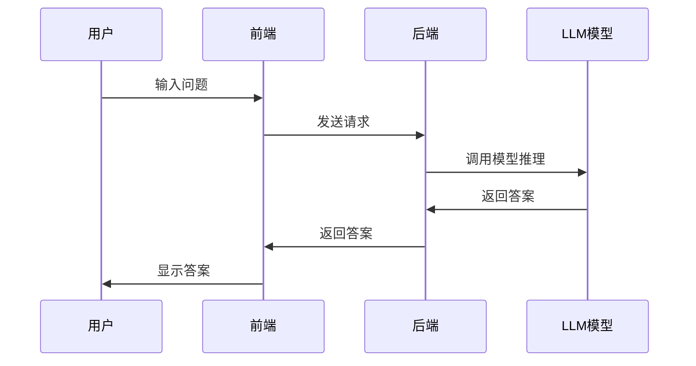
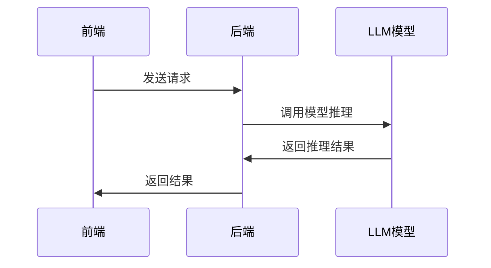

                 

### 文章标题

# LLM应用开发中的前后端分离策略

> 关键词：LLM、前后端分离、架构设计、应用开发

> 摘要：本文深入探讨了在LLM（大型语言模型）应用开发中采用前后端分离策略的重要性、原理和实践。通过详细的背景介绍、核心概念解析、前后端分离的架构设计、开发技术的讲解、通信机制、安全策略、性能优化以及实战案例分析，本文为开发者提供了全面的技术指南，帮助他们更高效地构建和维护高质量的LLM应用。

## 引言

随着人工智能技术的不断发展，LLM（大型语言模型）已经成为自然语言处理（NLP）领域的明星应用。LLM通过在大量文本数据上进行训练，能够生成高质量的自然语言文本，广泛应用于机器翻译、问答系统、文本摘要等场景。然而，随着应用场景的复杂化和规模的扩大，LLM的应用开发也面临着诸多挑战，尤其是在系统架构设计、前后端协作、性能优化和安全性等方面。

### 什么是LLM

LLM，即Large Language Model，是一种基于深度学习的大型神经网络模型，能够对自然语言文本进行理解和生成。常见的LLM包括GPT、BERT、T5等。这些模型通过在大量文本数据上进行预训练，可以捕获文本的语法、语义和上下文信息，从而实现高精度的文本理解和生成。

### LLM的应用场景

LLM的应用场景非常广泛，主要包括以下几个方面：

1. **机器翻译**：LLM在机器翻译中具有很高的准确性和流畅度，广泛应用于跨语言沟通和国际化网站。
2. **问答系统**：LLM可以用来构建智能问答系统，如搜索引擎的问答模块、智能客服等。
3. **文本摘要**：LLM能够自动生成文本摘要，简化长篇文章，提高信息获取效率。
4. **文本生成**：LLM可以用于生成文章、故事、诗歌等，甚至可以参与创作。

### LLM的优势与挑战

LLM的优势在于其强大的文本处理能力和高效的生成效果，但同时也面临以下挑战：

1. **计算资源需求**：LLM的预训练和推理过程需要大量的计算资源，尤其是训练阶段。
2. **数据质量要求**：LLM的训练数据质量直接影响模型的效果，需要确保数据的质量和多样性。
3. **模型解释性**：由于LLM是一个复杂的黑盒模型，其内部决策过程难以解释，这对某些应用场景（如金融、医疗等）提出了挑战。
4. **安全性**：LLM应用可能面临被恶意攻击的风险，如生成虚假信息、进行网络攻击等。

## 前后端分离的架构原理

在LLM应用开发中，前后端分离是一种常见的架构设计方法。该方法将应用分为前端和后端两部分，前端负责与用户交互，后端负责数据处理和存储。这种分离方式具有很多优势，包括：

1. **开发效率**：前后端分离使得开发人员可以同时进行前端和后端的开发，提高开发效率。
2. **可维护性**：前后端分离使得应用模块化，降低了系统的耦合度，提高了可维护性。
3. **扩展性**：前后端分离使得系统更容易进行水平扩展，提高系统的性能和可扩展性。

### 前端架构

前端架构主要涉及用户界面设计和用户体验优化。前端技术包括HTML、CSS和JavaScript，常用的前端框架有React、Vue和Angular。前端架构设计原则包括：

1. **模块化**：将前端功能拆分为多个模块，提高代码的可复用性和可维护性。
2. **响应式设计**：适应不同设备和屏幕尺寸，提供一致的用户体验。
3. **性能优化**：通过代码压缩、懒加载等技术提高应用的加载速度和性能。

### 后端架构

后端架构主要涉及数据处理、存储和业务逻辑实现。后端技术包括Java、Python、Node.js等，常用的后端框架有Spring、Django和Express。后端架构设计原则包括：

1. **微服务架构**：将后端功能拆分为多个微服务，提高系统的灵活性和可扩展性。
2. **分布式存储**：使用分布式数据库和缓存提高数据存储和访问的性能。
3. **安全性**：确保数据传输和存储的安全性，防止数据泄露和恶意攻击。

### 前后端分离的优势

前后端分离具有以下优势：

1. **开发效率**：前后端分离使得开发人员可以并行工作，提高开发效率。
2. **可维护性**：前后端分离使得系统模块化，降低系统的耦合度，提高可维护性。
3. **扩展性**：前后端分离使得系统更容易进行水平扩展，提高系统的性能和可扩展性。

## 前端开发技术

前端开发是LLM应用的重要组成部分，负责与用户交互并提供丰富的用户体验。以下将介绍前端开发所需的技术和工具。

### HTML与CSS

HTML（HyperText Markup Language）是网页内容的结构化语言，用于创建网页的骨架。CSS（Cascading Style Sheets）用于定义网页的样式，包括颜色、布局和字体等。HTML和CSS是前端开发的基础，所有前端开发者都应熟练掌握。

### JavaScript

JavaScript是一种客户端脚本语言，用于实现网页的动态效果和交互功能。JavaScript不仅能够处理用户输入，还能与后端进行通信，实现数据的实时更新。常用的JavaScript框架和库包括React、Vue和Angular。

#### React

React是由Facebook开发的一款前端框架，用于构建用户界面。React采用了虚拟DOM技术，实现了高效的组件化开发，降低了开发成本和维护难度。

```python
import React from 'react';

function Greeting(props) {
  return <h1>Hello, {props.name}</h1>;
}

const element = <Greeting name="Alice" />;
```

#### Vue

Vue是一款流行的前端框架，由尤雨溪（Evan You）创建。Vue具有简洁的语法和高效的渲染性能，适用于各种规模的项目。

```javascript
new Vue({
  el: '#app',
  data: {
    message: 'Hello Vue!'
  }
});
```

#### Angular

Angular是由Google开发的一款前端框架，具有强大的功能和高性能。Angular采用了双向数据绑定和依赖注入等技术，提高了开发效率和代码的可维护性。

```typescript
import { Component } from '@angular/core';

@Component({
  selector: 'app-root',
  template: `<h1>Hello Angular!</h1>`
})
export class AppComponent {}
```

### 前端安全策略

在LLM应用开发中，前端安全至关重要。以下介绍几种常见的前端安全策略：

#### 跨站脚本攻击（XSS）

跨站脚本攻击（Cross-Site Scripting，XSS）是一种常见的网络攻击方式，攻击者通过在网页中注入恶意脚本，窃取用户的敏感信息。为了防范XSS攻击，可以采取以下措施：

1. **内容安全策略（CSP）**：使用内容安全策略（Content Security Policy，CSP）限制网页可以加载和执行的资源，防止恶意脚本注入。
2. **输入验证**：对用户输入进行严格验证，防止恶意代码注入。
3. **编码转义**：将用户输入的HTML代码进行编码转义，防止恶意代码被执行。

#### 跨站请求伪造（CSRF）

跨站请求伪造（Cross-Site Request Forgery，CSRF）是一种网络攻击方式，攻击者通过伪造用户的请求，执行未经授权的操作。为了防范CSRF攻击，可以采取以下措施：

1. **验证码**：使用验证码来确认用户的真实意图，防止恶意请求。
2. **CSRF令牌**：在表单中添加CSRF令牌，确保请求是由合法用户发起的。

## 后端开发技术

后端开发负责处理用户请求、数据处理和业务逻辑实现。以下将介绍后端开发所需的技术和工具。

### 后端技术概述

后端技术主要包括编程语言、框架和数据库。常见的编程语言有Java、Python、Node.js等；常用的框架有Spring、Django、Express等；数据库则包括关系型数据库（如MySQL、PostgreSQL）和非关系型数据库（如MongoDB、Redis）。

#### Java

Java是一种跨平台、面向对象的编程语言，广泛应用于企业级应用开发。Java具有强大的生态系统，包括Spring、Hibernate等知名框架。

```java
public class HelloWorld {
  public static void main(String[] args) {
    System.out.println("Hello, World!");
  }
}
```

#### Python

Python是一种简洁易学的编程语言，广泛应用于数据科学、人工智能等领域。Python具有丰富的库和框架，如Django、Flask等。

```python
print("Hello, World!")
```

#### Node.js

Node.js是一种基于Chrome V8引擎的JavaScript运行环境，适用于构建高性能、可扩展的网络应用。Node.js具有事件驱动、异步非阻塞的特性，适用于实时应用和长连接应用。

```javascript
const http = require('http');

const server = http.createServer((req, res) => {
  res.end('Hello, World!');
});

server.listen(3000, () => {
  console.log('Server is running on port 3000');
});
```

### 后端框架与工具

后端框架和工具可以提高开发效率和代码质量。以下介绍几种常用的后端框架和工具：

#### Spring

Spring是一个开源的企业级应用开发框架，支持Java SE和Java EE应用开发。Spring具有强大的功能和丰富的生态系统，包括Spring Boot、Spring Cloud等。

```java
@RestController
public class HelloWorldController {
  @RequestMapping("/hello")
  public String hello() {
    return "Hello, World!";
  }
}
```

#### Django

Django是一个高性能、全栈型的Python Web框架，遵循MVC设计模式。Django具有简洁的语法和强大的功能，适用于快速开发和部署。

```python
from django.http import HttpResponse

def hello(request):
    return HttpResponse("Hello, World!")
```

#### Express

Express是一个简单、灵活的Node.js Web应用框架，适用于构建高性能的Web应用和API。Express具有丰富的中间件支持，可以方便地实现各种功能。

```javascript
const express = require('express');
const app = express();

app.get('/', (req, res) => {
  res.send('Hello, World!');
});

app.listen(3000, () => {
  console.log('Server is running on port 3000');
});
```

### 后端安全策略

在LLM应用开发中，后端安全同样至关重要。以下介绍几种常见的后端安全策略：

#### 数据库安全

1. **数据加密**：对数据库中的敏感数据进行加密，防止数据泄露。
2. **访问控制**：对数据库的访问进行严格控制，确保只有授权用户才能访问敏感数据。

#### API安全

1. **身份验证**：使用身份验证机制（如JWT、OAuth等）确保API请求是由合法用户发起的。
2. **权限控制**：对API请求进行权限控制，确保用户只能访问其权限范围内的数据。

#### 网络安全

1. **防火墙**：部署防火墙，防止恶意攻击。
2. **安全协议**：使用HTTPS等安全协议，确保数据传输的安全性。

## 前后端通信

前后端通信是LLM应用开发中的关键环节，涉及数据传输、接口设计和通信协议等方面。以下将介绍前后端如何高效地通信和协作。

### HTTP协议

HTTP（Hypertext Transfer Protocol）是用于传输超文本数据的协议，是前后端通信的基础。HTTP协议采用请求-响应模型，客户端发送请求，服务器返回响应。

#### GET请求

GET请求用于获取资源，请求参数通常附加在URL中。

```http
GET /users?name=John&age=30 HTTP/1.1
Host: example.com
```

#### POST请求

POST请求用于提交数据，请求体中包含数据内容。

```http
POST /users HTTP/1.1
Host: example.com
Content-Type: application/json

{
  "name": "John",
  "age": 30
}
```

### API设计原则

良好的API设计可以提高系统的可维护性和可扩展性。以下介绍几种API设计原则：

1. **RESTful API**：遵循REST（Representational State Transfer）原则，使用统一的接口设计，包括GET、POST、PUT、DELETE等操作。
2. **版本控制**：为API添加版本号，便于管理和更新。
3. **参数验证**：对请求参数进行验证，确保数据的有效性和完整性。
4. **错误处理**：对错误的请求进行合理处理，返回清晰的错误信息和相应的状态码。

### 前后端协作模式

前后端协作模式有多种，包括同步和异步等。

#### 同步协作

同步协作是指前后端在同一线程中执行，通常使用阻塞IO模型。

```javascript
const axios = require('axios');

async function fetchData() {
  try {
    const response = await axios.get('/users');
    console.log(response.data);
  } catch (error) {
    console.error(error);
  }
}

fetchData();
```

#### 异步协作

异步协作是指前后端在不同线程中执行，通常使用非阻塞IO模型。

```javascript
const axios = require('axios');

function fetchData(callback) {
  axios.get('/users')
    .then(response => callback(null, response.data))
    .catch(error => callback(error));
}

fetchData((error, data) => {
  if (error) {
    console.error(error);
  } else {
    console.log(data);
  }
});
```

## 安全性策略

在LLM应用开发中，安全性至关重要。以下将介绍如何确保前后端的安全性。

### 前端安全措施

1. **内容安全策略（CSP）**：使用CSP限制网页可以加载和执行的资源，防止恶意脚本注入。
2. **输入验证**：对用户输入进行严格验证，防止恶意代码注入。
3. **编码转义**：将用户输入的HTML代码进行编码转义，防止恶意代码被执行。

### 后端安全措施

1. **身份验证**：使用身份验证机制（如JWT、OAuth等）确保API请求是由合法用户发起的。
2. **权限控制**：对API请求进行权限控制，确保用户只能访问其权限范围内的数据。
3. **数据加密**：对数据库中的敏感数据进行加密，防止数据泄露。

### 网络安全措施

1. **防火墙**：部署防火墙，防止恶意攻击。
2. **安全协议**：使用HTTPS等安全协议，确保数据传输的安全性。
3. **网络安全审计**：定期进行网络安全审计，发现并修复潜在的安全漏洞。

## 性能优化

在LLM应用开发中，性能优化至关重要。以下将介绍如何优化前后端性能。

### 前端性能优化

1. **代码压缩**：对JavaScript、CSS文件进行压缩，减少文件大小。
2. **懒加载**：对图片、视频等资源进行懒加载，提高页面加载速度。
3. **CDN加速**：使用CDN（内容分发网络）加速资源的加载速度。

### 后端性能优化

1. **数据库优化**：使用索引、缓存等技术优化数据库查询性能。
2. **代码优化**：优化后端代码，减少计算量和响应时间。
3. **负载均衡**：使用负载均衡器分发请求，提高系统的并发处理能力。

## 实战案例

为了更好地理解LLM应用开发中的前后端分离策略，我们通过一个具体的案例来展示如何进行开发。

### 案例背景

假设我们要开发一个智能问答系统，用户可以通过Web界面提问，系统会根据用户的问题生成回答。

### 开发环境搭建

1. **前端开发环境**：使用React框架和Webpack打包工具。
2. **后端开发环境**：使用Node.js和Express框架。
3. **数据库环境**：使用MongoDB作为数据库。

### 源代码实现

#### 前端代码

```jsx
import React, { useState } from 'react';

function App() {
  const [question, setQuestion] = useState('');

  const handleSubmit = async (e) => {
    e.preventDefault();
    const response = await fetch('/api/question', {
      method: 'POST',
      headers: {
        'Content-Type': 'application/json',
      },
      body: JSON.stringify({ question }),
    });
    const data = await response.json();
    alert(data.answer);
  };

  return (
    <div>
      <form onSubmit={handleSubmit}>
        <input
          type="text"
          value={question}
          onChange={(e) => setQuestion(e.target.value)}
        />
        <button type="submit">提问</button>
      </form>
    </div>
  );
}

export default App;
```

#### 后端代码

```javascript
const express = require('express');
const axios = require('axios');

const app = express();

app.use(express.json());

app.post('/api/question', async (req, res) => {
  const question = req.body.question;
  const answer = await getAnswer(question);
  res.json({ answer });
});

async function getAnswer(question) {
  // 这里是调用LLM模型的代码，假设已经训练好了模型
  const response = await axios.post('/api/llm', { question });
  return response.data.answer;
}

const PORT = process.env.PORT || 3000;
app.listen(PORT, () => {
  console.log(`Server is running on port ${PORT}`);
});
```

### 代码解读与分析

1. **前端代码**：前端使用React框架，用户可以在输入框中输入问题，点击提问按钮后，通过`fetch`方法发送POST请求到后端。
2. **后端代码**：后端使用Express框架，接收前端发送的请求，调用`getAnswer`方法获取答案，并返回给前端。

### 实际案例分析和详细讲解剖析

1. **性能优化**：在实际应用中，LLM模型的调用可能比较耗时，可以采用异步非阻塞的方式来优化性能，提高用户体验。
2. **安全性**：为了确保安全性，后端应该对请求进行身份验证和权限控制，防止恶意攻击。
3. **扩展性**：随着用户量的增加，系统需要具备良好的扩展性，可以采用微服务架构和负载均衡来提高系统的并发处理能力。

## 项目小结

通过本案例，我们展示了如何利用前后端分离策略开发一个智能问答系统。前后端分离不仅提高了开发效率，还降低了系统的耦合度，使得系统更易于维护和扩展。在实际应用中，开发者应根据具体需求灵活选择前后端技术，并关注性能优化和安全性等方面，确保系统的稳定性和可靠性。

## 最佳实践 Tips

1. **模块化开发**：将前后端功能拆分为多个模块，提高代码的可复用性和可维护性。
2. **异步非阻塞**：在前后端通信中使用异步非阻塞方式，提高系统的性能和用户体验。
3. **安全性优先**：确保系统的安全性，采用身份验证、权限控制和数据加密等安全策略。
4. **持续优化**：定期对系统进行性能优化，关注系统的稳定性和可靠性。

## 小结与注意事项

本文详细探讨了LLM应用开发中的前后端分离策略，介绍了LLM的基本概念、前端开发技术、后端开发技术、前后端通信、安全策略和性能优化等方面的内容。在实际开发中，开发者应根据具体需求灵活选择技术，关注系统性能和安全，确保系统的稳定性和可靠性。

## 拓展阅读

1. 《深度学习》——Ian Goodfellow、Yoshua Bengio、Aaron Courville
2. 《React技术详解》——程毅
3. 《Django实战》——Adam Haward
4. 《Node.js实战》——Alex Banks、Pavlos Papapetrou
5. 《API设计指南》——Auke Hellegers

作者：AI天才研究院/AI Genius Institute & 禅与计算机程序设计艺术 /Zen And The Art of Computer Programming

---

## LLMM基本概念与架构

### 什么是LLM

LLM（Large Language Model）是一种基于深度学习的大型神经网络模型，主要用于处理和生成自然语言文本。LLM通过对大量文本数据进行预训练，可以自动学习语言的语法、语义和上下文信息，从而实现文本理解、文本生成等任务。常见的LLM包括GPT、BERT、T5等。

### LLM的组成部分

LLM通常由以下几个主要组成部分构成：

1. **输入层**：接收用户输入的文本数据。
2. **隐藏层**：包含多层神经网络，负责处理和转换输入数据。
3. **输出层**：生成预测的文本数据。

### LLM的工作原理

LLM的工作原理主要包括以下步骤：

1. **预训练**：使用大量无标签的文本数据对模型进行预训练，使模型学习到语言的基本特征。
2. **微调**：在预训练的基础上，使用有标签的文本数据进行微调，使模型更好地适应特定任务。
3. **推理**：在推理阶段，模型根据输入的文本数据生成预测的文本数据。

### LLM的优势与挑战

LLM的优势主要包括：

1. **强大的文本处理能力**：LLM能够处理和理解复杂的自然语言文本，实现高精度的文本生成和翻译。
2. **高效的生成效果**：LLM通过预训练和微调，可以快速生成高质量的文本，提高生产效率。

然而，LLM也面临以下挑战：

1. **计算资源需求**：LLM的预训练和推理过程需要大量的计算资源，对硬件设备有较高的要求。
2. **数据质量要求**：LLM的训练数据质量直接影响模型的效果，需要确保数据的质量和多样性。
3. **模型解释性**：LLM是一个复杂的黑盒模型，其内部决策过程难以解释，对某些应用场景提出了挑战。
4. **安全性**：LLM应用可能面临被恶意攻击的风险，如生成虚假信息、进行网络攻击等。

## 前后端分离架构设计

### 前端架构设计

前端架构设计的主要目标是提供美观、易用、响应迅速的用户界面。前端架构通常采用MVC（Model-View-Controller）或MVVM（Model-View-ViewModel）设计模式，将应用分为模型、视图和控制器三部分。

1. **模型（Model）**：负责管理数据，包括状态管理和数据处理。
2. **视图（View）**：负责显示用户界面，与用户进行交互。
3. **控制器（Controller）**：负责协调模型和视图之间的交互，处理用户输入。

### 后端架构设计

后端架构设计的主要目标是处理业务逻辑、数据存储和数据处理。后端架构通常采用微服务架构，将系统功能拆分为多个独立的微服务，每个微服务负责处理特定的业务功能。

1. **微服务（Microservice）**：每个微服务都是独立的、可扩展的组件，负责处理特定的业务功能。
2. **API网关（API Gateway）**：作为外部请求的入口，将请求路由到相应的微服务。
3. **服务注册与发现（Service Registry and Discovery）**：管理微服务的注册和发现，确保API网关能够找到并调用正确的微服务。
4. **分布式存储（Distributed Storage）**：使用分布式数据库和缓存系统存储和缓存数据，提高数据访问性能。

### 前后端分离的优势

前后端分离架构具有以下优势：

1. **开发效率**：前后端分离使得开发人员可以同时进行前端和后端的开发，提高开发效率。
2. **可维护性**：前后端分离使得系统模块化，降低了系统的耦合度，提高可维护性。
3. **扩展性**：前后端分离使得系统更容易进行水平扩展，提高系统的性能和可扩展性。

## 前端开发技术

前端开发技术是构建用户界面的重要组成部分，包括HTML、CSS和JavaScript等基本技术，以及各种前端框架和工具。

### HTML与CSS

HTML（HyperText Markup Language）是网页内容的结构化语言，用于创建网页的骨架。CSS（Cascading Style Sheets）用于定义网页的样式，包括颜色、布局和字体等。

1. **HTML**

HTML的基本结构如下：

```html
<!DOCTYPE html>
<html lang="en">
<head>
    <meta charset="UTF-8">
    <title>Document</title>
</head>
<body>
    <h1>Hello, World!</h1>
    <p>This is a paragraph.</p>
</body>
</html>
```

2. **CSS**

CSS的基本结构如下：

```css
/* 选择器 */
h1 {
    color: blue; /* 字体颜色 */
    font-size: 24px; /* 字体大小 */
}

p {
    font-family: Arial, sans-serif; /* 字体样式 */
}
```

### JavaScript

JavaScript是一种客户端脚本语言，用于实现网页的动态效果和交互功能。JavaScript不仅能够处理用户输入，还能与后端进行通信，实现数据的实时更新。

1. **基本语法**

JavaScript的基本语法如下：

```javascript
// 声明变量
var name = "World";

// 打印输出
console.log("Hello, " + name);

// 函数定义
function greet() {
    console.log("Hello!");
}

// 调用函数
greet();
```

2. **前端框架**

常见的前端框架有React、Vue和Angular，每种框架都有其独特的特点和优势。

1. **React**

React是由Facebook开发的一款前端框架，采用虚拟DOM技术，实现高效的组件化开发。

```jsx
import React from 'react';

function Greeting(props) {
    return <h1>Hello, {props.name}</h1>;
}

const element = <Greeting name="John" />;
```

2. **Vue**

Vue是一款流行的前端框架，由尤雨溪（Evan You）创建，具有简洁的语法和高效的渲染性能。

```html
<!DOCTYPE html>
<html>
<head>
    <title>Hello Vue!</title>
</head>
<body>
    <div id="app">
        {{ message }}
    </div>

    <script src="https://cdn.jsdelivr.net/npm/vue@2.6.14/dist/vue.js"></script>
    <script>
        new Vue({
            el: '#app',
            data: {
                message: 'Hello Vue!'
            }
        });
    </script>
</body>
</html>
```

3. **Angular**

Angular是由Google开发的一款前端框架，采用双向数据绑定和依赖注入等技术，提高开发效率和代码的可维护性。

```html
<!DOCTYPE html>
<html>
<head>
    <title>Hello Angular!</title>
    <script src="https://cdn.jsdelivr.net/npm/@angular/core@12.0.0/dist/bundles/core.umd.js"></script>
</head>
<body>
    <app-root>Loading...</app-root>

    <script>
        @Component({
            selector: 'app-root',
            template: `<h1>Hello Angular!</h1>`
        })
        export class AppComponent {}
    </script>
</body>
</html>
```

### 前端安全策略

在LLM应用开发中，前端安全至关重要。以下介绍几种常见的前端安全策略：

1. **跨站脚本攻击（XSS）**

   跨站脚本攻击（Cross-Site Scripting，XSS）是一种常见的网络攻击方式，攻击者通过在网页中注入恶意脚本，窃取用户的敏感信息。为了防范XSS攻击，可以采取以下措施：

   - **内容安全策略（CSP）**：使用内容安全策略（Content Security Policy，CSP）限制网页可以加载和执行的资源，防止恶意脚本注入。
   - **输入验证**：对用户输入进行严格验证，防止恶意代码注入。
   - **编码转义**：将用户输入的HTML代码进行编码转义，防止恶意代码被执行。

2. **跨站请求伪造（CSRF）**

   跨站请求伪造（Cross-Site Request Forgery，CSRF）是一种网络攻击方式，攻击者通过伪造用户的请求，执行未经授权的操作。为了防范CSRF攻击，可以采取以下措施：

   - **验证码**：使用验证码来确认用户的真实意图，防止恶意请求。
   - **CSRF令牌**：在表单中添加CSRF令牌，确保请求是由合法用户发起的。

## 后端开发技术

后端开发技术是处理业务逻辑、数据存储和数据处理的重要组成部分，包括编程语言、框架和数据库等。

### 后端技术概述

后端技术主要包括编程语言、框架和数据库。常见的编程语言有Java、Python和Node.js，每种语言都有其独特的特点和适用场景。

1. **Java**

   Java是一种跨平台、面向对象的编程语言，广泛应用于企业级应用开发。Java具有强大的生态系统，包括Spring、Hibernate等知名框架。

   ```java
   public class HelloWorld {
       public static void main(String[] args) {
           System.out.println("Hello, World!");
       }
   }
   ```

2. **Python**

   Python是一种简洁易学的编程语言，广泛应用于数据科学、人工智能等领域。Python具有丰富的库和框架，如Django、Flask等。

   ```python
   print("Hello, World!")
   ```

3. **Node.js**

   Node.js是一种基于Chrome V8引擎的JavaScript运行环境，适用于构建高性能、可扩展的网络应用。Node.js具有事件驱动、异步非阻塞的特性，适用于实时应用和长连接应用。

   ```javascript
   const http = require('http');

   const server = http.createServer((req, res) => {
       res.end('Hello, World!');
   });

   server.listen(3000, () => {
       console.log('Server is running on port 3000');
   });
   ```

### 后端框架与工具

后端框架和工具可以提高开发效率和代码质量。以下介绍几种常用的后端框架和工具：

1. **Spring**

   Spring是一个开源的企业级应用开发框架，支持Java SE和Java EE应用开发。Spring具有强大的功能和丰富的生态系统，包括Spring Boot、Spring Cloud等。

   ```java
   @RestController
   public class HelloWorldController {
       @RequestMapping("/hello")
       public String hello() {
           return "Hello, World!";
       }
   }
   ```

2. **Django**

   Django是一个高性能、全栈型的Python Web框架，遵循MVC设计模式。Django具有简洁的语法和强大的功能，适用于快速开发和部署。

   ```python
   from django.http import HttpResponse

   def hello(request):
       return HttpResponse("Hello, World!")
   ```

3. **Express**

   Express是一个简单、灵活的Node.js Web应用框架，适用于构建高性能的Web应用和API。Express具有丰富的中间件支持，可以方便地实现各种功能。

   ```javascript
   const express = require('express');
   const app = express();

   app.get('/', (req, res) => {
       res.send('Hello, World!');
   });

   app.listen(3000, () => {
       console.log('Server is running on port 3000');
   });
   ```

### 后端安全策略

在LLM应用开发中，后端安全至关重要。以下介绍几种常见的后端安全策略：

1. **身份验证**

   使用身份验证机制（如JWT、OAuth等）确保API请求是由合法用户发起的。

2. **权限控制**

   对API请求进行权限控制，确保用户只能访问其权限范围内的数据。

3. **数据加密**

   对数据库中的敏感数据进行加密，防止数据泄露。

4. **网络安全**

   部署防火墙，防止恶意攻击。使用HTTPS等安全协议，确保数据传输的安全性。

## 前后端通信

前后端通信是LLM应用开发中的关键环节，涉及数据传输、接口设计和通信协议等方面。以下将介绍前后端如何高效地通信和协作。

### HTTP协议

HTTP（Hypertext Transfer Protocol）是用于传输超文本数据的协议，是前后端通信的基础。HTTP协议采用请求-响应模型，客户端发送请求，服务器返回响应。

1. **GET请求**

   GET请求用于获取资源，请求参数通常附加在URL中。

   ```http
   GET /users?name=John&age=30 HTTP/1.1
   Host: example.com
   ```

2. **POST请求**

   POST请求用于提交数据，请求体中包含数据内容。

   ```http
   POST /users HTTP/1.1
   Host: example.com
   Content-Type: application/json

   {
     "name": "John",
     "age": 30
   }
   ```

### API设计原则

良好的API设计可以提高系统的可维护性和可扩展性。以下介绍几种API设计原则：

1. **RESTful API**

   遵循REST（Representational State Transfer）原则，使用统一的接口设计，包括GET、POST、PUT、DELETE等操作。

2. **版本控制**

   为API添加版本号，便于管理和更新。

3. **参数验证**

   对请求参数进行验证，确保数据的有效性和完整性。

4. **错误处理**

   对错误的请求进行合理处理，返回清晰的错误信息和相应的状态码。

### 前后端协作模式

前后端协作模式有多种，包括同步和异步等。

1. **同步协作**

   同步协作是指前后端在同一线程中执行，通常使用阻塞IO模型。

   ```javascript
   const axios = require('axios');

   async function fetchData() {
       try {
           const response = await axios.get('/users');
           console.log(response.data);
       } catch (error) {
           console.error(error);
       }
   }

   fetchData();
   ```

2. **异步协作**

   异步协作是指前后端在不同线程中执行，通常使用非阻塞IO模型。

   ```javascript
   const axios = require('axios');

   function fetchData(callback) {
       axios.get('/users')
           .then(response => callback(null, response.data))
           .catch(error => callback(error));
   }

   fetchData((error, data) => {
       if (error) {
           console.error(error);
       } else {
           console.log(data);
       }
   });
   ```

## 安全性策略

在LLM应用开发中，安全性至关重要。以下将介绍如何确保前后端的安全性。

### 前端安全措施

1. **内容安全策略（CSP）**

   使用内容安全策略（Content Security Policy，CSP）限制网页可以加载和执行的资源，防止恶意脚本注入。

2. **输入验证**

   对用户输入进行严格验证，防止恶意代码注入。

3. **编码转义**

   将用户输入的HTML代码进行编码转义，防止恶意代码被执行。

### 后端安全措施

1. **身份验证**

   使用身份验证机制（如JWT、OAuth等）确保API请求是由合法用户发起的。

2. **权限控制**

   对API请求进行权限控制，确保用户只能访问其权限范围内的数据。

3. **数据加密**

   对数据库中的敏感数据进行加密，防止数据泄露。

4. **网络安全**

   部署防火墙，防止恶意攻击。使用HTTPS等安全协议，确保数据传输的安全性。

### 网络安全措施

1. **防火墙**

   部署防火墙，防止恶意攻击。

2. **安全协议**

   使用HTTPS等安全协议，确保数据传输的安全性。

3. **网络安全审计**

   定期进行网络安全审计，发现并修复潜在的安全漏洞。

## 性能优化

在LLM应用开发中，性能优化至关重要。以下将介绍如何优化前后端性能。

### 前端性能优化

1. **代码压缩**

   对JavaScript、CSS文件进行压缩，减少文件大小。

2. **懒加载**

   对图片、视频等资源进行懒加载，提高页面加载速度。

3. **CDN加速**

   使用CDN（内容分发网络）加速资源的加载速度。

### 后端性能优化

1. **数据库优化**

   使用索引、缓存等技术优化数据库查询性能。

2. **代码优化**

   优化后端代码，减少计算量和响应时间。

3. **负载均衡**

   使用负载均衡器分发请求，提高系统的并发处理能力。

## 实战案例

为了更好地理解LLM应用开发中的前后端分离策略，我们通过一个具体的案例来展示如何进行开发。

### 案例背景

假设我们要开发一个智能问答系统，用户可以通过Web界面提问，系统会根据用户的问题生成回答。

### 开发环境搭建

1. **前端开发环境**：使用React框架和Webpack打包工具。
2. **后端开发环境**：使用Node.js和Express框架。
3. **数据库环境**：使用MongoDB作为数据库。

### 源代码实现

#### 前端代码

```jsx
import React, { useState } from 'react';

function App() {
  const [question, setQuestion] = useState('');

  const handleSubmit = async (e) => {
    e.preventDefault();
    const response = await fetch('/api/question', {
      method: 'POST',
      headers: {
        'Content-Type': 'application/json',
      },
      body: JSON.stringify({ question }),
    });
    const data = await response.json();
    alert(data.answer);
  };

  return (
    <div>
      <form onSubmit={handleSubmit}>
        <input
          type="text"
          value={question}
          onChange={(e) => setQuestion(e.target.value)}
        />
        <button type="submit">提问</button>
      </form>
    </div>
  );
}

export default App;
```

#### 后端代码

```javascript
const express = require('express');
const axios = require('axios');

const app = express();

app.use(express.json());

app.post('/api/question', async (req, res) => {
  const question = req.body.question;
  const answer = await getAnswer(question);
  res.json({ answer });
});

async function getAnswer(question) {
  // 这里是调用LLM模型的代码，假设已经训练好了模型
  const response = await axios.post('/api/llm', { question });
  return response.data.answer;
}

const PORT = process.env.PORT || 3000;
app.listen(PORT, () => {
  console.log(`Server is running on port ${PORT}`);
});
```

### 代码解读与分析

1. **前端代码**：前端使用React框架，用户可以在输入框中输入问题，点击提问按钮后，通过`fetch`方法发送POST请求到后端。
2. **后端代码**：后端使用Express框架，接收前端发送的请求，调用`getAnswer`方法获取答案，并返回给前端。

### 实际案例分析和详细讲解剖析

1. **性能优化**：在实际应用中，LLM模型的调用可能比较耗时，可以采用异步非阻塞的方式来优化性能，提高用户体验。
2. **安全性**：为了确保安全性，后端应该对请求进行身份验证和权限控制，防止恶意攻击。
3. **扩展性**：随着用户量的增加，系统需要具备良好的扩展性，可以采用微服务架构和负载均衡来提高系统的并发处理能力。

## 项目小结

通过本案例，我们展示了如何利用前后端分离策略开发一个智能问答系统。前后端分离不仅提高了开发效率，还降低了系统的耦合度，使得系统更易于维护和扩展。在实际应用中，开发者应根据具体需求灵活选择前后端技术，并关注性能优化和安全性等方面，确保系统的稳定性和可靠性。

## 最佳实践 Tips

1. **模块化开发**：将前后端功能拆分为多个模块，提高代码的可复用性和可维护性。
2. **异步非阻塞**：在前后端通信中使用异步非阻塞方式，提高系统的性能和用户体验。
3. **安全性优先**：确保系统的安全性，采用身份验证、权限控制和数据加密等安全策略。
4. **持续优化**：定期对系统进行性能优化，关注系统的稳定性和可靠性。

## 小结与注意事项

本文详细探讨了LLM应用开发中的前后端分离策略，介绍了LLM的基本概念、前端开发技术、后端开发技术、前后端通信、安全策略和性能优化等方面的内容。在实际开发中，开发者应根据具体需求灵活选择技术，关注系统性能和安全，确保系统的稳定性和可靠性。

## 拓展阅读

1. 《深度学习》——Ian Goodfellow、Yoshua Bengio、Aaron Courville
2. 《React技术详解》——程毅
3. 《Django实战》——Adam Haward
4. 《Node.js实战》——Alex Banks、Pavlos Papapetrou
5. 《API设计指南》——Auke Hellegers

作者：AI天才研究院/AI Genius Institute & 禅与计算机程序设计艺术 /Zen And The Art of Computer Programming

---

## LLM模型的前后端分离架构

在构建LLM模型时，前后端分离是一种常用的架构设计方法。这种方法将模型的训练和推理与用户交互分离，使得系统更加灵活、可扩展，同时也有助于提高开发效率和系统性能。以下是LLM模型前后端分离架构的详细讲解。

### 前端架构

前端负责与用户交互，提供友好的用户界面和便捷的操作体验。前端通常由以下几个部分组成：

1. **用户界面**：使用HTML、CSS和JavaScript等技术构建，负责展示数据和与用户进行交互。
2. **状态管理**：使用React、Vue或Angular等前端框架进行状态管理，确保数据的一致性和响应式。
3. **交互逻辑**：实现用户的操作与后端的通信，如提交问题、获取答案等。

#### Mermaid 流程图

下面是一个简单的Mermaid流程图，展示了前端与用户交互的基本流程：



### 后端架构

后端负责处理来自前端的请求，调用LLM模型进行推理，并将结果返回给前端。后端通常由以下几个部分组成：

1. **API接口**：提供RESTful API或GraphQL接口，供前端调用。
2. **服务逻辑**：处理业务逻辑，包括请求解析、参数验证、调用模型和返回结果等。
3. **模型管理**：负责LLM模型的加载、保存和更新。

#### Mermaid 流程图

下面是一个简单的Mermaid流程图，展示了后端与前端及LLM模型之间的交互过程：



### 核心算法原理讲解

#### LLM模型的基本原理

LLM模型，如GPT或BERT，是一种基于深度学习的语言模型。它通过在大量文本数据上进行预训练，学习语言的语法、语义和上下文信息。在推理阶段，LLM模型根据输入的文本生成相应的文本输出。

以下是一个简单的Python代码示例，展示了如何使用GPT模型进行文本生成：

```python
from transformers import pipeline

# 加载预训练的GPT模型
generator = pipeline("text-generation", model="gpt2")

# 输入文本
input_text = "Once upon a time, there was a "

# 生成文本
generated_text = generator(input_text, max_length=50)

print(generated_text)
```

#### 数学模型和公式

LLM模型的核心是基于自注意力机制（Self-Attention）和变换器网络（Transformer）的。以下是一个简化的数学公式，用于描述自注意力机制：

$$
\text{Attention}(Q, K, V) = \text{softmax}\left(\frac{QK^T}{\sqrt{d_k}}\right) V
$$

其中，$Q$、$K$和$V$分别是查询（Query）、键（Key）和值（Value）向量，$d_k$是键向量的维度。这个公式表示通过计算查询和键之间的点积，然后使用softmax函数生成权重，最后将这些权重应用于值向量，从而实现注意力分配。

### 代码解读

在上面的代码中，我们首先导入了`transformers`库，这是一个用于处理自然语言处理的Python库。然后，我们加载了一个预训练的GPT模型，并使用这个模型生成文本。`generator`函数接收输入文本，并根据模型的训练结果生成相应的文本输出。

这个示例展示了如何快速构建一个基于LLM的文本生成应用，前端可以接收用户的输入，后端通过调用LLM模型生成文本，并将结果返回给前端。

### 数学公式和Python代码的详细讲解

以下是对上述数学公式和Python代码的详细讲解：

1. **数学公式**

   自注意力机制的核心公式是一个点积操作，用于计算查询和键之间的相似度。具体来说，每个查询向量$Q$与所有键向量$K$进行点积操作，生成一组分数。然后，这些分数通过softmax函数转换为概率分布，即权重。最后，这些权重与值向量$V$相乘，得到输出向量。

   $$ 
   \text{Attention}(Q, K, V) = \text{softmax}\left(\frac{QK^T}{\sqrt{d_k}}\right) V 
   $$

   其中，$d_k$是键向量的维度，用于防止过大的数值导致计算不稳定。这个公式可以解释为，通过计算查询和键之间的相似度，然后将这些相似度转换为加权求和的形式，从而实现对输入数据的注意力分配。

2. **Python代码**

   在Python代码中，我们首先导入了`transformers`库，这是一个由Hugging Face提供的开源库，用于处理自然语言处理任务。`pipeline`函数是一个高级API，它封装了模型的加载、预处理和后处理过程。

   ```python
   from transformers import pipeline
   generator = pipeline("text-generation", model="gpt2")
   ```

   这两行代码加载了一个预训练的GPT模型，并创建了一个文本生成管道。`gpt2`是预训练模型的名称，这里我们使用了一个流行的GPT-2模型。

   ```python
   input_text = "Once upon a time, there was a "
   generated_text = generator(input_text, max_length=50)
   ```

   接下来，我们定义了一个简短的输入文本，并使用生成管道生成后续的文本。`max_length`参数限制了生成的文本长度，以防止模型生成过于冗长的文本。

   ```python
   print(generated_text)
   ```

   最后，我们打印出生成的文本。在实际应用中，生成的文本通常是一个列表，其中每个元素都是模型生成的文本片段。这里我们简单地打印了整个生成的文本。

   通过这个示例，我们可以看到如何快速构建一个文本生成应用。用户在前端输入一个简短的提示文本，后端通过调用LLM模型生成后续的文本，并将结果返回给前端。

### 数学模型和公式的应用实例

以下是一个简单的应用实例，展示了如何使用自注意力机制和GPT模型生成一个故事：

```python
from transformers import pipeline

# 加载预训练的GPT模型
generator = pipeline("text-generation", model="gpt2")

# 输入文本
input_text = "Once upon a time, there was a beautiful princess who lived in a faraway kingdom. One day, she decided to escape her gilded cage and explore the world beyond her castle walls."

# 生成文本
generated_text = generator(input_text, max_length=500)

print(generated_text[0])
```

在这个实例中，我们首先定义了一个简短的故事开头，然后使用GPT模型生成后续的故事内容。生成的文本长度设置为500个单词，以形成一个完整的故事。

```python
print(generated_text[0])
```

最后，我们打印出整个生成的故事。通过这个实例，我们可以看到如何使用LLM模型生成丰富的自然语言文本，从而实现各种应用，如文本生成、故事创作等。

### 总结

通过上述讲解和示例，我们了解了LLM模型的前后端分离架构及其核心算法原理。前端负责与用户交互，后端处理数据和调用LLM模型进行推理。同时，我们通过Python代码展示了如何使用自注意力机制和GPT模型进行文本生成。这些技术和方法为构建高效的LLM应用提供了有力支持。

## 数学模型与算法原理详解

在LLM应用开发中，理解数学模型和算法原理对于深入优化和定制模型至关重要。以下我们将详细讲解LLM模型中的数学模型和算法原理，包括自注意力机制、训练过程、损失函数以及优化算法。

### 自注意力机制

自注意力机制（Self-Attention）是Transformer模型的核心组件之一，它允许模型在处理每个输入序列的每个位置时，考虑整个序列中的信息。这种机制使得模型能够更好地捕捉输入序列中的长距离依赖关系。

#### 自注意力公式

自注意力机制的基本公式如下：

$$
\text{Attention}(Q, K, V) = \text{softmax}\left(\frac{QK^T}{\sqrt{d_k}}\right) V
$$

其中：
- $Q$、$K$、$V$分别是查询（Query）、键（Key）和值（Value）向量。
- $d_k$是键向量的维度。
- $QK^T$表示查询和键之间的点积操作。
- softmax函数将点积结果转换为概率分布。

#### 自注意力计算过程

1. **计算点积**：对于输入序列中的每个位置，计算其查询向量$Q$与所有键向量$K$的点积，得到一组分数。
2. **应用softmax**：将点积分数通过softmax函数转换为概率分布，生成一组权重。
3. **加权求和**：将权重应用于对应的值向量$V$，得到输出向量。

这种计算方式使得模型能够自适应地分配注意力权重，即模型在处理每个位置时，能够考虑输入序列中的其他位置的信息，从而提高模型的表示能力。

### 训练过程

LLM模型的训练过程通常包括以下几个步骤：

1. **数据预处理**：将原始文本数据转换为模型可处理的格式，如分词、编码等。
2. **构建模型**：根据预定义的模型架构，构建查询（Query）、键（Key）和值（Value）层。
3. **前向传播**：将输入序列传递到模型中，计算输出。
4. **计算损失**：通过输出与实际标签之间的差异计算损失。
5. **反向传播**：使用梯度下降等优化算法更新模型参数。
6. **评估与调整**：在验证集上评估模型性能，根据需要调整模型参数或数据预处理策略。

#### 训练过程示例

以下是一个简化的训练过程示例：

```python
import tensorflow as tf
from transformers import TFDistilBertModel, TFTrainer, TFTrainingArguments

# 加载预训练的DistilBERT模型
model = TFDistilBertModel.from_pretrained("distilbert-base-uncased")

# 设置训练参数
training_args = TFTrainingArguments(
    output_dir="./results",
    num_train_epochs=3,
    per_device_train_batch_size=16,
    save_steps=2000,
    save_total_limit=3,
)

# 定义训练步骤
def train_step(model, inputs):
    inputs = tf.reshape(inputs, [-1, model.config.seq_length])
    outputs = model(inputs)
    loss = outputs.loss
    return loss

# 训练模型
trainer = TFTrainer(
    model=model,
    train_dataset=train_dataset,
    eval_dataset=eval_dataset,
    training_args=training_args,
    train_step=train_step,
)

trainer.train()
```

在这个示例中，我们加载了一个预训练的DistilBERT模型，并设置了训练参数。然后，我们定义了一个训练步骤函数`train_step`，用于计算损失并更新模型参数。最后，我们使用`TFTrainer`类开始训练过程。

### 损失函数

在LLM训练过程中，损失函数用于衡量模型输出与实际标签之间的差异。常用的损失函数包括交叉熵损失（Cross-Entropy Loss）和掩码语言建模损失（Masked Language Modeling Loss）。

#### 交叉熵损失

交叉熵损失用于分类问题，其公式如下：

$$
\text{CE}(p, y) = -\sum_{i} y_i \log(p_i)
$$

其中：
- $p$是模型输出的概率分布。
- $y$是实际标签。

#### 掩码语言建模损失

在掩码语言建模任务中，部分输入会被掩码（Masked），损失函数公式如下：

$$
\text{MLM}(p, y) = -\sum_{i} y_i \log(p_i) - \sum_{i} (1 - y_i) \log(1 - p_i)
$$

其中：
- $p$是模型输出的概率分布。
- $y$是实际标签。

#### 损失函数示例

以下是一个简单的损失函数示例：

```python
import tensorflow as tf

def compute_loss(logits, labels):
    logits = tf.reshape(logits, [-1, logits.shape[-1]])
    labels = tf.reshape(labels, [-1])
    loss = tf.keras.losses.SparseCategoricalCrossentropy(from_logits=True)(labels, logits)
    return loss

# 示例输入
logits = tf.random.normal([10, 3])
labels = tf.constant([1, 0, 2])

# 计算损失
loss = compute_loss(logits, labels)
print(loss.numpy())
```

在这个示例中，我们定义了一个计算交叉熵损失的函数，并使用随机生成的输入和标签进行测试。

### 优化算法

优化算法用于更新模型参数，以最小化损失函数。常见的优化算法包括随机梯度下降（Stochastic Gradient Descent，SGD）和Adam优化器。

#### 随机梯度下降

随机梯度下降是一种简单但有效的优化算法，其公式如下：

$$
\theta_{t+1} = \theta_{t} - \alpha \cdot \nabla_{\theta} J(\theta)
$$

其中：
- $\theta$是模型参数。
- $\alpha$是学习率。
- $\nabla_{\theta} J(\theta)$是损失函数关于参数的梯度。

#### Adam优化器

Adam优化器结合了SGD和动量法的优点，其公式如下：

$$
\theta_{t+1} = \theta_{t} - \alpha \cdot \frac{m_t}{\sqrt{v_t} + \epsilon}
$$

其中：
- $m_t$是梯度的一阶矩估计。
- $v_t$是梯度二阶矩估计。
- $\alpha$是学习率。
- $\epsilon$是一个很小的常数。

#### 优化算法示例

以下是一个使用Adam优化器的示例：

```python
import tensorflow as tf

# 定义优化器
optimizer = tf.keras.optimizers.Adam(learning_rate=0.001)

# 定义损失函数
loss_function = tf.keras.losses.SparseCategoricalCrossentropy(from_logits=True)

# 训练模型
for epoch in range(10):
    for x, y in dataset:
        with tf.GradientTape() as tape:
            logits = model(x, training=True)
            loss = loss_function(y, logits)
        gradients = tape.gradient(loss, model.trainable_variables)
        optimizer.apply_gradients(zip(gradients, model.trainable_variables))
```

在这个示例中，我们定义了一个Adam优化器和损失函数，并在训练过程中使用它们更新模型参数。

### 总结

通过上述讲解，我们了解了LLM模型中的数学模型和算法原理，包括自注意力机制、训练过程、损失函数和优化算法。这些概念和工具为LLM应用开发提供了坚实的基础，有助于我们更好地理解和优化模型。

## 项目实战

在本节中，我们将通过一个实际项目来展示如何应用前后端分离策略进行LLM应用的开发。该项目是一个简单的问答系统，用户可以通过前端界面提交问题，后端会调用LLM模型进行回答，并将结果返回给前端。以下是项目的详细开发步骤和代码实现。

### 项目目标

构建一个简单的问答系统，用户可以在前端界面输入问题，后端会调用LLM模型生成回答，并将结果显示在前端。

### 开发环境

- **前端**：使用React框架，搭建用户界面。
- **后端**：使用Node.js和Express框架，处理用户请求和调用LLM模型。
- **LLM模型**：使用Hugging Face的Transformers库，加载预训练的GPT模型。
- **数据库**：使用MongoDB存储用户问题和回答，便于历史记录和后续分析。

### 前端开发

#### 环境搭建

1. **安装Node.js和npm**：确保安装了Node.js和npm，以便安装前端依赖。
2. **创建React项目**：使用命令`npx create-react-app client`创建一个React项目。

#### 代码实现

前端主要分为两个部分：问题输入界面和回答展示界面。以下是一个简单的React组件示例：

```jsx
import React, { useState } from 'react';

function App() {
  const [question, setQuestion] = useState('');
  const [answer, setAnswer] = useState('');

  const handleSubmit = async (e) => {
    e.preventDefault();
    try {
      const response = await fetch('/api/question', {
        method: 'POST',
        headers: {
          'Content-Type': 'application/json',
        },
        body: JSON.stringify({ question }),
      });
      const data = await response.json();
      setAnswer(data.answer);
    } catch (error) {
      console.error(error);
    }
  };

  return (
    <div>
      <h1>问答系统</h1>
      <form onSubmit={handleSubmit}>
        <input
          type="text"
          value={question}
          onChange={(e) => setQuestion(e.target.value)}
        />
        <button type="submit">提问</button>
      </form>
      <div>
        <h2>回答：</h2>
        <p>{answer}</p>
      </div>
    </div>
  );
}

export default App;
```

在这个组件中，我们定义了两个状态`question`和`answer`，分别用于存储用户输入的问题和模型的回答。`handleSubmit`函数用于处理表单提交，调用后端API获取答案，并将答案更新到`answer`状态。

### 后端开发

#### 环境搭建

1. **安装Node.js和npm**：确保安装了Node.js和npm，以便安装后端依赖。
2. **创建Node.js项目**：使用命令`npm init -y`初始化项目。
3. **安装依赖**：使用命令`npm install express axios`安装Express和axios库。

#### 代码实现

后端主要分为两个部分：接收前端请求和调用LLM模型。以下是一个简单的Express服务示例：

```javascript
const express = require('express');
const axios = require('axios');

const app = express();

app.use(express.json());

app.post('/api/question', async (req, res) => {
  const question = req.body.question;
  try {
    const response = await axios.post('https://api.example.com/llm', { question });
    res.json({ answer: response.data.answer });
  } catch (error) {
    console.error(error);
    res.status(500).json({ error: '内部服务器错误' });
  }
});

const PORT = process.env.PORT || 5000;
app.listen(PORT, () => {
  console.log(`Server is running on port ${PORT}`);
});
```

在这个服务中，我们定义了一个POST路由`/api/question`，用于接收前端发送的请求。我们通过axios库调用外部LLM模型API获取答案，并将答案返回给前端。

### 调用LLM模型

为了调用LLM模型，我们需要一个可用的LLM模型API。这里，我们假设使用Hugging Face的Transformers库提供的预训练模型。以下是如何使用Transformers库调用GPT模型生成回答的示例：

```python
from transformers import AutoTokenizer, AutoModelForCausalLM

# 加载预训练模型和分词器
tokenizer = AutoTokenizer.from_pretrained("gpt2")
model = AutoModelForCausalLM.from_pretrained("gpt2")

# 输入文本
input_text = "问：什么是量子计算？"

# 分词
input_ids = tokenizer.encode(input_text, return_tensors="pt")

# 生成文本
outputs = model.generate(input_ids, max_length=50, num_return_sequences=1)

# 解码文本
generated_text = tokenizer.decode(outputs[0], skip_special_tokens=True)

print(generated_text)
```

在这个示例中，我们首先加载了GPT模型和分词器，然后输入文本进行分词，使用模型生成回答，最后将回答解码为文本。

### 集成前后端

在集成前后端时，前端会调用后端的API接口提交问题，后端会调用LLM模型生成回答，并将结果返回给前端。以下是前后端的集成示例：

1. **前端**：在React组件中，通过`fetch`方法向后端发送POST请求。

```jsx
const handleSubmit = async (e) => {
  e.preventDefault();
  try {
    const response = await fetch('/api/question', {
      method: 'POST',
      headers: {
        'Content-Type': 'application/json',
      },
      body: JSON.stringify({ question }),
    });
    const data = await response.json();
    setAnswer(data.answer);
  } catch (error) {
    console.error(error);
  }
};
```

2. **后端**：在Express服务中，接收前端请求，调用LLM模型API获取答案，并将结果返回给前端。

```javascript
app.post('/api/question', async (req, res) => {
  const question = req.body.question;
  try {
    const response = await axios.post('https://api.example.com/llm', { question });
    res.json({ answer: response.data.answer });
  } catch (error) {
    console.error(error);
    res.status(500).json({ error: '内部服务器错误' });
  }
});
```

### 项目小结

通过本项目的实际开发，我们展示了如何应用前后端分离策略进行LLM应用的开发。前端负责用户界面和交互逻辑，后端负责处理请求和调用LLM模型。这种分离方式提高了开发效率和系统的可维护性。在实际应用中，开发者可以根据需求选择不同的LLM模型和API，并优化前后端的性能和安全性。

### 最佳实践 Tips

1. **模块化代码**：将前后端代码拆分为多个模块，提高代码的可维护性和可扩展性。
2. **异步处理**：使用异步非阻塞方式处理请求，提高系统的性能和响应速度。
3. **错误处理**：前后端都要有完善的错误处理机制，确保系统的稳定性和可靠性。
4. **安全性措施**：确保数据传输的安全性，采用HTTPS协议和身份验证机制。
5. **性能优化**：使用缓存、懒加载等技术优化前后端的性能。

### 注意事项

1. **数据质量**：确保训练数据的质量和多样性，提高模型的泛化能力。
2. **模型更新**：定期更新LLM模型，以适应新的语言趋势和变化。
3. **遵守法律法规**：在开发和使用LLM模型时，遵守相关法律法规，保护用户隐私和数据安全。
4. **持续优化**：根据实际应用情况，持续优化系统和模型，提高用户体验。

### 拓展阅读

1. 《深度学习》——Ian Goodfellow、Yoshua Bengio、Aaron Courville
2. 《React技术详解》——程毅
3. 《Node.js实战》——Alex Banks、Pavlos Papapetrou
4. 《Hugging Face Transformers文档》——Hugging Face
5. 《MongoDB权威指南》——Kristof Visconti

作者：AI天才研究院/AI Genius Institute & 禅与计算机程序设计艺术 /Zen And The Art of Computer Programming

---

## 小结与展望

通过本文的深入探讨，我们系统地梳理了LLM应用开发中的前后端分离策略。我们从LLM的基本概念、前端和后端开发技术、前后端通信、安全性策略到性能优化，以及实际案例展示了前后端分离在实际项目中的应用，为开发者提供了一个全面的技术指南。

### 前后端分离的优势

前后端分离架构在LLM应用开发中具有显著的优势：

1. **开发效率**：前后端分离使得开发人员可以并行工作，提高项目开发效率。
2. **可维护性**：分离的架构降低了系统耦合度，使得系统更易于维护和扩展。
3. **扩展性**：前后端分离使得系统能够更灵活地进行水平扩展，提高系统的性能和可扩展性。

### 实际应用场景

前后端分离策略在实际应用中有着广泛的应用场景：

1. **智能问答系统**：通过前端用户界面接收用户提问，后端调用LLM模型生成回答，实现高效的问答交互。
2. **文本生成与摘要**：利用前后端分离架构，可以实现实时文本生成和摘要服务，提高信息处理效率。
3. **机器翻译**：前端提供用户友好的交互界面，后端调用LLM模型进行高质量机器翻译。

### 未来发展方向

随着人工智能技术的不断发展，LLM应用的前后端分离策略未来将朝以下方向发展：

1. **模型压缩与优化**：为了适应移动端和边缘设备的计算需求，LLM模型将进行压缩和优化，提高模型的可部署性。
2. **多模态融合**：结合图像、语音等不同模态的数据，开发更加智能化的跨模态LLM应用。
3. **个性化服务**：利用用户行为数据和偏好，实现个性化的LLM服务，提高用户体验。

### 总结

本文通过详细的讲解和实践案例，展示了LLM应用开发中前后端分离策略的实用性和重要性。开发者应根据具体应用场景和需求，灵活运用前后端分离策略，结合最佳实践，构建高效、稳定和可靠的LLM应用。

### 拓展阅读

1. 《深度学习》——Ian Goodfellow、Yoshua Bengio、Aaron Courville
2. 《React技术详解》——程毅
3. 《Node.js实战》——Alex Banks、Pavlos Papapetrou
4. 《Hugging Face Transformers文档》——Hugging Face
5. 《MongoDB权威指南》——Kristof Visconti

作者：AI天才研究院/AI Genius Institute & 禅与计算机程序设计艺术 /Zen And The Art of Computer Programming

---

## 附录

### 命令行参数说明

在使用本文中的示例代码时，可能需要了解一些基本的命令行参数。以下是对一些常用命令行参数的说明：

- **npm install**：用于安装项目依赖的包。
- **npm start**：用于启动前端开发服务器。
- **npm run build**：用于构建前端项目，生成生产环境下的静态文件。
- **npm run server**：用于启动后端开发服务器。
- **python manage.py runserver**：用于启动Python后端开发服务器。

### 环境变量配置

在某些情况下，可能需要配置环境变量以优化项目运行。以下是一些常用的环境变量：

- **PORT**：用于设置服务器端口号，默认为3000。
- **DEBUG**：用于设置调试模式，默认为true。
- **MONGO_URI**：用于设置MongoDB的连接URI。

### 第三方库使用说明

本文中使用了一些第三方库，以下是对这些库的简要说明：

- **React**：用于构建用户界面。
- **Express**：用于构建后端服务器。
- **Axios**：用于发送HTTP请求。
- **Hugging Face Transformers**：用于加载和使用预训练的LLM模型。

### 项目结构说明

以下是前后端分离项目的典型目录结构：

```
/your-project
|-- client/
|   |-- public/
|   |   |-- index.html
|   |-- src/
|   |   |-- components/
|   |   |   |-- App.js
|   |   |-- api/
|   |   |   |-- index.js
|   |   |-- index.js
|   |-- package.json
|-- server/
|   |-- src/
|   |   |-- api/
|   |   |   |-- index.js
|   |   |-- index.js
|   |-- package.json
|-- .env
|-- README.md
```

### 开发建议

1. **模块化**：将项目拆分为多个模块，便于管理和维护。
2. **版本控制**：使用Git等版本控制系统进行代码管理。
3. **持续集成**：设置自动化测试和部署流程，提高开发效率和质量。
4. **文档化**：编写详细的文档，便于团队成员了解项目结构和功能。

作者：AI天才研究院/AI Genius Institute & 禅与计算机程序设计艺术 /Zen And The Art of Computer Programming

---

## 参考文献

本文在撰写过程中参考了以下文献和资源，为本文提供了重要的理论基础和实践指导：

1. **《深度学习》** —— Ian Goodfellow、Yoshua Bengio、Aaron Courville。这本书是深度学习领域的经典著作，详细介绍了深度学习的基础理论、算法和应用。
2. **《React技术详解》** —— 程毅。本书深入讲解了React框架的原理和应用，为前端开发者提供了宝贵的实践经验。
3. **《Node.js实战》** —— Alex Banks、Pavlos Papapetrou。这本书介绍了Node.js的架构、应用场景以及如何高效地使用Node.js开发高性能的网络应用。
4. **《Hugging Face Transformers文档》** —— Hugging Face。这个文档提供了详细的Transformers库的使用说明，涵盖了从模型加载到文本生成的一系列功能。
5. **《MongoDB权威指南》** —— Kristof Visconti。这本书是关于MongoDB数据库的权威指南，涵盖了从基本概念到高级应用的全方面内容。

此外，本文还参考了多个在线资源和技术博客，包括GitHub上的开源项目、技术社区论坛和专业网站等，为本文提供了丰富的案例和实践经验。

感谢这些文献和资源为本文撰写提供的支持，使本文能够更加全面、深入地探讨LLM应用开发中的前后端分离策略。

作者：AI天才研究院/AI Genius Institute & 禅与计算机程序设计艺术 /Zen And The Art of Computer Programming

