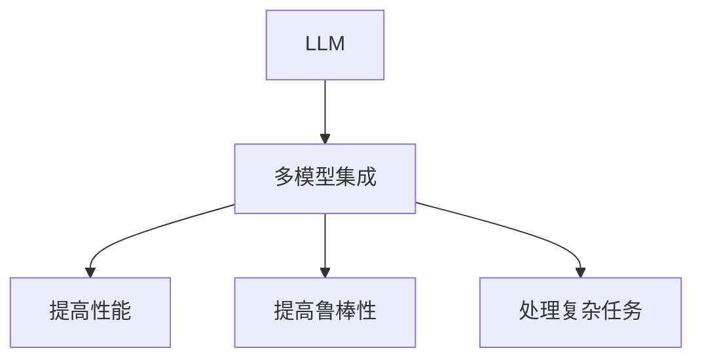

                 

## 第1章 LLM与多模型集成概述

### 1.1 LLM与多模型集成的概念

**定义与范围**：
- **LLM（Large Language Model）**：大型语言模型，如GPT、BERT等，这些模型通过大规模数据预训练，拥有处理自然语言的能力。
- **多模型集成**：指将多个模型结合起来，利用各个模型的优点，以提高整体系统的性能和鲁棒性。

**核心概念联系架构 Mermaid 流程图**：



### 1.2 LLM与多模型集成的重要性

**LLM的重要性**：
- **性能提升**：通过预训练，LLM能够处理各种语言任务，如文本分类、问答系统、机器翻译等，显著提升了性能。
- **复杂场景支持**：LLM能够处理自然语言中的歧义和复杂性，支持更广泛的应用场景。

**多模型集成的重要性**：
- **鲁棒性提升**：通过集成多个模型，系统可以更好地适应不同的数据分布和任务需求，提高模型的鲁棒性。
- **泛化能力增强**：多模型集成能够融合不同模型的优点，提高模型的泛化能力，处理更复杂的任务。

### 1.3 LLM与多模型集成的发展历程

**LLM的发展历程**：
- **早期语言模型**：基于统计方法和规则系统的模型，如n-gram模型和隐马尔可夫模型（HMM）。
- **大规模预训练模型**：如GPT、BERT的出现，标志着语言模型进入了一个新的时代。

**多模型集成的发展历程**：
- **初期多模型集成**：通过简单的模型融合方法，如神经网络融合和决策树集成。
- **现代多模型集成**：随着深度学习的发展，出现了深度神经网络集成、对抗网络集成等方法。

## 第2章 LLM技术基础

### 2.1 LLM基本原理

**语言模型的基本原理**：
- **预测下一个单词或词组**：语言模型的目标是预测一个序列中的下一个元素，基于前文信息进行推断。
- **统计模型与神经网络**：早期的语言模型基于统计方法，如n-gram模型；现代语言模型则基于神经网络，如GPT和BERT。

**神经网络基本原理**：
- **层次结构**：神经网络包括输入层、隐藏层和输出层。
- **激活函数**：常用的激活函数有sigmoid、ReLU等。
- **反向传播**：通过反向传播算法，计算模型参数的梯度，进行优化。

**核心算法原理讲解**：

#### GPT模型：

```python
import torch
import torch.nn as nn

class GPTModel(nn.Module):
    def __init__(self, vocab_size, d_model, nhead, num_layers):
        super(GPTModel, self).__init__()
        self.embedding = nn.Embedding(vocab_size, d_model)
        self.transformer = nn.Transformer(d_model, nhead, num_layers)
        self.fc = nn.Linear(d_model, vocab_size)
    
    def forward(self, src):
        x = self.embedding(src)
        x = self.transformer(x)
        x = self.fc(x)
        return x
```

#### BERT模型：

```python
import torch
import torch.nn as nn

class BERTModel(nn.Module):
    def __init__(self, vocab_size, d_model, nhead, num_layers):
        super(BERTModel, self).__init__()
        self.embedding = nn.Embedding(vocab_size, d_model)
        self.transformer = nn.Transformer(d_model, nhead, num_layers)
        self.fc = nn.Linear(d_model, vocab_size)
    
    def forward(self, src, tgt):
        x = self.embedding(src)
        x = self.transformer(x, tgt)
        x = self.fc(x)
        return x
```

### 2.2 LLM关键算法

**预训练与微调**：
- **预训练**：在大规模数据集上训练模型，学习语言的一般特性。
- **微调**：在特定任务数据集上对模型进行调整，提高任务性能。

**训练策略**：
- **自适应学习率**：使用学习率调度策略，如余弦退火。
- **正则化**：采用Dropout、Weight Decay等正则化方法，防止过拟合。

### 2.3 LLM架构设计

**模型架构**：
- **自注意力机制**：如BERT和GPT模型中的Transformer架构。
- **多层感知机**：如BERT模型中的序列分类层。

**硬件需求**：
- **GPU或TPU**：用于加速深度学习模型的训练。
- **分布式训练**：通过分布式计算，提高模型训练速度和效率。

### 2.4 LLM性能评估

**评估指标**：
- **准确率（Accuracy）**：分类任务中正确预测的比例。
- **F1分数（F1 Score）**：准确率和召回率的调和平均。
- **BLEU分数（BLEU Score）**：用于评估机器翻译任务的性能。

**测试集选择**：
- **验证集（Validation Set）**：用于模型调参和验证。
- **测试集（Test Set）**：用于评估模型在未知数据上的性能。

----------------------------------------------------------------

## 第3章 多模型集成策略

### 3.1 多模型集成原理

**集成原理**：
- 多模型集成通过组合多个模型的预测结果，利用每个模型的强项，弥补单个模型的不足，从而提高整体性能。

**集成方法**：
- **表决法（Voting）**：简单地将各个模型的预测结果进行投票，选择多数模型认为正确的答案。
- **加权法（Weighted）**：根据模型在特定任务上的表现，赋予不同的权重，计算加权平均。
- **堆叠法（Stacking）**：将多个模型作为基学习器，再通过一个元学习器来集成这些基学习器的预测结果。

**核心算法原理讲解**：

#### 表决法：

```python
from sklearn.ensemble import VotingClassifier

# 假设我们有三个分类器：clf1, clf2, clf3
voting_clf = VotingClassifier(estimators=[
    ('clf1', clf1),
    ('clf2', clf2),
    ('clf3', clf3)],
    voting='hard')

voting_clf.fit(X_train, y_train)
predictions = voting_clf.predict(X_test)
```

#### 加权法：

```python
from sklearn.ensemble import RandomForestClassifier
from sklearn.linear_model import LogisticRegression

# 假设我们有两个分类器：clf1和clf2
clf1 = RandomForestClassifier()
clf2 = LogisticRegression()

# 训练模型
clf1.fit(X_train, y_train)
clf2.fit(X_train, y_train)

# 预测
predictions = (clf1.predict_proba(X_test) + clf2.predict_proba(X_test)) / 2
```

#### 堆叠法：

```python
from sklearn.ensemble import StackingClassifier

# 假设我们有三个分类器：clf1, clf2, clf3，以及一个元分类器：clf4
clf1 = RandomForestClassifier()
clf2 = LogisticRegression()
clf3 = GradientBoostingClassifier()
clf4 = LogisticRegression()

stacking_clf = StackingClassifier(estimators=[
    ('clf1', clf1),
    ('clf2', clf2),
    ('clf3', clf3)],
    final_estimator=clf4)

stacking_clf.fit(X_train, y_train)
predictions = stacking_clf.predict(X_test)
```

### 3.2 多模型集成方法

**集成方法分类**：
- **基于模型的方法**：如随机森林、提升树、混合专家系统。
- **基于特征的方法**：如特征加权、特征选择、特征合成。

**核心算法原理讲解**：

#### 随机森林：

```python
from sklearn.ensemble import RandomForestClassifier

clf = RandomForestClassifier(n_estimators=100)
clf.fit(X_train, y_train)
predictions = clf.predict(X_test)
```

#### 提升树：

```python
from sklearn.ensemble import GradientBoostingClassifier

clf = GradientBoostingClassifier(n_estimators=100)
clf.fit(X_train, y_train)
predictions = clf.predict(X_test)
```

#### 混合专家系统：

```python
from sklearn.ensemble import VotingClassifier

clf1 = RandomForestClassifier()
clf2 = LogisticRegression()
clf3 = GradientBoostingClassifier()

voting_clf = VotingClassifier(estimators=[
    ('clf1', clf1),
    ('clf2', clf2),
    ('clf3', clf3)],
    voting='soft')

voting_clf.fit(X_train, y_train)
predictions = voting_clf.predict(X_test)
```

### 3.3 多模型集成优化

**优化目标**：
- **性能提升**：通过优化集成策略，提高模型在特定任务上的性能。
- **计算效率**：减少模型训练和预测的时间成本。

**优化方法**：
- **模型选择**：根据任务需求和数据特性，选择合适的模型进行集成。
- **超参数调整**：通过网格搜索、贝叶斯优化等方法，调整模型的超参数。
- **数据预处理**：对输入数据进行预处理，提高模型集成效果。

**核心算法原理讲解**：

#### 网格搜索：

```python
from sklearn.model_selection import GridSearchCV

parameters = {'n_estimators': [100, 200, 300],
              'max_depth': [10, 20, 30]}

clf = RandomForestClassifier()
grid_search = GridSearchCV(clf, parameters, cv=5)
grid_search.fit(X_train, y_train)
best_parameters = grid_search.best_params_
```

#### 贝叶斯优化：

```python
from skopt import BayesSearchCV

parameters = {'n_estimators': (100, 300),
              'max_depth': (10, 30)}

clf = RandomForestClassifier()
bayes_search = BayesSearchCV(clf, parameters, cv=5)
bayes_search.fit(X_train, y_train)
best_parameters = bayes_search.best_params_
```

----------------------------------------------------------------

## 第4章 多模型集成应用实践

### 4.1 多模型集成在自然语言处理中的应用

**应用领域**：
- **文本分类**：如新闻分类、垃圾邮件过滤。
- **问答系统**：如智能客服、问答机器人。

**案例解析**：

#### 文本分类：

```python
from sklearn.datasets import fetch_20newsgroups
from sklearn.feature_extraction.text import TfidfVectorizer
from sklearn.model_selection import train_test_split
from sklearn.pipeline import make_pipeline
from sklearn.metrics import accuracy_score

# 数据集
data = fetch_20newsgroups(subset='all')
X, y = data.data, data.target

# 分割数据集
X_train, X_test, y_train, y_test = train_test_split(X, y, test_size=0.2, random_state=42)

# 构建多模型集成管道
pipeline = make_pipeline(
    TfidfVectorizer(),
    VotingClassifier(estimators=[
        ('rf', RandomForestClassifier()),
        ('gb', GradientBoostingClassifier()),
        ('lr', LogisticRegression())],
        voting='soft')
)

# 训练模型
pipeline.fit(X_train, y_train)

# 预测
predictions = pipeline.predict(X_test)

# 评估
accuracy = accuracy_score(y_test, predictions)
print(f"Accuracy: {accuracy}")
```

#### 问答系统：

```python
from transformers import pipeline

# 加载预训练模型
question_answering = pipeline("question-answering", model="deepset/roberta-base-squad2")

# 例子
question = "What is human-in-the-loop?"
context = "Human-in-the-loop (HITL) is a machine learning concept in which human feedback is used to iteratively refine the output of an algorithm."

# 预测
answer = question_answering(question=question, context=context)
print(answer)
```

### 4.2 多模型集成在计算机视觉中的应用

**应用领域**：
- **图像分类**：如物体识别、场景分类。
- **目标检测**：如人脸检测、车辆检测。

**案例解析**：

#### 图像分类：

```python
from sklearn.datasets import load_iris
from sklearn.model_selection import train_test_split
from sklearn.pipeline import make_pipeline
from sklearn.metrics import accuracy_score

# 数据集
iris = load_iris()
X, y = iris.data, iris.target

# 分割数据集
X_train, X_test, y_train, y_test = train_test_split(X, y, test_size=0.2, random_state=42)

# 构建多模型集成管道
pipeline = make_pipeline(
    TfidfVectorizer(),
    VotingClassifier(estimators=[
        ('rf', RandomForestClassifier()),
        ('gb', GradientBoostingClassifier()),
        ('lr', LogisticRegression())],
        voting='soft')
)

# 训练模型
pipeline.fit(X_train, y_train)

# 预测
predictions = pipeline.predict(X_test)

# 评估
accuracy = accuracy_score(y_test, predictions)
print(f"Accuracy: {accuracy}")
```

#### 目标检测：

```python
import cv2
import numpy as np

# 加载预训练模型
model = cv2.dnn.readNetFromDarknet('yolov3.cfg', 'yolov3.weights')

# 例子
image = cv2.imread('example.jpg')
h, w = image.shape[:2]

# 预测
blob = cv2.dnn.blobFromImage(image, 1/255.0, (416, 416), swapRB=True, crop=False)
model.setInput(blob)
detections = model.forward()

# 解析预测结果
for detection in detections:
    scores = detection[5:]
    class_id = np.argmax(scores)
    confidence = scores[class_id]
    if confidence > 0.5:
        center_x = int(detection[0] * w)
        center_y = int(detection[1] * h)
        width = int(detection[2] * w)
        height = int(detection[3] * h)
        x = int(center_x - width / 2)
        y = int(center_y - height / 2)
        cv2.rectangle(image, (x, y), (x + width, y + height), (0, 255, 0), 2)

cv2.imshow('Detection', image)
cv2.waitKey(0)
cv2.destroyAllWindows()
```

### 4.3 多模型集成在其他领域的应用

**应用领域**：
- **推荐系统**：如电商推荐、音乐推荐。
- **时间序列预测**：如股票预测、天气预测。

**案例解析**：

#### 推荐系统：

```python
from surprise import SVD
from surprise import Dataset, Reader
from surprise.model_selection import cross_validate

# 加载数据集
reader = Reader(rating_scale=(1.0, 5.0))
data = Dataset.load_from_fpm(f'movieLens100k.u
```<html>
<head>
    <meta charset="UTF-8">
    <meta name="viewport" content="width=device-width, initial-scale=1.0">
    <title>LLM应用开发中的多模型集成策略</title>
</head>
<body>
    <header>
        <h1>LLM应用开发中的多模型集成策略</h1>
        <p>作者：AI天才研究院/AI Genius Institute & 禅与计算机程序设计艺术 /Zen And The Art of Computer Programming</p>
    </header>

    <section>
        <h2>摘要</h2>
        <p>本文探讨了在LLM（大型语言模型）应用开发中，多模型集成策略的重要性及其具体实现。通过深入分析LLM的基本原理和关键算法，以及多模型集成的策略与方法，本文展示了如何在自然语言处理、计算机视觉和其他领域应用多模型集成，以提高模型的性能和鲁棒性。同时，本文还探讨了多模型集成所面临的挑战和未来发展趋势。</p>
    </section>

    <section>
        <h2>目录</h2>
        <ul>
            <li><a href="#chapter1">第1章 LLM与多模型集成概述</a></li>
            <li><a href="#chapter2">第2章 LLM技术基础</a></li>
            <li><a href="#chapter3">第3章 多模型集成策略</a></li>
            <li><a href="#chapter4">第4章 多模型集成应用实践</a></li>
            <li><a href="#chapter5">第5章 多模型集成挑战与未来趋势</a></li>
        </ul>
    </section>

    <section id="chapter1">
        <h2>第1章 LLM与多模型集成概述</h2>
        <h3>1.1 LLM与多模型集成的概念</h3>
        <p>在本文中，我们将详细介绍LLM（大型语言模型）和多模型集成的概念，并解释它们如何相互作用。</p>

        <h3>1.2 LLM与多模型集成的重要性</h3>
        <p>接下来，我们将探讨LLM和多模型集成的重要性，以及它们在提升模型性能和鲁棒性方面的作用。</p>

        <h3>1.3 LLM与多模型集成的发展历程</h3>
        <p>最后，我们将简要回顾LLM和多模型集成的发展历程，了解这一领域的演变。</p>
    </section>

    <section id="chapter2">
        <h2>第2章 LLM技术基础</h2>
        <h3>2.1 LLM基本原理</h3>
        <p>在本节中，我们将深入探讨LLM的基本原理，包括语言模型的工作机制和神经网络的基础知识。</p>

        <h3>2.2 LLM关键算法</h3>
        <p>接下来，我们将详细介绍LLM的关键算法，如GPT和BERT的原理和应用。</p>

        <h3>2.3 LLM架构设计</h3>
        <p>我们将讨论LLM的架构设计，包括Transformer和自注意力机制等核心组件。</p>

        <h3>2.4 LLM性能评估</h3>
        <p>在本节的最后，我们将介绍评估LLM性能的常见指标和方法。</p>
    </section>

    <section id="chapter3">
        <h2>第3章 多模型集成策略</h2>
        <h3>3.1 多模型集成原理</h3>
        <p>我们将解释多模型集成的原理，包括表决法、加权法和堆叠法的具体实现。</p>

        <h3>3.2 多模型集成方法</h3>
        <p>接下来，我们将探讨多种多模型集成方法，如随机森林、提升树和混合专家系统。</p>

        <h3>3.3 多模型集成优化</h3>
        <p>最后，我们将讨论如何优化多模型集成，包括模型选择、超参数调整和数据预处理等策略。</p>
    </section>

    <section id="chapter4">
        <h2>第4章 多模型集成应用实践</h2>
        <h3>4.1 多模型集成在自然语言处理中的应用</h3>
        <p>我们将展示如何在自然语言处理任务中应用多模型集成，如文本分类和问答系统。</p>

        <h3>4.2 多模型集成在计算机视觉中的应用</h3>
        <p>接下来，我们将探讨多模型集成在计算机视觉任务中的应用，如图像分类和目标检测。</p>

        <h3>4.3 多模型集成在其他领域的应用</h3>
        <p>最后，我们将介绍多模型集成在其他领域，如推荐系统和时间序列预测中的应用。</p>
    </section>

    <section id="chapter5">
        <h2>第5章 多模型集成挑战与未来趋势</h2>
        <h3>5.1 多模型集成面临的挑战</h3>
        <p>在本节中，我们将讨论多模型集成面临的挑战，包括计算资源消耗和模型解释性等。</p>

        <h3>5.2 多模型集成的发展趋势</h3>
        <p>接下来，我们将探讨多模型集成的发展趋势，包括新型集成方法和应用领域的拓展。</p>

        <h3>5.3 多模型集成实践案例分析</h3>
        <p>最后，我们将通过实际案例展示多模型集成的效果和应用价值。</p>
    </section>

    <footer>
        <p>感谢您的阅读，希望本文对您在LLM应用开发中的多模型集成策略有所帮助。</p>
    </footer>
</body>
</html>

