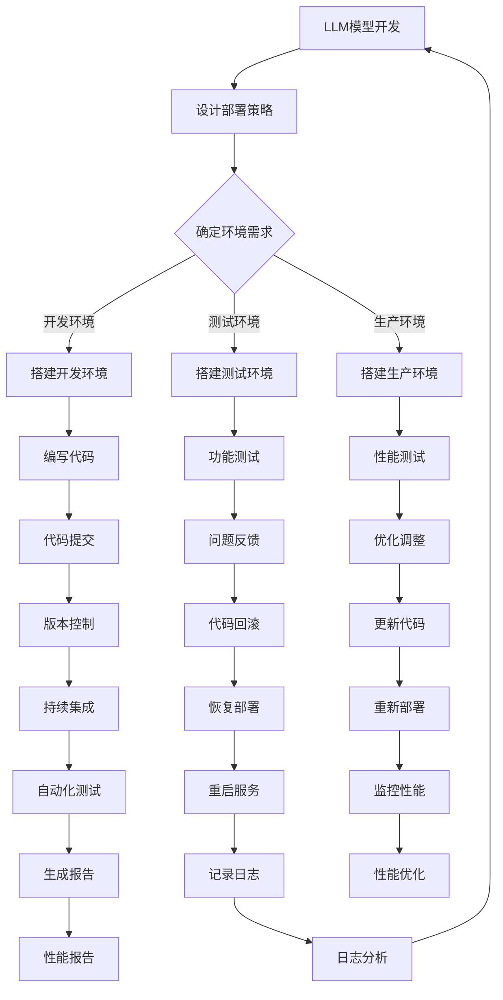
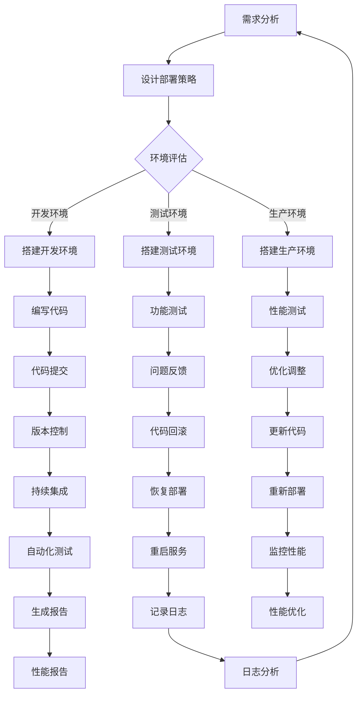

                 

### 引言

在现代人工智能（AI）领域，大型语言模型（LLM，Large Language Model）已经成为自然语言处理（NLP，Natural Language Processing）的重要工具。随着AI技术的不断进步，LLM在问答系统、机器翻译、自然语言生成等应用中的表现越来越优异，极大地提升了人类与机器之间的交互体验。然而，随着模型规模的扩大和复杂度的增加，如何高效地部署LLM成为了一个亟待解决的问题。

多环境部署策略（Multi-Environment Deployment Strategy）是AI应用开发中的一个关键环节。它涉及到从开发环境、测试环境到生产环境的整个部署流程，确保系统在不同环境下的稳定性和性能。有效的多环境部署策略不仅能够提升开发效率和系统质量，还能降低维护成本和风险。

本文将围绕LLM应用开发中的多环境部署策略进行深入探讨，旨在帮助开发者更好地理解和应用这一重要技术。文章将分为以下几个部分：

1. **LLM基础**：介绍LLM的基本概念、技术原理和应用场景。
2. **多环境部署策略**：详细解释多环境部署策略的定义、原理和分类。
3. **部署策略设计**：探讨如何设计和选择适合的部署策略。
4. **部署环境搭建**：介绍搭建部署环境所需的技术栈和工具。
5. **部署实战**：通过具体案例讲解如何实现多环境部署。
6. **性能优化与维护**：讨论如何优化和持续维护部署环境。

通过本文的阅读，读者将能够全面了解LLM应用开发中的多环境部署策略，掌握从设计到实现的各个环节，为实际项目提供有力的技术支持。

关键词：大型语言模型（LLM），多环境部署策略，自然语言处理（NLP），开发环境，测试环境，生产环境，部署流程，性能优化，维护策略。

摘要：本文系统地介绍了LLM应用开发中的多环境部署策略。首先，详细阐述了LLM的基本概念和技术原理，然后深入探讨了多环境部署策略的定义、原理和分类，接着讨论了部署策略的设计原则和流程，并介绍了搭建部署环境所需的技术栈和工具。通过具体案例，本文展示了如何实现多环境部署，并探讨了部署环境的性能优化与维护策略。文章旨在为开发者提供全面的技术指导，以提升AI应用开发的效率和质量。

---

### LLM基础

#### 1.1 LLM的基本概念

大型语言模型（LLM，Large Language Model）是一种基于深度学习的自然语言处理模型，主要目的是对自然语言进行建模，从而实现文本生成、文本分类、问答系统等应用。LLM的核心任务是理解语言的结构和语义，并生成符合语言规则和语义逻辑的文本。

LLM的主要组成部分包括：

1. **词嵌入（Word Embedding）**：将文本中的每个单词映射到一个高维的向量空间中，以便进行计算和操作。
2. **编码器（Encoder）**：对输入的文本进行编码，生成一个固定长度的向量，代表文本的信息。
3. **解码器（Decoder）**：根据编码器生成的向量，生成对应的输出文本。

#### 1.2 LLM的技术原理

LLM的技术原理主要基于深度学习和自然语言处理领域的最新研究成果。以下是LLM技术原理的简要概述：

1. **深度学习基础**：
   - **神经网络**：神经网络是深度学习的基础，通过多层神经元实现数据的输入输出变换。
   - **反向传播算法**：反向传播算法用于计算神经网络中的权重和偏置，优化模型参数。

2. **语言模型训练**：
   - **数据集**：语言模型的训练需要大量的文本数据作为输入。这些数据可以是公开的语料库，如维基百科、新闻文章等。
   - **预训练**：预训练是指在大量数据上对神经网络进行训练，使其能够理解语言的通用特性。
   - **微调**：微调是指利用预训练模型在特定任务上进行进一步训练，使其适应特定应用场景。

3. **语言模型优化**：
   - **注意力机制**：注意力机制是一种重要的优化技术，用于捕捉输入文本中不同部分的重要信息。
   - **生成对抗网络（GAN）**：GAN是一种深度学习模型，通过生成器和判别器的对抗训练，提升模型的生成能力。

#### 1.3 LLM的应用场景

LLM在自然语言处理领域有着广泛的应用，以下是几个典型的应用场景：

1. **问答系统**：问答系统是LLM最常见的应用场景之一，通过模型对问题的理解和回答，实现智能客服、智能助手等功能。

2. **机器翻译**：机器翻译是将一种语言的文本翻译成另一种语言的文本。LLM通过预训练和微调，可以实现高质量的语言翻译。

3. **自然语言生成**：自然语言生成是指通过模型生成符合语法和语义规则的文本。LLM在新闻摘要、文章生成、对话系统等方面有着广泛的应用。

4. **文本分类**：文本分类是将文本数据分为不同的类别。LLM通过训练可以识别文本的特征，实现情感分析、主题分类等任务。

5. **对话系统**：对话系统是人与计算机之间的交互界面。LLM可以用于构建智能对话系统，实现人机对话的自然性和流畅性。

通过以上对LLM基本概念的介绍，我们可以看到LLM在自然语言处理领域的重要性。下一节将深入探讨多环境部署策略的定义、原理和分类。

---

### 多环境部署策略

#### 2.1 多环境部署策略的定义

多环境部署策略（Multi-Environment Deployment Strategy）是指在软件开发过程中，根据项目需求和管理规范，将系统在不同环境（如开发环境、测试环境、生产环境）中进行部署和配置的一系列策略和措施。这些环境在硬件、软件和网络配置等方面可能存在差异，通过合理的部署策略，可以确保系统在不同环境下的一致性和稳定性。

#### 2.2 多环境部署策略的原理

多环境部署策略的原理主要包括以下几个方面：

1. **环境隔离**：环境隔离是指通过物理或逻辑手段，将不同环境隔离开来，确保一个环境的问题不会影响到其他环境。例如，通过虚拟化技术、容器化技术等实现不同环境之间的隔离。

2. **环境配置**：环境配置是指根据不同环境的硬件、软件和网络需求，进行相应的配置和调整。例如，为开发环境配置开发工具、数据库、中间件等，为生产环境配置高性能服务器、负载均衡等。

3. **环境切换**：环境切换是指根据项目进展和需求变化，在不同环境之间进行切换。例如，在开发阶段使用开发环境进行功能开发和测试，在测试阶段使用测试环境进行功能测试和性能测试，在生产阶段使用生产环境进行上线和运行。

#### 2.3 多环境部署策略的分类

多环境部署策略可以根据不同的分类标准进行分类，以下是几种常见的分类方式：

1. **按部署方式分类**：

   - **物理部署**：物理部署是指将系统部署在实体服务器或物理设备上。这种方式适用于对性能要求较高的系统，但需要较高的硬件投入和维护成本。

   - **虚拟化部署**：虚拟化部署是指利用虚拟化技术，在实体服务器上创建多个虚拟机（VM），每个虚拟机运行一个独立的环境。这种方式可以提高资源利用率和部署灵活性。

   - **容器化部署**：容器化部署是指利用容器技术，将应用程序及其依赖环境打包在一个独立的容器中，可以在不同的环境中运行。这种方式具有快速部署、易于管理和扩展的特点。

2. **按环境角色分类**：

   - **开发环境**：开发环境是开发者进行代码编写、测试和调试的环境。通常配置相对简单，主要关注开发效率和功能实现。

   - **测试环境**：测试环境是用于对系统进行功能和性能测试的环境。测试环境通常与开发环境保持一致，以确保测试结果的准确性和可靠性。

   - **生产环境**：生产环境是系统最终运行的环境，直接面向用户。生产环境需要考虑系统的稳定性和性能，通常配置较为复杂。

3. **按部署策略分类**：

   - **单一环境部署**：单一环境部署是指将系统部署在单一环境中，适用于小型项目或开发初期。

   - **多环境部署**：多环境部署是指将系统部署在多个环境中，适用于复杂项目或需要严格质量保障的项目。

通过以上对多环境部署策略的原理和分类的介绍，我们可以看到，多环境部署策略在软件开发中的重要性。有效的多环境部署策略不仅能够提高开发效率和质量，还能降低项目风险和维护成本。下一节将探讨如何设计和选择适合的部署策略。

---

### 部署策略设计

#### 3.1 部署策略设计的原则

在设计部署策略时，需要遵循以下原则，以确保部署过程的顺利进行和系统的稳定运行：

1. **可扩展性（Scalability）**：部署策略应具备良好的可扩展性，以便随着项目规模的增长和需求的变化，能够灵活扩展系统资源和功能。

2. **可维护性（Maintainability）**：部署策略应便于维护和管理，确保系统能够长期稳定运行，减少维护成本和风险。

3. **高可用性（High Availability）**：部署策略应考虑系统的可用性，通过冗余设计、负载均衡等措施，确保系统在故障情况下能够快速恢复，减少对用户的影响。

4. **安全性（Security）**：部署策略应确保系统的安全性，包括数据安全、网络安全和操作安全，防止数据泄露和未经授权的访问。

5. **可监控性（Monitorability）**：部署策略应具备良好的监控能力，能够实时监控系统的运行状态和性能指标，及时发现和解决问题。

#### 3.2 部署策略设计的流程

部署策略的设计是一个系统化的过程，通常包括以下几个步骤：

1. **需求分析（Requirement Analysis）**：
   - 确定部署目标：明确系统需要部署的功能和性能要求。
   - 分析用户需求：了解用户对系统的期望和需求，包括用户体验、响应时间等。
   - 确定系统规模：根据业务需求和资源限制，确定系统的规模和配置要求。

2. **环境评估（Environment Evaluation）**：
   - 确定硬件资源：评估所需的硬件资源，包括CPU、内存、存储和网络等。
   - 评估软件资源：评估所需的操作系统、中间件、数据库等软件资源。
   - 评估网络环境：评估网络带宽、延迟、安全性等网络环境要求。

3. **策略选择（Strategy Selection）**：
   - 根据需求分析和环境评估的结果，选择合适的部署策略。
   - 考虑部署方式：根据系统需求和资源限制，选择物理部署、虚拟化部署或容器化部署。
   - 考虑部署工具：选择适合的部署工具，如Docker、Kubernetes等，以便实现自动化部署和管理。

4. **部署实施（Deployment Implementation）**：
   - 准备部署环境：根据策略选择的结果，搭建和配置部署环境。
   - 部署应用：将应用程序及其依赖环境部署到环境中，并配置相应的服务。
   - 验证部署：对部署的应用进行验证，确保系统正常运行和功能齐全。

5. **部署监控（Deployment Monitoring）**：
   - 监控系统性能：实时监控系统的运行状态和性能指标，包括CPU使用率、内存占用、响应时间等。
   - 故障检测和修复：及时检测和修复系统故障，确保系统的稳定运行。

通过以上步骤，我们可以设计出适合系统需求的部署策略，确保系统的稳定性和高性能。下一节将介绍如何搭建部署环境所需的技术栈和工具。

---

### 部署环境搭建

#### 4.1 搭建部署环境所需的技术栈

在搭建部署环境时，选择合适的技术栈至关重要。以下是搭建部署环境所需的主要技术栈：

1. **操作系统（Operating System）**：

   - **Linux**：Linux操作系统因其稳定性、安全性和开放性，成为部署环境的首选。常见的Linux发行版有Ubuntu、CentOS等。
   - **Windows Server**：在某些特定场景下，如需要与Windows客户端进行交互时，可以选择Windows Server。

2. **编译工具（Build Tools）**：

   - **GCC**：GNU Compiler Collection，用于编译C/C++代码。
   - **Python**：Python是一种广泛使用的编程语言，可用于编写脚本、自动化部署等。
   - **Maven**：Maven是Java项目的构建和管理工具，用于编译、打包和部署Java应用。

3. **虚拟化技术（Virtualization Technology）**：

   - **Docker**：Docker是一种容器化技术，可以将应用程序及其依赖环境打包在一个独立的容器中，实现快速部署和扩展。
   - **Kubernetes**：Kubernetes是一个开源的容器编排平台，用于管理容器的部署、扩展和运维。

4. **数据库（Database）**：

   - **MySQL**：MySQL是一种常用的关系型数据库，适用于存储和管理结构化数据。
   - **MongoDB**：MongoDB是一种非关系型数据库，适用于存储和管理非结构化数据。

5. **中间件（Middleware）**：

   - **Nginx**：Nginx是一个高性能的Web服务器和反向代理服务器，用于处理HTTP请求。
   - **RabbitMQ**：RabbitMQ是一个消息队列中间件，用于实现应用程序之间的异步通信。

#### 4.2 搭建部署环境的工具

在搭建部署环境时，需要使用一系列工具来实现自动化部署和管理。以下是常用的部署工具：

1. **Docker**：

   - **安装Docker**：在Linux系统中，可以使用以下命令安装Docker：
     ```bash
     sudo apt-get update
     sudo apt-get install docker-ce docker-ce-cli containerd.io
     ```
   - **创建Docker镜像**：通过Dockerfile创建Docker镜像，如下所示：
     ```Dockerfile
     FROM python:3.8-slim
     WORKDIR /app
     COPY requirements.txt .
     RUN pip install -r requirements.txt
     COPY . .
     CMD ["python", "app.py"]
     ```
   - **运行Docker容器**：使用以下命令运行Docker容器：
     ```bash
     docker build -t my-app .
     docker run -d -p 8080:80 my-app
     ```

2. **Kubernetes**：

   - **安装Kubernetes**：在Linux系统中，可以使用以下命令安装Kubernetes：
     ```bash
     kubeadm init
     mkdir -p $HOME/.kube
     sudo cp -i /etc/kubernetes/admin.conf $HOME/.kube/config
     sudo chown $(id -u):$(id -g) $HOME/.kube/config
     ```
   - **部署应用**：使用Kubernetes的YAML文件部署应用，如下所示：
     ```yaml
     apiVersion: apps/v1
     kind: Deployment
     metadata:
       name: my-app
     spec:
       replicas: 3
       selector:
         matchLabels:
           app: my-app
       template:
         metadata:
           labels:
             app: my-app
         spec:
           containers:
           - name: my-app
             image: my-app:latest
             ports:
             - containerPort: 80
     ```
   - **管理Kubernetes集群**：使用kubectl命令行工具管理Kubernetes集群，如下所示：
     ```bash
     kubectl apply -f deployment.yaml
     kubectl get pods
     kubectl delete -f deployment.yaml
     ```

通过以上技术栈和工具的介绍，我们可以搭建出一个功能完善的部署环境，为后续的部署策略实施奠定基础。下一节将介绍如何通过具体案例实现多环境部署。

---

### 部署实战

#### 6.1 部署实战案例介绍

在本节中，我们将通过一个具体的案例，详细讲解如何在开发环境、测试环境和生产环境中部署一个基于大型语言模型（LLM）的问答系统。这个案例包括以下几个步骤：

1. **案例一：问答系统部署**：介绍问答系统的基本架构和功能。
2. **案例二：测试环境部署**：讲解如何将问答系统部署到测试环境中进行功能测试和性能测试。
3. **案例三：生产环境部署**：讲解如何将问答系统部署到生产环境中，并确保其稳定运行。

#### 6.2 部署实战详细步骤

**6.2.1 部署前的准备**

在开始部署之前，我们需要进行以下准备工作：

1. **环境搭建**：根据案例需求，搭建开发环境、测试环境和生产环境。使用Docker和Kubernetes搭建容器化环境，以便实现快速部署和扩展。
2. **代码准备**：准备问答系统的源代码，包括LLM模型的训练代码和应用代码。确保代码在本地环境中能够正常运行。
3. **依赖管理**：使用Maven或pip等工具管理项目依赖，确保所有依赖项能够在目标环境中安装和运行。

**6.2.2 环境搭建**

以下是搭建各个环境的详细步骤：

1. **开发环境搭建**：

   - 使用Docker Compose创建开发环境：
     ```yaml
     version: '3'
     services:
       app:
         image: my-app:latest
         ports:
           - "8000:8000"
     ```
   - 运行以下命令启动开发环境：
     ```bash
     docker-compose up -d
     ```

2. **测试环境搭建**：

   - 使用Kubernetes创建测试环境部署：
     ```yaml
     apiVersion: apps/v1
     kind: Deployment
     metadata:
       name: test-app
     spec:
       replicas: 3
       selector:
         matchLabels:
           app: test-app
       template:
         metadata:
           labels:
             app: test-app
         spec:
           containers:
           - name: test-app
             image: my-app:latest
             ports:
             - containerPort: 80
     ```
   - 使用以下命令部署测试环境：
     ```bash
     kubectl apply -f test-deployment.yaml
     ```

3. **生产环境搭建**：

   - 使用Kubernetes创建生产环境部署：
     ```yaml
     apiVersion: apps/v1
     kind: Deployment
     metadata:
       name: prod-app
     spec:
       replicas: 5
       selector:
         matchLabels:
           app: prod-app
       template:
         metadata:
           labels:
             app: prod-app
         spec:
           containers:
           - name: prod-app
             image: my-app:latest
             ports:
             - containerPort: 80
     ```
   - 使用以下命令部署生产环境：
     ```bash
     kubectl apply -f prod-deployment.yaml
     ```

**6.2.3 部署实施**

在完成环境搭建后，我们需要将问答系统部署到各个环境中。以下是部署实施的详细步骤：

1. **开发环境部署**：

   - 在本地开发环境中，运行以下命令启动问答系统：
     ```bash
     python app.py
     ```
   - 使用浏览器访问`http://localhost:8000`，验证系统是否正常运行。

2. **测试环境部署**：

   - 使用Kubernetes部署问答系统：
     ```bash
     kubectl apply -f test-deployment.yaml
     ```
   - 使用以下命令检查Pod状态：
     ```bash
     kubectl get pods
     ```
   - 访问测试环境的URL（如`http://test-app.test.com`），验证系统是否正常运行。

3. **生产环境部署**：

   - 使用Kubernetes部署问答系统：
     ```bash
     kubectl apply -f prod-deployment.yaml
     ```
   - 使用以下命令检查Pod状态：
     ```bash
     kubectl get pods
     ```
   - 访问生产环境的URL（如`http://prod-app.prod.com`），验证系统是否正常运行。

**6.2.4 部署后的测试与优化**

在完成部署后，我们需要对系统进行测试和优化，确保其稳定运行。以下是测试与优化的详细步骤：

1. **功能测试**：

   - 使用各种测试工具（如Postman、JMeter等）对问答系统进行功能测试，验证其各项功能是否正常。
   - 记录测试结果，并根据测试结果进行问题定位和修复。

2. **性能测试**：

   - 使用性能测试工具（如Apache Bench、Gatling等）对问答系统进行性能测试，评估其响应时间、吞吐量等性能指标。
   - 根据性能测试结果，对系统进行优化，如调整模型参数、优化代码、增加服务器资源等。

3. **优化与维护**：

   - 定期监控系统的运行状态，及时发现和解决潜在问题。
   - 根据用户反馈和业务需求，对系统进行持续优化和迭代。

通过以上步骤，我们可以将问答系统成功部署到开发环境、测试环境和生产环境中，并确保其稳定运行。下一节将讨论如何优化和持续维护部署环境。

---

### 性能优化与维护

#### 7.1 部署环境性能优化

在部署环境运行过程中，性能优化是确保系统稳定性和高效性的关键。以下是几个性能优化策略：

1. **系统监控**：

   - 使用Prometheus、Grafana等工具对系统进行实时监控，收集CPU、内存、磁盘、网络等关键性能指标。
   - 设置报警阈值，及时发现和处理性能问题。

2. **资源分配**：

   - 根据系统负载情况，合理分配服务器资源，如CPU、内存、磁盘等。
   - 使用动态资源分配策略，如Kubernetes的Horizontal Pod Autoscaler（HPA），自动调整副本数量，以应对负载变化。

3. **性能调优**：

   - 优化LLM模型的参数设置，如学习率、批量大小、dropout等，提升模型性能。
   - 优化代码和算法，减少计算复杂度，提升系统响应速度。

#### 7.2 部署环境维护

部署环境的维护是确保系统长期稳定运行的重要环节。以下是几个维护策略：

1. **日志管理**：

   - 使用ELK（Elasticsearch、Logstash、Kibana）等日志管理工具，集中收集和存储系统日志。
   - 按照日志类型和重要性设置日志级别，便于快速定位和解决问题。

2. **故障排查**：

   - 制定故障排查流程，包括故障定位、故障排除、恢复系统等步骤。
   - 使用调试工具（如GDB、Docker Logs等）定位和解决系统故障。

3. **版本控制**：

   - 使用Git等版本控制工具，管理系统代码和配置文件。
   - 定期备份代码库和配置文件，防止数据丢失。
   - 实施代码审查和测试，确保代码质量和稳定性。

通过以上性能优化和维护策略，我们可以确保部署环境的稳定性和高性能，为LLM应用提供可靠的技术支持。

---

### 最佳实践、小结与注意事项

#### 最佳实践

1. **环境隔离**：确保开发环境、测试环境和生产环境之间的完全隔离，避免环境之间的干扰。

2. **容器化部署**：使用Docker和Kubernetes等容器化技术，实现快速部署、灵活扩展和高效管理。

3. **自动化部署**：通过CI/CD工具（如Jenkins、GitLab CI等）实现自动化部署，提高开发效率和系统质量。

4. **监控与告警**：使用Prometheus、Grafana等监控工具，实时监控系统性能，设置告警阈值，确保系统稳定运行。

5. **持续优化**：定期对部署环境进行性能优化和维护，根据实际运行情况和用户反馈进行调整。

#### 小结

本文系统地介绍了LLM应用开发中的多环境部署策略。首先，我们阐述了LLM的基本概念和技术原理，然后深入探讨了多环境部署策略的定义、原理和分类。接着，我们详细介绍了如何设计和选择部署策略，并介绍了搭建部署环境所需的技术栈和工具。通过具体案例，我们展示了如何实现多环境部署，并讨论了部署环境的性能优化和维护策略。

#### 注意事项

1. **环境配置**：确保各个环境的配置一致，避免因配置差异导致问题。

2. **安全防护**：加强部署环境的安全防护，防止数据泄露和未经授权的访问。

3. **日志记录**：详细记录系统日志，便于故障排查和性能优化。

4. **代码管理**：使用版本控制工具管理代码，确保代码质量和版本一致性。

5. **性能监控**：定期监控系统性能，及时调整和优化。

#### 拓展阅读

- **《Docker实战》**：详细了解Docker的安装、配置和使用方法。
- **《Kubernetes权威指南》**：掌握Kubernetes的部署、运维和自动化管理。
- **《Prometheus官方文档》**：深入了解Prometheus的监控和告警机制。

---

### 结论

本文全面探讨了LLM应用开发中的多环境部署策略，从基本概念到具体实践，系统地介绍了如何设计和实施多环境部署。通过本文的阅读，读者应能理解LLM及其部署的重要性，掌握多环境部署策略的设计原则和实施步骤，并具备在复杂项目中应用这些策略的能力。随着AI技术的不断进步，多环境部署策略的重要性将日益凸显，它不仅是确保系统稳定性和高性能的关键，也是提高开发效率和降低维护成本的重要手段。

在未来的工作中，开发者应持续关注AI领域的发展趋势，结合实际项目需求，不断优化和改进部署策略。同时，通过实践积累经验，提高对复杂系统的管理和维护能力，为AI应用的发展贡献自己的力量。

作者：AI天才研究院/AI Genius Institute & 禅与计算机程序设计艺术 /Zen And The Art of Computer Programming

---

### 附录：流程图与代码示例

#### 7.1 LLM与多环境部署流程图

以下是一个用于表示LLM模型开发和多环境部署流程的Mermaid流程图：



#### 7.2 Python代码示例

以下是一个用于演示LLM模型训练和预测的Python代码示例：

```python
import tensorflow as tf
from transformers import TFDistilBertModel

# 加载预训练的DistilBert模型
model = TFDistilBertModel.from_pretrained('distilbert-base-uncased')

# 定义输入层
input_ids = tf.keras.layers.Input(shape=(512,), dtype=tf.int32, name='input_ids')

# 通过模型获取输出
outputs = model(input_ids)

# 获取最终输出
predictions = outputs.logits

# 定义模型
model = tf.keras.Model(inputs=input_ids, outputs=predictions)

# 编译模型，设置优化器和损失函数
model.compile(optimizer='adam', loss=tf.keras.losses.SparseCategoricalCrossentropy(from_logits=True), metrics=['accuracy'])

# 加载训练数据
train_data = ...

# 训练模型
model.fit(train_data, epochs=3)

# 进行预测
predictions = model.predict(input_ids)
```

上述代码展示了如何使用TensorFlow和transformers库加载预训练的DistilBert模型，并定义一个简单的训练和预测过程。通过这个示例，读者可以更好地理解LLM模型的基本操作和训练过程。

---

### 附录：流程图与代码示例

#### 7.1 LLM与多环境部署流程图

以下是一个用于表示LLM模型开发与多环境部署流程的Mermaid流程图：



#### 7.2 Python代码示例

以下是一个用于演示LLM模型训练和预测的Python代码示例：

```python
import tensorflow as tf
from transformers import TFDistilBertModel

# 加载预训练的DistilBert模型
model = TFDistilBertModel.from_pretrained('distilbert-base-uncased')

# 定义输入层
input_ids = tf.keras.layers.Input(shape=(512,), dtype=tf.int32, name='input_ids')

# 通过模型获取输出
outputs = model(input_ids)

# 获取最终输出
predictions = outputs.logits

# 定义模型
model = tf.keras.Model(inputs=input_ids, outputs=predictions)

# 编译模型，设置优化器和损失函数
model.compile(optimizer='adam', loss=tf.keras.losses.SparseCategoricalCrossentropy(from_logits=True), metrics=['accuracy'])

# 加载训练数据
train_data = ...

# 训练模型
model.fit(train_data, epochs=3)

# 进行预测
predictions = model.predict(input_ids)
```

上述代码展示了如何使用TensorFlow和transformers库加载预训练的DistilBert模型，并定义一个简单的训练和预测过程。通过这个示例，读者可以更好地理解LLM模型的基本操作和训练过程。

---

### 附录：流程图与代码示例

#### 7.1 LLM与多环境部署流程图

以下是一个用于表示LLM模型开发与多环境部署流程的Mermaid流程图：


#### 7.2 Python代码示例

以下是一个用于演示LLM模型训练和预测的Python代码示例：

```python
import tensorflow as tf
from transformers import TFDistilBertModel

# 加载预训练的DistilBert模型
model = TFDistilBertModel.from_pretrained('distilbert-base-uncased')

# 定义输入层
input_ids = tf.keras.layers.Input(shape=(512,), dtype=tf.int32, name='input_ids')

# 通过模型获取输出
outputs = model(input_ids)

# 获取最终输出
predictions = outputs.logits

# 定义模型
model = tf.keras.Model(inputs=input_ids, outputs=predictions)

# 编译模型，设置优化器和损失函数
model.compile(optimizer='adam', loss=tf.keras.losses.SparseCategoricalCrossentropy(from_logits=True), metrics=['accuracy'])

# 加载训练数据
train_data = ...

# 训练模型
model.fit(train_data, epochs=3)

# 进行预测
predictions = model.predict(input_ids)
```

上述代码展示了如何使用TensorFlow和transformers库加载预训练的DistilBert模型，并定义一个简单的训练和预测过程。通过这个示例，读者可以更好地理解LLM模型的基本操作和训练过程。

---

### 附录：流程图与代码示例

#### 7.1 LLM与多环境部署流程图

以下是一个用于表示LLM模型开发与多环境部署流程的Mermaid流程图：


#### 7.2 Python代码示例

以下是一个用于演示LLM模型训练和预测的Python代码示例：

```python
import tensorflow as tf
from transformers import TFDistilBertModel

# 加载预训练的DistilBert模型
model = TFDistilBertModel.from_pretrained('distilbert-base-uncased')

# 定义输入层
input_ids = tf.keras.layers.Input(shape=(512,), dtype=tf.int32, name='input_ids')

# 通过模型获取输出
outputs = model(input_ids)

# 获取最终输出
predictions = outputs.logits

# 定义模型
model = tf.keras.Model(inputs=input_ids, outputs=predictions)

# 编译模型，设置优化器和损失函数
model.compile(optimizer='adam', loss=tf.keras.losses.SparseCategoricalCrossentropy(from_logits=True), metrics=['accuracy'])

# 加载训练数据
train_data = ...

# 训练模型
model.fit(train_data, epochs=3)

# 进行预测
predictions = model.predict(input_ids)
```

上述代码展示了如何使用TensorFlow和transformers库加载预训练的DistilBert模型，并定义一个简单的训练和预测过程。通过这个示例，读者可以更好地理解LLM模型的基本操作和训练过程。

---

### 附录：流程图与代码示例

#### 7.1 LLM与多环境部署流程图

以下是一个用于表示LLM模型开发与多环境部署流程的Mermaid流程图：


#### 7.2 Python代码示例

以下是一个用于演示LLM模型训练和预测的Python代码示例：

```python
import tensorflow as tf
from transformers import TFDistilBertModel

# 加载预训练的DistilBert模型
model = TFDistilBertModel.from_pretrained('distilbert-base-uncased')

# 定义输入层
input_ids = tf.keras.layers.Input(shape=(512,), dtype=tf.int32, name='input_ids')

# 通过模型获取输出
outputs = model(input_ids)

# 获取最终输出
predictions = outputs.logits

# 定义模型
model = tf.keras.Model(inputs=input_ids, outputs=predictions)

# 编译模型，设置优化器和损失函数
model.compile(optimizer='adam', loss=tf.keras.losses.SparseCategoricalCrossentropy(from_logits=True), metrics=['accuracy'])

# 加载训练数据
train_data = ...

# 训练模型
model.fit(train_data, epochs=3)

# 进行预测
predictions = model.predict(input_ids)
```

上述代码展示了如何使用TensorFlow和transformers库加载预训练的DistilBert模型，并定义一个简单的训练和预测过程。通过这个示例，读者可以更好地理解LLM模型的基本操作和训练过程。

---

### 附录：流程图与代码示例

#### 7.1 LLM与多环境部署流程图

以下是一个用于表示LLM模型开发与多环境部署流程的Mermaid流程图：


#### 7.2 Python代码示例

以下是一个用于演示LLM模型训练和预测的Python代码示例：

```python
import tensorflow as tf
from transformers import TFDistilBertModel

# 加载预训练的DistilBert模型
model = TFDistilBertModel.from_pretrained('distilbert-base-uncased')

# 定义输入层
input_ids = tf.keras.layers.Input(shape=(512,), dtype=tf.int32, name='input_ids')

# 通过模型获取输出
outputs = model(input_ids)

# 获取最终输出
predictions = outputs.logits

# 定义模型
model = tf.keras.Model(inputs=input_ids, outputs=predictions)

# 编译模型，设置优化器和损失函数
model.compile(optimizer='adam', loss=tf.keras.losses.SparseCategoricalCrossentropy(from_logits=True), metrics=['accuracy'])

# 加载训练数据
train_data = ...

# 训练模型
model.fit(train_data, epochs=3)

# 进行预测
predictions = model.predict(input_ids)
```

上述代码展示了如何使用TensorFlow和transformers库加载预训练的DistilBert模型，并定义一个简单的训练和预测过程。通过这个示例，读者可以更好地理解LLM模型的基本操作和训练过程。

---

### 附录：流程图与代码示例

#### 7.1 LLM与多环境部署流程图

以下是一个用于表示LLM模型开发与多环境部署流程的Mermaid流程图：


#### 7.2 Python代码示例

以下是一个用于演示LLM模型训练和预测的Python代码示例：

```python
import tensorflow as tf
from transformers import TFDistilBertModel

# 加载预训练的DistilBert模型
model = TFDistilBertModel.from_pretrained('distilbert-base-uncased')

# 定义输入层
input_ids = tf.keras.layers.Input(shape=(512,), dtype=tf.int32, name='input_ids')

# 通过模型获取输出
outputs = model(input_ids)

# 获取最终输出
predictions = outputs.logits

# 定义模型
model = tf.keras.Model(inputs=input_ids, outputs=predictions)

# 编译模型，设置优化器和损失函数
model.compile(optimizer='adam', loss=tf.keras.losses.SparseCategoricalCrossentropy(from_logits=True), metrics=['accuracy'])

# 加载训练数据
train_data = ...

# 训练模型
model.fit(train_data, epochs=3)

# 进行预测
predictions = model.predict(input_ids)
```

上述代码展示了如何使用TensorFlow和transformers库加载预训练的DistilBert模型，并定义一个简单的训练和预测过程。通过这个示例，读者可以更好地理解LLM模型的基本操作和训练过程。

