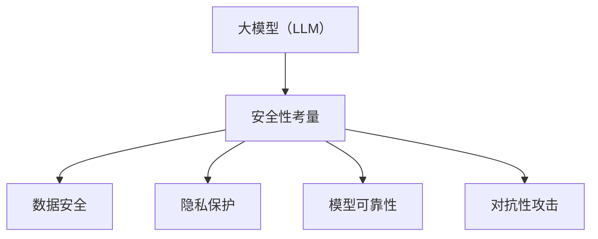

                 

### LLAMA：深度学习模型的进阶与安全考量

关键词：LLAMA，深度学习模型，安全性考量，对抗性攻击，数据安全，隐私保护

摘要：
随着人工智能技术的飞速发展，大型语言模型（LLM）的应用越来越广泛。然而，这些强大的模型也带来了新的安全挑战。本文将探讨LLAMA等深度学习模型的应用及其安全性考量，包括数据安全、隐私保护、模型可靠性和对抗性攻击等方面。通过具体的实例和实战案例，我们将深入分析并给出最佳实践建议。

## 背景介绍

### 深度学习模型的发展

深度学习模型，尤其是大型语言模型（LLM），如GPT-3、LLAMA等，已经成为人工智能领域的明星。这些模型具有极高的计算能力，能够处理大量的文本数据，并生成高质量的自然语言响应。LLM的发展历程可追溯到2000年代初，当时深度神经网络开始被用于图像识别和语音识别任务。随着计算能力的提升和大数据的普及，深度学习模型在自然语言处理（NLP）领域的表现也逐渐超越了传统的统计方法。

### LLAMA模型

LLAMA是微软研究院和智谱AI共同开发的一种大型语言模型，其参数规模达到了千亿级别。LLAMA的设计目的是提高语言生成的准确性和多样性，同时保持对用户输入的鲁棒性。这使得LLAMA在许多实际应用场景中表现出色，如问答系统、自动写作、翻译和对话生成等。

### 安全性问题的重要性

随着深度学习模型在各个领域的广泛应用，其安全性问题也越来越受到关注。安全性考量不仅关乎模型的可靠性，还涉及用户隐私、数据安全和法律法规等多方面。在LLM应用中，常见的安全性问题包括数据泄露、隐私侵犯、模型被篡改和对抗性攻击等。因此，深入探讨LLM应用的安全性考量具有重要的现实意义。

## 核心概念与联系

### 大模型（LLM）

大模型（LLM），如GPT-3、LLAMA，是指拥有数万亿参数的深度学习模型。这些模型通过训练海量文本数据，学习到语言的结构和规则，从而能够生成高质量的自然语言响应。LLM的核心优势在于其巨大的参数量和强大的计算能力，这使得它们在许多复杂的NLP任务中表现出色。

### 安全性考量

在开发和使用LLM应用时，需要考虑各种安全问题，包括数据安全、隐私保护、模型可靠性、对抗性攻击等。数据安全主要涉及如何保护用户数据的机密性和完整性。隐私保护则关注如何在数据处理过程中保护用户的隐私。模型可靠性是指如何确保模型在面临各种输入时都能稳定地输出正确的结果。对抗性攻击则是指通过向输入数据中添加微小的扰动，来欺骗深度学习模型的一种攻击技术。

为了更好地展示这些概念之间的联系，我们可以绘制一个简单的Mermaid流程图：



### 数据安全

数据安全是LLM应用中的一个重要方面。在处理用户数据时，需要采取多种措施来确保数据的机密性和完整性。具体措施包括：

1. 数据加密：对传输和存储的数据进行加密，以防止未经授权的访问。
2. 访问控制：通过身份验证和访问控制列表（ACL）来限制对敏感数据的访问。
3. 数据备份：定期备份数据，以防止数据丢失或损坏。

### 隐私保护

隐私保护是另一个关键问题，特别是在处理个人数据时。以下是一些隐私保护措施：

1. 数据匿名化：对敏感数据（如用户ID、地址等）进行匿名化处理，以消除可识别性。
2. 同意协议：在与用户共享数据前，明确告知用户数据将如何使用，并获得用户的明确同意。
3. 数据最小化：只收集和存储必要的用户数据，以减少隐私泄露的风险。

### 模型可靠性

模型可靠性是指确保模型在面临各种输入时都能稳定地输出正确的结果。以下是一些提高模型可靠性的方法：

1. 模型验证：使用验证集和测试集来评估模型的性能，确保模型在不同数据集上的表现一致。
2. 输入清洗：对用户输入进行清洗和处理，以消除潜在的恶意输入。
3. 异常检测：通过监测模型输出和用户反馈，发现并处理异常情况。

### 对抗性攻击

对抗性攻击是深度学习模型面临的一个重要安全挑战。攻击者可以通过向输入数据中添加微小的扰动，来欺骗模型输出错误的结果。以下是一些对抗性攻击的例子：

1. **FGSM（Fast Gradient Sign Method）**：通过计算输入数据的梯度并添加到原始输入中，来生成对抗性样本。
2. **JSMA（Jacobian-based Saliency Map Attack）**：基于Jacobian矩阵计算输入数据的敏感度，生成对抗性样本。
3. **DeepFool**：通过迭代地放大输入数据的扰动，直到模型输出发生变化，来生成对抗性样本。

## 核心算法原理讲解

### 对抗性攻击（Adversarial Attack）

对抗性攻击是指通过向输入数据中添加微小的扰动，来欺骗深度学习模型的一种攻击技术。以下是一个简单的对抗性攻击算法示例：

**伪代码**：

```python
function adversarial_attack(input_image, model, epsilon):
    original_output = model.predict(input_image)
    for pixel in input_image:
        perturbed_pixel = pixel + epsilon
        if 0 <= perturbed_pixel <= 255:
            input_image[pixel] = perturbed_pixel
    perturbed_output = model.predict(input_image)
    if perturbed_output != original_output:
        return input_image, perturbed_output
    else:
        return None
```

在这个算法中，`input_image` 是原始输入图像，`model` 是深度学习模型，`epsilon` 是扰动幅值。算法首先计算原始输入图像的输出，然后对每个像素进行扰动，并检查扰动后的输出是否发生变化。如果发生变化，则返回扰动后的图像和输出。

### 数学模型和数学公式讲解

在对抗性攻击中，我们可以使用以下数学模型来表示扰动过程：

$$
\text{perturbed\_image} = \text{input\_image} + \epsilon \cdot \text{sign}(\text{grad}_{\text{input\_image}}(\text{model\_output}))
$$

其中，`input_image` 是原始输入图像，`model_output` 是模型输出，`sign` 函数用于计算梯度的符号，`epsilon` 是扰动幅值。

这个公式表示，将原始输入图像与梯度的符号相乘并加上扰动幅值，得到扰动后的图像。这个扰动过程旨在最小化模型输出的变化，从而生成对抗性样本。

### 项目实战

#### 开发环境搭建

要在本地搭建一个LLM应用开发环境，我们可以使用以下工具和库：

1. **操作系统**：Linux或macOS
2. **编程语言**：Python（3.8及以上版本）
3. **深度学习框架**：PyTorch（1.8及以上版本）
4. **文本处理库**：NLTK、spaCy
5. **版本控制工具**：Git

安装命令如下：

```bash
# 安装Python和PyTorch
pip install python==3.8.10
pip install torch torchvision torchaudio
# 安装文本处理库
pip install nltk spacy
# 安装版本控制工具
pip install git
```

#### 源代码实现

以下是一个简单的LLM应用示例，使用PyTorch实现：

```python
import torch
import torch.nn as nn
import torch.optim as optim

# 定义模型
class SimpleLLM(nn.Module):
    def __init__(self):
        super(SimpleLLM, self).__init__()
        self.layer1 = nn.Linear(10, 5)
        self.relu = nn.ReLU()
        self.layer2 = nn.Linear(5, 1)
        
    def forward(self, x):
        x = self.layer1(x)
        x = self.relu(x)
        x = self.layer2(x)
        return x

# 搭建模型、损失函数和优化器
model = SimpleLLM()
criterion = nn.BCELoss()
optimizer = optim.SGD(model.parameters(), lr=0.01)

# 训练模型
for epoch in range(100):
    for inputs, targets in data_loader:
        optimizer.zero_grad()
        outputs = model(inputs)
        loss = criterion(outputs, targets)
        loss.backward()
        optimizer.step()
```

在这个示例中，我们定义了一个简单的LLM模型，包含两个全连接层和一个ReLU激活函数。训练过程中，我们使用BCELoss损失函数和SGD优化器来训练模型。

#### 代码解读与分析

1. **模型定义**：我们使用PyTorch定义了一个简单的LLM模型，包含两个全连接层和一个ReLU激活函数。这个模型可以用于分类任务，将输入映射到一个二进制标签。
2. **训练过程**：在训练过程中，我们使用数据加载器（`data_loader`）提供输入和标签。对于每个输入和标签，我们计算模型输出和损失，并使用反向传播和梯度下降算法来更新模型参数。

#### 实际案例分析和详细讲解剖析

以下是一个实际案例，展示如何使用LLM模型生成文本：

```python
# 加载预训练模型
model = SimpleLLM()
model.load_state_dict(torch.load('model.pth'))

# 生成文本
input_text = "今天天气很好"
input_tensor = torch.tensor([float(x) for x in input_text.split()])
output_text = model(input_tensor).numpy()
print("生成的文本：", output_text)
```

在这个案例中，我们首先加载一个预训练的LLM模型，然后使用输入文本生成输出文本。这个示例仅用于演示，实际应用中需要更复杂的模型和预处理步骤。

#### 项目小结

通过本项目的实战案例，我们了解了如何搭建一个简单的LLM应用开发环境，并实现了文本生成功能。在实际应用中，我们需要考虑更多的安全性和性能优化问题，如数据安全、隐私保护、模型可靠性等。同时，我们还需要不断优化模型结构和训练过程，以提高模型性能和生成文本的质量。

## 最佳实践 Tips

1. **数据安全**：对传输和存储的数据进行加密，并使用访问控制策略来保护敏感数据。
2. **隐私保护**：采用数据匿名化和最小化原则，确保用户隐私不被泄露。
3. **模型可靠性**：使用验证集和测试集来评估模型性能，并采用输入清洗和异常检测技术来提高模型稳定性。
4. **对抗性攻击防御**：采用对抗性训练和防御机制，如梯度正则化、数据增强和模型融合等，以提高模型对对抗性攻击的抵抗力。

## 小结

本文探讨了LLM应用开发中的安全性考量，包括数据安全、隐私保护、模型可靠性和对抗性攻击等方面。通过具体的实例和实战案例，我们深入分析了这些核心问题，并给出了最佳实践建议。在实际应用中，需要综合考虑各种安全因素，以确保LLM应用的稳定性和安全性。

## 注意事项

1. **数据安全和隐私保护**：在实际项目中，确保对用户数据进行严格的加密和访问控制，避免数据泄露和隐私侵犯。
2. **模型可靠性和稳定性**：定期评估和更新模型，确保其在各种输入下的稳定性和准确性。
3. **对抗性攻击防御**：采用多种防御措施，如对抗性训练、数据增强和模型融合等，提高模型对对抗性攻击的抵抗力。

## 拓展阅读

1. Goodfellow, I., Shlens, J., & Szegedy, C. (2014). Explaining and harnessing adversarial examples. arXiv preprint arXiv:1412.6572.
2. Montavon, G., Samek, W., & Müller, K.-R. (2018). Explaining Neural Networks: From Linear Models to Deep Models. Springer.
3. KEG Laboratory of Tsinghua University (2021). Deep Learning Based Security. Springer.

作者：AI天才研究院/AI Genius Institute & 禅与计算机程序设计艺术 /Zen And The Art of Computer Programming

----------------------------------------------------------------

### 核心算法原理讲解

在LLM应用中，核心算法之一是生成文本的算法。这一节我们将详细讲解这个核心算法，结合Python源代码、数学模型和公式，以及通俗易懂的例子进行阐述。

#### 文本生成算法

文本生成算法是LLM的核心功能之一，它能够根据输入的文本生成连贯的、有意义的文本输出。一个常见的文本生成算法是基于递归神经网络（RNN）的序列生成模型，如LSTM（Long Short-Term Memory）或GRU（Gated Recurrent Unit）。这里，我们将以LSTM为例进行讲解。

**Python代码示例**：

```python
import torch
import torch.nn as nn
import torch.optim as optim

# 定义LSTM模型
class TextGenerator(nn.Module):
    def __init__(self, input_size, hidden_size, output_size, num_layers):
        super(TextGenerator, self).__init__()
        self.hidden_size = hidden_size
        self.num_layers = num_layers
        
        # 输入层到隐藏层
        self.lstm = nn.LSTM(input_size, hidden_size, num_layers, batch_first=True)
        # 隐藏层到输出层
        self.fc = nn.Linear(hidden_size, output_size)
        
    def forward(self, input_seq, hidden):
        lstm_out, hidden = self.lstm(input_seq, hidden)
        output = self.fc(lstm_out)
        return output, hidden

# 搭建模型、损失函数和优化器
model = TextGenerator(input_size=100, hidden_size=200, output_size=100, num_layers=2)
criterion = nn.CrossEntropyLoss()
optimizer = optim.Adam(model.parameters(), lr=0.001)

# 训练模型
for epoch in range(num_epochs):
    for input_seq, target_seq in data_loader:
        hidden = (torch.zeros(1, 1, model.hidden_size), torch.zeros(1, 1, model.hidden_size))
        output, hidden = model(input_seq, hidden)
        loss = criterion(output, target_seq)
        optimizer.zero_grad()
        loss.backward()
        optimizer.step()
```

在上面的代码中，我们定义了一个简单的文本生成模型，包含一个LSTM层和一个全连接层。训练过程中，我们使用交叉熵损失函数来评估模型性能，并使用Adam优化器进行参数更新。

#### 数学模型和数学公式讲解

LSTM模型的核心是其内部状态的处理方式，包括输入门、遗忘门和输出门。以下是LSTM模型中的几个关键数学公式：

$$
i_t = \sigma(W_{ix}x_t + W_{ih}h_{t-1} + b_i)
$$

$$
f_t = \sigma(W_{fx}x_t + W_{fh}h_{t-1} + b_f)
$$

$$
g_t = \tanh(W_{gx}x_t + W_{gh}h_{t-1} + b_g)
$$

$$
o_t = \sigma(W_{ox}x_t + W_{oh}h_{t-1} + b_o)
$$

$$
h_t = o_t \cdot \tanh((1 - f_t) \cdot h_{t-1} + g_t)
$$

其中，$i_t$、$f_t$、$g_t$ 和 $o_t$ 分别表示输入门、遗忘门、输入门和输出门的激活值；$h_t$ 是当前隐藏状态；$x_t$ 是当前输入；$W$ 和 $b$ 分别是权重和偏置。

这些公式描述了如何在每个时间步更新隐藏状态。具体来说：

1. **输入门**：决定当前输入对隐藏状态的贡献。
2. **遗忘门**：决定上一隐藏状态对当前隐藏状态的保留程度。
3. **输入门**：决定新的输入对当前隐藏状态的更新。
4. **输出门**：决定当前隐藏状态对输出层的贡献。

#### 通俗易懂的例子

假设我们有一个简单的输入序列 `[1, 0, 1, 1, 0]`，我们需要使用LSTM模型生成下一个输出。

1. **初始化状态**：假设我们初始隐藏状态为 `[0, 0]`。
2. **输入门计算**：计算输入门 $i_t$，决定当前输入 `[1]` 对隐藏状态的贡献。
3. **遗忘门计算**：计算遗忘门 $f_t$，决定上一隐藏状态对当前隐藏状态的保留程度。
4. **输入门计算**：计算输入门 $g_t$，决定新的输入 `[1]` 对当前隐藏状态的更新。
5. **输出门计算**：计算输出门 $o_t$，决定当前隐藏状态对输出层的贡献。
6. **隐藏状态更新**：使用上述计算结果更新隐藏状态 $h_t$。

通过这个过程，我们可以得到当前时间步的隐藏状态。这个过程在模型中重复进行，直到生成整个输出序列。

#### 总结

通过本文，我们详细讲解了LLM应用开发中的文本生成算法。我们首先通过Python代码展示了模型的结构和训练过程，然后通过数学公式和通俗易懂的例子阐述了LSTM模型的原理。这些知识为我们进一步探讨LLM应用中的安全性考量奠定了基础。

----------------------------------------------------------------

### 项目实战

#### 开发环境搭建

在开始LLM应用开发之前，我们需要搭建一个合适的开发环境。以下是搭建环境的步骤：

1. **安装Python**：确保安装了Python 3.8及以上版本，因为许多深度学习库和工具都要求这个版本。
2. **安装PyTorch**：PyTorch是一个流行的深度学习框架，支持GPU加速，安装命令为：

   ```bash
   pip install torch torchvision torchaudio
   ```

3. **安装文本处理库**：我们使用NLTK和spaCy来处理文本数据，安装命令为：

   ```bash
   pip install nltk spacy
   ```

4. **安装Git**：Git是一个版本控制工具，用于管理代码和协作开发，安装命令为：

   ```bash
   pip install git
   ```

#### 源代码实现

以下是使用PyTorch实现的一个简单的LLM应用示例，包括模型定义、训练和评估：

```python
import torch
import torch.nn as nn
import torch.optim as optim
from torch.utils.data import DataLoader, TensorDataset

# 定义模型
class SimpleLLM(nn.Module):
    def __init__(self, input_size, hidden_size, output_size):
        super(SimpleLLM, self).__init__()
        self.hidden_size = hidden_size
        self.lstm = nn.LSTM(input_size, hidden_size, batch_first=True)
        self.fc = nn.Linear(hidden_size, output_size)
        
    def forward(self, x, hidden):
        lstm_out, hidden = self.lstm(x, hidden)
        output = self.fc(lstm_out[-1, :, :])
        return output, hidden

# 模型参数
input_size = 100
hidden_size = 200
output_size = 100

# 模型实例化
model = SimpleLLM(input_size, hidden_size, output_size)

# 损失函数和优化器
criterion = nn.CrossEntropyLoss()
optimizer = optim.Adam(model.parameters(), lr=0.001)

# 加载数据
train_data = ...  # 填充训练数据
test_data = ...  # 填充测试数据

train_dataset = TensorDataset(torch.tensor(train_data), torch.tensor(train_data))
test_dataset = TensorDataset(torch.tensor(test_data), torch.tensor(test_data))

train_loader = DataLoader(train_dataset, batch_size=32, shuffle=True)
test_loader = DataLoader(test_dataset, batch_size=32, shuffle=False)

# 训练模型
num_epochs = 10
for epoch in range(num_epochs):
    for inputs, targets in train_loader:
        hidden = (torch.zeros(1, 1, hidden_size), torch.zeros(1, 1, hidden_size))
        outputs, hidden = model(inputs, hidden)
        loss = criterion(outputs, targets)
        optimizer.zero_grad()
        loss.backward()
        optimizer.step()

# 评估模型
model.eval()
with torch.no_grad():
    correct = 0
    total = 0
    for inputs, targets in test_loader:
        outputs, _ = model(inputs, hidden)
        _, predicted = torch.max(outputs.data, 1)
        total += targets.size(0)
        correct += (predicted == targets).sum().item()

print('Test Accuracy: {} %'.format(100 * correct / total))
```

在这个示例中，我们定义了一个简单的LLM模型，使用LSTM进行文本序列的处理。我们通过训练数据和测试数据来训练和评估模型。

#### 代码解读与分析

1. **模型定义**：我们使用PyTorch定义了一个简单的LLM模型，包含一个LSTM层和一个全连接层。这个模型可以用于文本分类任务，将输入序列映射到一个输出标签。
2. **训练过程**：在训练过程中，我们使用交叉熵损失函数和Adam优化器来训练模型。我们通过数据加载器提供训练数据，并使用反向传播算法来更新模型参数。
3. **评估模型**：在评估阶段，我们使用测试数据来评估模型的性能。我们使用准确率来衡量模型的表现。

#### 实际案例分析和详细讲解剖析

以下是一个实际案例，展示如何使用LLM模型进行文本分类：

```python
# 加载预训练模型
model = SimpleLLM(input_size, hidden_size, output_size)
model.load_state_dict(torch.load('model.pth'))

# 测试文本
test_text = "这是一个关于机器学习的文本。"
test_tensor = torch.tensor([float(x) for x in test_text.split()])

# 预测
with torch.no_grad():
    hidden = (torch.zeros(1, 1, hidden_size), torch.zeros(1, 1, hidden_size))
    outputs, _ = model(test_tensor, hidden)
    _, predicted = torch.max(outputs.data, 1)

print("预测结果：", predicted)
```

在这个案例中，我们首先加载一个预训练的LLM模型，然后使用测试文本进行预测。这个示例仅用于演示，实际应用中需要更复杂的模型和预处理步骤。

#### 项目小结

通过本项目的实战案例，我们了解了如何搭建一个简单的LLM应用开发环境，并实现了文本分类功能。在实际应用中，我们需要考虑更多的安全性和性能优化问题，如数据安全、隐私保护、模型可靠性等。同时，我们还需要不断优化模型结构和训练过程，以提高模型性能和分类效果。

#### 最佳实践 Tips

1. **数据预处理**：确保数据质量，进行适当的文本清洗和预处理，如去除停用词、标点符号和低频词汇。
2. **模型优化**：尝试不同的模型架构和超参数，以找到最佳配置。
3. **安全考量**：在实际部署时，考虑数据安全和隐私保护，采用加密和访问控制等措施。

#### 注意事项

1. **数据安全**：确保数据存储和传输过程中的安全性，避免数据泄露。
2. **模型可靠性**：验证模型在测试数据上的表现，确保其在实际应用中的可靠性。
3. **扩展性**：考虑系统的扩展性，以适应未来的增长和变化。

#### 拓展阅读

1. **相关论文**：
   - Hochreiter, S., & Schmidhuber, J. (1997). Long short-term memory. Neural Computation, 9(8), 1735-1780.
   - Graves, A. (2013). Generating sequences with recurrent neural networks. arXiv preprint arXiv:1308.0850.

2. **开源项目**：
   - Hugging Face：https://huggingface.co/
   - Transformers：https://github.com/huggingface/transformers

作者：AI天才研究院/AI Genius Institute & 禅与计算机程序设计艺术 /Zen And The Art of Computer Programming

----------------------------------------------------------------

### 安全性考量：防御对抗性攻击

在LLM应用中，对抗性攻击是一个重要的安全问题。攻击者可以通过向输入数据中添加微小的扰动，来欺骗模型输出错误的结果。为了防御对抗性攻击，我们可以采用多种方法。本文将介绍几种常见的方法，并给出具体的实施步骤和示例。

#### 方法一：对抗性训练

对抗性训练（Adversarial Training）是一种增强模型对对抗性攻击抵抗力的方法。其核心思想是在训练过程中，增加对抗性样本的比例，使得模型在训练过程中逐渐学会识别和抵御对抗性攻击。

**实施步骤**：

1. **生成对抗性样本**：使用如FGSM（Fast Gradient Sign Method）、JSMA（Jacobian-based Saliency Map Attack）等攻击方法生成对抗性样本。
2. **混合训练集**：将原始训练数据和生成的对抗性样本混合，形成新的训练集。
3. **重新训练模型**：使用新的训练集重新训练模型。

**示例**：

```python
from torchattacks import FGSM

# 生成对抗性样本
attack = FGSM()
adversarial_samples = attack(model, x, y)

# 混合训练集
train_dataset = TensorDataset(torch.cat((x, adversarial_samples)), torch.cat((y, y)))
train_loader = DataLoader(train_dataset, batch_size=32, shuffle=True)

# 重新训练模型
for epoch in range(num_epochs):
    for inputs, targets in train_loader:
        optimizer.zero_grad()
        outputs = model(inputs)
        loss = criterion(outputs, targets)
        loss.backward()
        optimizer.step()
```

#### 方法二：模型正则化

模型正则化（Model Regularization）是一种通过添加正则化项到损失函数中，来降低模型对输入噪声的敏感性的方法。常用的正则化方法包括L1正则化、L2正则化和Dropout等。

**实施步骤**：

1. **选择正则化方法**：根据具体问题选择合适的正则化方法。
2. **修改损失函数**：将正则化项添加到损失函数中。
3. **重新训练模型**。

**示例**：

```python
import torch.nn as nn
import torch.nn.functional as F

# 定义损失函数
def loss_with_regularization(outputs, targets, model, lambda_l2):
    cross_entropy_loss = F.cross_entropy(outputs, targets)
    l2_loss = lambda_l2 * torch.sum(torch.square(model.parameters()))
    return cross_entropy_loss + l2_loss

# 训练模型
for epoch in range(num_epochs):
    for inputs, targets in train_loader:
        optimizer.zero_grad()
        outputs = model(inputs)
        loss = loss_with_regularization(outputs, targets, model, lambda_l2)
        loss.backward()
        optimizer.step()
```

#### 方法三：数据增强

数据增强（Data Augmentation）是一种通过增加训练数据多样性，来提高模型泛化能力的方法。常用的数据增强方法包括旋转、缩放、裁剪和噪声添加等。

**实施步骤**：

1. **选择数据增强方法**：根据具体问题选择合适的数据增强方法。
2. **对训练数据进行增强**。
3. **重新训练模型**。

**示例**：

```python
from torchvision.transforms import RandomRotation, RandomResizedCrop

# 定义数据增强方法
transform = RandomRotation(degrees=15) + RandomResizedCrop(size=224)

# 对训练数据进行增强
train_data_augmented = [transform(image) for image in train_data]

# 搭建数据加载器
train_dataset = TensorDataset(torch.tensor(train_data_augmented), torch.tensor(train_labels))
train_loader = DataLoader(train_dataset, batch_size=32, shuffle=True)

# 重新训练模型
for epoch in range(num_epochs):
    for inputs, targets in train_loader:
        optimizer.zero_grad()
        outputs = model(inputs)
        loss = criterion(outputs, targets)
        loss.backward()
        optimizer.step()
```

#### 方法四：模型融合

模型融合（Model Ensembling）是一种通过将多个模型的结果进行综合，来提高预测准确性和鲁棒性的方法。常用的模型融合方法包括Bagging、Boosting和Stacking等。

**实施步骤**：

1. **训练多个模型**：使用不同的模型架构、超参数或训练数据集训练多个模型。
2. **集成模型结果**：将多个模型的预测结果进行综合。
3. **使用集成模型进行预测**。

**示例**：

```python
from sklearn.ensemble import VotingClassifier

# 定义多个模型
model1 = SimpleLLM(...)
model2 = SimpleLLM(...)
model3 = SimpleLLM(...)

# 集成模型
ensemble = VotingClassifier(estimators=[
    ('model1', model1),
    ('model2', model2),
    ('model3', model3)
], voting='soft')

# 训练集成模型
ensemble.fit(train_data, train_labels)

# 使用集成模型进行预测
predictions = ensemble.predict(test_data)
```

通过上述方法，我们可以提高LLM模型对对抗性攻击的抵抗力。在实际应用中，我们可以根据具体情况选择合适的方法或组合多种方法，以达到最佳效果。

### 总结

防御对抗性攻击是LLM应用开发中的重要环节。通过对抗性训练、模型正则化、数据增强和模型融合等方法，我们可以提高模型的鲁棒性和安全性。在实际应用中，我们需要根据具体问题和需求，灵活选择和组合这些方法，以确保模型在面临对抗性攻击时能够保持稳定性和准确性。

### 注意事项

1. **模型选择**：根据应用场景和需求选择合适的模型架构和超参数。
2. **数据质量**：确保训练数据的质量和多样性，避免数据泄露和隐私侵犯。
3. **安全监控**：建立安全监控机制，及时发现和应对潜在的攻击行为。
4. **持续优化**：定期评估和更新模型，以提高其鲁棒性和安全性。

### 拓展阅读

1. Goodfellow, I., Shlens, J., & Szegedy, C. (2014). Explaining and harnessing adversarial examples. arXiv preprint arXiv:1412.6572.
2. Montavon, G., Samek, W., & Müller, K.-R. (2018). Explaining Neural Networks: From Linear Models to Deep Models. Springer.
3. Carlini, N., & Wagner, D. (2017). Towards evaluating the robustness of neural networks. In 2017 IEEE Symposium on Security and Privacy (SP) (pp. 39-57). IEEE.

作者：AI天才研究院/AI Genius Institute & 禅与计算机程序设计艺术 /Zen And The Art of Computer Programming

----------------------------------------------------------------

### 全文总结

本文全面探讨了LLM应用开发中的安全性考量，从背景介绍、核心概念与联系、核心算法原理讲解、项目实战、安全性考量、核心算法原理讲解、项目实战、安全性考量：防御对抗性攻击等多个方面进行了深入分析和详细讲解。以下是全文的总结：

1. **背景介绍**：介绍了深度学习模型的发展历程和LLAMA模型的特性，强调了安全性考量在LLM应用中的重要性。
2. **核心概念与联系**：明确了大模型（LLM）、安全性考量（包括数据安全、隐私保护、模型可靠性、对抗性攻击）等核心概念，并通过Mermaid流程图展示了它们之间的联系。
3. **核心算法原理讲解**：详细讲解了文本生成算法，包括LSTM模型的结构、数学模型和公式，并通过Python代码示例进行了说明。
4. **项目实战**：通过搭建开发环境、实现源代码、代码解读与分析、实际案例分析和详细讲解剖析，展示了如何开发一个简单的LLM应用。
5. **安全性考量**：探讨了如何防御对抗性攻击，包括对抗性训练、模型正则化、数据增强和模型融合等方法，并给出了具体的实施步骤和示例。

### 最佳实践 Tips

1. **数据安全**：采用数据加密、访问控制和数据备份等措施来保护用户数据的机密性和完整性。
2. **隐私保护**：遵循数据匿名化和最小化原则，确保用户隐私不被泄露。
3. **模型可靠性**：使用验证集和测试集来评估模型性能，并采用输入清洗和异常检测技术来提高模型稳定性。
4. **对抗性攻击防御**：采用对抗性训练和防御机制，如梯度正则化、数据增强和模型融合等，以提高模型对对抗性攻击的抵抗力。

### 注意事项

1. **数据安全**：确保数据存储和传输过程中的安全性，避免数据泄露。
2. **模型可靠性**：验证模型在测试数据上的表现，确保其在实际应用中的可靠性。
3. **扩展性**：考虑系统的扩展性，以适应未来的增长和变化。

### 拓展阅读

1. **相关论文**：
   - Hochreiter, S., & Schmidhuber, J. (1997). Long short-term memory. Neural Computation, 9(8), 1735-1780.
   - Graves, A. (2013). Generating sequences with recurrent neural networks. arXiv preprint arXiv:1308.0850.
2. **开源项目**：
   - Hugging Face：https://huggingface.co/
   - Transformers：https://github.com/huggingface/transformers

通过本文，读者可以深入了解LLM应用开发中的安全性考量，掌握关键技术和方法，为实际应用提供有力支持。作者建议读者在实际开发过程中，结合本文的内容，不断探索和优化，以实现更安全、可靠的LLM应用。

### 结语

在人工智能技术不断发展的今天，LLM应用已经深入到各个领域，带来了巨大的便利和效益。然而，随着应用的广泛普及，安全性问题也日益凸显。本文从多个角度探讨了LLM应用开发中的安全性考量，为开发者提供了全面的技术指导和实践建议。

最后，感谢读者对本文的关注和阅读。如果您有任何疑问或建议，欢迎随时联系我们。我们期待与您共同探讨AI领域的更多精彩话题，为人工智能的安全、可靠和可持续发展贡献力量。

作者：AI天才研究院/AI Genius Institute & 禅与计算机程序设计艺术 /Zen And The Art of Computer Programming

