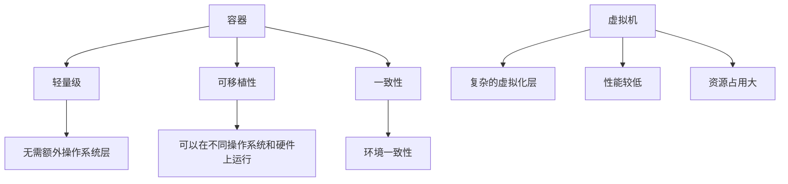
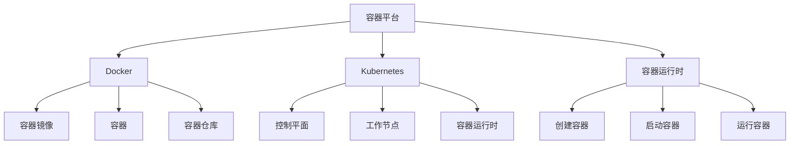

                 

### 文章标题

# LLM应用开发中的容器化技术应用

## 关键词

- LLM（大型语言模型）
- 容器化
- Docker
- Kubernetes
- AI应用开发
- 容器管理

## 摘要

本文旨在探讨在大型语言模型（LLM）应用开发中容器化技术的重要性。首先，我们将回顾软件从1.0到2.0的演进过程，并强调AI大模型在当前软件开发中的核心地位。接下来，我们详细介绍AI大模型的定义、特点以及与传统AI的区别，并简要介绍主流的AI大模型。随后，我们分析AI大模型在企业中的应用前景，包括潜在领域、优势、挑战和机遇。在此基础上，本文将深入探讨容器化技术的基本概念、与虚拟机的比较及其核心组成部分。进一步，我们将详细讲解Docker在LLM应用开发中的应用，包括基本操作、镜像构建和容器网络。接着，我们将介绍Kubernetes在容器化管理中的应用，涵盖核心概念、集群搭建和资源管理。最后，我们将通过一个实际案例，展示容器化技术在LLM应用部署中的实践，并总结最佳实践和注意事项。

### 1.1 引言

#### 1.1.1 从软件 1.0 到软件 2.0 的演进

软件1.0时代，以操作系统为核心，注重单机性能和稳定性。当时的软件开发主要集中在如何提高单机操作系统的性能和稳定性，以满足个人用户和企业的基本需求。代表性的软件如Windows 95和Unix操作系统，它们是那个时代的里程碑。

随着互联网的兴起，软件1.0逐渐演化为软件2.0。软件2.0的特点是分布式、动态性和用户参与。这一时代的软件，不再局限于单机操作，而是通过互联网实现分布式部署，能够动态地适应用户需求，并鼓励用户参与软件的改进和进化。代表性的软件如Google搜索和Facebook社交网络。

AI大模型的兴起，进一步推动了软件2.0的发展。AI大模型具有强大的学习能力和通用性，能够处理大规模数据，并在多个领域实现突破。这种能力使得软件2.0不再仅仅是一个平台，而是一个具有自我学习和优化能力的智能系统。

#### 1.1.2 大模型在软件 2.0 中的核心地位

AI大模型在软件2.0中的核心地位体现在多个方面：

1. **数据处理能力**：AI大模型能够处理大规模数据，这为软件2.0提供了强大的数据处理基础。无论是搜索引擎、社交网络，还是电子商务，都需要处理海量的用户数据。

2. **自适应能力**：AI大模型能够自我学习和优化，这使得软件2.0能够动态地适应用户需求。例如，电商平台可以根据用户的历史购买记录，为其推荐最感兴趣的商品。

3. **智能化服务**：AI大模型可以实现智能化服务，提高用户体验。例如，智能客服系统可以实时响应用户的咨询，提供个性化的解决方案。

#### 1.1.3 企业级应用开发的新范式

企业级应用开发的传统范式，主要是以单体架构为主，系统复杂度高，可维护性差。而随着AI大模型的兴起，企业级应用开发迎来了新的范式：

1. **微服务架构**：微服务架构将应用拆分为多个独立的服务，每个服务专注于完成特定的功能。这种架构方式提高了系统的可维护性和可扩展性，同时也方便了AI大模型的应用。

2. **容器化技术**：容器化技术使得微服务架构的部署和运维变得更加简单。通过容器，开发者可以将应用程序及其依赖环境打包在一起，实现一键部署和自动化管理。

3. **DevOps文化**：DevOps文化的推广，使得开发和运维团队能够更紧密地协作，提高软件交付的效率和质量。

总之，AI大模型在软件2.0中的核心地位，以及企业级应用开发的新范式，为容器化技术在LLM应用开发中的应用提供了广阔的空间。

### 1.2 AI大模型的定义与特点

#### 1.2.1 AI大模型的定义

AI大模型（Large-scale Language Model）是指那些经过大规模数据训练，具有高度自适应能力和通用性的深度学习模型。这些模型通常由数亿至数十亿个参数组成，能够处理自然语言处理（NLP）和计算机视觉（CV）等复杂任务。

AI大模型的核心在于“大”，即大规模数据训练。这种训练方式使得模型能够从海量数据中学习，从而提高其准确性和通用性。代表性的AI大模型包括GPT系列、BERT和Turing等。

#### 1.2.2 AI大模型的核心特点

1. **大规模数据训练**：AI大模型通常采用大规模数据进行训练，这使得模型能够更好地理解和处理复杂问题。

2. **高度自适应能力**：AI大模型具有高度的自适应能力，能够根据不同的任务和数据，进行自我调整和优化。

3. **通用性**：AI大模型具有较高的通用性，不仅适用于自然语言处理，还可以应用于计算机视觉、语音识别等多个领域。

4. **自我学习**：AI大模型能够从海量数据中学习，并通过迭代优化，不断提高其性能和准确性。

#### 1.2.3 AI大模型与传统AI的区别

传统AI通常是基于规则和特征的，其应用范围有限，性能和适应性较差。而AI大模型则具有以下显著区别：

1. **训练数据量**：传统AI的训练数据量较小，通常只能处理特定的任务。而AI大模型采用大规模数据训练，能够处理更加复杂和多变的问题。

2. **模型结构**：传统AI的模型结构相对简单，通常基于规则和特征提取。而AI大模型采用深度学习技术，具有数亿甚至数十亿个参数，结构复杂。

3. **自适应能力**：传统AI的自适应能力较差，无法根据环境变化进行自我调整。而AI大模型具有高度的自适应能力，能够根据不同的任务和数据，进行自我学习和优化。

4. **应用领域**：传统AI主要应用于特定领域，如医疗诊断、金融风控等。而AI大模型具有广泛的通用性，不仅适用于自然语言处理，还可以应用于计算机视觉、语音识别等多个领域。

总之，AI大模型与传统AI在训练数据量、模型结构、自适应能力和应用领域等方面存在显著差异。AI大模型的兴起，为人工智能领域带来了新的机遇和挑战。

### 1.3 主流AI大模型简介

在AI领域，有许多主流的AI大模型，它们在各自的领域内取得了显著的成就。以下是其中几个具有代表性的AI大模型：

#### 1.3.1 GPT系列模型

GPT（Generative Pre-trained Transformer）系列模型是OpenAI开发的一种基于Transformer架构的预训练语言模型。GPT系列模型通过大规模数据训练，能够生成高质量的自然语言文本，并在多个NLP任务中取得了优异的性能。

- **GPT**：GPT是第一个GPT系列模型，它在2018年发布，具有115M个参数。GPT在多个NLP任务中表现突出，如文本生成、翻译和问答等。

- **GPT-2**：GPT-2是GPT的升级版，具有1.5B个参数。GPT-2在文本生成任务上表现出色，能够生成连贯且具有创造力的文本。

- **GPT-3**：GPT-3是GPT系列的最新版本，具有1750B个参数。GPT-3在文本生成、代码生成、图像描述等多个领域取得了突破性成果，被认为是当前最强大的语言模型之一。

#### 1.3.2 BERT及其变体

BERT（Bidirectional Encoder Representations from Transformers）是由Google开发的另一种基于Transformer架构的预训练语言模型。BERT通过双向编码的方式，对文本进行深入理解，从而在多个NLP任务中取得了优异的性能。

- **BERT**：BERT是原始的BERT模型，具有24层、1024个隐藏单元和312个头。BERT在文本分类、问答等任务中表现出色。

- **BERT-LG**：BERT-LG是BERT的变种，具有更大规模和更深的网络结构。BERT-LG在多个NLP任务中取得了更好的性能。

- **RoBERTa**：RoBERTa是BERT的一种改进版本，它通过改进数据预处理、模型训练等过程，取得了比BERT更好的性能。

#### 1.3.3 其他知名大模型介绍

除了GPT系列和BERT，还有许多其他知名的AI大模型，如：

- **Turing**：Turing是由DeepMind开发的一种多模态AI大模型，能够处理文本、图像和语音等多种数据类型。Turing在多个领域取得了显著成果，如游戏、视觉理解和语音识别等。

- **AlphaGo**：AlphaGo是由DeepMind开发的一种专门用于围棋游戏的AI大模型。AlphaGo在2016年击败了世界围棋冠军李世石，成为人工智能领域的一个重要里程碑。

- **ChatGLM**：ChatGLM是由清华大学KEG实验室开发的一种大型对话语言模型，能够进行自然语言理解和生成。ChatGLM在多个对话任务中取得了优异的性能，如问答、对话生成和聊天机器人等。

这些主流AI大模型在各自的领域内取得了显著的成就，为人工智能的发展和应用提供了强大的技术支持。随着AI技术的不断进步，我们可以期待更多的AI大模型问世，并在各个领域取得更大的突破。

### 1.4 AI大模型在企业中的应用前景

随着AI技术的不断发展和成熟，AI大模型在企业中的应用前景变得日益广阔。这些大模型不仅能够提高企业的运营效率，还能为企业带来新的商业模式和竞争优势。以下是AI大模型在企业中的应用前景：

#### 1.4.1 AI大模型的潜在应用领域

AI大模型在多个领域具有巨大的应用潜力，以下是一些典型的应用领域：

1. **金融**：在金融领域，AI大模型可以用于风险管理、客户服务和投资决策。例如，通过分析大量金融数据，AI大模型可以预测市场趋势，帮助投资者做出更明智的决策。

2. **医疗**：在医疗领域，AI大模型可以用于疾病诊断、治疗方案推荐和药物研发。例如，通过分析患者的病历数据，AI大模型可以识别出潜在的疾病风险，并提供个性化的治疗方案。

3. **零售**：在零售领域，AI大模型可以用于需求预测、库存管理和个性化推荐。例如，通过分析消费者的购买历史和偏好，AI大模型可以预测未来的需求，帮助企业优化库存和供应链管理。

4. **制造**：在制造业，AI大模型可以用于质量控制、设备维护和供应链优化。例如，通过分析生产数据，AI大模型可以检测出产品质量问题，并提供维护建议。

5. **客户服务**：在客户服务领域，AI大模型可以用于智能客服、客户行为分析和客户体验优化。例如，通过分析客户提问和反馈，AI大模型可以生成智能回答，提高客户满意度。

#### 1.4.2 企业采用AI大模型的优势

企业采用AI大模型具有以下几个显著优势：

1. **提高效率**：AI大模型能够自动处理大量数据，提高企业的运营效率。例如，在金融领域，AI大模型可以自动分析市场数据，提高交易速度和准确性。

2. **降低成本**：通过自动化和智能化，AI大模型可以减少人工成本，降低企业的运营成本。例如，在制造业，AI大模型可以自动检测生产设备的问题，减少维护成本。

3. **增强用户体验**：AI大模型可以提供个性化的服务和推荐，提高用户体验。例如，在零售领域，AI大模型可以根据消费者的偏好，推荐个性化的商品。

4. **创新商业模式**：AI大模型可以为企业带来新的商业模式和收入来源。例如，在医疗领域，AI大模型可以为企业提供精准的诊断和治疗方案，提高患者的满意度。

#### 1.4.3 AI大模型应用的挑战与机遇

尽管AI大模型为企业带来了巨大的机遇，但也存在一些挑战：

1. **数据隐私**：AI大模型需要大量数据进行分析和训练，这可能涉及数据隐私问题。企业需要确保数据的安全性和合规性。

2. **算法透明度**：AI大模型的决策过程可能不够透明，这可能导致用户不信任。企业需要提高算法的透明度和解释性。

3. **人才培养**：AI大模型的应用需要专业人才的支持。企业需要投入大量资源进行人才培养和引进。

4. **技术成熟度**：尽管AI大模型在某些领域取得了显著成果，但其在其他领域的应用可能还不够成熟。企业需要密切关注技术发展趋势，及时调整战略。

总之，AI大模型在企业中的应用前景广阔，但企业也需要面对一些挑战。通过合理应对这些挑战，企业可以充分利用AI大模型的优势，实现业务创新和持续增长。

### 1.5 容器化技术概述

#### 1.5.1 容器技术的基本概念

容器（Container）是一种轻量级、可移植的执行环境，它允许开发者将应用程序及其依赖环境打包到一个独立的包中，确保应用程序在不同环境中运行的一致性。容器技术基于操作系统的 Namespace 和 Cgroups 实现资源隔离，相较于传统的虚拟机（VM）具有更高的性能和更低的资源占用。

- **Namespace**：Namespace 提供了隔离进程的机制，使容器内的进程无法访问到容器外的进程和资源。
- **Cgroups**：Cgroups 提供了资源控制的机制，确保容器使用不超过系统资源的限制。

容器的主要特点包括：

1. **轻量级**：容器不需要额外的操作系统层，因此在启动和运行时具有更快的速度和更低的资源占用。
2. **可移植性**：容器可以在不同的操作系统和硬件平台上运行，提高了应用程序的可移植性。
3. **一致性**：通过容器，开发者可以确保应用程序在不同的环境中运行一致，减少了环境差异带来的问题。

#### 1.5.2 容器与虚拟机的比较

容器和虚拟机（VM）都是用于隔离和运行应用程序的技术，但它们在实现方式和性能上有显著差异：

- **实现方式**：虚拟机通过虚拟化硬件资源，模拟完整的计算机系统，容器则通过 Namespace 和 Cgroups 实现资源隔离。
- **性能**：容器由于无需额外的操作系统层，因此具有更高的性能和更低的资源占用。虚拟机则由于其复杂的虚拟化层，在性能上相对较低。
- **资源占用**：容器只占用操作系统的资源，而虚拟机需要模拟整个硬件系统，因此虚拟机的资源占用更大。

以下是一个简单的 Mermaid 流程图，展示了容器与虚拟机的比较：



#### 1.5.3 容器技术的核心组成部分

容器技术由多个核心组件组成，以下介绍其中几个重要的组成部分：

1. **Docker**：Docker 是最流行的容器平台，它提供了容器镜像（Image）、容器（Container）和容器仓库（Repository）等功能。Docker 镜像是一个静态的容器模板，用于打包应用程序及其依赖环境；容器则是基于镜像运行的实例；容器仓库用于存储和管理容器镜像。

2. **Kubernetes**：Kubernetes 是一个开源的容器编排平台，用于自动化容器的部署、扩展和管理。Kubernetes 通过其核心组件如控制平面（Master）、工作节点（Node）和容器运行时（Container Runtime）来管理容器集群。

3. **容器运行时**：容器运行时（Container Runtime）是负责容器创建、启动和运行的核心软件。常见的容器运行时有 Docker、containerd 和 runc 等。

4. **容器网络**：容器网络（Container Network）负责容器之间的通信和访问。容器网络可以通过桥接（Bridge）、overlay 和虚拟网络（Virtul Network）等方式实现。

以下是容器技术核心组成部分的 Mermaid 流程图：



通过上述介绍，我们可以看到容器化技术的基本概念、与虚拟机的比较及其核心组成部分。接下来，我们将深入探讨Docker在LLM应用开发中的应用。

### 1.6 Docker在LLM应用开发中的应用

#### 1.6.1 Docker的基本操作

Docker 是容器技术中最常用的平台之一，它提供了丰富的命令和工具，用于构建、运行和管理容器。以下介绍Docker的基本操作：

1. **安装Docker**

   首先，需要安装Docker。在Ubuntu和CentOS系统中，可以使用以下命令进行安装：

   ```shell
   # Ubuntu
   sudo apt-get update
   sudo apt-get install docker.io
   
   # CentOS
   sudo yum install docker
   ```

2. **启动Docker服务**

   安装完成后，启动Docker服务：

   ```shell
   sudo systemctl start docker
   ```

3. **验证Docker安装**

   输入以下命令，验证Docker是否安装成功：

   ```shell
   docker --version
   ```

4. **运行Docker容器**

   使用以下命令运行一个简单的Nginx容器：

   ```shell
   docker run -d -p 8080:80 nginx
   ```

   这条命令会创建一个名为`nginx`的容器，并将其映射到宿主机的8080端口。

5. **查看容器列表**

   使用以下命令查看当前运行的容器列表：

   ```shell
   docker ps
   ```

6. **进入容器**

   使用以下命令进入一个运行中的容器：

   ```shell
   docker exec -it <容器ID或名称> bash
   ```

7. **停止和删除容器**

   停止一个容器：

   ```shell
   docker stop <容器ID或名称>
   ```

   删除一个容器：

   ```shell
   docker rm <容器ID或名称>
   ```

#### 1.6.2 Docker镜像的构建

Docker镜像（Image）是一个静态的容器模板，用于打包应用程序及其依赖环境。以下介绍如何构建Docker镜像：

1. **编写Dockerfile**

   Dockerfile 是一个包含一系列指令的文本文件，用于构建Docker镜像。以下是一个简单的Dockerfile示例：

   ```dockerfile
   # 使用基础镜像
   FROM python:3.8
   
   # 设置工作目录
   WORKDIR /app
   
   # 复制应用程序代码
   COPY . .
   
   # 安装依赖
   RUN pip install -r requirements.txt
   
   # 暴露端口
   EXPOSE 8080
   
   # 运行应用程序
   CMD ["python", "app.py"]
   ```

2. **构建Docker镜像**

   使用以下命令构建Docker镜像：

   ```shell
   docker build -t myapp .
   ```

   这条命令会将当前目录中的Dockerfile文件用于构建镜像，并标记为`myapp`。

3. **运行Docker镜像**

   使用以下命令运行构建好的Docker镜像：

   ```shell
   docker run -d -p 8080:80 myapp
   ```

   这条命令会创建一个名为`myapp`的容器，并将其映射到宿主机的8080端口。

#### 1.6.3 Docker容器网络

Docker容器网络负责容器之间的通信和访问。以下介绍Docker容器网络的基本概念和配置方法：

1. **容器网络模式**

   Docker支持多种网络模式，包括：

   - **桥接网络（Bridge）**：默认的网络模式，通过在宿主机上创建一个虚拟网络桥，将容器连接到该桥上。
   - **主机网络（Host）**：容器直接使用宿主机的网络配置。
   - **容器网络（Container）**：容器之间进行通信，不与宿主机网络相连。
   - **用户自定义网络**：自定义网络配置，可以在多个容器之间实现更复杂的网络拓扑。

2. **配置容器网络**

   配置容器网络时，可以使用以下命令：

   ```shell
   # 创建用户自定义网络
   docker network create mynetwork
   
   # 将容器连接到用户自定义网络
   docker run -d --network mynetwork myapp
   ```

   这条命令会将`myapp`容器连接到名为`mynetwork`的用户自定义网络。

3. **容器网络命名和访问**

   每个容器网络都有一个唯一的名称，可以使用以下命令查看网络命名：

   ```shell
   docker network ls
   ```

   要访问连接到网络中的容器，可以使用以下命令：

   ```shell
   docker exec -it <容器ID或名称> bash
   ```

   进入容器后，可以通过`ping`或其他网络命令测试容器之间的通信。

通过上述介绍，我们可以看到Docker在LLM应用开发中的基本操作、镜像构建和容器网络配置。接下来，我们将探讨Kubernetes在容器化管理中的应用。

### 1.7 Kubernetes在容器化管理中的应用

#### 1.7.1 Kubernetes的核心概念

Kubernetes（简称K8s）是一个开源的容器编排平台，用于自动化容器的部署、扩展和管理。Kubernetes由一系列核心组件组成，包括：

1. **控制平面（Master）**：控制平面负责集群的总体管理，包括集群状态监控、调度、自动化扩展等。控制平面由以下组件组成：
   - **etcd**：一个分布式键值存储系统，用于存储集群配置信息。
   - **API Server**：提供集群操作的统一接口，处理客户端请求。
   - **Controller Manager**：管理集群中各种资源的控制器，如ReplicaSet、Deployment、StatefulSet等。
   - **Scheduler**：负责调度容器到集群中的工作节点。

2. **工作节点（Node）**：工作节点是Kubernetes集群中的计算资源，负责运行容器和执行任务。每个节点都包括以下组件：
   - **Kubelet**：负责与控制平面通信，管理节点上的容器和资源。
   - **Kube-Proxy**：实现容器网络通信和负载均衡。
   - **Container Runtime**：负责容器的创建和运行，如Docker、containerd等。

3. **Pod**：Pod是Kubernetes中的最小调度单位，一个Pod可以包含一个或多个容器。Pod负责容器之间的资源共享和调度。

4. **Service**：Service是一个抽象层，用于定义一组Pod的逻辑集合，并提供稳定的网络接口。Service可以通过标签选择器选择Pod，实现负载均衡和服务的访问控制。

5. **Deployment**：Deployment是一种用于管理Pod的控制器，确保Pod集合的预期状态。Deployment可以自动处理Pod的创建、更新和回滚。

6. **StatefulSet**：StatefulSet用于管理有状态应用程序的Pod集合，确保Pod的有序创建和唯一性。

7. **Ingress**：Ingress定义了集群内部服务与外部访问的规则，如HTTP路由和TLS终止。

8. **Helm**：Helm是一个Kubernetes的包管理工具，用于打包、部署和管理应用程序。

#### 1.7.2 Kubernetes集群的搭建

搭建Kubernetes集群可以分为手动搭建和自动化搭建两种方式。以下介绍如何手动搭建一个简单的Kubernetes集群：

1. **安装Docker**

   在所有节点上安装Docker，确保Docker服务运行正常。

2. **安装Kubelet、Kube-Proxy和Containerd**

   在每个工作节点上，安装Kubelet、Kube-Proxy和Containerd。这些组件负责与控制平面通信和管理容器。

   ```shell
   # 安装Kubelet
   sudo apt-get install -y kubelet
   
   # 安装Kube-Proxy
   sudo apt-get install -y kube-proxy
   
   # 安装Containerd
   sudo apt-get install -y containerd
   
   # 配置Kubelet
   sudo mkdir -p /etc/containerd
   sudo containerd config default | sudo tee /etc/containerd/config.toml
   sudo systemctl restart containerd
   
   # 配置Kubelet启动参数
   sudo systemctl enable kubelet
   sudo systemctl start kubelet
   ```

3. **初始化Master节点**

   在控制平面节点上，初始化Kubernetes集群：

   ```shell
   kubeadm init --pod-network-cidr=10.244.0.0/16
   ```

   初始化完成后，记录下命令行中的`kubeadm join`命令，用于将工作节点加入到集群。

4. **将工作节点加入到集群**

   在每个工作节点上，执行以下命令加入集群：

   ```shell
   kubeadm join <控制平面IP>:<控制平面端口> --token <token> --discovery-token-ca-cert-hash=<hash>
   ```

   其中，`<控制平面IP>`和`<控制平面端口>`是控制平面的IP地址和端口，`<token>`和`<hash>`是从初始化Master节点时记录的命令中获取的。

5. **安装Pod网络插件**

   安装一个Pod网络插件，如Calico或Flannel，以确保容器之间可以通信：

   ```shell
   kubectl apply -f <网络插件配置文件>
   ```

   例如，对于Calico，可以使用以下配置文件：

   ```yaml
   apiVersion: networking.k8s.io/v1
   kind: NetworkPolicy
   metadata:
     name: calico-network-policy
   spec:
     provider: calico
   ```

6. **验证集群状态**

   使用以下命令验证集群状态：

   ```shell
   kubectl get nodes
   ```

   如果所有节点都处于`Ready`状态，说明集群已经搭建成功。

通过上述步骤，我们可以手动搭建一个简单的Kubernetes集群。接下来，我们将探讨如何使用Kubernetes进行资源管理。

#### 1.7.3 Kubernetes资源管理

Kubernetes通过多种资源对象进行资源管理，包括Pod、Deployment、StatefulSet、Service和Ingress等。以下介绍这些资源对象及其管理方法：

1. **Pod**

   Pod是Kubernetes中的最小调度单位，一个Pod可以包含一个或多个容器。Pod负责容器之间的资源共享和调度。

   - **创建Pod**：使用以下命令创建一个简单的Pod：

     ```shell
     kubectl create pod my-pod --image=nginx
     ```

   - **查看Pod状态**：使用以下命令查看Pod状态：

     ```shell
     kubectl get pods
     ```

   - **进入Pod**：使用以下命令进入一个Pod：

     ```shell
     kubectl exec -it <Pod名称> -- bash
     ```

   - **删除Pod**：使用以下命令删除一个Pod：

     ```shell
     kubectl delete pod <Pod名称>
     ```

2. **Deployment**

   Deployment是一种用于管理Pod的控制器，确保Pod集合的预期状态。Deployment可以自动处理Pod的创建、更新和回滚。

   - **创建Deployment**：使用以下命令创建一个Deployment：

     ```shell
     kubectl create deployment my-deployment --image=nginx
     ```

   - **查看Deployment状态**：使用以下命令查看Deployment状态：

     ```shell
     kubectl get deployments
     ```

   - **更新Deployment**：使用以下命令更新Deployment：

     ```shell
     kubectl set image my-deployment my-deployment=nginx:latest
     ```

   - **删除Deployment**：使用以下命令删除一个Deployment：

     ```shell
     kubectl delete deployment <Deployment名称>
     ```

3. **StatefulSet**

   StatefulSet用于管理有状态应用程序的Pod集合，确保Pod的有序创建和唯一性。

   - **创建StatefulSet**：使用以下命令创建一个StatefulSet：

     ```shell
     kubectl create statefulset my-statefulset --image=nginx
     ```

   - **查看StatefulSet状态**：使用以下命令查看StatefulSet状态：

     ```shell
     kubectl get statefulsets
     ```

   - **更新StatefulSet**：使用以下命令更新StatefulSet：

     ```shell
     kubectl set image my-statefulset my-statefulset=nginx:latest
     ```

   - **删除StatefulSet**：使用以下命令删除一个StatefulSet：

     ```shell
     kubectl delete statefulset <StatefulSet名称>
     ```

4. **Service**

   Service是一个抽象层，用于定义一组Pod的逻辑集合，并提供稳定的网络接口。Service可以通过标签选择器选择Pod，实现负载均衡和服务的访问控制。

   - **创建Service**：使用以下命令创建一个Service：

     ```shell
     kubectl create service nodeport my-service --tcp 8080:8080
     ```

   - **查看Service状态**：使用以下命令查看Service状态：

     ```shell
     kubectl get services
     ```

   - **访问Service**：通过Service的IP地址或域名访问后端Pod：

     ```shell
     curl <Service IP地址或域名>:8080
     ```

   - **删除Service**：使用以下命令删除一个Service：

     ```shell
     kubectl delete service <Service名称>
     ```

5. **Ingress**

   Ingress定义了集群内部服务与外部访问的规则，如HTTP路由和TLS终止。

   - **创建Ingress**：使用以下命令创建一个Ingress：

     ```shell
     kubectl create ing my-ingress --tcp 80:8080 --rule="{\"host\":\"myapp.example.com\",\"http\":{\"paths\":[{\"path\":\"/\",\"pathType\":\"Prefix\",\"backend\":{\"service\":\"my-service\",\"port\":{\"numb

### 1.8 容器化技术在LLM应用部署中的实践

#### 1.8.1 开发环境搭建

为了在Kubernetes集群中部署和运行LLM应用，首先需要搭建一个完整的开发环境。以下是一个简单的步骤指南：

1. **安装Kubectl**

   在本地开发机或服务器上安装Kubectl，以便与Kubernetes集群进行通信：

   ```shell
   curl -LO "https://dl.k8s.io/release/$(curl -L -s https://dl.k8s.io/release/stable.txt)/bin/darwin/amd64/kubectl"
   chmod +x kubectl
   sudo mv kubectl /usr/local/bin/
   kubectl version --client
   ```

2. **配置Kubectl**

   配置Kubectl，使其可以与Kubernetes集群通信：

   ```shell
   kubectl config set-cluster k8s-cluster --server=https://<Kubernetes_API_Server> --certificate-authority=<CA_Certificate> --kubeconfig=<kubeconfig_file>
   kubectl config set-credentials <User_Name> --token=<Token> --kubeconfig=<kubeconfig_file>
   kubectl config set-context k8s-cluster-context --cluster=k8s-cluster --user=<User_Name> --kubeconfig=<kubeconfig_file>
   kubectl config use-context k8s-cluster-context --kubeconfig=<kubeconfig_file>
   ```

3. **安装Helm**

   Helm是Kubernetes的包管理工具，用于部署和管理应用程序。安装Helm：

   ```shell
   curl -fsSL -o get_helm.sh https://raw.githubusercontent.com/helm/helm/main/scripts/get-helm-3
   chmod 700 get_helm.sh
   ./get_helm.sh
   helm version
   ```

4. **安装NVIDIA Docker**

   如果要在Kubernetes集群中运行GPU加速的LLM应用，需要安装NVIDIA Docker：

   ```shell
   distribution=$(. /etc/os-release;echo $ID$VERSION_ID)
   curl -s -L https://nvidia.github.io/nvidia-docker/gpg.key | sudo apt-key add -
   curl -s -L https://nvidia.github.io/nvidia-docker/$distribution/nvidia-docker.list | sudo tee /etc/apt/sources.list.d/nvidia-docker.list
   sudo apt-get update
   sudo apt-get install -y nvidia-container-toolkit
   sudo systemctl restart docker
   ```

#### 1.8.2 源代码详细实现和代码解读

假设我们有一个基于PyTorch的LLM应用，以下是一个简单的代码实现和解读：

```python
# llm_app.py

import torch
import torch.nn as nn
import torch.optim as optim
from transformers import GPT2LMHeadModel, GPT2Tokenizer

# 初始化模型和 tokenizer
tokenizer = GPT2Tokenizer.from_pretrained('gpt2')
model = GPT2LMHeadModel.from_pretrained('gpt2')

# 设置设备
device = torch.device("cuda" if torch.cuda.is_available() else "cpu")
model.to(device)

# 定义损失函数和优化器
loss_function = nn.CrossEntropyLoss()
optimizer = optim.Adam(model.parameters(), lr=1e-4)

# 训练模型
def train_model(model, data_loader, loss_function, optimizer, num_epochs=10):
    model.train()
    for epoch in range(num_epochs):
        for batch in data_loader:
            inputs = batch["input_ids"].to(device)
            labels = batch["input_ids"].to(device)
            outputs = model(inputs)
            loss = loss_function(outputs.logits.view(-1, model.config.vocab_size), labels.view(-1))
            optimizer.zero_grad()
            loss.backward()
            optimizer.step()
            print(f"Epoch [{epoch+1}/{num_epochs}], Loss: {loss.item():.4f}")

# 加载数据集
data_loader = ...

# 训练
train_model(model, data_loader, loss_function, optimizer)

# 评估模型
def evaluate_model(model, data_loader, loss_function):
    model.eval()
    with torch.no_grad():
        for batch in data_loader:
            inputs = batch["input_ids"].to(device)
            labels = batch["input_ids"].to(device)
            outputs = model(inputs)
            loss = loss_function(outputs.logits.view(-1, model.config.vocab_size), labels.view(-1))
            print(f"Loss: {loss.item():.4f}")

# 评估
evaluate_model(model, data_loader, loss_function)
```

- **模型初始化**：首先，我们导入PyTorch和Transformers库，并初始化GPT2模型和tokenizer。
- **设置设备**：我们使用GPU（如果可用）来加速训练。
- **定义损失函数和优化器**：我们使用交叉熵损失函数和Adam优化器。
- **训练模型**：`train_model`函数负责训练模型，包括前向传播、反向传播和优化过程。
- **加载数据集**：这里假设有一个数据加载器`data_loader`，用于提供训练数据。
- **评估模型**：`evaluate_model`函数用于评估模型的性能。

#### 1.8.3 代码应用解读与分析

- **模型训练**：训练过程中，模型接收输入序列，预测下一个词的概率分布，并与真实标签进行比较。通过反向传播和优化，模型不断调整参数，提高预测准确性。
- **数据预处理**：数据预处理非常重要，它包括分词、编码和批量处理。分词将文本拆分为单词或子词，编码将文本转换为数字序列，批量处理可以提高训练效率。
- **模型评估**：评估模型通常使用验证集或测试集，通过计算损失函数（如交叉熵）来衡量模型性能。评估指标包括准确率、F1得分等。

#### 1.8.4 实际案例分析和详细讲解剖析

假设我们有一个实际案例：使用GPT2模型进行文本生成。

1. **准备数据**：首先，我们需要准备一个大规模的文本数据集，如新闻、小说、对话等。数据集应包含多种类型的文本，以确保模型能够生成多样化的文本。
2. **数据预处理**：对数据集进行清洗、分词和编码。分词可以使用jieba等中文分词工具，编码可以使用tokenizer将文本转换为数字序列。
3. **模型训练**：使用训练数据进行模型训练。为了提高训练速度和效果，可以使用多GPU训练。
4. **模型评估**：使用验证集对模型进行评估，调整模型参数和超参数，以提高生成文本的质量。

实际案例中，我们可能会遇到以下问题：

- **过拟合**：模型在训练数据上表现良好，但在验证集上表现不佳。解决方法包括增加数据量、使用正则化技术和dropout。
- **生成文本质量不高**：生成的文本可能存在语法错误或缺乏上下文关联。解决方法包括增加预训练数据、改进模型结构和优化训练过程。

通过以上步骤，我们可以在Kubernetes集群中部署和运行LLM应用，实现文本生成等功能。接下来，我们将总结最佳实践和注意事项。

### 1.9 最佳实践与注意事项

在LLM应用开发中，容器化技术为部署和管理模型提供了便利。以下是一些最佳实践和注意事项：

#### 最佳实践

1. **标准化镜像**：确保所有容器镜像遵循统一的构建标准，包括依赖库的版本和系统环境。
2. **持续集成和持续部署（CI/CD）**：集成自动化工具，如Jenkins或GitLab CI，以实现代码的自动化测试和部署。
3. **资源优化**：根据模型和服务的需求，合理分配资源，避免资源浪费。
4. **安全性**：确保容器镜像和集群配置的安全性，使用加密传输和访问控制。
5. **监控和日志**：使用监控工具（如Prometheus和Grafana）收集日志和性能指标，确保系统的稳定性和可用性。

#### 注意事项

1. **数据隐私**：在处理和存储数据时，确保遵守数据隐私法规，加密敏感数据。
2. **模型解释性**：确保模型的可解释性，以便在出现问题时能够快速定位和解决问题。
3. **灾难恢复**：制定灾难恢复计划，确保在系统故障时能够迅速恢复服务。
4. **代码审查**：对源代码进行严格审查，避免潜在的安全漏洞和逻辑错误。
5. **培训和技术支持**：为团队成员提供必要的培训和技术支持，确保他们能够熟练使用容器化技术。

通过遵循这些最佳实践和注意事项，可以确保LLM应用在容器化技术中的稳定和高效运行。

### 1.10 项目小结

本文详细探讨了容器化技术在LLM应用开发中的应用。我们从软件1.0到软件2.0的演进，介绍了AI大模型在软件2.0中的核心地位，并分析了其定义、特点及与传统AI的区别。接着，我们介绍了主流的AI大模型，如GPT系列和BERT，以及它们在企业中的应用前景。在此基础上，我们深入探讨了容器化技术的基本概念、与虚拟机的比较及其核心组成部分。

通过具体案例分析，我们展示了如何使用容器化技术在Kubernetes集群中部署和运行LLM应用，包括开发环境搭建、源代码实现和部署实践。最后，我们总结了最佳实践和注意事项，以确保容器化技术的稳定和高效运行。

未来，随着AI技术的不断进步，容器化技术在LLM应用开发中的应用将更加广泛和深入。我们期待看到更多的创新和突破，为AI应用的发展提供强大支持。

### 1.11 拓展阅读

- **《容器化与微服务架构》**：详细介绍了容器化和微服务架构的设计和实现方法。
- **《Kubernetes权威指南》**：全面讲解了Kubernetes的架构、核心组件和资源管理。
- **《大规模机器学习》**：探讨了大规模机器学习的理论基础和实现技术。
- **《深度学习与自然语言处理》**：介绍了深度学习在自然语言处理领域的应用和进展。

通过阅读这些资料，可以更深入地了解容器化技术和AI大模型的应用，为实际项目提供更有力的技术支持。

