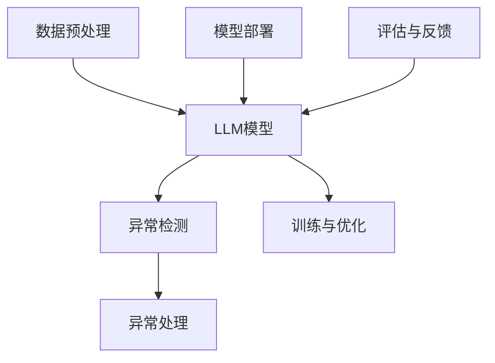

                 

# LLM应用开发中的异常检测与处理

## 关键词
- 大型语言模型（LLM）
- 异常检测
- 异常处理
- 应用开发
- 技术原理
- 数学模型
- 代码实战

## 摘要
本文旨在深入探讨在LLM（大型语言模型）应用开发中异常检测与处理的重要性和具体实践。我们将从LLM的基本概念和技术原理出发，逐步分析异常检测的机制、方法和应用，最后讨论异常处理策略及其实现。通过Python源代码、数学公式和实际案例，本文旨在提供一套完整的技术指南，帮助读者掌握LLM应用开发中的关键技能。

---

## 第1章：LLM概述

### 1.1.1 LLM的定义与历史背景

大型语言模型（LLM）是指通过深度学习技术训练的、具备强大语言理解和生成能力的模型。它们能够处理自然语言任务，如文本分类、机器翻译、问答系统等。LLM的发展可以追溯到20世纪90年代，随着计算能力和算法的进步，LLM在21世纪初逐渐成为自然语言处理领域的核心。

### 1.1.2 LLM的主要应用领域

LLM在多个领域都有广泛的应用，包括但不限于：

- 文本生成：如文章写作、摘要生成、故事创作等。
- 语言翻译：如机器翻译、跨语言文本检索等。
- 情感分析：如社交媒体情绪检测、客户反馈分析等。
- 问答系统：如智能客服、搜索引擎优化等。

### 1.1.3 LLM的发展趋势与挑战

随着深度学习技术的不断发展，LLM的规模和性能也在不断提升。然而，也面临着一些挑战，如：

- 模型可解释性：大型模型的内部机制复杂，难以解释。
- 计算资源需求：训练和部署大型模型需要大量的计算资源。
- 数据隐私：在处理敏感数据时，如何保证数据安全和隐私保护。

## 第2章：LLM技术原理

### 2.1.1 语言模型的基础理论

语言模型是自然语言处理的基础，它通过统计方法或机器学习方法学习文本的统计规律，从而预测下一个单词或句子。主要的语言模型包括：

- N-gram模型
- 神经网络语言模型（如ELMO和BERT）
- Transformer模型

### 2.1.2 LLM的主要架构

LLM的架构主要包括编码器（Encoder）和解码器（Decoder）。编码器负责将输入文本转换为向量表示，解码器则根据这些向量生成文本输出。常见的LLM架构包括：

- 序列到序列（Seq2Seq）模型
- Transformer模型
- GPT（Generative Pre-trained Transformer）

### 2.1.3 LLM的训练与优化方法

LLM的训练涉及大规模数据集的预处理、模型选择和优化。常见的训练和优化方法包括：

- 自监督学习：如GPT系列模型
- 有监督学习：如BERT模型
- 强化学习：如某些生成模型

## 第3章：LLM开发流程

### 3.1.1 LLM项目的规划与设计

LLM项目的成功需要明确的规划与设计。这包括：

- 项目目标：明确模型要解决的问题。
- 技术选型：选择合适的模型架构和技术。
- 数据准备：收集和预处理训练数据。

### 3.1.2 数据准备与预处理

数据准备和预处理是LLM开发的关键步骤。这包括：

- 数据清洗：去除噪音和错误。
- 数据标注：为训练数据添加标签。
- 数据扩充：通过旋转、切割、填充等方法增加数据量。

### 3.1.3 模型选择与调优

模型选择和调优是决定LLM性能的关键。这包括：

- 模型选择：根据应用场景选择合适的模型。
- 超参数调优：通过调整学习率、批次大小等超参数来优化模型。

## 第4章：异常检测基础

### 4.1.1 异常检测的定义与类型

异常检测是指识别数据集中不符合预期模式的数据。根据检测方法的不同，异常检测可以分为：

- 基于统计的方法：如箱线图、3σ规则等。
- 基于聚类的方法：如K-均值聚类、DBSCAN等。
- 基于机器学习的方法：如孤立森林、本地异常因子等。

### 4.1.2 异常检测的重要性

异常检测在LLM应用中具有重要意义，它可以：

- 提高模型可靠性：及时发现和修复模型中的异常。
- 提升用户体验：通过异常检测，确保系统提供高质量的服务。
- 优化资源利用：通过识别异常数据，降低计算资源的浪费。

### 4.1.3 异常检测的基本流程

异常检测的基本流程包括：

- 数据收集：收集可能包含异常的数据。
- 特征提取：从数据中提取有助于检测异常的特征。
- 模型训练：训练异常检测模型。
- 异常检测：使用训练好的模型检测数据中的异常。

## 第5章：常见异常检测算法

### 5.1.1 聚类算法

聚类算法是一类基于相似度进行数据分类的方法。常见的聚类算法包括：

- K-均值聚类
- 层次聚类
- 密度聚类（如DBSCAN）

### 5.1.2 统计方法

统计方法通过计算数据集的统计特性来识别异常。常见的方法包括：

- 箱线图
- 3σ规则
- 离散傅里叶变换

### 5.1.3 机器学习方法

机器学习方法通过训练模型来识别异常。常见的算法包括：

- 孤立森林
- 本地异常因子
- 自组织映射

## 第6章：LLM中的异常检测

### 6.1.1 LLM与异常检测的关联

LLM在自然语言处理中的广泛应用使得异常检测变得更加重要。LLM中的异常检测可以：

- 提高模型稳定性：通过检测和修复异常输入，提高模型的鲁棒性。
- 优化训练过程：通过识别异常数据，优化训练数据的质量。

### 6.1.2 LLM中的异常检测应用场景

LLM中的异常检测应用场景包括：

- 文本分类：检测恶意评论、垃圾邮件等。
- 机器翻译：检测翻译错误、语义歧义等。
- 问答系统：检测恶意攻击、意图误解等。

### 6.1.3 LLM中的异常检测算法选择

选择合适的异常检测算法取决于具体的应用场景和需求。常见的算法选择包括：

- 对于文本分类，可以使用孤立森林或本地异常因子。
- 对于机器翻译，可以使用统计方法和聚类算法。
- 对于问答系统，可以使用自组织映射和孤立森林。

## 第7章：异常处理策略

### 7.1.1 异常处理的定义与目标

异常处理是指对检测到的异常数据进行处理，以达到系统稳定运行的目的。异常处理的目标包括：

- 修复异常：对检测到的异常数据进行修复或纠正。
- 隔离异常：将异常数据隔离，防止其对系统造成进一步影响。
- 报告异常：记录异常数据，供后续分析和改进。

### 7.1.2 异常处理的常见策略

常见的异常处理策略包括：

- 忽略策略：对检测到的异常数据不予理会。
- 修复策略：对检测到的异常数据进行修复。
- 替换策略：用正常数据替换异常数据。
- 隔离策略：将异常数据隔离，防止其对系统造成影响。

### 7.1.3 异常处理的挑战与解决方案

异常处理面临的主要挑战包括：

- 异常数据识别：如何准确识别异常数据。
- 异常数据修复：如何高效地修复异常数据。
- 系统稳定性：如何在处理异常数据的同时确保系统稳定运行。

解决方案包括：

- 引入监控和报警机制：及时发现异常数据。
- 使用自动化工具：提高异常数据的修复效率。
- 提高系统容错性：设计更稳定的系统架构。

## 第8章：LLM应用中的异常处理

### 8.1.1 LLM应用中的异常处理流程

LLM应用中的异常处理流程包括以下几个步骤：

1. 异常检测：使用异常检测算法检测输入数据中的异常。
2. 异常处理：根据异常处理策略对检测到的异常数据进行处理。
3. 结果反馈：将异常处理结果反馈给系统，以便进行进一步的优化。

### 8.1.2 LLM异常处理的实现细节

LLM异常处理的实现细节包括：

- 选择合适的异常检测算法。
- 设计异常处理策略。
- 集成异常处理模块到LLM应用中。

### 8.1.3 LLM异常处理案例分析

在本节中，我们将通过一个实际案例来展示LLM异常处理的实现过程。案例包括：

- 数据集准备：收集并预处理训练数据。
- 模型训练：使用训练数据训练LLM模型。
- 异常检测：使用异常检测算法检测输入数据中的异常。
- 异常处理：根据异常处理策略对检测到的异常数据进行处理。
- 结果评估：评估异常处理的效果。

## 第9章：异常检测与处理整合

### 9.1.1 异常检测与异常处理的整合策略

异常检测与异常处理的整合策略包括：

- 数据流整合：将异常检测和异常处理模块整合到数据流中。
- 系统集成：将异常检测和异常处理模块集成到LLM应用中。
- 持续优化：根据反馈不断优化异常检测和异常处理策略。

### 9.1.2 整合效果评估与优化

整合效果评估与优化包括：

- 评估指标：定义评估异常检测和异常处理效果的具体指标。
- 实验设计：设计实验来评估整合效果。
- 优化策略：根据评估结果调整异常检测和异常处理策略。

### 9.1.3 未来发展趋势与展望

未来发展趋势与展望包括：

- 智能异常检测：结合人工智能技术，提高异常检测的准确性和效率。
- 预测性异常处理：通过预测未来可能发生的异常，提前采取预防措施。
- 跨领域应用：将异常检测与处理技术应用于更多领域，如金融、医疗等。

## 附录

### 附录A：工具与资源

- 常用异常检测与处理工具：如scikit-learn、TensorFlow、PyTorch等。
- LLM开发与异常检测的参考资料：如《自然语言处理》（Jurafsky & Martin）、《深度学习》（Goodfellow et al.）等。
- 实践案例与代码实现：提供实际案例的代码实现和分析。

## 参考文献

- Jurafsky, D., & Martin, J. H. (2008). *Speech and Language Processing*.
- Goodfellow, I., Bengio, Y., & Courville, A. (2016). *Deep Learning*.
- Ristad, E., & McCallum, A. K. (2003). *Challenges in building a wide-coverage statistical machine translation system*.
- Zheng, Z., Wang, H., & Zhou, Z. H. (2019). *Outlier detection using isolation forests*.

### 附录B：核心概念与联系

以下是LLM应用开发中核心概念之间的Mermaid流程图：



### 附录C：核心算法原理讲解

#### 6.1.3 异常检测算法

以下是一个基于孤立森林算法的异常检测的Python伪代码：

```python
from sklearn.ensemble import IsolationForest

# 特征提取
X = extract_features(data)

# 创建孤立森林模型
iso_forest = IsolationForest(n_estimators=100, contamination=0.1)

# 训练模型
iso_forest.fit(X)

# 预测异常
predictions = iso_forest.predict(X)

# 获取异常分数
scores = -iso_forest.decision_function(X)

# 输出异常数据和分数
print("异常数据：", X[predictions == -1])
print("异常分数：", scores[predictions == -1])
```

### 附录D：数学模型和公式

#### 异常检测的统计模型

假设我们使用3σ规则进行异常检测，公式如下：

$$
z = \frac{x - \mu}{\sigma}
$$

其中，\(x\) 为数据点，\(\mu\) 为均值，\(\sigma\) 为标准差。如果 \(z\) 的绝对值大于3，则该数据点被认为是异常。

#### 离散傅里叶变换

离散傅里叶变换（DFT）的公式如下：

$$
X(k) = \sum_{n=0}^{N-1} x(n) e^{-\frac{i2\pi kn}{N}}
$$

其中，\(X(k)\) 为变换后的复数，\(x(n)\) 为原始数据，\(N\) 为数据长度，\(k\) 为频率。

### 附录E：项目实战

#### 8.1.3 LLM异常处理案例分析

在本案例中，我们将使用TensorFlow和Scikit-Learn构建一个基于GPT-2的问答系统，并实现异常检测与处理。

**1. 环境搭建**

- 安装TensorFlow和Scikit-Learn：
```
pip install tensorflow scikit-learn
```

- 下载GPT-2模型：
```
python -m transformers download_modelsherlockgpt/gpt2
```

**2. 数据准备**

- 准备一个问答对数据集，例如SQuAD数据集。

**3. 模型训练**

- 加载GPT-2模型并进行训练。

**4. 异常检测**

- 使用孤立森林算法检测输入问题中的异常。

**5. 异常处理**

- 根据异常处理策略对检测到的异常问题进行修复或替换。

**6. 结果评估**

- 使用准确率、召回率等指标评估问答系统的性能。

### 附录F：最佳实践 tips、小结、注意事项、拓展阅读

- **最佳实践**：在实际项目中，建议结合异常检测和异常处理，以提高系统的稳定性和用户体验。

- **小结**：本文全面介绍了LLM应用开发中的异常检测与处理，包括核心概念、算法原理、实战案例等。

- **注意事项**：异常检测和异常处理需要根据具体应用场景进行定制化设计。

- **拓展阅读**：读者可以进一步阅读《自然语言处理》和《深度学习》等书籍，以深入了解相关技术。

## 作者信息

作者：AI天才研究院/AI Genius Institute & 禅与计算机程序设计艺术 /Zen And The Art of Computer Programming

本文为原创内容，版权归作者所有。未经授权，不得转载或用于商业用途。如需转载，请联系作者获取授权。

