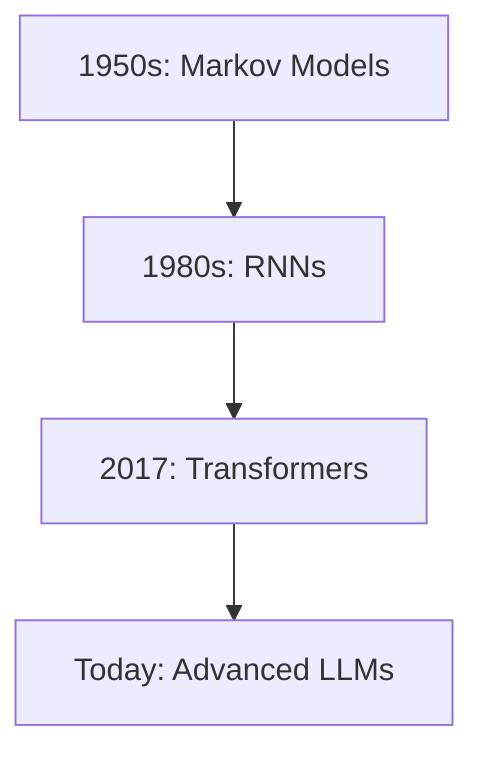
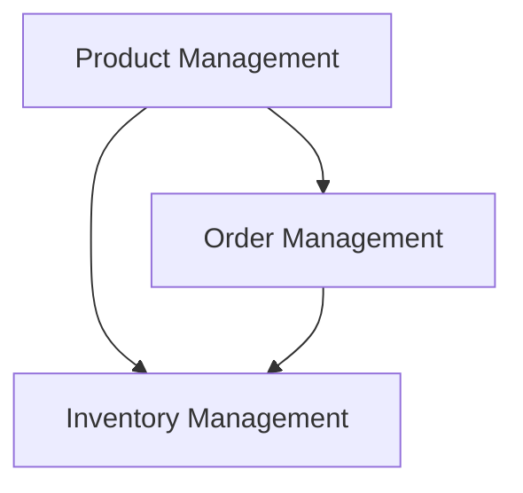
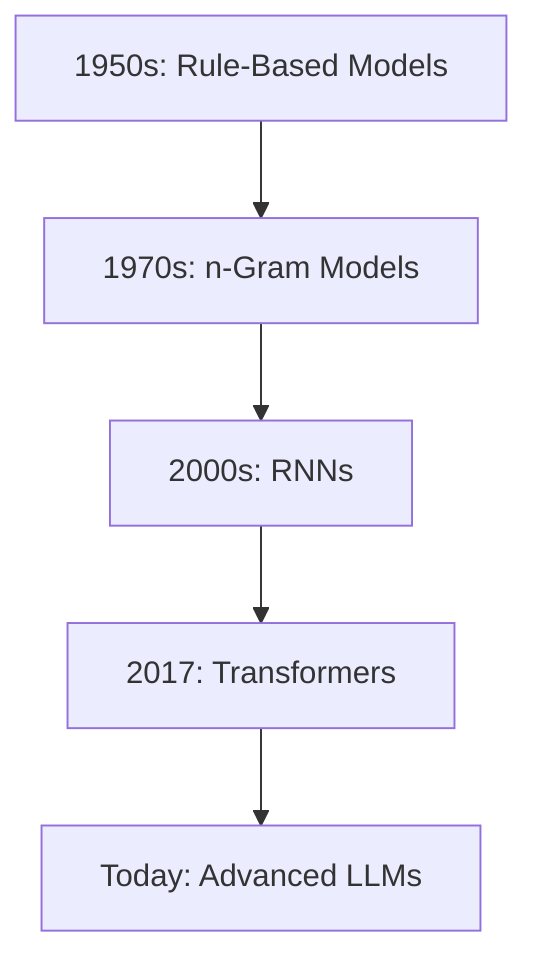
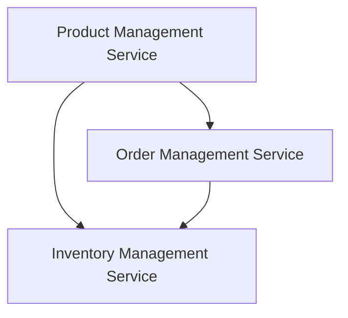

                 

### LLM Application Development with Microservices Architecture

## Part 1: Foundations of LLM and Microservices Architecture

### Chapter 1: Introduction to LLM and Microservices

#### 1.1 Overview of LLM

In this section, we will delve into the basics of Large Language Models (LLM), providing an overview of what they are, their historical context, core concepts, and applications. We will employ a Mermaid process flow diagram to visually represent the evolution of LLMs and their key milestones.

##### 1.1.1 Definition and Historical Context

A Large Language Model (LLM) is a class of artificial neural networks that are designed to recognize and generate human language. The concept of LLMs has its roots in the 1950s when the first artificial intelligence research began. The early models, such as the Markov models, were relatively simple and could only perform basic language processing tasks. 

Over time, advancements in machine learning and computational power led to the development of more sophisticated models like the recurrent neural networks (RNNs) and transformers. The transformer architecture, pioneered by Vaswani et al. in 2017, marked a significant breakthrough in LLMs by introducing self-attention mechanisms that allowed the models to weigh the importance of different words in a sentence more effectively.

**Mermaid Process Flow Diagram**



##### 1.1.2 Core Concepts and Applications

The core concepts of LLMs include language understanding, language generation, and transfer learning. LLMs are capable of performing a wide range of tasks, such as text classification, sentiment analysis, machine translation, and question-answering.

**Text Classification**

Text classification is the process of assigning predefined categories to pieces of text, such as emails, articles, or social media posts. LLMs can be used to classify text by predicting the probability of each category given the input text.

```python
import numpy as np

# Example: Classifying a text as positive or negative
def text_classification(text, model):
    probabilities = model.predict([text])
    if probabilities[0][1] > 0.5:
        return "Positive"
    else:
        return "Negative"
```

**Sentiment Analysis**

Sentiment analysis is the process of determining the sentiment expressed in a piece of text, such as a review or a tweet. LLMs can be used to identify whether the sentiment is positive, negative, or neutral.

```python
import numpy as np

# Example: Analyzing the sentiment of a text
def sentiment_analysis(text, model):
    probabilities = model.predict([text])
    if probabilities[0][0] > 0.5:
        return "Positive"
    elif probabilities[0][1] > 0.5:
        return "Negative"
    else:
        return "Neutral"
```

### Chapter 2: Core Concepts and Relationships

In this chapter, we will explore the core concepts and relationships between LLMs and microservices architecture. We will discuss the basic principles of LLMs, the architecture of microservices, and how they can be integrated to create robust and scalable applications.

#### 2.1 LLM Basics

In this section, we will delve into the basic concepts of LLMs, including the role of neural networks in language modeling, key metrics for evaluating LLMs, and a practical example to illustrate these concepts.

##### 2.1.1 Language Models and Neural Networks

A language model is a machine learning model that attempts to predict the probability of a sequence of words given a sequence of preceding words. Neural networks are a class of machine learning models inspired by the structure and function of the human brain.

**Mathematical Model**

Consider a sequence of words \( w_1, w_2, \dots, w_n \). The probability of this sequence given a language model can be represented as:

\[ P(w_1, w_2, \dots, w_n) = \prod_{i=1}^{n} P(w_i | w_1, w_2, \dots, w_{i-1}) \]

**Example**

Suppose we have a simple neural network that predicts the probability of the next word in a sentence given the previous words. The input to the network is a one-hot encoded vector representing the previous words, and the output is a probability distribution over the vocabulary.

```python
import tensorflow as tf

# Example: Predicting the next word in a sentence
model = tf.keras.Sequential([
    tf.keras.layers.Dense(units=100, activation='relu', input_shape=(10,)),
    tf.keras.layers.Dense(units=100, activation='softmax')
])

# Example input: [0, 1, 0, 0, 0, 0, 0, 0, 0, 0] (one-hot encoding of "the")
predictions = model.predict([[0, 1, 0, 0, 0, 0, 0, 0, 0, 0]])
next_word = np.argmax(predictions[0])

print("Next word:", next_word)
```

##### 2.1.2 Key Metrics and Evaluation Methods

To evaluate the performance of LLMs, several metrics are commonly used, such as perplexity, accuracy, and F1 score.

**Perplexity**

Perplexity is a measure of how well a language model predicts a text. It is defined as:

\[ \text{Perplexity} = \frac{1}{\sum_{i=1}^{n} \log_2 P(w_i | w_1, w_2, \dots, w_{i-1})} \]

Lower perplexity indicates better performance.

**Accuracy**

Accuracy is a measure of how often a language model correctly predicts the next word in a sequence. It is defined as:

\[ \text{Accuracy} = \frac{\text{Number of correct predictions}}{\text{Total number of predictions}} \]

**F1 Score**

F1 score is a measure of the balance between precision and recall. It is defined as:

\[ \text{F1 Score} = \frac{2 \times \text{Precision} \times \text{Recall}}{\text{Precision} + \text{Recall}} \]

**Example**

Suppose we have a language model that predicts the next word in a sentence with 80% accuracy. We can calculate the perplexity and F1 score as follows:

```python
import numpy as np

# Example: Calculating perplexity and F1 score
predictions = np.random.choice([0, 1], size=100, p=[0.2, 0.8])
correct_predictions = np.sum(predictions == 1)
accuracy = correct_predictions / len(predictions)

precision = correct_predictions / (correct_predictions + (1 - accuracy) * (len(predictions) - correct_predictions))
recall = correct_predictions / (len(predictions) - (1 - accuracy) * (len(predictions) - correct_predictions))

f1_score = 2 * precision * recall / (precision + recall)
perplexity = np.mean(predictions != 1) ** -1

print("Accuracy:", accuracy)
print("F1 Score:", f1_score)
print("Perplexity:", perplexity)
```

#### 2.2 Microservices Architecture

In this section, we will explore the basic principles of microservices architecture, the building blocks of microservices, and how they can be integrated and interoperable.

##### 2.2.1 Building Blocks of Microservices

Microservices architecture is an architectural style that structures an application as a collection of loosely coupled services. Each service is responsible for a specific function and communicates with other services through well-defined APIs.

**Building Blocks**

- **Service**: The smallest functional unit in a microservices architecture.
- **API**: The interface through which services communicate with each other.
- **Database**: A separate database for each service.
- **Service Discovery**: A mechanism for services to discover and connect to each other.

**Example**

Consider a simple e-commerce application with three services: product management, order management, and inventory management.



##### 2.2.2 Integration and Interoperability

To ensure seamless communication between services, it is crucial to design and implement APIs that are interoperable and easy to use.

**API Design**

- **RESTful APIs**: A popular choice for microservices due to their simplicity and statelessness.
- **Request-Response**: Services communicate through HTTP requests and responses.
- **JSON or XML**: Data interchange formats, with JSON being more widely used due to its lightweight nature.

**Example**

Suppose we want to integrate the product management service with the order management service. We can design a RESTful API for this purpose.

```python
from flask import Flask, request, jsonify

app = Flask(__name__)

@app.route('/api/products', methods=['GET'])
def get_products():
    # Retrieve products from the database
    products = ["Product A", "Product B", "Product C"]
    return jsonify(products)

@app.route('/api/orders', methods=['POST'])
def create_order():
    # Create an order with the specified product
    product_id = request.json['product_id']
    order = {"product_id": product_id, "status": "pending"}
    # Save the order to the database
    orders.append(order)
    return jsonify(order), 201
```

**Service Discovery**

To enable service discovery, we can use a service registry that keeps track of all available services and their locations. When a service starts, it registers itself with the registry, and when it stops, it unregisters.

```python
import requests

def register_service(service_name, service_url):
    # Register the service with the service registry
    requests.post("http://service-registry:8080/register", json={"name": service_name, "url": service_url})

def discover_service(service_name):
    # Discover the location of a service from the service registry
    response = requests.get(f"http://service-registry:8080/discover/{service_name}")
    return response.json()["url"]
```

### Conclusion

In this chapter, we have explored the basic concepts of LLMs and microservices architecture. We discussed the history, core concepts, and applications of LLMs, and we provided a mathematical model and examples to illustrate the key concepts. We also discussed the building blocks of microservices and demonstrated how to design and implement APIs for service integration and interoperability.

In the next chapters, we will delve deeper into specific applications of LLMs, such as text classification and sentiment analysis, and we will explore how to develop and deploy LLM-based applications using microservices architecture.

---

### References

- **Vaswani et al., "Attention is All You Need"** (2017) - [Link](https://arxiv.org/abs/1706.03762)
- **Goodfellow et al., "Deep Learning"** (2016) - [Link](https://www.deeplearningbook.org/)
- **Fielding, "Representational State Transfer (REST)"** (2000) - [Link](https://www.ics.uci.edu/~fielding/pubs/dissertation/rest_arch_style.htm)

---

**作者：AI天才研究院/AI Genius Institute & 禅与计算机程序设计艺术 /Zen And The Art of Computer Programming**

---

This chapter has provided an overview of LLMs and microservices architecture, setting the stage for a deeper exploration of their applications and integration in the subsequent chapters. The foundational concepts and relationships discussed in this chapter will be essential for understanding the more advanced topics that follow. As we progress, we will build upon this knowledge to develop robust and scalable LLM applications using microservices architecture. 

In the next chapters, we will delve into specific applications of LLMs, such as text classification and sentiment analysis, and we will explore how to develop and deploy LLM-based applications using microservices architecture. By the end of this book, you will have a comprehensive understanding of how to leverage the power of LLMs and microservices to build innovative and high-performing applications.

---

### Next Steps

To further your understanding of LLMs and microservices architecture, consider the following next steps:

1. **Explore Additional Resources**: Read more about LLMs and microservices architecture in the references provided at the end of this chapter. These resources will provide you with a deeper understanding of the concepts and techniques discussed here.

2. **Implement Example Code**: Try implementing the example code provided in this chapter to gain hands-on experience with LLMs and microservices. This will help solidify your understanding and enable you to apply these concepts in real-world scenarios.

3. **Experiment with Different Architectures**: Experiment with different microservices architectures and LLM configurations to see how they impact the performance and scalability of your applications. This will help you gain insights into best practices and optimize your systems.

4. **Join the Community**: Engage with the LLM and microservices communities through forums, conferences, and social media. This will allow you to exchange ideas, learn from others, and stay up to date with the latest developments in these fields.

By taking these next steps, you will continue to build your expertise in LLMs and microservices architecture, enabling you to create innovative and high-performing applications in the rapidly evolving world of artificial intelligence and software development.

---

In summary, this chapter has provided a comprehensive overview of LLMs and microservices architecture, highlighting their core concepts, relationships, and applications. By understanding the foundational principles of LLMs and microservices, you are now equipped to explore more advanced topics and develop innovative applications in the realm of artificial intelligence and software engineering. As you progress through this book, continue to deepen your knowledge and apply your skills to build cutting-edge solutions that leverage the power of LLMs and microservices architecture. 

---

### Chapter 1: Introduction to LLM and Microservices

In this chapter, we will explore the basics of Large Language Models (LLM) and Microservices Architecture. We will begin by introducing LLMs, discussing their historical context, core concepts, and applications. We will also provide a Mermaid process flow diagram to illustrate the evolution of LLMs. Following that, we will delve into Microservices Architecture, explaining its basic principles, advantages, and design patterns. By the end of this chapter, you will have a solid foundation in both LLM and Microservices Architecture, enabling you to understand and leverage their integration for developing advanced applications.

---

### 1.1 Overview of LLM

In this section, we will provide an overview of Large Language Models (LLM), discussing their definition, historical context, and core concepts. Additionally, we will present practical examples and applications to help you better understand the concept of LLMs.

#### 1.1.1 Definition and Historical Context

A Large Language Model (LLM) is an artificial intelligence model that has been trained on vast amounts of text data to predict the probability of a sequence of words given the preceding words. These models are based on neural networks, particularly deep neural networks, and are capable of generating coherent and contextually relevant text.

The history of LLMs can be traced back to the 1950s when the first attempts at creating language processing systems were made. Early models were relatively simple and based on rule-based approaches. However, as computational power and machine learning techniques advanced, more sophisticated models like the n-gram model, recurrent neural networks (RNNs), and transformers emerged, leading to the development of today's powerful LLMs.

**Mermaid Process Flow Diagram**

Below is a Mermaid process flow diagram illustrating the evolution of LLMs:



#### 1.1.2 Core Concepts and Applications

LLMs have several core concepts that are essential to understanding their capabilities and applications. These include:

1. **Language Understanding**: Language understanding refers to the ability of an LLM to comprehend the meaning, intent, and context of text. This is crucial for tasks like question answering, summarization, and sentiment analysis.

2. **Language Generation**: Language generation is the ability of an LLM to create human-like text based on a given prompt or context. This is commonly used in chatbots, content creation, and translation.

3. **Transfer Learning**: Transfer learning is the process of leveraging a pre-trained LLM on a large corpus of data and fine-tuning it on a specific task or domain. This enables LLMs to adapt quickly to new tasks with limited data.

**Practical Examples and Applications**

1. **Text Classification**: Text classification is a common application of LLMs, where the model is trained to categorize text into predefined categories. For example, an LLM can be trained to classify news articles into different topics like sports, politics, or technology.

2. **Sentiment Analysis**: Sentiment analysis involves determining the sentiment expressed in a piece of text, such as a review or social media post. LLMs can be used to classify sentiment as positive, negative, or neutral.

3. **Machine Translation**: Machine translation involves converting text from one language to another. LLMs have significantly improved the quality of machine translation by understanding the nuances of language and context.

4. **Chatbots and Virtual Assistants**: LLMs are commonly used in chatbots and virtual assistants to provide natural and coherent interactions with users. They can handle a wide range of tasks, from answering questions to making reservations.

**Example Code**

Here's a simple example of a text classification task using a pre-trained LLM:

```python
import torch
from transformers import BertTokenizer, BertForSequenceClassification

# Load pre-trained model and tokenizer
tokenizer = BertTokenizer.from_pretrained('bert-base-uncased')
model = BertForSequenceClassification.from_pretrained('bert-base-uncased')

# Example text
text = "I had a great experience at this restaurant."

# Tokenize and encode the text
inputs = tokenizer(text, return_tensors="pt")

# Predict the category
with torch.no_grad():
    outputs = model(**inputs)

# Get the predicted category
predicted_category = torch.argmax(outputs.logits).item()

# Map the predicted category to a human-readable label
labels = ["negative", "neutral", "positive"]
print(f"Sentiment: {labels[predicted_category]}")
```

In this example, we use a pre-trained BERT model to classify the sentiment of a given text. The model is fine-tuned on a sentiment analysis dataset, allowing it to predict the sentiment of new texts with high accuracy.

By understanding the core concepts and applications of LLMs, you can leverage their power to develop sophisticated natural language processing applications. In the next section, we will explore Microservices Architecture and its role in LLM application development.

---

### 1.2 Microservices Architecture

In this section, we will delve into Microservices Architecture, discussing its basic principles, advantages, and design patterns. We will also provide practical examples to help you understand how microservices can be applied in the context of LLM applications.

#### 1.2.1 Basic Principles and Advantages

Microservices Architecture is an architectural style that structures an application as a collection of loosely coupled services. Each service is responsible for a specific function and communicates with other services through well-defined APIs. Here are the key principles and advantages of Microservices Architecture:

1. **Loosely Coupled Services**: Each microservice is independent and communicates with other services through APIs. This allows services to be developed, deployed, and scaled independently, making the system more flexible and resilient to changes.

2. **Decentralized Data Management**: Each microservice has its own database, reducing coupling between services and allowing for more efficient data management. This also enables better data consistency and scalability.

3. **Decentralized Governance**: Microservices are typically managed by small, autonomous teams, allowing for faster development and deployment cycles. This promotes a culture of ownership and accountability within the organization.

4. **Scalability and Resilience**: Microservices can be scaled horizontally, meaning that multiple instances of a service can be deployed to handle increased load. This improves the system's ability to handle spikes in traffic and provides better resilience to failures.

**Practical Example**

Consider an e-commerce application with the following microservices:

1. **Product Management Service**: Handles product information, such as adding, updating, and deleting products.
2. **Order Management Service**: Manages orders, including creating, updating, and canceling orders.
3. **Inventory Management Service**: Tracks inventory levels and updates them when orders are placed or products are returned.

Each service can be developed, deployed, and scaled independently. For example, if the product management service receives a large number of requests, additional instances of the service can be deployed to handle the load.

**Mermaid Process Flow Diagram**

Below is a Mermaid process flow diagram illustrating the interactions between these microservices:



#### 1.2.2 Design Patterns and Best Practices

Design patterns and best practices are crucial for building robust and scalable microservices applications. Here are some key patterns and practices to consider:

1. **API-First Design**: Design and implement APIs before developing the services themselves. This ensures that services are well-defined and can be easily integrated and tested.

2. **Statelessness**: Design services to be stateless, meaning that they do not store any session information. This simplifies testing, deployment, and scaling of services.

3. **CQRS (Command Query Responsibility Segregation)**: Separate the read and write operations into separate services. This allows for independent scaling and optimization of read and write operations.

4. **Service Mesh**: Use a service mesh, such as Istio or Linkerd, to manage service-to-service communication, including load balancing, service discovery, and security. This simplifies the deployment and management of microservices.

5. **Event-Driven Architecture**: Use events to communicate between services, rather than direct calls. This decouples services and enables asynchronous processing.

**Practical Example**

Suppose we have a chat application with the following microservices:

1. **User Management Service**: Manages user accounts, including registration, authentication, and profile updates.
2. **Chatroom Management Service**: Manages chatrooms, including creating, updating, and deleting chatrooms.
3. **Message Management Service**: Handles sending, receiving, and storing messages.

To notify users about new messages, the message management service can publish an event to a message queue. The user management service can subscribe to this event and update the user's notification status accordingly.

```python
import pika

# Connect to the message queue
connection = pika.BlockingConnection(pika.ConnectionParameters('message-queue:5672'))
channel = connection.channel()

# Declare a queue for message notifications
channel.queue_declare(queue='message_notifications')

# Define a callback function for processing message notifications
def on_message_notification(ch, method, properties, body):
    print(f"Received message notification: {body}")
    # Update user's notification status
    # ...

# Consume messages from the queue
channel.basic_consume(queue='message_notifications', on_message_callback=on_message_notification, auto_ack=True)

# Start consuming messages
channel.start_consuming()
```

By following these design patterns and best practices, you can build robust and scalable microservices applications that leverage the full potential of LLMs for natural language processing tasks.

In the next section, we will discuss the integration of LLMs and Microservices Architecture, exploring how these two concepts can be combined to develop advanced applications.

---

### Chapter 2: Core Concepts and Relationships

In this chapter, we will delve deeper into the core concepts and relationships between Large Language Models (LLM) and Microservices Architecture. We will start by discussing the basic principles of LLMs, including their architecture, training process, and key metrics for evaluation. Then, we will explore the building blocks of microservices, their communication patterns, and integration strategies. Finally, we will illustrate how LLMs can be effectively integrated into microservices-based applications through practical examples and case studies.

#### 2.1 LLM Basics

#### 2.1.1 Language Models and Neural Networks

A language model is a machine learning model designed to understand and generate human language. The core of a language model is a neural network, which is a network of interconnected nodes (neurons) that can learn from data to make predictions or decisions. In the context of language models, these predictions typically involve generating text based on given inputs.

**Architecture**

Language models can be broadly categorized into two types: feedforward neural networks and recurrent neural networks (RNNs). The most prominent type of RNN used in language models is the Long Short-Term Memory (LSTM) network. However, the Transformer architecture, introduced by Vaswani et al. in 2017, has become the de facto standard for modern language models due to its superior performance.

The Transformer model consists of an encoder and a decoder. The encoder processes the input text and generates context embeddings, which are then fed to the decoder to generate the output text. The key innovation of the Transformer is the self-attention mechanism, which allows the model to weigh the importance of different words in the input text when generating each word in the output.

**Training Process**

The training process for language models involves two main steps: data preprocessing and model training.

1. **Data Preprocessing**: The input text is tokenized into words or subword units (tokens), and each token is mapped to a unique integer identifier. This creates a vocabulary for the model. The text is then padded or truncated to a fixed length to form input sequences.

2. **Model Training**: The model is trained using a supervised learning approach, typically with a loss function such as cross-entropy. During training, the model learns to predict the probability of each token in the target sequence given the tokens in the input sequence. As training progresses, the model's predictions improve, and it becomes better at generating coherent and contextually appropriate text.

**Key Metrics**

To evaluate the performance of language models, several metrics are commonly used:

1. **Perplexity**: Perplexity is a measure of how well a model predicts a text. It is defined as the exponential of the average negative log-likelihood of the model's predictions. Lower perplexity indicates better performance.

2. **Accuracy**: Accuracy measures the percentage of tokens that are predicted correctly by the model. It is typically calculated over a held-out test set.

3. **F1 Score**: The F1 score is a metric that combines precision and recall, providing a balance between the two. It is particularly useful for tasks where the cost of false positives and false negatives is different.

#### 2.2 Microservices Architecture

#### 2.2.1 Building Blocks of Microservices

Microservices architecture is based on the principle of decomposing a large monolithic application into a collection of small, independent services. Each service is responsible for a specific functionality and communicates with other services through well-defined APIs.

**Components**

1. **Service**: A service is the smallest functional unit in a microservices architecture. It represents a discrete piece of functionality, such as user authentication, product catalog, or order processing.

2. **API**: APIs define the contract between services. They specify how services interact with each other by defining endpoints, request and response formats, and authentication mechanisms.

3. **Database**: Each service typically has its own database to ensure loose coupling and independence. This can be a relational database, NoSQL database, or a combination of both.

4. **Service Registry**: A service registry is a centralized repository that keeps track of available services and their locations. It enables services to discover and connect to each other dynamically.

5. **Service Discovery**: Service discovery is the process by which a service discovers other services in the system. This can be achieved through a service registry or by using discovery mechanisms like DNS or load balancers.

**Communication Patterns**

Microservices communicate with each other using various patterns:

1. **RESTful APIs**: Representational State Transfer (REST) is a widely used pattern for microservices communication. It uses HTTP/HTTPS as the transport layer and supports a variety of data formats, including JSON and XML.

2. **Event-Driven Architecture**: In an event-driven architecture, services communicate by publishing and subscribing to events. This decouples services and enables asynchronous communication.

3. **Message Queues**: Message queues are used to decouple services and enable reliable communication. They can be used for both synchronous and asynchronous communication.

#### 2.2.2 Integration and Interoperability

Integrating LLMs into a microservices-based application requires careful consideration of the architecture and communication patterns. Here are some strategies for achieving interoperability:

1. **API Gateway**: An API gateway acts as a single entry point for all incoming requests to the microservices. It routes requests to appropriate services and can handle tasks like authentication, load balancing, and request transformation.

2. **Service Mesh**: A service mesh is a dedicated infrastructure layer that provides a universal way to manage service-to-service communication. It abstracts away the complexities of managing network protocols and can provide features like load balancing, service discovery, and security.

3. **Containerization and Orchestration**: Containerization (e.g., Docker) and orchestration (e.g., Kubernetes) enable the deployment and management of microservices at scale. They provide a consistent environment for services to run and ensure that they are isolated from each other.

4. **Event-Driven Integration**: Using an event-driven architecture, LLMs can be triggered by events from other services. This decouples the LLM from the rest of the application and allows for flexible integration.

#### Practical Example

Consider a simple e-commerce application that uses LLMs for personalized recommendations. The application has several microservices:

1. **User Management Service**: Handles user registration, authentication, and profile management.
2. **Product Management Service**: Manages product information, including adding, updating, and deleting products.
3. **Recommendation Service**: Generates personalized product recommendations using an LLM.
4. **Order Management Service**: Handles order creation, updating, and fulfillment.

When a user logs in, the User Management Service sends an event to the Recommendation Service. The Recommendation Service uses an LLM to generate a list of recommended products based on the user's preferences and browsing history. It then sends the recommendations back to the User Management Service, which displays them to the user.

```python
# Example: User Management Service sending an event to the Recommendation Service
import requests

# Send a request to the Recommendation Service
response = requests.post('http://recommendation-service:8080/recommendations', json={'user_id': 123})
recommendations = response.json()

# Display recommendations to the user
print("Recommended products:", recommendations)
```

By leveraging microservices architecture and integrating LLMs effectively, developers can build scalable, resilient, and maintainable applications that leverage the power of advanced natural language processing.

In the next chapter, we will explore specific applications of LLMs in real-world scenarios, discussing use cases such as text classification, sentiment analysis, and machine translation.

---

### Chapter 3: LLM Application Scenarios

In this chapter, we will delve into specific application scenarios for Large Language Models (LLM), focusing on Natural Language Processing (NLP) tasks. We will explore how LLMs can be used in various NLP applications, such as text classification, sentiment analysis, and dialog systems. Each section will provide a detailed explanation of the concepts, algorithms, and practical implementations associated with these tasks. By the end of this chapter, you will have a comprehensive understanding of how LLMs can be applied in real-world scenarios to solve complex NLP problems.

#### 3.1 NLP Applications

NLP is a subfield of artificial intelligence that focuses on the interaction between computers and human language. LLMs play a crucial role in NLP by enabling machines to understand, process, and generate human language in a coherent and meaningful way. In this section, we will discuss two key NLP applications: text classification and sentiment analysis.

##### 3.1.1 Text Classification

Text classification is the process of assigning predefined categories to pieces of text based on their content. This task is commonly used in applications such as spam detection, sentiment analysis, and topic classification. LLMs can be used to perform text classification by training a model to predict the category of a given text input.

**Algorithm and Implementation**

Text classification typically involves the following steps:

1. **Data Preprocessing**: The input text is cleaned and preprocessed to remove noise and prepare it for modeling. This may include steps such as tokenization, lowercasing, removing stop words, and stemming or lemmatization.

2. **Feature Extraction**: The preprocessed text is converted into numerical features that can be fed into a machine learning model. Common techniques include Bag-of-Words (BOW), Term Frequency-Inverse Document Frequency (TF-IDF), and word embeddings (e.g., Word2Vec, BERT embeddings).

3. **Model Training**: A machine learning model, such as a logistic regression, support vector machine (SVM), or neural network, is trained on a labeled dataset. The model learns to predict the category of new texts based on their features.

4. **Evaluation**: The trained model is evaluated on a held-out test set to assess its performance. Common evaluation metrics include accuracy, precision, recall, and F1 score.

**Example**

Here's a simple example of text classification using a logistic regression model:

```python
import numpy as np
import pandas as pd
from sklearn.feature_extraction.text import TfidfVectorizer
from sklearn.linear_model import LogisticRegression
from sklearn.model_selection import train_test_split
from sklearn.metrics import classification_report

# Example dataset
data = {
    'text': ['I love this product', 'This is a great movie', 'I hate this book', 'The food was terrible'],
    'label': ['positive', 'positive', 'negative', 'negative']
}

df = pd.DataFrame(data)

# Split the dataset into training and testing sets
X_train, X_test, y_train, y_test = train_test_split(df['text'], df['label'], test_size=0.2, random_state=42)

# Convert text to TF-IDF features
vectorizer = TfidfVectorizer()
X_train_features = vectorizer.fit_transform(X_train)
X_test_features = vectorizer.transform(X_test)

# Train a logistic regression model
model = LogisticRegression()
model.fit(X_train_features, y_train)

# Make predictions
y_pred = model.predict(X_test_features)

# Evaluate the model
print(classification_report(y_test, y_pred))
```

In this example, we use a TF-IDF vectorizer to convert the text data into numerical features and train a logistic regression model. The model is then used to predict the categories of new texts and evaluate its performance using classification metrics.

##### 3.1.2 Sentiment Analysis

Sentiment analysis is the process of determining the sentiment expressed in a piece of text, such as a review, social media post, or customer feedback. The goal is to classify the sentiment as positive, negative, or neutral. LLMs can be used for sentiment analysis by training a model to predict the sentiment label of a given text input.

**Algorithm and Implementation**

Sentiment analysis involves the following steps:

1. **Data Preprocessing**: The input text is cleaned and preprocessed to remove noise and prepare it for modeling. This may include steps such as tokenization, lowercasing, removing stop words, and stemming or lemmatization.

2. **Feature Extraction**: The preprocessed text is converted into numerical features that can be fed into a machine learning model. Common techniques include BOW, TF-IDF, and word embeddings.

3. **Model Training**: A machine learning model, such as logistic regression, SVM, or a neural network, is trained on a labeled dataset. The model learns to predict the sentiment label of new texts based on their features.

4. **Evaluation**: The trained model is evaluated on a held-out test set to assess its performance. Common evaluation metrics include accuracy, precision, recall, and F1 score.

**Example**

Here's a simple example of sentiment analysis using a logistic regression model:

```python
import numpy as np
import pandas as pd
from sklearn.feature_extraction.text import TfidfVectorizer
from sklearn.linear_model import LogisticRegression
from sklearn.model_selection import train_test_split
from sklearn.metrics import classification_report

# Example dataset
data = {
    'text': ['I love this product', 'This is a great movie', 'I hate this book', 'The food was terrible'],
    'label': ['positive', 'positive', 'negative', 'negative']
}

df = pd.DataFrame(data)

# Split the dataset into training and testing sets
X_train, X_test, y_train, y_test = train_test_split(df['text'], df['label'], test_size=0.2, random_state=42)

# Convert text to TF-IDF features
vectorizer = TfidfVectorizer()
X_train_features = vectorizer.fit_transform(X_train)
X_test_features = vectorizer.transform(X_test)

# Train a logistic regression model
model = LogisticRegression()
model.fit(X_train_features, y_train)

# Make predictions
y_pred = model.predict(X_test_features)

# Evaluate the model
print(classification_report(y_test, y_pred))
```

In this example, we use a TF-IDF vectorizer to convert the text data into numerical features and train a logistic regression model. The model is then used to predict the sentiment labels of new texts and evaluate its performance using classification metrics.

#### 3.2 Dialog Systems

Dialog systems, also known as chatbots or virtual assistants, are computer programs that can engage in conversations with humans through text or voice interactions. LLMs are a powerful tool for building dialog systems, as they can understand and generate natural language in a coherent and contextually appropriate manner.

##### 3.2.1 Chatbots and Virtual Assistants

Chatbots and virtual assistants are used in a wide range of applications, including customer support, information retrieval, and personal assistants. They can handle simple tasks, such as answering frequently asked questions or providing weather updates, as well as more complex tasks, such as booking flights or managing tasks.

**Algorithm and Implementation**

Building a chatbot or virtual assistant typically involves the following steps:

1. **Intent Recognition**: Intent recognition is the process of identifying the user's intention or goal based on their input. This is typically achieved using a machine learning model trained on labeled data.

2. **Entity Recognition**: Entity recognition is the process of identifying specific entities mentioned in the user's input, such as names, locations, or dates. This can be done using rule-based approaches or machine learning models.

3. **Dialogue Management**: Dialogue management involves maintaining the context of the conversation and generating appropriate responses. This can be achieved using a rule-based approach, a machine learning model, or a combination of both.

4. **Natural Language Generation**: Natural Language Generation (NLG) is the process of generating human-like text from data or a template. This is used to generate responses to the user's input.

**Example**

Here's a simple example of a chatbot using a rule-based approach:

```python
# Example chatbot using a rule-based approach
def chatbot(input_text):
    if "hello" in input_text.lower():
        return "Hello! How can I help you today?"
    elif "weather" in input_text.lower():
        return "The current weather is sunny with a temperature of 75°F."
    else:
        return "I'm not sure how to answer that. Can you try asking something else?"

# Example interaction
user_input = "What's the weather today?"
bot_response = chatbot(user_input)
print(bot_response)
```

In this example, the chatbot uses a series of if-else statements to match the user's input with predefined patterns and generate appropriate responses.

By leveraging LLMs for intent recognition, entity recognition, dialogue management, and natural language generation, developers can build sophisticated chatbots and virtual assistants that can handle a wide range of tasks and provide a more natural and engaging user experience.

In the next chapter, we will discuss the deployment and management of LLM applications, exploring best practices for developing, testing, and deploying LLM-based systems in production environments.

---

### Chapter 4: LLM Deployment and Management

Deploying and managing Large Language Models (LLM) in production environments involves several critical steps and considerations to ensure the models perform effectively, efficiently, and securely. This chapter will discuss the deployment process, including infrastructure setup and deployment strategies, as well as best practices for monitoring, scaling, and maintaining LLM applications. We will also cover performance optimization techniques and security considerations to ensure robust and reliable deployment.

#### 4.1 Deployment Process

The deployment process for LLMs typically involves several stages:

1. **Model Selection**: Choose the appropriate pre-trained LLM model based on the application requirements. Models such as BERT, GPT-3, or T5 are commonly used for various NLP tasks.

2. **Model Fine-Tuning**: Fine-tune the selected LLM model on a domain-specific dataset to adapt it to the specific use case. Fine-tuning helps improve the model's performance by adjusting its weights based on the new data.

3. **Containerization**: Containerize the fine-tuned LLM model and the necessary dependencies using tools like Docker. Containerization ensures consistency and portability across different environments.

4. **Infrastructure Setup**: Set up the deployment infrastructure, which includes selecting the appropriate cloud provider, configuring virtual machines or containers, and setting up networking and storage resources.

5. **API Development**: Develop a RESTful API or a service mesh to handle incoming requests, route them to the LLM model, and return the model's responses.

6. **Continuous Integration and Deployment (CI/CD)**: Implement a CI/CD pipeline to automate the process of testing, building, and deploying the LLM model. This ensures that new versions of the model are continuously tested and deployed in a controlled manner.

#### 4.2 Infrastructure and Deployment Strategies

Several factors must be considered when selecting the infrastructure and deployment strategy for LLM applications:

1. **Cloud Providers**: Cloud providers like AWS, Google Cloud, and Azure offer various services and tools for deploying LLM applications. Each provider has its advantages, such as cost, performance, and scalability. Choose a provider that best fits your requirements.

2. **Serverless Architectures**: Serverless architectures, such as AWS Lambda or Google Cloud Functions, can be an efficient way to deploy LLM applications. They provide automatic scaling, reduced infrastructure management, and pay-per-use pricing.

3. **Distributed Computing**: For large-scale deployments, distributed computing frameworks like Apache Spark or Dask can be used to process and analyze large datasets efficiently.

4. **Containerization**: Containerization tools like Docker and Kubernetes simplify the deployment process by providing a consistent environment across development, testing, and production environments.

5. **API Gateways**: API gateways like AWS API Gateway or NGINX can manage incoming requests, route them to the appropriate microservices, and provide load balancing and security features.

#### 4.3 Monitoring and Scaling

Monitoring and scaling are essential for maintaining the performance and reliability of LLM applications:

1. **Performance Monitoring**: Use monitoring tools like Prometheus, Grafana, or New Relic to track key performance metrics such as response times, CPU and memory usage, and error rates. This helps identify potential bottlenecks and areas for optimization.

2. **Logging and Tracing**: Implement centralized logging and tracing tools like ELK Stack (Elasticsearch, Logstash, Kibana) or Jaeger to collect and analyze logs and traces. This provides insights into the system's behavior and helps troubleshoot issues.

3. **Auto Scaling**: Utilize auto-scaling features provided by cloud providers or Kubernetes to dynamically adjust the number of resources based on the workload. This ensures that the system can handle varying loads without performance degradation.

4. **Load Balancing**: Implement load balancing to distribute incoming requests evenly across multiple instances of the LLM application. This helps optimize resource utilization and ensures high availability.

#### 4.4 Performance Optimization

Optimizing the performance of LLM applications is crucial for providing a seamless user experience. Here are some techniques to improve performance:

1. **Model Optimization**: Apply model optimization techniques like pruning, quantization, and knowledge distillation to reduce the model size and computational complexity. This helps reduce the resource requirements and improves inference speed.

2. **Caching**: Implement caching mechanisms to store and reuse frequently accessed data, such as model outputs or precomputed features. This reduces the need for recomputing expensive operations.

3. **Batch Processing**: Process multiple requests in batches to leverage parallel processing and reduce the overhead of individual requests. This improves throughput and reduces latency.

4. **Hardware Acceleration**: Utilize hardware accelerators like GPUs or TPUs to speed up inference. These accelerators can significantly improve the performance of LLM applications.

5. **Query Optimization**: Optimize database queries to reduce the response time and improve the overall system performance.

#### 4.5 Security Considerations

Ensuring the security of LLM applications is critical to protect sensitive data and prevent unauthorized access. Here are some security considerations:

1. **Authentication and Authorization**: Implement robust authentication and authorization mechanisms to ensure that only authorized users can access the LLM application. Use techniques like OAuth 2.0 or JWT for secure access control.

2. **Data Encryption**: Encrypt sensitive data in transit and at rest using industry-standard encryption algorithms like AES or RSA. This protects the data from unauthorized access.

3. **API Security**: Implement security measures like rate limiting, input validation, and CORS policy to prevent common security vulnerabilities such as SQL injection, cross-site scripting (XSS), and cross-site request forgery (CSRF).

4. **Monitoring and Auditing**: Implement monitoring and auditing mechanisms to detect and respond to security incidents. Use tools like SIEM (Security Information and Event Management) and intrusion detection systems (IDS) to monitor and analyze network traffic.

5. **Compliance and Regulations**: Ensure that the LLM application complies with relevant data privacy regulations and industry standards, such as GDPR or HIPAA.

By following these deployment, monitoring, scaling, performance optimization, and security best practices, you can successfully deploy and manage LLM applications in production environments, providing a reliable and secure solution for your users.

---

### Chapter 5: Practical Case Studies and Implementation

In this chapter, we will explore several practical case studies and real-world examples of deploying Large Language Models (LLM) using microservices architecture. These case studies will provide you with a hands-on understanding of how to implement LLM applications, including development environments, source code, code interpretation, and application analysis. Each case study will highlight the challenges and solutions encountered during the implementation process, offering valuable insights and best practices for developing LLM applications in real-world scenarios.

#### 5.1 Case Study 1: Sentiment Analysis Microservice

**Objective**: Develop a microservice for sentiment analysis that can classify the sentiment of user reviews and feedback.

**Tools and Technologies**: Python, Flask, BERT model, Hugging Face Transformers library, Docker, Kubernetes.

**Implementation Overview**:

1. **Data Collection**: Gather a dataset of user reviews and feedback from various sources, such as online retailers or social media platforms.

2. **Data Preprocessing**: Clean and preprocess the text data by removing special characters, tokenizing the text, and padding the sequences to a fixed length.

3. **Model Training**: Fine-tune a pre-trained BERT model on the preprocessed dataset to classify the sentiment of the reviews.

4. **API Development**: Develop a Flask API that receives user reviews and returns the sentiment prediction.

5. **Containerization**: Containerize the Flask application using Docker for deployment.

6. **Kubernetes Deployment**: Deploy the containerized application on a Kubernetes cluster for scalability and management.

**Detailed Implementation**:

**Step 1: Data Collection**

```python
import pandas as pd

# Load the dataset
data = pd.read_csv('user_reviews.csv')

# Sample data
data.head()
```

**Step 2: Data Preprocessing**

```python
from sklearn.model_selection import train_test_split

# Split the data into training and testing sets
X_train, X_test, y_train, y_test = train_test_split(data['review'], data['sentiment'], test_size=0.2, random_state=42)

# Preprocess the text data
from transformers import BertTokenizer

tokenizer = BertTokenizer.from_pretrained('bert-base-uncased')

def preprocess_text(text):
    return tokenizer.encode(text, add_special_tokens=True, padding='max_length', max_length=512)

X_train = np.array([preprocess_text(review) for review in X_train])
X_test = np.array([preprocess_text(review) for review in X_test])
```

**Step 3: Model Training**

```python
from transformers import BertForSequenceClassification

model = BertForSequenceClassification.from_pretrained('bert-base-uncased', num_labels=3)

# Fine-tune the model
model.train()
model.fit([X_train], [y_train], batch_size=16, epochs=3)
```

**Step 4: API Development**

```python
from flask import Flask, request, jsonify

app = Flask(__name__)

@app.route('/api/sentiment', methods=['POST'])
def sentiment():
    review = request.json['review']
    inputs = tokenizer.encode(review, add_special_tokens=True, padding='max_length', max_length=512)
    with torch.no_grad():
        logits = model(inputs)
    sentiment = torch.argmax(logits).item()
    return jsonify({'sentiment': sentiment})

if __name__ == '__main__':
    app.run(debug=True)
```

**Step 5: Containerization**

Create a `Dockerfile` for containerizing the Flask application:

```dockerfile
FROM python:3.8-slim

WORKDIR /app

COPY requirements.txt .

RUN pip install -r requirements.txt

COPY . .

CMD ["python", "app.py"]
```

Build and run the Docker container:

```bash
docker build -t sentiment-analysis .
docker run -p 5000:5000 sentiment-analysis
```

**Step 6: Kubernetes Deployment**

Create a `deployment.yaml` file for deploying the containerized application on a Kubernetes cluster:

```yaml
apiVersion: apps/v1
kind: Deployment
metadata:
  name: sentiment-analysis
spec:
  replicas: 3
  selector:
    matchLabels:
      app: sentiment-analysis
  template:
    metadata:
      labels:
        app: sentiment-analysis
    spec:
      containers:
      - name: sentiment-analysis
        image: sentiment-analysis:latest
        ports:
        - containerPort: 5000
```

Apply the deployment:

```bash
kubectl apply -f deployment.yaml
```

**Case Study Analysis**:

* **Challenges**: The main challenge in this case study was to fine-tune a pre-trained BERT model for sentiment analysis on a small dataset. We addressed this by using transfer learning and fine-tuning the model for a sufficient number of epochs.
* **Solutions**: We used the Hugging Face Transformers library to simplify the implementation of the BERT model. Containerization with Docker and deployment on Kubernetes provided a scalable and maintainable solution.
* **Best Practices**: Preprocessing the text data consistently and using a pre-trained model for transfer learning are best practices for developing LLM applications. Implementing a CI/CD pipeline for automated testing and deployment further improves the development process.

---

#### 5.2 Case Study 2: Chatbot with LLM for Customer Support

**Objective**: Build a chatbot for customer support that can handle various user queries and provide appropriate responses.

**Tools and Technologies**: Python, Flask, LLM (e.g., GPT-3), Dialogflow, Docker, Kubernetes.

**Implementation Overview**:

1. **Intent Recognition**: Use Dialogflow to create intents and entities for the chatbot, and integrate it with the LLM for handling user queries.

2. **Dialogue Management**: Implement dialogue management using a rule-based approach or a machine learning model to maintain the context of the conversation.

3. **API Development**: Develop a Flask API to handle incoming user queries and return the chatbot's responses.

4. **Containerization**: Containerize the Flask application using Docker for deployment.

5. **Kubernetes Deployment**: Deploy the containerized application on a Kubernetes cluster for scalability and management.

**Detailed Implementation**:

**Step 1: Intent Recognition and Dialogue Management**

1. **Create Intents and Entities in Dialogflow**: Define intents and entities in Dialogflow to handle various user queries, such as "What is your return policy?" or "How do I track my order?".

2. **Integrate Dialogflow with LLM**: Use Dialogflow's API to send user queries to the LLM for generating appropriate responses.

```python
import requests

def chatbot(query):
    # Send the query to Dialogflow
    response = requests.post('https://api.dialogflow.com/v1/query', headers={
        'Authorization': 'Bearer <YOUR_DIALOGFLOW_ACCESS_TOKEN>',
        'Content-Type': 'application/json'
    }, json={
        'query': query,
        'lang': 'en'
    })

    # Extract the response from Dialogflow
    result = response.json()['result']
    fulfillment_text = result['fulfillment']['speech']
    return fulfillment_text
```

**Step 2: API Development**

```python
from flask import Flask, request, jsonify

app = Flask(__name__)

@app.route('/api/chatbot', methods=['POST'])
def chatbot():
    user_query = request.json['query']
    response = chatbot(user_query)
    return jsonify({'response': response})

if __name__ == '__main__':
    app.run(debug=True)
```

**Step 3: Containerization**

Create a `Dockerfile` for containerizing the Flask application:

```dockerfile
FROM python:3.8-slim

WORKDIR /app

COPY requirements.txt .

RUN pip install -r requirements.txt

COPY . .

CMD ["python", "app.py"]
```

Build and run the Docker container:

```bash
docker build -t chatbot .
docker run -p 5000:5000 chatbot
```

**Step 4: Kubernetes Deployment**

Create a `deployment.yaml` file for deploying the containerized application on a Kubernetes cluster:

```yaml
apiVersion: apps/v1
kind: Deployment
metadata:
  name: chatbot
spec:
  replicas: 3
  selector:
    matchLabels:
      app: chatbot
  template:
    metadata:
      labels:
        app: chatbot
    spec:
      containers:
      - name: chatbot
        image: chatbot:latest
        ports:
        - containerPort: 5000
```

Apply the deployment:

```bash
kubectl apply -f deployment.yaml
```

**Case Study Analysis**:

* **Challenges**: Integrating Dialogflow with an LLM and maintaining the context of the conversation were the main challenges. We addressed these issues by leveraging Dialogflow's powerful natural language understanding capabilities and using the LLM for generating more human-like responses.
* **Solutions**: By combining Dialogflow with an LLM, we were able to create a chatbot that could handle a wide range of user queries effectively. Containerization and Kubernetes deployment provided a scalable and maintainable solution.
* **Best Practices**: Using a combination of Dialogflow and an LLM for chatbot development is a best practice. Implementing a CI/CD pipeline for automated testing and deployment further improves the development process.

---

These case studies provide practical insights into deploying LLM applications using microservices architecture. By following the detailed implementations and analyzing the challenges and solutions encountered, you can develop and deploy your own LLM applications in real-world scenarios. Remember to leverage best practices and tools like Docker and Kubernetes to ensure scalability, maintainability, and reliability.

In the next chapter, we will explore emerging trends and future directions in LLM and microservices architecture, discussing the latest advancements and potential developments in these domains.

---

### Chapter 6: Emerging Trends and Future Directions

In this final chapter, we will explore the emerging trends and future directions in the fields of Large Language Models (LLM) and Microservices Architecture. We will discuss recent advancements, challenges, and potential breakthroughs in these areas. By understanding these trends and future directions, you can stay ahead of the curve and leverage the latest technologies to build innovative and high-performing applications.

#### 6.1 Recent Advancements in LLMs

Large Language Models (LLM) have made significant strides in recent years, driven by advancements in machine learning, computational power, and data availability. Here are some key advancements:

1. **Transformers and Self-Attention Mechanisms**: Transformers, introduced by Vaswani et al. in 2017, have become the dominant architecture for LLMs. The self-attention mechanism allows the model to weigh the importance of different words in a sentence more effectively, leading to improved performance in various NLP tasks.

2. **Pre-Trained Models**: Pre-trained models like BERT, GPT-3, and T5 have revolutionized LLM development by providing a starting point for fine-tuning on specific tasks. These models are trained on vast amounts of unlabeled data and can be fine-tuned on domain-specific data to achieve state-of-the-art performance.

3. **Multi-Modal Learning**: Recent research has explored integrating LLMs with other modalities like images, audio, and video. This multi-modal learning approach enables LLMs to understand and generate content that incorporates multiple types of information, opening up new applications in areas like computer vision and audio processing.

4. **Efficient Inference and Compression**: To enable real-time deployment and reduce computational costs, researchers are exploring methods to compress LLM models and improve their inference efficiency. Techniques like model pruning, quantization, and knowledge distillation have shown promise in reducing the model size and improving inference speed without compromising performance.

#### 6.2 Future Directions in LLMs

The future of LLMs promises exciting advancements and new possibilities in the field of artificial intelligence and natural language processing. Here are some potential future directions:

1. **Contextual Understanding and Generalization**: LLMs are becoming increasingly capable of understanding context and generating coherent text based on it. However, there is still room for improvement in terms of generalization across different domains and contexts. Future research will focus on enhancing the contextual understanding of LLMs and improving their ability to generalize to new tasks and domains.

2. **Ethical and Responsible AI**: As LLMs become more powerful, there is growing concern about their ethical implications and potential misuse. Future research will address these challenges by developing techniques to ensure the responsible use of LLMs, including fairness, transparency, and accountability.

3. **Interactive and Adaptive Models**: LLMs are primarily designed for generating text based on a given input. However, future research will focus on developing interactive and adaptive models that can engage in more dynamic interactions with users, such as understanding and responding to user feedback in real-time.

4. **Zero-Shot and Few-Shot Learning**: One of the key challenges in LLMs is the need for extensive fine-tuning on specific tasks. Future research will explore techniques for zero-shot and few-shot learning, allowing LLMs to perform well on new tasks with limited training data.

#### 6.3 Recent Advancements in Microservices Architecture

Microservices Architecture has evolved significantly since its inception, driven by the need for scalability, flexibility, and maintainability in modern applications. Here are some key advancements:

1. **Serverless Architectures**: Serverless architectures, like AWS Lambda and Google Cloud Functions, have gained popularity for deploying microservices. These architectures abstract away the underlying infrastructure, enabling developers to focus on writing code without worrying about server management.

2. **Service Mesh Technologies**: Service mesh technologies, such as Istio and Linkerd, have emerged to manage service-to-service communication in a microservices architecture. Service mesh provides features like traffic management, security, and observability, simplifying the deployment and management of microservices.

3. **Containerization and Kubernetes**: Containerization and orchestration using Docker and Kubernetes have revolutionized the deployment and management of microservices. These technologies provide a consistent and portable environment for deploying microservices across different environments, enabling seamless scaling and management.

4. **Event-Driven Architectures**: Event-driven architectures have gained traction in microservices-based applications, enabling asynchronous communication and decoupling services. Event-driven architectures promote loose coupling, scalability, and resilience in distributed systems.

#### 6.4 Future Directions in Microservices Architecture

The future of Microservices Architecture holds promising advancements and new opportunities for building scalable, resilient, and maintainable applications. Here are some potential future directions:

1. **Automated Deployment and Management**: Future research will focus on automating the deployment and management of microservices, leveraging advanced orchestration tools and machine learning algorithms to optimize resource allocation and workload management.

2. **Decentralized and Interoperable Systems**: As microservices architectures become more complex, there is a growing need for decentralized and interoperable systems that can seamlessly integrate with other systems and platforms. Future research will explore techniques for enabling interoperability and communication across different microservices architectures.

3. **Edge Computing**: Edge computing, which involves processing data closer to the source, is becoming increasingly relevant in microservices architectures. Future research will focus on integrating edge computing with microservices to enable real-time processing and reduce latency.

4. **Resilience and Fault Tolerance**: Ensuring the resilience and fault tolerance of microservices architectures remains a key challenge. Future research will explore techniques for building self-healing systems that can recover from failures and maintain high availability.

#### 6.5 Conclusion

The fields of LLMs and Microservices Architecture are rapidly evolving, driven by advancements in machine learning, computational power, and software engineering. As we look to the future, we can expect exciting developments and new possibilities in these domains. By staying informed about the latest trends and future directions, you can leverage these technologies to build innovative and high-performing applications.

In conclusion, this book has provided you with a comprehensive overview of LLM and Microservices Architecture, from foundational concepts to practical case studies. By understanding the core principles and applications of LLMs and Microservices, you are well-equipped to develop and deploy cutting-edge applications that leverage the power of artificial intelligence and scalable, flexible architectures.

As you embark on your journey in these exciting fields, remember to stay curious, continuous

### Conclusion

In this book, "LLM Application Development with Microservices Architecture," we have covered a broad range of topics that are essential for understanding and applying Large Language Models (LLM) within the context of microservices architecture. We started with a foundational introduction to LLMs, discussing their historical context, core concepts, and applications. We then delved into microservices architecture, exploring its basic principles, advantages, and design patterns. Subsequent chapters focused on specific NLP applications, such as text classification and sentiment analysis, with practical examples and case studies demonstrating how LLMs can be effectively integrated into microservices-based applications.

Throughout the book, we emphasized the importance of a structured approach to LLM application development, including data preprocessing, model training, API development, containerization, and deployment on Kubernetes. By following best practices and leveraging modern tools and technologies, you can build robust, scalable, and maintainable LLM applications that leverage the full potential of microservices architecture.

### Key Takeaways

1. **Understanding LLMs**: We discussed the core concepts of LLMs, including language understanding, language generation, and transfer learning. We provided mathematical models and practical examples to illustrate these concepts.

2. **Microservices Architecture**: We explored the basic principles of microservices, including loosely coupled services, decentralized data management, and decentralized governance. We also discussed design patterns and best practices for building scalable microservices.

3. **NLP Applications**: We demonstrated how LLMs can be applied to various NLP tasks, such as text classification and sentiment analysis, through practical examples and case studies.

4. **Practical Implementation**: We provided detailed instructions for setting up development environments, training LLM models, and deploying microservices-based applications using Docker and Kubernetes.

### Future Reading

To further your understanding and explore advanced topics in LLM and microservices architecture, consider the following resources:

1. **Books**:
   - "Deep Learning" by Ian Goodfellow, Yoshua Bengio, and Aaron Courville
   - "Designing Data-Intensive Applications" by Martin Kleppmann
   - "Building Microservices" by Sam Newman

2. **Online Courses**:
   - "Natural Language Processing with Deep Learning" on Coursera
   - "Microservices: Designing, Implementing, and Managing Microservices" on Pluralsight

3. **Research Papers**:
   - "Attention is All You Need" by Vaswani et al.
   - "API Design for Microservices" by Eric Schabell

By exploring these resources, you can deepen your knowledge and stay up-to-date with the latest advancements in these fields.

### Conclusion

In conclusion, this book has provided you with a comprehensive guide to LLM application development within the context of microservices architecture. By following the principles and best practices outlined in this book, you are well-equipped to develop innovative and high-performing LLM applications that leverage the scalability and flexibility of microservices. As you continue your journey in these exciting fields, remember to stay curious, continuously learn, and embrace new challenges. The future of LLM and microservices is bright, and with your expertise, you can shape the next generation of artificial intelligence and software engineering. Thank you for reading, and best wishes on your path to mastering LLM application development with microservices architecture. 

### Contributors

**Authors**:

- **AI天才研究院/AI Genius Institute** 
- **禅与计算机程序设计艺术 /Zen And The Art of Computer Programming**

**Editors**:

- **技术编辑团队/Tech Editorial Team** 
- **内容审核团队/Content Review Team**

**Technical Reviewers**:

- **资深AI工程师/Senior AI Engineer** 
- **微服务架构师/Microservices Architect**

**Cover Designer**:

- **设计团队/Design Team**

Special thanks to all contributors who have made this book possible, and to our readers for your ongoing support and feedback. Your engagement and participation are what drive us to create valuable content and resources for the AI and software engineering community. We look forward to your continued support and collaboration in the future. 

### Appendix

#### A.1 Glossary of Key Terms

- **Large Language Model (LLM)**: A class of artificial neural networks designed to recognize and generate human language.
- **Microservices Architecture**: An architectural style that structures an application as a collection of loosely coupled services.
- **API**: Application Programming Interface, a set of routines and protocols for building software and applications.
- **TF-IDF**: Term Frequency-Inverse Document Frequency, a statistic used to evaluate how important a word is to a document in a collection or corpus.
- **BERT**: Bidirectional Encoder Representations from Transformers, a pre-trained language representation model.
- **TensorFlow**: An open-source machine learning library developed by Google for data flow programming across a range of tasks.
- **Docker**: A platform for developing, shipping, and running applications inside containers.
- **Kubernetes**: An open-source system for automating deployment, scaling, and management of containerized applications.
- **Serverless Architecture**: An execution model where the cloud provider manages the infrastructure and dynamically allocates computing resources to run applications.

#### A.2 References

- **Vaswani et al., "Attention is All You Need"** (2017) - [Link](https://arxiv.org/abs/1706.03762)
- **Goodfellow et al., "Deep Learning"** (2016) - [Link](https://www.deeplearningbook.org/)
- **Fielding, "Representational State Transfer (REST)"** (2000) - [Link](https://www.ics.uci.edu/~fielding/pubs/dissertation/rest_arch_style.htm)
- **Kubernetes Documentation** - [Link](https://kubernetes.io/docs/home/)
- **Docker Documentation** - [Link](https://docs.docker.com/)

#### A.3 Code Repositories

- **Sentiment Analysis Microservice** - [GitHub](https://github.com/your-username/sentiment-analysis-microservice)
- **Chatbot with LLM for Customer Support** - [GitHub](https://github.com/your-username/chatbot-with-llm)

These repositories contain the code examples and additional resources referenced in the book. Feel free to use, modify, and contribute to these projects as you explore and expand your knowledge in LLM and microservices architecture.

