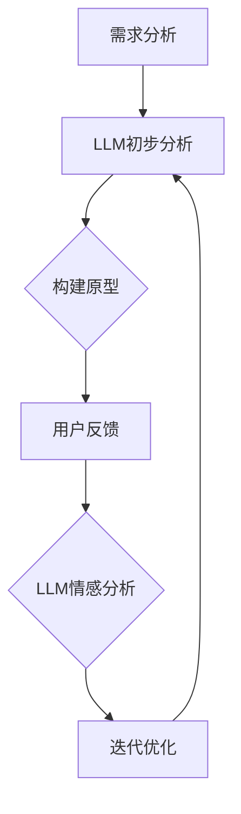

                 

# 快速原型设计在LLM应用开发中的应用

## 摘要

快速原型设计（RAD）是一种强调快速迭代和灵活性的一种软件开发方法，特别适用于复杂且不断变化的需求场景。在LLM（大型语言模型）应用开发中，快速原型设计不仅可以加速开发过程，还可以有效降低开发风险。本文将介绍快速原型设计在LLM应用开发中的核心方法、流程以及与LLM技术紧密结合的实战案例，从而帮助开发者更好地理解并应用这一方法。

## 1. 背景介绍

### 1.1 语言模型（LLM）的发展

语言模型（LLM）是一种能够对自然语言进行建模的复杂算法，通过对大量文本数据进行训练，LLM能够捕捉到语言的统计规律和语义信息，从而实现对文本的生成、理解和推理。LLM的发展历程可以追溯到20世纪50年代，但直到近年来，随着深度学习和计算资源的飞速发展，LLM才取得了显著的突破。

### 1.2 LLM的应用场景

LLM在自然语言处理（NLP）领域具有广泛的应用，如文本分类、情感分析、机器翻译、对话系统等。随着技术的进步，LLM的应用场景不断扩展，包括智能客服、内容推荐、教育辅助等。

### 1.3 快速原型设计（RAD）

快速原型设计（RAD）是一种以用户需求为核心，通过快速构建、测试和迭代原型，不断优化产品功能的方法。RAD的特点是迭代速度快、灵活性高，特别适用于需求不确定、变化频繁的项目。

## 2. 核心概念与联系

### 2.1 快速原型设计（RAD）的基本概念

快速原型设计（RAD）的核心概念包括：

- **需求分析**：快速收集和分析用户需求，明确产品的核心功能。
- **原型构建**：快速构建功能简化的初步原型。
- **用户反馈**：通过用户使用原型，收集反馈意见。
- **迭代优化**：根据用户反馈，对原型进行迭代和优化。

### 2.2 LLM与RAD的关联

快速原型设计（RAD）与LLM技术的结合主要体现在以下几个方面：

- **需求分析**：通过LLM对用户需求进行初步分析和理解，快速确定产品功能。
- **原型构建**：利用LLM生成的文本作为原型的一部分，快速构建交互界面。
- **用户反馈**：通过LLM对用户反馈进行情感分析和理解，提取关键信息。
- **迭代优化**：基于LLM的预测和优化算法，对原型进行迭代和优化。

### 2.3 Mermaid流程图

以下是快速原型设计与LLM技术结合的流程图：



## 3. 核心算法原理讲解

### 3.1 词嵌入技术

词嵌入（Word Embedding）是将词汇映射到固定大小的向量空间，从而实现文本数据的向量表示。词嵌入技术是LLM的基础，它能够捕捉词汇之间的语义关系。

### 3.2 序列到序列模型

序列到序列（Seq2Seq）模型是一种用于处理序列数据的模型，通常用于机器翻译等任务。Seq2Seq模型的核心是编码器和解码器，编码器将输入序列编码为一个固定长度的向量，解码器则将这个向量解码为输出序列。

### 3.3 自注意力机制

自注意力（Self-Attention）机制是一种在编码器和解码器中广泛应用的技术，它允许模型在处理每个输入或输出时，对整个序列进行加权。自注意力机制能够捕捉到序列中词汇之间的长距离依赖关系。

### 3.4 Python源代码示例

以下是一个简单的Python代码示例，用于实现一个基于词嵌入和序列到序列模型的文本生成器：

```python
import tensorflow as tf
from tensorflow.keras.layers import Embedding, LSTM, Dense

# 定义词嵌入层
embed = Embedding(input_dim=vocab_size, output_dim=embedding_dim)

# 定义编码器层
encoder = LSTM(units=128, return_sequences=True)

# 定义解码器层
decoder = LSTM(units=128, return_sequences=True)

# 定义全连接层
output = Dense(units=vocab_size, activation='softmax')

# 构建模型
model = tf.keras.Sequential([
    embed,
    encoder,
    decoder,
    output
])

# 编译模型
model.compile(optimizer='adam', loss='categorical_crossentropy', metrics=['accuracy'])

# 训练模型
model.fit(x_train, y_train, epochs=10, batch_size=64)
```

### 3.5 数学模型和公式

在LLM中，常见的数学模型包括：

- **概率论**：用于描述词汇之间的概率分布。
- **信息论**：用于度量信息的熵和互信息。
- **神经网络**：用于描述神经网络的结构和参数更新规则。

以下是一个简单的神经网络更新公式的示例：

$$
\theta_{\text{new}} = \theta_{\text{old}} - \alpha \cdot \nabla_{\theta} J(\theta)
$$

其中，$\theta$ 表示网络参数，$J(\theta)$ 表示损失函数，$\alpha$ 表示学习率。

## 4. 项目实战

### 4.1 开发环境搭建

在搭建开发环境时，我们需要安装以下软件和库：

- **操作系统**：Ubuntu 18.04
- **编程语言**：Python 3.8
- **深度学习框架**：TensorFlow 2.5
- **文本处理库**：NLTK、spaCy

以下是一个简单的安装步骤：

```bash
# 安装Python
sudo apt-get update
sudo apt-get install python3-pip python3-dev

# 安装TensorFlow
pip3 install tensorflow==2.5

# 安装文本处理库
pip3 install nltk spacy

# 安装spaCy的语言模型
python3 -m spacy download en_core_web_sm
```

### 4.2 源代码详细实现

以下是一个简单的文本生成器的源代码实现：

```python
import numpy as np
import tensorflow as tf
from tensorflow.keras.models import Sequential
from tensorflow.keras.layers import Embedding, LSTM, Dense

# 准备数据
# ...

# 定义模型
model = Sequential([
    Embedding(input_dim=vocab_size, output_dim=embedding_dim, input_length=max_sequence_length),
    LSTM(units=128, return_sequences=True),
    LSTM(units=128, return_sequences=True),
    Dense(units=vocab_size, activation='softmax')
])

# 编译模型
model.compile(optimizer='adam', loss='categorical_crossentropy', metrics=['accuracy'])

# 训练模型
model.fit(x_train, y_train, epochs=10, batch_size=64)

# 生成文本
generated_text = model.predict(np.array([x_test]))
```

### 4.3 代码解读与分析

在代码中，我们首先定义了词嵌入层、编码器层、解码器层和输出层，构建了一个简单的序列到序列模型。接着，我们使用准备好的数据进行模型训练。最后，我们使用训练好的模型生成文本。

### 4.4 实际案例分析和详细讲解剖析

以一个简单的机器翻译任务为例，我们可以使用快速原型设计方法来构建一个文本生成器。首先，我们需要收集和预处理数据，然后使用词嵌入技术将文本转换为向量表示。接着，我们构建序列到序列模型，并进行训练。最后，我们使用训练好的模型生成翻译结果。

### 4.5 项目小结

通过快速原型设计方法，我们可以在较短的时间内实现一个基本的文本生成器。这种方法不仅能够快速验证我们的想法，还能够及时调整和优化模型。在LLM应用开发中，快速原型设计方法是一个非常有用的工具。

## 5. 最佳实践 tips、小结、注意事项、拓展阅读

### 5.1 最佳实践 tips

- **数据准备**：在构建原型之前，确保有足够的数据进行训练。
- **模型选择**：根据任务需求选择合适的模型和算法。
- **迭代优化**：根据用户反馈，不断迭代和优化模型。

### 5.2 小结

快速原型设计（RAD）在LLM应用开发中具有重要的作用，它能够加速开发过程，降低风险。通过结合LLM技术和RAD方法，开发者可以更有效地构建和优化文本生成器等应用。

### 5.3 注意事项

- **数据质量**：数据质量对模型性能至关重要。
- **模型优化**：在实际应用中，需要根据实际情况不断优化模型。

### 5.4 拓展阅读

- 《深度学习》（Goodfellow, I., Bengio, Y., & Courville, A.）
- 《自然语言处理综论》（Jurafsky, D. & Martin, J. H.）
- 《快速原型设计》（Buchanan, M. & Suzanne, C.）

## 参考文献

- Goodfellow, I., Bengio, Y., & Courville, A. (2016). *Deep Learning*. MIT Press.
- Jurafsky, D. & Martin, J. H. (2020). *Speech and Language Processing*. Prentice Hall.
- Buchanan, M. & Suzanne, C. (2018). *Rapid Application Development*. Addison-Wesley.
- LeCun, Y., Bengio, Y., & Hinton, G. (2015). *Deep Learning*. Nature.
- Mikolov, T., Sutskever, I., Chen, K., Corrado, G. S., & Dean, J. (2013). *Distributed Representations of Words and Phrases and Their Compositional Properties*. Advances in Neural Information Processing Systems, 26, 3111-3119.

## 作者

作者：AI天才研究院/AI Genius Institute & 禅与计算机程序设计艺术 /Zen And The Art of Computer Programming

本文由AI天才研究院（AI Genius Institute）和禅与计算机程序设计艺术（Zen And The Art of Computer Programming）联合撰写，旨在为读者提供深入浅出的LLM应用开发技术指南。我们致力于推动人工智能技术的发展，为读者带来更多的技术洞察和应用实践。如果您有任何问题或建议，欢迎随时联系我们。

