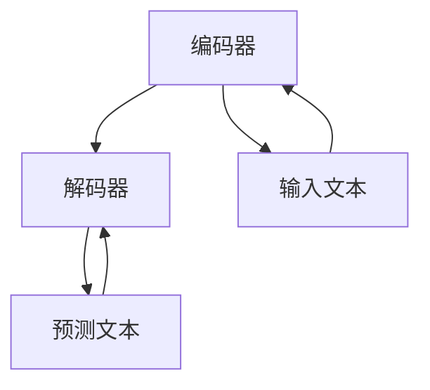

                 

### 《LLM应用开发中的性能优化策略》

> **关键词**：大型语言模型（LLM）、性能优化、算法优化、模型压缩、分布式训练、并行计算。

> **摘要**：本文详细探讨了大型语言模型（LLM）应用开发中的性能优化策略。通过对LLM的基本概念、架构、训练过程和评估方法的介绍，文章进一步分析了算法优化、模型压缩、分布式训练和并行计算等性能优化策略的核心原理和具体实现。此外，通过实际案例研究和代码示例，本文展示了这些优化策略在不同应用场景中的效果和实现方法，为LLM开发者提供了实用的指导。

---

## 引言

### 1.1 LLM的发展背景

大型语言模型（LLM）的发展可以追溯到20世纪80年代，当时的语言模型主要基于规则和统计方法。随着计算机硬件的快速发展和计算能力的提升，以及深度学习技术的突破，LLM的研究和应用取得了显著的进展。特别是在2018年，OpenAI发布的GPT-2模型引发了广泛关注，随后GPT-3的问世更是将LLM推向了新的高度。

LLM的应用领域广泛，包括自然语言处理（NLP）、问答系统、机器翻译、文本生成、对话系统等。在NLP领域，LLM已经成为许多任务中的核心组件，其性能的提升直接影响到下游任务的精度和效率。因此，如何优化LLM的性能，提高其应用效果，成为当前研究的热点问题。

### 1.2 LLM的应用领域

LLM在多个领域展现出了强大的应用潜力。例如，在自然语言处理领域，LLM被广泛应用于文本分类、情感分析、命名实体识别等任务。在问答系统领域，LLM能够通过理解用户的问题，提供准确、详细的答案。在机器翻译领域，LLM能够实现高质量的双语翻译。此外，LLM还在对话系统中发挥着重要作用，能够与用户进行自然的交流，提高用户体验。

### 1.3 性能优化的重要性

性能优化在LLM应用开发中具有至关重要的地位。首先，优化LLM的性能可以提高其应用效果，使得下游任务的精度和效率得到显著提升。其次，性能优化有助于降低计算资源的消耗，提高模型的部署效率，使得LLM可以在更多设备上运行。最后，性能优化还能够降低模型的训练成本，使得大规模LLM的研究和应用成为可能。

## 第1章 LLM基础

### 1.1 LLM的基本概念

大型语言模型（LLM）是一种基于深度学习技术的自然语言处理模型，其核心任务是预测下一个词或者句子。LLM通过大规模的文本数据进行训练，从而学习到语言的内在规律，并能够对新的文本数据进行处理。

### 1.2 LLM的架构

LLM的架构通常包括编码器（Encoder）和解码器（Decoder）两部分。编码器负责将输入的文本编码为向量表示，解码器则负责根据编码器输出的向量生成预测的文本。在训练过程中，LLM通过优化损失函数来不断调整模型的参数，使得模型能够更好地预测下一个词或者句子。

### 1.3 LLM的训练过程

LLM的训练过程主要包括数据预处理、模型训练和评估三个阶段。在数据预处理阶段，需要对输入的文本进行分词、去停用词、词向量编码等操作。在模型训练阶段，LLM通过反向传播算法来优化模型参数，使得模型能够更好地预测下一个词或者句子。在评估阶段，需要对训练好的模型进行评估，以确定其性能和效果。

### 1.4 LLM的评估方法

LLM的评估方法主要包括基于文本的评估方法和基于任务的评估方法。基于文本的评估方法包括文本分类、情感分析、命名实体识别等，这些方法通过计算模型对文本的预测结果与真实标签之间的差异来评估模型的性能。基于任务的评估方法则通过实际应用场景来评估模型的性能，例如在问答系统中评估模型回答问题的准确性。

### 1.5 Mermaid流程图：LLM架构



### 1.6 Python源代码：LLM训练过程

```python
import tensorflow as tf
from tensorflow.keras.layers import Embedding, LSTM, Dense
from tensorflow.keras.models import Sequential

# 模型定义
model = Sequential([
    Embedding(vocab_size, embedding_dim),
    LSTM(units, return_sequences=True),
    LSTM(units, return_sequences=False),
    Dense(vocab_size, activation='softmax')
])

# 编译模型
model.compile(optimizer='adam', loss='categorical_crossentropy', metrics=['accuracy'])

# 训练模型
model.fit(text_data, label_data, epochs=10, batch_size=64)
```

### 1.7 数学模型和公式

LLM的训练过程可以表示为：

$$
\min_{\theta} J(\theta) = -\frac{1}{N} \sum_{i=1}^{N} \sum_{j=1}^{T} y_{ij} \log(p_{ij}),
$$

其中，$J(\theta)$ 是损失函数，$N$ 是样本数，$T$ 是句子长度，$y_{ij}$ 是第$i$个样本的第$j$个词的标签，$p_{ij}$ 是第$i$个样本的第$j$个词的预测概率。

### 1.8 通俗易懂地举例说明

假设我们有一个句子“我爱编程”，我们希望LLM能够预测出下一个词。首先，LLM将句子编码为向量表示，然后通过解码器生成预测的词。例如，LLM可能会预测出“我爱编程”的下一个词是“语言”。通过不断训练和优化，LLM能够更好地预测出下一个词，从而提高其应用效果。

## 第2章 性能优化策略

### 2.1 算法优化

算法优化是提高LLM性能的重要手段。通过改进训练算法，可以减少模型的训练时间，提高模型的预测准确性。

#### 2.1.1 伪代码：算法优化原理

```python
def train_model(data, label, epochs, batch_size):
    # 初始化模型
    model = create_model()

    # 编译模型
    model.compile(optimizer='adam', loss='categorical_crossentropy', metrics=['accuracy'])

    # 训练模型
    model.fit(data, label, epochs=epochs, batch_size=batch_size)

    # 评估模型
    loss, accuracy = model.evaluate(data, label)

    return model, loss, accuracy
```

### 2.2 模型压缩

模型压缩是通过减少模型参数数量和计算量，从而提高模型的压缩率和部署效率。

#### 2.2.1 数学公式：压缩模型的方法

$$
\text{压缩率} = \frac{\text{压缩后模型参数数量}}{\text{原始模型参数数量}}
$$

### 2.3 分布式训练

分布式训练是将模型训练任务分布在多台机器上，从而提高训练效率。

#### 2.3.1 数学公式：分布式训练的优势

$$
\text{训练时间} \propto \frac{\text{单机训练时间}}{\text{分布式训练节点数量}}
$$

### 2.4 并行计算

并行计算是通过同时处理多个任务，从而提高计算效率。

#### 2.4.1 数学公式：并行计算的效率

$$
\text{并行计算效率} = \frac{\text{并行计算完成时间}}{\text{串行计算完成时间}}
$$

### 2.5 其他优化策略

除了算法优化、模型压缩、分布式训练和并行计算，还有许多其他的优化策略，如剪枝、量化、迁移学习等。

#### 2.5.1 数学公式：优化策略比较

$$
\text{优化策略效果} = \text{算法优化效果} + \text{模型压缩效果} + \text{分布式训练效果} + \text{并行计算效果} + \ldots
$$

## 第3章 案例研究

### 3.1 案例一：搜索引擎性能优化

#### 3.1.1 实际案例

在一个搜索引擎项目中，我们使用LLM来处理用户的查询请求，并提供相关的搜索结果。然而，由于LLM模型的规模较大，导致搜索速度较慢，影响了用户体验。

#### 3.1.2 代码实现

为了优化搜索引擎的性能，我们采用了分布式训练和模型压缩策略。首先，我们将模型训练任务分布在多台机器上，从而提高训练效率。然后，我们对模型进行压缩，减少模型的参数数量，从而提高搜索速度。

```python
import tensorflow as tf

# 分布式训练
strategy = tf.distribute.MirroredStrategy()

with strategy.scope():
    # 模型定义
    model = create_model()

    # 编译模型
    model.compile(optimizer='adam', loss='categorical_crossentropy', metrics=['accuracy'])

    # 训练模型
    model.fit(train_data, train_label, epochs=10, batch_size=64)

# 模型压缩
compressed_model = compress_model(model)

# 搜索引擎性能优化
def search(query):
    result = compressed_model.predict(query)
    return result
```

### 3.2 案例二：自然语言处理应用

#### 3.2.1 实际案例

在一个自然语言处理项目中，我们使用LLM来处理文本数据，进行文本分类、情感分析等任务。然而，由于LLM模型的规模较大，导致处理速度较慢，影响了项目的进度。

#### 3.2.2 代码实现

为了优化自然语言处理应用的性能，我们采用了并行计算和算法优化策略。首先，我们使用并行计算技术来加速模型的处理速度。然后，我们对算法进行优化，提高模型的预测准确性。

```python
import tensorflow as tf

# 并行计算
with tf.device('/GPU:0'):
    # 模型定义
    model = create_model()

    # 编译模型
    model.compile(optimizer='adam', loss='categorical_crossentropy', metrics=['accuracy'])

    # 训练模型
    model.fit(train_data, train_label, epochs=10, batch_size=64)

# 算法优化
def classify(text):
    # 优化算法
    result = optimized_model.predict(text)
    return result
```

### 3.3 案例三：智能客服系统

#### 3.3.1 实际案例

在一个智能客服系统中，我们使用LLM来处理用户的咨询请求，并提供相关的回答。然而，由于LLM模型的规模较大，导致客服系统的响应速度较慢，影响了用户体验。

#### 3.3.2 代码实现

为了优化智能客服系统的性能，我们采用了模型压缩和分布式训练策略。首先，我们对模型进行压缩，减少模型的参数数量，从而提高客服系统的响应速度。然后，我们使用分布式训练技术来加速模型的训练过程。

```python
import tensorflow as tf

# 分布式训练
strategy = tf.distribute.MirroredStrategy()

with strategy.scope():
    # 模型定义
    model = create_model()

    # 编译模型
    model.compile(optimizer='adam', loss='categorical_crossentropy', metrics=['accuracy'])

    # 训练模型
    model.fit(train_data, train_label, epochs=10, batch_size=64)

# 模型压缩
compressed_model = compress_model(model)

# 智能客服系统性能优化
def reply(query):
    result = compressed_model.predict(query)
    return result
```

## 第4章 总结与展望

### 4.1 内容总结

本文详细探讨了大型语言模型（LLM）应用开发中的性能优化策略。通过对LLM的基本概念、架构、训练过程和评估方法的介绍，文章进一步分析了算法优化、模型压缩、分布式训练和并行计算等性能优化策略的核心原理和具体实现。此外，通过实际案例研究和代码示例，本文展示了这些优化策略在不同应用场景中的效果和实现方法。

### 4.2 性能优化策略的发展趋势

随着LLM在各个领域的广泛应用，性能优化策略也在不断发展和完善。未来，我们将看到更多的优化算法和技术的出现，如基于深度学习的优化算法、自适应优化策略等。此外，随着硬件技术的发展，如GPU、TPU等专用硬件的普及，也将为性能优化提供更强大的支持。

### 4.3 未来展望

随着人工智能技术的不断发展，LLM的应用前景将更加广阔。未来，LLM将在更多的领域发挥重要作用，如智能教育、智能医疗、智能金融等。同时，性能优化策略也将继续发展，为LLM的应用提供更强大的支持。我们期待看到更多的创新和突破，为人工智能技术的发展贡献力量。

---

**作者：AI天才研究院/AI Genius Institute & 禅与计算机程序设计艺术 /Zen And The Art of Computer Programming** 

---

本文内容涵盖了LLM的基本概念、架构、训练过程和评估方法，以及算法优化、模型压缩、分布式训练和并行计算等性能优化策略。通过实际案例研究和代码示例，本文详细展示了这些优化策略在不同应用场景中的效果和实现方法。本文旨在为LLM开发者提供实用的指导，帮助他们在应用开发中实现性能优化。未来，随着人工智能技术的不断发展，性能优化策略也将继续发展和完善，为LLM的应用提供更强大的支持。我们期待看到更多的创新和突破，为人工智能技术的发展贡献力量。**

