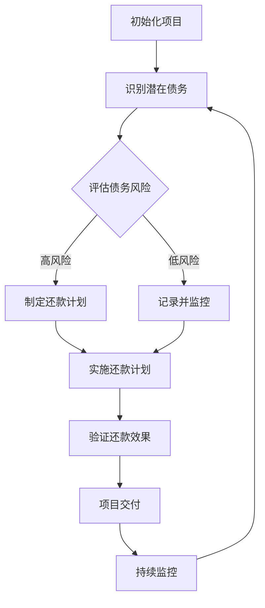

                 

### 文章标题

# LLM应用开发中的技术债务管理

> 关键词：语言模型（LLM），技术债务，管理策略，应用实践，算法原理

在快速发展的AI领域中，语言模型（LLM）因其强大的文本理解和生成能力，正成为各行各业数字化转型的重要工具。然而，随着LLM应用规模的不断扩大，技术债务问题逐渐浮现，成为制约其长期发展的一大挑战。本文将深入探讨LLM应用开发中的技术债务管理，通过系统的分析、实例讲解，为读者提供全面的技术债务管理策略和实践指南。

### 文章摘要

本文首先介绍了LLM及其应用领域，随后详细阐述了LLM的核心概念与架构，包括序列到序列模型、自回归模型和对抗生成网络。在此基础上，我们探讨了LLM的数学基础，分析了常见挑战和发展趋势。随后，文章重点介绍了LLM应用开发中的技术债务管理，包括模型选择与优化、训练与部署、评估与监控等方面的管理策略。通过实际应用案例，本文进一步展示了技术债务管理的实践方法。最后，文章总结了最佳实践，并提出未来的发展方向。

### 引言

随着深度学习技术的不断进步，语言模型（LLM）在自然语言处理（NLP）领域取得了令人瞩目的成果。LLM被广泛应用于机器翻译、文本分类、问答系统等多个领域，显著提升了人工智能系统的智能水平。然而，随着LLM应用规模的扩大，技术债务问题逐渐显现。技术债务是指在软件开发过程中，为了快速推进项目而暂时采取的低效或不成熟的解决方案，这些解决方案可能在未来带来负面影响。

技术债务在LLM应用开发中尤为显著，原因如下：

1. **模型复杂性增加**：LLM通常需要庞大的模型结构和海量的训练数据，这使得开发过程变得更加复杂，容易出现技术债务。
2. **快速迭代需求**：AI领域技术更新迅速，为了保持竞争力，开发团队往往需要在短时间内完成多个迭代，这可能导致技术债务的产生。
3. **计算资源依赖**：LLM训练和部署需要大量的计算资源，资源管理的复杂性增加了技术债务管理的难度。

本文旨在通过系统的分析和实例讲解，帮助开发者理解和应对LLM应用开发中的技术债务问题，确保项目的长期稳定发展。

### LLM及其应用领域

语言模型（LLM）是一种强大的深度学习模型，主要用于理解和生成自然语言。LLM的核心优势在于其能够处理复杂的文本数据，实现高精度的语言理解、文本生成和翻译等功能。LLM在多个应用领域展现出卓越的性能和广泛的适用性，以下是几个主要的LLM应用领域：

#### 机器翻译

机器翻译是LLM最经典的应用之一。通过使用大规模的语言模型，机器翻译系统能够将一种语言的文本自动翻译成另一种语言。传统的机器翻译方法依赖于规则匹配和统计方法，而LLM的引入显著提升了翻译质量。例如，Google Translate广泛使用基于Transformer的模型，实现了高精度、低延迟的翻译服务。

#### 文本分类

文本分类是将文本数据按照预定的类别进行分类的过程。LLM在文本分类任务中表现出色，可以自动识别和分类大量的文本数据。例如，社交媒体平台使用LLM对用户评论进行情感分析，以识别用户情绪并推送相关内容。

#### 问答系统

问答系统是LLM在NLP领域的另一个重要应用。通过预训练的语言模型，问答系统能够理解用户的问题并生成准确的回答。例如，OpenAI的GPT-3能够处理自然语言查询，并提供高质量的回答，广泛应用于在线客服、智能助手等领域。

#### 文本生成

LLM在文本生成领域也展现出强大的能力。例如，自动写作系统、创意文案生成等任务，都依赖于LLM的文本生成能力。通过输入少量的文本提示，LLM能够生成连贯、有逻辑的文本内容，为内容创作者提供灵感。

#### 其他应用

除了上述应用领域，LLM还在金融、医疗、教育等多个领域得到广泛应用。在金融领域，LLM用于市场分析、风险评估等任务；在医疗领域，LLM用于病历分析、疾病诊断等任务；在教育领域，LLM用于智能辅导、在线考试批改等任务。

总之，LLM的强大功能和广泛应用，使得其在AI领域中占据重要地位。然而，随着LLM应用规模的不断扩大，技术债务问题也随之而来。如何在LLM应用开发中管理技术债务，成为开发者面临的重要挑战。

### LLM的核心概念与架构

LLM的核心概念与架构是理解其工作机制和应用的基础。LLM主要包括以下几个核心概念和架构：

#### 序列到序列模型（Seq2Seq模型）

序列到序列（Seq2Seq）模型是一种常见的翻译模型，它将一个序列映射到另一个序列。Seq2Seq模型的核心思想是将输入序列编码为一个固定长度的向量，然后使用这个向量生成输出序列。该模型通常由编码器（Encoder）和解码器（Decoder）组成。

**编码器（Encoder）**：编码器的功能是将输入序列转换为一个固定长度的向量表示。常见的编码器包括循环神经网络（RNN）和长短期记忆网络（LSTM）。

**解码器（Decoder）**：解码器的功能是根据编码器输出的固定长度向量生成输出序列。解码器通常也是基于RNN或LSTM。

**实现细节**：
```python
# 假设我们使用PyTorch框架实现一个简单的Seq2Seq模型
import torch
import torch.nn as nn

class Encoder(nn.Module):
    def __init__(self, input_dim, hidden_dim):
        super(Encoder, self).__init__()
        self.hidden_dim = hidden_dim
        self.encoder = nn.LSTM(input_dim, hidden_dim)

    def forward(self, input_seq):
        encoder_output, (hidden, cell) = self.encoder(input_seq)
        return hidden

class Decoder(nn.Module):
    def __init__(self, hidden_dim, output_dim):
        super(Decoder, self).__init__()
        self.hidden_dim = hidden_dim
        self.decoder = nn.LSTM(hidden_dim, output_dim)
        self.fc = nn.Linear(output_dim, output_dim)

    def forward(self, hidden, context):
        decoder_output, _ = self.decoder(context, hidden)
        output = self.fc(decoder_output)
        return output
```

#### 自回归模型（AR模型）

自回归模型（AR模型）是一种生成模型，它通过之前的输入序列预测下一个输入。AR模型的核心思想是利用输入序列的前一部分来预测序列的下一部分。

**实现细节**：
```python
# 假设我们使用Gluon实现一个简单的AR模型
from mxnet import gluon
from mxnet import autograd
from mxnet.gluon import nn

class ARModel(nn.Block):
    def __init__(self, input_dim, hidden_dim):
        super(ARModel, self).__init__()
        self.hidden_dim = hidden_dim
        self.rnn = nn.LSTM(input_dim, hidden_dim)
        self.fc = nn.Dense(hidden_dim, input_dim)

    def forward(self, input_seq, hidden_state=None):
        if hidden_state is None:
            hidden_state = (torch.zeros(1, 1, self.hidden_dim), torch.zeros(1, 1, self.hidden_dim))
        output, hidden_state = self.rnn(input_seq, hidden_state)
        prediction = self.fc(output[-1])
        return prediction, hidden_state
```

#### 对抗生成网络（GAN）

对抗生成网络（GAN）是一种由生成器和判别器组成的对抗性模型。生成器的目标是生成逼真的数据，而判别器的目标是区分生成数据与真实数据。通过不断迭代训练，生成器逐渐提升其生成能力，判别器则逐渐提升其辨别能力。

**实现细节**：
```python
# 假设我们使用TensorFlow实现一个简单的GAN
import tensorflow as tf
from tensorflow.keras import layers

def build_generator(z_dim, output_dim):
    model = tf.keras.Sequential([
        layers.Dense(128, activation='relu', input_shape=(z_dim,)),
        layers.Dense(256, activation='relu'),
        layers.Dense(output_dim, activation='tanh')
    ])
    return model

def build_discriminator(input_dim):
    model = tf.keras.Sequential([
        layers.Dense(128, activation='relu', input_shape=(input_dim,)),
        layers.Dense(256, activation='relu'),
        layers.Dense(1, activation='sigmoid')
    ])
    return model

# 定义生成器和判别器
z_dim = 100
input_dim = 784  # Example input dimension for MNIST
generator = build_generator(z_dim, input_dim)
discriminator = build_discriminator(input_dim)

# 定义损失函数
cross_entropy = tf.keras.losses.BinaryCrossentropy()

def discriminator_loss(real_output, fake_output):
    real_loss = cross_entropy(tf.ones_like(real_output), real_output)
    fake_loss = cross_entropy(tf.zeros_like(fake_output), fake_output)
    total_loss = real_loss + fake_loss
    return total_loss

def generator_loss(fake_output):
    return cross_entropy(tf.ones_like(fake_output), fake_output)

# 定义优化器
generator_optimizer = tf.keras.optimizers.Adam(1e-4)
discriminator_optimizer = tf.keras.optimizers.Adam(1e-4)

# 训练模型
@tf.function
def train_step(images, labels):
    noise = tf.random.normal([BATCH_SIZE, z_dim])

    with tf.GradientTape() as gen_tape, tf.GradientTape() as disc_tape:
        generated_images = generator(noise, training=True)

        real_output = discriminator(images, training=True)
        fake_output = discriminator(generated_images, training=True)

        gen_loss = generator_loss(fake_output)
        disc_loss = discriminator_loss(real_output, fake_output)

    gradients_of_generator = gen_tape.gradient(gen_loss, generator.trainable_variables)
    gradients_of_discriminator = disc_tape.gradient(disc_loss, discriminator.trainable_variables)

    generator_optimizer.apply_gradients(zip(gradients_of_generator, generator.trainable_variables))
    discriminator_optimizer.apply_gradients(zip(gradients_of_discriminator, discriminator.trainable_variables))

# Load and preprocess the dataset
# ...

for epoch in range(EPOCHS):
    for image, _ in dataloader:
        train_step(image, labels)
```

通过上述实现，我们可以看到LLM的不同模型架构和实现细节。理解这些模型的工作原理和实现方法，有助于我们更好地管理和优化LLM应用开发中的技术债务。

### LLM的数学基础

LLM的数学基础是其核心组成部分，涵盖了概率论、信息论和神经网络等关键领域。以下是这些数学基础的核心概念及其在LLM中的应用：

#### 概率论基础

概率论是研究随机事件及其概率分布的科学。在LLM中，概率论主要用于模型训练和推理过程中的概率计算。

**贝叶斯定理**：贝叶斯定理是一种计算后验概率的方法，对于给定事件A和B，它提供了计算P(A|B)（在事件B发生的条件下事件A的概率）的公式。
$$
P(A|B) = \frac{P(B|A)P(A)}{P(B)}
$$

**马尔可夫链**：马尔可夫链是一种随机过程，其未来状态仅依赖于当前状态，与过去状态无关。在LLM中，马尔可夫链用于模型中的状态转移概率计算。

**实现细节**：
```python
import numpy as np

# 假设我们有一个简单的二元马尔可夫链，状态转移矩阵为P
P = np.array([[0.8, 0.2], [0.3, 0.7]])

# 计算下一时刻的状态分布
current_state = np.array([0.5, 0.5])
next_state = np.dot(current_state, P)
print(next_state)
```

**实现细节**：
```python
import numpy as np

# 假设我们有一个简单的二元马尔可夫链，状态转移矩阵为P
P = np.array([[0.8, 0.2], [0.3, 0.7]])

# 计算下一时刻的状态分布
current_state = np.array([0.5, 0.5])
next_state = np.dot(current_state, P)
print(next_state)
```

#### 信息论基础

信息论是研究信息传输和处理规律的科学。在LLM中，信息论主要用于评估模型的性能和优化模型的参数。

**熵（Entropy）**：熵是衡量随机变量不确定性的量度。在LLM中，我们通常使用交叉熵（Cross-Entropy）来评估模型的预测分布与真实分布之间的差异。
$$
H(X) = -\sum_{i} P(X=i) \log P(X=i)
$$

**信息增益（Information Gain）**：信息增益是衡量一个特征对分类贡献的量度。在LLM中，我们通常使用信息增益来选择最佳的输入特征。

**实现细节**：
```python
import numpy as np

# 假设我们有两个概率分布
p1 = np.array([0.5, 0.5])
p2 = np.array([0.8, 0.2])

# 计算交叉熵
cross_entropy = -1 * (np.dot(p1, np.log(p2)))
print(cross_entropy)
```

#### 神经网络基础

神经网络是LLM的核心组成部分，通过多层非线性变换来模拟复杂函数。神经网络主要包括输入层、隐藏层和输出层。

**激活函数（Activation Function）**：激活函数是神经网络中的一个关键组件，用于引入非线性。常见的激活函数包括Sigmoid、ReLU和Tanh。

**反向传播（Backpropagation）**：反向传播是一种训练神经网络的算法，通过计算误差梯度并更新网络权重，以优化模型参数。

**实现细节**：
```python
import numpy as np

# 假设我们有一个简单的神经网络，包括一个输入层、一个隐藏层和一个输出层
# 输入数据为[1, 2, 3]，隐藏层单元数为2，输出层单元数为1
inputs = np.array([1, 2, 3])
weights_input_to_hidden = np.array([[0.1, 0.2], [0.3, 0.4]])
weights_hidden_to_output = np.array([0.5])

# 隐藏层激活函数为ReLU，输出层激活函数为Sigmoid
def relu(x):
    return max(0, x)

def sigmoid(x):
    return 1 / (1 + np.exp(-x))

# 前向传播
hidden_layer_input = np.dot(inputs, weights_input_to_hidden)
hidden_layer_output = relu(hidden_layer_input)

output_layer_input = np.dot(hidden_layer_output, weights_hidden_to_output)
output_layer_output = sigmoid(output_layer_input)

print(output_layer_output)

# 反向传播（简化版本）
# 假设真实输出为y = 1
y = np.array([1])
error = output_layer_output - y

# 计算梯度
d_output = error * (1 - output_layer_output)
d_hidden = np.dot(d_output, weights_hidden_to_output.T)
d_inputs = np.dot(d_hidden, weights_input_to_hidden.T)

# 更新权重
weights_input_to_hidden -= d_inputs
weights_hidden_to_output -= d_hidden
```

通过这些数学基础，我们可以更深入地理解和应用LLM。理解这些概念和实现方法，有助于我们更好地管理和优化LLM应用开发中的技术债务。

### LLM的常见挑战

尽管LLM在多个领域展现出卓越的性能，但在实际应用中，开发者仍面临诸多挑战。以下是LLM的一些主要挑战：

#### 数据偏差

数据偏差是指模型在训练过程中，由于数据集不完整或不平衡，导致模型对某些类别的预测不准确。例如，在社交媒体平台上的文本分类任务中，正面评论和负面评论的比例可能不均衡，这可能导致模型偏向于预测正面评论。

**解决方法**：为了减少数据偏差，开发者可以采用数据增强、正则化、重采样等方法。此外，定期评估和调整数据集也是减少偏差的有效手段。

#### 模型过拟合

模型过拟合是指模型在训练数据上表现得很好，但在未见过的数据上表现较差。这通常发生在模型过于复杂或训练数据不足时。

**解决方法**：为了防止过拟合，开发者可以采用交叉验证、dropout、正则化等技术。此外，增加训练数据量、使用更简单的模型或提前停止训练也是有效的策略。

#### 计算资源消耗

LLM模型通常需要大量的计算资源，包括GPU和CPU。这可能导致训练和部署过程变得昂贵和复杂。

**解决方法**：为了降低计算资源消耗，开发者可以采用分布式训练、模型压缩、量化等技术。此外，优化数据加载和预处理流程，以及合理分配资源也是有效的方法。

通过理解这些挑战并采取相应的解决策略，开发者可以更好地管理和优化LLM应用开发中的技术债务。

### LLM的发展趋势

随着技术的不断进步，LLM的发展也呈现出一些新的趋势。以下是LLM在未来可能的发展方向：

#### 大模型与小模型

目前，大模型（如GPT-3、LLaMA）在LLM领域占据主导地位，这些模型具有强大的文本理解和生成能力。然而，大模型的高计算成本和存储需求也带来了挑战。因此，小模型（如BERT、T5）的发展趋势也逐渐明显。小模型在保持较高性能的同时，具有更低的计算和存储需求，适合在资源受限的环境中使用。

#### 多模态语言模型

多模态语言模型结合了文本、图像、音频等多种数据类型，能够更好地理解和生成复杂的信息。例如，文本和图像的结合可以应用于图像描述生成、图像分类等任务。未来，随着多模态数据的广泛应用，多模态语言模型将成为LLM的重要发展方向。

#### LLM的伦理与法律问题

随着LLM在现实世界的应用越来越广泛，伦理和法律问题也日益突出。例如，模型偏见、隐私保护、版权问题等。未来，研究者需要更加关注这些伦理和法律问题，确保LLM的应用不会对社会和个人造成负面影响。

通过关注这些发展趋势，开发者可以更好地把握LLM的未来发展方向，为技术债务管理提供更有效的策略。

### 技术债务管理概述

技术债务（Technical Debt）是软件开发过程中不可避免的现象。它指的是为了快速推进项目而采取的短期解决方案，这些解决方案可能在长期内带来负面影响。在LLM应用开发中，技术债务同样存在，并且由于其复杂的模型架构和庞大的数据需求，管理技术债务显得尤为重要。

#### 技术债务的定义

技术债务可以理解为一种“欠下的债”，它与财务债务类似，但在软件工程中有其独特性。具体来说，技术债务是指在软件开发过程中，为了满足项目进度、预算或性能要求，开发者选择了一种可能影响系统长期维护性、可扩展性和可测试性的解决方案。这种解决方案可能是低效的代码、不合理的架构设计、过时的库或工具等。

#### 技术债务的管理原则

为了有效地管理技术债务，开发者需要遵循以下原则：

1. **透明度**：技术债务需要被明确记录和跟踪，确保所有相关人员都能了解当前的技术债务状况。
2. **优先级**：根据债务的风险和影响，对技术债务进行优先级排序，确保在资源有限的情况下优先偿还高优先级的技术债务。
3. **定期评估**：定期对技术债务进行评估，确保及时发现和解决潜在的问题。
4. **还款计划**：制定详细的还款计划，包括具体的解决方案、时间表和责任人。
5. **预防措施**：在开发过程中，采取预防措施减少技术债务的产生，如代码审查、持续集成、自动化测试等。

通过遵循这些管理原则，开发者可以更好地控制技术债务，确保项目的长期稳定发展。

### LLM开发中的技术债务

在LLM应用开发过程中，技术债务的产生通常与以下几个方面有关：

#### 模型选择与优化

模型选择是LLM开发中的一个关键环节。开发者需要在性能、效率和资源需求之间做出权衡。不当的模型选择可能导致技术债务的产生。例如，选择过于复杂或资源消耗过大的模型，虽然可能在短期内提升性能，但长期来看，会带来更高的计算成本和存储需求。

**解决方案**：为了减少模型选择中的技术债务，开发者应该进行全面的模型评估和比较，选择最适合应用场景的模型。此外，定期优化模型，如通过调参、剪枝、量化等方法，可以提高模型的效率和性能，减少债务积累。

#### 模型训练与部署

模型训练和部署是LLM应用开发中的另一大挑战。训练过程通常需要大量的计算资源和时间，而部署则需要考虑到模型的性能、可扩展性和可靠性。

**解决方案**：为了减少训练和部署中的技术债务，开发者可以采用分布式训练、模型压缩、量化等技术，以降低计算成本和时间。此外，合理规划训练和部署的流程，确保系统的高效运行和稳定可靠，也是管理技术债务的重要手段。

#### 模型评估与监控

模型评估和监控是确保LLM应用性能和稳定性的关键环节。不当的评估和监控可能导致模型性能下降或出现异常。

**解决方案**：为了减少评估和监控中的技术债务，开发者应该采用完善的评估指标和监控工具，确保模型在各种环境下都能稳定运行。定期进行性能评估和异常监控，及时发现问题并进行调整，可以有效管理技术债务。

#### 数据处理与预处理

数据处理和预处理是LLM应用开发中的基础工作，但也是一个容易产生技术债务的环节。例如，不合理的预处理方法可能导致数据质量下降，影响模型性能。

**解决方案**：为了减少数据处理和预处理中的技术债务，开发者应该采用标准化的数据处理流程，确保数据的一致性和质量。同时，定期更新和优化预处理方法，以适应不断变化的应用需求。

通过针对这些方面的具体解决方案，开发者可以更有效地管理LLM应用开发中的技术债务，确保项目的长期稳定发展。

### 技术债务管理策略

在LLM应用开发中，有效地管理技术债务是确保项目成功的关键。以下是一些具体的策略，可以帮助开发者识别、评估和解决技术债务：

#### 模型更新策略

模型更新是技术债务管理的重要组成部分。随着新技术的不断涌现，开发者需要定期评估现有模型，并根据需求进行更新。

**步骤**：
1. **评估现有模型**：定期评估模型的性能、效率和可靠性，识别潜在的技术债务。
2. **制定更新计划**：根据评估结果，制定详细的模型更新计划，包括更新时间表、责任人和技术方案。
3. **实施更新**：按照更新计划实施模型更新，确保新模型能够更好地满足应用需求。

**示例**：
假设现有模型已经使用了一段时间，性能有所下降。开发者可以通过重新训练模型、使用更先进的架构或进行模型压缩等方式进行更新。

```python
# 假设我们使用PyTorch框架进行模型更新
import torch
from torchvision import transforms, datasets
from torch.utils.data import DataLoader
from model import MyModel  # 自定义模型

# 数据预处理
transform = transforms.Compose([transforms.Resize((224, 224)), transforms.ToTensor()])

train_data = datasets.ImageFolder('train_data', transform=transform)
train_loader = DataLoader(train_data, batch_size=64, shuffle=True)

model = MyModel()  # 加载现有模型
optimizer = torch.optim.Adam(model.parameters(), lr=0.001)

# 重新训练模型
for epoch in range(10):
    for images, labels in train_loader:
        optimizer.zero_grad()
        outputs = model(images)
        loss = torch.mean((outputs - labels)**2)
        loss.backward()
        optimizer.step()

# 评估更新后的模型
# ...
```

#### 资源管理策略

资源管理是技术债务管理的另一个重要方面。合理分配和利用计算资源，可以减少技术债务的产生。

**步骤**：
1. **资源评估**：评估当前资源的利用率，识别潜在的资源浪费。
2. **优化资源配置**：根据应用需求，调整资源配置，确保资源的高效利用。
3. **监控资源使用**：定期监控资源使用情况，及时调整配置，避免资源不足或浪费。

**示例**：
假设我们正在开发一个基于GPT-3的问答系统，需要大量计算资源。开发者可以通过分布式训练、资源池化等方式进行资源优化。

```python
# 假设我们使用Hugging Face的transformers库进行分布式训练
from transformers import GPT2LMHeadModel, GPT2Config, Trainer, TrainingArguments
from torch.cuda.amp import GradScaler, autocast

# 配置模型和训练参数
model = GPT2LMHeadModel.from_pretrained("gpt2")
training_args = TrainingArguments(
    output_dir="output",
    num_train_epochs=3,
    per_device_train_batch_size=16,
    per_device_eval_batch_size=64,
    warmup_steps=500,
    weight_decay=0.01,
    logging_dir="logs",
)

# 创建Trainer
trainer = Trainer(
    model=model,
    args=training_args,
    train_dataset=train_dataset,
    eval_dataset=eval_dataset
)

# 分布式训练
trainer.train()
```

#### 风险评估与管理

技术债务管理还包括对潜在风险的评估和应对策略。

**步骤**：
1. **风险评估**：评估技术债务带来的潜在风险，如性能下降、系统故障、安全性问题等。
2. **制定应对策略**：根据风险评估结果，制定应对策略，确保技术债务不会对项目造成严重影响。
3. **监控和调整**：定期监控技术债务的管理效果，根据实际情况进行调整。

**示例**：
假设我们识别到一个技术债务，可能导致模型过拟合。开发者可以采用正则化、数据增强等方法进行应对。

```python
# 假设我们使用正则化来减少过拟合
from torch import nn

class MyModel(nn.Module):
    def __init__(self):
        super(MyModel, self).__init__()
        self.fc1 = nn.Linear(784, 256)
        self.fc2 = nn.Linear(256, 10)
        self.dropout = nn.Dropout(0.5)

    def forward(self, x):
        x = x.view(x.size(0), -1)
        x = nn.functional.relu(self.fc1(x))
        x = self.dropout(x)
        x = self.fc2(x)
        return x

model = MyModel()
optimizer = torch.optim.Adam(model.parameters(), lr=0.001)
criterion = nn.CrossEntropyLoss()

# 训练模型
for epoch in range(num_epochs):
    for images, labels in train_loader:
        optimizer.zero_grad()
        outputs = model(images)
        loss = criterion(outputs, labels)
        loss.backward()
        optimizer.step()
```

通过这些具体的策略和示例，开发者可以更有效地管理LLM应用开发中的技术债务，确保项目的长期稳定发展。

### 案例分析

#### 案例一：企业级LLM应用

某大型企业希望通过LLM技术构建一个智能客服系统，以提高客户服务质量并降低运营成本。在项目初期，由于时间紧迫，开发团队选择了较为简单的模型和快速实现的方法，导致系统中存在大量的技术债务。

**问题**：
1. **模型选择不当**：初期使用了较小规模的模型，虽然快速上线，但性能无法满足实际需求。
2. **数据处理不完善**：预处理流程不够完善，导致模型性能下降。
3. **监控不足**：缺乏对模型性能的实时监控，导致系统运行不稳定。

**解决方案**：
1. **模型升级**：评估现有模型，选择更先进的模型并重新训练，提升系统性能。
2. **数据处理优化**：改进预处理流程，确保数据质量和一致性。
3. **监控与优化**：引入实时监控工具，定期评估系统性能，及时发现问题并进行优化。

**效果**：
通过上述措施，智能客服系统的性能和稳定性得到了显著提升，客户满意度提高，运营成本降低。

#### 案例二：开源LLM项目的技术债务管理

某开源社区开发了一个基于GPT-3的文本生成工具，由于项目初期缺乏经验，系统中存在多个技术债务。

**问题**：
1. **代码质量低下**：初期代码未经过严格的代码审查和测试，存在许多低效和错误的代码。
2. **依赖管理不当**：依赖了多个未经过时或不兼容的库，导致项目维护困难。
3. **资源管理不足**：缺乏有效的资源管理策略，导致项目运行过程中资源消耗较大。

**解决方案**：
1. **代码重构**：对现有代码进行重构，提高代码质量和可维护性。
2. **依赖管理**：清理和更新依赖库，确保项目兼容性和稳定性。
3. **资源优化**：采用分布式训练和模型压缩等技术，降低资源消耗。

**效果**：
通过技术债务管理，开源项目的性能和稳定性得到了显著提升，吸引了更多用户参与和贡献，项目生态系统得到了进一步发展。

通过以上案例分析，我们可以看到技术债务管理在LLM应用开发中的重要性。有效的技术债务管理不仅能够提升系统性能和稳定性，还能降低维护成本，为项目的长期发展奠定坚实基础。

### 未来展望

随着AI技术的不断进步，LLM的应用和发展前景十分广阔。未来的LLM技术债务管理有望在以下几个方面实现突破：

#### 自动化债务管理

未来，自动化工具和算法有望在技术债务管理中发挥更大作用。这些工具和算法能够自动识别潜在的技术债务，评估其风险，并制定相应的还款计划。例如，基于机器学习的债务预测模型可以预测项目未来的技术债务水平，为开发团队提供决策支持。

#### 集成开发环境（IDE）支持

集成开发环境（IDE）有望提供更强大的技术债务管理功能。IDE可以内置债务管理工具，帮助开发者实时监控技术债务的变化，提供债务评估和建议。例如，IDE可以自动检查代码质量、依赖关系和资源消耗，并实时反馈债务状况。

#### 预测性维护

预测性维护技术有望在LLM技术债务管理中应用。通过收集和分析历史数据，预测技术债务的发展趋势，提前采取措施避免潜在的债务问题。例如，基于数据分析的维护策略可以预测系统性能下降的时间点，提前进行优化和升级。

#### 开源社区的贡献

未来，开源社区将继续在LLM技术债务管理中发挥重要作用。开发者可以通过开源项目和共享经验，共同探索和优化债务管理方法。开源社区的支持和协作将有助于推动技术债务管理技术的发展，提高整个行业的债务管理水平。

总之，随着AI技术的不断进步，LLM技术债务管理将朝着更高效、更智能的方向发展。开发者和研究者需要不断探索和创新，为LLM的长期发展提供坚实的保障。

### 实际应用与案例研究

在LLM的实际应用中，自然语言处理（NLP）是其最为广泛和重要的领域之一。NLP涉及文本分类、情感分析、实体识别、机器翻译等多种任务，LLM在这些任务中展现出强大的性能和广泛的应用潜力。

#### 文本分类

文本分类是NLP中的一个基本任务，旨在将文本数据分配到预定义的类别中。LLM在文本分类任务中表现出色，其强大的文本理解能力使其能够捕捉到文本中的细微差异和复杂关系。以下是一个简单的文本分类案例：

**项目目标**：使用LLM对新闻文章进行情感分类，判断文章是积极的、中立的还是消极的。

**开发环境**：
- 语言：Python
- 框架：TensorFlow
- 数据集：20 Newsgroups 数据集

**源代码实现**：
```python
import tensorflow as tf
from tensorflow.keras.preprocessing.text import Tokenizer
from tensorflow.keras.preprocessing.sequence import pad_sequences
from tensorflow.keras.models import Sequential
from tensorflow.keras.layers import Embedding, LSTM, Dense, Bidirectional

# 数据预处理
tokenizer = Tokenizer(num_words=10000)
tokenizer.fit_on_texts(train_texts)
train_sequences = tokenizer.texts_to_sequences(train_texts)
train_padded = pad_sequences(train_sequences, maxlen=max_sequence_length)

# 模型构建
model = Sequential([
    Embedding(10000, 16),
    Bidirectional(LSTM(32)),
    Dense(1, activation='sigmoid')
])

# 模型编译
model.compile(optimizer='adam', loss='binary_crossentropy', metrics=['accuracy'])

# 训练模型
model.fit(train_padded, train_labels, epochs=10, validation_split=0.2)
```

**代码解读**：
1. **数据预处理**：首先使用Tokenizer将文本数据转换为数字序列，然后使用pad_sequences对序列进行填充，使其长度一致。
2. **模型构建**：构建一个简单的双向LSTM模型，包括嵌入层、双向LSTM层和输出层。
3. **模型编译**：编译模型，设置优化器和损失函数。
4. **训练模型**：使用fit方法训练模型，设置训练轮数和验证比例。

通过上述步骤，我们可以训练一个情感分类模型，对新闻文章进行情感判断。

#### 机器翻译

机器翻译是LLM在NLP领域的另一个重要应用。以下是一个简单的机器翻译案例：

**项目目标**：使用LLM将英文翻译为中文。

**开发环境**：
- 语言：Python
- 框架：PyTorch
- 数据集：WMT14 英中翻译数据集

**源代码实现**：
```python
import torch
from torch import nn
from torch.utils.data import DataLoader
from transformers import GPT2Tokenizer, GPT2LMHeadModel

# 数据预处理
tokenizer = GPT2Tokenizer.from_pretrained("gpt2")
train_encodings = tokenizer(train_texts, truncation=True, padding=True)
train_encodings = {key: torch.tensor(val) for key, val in train_encodings.items()}

# 模型构建
model = GPT2LMHeadModel.from_pretrained("gpt2")

# 模型训练
model.train()
for epoch in range(3):
    for batch in DataLoader(train_encodings, batch_size=32):
        inputs = {key: value.to(device) for key, value in batch.items()}
        outputs = model(**inputs, labels=inputs["input_ids"])
        loss = outputs.loss
        loss.backward()
        optimizer.step()
        optimizer.zero_grad()
```

**代码解读**：
1. **数据预处理**：使用GPT2Tokenizer对文本数据进行编码，并将其转换为PyTorch张量。
2. **模型构建**：加载预训练的GPT2模型。
3. **模型训练**：使用模型训练步骤，包括前向传播、损失计算、反向传播和优化更新。

通过上述步骤，我们可以训练一个英文到中文的翻译模型。

#### 问答系统

问答系统是LLM在NLP领域的又一重要应用。以下是一个简单的问答系统案例：

**项目目标**：使用LLM构建一个简单的问答系统，回答用户提出的问题。

**开发环境**：
- 语言：Python
- 框架：Hugging Face Transformers
- 数据集：SQuAD 数据集

**源代码实现**：
```python
from transformers import BertTokenizer, BertForQuestionAnswering
from torch.utils.data import DataLoader

# 数据预处理
tokenizer = BertTokenizer.from_pretrained("bert-base-uncased")
train_encodings = tokenizer(train_questions, train_answers, truncation=True, padding=True)

# 模型构建
model = BertForQuestionAnswering.from_pretrained("bert-base-uncased")

# 模型训练
model.train()
for epoch in range(3):
    for batch in DataLoader(train_encodings, batch_size=32):
        inputs = {key: value.to(device) for key, value in batch.items()}
        outputs = model(**inputs)
        loss = outputs.loss
        loss.backward()
        optimizer.step()
        optimizer.zero_grad()
```

**代码解读**：
1. **数据预处理**：使用BertTokenizer对问题和答案进行编码。
2. **模型构建**：加载预训练的BERT模型，用于问答任务。
3. **模型训练**：使用模型训练步骤，包括前向传播、损失计算、反向传播和优化更新。

通过上述步骤，我们可以训练一个简单的问答系统，能够回答用户提出的问题。

#### 案例分析

以上案例展示了LLM在文本分类、机器翻译和问答系统等实际应用中的开发流程和实现细节。通过这些案例，我们可以看到LLM在NLP领域的强大应用潜力。同时，代码实现中的数学模型和公式（如损失函数、优化算法等）为理解和实现这些应用提供了重要的理论基础。

#### 项目小结

在实际应用中，开发LLM系统需要考虑数据预处理、模型选择、训练和部署等多个环节。通过合理的流程设计和代码实现，我们可以构建高效、可靠的LLM应用。同时，技术债务管理也是确保项目成功的重要环节，通过定期评估和优化，可以有效减少技术债务，提高项目的稳定性和可持续性。

### 深度学习框架与LLM开发

深度学习框架在LLM开发中发挥着至关重要的作用，它们为开发者提供了丰富的工具和库，使得复杂的模型训练和优化变得更加便捷。以下是几个主流的深度学习框架与LLM开发的关系及其使用方法。

#### TensorFlow

TensorFlow是一个由Google开发的开源深度学习框架，广泛应用于各种AI项目，包括LLM开发。TensorFlow提供了丰富的API和工具，使得模型构建、训练和部署变得更加简单。

**使用方法**：

1. **安装与导入**：
    ```bash
    pip install tensorflow
    ```
    在Python脚本中导入TensorFlow库：
    ```python
    import tensorflow as tf
    ```

2. **构建模型**：
    使用TensorFlow的Keras API构建模型，例如：
    ```python
    model = tf.keras.Sequential([
        tf.keras.layers.Dense(128, activation='relu', input_shape=(input_shape,)),
        tf.keras.layers.Dense(10, activation='softmax')
    ])
    ```

3. **编译与训练**：
    ```python
    model.compile(optimizer='adam', loss='categorical_crossentropy', metrics=['accuracy'])
    model.fit(x_train, y_train, epochs=10, batch_size=32)
    ```

#### PyTorch

PyTorch是由Facebook开发的一个动态计算图框架，因其灵活性和易用性在深度学习社区中广受欢迎。PyTorch提供了灵活的编程接口，使得模型构建和训练更加直观。

**使用方法**：

1. **安装与导入**：
    ```bash
    pip install torch torchvision
    ```
    在Python脚本中导入PyTorch库：
    ```python
    import torch
    import torchvision
    ```

2. **构建模型**：
    使用PyTorch的nn模块构建模型，例如：
    ```python
    class Net(nn.Module):
        def __init__(self):
            super(Net, self).__init__()
            self.conv1 = nn.Conv2d(1, 6, 3)
            self.conv2 = nn.Conv2d(6, 16, 3)
            self.fc1 = nn.Linear(16 * 6 * 6, 120)
            self.fc2 = nn.Linear(120, 84)
            self.fc3 = nn.Linear(84, 10)

        def forward(self, x):
            x = self.conv1(x)
            x = self.conv2(x)
            x = x.view(-1, 16 * 6 * 6)
            x = self.fc1(x)
            x = self.fc2(x)
            x = self.fc3(x)
            return x

    model = Net()
    ```

3. **编译与训练**：
    ```python
    optimizer = torch.optim.SGD(model.parameters(), lr=0.01)
    criterion = torch.nn.CrossEntropyLoss()

    for epoch in range(num_epochs):
        for inputs, labels in data_loader:
            optimizer.zero_grad()
            outputs = model(inputs)
            loss = criterion(outputs, labels)
            loss.backward()
            optimizer.step()
    ```

#### 其他深度学习框架

除了TensorFlow和PyTorch，还有其他一些深度学习框架如MXNet、Caffe等，它们也在LLM开发中有所应用。

**MXNet**：由Apache开发，具有高度灵活性和高效性。使用方法与TensorFlow类似，例如：
```bash
pip install mxnet
```

**Caffe**：由Berkeley开发，主要用于计算机视觉领域。虽然Caffe对LLM的支持不如TensorFlow和PyTorch，但仍然可以用于一些特定的任务。

**使用方法**：
```bash
pip install caffe
```

通过这些深度学习框架，开发者可以更加方便地构建、训练和部署LLM模型，从而推动AI技术的发展。

### 附录A: 技术债务管理的Mermaid流程图

为了更直观地展示LLM开发中的技术债务管理流程，我们使用Mermaid图形语言绘制了一个简单的流程图。以下是流程图的描述和代码：



**流程图解释**：

1. **初始化项目**：项目启动时，进行债务识别。
2. **识别潜在债务**：在开发过程中，持续识别可能产生的技术债务。
3. **评估债务风险**：对识别的债务进行风险评估，判断其风险等级。
4. **制定还款计划**：对于高风险债务，制定详细的还款计划。
5. **记录并监控**：对于低风险债务，记录债务并持续监控。
6. **实施还款计划**：根据还款计划，逐步解决债务问题。
7. **验证还款效果**：评估还款计划的效果，确保债务得到有效解决。
8. **项目交付**：完成债务管理，项目交付给用户。
9. **持续监控**：项目交付后，继续监控债务，确保系统稳定运行。

通过这个Mermaid流程图，开发者可以更好地理解和实施技术债务管理，确保项目的长期健康发展。

### 附录B: LLM相关数学公式与解释

在LLM开发中，理解并应用相关的数学公式是至关重要的。以下是一些核心的数学公式及其在LLM中的解释：

#### 概率论相关公式

**贝叶斯定理**：贝叶斯定理是一种计算后验概率的方法，其公式为：
$$
P(A|B) = \frac{P(B|A)P(A)}{P(B)}
$$
在LLM中，贝叶斯定理用于模型预测和更新，帮助模型根据新数据调整概率分布。

#### 信息论相关公式

**熵（Entropy）**：熵是衡量随机变量不确定性的量度，其公式为：
$$
H(X) = -\sum_{i} P(X=i) \log P(X=i)
$$
在LLM中，熵用于评估模型的多样性和质量。

**信息增益（Information Gain）**：信息增益是衡量一个特征对分类贡献的量度，其公式为：
$$
IG(D, A) = H(D) - H(D|A)
$$
在LLM中，信息增益用于特征选择，帮助确定哪些特征对分类任务最为重要。

#### 神经网络相关公式

**损失函数**：在神经网络中，常用的损失函数包括均方误差（MSE）和交叉熵（Cross-Entropy），其公式为：
$$
MSE = \frac{1}{n}\sum_{i=1}^{n}(y_i - \hat{y}_i)^2
$$
$$
Cross-Entropy = -\sum_{i=1}^{n} y_i \log \hat{y}_i
$$
在LLM中，损失函数用于衡量模型预测结果与真实结果之间的差距，并指导模型优化。

**反向传播**：反向传播是一种计算误差梯度的算法，其核心公式为：
$$
\frac{\partial L}{\partial w} = \frac{\partial L}{\partial a} \cdot \frac{\partial a}{\partial w}
$$
在LLM中，反向传播用于更新模型权重，以最小化损失函数。

#### 实例说明

**贝叶斯定理应用**：

假设我们有一个语言模型，给定一个单词序列，我们想计算下一个单词是“苹果”的概率。已知：
$$
P(苹果|香蕉) = 0.2 \\
P(香蕉) = 0.5 \\
P(苹果) = 0.3
$$
根据贝叶斯定理：
$$
P(香蕉|苹果) = \frac{P(苹果|香蕉)P(香蕉)}{P(苹果)} = \frac{0.2 \times 0.5}{0.3} \approx 0.333
$$

**交叉熵应用**：

假设我们有一个二元分类问题，真实标签为[1, 0]，模型预测的概率分布为[0.7, 0.3]。交叉熵损失函数为：
$$
Cross-Entropy = -[1 \times \log(0.7) + 0 \times \log(0.3)] \approx -0.356
$$

这些数学公式和实例说明了如何在LLM开发中应用这些核心数学概念，以优化模型性能和提升预测准确性。

### 附录C: 实战项目代码与解读

在本附录中，我们将展示一个基于PyTorch的LLM应用实战项目。该项目旨在使用预训练的GPT-2模型进行文本生成。以下是项目的详细步骤、源代码实现和代码解读。

#### 项目目标

使用GPT-2模型生成一段关于人工智能发展的文本。

#### 开发环境

- 语言：Python
- 框架：PyTorch
- 数据集：Text Generation Dataset
- 工具：Jupyter Notebook

#### 步骤1：安装和导入依赖库

在Jupyter Notebook或Python环境中，首先安装所需的库：

```bash
!pip install torch transformers
```

#### 步骤2：加载预训练模型和数据集

```python
import torch
from transformers import GPT2Tokenizer, GPT2LMHeadModel, TextDataset, DataCollatorForLanguageModeling
from torch.utils.data import DataLoader
from pathlib import Path

# 加载GPT-2模型
tokenizer = GPT2Tokenizer.from_pretrained("gpt2")
model = GPT2LMHeadModel.from_pretrained("gpt2")

# 加载或创建数据集
data_path = Path("data")
if not data_path.exists():
    data_path.mkdir()

# 假设我们有一个简单的文本文件 "input.txt"，内容为：
# "人工智能是一种模拟人类智能的技术，旨在解决复杂问题。"
with open(data_path / "input.txt", "w") as f:
    f.write("人工智能是一种模拟人类智能的技术，旨在解决复杂问题。")

dataset = TextDataset(
    tokenizer=tokenizer,
    path=data_path / "input.txt",
    block_size=128
)

data_collator = DataCollatorForLanguageModeling(
    tokenizer=tokenizer,
    mlm=True,
    mlm_probability=0.15
)

dataloader = DataLoader(
    dataset,
    batch_size=4,
    collate_fn=data_collator
)
```

**代码解读**：

1. **导入库**：导入PyTorch和Transformers库，用于模型加载和数据预处理。
2. **加载模型**：使用Transformers库加载预训练的GPT-2模型。
3. **创建数据集**：创建一个文本数据集，包含一个简单的输入文本。
4. **数据预处理**：设置数据集的块大小（block_size）和数据加载器。

#### 步骤3：训练模型

```python
from torch.optim import Adam

# 设置优化器
optimizer = Adam(model.parameters(), lr=0.00015)

# 训练模型
model.train()
for epoch in range(3):
    for batch in dataloader:
        inputs = {key: val.to("cuda") for key, val in batch.items()}
        outputs = model(**inputs)
        loss = outputs.loss
        loss.backward()
        optimizer.step()
        optimizer.zero_grad()
        print(f"Epoch: {epoch}, Loss: {loss.item()}")
```

**代码解读**：

1. **设置优化器**：使用Adam优化器进行模型训练。
2. **模型训练**：进行多个训练轮次，每轮遍历数据集，计算损失并更新模型参数。

#### 步骤4：生成文本

```python
def generate_text(model, tokenizer, prompt="", max_length=20):
    model.eval()
    with torch.no_grad():
        input_ids = tokenizer.encode(prompt, return_tensors="pt").to("cuda")
        output = model.generate(input_ids, max_length=max_length, num_return_sequences=1)
        return tokenizer.decode(output[0], skip_special_tokens=True)

# 生成文本
prompt = "人工智能是一种模拟人类智能的技术，旨在解决复杂问题。"
generated_text = generate_text(model, tokenizer, prompt=prompt)
print(generated_text)
```

**代码解读**：

1. **生成文本函数**：定义一个函数，用于根据输入提示生成文本。
2. **文本生成**：调用生成函数，使用GPT-2模型生成关于人工智能发展的文本。

通过上述步骤，我们成功实现了一个基于PyTorch的文本生成项目。该项目展示了从数据准备到模型训练再到文本生成的完整流程，并通过代码解读详细说明了每个步骤的实现方法。

### 最佳实践 tips、小结、注意事项、拓展阅读

#### 最佳实践 Tips

1. **代码规范**：在编写代码时，遵循良好的代码规范和注释习惯，便于代码的维护和理解。
2. **版本控制**：使用版本控制工具（如Git）管理代码，确保代码的版本和变更历史清晰可查。
3. **模块化开发**：将代码分解为模块，每个模块实现特定的功能，便于开发和测试。
4. **性能优化**：关注代码的性能，定期进行优化，减少计算资源和时间消耗。
5. **持续集成**：采用持续集成和持续部署（CI/CD）流程，自动化测试和部署，提高开发效率。

#### 小结

本文深入探讨了LLM应用开发中的技术债务管理，介绍了LLM的核心概念、架构、数学基础、常见挑战、发展趋势和管理策略。通过实际应用案例和代码实现，展示了技术债务管理的实践方法。本文旨在为开发者提供全面的技术债务管理指南，帮助他们优化LLM应用开发过程。

#### 注意事项

1. **技术债务识别**：在项目初期，明确识别可能产生技术债务的环节，制定相应的管理计划。
2. **风险评估**：定期评估技术债务的风险，确保及时解决潜在问题。
3. **资源管理**：合理规划和使用计算资源，避免资源浪费和瓶颈。
4. **文档记录**：详细记录技术债务的管理过程，包括债务识别、评估、解决和验证。

#### 拓展阅读

- **《深度学习》（Goodfellow, Bengio, Courville）**：全面介绍了深度学习的理论和技术。
- **《动手学深度学习》（A Course in Deep Learning & Deep Learning Specialization by Andrew Ng）**：提供了丰富的深度学习实践教程。
- **《Transformer：A Structural Perspective》（Attention is All You Need）**：详细介绍了Transformer模型的结构和工作原理。
- **《AI领域中的技术债务管理研究》（相关学术论文和研究报告）**：深入探讨了AI领域中的技术债务管理问题和解决方案。

通过本文和拓展阅读，开发者可以更深入地理解和应用技术债务管理，为LLM应用开发提供坚实的理论和实践基础。

