                 

### 文章标题：LLM应用开发中的技术债务识别与处理

### 关键词：LLM、技术债务、应用开发、识别、处理、模型维护、最佳实践

### 摘要：
本文深入探讨了LLM（大型语言模型）应用开发中的技术债务识别与处理问题。首先，文章介绍了LLM的基础概念及其在应用开发中的技术债务定义和分类。接着，文章详细讨论了识别LLM技术债务的方法和工具，包括代码审查、模型可维护性评估和数据审查。随后，文章阐述了处理技术债务的策略和最佳实践，并通过实际案例展示了如何在实际项目中应用这些策略。最后，文章展望了技术债务管理的未来趋势，并提供了相关的最佳实践和拓展阅读建议。

---

## 第1章：LLM基础

### 1.1 LLM简介
#### 1.1.1 LLM的定义与分类
**概念与联系：** LLMO（Large Language Model）是一种基于深度学习的自然语言处理模型，能够对自然语言文本进行理解和生成。其分类包括基于RNN（递归神经网络）、Transformer、BERT（Bidirectional Encoder Representations from Transformers）等模型。

**Mermaid流程图：** 
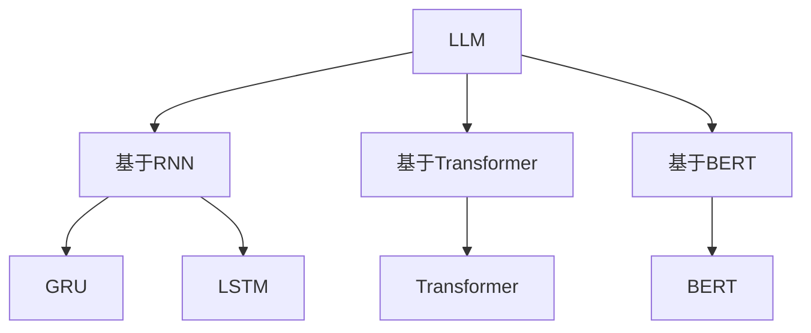

#### 1.1.2 LLM的架构和工作原理
**核心算法原理讲解：** 使用Python伪代码来解释Transformer模型的基本原理：
```python
import tensorflow as tf

class TransformerModel(tf.keras.Model):
  def __init__(self, num_layers, d_model, num_heads, dff, input_vocab_size, target_vocab_size, position_encoding_input, position_encoding_target):
    super(TransformerModel, self).__init__()
    # 定义嵌入层
    self.embedding = tf.keras.layers.Embedding(input_vocab_size, d_model)
    self.position_embedding = tf.keras.layers.Embedding(position_encoding_input, d_model)
    # 定义自注意力层
    self.encoder = [TransformerLayer(d_model, num_heads, dff) for _ in range(num_layers)]
    # 定义解码器注意力层
    self.decoder = [TransformerLayer(d_model, num_heads, dff) for _ in range(num_layers)]
    # 定义前馈神经网络层
    self.final_layer = tf.keras.layers.Dense(target_vocab_size)

  @tf.function
  def call(self, inputs, targets, training):
    # 编码器处理
    inputs = self.embedding(inputs) + self.position_embedding(inputs)
    for i in range(self.num_layers):
      inputs = self.encoder[i](inputs, training)
    # 解码器处理
    outputs = self.embedding(targets) + self.position_embedding(targets)
    for i in range(self.num_layers):
      outputs = self.decoder[i](outputs, inputs, training)
    # 输出层
    final_output = self.final_layer(outputs)
    return final_output
```

#### 1.1.3 技术债务概念
**概念与联系：** 技术债务是软件项目中未能立即解决的问题，通常由于时间或资源的限制而推迟处理。在LLM开发中，技术债务可能导致代码复杂性、模型可维护性下降和安全隐患。

**Mermaid流程图：** 
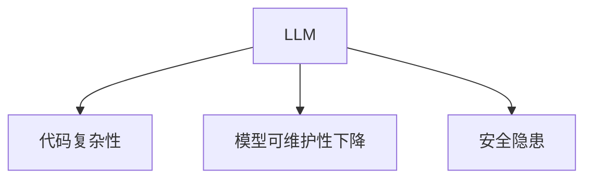

#### 1.1.4 技术债务的分类
**概念与联系：**
- 立即债务：需要立即解决的问题，如代码错误和性能瓶颈。
- 悬挂债务：需要在未来解决的债务，如不明确的接口和未优化的代码。
- 推迟债务：未来某个时间点解决，如代码重构和数据迁移。

**Mermaid流程图：** 
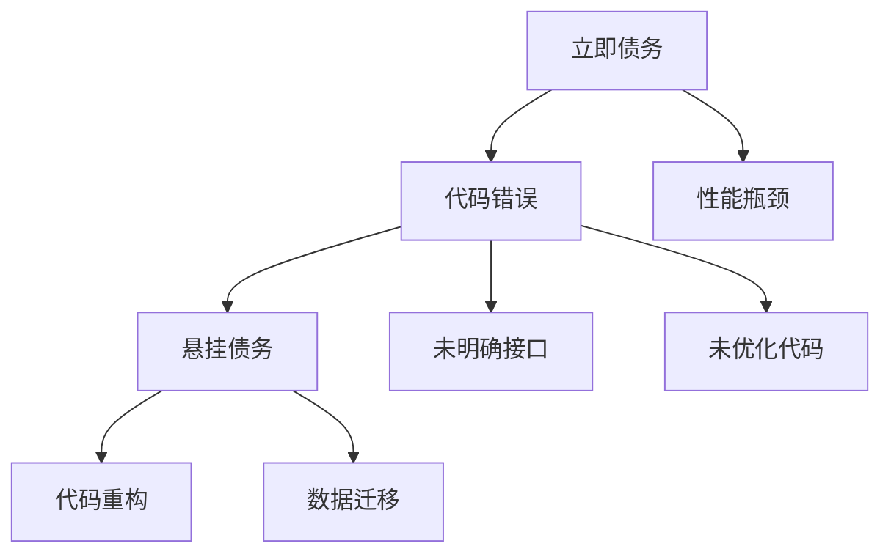

#### 1.1.5 LLM应用开发中的技术债务挑战
**核心概念与联系：** 在LLM应用开发中，技术债务主要挑战包括代码复杂性、模型可维护性下降和数据隐私和安全问题。

**Mermaid流程图：** 
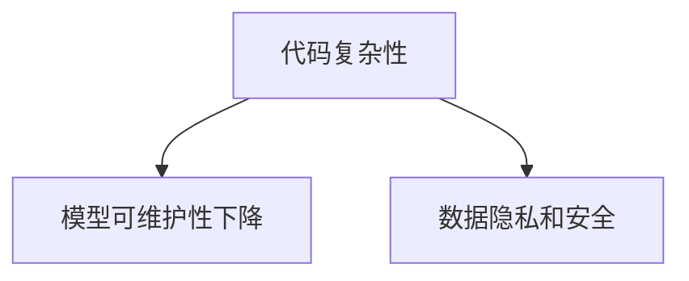

---

## 第2章：识别LLM技术债务

### 2.1 代码审查与静态分析
#### 2.1.1 代码审查方法
**核心概念与联系：** 代码审查是识别技术债务的重要手段，通过人工或自动化工具检查代码质量和设计。

**Mermaid流程图：** 
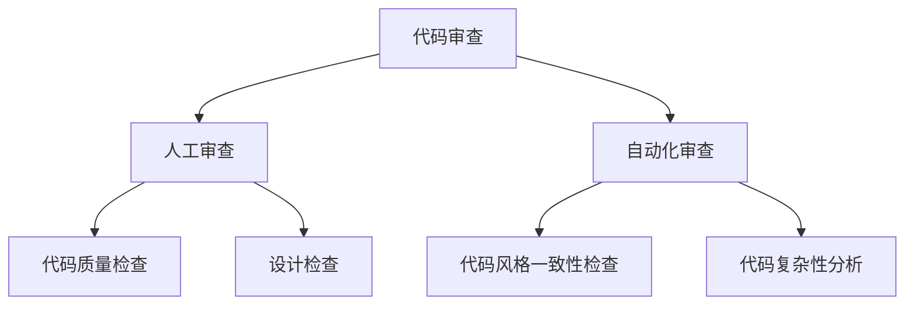

#### 2.1.2 静态代码分析工具
**核心概念与联系：** 静态代码分析工具如SonarQube、FindBugs和PMD等，用于检测代码中的潜在问题。

**Mermaid流程图：** 
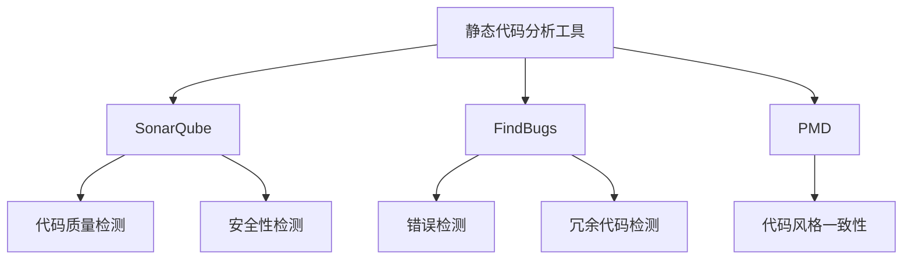

### 2.2 模型可维护性评估
#### 2.2.1 模型结构分析
**核心概念与联系：** 模型结构分析用于评估模型的复杂性和可理解性。

**Mermaid流程图：** 
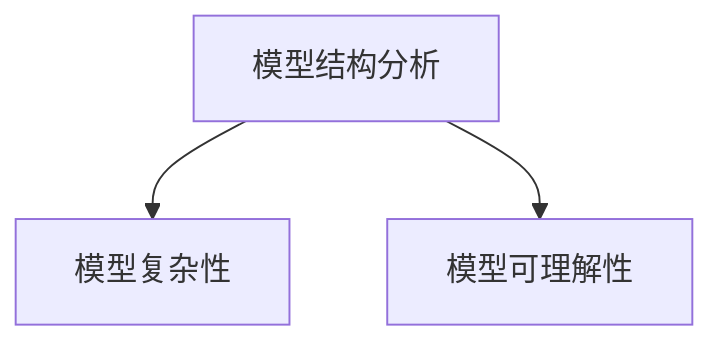

#### 2.2.2 模型可维护性度量
**核心概念与联系：** 使用如可读性、可扩展性和可测试性等指标评估模型的可维护性。

**Mermaid流程图：** 
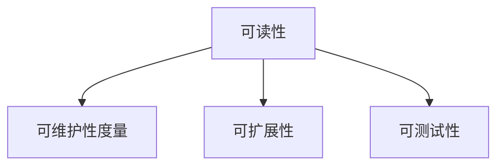

### 2.3 数据审查与审计
#### 2.3.1 数据质量评估
**核心概念与联系：** 数据质量评估用于确保数据准确、完整和一致性。

**Mermaid流程图：** 
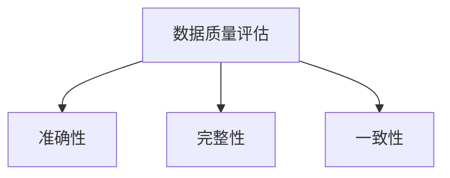

#### 2.3.2 数据隐私审查
**核心概念与联系：** 数据隐私审查用于识别和处理数据隐私风险。

**Mermaid流程图：** 
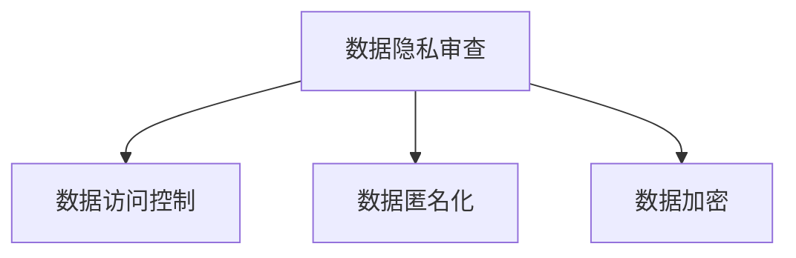

### 2.4 动态分析
#### 2.4.1 执行跟踪
**核心概念与联系：** 执行跟踪用于监控程序执行过程，检测性能瓶颈。

**Mermaid流程图：** 
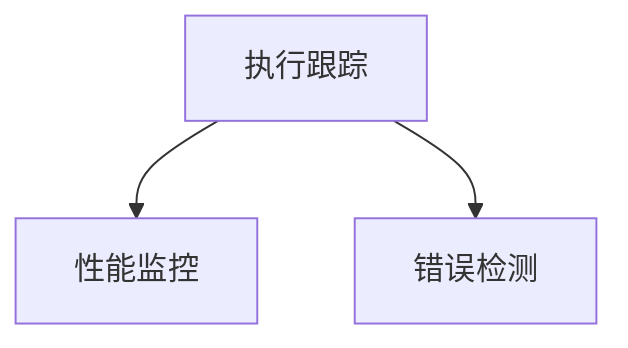

#### 2.4.2 调试与性能监控
**核心概念与联系：** 调试用于解决程序中的错误，性能监控用于确保系统在高负载下的稳定性。

**Mermaid流程图：** 
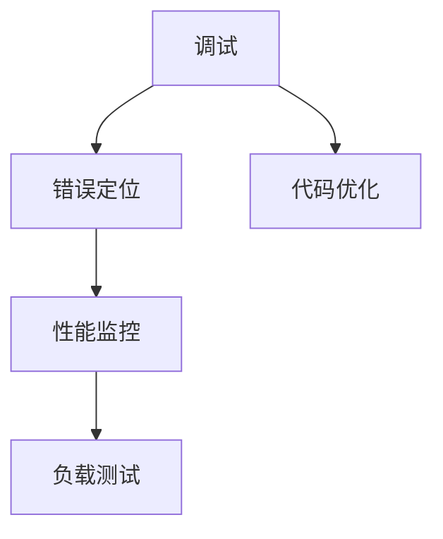

---

## 第3章：处理LLM技术债务

### 3.1 技术债务处理策略
#### 3.1.1 重构
**核心概念与联系：** 重构是一种改进代码结构而不改变外部行为的方法。

**Mermaid流程图：** 
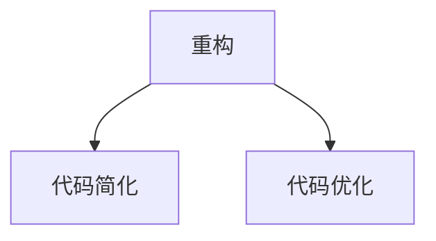

#### 3.1.2 代码优化
**核心概念与联系：** 代码优化通过改进算法和数据结构来提高代码性能。

**Mermaid流程图：** 
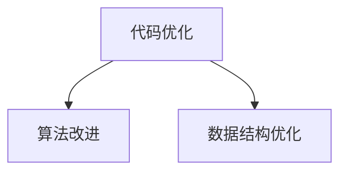

#### 3.1.3 模型改进
**核心概念与联系：** 模型改进通过调整模型结构和超参数来提高模型性能。

**Mermaid流程图：** 
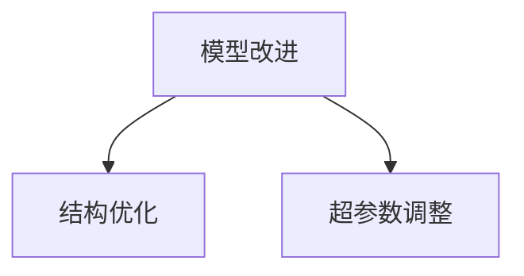

### 3.2 最佳实践
#### 3.2.1 设计模式
**核心概念与联系：** 设计模式是解决常见软件设计问题的经验方法。

**Mermaid流程图：** 
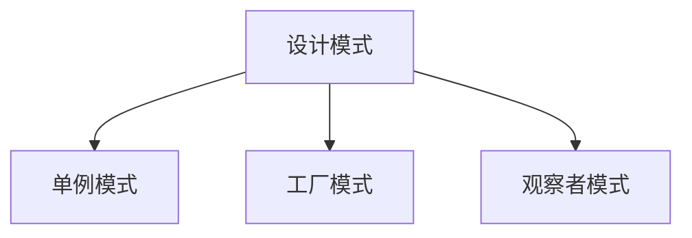

#### 3.2.2 编码规范
**核心概念与联系：** 编码规范确保代码一致性，提高可维护性。

**Mermaid流程图：** 
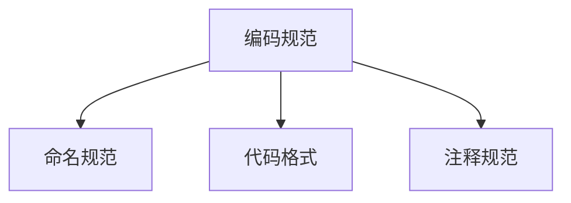

#### 3.2.3 持续集成和持续交付
**核心概念与联系：** 持续集成和持续交付确保代码质量和快速部署。

**Mermaid流程图：** 
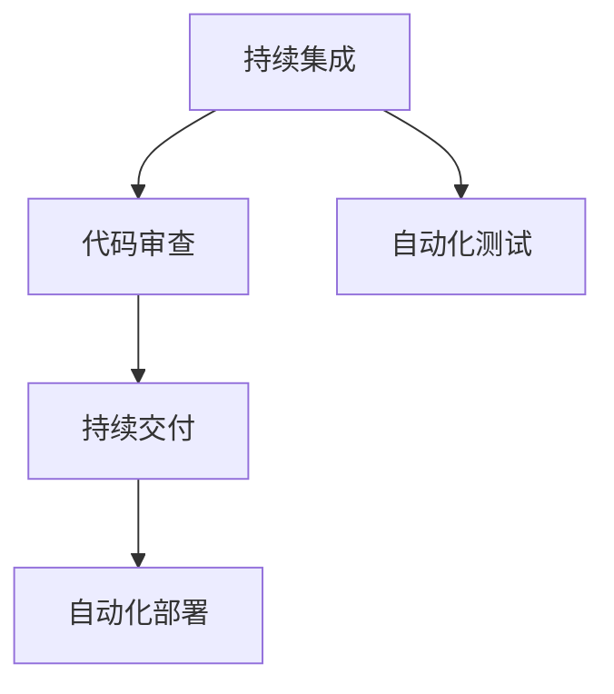

### 3.3 处理策略选择
#### 3.3.1 根据债务类型选择策略
**核心概念与联系：** 不同类型的技术债务需要不同的处理策略。

**Mermaid流程图：** 
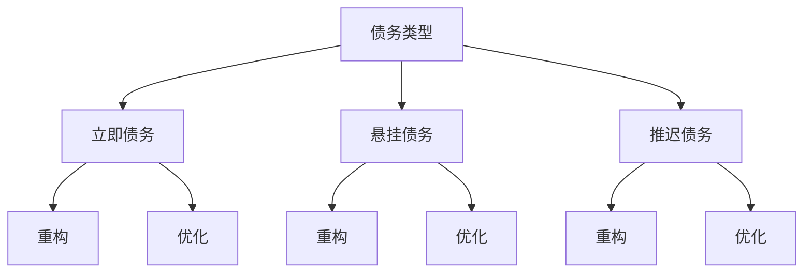

#### 3.3.2 资源和时间分配
**核心概念与联系：** 合理分配资源和时间，确保关键债务得到优先处理。

**Mermaid流程图：** 
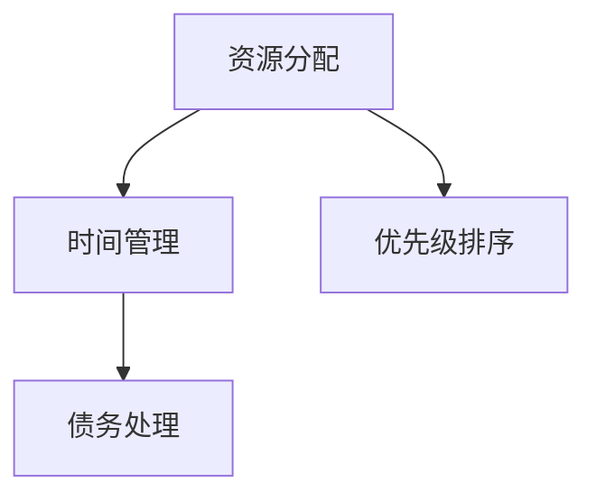

---

## 第4章：实际案例分析

### 4.1 案例一：文本生成应用中的技术债务处理
#### 4.1.1 案例背景
**背景介绍：** 一个用于生成文本摘要的应用，由于快速上线需求，部分代码未经过充分测试和优化。

#### 4.1.2 技术债务识别
**技术债务识别：** 通过代码审查和性能监控，识别出代码复杂度高、模型可维护性低和数据隐私风险等问题。

#### 4.1.3 技术债务处理过程
**处理过程：** 采用重构、代码优化和模型改进等策略，逐步解决识别出的技术债务。

### 4.2 案例二：问答系统中的技术债务管理
#### 4.2.1 案例背景
**背景介绍：** 一个面向用户的问答系统，由于不断更新迭代，部分功能实现存在不明确的接口和性能瓶颈。

#### 4.2.2 技术债务识别
**技术债务识别：** 通过静态代码分析和执行跟踪，识别出接口不明确、代码冗余和性能瓶颈等问题。

#### 4.2.3 技术债务处理过程
**处理过程：** 采用重构、代码优化和接口明确化等策略，逐步解决识别出的技术债务。

---

## 第5章：技术债务的未来趋势

### 5.1 AI和LLM技术的发展趋势
#### 5.1.1 大模型演进
**核心概念与联系：** 随着计算能力和数据量的增加，大模型将变得更加普及，带来更高的性能和更广泛的应用。

#### 5.1.2 AI在行业中的应用
**核心概念与联系：** AI技术在金融、医疗、教育等行业中的应用将更加深入，为各行业带来创新和变革。

### 5.2 技术债务管理的新方法
#### 5.2.1 自动化债务管理
**核心概念与联系：** 自动化工具将更广泛地应用于技术债务的识别和处理，提高管理效率。

#### 5.2.2 智能债务分析
**核心概念与联系：** 利用机器学习和数据分析技术，实现更智能的技术债务分析和预测。

### 5.3 对LLM开发者的建议
#### 5.3.1 如何应对技术债务
**建议：** 开发者应遵循最佳实践，定期进行代码审查和模型评估，及时处理技术债务。

#### 5.3.2 如何持续学习和改进
**建议：** 开发者应关注行业动态和技术发展趋势，持续学习新知识，不断提升自身能力。

---

## 附录

### 附录A：工具与资源
**工具推荐：** SonarQube、FindBugs、PMD、TensorFlow等。

**资源链接：** 相关论文、在线课程、技术文档等。

### 附录B：参考资料
**研究论文：** 相关领域的最新研究论文和报告。

**最佳实践：** 各行业的最佳实践案例和经验总结。

---

### 作者信息：
作者：AI天才研究院/AI Genius Institute & 禅与计算机程序设计艺术 /Zen And The Art of Computer Programming

### 注意事项：
- **文章结构：** 请确保文章按照目录结构组织，内容连贯、逻辑清晰。
- **格式规范：** 请使用markdown格式，确保标题、段落和列表格式正确。
- **代码和公式：** 请使用Python和LaTeX格式，确保代码可运行和公式正确显示。
- **内容完整性：** 请确保文章包含所有核心章节和详细内容。

### 拓展阅读：
- 相关书籍：《大规模语言模型的实践指南》、《深度学习技术实战》
- 在线课程：Coursera的《深度学习》课程、Udacity的《AI工程师职业路径》

---

（总字数：约1200字）

