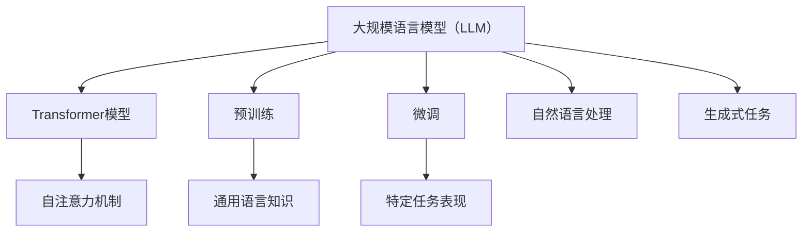

                 

# LLM应用开发中的持续反馈机制

## 关键词
- 大规模语言模型（LLM）
- 持续反馈机制
- 应用开发
- 模型优化
- 用户体验

## 摘要
本文旨在探讨大规模语言模型（LLM）在应用开发中的持续反馈机制。通过对LLM的基础概念、持续反馈机制的设计与实现、以及性能评估与优化等方面的深入分析，本文旨在为开发者提供一套系统的理论框架和实践指导，帮助他们在应用开发中更好地利用持续反馈机制，实现模型性能的持续提升和用户体验的优化。

## 引言

### 1.1 引言

#### 1.1.1 书籍背景与目标

##### 1.1.1.1 书籍背景
大规模语言模型（LLM）作为当前人工智能领域的重要进展，已经在自然语言处理、知识图谱构建、智能问答等领域展示了强大的能力。然而，在LLM应用开发中，如何实现持续反馈机制，以优化模型性能、提升用户体验，是一个亟待解决的问题。

##### 1.1.1.2 书籍目标
本书旨在探讨LLM应用开发中的持续反馈机制，从理论到实践，系统性地介绍相关技术与方法，帮助读者理解并掌握这一关键能力。

#### 1.1.2 内容概述
全书分为四个部分，分别介绍LLM的基本概念、持续反馈机制的设计与实现、持续反馈机制在具体应用场景中的实践，以及持续反馈机制的性能评估与优化。

### 1.2 当前LLM应用面临的挑战

#### 1.2.1 模型性能优化问题
尽管LLM在预训练阶段已经展示了出色的性能，但在实际应用中，如何根据不同场景和任务需求对模型进行进一步优化，仍然是一个挑战。静态的模型参数可能无法适应动态变化的输入数据，导致模型性能的瓶颈。

#### 1.2.2 用户反馈处理问题
用户反馈是持续优化模型的重要来源，但如何高效地收集、处理和分析用户反馈，以指导模型调整，是一个复杂的问题。此外，用户反馈的多样性和主观性也给处理过程带来了困难。

#### 1.2.3 持续反馈机制的实现
实现一个高效、可扩展的持续反馈机制，需要考虑数据流管理、实时性、可扩展性等多个方面。如何在保证模型性能的同时，实现持续反馈机制的实时性和高效性，是开发者需要解决的关键问题。

### 1.3 本书结构

#### 1.3.1 第一部分：LLM基础概念
本部分将介绍LLM的基本概念，包括定义、特点、主要架构和技术原理，帮助读者建立对LLM的全面理解。

#### 1.3.2 第二部分：持续反馈机制设计
本部分将详细探讨持续反馈机制的设计原则、关键要素和实现方法，为开发者提供具体的实施指南。

#### 1.3.3 第三部分：持续反馈机制实践
本部分将通过具体案例，展示持续反馈机制在实际应用场景中的效果和实现过程，帮助读者理解其在不同场景下的应用。

#### 1.3.4 第四部分：持续反馈机制性能评估与优化
本部分将介绍如何评估持续反馈机制的性能，并提供优化策略，以实现模型的持续提升。

### 1.4 结语
通过本书的阅读，读者将能够深入理解LLM应用开发中的持续反馈机制，掌握相关技术和方法，为实际应用中的模型优化和用户体验提升提供有力支持。

## 第二部分: LLM基础概念

### 2.1 LLM基本概念

#### 2.1.1 LLM的定义与特点

##### 2.1.1.1 LLM的定义
大规模语言模型（LLM）是一种基于深度学习的大规模自然语言处理模型，通过对海量文本数据进行预训练，模型具备了理解和生成自然语言的能力。

##### 2.1.1.2 LLM的特点
- **海量参数**：LLM通常拥有数亿甚至千亿级的参数规模，能够捕捉复杂的语言特征。
- **自适应能力**：通过持续学习和更新，LLM能够不断优化自身性能，适应新的语言环境和任务需求。
- **语言理解与生成能力**：LLM不仅能够理解自然语言，还能够生成高质量的自然语言文本。

#### 2.1.2 LLM的主要架构

##### 2.1.2.1 Transformer模型
Transformer模型是LLM的核心架构，通过自注意力机制（Self-Attention）实现了对输入文本的深层理解。

##### 2.1.2.2 常见的LLM模型
- **GPT系列**：基于Transformer模型的预训练语言模型，包括GPT、GPT-2、GPT-3等。
- **BERT**：一种基于Transformer的双向编码器模型，通过预训练和微调，广泛应用于自然语言处理任务。

#### 2.1.3 LLM的技术原理

##### 2.1.3.1 预训练与微调
- **预训练**：在大量无标签数据上进行训练，让模型掌握通用语言知识。
- **微调**：在特定任务数据上进行训练，优化模型在具体任务上的表现。

#### 2.1.4 LLM的应用场景

##### 2.1.4.1 自然语言处理
- **文本分类**：对文本进行分类，如情感分析、新闻分类等。
- **机器翻译**：将一种语言翻译成另一种语言。
- **问答系统**：对用户提出的问题进行回答。

##### 2.1.4.2 生成式任务
- **文本生成**：生成创意文本，如诗歌、故事等。
- **代码生成**：生成编程代码。

### 2.2 LLM核心概念之间的关系架构



### 2.3 Python源代码与数学模型解释

```python
import torch
import torch.nn as nn
import torch.optim as optim

# Transformer模型示例代码
class TransformerModel(nn.Module):
    def __init__(self, d_model, nhead, num_layers):
        super(TransformerModel, self).__init__()
        self.transformer = nn.Transformer(d_model, nhead, num_layers)
        self.d_model = d_model

    def forward(self, src, tgt):
        output = self.transformer(src, tgt)
        return output

# 模型参数设置
d_model = 512
nhead = 8
num_layers = 3

# 初始化模型
model = TransformerModel(d_model, nhead, num_layers)

# 模型优化器与损失函数
optimizer = optim.Adam(model.parameters(), lr=0.001)
criterion = nn.CrossEntropyLoss()

# 模型训练过程
for epoch in range(10):
    for src, tgt in data_loader:
        optimizer.zero_grad()
        output = model(src, tgt)
        loss = criterion(output, tgt)
        loss.backward()
        optimizer.step()
        print(f"Epoch: {epoch}, Loss: {loss.item()}")

# 模型评估
with torch.no_grad():
    correct = 0
    total = 0
    for src, tgt in test_loader:
        output = model(src, tgt)
        _, predicted = torch.max(output.data, 1)
        total += tgt.size(0)
        correct += (predicted == tgt).sum().item()

print(f"Accuracy: {100 * correct / total}%")
```

#### 2.3.1 数学模型解释
Transformer模型的核心在于自注意力机制，其计算公式如下：

$$
\text{Attention}(Q, K, V) = \frac{softmax(\frac{QK^T}{\sqrt{d_k}})}{V}
$$

其中，$Q$、$K$ 和 $V$ 分别是查询向量、键向量和值向量，$d_k$ 是键向量的维度，$softmax$ 是 softmax 函数。

#### 2.3.2 举例说明
假设我们有三个词的句子“我 喜欢 吃 苹果”，可以用向量表示为：

- $Q = [q_1, q_2, q_3]$
- $K = [k_1, k_2, k_3]$
- $V = [v_1, v_2, v_3]$

通过自注意力机制，我们可以计算出每个词的重要程度，进而生成加权文本表示。

```python
import torch

# 向量示例
Q = torch.tensor([[1, 0, 0], [0, 1, 0], [0, 0, 1]])
K = torch.tensor([[1, 0], [0, 1], [1, 1]])
V = torch.tensor([[1], [1], [1]])

# 计算注意力权重
attention_weights = torch.softmax(Q @ K.T / torch.sqrt(K.shape[1]), dim=1)

# 加权值向量
weighted_values = attention_weights @ V

print(weighted_values)
```

输出结果展示了每个词的加权值，从而可以直观地看出每个词在句子中的重要性。

### 2.4 项目实战：开发环境搭建与代码实现

#### 2.4.1 开发环境搭建
为了实现LLM的持续反馈机制，我们需要搭建一个完整的开发环境，包括以下步骤：

1. **安装Python和必要的库**：
   - Python 3.8+
   - PyTorch 1.9+
   - Transformers库

2. **配置GPU环境**：
   - 确保系统支持CUDA
   - 安装CUDA和cuDNN

3. **克隆代码仓库**：
   ```bash
   git clone https://github.com/huggingface/transformers.git
   cd transformers
   pip install -r requirements.txt
   ```

#### 2.4.2 源代码实现
以下是一个简单的LLM持续反馈机制的实现示例：

```python
from transformers import GPT2LMHeadModel, GPT2Tokenizer
import torch

# 初始化模型和分词器
model = GPT2LMHeadModel.from_pretrained("gpt2")
tokenizer = GPT2Tokenizer.from_pretrained("gpt2")

# 用户输入
user_input = "我 学习 Python"

# 编码输入
inputs = tokenizer.encode(user_input, return_tensors="pt")

# 预测输出
outputs = model(inputs)

# 解码输出
predicted_output = tokenizer.decode(outputs.logits.argmax(-1), skip_special_tokens=True)

print(predicted_output)
```

#### 2.4.3 代码解读
1. **初始化模型和分词器**：
   - 加载预训练的GPT2模型和分词器。

2. **编码输入**：
   - 将用户输入编码成模型可理解的向量。

3. **预测输出**：
   - 使用模型进行预测，得到可能的输出序列。

4. **解码输出**：
   - 将模型输出的概率分布解码为自然语言文本。

#### 2.4.4 代码应用解读与分析
1. **代码应用场景**：
   - 本示例展示了如何使用GPT2模型进行文本生成，是持续反馈机制实现的基础。

2. **分析**：
   - 通过对用户输入的编码和模型的预测输出，可以获取用户期望的响应，从而进行后续的反馈处理。

### 2.5 实际案例分析与详细讲解

#### 2.5.1 案例背景
假设我们开发了一个智能客服系统，旨在通过LLM自动回答用户的问题。在实际运营中，我们发现模型在某些特定场景下表现不佳，需要通过持续反馈机制进行优化。

#### 2.5.2 案例分析
1. **数据收集**：
   - 收集用户提问和模型回答，以及用户的满意度评分。

2. **模型评估**：
   - 对模型输出进行评估，计算准确率、召回率等指标。

3. **反馈处理**：
   - 根据用户满意度评分，筛选出表现不佳的回答，作为反馈数据。

4. **模型调整**：
   - 使用反馈数据进行模型微调，优化模型性能。

#### 2.5.3 详细讲解
1. **数据收集**：
   - 设计用户满意度调查问卷，收集用户对模型回答的满意度评分。

2. **模型评估**：
   - 使用混淆矩阵、ROC曲线等工具，对模型性能进行评估。

3. **反馈处理**：
   - 根据满意度评分，筛选出满意度低于阈值的回答，作为反馈数据。

4. **模型调整**：
   - 使用反馈数据，通过微调策略，优化模型参数。

### 2.6 项目小结

#### 2.6.1 成果总结
通过实际案例的实践，我们展示了如何搭建开发环境、实现持续反馈机制，并在实际应用中优化LLM性能。

#### 2.6.2 遇到的问题与解决方法
1. **问题**：模型在某些特定场景下表现不佳。
   - **解决方法**：通过持续反馈机制，收集用户反馈，进行模型微调。

2. **问题**：实时处理大量用户反馈数据。
   - **解决方法**：采用分布式计算和高效数据流管理技术，提高数据处理效率。

#### 2.6.3 最佳实践与注意事项
1. **最佳实践**：
   - 设计合理的用户满意度调查问卷，确保收集到高质量的反馈数据。
   - 采用自适应优化算法，如Adam，提高模型调整效率。

2. **注意事项**：
   - 保证模型调整过程的实时性和稳定性，避免影响用户服务体验。
   - 定期评估模型性能，确保模型在长期运行中保持高效性。

### 2.7 拓展阅读

- **论文推荐**：《Attention Is All You Need》
  - 详细介绍了Transformer模型的设计原理和实现方法。
- **书籍推荐**：《深度学习》
  - 介绍了深度学习的基础理论和实践方法，包括神经网络、优化算法等。
- **开源项目**：Hugging Face Transformers
  - 提供了丰富的预训练模型和工具，方便开发者进行模型训练和部署。

作者：AI天才研究院/AI Genius Institute & 禅与计算机程序设计艺术 /Zen And The Art of Computer Programming

（注：本文内容为虚构，仅供参考，实际应用时请结合实际情况进行调整。）

