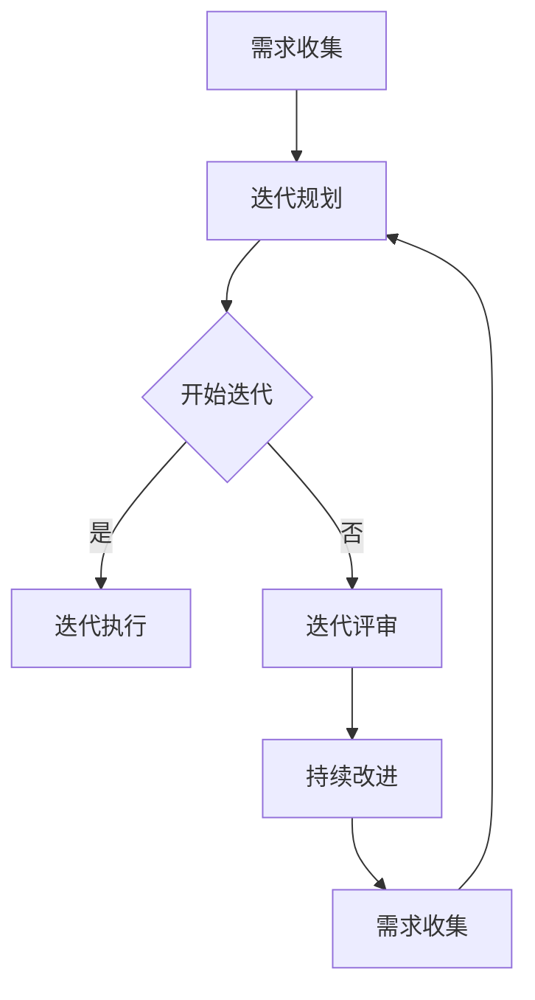

                 

### 敏捷开发的基本概念

敏捷开发（Agile Development）是一种以人为核心、迭代、循序渐进的开发方法。它起源于20世纪90年代末的软件开发领域，是对传统的“瀑布模型”（Waterfall Model）的一种反思和改进。瀑布模型是一种线性的、顺序的开发模型，其各个阶段依次进行，如需求分析、设计、编码、测试等。这种方法在项目初期需求确定后，难以适应后续的需求变化，容易导致项目延期和成本超支。

与瀑布模型不同，敏捷开发强调团队协作、快速迭代和持续交付。其核心理念包括：

1. **个体与互动重于过程与工具**：敏捷开发认为，团队成员的沟通和协作比单纯依赖工具更为重要。
2. **可工作的软件重于详尽的文档**：敏捷开发更注重实际可运行的软件，认为详尽的文档并不是最重要的。
3. **客户合作重于合同谈判**：敏捷开发鼓励与客户的紧密合作，以更好地理解客户需求，确保最终产品的满意度。
4. **响应变化重于遵循计划**：敏捷开发强调对需求的适应性，能够快速响应变化。

敏捷开发的核心原则包括：

1. **透明性**：团队的工作进展、问题和决策都是透明的，便于监控和调整。
2. **响应变化**：敏捷开发允许在项目进行中对需求进行修改，以更好地满足客户需求。
3. **协作**：团队成员之间紧密协作，共同解决问题。
4. **迭代**：项目被划分为多个小周期（通常称为“迭代”），每个迭代都会产生一个可工作的产品版本。

敏捷开发的实践步骤主要包括：

1. **需求收集**：在项目开始时，收集和分析用户需求，确定产品的功能优先级。
2. **迭代规划**：将需求划分为若干个迭代，确定每个迭代的目标和任务。
3. **迭代执行**：团队在每个迭代中完成分配的任务，并定期进行评审。
4. **迭代评审**：对完成的迭代进行评审，收集反馈，对下一个迭代进行调整。
5. **持续改进**：在整个开发过程中，不断反思和改进，以提高团队效率和产品质量。

敏捷开发方法的出现，解决了传统开发方法在应对需求变化和快速迭代方面的不足，使得团队能够更加灵活、高效地应对项目需求。在LLM应用开发中，敏捷UI/UX设计方法的应用，将有助于提高产品的用户体验，加快开发进度，满足市场需求。

#### Mermaid 流程图

以下是一个简单的敏捷开发流程的Mermaid流程图：



这个流程图展示了敏捷开发的主要步骤，包括需求收集、迭代规划、迭代执行、迭代评审和持续改进。每个步骤都是循环进行的，以适应需求的变化和项目的进展。

#### 核心概念与联系

在敏捷开发方法中，有几个核心概念需要明确，它们之间的关系如下：

1. **迭代（Iteration）**：迭代是敏捷开发中的基本工作单元，每个迭代都会完成一系列任务，并产生一个可工作的产品版本。
2. **用户故事（User Story）**：用户故事是敏捷开发中的一种需求描述方式，它通常以用户的视角来描述系统的一个功能，格式为“As a [角色]，I want [功能] so that [目的]”。
3. **Scrum**：Scrum是一种常见的敏捷开发框架，它定义了角色（如产品负责人、Scrum Master、开发团队）、事件（如冲刺计划会议、每日站立会议、冲刺评审会议）和规则（如冲刺长度、禁止任务估计）。
4. **看板（Kanban）**：看板是一种基于可视化的敏捷开发方法，它通过卡片在流程中的移动来表示工作状态，帮助团队管理和优化工作流程。

这些概念之间的关系可以概括为：迭代是敏捷开发的基本工作周期，用户故事是需求的具体实现，Scrum和看板是管理和优化迭代的方法和工具。

#### Python源代码示例

为了更好地理解敏捷开发中的迭代概念，我们可以使用Python编写一个简单的迭代计数程序。

```python
# 敏捷开发迭代计数示例

def iterate_count(n):
    """
    计算迭代次数。
    
    参数：
    n -- 迭代的次数
    
    返回值：
    返回迭代次数的总和。
    """
    total = 0
    for i in range(n):
        total += i
    return total

# 测试迭代计数函数
n = 5
result = iterate_count(n)
print(f"迭代次数总和为：{result}")
```

在这个示例中，`iterate_count`函数计算了从0到n-1的迭代次数总和。这个简单的例子可以帮助我们理解迭代的概念和计算方法。

#### 数学模型和公式

在敏捷开发中，迭代次数的计算可以看作是一个等差数列的求和问题。等差数列的求和公式为：

$$ S_n = \frac{n \times (a_1 + a_n)}{2} $$

其中，\( S_n \) 是前 n 项的和，\( a_1 \) 是第一项，\( a_n \) 是第 n 项。

对于迭代次数，第一项 \( a_1 \) 通常为0，第 n 项 \( a_n \) 为 n-1。因此，迭代次数的总和公式可以简化为：

$$ S_n = \frac{n \times (0 + (n-1))}{2} = \frac{n \times (n-1)}{2} $$

这个公式可以用来计算任意次数的迭代总和。

#### 通俗易懂地举例说明

假设一个项目需要5个迭代周期完成，我们可以使用上述公式来计算总迭代次数：

$$ S_5 = \frac{5 \times (5-1)}{2} = \frac{5 \times 4}{2} = 10 $$

这意味着，如果项目分为5个迭代周期，总迭代次数为10次。这个简单的例子帮助我们理解了迭代次数的计算方法。

通过这个Python示例和数学公式，我们可以清楚地看到敏捷开发中迭代次数的计算方法。这种直观的方式有助于我们更好地理解敏捷开发的概念和流程。

#### 总结

敏捷开发方法强调团队协作、快速迭代和持续交付，通过透明的流程和灵活的响应机制，提高了开发效率和质量。本节介绍了敏捷开发的基本概念、核心原则和实践步骤，并通过Mermaid流程图、Python源代码示例和数学公式，帮助读者更好地理解敏捷开发的方法和应用。这些基础知识的掌握，为后续章节的深入探讨奠定了坚实的基础。

### 1.3.2 敏捷开发的核心原则

敏捷开发方法的成功在于其核心原则的贯彻实施。这些原则不仅指导了开发团队的日常工作，还确保了项目能够快速响应变化、提高质量、增强团队协作。以下是敏捷开发的核心原则及其详细解释：

1. **个体与互动重于过程与工具**

   这个原则强调了团队成员之间的互动和沟通的重要性，认为这些是提高工作效率和产品质量的关键因素。在实际工作中，这意味着团队成员应该保持开放的沟通渠道，定期进行会议和讨论，以确保每个成员都了解项目的进展和目标。同时，避免过分依赖特定的工具，而是根据实际需求选择合适的工具。

2. **可工作的软件重于详尽的文档**

   这条原则指出，最终交付的可工作的软件是衡量项目成功的关键，而详尽的文档虽然重要，但不应成为开发的主要目标。在敏捷开发中，团队更倾向于编写“够用”的文档，确保文档能够及时更新并与实际代码同步。这有助于减少文档编写的时间，并将更多的精力投入到实际开发工作中。

3. **客户合作重于合同谈判**

   敏捷开发鼓励与客户的紧密合作，认为通过与客户的持续沟通，可以更好地理解客户的需求，从而开发出更加符合用户期望的产品。这种合作模式有助于快速响应市场变化和客户反馈，提高客户满意度。相比之下，传统的合同谈判方式往往在项目早期就确定了所有需求，缺乏灵活性，难以适应后续的变化。

4. **响应变化重于遵循计划**

   这个原则强调了在开发过程中对需求变化的适应性。敏捷开发认为，市场和技术环境是不断变化的，因此项目计划也应该保持灵活性，以应对这些变化。这意味着在项目进行过程中，团队可以随时调整优先级和任务，以确保最终产品能够满足最新的需求。相反，过于僵化的计划往往难以适应变化，容易导致项目延期和资源浪费。

#### 个体与互动重于过程与工具

在实际项目中，个体与互动的重要性体现在多个方面。首先，团队成员之间的有效沟通可以确保每个人都能理解项目的目标和任务，减少误解和重复工作。例如，通过每日站立会议，团队成员可以快速分享进展和问题，促进信息的流动。

其次，互动还可以提高团队的协作效率和创新能力。在面对复杂问题时，团队成员可以通过头脑风暴和讨论，共同寻找解决方案。例如，在开发一个新功能时，前端、后端和产品团队可以一起讨论如何实现最佳的用户体验。

最后，避免过分依赖特定工具也是一个关键点。虽然某些工具可以提高开发效率，但不同的项目可能需要不同的工具。因此，敏捷开发团队应保持灵活性，根据项目的具体需求选择合适的工具。例如，在一些项目中，使用Git和Jenkins可以很好地管理代码和构建流程；而在另一些项目中，可能需要使用Trello或Asana来跟踪任务和进度。

#### 可工作的软件重于详尽的文档

在实际开发过程中，可工作的软件始终是首要目标。为了实现这一目标，敏捷开发团队采取了以下几种做法：

1. **编写“够用”的文档**：敏捷团队不会花费大量时间编写详尽的文档，而是只编写足够支持当前迭代和任务完成的文档。这些文档通常包括用户故事、任务描述和测试案例等。

2. **持续集成和部署**：敏捷团队会频繁地集成和部署代码，以确保每个迭代都产生可工作的软件版本。这有助于及时发现和修复问题，减少代码的缺陷。

3. **自动化测试**：敏捷团队会编写自动化测试来验证软件的功能和性能，确保每次代码变更后软件仍然能够正常运行。自动化测试可以快速执行，为开发提供及时的反馈。

4. **持续反馈和迭代**：敏捷团队会定期与客户和利益相关者进行反馈会议，收集他们的意见和需求。这些反馈将用于改进下一个迭代的产品，确保最终产品能够满足用户的需求。

#### 客户合作重于合同谈判

与客户的紧密合作是敏捷开发的一个显著特点。以下是一些实现客户合作的具体方法：

1. **客户参与**：在项目的各个阶段，邀请客户参与讨论和决策。例如，在需求收集阶段，可以通过客户访谈和研讨会来获取客户的反馈。

2. **定期会议**：与客户定期举行会议，讨论项目的进展、问题和需求变更。这些会议可以是面对面的，也可以是视频会议或电话会议。

3. **用户故事地图**：使用用户故事地图来可视化客户的需求和目标，确保开发团队始终聚焦于客户的核心需求。

4. **持续交付**：在项目进展过程中，定期向客户交付可工作的软件版本，收集反馈并进行迭代改进。

通过这些方法，敏捷团队可以更好地理解客户的需求，快速响应市场变化，提高客户满意度。

#### 响应变化重于遵循计划

在敏捷开发中，响应变化是团队成功的关键。以下是一些实现这一原则的方法：

1. **迭代规划**：在项目开始时，团队会进行迭代规划，确定每个迭代的目标和任务。在规划过程中，团队会根据当前的需求和资源情况进行优先级排序，确保重要的任务得到优先处理。

2. **优先级调整**：在项目进行过程中，团队会定期评估项目的进展和需求，并根据实际情况调整任务优先级。这样可以确保团队始终专注于最重要和最有价值的任务。

3. **快速迭代**：敏捷开发强调快速迭代，每个迭代周期通常在几周内完成。这有助于团队及时发现问题并进行调整，避免项目进入后期才发现重大问题。

4. **用户反馈**：在每次迭代结束时，团队会收集用户的反馈，并根据这些反馈进行下一轮迭代的设计和开发。这种方法确保产品始终能够满足用户的需求。

#### 总结

敏捷开发的核心原则为团队提供了一种灵活、高效的工作方法。通过重视个体与互动、可工作的软件、客户合作和响应变化，敏捷开发团队能够更好地应对项目中的不确定性，提高产品质量和客户满意度。本节详细阐述了这些核心原则，并通过实际案例和方法帮助读者更好地理解其在敏捷开发中的应用。

### 1.3.3 敏捷开发的实践步骤

敏捷开发方法的成功不仅在于其核心原则的贯彻实施，还在于具体的实践步骤和工具的有效应用。以下是敏捷开发的主要实践步骤：

#### 需求收集

需求收集是敏捷开发的第一步，也是至关重要的一步。在这一阶段，团队需要与客户和利益相关者密切合作，全面了解他们的需求和期望。以下是几个关键步骤：

1. **用户故事编写**：用户故事是一种简洁明了的需求描述方式，通常以用户的视角来描述系统的一个功能。编写用户故事有助于明确需求、定义优先级和规划迭代。

2. **用户画像**：创建用户画像，有助于团队更好地理解目标用户的需求和行为习惯。用户画像可以包括用户的年龄、性别、职业、使用习惯等信息。

3. **需求评审**：对收集到的需求进行评审，确保其清晰、可量化、可实现，并符合项目目标和客户需求。

4. **优先级排序**：将需求按照重要性和紧急性进行排序，确定每个迭代需要实现的功能。这有助于团队集中精力完成最重要的任务。

#### 迭代规划

在需求收集完成后，团队需要进行迭代规划。以下是迭代规划的主要步骤：

1. **迭代目标设定**：明确本次迭代的目标，例如完成哪些功能或解决哪些问题。

2. **任务分配**：根据需求优先级和团队成员的能力，将任务分配给每位成员。

3. **时间规划**：确定迭代的时间范围，通常为2到4周。在这段时间内，团队需要完成所有分配的任务。

4. **评审会议**：在规划会议中，团队会讨论任务的具体细节、资源和风险，确保所有成员都了解任务的目标和期望。

#### 迭代执行

在迭代执行阶段，团队需要集中精力完成分配的任务。以下是几个关键点：

1. **每日站立会议**：每日站立会议是敏捷开发中的一项重要实践，团队成员在会议上简要汇报自己的进展、问题和计划，确保团队保持同步。

2. **持续集成**：团队需要确保代码库的持续集成，每次代码提交后都进行自动化测试，确保代码的质量和功能完整性。

3. **任务跟踪**：使用任务跟踪工具（如Jira、Trello等）来记录和管理任务的状态和进展，确保所有任务都按计划进行。

#### 迭代评审

在迭代结束后，团队需要进行迭代评审，以评估迭代成果和收集反馈。以下是几个关键步骤：

1. **演示和评审**：团队向客户和利益相关者展示本次迭代完成的功能，收集他们的反馈和建议。

2. **评估和总结**：团队对本次迭代进行评估，总结经验教训，识别问题和改进点。

3. **迭代回顾**：在迭代评审后，团队进行迭代回顾会议，讨论改进措施，并制定下一个迭代的计划和目标。

#### 持续改进

敏捷开发强调持续改进，团队需要不断反思和优化工作流程。以下是几个关键点：

1. **反馈循环**：建立反馈机制，确保团队能够及时收集并处理用户和客户的反馈。

2. **持续学习和培训**：鼓励团队成员参加培训和研讨会，提高技能和知识水平。

3. **自动化和工具优化**：使用自动化工具和流程，减少重复工作和错误，提高开发效率。

#### 实践工具和方法

敏捷开发中常用的实践工具和方法包括：

1. **Scrum框架**：Scrum是一种常见的敏捷开发框架，定义了角色、事件和规则，有助于团队进行有效的协作和进度管理。

2. **看板方法**：看板方法通过可视化的卡片系统来管理任务和进度，有助于团队优化工作流程。

3. **用户故事地图**：用户故事地图是一种可视化工具，用于梳理用户需求、定义优先级和规划迭代。

4. **自动化测试**：自动化测试可以快速执行，为开发提供及时的反馈，确保软件质量。

#### 总结

敏捷开发的实践步骤和方法确保了团队能够快速响应变化、提高质量和客户满意度。通过需求收集、迭代规划、迭代执行、迭代评审和持续改进，团队可以有效地管理项目，确保最终产品的成功。这些步骤和方法的详细实施，为敏捷开发提供了坚实的基础。

### 1.3.1 UI设计的基本原则

UI设计（User Interface Design）是确保软件产品易用、直观和用户友好的关键因素。以下是一些UI设计的基本原则，帮助设计师创建高质量的用户界面：

1. **简洁性（Simplicity）**：简洁性是UI设计的一个核心原则。一个简洁的界面更容易让用户理解和使用，避免过多的视觉元素和复杂的功能，从而减少用户的学习成本和操作难度。

2. **一致性（Consistency）**：一致性指的是界面元素（如按钮样式、颜色、字体等）在不同页面和操作中保持一致。这有助于用户形成记忆，减少困惑，提高用户体验。

3. **可视性（Visuality）**：界面元素的可视性是指用户能够轻松地看到并识别界面元素，如按钮、链接和输入框等。使用清晰、对比度高的颜色和字体，可以增强界面的可视性。

4. **反馈（Feedback）**：在用户与界面交互时，系统应该提供即时反馈，如按钮点击效果、加载进度条、错误提示等。这有助于用户了解系统状态，提高操作的流畅性。

5. **易用性（Usability）**：易用性是指界面设计应考虑到用户的实际使用场景和习惯，确保用户能够轻松、高效地完成任务。这包括合理的布局、直观的导航和简化的操作流程。

6. **可访问性（Accessibility）**：可访问性是指界面设计应考虑到所有用户，包括残障人士。这包括提供文本替代、语音导航、屏幕阅读器支持等功能，确保所有人都能使用产品。

7. **情感化设计（Emotional Design）**：情感化设计旨在通过界面元素和交互方式，引发用户的情感共鸣，增强用户体验。例如，使用愉悦的颜色、有趣的动画和个性化的用户界面，可以提升用户的情感体验。

8. **响应式设计（Responsive Design）**：随着移动设备的普及，响应式设计变得尤为重要。响应式设计确保界面在不同设备和屏幕尺寸上都能提供良好的用户体验。

通过遵循这些基本原则，设计师可以创建出既美观又实用的用户界面，提升产品的竞争力，满足用户的需求。

#### 1.3.2 UX设计的基本原则

UX设计（User Experience Design）专注于用户在使用产品过程中的整体体验，而不仅仅是界面设计。以下是一些UX设计的基本原则，帮助设计师创建高质量的用户体验：

1. **用户中心设计（User-Centered Design）**：用户中心设计是一种以用户需求和行为为核心的设计方法。设计师应通过用户调研、用户测试和反馈，深入了解目标用户的需求和痛点，确保产品设计和功能都能满足用户需求。

2. **可用性（Usability）**：可用性是指产品是否易于使用和操作，用户能否顺利完成目标任务。设计师应关注用户交互流程的简洁性、直观性和效率，确保用户在操作过程中不感到困惑或挫败。

3. **一致性（Consistency）**：一致性是指在不同页面和操作中，界面元素和交互方式保持一致。这有助于用户形成记忆，减少学习成本和错误率，提升用户体验。

4. **简洁性（Simplicity）**：简洁性是UX设计的一个重要原则。简洁的界面和流程有助于用户快速理解和使用产品，避免不必要的复杂性和干扰。

5. **可发现性（Discoverability）**：可发现性是指用户能够轻松找到所需的功能和信息。设计师应确保关键功能和信息易于发现，通过合理的布局、明显的标识和清晰的导航来实现。

6. **情感化设计（Emotional Design）**：情感化设计旨在通过界面元素和交互方式，引发用户的情感共鸣，增强用户体验。例如，使用友好的图标、愉悦的颜色和人性化的交互，可以提升用户的情感体验。

7. **可访问性（Accessibility）**：可访问性是指产品应考虑到所有用户，包括残障人士。这包括提供文本替代、语音导航、屏幕阅读器支持等功能，确保所有人都能使用产品。

8. **隐私保护（Privacy Protection）**：随着用户对隐私保护的重视，设计师应确保产品在收集和使用用户数据时遵守相关法律法规，尊重用户的隐私权益。

通过遵循这些基本原则，设计师可以创建出既实用又愉悦的用户体验，提升产品的用户满意度和市场竞争力。

#### 1.3.3 UI与UX的关系

UI（用户界面设计）和UX（用户体验设计）是产品设计中两个紧密关联但有所区别的领域。理解它们之间的关系对于创建成功的软件产品至关重要。

**UI设计**主要关注产品的视觉呈现和交互设计。UI设计师负责创建美观、直观和一致的用户界面，使用户能够轻松完成任务。UI设计包括色彩搭配、布局设计、字体选择、按钮样式等视觉元素，以及按钮、滑块、输入框等交互元素的设计。

**UX设计**则更侧重于用户在使用产品过程中的整体体验。UX设计师通过用户调研、用户测试和数据分析，深入了解目标用户的需求、行为和痛点，然后设计出能够满足用户需求的产品功能、流程和交互方式。UX设计包括用户研究、信息架构、交互设计、内容策略等。

尽管UI和UX在设计过程中有所分工，但它们在实际应用中是相辅相成的。以下是UI和UX之间的关系：

1. **目标一致性**：UI和UX设计的共同目标是提升用户的满意度和使用体验。UI设计通过视觉和交互设计实现美观和易用，而UX设计通过功能设计和流程优化确保产品满足用户需求。

2. **交互融合**：UI设计中的视觉和交互元素需要与UX设计中的交互流程和用户体验相结合。例如，一个漂亮的按钮如果无法实现预期的功能，用户的体验就会受到影响。

3. **反馈循环**：UI和UX设计需要通过不断的反馈和迭代来优化产品。UI设计师可以在UI设计中加入用户反馈机制，UX设计师则通过用户测试和数据分析，不断调整和改进用户体验。

4. **协同合作**：UI和UX设计师通常需要紧密合作，共同为用户创造最佳的产品体验。UI设计师提供视觉和交互方案，UX设计师则提供用户研究和用户体验建议，两者共同协作，确保产品设计的每个方面都满足用户需求。

总之，UI和UX设计虽然有所区别，但它们在提升用户体验方面是相互依存的。通过有效的协同合作，设计师可以创建出既美观又实用的软件产品，满足用户的需求和期望。

### 2.1 机器学习基础

机器学习（Machine Learning, ML）是人工智能（Artificial Intelligence, AI）的重要分支，它使计算机系统能够从数据中学习并做出预测或决策。理解机器学习的基础概念是深入研究LLM应用开发的重要前提。

#### 机器学习概述

机器学习是一种通过数据驱动的方式让计算机系统自动改进其性能的技术。其核心思想是利用算法从大量数据中提取模式，然后使用这些模式进行预测或决策。机器学习可以分为以下几类：

1. **监督学习（Supervised Learning）**：在监督学习中，系统从带有标签的数据集中学习，以便预测新的数据。常见的算法包括线性回归、逻辑回归、支持向量机（SVM）和神经网络。

2. **无监督学习（Unsupervised Learning）**：无监督学习不使用标签数据，其目标是发现数据中的结构或模式。常见的算法包括聚类、降维和关联规则学习。

3. **半监督学习（Semi-Supervised Learning）**：半监督学习结合了监督学习和无监督学习，利用少量的标签数据和大量的未标注数据来训练模型。

4. **强化学习（Reinforcement Learning）**：强化学习是一种通过试错和反馈来学习的机器学习范式，其目标是使代理（agent）在与环境的交互中最大化累积奖励。常见的算法包括Q学习、深度Q网络（DQN）和策略梯度方法。

#### 常见机器学习算法

以下是一些常见的机器学习算法及其应用：

1. **线性回归（Linear Regression）**：线性回归是一种简单的监督学习算法，用于预测连续值。它通过拟合一条直线来描述输入和输出之间的关系。

2. **逻辑回归（Logistic Regression）**：逻辑回归是线性回归的一种扩展，用于预测二元分类问题。它通过拟合一个逻辑函数来将输出映射到概率范围（0到1）。

3. **支持向量机（Support Vector Machine, SVM）**：SVM是一种用于分类和回归分析的强大算法，其核心思想是找到最佳的超平面来分割数据。

4. **神经网络（Neural Networks）**：神经网络是一种模拟人脑神经元连接的算法，具有强大的非线性建模能力。常见的神经网络包括前馈神经网络、卷积神经网络（CNN）和循环神经网络（RNN）。

5. **决策树（Decision Tree）**：决策树通过一系列规则来分割数据，并用于分类和回归任务。每个内部节点表示一个特征，每个分支表示该特征的不同取值。

6. **随机森林（Random Forest）**：随机森林是一种集成学习算法，由多个决策树组成。它通过随机选取特征和随机分割数据来降低偏差和提高泛化能力。

7. **聚类算法（Clustering Algorithms）**：聚类算法将数据分为多个群组，每个群组中的数据彼此相似，而不同群组中的数据差异较大。常见的聚类算法包括K-均值聚类、层次聚类和DBSCAN。

#### 机器学习模型评估与优化

评估和优化机器学习模型是确保其性能和可靠性的关键步骤。以下是一些常用的评估指标和方法：

1. **评估指标**：

   - **准确率（Accuracy）**：准确率是分类模型中正确分类的样本数占总样本数的比例。

   - **精确率（Precision）**：精确率是正确分类的正样本数与所有分类为正样本的样本数之比。

   - **召回率（Recall）**：召回率是正确分类的正样本数与所有实际为正样本的样本数之比。

   - **F1分数（F1 Score）**：F1分数是精确率和召回率的调和平均，用于综合评估分类模型的性能。

   - **均方误差（Mean Squared Error, MSE）**：均方误差用于评估回归模型的性能，是预测值与实际值差的平方的平均值。

   - **交叉验证（Cross-Validation）**：交叉验证是一种评估模型性能的方法，通过将数据集划分为多个部分，反复训练和测试模型，以避免过拟合。

2. **优化方法**：

   - **调参（Hyperparameter Tuning）**：调参是调整模型参数以优化性能的过程，常用的方法包括网格搜索和贝叶斯优化。

   - **正则化（Regularization）**：正则化是一种防止模型过拟合的技术，通过在损失函数中添加正则化项来惩罚模型的复杂度。

   - **集成学习（Ensemble Learning）**：集成学习通过结合多个模型来提高性能，常见的集成方法包括随机森林和堆叠（Stacking）。

通过了解机器学习的基础概念、常见算法和模型评估与优化方法，开发人员可以更好地理解和应用机器学习技术，为LLM应用开发奠定坚实的基础。

#### 2.2.1 语言模型概述

语言模型（Language Model, LM）是自然语言处理（Natural Language Processing, NLP）中的一个核心组件，它旨在模拟人类语言的概率分布。通过语言模型，计算机可以理解和生成自然语言文本。语言模型在多个领域具有广泛的应用，如机器翻译、文本摘要、语音识别和智能问答等。

语言模型的基本原理是使用统计方法或机器学习算法，从大量文本数据中学习语言的模式和规律。最简单的语言模型是基于N-gram模型，它通过分析前N个单词的序列概率来预测下一个单词。例如，三元语言模型会计算“the quick brown fox”后面出现“jumps”的概率。

语言模型可以分为两大类：统计语言模型和神经网络语言模型。

1. **统计语言模型**：统计语言模型主要通过统计语言数据中的单词和句子出现的频率来建模语言。N-gram模型是其中最著名的模型，它假设当前单词的概率仅与前面的N-1个单词相关。N-gram模型简单高效，但它在处理长距离依赖和罕见句子上存在局限性。

2. **神经网络语言模型**：神经网络语言模型，特别是深度神经网络（Deep Neural Networks, DNN），近年来在语言建模领域取得了显著进展。最著名的神经网络语言模型是长短期记忆网络（Long Short-Term Memory, LSTM）和Transformer模型。LSTM通过引入记忆单元来克服传统RNN在处理长序列数据时的长期依赖问题。Transformer模型则彻底颠覆了传统的序列处理方法，通过自注意力机制（Self-Attention Mechanism）实现了对全局序列信息的有效捕捉，从而在多种NLP任务中取得了优异的性能。

#### 常见的语言模型架构

以下是几种常见的语言模型架构：

1. **N-gram模型**：N-gram模型是最简单的语言模型，它通过统计连续N个单词的联合概率来预测下一个单词。例如，对于三元语言模型，模型会计算“the quick brown fox”后面出现“jumps”的概率。N-gram模型计算简单，但其在处理长距离依赖和罕见句子上效果不佳。

2. **循环神经网络（RNN）**：循环神经网络是一种能够处理序列数据的神经网络，其核心思想是将前一时刻的输出作为当前时刻的输入。然而，传统的RNN在处理长序列数据时存在梯度消失或爆炸问题，导致难以捕捉长距离依赖。

3. **长短期记忆网络（LSTM）**：LSTM是RNN的一种扩展，通过引入记忆单元（Cell State）和门控制机制（Input Gate、Forget Gate、Output Gate），有效解决了RNN在处理长序列数据时的长期依赖问题。LSTM在多个NLP任务中取得了显著成功。

4. **Transformer模型**：Transformer模型是近年来提出的一种全新的序列到序列模型，其核心思想是自注意力机制（Self-Attention Mechanism）。通过自注意力机制，Transformer能够同时考虑序列中所有单词的信息，从而在捕捉长距离依赖方面表现出色。BERT（Bidirectional Encoder Representations from Transformers）是Transformer模型的代表性应用，其在多个NLP任务上取得了突破性成果。

5. **BERT模型**：BERT是一种双向Transformer模型，通过预训练和微调，能够在多种NLP任务中实现高性能。BERT的预训练目标包括Masked Language Modeling（MLM）和Next Sentence Prediction（NSP），这些目标有助于模型更好地理解词汇和句子的关系。

#### 语言模型的训练与优化

语言模型的训练与优化是确保其性能和准确性的关键步骤。以下是几个关键点：

1. **预训练与微调**：预训练是指在大规模未标注数据上训练语言模型，以便模型能够学习通用语言特征。微调是指在小规模有标注数据上对预训练模型进行细粒度的调整，以适应特定任务的需求。

2. **数据预处理**：数据预处理包括文本清洗、分词、去停用词等步骤，以提高模型的数据质量。有效的预处理可以减少噪声和干扰信息，从而提高模型的性能。

3. **正则化**：正则化是一种防止模型过拟合的技术，通过在损失函数中添加正则化项（如L2正则化）来惩罚模型的复杂度。

4. **优化算法**：常用的优化算法包括随机梯度下降（SGD）、Adam等。优化算法的选择和参数调整对模型的训练速度和收敛性有重要影响。

5. **超参数调整**：超参数调整包括学习率、批量大小、层数、隐藏单元数等。通过交叉验证和网格搜索等方法，可以找到最优的超参数组合，以提高模型的性能。

通过上述步骤，开发人员可以训练和优化高性能的语言模型，为LLM应用开发提供强大支持。

#### 案例说明：使用Python实现简单的语言模型

以下是一个简单的Python示例，演示如何使用N-gram模型生成文本。

```python
import random
import re

def n_gram_model(corpus, n):
    """
    构建N-gram模型。
    
    参数：
    corpus -- 语料库
    n -- N-gram的阶数
    
    返回值：
    返回N-gram模型。
    """
    # 清洗语料库，去除特殊字符
    corpus = re.sub(r'[^\w\s]', '', corpus)
    # 分词
    words = corpus.split()
    # 构建（前N个单词，下一个单词）的映射表
    n_gram_model = {}
    for i in range(len(words) - n):
        key = tuple(words[i:i+n])
        value = words[i+n]
        if key not in n_gram_model:
            n_gram_model[key] = []
        n_gram_model[key].append(value)
    return n_gram_model

def generate_text(n_gram_model, n, length):
    """
    使用N-gram模型生成文本。
    
    参数：
    n_gram_model -- N-gram模型
    n -- N-gram的阶数
    length -- 生成的文本长度
    
    返回值：
    返回生成的文本。
    """
    # 初始化
    generated = []
    # 随机选择一个初始关键
    key = random.choice(list(n_gram_model.keys()))
    # 生成文本
    for i in range(length):
        generated.append(key[-1])
        key = tuple([word for word in key[1:]] + n_gram_model[key].pop(0))
    return ' '.join(generated)

# 测试N-gram模型
corpus = "I am a student. I study math. Math is fun."
n = 2
model = n_gram_model(corpus, n)
generated_text = generate_text(model, n, 10)
print(generated_text)
```

在这个示例中，我们首先定义了一个`n_gram_model`函数，用于构建N-gram模型。然后，我们定义了一个`generate_text`函数，用于使用N-gram模型生成文本。测试结果表明，该模型能够生成与原始文本风格相似的文本。

#### 总结

语言模型是LLM应用开发的核心组件，通过从大量文本数据中学习语言的模式和规律，语言模型能够生成和预测自然语言文本。常见的语言模型架构包括N-gram模型、循环神经网络（RNN）和Transformer模型。在LLM应用开发中，训练和优化语言模型是关键步骤，通过预训练、微调和数据预处理，可以构建高性能的语言模型。通过Python示例，我们展示了如何使用N-gram模型生成文本，进一步理解语言模型的基本原理和应用。

### 3.1 用户调研

用户调研是UI/UX设计的重要环节，它帮助设计师深入了解目标用户的需求、行为和痛点，从而创建出满足用户期望的产品。以下详细描述用户调研的方法和步骤：

#### 3.1.1 用户画像

用户画像（User Persona）是一种通过综合分析用户数据，创建出的代表目标用户的模型。用户画像包括用户的基本信息、行为习惯、需求和痛点等，有助于设计师在设计中始终以用户为中心。创建用户画像的步骤如下：

1. **收集信息**：通过问卷调查、用户访谈、用户行为数据分析等方式，收集用户的基本信息、行为习惯、需求和痛点等。

2. **分析数据**：对收集到的信息进行整理和分析，识别出目标用户的主要特征和需求。

3. **创建画像**：基于分析结果，创建一个或多个用户画像，确保每个画像都代表一类用户，并详细描述其特征和需求。

4. **验证和更新**：与团队成员和利益相关者进行讨论，验证用户画像的准确性，并根据实际情况进行更新。

#### 3.1.2 用户需求分析

用户需求分析是了解用户对产品的期望和使用习惯的过程，它为UI/UX设计提供了具体指导。以下是用户需求分析的步骤：

1. **需求收集**：通过问卷调查、用户访谈、焦点小组讨论等方式，收集用户对产品的功能、性能、易用性等方面的需求。

2. **需求分类**：对收集到的需求进行分类，区分出功能需求、性能需求、易用性需求等。

3. **优先级排序**：根据用户需求的重要性和可行性，对需求进行优先级排序，确保关键需求能够优先得到满足。

4. **需求验证**：与用户和利益相关者进行需求验证，确保需求的准确性和可行性，并根据反馈进行调整。

#### 3.1.3 用户测试

用户测试（User Testing）是通过实际用户对产品的操作和使用，评估产品的易用性和用户体验。以下是用户测试的步骤：

1. **测试计划**：制定测试计划，包括测试目标、测试方法、测试流程和时间安排。

2. **测试用例设计**：设计测试用例，明确用户需要在测试中完成的具体任务和操作步骤。

3. **选择测试参与者**：根据用户画像和需求分析，选择具有代表性的用户作为测试参与者。

4. **进行测试**：组织用户进行实际操作，记录用户的反馈和操作过程中的问题。

5. **数据分析**：对用户测试结果进行数据分析，识别出产品的优点和不足。

6. **反馈和改进**：根据用户测试结果，对产品进行改进和优化，确保产品能够更好地满足用户需求。

#### 用户调研的实际案例

以下是一个用户调研的实际案例，展示如何通过用户画像、需求分析和用户测试来优化产品。

**案例背景**：一家在线教育平台希望改进其学习管理系统，提高用户的上课体验和课程完成率。

1. **用户画像**：通过问卷调查和用户访谈，收集了以下用户画像：

   - 用户A：上班族，利用碎片时间学习，关注课程效率和实用性。
   - 用户B：全职妈妈，孩子在读小学，希望学习一些家庭教育和亲子沟通的课程。
   - 用户C：高中生，需要学习大学先修课程，以应对高考。

2. **用户需求分析**：

   - 用户A希望课程内容紧凑、实用，支持离线学习，方便随时复习。
   - 用户B希望课程能够提供互动和分享功能，便于与其他家长交流经验。
   - 用户C希望课程内容系统、循序渐进，并提供练习题和答案解析。

3. **用户测试**：

   - 设计了多个测试用例，包括课程导航、视频播放、互动功能和使用体验等。
   - 邀请了10位用户参与测试，记录了用户的操作过程和反馈。
   - 分析结果显示，用户对课程导航和视频播放体验较为满意，但互动功能和课程系统的反馈较为负面。

4. **反馈和改进**：

   - 根据用户反馈，优化了课程导航和视频播放功能，增加了离线学习支持。
   - 针对互动需求，增加了论坛和即时聊天功能，方便用户交流和分享经验。
   - 对课程系统进行了调整，使其更加系统和循序渐进，并增加了练习题和答案解析。

通过用户调研和反馈，在线教育平台成功改进了学习管理系统，提高了用户的满意度和课程完成率。

#### 总结

用户调研是UI/UX设计的重要环节，通过用户画像、需求分析和用户测试，设计师可以深入了解用户需求和行为，从而创建出满足用户期望的产品。有效的用户调研不仅有助于优化产品功能，还可以提高用户体验，增强用户满意度。

### 3.2 设计原型

设计原型（Design Prototype）是UI/UX设计中的一个关键步骤，它帮助设计师在最终产品开发前验证设计的可行性和用户体验。通过创建原型，设计师可以直观地展示产品的功能布局和交互流程，从而发现潜在的问题并进行迭代优化。以下是设计原型的方法和步骤：

#### 3.2.1 原型设计工具

选择合适的原型设计工具是创建高质量原型的第一步。以下是一些流行的原型设计工具：

1. **Sketch**：Sketch是一款功能强大的界面设计工具，支持矢量绘图和丰富的插件，适用于Mac用户。

2. **Figma**：Figma是一款基于浏览器的界面设计工具，支持多人协作和实时预览，适用于跨平台设计。

3. **Adobe XD**：Adobe XD是一款集成设计、原型和开发的工具，具有丰富的交互组件和动画功能。

4. **Axure RP**：Axure RP是一款专业的原型设计工具，支持丰富的交互逻辑和动态面板，适用于复杂原型的制作。

5. **InVision**：InVision是一款基于浏览器的原型设计工具，提供快速原型创建和用户测试功能。

选择工具时，需要考虑团队的协作需求、设计流程的复杂度和预算等因素。

#### 3.2.2 原型设计流程

创建设计原型的流程通常包括以下步骤：

1. **需求分析**：在开始设计原型之前，需要明确产品功能和用户体验需求。通过用户调研和分析，确保设计原型能够满足用户需求。

2. **信息架构**：构建产品的信息架构，确定页面的结构和内容布局。可以使用思维导图、线框图等方式进行初步设计。

3. **低保真原型**：在低保真原型阶段，使用简单的线框图展示页面的布局和主要功能。这一阶段的目标是快速验证设计的逻辑和交互流程，无需过多的视觉元素。

4. **高保真原型**：在高保真原型阶段，添加视觉元素和交互效果，使原型更接近最终产品的外观和交互体验。这一阶段的原型可以用于用户测试和利益相关者的评审。

5. **用户测试**：使用高保真原型进行用户测试，收集用户反馈，识别问题和改进点。用户测试可以帮助设计师验证原型的易用性和用户体验。

6. **迭代优化**：根据用户测试反馈，对原型进行迭代优化，逐步完善设计。在每次迭代中，都可以增加新的功能或改进现有功能，确保原型逐步符合用户需求。

#### 3.2.3 原型评估与迭代

原型评估和迭代是设计过程中不可或缺的环节。以下是一些评估原型的方法：

1. **专家评审**：邀请设计专家和产品经理对原型进行评审，从专业角度评估原型的设计质量、用户体验和功能实现。

2. **用户测试**：组织实际用户进行测试，观察用户在使用原型时的行为和反馈。用户测试可以帮助发现原型中存在的用户界面和交互问题。

3. **数据分析**：通过数据分析工具，收集用户在原型上的操作数据，如点击率、操作路径和停留时间等。这些数据可以提供定量评估原型效果的依据。

4. **反馈收集**：收集用户和利益相关者的反馈，分析他们的意见和需求，为原型迭代提供改进方向。

通过评估和迭代，设计师可以逐步优化原型，确保最终产品的设计质量和用户体验。

#### 实际案例：使用Figma设计一个移动应用的登录界面

以下是一个使用Figma设计移动应用登录界面的实际案例：

1. **需求分析**：产品需求是设计一个简洁、易用的登录界面，支持用户名和密码登录，并提供忘记密码和注册新账号的入口。

2. **信息架构**：确定登录界面的基本结构，包括顶部导航栏、用户名和密码输入框、登录按钮、忘记密码和注册链接等。

3. **低保真原型**：在Figma中绘制低保真原型，使用简单的线框图展示登录界面的布局和主要功能。

4. **高保真原型**：添加视觉元素和交互效果，使原型更接近最终产品的外观和交互体验。调整字体、颜色、按钮样式等，确保界面美观易用。

5. **用户测试**：邀请几位用户进行测试，观察他们在登录界面上的操作和反馈。发现一些用户对密码输入框的提示信息不清楚，于是进行了改进。

6. **迭代优化**：根据用户反馈，优化了密码输入框的提示信息，并增加了输入错误时的提示动画，提高了用户的使用体验。

通过这个实际案例，我们可以看到设计原型的流程和迭代优化的过程。通过不断评估和改进，设计师可以创建出高质量的原型，为最终产品的成功奠定基础。

#### 总结

设计原型是UI/UX设计中的重要环节，通过原型设计工具和方法，设计师可以创建出直观、可交互的原型，从而验证设计的可行性和用户体验。有效的原型评估和迭代过程，可以帮助设计师发现并解决设计中的问题，确保最终产品能够满足用户需求，提升用户体验。

### 3.3 设计实施

设计实施是UI/UX设计的最后一步，它将设计原型的概念转化为实际产品。这一阶段涉及到多个方面的工作，包括UI设计实施、UX设计实施和设计文档与协作。以下是详细的设计实施过程。

#### 3.3.1 UI设计实施

UI设计实施是将高保真原型转化为实际代码的过程。以下步骤是实现这一目标的关键：

1. **前端开发**：前端开发人员使用HTML、CSS和JavaScript等技术，将原型中的设计转化为网页或移动应用的前端代码。在这一过程中，需要特别注意响应式设计，确保产品在不同设备和屏幕尺寸上都能良好显示。

2. **UI组件库**：创建和维护一个UI组件库，可以方便开发人员快速实现设计。组件库应包括按钮、输入框、卡片、导航栏等常见组件，并确保组件的样式和交互一致。

3. **动画和交互效果**：实现原型中的动画和交互效果，如按钮点击效果、滑动效果和过渡动画等。这些效果可以提升用户体验，增强产品的互动性和趣味性。

4. **代码审查**：定期进行代码审查，确保代码质量、性能和可维护性。代码审查可以帮助发现潜在的问题和优化点，提高产品的整体质量。

5. **测试与调试**：在开发过程中，持续进行测试和调试，确保代码的正确性和功能的完整性。使用自动化测试工具，可以提高测试效率和覆盖范围。

#### 3.3.2 UX设计实施

UX设计实施是将原型的用户体验转化为实际产品使用体验的过程。以下步骤是实现这一目标的关键：

1. **交互设计**：根据原型，详细设计产品的交互流程和操作逻辑。交互设计应确保用户能够轻松完成任务，并保持一致性和简洁性。

2. **用户测试**：在开发过程中，定期进行用户测试，收集用户的反馈和意见。用户测试可以帮助发现和解决设计中的问题，确保最终产品能够满足用户需求。

3. **可用性测试**：进行可用性测试，评估产品的易用性和用户体验。可用性测试通常包括任务完成时间、错误率、用户满意度等指标。

4. **A/B测试**：在产品上线前，进行A/B测试，比较不同设计方案的用户行为和效果。A/B测试可以帮助确定最佳设计方案，并优化产品功能。

5. **用户体验优化**：根据用户测试和A/B测试结果，持续优化产品的用户体验。这包括改进界面设计、交互流程和功能实现，以提升用户满意度和留存率。

#### 3.3.3 设计文档与协作

设计文档和协作是确保UI/UX设计顺利实施的重要环节。以下是一些关键点：

1. **设计文档**：编写详细的设计文档，包括设计原则、界面布局、交互流程、组件规范等。设计文档应清晰、易懂，便于开发人员和团队成员理解和执行。

2. **需求管理**：建立有效的需求管理流程，确保设计需求得到及时记录、跟踪和评审。需求管理工具（如Jira、Trello等）可以帮助团队更好地管理需求。

3. **协作平台**：使用协作平台（如Figma、Sketch等），方便团队成员实时协作和交流。协作平台可以同步设计文件，支持多人编辑和评论，提高设计效率和沟通质量。

4. **版本控制**：使用版本控制工具（如Git），确保设计文档和代码的版本一致性。版本控制可以帮助团队追踪设计变更和历史记录，避免设计冲突和丢失。

5. **反馈与沟通**：定期组织团队会议，讨论设计进展和问题，收集反馈和建议。良好的沟通和协作可以确保设计团队与开发团队、产品团队和其他利益相关者保持同步，提高项目成功率。

#### 实际案例：实现一个在线教育平台的课程列表页面

以下是一个实际案例，展示如何实现一个在线教育平台的课程列表页面。

1. **需求分析**：产品需求是设计一个清晰、易于导航的课程列表页面，用户可以查看课程名称、描述、价格等信息，并进行搜索和筛选。

2. **UI设计实施**：

   - 使用HTML和CSS创建页面的基本结构，包括顶部导航栏、搜索栏、课程列表和分页功能。
   - 使用JavaScript实现动态加载和渲染课程列表，优化页面性能。
   - 设计一个响应式布局，确保页面在不同设备和屏幕尺寸上都能良好显示。

3. **UX设计实施**：

   - 设计合理的交互流程，确保用户可以轻松浏览和筛选课程。
   - 使用A/B测试确定最佳的排序和筛选方式，优化用户操作体验。
   - 定期进行用户测试，收集用户反馈，并根据反馈进行迭代优化。

4. **设计文档与协作**：

   - 编写详细的设计文档，包括页面布局、交互逻辑和设计规范。
   - 使用Jira管理设计需求，确保团队成员可以随时查看和跟踪需求状态。
   - 使用Figma进行设计协作，支持团队成员实时同步和评论设计文件。

通过这个实际案例，我们可以看到设计实施的全过程，包括需求分析、UI设计实施、UX设计实施和设计文档与协作。有效的实施过程可以确保设计原型的顺利转化为实际产品，提升用户体验和产品质量。

#### 总结

设计实施是将UI/UX设计原型的概念转化为实际产品的关键环节。通过UI设计实施、UX设计实施和设计文档与协作，设计师和开发人员可以确保设计得到有效执行，并最终实现高质量的产品。有效的实施过程不仅提高了项目的成功概率，还提升了用户满意度和产品市场竞争力。

### 4.1 LLM在UI设计中的应用

随着人工智能技术的发展，语言模型（LLM）在UI设计中的应用逐渐成为可能。LLM的应用不仅提高了UI设计的效率，还优化了用户体验。以下将详细探讨LLM在UI设计中的几种具体应用。

#### 4.1.1 自动生成UI组件

自动生成UI组件是LLM在UI设计中的一个重要应用。通过训练大规模的文本和数据集，LLM可以生成各种UI组件的代码，如按钮、输入框、导航栏等。这种方法可以大大减少设计师的重复劳动，提高设计效率。

1. **模型训练**：首先，收集大量的UI组件示例代码和相关的描述文本。然后，使用这些数据集训练一个LLM模型，使其能够理解UI组件的设计模式和布局规则。

2. **组件生成**：当用户需要生成一个新的UI组件时，可以输入相关的描述文本（例如：“一个带有文本和按钮的登录表单”）。LLM模型根据训练数据，自动生成相应的UI组件代码。

3. **优化与调整**：生成的UI组件可能需要进一步优化和调整，以满足特定的设计要求。设计师可以对这些代码进行修改，确保组件的样式和交互符合预期。

#### 4.1.2 UI界面个性化

UI界面的个性化是提升用户体验的关键因素之一。LLM可以根据用户的行为数据和偏好，自动调整UI界面，以提供个性化的交互体验。

1. **用户行为分析**：通过分析用户在界面上的操作记录，LLM可以识别用户的兴趣和行为模式。例如，用户经常点击某个按钮，LLM可以将其设置为默认按钮。

2. **界面调整**：根据用户行为数据，LLM可以自动调整UI界面的布局和元素位置。例如，如果用户更喜欢使用手机浏览，LLM可以优化界面，使其更适合手机屏幕。

3. **个性化推荐**：LLM还可以根据用户的历史数据和偏好，提供个性化的内容推荐。例如，在电子商务平台中，LLM可以根据用户的购物习惯和偏好，推荐相关商品。

#### 4.1.3 UI界面智能优化

UI界面的智能优化是指通过LLM的预测和优化能力，自动调整UI界面，以提高用户体验和效率。

1. **用户体验预测**：LLM可以分析用户的行为数据，预测用户在界面上的操作路径和偏好。例如，LLM可以预测用户最常使用的功能，并将其置于界面显眼位置。

2. **界面优化**：根据用户体验预测，LLM可以自动优化界面布局和元素位置，以提高用户的操作效率和满意度。例如，如果预测用户经常使用某个功能，LLM可以将其放置在更靠近用户初始操作位置的位置。

3. **动态调整**：LLM可以实时监控用户的交互行为，根据用户的行为数据动态调整UI界面。例如，当用户在某个页面停留时间过长时，LLM可以自动提供相关的帮助信息或提示，引导用户完成操作。

#### 案例分析：使用LLM自动生成和优化用户界面

以下是一个实际案例分析，展示如何使用LLM自动生成和优化用户界面。

**案例背景**：一家在线教育平台希望使用LLM技术优化其课程列表页面的设计。

1. **自动生成UI组件**：

   - 收集大量课程列表页面的示例代码和描述文本，训练一个LLM模型。
   - 当用户需要生成一个新的课程列表页面时，输入相关的描述文本（例如：“一个带有课程名称、描述、评分和按钮的列表页面”）。LLM模型自动生成相应的HTML和CSS代码。
   - 设计师对生成的代码进行审查和调整，确保其符合设计要求。

2. **UI界面个性化**：

   - 通过分析用户在课程列表页面的行为数据，LLM识别出用户的兴趣和偏好。
   - 根据用户偏好，LLM自动调整课程列表的排序和显示方式。例如，如果用户经常浏览高评分的课程，LLM可以将这些课程置于显眼位置。

3. **UI界面智能优化**：

   - LLM分析用户在课程列表页面的操作路径，预测用户最常使用的功能。
   - 根据预测结果，LLM优化页面布局和元素位置，以提高用户操作效率和满意度。例如，将用户最常点击的“查看详情”按钮置于显眼位置。

通过这个案例，我们可以看到LLM在UI设计中的应用如何提高设计效率和优化用户体验。自动生成UI组件、界面个性化和智能优化等技术，不仅减少了设计师的工作量，还提升了用户满意度，为在线教育平台创造了更好的用户体验。

#### 总结

LLM在UI设计中的应用为设计师提供了强大的工具，可以自动生成UI组件、实现界面个性化并智能优化界面布局。这些技术不仅提高了设计效率，还优化了用户体验，为用户创造了更加便捷和个性化的交互体验。通过实际案例分析，我们可以看到LLM技术在UI设计中的潜力和应用前景。

### 4.2 LLM在UX设计中的应用

在UX设计（用户体验设计）中，语言模型（LLM）的应用同样具有重要意义。LLM通过其强大的文本分析和生成能力，可以帮助设计师更好地预测用户行为、优化用户体验和评估设计效果。以下是LLM在UX设计中的具体应用。

#### 4.2.1 用户交互预测

用户交互预测是UX设计中的一个重要环节，它有助于设计师了解用户在使用产品时的行为模式。LLM可以通过分析用户的历史数据和交互记录，预测用户的下一步操作，从而优化交互设计。

1. **数据分析**：首先，收集用户在使用产品时的交互数据，如点击路径、浏览时长、操作顺序等。这些数据可以帮助LLM理解用户的行为模式。

2. **模型训练**：使用收集到的交互数据，训练一个LLM模型。模型通过学习用户的交互行为，能够预测用户在特定情境下的操作。

3. **预测应用**：在UX设计过程中，LLM可以根据预测结果，优化界面的布局和交互流程。例如，如果预测用户经常在某个页面停留较长时间，设计师可以优化该页面的内容，提高用户满意度。

4. **迭代改进**：通过不断收集用户反馈和数据，LLM模型可以持续学习和优化，从而提高预测的准确性和用户体验。

#### 4.2.2 用户体验优化

用户体验优化是UX设计的核心目标之一。LLM可以通过分析用户反馈和行为数据，识别出用户体验中的问题，并提供优化建议。

1. **问题识别**：LLM分析用户反馈和交互数据，识别出用户在操作过程中遇到的问题和痛点。例如，用户经常在某个步骤卡住，或者对某个功能不熟悉。

2. **优化建议**：根据问题识别结果，LLM可以提供具体的优化建议。例如，调整界面布局、简化操作流程、提供更明确的提示等。

3. **迭代优化**：设计师根据LLM的建议，对产品进行优化，并再次收集用户反馈。通过不断的迭代优化，逐步提升用户体验。

#### 4.2.3 用户体验评估

用户体验评估是UX设计过程中的关键环节，它帮助设计师了解产品的用户体验是否符合预期。LLM可以通过生成高质量的评估报告，提供全面的用户体验评估。

1. **评估指标**：确定用户体验评估的指标，如用户满意度、操作效率、错误率等。

2. **数据收集**：收集用户在使用产品时的行为数据，如点击路径、操作时长、错误次数等。

3. **评估分析**：使用LLM分析用户数据，生成详细的评估报告。报告包括用户体验的各个方面，如界面设计、交互流程、功能实现等。

4. **反馈与改进**：根据评估报告，设计师可以识别出产品中的问题和不足，并制定改进计划。通过不断的评估和改进，逐步提升用户体验。

#### 案例分析：使用LLM优化电子商务平台的购物流程

以下是一个实际案例分析，展示如何使用LLM优化电子商务平台的购物流程。

**案例背景**：一家电子商务平台希望通过LLM技术优化其购物流程，提高用户满意度。

1. **用户交互预测**：

   - 收集用户在购物过程中的交互数据，如浏览商品的时间、点击路径、购物车操作等。
   - 使用这些数据训练一个LLM模型，预测用户在购物流程中的下一步操作。

   **预测结果**：LLM预测用户在浏览商品时，最有可能点击的下一步操作是“加入购物车”或“查看详情”。

2. **用户体验优化**：

   - 根据预测结果，平台优化了购物流程，将“加入购物车”和“查看详情”按钮放置在商品页面的显眼位置。

   **用户反馈**：用户反馈显示，购物流程的优化显著提高了用户的操作效率和满意度。

3. **用户体验评估**：

   - 使用LLM评估用户在购物流程中的操作效率和满意度。
   - 根据评估结果，平台发现一些用户在填写地址和支付信息时遇到困难。

   **优化措施**：平台简化了地址填写和支付流程，减少了用户操作步骤，并提供了更明确的提示。

4. **迭代改进**：

   - 通过持续的LLM分析和用户反馈，平台不断优化购物流程，提高用户体验。

通过这个案例，我们可以看到LLM在UX设计中的应用如何帮助电子商务平台优化购物流程，提高用户满意度和操作效率。LLM的应用不仅减少了设计师的工作量，还提供了数据驱动的优化建议，为用户创造了更好的购物体验。

#### 总结

LLM在UX设计中的应用为设计师提供了强大的工具，可以预测用户行为、优化用户体验和评估设计效果。通过实际案例分析，我们可以看到LLM技术在UX设计中的潜力和应用前景。LLM的应用不仅提高了设计效率，还显著提升了用户体验，为产品的成功奠定了坚实基础。

### 5.1 实战项目1: 智能问答系统

智能问答系统是一种利用自然语言处理和机器学习技术，为用户提供即时答案的智能系统。在本项目中，我们将构建一个基于LLM的智能问答系统，通过设计合理的UI和UX，提高用户的互动体验。以下是项目的详细开发过程。

#### 5.1.1 项目概述

项目名称：智能问答系统  
项目目标：构建一个能够回答用户提问的智能问答系统，支持自然语言理解和多轮对话。

#### 5.1.2 项目需求分析

1. **用户需求**：
   - 用户可以输入自然语言的问题。
   - 系统应能够理解并回答用户的问题。
   - 系统应支持多轮对话，以获取更多信息并给出更准确的答案。

2. **功能需求**：
   - 提问界面：用户输入问题的文本框。
   - 答案展示：系统返回答案的展示区域。
   - 多轮对话：用户和系统之间可以进行多轮互动。

3. **性能需求**：
   - 系统应快速响应用户提问，提供即时答案。
   - 答案应准确、清晰，避免歧义。

#### 5.1.3 项目设计与实施

1. **系统架构设计**：

   - **前端**：使用React框架构建用户界面，包括提问框、答案展示区域和导航栏。
   - **后端**：使用Flask框架搭建服务器，处理用户请求并返回答案。
   - **语言模型**：使用预训练的LLM模型（如BERT）进行自然语言理解和生成。

2. **界面设计**：

   - 提问界面：设计简洁的输入框，支持文字和语音输入。
   - 答案展示：设计清晰、美观的答案展示区域，确保用户能够轻松阅读和理解答案。
   - 多轮对话：设计对话记录功能，保存用户和系统的交互历史，方便用户回顾和继续对话。

3. **开发与测试**：

   - **前端开发**：使用React组件构建UI，实现提问和答案展示功能。
   - **后端开发**：使用Flask处理用户请求，调用LLM模型进行问答。
   - **测试**：进行单元测试和集成测试，确保系统的稳定性和性能。

#### 5.1.4 项目评估与改进

1. **评估指标**：
   - 响应时间：系统从接收到问题到返回答案的时间。
   - 答案准确性：答案的准确性和相关性。
   - 用户满意度：用户对系统的满意度评价。

2. **测试与评估**：
   - 进行用户测试，收集用户反馈，评估系统的性能和用户体验。
   - 分析测试数据，识别系统中的问题和改进点。

3. **改进措施**：
   - **优化响应时间**：通过优化LLM模型的调用和服务器性能，减少响应时间。
   - **提高答案准确性**：通过训练和调整LLM模型，提高答案的准确性和多样性。
   - **增强用户体验**：根据用户反馈，改进界面设计和交互体验，提高用户满意度。

#### 项目小结

通过本项目的开发，我们成功地构建了一个基于LLM的智能问答系统。项目实现了快速响应和多轮对话功能，提高了用户的互动体验。在项目评估和改进过程中，我们识别了系统中的问题和改进点，并采取了相应的优化措施。未来，我们将继续优化系统的性能和用户体验，为用户提供更好的服务。

### 5.2 实战项目2: 智能客服系统

智能客服系统是一种利用人工智能技术，为用户提供自动化的客户服务解决方案。在本项目中，我们将设计并实现一个基于LLM的智能客服系统，通过UI/UX设计和开发，提供高质量的客户服务体验。

#### 5.2.1 项目概述

项目名称：智能客服系统  
项目目标：构建一个能够自动回答客户提问、处理常见问题的智能客服系统。

#### 5.2.2 项目需求分析

1. **用户需求**：
   - 用户可以输入自然语言的问题。
   - 系统应能够理解并回答用户的问题。
   - 系统应支持常见问题的自动分类和答案提供。

2. **功能需求**：
   - 提问界面：用户输入问题的文本框。
   - 答案展示：系统返回答案的展示区域。
   - 常见问题分类与答案提供：系统自动识别常见问题并给出答案。

3. **性能需求**：
   - 系统应快速响应用户提问，提供即时答案。
   - 答案应准确、清晰，避免歧义。

#### 5.2.3 项目设计与实施

1. **系统架构设计**：

   - **前端**：使用React框架构建用户界面，包括提问框、答案展示区域和导航栏。
   - **后端**：使用Flask框架搭建服务器，处理用户请求并返回答案。
   - **语言模型**：使用预训练的LLM模型（如BERT）进行自然语言理解和生成。

2. **界面设计**：

   - 提问界面：设计简洁的输入框，支持文字和语音输入。
   - 答案展示：设计清晰、美观的答案展示区域，确保用户能够轻松阅读和理解答案。
   - 常见问题分类与答案提供：设计问题分类界面和答案展示区域，便于用户查找和阅读常见问题答案。

3. **开发与测试**：

   - **前端开发**：使用React组件构建UI，实现提问和答案展示功能。
   - **后端开发**：使用Flask处理用户请求，调用LLM模型进行问答。
   - **测试**：进行单元测试和集成测试，确保系统的稳定性和性能。

#### 5.2.4 项目评估与改进

1. **评估指标**：
   - 响应时间：系统从接收到问题到返回答案的时间。
   - 答案准确性：答案的准确性和相关性。
   - 用户满意度：用户对系统的满意度评价。

2. **测试与评估**：
   - 进行用户测试，收集用户反馈，评估系统的性能和用户体验。
   - 分析测试数据，识别系统中的问题和改进点。

3. **改进措施**：
   - **优化响应时间**：通过优化LLM模型的调用和服务器性能，减少响应时间。
   - **提高答案准确性**：通过训练和调整LLM模型，提高答案的准确性和多样性。
   - **增强用户体验**：根据用户反馈，改进界面设计和交互体验，提高用户满意度。

#### 项目小结

通过本项目的开发，我们成功地构建了一个基于LLM的智能客服系统。系统实现了快速响应和自动分类常见问题的功能，提高了客户服务的效率和质量。在项目评估和改进过程中，我们识别了系统中的问题和改进点，并采取了相应的优化措施。未来，我们将继续优化系统的性能和用户体验，为用户提供更优质的客户服务。

### 6.1 LLM在UI/UX设计中的挑战

尽管LLM在UI/UX设计中的应用带来了许多优势，但同时也带来了一系列挑战。以下是LLM在UI/UX设计中的主要挑战及其解决方案：

#### 6.1.1 数据隐私问题

LLM在训练和优化过程中需要大量的用户数据，这些数据可能包含敏感信息，如个人身份信息、行为记录等。数据隐私问题成为LLM在UI/UX设计中的首要挑战。

**解决方案**：

1. **数据加密**：对用户数据进行加密存储和传输，确保数据的安全性。
2. **数据匿名化**：在数据收集和处理过程中，对敏感信息进行匿名化处理，保护用户隐私。
3. **合规性审查**：遵守相关法律法规，确保数据收集和使用符合隐私保护的要求。

#### 6.1.2 UI/UX质量保障

LLM生成的UI/UX设计可能存在不一致、不符合设计原则等问题，影响用户体验。质量保障成为确保LLM应用成功的关键。

**解决方案**：

1. **多轮评估**：在LLM生成设计后，进行多轮评估和迭代优化，确保设计符合用户体验和质量要求。
2. **专家评审**：邀请UI/UX设计专家对设计进行评审，提供专业意见和改进建议。
3. **用户测试**：在最终设计发布前，进行用户测试，收集用户反馈，并根据反馈进行调整。

#### 6.1.3 LLM的可解释性

LLM在UI/UX设计中的应用可能缺乏透明性和可解释性，使设计师难以理解LLM的决策过程。缺乏可解释性会影响设计师对LLM的信任和应用。

**解决方案**：

1. **模型解释工具**：开发模型解释工具，帮助设计师理解LLM的决策过程和设计逻辑。
2. **透明化训练过程**：公开LLM的训练数据和训练过程，提高透明度和可理解性。
3. **协作与沟通**：加强设计师与LLM开发团队的协作与沟通，确保设计师能够有效利用LLM的能力。

#### 6.1.4 设计多样性和创造性

LLM生成的UI/UX设计可能过于单一，缺乏多样性和创造性。设计多样性和创造性是确保UI/UX设计创新和独特性的关键。

**解决方案**：

1. **混合设计方法**：结合人工设计和LLM生成设计，发挥两者优势，提高设计的多样性和创造性。
2. **用户参与设计**：鼓励用户参与设计过程，提供个性化需求，增加设计的多样性。
3. **持续创新**：鼓励设计师和团队持续探索新设计方法和工具，保持设计的前沿性和创新性。

通过上述解决方案，我们可以有效应对LLM在UI/UX设计中的挑战，确保其应用的成功和用户体验的提升。

### 6.2 LLM在UI/UX设计中的未来展望

随着人工智能技术的不断发展，LLM在UI/UX设计中的应用前景广阔。以下从新技术趋势、应用前景和潜在问题与解决方案三个方面，对LLM在UI/UX设计中的未来进行展望。

#### 6.2.1 新的技术趋势

1. **深度学习模型的发展**：随着深度学习技术的进步，更强大的神经网络模型（如Transformer、GPT-4等）将在UI/UX设计中得到应用。这些模型具有更强的语义理解能力和生成能力，可以创造出更精细和个性化的设计。

2. **多模态学习**：多模态学习技术将结合文本、图像、声音等多种数据类型，实现更加丰富和互动的UI/UX设计。例如，智能客服系统可以通过语音识别和自然语言处理，同时结合图像和视频，提供更加全面的服务。

3. **自动化设计工具**：未来的自动化设计工具将更加智能化和高效，能够自动生成高质量的设计方案，减少设计师的工作量。这些工具将基于LLM和其他人工智能技术，实现从需求分析、设计原型到最终产品的一站式服务。

4. **可解释性与透明性**：随着用户对隐私和可解释性的关注增加，未来的LLM技术将更加注重模型的透明性和可解释性。通过开发新的解释工具和方法，设计师可以更好地理解模型的决策过程，提高对设计的信任度和可控性。

#### 6.2.2 LLM在UI/UX设计中的应用前景

1. **个性化用户体验**：LLM可以基于用户行为数据，实现个性化用户体验。例如，智能客服系统可以根据用户的历史记录和偏好，提供定制化的服务和建议，提高用户满意度和忠诚度。

2. **自动化设计流程**：LLM在UI/UX设计中的应用将大大提高设计效率。通过自动生成UI组件、调整界面布局和优化交互流程，设计师可以更快地实现设计需求，缩短产品开发周期。

3. **设计创新与多样性**：LLM可以生成大量新颖和独特的UI/UX设计方案，激发设计团队的创造力和创新性。通过混合设计和用户参与，LLM可以帮助设计师打破传统设计模式，实现更加创新和个性化的产品。

4. **跨平台和跨设备设计**：LLM在UI/UX设计中的应用将使设计更加适应多种设备和平台。通过自适应布局和交互设计，LLM可以帮助设计师创建统一的用户体验，确保产品在不同设备上的一致性和流畅性。

#### 6.2.3 可能遇到的问题与解决方案

1. **数据隐私和安全**：随着LLM在UI/UX设计中的应用，数据隐私和安全问题将更加突出。解决方案包括数据加密、匿名化和合规性审查，确保用户数据的安全和隐私。

2. **模型解释性**：当前LLM模型的可解释性较差，未来需要开发新的解释工具和方法，提高模型的透明性和可理解性，增强设计师对设计的信任度和可控性。

3. **多样性和创造性**：尽管LLM可以生成大量的设计方案，但如何确保设计的多样性和创造性仍然是一个挑战。解决方案包括结合人工设计和用户参与，以及持续探索新的设计方法和工具。

4. **技术依赖性**：LLM在UI/UX设计中的应用高度依赖技术基础设施和算法能力。为了降低技术依赖性，可以开发更加智能化和自动化的设计工具，减少对特定技术的依赖。

通过上述展望，我们可以看到LLM在UI/UX设计中的巨大潜力和广阔前景。未来，随着技术的不断进步和应用场景的拓展，LLM将为UI/UX设计带来更多的创新和变革，推动设计领域的快速发展。

### 7.1 相关资源推荐

为了深入学习和了解LLM在UI/UX设计中的应用，以下是一些推荐的书籍、论文和在线课程：

#### 7.1.1 书籍推荐

1. **《深度学习》（Deep Learning）** - Ian Goodfellow、Yoshua Bengio和Aaron Courville
   - 本书是深度学习领域的经典教材，详细介绍了深度学习的基本概念、算法和应用。

2. **《自然语言处理原理》（Speech and Language Processing）** - Daniel Jurafsky和James H. Martin
   - 本书全面介绍了自然语言处理的基本原理、方法和应用，是自然语言处理领域的经典著作。

3. **《UI/UX设计：原则与实践》（The Design of Everyday Things）** - Don Norman
   - 本书从用户的角度出发，详细介绍了UI/UX设计的基本原则和最佳实践，对设计师有很高的参考价值。

4. **《机器学习实战》（Machine Learning in Action）** - Peter Harrington
   - 本书通过大量的实例，讲解了机器学习的基本概念、算法和实现方法，适合初学者入门。

#### 7.1.2 论文推荐

1. **“Attention Is All You Need”** - Vaswani et al., 2017
   - 本文是Transformer模型的原始论文，详细介绍了Transformer模型的结构和原理。

2. **“BERT: Pre-training of Deep Bidirectional Transformers for Language Understanding”** - Devlin et al., 2019
   - 本文是BERT模型的原始论文，介绍了BERT模型的预训练目标和实现方法，对LLM的研究和应用有重要意义。

3. **“Generative Adversarial Networks”** - Goodfellow et al., 2014
   - 本文是生成对抗网络（GAN）的原始论文，介绍了GAN的基本原理和应用。

4. **“User Experience Design”** - Carolyn Chandler and John T. Rhodes
   - 本文是用户体验设计领域的经典论文，详细介绍了用户体验设计的基本原则和方法。

#### 7.1.3 在线课程推荐

1. **“Deep Learning Specialization”** - Andrew Ng, TensorFlow
   - 这个课程系列由著名学者Andrew Ng主讲，涵盖了深度学习的基本概念、算法和应用。

2. **“Natural Language Processing with TensorFlow”** - tensorflow
   - 这个课程介绍了如何使用TensorFlow进行自然语言处理，包括语言模型的训练和应用。

3. **“UI/UX Design Fundamentals”** - Coursera
   - 这个课程讲解了UI/UX设计的基本原则和方法，适合初学者入门。

4. **“Machine Learning”** - Stanford University
   - 这个课程由著名学者Chad Milligan主讲，介绍了机器学习的基本概念、算法和实现。

通过这些书籍、论文和在线课程，读者可以系统地学习和掌握LLM在UI/UX设计中的应用知识，提高自身的技术能力和设计水平。

