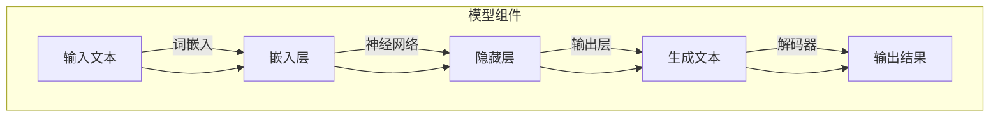
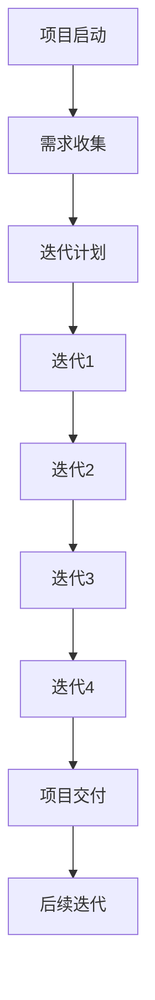
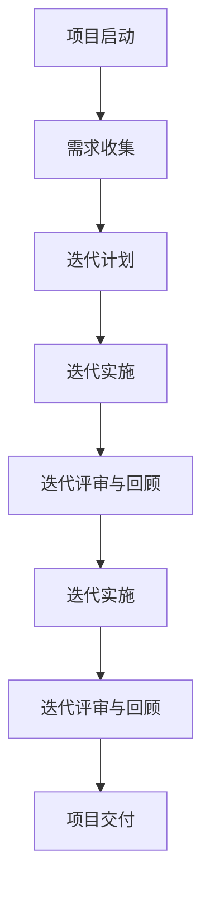
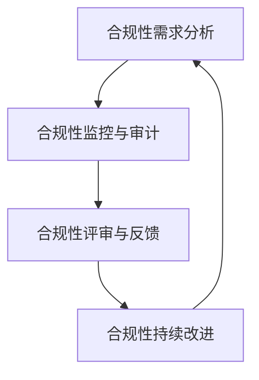

                 

### 摘要

本文旨在探讨《LLM应用开发中的敏捷合规管理》这一主题，详细解析了大型语言模型（LLM）的基础概念、敏捷开发方法、合规管理策略及其在实际应用中的相互关系。文章首先介绍了LLM的定义、历史与发展，并深入讲解了语言模型的基本原理和常用模型。接着，阐述了敏捷开发的核心理念、流程和实践方法，为后续的合规管理奠定了基础。合规管理部分则重点分析了其必要性、挑战及具体方法与工具。文章通过实践案例分析，展示了敏捷合规管理的具体应用，并以多个LLM应用案例说明了其在实际项目中的重要作用。最后，对LLM和敏捷合规管理的未来趋势进行了展望，并提出了相关最佳实践和注意事项。本文结构清晰，内容丰富，旨在为从事LLM应用开发的技术人员提供有价值的参考和指导。

### 关键词

- 大型语言模型（LLM）
- 敏捷开发
- 合规管理
- 应用案例
- 技术博客

### 背景介绍

随着人工智能（AI）技术的飞速发展，大型语言模型（LLM）成为当前研究的热点之一。LLM是一种能够理解和生成人类语言的高复杂度模型，其应用范围广泛，包括自然语言处理（NLP）、文本生成、对话系统等。在现代软件开发中，敏捷开发方法因其高效、灵活的特点，被广泛采用。然而，随着AI技术的应用日益深入，合规管理也变得越来越重要，以确保模型的应用符合法律法规和伦理标准。

本篇文章将从以下几个方面展开讨论：

1. **LLM基础**：介绍LLM的定义、历史与发展，以及其基本原理和常用模型。
2. **敏捷开发方法**：阐述敏捷开发的核心理念、流程和实践方法。
3. **合规管理策略**：分析合规管理的必要性、挑战及其方法和工具。
4. **敏捷合规管理实践**：通过案例分析展示敏捷合规管理的应用。
5. **LLM应用案例**：探讨LLM在文本分类、聊天机器人、内容生成等领域的实际应用。
6. **未来趋势与展望**：预测LLM和敏捷合规管理的未来发展方向。

本文的目标是为从事LLM应用开发的技术人员提供全面、深入的指导，帮助他们在实际项目中更好地应对合规管理挑战，实现高效、合规的开发。

#### LLMMermaid流程图

以下是一个关于LLM基本架构的Mermaid流程图：



此图展示了LLM的基本架构，从输入文本经过词嵌入层、隐藏层和输出层，最终生成输出文本。每一个组件在LLM中起着关键作用，共同协作实现高效的文本处理和生成。

#### 语言模型的基本原理

语言模型（Language Model，简称LM）是自然语言处理（Natural Language Processing，简称NLP）中的核心组件，它通过统计学方法或机器学习方法，模拟人类语言生成过程。语言模型的基本原理可以分为以下几个方面：

首先，语言模型的核心任务是预测下一个单词或字符的概率。这可以通过统计方法实现，例如N-gram模型，它根据前N个单词或字符的历史信息来预测下一个单词或字符的概率。然而，这种方法存在一定的局限性，因为它只能依赖于有限的历史数据，且无法捕捉长距离依赖关系。

为了克服这些局限性，深度学习被引入到语言模型中。基于深度学习的语言模型，如循环神经网络（Recurrent Neural Network，RNN）和其变种长短期记忆网络（Long Short-Term Memory，LSTM），可以通过学习大量文本数据，捕捉长距离依赖关系，从而提高语言生成的质量。

此外，自注意力机制（Self-Attention Mechanism）的引入，进一步提升了语言模型的性能。自注意力机制允许模型在生成过程中，根据上下文信息动态调整不同词或字符的重要性，从而更好地捕捉复杂语言特征。代表性的模型如Transformer和其变体BERT（Bidirectional Encoder Representations from Transformers），通过这种自注意力机制，实现了显著的语言生成能力。

具体来说，Transformer模型采用多头自注意力机制（Multi-Head Self-Attention）和前馈神经网络（Feedforward Neural Network），可以同时关注不同位置的信息，避免了RNN中出现的梯度消失和梯度爆炸问题。BERT模型则通过双向编码器结构，实现了对文本的左右双向编码，从而更好地捕捉文本的全局信息。

以下是一个简单的语言模型基本原理的Python代码示例：

```python
import tensorflow as tf
from tensorflow.keras.layers import Embedding, LSTM, Dense
from tensorflow.keras.models import Sequential

# 定义一个简单的RNN语言模型
model = Sequential()
model.add(Embedding(input_dim=vocab_size, output_dim=embedding_size))
model.add(LSTM(units=128, return_sequences=True))
model.add(Dense(units=vocab_size, activation='softmax'))

model.compile(optimizer='adam', loss='categorical_crossentropy', metrics=['accuracy'])
model.summary()
```

在这个示例中，我们使用TensorFlow库定义了一个简单的RNN语言模型。模型首先通过Embedding层将输入词向量转换为固定大小的嵌入向量，然后通过LSTM层处理序列数据，最后通过Dense层输出词的概率分布。这种方法虽然简单，但已经可以实现对基本语言生成任务的初步探索。

结合数学模型和公式，语言模型的训练过程可以看作是一个优化问题。具体来说，语言模型通过最小化损失函数，如交叉熵损失（Cross-Entropy Loss），来调整模型的权重，以最大化预测概率的正确性。以下是一个简化的数学公式示例：

$$
\min_{\theta} \sum_{i=1}^{N} (-y_i \log(p_i))
$$

其中，$N$是样本数量，$y_i$是真实标签，$p_i$是模型预测的概率分布。

通过这个示例，我们可以看到语言模型的基本原理是如何通过深度学习和数学优化来实现对文本的建模和生成。这种原理不仅在理论上具有重要意义，而且在实际应用中也展现了强大的效果，为自然语言处理和人工智能领域带来了深远的影响。

#### 常用LLM模型介绍

在大型语言模型（LLM）的开发和应用过程中，许多先进的模型因其独特的架构和优异的性能而备受关注。以下将介绍几种典型的LLM模型，包括GPT系列模型、BERT及其变体，以及其他知名LLM模型。

**1. GPT系列模型**

GPT（Generative Pre-trained Transformer）系列模型是OpenAI开发的基于Transformer架构的预训练语言模型。GPT-1于2018年首次发布，随后GPT-2和GPT-3相继问世，每个版本都在模型大小、参数数量和生成能力上取得了显著的提升。

- **GPT-1**：基于Transformer架构，模型参数约为1.17亿，可以生成流畅的自然语言文本。
- **GPT-2**：模型参数增加到1.5亿，引入了更深的Transformer层，生成文本的连贯性和多样性有了显著提高。
- **GPT-3**：目前最先进的版本，模型参数达到了1750亿，拥有强大的文本生成和语言理解能力。GPT-3可以执行复杂的任务，如回答问题、写文章、翻译文本等。

**2. BERT及其变体**

BERT（Bidirectional Encoder Representations from Transformers）是由Google开发的基于Transformer的双向编码器模型。BERT通过在两个方向上编码文本信息，捕捉了长距离的依赖关系，从而在多项NLP任务上取得了显著的性能提升。

- **BERT**：原始版本，采用约3.4亿参数，预训练在大量的文本数据上，可以用于各种下游任务，如文本分类、命名实体识别等。
- **BERT-LG**：大规模版本，模型参数增加到13亿，训练数据量更大，性能更优。
- **RoBERTa**：基于BERT的一个变体，通过改进训练策略和数据预处理，在多个NLP任务上超越了BERT。

**3. T5**

T5（Text-To-Text Transfer Transformer）是由Google开发的一个统一的文本处理模型，其目标是实现一个能够处理各种文本处理任务的通用模型。T5采用了一种固定的输入输出格式，使得模型可以轻松地适应不同的任务。

- **T5**：模型参数约为11亿，通过预训练实现从输入文本到输出文本的转换，可以应用于各种文本处理任务，如问答、翻译、摘要等。

**4. GPT-Neo**

GPT-Neo是一个开源的GPT系列模型，由几个研究团队共同开发。它提供了多种版本的GPT模型，并支持多种训练和数据预处理方法，使得研究人员可以方便地尝试不同的配置和训练策略。

- **GPT-Neo**：包括GPT-2、GPT-Neo、GPT-NeoX等版本，具有不同的模型大小和参数数量，适用于不同的应用场景。

**5. Opt**

Opt（Open Pre-trained Transformer）是由Meta AI开发的基于Transformer的预训练模型。Opt在预训练阶段使用了大量实时数据，并在模型大小和生成能力上取得了显著突破。

- **Opt**：模型参数超过1万亿，是目前参数规模最大的预训练模型之一，具有强大的文本生成和语言理解能力。

这些LLM模型各有特点，适用于不同的应用场景和任务需求。通过选择合适的模型并进行适当的优化和调整，开发者可以充分发挥LLM的优势，实现高质量的文本生成和语言理解任务。

#### 敏捷开发的核心理念

敏捷开发（Agile Development）是一种以人为核心、迭代、增量和灵活响应变化的软件开发方法。它的核心理念在于通过快速反馈和持续改进，确保项目能够及时交付高质量的产品。以下是敏捷开发的几个关键核心理念：

**1. 个体和互动重于过程和工具**

敏捷开发强调人作为项目成功的关键因素。团队协作和个体能力比单一的流程或工具更为重要。通过鼓励团队成员之间的沟通和合作，可以更好地应对项目中的各种挑战。

**2. 可工作的软件重于详尽的文档**

敏捷开发认为软件的功能和可用性比繁琐的文档更为重要。尽管文档在项目管理中仍然有其作用，但敏捷开发强调通过实际可工作的软件来展示项目的进展和成果。

**3. 客户合作重于合同谈判**

敏捷开发强调与客户的紧密合作，通过持续互动和反馈来调整项目方向。这种方式可以确保项目始终符合客户的期望和需求，从而提高客户满意度。

**4. 响应变化重于遵循计划**

敏捷开发强调灵活性和适应性，认为变化是不可避免的，甚至是项目成功的关键因素之一。通过迭代和增量的方法，团队可以更好地应对变化，确保项目能够持续交付价值。

**5. 持续交付和改进**

敏捷开发追求持续交付高质量的软件产品。通过定期迭代和反馈，团队可以不断地改进产品，确保其满足用户需求。同时，敏捷开发鼓励持续的学习和知识共享，以促进团队技能的提升。

敏捷开发的这些核心理念，为软件开发提供了灵活、高效的方法，使其能够更好地应对复杂性和不确定性。以下是一个简单的敏捷开发流程示例：



在这个流程中，项目从需求收集开始，通过一系列迭代逐步实现功能，并在每个迭代结束时交付可工作的软件。每个迭代都包括规划、开发、测试和评审阶段，以确保项目的质量。通过这种方式，团队可以快速响应变化，持续交付价值。

#### 敏捷开发流程

敏捷开发方法强调迭代和增量的开发模式，以快速响应变化并持续交付价值。以下是敏捷开发流程的详细步骤和关键环节：

**1. 项目启动**

项目启动是敏捷开发的第一步，也是整个开发过程的基础。在这一阶段，项目团队需要明确项目的目标、范围、资源和时间框架。通常，这包括以下任务：

- **确定项目目标和范围**：明确项目需要实现的功能和目标。
- **组建项目团队**：根据项目需求组建具备相关技能的团队。
- **评估项目资源**：确保项目有足够的资源，包括人力、技术和资金。

**2. 需求收集**

需求收集是理解客户需求、期望和问题的重要环节。在敏捷开发中，需求通常以用户故事（User Story）的形式记录。用户故事是一种简短、明确、可量化的需求描述，通常包含三个部分：**功能描述**、**验收标准**和**优先级**。以下是一个示例用户故事：

```
As a user, I want to be able to search for products by category
So that I can find items of interest easily
Priority: High
```

**3. 迭代计划**

在需求收集完成后，团队会进行迭代计划。迭代计划是敏捷开发的核心环节，它将需求分解为多个小任务，并在每个迭代周期内完成。以下是一个典型的迭代计划步骤：

- **确定迭代周期**：通常为2-4周。
- **用户故事拆分**：将用户故事分解为更小、更具体的工作任务。
- **任务分配**：根据团队成员的技能和经验，将任务分配给适当的成员。
- **迭代评审**：回顾上一个迭代的成果，讨论遇到的困难和解决方案。

**4. 迭代实施**

在迭代实施阶段，团队成员开始按照计划开发功能。这一阶段通常包括以下步骤：

- **开发代码**：根据任务需求编写代码，并进行单元测试。
- **集成测试**：将各个部分的代码集成，并进行集成测试，确保系统各部分之间的交互正常。
- **迭代评审**：在每个迭代周期结束时，团队进行评审，展示已完成的任务和进展。

**5. 迭代评审与回顾**

迭代评审是敏捷开发中至关重要的环节。在这一阶段，团队会展示已完成的功能，收集用户反馈，并根据反馈进行改进。以下是一个迭代评审的示例流程：

- **展示成果**：展示已完成的功能和进展。
- **用户反馈**：收集用户对已交付功能的反馈。
- **问题讨论**：讨论在迭代过程中遇到的问题和挑战。
- **改进计划**：根据用户反馈和问题讨论，制定下一轮迭代的改进计划。

**6. 项目交付**

在多个迭代周期后，项目团队将最终完成所有功能，并进行最终交付。以下是项目交付的步骤：

- **验收测试**：进行全面的验收测试，确保所有功能符合预期。
- **用户培训**：为用户提供必要的培训，确保他们能够有效地使用新系统。
- **项目交付**：正式将项目交付给用户或客户，并提供必要的文档和保障。

通过敏捷开发流程，团队可以灵活地应对项目中的变化，快速迭代和改进，最终交付高质量的产品。以下是一个简单的敏捷开发流程图：



#### 敏捷开发工具与实践

敏捷开发方法的成功实施依赖于一系列工具和实践。以下将介绍几种常用的敏捷开发工具和最佳实践，以帮助团队高效地管理项目。

**1. 敏捷开发工具**

- **JIRA**：JIRA是一个功能强大的项目管理工具，可用于跟踪任务、用户故事、bug和管理迭代。它支持多种视图，如看板、报表和燃尽图，有助于团队实时监控项目进展。
- **Trello**：Trello是一个简单直观的项目管理工具，通过卡片和列表来组织任务，适用于小型团队或个人项目。
- **Asana**：Asana是一个灵活的项目管理平台，支持任务分配、协作和进度跟踪。它提供了丰富的集成功能，可以与其他工具如Google Workspace、Slack等无缝协作。
- **Confluence**：Confluence是一个知识共享和协作平台，可用于编写文档、存储项目信息和管理知识库。

**2. 敏捷开发最佳实践**

- **每日站会**：每日站会是敏捷开发中的一种常见实践，团队成员每天定时进行简短的会议，讨论当天的工作进展、遇到的困难以及后续的计划。这种方式有助于保持团队的同步和透明。
- **迭代计划会议**：在迭代开始前，团队会进行迭代计划会议，明确任务、分配责任和时间框架。这有助于确保每个迭代都有明确的计划和目标。
- **迭代评审和回顾**：在迭代结束时，团队会进行迭代评审和回顾会议，展示已完成的功能、收集用户反馈和讨论改进措施。这种方式有助于不断优化项目过程和提高质量。
- **持续集成与测试**：在敏捷开发中，持续集成（Continuous Integration，CI）和持续测试（Continuous Testing，CT）是至关重要的实践。通过自动化测试和频繁的代码集成，团队可以快速发现和修复问题，确保代码质量。
- **用户故事地图**：用户故事地图是一种可视化的需求管理工具，用于记录用户故事和它们之间的关系。这种方式有助于团队更好地理解用户需求，并确保每个迭代都能交付有价值的特性。

通过使用这些敏捷开发工具和实践，团队可以更好地管理项目、提高开发效率和质量，最终实现敏捷开发的目标。

#### 合规管理的必要性

合规管理在LLM应用开发中至关重要，其主要原因包括以下几个方面：

首先，随着LLM技术的广泛应用，其潜在风险也越来越大。这些风险包括数据泄露、隐私侵犯、歧视和偏见等。例如，如果LLM模型在训练过程中使用了不当的数据集，可能会导致模型产生偏见，从而影响其决策的公正性和准确性。因此，确保模型的合规性，可以降低这些风险，保护用户和数据的安全。

其次，合规管理有助于增强企业的社会责任感。在当今社会，企业不仅要追求经济效益，还需承担社会责任。通过合规管理，企业可以确保其技术应用符合法律法规和伦理标准，从而树立良好的企业形象，赢得用户的信任。

此外，合规管理也有助于避免法律诉讼和经济损失。如果不遵守相关法律法规，企业可能会面临高额的罚款和诉讼风险。例如，欧盟的《通用数据保护条例》（GDPR）就对数据处理和隐私保护提出了严格的要求，如果企业未能满足这些要求，可能会遭受严重的经济损失。

最后，合规管理有助于提高模型的质量和可靠性。通过建立完善的合规管理机制，企业可以确保模型开发过程的透明度和规范性，从而提高模型的可靠性和可信度，进而提高用户满意度。

总之，合规管理在LLM应用开发中具有不可忽视的重要性，它不仅是保护用户和数据安全的重要手段，也是企业承担社会责任、避免法律风险和提升产品质量的重要保障。

#### 合规管理的挑战

在LLM应用开发过程中，合规管理面临诸多挑战，主要包括以下几个方面：

**1. 数据隐私与保护**

数据隐私和保护的挑战是合规管理中最突出的问题之一。LLM模型通常需要处理大量的用户数据，这些数据可能包括个人信息、行为记录等敏感信息。如何确保这些数据在收集、存储、处理和传输过程中不被泄露或滥用，是合规管理面临的重要挑战。例如，欧盟的《通用数据保护条例》（GDPR）对个人数据的处理和存储提出了严格的要求，任何违反规定的行为都可能引发严重的法律后果。

**2. 法律法规遵循**

不同国家和地区对数据保护和隐私保护的法律要求有所不同，这使得合规管理变得更加复杂。例如，美国的《加州消费者隐私法案》（CCPA）和欧盟的GDPR都在数据保护和用户隐私方面制定了严格的规定。对于跨国运营的企业来说，如何在不同国家和地区遵守不同的法律法规，确保全球范围内的合规性，是一个巨大的挑战。

**3. 技术伦理与偏见**

LLM模型的训练过程和数据集的选择可能引入偏见，导致模型在应用过程中产生不公平或歧视性的结果。例如，如果训练数据集中存在性别、种族或年龄等偏见，模型在生成文本或做出决策时可能会放大这些偏见，从而影响其公正性和准确性。如何确保模型在开发和部署过程中遵循伦理标准，避免偏见和歧视，是合规管理面临的另一大挑战。

**4. 道德责任与问责**

在LLM应用开发过程中，企业需要对模型的应用结果承担道德责任。例如，如果模型在医疗诊断中产生错误的结果，可能导致严重的后果。如何确保企业在开发和部署模型时承担足够的道德责任，并建立有效的问责机制，是一个重要的合规管理问题。

**5. 持续监控与更新**

合规管理是一个持续的过程，需要定期监控和更新。随着技术的不断进步和法律法规的变化，企业需要及时调整合规策略和措施，以确保其始终符合最新的要求。例如，新的数据保护法规或技术标准可能会对现有的合规管理带来新的挑战，要求企业进行相应的调整和更新。

综上所述，LLM应用开发中的合规管理面临数据隐私保护、法律法规遵循、技术伦理、道德责任和持续监控等多方面的挑战。企业需要采取有效的策略和措施，应对这些挑战，确保模型的应用符合法律法规和伦理标准。

#### 合规管理的方法与工具

在LLM应用开发过程中，实现合规管理需要一系列方法和工具，以确保数据处理、模型训练和应用过程符合相关法律法规和伦理标准。以下是几种常用的合规管理方法和工具：

**1. 数据隐私保护策略**

- **数据最小化原则**：只收集和处理必要的数据，避免过度收集。
- **数据匿名化与去标识化**：对敏感数据进行匿名化处理，避免直接关联到特定个人。
- **访问控制**：实施严格的访问控制策略，确保只有授权人员才能访问和处理敏感数据。
- **加密技术**：采用加密技术对数据进行加密存储和传输，确保数据在传输过程中不被窃取或篡改。

**2. 法律法规遵循工具**

- **合规性审计工具**：使用合规性审计工具对数据处理和模型应用过程进行全面审查，确保符合相关法律法规要求。
- **合规性监控工具**：实时监控数据处理和模型应用过程中的合规性，及时发现和纠正潜在问题。
- **合规性培训与教育**：定期对员工进行法律法规和合规性培训，提高他们的合规意识。

**3. 技术伦理评估方法**

- **偏见检测工具**：使用偏见检测工具对训练数据和模型输出进行评估，识别和纠正潜在的偏见。
- **伦理审核委员会**：建立伦理审核委员会，对模型应用过程中的伦理问题进行评估和决策。
- **伦理准则与指南**：制定明确的伦理准则和指南，指导模型开发和应用的伦理决策。

**4. 道德责任与问责机制**

- **责任分配机制**：明确模型开发和应用的各个阶段的责任分配，确保相关人员对其行为负责。
- **审计与问责工具**：使用审计和问责工具对模型应用过程中的责任履行情况进行监控和评估。
- **隐私影响评估（PIA）**：在项目启动阶段进行隐私影响评估，识别潜在的风险和影响，并制定相应的风险管理策略。

**5. 持续监控与更新**

- **合规性监控系统**：建立合规性监控系统，对模型应用过程进行持续监控，及时发现和纠正合规性问题。
- **法律法规更新跟踪**：定期跟踪和更新相关法律法规，确保合规管理策略和工具与最新要求保持一致。
- **持续培训与改进**：定期对员工进行法律法规和合规性培训，提高他们的合规技能和意识，不断优化合规管理策略和工具。

通过这些方法和工具，企业可以有效地实现LLM应用开发中的合规管理，确保数据处理、模型训练和应用过程符合法律法规和伦理标准，降低合规风险，提升企业的社会责任感。

#### 敏捷合规管理流程

敏捷合规管理是在敏捷开发过程中，对合规性进行持续监控、评估和改进的一套流程。其核心目标是通过灵活和迭代的方法，确保软件开发过程和产品符合法律法规和伦理标准。以下是敏捷合规管理流程的详细步骤：

**1. 合规性需求分析**

在项目启动阶段，首先进行合规性需求分析。这一步骤包括识别项目涉及的所有法律法规和伦理要求，并分析这些要求对项目的影响。具体任务如下：

- **识别法律法规**：列出项目需要遵守的法律法规，如GDPR、CCPA等。
- **评估合规性风险**：评估项目各阶段可能出现的合规性风险，如数据泄露、隐私侵犯等。
- **制定合规性计划**：根据识别的法律法规和合规性风险，制定详细的合规性计划，包括合规性目标、责任分配和资源需求。

**2. 合规性监控与审计**

在项目开发过程中，合规性监控与审计是确保合规性要求得到满足的重要环节。具体任务如下：

- **合规性审计工具**：使用合规性审计工具，如JIRA、Confluence等，记录和跟踪合规性任务和进度。
- **实时监控**：通过实时监控系统，监控数据处理、模型训练和应用过程中的合规性，及时发现和纠正问题。
- **定期审计**：定期进行合规性审计，评估项目各阶段的合规性情况，确保项目按照计划进行。

**3. 合规性评审与反馈**

在每次迭代结束时，进行合规性评审与反馈。这一步骤旨在总结本次迭代的合规性表现，收集用户和团队的反馈，并制定下一轮迭代的改进计划。具体任务如下：

- **合规性评审会议**：组织合规性评审会议，展示本次迭代的合规性成果，收集用户和团队的反馈。
- **合规性报告**：编写合规性报告，详细记录本次迭代的合规性表现和存在的问题。
- **改进计划**：根据评审结果和反馈，制定下一轮迭代的改进计划，包括合规性任务和资源分配。

**4. 合规性持续改进**

合规性持续改进是敏捷合规管理的核心。通过不断优化合规性管理流程和工具，确保项目始终符合法律法规和伦理标准。具体任务如下：

- **合规性培训与教育**：定期对团队成员进行合规性培训，提高其合规意识和技能。
- **合规性工具更新**：根据法律法规和合规性需求的变化，更新和改进合规性管理工具。
- **合规性指标跟踪**：建立合规性指标跟踪系统，监控合规性改进的效果，并持续优化合规性管理流程。

以下是一个简单的敏捷合规管理流程图：



通过这个流程，敏捷合规管理可以在整个软件开发过程中确保合规性，降低合规风险，提高项目的成功率和用户的满意度。

#### 敏捷合规管理案例分析

为了更好地理解敏捷合规管理在实际项目中的应用，以下将分析两个具体案例，展示其在LLM应用开发中的实际操作和效果。

**案例1：某金融公司信用卡欺诈检测系统**

某金融公司在开发信用卡欺诈检测系统时，遇到了多个合规管理的挑战。首先，该项目需要处理大量的用户交易数据，涉及到隐私保护和数据安全。其次，金融行业有严格的法律法规，如《信用卡业消费者保护法》（CARD Act）和《反洗钱法》（AML），需要确保系统的合规性。

为了解决这些问题，该公司采用了敏捷合规管理方法。具体步骤如下：

1. **合规性需求分析**：在项目启动阶段，团队对项目涉及的法律法规和合规性要求进行了详细分析，制定了合规性计划，明确了各阶段的合规性目标和责任分配。

2. **实时监控与审计**：在开发过程中，团队使用了JIRA等合规性审计工具，实时监控数据处理和模型训练过程中的合规性。通过定期审计，确保项目按照计划进行。

3. **合规性评审与反馈**：在每次迭代结束时，团队进行合规性评审会议，展示合规性成果，收集用户和团队的反馈。根据评审结果，制定下一轮迭代的改进计划。

4. **持续改进**：团队定期进行合规性培训，提高团队成员的合规意识。同时，根据法律法规的变化，及时更新合规性管理工具和策略。

通过敏捷合规管理，该项目在确保合规性的同时，提高了开发效率和产品质量。最终，系统成功上线，并有效降低了信用卡欺诈率，提升了用户体验和公司形象。

**案例2：某电商平台个性化推荐系统**

某电商平台在开发个性化推荐系统时，面临着数据隐私保护和技术伦理的双重挑战。首先，该系统需要处理大量的用户行为数据，涉及到隐私保护问题。其次，系统需要保证推荐结果的公平性和准确性，避免偏见和歧视。

为了应对这些挑战，该公司采用了敏捷合规管理方法。具体步骤如下：

1. **合规性需求分析**：在项目启动阶段，团队对项目涉及的法律法规和合规性要求进行了详细分析，制定了合规性计划，明确了各阶段的合规性目标和责任分配。

2. **数据匿名化和加密**：团队采用数据匿名化和加密技术，确保用户行为数据在传输和存储过程中的安全。同时，通过实时监控工具，确保数据保护措施得到有效实施。

3. **技术伦理评估**：团队建立了伦理审核委员会，对模型训练和推荐算法进行伦理评估，确保系统在技术层面避免偏见和歧视。

4. **用户反馈与迭代改进**：在每次迭代结束时，团队收集用户对推荐结果的反馈，并根据反馈调整推荐算法和系统功能。通过持续的迭代和改进，提高了系统的公正性和用户满意度。

通过敏捷合规管理，该项目在确保合规性的同时，提升了用户满意度和系统性能。最终，个性化推荐系统成功上线，有效提升了电商平台的市场竞争力和用户体验。

这两个案例展示了敏捷合规管理在LLM应用开发中的实际操作和效果。通过灵活和迭代的方法，企业可以有效地应对合规管理的挑战，确保模型的应用符合法律法规和伦理标准，提高项目的成功率和用户满意度。

#### LLM应用案例

大型语言模型（LLM）在多个领域中展现了其强大的应用潜力，以下将介绍三个典型的LLM应用案例：文本分类与情感分析、聊天机器人与问答系统、以及内容生成与摘要。

**1. 文本分类与情感分析**

文本分类与情感分析是LLM的重要应用领域之一。通过LLM，可以自动对大规模文本数据进行分类，识别其主题和情感倾向。以下是一个具体案例：

**案例：社交媒体情感分析**

某社交媒体平台希望了解用户对其平台内容的情感倾向，以便更好地优化用户体验。为此，他们使用了一个基于BERT的LLM模型，对用户评论进行情感分类。

**实现步骤：**
- **数据收集**：收集平台上的大量用户评论数据，包括正面、负面和中性的评论。
- **数据预处理**：对评论进行清洗和标注，确保数据质量。
- **模型训练**：使用BERT模型对预处理后的评论进行训练，使其能够识别情感标签。
- **模型评估**：通过交叉验证和测试集评估模型性能，调整模型参数以优化分类效果。
- **应用部署**：将训练好的模型部署到生产环境，对实时评论进行情感分类，并根据结果提供个性化推荐。

**2. 聊天机器人与问答系统**

聊天机器人与问答系统是LLM在客服和用户服务领域的典型应用。通过LLM，可以构建具备自然语言理解和生成能力的聊天机器人，提供高效、智能的客服服务。以下是一个具体案例：

**案例：银行客服聊天机器人**

某银行开发了一个基于GPT-3的聊天机器人，用于回答客户的常见问题和提供帮助。

**实现步骤：**
- **数据收集**：收集银行客户常见问题和回答的数据集，包括文本和对话记录。
- **数据预处理**：对数据集进行清洗和标注，确保数据质量。
- **模型训练**：使用GPT-3模型对预处理后的数据集进行训练，使其能够生成符合预期的回答。
- **模型评估**：通过模拟对话和用户测试，评估聊天机器人的性能，调整模型参数以优化回答质量。
- **应用部署**：将训练好的模型部署到银行官网和移动应用中，提供实时客服服务。

**3. 内容生成与摘要**

内容生成与摘要也是LLM的重要应用领域。通过LLM，可以自动生成文章、报告、摘要等文本内容，节省人力成本，提高内容生产效率。以下是一个具体案例：

**案例：新闻摘要生成**

某新闻网站希望自动生成新闻摘要，以节省编辑人员的时间和精力。他们使用了一个基于GPT-2的LLM模型，对长篇文章进行自动摘要。

**实现步骤：**
- **数据收集**：收集网站上的大量新闻文章数据，作为训练数据。
- **数据预处理**：对新闻文章进行清洗和分割，确保数据质量。
- **模型训练**：使用GPT-2模型对预处理后的数据集进行训练，使其能够生成摘要。
- **模型评估**：通过人工评估和自动评估方法，评估模型生成的摘要质量和可读性。
- **应用部署**：将训练好的模型部署到网站后台，对实时更新的新闻文章进行摘要生成。

通过这些应用案例，我们可以看到LLM在文本处理和生成方面的强大能力。在实际项目中，开发者可以根据需求选择合适的LLM模型，结合具体应用场景，实现高效、智能的内容分类、聊天机器人、摘要生成等功能。

#### LLM发展的未来方向

随着人工智能技术的不断进步，LLM的发展也面临着新的机遇和挑战。以下将探讨LLM在未来的几个关键方向：

**1. 模型大小与计算资源**

目前，LLM模型的规模越来越大，如GPT-3拥有1750亿参数，这使得训练和部署这些模型所需的计算资源也急剧增加。未来，随着硬件技术的提升和分布式计算的发展，更大规模、更复杂的LLM模型有望被开发出来。例如，量子计算和光子计算等新兴技术可能会为LLM的研究和应用带来突破性的进展。

**2. 多模态语言处理**

传统LLM主要处理文本数据，但在现实世界中，信息的形式多种多样，包括文本、图像、音频和视频等。未来，多模态语言处理将成为LLM发展的一个重要方向。通过融合不同类型的数据，LLM将能够更好地理解和生成复杂的信息，为各类应用提供更强大的支持。

**3. 自适应与个性化**

未来，LLM将更加注重自适应性和个性化。通过不断学习和优化，LLM可以更好地适应特定领域的需求，提供更精准的服务。例如，医疗领域的LLM可以根据患者的病史和症状，提供个性化的诊断和建议；教育领域的LLM可以为学生提供定制化的学习资源和指导。

**4. 遵循伦理与法规**

随着LLM的应用日益广泛，伦理和法规问题也日益突出。未来，LLM的发展将更加注重伦理和法规的遵循。通过建立严格的伦理准则和合规机制，LLM将确保其在应用过程中的公平性、透明性和安全性，避免潜在的偏见和歧视。

**5. 开放协作与社区发展**

LLM的研究和应用需要广泛的合作和共享。未来，LLM的发展将更加注重开放协作和社区发展。通过建立开放的模型库和工具集，研究人员和开发者可以方便地共享知识和资源，共同推动LLM技术的进步。

总之，LLM在未来的发展将充满机遇和挑战。通过不断探索和创新，LLM有望在多个领域实现突破性的应用，为人类带来更多便利和智慧。

#### 敏捷合规管理的发展

随着人工智能技术的不断进步和LLM应用的日益普及，敏捷合规管理（Agile Compliance Management）也面临着新的发展机遇和挑战。以下是敏捷合规管理在未来可能的发展趋势：

**1. 数字合规工具的普及**

未来，随着技术的发展，数字合规工具将在敏捷合规管理中扮演更加重要的角色。这些工具将能够自动化合规检查、监控和报告过程，提高合规管理的效率和准确性。例如，基于机器学习和自然语言处理技术的合规审查工具可以自动识别和分类潜在的合规风险，提供实时监控和预警。

**2. 个性化合规方案**

随着企业业务的多样化和复杂性增加，合规管理也需要更加个性化。未来的敏捷合规管理将更加注重根据不同行业、不同业务特点和企业规模，定制个性化的合规方案。这种方案将更好地满足企业的特定需求，提高合规管理的针对性和有效性。

**3. 跨部门协作与透明度**

敏捷合规管理的一个重要目标是实现跨部门的协作与透明度。未来，随着区块链和智能合约等技术的发展，合规管理将能够实现更高效的跨部门协作。例如，通过区块链技术，企业可以确保合规数据的真实性和不可篡改性，提高合规过程的透明度。

**4. 持续学习和自适应能力**

随着法规和伦理标准的不断变化，敏捷合规管理需要具备持续学习和自适应能力。未来的合规管理将更加注重利用人工智能和大数据分析技术，实时跟踪法规和伦理标准的变化，并快速调整合规策略和流程，确保企业始终符合最新的要求。

**5. 混合方法的应用**

未来，敏捷合规管理将更加注重混合方法的应用。结合传统合规管理的方法和现代技术手段，如人工智能、大数据和区块链等，企业可以实现更加全面、精准和高效的合规管理。例如，通过结合数据分析和机器学习技术，企业可以更好地识别和应对潜在的合规风险。

**6. 国际合规标准的统一**

随着全球化的推进，国际合规标准将变得更加统一和规范。未来的敏捷合规管理将更加注重遵循国际合规标准，如《通用数据保护条例》（GDPR）、《加州消费者隐私法案》（CCPA）等。通过遵循国际合规标准，企业可以降低合规风险，提高在国际市场的竞争力。

总之，敏捷合规管理的发展将受到技术进步、法规变化和国际合作等多重因素的影响。通过不断创新和改进，敏捷合规管理将在未来为企业和行业带来更多的价值。

#### LLM应用的新场景

随着LLM技术的不断发展和完善，其应用场景也在不断扩展，涵盖了许多新兴领域。以下将探讨LLM在医学、教育、智能城市等领域的潜在应用，以及这些应用带来的变革和挑战。

**1. 医学**

在医学领域，LLM技术展示了巨大的应用潜力。通过自然语言处理，LLM可以帮助医生从大量医疗文献中快速提取有用信息，提高诊断和治疗的效率。例如，LLM可以用于：

- **医学文本挖掘**：从医学文献、病历和病例报告中提取关键信息，辅助医生进行诊断和决策。
- **药物研发**：分析大量的临床试验数据，预测药物的有效性和安全性，加速新药的研发进程。
- **医疗问答系统**：为患者提供个性化的医疗咨询，解答患者关于疾病、治疗和药物使用等方面的问题。

然而，LLM在医学领域的应用也面临诸多挑战，如数据隐私保护、伦理问题以及模型准确性和可靠性等。确保模型的应用符合医疗伦理和法律法规，同时保障患者隐私和数据安全，是未来发展的关键。

**2. 教育**

在教育领域，LLM技术可以改变传统教学模式，提供个性化、智能化的教育体验。例如：

- **智能辅导系统**：根据学生的学习进度和能力，提供个性化的学习资源和辅导，帮助学生更好地掌握知识。
- **自动评分系统**：通过自然语言处理技术，自动评分学生的作业和考试，提高教师的工作效率。
- **教育内容生成**：自动生成教学材料、教材和课程大纲，为教师提供便捷的资源。

尽管LLM在教育领域的应用带来了许多便利，但也存在一些挑战，如模型在评估学生成绩时的公平性和准确性，以及如何平衡人工智能与教师的角色等。

**3. 智能城市**

在智能城市领域，LLM技术可以帮助提升城市管理和服务的智能化水平。例如：

- **智能交通管理**：通过分析交通数据，预测交通流量，优化交通信号控制，减少交通拥堵。
- **公共安全监测**：通过分析视频监控数据，实时识别异常行为和潜在威胁，提高公共安全。
- **智能垃圾分类**：通过自然语言处理技术，识别和处理垃圾分类信息，提高垃圾分类效率。

然而，智能城市中LLM的应用也面临数据隐私保护、算法透明性和责任归属等问题。确保模型的应用符合法律法规和伦理标准，保障市民的隐私和数据安全，是智能城市建设中的重要课题。

总之，LLM在医学、教育、智能城市等领域的应用带来了许多新的机遇和变革，但同时也带来了新的挑战。通过不断探索和创新，我们可以更好地利用LLM技术，推动各个领域的发展，同时确保其应用符合法律法规和伦理标准。

### 最佳实践 Tips

在实际进行LLM应用开发时，遵循以下最佳实践可以大大提高项目的成功率和开发效率：

1. **需求分析要彻底**：在项目启动前，务必进行详尽的需求分析，确保理解客户的实际需求。这包括业务逻辑、用户期望和潜在风险等方面。

2. **选择合适的LLM模型**：根据具体应用场景选择合适的LLM模型。不同模型在性能、效率和资源占用方面各有优劣，合理选择模型可以提高项目效果。

3. **数据预处理要精细**：确保训练数据的质量和多样性，通过数据清洗、去重和标注等步骤，提高模型的训练效果和泛化能力。

4. **持续监控与迭代**：在整个开发过程中，持续监控模型的性能和合规性，定期进行迭代和优化，确保模型始终保持最佳状态。

5. **遵循法律法规和伦理标准**：严格遵守相关法律法规和伦理标准，确保模型的应用符合合规要求，避免潜在的法律风险和道德争议。

6. **团队合作与沟通**：加强团队内部沟通与合作，确保各方理解项目的目标和进度，提高开发效率。

7. **资源管理要合理**：合理分配项目资源，确保人力资源、技术和资金的有效利用，避免资源浪费。

8. **安全与隐私保护**：在数据处理和模型训练过程中，注重数据安全和隐私保护，采用加密、匿名化等技术措施，保障用户数据安全。

通过遵循这些最佳实践，开发者可以更好地应对LLM应用开发中的各种挑战，提高项目的成功率。

### 小结

本文详细探讨了《LLM应用开发中的敏捷合规管理》这一主题，从LLM的基础概念、敏捷开发方法、合规管理策略、应用案例以及未来趋势等方面进行了全面的分析。我们首先介绍了LLM的基本原理和常用模型，接着阐述了敏捷开发的核心理念和流程，并讨论了合规管理的必要性、挑战及其方法与工具。通过实际案例，我们展示了敏捷合规管理在LLM应用开发中的具体应用，并探讨了LLM在新兴领域的潜在应用。最后，我们提出了最佳实践和注意事项，为LLM应用开发提供了有价值的指导。希望通过本文，读者能够更好地理解LLM和敏捷合规管理的相关概念，并在实际项目中运用这些知识，实现高效、合规的开发。

### 注意事项

在LLM应用开发过程中，为确保项目的成功和合规性，需要特别注意以下几点：

1. **数据安全与隐私保护**：在处理用户数据时，务必遵循数据安全和隐私保护的最佳实践，采用加密、匿名化等技术措施，确保用户数据的安全。

2. **法律法规遵循**：确保项目开发和运营过程中符合相关法律法规，如《通用数据保护条例》（GDPR）、《加州消费者隐私法案》（CCPA）等，避免法律风险。

3. **伦理审查**：在模型开发和应用过程中，进行严格的伦理审查，避免引入偏见和歧视，确保模型的公正性和可靠性。

4. **持续监控与更新**：定期对项目进行合规性和性能监控，及时发现并解决问题，确保模型和应用始终保持最佳状态。

5. **团队合作与沟通**：加强团队内部沟通与合作，确保各方理解项目的目标和进度，提高开发效率。

6. **技术选型与优化**：根据项目需求和资源情况，选择合适的技术方案，并进行持续优化，以提高项目效果。

通过遵守这些注意事项，可以有效降低合规风险，确保LLM应用开发项目的顺利进行。

### 拓展阅读

对于希望深入了解LLM应用开发和敏捷合规管理的读者，以下推荐几本经典书籍、论文和在线资源：

**书籍：**

1. **《深度学习》（Deep Learning）**，Ian Goodfellow、Yoshua Bengio和Aaron Courville 著。本书详细介绍了深度学习的理论基础和实践方法，包括语言模型的实现。
2. **《敏捷开发：实践指南》（Agile Project Management: Creating Innovative Products）**，作者Ken Schwaber和Jeff Sutherland。本书深入探讨了敏捷开发的核心理念和实践方法。
3. **《合规管理》（Compliance Management）**，作者Suzanne Kramer。本书详细介绍了合规管理的理论、方法与实践。

**论文：**

1. **“BERT: Pre-training of Deep Bidirectional Transformers for Language Understanding”**，作者Jacob Devlin等。这篇论文详细介绍了BERT模型的架构和预训练方法。
2. **“Generative Pre-trained Transformers”**，作者Kaiming He等。这篇论文介绍了GPT系列模型的架构和训练方法。
3. **“Language Models are Few-Shot Learners”**，作者Tom B. Brown等。这篇论文探讨了LLM在少量样本下的泛化能力。

**在线资源：**

1. **TensorFlow官方文档**：[https://www.tensorflow.org/](https://www.tensorflow.org/)。TensorFlow是深度学习领域广泛使用的框架，其官方文档提供了丰富的教程和示例代码。
2. **GitHub**：[https://github.com/](https://github.com/)。GitHub上有大量的开源项目和代码示例，可以帮助开发者了解LLM的实际应用。
3. **arXiv**：[https://arxiv.org/](https://arxiv.org/)。arXiv是计算机科学和人工智能领域的重要预印本库，提供了大量关于LLM的研究论文。

通过阅读这些书籍、论文和在线资源，读者可以进一步深入了解LLM应用开发和敏捷合规管理的相关技术和实践。

