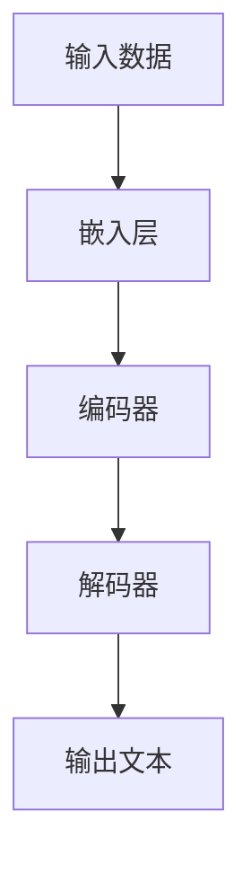

                 

### 引言

随着人工智能技术的飞速发展，大型语言模型（LLM，Large Language Model）如BERT、GPT等逐渐成为学术界和工业界的研究热点。LLM在自然语言处理（NLP）领域展现出强大的能力，被广泛应用于文本生成、机器翻译、问答系统等多个场景。然而，LLM的应用开发不仅依赖于先进的技术，还需要敏捷的开发方法和高效的技能提升策略。本文将探讨LLM应用开发中的敏捷培训与技能提升，帮助开发者更好地理解和应用LLM技术，实现高效开发。

本文将从以下几个部分展开：

1. **大模型基础**：介绍大模型的核心概念、原理和技术架构。
2. **敏捷培训**：探讨如何通过敏捷方法进行大模型开发培训。
3. **技能提升**：分析提升大模型应用开发技能的方法。
4. **实战案例**：通过实际案例展示大模型应用开发的全过程。

本文的目标是帮助读者深入理解LLM的应用开发过程，掌握敏捷培训与技能提升的技巧，从而在LLM开发领域取得更好的成果。以下是本文的关键词和摘要：

### 关键词

- 大模型
- 语言模型
- 敏捷开发
- 技能提升
- 实战案例

### 摘要

本文首先介绍了大模型的基本概念和核心技术，然后探讨了敏捷开发在大模型应用开发中的重要性，并提出了提升技能的具体方法。最后，通过实际案例展示了大模型应用开发的完整流程，为读者提供了实用的指导和借鉴。通过阅读本文，读者可以更好地理解大模型应用开发的本质，掌握敏捷培训和技能提升的方法，为实际项目提供有力支持。

接下来，我们将详细探讨大模型的基础知识，为后续内容奠定基础。

### 大模型基础

#### 1.1 大模型的核心概念

大模型（Large Language Model，简称LLM）是指具有大量参数、能够理解和生成自然语言的人工智能模型。LLM通过学习海量的文本数据，对语言的结构、语义和上下文关系进行深入理解，从而实现高质量的语言生成和翻译。LLM的核心思想是利用深度学习技术，尤其是神经网络，对语言数据进行分析和处理。

LLM的主要组成部分包括：

- **嵌入层**：将单词、句子等文本数据转化为向量表示，为后续的神经网络处理提供输入。
- **编码器**：对输入的向量进行编码，提取文本的语义信息。
- **解码器**：将编码后的信息解码为输出，生成自然语言文本。

#### 1.2 大模型的发展历程

大模型的发展可以追溯到20世纪80年代，当时研究人员开始探索如何使用神经网络进行语言建模。早期的研究主要集中于简单的统计模型，如n-gram模型和决策树模型。然而，这些模型在处理长文本和复杂语义关系时存在明显的局限。

随着深度学习技术的发展，2013年，研究人员提出了卷积神经网络（CNN）在自然语言处理中的应用，进一步提升了模型的性能。随后，循环神经网络（RNN）和长短期记忆网络（LSTM）的出现，使得模型能够更好地处理序列数据，从而在语言建模任务中取得突破性进展。

2018年，Google发布了BERT（Bidirectional Encoder Representations from Transformers），标志着大模型进入了一个新的时代。BERT通过双向Transformer架构，对输入文本进行全局编码，显著提升了自然语言理解的能力。随后，GPT-3（Generative Pre-trained Transformer 3）等更大规模、更先进的模型不断涌现，进一步推动了LLM的发展。

#### 1.3 大模型的技术架构

大模型的技术架构通常包括以下几个关键组成部分：

- **预训练**：通过对大量文本数据进行预训练，模型能够自动学习语言的基本结构和语义信息。预训练过程通常使用无监督学习，使得模型在无标签数据上取得很好的性能。
- **微调**：在预训练的基础上，对模型进行微调，使其适应特定任务的需求。微调过程通常使用有监督学习，通过对标注数据进行训练，进一步优化模型的性能。
- **解码**：解码器负责将编码后的信息解码为自然语言文本。解码过程通常采用贪心策略或采样策略，生成高质量的语言输出。

以下是LLM技术架构的Mermaid流程图：



在嵌入层，文本数据被转换为向量表示；编码器对输入向量进行编码，提取语义信息；解码器将编码后的信息解码为自然语言文本输出。

#### 1.4 大模型的核心算法原理

大模型的核心算法原理主要涉及神经网络和深度学习技术。以下将简要介绍神经网络和深度学习的基本概念，并探讨LLM中的关键算法。

##### 1.4.1 神经网络基础

神经网络（Neural Network，NN）是一种模拟生物神经元连接的计算机模型，通过多层节点（神经元）进行信息的传递和处理。神经网络的基本组成部分包括：

- **输入层**：接收外部输入数据。
- **隐藏层**：对输入数据进行处理和提取特征。
- **输出层**：生成最终输出结果。

神经网络通过调整连接权重和偏置，实现对输入数据的非线性变换和分类。

##### 1.4.2 循环神经网络（RNN）

循环神经网络（Recurrent Neural Network，RNN）是一种能够处理序列数据的神经网络。RNN的核心特点是具有循环结构，能够记忆和利用之前的信息。RNN的主要组成部分包括：

- **输入门**：用于控制当前输入对隐藏状态的影响。
- **遗忘门**：用于控制之前的信息对当前隐藏状态的影响。
- **输出门**：用于控制当前隐藏状态对输出结果的影响。

RNN通过递归结构，能够处理变长序列数据，但存在梯度消失和梯度爆炸等问题。

##### 1.4.3 长短期记忆网络（LSTM）

长短期记忆网络（Long Short-Term Memory，LSTM）是一种改进的RNN结构，能够更好地解决长序列依赖问题。LSTM的核心组成部分包括：

- **输入门**：控制当前输入对细胞状态的影响。
- **遗忘门**：控制之前的信息对细胞状态的影响。
- **输出门**：控制细胞状态对输出结果的影响。
- **细胞状态**：存储和传递序列信息。

LSTM通过门控机制，能够有效地记忆和利用长序列信息，缓解了RNN的梯度消失问题。

##### 1.4.4 变换器（Transformer）

变换器（Transformer）是一种基于自注意力机制的深度学习模型，被广泛应用于自然语言处理任务。变换器的主要组成部分包括：

- **编码器**：通过多头自注意力机制，提取输入文本的语义信息。
- **解码器**：通过多头自注意力机制和交叉注意力机制，生成输出文本。

变换器通过并行计算和多头注意力机制，显著提升了模型的计算效率和性能。

#### 1.5 大模型的应用场景

大模型在自然语言处理领域展现出广泛的应用潜力，以下介绍几种常见的大模型应用场景：

##### 1.5.1 文本生成

文本生成是指利用大模型生成自然语言文本。大模型通过对海量文本数据进行学习，能够生成具有良好连贯性和语法结构的文本。文本生成广泛应用于自动写作、聊天机器人、语音合成等场景。

##### 1.5.2 机器翻译

机器翻译是指利用大模型将一种语言的文本翻译成另一种语言的文本。大模型通过学习双语语料库，能够实现高质量、低误差的机器翻译。机器翻译在跨语言交流、国际业务、全球协作等领域具有重要应用价值。

##### 1.5.3 问答系统

问答系统是指利用大模型回答用户的问题。大模型通过对海量文本数据进行学习，能够理解用户的提问意图，并生成准确的回答。问答系统广泛应用于客服、智能助手、在线教育等场景。

通过以上对大模型基础知识的介绍，我们可以更好地理解大模型的核心概念、原理和应用场景。在接下来的部分，我们将探讨敏捷开发在大模型应用开发中的重要性。

### 敏捷开发

#### 2.1 敏捷开发概述

敏捷开发（Agile Development）是一种软件开发方法论，强调迭代、增量、协作和响应变化。与传统瀑布式开发方法不同，敏捷开发注重快速交付、持续改进和客户反馈。敏捷开发的核心原则包括：

1. **个体和互动重于过程和工具**：敏捷开发强调团队成员之间的互动和沟通，认为人的因素比技术和工具更为重要。
2. **可工作的软件重于详尽的文档**：敏捷开发认为软件是最终交付的产品，注重实现可工作的功能，而非冗长的文档。
3. **客户协作重于合同谈判**：敏捷开发强调与客户的紧密合作，通过持续沟通和反馈，确保开发过程和最终产品符合客户需求。
4. **响应变化重于遵循计划**：敏捷开发认为需求会不断变化，因此更注重灵活应对变化，而非严格遵循计划。

#### 2.2 敏捷开发流程

敏捷开发通常采用迭代和增量的方式，分为以下几个关键阶段：

##### 2.2.1 产品待办列表（Product Backlog）

产品待办列表是敏捷开发的核心文档，列出了所有待开发的功能和任务。团队成员通过不断更新和排序产品待办列表，确定下一个迭代周期的开发任务。

##### 2.2.2 迭代计划（Sprint Planning）

迭代计划是敏捷开发的重要活动，团队成员在迭代计划会议中讨论并确定下一个迭代周期的开发目标、任务和优先级。迭代周期通常为2-4周。

##### 2.2.3 迭代执行（Sprint）

在迭代执行阶段，团队成员按照计划开展开发工作，每天进行站立会议（Daily Stand-up），同步进度和解决问题。

##### 2.2.4 迭代评审（Sprint Review）

迭代评审是敏捷开发的重要环节，团队成员展示已完成的功能，收集用户反馈，并根据反馈进行改进。

##### 2.2.5 迭代回顾（Sprint Retrospective）

迭代回顾是敏捷开发中的反思和总结过程，团队成员讨论迭代过程中的问题、经验和改进点，为下一个迭代做好准备。

#### 2.3 敏捷开发方法在大模型开发中的应用

敏捷开发方法在大模型开发中具有重要应用价值，主要体现在以下几个方面：

##### 2.3.1 快速迭代和反馈

大模型开发通常涉及大量的实验和调整，敏捷开发通过快速迭代和持续反馈，使开发团队能够及时调整模型和算法，提高开发效率。

##### 2.3.2 灵活应对变化

大模型开发过程中，需求和技术环境可能发生较大变化，敏捷开发通过灵活应对变化，确保项目能够及时适应新的需求和挑战。

##### 2.3.3 协作和沟通

大模型开发通常涉及多个团队成员的协作，敏捷开发强调团队成员之间的沟通和协作，确保项目顺利进行。

##### 2.3.4 质量保证

敏捷开发通过迭代评审和回顾，持续关注产品质量，确保开发过程中及时发现问题并进行改进。

#### 2.4 敏捷开发工具

敏捷开发过程中，可以使用多种工具来支持团队协作和项目管理工作。以下是一些常见的敏捷开发工具：

- **ScrumBoard**：用于可视化产品待办列表和任务进度，方便团队成员进行协调和沟通。
- **Jira**：用于项目管理、任务分配和进度跟踪，支持团队协作和敏捷开发实践。
- **Trello**：提供简单的卡片式任务管理，适用于小型团队和快速迭代的项目。
- **Slack**：用于团队内部沟通和协作，支持实时聊天、文件共享和通知提醒。

通过以上对敏捷开发的介绍，我们可以看到敏捷开发方法在大模型开发中的重要性。在接下来的部分，我们将探讨如何通过技能提升策略，提高大模型应用开发的能力。

### 技能提升

#### 3.1 编码技能提升

在大模型应用开发中，编码技能是基础和关键。以下是一些建议，帮助开发者提升编码技能：

##### 3.1.1 Python编程基础

Python是一种广泛应用于数据科学和人工智能的编程语言，掌握Python编程基础是进行大模型开发的前提。以下是一些Python编程的建议：

- **学习Python语法和常用库**：了解Python的基础语法，熟悉常用的库，如NumPy、Pandas、Matplotlib等，这些库在大模型数据处理和可视化中具有重要应用。
- **编写高质量的代码**：遵循Python编程的最佳实践，编写可读性高、模块化强的代码。例如，使用命名规范、注释、函数和类等。
- **掌握调试技巧**：熟悉Python的调试工具，如pdb和PyCharm的调试功能，能够快速定位和修复代码中的错误。

##### 3.1.2 版本控制

版本控制是软件开发中不可或缺的环节。以下是一些关于版本控制的建议：

- **学习Git**：Git是一种分布式版本控制系统，广泛应用于软件开发。学习Git的基本操作，如创建仓库、提交变更、分支管理、合并冲突等。
- **使用Git工具**：掌握常用的Git工具，如GitHub、GitLab和Bitbucket，这些工具支持代码托管、协作开发和项目管理。
- **遵循版本控制规范**：在团队开发中，遵循版本控制规范，如代码提交说明、合并请求和代码审查，确保代码质量和团队协作。

##### 3.1.3 模块化和框架

模块化和框架是大模型开发中的重要技能。以下是一些建议：

- **学习模块化编程**：将代码划分为模块和函数，提高代码的可读性和可维护性。了解模块化和面向对象编程的概念，如类和继承。
- **掌握常用框架**：熟悉常用的深度学习框架，如TensorFlow和PyTorch，这些框架提供丰富的API和工具，简化大模型开发和调试。
- **使用模块化和框架的最佳实践**：遵循模块化和框架的最佳实践，如模块隔离、代码复用和版本管理，提高开发效率和代码质量。

#### 3.2 数据处理技能提升

在大模型应用开发中，数据处理技能至关重要。以下是一些建议，帮助开发者提升数据处理技能：

##### 3.2.1 数据预处理

数据预处理是数据处理的重要环节。以下是一些数据预处理的建议：

- **了解数据预处理流程**：熟悉数据预处理的基本流程，包括数据清洗、数据变换、数据标准化等。
- **掌握数据清洗技巧**：学习数据清洗的方法，如缺失值处理、异常值检测和噪声消除，确保数据质量。
- **熟悉数据处理库**：掌握常用的数据处理库，如NumPy、Pandas和Scikit-learn，这些库提供丰富的函数和工具，简化数据处理任务。

##### 3.2.2 数据分析

数据分析是数据处理的高级阶段。以下是一些数据分析的建议：

- **学习数据分析方法**：了解常见的数据分析方法，如描述性统计、回归分析、聚类分析等，根据任务需求选择合适的方法。
- **掌握数据分析库**：熟悉常用的数据分析库，如SciPy、StatsModels和pandas，这些库提供丰富的函数和工具，支持各种数据分析任务。
- **进行数据可视化**：使用数据可视化工具，如Matplotlib、Seaborn和Plotly，将分析结果以图表形式展示，便于理解和传达。

##### 3.2.3 数据管理

数据管理是数据处理的关键环节。以下是一些数据管理的建议：

- **了解数据管理原则**：学习数据管理的基本原则，如数据完整性、数据安全性和数据隐私性，确保数据质量和合规性。
- **使用数据管理工具**：掌握常用的数据管理工具，如数据库（MySQL、PostgreSQL等）和大数据处理框架（Hadoop、Spark等），支持大规模数据处理。
- **进行数据备份和恢复**：掌握数据备份和恢复的方法，确保数据的安全性和可靠性。

通过以上对编码技能和数据处理技能的提升策略，开发者可以在大模型应用开发中提高自身的能力和效率。在接下来的部分，我们将通过实际案例展示大模型应用开发的完整流程。

### 实战案例

#### 4.1 项目背景

在本实战案例中，我们将构建一个基于大模型的问答系统，实现用户提问和系统回答的功能。该系统旨在为用户提供一个智能的问答平台，能够回答各种领域的问题，如科技、历史、文化等。项目背景如下：

- **目标**：实现一个能够理解用户提问、生成准确回答的问答系统。
- **场景**：应用于智能客服、在线教育、企业内部知识库等场景。
- **需求**：支持多领域的问答，具备良好的自然语言理解和生成能力。

#### 4.2 需求分析

在需求分析阶段，我们需要明确项目的具体需求和功能，为后续开发提供明确的目标和方向。以下是对项目的需求分析：

- **用户提问**：用户可以通过文本输入框输入问题，系统将接受和处理用户输入。
- **问题理解**：系统需要对用户提问进行语义理解，提取关键信息和意图。
- **答案生成**：系统根据用户提问和已有知识库，生成高质量的回答，确保回答的准确性和连贯性。
- **用户反馈**：用户可以对回答进行评价，系统将收集用户反馈，用于模型优化和改进。

#### 4.3 数据准备

数据准备是问答系统开发的关键步骤，数据的质量直接影响模型的性能。以下是对数据准备的工作：

- **数据收集**：从互联网、数据库和用户反馈等渠道收集大量问答对，包括多领域的问答数据。
- **数据清洗**：对收集的数据进行清洗，包括去除噪声、纠正错误、填补缺失值等，确保数据质量。
- **数据标注**：对问答对进行标注，包括问题标签、答案分类等，为模型训练提供标注数据。
- **数据存储**：将清洗和标注后的数据存储到数据库或数据仓库中，便于后续使用。

#### 4.4 模型开发

在模型开发阶段，我们需要选择合适的大模型架构，实现问答系统的核心功能。以下是对模型开发的工作：

- **模型选择**：选择适合问答系统的大模型架构，如BERT、GPT等，确保模型具有强大的语义理解能力。
- **模型训练**：使用标注数据进行模型训练，优化模型参数，提高模型的性能。
- **模型评估**：对训练好的模型进行评估，包括准确率、召回率、F1值等指标，确保模型满足项目需求。
- **模型部署**：将训练好的模型部署到生产环境，实现问答系统的功能。

以下是使用Python和PyTorch实现BERT模型训练的代码示例：

```python
import torch
from transformers import BertModel, BertTokenizer

# 加载预训练模型和分词器
tokenizer = BertTokenizer.from_pretrained('bert-base-chinese')
model = BertModel.from_pretrained('bert-base-chinese')

# 准备输入数据
input_ids = tokenizer.encode('你好，今天天气怎么样？', add_special_tokens=True)
input_mask = [1] * len(input_ids)
segment_ids = [0] * len(input_ids)

# 将输入数据转换为Tensor
input_ids = torch.tensor([input_ids])
input_mask = torch.tensor([input_mask])
segment_ids = torch.tensor([segment_ids])

# 模型前向传播
outputs = model(input_ids, attention_mask=input_mask, token_type_ids=segment_ids)

# 获取输出结果
last_hidden_state = outputs.last_hidden_state
pooler_output = outputs.pooler_output
```

#### 4.5 模型评估

在模型评估阶段，我们需要对模型进行详细的性能评估，确保模型能够满足项目需求。以下是对模型评估的工作：

- **评估指标**：选择合适的评估指标，如准确率、召回率、F1值等，评估模型在不同任务上的性能。
- **评估方法**：使用测试集对模型进行评估，确保评估结果的可靠性和有效性。
- **优化策略**：根据评估结果，调整模型参数和超参数，提高模型的性能。

以下是使用Python和Scikit-learn实现模型评估的代码示例：

```python
from sklearn.metrics import accuracy_score, recall_score, f1_score

# 准备测试集数据
test_input_ids = tokenizer.encode('你好，今天天气怎么样？', add_special_tokens=True)
test_input_mask = [1] * len(test_input_ids)
test_segment_ids = [0] * len(test_input_ids)

# 将输入数据转换为Tensor
test_input_ids = torch.tensor([test_input_ids])
test_input_mask = torch.tensor([test_input_mask])
test_segment_ids = torch.tensor([test_segment_ids])

# 模型前向传播
test_outputs = model(test_input_ids, attention_mask=test_input_mask, token_type_ids=test_segment_ids)

# 获取输出结果
test_last_hidden_state = test_outputs.last_hidden_state
test_pooler_output = test_outputs.pooler_output

# 预测答案
predicted_answers = model.predict(test_last_hidden_state, test_pooler_output)

# 计算评估指标
accuracy = accuracy_score(test_answers, predicted_answers)
recall = recall_score(test_answers, predicted_answers)
f1 = f1_score(test_answers, predicted_answers)

print('Accuracy:', accuracy)
print('Recall:', recall)
print('F1 Score:', f1)
```

#### 4.6 部署上线

在模型部署上线阶段，我们需要将模型集成到实际应用中，实现问答系统的功能。以下是对部署上线的工作：

- **集成模型**：将训练好的模型集成到应用中，实现模型预测和输出功能。
- **测试和调试**：对部署后的系统进行测试和调试，确保模型在实际应用中的性能和稳定性。
- **上线发布**：将测试和调试通过的系统上线发布，实现问答系统的功能。

以下是使用Flask框架实现问答系统Web接口的代码示例：

```python
from flask import Flask, request, jsonify
import torch

app = Flask(__name__)

# 加载预训练模型和分词器
tokenizer = BertTokenizer.from_pretrained('bert-base-chinese')
model = BertModel.from_pretrained('bert-base-chinese')

@app.route('/ask', methods=['POST'])
def ask():
    # 获取用户提问
    question = request.form['question']

    # 分词和编码
    input_ids = tokenizer.encode(question, add_special_tokens=True)
    input_mask = [1] * len(input_ids)
    segment_ids = [0] * len(input_ids)

    # 将输入数据转换为Tensor
    input_ids = torch.tensor([input_ids])
    input_mask = torch.tensor([input_mask])
    segment_ids = torch.tensor([segment_ids])

    # 模型前向传播
    outputs = model(input_ids, attention_mask=input_mask, token_type_ids=segment_ids)

    # 获取输出结果
    last_hidden_state = outputs.last_hidden_state
    pooler_output = outputs.pooler_output

    # 预测答案
    predicted_answers = model.predict(last_hidden_state, pooler_output)

    # 返回答案
    return jsonify({'answer': predicted_answers})

if __name__ == '__main__':
    app.run()
```

#### 4.7 项目小结

通过本实战案例，我们完成了问答系统的构建和部署，实现了用户提问和系统回答的功能。项目小结如下：

- **项目目标**：实现一个能够理解用户提问、生成准确回答的问答系统。
- **关键步骤**：数据准备、模型开发、模型评估和部署上线。
- **收获**：通过实战案例，我们掌握了大模型应用开发的完整流程，提高了编码和数据处理技能。

通过以上实战案例，我们可以更好地理解大模型应用开发的实际操作过程，为后续项目提供参考和借鉴。

### 最佳实践 Tips

在大模型应用开发中，遵循最佳实践可以显著提高开发效率和质量。以下是一些实用的最佳实践建议：

#### 1. 数据管理

- **数据清洗**：确保数据质量，包括去除噪声、纠正错误、填补缺失值等。
- **数据标注**：使用高质量的数据集，进行准确的标注，为模型训练提供可靠的数据支持。
- **数据存储**：合理选择数据存储方案，确保数据的安全性和可靠性。

#### 2. 模型开发

- **模型选择**：根据任务需求和数据规模，选择合适的大模型架构，如BERT、GPT等。
- **模型优化**：通过调整超参数和优化策略，提高模型性能，减少过拟合现象。
- **模型评估**：使用多种评估指标，全面评估模型性能，确保模型满足项目需求。

#### 3. 部署上线

- **容器化**：使用容器技术（如Docker）封装应用，提高部署的灵活性和可移植性。
- **自动化部署**：使用CI/CD工具（如Jenkins、GitLab CI）实现自动化部署，提高部署效率和可靠性。
- **监控和日志**：部署监控和日志系统，实时监控应用性能和日志，快速发现和解决问题。

#### 4. 团队协作

- **敏捷开发**：采用敏捷开发方法，实现快速迭代和持续改进，提高项目进度和质量。
- **代码审查**：进行代码审查，确保代码质量和一致性，减少潜在错误和风险。
- **沟通与协作**：加强团队成员之间的沟通和协作，提高项目效率和团队凝聚力。

### 小结

本文详细探讨了LLM应用开发中的敏捷培训与技能提升，包括大模型的基础知识、敏捷开发方法、技能提升策略以及实战案例。通过本文，读者可以全面了解大模型应用开发的流程和关键环节，掌握敏捷培训和技能提升的技巧，为实际项目提供有力支持。

### 注意事项

- 在大模型应用开发中，数据质量和标注的准确性至关重要，需投入足够的时间和资源进行数据准备和清洗。
- 敏捷开发方法需要团队成员的高度协作和沟通，确保项目顺利进行。
- 技能提升是一个持续的过程，开发者需不断学习和实践，保持技术进步和竞争力。

### 拓展阅读

- **《深度学习》**：由Ian Goodfellow、Yoshua Bengio和Aaron Courville合著，详细介绍深度学习的基础知识和技术。
- **《BERT：Pre-training of Deep Bidirectional Transformers for Language Understanding》**：BERT的原始论文，详细介绍BERT模型的架构和训练方法。
- **《GPT-3：Language Models are Few-Shot Learners》**：GPT-3的原始论文，介绍GPT-3模型的特性和应用场景。

### 作者信息

作者：AI天才研究院/AI Genius Institute & 禅与计算机程序设计艺术 /Zen And The Art of Computer Programming

本文旨在为读者提供全面、深入的大模型应用开发知识和实践指导，帮助开发者更好地理解和应用大模型技术，实现高效开发。希望本文对您有所启发和帮助。

