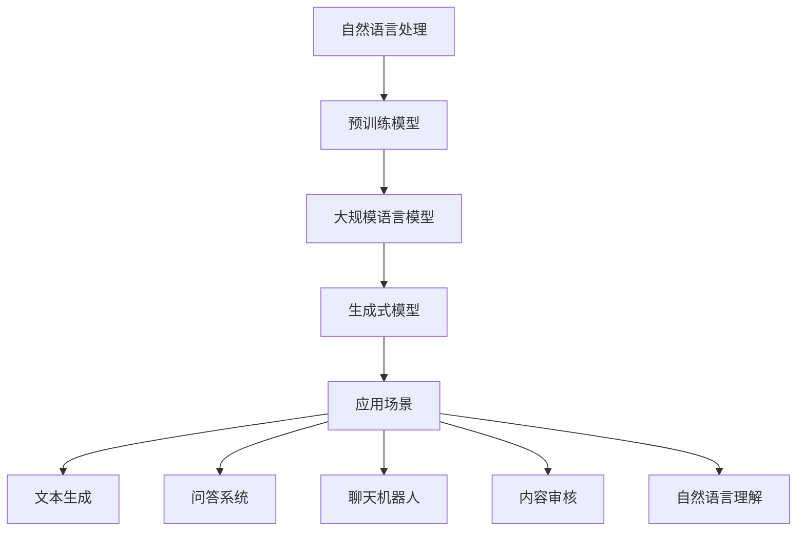
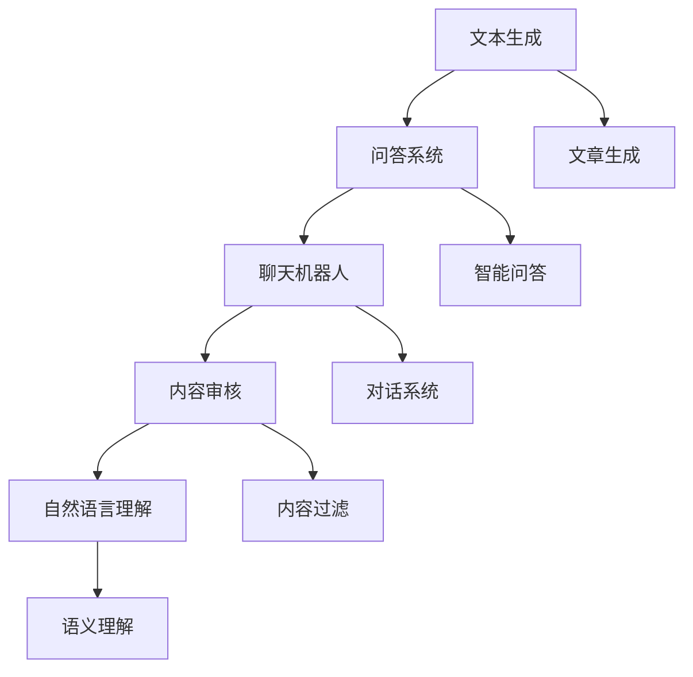
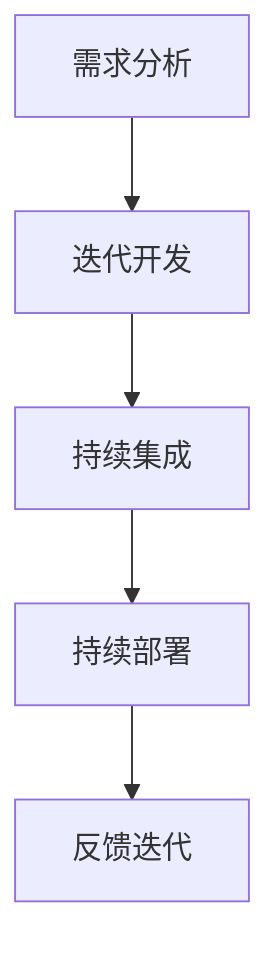
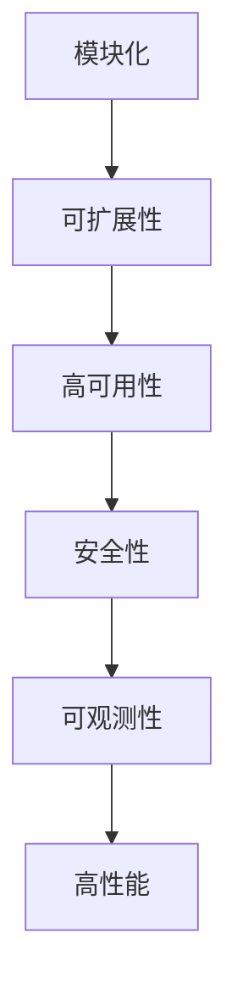
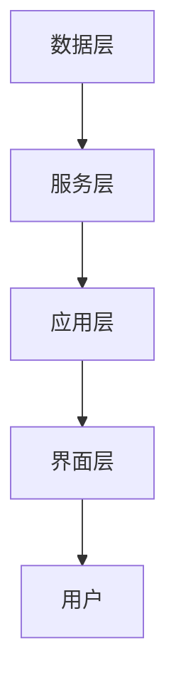

                 

### 什么是LLM

LLM（Large Language Model）即大型语言模型，是自然语言处理（Natural Language Processing，NLP）领域的一种先进技术。随着深度学习和大数据技术的发展，LLM成为了许多自然语言处理任务的基石，如文本生成、问答系统、聊天机器人、内容审核等。LLM的核心在于其能够捕捉和利用大量文本数据中的语言规律，从而实现高效的文本理解和生成。

LLM的基本组成部分包括：词嵌入（Word Embedding）、编码器（Encoder）、解码器（Decoder）等。词嵌入将文本中的单词映射到高维空间中的向量表示；编码器则负责将输入文本转换为上下文表示；解码器则根据上下文生成目标文本。这三个组件共同工作，使得LLM能够处理复杂的语言任务。

为了更直观地展示LLM的基本组成和流程，我们可以使用Mermaid流程图：



### LLM技术原理

LLM的技术原理主要基于深度学习和生成式模型。生成式模型是一种能够根据某种概率分布生成数据的模型，而LLM则是基于这种原理，利用大量文本数据进行训练，从而学习到语言的生成规律。

生成式模型的工作原理可以概括为以下步骤：

1. **输入编码**：将输入文本转换为向量表示。这一步骤通常使用词嵌入技术实现。
2. **上下文生成**：通过编码器将输入文本向量转换为上下文表示。这一步骤需要多层神经网络结构，如Transformer模型。
3. **预测下一个词**：根据当前上下文，解码器预测下一个词的概率分布，并从中选择一个词作为输出。
4. **重复步骤3**：将新生成的词与原始文本拼接，再次输入模型，重复预测和生成过程，直到生成完整的文本。

以下是一个生成式模型的伪代码示例：

```python
# 伪代码：生成式模型基本框架
function generate_text(input_sequence):
    initialize_context = input_sequence
    current_output = ""
    for _ in range(target_sequence_length):
        context = current_output + initialize_context
        next_output = predict_next_word(context)
        current_output += next_output
    return current_output
```

在LLM中，预测下一个词通常是一个复杂的概率计算过程，可以使用以下公式表示：

$$
P(w_{t+1} | w_{1}, w_{2}, ..., w_{t}) = \frac{P(w_{t+1} | h_{t}) \cdot P(h_{t} | h_{t-1}) \cdot ... \cdot P(h_{1} | h_{0}) \cdot P(h_{0})}{\sum_{w'} P(w' | h_{t}) \cdot P(h_{t} | h_{t-1}) \cdot ... \cdot P(h_{1} | h_{0}) \cdot P(h_{0})}
$$

其中，$w_{t+1}$ 是下一个要预测的词，$h_{t}$ 是当前时间步的编码器输出，$P(w_{t+1} | h_{t})$ 是解码器输出的词的概率分布，其他项则表示上下文的影响。

### LLM应用场景

LLM在自然语言处理领域具有广泛的应用场景，以下是一些典型的应用：

1. **文本生成**：LLM可以生成高质量的文章、故事、摘要等。例如，Google的Bard就是一个基于LLM的文本生成工具。
   
2. **问答系统**：LLM可以用于构建智能问答系统，如OpenAI的GPT-3，它能够回答各种复杂的问题。

3. **聊天机器人**：LLM可以用于构建聊天机器人，如微软的小冰，它能够与用户进行自然对话。

4. **内容审核**：LLM可以用于自动识别和过滤不良内容，如Facebook和Twitter等社交媒体平台。

5. **自然语言理解**：LLM可以用于理解用户输入的文本，从而提供个性化服务，如亚马逊的推荐系统。

为了更直观地展示LLM在常见应用场景中的角色和流程，我们可以使用Mermaid流程图：



### 敏捷工程概述

敏捷工程（Agile Engineering）是一种以人为核心、迭代、增量和适应性为特征的软件开发方法。与传统的水滴石穿式开发模式不同，敏捷工程强调快速反馈、持续改进和团队协作，以更好地适应快速变化的需求和市场。

敏捷工程的核心流程包括以下步骤：

1. **需求分析**：通过与利益相关者的沟通，明确项目需求。
2. **迭代开发**：将项目划分为多个短周期（迭代），在每个迭代中逐步实现需求。
3. **持续集成**：将代码不断集成到主分支，确保代码质量和项目稳定性。
4. **持续部署**：将软件部署到生产环境，确保软件的可用性。
5. **反馈迭代**：收集用户反馈，持续优化和改进软件。

以下是一个简单的Mermaid流程图，展示了敏捷工程的基本流程和特点：



### 敏捷工程实践

敏捷工程在实践中需要结合具体的项目环境和需求，采用一系列工具和方法来确保开发过程的高效和稳定。以下是一些常见的敏捷工程实践：

1. **Scrum框架**：Scrum是一种流行的敏捷开发方法，它将项目划分为多个Sprint（迭代），每个Sprint通常为2-4周。Scrum框架包括Product Backlog（产品待办列表）、Sprint Backlog（Sprint待办列表）、Daily Stand-up（每日站会）等核心概念。

    $$  
    $$  
    $$  
    $$  
    $$  
    $$

2. **看板系统**：看板系统是一种可视化项目管理工具，它通过看板（Kanban Board）来展示项目进展和任务状态。常见的看板元素包括：待办（To Do）、进行中（In Progress）、待测试（In Test）、已完成（Done）等。

    $$  
    $$  
    $$  
    $$  
    $$  
    $$

3. **代码审查**：代码审查是一种确保代码质量和一致性的方法，它通常由团队成员在提交代码前进行。代码审查包括检查代码的语法错误、逻辑错误、风格一致性等。

    $$  
    $$  
    $$  
    $$  
    $$  
    $$

4. **持续集成（CI）**：持续集成是一种将代码不断集成到主分支的方法，它通过自动化测试和构建来确保代码质量和项目稳定性。

    $$  
    $$  
    $$  
    $$  
    $$  
    $$

5. **持续部署（CD）**：持续部署是一种将软件部署到生产环境的方法，它通过自动化部署流程来确保软件的可用性和稳定性。

    $$  
    $$  
    $$  
    $$  
    $$  
    $$

### 敏捷工程在LLM开发中的应用

在LLM开发中，敏捷工程方法可以显著提高开发效率和质量。以下是一个简单的示例，展示了如何将敏捷工程方法应用于LLM开发：

```python
# 示例：敏捷工程在LLM开发中的应用
function develop_LLM_model():
    # 需求分析
    collect_requirements()
    # 迭代开发
    for sprint in range(num_sprints):
        train_model()
        evaluate_model()
    # 持续集成
    integrate_changes()
    # 持续部署
    deploy_model()
    # 反馈迭代
    collect_feedback()
    optimize_model()
```

### 技术架构设计原则

在LLM应用开发中，技术架构设计至关重要。一个良好的技术架构不仅能够提高系统的性能和可扩展性，还能够降低维护成本和复杂度。以下是技术架构设计中的几个关键原则：

1. **模块化**：将系统分解为多个模块，每个模块负责特定的功能。模块化有助于降低系统的复杂度，提高可维护性和可扩展性。

2. **可扩展性**：设计时应考虑系统的扩展性，以便在未来能够轻松地添加新功能或服务。可扩展性可以通过水平扩展（增加节点数量）和垂直扩展（增加节点资源）实现。

3. **高可用性**：系统应具备高可用性，以确保在长时间运行中保持稳定可用。高可用性可以通过冗余设计、故障转移和负载均衡等机制实现。

4. **安全性**：在设计时，必须考虑系统的安全性，包括数据保护、访问控制和安全审计等。

5. **可观测性**：系统应具备良好的可观测性，以便在出现问题时能够快速定位和解决问题。可观测性可以通过日志记录、监控和告警系统实现。

6. **高性能**：系统应具备高性能，以满足大规模数据处理和快速响应的需求。高性能可以通过优化算法、提高硬件性能和分布式计算等手段实现。

以下是一个简单的Mermaid流程图，展示了技术架构设计原则之间的关系：



### LLM开发中的典型技术架构

在LLM应用开发中，常见的技术架构通常包括以下几个核心组件：数据层、服务层、应用层和界面层。以下是对这些组件的详细解释：

1. **数据层**：数据层负责存储和管理LLM应用所需的大量文本数据。常用的数据存储方案包括关系型数据库（如MySQL）、非关系型数据库（如MongoDB）和分布式文件系统（如HDFS）。数据层还需要处理数据清洗、数据预处理和数据导入导出等任务。

2. **服务层**：服务层是LLM应用的核心，负责处理文本输入，调用LLM模型生成文本输出。服务层通常采用微服务架构，将不同功能模块划分为独立的微服务，如文本生成服务、问答服务、聊天机器人服务等。这些微服务可以通过API进行通信，从而提高系统的灵活性和可扩展性。

3. **应用层**：应用层负责将服务层提供的功能整合到具体的业务场景中。例如，在一个问答系统中，应用层会根据用户的问题，调用文本生成服务生成答案，并展示给用户。应用层还需要处理用户交互、数据验证和错误处理等任务。

4. **界面层**：界面层是用户与LLM应用交互的入口，通常包括Web界面、移动应用界面和命令行界面等。界面层需要实现用户输入、文本输出和交互逻辑，同时与后端服务层进行通信。

以下是一个简单的Mermaid流程图，展示了LLM开发中的典型技术架构：



### 最佳实践与注意事项

在LLM应用开发中，遵循一些最佳实践和注意事项可以显著提高开发效率和项目质量。以下是一些建议：

1. **代码质量**：确保代码具有良好的结构、可读性和可维护性。使用代码审查工具和规范，提高代码质量。

2. **性能优化**：针对大规模数据处理和快速响应的需求，对算法和系统进行性能优化。例如，使用高效的矩阵运算库（如NumPy、TensorFlow）和分布式计算框架（如PyTorch、MXNet）。

3. **安全性**：确保系统具有足够的安全性，包括数据保护、访问控制和安全审计等。遵循最佳的安全实践，如使用HTTPS、加盐哈希和定期备份等。

4. **监控与告警**：建立完善的监控系统，实时监控系统的运行状态和性能指标。设置告警机制，以便在出现问题时能够及时发现和解决。

5. **迭代开发**：采用敏捷开发方法，将项目划分为多个短周期（迭代），在每个迭代中逐步实现需求。确保每个迭代都有可交付的成果，以便及时调整和优化。

6. **持续学习和优化**：LLM技术不断发展，需要持续学习和跟进最新的研究成果和技术动态。根据项目需求，不断优化和改进LLM模型和应用。

### 拓展阅读

1. **《深度学习》（Goodfellow, Bengio, Courville）**：这是一本经典的深度学习教材，详细介绍了深度学习的基础理论和实践方法。

2. **《Python机器学习》（Sebastian Raschka）**：这本书涵盖了机器学习的基本概念和Python实现，适合初学者和进阶者。

3. **《自然语言处理综论》（Daniel Jurafsky，James H. Martin）**：这是一本全面介绍自然语言处理理论的教材，适合对NLP有深入兴趣的读者。

4. **《敏捷软件开发实践指南》（Ken Schwaber，Jeff Sutherland）**：这本书详细介绍了敏捷开发的原理和实践方法，适合软件开发团队和项目经理。

5. **《大规模语言模型的训练与应用》（OpenAI）**：这是一篇关于大规模语言模型的研究论文，介绍了GPT-3等模型的训练方法和应用场景。

### 总结

本文从LLM的基础知识、技术原理、应用场景、敏捷工程技术、技术架构设计原则以及实际应用等方面，系统地阐述了LLM应用开发中的敏捷工程技术架构设计。通过逐步分析和推理，我们了解了LLM的核心概念和工作原理，以及如何在开发过程中应用敏捷工程方法和技术架构原则。

随着深度学习和自然语言处理技术的不断发展，LLM的应用前景非常广阔。在未来的发展中，我们将继续关注LLM技术的最新动态，探索更高效、更智能的语言生成和处理方法，为各个领域带来更多的创新和应用。作者：AI天才研究院/AI Genius Institute & 禅与计算机程序设计艺术 /Zen And The Art of Computer Programming

