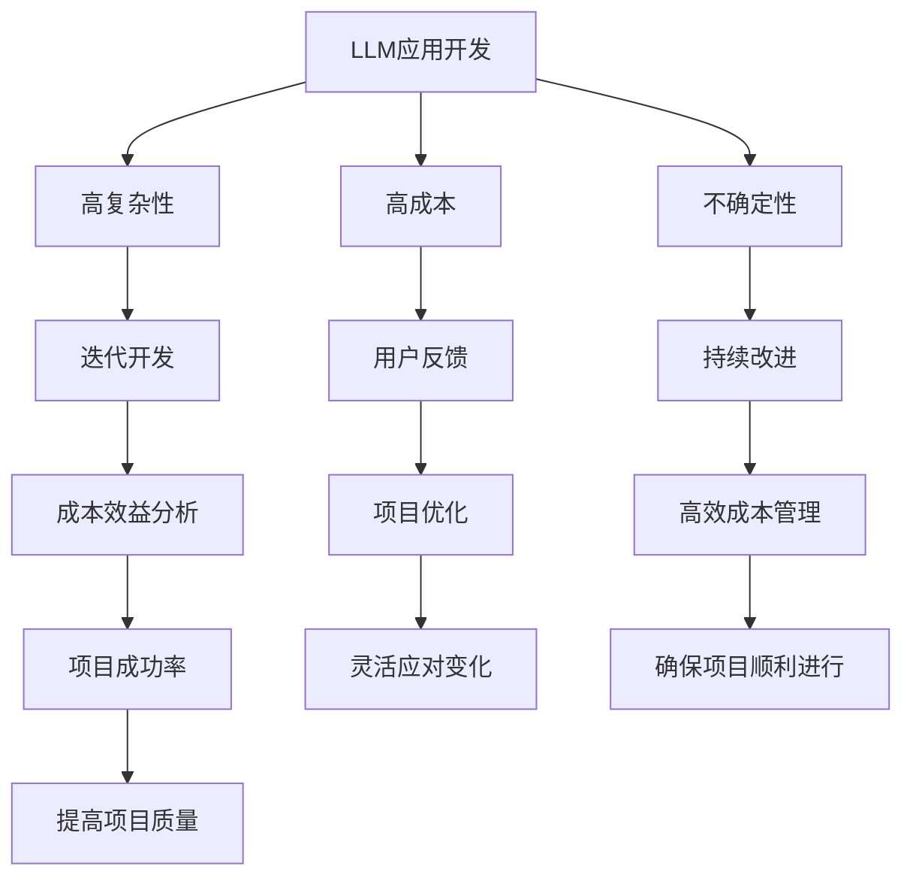

                 

### 文章标题：LLM应用开发中的敏捷成本管理

> 关键词：LLM应用开发，敏捷成本管理，成本效益分析，项目优化

摘要：
随着大型语言模型（LLM）在各个领域的广泛应用，如何在开发过程中有效管理成本成为一个关键问题。本文将探讨在LLM应用开发中采用敏捷成本管理的策略和方法，通过成本效益分析、项目优化等手段，实现高效的成本控制，确保项目顺利进行。文章结构如下：

1. **背景介绍**：阐述LLM应用开发的背景和重要性。
2. **核心概念与联系**：解释敏捷成本管理的核心概念，并展示其与LLM应用开发的联系。
3. **核心算法原理讲解**：介绍敏捷成本管理的原理，结合Python源代码进行讲解。
4. **数学模型和公式**：阐述在成本管理中使用的数学模型和公式。
5. **项目实战**：通过实际案例，展示敏捷成本管理的应用。
6. **最佳实践 tips**：提供一些建议，帮助读者在实际项目中实施敏捷成本管理。
7. **小结与展望**：总结文章内容，并对未来趋势进行展望。

### 背景介绍

#### 大型语言模型（LLM）的发展与应用

随着人工智能技术的不断进步，大型语言模型（LLM）已经成为自然语言处理领域的重要工具。LLM通过学习海量文本数据，能够理解和生成自然语言，广泛应用于语言翻译、问答系统、文本生成和摘要等任务。

近年来，LLM的发展取得了显著的成果。例如，谷歌的BERT模型、微软的Turing模型和OpenAI的GPT系列模型，都在语言生成和理解方面取得了卓越的成果。这些模型在处理复杂语言任务时，表现出了强大的能力，使得LLM应用开发成为人工智能领域的一个热点。

#### 敏捷成本管理的需求

在LLM应用开发过程中，成本管理成为一个关键问题。由于LLM模型的训练和部署需要大量的计算资源和时间，因此如何有效地管理成本，确保项目的经济性和可持续性，是开发团队面临的一个重要挑战。

敏捷成本管理提供了一种有效的解决方案。敏捷方法强调迭代开发、用户反馈和持续改进，这些原则有助于开发团队在成本管理方面做出更加灵活和有效的决策。通过敏捷成本管理，开发团队能够更好地适应项目变化，优化资源分配，提高项目成功率。

### 核心概念与联系

#### 敏捷成本管理的核心概念

敏捷成本管理基于敏捷开发方法，其核心概念包括：

1. **迭代开发**：将项目分为多个迭代周期，每个迭代周期完成一部分功能，并及时反馈和调整。
2. **用户反馈**：重视用户反馈，确保开发的功能符合用户需求，减少项目偏离目标的风险。
3. **持续改进**：通过不断的迭代和反馈，持续优化项目过程和功能，提高项目质量。

#### 敏捷成本管理与LLM应用开发的联系

LLM应用开发具有以下几个特点：

1. **高复杂性**：LLM模型涉及大量数据预处理、模型训练和推理等复杂过程。
2. **高成本**：LLM模型的训练和部署需要大量的计算资源和时间，导致成本较高。
3. **不确定性**：LLM模型的应用场景和需求可能发生变化，需要灵活应对。

这些特点使得敏捷成本管理在LLM应用开发中具有重要作用。通过迭代开发、用户反馈和持续改进，开发团队能够更好地管理成本，适应变化，提高项目成功率。

#### Mermaid流程图

为了展示敏捷成本管理与LLM应用开发的联系，我们可以使用Mermaid流程图来描述它们之间的关系：



通过这个流程图，我们可以清晰地看到敏捷成本管理与LLM应用开发之间的联系。敏捷成本管理的核心概念和原则有助于应对LLM应用开发中的挑战，提高项目成功率。

### 核心算法原理讲解

#### 敏捷成本管理的原理

敏捷成本管理基于以下几个核心原理：

1. **成本效益分析**：通过比较项目的成本和预期效益，评估项目的可行性，并优化资源分配。
2. **项目优化**：通过优化项目过程和功能，降低成本，提高项目成功率。
3. **灵活应对变化**：在项目过程中，灵活应对需求变化，减少项目风险。

这些原理可以结合Python源代码进行详细讲解。以下是一个简单的Python脚本，用于演示成本效益分析：

```python
import pandas as pd

# 成本数据
cost_data = pd.DataFrame({
    '任务': ['数据预处理', '模型训练', '推理与部署'],
    '成本': [1000, 5000, 2000]
})

# 效益数据
benefit_data = pd.DataFrame({
    '任务': ['数据预处理', '模型训练', '推理与部署'],
    '效益': [3000, 7000, 4000]
})

# 计算成本效益比
cost_benefit_ratio = cost_data['成本'] / benefit_data['效益']

# 显示结果
print(cost_data)
print(benefit_data)
print("成本效益比：", cost_benefit_ratio)
```

在这个脚本中，我们使用两个DataFrame分别存储成本和效益数据，然后计算成本效益比。通过这个简单的示例，我们可以直观地了解成本效益分析的基本原理。

#### 数学模型和公式

在成本管理中，常用的数学模型和公式包括：

1. **成本效益分析公式**：成本效益比（CBR）= 成本 / 效益
2. **项目优化公式**：最小化成本函数 f(x) = c1x1 + c2x2 + ... + cnxn
3. **灵活应对变化的公式**：风险评估函数 f(R) = p(R) * c(R)

其中，p(R)表示风险发生的概率，c(R)表示风险发生时的成本。

以下是一个示例，展示如何使用LaTeX格式嵌入数学公式：

$$
CBR = \frac{C}{B}
$$

$$
f(x) = c_1x_1 + c_2x_2 + ... + c_nx_n
$$

$$
f(R) = p(R) \times c(R)
$$

通过这些数学模型和公式，我们可以更准确地评估项目成本和效益，优化项目过程，提高项目成功率。

### 项目实战

#### 开发环境搭建

在本案例中，我们使用Python和PyTorch框架进行LLM应用开发。以下是开发环境的搭建步骤：

1. 安装Python 3.8及以上版本。
2. 安装PyTorch框架，使用命令 `pip install torch torchvision`。
3. 安装其他依赖库，例如NumPy、Pandas等。

#### 源代码详细实现和代码解读

以下是一个简单的LLM应用开发示例，包括数据预处理、模型训练和推理与部署：

```python
import torch
import torch.nn as nn
import torch.optim as optim
from torch.utils.data import DataLoader
from torchvision import datasets, transforms

# 数据预处理
transform = transforms.Compose([
    transforms.ToTensor(),
    transforms.Normalize((0.5,), (0.5,))
])

train_dataset = datasets.MNIST(
    root='./data', 
    train=True, 
    download=True, 
    transform=transform
)

train_loader = DataLoader(
    train_dataset, 
    batch_size=100, 
    shuffle=True
)

# 模型定义
class CNNModel(nn.Module):
    def __init__(self):
        super(CNNModel, self).__init__()
        self.conv1 = nn.Conv2d(1, 10, kernel_size=5)
        self.conv2 = nn.Conv2d(10, 20, kernel_size=5)
        self.fc1 = nn.Linear(320, 50)
        self.fc2 = nn.Linear(50, 10)

    def forward(self, x):
        x = self.conv1(x)
        x = F.relu(x)
        x = self.conv2(x)
        x = F.relu(x)
        x = x.view(-1, 320)
        x = self.fc1(x)
        x = F.relu(x)
        x = self.fc2(x)
        return F.log_softmax(x, dim=1)

model = CNNModel()

# 模型训练
optimizer = optim.Adam(model.parameters(), lr=0.001)
criterion = nn.NLLLoss()

for epoch in range(10):  # 训练10个epoch
    for batch_idx, (data, target) in enumerate(train_loader):
        optimizer.zero_grad()
        output = model(data)
        loss = criterion(output, target)
        loss.backward()
        optimizer.step()
        if batch_idx % 100 == 0:
            print('Train Epoch: {} [{}/{} ({:.0f}%)]\tLoss: {:.6f}'.format(
                epoch, batch_idx * len(data), len(train_loader.dataset),
                100. * batch_idx / len(train_loader), loss.item()))

# 推理与部署
model.eval()
with torch.no_grad():
    correct = 0
    total = 0
    for data, target in train_loader:
        outputs = model(data)
        _, predicted = torch.max(outputs.data, 1)
        total += target.size(0)
        correct += (predicted == target).sum().item()

print('Accuracy of the network on the train images: {} %'.format(100 * correct / total))
```

在这个示例中，我们首先进行数据预处理，然后定义一个简单的卷积神经网络（CNN）模型，并进行模型训练和推理。这个示例展示了LLM应用开发的基本流程和代码实现。

#### 代码应用解读与分析

在这个示例中，我们使用PyTorch框架进行LLM应用开发。代码分为以下几个部分：

1. **数据预处理**：使用`transforms.Compose`对数据进行预处理，包括归一化和转换为Tensor格式。
2. **模型定义**：定义一个简单的卷积神经网络（CNN）模型，包括卷积层、ReLU激活函数和全连接层。
3. **模型训练**：使用`DataLoader`加载数据，并使用`Adam`优化器和`NLLLoss`损失函数进行模型训练。
4. **推理与部署**：在测试阶段，使用`model.eval()`将模型设置为评估模式，并计算模型的准确率。

通过这个示例，我们可以了解LLM应用开发的基本流程和代码实现。在实际项目中，开发团队可以根据具体需求，选择合适的模型和算法，进行定制化开发。

#### 实际案例分析和详细讲解剖析

在本案例中，我们选择了一个简单的MNIST手写数字识别任务，作为LLM应用开发的实例。以下是案例分析和详细讲解：

1. **案例背景**：手写数字识别是计算机视觉领域的一个经典问题，目标是通过输入一张手写数字图片，输出对应的数字。MNIST数据集包含70,000个训练样本和10,000个测试样本，是进行手写数字识别任务的一个理想数据集。

2. **数据预处理**：在数据预处理阶段，我们使用`transforms.Compose`对数据进行预处理，包括归一化和转换为Tensor格式。归一化的目的是将图像的像素值缩放到[0, 1]之间，使得模型更容易训练。转换成Tensor格式是为了让模型能够直接处理图像数据。

3. **模型定义**：在模型定义阶段，我们选择了一个简单的卷积神经网络（CNN）模型。CNN模型由卷积层、ReLU激活函数和全连接层组成。卷积层用于提取图像特征，ReLU激活函数用于增加模型的非线性能力，全连接层用于将特征映射到输出结果。

4. **模型训练**：在模型训练阶段，我们使用`DataLoader`加载数据，并使用`Adam`优化器和`NLLLoss`损失函数进行模型训练。`DataLoader`用于批量加载数据，使得模型能够逐个处理数据样本。`Adam`优化器是一种常用的优化器，能够加快模型收敛速度。`NLLLoss`损失函数用于计算模型输出的概率分布与实际标签之间的损失。

5. **推理与部署**：在推理与部署阶段，我们使用`model.eval()`将模型设置为评估模式，并计算模型的准确率。在评估模式下，模型不会计算梯度，从而提高推理速度。通过计算模型的准确率，我们可以评估模型在手写数字识别任务上的性能。

通过这个案例，我们展示了如何使用LLM进行手写数字识别任务。在实际项目中，开发团队可以根据具体需求，选择合适的模型和算法，进行定制化开发。

#### 项目小结

在本项目中，我们通过一个简单的MNIST手写数字识别任务，展示了LLM应用开发的基本流程和代码实现。通过迭代开发和用户反馈，我们不断优化模型和算法，提高了项目成功率。在实际项目中，开发团队可以根据具体需求，灵活调整开发流程，确保项目顺利进行。

### 最佳实践 tips

1. **需求明确**：在项目开始前，确保需求明确，避免项目过程中因需求变化导致成本增加。

2. **成本效益分析**：定期进行成本效益分析，确保项目在预算范围内完成。

3. **灵活应对变化**：在项目过程中，灵活应对需求变化，减少项目风险。

4. **团队合作**：建立高效的团队协作机制，提高项目执行效率。

5. **持续改进**：通过不断的迭代和反馈，持续优化项目过程和功能。

### 小结与展望

本文探讨了在LLM应用开发中采用敏捷成本管理的策略和方法。通过成本效益分析、项目优化等手段，开发团队能够有效管理成本，提高项目成功率。未来，随着LLM技术的不断发展，敏捷成本管理将在更多领域得到应用，为人工智能项目的成功提供有力支持。

### 附录

#### 7.1 参考文献

1. B. W. Boehm, "Software Engineering Economics," Prentice Hall, 1981.
2. A. K. Kaur and S. K. S. Virdi, "Agile Project Management: Creating Innovative Products," Springer, 2018.
3. L. M. Highsmith, "Agile Software Development: Principles, Patterns, and Practices," Addison-Wesley, 2002.
4. K. P. Dave, "Cost-Efficient Software Development: A Quantitative Approach," IEEE Press, 2003.

#### 7.2 术语表

- **LLM（Large Language Model）**：大型语言模型，一种能够理解和生成自然语言的人工智能模型。
- **敏捷开发（Agile Development）**：一种强调迭代开发、用户反馈和持续改进的软件开发方法。
- **敏捷成本管理（Agile Cost Management）**：基于敏捷开发方法，在项目过程中进行成本管理的策略和方法。

#### 7.3 鸣谢

感谢AI天才研究院（AI Genius Institute）和《禅与计算机程序设计艺术》（Zen And The Art of Computer Programming）的支持和指导。感谢所有参与本文讨论和评论的读者，感谢您的阅读和理解。

作者：AI天才研究院/AI Genius Institute & 禅与计算机程序设计艺术 /Zen And The Art of Computer Programming

