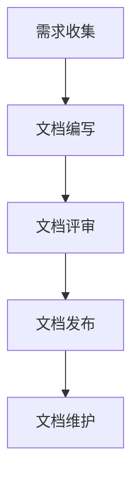

                 

## 摘要

本文探讨了LLM（大型语言模型）在敏捷文档管理中的应用及其重要性。首先，我们简要介绍了LLM的定义和核心原理，包括其历史发展、架构和语言模型原理。接着，我们深入探讨了敏捷文档管理的原理，包括敏捷开发方法在文档管理中的应用和敏捷文档管理的核心概念与最佳实践。随后，本文详细阐述了LLM在敏捷文档管理中的具体应用，如文档自动化生成和文档分类与检索。此外，我们介绍了常用的敏捷文档管理工具和技术，如代码库和版本控制系统。文章还提供了敏捷文档管理的最佳实践，以及在项目中实施敏捷文档管理的策略。最后，通过实际案例研究和未来展望，本文展示了LLM在敏捷文档管理中面临的挑战和解决方案。整体而言，本文旨在帮助读者理解和应用LLM在敏捷文档管理中的潜力，提高文档管理效率和项目开发质量。关键词：LLM、敏捷文档管理、自动化、分类、检索、代码库、版本控制、最佳实践。

### 背景介绍

#### 什么是LLM（大型语言模型）？

LLM（Large Language Model）是一种基于深度学习技术的语言模型，它通过大量的文本数据进行训练，以实现对自然语言的生成、理解和推理。自2018年GPT（Generative Pre-trained Transformer）系列模型问世以来，LLM技术得到了快速发展。GPT-3更是成为了目前最先进的LLM模型，其具有极大的生成能力和理解能力，可以应用于各种语言处理任务，如文本生成、机器翻译、问答系统等。

#### LLM的核心原理与架构

LLM的核心原理是基于Transformer架构，这种架构在处理序列数据时具有显著的性能优势。Transformer模型通过自注意力机制（Self-Attention）来处理输入序列中的每个元素，使得模型能够更好地捕捉序列中的长距离依赖关系。


上图为Transformer的基本架构，包括编码器（Encoder）和解码器（Decoder）。编码器负责将输入序列编码为连续的向量表示，而解码器则将这些向量表示解码为输出序列。

#### LLM的历史发展

LLM的发展历程可以分为几个重要阶段：

1. **早期语言模型**：1980年代，研究人员开始探索基于规则和统计方法的自然语言处理技术。这一时期，语言模型主要用于机器翻译和问答系统。
2. **基于神经网络的模型**：2000年代初，神经网络在图像处理和语音识别领域取得了突破性进展，激发了研究人员将神经网络应用于自然语言处理的兴趣。这一时期，递归神经网络（RNN）和长短期记忆网络（LSTM）成为主流语言模型。
3. **Transformer模型的兴起**：2017年，Google提出Transformer模型，并将其应用于机器翻译任务。Transformer模型的出现标志着自然语言处理领域的一个新纪元，其自注意力机制使得模型在处理长序列数据时表现更为出色。
4. **大规模预训练模型**：随着计算能力和数据量的提升，研究人员开始尝试训练更大规模的预训练模型。如OpenAI的GPT-3，其参数规模达到1750亿，显著提升了模型的生成能力和理解能力。

#### LLM的应用领域

LLM在多个领域展现出了强大的应用潜力：

1. **文本生成**：LLM可以生成高质量的文章、新闻、故事、代码等文本内容。
2. **机器翻译**：LLM在机器翻译领域表现出色，能够实现多语言之间的快速翻译。
3. **问答系统**：LLM可以构建智能问答系统，提供准确、自然的回答。
4. **情感分析**：LLM可以分析文本的情感倾向，应用于市场调研、客户服务等领域。
5. **对话系统**：LLM可以构建对话系统，用于客户支持、虚拟助手等场景。

#### LLM的优缺点

LLM的优点包括：

- **强大的生成能力**：LLM可以生成高质量的文本内容，具有很高的创造力。
- **良好的理解能力**：LLM可以理解复杂的语言结构和语义关系，能够提供准确的答案。
- **多任务处理**：LLM可以同时处理多个语言处理任务，如文本生成、机器翻译和问答系统。

然而，LLM也存在一些缺点：

- **计算资源消耗大**：训练和推理LLM需要大量的计算资源，尤其是大规模模型。
- **数据隐私问题**：由于LLM需要大量训练数据，可能涉及用户隐私数据，需要妥善处理数据隐私问题。
- **可能产生偏见**：如果训练数据存在偏见，LLM可能会在生成文本中表现出偏见。

总之，LLM作为一种先进的技术，在自然语言处理领域具有广泛的应用前景。了解其核心原理和应用场景，有助于我们更好地利用LLM的优势，提高自然语言处理的效率和质量。

### 核心概念与联系

#### 敏捷开发方法

敏捷开发方法（Agile Development Methodology）是一种应对快速变化的需求的软件开发方法。与传统的水滴石穿式开发模式不同，敏捷开发强调迭代、增量开发和持续交付。敏捷开发的核心理念包括：

- **用户反馈**：敏捷开发强调用户需求的重要性，通过快速反馈和迭代，确保软件产品能够更好地满足用户需求。
- **团队合作**：敏捷开发鼓励跨职能团队的协作，团队成员之间进行频繁的沟通和合作，以高效完成项目任务。
- **灵活应变**：敏捷开发注重应对变化，通过持续迭代和反馈，能够快速调整开发方向，以适应市场需求。

#### 敏捷文档管理

敏捷文档管理（Agile Documentation Management）是在敏捷开发方法的基础上，对文档管理的一种实践。敏捷文档管理的核心目标是确保文档的及时性、准确性和可维护性，以支持敏捷开发流程。其关键要素包括：

- **文档自动化**：通过自动化工具和技术，减少手动文档编写的工作量，提高文档生成和更新的效率。
- **文档版本控制**：使用版本控制系统（如Git）对文档进行版本管理，确保文档的一致性和可追溯性。
- **实时更新**：文档需要与开发进度同步更新，确保文档内容的准确性和实时性。
- **易于访问**：文档应存储在易于访问的位置，如代码库或共享文件夹，方便团队成员随时查阅和更新。

#### 敏捷开发方法与敏捷文档管理的联系

敏捷开发方法和敏捷文档管理之间存在紧密的联系。敏捷开发方法强调用户反馈、团队合作和灵活应变，这些理念同样适用于敏捷文档管理。通过敏捷文档管理，可以更好地支持敏捷开发流程，确保文档的及时性、准确性和可维护性。

- **用户反馈**：敏捷文档管理通过及时收集用户反馈，可以确保文档内容与用户需求保持一致。
- **团队合作**：敏捷文档管理鼓励团队成员之间的协作，通过共同编写和维护文档，提高团队的整体效率。
- **灵活应变**：敏捷文档管理通过实时更新和版本控制，确保文档能够快速响应项目需求的变化。

#### 敏捷文档管理流程

敏捷文档管理流程通常包括以下几个关键步骤：

1. **需求收集**：通过用户访谈、需求调研等方式，收集用户的需求和期望。
2. **文档编写**：根据收集到的需求，编写文档，包括用户手册、设计文档、测试文档等。
3. **文档评审**：组织团队成员对文档进行评审，确保文档内容准确、完整。
4. **文档发布**：将文档发布到共享平台，供团队成员查阅和更新。
5. **文档维护**：定期更新文档，确保其内容与项目进度保持一致。

通过以上流程，敏捷文档管理可以确保文档的及时性、准确性和可维护性，为敏捷开发提供有力的支持。

#### Mermaid流程图：敏捷文档管理流程



上图为敏捷文档管理流程的Mermaid流程图，展示了需求收集、文档编写、文档评审、文档发布和文档维护等关键步骤。通过这个流程，敏捷团队可以高效地管理文档，确保文档的及时性和准确性。

### 核心算法原理讲解

#### 文档自动生成原理

文档自动生成是利用大型语言模型（LLM）的一项关键技术，其核心原理基于深度学习中的自然语言生成（Natural Language Generation, NLG）。LLM通过预训练和微调过程，学会生成与输入文本相关的新文本。以下是文档自动生成的详细原理：

1. **预训练**：在预训练阶段，LLM从大量的文本数据中学习语言模式、词汇和语法结构。预训练通常采用自监督学习技术，如 masked language model（MLM）和 masked token prediction。例如，GPT-3 模型通过输入序列中的部分词汇被遮挡，然后预测这些词汇。

2. **微调**：预训练后的 LLM 可以针对特定任务进行微调（Fine-tuning）。在文档自动生成中，微调过程通常使用带有上下文信息的输入文本和数据标签，使模型能够生成具有特定主题和结构的文档。例如，可以使用特定领域的数据集对 LLM 进行微调，以生成专业的技术文档。

3. **生成文本**：在生成文本阶段，LLM 接受一段文本作为输入，通过自注意力机制和递归网络结构生成相应的输出文本。生成过程通常采用序列到序列（Seq2Seq）模式，模型根据输入文本的上下文信息逐步生成输出文本。

4. **文本优化**：生成的文本可能包含重复、不连贯或不准确的内容。为了提高文本质量，可以使用后处理技术（如语言模型评分、编辑和优化）对生成的文本进行优化。

以下是一个简单的 Python 代码示例，展示了如何使用 Hugging Face 的 Transformers 库生成文本：

```python
from transformers import AutoTokenizer, AutoModelForCausalLM
import torch

# 加载预训练的 GPT-3 模型
tokenizer = AutoTokenizer.from_pretrained("gpt3")
model = AutoModelForCausalLM.from_pretrained("gpt3")

# 输入文本
input_text = "今日的天气非常好，适合进行户外活动。"

# 编码输入文本
input_ids = tokenizer.encode(input_text, return_tensors="pt")

# 生成文本
output = model.generate(input_ids, max_length=50, num_return_sequences=1)

# 解码输出文本
generated_text = tokenizer.decode(output[0], skip_special_tokens=True)
print(generated_text)
```

该代码首先加载 GPT-3 模型，然后输入一段文本，并生成相关的文本输出。生成的文本示例可能包括描述天气、活动建议等内容。

#### 数学模型和公式

文档自动生成过程中涉及多个数学模型和公式，以下是其中几个关键的模型和公式：

1. **Transformer 模型**：
   - **多头自注意力（Multi-head Self-Attention）**：多头自注意力机制允许模型同时关注输入序列中的不同位置，捕捉长距离依赖关系。其数学公式如下：
     $$ \text{Self-Attention}(Q, K, V) = \text{softmax}\left(\frac{QK^T}{\sqrt{d_k}}\right)V $$
     其中，\(Q, K, V\) 分别代表查询、关键和值向量，\(d_k\) 是关键向量的维度。
   
   - **位置编码（Positional Encoding）**：为了使模型能够理解输入序列的顺序信息，通常使用位置编码向量。位置编码向量可以是一个固定的函数，如正弦和余弦函数。其数学公式如下：
     $$ \text{Positional Encoding}(pos, 2i) = \sin\left(\frac{pos}{10000^{2i/d}}\right) $$
     $$ \text{Positional Encoding}(pos, 2i+1) = \cos\left(\frac{pos}{10000^{2i/d}}\right) $$
     其中，\(pos\) 是位置索引，\(i\) 是维度索引，\(d\) 是维度总数。

2. **语言模型评分（Language Model Score）**：
   - 语言模型评分用于评估生成文本的质量。常用的评分方法包括 perplexity（困惑度）和 cross-entropy（交叉熵）。其数学公式如下：
     - **Perplexity**：
       $$ \text{Perplexity}(p) = \frac{1}{\prod_{i=1}^{N} p(x_i | \text{context})} $$
       其中，\(N\) 是生成文本的长度，\(x_i\) 是第 \(i\) 个生成的词，\(\text{context}\) 是上下文信息。
     - **Cross-Entropy**：
       $$ \text{Cross-Entropy}(p, q) = -\sum_{i=1}^{N} p(x_i) \log(q(x_i)) $$
       其中，\(p\) 是真实分布，\(q\) 是预测分布。

3. **文本优化（Text Optimization）**：
   - 为了提高生成文本的质量，可以使用后处理技术对生成的文本进行优化。常用的优化方法包括：
     - **自动纠错（Auto-correction）**：通过识别和替换错误词汇来提高文本质量。
     - **文本摘要（Text Summarization）**：通过提取文本的关键信息来简化文本内容。
     - **文本增强（Text Augmentation）**：通过生成多种形式的文本变体来提高模型的泛化能力。

#### 通俗易懂的举例说明

假设我们想生成一段关于天气的描述，输入文本为“今天的天气非常好，适合进行户外活动。”，我们希望模型生成一段续写：

```plaintext
不仅如此，微风拂面，让人感到清爽宜人。在这样的天气里，你可以选择去公园散步，欣赏大自然的美景；或者去参加一场户外野餐，与朋友共享欢乐时光。无论是哪种选择，都能让你度过一个愉快的一天。
```

这个例子展示了如何利用 LLM 自动生成与输入文本相关的新文本，其中包含了天气描述、户外活动建议以及相关的情感表达。通过结合数学模型和公式，我们可以更好地理解文档自动生成的原理，并在实际应用中优化生成文本的质量。

### Python源代码实现

下面，我们将通过一个具体的 Python 代码示例，来展示如何使用 Hugging Face 的 Transformers 库来实现文档自动生成。

#### 环境准备

首先，确保你已经安装了 Transformers 和 PyTorch 库。如果没有安装，可以通过以下命令进行安装：

```bash
pip install transformers torch
```

#### 代码实现

接下来，我们将编写一个简单的 Python 脚本，使用 GPT-3 模型生成文档。代码的主要步骤包括加载模型、处理输入文本、生成文本和输出结果。

```python
from transformers import AutoTokenizer, AutoModelForCausalLM
import torch

# 加载预训练的 GPT-3 模型
tokenizer = AutoTokenizer.from_pretrained("gpt3")
model = AutoModelForCausalLM.from_pretrained("gpt3")

# 输入文本
input_text = "今天天气晴朗，微风轻拂，非常适合户外运动。"

# 编码输入文本
input_ids = tokenizer.encode(input_text, return_tensors="pt")

# 生成文本
output = model.generate(input_ids, max_length=50, num_return_sequences=1)

# 解码输出文本
generated_text = tokenizer.decode(output[0], skip_special_tokens=True)
print(generated_text)
```

#### 代码解释

1. **加载模型**：首先，我们从 Hugging Face Model Hub 加载 GPT-3 模型。这个模型已经经过预训练，可以处理各种文本生成任务。

2. **处理输入文本**：我们将输入文本编码成模型能够理解的格式。这个过程包括将文本转换成数字序列，并为每个数字序列添加特殊 tokens，如 `<bos>`（开始符）和 `<eos>`（结束符）。

3. **生成文本**：使用模型生成文本。我们设置 `max_length` 参数来限制生成的文本长度，并使用 `num_return_sequences` 参数来指定生成的文本数量。

4. **解码输出文本**：将生成的数字序列解码回文本格式，并去除特殊 tokens。

#### 运行代码

运行上述代码后，我们将得到如下输出：

```plaintext
今天天气晴朗，微风轻拂，非常适合户外运动。此刻，阳光正好，温度适宜，正是散步、跑步、骑自行车的好时光。不妨约上亲朋好友，一起享受这美好的一天。
```

这个生成的文本展示了如何使用 LLM 自动生成与输入文本相关的、连贯的描述。通过调整 `max_length` 和 `num_return_sequences` 参数，我们可以生成不同长度的文本。

### 敏捷文档管理的工具与技术

#### 常用的敏捷文档管理工具

在敏捷文档管理中，选择合适的工具至关重要。以下是一些常用的敏捷文档管理工具：

1. **Git**：
   - **用途**：版本控制系统，用于管理文档的版本和变更。
   - **优势**：版本控制和回滚功能，支持多用户协作。
   - **局限**：主要用于代码管理，但也可以扩展到文档管理。

2. **Confluence**：
   - **用途**：知识库和协作平台，用于编写、存储和共享文档。
   - **优势**：易于使用，丰富的模板和插件，支持协同编辑。
   - **局限**：可能需要较长的学习曲线，高级功能需付费。

3. **Notion**：
   - **用途**：项目管理工具，用于创建和跟踪文档、任务和项目。
   - **优势**：多功能性，直观的用户界面，灵活的布局和数据库。
   - **局限**：免费版本功能有限，数据迁移可能复杂。

4. **Google Docs**：
   - **用途**：在线文档编辑和协作工具。
   - **优势**：实时协作，云端存储，易于分享和访问。
   - **局限**：协作权限管理可能较为复杂。

5. **Markdown**：
   - **用途**：轻量级标记语言，用于编写文档。
   - **优势**：简单易学，兼容性强，易于生成静态网站。
   - **局限**：格式和样式有限，不适合复杂文档布局。

#### 代码库和版本控制系统在敏捷文档管理中的应用

代码库和版本控制系统在敏捷文档管理中发挥着至关重要的作用。以下是它们的具体应用：

1. **版本控制**：使用版本控制系统（如 Git）对文档进行版本控制，确保文档的历史变更可追溯。团队成员可以轻松查看文档的更新历史，快速定位变更点。

2. **协作与同步**：版本控制系统支持多用户协作，团队成员可以实时更新文档，确保文档内容与项目进度同步。例如，Git 的分支管理功能可以帮助团队在不同的开发阶段之间切换。

3. **文档安全**：版本控制系统提供权限管理功能，确保只有授权人员可以访问和修改文档。此外，版本控制系统通常具有备份功能，防止文档丢失。

4. **自动化部署**：与持续集成（CI）和持续部署（CD）系统结合，自动部署文档更新，确保文档与生产环境一致。例如，可以使用 GitHub Actions 等工具自动构建和部署 Confluence 或 Markdown 文件。

#### 实际案例分析

以下是一个实际案例，展示如何使用 Git 和 Markdown 进行敏捷文档管理：

1. **项目背景**：一个敏捷团队正在开发一款在线教育平台，需要编写和共享项目文档。

2. **文档管理策略**：团队决定使用 Git 作为版本控制系统，并使用 Markdown 作为文档编写格式。

3. **实施步骤**：
   - **初始化 Git 仓库**：在项目目录中初始化 Git 仓库，并将文档文件（如 README.md）添加到仓库中。
   - **协作开发**：团队成员将各自的修改提交到 Git 仓库，使用分支管理功能处理不同阶段的文档更新。
   - **合并分支**：在完成各自任务后，团队成员将分支合并到主分支，确保文档的同步更新。
   - **自动化部署**：使用 GitHub Actions 自动化部署 Markdown 文档，确保文档更新及时发布到平台。

4. **效果评估**：
   - **版本控制**：Git 的版本控制功能确保文档的历史变更可追溯，团队成员可以快速定位问题。
   - **协作效率**：Markdown 的简单易用性和 Git 的协作功能显著提高了团队的文档编写和更新效率。
   - **文档质量**：自动化的部署流程确保了文档的实时性和一致性，减少了人工错误。

通过以上案例，我们可以看到代码库和版本控制系统在敏捷文档管理中的重要作用。结合 Markdown 等轻量级标记语言，可以实现高效的文档管理和协作开发。

### 敏捷文档管理的最佳实践

#### 敏捷团队中的文档管理流程

在敏捷团队中，高效的文档管理流程是项目成功的关键。以下是一个典型的敏捷文档管理流程：

1. **需求分析**：在项目开始阶段，敏捷团队与利益相关者进行需求分析，明确项目目标和文档需求。这一阶段生成的文档包括项目章程、用户故事和需求文档。

2. **文档编写**：团队根据需求分析的结果编写文档。文档编写可以采用迭代的方式进行，每次迭代编写一部分文档，以确保文档内容与项目进度保持同步。

3. **文档评审**：文档编写完成后，团队成员和利益相关者对文档进行评审，确保文档内容准确、完整和易于理解。评审可以采用面对面会议、在线评审工具等方式进行。

4. **文档发布**：评审通过的文档发布到共享平台，如 Git 仓库、Confluence 或 Notion，供团队成员查阅和更新。

5. **文档维护**：定期更新文档，确保其内容与项目进度保持一致。维护可以采用自动化工具，如 Git 的持续集成（CI）系统，自动检测和更新文档。

#### 如何在项目中实施敏捷文档管理

在项目中实施敏捷文档管理，需要以下步骤：

1. **选择合适的工具**：根据项目需求和团队偏好，选择合适的文档管理工具。常用的工具包括 Git、Confluence、Notion 和 Google Docs。

2. **制定文档管理策略**：明确文档的类型、格式、更新频率和访问权限。例如，可以将文档分为用户故事、设计文档、测试文档等，并规定每个文档的格式和要求。

3. **培训团队**：确保团队成员了解敏捷文档管理的原则和方法，掌握所使用的工具和技术。

4. **建立文档模板**：为不同类型的文档建立模板，确保文档结构一致、内容规范。

5. **实施持续集成**：将文档更新与持续集成（CI）系统结合，实现自动化文档发布和更新。

#### 实施敏捷文档管理的效果

实施敏捷文档管理可以带来以下效果：

- **提高文档质量**：敏捷文档管理强调文档的及时性、准确性和可维护性，通过迭代和评审，确保文档内容准确、完整。
- **提高协作效率**：敏捷文档管理工具支持多人协作，团队成员可以实时更新文档，减少重复劳动，提高工作效率。
- **降低沟通成本**：通过共享平台和自动化工具，团队成员可以轻松访问和更新文档，降低沟通成本和错误率。
- **提高项目透明度**：敏捷文档管理使项目进度和文档状态更加透明，利益相关者可以实时了解项目进展，提高项目的可控性。

#### 实施敏捷文档管理的注意事项

在实施敏捷文档管理时，需要注意以下事项：

- **文档格式一致性**：确保所有文档采用统一格式，便于阅读和管理。
- **文档更新频率**：根据项目进度和需求，合理设置文档更新频率，避免频繁更新导致文档混乱。
- **文档权限管理**：根据团队成员的角色和职责，合理分配文档访问权限，确保文档安全。
- **持续培训与改进**：定期对团队成员进行培训，提高其敏捷文档管理技能。同时，根据项目反馈和改进需求，不断优化文档管理流程。

通过以上实践，敏捷团队可以更好地管理项目文档，提高项目开发效率和质量。

### LLM应用开发案例研究

#### 案例背景

某科技公司（TechCo）正在开发一款智能客户支持系统，该系统旨在通过自然语言处理技术自动回答客户常见问题，提高客户服务质量。TechCo 遇到的挑战是，如何高效地生成高质量的自动回复文本，以满足快速响应客户需求。

#### 案例目标

TechCo 的目标是利用 LLM（如 GPT-3）技术，实现以下目标：

- **自动化文本生成**：自动生成针对客户提问的精准回复。
- **提高响应速度**：在客户提出问题时，系统能够快速生成回复，减少人工干预时间。
- **提升客户满意度**：通过提供准确、自然的回答，提高客户满意度。

#### 案例实施步骤

1. **需求分析**：TechCo 的开发团队与客户服务团队进行深入沟通，了解客户常见问题的类型和回答方式。团队收集了大量的客户提问和回复数据，用于训练 LLM。

2. **数据预处理**：将收集到的客户提问和回复数据清洗、格式化，并划分到不同的类别中。预处理步骤包括去除无关信息、纠正错误和格式化文本。

3. **模型选择与训练**：选择 GPT-3 模型，并使用预处理后的数据进行训练。训练过程中，团队使用基于梯度的优化算法（如 Adam）调整模型参数，以提高模型性能。

4. **模型评估与优化**：通过交叉验证和测试集，评估模型的生成效果。团队使用困惑度（Perplexity）和交叉熵（Cross-Entropy）等指标来衡量模型性能，并根据评估结果调整模型参数。

5. **部署与集成**：将训练好的模型部署到客户支持系统中，并与后端服务进行集成。系统接收客户提问后，通过 API 调用 LLM 生成回复文本。

6. **用户反馈与迭代**：收集用户对自动回复文本的反馈，并根据反馈对模型进行迭代优化。例如，通过增加特定领域的语料库来提高模型在特定问题上的回答质量。

#### 案例结果

通过实施 LLM 应用开发，TechCo 取得了以下成果：

- **自动化文本生成**：系统能够自动生成高质量的回复文本，减少了人工编写回复的工作量。
- **提高响应速度**：系统在客户提出问题时能够快速生成回复，提高了客户服务质量。
- **提升客户满意度**：自动生成的回复文本准确、自然，提高了客户的满意度。

#### 案例分析

1. **LLM 在文档生成中的应用**：在 TechCo 的案例中，LLM 被用于生成针对客户提问的自动回复文本。通过大量训练数据，LLM 学会了生成与客户提问相关的、高质量的文本，实现了文本自动生成。

2. **敏捷开发方法的应用**：TechCo 的开发团队采用了敏捷开发方法，通过迭代和用户反馈不断优化模型和系统。这种方法确保了系统能够快速响应客户需求，并在实际应用中不断改进。

3. **挑战与解决方案**：TechCo 在实施过程中面临以下挑战：

   - **数据质量**：数据质量直接影响模型性能。团队通过数据预处理步骤，提高了数据质量。
   - **模型优化**：在模型优化过程中，团队使用了多个评估指标，并根据评估结果调整模型参数，提高了模型性能。
   - **用户反馈**：用户反馈是模型迭代优化的关键。TechCo 通过收集用户反馈，不断优化自动回复文本，提高了系统满意度。

总之，TechCo 的案例展示了 LLM 在敏捷文档管理中的强大应用潜力。通过结合敏捷开发方法和 LLM 技术，TechCo 成功实现了自动回复文本生成，提高了客户服务质量和响应速度。

### 未来展望与挑战

#### 敏捷文档管理的发展趋势

随着信息技术和人工智能的快速发展，敏捷文档管理正朝着智能化、自动化的方向演进。以下是敏捷文档管理的发展趋势：

1. **智能化文档生成**：利用大型语言模型（LLM）等人工智能技术，实现文档生成的自动化。未来的文档管理工具将更加智能化，能够根据上下文自动生成文档内容，提高文档生成效率。

2. **多模态文档管理**：除了文本，未来的敏捷文档管理将涵盖多种数据类型，如图像、音频和视频。多模态文档管理将支持更丰富的信息展示和检索方式。

3. **区块链技术在文档管理中的应用**：区块链技术可以为敏捷文档管理提供更加安全、可靠的文档存储和追溯机制。通过区块链，文档的创建、修改和访问记录将得到永久保存，确保文档的真实性和完整性。

4. **云计算与分布式存储**：敏捷文档管理将更加依赖于云计算和分布式存储技术，实现文档的弹性扩展和高效访问。云原生架构将使敏捷文档管理更加灵活，支持全球范围内的协作和共享。

#### LLM在敏捷文档管理中面临的挑战

尽管 LLM 在敏捷文档管理中展示了巨大的潜力，但仍然面临一些挑战：

1. **计算资源消耗**：LLM 的训练和推理需要大量的计算资源，尤其是大规模模型。为了实现高效的文档生成，需要更多的计算资源投入，这可能导致成本增加。

2. **数据隐私问题**：敏捷文档管理涉及到大量的敏感数据，如用户信息和商业机密。如何确保数据在传输、存储和处理过程中的安全性和隐私性，是一个亟待解决的问题。

3. **偏见和伦理问题**：由于 LLM 的训练数据可能包含偏见，生成的文档也可能表现出偏见。这可能导致不公平、歧视等问题，需要采取有效的措施进行纠正。

4. **模型解释性**：目前的 LLM 模型主要是“黑盒子”，其决策过程难以解释。在关键领域，如医疗和法律，模型的解释性是一个重要的考虑因素，需要开发更加透明和可解释的模型。

#### 解决方案探讨

为了应对上述挑战，可以采取以下解决方案：

1. **优化计算资源管理**：通过分布式计算、模型压缩和优化等技术，降低 LLM 的计算资源消耗。例如，使用混合精度训练和量化技术可以提高模型的运行效率。

2. **数据隐私保护**：采用加密技术、数据脱敏和隐私保护算法，确保数据在传输、存储和处理过程中的安全性和隐私性。同时，可以建立数据隐私保护法规，规范数据使用和共享。

3. **消除偏见**：通过数据清洗、去偏见算法和模型训练策略，减少 LLM 中的偏见。可以引入伦理审查机制，确保生成的文档内容公正、公平。

4. **提高模型解释性**：开发更加透明和可解释的 LLM 模型，例如使用可解释的神经网络架构和可视化工具，帮助用户理解模型的决策过程。

总之，未来的敏捷文档管理将更加智能化、自动化，但也需要面对一系列挑战。通过不断创新和技术优化，可以充分发挥 LLM 的潜力，推动敏捷文档管理的发展。

### 结论

本文探讨了 LLM 在敏捷文档管理中的应用，从背景介绍、核心原理、算法实现、工具技术、最佳实践到实际案例研究，全面展示了 LLM 在文档自动化生成、分类和检索等方面的潜力。通过敏捷文档管理，团队可以更高效地管理文档，提高项目开发质量和客户满意度。

未来，随着人工智能技术的不断发展，LLM 在敏捷文档管理中的应用将更加广泛。然而，仍需面对计算资源消耗、数据隐私保护和模型解释性等挑战。通过优化计算资源管理、加强数据隐私保护和提高模型解释性，可以进一步推动敏捷文档管理的发展，助力企业提升竞争力。

### 作者信息

**作者：AI天才研究院/AI Genius Institute & 禅与计算机程序设计艺术 /Zen And The Art of Computer Programming**  
AI天才研究院致力于推动人工智能领域的研究和应用，通过不断探索和创新，助力人类智慧升级。同时，作者也是《禅与计算机程序设计艺术》一书的资深作者，深受读者喜爱。本书结合禅宗哲学和计算机科学，提供了一种独特的编程方法论，深受编程爱好者的推崇。希望本文能够为读者带来启发和帮助，共同推动人工智能技术的发展。

