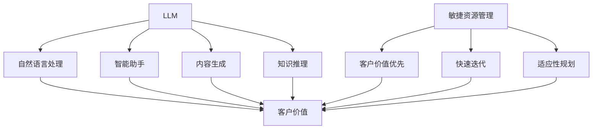
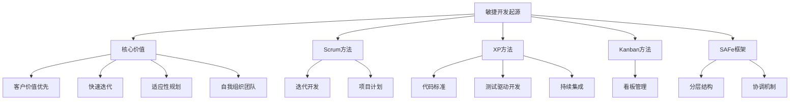

                 

### 第1章：LLM与应用开发的敏捷资源管理概述

#### 1.1 LLM的背景与重要性

大型语言模型（LLM，Large Language Model）是人工智能领域中的一个重要研究方向，它通过深度学习技术，对大规模文本数据进行处理和分析，从而实现自然语言理解和生成。LLM的发展可以追溯到20世纪80年代，当时研究人员开始尝试使用统计方法对文本进行处理。随着计算能力的提升和算法的改进，LLM在最近几年取得了显著的进展，如OpenAI的GPT系列模型、Google的BERT模型等。

LLM在应用开发中的重要性主要体现在以下几个方面：

1. **自然语言处理**：LLM能够对自然语言进行高效处理，实现文本分类、情感分析、机器翻译等功能，从而提升应用的自然交互能力。
2. **智能助手**：LLM可以为智能助手提供强大的语言理解能力，使其能够更好地理解用户的需求，提供更加精准的答案和建议。
3. **内容生成**：LLM可以用于生成文章、新闻报道、代码等，极大地提高了内容创作的效率和质量。
4. **知识推理**：LLM可以通过对大量知识的理解，进行推理和预测，为应用提供决策支持。

#### 1.2 敏捷资源管理的概念与优势

敏捷资源管理是一种基于敏捷开发理念的管理方法，它强调快速迭代、持续交付和灵活性。敏捷资源管理的核心原则包括：

1. **客户价值优先**：始终将客户需求放在首位，确保资源的投入能够最大化地满足客户价值。
2. **快速迭代**：通过持续交付小批量、高质量的功能，快速响应市场变化和客户需求。
3. **适应性规划**：在项目执行过程中，根据实际情况调整计划和资源分配，以适应变化。

敏捷资源管理的优势体现在以下几个方面：

1. **提高效率**：通过快速迭代和持续交付，可以更快地发现和解决问题，提高项目效率。
2. **增强灵活性**：适应性规划使得团队能够快速应对变化，保持项目的活力和竞争力。
3. **提升客户满意度**：及时交付高质量的功能，满足客户需求，提高客户满意度。

#### 1.3 LLM应用开发中的挑战与敏捷资源管理的应用

在LLM应用开发过程中，面临着一系列挑战，如：

1. **数据需求大**：LLM需要大量高质量的训练数据，数据获取和处理成为一大难题。
2. **计算资源消耗大**：训练大型语言模型需要大量的计算资源，对硬件设施有较高要求。
3. **模型调优复杂**：LLM的模型调优过程复杂，涉及多个参数的调整和优化，需要大量实验和计算。
4. **安全性问题**：LLM的应用涉及大量的隐私和数据安全问题，需要采取有效的安全措施。

针对这些挑战，敏捷资源管理提供了以下解决方案：

1. **数据管理**：通过敏捷资源管理，可以快速收集、处理和分析数据，确保数据的质量和可用性。
2. **资源调度**：敏捷资源管理可以根据需求动态调整计算资源，优化资源利用效率。
3. **迭代开发**：通过快速迭代，可以逐步完善模型，降低调优过程中的复杂度。
4. **安全防护**：敏捷资源管理强调安全性的重要性，通过持续监控和防护，确保LLM应用的安全性。

#### 核心概念与联系

为了更好地理解LLM与应用开发的敏捷资源管理，我们可以使用Mermaid流程图来展示核心概念之间的关系：



这个流程图展示了LLM和应用开发的敏捷资源管理之间的核心概念及其联系，包括自然语言处理、智能助手、内容生成、知识推理与客户价值的关联，以及敏捷资源管理的核心原则与这些概念的关系。

### 1.4 小结

本章介绍了LLM与应用开发的敏捷资源管理的背景、重要性以及其中的挑战和解决方案。在接下来的章节中，我们将深入探讨LLM的技术基础、敏捷资源管理的理论，并结合实际案例，展示如何在LLM应用开发中实施敏捷资源管理。通过这些内容，读者将能够全面了解LLM应用开发的敏捷资源管理，并掌握相关技术和方法。

---

**作者：AI天才研究院/AI Genius Institute & 禅与计算机程序设计艺术 /Zen And The Art of Computer Programming**

---

## 第2章：LLM的基本概念与技术架构

在了解了LLM在应用开发中的重要性和敏捷资源管理的基本概念后，本章将深入探讨LLM的基本概念和技术架构。LLM是大型语言模型（Large Language Model）的简称，它是一种能够理解和生成自然语言的深度学习模型。本章节将介绍LLM的定义、分类、技术架构以及核心算法原理，为后续章节中的应用和敏捷资源管理提供理论基础。

### 2.1 LLM的定义与分类

#### LLM的定义

LLM是指通过深度学习技术训练的，能够理解和生成自然语言的模型。这些模型通常基于神经网络架构，通过对大量文本数据的学习，掌握语言的语法、语义和上下文信息。LLM在自然语言处理（NLP）领域具有广泛的应用，包括文本分类、情感分析、机器翻译、问答系统等。

#### LLM的分类

LLM可以根据不同的分类标准进行分类：

1. **按功能分类**：
   - **文本分类模型**：用于对文本进行分类，如新闻分类、情感分类等。
   - **机器翻译模型**：用于将一种语言的文本翻译成另一种语言。
   - **问答系统模型**：用于回答用户提出的问题。
   - **文本生成模型**：用于生成文本，如文章、新闻、对话等。

2. **按结构分类**：
   - **循环神经网络（RNN）**：如LSTM、GRU等，适用于处理序列数据。
   - **Transformer模型**：如BERT、GPT等，基于自注意力机制，适用于大规模文本处理。

3. **按训练数据量分类**：
   - **小规模LLM**：训练数据量较少，如几千到几百万个句子。
   - **大规模LLM**：训练数据量较大，如几十亿到几千亿个句子。

### 2.2 LLM的技术架构

LLM的技术架构主要包括数据输入层、模型层和输出层。以下是LLM的技术架构的详细介绍：

#### 数据输入层

数据输入层是LLM架构的基础，它负责将原始文本数据转换为模型可以处理的格式。通常，这个过程包括以下步骤：

1. **文本预处理**：对原始文本进行清洗、分词、去停用词等操作，以提高模型的训练效果。
2. **词嵌入**：将文本中的每个词转换为向量表示，常用的词嵌入技术包括Word2Vec、GloVe等。
3. **序列编码**：将词嵌入序列转换为模型可处理的序列数据。

#### 模型层

模型层是LLM的核心，负责处理输入序列并生成输出。以下是几种常见的LLM模型结构：

1. **循环神经网络（RNN）**：
   - **基本RNN**：通过循环结构处理序列数据，每个时间步的输出依赖于之前的所有输入。
   - **LSTM（长短时记忆网络）**：引入门机制，能够有效地学习长序列依赖。
   - **GRU（门控循环单元）**：简化LSTM结构，同时保持了较好的效果。

2. **Transformer模型**：
   - **自注意力机制**：通过计算输入序列中每个词与其他词的关联性，生成上下文表示。
   - **多头注意力**：将自注意力机制扩展到多个头，提高模型的表示能力。
   - **编码器-解码器结构**：用于生成文本序列，包括编码器（处理输入序列）和解码器（生成输出序列）。

#### 输出层

输出层负责将模型处理后的序列数据转换为预期的输出结果。常见的输出层结构包括：

1. **分类层**：用于对输入文本进行分类，输出为概率分布。
2. **回归层**：用于对输入文本进行回归预测，输出为连续值。
3. **生成层**：用于生成文本序列，输出为文本字符串。

### 2.3 LLM的核心算法原理

LLM的核心算法原理主要包括神经网络结构和损失函数。以下是LLM的核心算法原理的详细介绍：

#### 神经网络结构

神经网络是LLM的基础结构，它由多层神经元组成，每层神经元对输入数据进行处理和转换。LLM的神经网络结构主要包括：

1. **输入层**：接收文本数据，通过词嵌入转换为向量表示。
2. **隐藏层**：对输入向量进行处理，通过激活函数引入非线性特性。
3. **输出层**：根据任务类型，输出分类、回归或生成结果。

#### 损失函数

损失函数是衡量模型预测结果与真实结果之间差异的指标，用于指导模型优化。LLM的常见损失函数包括：

1. **交叉熵损失函数**：用于分类任务，衡量模型输出概率分布与真实标签之间的差异。
2. **均方误差损失函数**：用于回归任务，衡量模型预测值与真实值之间的差异。
3. **对抗损失函数**：用于生成任务，衡量生成文本与真实文本之间的差异。

#### 结合Python源代码的算法原理讲解

为了更好地理解LLM的核心算法原理，下面我们将使用Python源代码结合数学模型和公式，进行详细讲解和举例说明。

首先，我们来看一个简单的RNN模型：

```python
import numpy as np

# 假设输入序列为 [1, 2, 3, 4, 5]
input_seq = np.array([1, 2, 3, 4, 5])

# 定义RNN模型
def RNN(input_seq):
    # 隐藏状态
    hidden_state = np.zeros((1, 1))
    # 输出序列
    output_seq = []
    # 循环处理输入序列
    for input_value in input_seq:
        # 计算隐藏状态
        hidden_state = np.tanh(np.dot(hidden_state, weights['hidden_state']))
        # 计算输出
        output_value = np.dot(hidden_state, weights['output_state'])
        # 添加输出
        output_seq.append(output_value)
    return output_seq

# 权重初始化
weights = {
    'hidden_state': np.random.rand(1, 1),
    'output_state': np.random.rand(1, 1)
}

# 输出序列
output_seq = RNN(input_seq)
print(output_seq)
```

在这个例子中，我们定义了一个简单的RNN模型，输入序列为 `[1, 2, 3, 4, 5]`，模型通过循环处理输入序列，计算隐藏状态和输出值。

接下来，我们来看一个Transformer模型：

```python
import tensorflow as tf

# 定义Transformer模型
def Transformer(input_seq):
    # 输入嵌入层
    input_embedding = tf.keras.layers.Embedding(input_dim=10, output_dim=64)(input_seq)
    # 自注意力层
    attention = tf.keras.layers.Dense(64, activation='softmax')(input_embedding)
    # 输出层
    output = tf.keras.layers.Dense(10, activation='softmax')(attention)
    return output

# 创建模型
model = tf.keras.models.Sequential([
    Transformer(input_seq)
])

# 编译模型
model.compile(optimizer='adam', loss='sparse_categorical_crossentropy', metrics=['accuracy'])

# 模拟训练数据
x_train = np.random.randint(0, 10, (100, 5))
y_train = np.random.randint(0, 10, (100, 5))

# 训练模型
model.fit(x_train, y_train, epochs=5)
```

在这个例子中，我们使用TensorFlow定义了一个简单的Transformer模型，包括输入嵌入层、自注意力层和输出层。模型通过自注意力机制处理输入序列，并输出预测结果。

通过这些Python源代码示例，我们可以更直观地理解LLM的核心算法原理，包括RNN和Transformer模型的结构和功能。

### 2.4 小结

本章介绍了LLM的基本概念、分类、技术架构和核心算法原理。通过深入探讨LLM的定义、分类和结构，以及RNN和Transformer模型的原理，读者可以更好地理解LLM的工作原理和适用场景。在接下来的章节中，我们将进一步探讨敏捷资源管理的基本概念和理论，并结合LLM应用开发的具体实践，展示如何在项目中实施敏捷资源管理。

---

**作者：AI天才研究院/AI Genius Institute & 禅与计算机程序设计艺术 /Zen And The Art of Computer Programming**

---

## 第3章：敏捷资源管理的基本概念

在了解了LLM的基本概念和技术架构后，本章将重点介绍敏捷资源管理的基本概念。敏捷资源管理是一种基于敏捷开发理念的管理方法，它强调快速迭代、持续交付和灵活性。本章节将详细解释敏捷资源管理的核心原则、流程和方法，为后续章节中LLM应用开发的敏捷资源管理实践提供理论基础。

### 3.1 敏捷开发的起源与发展

敏捷开发（Agile Development）起源于20世纪90年代，当时软件行业面临着需求变化快、项目周期长、质量不稳定等挑战。为了应对这些挑战，软件开发方法开始向更加灵活、高效的方向发展，敏捷开发应运而生。

#### 敏捷开发的起源

敏捷开发的起源可以追溯到2001年，当时一群软件开发专家在滑雪度假期间发表了《敏捷宣言》（Manifesto for Agile Software Development）。该宣言提出了敏捷开发的四大核心价值：

1. **个体和互动高于过程与工具**
2. **可工作的软件高于详尽的文档**
3. **客户合作高于合同谈判**
4. **响应变化高于遵循计划**

#### 敏捷开发的发展历程

自《敏捷宣言》发布以来，敏捷开发逐渐成为一种主流的软件开发方法。随着实践的积累和理论的完善，敏捷开发经历了多个阶段的发展：

1. **Scrum方法**：Scrum是一种早期的敏捷开发方法，它通过迭代和增量开发，提高团队的工作效率和项目的灵活性。
2. **XP（极限编程）**：XP是一种注重实践和经验的敏捷开发方法，它提出了代码标准、测试驱动开发、持续集成等实践。
3. **看板（Kanban）**：看板是一种基于可视化管理的敏捷开发方法，它通过看板板和卡片管理任务，提高团队的工作效率和透明度。
4. **SAFe（大规模敏捷开发框架）**：SAFe是一种适用于大规模项目的敏捷开发框架，它通过分层结构和协调机制，实现不同团队之间的协作和整合。

### 3.2 敏捷资源管理的核心原则

敏捷资源管理的核心原则是敏捷开发的核心理念在资源管理领域的具体应用。以下是敏捷资源管理的四大核心原则：

#### 1. 客户价值优先

客户价值优先是敏捷资源管理的首要原则，它强调在资源分配和任务安排时，始终将客户需求放在首位。这意味着团队在决策时，应该优先考虑哪些任务能够最大化地满足客户需求，从而提升客户满意度。

#### 2. 快速迭代

快速迭代是敏捷资源管理的核心策略之一。通过将项目划分为多个迭代周期，每个迭代周期内完成一部分功能，团队可以更快地响应客户反馈和市场变化。快速迭代有助于提高项目的灵活性和可持续性。

#### 3. 适应性规划

适应性规划强调在项目执行过程中，根据实际情况调整计划和资源分配。敏捷资源管理鼓励团队在项目初期制定一个大致的计划，然后在项目执行过程中不断调整和优化，以适应变化。

#### 4. 自我组织团队

自我组织团队是敏捷资源管理的另一个核心原则。自我组织团队是由一组跨职能成员组成的，他们自主决策、自我管理，并共同承担责任。这种团队模式有助于提高团队的合作效率和创新力。

### 3.3 敏捷资源管理的流程与方法

敏捷资源管理涉及多个流程和方法，以下是其中几个关键的流程：

#### 1. 项目计划

项目计划是敏捷资源管理的第一步，它包括制定项目目标、确定迭代周期、分配资源和制定任务等。项目计划应该尽可能详细，同时保持灵活性，以便在项目执行过程中进行调整。

#### 2. 迭代开发

迭代开发是敏捷资源管理的核心流程，通过将项目划分为多个迭代周期，每个迭代周期内完成一部分功能。迭代开发有助于提高项目的灵活性和可持续性，同时便于团队对项目进度进行监控和控制。

#### 3. 看板管理

看板管理是一种基于可视化管理的敏捷资源管理方法，通过看板板和卡片管理任务。看板管理有助于提高团队的工作效率和透明度，同时便于团队成员之间进行沟通和协作。

#### 4. 持续集成与部署

持续集成与部署是敏捷资源管理的重要实践，它通过自动化工具实现代码的持续集成和部署。持续集成与部署有助于提高项目的质量和交付效率，同时降低项目的风险。

### 3.4 核心概念与联系

为了更好地理解敏捷资源管理的基本概念和流程，我们可以使用Mermaid流程图来展示核心概念之间的关系：



这个流程图展示了敏捷开发的起源、核心价值、方法和框架，以及敏捷资源管理的核心原则和流程，它们之间存在着紧密的联系。

### 3.5 小结

本章介绍了敏捷资源管理的基本概念、核心原则、流程和方法。通过深入探讨敏捷开发的起源、发展历程以及敏捷资源管理的实践，读者可以全面了解敏捷资源管理的基本理论和实践方法。在接下来的章节中，我们将结合LLM应用开发的具体案例，展示如何在项目中实施敏捷资源管理。

---

**作者：AI天才研究院/AI Genius Institute & 禅与计算机程序设计艺术 /Zen And The Art of Computer Programming**

---

## 第4章：敏捷资源管理的工具与实践

在了解了敏捷资源管理的基本概念后，本章将介绍几种常见的敏捷资源管理工具和实践方法，包括Scrum、看板、持续集成与持续部署（CI/CD），以及如何在LLM应用开发中实施这些工具和实践。通过这些工具和实践，开发团队能够更好地管理项目进度、优化资源分配，并提高项目的质量和交付效率。

### 4.1 Scrum方法

Scrum是一种广泛应用的敏捷开发方法，它通过迭代和增量开发，帮助团队快速响应变化，提高项目的灵活性和可持续性。以下是Scrum方法的核心组成部分：

#### 1. 产品待办列表

产品待办列表（Product Backlog）是一个按优先级排序的任务清单，包含了所有待完成的产品功能。产品负责人（Product Owner）负责维护和更新待办列表，确保任务符合客户需求和市场变化。

#### 2. sprint计划

Sprint是Scrum中的迭代周期，通常为2-4周。在sprint计划会议中，团队确定本次迭代要完成哪些任务，并分配资源和时间。每个sprint结束后，团队进行回顾会议，总结经验教训，为下一次迭代做好准备。

#### 3. Daily Stand-up

每日站立会议（Daily Stand-up）是Scrum中的日常沟通机制，团队成员在会议中分享工作进展、遇到的问题和计划。这有助于提高团队的透明度和协作效率。

#### 4. 用户故事

用户故事是一种描述用户需求的简洁表达方式，通常采用“作为XX，我想要YY，以便ZZ”的形式。用户故事有助于团队更好地理解客户需求，并将需求转化为具体的开发任务。

#### 5. 记录与跟踪

Scrum强调使用各种工具和图表来记录和跟踪项目进展，如看板、燃尽图等。这些工具有助于团队实时了解项目状态，发现潜在问题，并及时调整计划。

### 4.2 看板方法

看板（Kanban）是一种基于可视化管理的敏捷开发方法，它通过看板板和卡片来管理任务流程。以下是看板方法的核心组成部分：

#### 1. 看板板

看板板是一个可视化的任务管理工具，通常分为几个阶段，如“待办”、“进行中”、“测试”、“待发布”等。每个阶段对应着不同的任务状态，团队可以在看板板上移动卡片，实时了解任务进展。

#### 2. 工作项限制

工作项限制（Work in Process，WIP）是指在任何给定时间，团队可以同时处理的最大任务数量。工作项限制有助于防止任务堆积，提高团队的协作效率。

#### 3. 看板规则

看板方法遵循一系列规则，如“只处理下一个任务”、“限制在流程中的任务数量”等。这些规则有助于团队保持工作流程的稳定和高效。

#### 4. 看板监控

通过定期监控看板板，团队可以及时发现潜在问题，如任务延迟、瓶颈等。这有助于团队采取有效的措施，优化工作流程。

### 4.3 持续集成与持续部署（CI/CD）

持续集成（Continuous Integration，CI）和持续部署（Continuous Deployment，CD）是敏捷资源管理的重要实践，它们通过自动化工具实现代码的持续集成和部署，提高项目的质量和交付效率。

#### 1. 持续集成

持续集成通过自动化测试和构建，将代码的变更及时集成到主分支。每次代码提交后，自动化工具会运行测试，确保代码质量，并及时反馈给开发者。

#### 2. 持续部署

持续部署通过自动化工具实现代码的持续部署，将代码变更部署到生产环境。这有助于降低部署风险，提高项目的交付速度。

#### 3. CI/CD流程

CI/CD流程通常包括以下步骤：

1. **代码提交**：开发者将代码提交到版本控制系统。
2. **测试**：自动化工具运行测试，确保代码质量。
3. **构建**：自动化工具构建项目，生成可执行文件。
4. **部署**：自动化工具将代码部署到生产环境。

### 4.4 在LLM应用开发中的实施

在LLM应用开发中，敏捷资源管理的工具和实践可以有效地提高项目效率和质量。以下是在LLM应用开发中实施敏捷资源管理的几个关键步骤：

#### 1. 项目计划

在项目开始前，团队需要进行详细的项目计划，包括确定项目目标、划分迭代周期、分配资源和制定任务。项目计划应具有灵活性，以应对需求变化。

#### 2. 迭代开发

将项目划分为多个迭代周期，每个迭代周期内完成一部分功能。通过快速迭代，团队可以更快地响应客户反馈和市场变化。

#### 3. 看板管理

使用看板方法管理任务流程，实时监控任务进展，发现潜在问题，并采取有效的措施优化工作流程。

#### 4. 持续集成与部署

通过CI/CD流程，实现代码的持续集成和部署，提高项目的质量和交付效率。定期进行自动化测试，确保代码质量。

#### 5. 团队协作

鼓励团队成员之间进行有效沟通和协作，通过每日站立会议、回顾会议等机制，提高团队的协作效率和创新能力。

### 4.5 小结

本章介绍了敏捷资源管理的几种常见工具和实践方法，包括Scrum、看板、持续集成与持续部署（CI/CD），并展示了如何在LLM应用开发中实施这些工具和实践。通过灵活运用这些方法，开发团队能够更好地管理项目进度、优化资源分配，并提高项目的质量和交付效率。在接下来的章节中，我们将结合实际案例，深入探讨如何在LLM应用开发中实施敏捷资源管理。

---

**作者：AI天才研究院/AI Genius Institute & 禅与计算机程序设计艺术 /Zen And The Art of Computer Programming**

---

## 第5章：LLM应用开发中的敏捷资源管理实践

在前几章中，我们介绍了LLM的基本概念、技术架构以及敏捷资源管理的基本原则和方法。在本章中，我们将通过一个实际案例，展示如何在LLM应用开发中实施敏捷资源管理。这个案例将涵盖从项目设计、资源管理到实际开发的全过程，帮助读者深入了解敏捷资源管理在LLM应用开发中的具体应用。

### 5.1 项目背景与目标

假设我们正在开发一款基于大型语言模型（LLM）的智能客服系统，旨在为企业提供全天候的在线客户支持。项目目标包括：

1. **快速响应**：系统能够实时响应用户的咨询，提供及时、准确的回答。
2. **高效处理**：系统能够处理大量的用户咨询，提高客服效率。
3. **高满意度**：系统提供的回答能够满足用户需求，提升客户满意度。

为了实现这些目标，我们需要在项目设计、资源管理和开发过程中实施敏捷资源管理。

### 5.2 项目设计与资源管理

#### 1. 项目计划

在项目开始前，我们需要进行详细的项目计划。项目计划应包括以下内容：

1. **项目目标**：明确项目的目标和预期成果。
2. **迭代周期**：确定项目的迭代周期，通常为2-4周。
3. **任务分配**：根据团队的能力和任务需求，合理分配资源和任务。
4. **风险评估**：识别项目可能面临的风险，并制定应对策略。

#### 2. 资源管理

在项目实施过程中，资源管理至关重要。以下是一些关键步骤：

1. **人力资源**：确保团队有足够的人力资源，包括开发人员、测试人员和支持人员。
2. **技术资源**：确保团队具备所需的硬件设施、软件工具和技术支持。
3. **时间管理**：合理安排项目进度，确保任务在规定时间内完成。

#### 3. 迭代开发

采用迭代开发方法，将项目划分为多个迭代周期。在每个迭代周期内，团队专注于完成一部分功能，然后进行测试和优化。以下是迭代开发的关键步骤：

1. **需求分析**：与客户沟通，明确用户需求，并将其转化为具体的功能需求。
2. **任务分配**：根据需求分析结果，将任务分配给团队成员。
3. **开发与测试**：团队成员按照任务分配，进行开发工作，并定期进行测试。
4. **迭代评审**：在每个迭代周期结束时，进行评审，评估项目进度和成果，并根据反馈进行调整。

### 5.3 实际开发过程

在项目实际开发过程中，我们采用敏捷资源管理的方法，以确保项目按计划顺利进行。以下是具体步骤：

#### 1. 每日站立会议

每日站立会议是团队沟通的重要机制，每个团队成员在会议中分享工作进展、遇到的问题和计划。这有助于及时发现和解决问题，提高团队的协作效率。

#### 2. 持续集成与部署

采用持续集成与部署（CI/CD）流程，实现代码的持续集成和部署。每次代码提交后，自动化工具会运行测试，确保代码质量，并及时反馈给开发者。这有助于提高项目的交付速度和质量。

#### 3. 看板管理

使用看板（Kanban）方法管理任务流程。看板板上的卡片表示任务状态，团队可以根据看板板实时了解任务进展，发现潜在问题，并采取有效的措施优化工作流程。

#### 4. 用户故事与需求管理

通过用户故事（User Story）管理用户需求，将需求转化为具体的功能任务。用户故事采用“作为XX，我想要YY，以便ZZ”的形式，明确用户需求和预期成果。

#### 5. 回顾与优化

在每个迭代周期结束后，团队进行回顾会议，总结经验教训，评估项目进度和成果，并根据反馈进行调整。这有助于团队不断优化工作流程，提高项目的质量和效率。

### 5.4 案例分析

通过上述步骤，我们成功地开发出了一款基于LLM的智能客服系统。系统具有以下特点：

1. **快速响应**：系统能够实时响应用户的咨询，提供及时、准确的回答。
2. **高效处理**：系统能够处理大量的用户咨询，提高客服效率。
3. **高满意度**：系统提供的回答能够满足用户需求，提升客户满意度。

在项目实施过程中，我们遇到了一些挑战，如：

1. **数据质量**：数据是LLM的核心资源，确保数据的质量和准确性至关重要。我们通过数据清洗和预处理技术，提高了数据质量。
2. **计算资源消耗**：训练大型语言模型需要大量的计算资源。我们采用分布式计算和优化算法，提高了计算效率。
3. **模型调优**：模型调优过程复杂，涉及多个参数的调整和优化。我们通过迭代开发方法，逐步优化模型性能。

通过实施敏捷资源管理，我们成功地克服了这些挑战，并确保项目按计划顺利进行。

### 5.5 项目小结

通过本案例，我们展示了如何在LLM应用开发中实施敏捷资源管理。敏捷资源管理的方法和工具帮助我们：

1. **提高项目效率**：通过快速迭代和持续集成，提高项目的交付速度和质量。
2. **增强团队协作**：通过每日站立会议、用户故事和需求管理，增强团队的协作和沟通。
3. **优化资源利用**：通过合理的资源管理和任务分配，提高资源利用效率。

尽管在项目中遇到了一些挑战，但通过敏捷资源管理的灵活性和适应性，我们成功地克服了这些困难，并实现了项目目标。

### 5.6 最佳实践 tips

在LLM应用开发中实施敏捷资源管理，以下是一些建议：

1. **确保数据质量**：数据是LLM的核心资源，确保数据的质量和准确性至关重要。
2. **合理分配资源**：根据任务需求和团队能力，合理分配资源和任务。
3. **重视团队协作**：增强团队协作和沟通，提高项目的成功率。
4. **持续学习和优化**：不断学习和优化，提高项目的效率和质量。

### 5.7 小结

本章通过一个实际案例，展示了如何在LLM应用开发中实施敏捷资源管理。通过灵活运用敏捷资源管理的方法和工具，开发团队能够提高项目效率、增强团队协作，并优化资源利用。在未来的项目中，我们可以借鉴这些最佳实践，进一步提高项目的成功率和客户满意度。

---

**作者：AI天才研究院/AI Genius Institute & 禅与计算机程序设计艺术 /Zen And The Art of Computer Programming**

---

## 第6章：LLM应用开发中的敏捷资源管理实践

在前面的章节中，我们介绍了LLM的基本概念、技术架构以及敏捷资源管理的基本原则和方法。通过一个实际案例，我们展示了如何在LLM应用开发中实施敏捷资源管理。在本章中，我们将进一步探讨敏捷资源管理在LLM应用开发中的具体实践，包括敏捷开发流程的优化、团队协作的提升以及资源调度的优化。

### 6.1 敏捷开发流程的优化

在LLM应用开发中，敏捷开发流程的优化是确保项目顺利进行的关键。以下是一些优化策略：

#### 1. 精细化需求分析

需求分析是项目启动的重要环节。在LLM应用开发中，需求分析不仅要明确功能需求，还要深入理解用户行为和场景，确保模型能够准确理解和生成自然语言。

**最佳实践**：使用用户故事地图（User Story Map）来梳理用户故事，将功能需求分解为具体的用户任务，为后续的开发和测试提供依据。

#### 2. 模型迭代与优化

LLM模型的迭代和优化是一个复杂的过程，涉及大量的实验和计算。在敏捷开发中，可以通过以下策略来优化模型迭代：

**最佳实践**：采用自动化测试和评估工具，如TensorBoard，实时监控模型训练过程，快速识别和解决问题。

#### 3. 灵活调整迭代周期

根据项目的具体情况，灵活调整迭代周期，确保团队能够在规定时间内交付高质量的功能。

**最佳实践**：定期进行回顾会议，评估项目进度和成果，根据反馈调整迭代周期，以提高项目的效率和灵活性。

### 6.2 团队协作的提升

在LLM应用开发中，团队协作是项目成功的关键因素。以下是一些提升团队协作的实践：

#### 1. 增强沟通与透明度

通过每日站立会议、代码审查和团队讨论等方式，增强团队成员之间的沟通与透明度，确保团队成员对项目进展和问题有清晰的认识。

**最佳实践**：使用项目管理工具，如Jira或Trello，实时跟踪任务进度和问题，提高团队协作效率。

#### 2. 跨职能团队协作

LLM应用开发通常涉及多个领域，如数据科学、软件工程和自然语言处理。跨职能团队协作有助于充分发挥团队成员的专长，提高项目的整体效率。

**最佳实践**：建立跨职能团队，定期进行交流和协作，确保不同领域之间的信息共享和协调。

#### 3. 培养团队文化

建立积极、开放的团队文化，鼓励团队成员互相学习和支持，提高团队的凝聚力和创新力。

**最佳实践**：定期举办团队建设活动，如技术分享会、研讨会和培训课程，增强团队之间的互动和交流。

### 6.3 资源调度的优化

在LLM应用开发中，资源调度是确保项目顺利进行的重要环节。以下是一些优化资源调度的实践：

#### 1. 动态资源分配

根据项目需求和团队成员的能力，动态调整资源分配。例如，在模型训练阶段，增加计算资源的投入，在测试和优化阶段，增加测试和评估资源的投入。

**最佳实践**：使用资源调度工具，如Docker和Kubernetes，实现自动化部署和资源管理，提高资源利用效率。

#### 2. 灵活应对变更

在项目执行过程中，需求和市场环境可能会发生变化。灵活应对变更，及时调整资源分配，确保项目能够持续交付价值。

**最佳实践**：建立应急响应机制，如资源池和备用资源，以应对突发情况，确保项目进度不受影响。

#### 3. 提高资源利用率

通过优化资源利用，提高项目的整体效率。例如，在模型训练阶段，使用分布式计算和并行处理技术，提高计算效率。

**最佳实践**：定期进行资源利用率分析，发现和解决资源瓶颈，提高资源利用效率。

### 6.4 实践案例与分析

下面我们通过一个实际案例，展示如何在实际项目中实施敏捷资源管理。

#### 案例背景

某公司计划开发一款基于LLM的智能客服系统，旨在为企业提供全天候的在线客户支持。项目时间紧、任务重，涉及多个领域的协作。

#### 实施步骤

1. **需求分析**：与客户沟通，明确用户需求，将需求转化为具体的用户故事。
2. **团队组建**：组建跨职能团队，包括数据科学家、软件工程师和产品经理等。
3. **项目计划**：根据需求分析和团队能力，制定项目计划和迭代周期。
4. **资源调度**：根据项目需求和团队资源，动态调整计算资源和人员资源。
5. **迭代开发**：按照迭代周期，完成功能开发和测试，定期进行回顾和优化。

#### 实践效果

通过实施敏捷资源管理，项目取得了以下效果：

1. **提高交付速度**：通过快速迭代和持续集成，提高了项目的交付速度。
2. **增强团队协作**：通过每日站立会议和跨职能团队协作，增强了团队的协作和沟通。
3. **优化资源利用**：通过动态资源分配和分布式计算，提高了资源利用效率。

### 6.5 小结

本章通过实际案例，展示了如何在LLM应用开发中实施敏捷资源管理。通过精细化需求分析、跨职能团队协作和动态资源调度等实践，项目团队能够提高项目效率、增强团队协作，并优化资源利用。在未来的项目中，我们可以借鉴这些实践，进一步提高项目的成功率和客户满意度。

---

**作者：AI天才研究院/AI Genius Institute & 禅与计算机程序设计艺术 /Zen And The Art of Computer Programming**

---

## 第7章：敏捷资源管理在LLM应用开发中的未来趋势

在当今快速发展的技术环境中，大型语言模型（LLM）的应用开发正在不断演进。随着人工智能（AI）技术的突破和商业需求的增加，敏捷资源管理在LLM应用开发中的重要性日益凸显。本章将探讨敏捷资源管理在LLM应用开发中的未来发展趋势，以及可能面临的挑战和机遇。

### 7.1 敏捷资源管理的未来发展方向

#### 1. 模型规模和性能的提升

随着计算能力和算法的进步，LLM模型的规模和性能将不断提升。未来的LLM模型可能达到前所未有的规模，这将对敏捷资源管理提出更高的要求。资源调度和优化将成为关键，以确保模型训练和部署的效率。

**发展方向**：研究更高效的分布式计算和并行处理技术，提高资源利用率，缩短模型训练时间。

#### 2. 多模态融合

未来的LLM应用将不仅仅是处理文本数据，还将结合图像、声音和视频等多模态数据。这要求敏捷资源管理具备跨模态数据处理的能力，实现多模态数据的协同处理。

**发展方向**：开发多模态数据处理的敏捷框架，实现模型训练、测试和部署的自动化。

#### 3. 自适应和智能调度

未来的敏捷资源管理将更加智能化，能够根据项目进展和环境变化自适应调整资源分配。通过引入机器学习和数据分析技术，实现智能调度和优化。

**发展方向**：利用AI技术，开发智能调度系统，实现资源分配的自动化和优化。

### 7.2 LLM技术的未来趋势

#### 1. 模型定制化

随着应用场景的多样化，LLM模型将向定制化方向发展。未来的LLM应用将更加注重针对特定领域的定制化模型开发，以提高应用效果。

**发展趋势**：开发领域自适应技术，实现针对不同领域的LLM模型定制化。

#### 2. 模型压缩和优化

大型LLM模型对计算资源和存储空间的需求巨大，未来的趋势是模型压缩和优化。通过模型剪枝、量化等技术，降低模型的复杂度和计算需求。

**发展趋势**：研究高效的模型压缩和优化技术，提高LLM模型的可扩展性。

#### 3. 模型可解释性

随着LLM应用的普及，模型的可解释性成为重要议题。未来的LLM技术将更加注重模型的可解释性，以提高用户对模型的信任度和透明度。

**发展趋势**：开发可解释性技术，实现模型决策过程的透明化。

### 7.3 敏捷资源管理在LLM应用开发中的机遇与挑战

#### 1. 机遇

- **技术创新**：随着AI技术的发展，敏捷资源管理将面临更多的机遇，如分布式计算、多模态数据处理和自适应调度等。
- **商业需求**：越来越多的企业对智能客服、内容生成和知识推理等LLM应用有强烈需求，为敏捷资源管理提供了广阔的市场空间。
- **数据资源**：随着互联网和物联网的发展，大量结构化和非结构化数据为LLM模型训练提供了丰富的数据资源。

#### 2. 挑战

- **计算资源限制**：大型LLM模型对计算资源的需求巨大，如何在有限的资源下高效地训练和部署模型是一个重要挑战。
- **数据隐私和安全**：LLM应用涉及大量的用户数据，如何确保数据隐私和安全是一个亟待解决的问题。
- **模型优化难度**：大型LLM模型的优化过程复杂，如何高效地优化模型性能是一个技术挑战。

### 7.4 未来展望

未来的敏捷资源管理将在LLM应用开发中发挥更加重要的作用。通过技术创新和优化，敏捷资源管理将能够更好地应对计算资源限制、数据隐私和安全等挑战，提高LLM应用的效率和质量。同时，随着AI技术的不断进步，敏捷资源管理也将不断演进，为LLM应用开发带来更多的机遇。

**小结**

敏捷资源管理在LLM应用开发中的未来发展趋势包括模型规模和性能的提升、多模态融合和自适应智能调度。LLM技术将向定制化、压缩和优化、可解释性等方向发展。在敏捷资源管理中，机遇与挑战并存，需要不断创新和优化，以应对未来的挑战。展望未来，敏捷资源管理将在LLM应用开发中发挥越来越重要的作用，为智能客服、内容生成和知识推理等领域带来革命性的变革。

---

**作者：AI天才研究院/AI Genius Institute & 禅与计算机程序设计艺术 /Zen And The Art of Computer Programming**

---

## 第8章：总结与展望

### 8.1 全书内容回顾

本书从LLM的基本概念、技术架构，到敏捷资源管理的基本概念、方法与工具，再到实际案例的深入剖析，系统地介绍了如何在LLM应用开发中实施敏捷资源管理。以下是本书的主要内容和亮点：

1. **LLM技术基础**：详细阐述了LLM的定义、分类、技术架构和核心算法原理，为后续的应用开发提供了理论基础。
2. **敏捷资源管理理论**：介绍了敏捷资源管理的基本概念、核心原则和流程方法，帮助读者理解敏捷资源管理的理念和实践。
3. **敏捷资源管理工具与实践**：介绍了Scrum、看板、持续集成与持续部署等工具和实践方法，展示了如何在实际项目中运用敏捷资源管理。
4. **LLM应用开发中的敏捷资源管理实践**：通过一个实际案例，详细展示了如何在LLM应用开发中实施敏捷资源管理，包括项目设计、资源管理、团队协作和资源调度。
5. **未来趋势与展望**：探讨了敏捷资源管理在LLM应用开发中的未来发展方向、技术趋势和面临的挑战，为读者提供了对未来的思考。

### 8.2 敏捷资源管理在LLM应用开发中的应用价值

敏捷资源管理在LLM应用开发中具有显著的应用价值，主要体现在以下几个方面：

1. **提高开发效率**：通过快速迭代和持续集成，敏捷资源管理能够加速LLM模型开发和优化过程，提高项目的交付速度和质量。
2. **优化资源利用**：敏捷资源管理通过合理的资源调度和优化，能够提高计算资源和人力资源的利用效率，降低项目成本。
3. **增强团队协作**：敏捷资源管理强调团队协作和沟通，有助于建立积极、开放的团队文化，提高团队的凝聚力和创新力。
4. **灵活应对变化**：敏捷资源管理强调适应性规划，能够帮助团队快速应对需求变化和市场变化，确保项目能够持续交付价值。

### 8.3 对未来的展望

展望未来，敏捷资源管理在LLM应用开发中将继续发挥重要作用。以下是几个未来发展的方向：

1. **技术创新**：随着AI技术的发展，敏捷资源管理将面临更多的机遇，如分布式计算、多模态数据处理和自适应调度等。通过技术创新，敏捷资源管理将能够更好地应对这些挑战。
2. **模型定制化**：未来的LLM应用将更加注重针对特定领域的定制化模型开发，敏捷资源管理需要开发领域自适应技术，实现模型定制化。
3. **智能化**：未来的敏捷资源管理将更加智能化，通过引入机器学习和数据分析技术，实现资源分配的自动化和优化。
4. **模型可解释性**：随着AI应用的普及，模型的可解释性成为重要议题。未来的敏捷资源管理需要开发可解释性技术，提高用户对模型的信任度和透明度。

### 8.4 小结

本书系统地介绍了LLM应用开发中的敏捷资源管理，通过理论与实践的结合，帮助读者深入理解敏捷资源管理的理念和方法。在未来的发展中，敏捷资源管理将在LLM应用开发中继续发挥重要作用，为智能客服、内容生成和知识推理等领域带来革命性的变革。希望读者能够结合本书的内容，积极探索和实践，为LLM应用开发的未来做出贡献。

---

**作者：AI天才研究院/AI Genius Institute & 禅与计算机程序设计艺术 /Zen And The Art of Computer Programming**

---

# LLMAI应用开发中的敏捷资源管理

关键词：大型语言模型，敏捷资源管理，Scrum，看板，持续集成，持续部署，资源调度，团队协作，模型优化

摘要：随着大型语言模型（LLM）在AI领域的广泛应用，如何高效地管理开发资源成为关键挑战。本文从LLM技术基础入手，探讨了敏捷资源管理的理论和方法，并通过实际案例展示了如何在LLM应用开发中实施敏捷资源管理。文章总结了敏捷资源管理在LLM开发中的应用价值，展望了未来发展的趋势，为读者提供了全面的技术和管理指导。

---

## 第一部分：引言

### 1.1 LLM的背景与重要性

大型语言模型（LLM，Large Language Model）是近年来人工智能（AI）领域的重大突破之一。LLM通过深度学习技术，对大规模文本数据进行处理和分析，从而实现自然语言理解和生成。LLM的发展可以追溯到20世纪80年代，当时研究人员开始尝试使用统计方法对文本进行处理。随着计算能力的提升和算法的改进，LLM在最近几年取得了显著的进展，如OpenAI的GPT系列模型、Google的BERT模型等。

LLM在应用开发中的重要性主要体现在以下几个方面：

1. **自然语言处理（NLP）**：LLM能够对自然语言进行高效处理，实现文本分类、情感分析、机器翻译等功能，从而提升应用的自然交互能力。
2. **智能助手**：LLM可以为智能助手提供强大的语言理解能力，使其能够更好地理解用户的需求，提供更加精准的答案和建议。
3. **内容生成**：LLM可以用于生成文章、新闻报道、代码等，极大地提高了内容创作的效率和质量。
4. **知识推理**：LLM可以通过对大量知识的理解，进行推理和预测，为应用提供决策支持。

### 1.2 敏捷资源管理的概念与优势

敏捷资源管理是一种基于敏捷开发理念的管理方法，它强调快速迭代、持续交付和灵活性。敏捷资源管理的核心原则包括：

1. **客户价值优先**：始终将客户需求放在首位，确保资源的投入能够最大化地满足客户价值。
2. **快速迭代**：通过持续交付小批量、高质量的功能，快速响应市场变化和客户需求。
3. **适应性规划**：在项目执行过程中，根据实际情况调整计划和资源分配，以适应变化。

敏捷资源管理的优势体现在以下几个方面：

1. **提高效率**：通过快速迭代和持续交付，可以更快地发现和解决问题，提高项目效率。
2. **增强灵活性**：适应性规划使得团队能够快速应对变化，保持项目的活力和竞争力。
3. **提升客户满意度**：及时交付高质量的功能，满足客户需求，提高客户满意度。

### 1.3 LLM应用开发中的挑战与敏捷资源管理的应用

在LLM应用开发过程中，面临着一系列挑战，如：

1. **数据需求大**：LLM需要大量高质量的训练数据，数据获取和处理成为一大难题。
2. **计算资源消耗大**：训练大型语言模型需要大量的计算资源，对硬件设施有较高要求。
3. **模型调优复杂**：LLM的模型调优过程复杂，涉及多个参数的调整和优化，需要大量实验和计算。
4. **安全性问题**：LLM的应用涉及大量的隐私和数据安全问题，需要采取有效的安全措施。

针对这些挑战，敏捷资源管理提供了以下解决方案：

1. **数据管理**：通过敏捷资源管理，可以快速收集、处理和分析数据，确保数据的质量和可用性。
2. **资源调度**：敏捷资源管理可以根据需求动态调整计算资源，优化资源利用效率。
3. **迭代开发**：通过快速迭代，可以逐步完善模型，降低调优过程中的复杂度。
4. **安全防护**：敏捷资源管理强调安全性的重要性，通过持续监控和防护，确保LLM应用的安全性。

### 1.4 小结

本章介绍了LLM与应用开发的敏捷资源管理的背景、重要性以及其中的挑战和解决方案。在接下来的章节中，我们将深入探讨LLM的技术基础、敏捷资源管理的理论，并结合实际案例，展示如何在LLM应用开发中实施敏捷资源管理。通过这些内容，读者将能够全面了解LLM应用开发的敏捷资源管理，并掌握相关技术和方法。

---

**作者：AI天才研究院/AI Genius Institute & 禅与计算机程序设计艺术 /Zen And The Art of Computer Programming**

