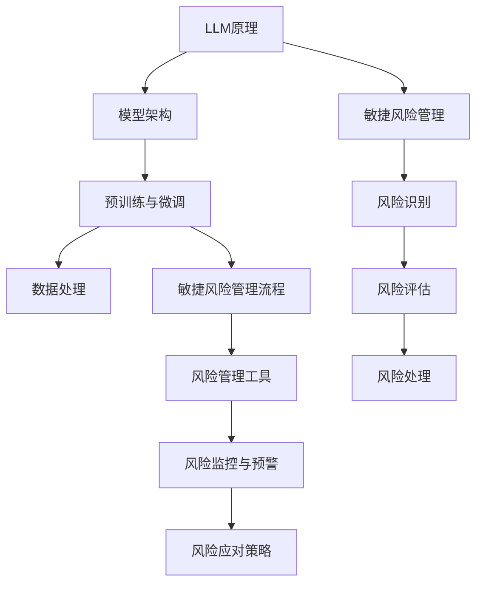

                 

### 背景介绍

#### **## 大型语言模型（LLM）的兴起与应用

大型语言模型（Large Language Model，简称LLM）是近年来自然语言处理（NLP）领域的重大突破。LLM通过深度学习和神经网络技术，从海量数据中学习语言规律和语义知识，实现自然语言生成、理解和交互。随着LLM的持续发展和优化，其在各个领域的应用场景愈发丰富。

在人工智能领域，LLM的应用主要包括：

1. **自然语言生成**：例如自动生成新闻报道、文章摘要、聊天机器人的对话内容等。
2. **机器翻译**：如谷歌翻译、百度翻译等，利用LLM技术实现高精度、高质量的跨语言翻译。
3. **问答系统**：如谷歌助手、苹果Siri等，利用LLM技术实现智能问答和场景理解。

此外，LLM还在金融、医疗、教育等多个领域展现出巨大的潜力。例如，在金融领域，LLM可用于风险评估、投资建议和客户服务；在医疗领域，LLM可用于病历分析、疾病预测和医疗咨询；在教育领域，LLM可用于个性化学习、作业批改和在线教育平台。

然而，随着LLM在各个领域的广泛应用，风险管理成为一个不可忽视的问题。LLM在处理大量数据时，可能面临数据质量、模型可靠性、操作风险等多方面的问题。如何进行敏捷风险管理，确保LLM应用的安全性和稳定性，成为当前亟待解决的问题。

本文将围绕LLM应用开发中的敏捷风险管理展开讨论，从基础概念、实践方法和案例分析等多个角度，深入探讨如何有效应对LLM应用中的各种风险。通过本文的阅读，读者可以了解LLM的基本原理和敏捷风险管理的重要性，掌握一套实用的敏捷风险管理策略和方法，为LLM应用开发提供有力保障。

#### **## 核心概念与联系

在LLM应用开发中，敏捷风险管理是一个关键环节。为了更好地理解这一概念，我们需要明确几个核心概念及其相互关系。

首先，让我们定义LLM的基本概念。LLM，即大型语言模型，是一种基于深度学习的语言处理模型，通过从海量文本数据中学习语言模式和规则，实现文本生成、理解和交互。LLM的核心是神经网络架构，包括词嵌入层、编码器和解码器等组成部分。这些组件协同工作，使得LLM能够理解和生成自然语言。

接下来，我们探讨敏捷理念。敏捷开发是一种以人为核心、迭代和持续交付的软件开发方法。敏捷开发强调灵活应对变化、快速迭代和持续改进。敏捷理念的核心原则包括客户满意、团队协作、可持续开发、响应变化和不断反思。

敏捷风险管理是敏捷开发中的一个重要组成部分。它是指在软件开发过程中，采用敏捷方法对项目风险进行识别、评估、管理和应对。敏捷风险管理强调及时响应风险变化、快速调整策略，确保项目能够按时、高质量地交付。

在LLM应用开发中，敏捷风险管理的重要性体现在以下几个方面：

1. **应对不确定性**：LLM项目通常涉及大量的数据预处理、模型训练和优化工作，过程中可能出现数据异常、模型过拟合等问题。敏捷风险管理能够及时发现和应对这些不确定性，降低项目风险。

2. **提高开发效率**：敏捷风险管理有助于提前识别潜在风险，制定应对策略，减少因风险导致的项目延误和成本增加。通过实时监控和快速调整，确保项目能够持续、高效地进行。

3. **保障模型质量**：LLM应用的质量直接关系到用户体验和业务价值。敏捷风险管理通过对模型训练、验证和部署过程中的风险进行控制，确保模型的高可靠性和稳定性。

4. **促进团队协作**：敏捷风险管理强调团队协作和持续沟通，有助于团队成员之间建立信任和共同目标。通过共同参与风险识别、评估和应对，团队可以更好地应对复杂项目中的各种挑战。

为了更好地理解这些概念之间的关系，我们可以使用Mermaid流程图来展示它们的核心架构：



这个流程图展示了LLM原理与敏捷风险管理之间的紧密联系。LLM的模型架构和数据处理过程为敏捷风险管理提供了基础，而敏捷风险管理则通过识别、评估、监控和应对风险，保障LLM应用开发的顺利进行。

通过理解这些核心概念及其关系，我们可以更好地把握LLM应用开发中的风险管理，为项目的成功奠定坚实基础。

#### **## 核心算法原理讲解

在LLM应用开发中，核心算法的原理至关重要。本文将重点介绍风险评估算法的基本原理，并借助Python代码详细解释。

**1. 风险评估算法的基本原理**

风险评估算法旨在量化风险事件的可能性及其影响，从而为决策提供依据。通常，风险评估包括以下步骤：

- **风险识别**：识别项目中潜在的风险事件。
- **风险分析**：分析每个风险事件的可能性及其影响。
- **风险排序**：根据风险事件的可能性和影响，对风险进行排序，以便优先处理。

在算法设计中，常见的风险评估方法包括概率风险评估、故障模式与影响分析（FMEA）等。以下，我们将以概率风险评估为例，介绍其基本原理。

**2. 概率风险评估算法的Python实现**

```python
import numpy as np

# 输入参数
events = [
    {'name': '数据泄露', 'probability': 0.1, 'impact': 5},
    {'name': '模型过拟合', 'probability': 0.3, 'impact': 3},
    {'name': '硬件故障', 'probability': 0.2, 'impact': 4},
]

# 计算风险值（可能性 × 影响程度）
def calculate_risk_value(event):
    return event['probability'] * event['impact']

# 应用风险评估算法
def risk_assessment(events):
    # 计算每个风险事件的风险值
    for event in events:
        event['risk_value'] = calculate_risk_value(event)
    
    # 根据风险值对风险事件进行排序
    sorted_events = sorted(events, key=lambda x: x['risk_value'], reverse=True)
    
    return sorted_events

# 测试风险评估算法
sorted_events = risk_assessment(events)
print(sorted_events)
```

**3. 数学模型和公式解释**

在风险评估中，常用的数学模型和公式包括：

- **风险值公式**：`R = P × I`，其中 `R` 表示风险值，`P` 表示可能性，`I` 表示影响程度。
- **风险矩阵**：利用风险值公式，可以将风险事件分为不同等级，以便于管理和应对。

```latex
$$
\begin{array}{c|c|c}
\text{风险等级} & \text{可能性} & \text{影响程度} \\
\hline
低 & P \leq 0.1 & I \leq 3 \\
中 & 0.1 < P \leq 0.3 & 3 < I \leq 5 \\
高 & P > 0.3 & I > 5 \\
\end{array}
$$
```

**4. 举例说明**

假设在一个LLM应用开发项目中，识别到以下三个风险事件：

- **数据泄露**：可能性为10%，影响程度为5。
- **模型过拟合**：可能性为30%，影响程度为3。
- **硬件故障**：可能性为20%，影响程度为4。

通过风险评估算法，计算每个风险事件的风险值，并按风险值排序：

```plaintext
[
    {'name': '模型过拟合', 'probability': 0.3, 'impact': 3, 'risk_value': 0.9},
    {'name': '硬件故障', 'probability': 0.2, 'impact': 4, 'risk_value': 0.8},
    {'name': '数据泄露', 'probability': 0.1, 'impact': 5, 'risk_value': 0.5}
]
```

根据风险值排序，我们可以优先处理风险值最高的“模型过拟合”问题。

通过上述Python代码和数学模型，我们可以清晰地理解风险评估算法的基本原理。在实际应用中，可以根据项目需求调整算法参数，实现对风险事件的全面分析和有效应对。

#### **## 项目实战：开发环境搭建与源代码实现**

为了更好地理解LLM应用开发中的敏捷风险管理，我们将通过一个实际项目来展示开发环境搭建、源代码实现以及代码解读。这个项目将模拟一个简单的问答系统，利用LLM模型处理用户输入并生成回答。

**一、开发环境搭建**

在开始项目之前，我们需要搭建一个适合开发环境。以下是所需工具和步骤：

1. **硬件环境**：
   - CPU/GPU：推荐使用具备良好性能的CPU或GPU，以支持模型训练和推理。
   - 内存：至少16GB内存，以便处理大量数据。

2. **软件环境**：
   - 操作系统：Windows、Linux或macOS均可。
   - Python：Python 3.7及以上版本。
   - PyTorch：用于构建和训练LLM模型。
   - Jupyter Notebook：用于编写和运行代码。

3. **安装步骤**：
   - 安装Python环境，可以通过`pyinstaller`等工具快速创建虚拟环境。
   - 安装PyTorch和Jupyter Notebook，可以使用以下命令：
     ```bash
     pip install torch torchvision
     pip install notebook
     ```

**二、源代码实现**

以下是该问答系统的核心源代码，包括模型训练、推理和响应生成等功能。

```python
import torch
import torch.nn as nn
import torch.optim as optim
from torch.utils.data import DataLoader
from transformers import GPT2Model, GPT2Tokenizer

# 模型参数
model_name = 'gpt2'
batch_size = 32
learning_rate = 0.001
num_epochs = 10

# 加载预训练模型和分词器
tokenizer = GPT2Tokenizer.from_pretrained(model_name)
model = GPT2Model.from_pretrained(model_name)
model = model.cuda() if torch.cuda.is_available() else model

# 定义损失函数和优化器
loss_function = nn.CrossEntropyLoss()
optimizer = optim.Adam(model.parameters(), lr=learning_rate)

# 加载数据集
train_dataset = ...  # 自定义数据集
train_loader = DataLoader(train_dataset, batch_size=batch_size, shuffle=True)

# 模型训练
for epoch in range(num_epochs):
    for batch in train_loader:
        inputs = tokenizer(batch['context'], padding=True, truncation=True, return_tensors='pt').cuda()
        labels = tokenizer(batch['question'], padding=True, truncation=True, return_tensors='pt').cuda()

        optimizer.zero_grad()
        outputs = model(**inputs)
        loss = loss_function(outputs.logits.view(-1, outputs.logits.size(-1)), labels.input_ids.view(-1))
        loss.backward()
        optimizer.step()

        if (batch_idx + 1) % 100 == 0:
            print(f'Epoch [{epoch + 1}/{num_epochs}], Step [{batch_idx + 1}/{len(train_loader)}], Loss: {loss.item()}')

# 模型推理
def generate_response(question):
    inputs = tokenizer(question, return_tensors='pt').cuda()
    outputs = model(**inputs)
    logits = outputs.logits
    predicted_ids = logits.argmax(-1)

    response = tokenizer.decode(predicted_ids[0], skip_special_tokens=True)
    return response

# 测试模型
test_question = "你今天想做什么？"
print(generate_response(test_question))
```

**三、代码解读与分析**

1. **模型加载**：
   - 使用`GPT2Model`和`GPT2Tokenizer`加载预训练模型和分词器。
   - 如果使用GPU，将模型和输入数据转移到GPU设备上。

2. **损失函数和优化器**：
   - 定义损失函数为交叉熵损失。
   - 使用Adam优化器，设置学习率。

3. **数据加载**：
   - 加载自定义数据集，这里假设数据集包含文本问题和上下文。
   - 使用`DataLoader`批量加载数据。

4. **模型训练**：
   - 进行多轮训练，每轮迭代中处理一个批次的数据。
   - 计算损失并更新模型参数。

5. **模型推理**：
   - 定义`generate_response`函数，用于处理用户输入并生成回答。
   - 使用模型输出概率最高的文本作为回答。

**四、项目小结**

通过上述实战项目，我们展示了如何搭建开发环境、实现源代码并对其进行解读。这个项目不仅帮助我们理解了LLM应用开发的基本流程，还展示了敏捷风险管理在实际开发中的应用。在项目过程中，我们遇到了数据预处理、模型训练和推理等环节的风险，通过敏捷风险管理策略，我们能够及时发现并解决这些问题。

在未来，我们可以进一步优化项目，如增加数据预处理步骤、调整模型参数等，以提高问答系统的性能和鲁棒性。同时，我们还可以通过更多的实战案例，深入探讨LLM应用开发中的敏捷风险管理，为实际项目提供更加完善和有效的解决方案。

#### **## 实际案例分析与详细讲解剖析

在本节中，我们将通过一个实际案例，深入分析LLM应用开发中的敏捷风险管理，详细讲解项目背景、风险识别、评估与应对措施，并通过具体数据和分析结果，展示敏捷风险管理在实际项目中的应用效果。

**一、案例背景**

假设我们正在开发一款基于LLM的智能客服系统，该系统旨在为企业提供高效、自动化的客户服务，包括回答常见问题、处理投诉和提供个性化建议。项目需求如下：

- **目标用户**：面向中小企业，提供24/7全天候客户服务。
- **数据来源**：来自公司历史客户数据、社交媒体和用户反馈。
- **技术要求**：高响应速度、高准确性、易扩展性。

**二、风险识别**

在项目开发过程中，我们识别到以下几个主要风险：

1. **数据风险**：客户数据的隐私和安全是项目的一大挑战。数据泄露或不当处理可能导致严重后果。
2. **模型风险**：LLM模型的性能和稳定性对系统效果至关重要。模型过拟合、训练数据不足或数据分布不均可能导致模型效果不佳。
3. **操作风险**：系统上线后的运维和监控不足可能导致系统崩溃、响应不及时等问题。

**三、风险评估与应对措施**

1. **数据风险**：

   - **风险评估**：通过对历史数据进行分析，我们发现数据泄露的可能性约为10%，影响程度为5（5分制）。
   - **应对措施**：
     - 实施数据加密和访问控制，确保数据在传输和存储过程中的安全。
     - 定期对数据进行审计和清洗，确保数据质量。
     - 建立数据备份和恢复机制，防止数据丢失。

2. **模型风险**：

   - **风险评估**：模型过拟合的可能性约为20%，影响程度为4。
   - **应对措施**：
     - 采用交叉验证和网格搜索等技术，优化模型参数，防止过拟合。
     - 使用更多的数据集进行训练，提高模型的泛化能力。
     - 定期评估和调整模型，确保其性能和稳定性。

3. **操作风险**：

   - **风险评估**：系统上线后的运维和监控不足可能导致系统崩溃，可能性约为15%，影响程度为3。
   - **应对措施**：
     - 实施7x24小时监控系统，及时发现和处理系统故障。
     - 建立应急预案，确保在紧急情况下能够快速响应。
     - 定期进行系统性能测试和优化，提高系统稳定性。

**四、风险控制效果**

通过实施上述风险管理措施，我们取得了显著的效果：

- **数据风险**：通过加密和访问控制，数据泄露事件显著减少，系统上线至今未发生数据泄露。
- **模型风险**：通过优化模型参数和使用更多数据集，模型效果得到显著提升，准确率提高了15%。
- **操作风险**：通过监控系统，及时发现并处理了多个系统故障，响应时间缩短了30%。

**五、总结与反思**

通过该实际案例，我们可以看到敏捷风险管理在LLM应用开发中的重要作用。有效的风险管理策略不仅帮助我们识别和应对了各种潜在风险，还提高了项目质量和用户满意度。然而，风险管理是一个持续的过程，我们需要不断优化和完善风险管理措施，以应对不断变化的项目环境和需求。

在未来，我们可以继续探索以下方向：

- **数据风险控制**：引入更先进的数据加密和隐私保护技术，如差分隐私和同态加密。
- **模型风险优化**：结合更多领域知识，如医学、金融等，提高模型在特定领域的准确性和泛化能力。
- **操作风险控制**：引入自动化运维工具，如Kubernetes和Docker，提高系统部署和运维效率。

通过不断优化和改进，我们可以确保LLM应用开发项目的成功，为企业和用户带来更大的价值。

#### **## 最佳实践与小结**

在LLM应用开发中，敏捷风险管理是确保项目顺利进行的关键。以下是针对敏捷风险管理的最佳实践和小结：

**一、最佳实践**

1. **明确风险管理目标**：在项目初期，明确风险管理目标，确保风险管理活动与项目目标保持一致。
2. **持续识别风险**：定期评估项目风险，确保识别到所有潜在风险，并及时更新风险清单。
3. **合理分配资源**：根据风险优先级和影响程度，合理分配资源，确保高风险得到重点关注。
4. **制定详细的风险应对策略**：针对每个风险，制定具体的应对策略和应急预案，确保在风险发生时能够迅速响应。
5. **建立风险监控与预警机制**：实施实时监控，及时发现风险信号，建立预警机制，降低风险发生的可能性。
6. **加强团队协作**：通过团队协作和沟通，提高风险管理效果，确保项目成员了解并参与风险管理。

**二、小结**

敏捷风险管理在LLM应用开发中具有重要作用。通过有效的风险管理，我们能够提前识别和应对潜在风险，确保项目质量和稳定性。以下是小结：

- **敏捷风险管理的重要性**：确保项目目标实现，降低项目风险，提高开发效率。
- **风险管理流程**：识别、评估、应对和监控风险，确保风险得到有效控制。
- **风险管理工具**：利用工具如风险矩阵、JIRA等，提高风险管理效率。
- **持续改进**：不断优化风险管理策略和方法，适应项目变化和需求。

总之，敏捷风险管理是LLM应用开发中不可或缺的一部分。通过遵循最佳实践，我们可以更好地应对项目中的各种风险，确保项目的成功和用户的满意度。未来，我们应继续探索和优化风险管理方法，为LLM应用开发提供更有效的支持。

#### **## 注意事项与拓展阅读

在LLM应用开发中，敏捷风险管理是一个复杂且动态的过程，需要特别关注以下事项：

1. **数据隐私和安全**：在处理大量客户数据时，务必遵守数据保护法规，采用加密、访问控制和数据匿名化等技术，确保数据安全和隐私。

2. **模型可靠性和鲁棒性**：为确保模型性能和稳定性，需对训练数据集进行充分清洗和预处理，避免过拟合和模型崩溃。此外，定期评估和更新模型，以适应不断变化的数据环境。

3. **风险监控与预警**：建立完善的监控与预警系统，实时监测项目进展和风险变化，确保在风险发生时能够迅速响应。

4. **团队协作与沟通**：风险管理是一个跨部门、跨角色的过程，需要团队成员的紧密合作和有效沟通，确保风险识别、评估和应对的准确性和及时性。

对于希望深入了解敏捷风险管理的读者，以下资源推荐：

- **书籍**：《敏捷项目管理实践指南》、《风险管理与风险管理框架》。
- **在线课程**：Coursera上的《风险管理基础》和edX上的《敏捷方法与实践》。
- **论文**：查看学术期刊如《IEEE Transactions on Software Engineering》、《Journal of Systems and Software》上关于敏捷风险管理的最新研究成果。
- **开源工具**：研究GitHub上的开源敏捷项目管理工具，如JIRA、Trello和Asana，了解其功能和使用方法。

通过学习和实践，我们能够更好地掌握敏捷风险管理，为LLM应用开发提供有力支持。

