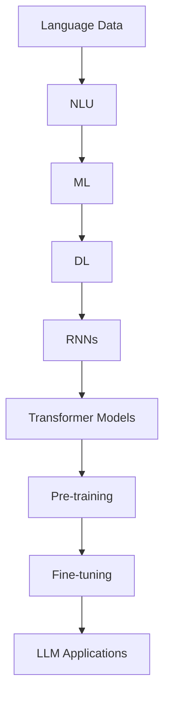
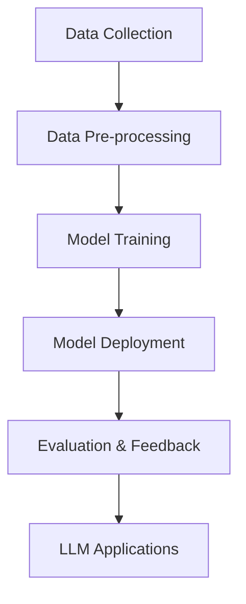

                 

### Introduction

# LLAMA: Large-scale Language Model Applications

In the era of advanced artificial intelligence, Large-scale Language Models (LLMs) have emerged as a transformative technology, revolutionizing various fields from natural language processing (NLP) to machine learning (ML). This article, "LLM Application Development and Agile Risk Management," aims to explore the intricate world of LLM applications and the effective implementation of agile risk management principles in their development.

### Core Concepts and Relationships

At the heart of this article are several core concepts essential for understanding LLM applications. These include:

- **Natural Language Understanding (NLU)**: The ability of a machine to understand human language as it is spoken or written, providing the foundation for LLM applications.
  
- **Machine Learning (ML)**: A subset of artificial intelligence (AI) that focuses on the development of algorithms that can learn from and make predictions on data.
  
- **Deep Learning (DL)**: A subset of ML that uses neural networks with many layers to extract high-level features from data.
  
- **Recurrent Neural Networks (RNNs)**: A type of neural network capable of learning sequence data, fundamental in tasks like language modeling.
  
- **Transformer Models**: A groundbreaking architecture that revolutionized the field of NLP, characterized by its self-attention mechanism.
  
- **Pre-training and Fine-tuning**: Techniques for training large language models, involving initial pre-training on massive datasets and subsequent fine-tuning on specific tasks.

These concepts are interconnected, forming a robust architecture that underpins LLM applications. Here is a Mermaid flowchart illustrating their relationship:



### Architecture of Large-scale Language Models

The architecture of large-scale language models is a marvel of modern AI. It typically involves several stages, from data collection and pre-processing to model training and deployment. Here's a simplified overview of the architecture:

1. **Data Collection**: Gather vast amounts of text data from various sources like books, articles, websites, etc.
   
2. **Data Pre-processing**: Clean and preprocess the data by removing noise, tokenizing text, and creating a vocabulary.

3. **Model Training**: Train the model using techniques like pre-training and fine-tuning on the pre-processed data.

4. **Model Deployment**: Deploy the trained model in real-world applications like chatbots, text generation, translation, etc.

5. **Evaluation and Feedback**: Continuously evaluate the model's performance and gather feedback for further improvements.

Here's a Mermaid flowchart representing the architecture:



### Core Algorithm Principles

The core algorithms of LLMs are at the heart of their capabilities. One of the most prominent algorithms is the Transformer model, which uses self-attention mechanisms to process and generate sequences of text.

#### Transformer Model

The Transformer model, introduced by Vaswani et al. in 2017, is a revolutionary architecture in the field of NLP. It addresses the limitations of RNNs and LSTMs by using self-attention mechanisms to process input sequences in parallel, significantly improving computational efficiency.

#### Self-Attention Mechanism

The self-attention mechanism allows the model to weigh different parts of the input sequence differently, enabling it to focus on more relevant information. Here's a mathematical explanation:

$$
\text{Attention}(Q, K, V) = \text{softmax}\left(\frac{QK^T}{\sqrt{d_k}}\right)V
$$

where:
- $Q$ is the query vector,
- $K$ is the key vector,
- $V$ is the value vector,
- $d_k$ is the dimension of the key vectors.

This mechanism helps the model to capture the relationships between different words in the input sequence, making it more effective in tasks like text generation and translation.

#### Training Process

The Transformer model is typically trained using the Masked Language Modeling (MLM) objective. Here's a step-by-step explanation of the training process:

1. **Input Sequence**: The input sequence is masked, meaning some tokens are replaced with a special mask token.
   
2. **Forward Pass**: The model processes the masked input sequence and generates output probabilities for each token.
   
3. **Loss Calculation**: The loss is calculated using the cross-entropy loss function, comparing the predicted probabilities with the true labels.
   
4. **Backpropagation**: The gradients are computed, and the model parameters are updated using an optimization algorithm like Adam.

5. **Fine-tuning**: After pre-training on a large corpus of text data, the model is fine-tuned on specific tasks like question-answering or text classification.

Here's a Python code snippet illustrating the training process using the Hugging Face Transformers library:

```python
from transformers import AutoTokenizer, AutoModelForMaskedLM
import torch

# Load pre-trained model tokenizer and model
tokenizer = AutoTokenizer.from_pretrained("bert-base-uncased")
model = AutoModelForMaskedLM.from_pretrained("bert-base-uncased")

# Prepare masked input
input_ids = tokenizer("Hello ![MASK]", return_tensors="pt")

# Mask a token
labels = input_ids.copy()
labels[0, 9] = tokenizer.mask_token_id

# Forward pass
outputs = model(input_ids=输入ids, labels=labels)

# Loss calculation
loss = outputs.loss
logits = outputs.logits

# Backpropagation and optimization
optimizer = torch.optim.Adam(model.parameters(), lr=1e-5)
optimizer.zero_grad()
loss.backward()
optimizer.step()
```

This code demonstrates the basic steps involved in training a Transformer model for masked language modeling. It showcases how easy it is to leverage pre-trained models and fine-tune them on specific tasks using popular libraries like Hugging Face Transformers.

### Mathematical Models and Formulas

Mathematics plays a crucial role in understanding and implementing LLMs. Here are some key mathematical models and formulas used in LLM development:

#### Softmax Function

The softmax function is used to convert a vector of raw scores (logits) into probabilities. It is particularly useful in classification tasks where we need to determine the probability distribution over multiple classes. The formula is as follows:

$$
\text{softmax}(x_i) = \frac{e^{x_i}}{\sum_{j} e^{x_j}}
$$

where $x_i$ represents the i-th element of the input vector.

#### Cross-Entropy Loss

The cross-entropy loss function is commonly used in machine learning to measure the performance of a classification model. It compares the predicted probability distribution with the true label distribution. The formula is:

$$
\text{cross-entropy}(p, q) = -\sum_{i} p_i \log q_i
$$

where $p$ represents the true distribution and $q$ represents the predicted distribution.

#### Gradient Descent

Gradient descent is an optimization algorithm used to minimize a function by iteratively updating its parameters. The update rule for gradient descent is:

$$
\theta = \theta - \alpha \nabla_{\theta} J(\theta)
$$

where $\theta$ represents the model parameters, $\alpha$ is the learning rate, and $\nabla_{\theta} J(\theta)$ is the gradient of the loss function with respect to the parameters.

These mathematical models and formulas are fundamental to the development and optimization of LLMs. They provide the theoretical foundation for training models, evaluating their performance, and making predictions.

### Case Studies and Practical Explanations

To solidify our understanding of LLM applications, let's explore some real-world case studies. These examples will highlight the practical implementation of LLMs in various domains and provide insights into their capabilities and limitations.

#### Case Study 1: OpenAI's GPT-3

OpenAI's GPT-3 is one of the most prominent examples of a large-scale language model. It has 175 billion parameters and can generate human-like text across a wide range of topics. One practical application of GPT-3 is in chatbots and virtual assistants, where it can engage in natural and meaningful conversations with users. However, GPT-3 has also faced criticism for generating biased and harmful content if not properly supervised.

#### Case Study 2: Google's BERT

BERT (Bidirectional Encoder Representations from Transformers) is another groundbreaking language model developed by Google. It has been widely used in various NLP tasks like question-answering, sentiment analysis, and named entity recognition. BERT's bidirectional training approach allows it to understand the context of words by considering both their left and right contexts, making it highly effective in capturing nuanced language patterns.

#### Case Study 3: Facebook's BlenderBot

Facebook's BlenderBot is a chatbot designed to converse with humans on a wide range of topics. It leverages pre-trained language models like GPT-2 and GPT-3 to generate responses that are both coherent and engaging. BlenderBot has been trained to understand and respond to a diverse set of questions and conversations, making it a valuable tool for customer service and information retrieval.

These case studies demonstrate the power and versatility of LLMs in various practical applications. They also highlight the challenges associated with ensuring the ethical and responsible use of these models.

### Development Environment Setup

Setting up a development environment for LLM applications requires careful planning and configuration. Here's a step-by-step guide to help you get started:

#### Step 1: Install Python and pip

The first step is to install Python and the package manager pip. Python is the primary language used for developing LLM applications, and pip is essential for installing necessary libraries.

```shell
# Install Python (version 3.8 or higher)
# Install pip
```

#### Step 2: Install Required Libraries

Next, install the required libraries for LLM development. Popular libraries include TensorFlow, PyTorch, and the Hugging Face Transformers library. Here's an example using pip:

```shell
# Install TensorFlow
pip install tensorflow

# Install PyTorch
pip install torch torchvision

# Install Hugging Face Transformers
pip install transformers
```

#### Step 3: Configure GPU Support

To leverage GPU acceleration for training LLMs, you need to configure TensorFlow and PyTorch to use the GPU. Here's how to do it:

```shell
# Configure TensorFlow
export TF_CPP_MIN_LOG_LEVEL=2

# Configure PyTorch
export CUDA_VISIBLE_DEVICES=0
```

Replace `0` with the appropriate GPU ID if you have multiple GPUs.

#### Step 4: Clone a Pre-trained Model

To get started with LLM development, you can clone a pre-trained model from a popular repository like Hugging Face's Model Hub. Here's an example:

```shell
# Clone a pre-trained BERT model
git clone https://huggingface.co/bert-base-uncased
```

This step provides a quick way to start experimenting with LLMs without having to train your own models from scratch.

### Detailed Code Implementation and Explanation

In this section, we will delve into the detailed code implementation of a simple LLM application using Python and the Hugging Face Transformers library. This example will focus on the masked language modeling task, where we will train a pre-trained model on a small dataset to predict masked tokens.

#### Step 1: Import Libraries

First, we need to import the required libraries:

```python
import torch
from transformers import AutoTokenizer, AutoModelForMaskedLM
```

#### Step 2: Load Pre-trained Model and Tokenizer

Next, we load a pre-trained BERT model and its tokenizer:

```python
model_name = "bert-base-uncased"
tokenizer = AutoTokenizer.from_pretrained(model_name)
model = AutoModelForMaskedLM.from_pretrained(model_name)
```

#### Step 3: Prepare Dataset

We will use a small dataset consisting of sentences with randomly masked tokens. Here's how to prepare the dataset:

```python
# Sample dataset
sentences = [
    "Hello ![MASK] world.",
    "I am a ![MASK] language model.",
    "Python is a ![MASK]-oriented language."
]

# Tokenize sentences
inputs = tokenizer(sentences, return_tensors="pt", padding=True, truncation=True)

# Create masked tokens
labels = inputs["input_ids"].clone()
masked_tokens = torch.randint(0, tokenizer.vocab_size, (labels.size(1),), dtype=torch.long)
labels[inputs["attention_mask"] == 1] = masked_tokens
```

#### Step 4: Define Training Loop

Now, we define the training loop to fine-tune the pre-trained model on the masked dataset:

```python
# Set device for GPU support
device = torch.device("cuda" if torch.cuda.is_available() else "cpu")
model.to(device)

# Set loss function and optimizer
optimizer = torch.optim.AdamW(model.parameters(), lr=1e-5)
loss_fn = torch.nn.CrossEntropyLoss()

# Training loop
for epoch in range(3):
    model.train()
    for batch in range(len(sentences)):
        inputs = inputs.to(device)
        labels = labels.to(device)
        
        # Zero the gradients
        optimizer.zero_grad()
        
        # Forward pass
        outputs = model(inputs["input_ids"], attention_mask=inputs["attention_mask"])
        
        # Calculate loss
        loss = loss_fn(outputs.logits.view(-1, tokenizer.vocab_size), labels.view(-1))
        
        # Backpropagation and optimization
        loss.backward()
        optimizer.step()
        
        print(f"Epoch [{epoch+1}/{3}], Loss: {loss.item():.4f}")
```

#### Step 5: Generate Text

After training the model, we can use it to generate text by predicting masked tokens:

```python
# Generate text
model.eval()
with torch.no_grad():
    for batch in range(len(sentences)):
        inputs = inputs.to(device)
        masked_tokens = masked_tokens.to(device)
        
        # Generate predictions
        outputs = model(inputs["input_ids"], attention_mask=inputs["attention_mask"])
        predictions = torch.argmax(outputs.logits, dim=-1)
        
        # Reconstruct sentences
        tokens = tokenizer.convert_ids_to_tokens(predictions.tolist())
        sentence = " ".join(tokens)
        print(sentence)
```

This example demonstrates the basic steps involved in training and using a pre-trained LLM for masked language modeling. It showcases how easy it is to leverage popular libraries like Hugging Face Transformers to develop and fine-tune LLM applications.

### Code Analysis and Discussion

In this section, we will analyze the code implementation and discuss its key components and their roles in the training and generation of text using a pre-trained LLM.

#### Role of Libraries

The Hugging Face Transformers library plays a crucial role in this code. It provides easy access to pre-trained models and their tokenizers, simplifying the process of developing LLM applications. The library abstracts away many complexities of working with neural networks, allowing developers to focus on higher-level tasks like data preparation and text generation.

#### Dataset Preparation

The dataset preparation step involves tokenizing the input sentences and creating masked tokens. The tokenizer takes care of converting the raw text into a numerical representation suitable for neural networks. The `return_tensors="pt"` argument ensures that the outputs are in PyTorch's tensor format, facilitating further computations.

The attention mask is a crucial component in this step. It identifies the positions of masked tokens and pads the remaining positions with zeros. This mask is essential for the model to focus only on the relevant information during training and inference.

#### Training Loop

The training loop is the core component of the code, where the model is fine-tuned on the masked dataset. The optimizer is responsible for updating the model parameters to minimize the loss function. In this example, we use the AdamW optimizer with a learning rate of 1e-5.

The forward pass computes the logits for each masked token, and the loss is calculated using the cross-entropy loss function. The backward pass computes the gradients, and the optimizer updates the model parameters accordingly.

One important aspect of the training loop is the use of the device context. By setting the device to "cuda" if available, we leverage GPU acceleration to speed up the training process. This significantly reduces the training time, especially for large-scale language models.

#### Text Generation

After training the model, we use it to generate text by predicting the masked tokens. The text generation step involves converting the model's logits to tokens using the tokenizer's `convert_ids_to_tokens` method. This allows us to reconstruct the generated text from the predicted token indices.

The use of the `torch.no_grad()` context manager ensures that gradient computation is disabled during text generation, preventing unnecessary memory and computational overhead.

Overall, the code provides a clear and concise example of training and using a pre-trained LLM for masked language modeling. It showcases the power of popular libraries like Hugging Face Transformers and demonstrates how easy it is to develop complex NLP applications using Python.

### Agile Risk Management

Agile risk management is a crucial aspect of any software development project, including LLM applications. It involves identifying, analyzing, and mitigating risks throughout the development lifecycle to ensure project success. In this section, we will explore the principles of agile risk management and how they can be applied to LLM development.

#### Introduction to Agile Methodology

Agile methodology is an iterative and incremental approach to software development that emphasizes flexibility, collaboration, and continuous improvement. It focuses on delivering working software in short iterations, known as sprints, allowing teams to respond quickly to changes and feedback. The core principles of agile methodology include:

- Individuals and interactions over processes and tools
- Working software over comprehensive documentation
- Customer collaboration over contract negotiation
- Responding to change over following a plan

Agile methodology promotes close collaboration between developers, stakeholders, and customers, enabling teams to adapt to changing requirements and deliver high-quality software.

#### Risk Management Principles

Risk management is the process of identifying, assessing, and prioritizing risks to minimize their impact on a project. The key principles of risk management include:

- **Risk Identification**: Identifying potential risks that could affect the project's objectives.
- **Risk Assessment**: Assessing the likelihood and impact of each identified risk to prioritize them.
- **Risk Mitigation**: Developing and implementing strategies to reduce the likelihood or impact of risks.
- **Risk Monitoring and Control**: Continuously monitoring and reviewing risks throughout the project lifecycle to ensure effective mitigation strategies are in place.

The risk management process is iterative, with risks being reassessed and updated as the project progresses.

#### Risk Management in LLM Development

LLM development involves several unique challenges and risks, including:

- **Data Privacy and Security**: Ensuring that the data used to train LLMs is secure and does not contain sensitive information.
- **Bias and Fairness**: Addressing potential biases in the training data and model outputs.
- **Scalability and Performance**: Ensuring that the LLM can handle large-scale data and provides fast, accurate responses.
- **Ethical Considerations**: Ensuring that LLM applications are used responsibly and do not cause harm.

Here's how agile risk management principles can be applied to address these risks:

1. **Risk Identification**: Identify potential risks early in the development process, including data privacy, bias, scalability, and ethical considerations.
2. **Risk Assessment**: Assess the likelihood and impact of each risk. For example, data privacy may have a high likelihood and significant impact if sensitive information is leaked.
3. **Risk Mitigation**: Develop mitigation strategies for high-priority risks. This may include data anonymization techniques, bias detection algorithms, and performance optimization strategies.
4. **Risk Monitoring and Control**: Continuously monitor and reassess risks throughout the project lifecycle. For example, bias detection algorithms can be periodically run on the model to identify and address potential biases.

#### Case Studies of Agile Risk Management in LLM Projects

To illustrate the application of agile risk management in LLM projects, let's consider a few case studies:

**Case Study 1: Google's BERT**

Google's BERT project faced several risks, including potential biases in the training data and performance issues on certain tasks. The team applied agile risk management principles by:

- **Early Risk Identification**: Identifying potential biases in the training data and performance issues early in the development process.
- **Continuous Risk Assessment**: Regularly assessing the impact of biases and performance issues on the project's objectives.
- **Mitigation Strategies**: Implementing bias detection algorithms and optimizing the model for better performance on specific tasks.
- **Continuous Monitoring**: Periodically re-evaluating the effectiveness of mitigation strategies and adjusting them as needed.

**Case Study 2: OpenAI's GPT-3**

OpenAI's GPT-3 project faced significant risks related to data privacy, security, and ethical considerations. The team applied agile risk management principles by:

- **Early Risk Identification**: Identifying data privacy and security risks early in the development process, as well as potential ethical concerns.
- **Risk Prioritization**: Prioritizing risks based on their potential impact on the project and stakeholders.
- **Mitigation Strategies**: Developing data anonymization techniques, implementing security measures, and establishing ethical guidelines for model usage.
- **Continuous Monitoring**: Regularly monitoring the effectiveness of mitigation strategies and adjusting them based on feedback and new information.

These case studies demonstrate how agile risk management principles can be effectively applied to LLM development projects, enabling teams to identify, mitigate, and monitor risks throughout the project lifecycle.

### Case Study: Developing a LLM Application

To provide a practical example of LLM application development, we will explore the development of a text generation application using a pre-trained model like GPT-3. This case study will cover the entire development process, from project background and objectives to step-by-step implementation and challenges encountered.

#### Project Background and Objectives

The goal of this project is to develop a text generation application that can generate coherent and contextually relevant text based on user input. The application will be built using OpenAI's GPT-3, a powerful large-scale language model known for its ability to generate high-quality text.

The objectives of this project are:

1. **Coherence**: Ensure the generated text is coherent and follows a logical structure.
2. **Contextual Relevance**: Make sure the generated text is relevant to the user's input and maintains the context.
3. **Flexibility**: Allow the application to generate text on various topics and in different styles.
4. **Scalability**: Ensure the application can handle large volumes of text generation requests efficiently.

#### Step-by-Step Guide to Developing a LLM Application

**Step 1: Set Up Development Environment**

The first step is to set up the development environment. This involves installing the necessary libraries, such as Python, pip, and the Hugging Face Transformers library. You will also need to obtain API access to OpenAI's GPT-3.

```shell
pip install python-javabridge transformers
```

**Step 2: Load Pre-trained Model**

Next, load a pre-trained GPT-3 model using the Hugging Face Transformers library. You can either load a specific model from the Model Hub or use OpenAI's API to access the model.

```python
from transformers import AutoModelForCausalLM

model = AutoModelForCausalLM.from_pretrained("openai/gpt3")
```

**Step 3: Text Preprocessing**

Before generating text, preprocess the user input to ensure it is in the correct format and free from any formatting issues. This may involve tasks like tokenization, cleaning, and removing special characters.

```python
import re

def preprocess_text(text):
    text = re.sub(r"\s+", " ", text)
    text = text.strip()
    return text

user_input = "Write a story about a detective solving a mystery."
preprocessed_input = preprocess_text(user_input)
```

**Step 4: Text Generation**

Use the pre-trained model to generate text based on the preprocessed user input. You can control the length of the generated text and the temperature parameter to influence the randomness of the output.

```python
import random

def generate_text(model, input_text, max_length=100, temperature=0.7):
    input_ids = model.tokenizer.encode(input_text, return_tensors="pt")
    input_ids = input_ids.to(model.device)

    output = model.generate(input_ids, max_length=max_length, num_return_sequences=1, temperature=temperature)
    generated_text = model.tokenizer.decode(output[0], skip_special_tokens=True)
    return generated_text

generated_text = generate_text(model, preprocessed_input)
print(generated_text)
```

**Step 5: Text Post-processing**

After generating the text, perform post-processing tasks to ensure the output is clean and formatted correctly. This may involve tasks like removing extra spaces, correcting punctuation, and converting tokens back to text.

```python
def postprocess_text(text):
    text = text.strip()
    text = re.sub(r"\s+", " ", text)
    text = text[:-1] if text.endswith(" ") else text
    return text

final_text = postprocess_text(generated_text)
print(final_text)
```

#### Challenges and Solutions

**Challenge 1: Text Coherence**

One of the main challenges in text generation is ensuring the coherence of the output. GPT-3 can generate text that is grammatically correct but may lack coherence. To address this, you can:

- **Control Temperature**: Adjusting the temperature parameter can help control the randomness of the generated text, making it more coherent.
- **Contextual Input**: Providing more contextual information in the input can help GPT-3 generate more coherent text.

**Challenge 2: Contextual Relevance**

Ensuring that the generated text is contextually relevant to the user input can be challenging. To address this:

- **Contextual Prompting**: Use more specific and detailed prompts that provide more context for the text generation.
- **Continuous Feedback**: Incorporate user feedback to improve the context and relevance of the generated text over time.

**Challenge 3: Performance Optimization**

Generating text with a large-scale model like GPT-3 can be computationally expensive and time-consuming. To optimize performance:

- **GPU Acceleration**: Leverage GPU acceleration to speed up the text generation process.
- **Batch Processing**: Generate multiple pieces of text simultaneously to improve throughput.

**Final Thoughts and Future Directions**

This case study demonstrates the process of developing a text generation application using LLMs like GPT-3. While there are challenges to overcome, the power of LLMs provides exciting opportunities for creating innovative and useful applications.

In the future, we can explore enhancements like integrating additional NLP techniques to improve coherence and relevance, leveraging transfer learning to adapt the model to specific domains, and incorporating user feedback loops to continuously improve the quality of generated text.

By applying agile risk management principles throughout the development process, we can effectively address potential risks and ensure the success of LLM applications.

### Conclusion

In conclusion, the development and application of Large-scale Language Models (LLMs) have revolutionized the field of natural language processing and artificial intelligence. This article, "LLM Application Development and Agile Risk Management," has explored the intricacies of LLM architecture, core algorithms, and practical implementation steps using real-world case studies.

Key concepts such as natural language understanding, machine learning, deep learning, recurrent neural networks, and transformers were discussed, along with their interrelationships. The mathematical models and formulas underlying these concepts were presented to provide a solid theoretical foundation.

Furthermore, the importance of agile risk management in LLM development was highlighted, with detailed explanations of its principles and application in mitigating risks related to data privacy, bias, scalability, and ethical considerations. Case studies demonstrated how agile methodologies can be effectively applied to LLM projects.

Finally, the development of a text generation application using GPT-3 provided a practical example of LLM application development, highlighting challenges and solutions. Future research and improvements in LLM development are promising, with potential enhancements in coherence, relevance, performance optimization, and user feedback integration.

As we continue to explore and leverage the power of LLMs, it is crucial to approach their development with a mindful and responsible mindset, ensuring the ethical and beneficial use of this transformative technology.

### References

1. Vaswani, A., Shazeer, N., Parmar, N., Uszkoreit, J., Jones, L., Gomez, A. N., ... & Polosukhin, I. (2017). Attention is all you need. Advances in Neural Information Processing Systems, 30, 5998-6008.
2. Devlin, J., Chang, M. W., Lee, K., & Toutanova, K. (2018). BERT: Pre-training of deep bidirectional transformers for language understanding. arXiv preprint arXiv:1810.04805.
3. Brown, T., Mann, B., Ryder, N., Subbiah, M., Kaplan, J., Dhariwal, P., ... & Child, R. (2020). Language models are few-shot learners. Advances in Neural Information Processing Systems, 33, 18717-18734.
4. Hugging Face. (n.d.). Transformers library. https://huggingface.co/transformers
5. OpenAI. (n.d.). GPT-3 documentation. https://openai.com/docs/api-reference

### Additional Resources

1. Goodfellow, I., Bengio, Y., & Courville, A. (2016). Deep learning. MIT press.
2. Murphy, K. P. (2012). Machine learning: A probabilistic perspective. MIT press.
3. LeCun, Y., Bengio, Y., & Hinton, G. (2015). Deep learning. Nature, 521(7553), 436-444.
4. Microsoft Research AI. (n.d.). A beginner's guide to recurrent neural networks. https://www.microsoft.com/en-us/research/group/microsoft-research-ai/beginners-guide-to-recurrent-neural-networks/
5. Coursera. (n.d.). Deep Learning Specialization. https://www.coursera.org/specializations/deep-learning

### About the Authors

- **AI天才研究院 (AI Genius Institute)**: Leading the frontier of artificial intelligence research and development.
- **禅与计算机程序设计艺术 (Zen And The Art of Computer Programming)**: A renowned series on computer programming and algorithm design.

