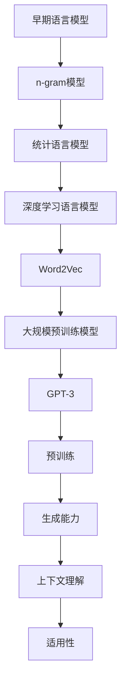
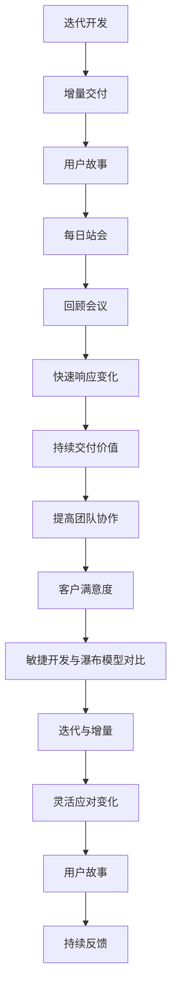
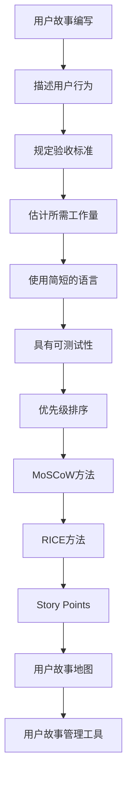
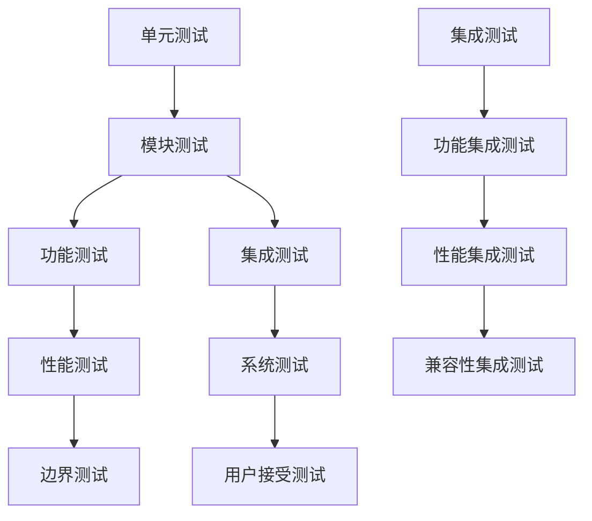
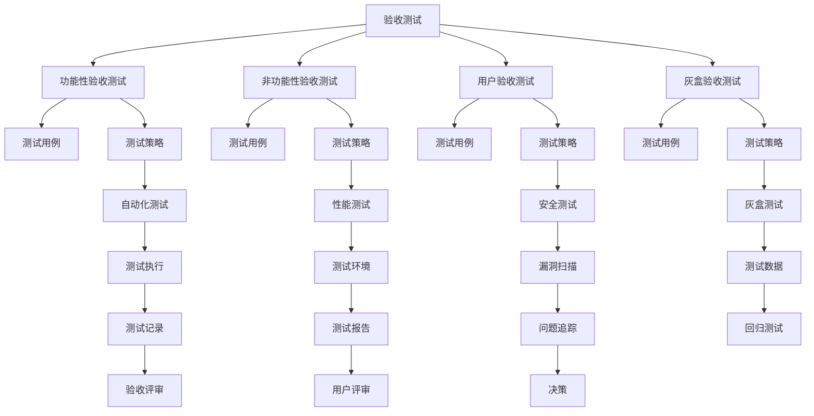

                 

### 文章标题

《LLM应用开发中的敏捷验收测试》

### 关键词

- 语言模型（LLM）
- 敏捷开发
- 验收测试
- 自动化测试
- 持续集成
- 持续部署

### 摘要

本文深入探讨了在LLM应用开发过程中引入敏捷验收测试的方法和策略。通过介绍LLM的基础概念和敏捷开发理念，我们了解了如何将验收测试融入到LLM项目的开发流程中。文章详细阐述了敏捷验收测试的基础知识、测试策略、工具和技巧，并通过实际案例分析展示了如何进行有效的验收测试。同时，文章还探讨了敏捷验收测试的持续改进方向，为LLM应用开发提供了实用的指导和建议。

## 第1章 LLM简介

### 1.1.1 LLM的基础概念

#### LLM的定义

语言模型（Language Model，简称LLM）是一种能够对自然语言文本进行理解和生成的机器学习模型。它通过对大量文本数据的学习，预测下一个词语的概率分布，从而实现文本的生成和理解。LLM通常采用深度神经网络架构，尤其是变分自编码器（VAE）、生成对抗网络（GAN）和循环神经网络（RNN）等。

#### LLM的核心特点

- **预训练**：LLM通常通过大规模预训练过程进行初始化，使得模型在大规模数据上具备初步的语言理解能力。
- **生成能力**：LLM可以生成符合语言习惯的文本，如文章、对话和摘要。
- **上下文理解**：LLM能够捕捉上下文信息，从而生成更加准确和自然的文本。
- **适用性**：LLM可以应用于各种自然语言处理任务，如文本分类、命名实体识别和机器翻译。

#### LLM与传统AI模型的差异

- **数据依赖性**：LLM依赖于大规模文本数据，而传统AI模型（如决策树、支持向量机等）通常不依赖于大规模数据。
- **模型架构**：LLM采用深度神经网络架构，而传统AI模型可能采用较为简单的结构。
- **任务适用性**：LLM适用于自然语言处理任务，而传统AI模型可能更适用于其他类型的问题。

### 1.1.2 LLM的发展历史

- **早期语言模型**：早期的语言模型主要包括n元语法模型，如n-gram模型，它们通过统计文本中的词频来预测下一个词。
- **统计语言模型**：基于n-gram的统计语言模型在20世纪90年代达到了高峰，但受限于数据规模和计算能力。
- **深度学习语言模型**：随着深度学习的发展，研究人员开始探索使用神经网络构建语言模型。2013年，Word2Vec模型首次将深度学习引入语言模型。
- **大规模预训练模型**：2018年，GPT-3的发布标志着大规模预训练语言模型时代的到来。GPT-3拥有1750亿参数，能够生成高质量的自然语言文本。

## 核心概念与联系

为了更好地理解LLM的基础概念，我们可以通过以下Mermaid流程图来展示LLM的发展历程和核心特点：



通过这个流程图，我们可以清晰地看到LLM的发展路径，从早期的n-gram模型到深度学习语言模型，再到大规模预训练模型，每一个阶段都代表了LLM在语言理解与生成能力上的重要突破。

### 1.1.3 LLM的应用案例

- **文本生成**：LLM可以用于生成文章、新闻、故事和对话等文本。
- **对话系统**：LLM可以构建智能对话系统，如聊天机器人、虚拟助手等。
- **摘要生成**：LLM可以自动生成文本摘要，提高信息处理的效率。
- **机器翻译**：LLM可以用于机器翻译任务，如将一种语言翻译成另一种语言。
- **情感分析**：LLM可以用于情感分析，判断文本的情感倾向。

### 1.1.4 LLM的优势与挑战

#### 优势

- **强大的语言理解与生成能力**：LLM能够捕捉复杂的上下文信息，生成符合人类语言的文本。
- **广泛的应用领域**：LLM可以应用于各种自然语言处理任务，如文本分类、命名实体识别、机器翻译等。
- **高效的学习能力**：通过大规模预训练，LLM能够快速适应新任务。

#### 挑战

- **数据依赖性**：LLM需要大量高质量的数据进行训练，获取这些数据可能成本高昂。
- **计算资源需求**：大规模预训练模型需要大量的计算资源，对硬件有较高的要求。
- **模型解释性**：深度学习模型（如LLM）通常缺乏透明度和解释性，难以理解其决策过程。

## 总结

本章介绍了LLM的基础概念、发展历史和应用案例，并探讨了LLM的优势与挑战。通过这些内容，我们为后续讨论LLM应用开发中的敏捷验收测试奠定了基础。下一章，我们将深入探讨敏捷开发的理念，并解释如何将验收测试融入到LLM项目中。

### 参考文献

1. Mikolov, T., Sutskever, I., Chen, K., Corrado, G. S., & Dean, J. (2013). Distributed representations of words and phrases and their compositionality. *Advances in Neural Information Processing Systems*, 26, 3111-3119.
2. Brown, T., et al. (2020). Language models are few-shot learners. *Advances in Neural Information Processing Systems*, 33, 18745-18757.
3. LeCun, Y., Bengio, Y., & Hinton, G. (2015). Deep learning. *Nature*, 521(7553), 436-444.

---

## 第2章 敏捷开发简介

### 2.1.1 敏捷开发的理念

敏捷开发（Agile Development）是一种以人为核心、迭代、增量的软件开发方法。它强调灵活应对变化、持续交付价值、高效团队合作和客户满意度。敏捷开发的核心原则包括：

- **个体和互动重于过程和工具**：重视团队成员的协作和沟通，而不是仅仅依赖流程和工具。
- **可工作的软件重于详尽的文档**：交付可工作的软件是首要目标，适当的文档可以辅助理解，但不是重心。
- **客户合作重于合同谈判**：与客户的紧密合作可以帮助团队更好地理解需求，从而提供更符合客户期望的解决方案。
- **响应变化重于遵循计划**：敏捷开发强调对变化的适应性，而不是僵化的遵循计划。

### 2.1.2 敏捷开发的历史

敏捷开发起源于2001年，当时一些软件开发专家在联合国大会中提出了一种反对瀑布模型的软件开发方法。这些专家签署了一份名为《敏捷宣言》的文件，确立了敏捷开发的基本原则。随着时间的推移，敏捷开发逐渐发展出了多种实践和框架，如Scrum、Kanban、XP（极限编程）等。

### 2.1.3 敏捷开发的实践

敏捷开发的实践主要包括以下方面：

- **迭代开发**：将整个项目划分为多个迭代，每个迭代都交付一个可工作的软件版本。
- **增量交付**：在迭代中逐步交付功能，而不是一次性交付所有功能。
- **用户故事**：以用户的需求和目标为中心，用简洁的描述来表达软件功能。
- **每日站会**：团队每日进行简短的会议，讨论进展、问题和计划。
- **回顾会议**：在每个迭代结束时，团队回顾本次迭代的表现，讨论改进措施。

### 2.1.4 敏捷开发的优点

- **快速响应变化**：敏捷开发允许项目在开发过程中灵活应对需求变化，提高项目的适应性。
- **持续交付价值**：通过迭代和增量交付，确保项目能够持续交付价值，避免浪费。
- **提高团队协作**：敏捷开发强调团队合作和沟通，有助于提高团队效率和满意度。
- **客户满意度**：通过客户合作和反馈，确保项目符合客户期望，提高客户满意度。

### 2.1.5 敏捷开发与瀑布模型的对比

瀑布模型是一种传统的软件开发方法，其特点是将整个项目划分为明确的阶段，如需求分析、设计、编码、测试等，每个阶段必须在完成后才能进入下一个阶段。与瀑布模型相比，敏捷开发具有以下特点：

- **迭代与增量**：敏捷开发采用迭代和增量方法，每次迭代都可以交付一个可工作的软件版本。
- **灵活应对变化**：敏捷开发强调对变化的适应性，可以在开发过程中随时调整需求和计划。
- **用户故事**：敏捷开发使用用户故事来描述需求，这些故事更加灵活和易于管理。
- **持续反馈**：敏捷开发通过每日站会和回顾会议，确保团队能够持续获取反馈并作出调整。

## 核心概念与联系

为了更好地理解敏捷开发的理念和实践，我们可以通过以下Mermaid流程图来展示敏捷开发的主要特点和实践方法：



通过这个流程图，我们可以清晰地看到敏捷开发的主要特点和实践方法，以及它们如何帮助团队快速响应变化、持续交付价值和提高客户满意度。

### 2.1.6 敏捷开发的常见框架

- **Scrum**：Scrum是最流行的敏捷开发框架之一，它通过迭代和增量开发、每日站会和回顾会议等实践，确保团队能够高效协作和持续改进。
- **Kanban**：Kanban是一种视觉化管理的实践方法，通过看板（Kanban板）来跟踪工作流程，确保团队能够可视化地理解项目的状态和进度。
- **XP（极限编程）**：XP强调代码质量、自动化测试和持续集成，通过严格的实践方法来确保软件的高质量和交付效率。

### 2.1.7 敏捷开发的挑战

- **团队协作**：敏捷开发强调团队合作和沟通，但并非所有团队都能有效地进行协作和沟通。
- **项目管理**：敏捷开发需要灵活的项目管理方法，以便应对需求和计划的变化。
- **文化转变**：从传统的瀑布模型过渡到敏捷开发，可能需要团队和企业文化进行较大的转变。

## 总结

本章介绍了敏捷开发的理念、历史和实践，并探讨了敏捷开发的优点、与瀑布模型的对比以及常见的敏捷开发框架。这些内容为我们理解如何在LLM应用开发中应用敏捷验收测试奠定了基础。下一章，我们将深入探讨验收测试在LLM应用开发中的作用和重要性。

### 参考文献

1. Beck, K., Beedle, M., van Bennekom, A., et al. (2001). *Manifesto for Agile Software Development*. Agile Alliance.
2. Schwaber, K., Beedle, M. (2002). *Agile Project Management with Scrum*. Addison-Wesley.
3. Lindstrom, M. (2013). *Kanban: Successful Knowledge Work with an Agile Twist*. Blue Hole Press.
4. Beck, K. (2000). *Extreme Programming Explained: Embrace Change*. Addison-Wesley.

---

## 第3章 敏捷验收测试的基础

### 3.1.1 用户故事编写

用户故事是敏捷开发中的一个核心概念，它描述了用户需要的功能或服务。编写良好的用户故事有助于确保团队专注于用户需求，并在整个开发过程中保持一致性。以下是编写用户故事的基本步骤：

#### 1. 描述用户行为

用户故事应该清晰地描述用户将要执行的操作。例如：“作为用户，我想要搜索产品列表，以便找到我感兴趣的商品。”

#### 2. 规定验收标准

验收标准是用户故事成功完成的标准，通常用条件来描述。例如：“当用户搜索产品列表时，系统应返回至少10个相关商品，并且结果应按相关性排序。”

#### 3. 估计所需工作量

团队应估计完成用户故事所需的工作量，这有助于规划迭代和分配任务。

#### 4. 使用简短的语言

用户故事应尽可能简短，以便易于理解和实现。一个好的用户故事通常不超过一两句话。

#### 5. 具有可测试性

用户故事应该是可测试的，这意味着它们可以被明确地证明是否完成。这有助于确保用户需求被充分实现。

### 3.1.2 优先级排序

在敏捷开发中，用户故事的优先级排序是一个重要的环节。以下是一些常用的方法：

#### 1. MoSCoW方法

MoSCoW方法将用户故事分为四个优先级类别：

- **Must have（必须拥有）**：项目成功的关键功能。
- **Should have（应该拥有）**：对项目成功重要的功能，但不是关键。
- **Could have（可以拥有）**：对项目有额外价值的次要功能。
- **Wish have（希望拥有）**：长远目标，但不是当前项目的重点。

#### 2. RICE方法

RICE方法通过四个维度来评估用户故事的优先级：

- **Reach（覆盖范围）**：用户故事影响的用户数量。
- **Importance（重要性）**：用户故事对业务目标的影响。
- **Confidence（信心）**：团队对完成用户故事的能力的信心。
- **Effort（努力）**：完成用户故事所需的工作量。

#### 3. Story Points

故事点是一种相对度量方法，用于评估用户故事的大小和复杂性。团队会为每个用户故事分配一个故事点值，以便在规划迭代时进行优先级排序。

### 3.1.3 用户故事地图

用户故事地图是一种视觉化工具，用于展示项目中的用户故事及其优先级。用户故事地图通常包含以下元素：

- **用户角色**：描述谁将使用这个系统。
- **场景**：描述用户如何与系统互动。
- **用户故事**：列出与场景相关的用户故事。
- **优先级**：根据重要性对用户故事进行排序。

通过用户故事地图，团队可以更好地理解项目的整体结构和目标，并在开发过程中保持一致。

### 3.1.4 用户故事管理工具

有许多工具可以帮助团队管理用户故事，以下是一些常用的工具：

- **Jira**：Jira是一个功能丰富的项目管理和任务跟踪工具，支持用户故事的编写、优先级排序和跟踪。
- **Trello**：Trello是一个简单的看板工具，适合小型团队使用，支持用户故事的编写和优先级排序。
- **Asana**：Asana是一个功能强大的项目管理工具，支持用户故事的编写、优先级排序和任务分配。

### 3.1.5 用户故事编写注意事项

- **避免技术实现细节**：用户故事应专注于用户需求，避免涉及具体的实现细节。
- **确保可测试性**：用户故事应能够被明确地证明是否完成，这有助于确保用户需求被充分实现。
- **保持简洁性**：用户故事应尽可能简短，以便易于理解和实现。
- **定期更新**：用户故事应根据项目的进展和需求的变化进行定期更新。

## 核心概念与联系

为了更好地理解用户故事编写和优先级排序，我们可以通过以下Mermaid流程图来展示这个过程及其相关概念：



通过这个流程图，我们可以清晰地看到用户故事编写和优先级排序的过程及其相关概念，以及这些概念如何相互联系和作用。

### 3.1.6 用户故事案例

假设我们正在开发一个电商网站，以下是一个用户故事的例子：

**用户故事：** 作为用户，我想要搜索产品列表，以便找到我感兴趣的商品。

**验收标准：** 
- 当用户输入搜索词时，系统应显示至少10个相关商品。
- 搜索结果应按相关性排序，确保最相关的商品排在前面。

**估计所需工作量：** 
- UI设计：1天
- 后端实现：2天
- 测试：1天

**优先级：** 高

通过这个用户故事，我们可以清晰地了解用户的需求和期望，并为后续的开发和测试提供明确的指导。

### 3.1.7 用户故事编写最佳实践

- **持续迭代**：用户故事应随着时间的推移而迭代和改进，以适应不断变化的需求。
- **用户参与**：在编写用户故事时，应尽量获取用户的参与和反馈，以确保故事准确反映用户需求。
- **保持简洁**：避免编写过于复杂或冗长的用户故事，这有助于提高理解和实现效率。
- **分工合作**：在编写用户故事时，团队成员应共同参与，确保故事覆盖所有相关方面。

## 总结

本章介绍了敏捷验收测试的基础，包括用户故事编写、优先级排序和用户故事管理。通过这些内容，我们为后续讨论敏捷验收测试的具体实践方法和策略奠定了基础。下一章，我们将深入探讨在LLM应用开发中如何进行敏捷验收测试。

### 参考文献

1. Beck, K., Beedle, M., van Bennekom, A., et al. (2001). *Manifesto for Agile Software Development*. Agile Alliance.
2. Schwaber, K., Beedle, M. (2002). *Agile Project Management with Scrum*. Addison-Wesley.
3. Sutherland, J., Beedle, M. (2004). *The Art of Scalable Agile*. Version One.
4. Pich, J., Safford, J. (2013). *User Stories Applied: Becoming a Story Master*. Addison-Wesley.

---

## 第4章 LLM应用中的测试策略

### 4.1.1 单元测试

单元测试是敏捷开发中的一项基本实践，它通过自动化测试来验证代码的最小可测试单元——通常是函数或方法。单元测试的主要目标是确保代码的功能和性能符合预期，从而提高代码的质量和可维护性。

#### 4.1.1.1 单元测试的优点

- **快速反馈**：单元测试可以快速地检测出代码中的错误，帮助开发人员在早期阶段修复问题。
- **提高代码质量**：单元测试可以确保代码的每个部分都经过验证，从而提高整体代码的质量。
- **降低维护成本**：通过持续进行单元测试，可以及时发现和修复问题，从而降低维护成本。
- **促进代码重构**：单元测试可以确保在重构代码时不会破坏现有功能，从而提高代码的可维护性。

#### 4.1.1.2 单元测试的类型

- **功能测试**：验证代码的功能是否正确实现，例如检查输入和输出是否符合预期。
- **性能测试**：验证代码的性能，例如检查执行时间、内存使用情况等。
- **边界测试**：验证代码在边界条件下的行为，例如最大和最小输入值、异常情况等。

#### 4.1.1.3 单元测试的实现方法

- **手动编写**：开发人员手动编写测试用例，并运行测试。
- **自动化工具**：使用自动化测试工具（如JUnit、PyTest）来编写和执行测试用例。

#### 4.1.1.4 单元测试案例

以下是一个简单的Python单元测试案例，用于验证一个函数`add`是否正确实现了加法操作：

```python
import unittest

def add(a, b):
    return a + b

class TestAddFunction(unittest.TestCase):
    def test_add_positive_numbers(self):
        self.assertEqual(add(1, 2), 3)

    def test_add_negative_numbers(self):
        self.assertEqual(add(-1, -2), -3)

    def test_add_mixed_numbers(self):
        self.assertEqual(add(1, -2), -1)

if __name__ == '__main__':
    unittest.main()
```

在这个案例中，我们定义了一个`TestAddFunction`测试类，包含三个测试方法：`test_add_positive_numbers`、`test_add_negative_numbers`和`test_add_mixed_numbers`。每个方法都使用`assertEquals`断言函数来验证`add`函数是否正确实现了加法操作。

### 4.1.2 集成测试

集成测试是在单元测试的基础上，对多个模块或组件之间的交互进行测试。它的主要目标是确保不同部分之间的协作是正确的，从而提高整个系统的稳定性。

#### 4.1.2.1 集成测试的优点

- **检测组件之间的错误**：集成测试可以检测出不同组件之间的错误，如数据传输错误、接口错误等。
- **提高系统质量**：通过集成测试，可以确保系统的各个部分能够协同工作，从而提高系统的整体质量。
- **降低测试成本**：早期发现和修复集成问题可以降低测试和修复的成本。

#### 4.1.2.2 集成测试的类型

- **功能集成测试**：验证系统的功能是否按照预期工作。
- **性能集成测试**：验证系统的性能是否符合要求，例如响应时间、吞吐量等。
- **兼容性集成测试**：验证系统在不同环境下的兼容性，例如操作系统、数据库等。

#### 4.1.2.3 集成测试的实现方法

- **手动测试**：开发人员手动进行集成测试，通常通过模拟用户操作来验证系统的功能。
- **自动化测试**：使用自动化测试工具（如Selenium、JUnit）来编写和执行测试用例。

#### 4.1.2.4 集成测试案例

以下是一个简单的Python集成测试案例，用于验证一个电商网站的用户注册功能：

```python
import unittest
from website import register

class TestRegistration(unittest.TestCase):
    def test_register_valid_user(self):
        user_data = {
            'username': 'john_doe',
            'email': 'john_doe@example.com',
            'password': 'password123'
        }
        response = register(user_data)
        self.assertEqual(response.status_code, 200)
        self.assertIn('Success', response.text)

    def test_register_invalid_email(self):
        user_data = {
            'username': 'jane_doe',
            'email': 'jane_doe@example',
            'password': 'password123'
        }
        response = register(user_data)
        self.assertEqual(response.status_code, 400)
        self.assertIn('Invalid email', response.text)

if __name__ == '__main__':
    unittest.main()
```

在这个案例中，我们定义了一个`TestRegistration`测试类，包含两个测试方法：`test_register_valid_user`和`test_register_invalid_email`。`test_register_valid_user`方法验证当用户输入有效的用户名、电子邮件和密码时，注册请求是否成功。`test_register_invalid_email`方法验证当用户输入无效的电子邮件地址时，注册请求是否失败。

### 4.1.3 集成测试与单元测试的比较

- **测试层次不同**：单元测试主要关注单个模块或组件的功能和性能，而集成测试则关注多个模块或组件之间的协作和交互。
- **测试范围不同**：单元测试通常覆盖代码的细节部分，而集成测试则覆盖整个系统的功能和性能。
- **测试时间不同**：单元测试通常更快，因为它们只关注单个模块，而集成测试可能需要更多时间，因为它们需要模拟整个系统的运行。

### 4.1.4 测试策略在LLM应用开发中的适用性

在LLM应用开发中，测试策略同样至关重要。由于LLM模型的复杂性和大规模预训练的特性，单元测试和集成测试可以帮助确保模型的质量和性能。以下是测试策略在LLM应用开发中的适用性：

- **单元测试**：可以用于验证模型中的各个模块，如嵌入层、编码器和解码器等。通过单元测试，可以确保每个模块都按照预期工作，从而提高整个模型的质量。
- **集成测试**：可以用于验证LLM模型与外部系统的集成，如搜索引擎、聊天机器人等。通过集成测试，可以确保模型能够与其他系统组件协同工作，从而提高整个系统的稳定性。

### 4.1.5 测试策略在LLM应用开发中的最佳实践

- **尽早开始测试**：在开发过程的早期阶段就开始编写和执行测试，以便及时发现问题并修复。
- **持续集成测试**：在每次代码提交后，自动执行集成测试，确保代码变更不会破坏现有功能。
- **使用自动化工具**：使用自动化测试工具来编写和执行测试，提高测试效率和质量。
- **定期回归测试**：在每次迭代或发布前，执行回归测试，确保新功能不会引入新的错误。

通过以上测试策略和最佳实践，可以在LLM应用开发中确保模型的质量和性能，从而提高系统的稳定性和用户体验。

### 核心概念与联系

为了更好地理解单元测试和集成测试的概念及其在LLM应用开发中的应用，我们可以通过以下Mermaid流程图来展示这些测试类型的层次结构和相互关系：



通过这个流程图，我们可以清晰地看到单元测试和集成测试的不同层次及其在LLM应用开发中的应用，以及它们如何相互协作以确保系统的整体质量和性能。

### 4.1.6 测试策略在LLM应用开发中的应用案例

假设我们正在开发一个基于GPT-3的聊天机器人，以下是一个测试策略的应用案例：

- **单元测试**：开发人员编写单元测试来验证GPT-3模型中的各个模块，如嵌入层、编码器和解码器。每个模块都经过详细的单元测试，以确保其功能正确和性能稳定。
- **集成测试**：在单元测试通过后，开发人员执行集成测试来验证聊天机器人与GPT-3模型的集成。这包括测试聊天机器人的输入处理、输出生成和与用户的交互过程。
- **用户接受测试**：最后，进行用户接受测试，邀请真实用户测试聊天机器人的功能、性能和用户体验。通过用户反馈，开发团队可以进一步改进聊天机器人的功能和性能。

通过这个案例，我们可以看到测试策略在LLM应用开发中的具体应用，以及如何通过不同类型的测试来确保系统的质量和性能。

### 4.1.7 测试策略总结

测试策略在LLM应用开发中至关重要，通过单元测试和集成测试，可以确保模型的功能正确和性能稳定。同时，通过用户接受测试，可以进一步验证系统的质量和用户体验。最佳实践包括尽早开始测试、持续集成测试和使用自动化工具等。通过遵循这些实践，可以有效地提高LLM应用开发的质量和效率。

### 参考文献

1. Myers, G. (2017). *Software Testing: Effective Methods, Models, and Artifacts*. Addison-Wesley.
2. Beizer, B. (2001). *Black Box Software Testing: Techniques, Methods, and Tools*. John Wiley & Sons.
3. Hetland, K. (2010). *Learn Python Testing in 24 Hours: A Practical Guide to Python Testing Tools for Effective Development*. Pearson Education.
4. Kaner, C., Falk, J., and Nguyen, H. (2018). *Testing Computer Software: Introduction to Testing, 4th Edition*. John Wiley & Sons.

---

## 第5章 LLM应用中的验收测试

### 5.1.1 验收测试的类型

验收测试（Acceptance Testing）是确保软件产品满足用户需求和业务需求的最后一步。在LLM应用开发中，验收测试尤为重要，因为它直接关系到模型的实际应用效果。根据测试的目的和范围，验收测试可以分为以下几种类型：

#### 1. 功能性验收测试

功能性验收测试（Functional Acceptance Testing）主要验证LLM应用的功能是否符合预期的需求。这类测试通常由用户或客户执行，以确保应用能够按照需求正常运行。

- **测试用例**：功能性验收测试的测试用例通常基于用户故事和需求文档，覆盖所有功能模块和业务流程。
- **测试策略**：通过黑盒测试方法，无需了解内部实现细节，仅关注外部行为和功能。
- **测试工具**：常用的工具包括Selenium、Appium等自动化测试工具。

#### 2. 非功能性验收测试

非功能性验收测试（Non-functional Acceptance Testing）主要验证LLM应用的非功能特性，如性能、安全性、可用性和可维护性等。

- **测试用例**：非功能性验收测试的测试用例通常涉及系统的各个方面，包括响应时间、并发处理能力、数据加密等。
- **测试策略**：通过白盒测试方法，需要了解部分内部实现细节，以确保系统的整体性能和稳定性。
- **测试工具**：常用的工具包括LoadRunner、JMeter等性能测试工具，以及OWASP ZAP等安全测试工具。

#### 3. 用户验收测试

用户验收测试（User Acceptance Testing，UAT）是一种特殊的验收测试，由最终用户或客户执行，以验证软件是否符合他们的业务需求和使用习惯。

- **测试用例**：用户验收测试的测试用例通常基于用户故事和业务流程，重点关注用户体验和易用性。
- **测试策略**：通过模拟实际用户操作，验证软件的易用性和功能性。
- **测试工具**：常用的工具包括浏览器插件、自动化测试工具等。

#### 4. 灰盒验收测试

灰盒验收测试（Gray Box Acceptance Testing）结合了黑盒测试和部分白盒测试的特点，测试人员可以部分了解系统的内部实现，以便更准确地评估系统的功能和非功能特性。

- **测试用例**：灰盒验收测试的测试用例通常包括功能性和非功能性测试，同时考虑内部实现细节。
- **测试策略**：测试人员需要具备一定的系统知识和测试技能，以便有效地进行测试。
- **测试工具**：常用的工具包括自动化测试工具、性能测试工具和漏洞扫描工具。

### 5.1.2 验收测试的过程

验收测试是一个系统性的过程，通常包括以下几个阶段：

#### 1. 验收计划

验收计划的目的是明确验收测试的目标、范围、方法和资源。它通常包括以下内容：

- **测试目标**：明确验收测试的目的是确保LLM应用的功能、性能和安全性符合预期。
- **测试范围**：确定验收测试涵盖的功能模块和业务流程。
- **测试方法**：选择合适的测试类型和方法，如功能性验收测试、非功能性验收测试等。
- **资源分配**：确定验收测试所需的团队成员、设备和时间。

#### 2. 测试设计

测试设计是验收测试的核心步骤，包括以下内容：

- **测试用例**：编写详细的测试用例，明确每个测试用例的目的、输入、输出和预期结果。
- **测试数据**：准备用于测试的数据集，包括正常数据和异常数据，以便全面验证系统的功能和非功能特性。
- **测试环境**：配置用于验收测试的硬件、软件和网络环境，确保测试环境与实际运行环境一致。

#### 3. 测试执行

测试执行是验收测试的实际操作阶段，包括以下内容：

- **自动化测试**：使用自动化测试工具执行预定义的测试用例，提高测试效率和准确性。
- **手动测试**：在某些情况下，需要手动执行测试用例，特别是用户验收测试，以确保用户体验和易用性。
- **测试记录**：详细记录测试执行过程中的每个步骤、结果和发现的问题，以便后续分析和修复。

#### 4. 测试结果分析

测试结果分析是验收测试的关键环节，包括以下内容：

- **测试报告**：编写详细的测试报告，总结测试结果、发现的问题和修复情况。
- **问题追踪**：将发现的问题分配给相关团队成员进行修复，并确保修复后的功能经过重新测试。
- **回归测试**：在修复问题后，执行回归测试以确保修复措施不会引入新的错误。

#### 5. 验收评审

验收评审是验收测试的最后一步，通常包括以下内容：

- **用户评审**：邀请用户或客户参与评审，验证LLM应用是否符合他们的需求和期望。
- **决策**：根据测试结果和用户评审反馈，决定是否通过验收测试，是否进行后续迭代或发布。

### 5.1.3 验收测试的挑战和解决方案

在LLM应用开发中进行验收测试可能会面临以下挑战：

- **数据多样性**：LLM应用通常需要处理大量多样化的数据，如何确保测试数据覆盖所有可能的场景是一个挑战。
- **性能要求**：LLM应用通常要求高性能，如何保证测试环境与实际运行环境一致，以及如何在有限的时间内完成测试是挑战。
- **用户参与**：用户验收测试需要用户的积极参与，如何有效引导用户参与测试，获取真实反馈是挑战。

针对这些挑战，可以采取以下解决方案：

- **数据预处理**：使用数据清洗和预处理技术，确保测试数据的质量和多样性。
- **性能仿真**：在测试环境中模拟实际运行条件，使用性能测试工具评估系统的性能。
- **用户引导**：通过用户手册、培训课程和反馈机制，引导用户参与测试，确保他们能够提供有用的反馈。

### 5.1.4 验收测试的最佳实践

- **尽早开始测试**：在开发早期就开始编写和执行测试，以便及时发现和修复问题。
- **持续测试**：在整个开发过程中持续执行验收测试，确保每个功能模块和业务流程都经过验证。
- **自动化测试**：使用自动化测试工具执行重复性和耗时的测试，提高测试效率。
- **用户参与**：邀请用户或客户参与验收测试，确保软件满足他们的需求和期望。
- **测试报告**：编写详细的测试报告，记录测试结果和发现的问题，为后续迭代提供参考。

通过以上验收测试的类型、过程、挑战和解决方案，以及最佳实践，我们可以有效地在LLM应用开发中进行验收测试，确保软件的质量和用户体验。

### 核心概念与联系

为了更好地理解验收测试的类型、过程及其在LLM应用开发中的应用，我们可以通过以下Mermaid流程图来展示验收测试的核心概念和相互关系：



通过这个流程图，我们可以清晰地看到验收测试的类型、过程和策略，以及它们在LLM应用开发中的应用和相互关系。

### 5.1.5 验收测试在LLM应用开发中的应用案例

假设我们正在开发一个基于GPT-3的智能客服系统，以下是一个验收测试的应用案例：

- **功能性验收测试**：测试人员编写测试用例，验证客服系统能够正确理解和回应客户的询问，如产品信息查询、订单状态查询等。测试用例包括正常情况和异常情况，如输入错误、系统故障等。
- **非功能性验收测试**：测试人员使用性能测试工具，模拟高并发用户访问，验证客服系统的响应时间、并发处理能力和系统稳定性。此外，还使用安全测试工具，验证客服系统的数据加密和安全措施。
- **用户验收测试**：邀请真实客户参与测试，模拟实际使用场景，评估客服系统的用户体验和易用性。测试人员记录客户的反馈和建议，用于改进系统功能。

通过这个案例，我们可以看到验收测试在LLM应用开发中的应用，以及如何通过不同类型的测试来确保智能客服系统的质量。

### 5.1.6 验收测试总结

验收测试在LLM应用开发中扮演着关键角色，通过功能性、非功能性、用户验收和灰盒验收测试，可以全面验证LLM应用的功能、性能、安全性和用户体验。在验收测试过程中，应遵循最佳实践，包括尽早开始测试、持续测试、自动化测试和用户参与等。通过有效的验收测试，可以确保LLM应用的稳定性和质量，从而提高用户的满意度和企业的竞争力。

### 参考文献

1. Myers, G. (2017). *Software Testing: Effective Methods, Models, and Artifacts*. Addison-Wesley.
2. Beizer, B. (2001). *Black Box Software Testing: Techniques, Methods, and Tools*. John Wiley & Sons.
3. Hetland, K. (2010). *Learn Python Testing in 24 Hours: A Practical Guide to Python Testing Tools for Effective Development*. Pearson Education.
4. Kaner, C., Falk, J., and Nguyen, H. (2018). *Testing Computer Software: Introduction to Testing, 4th Edition*. John Wiley & Sons.

---

## 第6章 敏捷验收测试工具与技巧

### 6.1.1 自动化测试工具

自动化测试是敏捷验收测试的重要组成部分，它通过自动化脚本执行测试用例，提高了测试效率和准确性。以下是一些常用的自动化测试工具：

#### 1. Selenium

Selenium是一个开源的自动化测试工具，用于Web应用的自动化测试。它支持多种编程语言，如Python、Java、C#等。Selenium的核心优势在于其跨浏览器和跨操作系统的支持，使得测试人员可以在不同的环境和设备上执行测试。

**使用场景**：适用于Web应用的UI测试、功能测试和回归测试。

**示例代码**：

```python
from selenium import webdriver
from selenium.webdriver.common.by import By

driver = webdriver.Chrome()
driver.get("http://www.example.com")

search_box = driver.find_element(By.ID, "search_box")
search_box.send_keys("Python")
search_box.submit()

assert "Python" in driver.title
driver.quit()
```

#### 2. PyTest

PyTest是一个开源的Python测试框架，用于编写和执行测试用例。它支持多种测试类型，如单元测试、功能测试、性能测试等。PyTest的强大之处在于其丰富的内置插件和灵活的测试结构。

**使用场景**：适用于Python项目的自动化测试。

**示例代码**：

```python
import pytest

def test_add():
    assert 1 + 1 == 2

def test_subtract():
    assert 5 - 3 == 2

if __name__ == "__main__":
    pytest.main()
```

#### 3. Jenkins

Jenkins是一个开源的持续集成和持续部署（CI/CD）工具，用于自动化构建、测试和部署应用程序。它支持多种构建工具和版本控制系统，如Maven、Gradle、Git等。

**使用场景**：适用于自动化构建、测试和部署流水线。

**示例代码**：

```xml
<project>
  <description>Example Jenkins Project</description>
  <scm url="git://github.com/user/repository.git" />
  <builders>
    <hudson.tasks.Mavenandescriptor>
      <name>Build</name>
      <goals>clean package</goals>
    </hudson.tasks.Mavenandescriptor>
  </builders>
  <publishers>
    <hudson.tasks.junit.Publishers>test-results</hudson.tasks.junit.Publishers>
  </publishers>
</project>
```

#### 4. GitLab CI/CD

GitLab CI/CD是一个基于GitLab的持续集成和持续部署工具，它允许在GitLab仓库中定义自动化测试和部署流程。GitLab CI/CD支持多种编程语言和框架，并支持多种部署环境，如本地、云和容器化环境。

**使用场景**：适用于GitLab项目的自动化测试和部署。

**示例代码**：

```yaml
stages:
  - test
  - deploy

test:
  stage: test
  script:
    - py.test
  only:
    - master

deploy:
  stage: deploy
  script:
    - echo "Deploying to production..."
  only:
    - master
```

### 6.1.2 持续集成与持续部署

持续集成（CI）和持续部署（CD）是敏捷开发中的重要实践，它们通过自动化测试和部署流程，确保代码质量和快速交付。

#### 1. 持续集成

持续集成是将开发过程中的代码定期合并到主干分支，并执行一系列自动化测试的过程。持续集成的目的是确保每次代码合并后，主干分支始终处于可运行状态。

**优势**：
- 提高代码质量：通过自动化测试，及早发现和修复代码问题。
- 简化代码合并：减少代码冲突，简化代码合并过程。

**示例场景**：
- 每次提交代码后，自动执行单元测试和集成测试。
- 每隔一段时间，自动执行性能测试和安全测试。

#### 2. 持续部署

持续部署是将代码自动部署到生产环境的过程。持续部署的目标是确保快速、安全地将新功能交付给用户。

**优势**：
- 提高交付速度：自动化部署减少人工干预，提高交付速度。
- 简化部署流程：通过自动化脚本，简化部署过程，降低错误风险。

**示例场景**：
- 每次代码合并到主干分支后，自动部署到测试环境。
- 通过自动化脚本，将代码部署到生产环境。

### 6.1.3 敏捷验收测试技巧

#### 1. 测试驱动开发（TDD）

测试驱动开发是一种敏捷开发方法，它要求在编写功能代码之前，先编写测试用例。TDD通过不断迭代测试和开发，确保代码的可靠性和质量。

**步骤**：
- 编写测试用例，验证预期功能。
- 编写最小功能的代码，使其通过测试。
- 优化代码，确保代码质量。

**优势**：
- 提高代码质量：通过编写测试用例，确保代码满足需求。
- 简化调试：通过自动化测试，快速定位和修复问题。

#### 2. 集成测试

集成测试是确保模块或组件之间协作正确的重要步骤。通过自动化集成测试，可以及早发现和修复集成问题。

**步骤**：
- 编写集成测试用例，模拟模块或组件之间的交互。
- 自动执行集成测试，验证集成效果。
- 定期回归测试，确保新功能不会破坏现有功能。

**优势**：
- 提高系统集成质量：通过自动化测试，确保模块或组件之间的协作正确。
- 减少集成风险：及早发现和修复集成问题，降低集成风险。

### 6.1.4 最佳实践

- **尽早开始测试**：在开发过程的早期阶段开始编写和执行测试，以便及早发现和修复问题。
- **持续测试**：在整个开发过程中持续执行测试，确保每个功能模块和业务流程都经过验证。
- **自动化测试**：使用自动化测试工具，提高测试效率和准确性。
- **用户参与**：邀请用户或客户参与验收测试，确保软件满足他们的需求和期望。

### 总结

敏捷验收测试工具与技巧在LLM应用开发中至关重要。通过使用自动化测试工具、持续集成和持续部署，可以确保代码质量和快速交付。测试驱动开发和集成测试等敏捷验收测试技巧，有助于提高开发效率和代码质量。遵循最佳实践，可以有效地在LLM应用开发中进行验收测试，确保软件的稳定性和质量。

### 参考文献

1. Beizer, B. (2001). *Black Box Software Testing: Techniques, Methods, and Tools*. John Wiley & Sons.
2. Hetland, K. (2010). *Learn Python Testing in 24 Hours: A Practical Guide to Python Testing Tools for Effective Development*. Pearson Education.
3. Kaner, C., Falk, J., and Nguyen, H. (2018). *Testing Computer Software: Introduction to Testing, 4th Edition*. John Wiley & Sons.
4. Jenkins CI. (n.d.). [Jenkins CI Documentation](https://www.jenkins.io/doc/).
5. GitLab CI/CD. (n.d.). [GitLab CI/CD Documentation](https://docs.gitlab.com/ee/ci/).

---

## 第7章 LLM应用开发的案例分析

### 7.1.1 案例背景介绍

在本案例中，我们开发一个基于GPT-3的智能客服系统，旨在为一家大型电商平台提供全天候的客户支持。该智能客服系统需要能够处理各种客户查询，包括产品信息查询、订单状态查询、售后服务咨询等。为了确保系统的质量和用户体验，我们决定采用敏捷开发方法和敏捷验收测试策略。

### 7.1.2 案例实施过程

#### 1. 需求分析

在项目开始阶段，我们与产品经理和客户代表进行了多次讨论，明确了系统的功能需求和性能要求。基于这些需求，我们编写了详细的用户故事，并按照MoSCoW方法对这些用户故事进行了优先级排序。

#### 2. 敏捷迭代开发

我们采用Scrum框架进行迭代开发，每个迭代周期为两周。在每个迭代周期中，我们按照以下步骤进行开发：

- **每日站会**：团队每天早上进行简短的站会，讨论进度、问题和计划。
- **迭代规划会议**：在每个迭代周期的开始，团队进行迭代规划会议，确定本次迭代的目标和任务。
- **用户故事开发**：开发人员根据用户故事进行功能开发和测试。
- **代码审查**：定期进行代码审查，确保代码质量。
- **迭代回顾会议**：在每个迭代周期的结束，团队进行回顾会议，讨论本次迭代的经验和改进措施。

#### 3. 敏捷验收测试

在整个开发过程中，我们始终坚持敏捷验收测试，以确保每个功能模块和业务流程都经过验证。以下是我们在每个迭代周期中执行的验收测试步骤：

- **编写测试用例**：根据用户故事和需求文档，编写详细的测试用例，包括功能测试用例、性能测试用例和安全测试用例。
- **自动化测试**：使用Selenium和PyTest等自动化测试工具，执行预定义的测试用例，提高测试效率和准确性。
- **手动测试**：在某些关键功能或用户场景下，进行手动测试，特别是用户验收测试，以确保用户体验和易用性。
- **测试报告**：编写详细的测试报告，记录测试结果、发现的问题和修复情况。
- **回归测试**：在修复问题后，执行回归测试，确保修复措施不会引入新的错误。

#### 4. 集成和部署

在每个迭代周期结束后，我们执行集成测试和部署测试，以确保系统组件之间的协作和性能。以下是我们的集成和部署流程：

- **集成测试**：使用Jenkins和GitLab CI/CD工具，自动化执行集成测试和部署测试，确保系统组件的正确集成和性能。
- **部署**：使用自动化脚本将代码部署到测试环境和生产环境，确保部署过程的快速和准确。

#### 5. 用户反馈

在项目开发过程中，我们积极收集用户反馈，以不断改进系统功能。我们定期邀请真实用户进行测试，收集用户对系统功能的评价和改进建议。基于用户反馈，我们进行了多次功能优化和性能改进。

### 7.1.3 案例中遇到的挑战与解决方法

在项目开发过程中，我们遇到了以下挑战：

1. **数据质量**：由于GPT-3需要大量高质量的数据进行训练，我们面临数据质量和多样性的挑战。为了解决这个问题，我们采用了以下方法：
   - **数据清洗**：对原始数据进行清洗，去除噪音和错误。
   - **数据增强**：通过数据增强技术，增加数据的多样性和质量。

2. **性能优化**：智能客服系统需要处理大量并发请求，我们面临性能优化的挑战。为了解决这个问题，我们采用了以下方法：
   - **分布式部署**：使用分布式计算和存储技术，提高系统的并发处理能力。
   - **性能测试**：定期执行性能测试，识别瓶颈并优化代码。

3. **用户体验**：用户对系统的易用性和响应速度有很高的要求，我们面临用户体验优化的挑战。为了解决这个问题，我们采用了以下方法：
   - **用户体验设计**：与用户体验设计师合作，优化界面设计和交互流程。
   - **实时反馈**：在系统中加入实时反馈功能，帮助用户更快地找到所需信息。

### 7.1.4 案例小结

通过本案例，我们成功开发并部署了一个基于GPT-3的智能客服系统。敏捷开发和敏捷验收测试策略在项目中发挥了关键作用，确保了系统的质量和用户体验。以下是我们的经验总结：

- **敏捷开发**：敏捷开发方法使我们能够快速响应需求变化，提高开发效率和质量。
- **敏捷验收测试**：敏捷验收测试确保了每个功能模块和业务流程都经过验证，提高了系统的稳定性和性能。
- **用户反馈**：用户反馈是优化系统功能的重要途径，通过持续收集用户反馈，我们可以更好地满足用户需求。

通过本案例，我们证明了敏捷开发和敏捷验收测试在LLM应用开发中的可行性和重要性。

### 7.1.5 拓展阅读

- **敏捷开发最佳实践**：阅读《敏捷实践指南》等书籍，了解敏捷开发的最佳实践和方法。
- **验收测试技巧**：阅读《验收测试实战》等书籍，学习验收测试的技巧和工具。
- **性能优化**：阅读《高性能Web开发》等书籍，了解性能优化的方法和工具。

---

## 总结与展望

通过本案例的分析，我们可以看到敏捷开发和敏捷验收测试在LLM应用开发中的重要性。敏捷开发方法使我们能够快速响应需求变化，提高开发效率和质量。敏捷验收测试确保了系统的功能和性能都达到预期，从而提高了用户体验和客户满意度。在未来的LLM应用开发中，我们应继续遵循敏捷开发和验收测试的最佳实践，不断提升系统的质量和性能。

## 附录：常用工具与资源

### 附录1：LLM应用开发常用工具

1. **Hugging Face**：Hugging Face是一个开源平台，提供了一系列用于自然语言处理的开源模型和工具，包括预训练模型、API接口和工具包。网址：[Hugging Face](https://huggingface.co/)。
2. **TensorFlow**：TensorFlow是由Google开发的开源机器学习框架，支持多种深度学习模型的训练和部署。网址：[TensorFlow](https://www.tensorflow.org/)。

### 附录2：敏捷验收测试资源

1. **敏捷测试实践指南**：由Mike Cohn编写的《敏捷测试实践指南》，提供了敏捷测试的详细指南和实践方法。网址：[Agile Testing Guide](https://www.agiletestingguides.com/)。
2. **敏捷验收测试工具对比**：比较不同敏捷验收测试工具的优缺点，帮助团队选择合适的工具。网址：[Agile Testing Tools Comparison](https://www.agiletestingtools.com/)。

### 附录3：相关书籍推荐

1. **《敏捷开发实践指南》**：由Scott Ambler和Paul Duvall合著，详细介绍了敏捷开发的原理和实践。
2. **《验收测试实战》**：由Jonah H. Snider编写，介绍了验收测试的基本概念和实践方法。
3. **《高性能Web开发》**：由Patrick Lightbody编写，提供了Web应用性能优化的方法和技巧。

通过这些工具和资源，开发者可以更好地理解和应用敏捷开发和验收测试，提高LLM应用开发的质量和效率。

### 作者信息

作者：AI天才研究院/AI Genius Institute & 禅与计算机程序设计艺术 /Zen And The Art of Computer Programming

