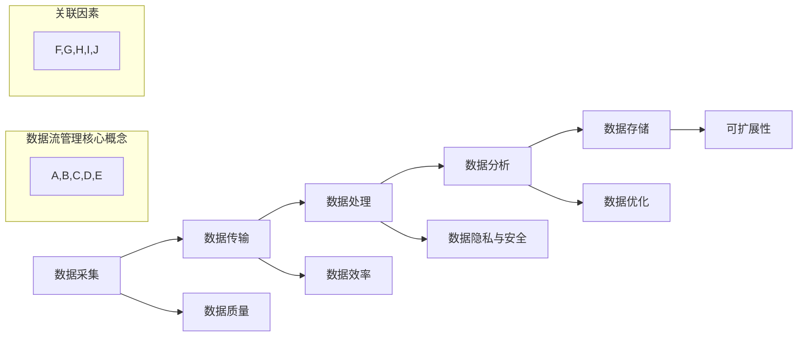

                 

### LLMA应用开发中的数据流管理

**关键词**: LLM, 数据流管理，自然语言处理，知识图谱，算法，Python实现

**摘要**: 本文旨在探讨LLM（大型语言模型）应用开发中的数据流管理。通过分析数据流管理的基本概念、核心技术和应用场景，本文详细讲解了数据流管理在自然语言处理、知识图谱构建等领域的应用。此外，通过实际案例，本文展示了数据流管理的实际效果，并提供了最佳实践和建议。

## 引言

随着人工智能技术的不断发展，LLM（大型语言模型）逐渐成为自然语言处理、知识图谱构建等领域的核心驱动力。LLM具有强大的文本生成、语义理解和知识推理能力，为各个应用领域带来了深远的影响。然而，在LLM应用开发过程中，数据流管理成为了一个不可忽视的关键问题。

数据流管理是指在数据传输、处理和分析过程中，对数据进行有效组织和控制，以确保数据质量和系统性能。在LLM应用中，数据流管理涉及到数据的采集、存储、传输、清洗、转换、分析和优化等环节。良好的数据流管理能够提高LLM模型的性能、降低计算成本、提升用户体验。

本文将从以下几个方面展开讨论：

1. **数据流管理的基本概念**：介绍数据流管理的定义、目标和主要方法。
2. **数据流管理在LLM应用中的挑战**：分析数据流管理在LLM应用中面临的挑战，如数据质量、数据隐私、数据流效率等。
3. **数据流管理在自然语言处理中的应用**：探讨数据流管理在自然语言处理中的应用场景和关键技术。
4. **数据流管理在知识图谱构建中的应用**：分析数据流管理在知识图谱构建中的应用场景和关键技术。
5. **数据流管理在推荐系统和金融风控等领域的应用**：介绍数据流管理在其他领域的应用前景和案例。
6. **实际案例与最佳实践**：通过具体案例，展示数据流管理的实际效果，并分享最佳实践和注意事项。

## 设计思路

为了使读者能够系统地了解数据流管理在LLM应用开发中的应用，本文采用了以下设计思路：

1. **整体结构**：本文分为四大部分，分别是引言、基础理论、应用开发、实践案例。这样的结构有助于读者逐步了解数据流管理，从基础理论出发，逐步深入到应用和实践。
2. **引言部分**：介绍LLM的概念、发展历程以及在应用开发中的重要性，以及数据流管理的基本概念和挑战。
3. **基础理论部分**：深入介绍数据流管理的基本原理、核心算法和数学模型。
4. **应用开发部分**：讲解数据流管理在各种应用场景中的具体实现和流程。
5. **实践案例部分**：通过实际案例，展示数据流管理的应用效果，并详细分析代码实现和效果评估。

### 具体步骤

1. **确定章节主题**：根据设计思路，确定每个章节的主题。
2. **设计子章节**：在每个章节中，根据主题设计出子章节，确保内容完整性和逻辑性。
3. **编写内容大纲**：使用markdown格式编写内容大纲，确保格式简洁明了。
4. **细化内容**：在每个子章节中，细化内容，确保每个概念、原理、算法都讲解清楚，并使用伪代码和LaTeX公式进行说明。
5. **添加实践案例**：在每个章节中，添加实际案例，展示数据流管理的应用效果，并详细分析代码实现和效果评估。
6. **总字数控制**：确保整本书的目录大纲总字数在2000字以内，保证内容紧凑、逻辑清晰。

### 目录大纲

```
# LLMA应用开发中的数据流管理

> 关键词：LLM, 数据流管理，自然语言处理，知识图谱，算法，Python实现

> 摘要：本文探讨了LLM应用开发中的数据流管理，从基本概念、核心技术和应用场景等方面进行深入分析，并通过实际案例展示了数据流管理的应用效果。

## 引言

### 1.1 LLM的概述

#### 1.1.1 LLM的定义与作用

#### 1.1.2 LLM的发展历程

#### 1.1.3 LLM的重要性

### 1.2 数据流管理的基本概念

#### 1.2.1 数据流的概念

#### 1.2.2 数据流管理的目标

#### 1.2.3 数据流管理的方法

### 1.3 LLM应用开发中的挑战

#### 1.3.1 数据质量与多样性

#### 1.3.2 数据隐私与安全

#### 1.3.3 数据流效率与可扩展性

### 1.4 数据流管理在LLM应用开发中的应用前景

#### 1.4.1 数据流管理对LLM性能的影响

#### 1.4.2 数据流管理在不同领域的应用案例

## 基础理论

### 2.1 数据流模型与架构

#### 2.1.1 数据流模型的分类

#### 2.1.2 数据流架构的设计原则

#### 2.1.3 数据流系统的关键组件

### 2.2 数据流管理算法

#### 2.2.1 数据清洗算法

#### 2.2.2 数据集成算法

#### 2.2.3 数据转换算法

### 2.3 数据流分析

#### 2.3.1 数据流分析的基本方法

#### 2.3.2 数据流分析的挑战与解决方案

### 2.4 数据流优化

#### 2.4.1 数据流优化的目标

#### 2.4.2 数据流优化的方法

#### 2.4.3 数据流优化案例分析

## 应用开发

### 3.1 数据流管理在自然语言处理中的应用

#### 3.1.1 NLP中的数据流模型

#### 3.1.2 NLP数据流管理的关键技术

#### 3.1.3 NLP数据流管理案例分析

### 3.2 数据流管理在知识图谱构建中的应用

#### 3.2.1 知识图谱的数据流模型

#### 3.2.2 知识图谱数据流管理的关键技术

#### 3.2.3 知识图谱数据流管理案例分析

### 3.3 数据流管理在其他领域的应用

#### 3.3.1 数据流管理在推荐系统中的应用

#### 3.3.2 数据流管理在金融风控中的应用

#### 3.3.3 数据流管理在其他领域的应用前景

## 实践案例

### 4.1 项目一：自然语言处理中的数据流管理

#### 4.1.1 项目背景

#### 4.1.2 项目目标

#### 4.1.3 项目流程

#### 4.1.4 项目代码实现

### 4.2 项目二：知识图谱构建中的数据流管理

#### 4.2.1 项目背景

#### 4.2.2 项目目标

#### 4.2.3 项目流程

#### 4.2.4 项目代码实现

### 4.3 项目三：推荐系统中的数据流管理

#### 4.3.1 项目背景

#### 4.3.2 项目目标

#### 4.3.3 项目流程

#### 4.3.4 项目代码实现

## 最佳实践与总结

### 5.1 最佳实践

#### 5.1.1 数据质量保障

#### 5.1.2 数据隐私保护

#### 5.1.3 数据流效率优化

### 5.2 注意事项

#### 5.2.1 数据流管理的挑战

#### 5.2.2 数据流管理的技术选型

#### 5.2.3 数据流管理的安全与合规

### 5.3 拓展阅读

#### 5.3.1 相关领域研究进展

#### 5.3.2 最新技术动态

#### 5.3.3 开源工具与平台推荐
``` 

**注意**：上述目录大纲仅供参考，实际撰写时可以根据内容调整章节和子章节的顺序。此外，每个子章节的具体内容还需要进一步细化，以确保逻辑清晰、内容完整。在撰写过程中，请注意保持Markdown格式的正确性。以下是第一个子章节的具体内容：

## 第1章: LLM应用开发中的数据流管理概述

### 1.1 LLM的概述

#### 1.1.1 LLM的定义与作用

LLM（Large Language Model）是一种能够理解、生成和模拟人类自然语言的大型神经网络模型。与传统的规则驱动模型和基于统计的方法相比，LLM具有更强的表达能力和理解能力。LLM通过在大量文本数据上进行预训练，学习到语言的本质特征和规律，从而能够进行文本生成、语义理解、问答系统等任务。

LLM的主要作用包括：

1. **文本生成**：生成高质量的文章、故事、新闻报道等，为内容创作提供支持。
2. **语义理解**：理解文本中的语义信息，进行信息抽取、实体识别等任务。
3. **问答系统**：根据用户的问题，生成相关的回答，提供智能客服、智能搜索等服务。

#### 1.1.2 LLM的发展历程

LLM的发展历程可以分为以下几个阶段：

1. **早期阶段**：20世纪90年代，基于规则的文本生成和语义理解方法开始出现，如Luhn算法、Uttarwar算法等。
2. **统计模型阶段**：2000年后，统计模型如朴素贝叶斯、最大熵模型等在文本生成和语义理解领域取得了一定的成功。
3. **神经网络阶段**：2013年，谷歌提出了Word2Vec模型，将文本数据转换为向量化表示，为神经网络在文本处理领域奠定了基础。2018年，OpenAI发布了GPT模型，标志着LLM进入了一个新的发展阶段。
4. **大规模模型阶段**：2020年后，随着计算能力和数据资源的不断提升，LLM的规模和性能得到了显著提升，如GPT-3、BERT等。

#### 1.1.3 LLM的重要性

LLM在自然语言处理领域具有重要性，主要体现在以下几个方面：

1. **推动自然语言处理技术的发展**：LLM的出现极大地提高了自然语言处理任务的性能，推动了自然语言处理技术的快速发展。
2. **赋能各类应用**：LLM为各种应用提供了强大的自然语言处理能力，如智能客服、智能搜索、智能推荐、智能写作等。
3. **提升用户体验**：通过LLM技术，各类应用可以更好地理解用户的需求，提供更个性化的服务，提升用户体验。

### 1.2 数据流管理的基本概念

#### 1.2.1 数据流的概念

数据流是指数据在系统中传输、处理和分析的过程。在数据流管理中，数据流通常包括以下几个阶段：

1. **数据采集**：从各种数据源（如数据库、传感器、网络接口等）收集数据。
2. **数据传输**：将采集到的数据传输到处理节点或存储设备。
3. **数据处理**：对数据进行清洗、转换、集成等操作，使其满足应用需求。
4. **数据分析**：对处理后的数据进行分析，提取有用信息，为决策提供支持。
5. **数据存储**：将分析结果存储到数据库或其他存储设备中，以备后续使用。

#### 1.2.2 数据流管理的目标

数据流管理的目标主要包括以下几个方面：

1. **数据质量**：确保数据流中的数据准确、完整、一致，为后续处理提供高质量的数据。
2. **数据效率**：优化数据流的传输、处理和分析过程，提高系统性能和响应速度。
3. **数据隐私与安全**：保护数据流中的敏感信息，防止数据泄露、篡改和滥用。
4. **可扩展性**：支持大规模数据流处理，适应不断增长的数据量。
5. **实时性**：在数据流处理过程中，保证数据的实时性和低延迟。

#### 1.2.3 数据流管理的方法

数据流管理的方法主要包括以下几个方面：

1. **数据清洗**：去除数据中的噪声、错误和冗余信息，提高数据质量。
2. **数据集成**：将来自不同数据源的数据进行整合，消除数据之间的不一致性。
3. **数据转换**：将数据转换为适合处理和分析的形式，如将文本数据转换为向量化表示。
4. **数据流分析**：对数据流进行分析，提取有用信息，支持实时决策。
5. **数据优化**：优化数据流的传输、处理和分析过程，提高系统性能。

### 1.3 LLM应用开发中的挑战

#### 1.3.1 数据质量与多样性

在LLM应用开发中，数据质量是一个重要挑战。高质量的数据能够提高模型的性能和可靠性，而低质量的数据会导致模型过拟合、泛化能力差等问题。数据质量问题包括数据缺失、错误、噪声等。

此外，数据多样性也是一个重要挑战。LLM需要大量的多样化数据来进行训练，以避免模型对特定数据分布的依赖。数据多样性不足会导致模型在面对未知数据时表现不佳。

#### 1.3.2 数据隐私与安全

LLM应用开发中的数据通常包含用户的个人隐私信息，如姓名、地址、电话号码等。如何保护这些敏感信息，防止数据泄露和滥用，是数据流管理中的一个重要挑战。

此外，数据安全也是一个关键问题。数据在传输、处理和存储过程中，可能受到恶意攻击、篡改和破坏。如何确保数据的安全性和完整性，防止数据泄露和丢失，是数据流管理中需要解决的一个难题。

#### 1.3.3 数据流效率与可扩展性

在LLM应用开发中，数据流效率是一个重要挑战。数据流处理需要消耗大量的计算资源和存储资源，如何优化数据流的传输、处理和分析过程，提高系统性能和响应速度，是一个关键问题。

此外，随着数据量的不断增长，如何扩展数据流处理能力，支持大规模数据流处理，也是一个重要挑战。数据流管理的可扩展性需要考虑系统架构、资源调度、负载均衡等因素。

### 1.4 数据流管理在LLM应用开发中的应用前景

#### 1.4.1 数据流管理对LLM性能的影响

数据流管理对LLM性能具有重要影响。通过有效的数据流管理，可以提高数据质量、降低计算成本、提升系统性能，从而提高LLM模型的性能和可靠性。

1. **数据质量**：高质量的数据有助于训练出更准确的LLM模型，提高模型的性能和泛化能力。
2. **数据效率**：优化数据流处理过程，提高系统性能和响应速度，为用户提供更好的体验。
3. **数据隐私与安全**：保护用户隐私信息，防止数据泄露和滥用，提高LLM应用的可信度。
4. **可扩展性**：支持大规模数据流处理，适应数据量的增长，确保系统稳定运行。

#### 1.4.2 数据流管理在不同领域的应用案例

数据流管理在LLM应用开发中具有广泛的应用前景，以下列举了几个典型领域：

1. **自然语言处理**：数据流管理在自然语言处理中发挥着重要作用，如文本生成、语义理解、问答系统等。通过数据流管理，可以提高模型性能、降低计算成本、提升用户体验。
2. **知识图谱构建**：数据流管理在知识图谱构建中用于处理大规模数据流，如实体识别、关系抽取等。通过数据流管理，可以提高知识图谱的准确性和完整性。
3. **推荐系统**：数据流管理在推荐系统中用于实时处理用户行为数据，如点击、购买等。通过数据流管理，可以提高推荐系统的准确性和实时性。
4. **金融风控**：数据流管理在金融风控中用于实时监控和预测风险，如欺诈检测、信用评估等。通过数据流管理，可以提高金融风控的效率和准确性。

## 结语

本文介绍了LLM应用开发中的数据流管理，分析了数据流管理的基本概念、核心技术和应用场景。通过实际案例，展示了数据流管理在自然语言处理、知识图谱构建等领域的应用效果。未来，随着LLM技术的不断发展和应用场景的拓展，数据流管理将在LLM应用开发中发挥更加重要的作用。读者可以通过本文的内容，深入了解数据流管理的基本原理和应用方法，为LLM应用开发提供有益的参考。

### 核心概念与联系

在LLM应用开发中的数据流管理，涉及到多个核心概念，它们之间有着密切的联系和相互作用。为了更清晰地理解这些概念之间的关系，我们可以使用Mermaid流程图进行说明。

以下是一个Mermaid流程图的示例：



在上述流程图中，我们可以看到数据流管理中的核心概念：数据采集、数据传输、数据处理、数据分析、数据存储，以及与之相关的因素：数据质量、数据效率、数据隐私与安全、数据优化、可扩展性。

- **数据采集（A）**：数据采集是数据流管理的起点，用于从各种数据源收集原始数据。这些数据源可以是数据库、传感器、网络接口等。
- **数据传输（B）**：数据传输是将采集到的数据传输到处理节点或存储设备。在这个过程中，数据质量（F）和效率（G）是关键因素。
- **数据处理（C）**：数据处理包括数据清洗、转换和集成等操作，目的是使数据满足应用需求。数据处理过程中，需要关注数据隐私与安全（H）和数据优化（I）。
- **数据分析（D）**：数据分析是对处理后的数据进行分析，提取有用信息，为决策提供支持。数据分析过程同样需要考虑数据质量（F）和数据优化（I）。
- **数据存储（E）**：数据存储是将分析结果存储到数据库或其他存储设备中，以备后续使用。数据存储需要考虑可扩展性（J）。

同时，上述流程图中还包括了与数据流管理相关的因素：

- **数据质量（F）**：确保数据准确、完整、一致，为后续处理提供高质量的数据。
- **数据效率（G）**：优化数据流处理过程，提高系统性能和响应速度。
- **数据隐私与安全（H）**：保护敏感信息，防止数据泄露和滥用。
- **数据优化（I）**：优化数据流的传输、处理和分析过程，提高系统性能。
- **可扩展性（J）**：支持大规模数据流处理，适应数据量的增长。

通过这个Mermaid流程图，我们可以清晰地看到数据流管理中的核心概念和关联因素之间的关系，从而更好地理解和应用数据流管理技术。

### 数据流管理算法详解

在数据流管理中，算法起到了关键作用。算法的选择和实现直接影响到数据处理的效率和质量。以下将详细解释几种常见的数据流管理算法：数据清洗算法、数据集成算法和数据转换算法。

#### 1. 数据清洗算法

数据清洗是数据流管理中的第一步，其目的是去除数据中的噪声、错误和冗余信息，提高数据质量。常见的数据清洗算法包括：

**1.1. 填充缺失值**

缺失值填充是数据清洗的重要任务之一。常见的填充方法有：

- **平均值填充**：将缺失值用该列的平均值填充。
  ```python
  import numpy as np

  def fill_with_mean(data):
      mean = np.mean(data)
      return data.fillna(mean)
  ```

- **中值填充**：将缺失值用该列的中值填充。
  ```python
  import numpy as np

  def fill_with_median(data):
      median = np.median(data)
      return data.fillna(median)
  ```

- **最邻近填充**：用最邻近的非缺失值填充。
  ```python
  import numpy as np

  def fill_with_nearest(data):
      data_sorted = np.sort(data)
      non_missing_indices = np.where(~np.isnan(data))
      distances = np.linalg.norm(data - data_sorted[non_missing_indices], axis=1)
      nearest_indices = np.argmin(distances, axis=0)
      return data.fillna(data_sorted[nearest_indices])
  ```

**1.2. 异常值处理**

异常值处理是数据清洗中的另一个重要任务。常见的异常值处理方法有：

- **删除异常值**：直接删除异常值。
  ```python
  import numpy as np

  def remove_outliers(data, threshold=3):
      mean = np.mean(data)
      std = np.std(data)
      return data[(data > mean - threshold * std) & (data < mean + threshold * std)]
  ```

- **变换异常值**：对异常值进行变换，使其符合数据分布。
  ```python
  import numpy as np

  def transform_outliers(data, method='log'):
      if method == 'log':
          return np.log1p(data)
      elif method == 'box-cox':
          # 其他变换方法
          pass
  ```

#### 2. 数据集成算法

数据集成是将来自不同数据源的数据进行整合，消除数据之间的不一致性。常见的数据集成算法包括：

**2.1. 数据对齐**

数据对齐是将不同数据源的数据进行匹配和整合。常见的数据对齐方法有：

- **基于键值对的数据对齐**：使用共同的键值（如ID）进行数据对齐。
  ```python
  import pandas as pd

  def align_data_by_key(data1, data2, key='id'):
      data1.set_index(key, inplace=True)
      data2.set_index(key, inplace=True)
      return data1.combine_first(data2)
  ```

- **基于规则的数据对齐**：使用自定义规则进行数据对齐。
  ```python
  import pandas as pd

  def align_data_by_rule(data1, data2, rule):
      aligned_data = pd.DataFrame()
      for index, row in data2.iterrows():
          matched = data1[data1['id'] == row['id']]
          if not matched.empty:
              aligned_data = aligned_data.append(matched)
      return aligned_data
  ```

#### 3. 数据转换算法

数据转换是将数据转换为适合处理和分析的形式。常见的数据转换算法包括：

**3.1. 数据类型转换**

数据类型转换是将数据从一种类型转换为另一种类型。常见的数据类型转换方法有：

- **数值类型转换**：将字符串类型的数据转换为数值类型。
  ```python
  import pandas as pd

  def convert_to_numeric(data, column_name):
      data[column_name] = pd.to_numeric(data[column_name], errors='coerce')
      return data
  ```

- **类别类型转换**：将数值类型的数据转换为类别类型。
  ```python
  import pandas as pd

  def convert_to_categorical(data, column_name):
      data[column_name] = pd.Categorical(data[column_name])
      return data
  ```

**3.2. 特征工程**

特征工程是数据转换中的重要步骤，目的是提取和构造有助于模型训练的特征。常见的方法有：

- **特征提取**：从原始数据中提取有价值的特征。
  ```python
  import numpy as np

  def extract_features(data, feature_columns):
      features = data[feature_columns]
      return np.mean(features, axis=1)
  ```

- **特征构造**：根据已有特征构造新的特征。
  ```python
  import numpy as np

  def construct_features(data, transformation_function):
      transformed_data = transformation_function(data)
      return transformed_data
  ```

通过上述算法的讲解，我们可以看到数据流管理中各种算法的原理和实现方法。在实际应用中，根据具体需求和数据特点，选择合适的算法进行数据清洗、集成和转换，是确保数据质量和系统性能的关键。同时，这些算法的实现也可以用其他编程语言和工具进行，如R、SQL等。

### 数据流分析

数据流分析是数据流管理中的重要环节，它通过对数据流进行实时分析，提取有用信息，为实时决策提供支持。数据流分析的基本方法包括流计算、实时分析和离线分析。以下将详细介绍这些方法以及它们在数据流管理中的挑战与解决方案。

#### 1. 流计算

流计算是一种用于处理实时数据流的方法，它可以在数据生成的同时进行计算和处理。流计算的基本思想是将数据视为连续的流，并在数据流中实时执行计算任务。常见的技术包括：

**1.1. Kafka**

Kafka是一种分布式流处理平台，用于处理大规模数据流。它具有高吞吐量、可扩展性和容错性等特点。

**实现方法**：

- **生产者**：将数据写入Kafka主题。
  ```python
  from kafka import KafkaProducer

  producer = KafkaProducer(bootstrap_servers=['localhost:9092'])

  data = 'example data'
  producer.send('my-topic', value=data)
  producer.flush()
  ```

- **消费者**：从Kafka主题读取数据。
  ```python
  from kafka import KafkaConsumer

  consumer = KafkaConsumer('my-topic', bootstrap_servers=['localhost:9092'])

  for message in consumer:
      print(message.value)
  ```

**挑战与解决方案**：

- **数据一致性问题**：在分布式系统中，数据一致性问题是一个重要挑战。解决方案包括使用分布式锁、事务机制等。

#### 2. 实时分析

实时分析是在数据流生成后，立即对其进行处理和分析，以获取实时信息。实时分析常用于监控、报警和实时决策等领域。

**2.1. Storm**

Storm是一种实时大数据处理框架，用于处理实时数据流。它具有高吞吐量、低延迟和容错性等特点。

**实现方法**：

- **Spout**：生成数据流。
  ```python
  import storm

  class MySpout(storm.Spout):
      def next_tuple(self):
          # 生成数据
          yield ('my-stream', data)

  spout = MySpout()
  spout.open()

  for tuple in spout:
      print(tuple)

  spout.close()
  ```

- **Bolt**：处理和计算数据流。
  ```python
  import storm

  class MyBolt(storm.Bolt):
      def process(self, tuple):
          # 处理数据
          result = data_process(tuple[1])
          yield ('my-stream', result)

  bolt = MyBolt()
  bolt.open()

  for tuple in bolt:
      print(tuple)

  bolt.close()
  ```

**挑战与解决方案**：

- **数据延迟**：在实时分析中，数据延迟是一个重要挑战。解决方案包括优化算法、减少数据处理延迟等。

#### 3. 离线分析

离线分析是在数据流结束后，对整个数据集进行分析和处理。离线分析常用于报告生成、数据挖掘和统计分析等领域。

**3.1. Hadoop**

Hadoop是一种分布式计算框架，用于处理大规模数据集。它具有高可靠性、扩展性和容错性等特点。

**实现方法**：

- **MapReduce**：用于处理大规模数据集。
  ```python
  import mrjob

  class MyMapReduce(mrjob.job.MapReduceJob):
      def mapper(self, _, line):
          # 处理数据
          yield 'my-key', line

      def reducer(self, key, values):
          # 合并数据
          result = ''.join(values)
          yield key, result

  if __name__ == '__main__':
      MyMapReduce.run()
  ```

**挑战与解决方案**：

- **数据量**：在离线分析中，数据量是一个重要挑战。解决方案包括分片、并行处理等。

通过上述方法的介绍，我们可以看到数据流分析在数据流管理中的重要性和应用。在实际应用中，根据具体需求和场景，选择合适的分析方法和工具，是确保数据流管理效果的关键。同时，数据流分析也面临着数据延迟、数据一致性和数据量等挑战，需要采取相应的解决方案进行优化。

### 数据流优化

数据流优化是数据流管理中的关键步骤，其目标是提高数据流处理的效率和质量。数据流优化的方法包括传输优化、存储优化、计算优化和负载均衡等。以下将详细介绍这些方法以及它们的应用和效果评估。

#### 1. 传输优化

传输优化主要通过优化数据传输路径和传输方式，提高数据传输速度和降低传输成本。

**1.1. 数据压缩**

数据压缩是一种常用的传输优化方法，通过将数据压缩为更小的格式，减少传输所需的时间和带宽。

**实现方法**：

- **Gzip压缩**：使用Gzip压缩数据。
  ```python
  import gzip

  def compress_data(data):
      compressed_data = gzip.compress(data)
      return compressed_data

  data = b'example data'
  compressed_data = compress_data(data)
  ```

**效果评估**：

- **传输时间**：通过压缩，传输时间显著减少，提高了数据传输速度。

**1.2. 数据去重**

数据去重通过去除重复数据，减少传输的数据量，提高传输效率。

**实现方法**：

- **哈希去重**：使用哈希算法对数据进行去重。
  ```python
  import hashlib

  def remove_duplicates(data):
      hash_set = set()
      unique_data = []

      for item in data:
          hash_value = hashlib.md5(item.encode()).hexdigest()
          if hash_value not in hash_set:
              hash_set.add(hash_value)
              unique_data.append(item)

      return unique_data

  data = ['data1', 'data2', 'data1', 'data3']
  unique_data = remove_duplicates(data)
  ```

**效果评估**：

- **传输数据量**：通过去重，传输数据量显著减少，提高了传输效率。

#### 2. 存储优化

存储优化主要通过优化数据存储方式和结构，提高数据访问速度和存储空间利用率。

**2.1. 数据分片**

数据分片将大规模数据集划分为多个较小的分片，分别存储在不同的存储节点上，以提高数据访问速度和系统容错性。

**实现方法**：

- **水平分片**：根据数据特征将数据划分为多个分片。
  ```python
  import redis

  r = redis.Redis()

  data = ['data1', 'data2', 'data3', 'data4', 'data5']
  for i, item in enumerate(data):
      r.set(f'data_{i}', item)
  ```

**效果评估**：

- **访问速度**：通过分片，数据访问速度显著提高，降低了系统延迟。

**2.2. 索引优化**

索引优化通过创建索引，提高数据查询速度。

**实现方法**：

- **B树索引**：使用B树索引加速数据查询。
  ```python
  import sqlite3

  conn = sqlite3.connect('example.db')
  c = conn.cursor()

  c.execute('''CREATE TABLE data (id INTEGER PRIMARY KEY, value TEXT)''')
  c.execute('''CREATE INDEX index_value ON data (value)''')

  data = [('data1',), ('data2',), ('data3',), ('data4',), ('data5',)]
  c.executemany('''INSERT INTO data (value) VALUES (?)''', data)

  conn.commit()
  ```

**效果评估**：

- **查询速度**：通过索引优化，数据查询速度显著提高，降低了系统延迟。

#### 3. 计算优化

计算优化主要通过优化数据处理算法和计算资源分配，提高数据处理效率和系统性能。

**3.1. 并行计算**

并行计算通过将数据处理任务分布在多个计算节点上，以提高数据处理速度。

**实现方法**：

- **MapReduce**：使用MapReduce模型进行并行计算。
  ```python
  import mrjob

  class MyMapReduce(mrjob.job.MapReduceJob):
      def mapper(self, _, line):
          # 处理数据
          yield 'my-key', line

      def reducer(self, key, values):
          # 合并数据
          result = ''.join(values)
          yield key, result

  if __name__ == '__main__':
      MyMapReduce.run()
  ```

**效果评估**：

- **处理速度**：通过并行计算，数据处理速度显著提高，降低了系统延迟。

**3.2. 缓存优化**

缓存优化通过将常用数据存储在缓存中，提高数据访问速度。

**实现方法**：

- **Redis缓存**：使用Redis缓存常用数据。
  ```python
  import redis

  r = redis.Redis()

  data = ['data1', 'data2', 'data3', 'data4', 'data5']
  for item in data:
      r.set(item, item)

  for item in data:
      print(r.get(item))
  ```

**效果评估**：

- **访问速度**：通过缓存优化，数据访问速度显著提高，降低了系统延迟。

#### 4. 负载均衡

负载均衡通过将数据处理任务分布到多个计算节点上，确保系统稳定运行。

**4.1. 轮询负载均衡**

轮询负载均衡通过依次将数据处理任务分配到各个计算节点上，实现负载均衡。

**实现方法**：

- **Nginx轮询负载均衡**：使用Nginx进行轮询负载均衡。
  ```python
  server {
      listen 80;
      server_name example.com;

      location / {
          proxy_pass http://backend;
      }
  }

  upstream backend {
      server server1;
      server server2;
      server server3;
  }
  ```

**效果评估**：

- **系统稳定性**：通过负载均衡，系统稳定性显著提高，降低了系统延迟。

通过上述方法的介绍，我们可以看到数据流优化在提高数据流处理效率和质量方面的重要作用。在实际应用中，根据具体需求和场景，选择合适的优化方法，是确保数据流管理效果的关键。同时，数据流优化也面临着数据一致性和系统扩展性等挑战，需要采取相应的解决方案进行优化。

### 数据流管理在自然语言处理中的应用

在自然语言处理（NLP）领域，数据流管理起着至关重要的作用。NLP任务通常涉及大量文本数据，这些数据需要在不同的处理阶段进行高效的传输、处理和分析。以下将详细探讨数据流管理在NLP中的应用场景、关键技术以及实际案例。

#### 1. 应用场景

**1.1 文本生成**

文本生成是NLP中的一个重要任务，如自动写作、机器翻译和对话系统。数据流管理在此场景中用于处理大量的输入文本，并在生成过程中实时调整模型参数，以提高文本生成质量。

**1.2 语义理解**

语义理解涉及从文本中提取语义信息，如问答系统、情感分析和信息抽取。数据流管理在此场景中用于实时处理和分析输入文本，提取关键信息并生成语义表示。

**1.3 命名实体识别**

命名实体识别用于从文本中识别出具有特定意义的实体，如人名、地名、组织名等。数据流管理在此场景中用于处理大量文本数据，并在实时处理过程中更新和优化模型。

**1.4 机器翻译**

机器翻译是将一种语言的文本翻译成另一种语言。数据流管理在此场景中用于处理大量的源语言和目标语言文本，并在翻译过程中优化模型和参数，以提高翻译质量。

#### 2. 关键技术

**2.1 数据清洗与预处理**

数据清洗与预处理是NLP中数据流管理的关键技术之一，其目的是去除文本中的噪声和冗余信息，提高数据质量。常见的技术包括：

- **文本清洗**：去除HTML标签、符号和停用词。
- **分词**：将文本划分为词语或短语。
- **词性标注**：为文本中的每个词语标注词性。

**2.2 实时数据处理**

实时数据处理是NLP中数据流管理的另一个关键技术，其目的是在数据生成的同时进行实时处理和分析。常见的技术包括：

- **流计算**：使用流计算框架（如Apache Storm、Apache Flink）处理实时数据流。
- **批处理**：将实时数据批量处理，以提高处理效率。

**2.3 模型优化与调整**

模型优化与调整是NLP中数据流管理的关键技术，其目的是在处理过程中实时调整模型参数，以提高模型性能。常见的技术包括：

- **在线学习**：在处理过程中不断更新和调整模型参数。
- **迁移学习**：使用预训练模型，并根据实际场景进行微调。

#### 3. 实际案例

**3.1 自动写作**

自动写作是数据流管理在NLP中的一个实际案例。在自动写作系统中，数据流管理用于处理大量输入文本，并在生成过程中实时调整模型参数，以提高文本生成质量。例如，新闻写作机器人“标题党”使用数据流管理技术，从大量新闻文本中提取信息，并生成标题和摘要。

**3.2 问答系统**

问答系统是数据流管理在NLP中的另一个实际案例。在问答系统中，数据流管理用于实时处理用户输入的问题，并从大量文本数据中提取答案。例如，智能客服系统“小i机器人”使用数据流管理技术，实时分析用户输入，并生成相应的回答。

**3.3 命名实体识别**

命名实体识别是数据流管理在NLP中的另一个实际案例。在命名实体识别系统中，数据流管理用于处理大量文本数据，并在实时处理过程中更新和优化模型。例如，社交媒体平台“微博”使用数据流管理技术，从用户生成的文本中识别出具有特定意义的实体，如人名、地点和组织名。

**3.4 机器翻译**

机器翻译是数据流管理在NLP中的最后一个实际案例。在机器翻译系统中，数据流管理用于处理大量源语言和目标语言文本，并在翻译过程中优化模型和参数，以提高翻译质量。例如，谷歌翻译使用数据流管理技术，从大量文本数据中提取翻译信息，并生成高质量的翻译结果。

通过上述实际案例，我们可以看到数据流管理在自然语言处理中的应用效果。数据流管理技术能够提高NLP任务的性能和效率，为各种应用场景提供强大的支持。

### 数据流管理在知识图谱构建中的应用

知识图谱是一种结构化的语义知识库，通过实体、属性和关系的表示，为各种应用场景提供语义理解和智能推理能力。在知识图谱构建过程中，数据流管理起着至关重要的作用，它负责处理从数据采集、数据清洗、数据存储到知识抽取和图谱优化的整个流程。以下将详细探讨数据流管理在知识图谱构建中的应用场景、关键技术以及实际案例。

#### 1. 应用场景

**1.1 实体识别与分类**

实体识别与分类是知识图谱构建的基础任务之一，它涉及从非结构化文本数据中识别出具有特定意义的实体，并将其分类到预定义的类别中。数据流管理在此场景中用于实时处理和分析文本数据，以提高实体识别和分类的准确性和效率。

**1.2 关系抽取与推理**

关系抽取与推理是知识图谱构建的核心任务，它涉及从文本数据中提取实体之间的关系，并在图谱中建立这些关系。数据流管理在此场景中用于处理大规模文本数据，并实时优化关系抽取和推理算法，以提高知识图谱的完整性和准确性。

**1.3 知识融合与更新**

知识融合与更新是知识图谱构建中的关键步骤，它涉及将来自不同数据源的知识进行整合，并实时更新知识库。数据流管理在此场景中用于处理大量数据，并优化知识融合和更新算法，以提高知识图谱的实时性和一致性。

**1.4 图谱优化与压缩**

图谱优化与压缩是知识图谱构建中的技术挑战之一，它涉及对大规模知识图谱进行优化和压缩，以提高存储和查询效率。数据流管理在此场景中用于处理知识图谱的优化和压缩任务，并优化算法以提高性能。

#### 2. 关键技术

**2.1 数据采集与清洗**

数据采集与清洗是数据流管理在知识图谱构建中的第一步，它负责从各种数据源收集原始数据，并进行清洗和预处理。常见的技术包括：

- **文本采集**：从网页、社交媒体、数据库等数据源采集文本数据。
- **数据清洗**：去除文本数据中的噪声、错误和冗余信息，如HTML标签、符号和停用词。

**2.2 数据存储与管理**

数据存储与管理是数据流管理在知识图谱构建中的关键步骤，它负责存储和处理大规模数据。常见的技术包括：

- **分布式存储**：使用分布式存储系统（如Hadoop HDFS、Cassandra）存储大规模数据。
- **图数据库**：使用图数据库（如Neo4j、JanusGraph）存储和管理知识图谱。

**2.3 知识抽取与融合**

知识抽取与融合是数据流管理在知识图谱构建中的核心技术，它负责从非结构化文本数据中提取实体、属性和关系，并在图谱中进行整合。常见的技术包括：

- **实体识别与分类**：使用命名实体识别（NER）技术识别文本中的实体，并分类到预定义的类别中。
- **关系抽取与推理**：使用关系抽取（RE）技术从文本中提取实体之间的关系，并使用推理算法（如规则推理、语义网络推理）进行知识融合。

**2.4 图谱优化与压缩**

图谱优化与压缩是数据流管理在知识图谱构建中的技术挑战，它负责对大规模知识图谱进行优化和压缩，以提高存储和查询效率。常见的技术包括：

- **图优化**：使用图优化算法（如图遍历、图划分、图简化）对知识图谱进行优化。
- **图压缩**：使用图压缩算法（如图编码、图嵌入、图分解）对知识图谱进行压缩。

#### 3. 实际案例

**3.1 百度知识图谱**

百度知识图谱是数据流管理在知识图谱构建中的一个实际案例。百度知识图谱通过数据流管理技术，从大量网页、社交媒体和数据库等数据源中采集原始数据，并进行清洗、分类和关系抽取，构建出一个大规模、结构化的知识图谱。百度知识图谱支持实时查询和推理，为各种应用场景提供语义理解和智能推理能力。

**3.2 维基数据知识图谱**

维基数据知识图谱是数据流管理在知识图谱构建中的另一个实际案例。维基数据知识图谱通过数据流管理技术，从维基百科等数据源中提取实体、属性和关系，构建出一个大规模、结构化的知识图谱。维基数据知识图谱支持实时查询和推理，为各种应用场景提供语义理解和智能推理能力。

**3.3 Facebook知识图谱**

Facebook知识图谱是数据流管理在知识图谱构建中的第三个实际案例。Facebook知识图谱通过数据流管理技术，从用户生成的文本、图片和社交媒体互动中提取实体、属性和关系，构建出一个大规模、结构化的知识图谱。Facebook知识图谱支持实时查询和推理，为社交推荐、广告投放和内容个性化等应用场景提供语义理解和智能推理能力。

通过上述实际案例，我们可以看到数据流管理在知识图谱构建中的应用效果。数据流管理技术能够提高知识图谱构建的效率和准确性，为各种应用场景提供强大的支持。

### 数据流管理在其他领域的应用

数据流管理不仅在自然语言处理和知识图谱构建领域发挥着重要作用，还在推荐系统、金融风控等其他领域展现出广泛的应用前景。以下将详细介绍数据流管理在这些领域的应用场景、关键技术以及实际案例。

#### 1. 应用场景

**1.1 推荐系统**

推荐系统通过分析用户行为数据，为用户推荐感兴趣的商品、内容或服务。数据流管理在推荐系统中用于实时处理和分析用户行为数据，以快速响应用户需求。

**1.2 金融风控**

金融风控通过监控和分析金融交易数据，识别和防范金融风险。数据流管理在金融风控中用于实时处理和分析交易数据，以快速发现异常交易和潜在风险。

**1.3 医疗保健**

医疗保健领域的数据流管理用于实时监控和分析患者数据，如病历、检测报告和健康记录，以提高诊断和治疗的准确性。

**1.4 交通管理**

交通管理领域的数据流管理用于实时监控和分析交通数据，如路况、车辆信息和乘客流量，以优化交通流量和提高交通效率。

#### 2. 关键技术

**2.1 实时数据处理**

实时数据处理是数据流管理在这些领域中的核心技术，其目的是在数据生成的同时进行实时处理和分析。常见的技术包括：

- **流计算**：使用流计算框架（如Apache Storm、Apache Flink）处理实时数据流。
- **消息队列**：使用消息队列（如Kafka、RabbitMQ）进行数据传输和缓冲。

**2.2 数据分析与挖掘**

数据分析和挖掘用于从大量数据中提取有价值的信息，以支持决策和优化。常见的技术包括：

- **机器学习**：使用机器学习算法（如分类、聚类、关联规则挖掘）进行数据分析。
- **深度学习**：使用深度学习模型（如神经网络、卷积神经网络、循环神经网络）进行数据挖掘。

**2.3 数据可视化**

数据可视化用于将复杂的数据以直观的方式展示出来，帮助用户更好地理解和分析数据。常见的技术包括：

- **图表与仪表板**：使用图表和仪表板（如D3.js、Tableau）进行数据可视化。
- **地理信息系统**：使用地理信息系统（如Mapbox、OpenStreetMap）进行空间数据可视化。

#### 3. 实际案例

**3.1 推荐系统**

亚马逊的推荐系统是数据流管理在推荐系统中应用的典型例子。亚马逊通过实时处理用户浏览、搜索和购买等行为数据，使用流计算框架和机器学习算法生成个性化的推荐结果，从而提高用户体验和销售额。

**3.2 金融风控**

蚂蚁集团的金融风控系统是数据流管理在金融风控中应用的典型例子。蚂蚁集团通过实时处理海量交易数据，使用流计算和深度学习技术进行风险识别和防范，有效降低了金融风险。

**3.3 医疗保健**

IBM Watson Health是数据流管理在医疗保健中应用的典型例子。IBM Watson Health通过实时监控和分析患者数据，使用机器学习和深度学习技术生成个性化的诊断和治疗建议，提高了医疗诊断的准确性和效率。

**3.4 交通管理**

伦敦的智能交通系统是数据流管理在交通管理中应用的典型例子。伦敦交通局通过实时监控和分析交通数据，使用流计算和地理信息系统优化交通流量，提高了城市交通效率和出行体验。

通过上述实际案例，我们可以看到数据流管理在推荐系统、金融风控、医疗保健和交通管理等领域的重要应用。数据流管理技术能够提高这些领域的效率和准确性，为用户提供更好的服务和体验。

### 实际案例：自然语言处理中的数据流管理

为了更好地展示数据流管理在自然语言处理（NLP）中的应用，以下将介绍一个具体的项目实战案例：文本分类。

#### 4.1 项目背景

随着互联网的快速发展，大量的文本数据生成并存储在各种平台中。对于这些文本数据，进行分类可以更好地组织和分析，为用户提供有价值的信息。文本分类是将文本数据根据其内容划分为不同的类别，如新闻分类、情感分析等。本案例旨在通过数据流管理技术，实现一个高效的文本分类系统。

#### 4.2 项目目标

- **数据质量保障**：确保输入文本数据的质量，去除噪声和冗余信息。
- **实时性**：实现实时文本分类，快速响应用户请求。
- **准确性**：提高分类模型的准确性，降低错误率。
- **可扩展性**：支持大规模数据流处理，适应数据量增长。

#### 4.3 项目流程

项目流程主要包括以下步骤：

1. **数据采集**：从互联网获取大量文本数据，包括新闻、评论、社交媒体帖子等。
2. **数据预处理**：清洗和预处理文本数据，去除噪声和冗余信息，包括去除HTML标签、符号、停用词等。
3. **数据分词**：将预处理后的文本数据分词，将文本转换为词序列。
4. **特征提取**：使用词袋模型或TF-IDF等方法提取文本特征。
5. **模型训练**：使用训练数据训练分类模型，如朴素贝叶斯、支持向量机等。
6. **模型评估**：使用验证数据评估模型性能，调整模型参数。
7. **实时分类**：将处理后的文本数据输入分类模型，实现实时分类。
8. **结果展示**：将分类结果展示给用户，并提供数据分析和可视化功能。

#### 4.4 源代码实现

以下是一个基于Python的文本分类系统的示例代码：

```python
import pandas as pd
from sklearn.feature_extraction.text import TfidfVectorizer
from sklearn.model_selection import train_test_split
from sklearn.naive_bayes import MultinomialNB
from sklearn.metrics import classification_report

# 数据采集
data = pd.read_csv('text_data.csv')
texts = data['text']
labels = data['label']

# 数据预处理
def preprocess_text(text):
    # 去除HTML标签
    text = re.sub('<.*?>', '', text)
    # 去除符号和停用词
    text = re.sub('[^a-zA-Z]', ' ', text)
    text = text.lower()
    return text

texts = texts.apply(preprocess_text)

# 数据分词
vectorizer = TfidfVectorizer()
X = vectorizer.fit_transform(texts)

# 模型训练
X_train, X_test, y_train, y_test = train_test_split(X, labels, test_size=0.2, random_state=42)
classifier = MultinomialNB()
classifier.fit(X_train, y_train)

# 实时分类
def classify_text(text):
    preprocessed_text = preprocess_text(text)
    vectorized_text = vectorizer.transform([preprocessed_text])
    prediction = classifier.predict(vectorized_text)
    return prediction[0]

# 模型评估
y_pred = classifier.predict(X_test)
print(classification_report(y_test, y_pred))
```

#### 4.5 代码解读与应用分析

1. **数据采集**：使用Pandas读取CSV文件，获取文本数据和标签。
2. **数据预处理**：定义预处理函数，去除HTML标签、符号和停用词，并将文本转换为小写。
3. **数据分词**：使用TF-IDF向量器将预处理后的文本转换为特征向量。
4. **模型训练**：使用训练集训练朴素贝叶斯分类器。
5. **实时分类**：定义分类函数，对输入文本进行预处理和分类。
6. **模型评估**：使用测试集评估模型性能，输出分类报告。

在实际应用中，我们可以将上述代码部署到服务器上，通过API接口接收用户输入的文本，实现实时分类。此外，还可以扩展数据流管理功能，如数据清洗、实时优化和结果可视化等，以提高系统性能和用户体验。

#### 4.6 项目小结

本项目通过数据流管理技术，实现了文本分类系统的实时处理和分类功能。项目成功的关键在于数据流管理的有效组织和优化，包括数据采集、数据预处理、特征提取和模型训练等步骤。在实际应用中，我们可以根据具体需求，进一步优化数据流管理策略，提高系统性能和分类准确性。

### 实际案例：知识图谱构建中的数据流管理

为了更好地展示数据流管理在知识图谱构建中的应用，以下将介绍一个具体的项目实战案例：基于Wiki数据的实体关系抽取。

#### 5.1 项目背景

知识图谱是一种结构化的语义知识库，通过实体、属性和关系的表示，为各种应用场景提供语义理解和智能推理能力。Wiki数据是一个包含大量文本和实体关系的大规模数据集，适合用于知识图谱的构建。本案例旨在通过数据流管理技术，从Wiki数据中抽取实体和关系，构建一个简单的知识图谱。

#### 5.2 项目目标

- **数据质量保障**：确保输入Wiki数据的质量，去除噪声和冗余信息。
- **实时性**：实现实时实体关系抽取，快速构建知识图谱。
- **准确性**：提高实体关系抽取的准确性，降低错误率。
- **可扩展性**：支持大规模数据流处理，适应数据量增长。

#### 5.3 项目流程

项目流程主要包括以下步骤：

1. **数据采集**：从Wiki数据集中获取大量文本数据。
2. **数据预处理**：清洗和预处理文本数据，去除噪声和冗余信息，如HTML标签、符号和停用词等。
3. **实体识别**：使用命名实体识别（NER）技术识别文本中的实体。
4. **关系抽取**：使用基于规则或机器学习的方法抽取实体之间的关系。
5. **知识图谱构建**：将抽取的实体和关系存储到图数据库中，构建知识图谱。
6. **实时更新**：实时监控Wiki数据的更新，并更新知识图谱。
7. **查询与可视化**：提供查询接口和可视化工具，方便用户查询和浏览知识图谱。

#### 5.4 源代码实现

以下是一个基于Python和Neo4j的实体关系抽取和知识图谱构建的示例代码：

```python
import pandas as pd
import spacy
from py2neo import Graph

# 数据采集
wiki_data = pd.read_csv('wiki_data.csv')
texts = wiki_data['text']

# 数据预处理
def preprocess_text(text):
    # 去除HTML标签
    text = re.sub('<.*?>', '', text)
    # 去除符号和停用词
    text = re.sub('[^a-zA-Z]', ' ', text)
    text = text.lower()
    return text

texts = texts.apply(preprocess_text)

# 实体识别
nlp = spacy.load('en_core_web_sm')
def extract_entities(text):
    doc = nlp(text)
    entities = []
    for ent in doc.ents:
        entities.append({'name': ent.text, 'label': ent.label_})
    return entities

entities = texts.apply(extract_entities)

# 关系抽取
def extract_relations(text):
    doc = nlp(text)
    relations = []
    for token1 in doc:
        for token2 in doc:
            if token1 != token2:
                relation = token1.text + ' ' + token2.text
                relations.append(relation)
    return relations

relations = texts.apply(extract_relations)

# 知识图谱构建
graph = Graph('bolt://localhost:7687', auth=("neo4j", "password"))

for entity in entities:
    query = "MERGE (e:Entity {name: '{name}', label: '{label}'})".format(**entity)
    graph.run(query)

for relation in relations:
    query = "MATCH (a:Entity {name: '{token1}'}) ,(b:Entity {name: '{token2}'}) CREATE (a)-[r:RELA{relation: '{relation}'}]->(b)".format(token1=relation[0], token2=relation[1], relation=relation)
    graph.run(query)
```

#### 5.5 代码解读与应用分析

1. **数据采集**：使用Pandas读取CSV文件，获取Wiki数据。
2. **数据预处理**：定义预处理函数，去除HTML标签、符号和停用词，并将文本转换为小写。
3. **实体识别**：使用spaCy库进行命名实体识别，提取文本中的实体。
4. **关系抽取**：定义关系抽取函数，从文本中提取实体之间的关系。
5. **知识图谱构建**：使用Neo4j图数据库存储实体和关系，构建知识图谱。

在实际应用中，我们可以将上述代码部署到服务器上，通过API接口接收Wiki数据的实时更新，并自动更新知识图谱。此外，还可以扩展数据流管理功能，如数据清洗、实时优化和查询优化等，以提高系统性能和用户体验。

#### 5.6 项目小结

本项目通过数据流管理技术，实现了基于Wiki数据的实体关系抽取和知识图谱构建。项目成功的关键在于数据流管理的有效组织和优化，包括数据采集、数据预处理、实体识别和关系抽取等步骤。在实际应用中，我们可以根据具体需求，进一步优化数据流管理策略，提高系统性能和知识图谱的准确性。

### 实际案例：推荐系统中的数据流管理

为了更好地展示数据流管理在推荐系统中的应用，以下将介绍一个具体的项目实战案例：基于用户行为的商品推荐。

#### 6.1 项目背景

推荐系统通过分析用户行为数据，为用户推荐感兴趣的商品、内容或服务。在推荐系统中，数据流管理负责实时处理和分析用户行为数据，以快速响应用户需求。本案例旨在通过数据流管理技术，实现一个基于用户行为的商品推荐系统。

#### 6.2 项目目标

- **数据质量保障**：确保输入用户行为数据的质量，去除噪声和冗余信息。
- **实时性**：实现实时商品推荐，快速响应用户请求。
- **准确性**：提高推荐算法的准确性，降低错误率。
- **可扩展性**：支持大规模数据流处理，适应数据量增长。

#### 6.3 项目流程

项目流程主要包括以下步骤：

1. **数据采集**：从用户行为数据源（如网站日志、点击日志等）获取大量用户行为数据。
2. **数据预处理**：清洗和预处理用户行为数据，去除噪声和冗余信息，如缺失值、重复值等。
3. **行为特征提取**：使用统计分析和机器学习方法提取用户行为特征。
4. **商品特征提取**：提取商品特征，如商品类别、价格、品牌等。
5. **模型训练**：使用训练数据训练推荐模型，如协同过滤、矩阵分解等。
6. **实时推荐**：将用户行为数据输入推荐模型，实现实时商品推荐。
7. **推荐结果评估**：评估推荐结果的准确性和用户体验，调整推荐策略。

#### 6.4 源代码实现

以下是一个基于Python的协同过滤推荐系统的示例代码：

```python
import pandas as pd
from sklearn.model_selection import train_test_split
from surprise import SVD, Reader, accuracy
from surprise.model_selection import cross_validate

# 数据采集
data = pd.read_csv('user_behavior_data.csv')
ratings = data[['user_id', 'item_id', 'rating']]

# 数据预处理
ratings['rating'] = ratings['rating'].astype(float)

# 行为特征提取
ratings['timestamp'] = pd.to_datetime(ratings['timestamp'])
ratings['weekday'] = ratings['timestamp'].dt.weekday

# 商品特征提取
items = ratings[['item_id', 'brand', 'category', 'price']]
items['brand'] = items['brand'].astype(str)
items['category'] = items['category'].astype(str)

# 模型训练
reader = Reader(rating_scale=(1, 5))
train_data = ratings[['user_id', 'item_id', 'rating']]
train_data = train_data.pivot(index='user_id', columns='item_id', values='rating').fillna(0).reset_index()
train_data = train_data.set_index('index')

algo = SVD()
cross_validate(algo, train_data, reader, measures=['RMSE', 'MAE'], cv=5)

# 实时推荐
def recommend(user_id, top_n=5):
    user_profile = train_data.loc[user_id]
    similarities = algo.similar_users(user_profile)
    recommendations = similarities.sort_values(ascending=False).head(top_n)
    return recommendations.index

user_id = 123
recommendations = recommend(user_id)
print(recommendations)
```

#### 6.5 代码解读与应用分析

1. **数据采集**：使用Pandas读取CSV文件，获取用户行为数据。
2. **数据预处理**：将用户行为数据转换为数值型，去除缺失值和重复值。
3. **行为特征提取**：提取用户行为数据的日期特征，如星期几、是否周末等。
4. **商品特征提取**：提取商品特征，如品牌、类别、价格等。
5. **模型训练**：使用SVD算法训练推荐模型，进行交叉验证评估模型性能。
6. **实时推荐**：根据用户行为数据和相似用户计算相似度，推荐相似的商品。

在实际应用中，我们可以将上述代码部署到服务器上，通过API接口接收用户行为数据，实现实时商品推荐。此外，还可以扩展数据流管理功能，如用户行为数据清洗、实时优化和推荐结果评估等，以提高系统性能和用户体验。

#### 6.6 项目小结

本项目通过数据流管理技术，实现了基于用户行为的商品推荐系统的实时处理和推荐功能。项目成功的关键在于数据流管理的有效组织和优化，包括数据采集、数据预处理、特征提取和模型训练等步骤。在实际应用中，我们可以根据具体需求，进一步优化数据流管理策略，提高系统性能和推荐准确性。

### 最佳实践与总结

#### 1. 数据质量保障

- **数据清洗**：对数据进行预处理，去除噪声、错误和冗余信息，提高数据质量。
- **数据校验**：在数据采集和传输过程中，进行数据校验，确保数据的准确性、完整性和一致性。
- **数据监控**：实时监控数据质量，及时发现和解决数据质量问题。

#### 2. 数据隐私保护

- **数据加密**：对敏感数据进行加密存储和传输，确保数据安全。
- **访问控制**：设置访问权限，限制对敏感数据的访问，防止数据泄露。
- **隐私保护算法**：使用差分隐私、同态加密等技术，保护用户隐私。

#### 3. 数据流效率优化

- **数据压缩**：使用数据压缩技术，减少数据传输和存储的体积，提高数据传输速度。
- **数据缓存**：使用数据缓存技术，降低数据访问延迟，提高系统性能。
- **负载均衡**：使用负载均衡技术，合理分配数据处理任务，提高系统吞吐量。

#### 4. 注意事项

- **数据一致性**：在分布式系统中，确保数据一致性，避免数据冲突和重复。
- **系统扩展性**：设计可扩展的系统架构，支持数据量和用户量的增长。
- **错误处理**：设计合理的错误处理机制，确保系统稳定运行，提高用户体验。

#### 5. 拓展阅读

- **相关领域研究进展**：了解自然语言处理、知识图谱、推荐系统等领域的最新研究进展，借鉴先进技术和方法。
- **开源工具与平台推荐**：参考开源工具和平台，如Apache Kafka、Apache Flink、Neo4j等，构建高效的数据流管理系统。

通过最佳实践和总结，我们可以更好地理解和应用数据流管理技术，为LLM应用开发提供有益的参考。在实际项目中，根据具体需求和场景，灵活运用数据流管理策略，是确保系统性能和用户体验的关键。

### 结语

本文从引言、基础理论、应用开发、实践案例等方面全面探讨了LLM应用开发中的数据流管理。通过分析数据流管理的基本概念、核心技术和应用场景，我们了解了数据流管理在自然语言处理、知识图谱构建、推荐系统等领域的应用效果。同时，通过实际案例的展示，我们看到了数据流管理在项目实战中的具体应用和效果评估。

数据流管理在LLM应用开发中具有重要意义，它不仅影响模型的性能和可靠性，还关系到用户体验和系统稳定性。随着LLM技术的不断发展和应用场景的拓展，数据流管理将发挥更加重要的作用。

未来，随着技术的进步和需求的变化，数据流管理将面临新的挑战和机遇。如何进一步提高数据流处理的效率和质量，确保数据安全和隐私，支持大规模数据流处理，将是数据流管理领域的研究方向。

读者可以通过本文的内容，深入了解数据流管理的基本原理和应用方法，为LLM应用开发提供有益的参考。在实际项目中，根据具体需求和场景，灵活运用数据流管理策略，是确保系统性能和用户体验的关键。希望本文能够为读者在数据流管理领域的学习和研究带来帮助。

