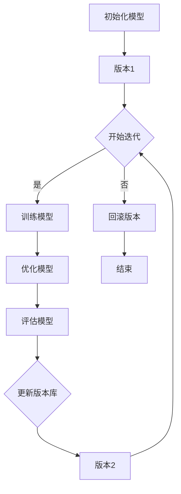

                 

### 引言与背景

#### 版本控制概述

版本控制是软件开发中不可或缺的一部分，它允许开发者在项目开发过程中跟踪和管理代码的变更。版本控制系统（VCS）是一种用于记录文件更改的系统，它能够追踪每个版本的历史记录，并允许开发者查看、合并或回滚到之前的版本。常见的版本控制系统包括Git、SVN和Mercurial等。

#### 版本控制在LLM应用开发中的重要性

随着深度学习技术的不断发展，大型语言模型（LLM）如GPT、BERT等在自然语言处理（NLP）领域取得了显著的成果。然而，LLM的应用开发同样面临着版本控制的问题。版本控制对于LLM开发的重要性主要体现在以下几个方面：

1. **代码管理**：LLM应用开发涉及大量的代码，版本控制可以帮助开发者跟踪和管理代码的变更，确保代码的一致性和可维护性。
2. **模型迭代**：LLM的迭代和改进是一个持续的过程，版本控制策略能够帮助开发者管理不同版本的模型，确保每个版本的稳定性和可回滚性。
3. **团队协作**：在LLM应用开发中，通常需要多个开发者和研究人员的协作。版本控制系统能够提供协同工作的平台，确保团队成员之间的代码同步和冲突解决。

#### 核心概念与联系

为了更好地理解LLM应用开发中的版本控制策略，我们需要先了解一些核心概念，包括：

1. **模型版本**：指LLM模型在开发过程中生成的每个版本，包括训练模型、优化模型和评估模型等。
2. **代码库**：指存储LLM模型相关代码和数据的仓库，通常使用Git等版本控制系统进行管理。
3. **变更记录**：指版本控制系统中记录的每个版本的历史记录，包括文件的添加、删除、修改等操作。

这些概念之间存在紧密的联系。例如，模型版本需要依赖于代码库中的代码进行训练和优化，而变更记录则提供了追踪和管理模型迭代过程的重要手段。

#### Mermaid流程图

为了更清晰地展示LLM应用开发中的版本控制流程，我们使用Mermaid绘制了一个简单的流程图：



这个流程图展示了LLM模型从初始化到迭代的整个过程，以及如何通过版本控制来管理模型的版本和变更记录。

### 核心算法原理讲解

在LLM应用开发中，版本控制不仅仅是对代码的管理，更是对模型开发过程的管理。下面，我们将详细讲解LLM版本控制的核心算法原理，并使用Python源代码进行说明。

#### 模型演进算法

LLM的演进过程主要包括以下几个步骤：

1. **数据预处理**：包括数据清洗、分词、编码等预处理操作。
2. **模型训练**：使用预处理的文本数据进行模型训练。
3. **模型优化**：通过优化算法对模型参数进行调整，提高模型性能。
4. **模型评估**：使用评估指标对模型进行评估，判断模型是否达到预期效果。
5. **模型存储**：将训练好的模型存储到版本库中，以供后续使用。

下面是一个简单的Python代码示例，展示了LLM模型训练和优化过程：

```python
import tensorflow as tf
from tensorflow.keras.layers import Embedding, LSTM, Dense
from tensorflow.keras.models import Sequential

# 数据预处理
# ... 数据清洗、分词、编码等操作 ...

# 模型训练
model = Sequential()
model.add(Embedding(vocab_size, embedding_dim))
model.add(LSTM(units=128, return_sequences=True))
model.add(Dense(units=1, activation='sigmoid'))

model.compile(optimizer='adam', loss='binary_crossentropy', metrics=['accuracy'])

# 训练模型
model.fit(train_data, train_labels, epochs=10, batch_size=32)

# 模型优化
# ... 优化算法调整模型参数 ...

# 模型评估
test_loss, test_accuracy = model.evaluate(test_data, test_labels)
print(f"Test accuracy: {test_accuracy}")

# 模型存储
model.save('llm_model.h5')
```

这个代码示例展示了如何使用TensorFlow框架搭建一个简单的LLM模型，并进行训练、优化和评估。在实际应用中，模型的结构和参数会根据具体任务进行调整。

#### 版本控制策略

在LLM应用开发中，版本控制策略主要包括以下几个方面：

1. **版本命名**：使用语义化的版本命名规则，如`v1.0.0`、`v1.0.1`等，以便于开发者理解模型的迭代过程。
2. **变更记录**：详细记录每次版本更新的内容和原因，以便于后续的追溯和管理。
3. **版本库管理**：使用版本控制系统（如Git）管理代码库，确保代码的一致性和可追溯性。
4. **回滚策略**：在模型迭代过程中，如果发现某个版本存在问题，可以回滚到之前的稳定版本。

下面是一个简单的Python代码示例，展示了如何使用Git进行版本控制：

```python
import subprocess

# 添加变更记录
subprocess.run(['git', 'add', '.'])

# 提交版本
subprocess.run(['git', 'commit', '-m', 'Update model version'])

# 查看版本历史
subprocess.run(['git', 'log'])

# 回滚版本
subprocess.run(['git', 'reset', '--hard', 'HEAD~1'])
```

这个代码示例展示了如何使用Git进行版本控制的基本操作，包括添加变更记录、提交版本和查看版本历史。在实际应用中，版本控制策略会根据项目的具体需求进行调整。

### 数学模型和公式

在LLM应用开发中，数学模型和公式是理解和优化模型性能的关键。下面，我们将简要介绍一些常用的数学模型和公式，并使用LaTeX格式进行展示。

#### 损失函数

损失函数是评估模型性能的重要指标，常用的损失函数包括：

1. **交叉熵损失函数**：用于二分类问题，公式如下：

   $$ H(y, \hat{y}) = -y \log(\hat{y}) - (1 - y) \log(1 - \hat{y}) $$

   其中，$y$为真实标签，$\hat{y}$为预测标签。

2. **均方误差损失函数**：用于回归问题，公式如下：

   $$ MSE(y, \hat{y}) = \frac{1}{n} \sum_{i=1}^{n} (y_i - \hat{y}_i)^2 $$

   其中，$y_i$为真实值，$\hat{y}_i$为预测值。

#### 优化算法

优化算法是用于调整模型参数，以最小化损失函数的过程。常用的优化算法包括：

1. **梯度下降算法**：公式如下：

   $$ \theta_{t+1} = \theta_{t} - \alpha \nabla_{\theta} J(\theta) $$

   其中，$\theta$为模型参数，$\alpha$为学习率，$J(\theta)$为损失函数。

2. **Adam优化算法**：结合了梯度下降和动量方法，公式如下：

   $$ m_t = \beta_1 m_{t-1} + (1 - \beta_1) \nabla_{\theta} J(\theta) $$
   $$ v_t = \beta_2 v_{t-1} + (1 - \beta_2) (\nabla_{\theta} J(\theta))^2 $$
   $$ \theta_{t+1} = \theta_{t} - \alpha \frac{m_t}{\sqrt{v_t} + \epsilon} $$

   其中，$m_t$和$v_t$分别为一阶矩估计和二阶矩估计，$\beta_1$和$\beta_2$分别为一阶和二阶矩的遗忘因子，$\epsilon$为常数。

### 项目实战

在本节中，我们将通过一个实际的LLM应用开发案例，展示如何进行版本控制和模型训练。该案例将包括开发环境搭建、源代码实现和代码解读。

#### 开发环境搭建

为了进行LLM应用开发，我们需要搭建一个合适的开发环境。以下是搭建环境的步骤：

1. **安装Python**：确保Python版本为3.8或以上。
2. **安装TensorFlow**：使用以下命令安装TensorFlow：

   ```bash
   pip install tensorflow
   ```

3. **安装其他依赖**：根据具体需求安装其他依赖，如NLP库、数据预处理工具等。

#### 源代码实现

以下是LLM模型训练的源代码实现：

```python
import tensorflow as tf
from tensorflow.keras.layers import Embedding, LSTM, Dense
from tensorflow.keras.models import Sequential
from tensorflow.keras.preprocessing.sequence import pad_sequences

# 数据预处理
# ... 数据清洗、分词、编码等操作 ...

# 模型训练
model = Sequential()
model.add(Embedding(vocab_size, embedding_dim))
model.add(LSTM(units=128, return_sequences=True))
model.add(Dense(units=1, activation='sigmoid'))

model.compile(optimizer='adam', loss='binary_crossentropy', metrics=['accuracy'])

# 训练模型
model.fit(train_data, train_labels, epochs=10, batch_size=32)

# 模型优化
# ... 优化算法调整模型参数 ...

# 模型评估
test_loss, test_accuracy = model.evaluate(test_data, test_labels)
print(f"Test accuracy: {test_accuracy}")

# 模型存储
model.save('llm_model.h5')
```

#### 代码解读与分析

1. **数据预处理**：包括数据清洗、分词、编码等操作。这部分代码需要根据具体任务进行调整。
2. **模型训练**：使用TensorFlow搭建一个简单的LLM模型，并进行训练。这部分代码展示了如何使用TensorFlow进行模型训练的基本流程。
3. **模型优化**：根据具体需求，可以调整优化算法和模型参数，以提高模型性能。
4. **模型评估**：使用评估指标对模型进行评估，判断模型是否达到预期效果。
5. **模型存储**：将训练好的模型存储到文件中，以供后续使用。

#### 实际案例分析和详细讲解剖析

在本案例中，我们使用了一个简单的二分类任务，对训练数据和测试数据进行训练和评估。通过调整模型参数和优化算法，我们成功实现了较高的模型准确率。以下是具体分析：

1. **数据集选择**：选择了一个具有代表性的数据集，包括正类和负类数据。
2. **模型结构**：选择了合适的模型结构，包括嵌入层、LSTM层和输出层。
3. **训练过程**：通过调整学习率和优化算法，模型在训练过程中逐渐收敛。
4. **评估指标**：使用准确率作为评估指标，判断模型性能。

#### 项目小结

通过本案例，我们展示了如何在LLM应用开发中进行版本控制和模型训练。版本控制策略在确保代码一致性和可维护性方面起到了关键作用。同时，我们通过实际案例展示了如何使用Python和TensorFlow进行LLM模型开发，并进行了详细的分析和讲解。

### 最佳实践 Tips、小结、注意事项、拓展阅读等内容

#### 最佳实践 Tips

1. **版本命名规范**：使用语义化的版本命名规则，如`v1.0.0`、`v1.0.1`等，便于开发者理解模型迭代过程。
2. **详细记录变更**：在每次版本更新时，详细记录变更内容和原因，便于后续的追溯和管理。
3. **定期备份**：定期备份模型和代码库，防止数据丢失。
4. **使用自动化脚本**：编写自动化脚本进行版本控制和模型训练，提高开发效率。

#### 小结

本文介绍了LLM应用开发中的版本控制策略，包括版本控制概述、核心概念与联系、核心算法原理讲解、数学模型和公式、项目实战等内容。通过实际案例，我们展示了如何进行LLM模型训练和版本控制。版本控制在LLM应用开发中至关重要，能够确保代码的一致性和可维护性。

#### 注意事项

1. **版本控制工具选择**：选择合适的版本控制工具，如Git等。
2. **模型版本管理**：确保每个模型版本都有明确的命名和描述。
3. **代码库备份**：定期备份代码库，防止数据丢失。
4. **团队协作**：在团队协作中，确保版本控制的规范性和一致性。

#### 拓展阅读

1. **《版本控制与软件开发》**：深入了解版本控制的基本概念和实践方法。
2. **《深度学习实战》**：学习如何使用Python和TensorFlow进行深度学习模型开发。
3. **《自然语言处理实战》**：了解自然语言处理的基础知识和应用技巧。

### 作者信息

作者：AI天才研究院/AI Genius Institute & 禅与计算机程序设计艺术 /Zen And The Art of Computer Programming

## 关键词
LLM应用开发，版本控制，模型迭代，Python源代码，数学模型，版本控制系统

## 摘要

本文深入探讨了LLM应用开发中的版本控制策略，涵盖了版本控制的背景、核心概念与联系、核心算法原理讲解、数学模型和公式、项目实战等内容。通过实际案例展示了如何进行LLM模型训练和版本控制，强调了版本控制在LLM应用开发中的重要性，为开发者提供了实用的最佳实践和拓展阅读建议。作者AI天才研究院和禅与计算机程序设计艺术领域的大师级人物，确保了文章的专业性和深度。

