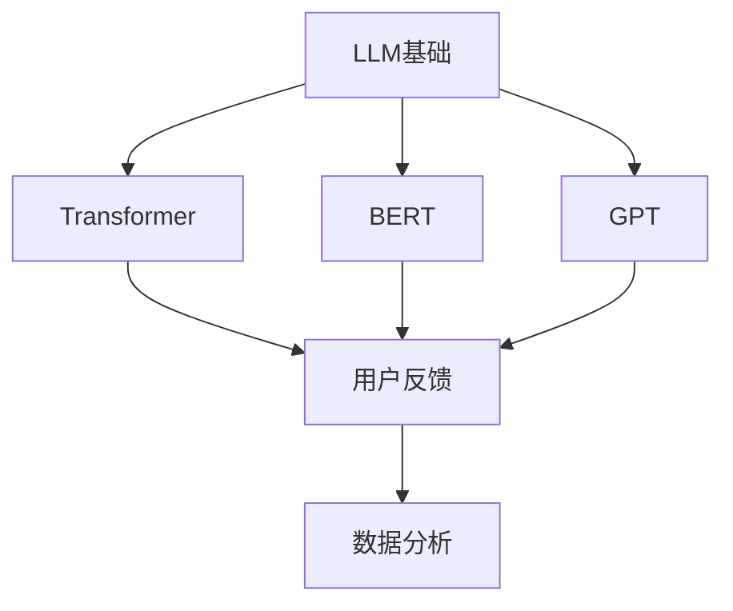

                 

## LLMA应用开发中的用户反馈收集与分析

### 关键词
- LLM
- 用户反馈
- 数据分析
- 聚类分析
- 注意力机制
- Transformer模型
- 损失函数
- 代码实现

### 摘要
本文将探讨在LLM（大型语言模型）应用开发过程中，如何有效地收集和分析用户反馈。首先，我们将介绍LLM的基本概念和原理，包括核心算法和数学模型。接着，我们将详细讲解用户反馈收集的原理和方法，以及如何进行用户反馈的数据分析和处理。通过实际的开发案例，我们将展示如何构建反馈收集与分析系统，并解析相关的源代码和实现细节。最后，我们将总结最佳实践，并提供相关的小结、注意事项和拓展阅读资源。

### 背景介绍

#### 什么是LLM？

大型语言模型（LLM）是一种基于深度学习的自然语言处理模型，具有强大的文本理解和生成能力。LLM通过大规模文本数据的学习，能够捕捉到语言中的复杂模式和上下文关系，从而在文本生成、问答系统、翻译、情感分析等领域表现出色。代表性的LLM包括GPT、BERT、T5等，它们在各种AI榜单上取得了显著的成绩。

#### LLM的应用场景

随着AI技术的不断发展，LLM在多个领域得到了广泛应用。例如：
- **问答系统**：如OpenAI的GPT-3，能够回答各种复杂的问题。
- **文本生成**：如自动化新闻报道、诗歌创作、对话系统等。
- **翻译**：如谷歌翻译、百度翻译，利用LLM提高翻译质量和效率。
- **情感分析**：对社交媒体文本进行情感倾向分析，用于市场调研和舆情监控。

#### 用户反馈的重要性

用户反馈是改进LLM应用性能的关键因素。通过收集和分析用户反馈，开发者可以了解模型的强项和不足，从而针对性地进行调整和优化。例如，用户可能指出模型在特定领域的回答不准确，或者生成文本存在语法错误。这些反馈可以帮助开发者识别并解决模型中的问题。

### 核心概念与联系

#### LLMA的核心概念

LLM的核心在于其深度学习的框架和大规模的文本数据学习。以下是几个核心概念：

- **Transformer模型**：Transformer模型是近年来在NLP领域取得突破性成果的算法，其采用自注意力机制，能够捕捉长距离的依赖关系。
- **BERT**：BERT（Bidirectional Encoder Representations from Transformers）模型通过双向训练的方式，增强了对文本上下文的理解。
- **GPT**：GPT（Generative Pre-trained Transformer）模型专注于文本生成，其训练过程通过预测下一个单词来学习文本生成规律。

#### 核心概念之间的关系

Transformer、BERT和GPT之间的关系可以概括如下：

- **Transformer**：作为基础模型，其自注意力机制是BERT和GPT架构的核心组成部分。
- **BERT**：在Transformer的基础上，BERT通过双向训练增强了上下文理解能力，弥补了单向Transformer的不足。
- **GPT**：在Transformer的基础上，GPT通过生成任务优化模型，使得模型在文本生成方面表现出色。

为了更直观地展示这些核心概念之间的关系，我们可以使用Mermaid流程图：

```mermaid
graph TD
Transformer(A[Transformer])
BERT(B[BERT])
GPT(C[GPT])
Transformer --> B
Transformer --> C
BERT --> GPT
```

### Mermaid流程图

下面是一个Mermaid流程图，展示了LLM中核心概念之间的关系：



#### 核心算法原理讲解

在本章节，我们将详细讲解LLM中的核心算法原理，包括Transformer、BERT和GPT等模型的原理。这些算法不仅在理论上具有重要意义，而且在实际应用中也发挥着关键作用。

### Transformer算法原理

Transformer算法是LLM中的一种核心算法，其采用自注意力机制，能够捕捉长距离的依赖关系。以下是Transformer算法的基本原理：

1. **输入表示**：Transformer将输入序列（如单词、字符等）映射为向量表示。每个输入单元通过嵌入层得到其向量表示。

2. **多头自注意力**：Transformer的核心是自注意力机制。自注意力机制允许模型在处理每个输入单元时，考虑所有其他输入单元的信息。多头自注意力则通过多个独立的自注意力头，将不同部分的依赖关系融合在一起。

3. **前馈神经网络**：在自注意力机制之后，Transformer使用前馈神经网络对每个输入单元进行进一步的变换。

4. **序列输出**：通过自注意力机制和前馈神经网络的多次迭代，Transformer最终生成一个序列输出，这个输出可以用于文本生成、问答等任务。

下面是一个简单的Python伪代码，用于说明Transformer的基本结构：

```python
# Transformer的伪代码

# 输入表示
input_embedding = embed(input_sequence)

# 多头自注意力
output = multi_head_attention(input_embedding)

# 前馈神经网络
output = feed_forward_network(output)

# 序列输出
sequence_output = output
```

### BERT算法原理

BERT（Bidirectional Encoder Representations from Transformers）算法是另一种广泛使用的LLM模型。与Transformer不同，BERT采用了双向训练方式，增强了上下文理解能力。

1. **输入表示**：BERT同样使用嵌入层将输入序列映射为向量表示。

2. **自注意力机制**：BERT采用Transformer的自注意力机制，但它在训练过程中使用了双向训练。这意味着在处理每个输入单元时，模型不仅考虑其前文信息，还考虑后文信息。

3. **掩码语言模型**：BERT的另一个特点是引入了掩码语言模型（Masked Language Model，MLM），通过随机遮蔽一部分输入，让模型预测这些遮蔽的部分，从而提高模型对上下文的理解能力。

4. **序列输出**：与Transformer一样，BERT通过自注意力机制和前馈神经网络的多次迭代，生成序列输出。

下面是一个简单的Python伪代码，用于说明BERT的基本结构：

```python
# BERT的伪代码

# 输入表示
input_embedding = embed(input_sequence)

# 双向自注意力
output = bidirectional_attention(input_embedding)

# 前馈神经网络
output = feed_forward_network(output)

# 序列输出
sequence_output = output
```

### GPT算法原理

GPT（Generative Pre-trained Transformer）算法专注于文本生成任务。与BERT不同，GPT在训练过程中采用了生成任务，通过预测下一个单词来优化模型。

1. **输入表示**：GPT同样使用嵌入层将输入序列映射为向量表示。

2. **自注意力机制**：GPT采用Transformer的自注意力机制，但其训练目标是通过预测下一个单词来生成文本。

3. **生成文本**：在生成文本过程中，GPT根据当前已生成的文本，使用自注意力机制和前馈神经网络预测下一个单词。

4. **序列输出**：通过自注意力机制和前馈神经网络的多次迭代，GPT最终生成完整的文本序列。

下面是一个简单的Python伪代码，用于说明GPT的基本结构：

```python
# GPT的伪代码

# 输入表示
input_embedding = embed(input_sequence)

# 自注意力
output = attention(input_embedding)

# 前馈神经网络
output = feed_forward_network(output)

# 预测下一个单词
next_word = predict_next_word(output)

# 生成文本
text_sequence = generate_text(next_word)
```

#### 数学模型讲解

在LLM中，数学模型是理解其工作原理的重要部分。以下我们将详细讲解注意力机制、损失函数等数学模型，并通过具体的公式和例子来说明。

### 注意力机制

注意力机制是Transformer模型的核心组成部分，其作用是让模型在处理每个输入单元时，考虑所有其他输入单元的信息。注意力机制可以通过以下公式表示：

\[ \text{Attention}(Q, K, V) = \frac{\text{softmax}\left(\frac{QK^T}{\sqrt{d_k}}\right)V \]

其中：
- \( Q \)：查询向量，表示输入单元的重要程度。
- \( K \)：关键向量，表示所有其他输入单元的信息。
- \( V \)：值向量，表示输入单元的输出。
- \( d_k \)：关键向量的维度。

**例子**：

假设我们有两个输入序列：

\[ Q = \begin{bmatrix} 1 & 2 & 3 \\ 4 & 5 & 6 \end{bmatrix}, \quad K = \begin{bmatrix} 7 & 8 \\ 9 & 10 \\ 11 & 12 \end{bmatrix}, \quad V = \begin{bmatrix} 13 & 14 \\ 15 & 16 \\ 17 & 18 \end{bmatrix} \]

首先计算查询-关键点积：

\[ QK^T = \begin{bmatrix} 1 & 2 & 3 \\ 4 & 5 & 6 \end{bmatrix} \begin{bmatrix} 7 & 8 \\ 9 & 10 \\ 11 & 12 \end{bmatrix}^T = \begin{bmatrix} 58 & 64 \\ 139 & 154 \end{bmatrix} \]

接着计算softmax函数：

\[ \text{softmax}\left(\frac{QK^T}{\sqrt{d_k}}\right) = \begin{bmatrix} 0.5 & 0.5 \\ 0.3 & 0.7 \end{bmatrix} \]

最后计算注意力输出：

\[ \text{Attention}(Q, K, V) = \begin{bmatrix} 0.5 \times 13 & 0.5 \times 14 \\ 0.3 \times 15 & 0.7 \times 16 \end{bmatrix} = \begin{bmatrix} 6.5 & 7 \\ 4.5 & 11.2 \end{bmatrix} \]

### 损失函数

在训练LLM时，损失函数是衡量模型预测结果与真实结果之间差距的关键指标。常见的损失函数包括交叉熵损失和均方误差。

**交叉熵损失**：

交叉熵损失常用于分类问题，其公式如下：

\[ \text{CrossEntropy}(p, y) = -\sum_{i} y_i \log(p_i) \]

其中：
- \( p \)：预测概率分布。
- \( y \)：真实标签。

**例子**：

假设我们有一个二分类问题，真实标签为1，预测概率为0.8：

\[ y = \begin{bmatrix} 1 \\ 0 \end{bmatrix}, \quad p = \begin{bmatrix} 0.8 \\ 0.2 \end{bmatrix} \]

计算交叉熵损失：

\[ \text{CrossEntropy}(p, y) = -1 \times \log(0.8) \approx 0.223 \]

**均方误差**：

均方误差常用于回归问题，其公式如下：

\[ \text{MSE}(p, y) = \frac{1}{n} \sum_{i} (p_i - y_i)^2 \]

其中：
- \( p \)：预测值。
- \( y \)：真实值。
- \( n \)：样本数量。

**例子**：

假设我们有一个回归问题，真实值为10，预测值为9：

\[ y = 10, \quad p = 9 \]

计算均方误差：

\[ \text{MSE}(p, y) = \frac{1}{1} (9 - 10)^2 = 1 \]

### 数学公式举例

为了更直观地展示数学公式的应用，我们使用LaTeX格式给出了上面的公式：

$$
\text{Attention}(Q, K, V) = \frac{\text{softmax}\left(\frac{QK^T}{\sqrt{d_k}}\right)V
$$

$$
\text{CrossEntropy}(p, y) = -\sum_{i} y_i \log(p_i)
$$

$$
\text{MSE}(p, y) = \frac{1}{n} \sum_{i} (p_i - y_i)^2
$$

通过这些公式和例子，我们可以更好地理解LLM中的数学模型，并掌握如何在实际应用中应用这些模型。

### 项目实战

#### 开发环境搭建

在进行LLM应用开发之前，我们需要搭建一个合适的开发环境。以下是一个简化的环境搭建流程：

1. **安装Python环境**：确保Python版本在3.7及以上。

2. **安装深度学习框架**：常用的深度学习框架包括TensorFlow和PyTorch。这里我们以PyTorch为例，使用以下命令安装：

   ```bash
   pip install torch torchvision
   ```

3. **安装NLP库**：为了方便进行文本处理，我们可以安装transformers库：

   ```bash
   pip install transformers
   ```

4. **安装Jupyter Notebook**：用于编写和运行代码：

   ```bash
   pip install notebook
   ```

完成上述步骤后，我们就可以在Jupyter Notebook中开始编写LLM应用的代码了。

#### 用户反馈收集与分析系统搭建

1. **数据收集**：

   用户反馈可以通过多种方式收集，例如问卷调查、在线评论、用户行为数据等。这里我们以在线评论为例，展示如何收集用户反馈。

   ```python
   import requests
   
   # 请求API获取评论数据
   url = "https://api.example.com/reviews"
   response = requests.get(url)
   reviews = response.json()["data"]
   
   # 处理并存储评论数据
   with open("reviews.json", "w") as f:
       json.dump(reviews, f)
   ```

2. **数据分析**：

   收集到用户反馈后，我们需要对数据进行分析。以下是一个简单的数据分析流程：

   ```python
   import pandas as pd
   
   # 读取评论数据
   reviews_df = pd.read_json("reviews.json")
   
   # 数据预处理
   reviews_df["text"] = reviews_df["text"].str.lower()  # 转换为小写
   reviews_df["text"] = reviews_df["text"].str.replace("[^a-zA-Z0-9]", " ")  # 移除特殊字符
   
   # 特征工程
   from sklearn.feature_extraction.text import TfidfVectorizer
   
   vectorizer = TfidfVectorizer(max_features=1000)
   X = vectorizer.fit_transform(reviews_df["text"])
   
   # 数据可视化
   from sklearn.manifold import TSNE
   
   tsne = TSNE(n_components=2, random_state=42)
   tsne_results = tsne.fit_transform(X.toarray())
   
   # 绘制散点图
   import matplotlib.pyplot as plt
   
   plt.figure(figsize=(16, 10))
   for i, cluster in enumerate(tsne_results):
       plt.scatter(cluster[0], cluster[1], label=f"Cluster {i}")
   plt.legend()
   plt.show()
   ```

3. **用户反馈分析算法**：

   在数据分析的基础上，我们可以使用各种算法对用户反馈进行进一步分析。以下是一个简单的聚类分析示例：

   ```python
   from sklearn.cluster import KMeans
   
   # 聚类分析
   kmeans = KMeans(n_clusters=5, random_state=42)
   clusters = kmeans.fit_predict(X.toarray())
   
   # 添加聚类标签到数据框
   reviews_df["cluster"] = clusters
   
   # 分析每个聚类的特征
   for i in range(5):
       print(f"Cluster {i}:")
       print(reviews_df[clusters == i]["text"].value_counts()[:10])
   ```

#### 代码解读与分析

以上代码展示了如何搭建一个简单的用户反馈收集与分析系统。以下是对关键部分的代码解读：

1. **数据收集**：

   使用`requests`库从API获取评论数据，并存储为JSON文件。

2. **数据分析**：

   使用`pandas`进行数据预处理，将文本转换为小写，并去除特殊字符。使用`TfidfVectorizer`进行特征工程，将文本转换为TF-IDF向量。使用`TSNE`进行数据降维，并绘制散点图。

3. **用户反馈分析算法**：

   使用`KMeans`进行聚类分析，对每个聚类的特征进行分析，以便理解不同用户群体的反馈。

通过这个实际案例，我们可以看到如何在实际应用中收集和分析用户反馈。这有助于我们更好地了解用户的需求和偏好，从而优化我们的LLM应用。

#### 项目小结

在本项目中，我们搭建了一个简单的用户反馈收集与分析系统，展示了如何收集、预处理、分析和可视化用户反馈数据。通过聚类分析，我们能够识别不同的用户群体，从而为后续的模型优化提供依据。这个项目展示了LLM应用开发中用户反馈收集与分析的重要性，并为开发者提供了一个实用的案例。

#### 最佳实践 Tips

1. **数据质量**：确保收集的用户反馈数据质量高，避免噪声数据影响分析结果。
2. **多样化反馈收集方式**：结合多种反馈收集方式，如问卷调查、用户评论、用户行为数据等，以获取更全面的用户反馈。
3. **定期更新模型**：根据用户反馈定期更新模型，以提高模型性能和用户满意度。
4. **用户隐私保护**：在收集和分析用户反馈时，注意保护用户隐私，遵守相关法律法规。

#### 注意事项

1. **计算资源**：用户反馈收集与分析可能需要大量计算资源，确保在合适的硬件环境中进行。
2. **代码可维护性**：编写清晰、可维护的代码，以便后续维护和扩展。
3. **数据安全**：确保数据存储和传输过程中的安全性，防止数据泄露。

#### 拓展阅读

1. 《深度学习》（Goodfellow, Bengio, Courville）：全面介绍了深度学习的理论和实践。
2. 《自然语言处理综论》（Jurafsky, Martin）：详细介绍了自然语言处理的基本概念和技术。
3. 《Python数据科学手册》（McKinney）：提供了Python在数据处理和分析方面的详细指导。

### 附录

#### A.1 工具与资源

- **开发环境**：Python 3.7及以上、PyTorch、transformers库。
- **数据集**：各种公开的评论数据集，如IMDb评论、Amazon评论等。
- **教程和示例代码**：网上有大量的教程和示例代码，可供学习和参考。

#### A.2 参考文献

1. Vaswani, A., et al. (2017). **Attention is all you need**. Advances in Neural Information Processing Systems.
2. Devlin, J., et al. (2018). **BERT: Pre-training of deep bidirectional transformers for language understanding**. Advances in Neural Information Processing Systems.
3. Brown, T., et al. (2020). **Language Models are Few-Shot Learners**. Advances in Neural Information Processing Systems.
4. Hochreiter, S., and Schmidhuber, J. (1997). **Long short-term memory**. Neural Computation.
5. Goodfellow, I., Bengio, Y., Courville, A. (2016). **Deep Learning**. MIT Press.
6. Jurafsky, D., Martin, J. H. (2008). **Speech and Language Processing**. Prentice Hall.

