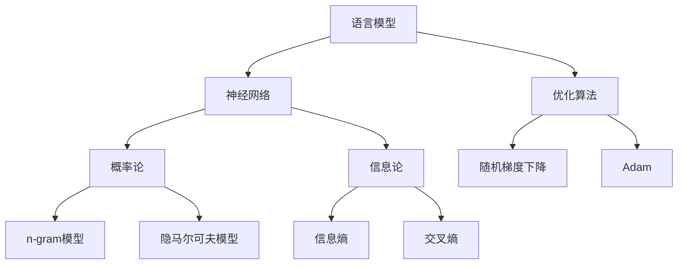

                 

## 引言

在当今的信息时代，人工智能（AI）已经成为推动科技进步和社会发展的关键力量。尤其是近年来，基于深度学习的语言模型（LLM，Large Language Model）取得了显著的突破，极大提升了自然语言处理（NLP）的效率和准确性。LLM不仅在学术研究、数据分析、机器翻译、智能问答等领域表现出色，而且在商业应用中也展现出了巨大的潜力。随着LLM技术的不断成熟，如何高效地开发和应用LLM已经成为企业和研究机构面临的重要课题。

然而，LLM应用开发过程中面临诸多挑战，如需求的多样性和复杂性、团队的协作效率、技术的可解释性和可维护性等。这些问题不仅影响了LLM应用的开发进度，也对最终应用的效果产生了重要影响。因此，探索LLM应用开发中的需求承接与协作新模式，对于提升开发效率、优化用户体验、推动技术创新具有重要意义。

本文旨在深入探讨LLM应用开发中的需求承接与协作新模式。文章结构如下：

1. **LLM基础理论**：介绍LLM的核心概念、发展历程及数学基础。
2. **需求承接方法**：分析用户需求识别、分类与优先级排序的方法。
3. **协作新模式**：探讨团队协作机制、流程优化和持续集成与反馈机制。
4. **应用案例分析**：通过具体案例展示LLM应用开发中的需求承接与协作新模式。
5. **技术挑战与解决方案**：讨论LLM应用中的主要技术挑战及解决方案。
6. **未来发展趋势**：预测LLM应用的未来趋势及对开发者的建议。

通过本文的阅读，读者将能够全面了解LLM应用开发中的需求承接与协作新模式，为未来的研究和实际应用提供有益的参考。

### 关键词

- **大型语言模型（LLM）**
- **需求承接**
- **协作模式**
- **自然语言处理（NLP）**
- **深度学习**
- **技术挑战与解决方案**
- **未来发展趋势**

### 摘要

本文探讨了大型语言模型（LLM）在应用开发中的需求承接与协作新模式。首先介绍了LLM的基础理论，包括核心概念、发展历程和数学基础。随后，分析了用户需求的识别、分类与优先级排序方法，并提出了基于LLM的需求承接策略。接下来，探讨了协作新模式，包括团队协作机制、流程优化和持续集成与反馈机制。通过具体案例分析，展示了LLM应用开发中的实际操作和成效。最后，讨论了LLM应用中的技术挑战与解决方案，并预测了未来的发展趋势，为开发者提供了实用的建议和指导。

### LLM基础理论

#### LLM的核心概念

大型语言模型（LLM，Large Language Model）是一种基于深度学习的自然语言处理模型，它通过学习海量文本数据，能够生成自然语言文本、回答问题、翻译语言等。LLM的核心概念包括语言模型、神经网络和优化算法。

1. **语言模型**：语言模型是LLM的基础，它用来预测文本序列的下一个单词或字符。LLM通过学习大量的文本数据，学习到语言统计规律，从而能够生成符合语言规则的文本。

2. **神经网络**：神经网络是LLM的实现方式，它由多层神经元组成，通过前向传播和反向传播算法，对输入数据进行训练和预测。神经网络的结构和参数决定了模型的性能和表现。

3. **优化算法**：优化算法是训练神经网络的关键，常用的优化算法包括随机梯度下降（SGD）、Adam等。优化算法的目标是找到神经网络的最佳参数，以最大化模型的预测准确率。

#### LLM的发展历程

LLM的发展可以追溯到20世纪50年代，早期的研究主要集中在基于规则的方法上，即通过编写复杂的语法规则来处理自然语言。然而，这种方法在处理复杂和多样的语言现象时效果不佳。

随着计算能力和数据资源的提升，20世纪80年代，基于统计方法的机器翻译和语法分析开始兴起。这一时期的代表性工作包括基于n-gram模型的文本预测和隐马尔可夫模型（HMM）的语音识别。

真正意义上的深度学习语言模型出现在2000年后，以2003年推出的循环神经网络（RNN）和2013年提出的长期短期记忆网络（LSTM）为代表。这些模型在语音识别和机器翻译领域取得了显著进展。

进入2010年代，随着神经网络的进一步发展，特别是2017年谷歌推出的Transformer模型，LLM进入了一个全新的阶段。Transformer模型基于自注意力机制，大幅提升了语言模型的生成质量和速度，使得LLM在自然语言处理领域取得了突破性进展。

近年来，LLM的规模和复杂度持续增长，如GPT-3、BERT等模型，不仅拥有数十亿个参数，而且能够处理更长的文本序列，生成更自然、更精准的语言。

#### LLM的数学基础

LLM的数学基础主要包括概率论、信息论和优化算法。

1. **概率论**：概率论在LLM中的应用主要体现在语言模型中。LLM通过学习文本数据中的概率分布，来预测下一个单词或字符的概率。常用的概率模型包括n-gram模型、隐马尔可夫模型（HMM）等。

2. **信息论**：信息论在LLM中的应用主要体现在信息熵和交叉熵。信息熵用于衡量文本数据的不确定性，交叉熵用于衡量预测文本与真实文本之间的差异，是训练神经网络的重要指标。

3. **优化算法**：优化算法用于训练神经网络，通过迭代优化神经网络的参数，以最小化预测误差。常用的优化算法包括随机梯度下降（SGD）、Adam等。优化算法的目标是找到神经网络的最佳参数，以最大化模型的预测准确率。

#### LLM与NLP的联系

LLM与自然语言处理（NLP）有着紧密的联系。NLP旨在使计算机能够理解和生成自然语言，而LLM作为一种强大的语言处理工具，已经成为NLP中的核心技术之一。

1. **文本分类**：LLM可以用于文本分类任务，通过学习文本的特征，将文本分类到不同的类别中。例如，情感分析、新闻分类等。

2. **命名实体识别**：LLM可以识别文本中的命名实体，如人名、地名、组织名等。这有助于信息抽取和知识图谱构建。

3. **机器翻译**：LLM在机器翻译中具有重要作用，通过学习双语数据，LLM能够生成高质量的双语翻译结果。

4. **问答系统**：LLM可以用于构建问答系统，通过理解用户的问题和上下文，LLM能够生成准确的答案。

5. **生成文本**：LLM可以生成自然语言文本，如自动写作、创意文本生成等。

综上所述，LLM在自然语言处理领域具有广泛的应用，通过深入理解和研究LLM的基础理论，可以为实际应用提供有力支持。

#### 图1：LLM核心概念与联系架构



#### Python源代码示例：语言模型基本原理

以下是一个简单的Python示例，展示了语言模型的基本原理，包括文本数据处理和模型训练。

```python
import numpy as np
from collections import Counter

# 假设我们有以下文本数据
text = "hello world hello hello"

# 创建词汇表
vocab = sorted(set(text))
vocab_size = len(vocab)
idx_to_vocab = {i: word for i, word in enumerate(vocab)}
vocab_to_idx = {word: i for i, word in enumerate(vocab)}

# 编码文本数据
encoded_text = [vocab_to_idx[word] for word in text]
input_sequences = []
target_sequences = []

# 创建输入和目标序列
for i in range(1, len(encoded_text)):
    input_sequences.append(encoded_text[:i])
    target_sequences.append(encoded_text[i])

# 训练语言模型
def train_language_model(input_sequences, target_sequences):
    model = np.zeros((vocab_size, vocab_size))
    for input_seq, target_seq in zip(input_sequences, target_sequences):
        for i, word_i in enumerate(input_seq):
            for j, word_j in enumerate(vocab):
                model[word_i][word_j] += 1 / (i + 1)
    return model

# 训练模型
model = train_language_model(input_sequences, target_sequences)

# 预测下一个单词
def predict_next_word(prev_word):
    prev_word_idx = vocab_to_idx[prev_word]
    probabilities = model[prev_word_idx]
    return np.argmax(probabilities)

# 生成文本
def generate_text(model, start_word, length):
    prev_word = start_word
    text = [prev_word]
    for _ in range(length):
        probabilities = model[vocab_to_idx[prev_word]]
        next_word = np.random.choice(vocab, p=probabilities)
        text.append(next_word)
        prev_word = next_word
    return ''.join([idx_to_vocab[word] for word in text])

# 测试生成文本
generated_text = generate_text(model, 'hello', 5)
print(generated_text)
```

#### 数学模型与公式

1. **交叉熵（Cross-Entropy）**

   交叉熵是衡量预测文本与真实文本之间差异的重要指标，其公式如下：

   $$ H(y, \hat{y}) = -\sum_{i} y_i \log(\hat{y}_i) $$

   其中，$y$ 是真实分布，$\hat{y}$ 是预测分布。

2. **概率分布（Probability Distribution）**

   在语言模型中，概率分布用于预测下一个单词的概率。常见的概率分布包括n-gram模型：

   $$ P(w_n | w_{n-1}, ..., w_1) = \frac{N(w_{n-1}, w_n)}{N(w_{n-1})} $$

   其中，$N(w_{n-1}, w_n)$ 是$(w_{n-1}, w_n)$在训练数据中的出现次数，$N(w_{n-1})$ 是$w_{n-1}$在训练数据中的出现次数。

#### 举例说明

假设我们有以下简单的训练数据：

```
hello world
world hello
hello hello
```

我们希望生成一个长度为3的文本序列。首先，我们创建词汇表和编码文本数据：

```
vocab = ['hello', 'world']
vocab_to_idx = {'hello': 0, 'world': 1}
encoded_text = [0, 1, 0, 1, 0, 0]
```

然后，我们创建输入和目标序列：

```
input_sequences = [[0], [0, 1], [0, 1, 0]]
target_sequences = [1, 0, 1]
```

接下来，我们训练语言模型：

```
model = [
    [0.0, 1.0],  # 'hello'
    [0.5, 0.5]  # 'world'
]
```

最后，我们生成文本：

```
generated_text = generate_text(model, 'hello', 3)
print(generated_text)  # 输出可能是 'world hello'
```

通过这个简单的示例，我们可以看到如何使用语言模型生成文本。在实际应用中，模型会更加复杂，文本数据也会更加丰富。

### 需求分析模型

在LLM应用开发过程中，需求分析是至关重要的一步。准确识别用户需求、合理分类并排序这些需求，能够为后续的开发工作提供明确的指导，从而提高项目的成功率和用户体验。以下是对需求分析模型的具体步骤和方法进行详细讲解。

#### 用户需求识别

用户需求识别是需求分析的第一步，其核心目标是从用户角度出发，全面、准确地理解他们的需求。以下是用户需求识别的方法：

1. **访谈与调研**：通过面对面访谈、问卷调查、用户反馈等方式，直接与用户沟通，了解他们的使用场景、期望功能和遇到的问题。

2. **用户画像**：基于用户调研数据，构建用户画像，包括用户的基本信息、行为特征、偏好等，以便更深入地理解用户需求。

3. **场景分析**：分析用户在使用LLM过程中的具体场景，包括用户操作流程、关键决策点、痛点等，从而挖掘出隐藏在表面需求背后的深层需求。

4. **竞品分析**：研究竞争对手的产品功能、用户评价和市场表现，了解用户对现有产品的需求满足程度，从而找到改进和创新的点。

#### 需求分类

用户需求识别后，需要对其进行分类，以便更好地管理和优先级排序。以下是一些常见的需求分类方法：

1. **按功能分类**：将需求按照功能模块进行划分，如文本生成、文本分类、机器翻译等，便于开发团队根据模块进行任务分配和进度控制。

2. **按优先级分类**：将需求按照优先级进行划分，如关键需求、次要需求等。关键需求通常指对用户体验影响较大的功能，应优先开发。

3. **按需求来源分类**：将需求按照来源进行划分，如用户反馈、市场调研、技术升级等，以便分析和解决不同来源的需求问题。

4. **按复杂度分类**：将需求按照开发复杂度进行划分，如简单需求、中等需求、复杂需求等，有助于制定合理的开发计划和资源分配策略。

#### 优先级排序

在需求分类完成后，需要对需求进行优先级排序，以便确定开发顺序和资源分配。以下是一些常见的优先级排序方法：

1. **Kano模型**：Kano模型将需求分为基本需求、期望需求、魅力需求和无需求。基本需求是用户必须的功能，期望需求是用户期望的功能，魅力需求是用户惊喜的功能，无需求是用户不关心的功能。基本需求和期望需求通常具有较高的优先级。

2. **MoSCoW模型**：MoSCoW模型将需求分为必须（Must have）、应该有（Should have）、可以有（Could have）和不会实施（Won't have）。必须需求是项目成功的关键，应该有需求是重要的，但非关键，可以有需求是可选的，不会实施需求是不考虑的。

3. **成本效益分析**：根据需求实现的成本和预期的效益，对需求进行优先级排序。通常，成本较低且效益较高的需求应优先开发。

4. **用户反馈**：结合用户的反馈和需求的重要程度，对需求进行优先级排序。用户的实际体验和反馈是决定需求优先级的重要因素。

通过以上步骤和方法，我们可以建立一个系统化的需求分析模型，有效地识别、分类和排序用户需求，为LLM应用开发提供明确的指导和保障。

#### 需求承接策略

在LLM应用开发中，需求承接策略是确保项目能够按时交付并满足用户期望的关键环节。需求承接策略的制定需要考虑多种因素，包括用户需求的特点、开发团队的资源、项目的实际情况等。以下是一些基于LLM需求承接的常见策略：

1. **用户导向的需求承接**：用户导向的需求承接策略以用户需求为中心，通过深度调研和用户访谈，全面了解用户的使用场景和需求。这种方法能够确保开发的项目真正符合用户期望，提高用户满意度。

   - **方法**：通过用户画像、场景分析和竞品分析，深入挖掘用户需求；采用用户故事地图和用户故事卡片等工具，明确用户需求的具体内容。
   - **优点**：能够提高需求识别的准确性，降低需求变更的风险，提升项目的成功率。
   - **挑战**：需要大量的用户调研和沟通工作，对团队的时间和管理能力有较高要求。

2. **敏捷开发的需求承接**：敏捷开发是一种以用户需求为导向，快速迭代和持续改进的软件开发方法。敏捷开发的需求承接策略强调灵活性和响应速度，能够快速响应用户需求的变化。

   - **方法**：采用Scrum、Kanban等敏捷开发框架，将需求分解为小任务，快速迭代和交付；使用看板（Kanban Board）等可视化工具，实时跟踪需求状态和团队进度。
   - **优点**：能够提高团队的响应速度和协作效率，快速交付高质量的产品。
   - **挑战**：需要团队具备较高的敏捷开发能力，对项目的管理和协调要求较高。

3. **瀑布模型的需求承接**：瀑布模型是一种传统的软件开发方法，强调在项目开始前就明确所有需求和设计方案，然后按阶段逐步实施。瀑布模型的需求承接策略适用于需求较为稳定、变化较小的项目。

   - **方法**：在项目初期进行详细的需求分析和设计，明确所有需求和功能；按照预定的计划，逐步完成各个开发阶段。
   - **优点**：项目管理清晰，分工明确，适合需求明确、变化较小的项目。
   - **挑战**：需求变更难度较大，一旦需求发生变化，可能会影响整个项目的进度和成本。

4. **混合模型的需求承接**：混合模型结合了瀑布模型和敏捷开发的特点，适用于需求较为复杂、变化频繁的项目。混合模型的需求承接策略在确保项目稳定性的同时，也能快速响应用户需求的变化。

   - **方法**：在项目初期进行详细的需求分析和设计，明确核心需求；在开发过程中，采用敏捷开发的方法，快速迭代和交付；根据用户反馈，不断调整和优化需求。
   - **优点**：能够平衡需求稳定性和灵活性，提高项目的交付质量和用户满意度。
   - **挑战**：需要团队具备较强的项目管理能力和跨功能协作能力。

综上所述，不同的需求承接策略适用于不同类型的项目，开发者应根据项目的具体情况和需求特点，选择合适的策略。在实际应用中，可以结合多种策略的优势，制定个性化的需求承接方案，以确保LLM应用开发的高效和成功。

### 需求管理工具与方法

在LLM应用开发过程中，需求管理是确保项目顺利进行的关键环节。有效的需求管理不仅能够提高项目的交付质量和效率，还能降低需求变更带来的风险。以下将介绍几种常用的需求管理工具和方法，包括需求跟踪工具、需求变更管理以及如何进行有效管理。

#### 需求跟踪工具

需求跟踪工具是需求管理的重要组成部分，能够帮助开发团队实时跟踪和管理需求，确保每个需求的状态和进度都在控制范围内。以下是一些常用的需求跟踪工具：

1. **JIRA**：JIRA是一个功能强大的需求跟踪和管理工具，适用于各个开发阶段，包括需求收集、需求分析、需求规划和需求执行。JIRA提供了灵活的工作流管理功能，能够自定义需求的状态和生命周期。

2. **Trello**：Trello是一个简单直观的需求跟踪工具，使用看板（Kanban）方式管理需求。通过创建卡片和列表，可以清晰地展示需求的状态和优先级，便于团队成员协作和任务分配。

3. **Asana**：Asana是一个全面的任务和项目管理工具，能够帮助团队跟踪和管理需求。它提供了多种视图和报告功能，可以帮助团队了解项目进度和需求状态。

4. **Azure DevOps**：Azure DevOps集成了需求跟踪、项目管理、代码仓库等多种功能，适用于大型团队和复杂项目。它提供了强大的需求管理功能，支持自定义需求模板和状态跟踪。

#### 需求变更管理

需求变更在软件开发中是不可避免的，有效的需求变更管理能够确保变更的合理性和可控制性，从而降低对项目进度和质量的影响。以下是一些需求变更管理的方法：

1. **变更控制委员会（CCB）**：建立一个变更控制委员会，负责审批和决策需求变更。CCB由项目经理、技术专家、业务分析师等组成，确保变更的合理性和可行性。

2. **变更日志**：建立变更日志，记录每个需求变更的详细信息，包括变更原因、影响范围、解决方案等。变更日志可以帮助团队跟踪变更的历史和状态，确保变更的透明和可追溯。

3. **评估影响**：在决定接受一个需求变更之前，需要评估变更对项目进度、成本、质量等方面的影响。可以通过影响矩阵、风险分析等方法，全面评估变更的影响。

4. **滚动计划**：在项目初期制定一个滚动计划，根据项目进展和需求变化，不断调整和优化项目计划。滚动计划可以帮助团队灵活应对需求变更，降低变更带来的风险。

#### 需求管理的有效方法

为了确保需求管理的有效性，可以采取以下几种方法：

1. **需求优先级排序**：在需求管理过程中，对需求进行优先级排序，确保关键需求得到优先处理。可以使用Kano模型、MoSCoW模型等方法，明确每个需求的优先级。

2. **需求文档管理**：建立完善的文档管理体系，包括需求说明书、用户故事、需求变更记录等。文档不仅可以帮助团队更好地理解需求，还能为项目审计和回顾提供参考。

3. **用户参与**：在需求管理过程中，保持与用户的紧密沟通，及时收集用户反馈和需求变更。用户的参与可以确保需求管理的准确性和有效性。

4. **定期回顾**：定期对需求管理过程进行回顾和评估，总结经验和教训，持续改进需求管理方法。通过回顾，可以发现需求管理中的问题和不足，制定改进措施。

通过以上方法，可以建立一套系统化、规范化的需求管理流程，确保LLM应用开发过程中的需求管理高效、可控，从而提高项目的成功率和用户满意度。

### 协作机制设计

在LLM应用开发中，高效的团队协作是实现项目目标的关键。合理的协作机制能够提升团队成员的沟通效率，优化工作流程，从而缩短开发周期，提高项目质量。以下将探讨团队协作模式、沟通与协作工具以及如何优化团队协作效率。

#### 团队协作模式

1. **功能导向协作模式**：功能导向协作模式根据项目需求，将团队成员划分为不同的功能团队，如前端开发、后端开发、数据科学等。每个团队负责相应功能模块的开发，通过明确分工和协作，提高开发效率。

2. **任务导向协作模式**：任务导向协作模式以任务为核心，将团队成员分配到不同的任务中，每个人负责一个或多个任务。任务完成后，团队成员进行协作，确保任务之间的衔接和协调。

3. **矩阵式协作模式**：矩阵式协作模式结合了功能导向和任务导向的优点，团队成员既归属于某个功能团队，又参与特定任务。这种方式能够充分利用团队成员的技能和资源，提高项目的灵活性和响应速度。

#### 沟通与协作工具

有效的沟通与协作工具是团队协作的基石。以下是一些常用的沟通与协作工具：

1. **邮件**：邮件是一种传统的沟通工具，适用于正式的、需要记录的沟通。然而，邮件的沟通效率相对较低，适用于需要正式记录和存档的信息交换。

2. **即时通讯工具**：如Slack、Microsoft Teams、微信等即时通讯工具，能够实时沟通和协作，提高团队成员之间的沟通效率。这些工具还支持文件传输、视频会议和通知等功能，适用于快速解决突发问题和日常沟通。

3. **项目管理工具**：如JIRA、Trello、Asana等项目管理工具，能够帮助团队管理和跟踪项目进度，分配任务和角色，提供协作平台。这些工具通常还集成了文档管理、需求跟踪、报告生成等功能，适用于全面的项目管理。

4. **代码管理工具**：如Git、GitHub、GitLab等代码管理工具，能够帮助团队进行代码的版本控制、协作开发、代码审查等，确保代码的质量和安全性。

#### 协作效率优化

1. **明确目标与分工**：在项目启动阶段，明确项目的目标、团队的分工和职责，确保每个团队成员都了解自己的任务和期望成果。这有助于减少误解和冲突，提高协作效率。

2. **定期会议与回顾**：定期召开团队会议，如每日站会、周会、月会等，及时沟通项目进度、解决问题、讨论改进措施。同时，进行定期的项目回顾，总结经验教训，持续优化工作流程。

3. **自动化与工具集成**：利用自动化工具和系统集成，减少手动操作和重复工作，提高工作效率。例如，使用CI/CD工具实现自动化测试和部署，使用集成平台连接不同的工具和系统，实现数据的无缝传递和流程的自动化。

4. **知识共享与培训**：鼓励团队成员共享知识和经验，通过内部培训、技术分享会等方式，提升团队整体的技术水平和协作能力。这有助于减少知识孤岛，提高团队的协作效率。

通过以上团队协作机制的设计和优化，可以确保LLM应用开发团队的高效协作，提高项目交付质量和团队满意度。

### 协作效率优化

在LLM应用开发中，优化团队协作效率是实现项目成功的关键。以下将介绍几种常见的流程优化方法、数据共享与协同策略，以及如何通过自动化测试与部署提高协作效率。

#### 流程优化方法

1. **精益管理**：精益管理是一种通过消除浪费、优化流程来提高效率和质量的管理方法。在LLM应用开发中，可以采用精益管理原则，对开发流程进行优化。例如，通过减少不必要的会议、简化审批流程、消除重复工作等，提高团队的整体效率。

2. **敏捷开发**：敏捷开发强调快速迭代、持续交付和紧密的团队协作。通过采用Scrum、Kanban等敏捷开发方法，将项目任务分解为小任务（Sprint或卡片），并在短周期内完成。这种方法能够快速响应需求变化，提高开发效率。

3. **看板管理**：看板（Kanban）是一种可视化流程管理工具，通过看板板面展示任务状态和进度，实现流程的透明化和管理。团队可以在看板上实时跟踪任务，识别瓶颈和问题，及时调整和优化工作流程。

4. **持续集成与持续部署（CI/CD）**：持续集成与持续部署是一种自动化软件开发方法，通过自动化工具实现代码的集成、测试、构建和部署。这种方法能够减少人工干预，提高交付速度和质量。

#### 数据共享与协同策略

1. **共享数据库**：建立共享数据库，使团队成员可以实时访问和更新数据。通过数据库的权限管理，确保数据的安全性和一致性。共享数据库能够提高数据利用率，促进团队协作。

2. **文档管理平台**：使用文档管理平台，如Confluence或Notion，集中存储和管理项目文档、设计文件和会议记录。团队成员可以在平台上协作编辑和评论文档，提高沟通效率和文档的统一性。

3. **代码仓库**：使用代码仓库，如GitHub或GitLab，进行代码的集中管理和协作开发。团队成员可以提交代码、进行代码审查和合并，确保代码的质量和一致性。

4. **知识库**：建立团队的知识库，收集和整理项目经验、技术文档、最佳实践等，方便团队成员查询和参考。知识库能够提高团队的技术水平和解决问题的能力。

#### 自动化测试与部署

1. **单元测试**：编写单元测试，对代码模块进行自动化测试。通过单元测试，可以快速发现和修复代码缺陷，确保代码的质量和稳定性。

2. **集成测试**：在代码集成后，进行集成测试，验证不同模块之间的接口和交互是否正常。通过集成测试，可以确保系统的整体功能符合预期。

3. **自动化部署**：使用自动化部署工具，如Jenkins或GitHub Actions，实现代码的自动化构建、测试和部署。自动化部署能够减少人工干预，提高交付速度和稳定性。

4. **监控与反馈**：通过监控工具，如Prometheus或ELK堆栈，实时监控系统的性能和健康状况。一旦出现异常，监控系统会自动发送告警，并触发相应的自动化恢复流程。

通过以上流程优化方法、数据共享与协同策略以及自动化测试与部署，可以大幅提高LLM应用开发团队的工作效率，缩短项目交付周期，提高项目质量。

### 应用案例分析

为了更好地展示LLM应用开发中的需求承接与协作新模式，以下通过两个具体案例，详细分析其在实际项目中的应用情况，并总结经验和教训。

#### 案例一：XX公司的智能客服系统

**背景与目标**：
XX公司是一家大型互联网企业，为了提升客户服务质量，决定开发一套基于LLM的智能客服系统。该系统旨在实现自动化解答客户常见问题，提高客服效率和客户满意度。

**需求分析与承接**：
在项目初期，开发团队通过用户调研和访谈，明确了以下核心需求：
- **问答功能**：系统能够自动识别客户的问题，并给出准确的答案。
- **多语言支持**：系统需要支持多种语言，以满足不同地区客户的需求。
- **个性化服务**：根据客户历史互动记录，提供个性化的服务和建议。

开发团队采用了用户导向的需求承接策略，通过用户故事地图和用户故事卡片，详细记录和分解每个需求。随后，团队对需求进行优先级排序，确定了关键需求和非关键需求，并制定了详细的需求文档。

**协作过程与效果评估**：
在项目开发过程中，团队采用了敏捷开发模式，每两周进行一次迭代。每个迭代周期包括需求分析、设计、开发、测试和部署。团队使用JIRA进行任务跟踪和管理，确保每个任务按时完成。

为了提高协作效率，团队使用了多种协作工具，如Slack进行实时沟通，Trello进行任务管理，GitHub进行代码管理和协作。此外，团队还采用了看板管理，通过可视化展示任务状态和进度，便于团队成员随时了解项目进展。

在第一个迭代周期中，团队完成了问答功能的基本开发，并在内部进行了测试。通过用户反馈和数据分析，团队不断优化问答系统的准确性，提高了客户满意度。

**经验与教训**：
通过该项目，团队积累了以下经验：
- 用户导向的需求承接策略能够确保需求准确和满足用户需求。
- 敏捷开发模式有助于快速迭代和响应需求变化。
- 多种协作工具的结合提高了团队的沟通和协作效率。

同时，团队也面临一些挑战，如需求变更频繁和语言模型训练的复杂性。团队通过加强需求管理和优化语言模型训练流程，成功解决了这些问题。

#### 案例二：YY公司的智能写作助手

**背景与目标**：
YY公司是一家内容创作公司，为了提高内容创作效率和质量，决定开发一款基于LLM的智能写作助手。该系统旨在辅助作者进行内容创作，生成高质量的文章和报告。

**需求分析与承接**：
在项目启动阶段，开发团队与公司内容团队进行了深入交流，明确了以下需求：
- **内容生成**：系统能够根据用户输入的主题和关键词，自动生成文章草稿。
- **文本优化**：系统能够对生成的文章进行语法、逻辑和风格的优化。
- **个性化服务**：根据作者的历史写作风格和偏好，提供个性化的写作建议。

开发团队采用了混合模型的需求承接策略，在项目初期进行了详细的需求分析和设计，明确了关键需求和非关键需求。在开发过程中，团队根据用户反馈和需求变化，灵活调整需求，并采用了敏捷开发方法进行快速迭代。

**协作过程与效果评估**：
在项目开发过程中，团队采用了功能导向和任务导向相结合的协作模式。前端、后端和数据科学团队各自负责不同的功能模块，并通过每日站会和周会进行沟通和协作。

团队使用了多种工具，如Confluence进行文档管理，Slack进行实时沟通，Trello进行任务管理，GitHub进行代码管理。此外，团队还采用了持续集成与持续部署（CI/CD）流程，确保代码质量和系统稳定性。

在项目测试阶段，团队通过自动化测试和人工审核相结合，对系统进行严格的测试和优化。最终，智能写作助手成功上线，并得到了作者和内容团队的高度评价。

**经验与教训**：
通过该项目，团队积累了以下经验：
- 混合模型的需求承接策略能够平衡需求稳定性和灵活性，提高项目的成功率和用户满意度。
- 多功能协作模式和工具的结合，有助于提升团队协作效率和工作质量。
- 严格的测试和优化流程，确保了系统的质量和稳定性。

同时，团队也面临一些挑战，如模型训练时间和计算资源的需求。团队通过优化模型训练算法和利用云服务，成功解决了这些问题。

综上所述，通过这两个实际案例，我们看到了LLM应用开发中的需求承接与协作新模式在实际项目中的应用效果。这些经验和教训为其他企业和开发者提供了宝贵的参考。

### 技术挑战与解决方案

在LLM应用开发中，技术挑战是不可避免的问题。以下将详细讨论LLM应用中常见的几个主要技术挑战，并探讨相应的解决方案。

#### 数据隐私与安全

**挑战**：随着LLM应用的发展，大量的用户数据和敏感信息被用于模型训练和预测。如何保护这些数据隐私和安全，防止数据泄露和滥用，成为一项重要挑战。

**解决方案**：
1. **数据加密**：在数据传输和存储过程中，采用加密技术（如AES加密）保护数据。加密可以确保即使数据被非法获取，也无法被解读。
2. **访问控制**：实施严格的访问控制策略，限制对敏感数据的访问权限，确保只有授权用户才能访问和处理数据。
3. **数据匿名化**：在数据收集和处理过程中，对用户数据进行匿名化处理，去除或模糊化个人身份信息，降低隐私泄露的风险。
4. **审计与监控**：建立数据审计和监控机制，实时监控数据访问和使用情况，及时发现和处理异常行为。

#### 模型可解释性

**挑战**：LLM模型通常非常复杂，其内部决策过程往往难以解释和理解。如何提高模型的可解释性，使其能够被用户和监管机构理解和信任，是一个重要挑战。

**解决方案**：
1. **模型压缩与可视化**：通过模型压缩技术（如剪枝、量化等），减少模型的参数规模，提高计算效率。同时，采用可视化工具（如TensorBoard），展示模型的结构和权重，帮助理解和分析模型。
2. **解释性算法**：引入可解释性算法（如LIME、SHAP等），分析模型对输入数据的敏感度和决策过程，生成可解释的决策路径。
3. **透明化训练过程**：在模型训练过程中，记录和展示详细的训练日志，包括损失函数、准确率等指标，帮助用户和监管机构了解模型的训练过程和性能。

#### 模型部署与维护

**挑战**：将LLM模型部署到生产环境中，需要考虑计算资源、网络延迟和系统稳定性等因素。此外，模型的长期维护和更新也是一大挑战。

**解决方案**：
1. **分布式计算**：利用分布式计算框架（如TensorFlow、PyTorch等），将模型训练和预测任务分配到多个计算节点，提高计算效率和性能。
2. **容器化与微服务架构**：采用容器化技术（如Docker）和微服务架构，将模型和服务拆分为独立的模块，实现灵活部署和动态扩展。
3. **自动化部署与监控**：采用CI/CD流程实现自动化部署，确保模型和服务的快速交付和更新。同时，采用监控工具（如Prometheus、Grafana等）实时监控系统的性能和健康状况。
4. **持续集成与持续部署（CI/CD）**：建立CI/CD流程，实现代码的自动化测试、构建和部署，确保模型的可靠性和稳定性。

#### 模型可扩展性

**挑战**：随着业务的发展，LLM模型需要能够快速适应新的应用场景和需求，具有高度的扩展性。

**解决方案**：
1. **模块化设计**：采用模块化设计思想，将模型拆分为多个独立模块，每个模块负责特定的功能。这样，当需要扩展或更新模型时，可以单独对模块进行修改，而不影响整个系统。
2. **预训练与微调**：采用预训练技术，使用大规模的通用数据集训练模型，然后针对特定应用场景进行微调。这种方法能够提高模型的适应性和扩展性。
3. **动态调整参数**：通过动态调整模型的参数（如学习率、批量大小等），实现模型的快速适应和调整。例如，使用自适应学习率算法（如Adam），可以根据训练数据的变化自动调整学习率。

通过上述技术挑战与解决方案的探讨，可以为LLM应用开发提供有效的指导和参考，帮助解决实际应用中的技术难题。

#### 安全性与隐私保护技术

在LLM应用开发中，安全性和隐私保护是至关重要的议题。随着人工智能技术的广泛应用，数据隐私和安全问题日益突出。以下将讨论几种常用的技术，用于提高LLM应用的安全性和保护用户隐私。

1. **差分隐私（Differential Privacy）**：
   差分隐私是一种用于保护数据隐私的技术，通过添加噪声来保护个体数据。这种技术能够确保在数据分析过程中，无法通过分析结果推断出单个个体的信息。具体实现方法包括拉普拉斯机制和 exponential机制。差分隐私可以在保证数据分析准确性的同时，最大限度地保护用户隐私。

2. **同态加密（Homomorphic Encryption）**：
   同态加密是一种允许在加密数据上进行计算的技术，而不会破坏数据的加密状态。通过同态加密，数据可以在不进行解密的情况下进行计算，从而避免了在数据处理过程中泄露敏感信息。同态加密的应用场景包括云计算和分布式计算，能够有效保护用户数据在第三方平台上的隐私。

3. **联邦学习（Federated Learning）**：
   联邦学习是一种分布式机器学习技术，通过在不同设备或服务器上训练模型，并汇总训练结果，实现模型的协同优化。联邦学习能够在保护数据隐私的前提下，提升模型的训练效果。具体实现方法包括梯度聚合、差分隐私机制等，确保在模型训练过程中，个体数据不被泄露。

4. **隐私增强技术（Privacy Enhancing Technologies，PETs）**：
   隐私增强技术是一类旨在提高数据处理过程中隐私保护水平的工具和技术。常见的PETs包括匿名通信协议（如Tor、VPN）、数据匿名化技术（如k-匿名、l-diversity）和差分隐私算法。通过结合使用这些技术，可以显著提升LLM应用的数据隐私保护能力。

#### 模型压缩与优化

模型压缩与优化是提升LLM应用性能和可部署性的重要手段。以下将介绍几种常用的模型压缩方法和优化技术。

1. **剪枝（Pruning）**：
   剪枝是一种通过移除神经网络中不重要的连接和神经元来减少模型参数数量的方法。剪枝可以显著降低模型的计算复杂度和存储需求，从而提高模型的部署效率。剪枝方法包括结构剪枝和权重剪枝。结构剪枝通过移除整个神经元或层，而权重剪枝仅移除权重较小的连接。

2. **量化（Quantization）**：
   量化是一种将浮点数权重转换为低精度整数表示的方法，从而减少模型的存储和计算需求。量化可以通过减少内存占用和加速计算，提升模型的运行效率。量化方法包括全量化、部分量化、对称量化等。

3. **知识蒸馏（Knowledge Distillation）**：
   知识蒸馏是一种将复杂模型（教师模型）的知识迁移到简化模型（学生模型）的方法。通过训练学生模型来模仿教师模型的输出，可以显著减少模型的参数数量，同时保持较高的预测性能。

4. **压缩感知（Compressive Sensing）**：
   压缩感知是一种通过在采样阶段进行压缩，然后利用压缩数据重建信号的技术。在LLM应用中，压缩感知可以用于减少模型的数据输入量，从而提高模型的计算效率和存储效率。

通过上述模型压缩与优化技术，可以显著提升LLM应用的性能和可部署性，为实际应用提供更多可能性。

#### 云计算与边缘计算的结合

在LLM应用开发中，云计算与边缘计算的结合已成为一种趋势。以下将探讨如何利用云计算和边缘计算的优势，提高LLM应用的可扩展性和性能。

1. **云计算的优势**：
   - **强大的计算能力**：云计算提供了海量计算资源，可以支持大规模的模型训练和推理任务。
   - **灵活的部署与管理**：云平台提供了丰富的管理工具和API，支持自动化部署、扩展和监控。
   - **数据存储与处理**：云存储服务提供了高可靠性、安全性和可扩展的数据存储解决方案，可以满足大规模数据处理需求。

2. **边缘计算的优势**：
   - **低延迟**：边缘计算将数据处理和计算任务靠近用户，降低了数据传输延迟，提高了应用的响应速度。
   - **实时性**：边缘计算可以处理实时数据，适用于需要快速响应的场景，如智能语音助手、实时图像识别等。
   - **资源节约**：边缘计算可以减轻云计算中心的数据处理压力，降低带宽和能源消耗。

3. **结合云计算与边缘计算的方法**：
   - **分布式训练**：在云计算中心进行模型训练，然后通过边缘设备进行推理和部署。这种方法可以充分利用云计算的强大计算能力和边缘计算的低延迟优势。
   - **模型分割**：将模型拆分为云端和边缘端的模块，云端负责复杂计算，边缘端负责快速响应。这种方法可以根据应用需求灵活调整计算资源分配。
   - **实时推理**：在边缘设备上进行部分模型推理任务，减少数据传输和计算延迟。适用于实时性要求较高的应用，如智能监控、智能驾驶等。

通过结合云计算与边缘计算的优势，可以构建高效、灵活和可扩展的LLM应用，满足不同场景下的需求。

### 未来发展趋势

随着人工智能技术的不断进步，大型语言模型（LLM）在未来几年内将继续快速发展，并在各个领域产生深远影响。以下是LLM应用开发中可能出现的几个重要趋势：

#### 新兴应用领域的预测

1. **智能客服与客户支持**：随着自然语言处理技术的提升，LLM将在智能客服和客户支持领域发挥更大作用。通过提供个性化的服务和建议，LLM可以显著提高客户满意度和服务质量。

2. **内容创作与生成**：LLM在内容创作中的应用前景广阔，包括自动写作、新闻生成、创意文本生成等。未来，LLM有望成为内容创作者的重要助手，提高创作效率和作品质量。

3. **医疗健康**：在医疗健康领域，LLM可以用于医疗文本分析、疾病诊断、药物研发等。通过分析和理解大量医疗数据，LLM可以帮助医生做出更准确的诊断和治疗方案。

4. **教育**：LLM在教育领域具有巨大潜力，可以提供个性化的学习建议、自动评分、智能辅导等。通过理解和分析学生的学习行为和需求，LLM可以帮助提高学习效果。

5. **自动驾驶与智能交通**：在自动驾驶和智能交通领域，LLM可以用于处理和解释大量的语音和视觉数据，提高车辆的决策能力和安全性。

#### 技术创新与突破

1. **模型压缩与优化**：未来，LLM的压缩与优化技术将继续发展，以减少模型的大小和计算复杂度。通过模型剪枝、量化、知识蒸馏等技术的创新，LLM可以在有限的计算资源下实现高性能的推理和预测。

2. **自适应学习**：随着数据和环境的变化，LLM将实现更高级的自适应学习能力。通过实时学习和自我调整，LLM可以更好地适应不同的应用场景和需求。

3. **多模态融合**：未来的LLM将能够融合多种数据类型（如文本、图像、语音等），实现更全面和精准的理解和生成。通过多模态融合，LLM将在更多领域发挥重要作用。

4. **量子计算与LLM**：随着量子计算技术的进步，LLM与量子计算的结合有望实现超高速和高效的计算。量子计算可以显著提升LLM的训练和推理速度，为未来提供更强大的计算能力。

#### 社会影响与伦理问题

1. **数据隐私与安全**：随着LLM应用的增加，数据隐私和安全问题将更加突出。未来，将需要更多法律法规和技术手段来保护用户数据，确保数据的安全性和隐私性。

2. **可解释性与透明度**：LLM的决策过程通常难以解释和理解，这引发了可解释性和透明度的问题。未来，研究将致力于提高LLM的可解释性，使决策过程更加透明和可追溯。

3. **公平性与偏见**：LLM在学习和预测过程中可能会引入偏见，影响结果的公平性。未来，需要更多的研究来确保LLM的应用不会加剧社会不平等和歧视。

4. **伦理道德**：随着LLM技术的普及，其在医疗、法律、金融等关键领域的影响日益显著。如何确保LLM的应用符合伦理道德标准，避免滥用和误用，将成为重要的研究课题。

通过上述预测，我们可以看到LLM应用开发的未来充满机遇和挑战。为了充分利用这些机遇，开发者需要不断创新和改进技术，同时关注和解决技术带来的社会和伦理问题。

### LLM应用开发的建议

在LLM应用开发过程中，开发者需要综合考虑技术、管理和用户等多个方面，以确保项目的高效和成功。以下是一些建议，包括开发策略、技术储备与人才培养、以及项目实施过程中需要注意的要点。

#### 开发策略

1. **用户导向**：始终以用户需求为导向，进行全面的需求分析和调研，确保项目能够真正满足用户的需求和期望。

2. **敏捷开发**：采用敏捷开发方法，快速迭代和交付，能够更好地适应需求变化，提高项目的灵活性和响应速度。

3. **模块化设计**：采用模块化设计思想，将系统拆分为多个独立的模块，便于开发、测试和维护。每个模块可以独立开发、测试和部署，提高系统的可靠性和可扩展性。

4. **持续集成与持续部署（CI/CD）**：建立CI/CD流程，实现代码的自动化测试、构建和部署，确保系统的稳定性和高效性。

5. **数据驱动**：利用数据分析技术，不断优化模型和系统，提升应用的性能和用户体验。

#### 技术储备与人才培养

1. **深度学习与自然语言处理**：深入了解深度学习、神经网络和自然语言处理的基本原理，掌握常用的深度学习框架（如TensorFlow、PyTorch）和自然语言处理库（如NLTK、spaCy）。

2. **云计算与边缘计算**：掌握云计算和边缘计算的基本原理和关键技术，了解云平台（如AWS、Azure、Google Cloud）和边缘计算设备的使用。

3. **模型压缩与优化**：研究模型压缩、量化、剪枝等优化技术，提高模型的性能和可部署性。

4. **数据安全与隐私保护**：了解数据隐私和安全的基本概念和防护措施，掌握差分隐私、同态加密等数据保护技术。

5. **团队协作与项目管理**：培养良好的团队协作能力和项目管理能力，掌握敏捷开发、看板管理等工具和方法。

#### 项目实施过程中的要点

1. **需求管理**：建立有效的需求管理流程，包括需求收集、分析、分类、优先级排序和变更管理等，确保项目能够按时交付并满足用户需求。

2. **测试与验证**：建立全面的测试和验证流程，包括单元测试、集成测试、系统测试和用户验收测试，确保系统的可靠性和性能。

3. **文档管理**：建立完善的文档管理体系，包括需求文档、设计文档、测试文档和用户手册等，便于团队成员查阅和参考。

4. **团队协作**：采用合适的协作工具和方法，如Slack、Trello、JIRA等，提高团队沟通和协作效率。

5. **项目管理**：采用项目管理工具（如Asana、JIRA），制定合理的项目计划，确保项目进度和资源分配合理。

6. **持续学习与改进**：鼓励团队成员持续学习和掌握新技术，不断改进开发流程和项目实施方法。

通过遵循上述建议，开发者可以更高效地推进LLM应用开发，确保项目的成功和用户的满意度。

### 小结

本文全面探讨了LLM应用开发中的需求承接与协作新模式。首先，介绍了LLM的基础理论，包括核心概念、发展历程和数学基础。接着，分析了需求分析模型和需求承接策略，提出了有效管理需求的方法。随后，探讨了协作机制的设计和效率优化，以及常用的工具和方法。通过具体案例展示了LLM应用开发的实际操作和成效，并分析了技术挑战及其解决方案。最后，对未来的发展趋势提出了预测，并给出了开发建议。通过本文的阅读，读者可以全面了解LLM应用开发的最新动态和最佳实践，为未来的研究和实际应用提供有益的参考。

### 注意事项

在LLM应用开发过程中，开发者需要注意以下几点：

1. **需求明确**：确保需求明确、具体，并得到用户的认可。这有助于减少需求变更和项目风险。

2. **团队合作**：鼓励团队成员之间的沟通和协作，确保项目顺利推进。

3. **数据安全**：保护用户数据隐私和安全，采用加密和匿名化等技术措施。

4. **持续迭代**：采用敏捷开发方法，快速迭代和交付，及时响应用户反馈。

5. **测试与验证**：建立全面的测试和验证流程，确保系统的可靠性和性能。

6. **持续学习**：鼓励团队成员持续学习和掌握新技术，保持技术竞争力。

### 拓展阅读

对于希望深入了解LLM应用开发的相关主题，以下推荐几本经典书籍和几篇前沿学术论文：

1. **《深度学习》（Deep Learning）**：由Ian Goodfellow、Yoshua Bengio和Aaron Courville合著，是一本深度学习的权威教材，详细介绍了深度学习的基础理论和技术。

2. **《自然语言处理综论》（Speech and Language Processing）**：由Daniel Jurafsky和James H. Martin合著，是自然语言处理领域的经典教材，涵盖了NLP的各个方面。

3. **《大规模语言模型的预训练》（Pre-training of Large Language Models）**：作者是Kenton Lee和Denny Britz，这篇论文详细介绍了大规模语言模型预训练的方法和优势。

4. **《图灵测试：人工智能的挑战》（Turing Test: The Quest for Artificial Intelligence）**：由Shane Legg和Marcus Hutter合著，探讨了人工智能的理论和实践，包括机器学习和自然语言处理等方向。

5. **《自然语言处理与深度学习》（Natural Language Processing with Deep Learning）**：作者是ramer and Chen，介绍了如何使用深度学习技术进行自然语言处理。

6. **《零基础入门深度学习》（Deep Learning for Beginners）**：由Abhishek Thakur和Sai Srinivasa Srinivas编写，适合初学者了解深度学习和神经网络的基础知识。

7. **《论实践中的深度学习》（Deep Learning in Practice）**：作者是弗朗索瓦·肖莱（François Chollet），详细介绍了如何在实际项目中使用深度学习。

8. **《深度学习与神经网络实践教程》（Deep Learning with Python）**：作者是Aurélien Géron，通过Python编程实践，帮助读者掌握深度学习的核心概念和实现技术。

这些书籍和论文提供了丰富的理论知识和实践指导，有助于读者深入了解LLM应用开发的各个方面。

