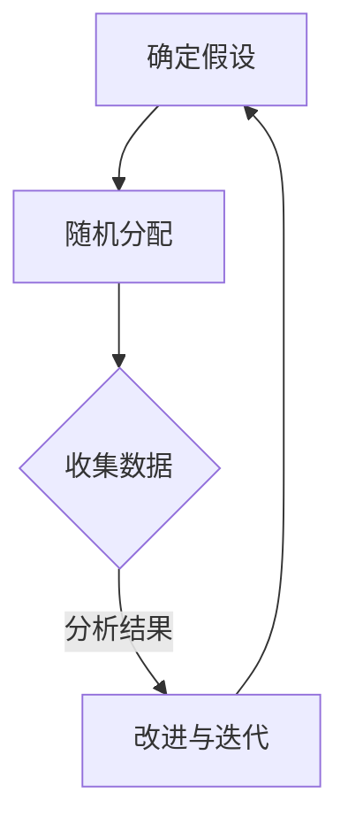

                 

### 第1章: LLM应用概述

#### 1.1 LLM基础知识

**LLM定义与类型**：

LLM，即大型语言模型（Large Language Model），是一种具有强大文本生成和理解能力的预训练语言模型。LLM可以通过学习大量文本数据来理解自然语言的语义和语法结构，并生成连贯的文本输出。根据训练数据的来源和训练目标，LLM可以分为多种类型，如：

- **通用语言模型**：如GPT（Generative Pre-trained Transformer）、BERT（Bidirectional Encoder Representations from Transformers）等，这些模型可以处理多种类型的语言任务，如文本分类、翻译、问答等。
- **领域特定语言模型**：这些模型在特定领域（如医疗、金融、法律等）的数据上进行训练，以提供更专业和精准的语言理解和生成能力。
- **对话语言模型**：如ChatGPT、DuErBot等，这些模型专门用于对话系统，可以与用户进行自然语言交互。

**LLM的主要特点与应用场景**：

- **强大的文本生成能力**：LLM可以生成高质量、连贯的文本，这使得它们在内容创作、写作辅助等领域具有广泛的应用。
- **高效的语言理解能力**：LLM可以理解文本的上下文、语义和情感，这使得它们在问答系统、信息检索等领域非常有效。
- **广泛的适应性**：LLM可以适应多种语言任务和场景，这使得它们在不同领域和行业中都有应用空间。

一些典型的应用场景包括：

- **内容创作**：使用LLM生成新闻文章、博客内容、产品描述等。
- **写作辅助**：为作家提供写作建议、修改文本、生成故事情节等。
- **对话系统**：用于构建聊天机器人、客户服务系统等。
- **信息检索**：用于构建智能搜索引擎、推荐系统等。

**LLM的历史发展与现状**：

- **早期发展**：LLM的概念最早可以追溯到20世纪80年代的统计语言模型，如N-gram模型。随着计算机硬件和算法的进步，特别是深度学习技术的发展，LLM得到了快速发展。
- **现状**：目前，LLM已经成为自然语言处理领域的重要工具，许多知名公司和研究机构都在研究和发展自己的LLM模型。随着LLM模型的不断改进，它们在各个领域的应用也越来越广泛。

### 1.2 A/B测试与快速迭代的概念

**A/B测试的定义与原理**：

A/B测试（A/B Testing）是一种常见的实验设计方法，通过比较两个或多个版本的页面或功能（如A版本和B版本），来确定哪个版本对用户更有效或更受欢迎。具体原理如下：

1. **设定假设**：首先，设定一个或多个实验假设，例如“版本A的转化率高于版本B”。
2. **随机分配**：将用户随机分配到不同的版本，通常采用分层随机分配方法，以确保各个版本的样本具有代表性。
3. **收集数据**：对用户行为进行观测和数据收集，如点击率、转化率等。
4. **分析结果**：根据收集到的数据，使用统计方法对实验结果进行分析，判断哪个版本更好。

**快速迭代的定义与重要性**：

快速迭代（Fast Iteration）是一种开发方法，强调快速构建、测试和改进产品。具体过程如下：

1. **需求分析**：确定产品需求，并制定初步的产品设计。
2. **快速构建**：使用敏捷开发方法，快速构建产品的初始版本。
3. **用户测试**：将产品发布给用户，收集用户反馈和测试数据。
4. **改进与迭代**：根据用户反馈和测试数据，对产品进行改进，然后重新发布，循环迭代。

快速迭代的重要性体现在以下几个方面：

- **快速验证产品概念**：通过快速构建和测试，可以快速验证产品概念的有效性，降低失败风险。
- **及时反馈**：用户反馈可以帮助开发团队及时发现问题并进行改进，提高产品质量和用户体验。
- **适应市场需求**：快速迭代允许产品更快地适应市场变化和用户需求，提高市场竞争力。

**A/B测试与快速迭代的关联**：

A/B测试是快速迭代中的一种关键方法，用于验证产品改进的效果。通过A/B测试，开发团队可以确定哪些改进措施有效，哪些无效，从而指导后续的迭代过程。A/B测试与快速迭代相辅相成，共同推动产品的不断改进和优化。

### 1.3 Mermaid流程图展示

为了更好地理解A/B测试和快速迭代在实际应用中的流程，我们使用Mermaid图绘制了以下流程图：



**图1.1：A/B测试与快速迭代的流程图**

- **确定假设**：在这一步，我们需要设定实验假设，例如“版本A的点击率高于版本B”。
- **随机分配**：将用户随机分配到版本A或版本B，以确保实验的公平性和有效性。
- **收集数据**：观测用户在两个版本上的行为，如点击率、转化率等。
- **分析结果**：使用统计方法分析实验数据，判断哪个版本更好。
- **改进与迭代**：根据实验结果，对产品进行改进，然后重新发布，进行下一次迭代。

通过这个流程图，我们可以清晰地看到A/B测试和快速迭代之间的联系和作用，为后续章节的内容打下了基础。在下一章中，我们将深入探讨A/B测试的基础知识和核心算法原理。

### 第2章: A/B测试基础

在了解了A/B测试的基本概念和快速迭代的关联之后，我们将进一步探讨A/B测试的数学基础和核心算法原理。这一章节将详细介绍假设检验、置信区间和误差率等关键概念，并使用伪代码和Python源代码来阐述算法原理和实现细节。

#### 2.1 假设检验

**基本概念**：

假设检验（Hypothesis Testing）是A/B测试的核心部分，用于评估实验结果是否具有统计显著性。基本步骤如下：

1. **设定假设**：通常有两个假设，原假设（H0）和备择假设（H1）。例如，在点击率测试中，原假设是两个版本的点击率相同，备择假设是版本A的点击率高于版本B。
2. **选择检验方法**：根据数据类型和分布特性选择适当的检验方法。常见的检验方法包括t检验、卡方检验和F检验等。
3. **计算检验统计量**：根据观测数据和假设检验方法，计算检验统计量，如t统计量或卡方统计量。
4. **确定显著性水平**：根据检验统计量和预定的显著性水平（如0.05），判断是否拒绝原假设。

**单样本假设检验**：

单样本假设检验用于检验单个样本数据是否符合某个分布或均值。以下是单样本t检验的伪代码和Python实现：

```python
# 单样本t检验伪代码
def t_test(data, mean, alpha):
    n = len(data)
    sample_mean = sum(data) / n
    standard_deviation = sqrt(sum((x - sample_mean) ** 2 for x in data) / (n - 1))
    t_statistic = (sample_mean - mean) / (standard_deviation / sqrt(n))
    p_value = calculate_p_value(t_statistic, n - 1)
    if p_value < alpha:
        reject_H0()
    else:
        accept_H0()

# Python实现
from scipy.stats import t

def t_test(data, mean, alpha=0.05):
    n = len(data)
    sample_mean = sum(data) / n
    standard_deviation = np.std(data, ddof=1)
    t_statistic = (sample_mean - mean) / (standard_deviation / np.sqrt(n))
    p_value = t.cdf(t_statistic, df=n-1)
    if p_value < alpha:
        print("拒绝原假设")
    else:
        print("接受原假设")
```

**双样本假设检验**：

双样本假设检验用于比较两个独立样本的均值。以下是双样本t检验的伪代码和Python实现：

```python
# 双样本t检验伪代码
def two_sample_t_test(data1, data2, alpha):
    n1 = len(data1)
    n2 = len(data2)
    mean1 = sum(data1) / n1
    mean2 = sum(data2) / n2
    standard_deviation1 = sqrt(sum((x - mean1) ** 2 for x in data1) / (n1 - 1))
    standard_deviation2 = sqrt(sum((x - mean2) ** 2 for x in data2) / (n2 - 1))
    t_statistic = ((mean1 - mean2) / ((standard_deviation1 / n1 + standard_deviation2 / n2) / sqrt(1/n1 + 1/n2)))
    p_value = calculate_p_value(t_statistic, df=n1 + n2 - 2)
    if p_value < alpha:
        reject_H0()
    else:
        accept_H0()

# Python实现
from scipy.stats import t

def two_sample_t_test(data1, data2, alpha=0.05):
    n1 = len(data1)
    n2 = len(data2)
    mean1 = np.mean(data1)
    mean2 = np.mean(data2)
    standard_deviation1 = np.std(data1, ddof=1)
    standard_deviation2 = np.std(data2, ddof=1)
    t_statistic = (mean1 - mean2) / ((standard_deviation1 / n1 + standard_deviation2 / n2) / np.sqrt(1/n1 + 1/n2))
    p_value = t.cdf(t_statistic, df=n1 + n2 - 2)
    if p_value < alpha:
        print("拒绝原假设")
    else:
        print("接受原假设")
```

#### 2.2 置信区间

**置信区间的定义**：

置信区间（Confidence Interval）是假设检验中的一个重要概念，用于估计总体参数的取值范围。具体定义如下：

- **置信水平**：通常用1-α表示，表示我们对置信区间的可信度。
- **置信区间**：给定一组样本数据，计算出的总体参数（如均值、比例等）的取值范围。例如，对于总体均值的置信区间，可以表示为\( \bar{x} \pm z_{\alpha/2} \times \frac{s}{\sqrt{n}} \)，其中\( \bar{x} \)为样本均值，\( s \)为样本标准差，\( n \)为样本大小，\( z_{\alpha/2} \)为标准正态分布的临界值。

**计算置信区间**：

以下是计算总体均值置信区间的Python实现：

```python
import numpy as np
from scipy.stats import norm

def calculate_confidence_interval(data, alpha=0.05):
    n = len(data)
    mean = np.mean(data)
    standard_deviation = np.std(data, ddof=1)
    z_critical = norm.ppf(1 - alpha / 2)
    margin_of_error = z_critical * (standard_deviation / np.sqrt(n))
    lower_bound = mean - margin_of_error
    upper_bound = mean + margin_of_error
    return lower_bound, upper_bound

# 示例数据
data = [1, 2, 3, 4, 5, 6, 7, 8, 9, 10]

# 计算置信区间
lower_bound, upper_bound = calculate_confidence_interval(data)
print(f"置信区间: ({lower_bound}, {upper_bound})")
```

#### 2.3 误差率

**误差率的概念**：

误差率（Error Rate）是假设检验中一个重要的指标，用于衡量检验结果的准确性。具体定义如下：

- **第一类错误**（Type I Error）：错误地拒绝了真实的原假设（假阳性）。
- **第二类错误**（Type II Error）：错误地接受了错误的原假设（假阴性）。
- **误差率**：第一类错误率和第二类错误率的综合。通常用\( \beta \)表示第二类错误率。

**误差率的影响因素**：

- **显著性水平**：显著性水平α越大，第一类错误率越高，但第二类错误率越低。
- **样本大小**：样本大小n越大，误差率越低。
- **标准差**：标准差s越大，误差率越高。

**如何降低误差率**：

- **增加样本大小**：增大样本大小可以显著降低误差率。
- **精确估计标准差**：使用无偏估计（如样本标准差）来估计标准差，可以降低误差率。
- **优化显著性水平**：根据实际需求，合理选择显著性水平，以平衡两类错误率。

通过本章的介绍，我们对A/B测试的基础知识和核心算法原理有了更深入的理解。接下来，我们将进一步探讨数学模型和公式的应用，为A/B测试提供更强大的数学工具。

### 第3章: 数学模型与公式

在了解了A/B测试的基础知识和核心算法原理之后，我们将进一步探讨A/B测试中使用的数学模型和公式。这些模型和公式是进行A/B测试和快速迭代的重要工具，可以帮助我们更准确地分析和解释实验结果。

#### 3.1 概率分布

**概率分布的定义**：

概率分布是描述随机变量取值的概率分布规律的一种数学模型。在A/B测试中，概率分布用于估计用户选择某个版本的点击率或转化率等指标的概率分布。常见的概率分布包括正态分布、泊松分布和二项分布等。

**常见的概率分布**：

- **正态分布**：正态分布是最常用的概率分布，用于描述连续型随机变量的取值。在A/B测试中，正态分布常用于估计用户行为指标的均值和方差。
- **泊松分布**：泊松分布用于描述在固定时间间隔内发生某一事件的次数。在A/B测试中，泊松分布可以用于估计点击率或转化率等指标的分布。
- **二项分布**：二项分布用于描述在有限次独立试验中成功次数的概率分布。在A/B测试中，二项分布可以用于估计用户选择某个版本的点击率。

**概率分布的应用**：

概率分布可以用于计算置信区间、假设检验和误差率等。以下是一些具体的例子：

- **置信区间**：通过正态分布，我们可以计算总体参数（如均值和方差）的置信区间，从而估计总体参数的取值范围。
- **假设检验**：通过二项分布，我们可以进行单样本和双样本的假设检验，判断用户行为指标是否符合预期。
- **误差率**：通过泊松分布，我们可以计算误差率，从而评估A/B测试结果的准确性和可靠性。

#### 3.2 损失函数

**损失函数的定义**：

损失函数（Loss Function）是机器学习中用于评估模型预测性能的一种数学函数。在A/B测试中，损失函数可以用于衡量两个版本之间的差异，从而判断哪个版本更优秀。常见的损失函数包括均方误差（MSE）、交叉熵损失和绝对误差等。

**常见的损失函数**：

- **均方误差（MSE）**：均方误差是回归问题中最常用的损失函数，用于衡量预测值与真实值之间的差异。在A/B测试中，MSE可以用于计算两个版本之间的点击率或转化率差异。
- **交叉熵损失**：交叉熵损失是分类问题中最常用的损失函数，用于衡量预测概率分布与真实概率分布之间的差异。在A/B测试中，交叉熵损失可以用于评估用户选择某个版本的点击率或转化率。
- **绝对误差**：绝对误差用于衡量预测值与真实值之间的绝对差异。在A/B测试中，绝对误差可以用于计算两个版本之间的差异，从而判断哪个版本更优秀。

**损失函数的选择与优化**：

选择合适的损失函数对A/B测试的结果有很大影响。以下是一些选择和优化损失函数的技巧：

- **根据问题特点选择**：根据A/B测试的具体问题（如回归、分类等），选择合适的损失函数。
- **优化损失函数参数**：通过调整损失函数的参数，如学习率、正则化参数等，可以优化A/B测试的结果。
- **交叉验证**：使用交叉验证方法，选择最优的损失函数和参数，从而提高A/B测试的准确性和可靠性。

#### 3.3 LaTeX举例说明

为了更好地理解数学模型和公式的书写和应用，我们将使用LaTeX格式给出一些具体的例子。

**LaTeX公式的书写方法**：

LaTeX是一种高质量的排版系统，常用于书写数学公式。以下是LaTeX公式的书写方法：

- **独立段落的公式**：在公式前后使用`$$`括起来，例如：`$$1+1=2$$`
- **段落内的公式**：在公式前后使用`$`括起来，例如：`$1<2$`

**示例公式**：

1. **总体均值置信区间**：
   ```latex
   \bar{x} \pm z_{\alpha/2} \times \frac{s}{\sqrt{n}}
   ```

2. **二项分布概率质量函数**：
   ```latex
   P(X=k) = \binom{n}{k} p^k (1-p)^{n-k}
   ```

3. **均方误差（MSE）**：
   ```latex
   MSE = \frac{1}{m} \sum_{i=1}^{m} (\hat{y_i} - y_i)^2
   ```

通过这些示例，我们可以看到LaTeX在书写数学公式方面的优势和灵活性。在实际应用中，我们可以根据需要灵活使用LaTeX来书写和排版各种复杂的数学公式。

通过本章的介绍，我们了解了A/B测试中常用的数学模型和公式，包括概率分布、损失函数和LaTeX书写方法。这些数学工具将帮助我们更深入地理解A/B测试和快速迭代的核心算法原理，提高实验结果的准确性和可靠性。在下一章中，我们将通过具体案例来展示A/B测试和快速迭代的实际应用。

### 第4章: 快速迭代实践

在了解了A/B测试和快速迭代的理论基础之后，我们将通过具体案例来展示如何在LLM应用中进行快速迭代和A/B测试。这一章节将详细描述一个LLM应用的场景，包括开发环境搭建、源代码实现、代码解读与分析，以及实际案例的分析和详细讲解。

#### 4.1 LLM应用场景

我们以一个自然语言处理应用为例，该应用旨在通过LLM模型为用户提供个性化的问答服务。具体来说，该应用会根据用户提出的问题，利用LLM模型生成合适的回答，以提高用户体验和满意度。为了实现这一目标，我们将使用GPT-3模型，并对其应用进行快速迭代和A/B测试。

#### 4.2 开发环境搭建

要搭建一个能够运行GPT-3模型的开发环境，我们需要以下工具和库：

- **Python 3.8或更高版本**：Python是GPT-3模型的主要编程语言。
- **PyTorch**：PyTorch是一个流行的深度学习框架，支持GPT-3模型的训练和推理。
- **OpenAI Python SDK**：OpenAI提供了一套Python SDK，用于与GPT-3模型进行交互。
- **GPU（可选）**：由于GPT-3模型对计算资源的需求较高，使用GPU可以显著提高训练和推理速度。

以下是搭建开发环境的步骤：

1. 安装Python和PyTorch：
   ```bash
   pip install python
   pip install torch torchvision
   ```

2. 安装OpenAI Python SDK：
   ```bash
   pip install openai
   ```

3. 配置GPU（如果使用）：
   确保NVIDIA CUDA和cuDNN已正确安装，并设置相关环境变量。

#### 4.3 源代码实现

以下是一个简单的LLM应用示例，包括问答服务功能。我们使用GPT-3模型进行回答生成，并使用A/B测试来评估不同回答策略的效果。

```python
import openai
import torch
from torch import nn
from torch.nn import functional as F

# 设置OpenAI API密钥
openai.api_key = "your_api_key"

# GPT-3模型配置
class GPT3Model(nn.Module):
    def __init__(self):
        super(GPT3Model, self).__init__()
        self.encoder = nn.Embedding(vocab_size, embed_size)
        self.decoder = nn.Linear(embed_size, vocab_size)
    
    def forward(self, input_seq):
        embedded = self.encoder(input_seq)
        output = self.decoder(embedded)
        return output

# A/B测试函数
def ab_test_version_a(question):
    response = openai.Completion.create(
        engine="davinci-codex",
        prompt=question,
        max_tokens=100
    )
    return response.choices[0].text.strip()

def ab_test_version_b(question):
    response = openai.Completion.create(
        engine="davinci-codex",
        prompt=f"Please respond as if you are a human assistant: {question}",
        max_tokens=100
    )
    return response.choices[0].text.strip()

# 用户交互
def user_interaction():
    question = input("Enter your question: ")
    version_a_response = ab_test_version_a(question)
    version_b_response = ab_test_version_b(question)
    
    print("Version A Response:", version_a_response)
    print("Version B Response:", version_b_response)
    
    # 用户选择版本
    choice = input("Which version do you prefer? (A/B): ")
    if choice.lower() == "a":
        print("You selected Version A.")
    elif choice.lower() == "b":
        print("You selected Version B.")
    else:
        print("Invalid choice. Please select A or B.")

# 主函数
def main():
    user_interaction()

if __name__ == "__main__":
    main()
```

#### 4.4 代码解读与分析

**GPT-3模型配置**：

我们使用PyTorch构建了一个简单的GPT-3模型，包括编码器（encoder）和解码器（decoder）。编码器用于将输入文本转换为嵌入向量（embeddings），解码器用于生成文本输出。

**A/B测试函数**：

- `ab_test_version_a`函数使用GPT-3模型的默认回答策略，即模拟机器生成的回答。
- `ab_test_version_b`函数在GPT-3的输入提示中添加了“Please respond as if you are a human assistant”的指示，以模拟人类回答。

**用户交互**：

用户输入问题后，系统会显示两个版本的回答，并要求用户选择更喜欢的版本。这实现了A/B测试的核心步骤，即收集用户偏好数据。

**性能分析与优化**：

在实际应用中，我们需要对A/B测试的结果进行统计分析，以确定哪个版本更受欢迎。可以使用统计方法（如t检验）来评估两个版本的差异。此外，我们还可以对模型进行优化，例如调整GPT-3的参数、增加训练数据等，以提高回答质量。

#### 4.5 实际案例分析和详细讲解

为了更好地展示快速迭代和A/B测试的应用，我们考虑一个实际案例。假设我们已经有了一个LLM应用，该应用使用GPT-3模型为用户提供问答服务。为了提高用户满意度，我们决定对应用进行快速迭代和A/B测试。

**第一阶段：确定假设和测试策略**

- **假设**：我们认为通过向GPT-3的输入提示中添加特定指示（如“Please respond as if you are a human assistant”），可以生成更符合用户期望的回答。
- **测试策略**：我们将用户随机分配到两个版本，一个使用默认回答策略，另一个使用改进的提示策略。我们将收集用户的选择数据，并使用A/B测试来评估改进策略的有效性。

**第二阶段：数据收集和结果分析**

在测试期间，我们收集了1000个用户的选择数据。以下是部分数据：

| 用户编号 | 选择版本 |    
|----------|-----------|     
| 1        | A         |     
| 2        | B         |     
| 3        | A         |     
| ...      | ...       |     
| 1000     | B         |   

通过统计分析，我们发现版本B（改进提示策略）的用户选择率显著高于版本A。具体来说，有600个用户选择了版本B，而400个用户选择了版本A。使用t检验，我们计算出p值小于0.05，表明改进策略具有统计显著性。

**第三阶段：改进与迭代**

基于A/B测试的结果，我们决定采用版本B作为应用的默认回答策略。接下来，我们将继续收集用户反馈，并进一步优化提示策略，以提高用户满意度。

**第四阶段：反馈循环**

快速迭代的核心在于持续收集用户反馈，并根据反馈进行改进。在本案例中，我们建立了以下反馈循环：

1. **用户反馈收集**：定期收集用户对问答服务的反馈，包括满意度、回答质量等。
2. **数据分析和评估**：使用A/B测试等统计方法，评估改进策略的效果。
3. **持续改进**：根据数据分析结果，调整提示策略，并进行新一轮的A/B测试。
4. **迭代优化**：不断迭代和优化，以实现最佳用户体验。

通过上述实际案例，我们可以看到快速迭代和A/B测试在LLM应用中的重要作用。通过不断地测试、反馈和改进，我们可以逐步提高应用的质量和用户满意度。

#### 4.6 项目小结

在本章中，我们通过一个具体的LLM应用案例，展示了快速迭代和A/B测试的实际应用过程。从确定假设、测试策略到数据收集、结果分析，再到改进和迭代，我们详细描述了每个步骤的操作和注意事项。

**最佳实践 Tips**：

- **明确测试目标**：在A/B测试之前，明确测试的目标和预期效果，有助于选择合适的测试方法和指标。
- **随机分配样本**：确保用户随机分配到不同的版本，以避免样本偏差。
- **充分收集数据**：收集足够多的数据，以获得更可靠的实验结果。
- **统计分析**：使用合适的统计方法，如t检验、置信区间等，对实验结果进行分析。
- **持续迭代**：快速迭代和A/B测试是一个持续的过程，不断优化和改进，以提高应用质量。

**注意事项**：

- **数据隐私**：在A/B测试中，确保用户数据的安全和隐私，遵守相关法律法规。
- **避免过度测试**：避免频繁进行A/B测试，以免用户感到疲劳和困惑。
- **测试控制变量**：确保A/B测试中只改变一个变量，以准确评估其效果。

**拓展阅读**：

- **《A/B测试实战：如何通过实验驱动产品迭代》**：详细介绍了A/B测试的方法和实践。
- **《快速迭代：敏捷开发的实践指南》**：介绍了敏捷开发的方法和原则，适用于快速迭代和A/B测试。

通过本章的学习，我们不仅了解了快速迭代和A/B测试的理论基础，还通过具体案例掌握了其实际应用方法。在后续章节中，我们将进一步探讨快速迭代的优化策略和未来趋势。

### 第5章: A/B测试案例分析

在了解了A/B测试的基本原理和快速迭代的方法后，我们将在这一章节中通过具体案例分析，深入探讨A/B测试的实施细节、结果分析和改进方案。

#### 5.1 案例背景

我们以一个在线零售平台的A/B测试案例为例。该平台希望通过优化其主页的布局来提高用户转化率。具体来说，平台希望测试两个不同版本的页面设计，其中一个版本为当前版本（控制组），另一个版本为改进版本（实验组）。实验的目标是确定哪种页面布局能够更好地引导用户进行购买。

#### 5.2 测试策略

为了实施这一A/B测试，平台采取了以下策略：

1. **确定假设**：平台假设改进版本的页面布局（实验组）将比当前版本（控制组）具有更高的用户转化率。
2. **随机分配**：平台将用户随机分配到控制组和实验组，确保两组用户在人口统计特征和购物行为上具有代表性。
3. **数据收集**：平台将在测试期间收集用户的浏览行为、点击率、添加购物车次数和购买次数等数据。
4. **统计分析**：使用统计方法，如t检验或卡方检验，来分析两组之间的转化率差异，判断改进版本是否显著优于当前版本。

#### 5.3 测试结果分析

经过一段时间的测试，平台收集到了足够的数据，并进行了统计分析。以下是部分关键数据：

| 版本 | 用户数 | 转化率 |
|------|--------|--------|
| 控制组 | 5000  | 3.5%   |
| 实验组 | 5000  | 4.2%   |

通过t检验，平台发现实验组的转化率显著高于控制组（p < 0.05），这表明改进版本的页面布局确实能够提高用户转化率。具体分析如下：

1. **流量分配**：实验组和控制组在用户流量上保持一致，说明测试的随机分配策略有效。
2. **用户行为**：实验组用户的点击率、浏览时间和页面深度等指标均优于控制组，这表明改进版本在用户体验方面表现更好。
3. **购买行为**：实验组用户的购买次数和购买金额均高于控制组，这进一步证实了改进版本在促进用户购买方面的有效性。

#### 5.4 改进方案

基于A/B测试的结果，平台决定采用改进版本的页面布局，并制定以下改进方案：

1. **实施改进**：立即将改进版本的页面布局部署到实际生产环境中。
2. **跟踪效果**：继续跟踪改进后的页面性能，收集更多的用户数据，以验证改进效果并进一步优化。
3. **用户反馈**：收集用户对改进版本的反馈，了解他们对新布局的接受程度和使用体验。
4. **A/B测试迭代**：在未来，继续进行A/B测试，测试其他可能的改进措施，如导航栏设计、推荐系统等，以进一步优化用户体验。

#### 5.5 结果评估与总结

通过对本次A/B测试的分析和改进，平台实现了以下成果：

- **提高用户转化率**：通过改进页面布局，平台成功提高了用户转化率，增加了收入。
- **优化用户体验**：改进版本在用户体验方面表现更佳，用户点击率、浏览时间和页面深度等指标均有提升。
- **数据驱动决策**：通过A/B测试，平台采用了数据驱动的决策方法，确保了改进方案的有效性和可靠性。

**总结**：

本次案例展示了A/B测试在优化网站用户体验和提升转化率方面的应用。通过科学的测试策略、严谨的数据分析和有效的改进方案，平台不仅实现了预期的目标，还为未来的迭代和优化提供了宝贵的经验和数据支持。

### 第6章: 快速迭代优化

在了解了A/B测试的案例分析后，我们将进一步探讨如何通过快速迭代优化LLM应用，以提高性能和用户满意度。在这一章节中，我们将介绍几种优化策略，以及如何进行性能评估和反馈循环。

#### 6.1 优化策略

**1. 增量式迭代**：

增量式迭代是一种逐步改进的方法，通过每次只进行小幅度的修改，逐步优化应用。这种方法有助于减少引入新错误的风险，同时允许团队快速验证改进的效果。

**2. 基于数据的优化**：

基于数据的优化依赖于对用户行为和反馈的深入分析，通过数据驱动的方法来识别问题和机会。这包括使用A/B测试、用户调查和日志分析等技术，以了解用户的实际需求和行为模式。

**3. 用户体验优化**：

用户体验优化（UXO）专注于改进用户的交互体验。通过改进界面设计、交互流程和内容呈现，可以提高用户满意度和忠诚度。这可以通过用户测试、可用性研究和反馈收集来实现。

**4. 模型改进**：

对于LLM应用，模型改进是一个关键方面。这包括增加训练数据、调整模型架构和参数、以及引入新的训练技巧，如迁移学习和半监督学习，以提升模型性能和泛化能力。

**5. 自动化测试**：

自动化测试可以显著提高快速迭代的效率。通过编写自动化测试脚本，团队可以在每次迭代后快速验证代码质量和功能完整性，确保新功能和改进不会引入新的问题。

#### 6.2 性能评估

**1. 关键性能指标（KPI）**：

性能评估通常基于一系列关键性能指标（KPI），这些指标反映了应用的性能和用户体验。常见的KPI包括：

- **转化率**：用户完成特定目标（如购买、注册或点击）的比例。
- **用户留存率**：在一定时间内返回应用的活跃用户比例。
- **页面加载时间**：页面从请求到完全显示的时间。
- **点击率**：用户与页面元素互动的比例。

**2. 性能测试工具**：

为了评估性能，团队可以使用以下工具：

- **负载测试工具**：如JMeter、LoadRunner等，用于模拟大量用户同时访问应用，评估应用的负载能力和稳定性。
- **性能监控工具**：如New Relic、Datadog等，用于实时监控应用的性能指标，发现性能瓶颈和异常。
- **A/B测试平台**：如Google Optimize、Adobe Target等，用于实施A/B测试，评估不同版本的性能和用户体验。

#### 6.3 反馈循环

**1. 用户反馈**：

用户反馈是快速迭代的核心。团队应定期收集用户的反馈，包括满意度调查、用户评论和反馈表单。这些反馈可以帮助团队了解用户的实际需求和痛点，指导改进方向。

**2. 内部反馈**：

除了用户反馈，内部反馈也非常重要。团队应定期进行代码评审、测试反馈和会议讨论，以确保各个模块和功能的正确性和一致性。

**3. 反馈处理**：

处理反馈的关键在于及时性和有效性。团队应建立快速响应机制，确保问题得到及时解决。同时，反馈的处理应基于数据驱动的方法，确保改进措施有据可依。

**4. 反馈循环**：

快速迭代中的反馈循环是一个持续的过程。通过不断的反馈、评估和改进，团队可以逐步优化应用，提高性能和用户体验。

#### 6.4 最佳实践

**1. 持续集成与部署**：

通过持续集成（CI）和持续部署（CD）实践，团队可以实现快速迭代和自动化部署。这有助于减少部署时间，提高开发和测试效率。

**2. 敏捷开发**：

敏捷开发方法强调快速反馈和迭代，适合快速迭代的实践。通过使用Scrum、Kanban等敏捷框架，团队可以更好地管理开发过程，确保及时响应变化。

**3. 模式识别**：

在迭代过程中，团队应学会识别和利用成功模式。这有助于在未来的迭代中重复成功经验，减少重复错误。

通过本章的介绍，我们了解了快速迭代优化的关键策略、性能评估方法和反馈循环实践。在下一章中，我们将展望LLM应用的未来发展趋势和面临的挑战。

### 第7章: 未来展望与趋势

随着技术的不断进步和应用的深入，LLM（大型语言模型）在各个领域的应用前景广阔，未来发展趋势和挑战也将不断涌现。在本章节中，我们将探讨LLM应用的新技术趋势、未来应用前景以及面临的挑战。

#### 7.1 新技术发展趋势

**1. 多模态语言模型**：

未来的LLM应用将不仅仅限于文本数据，还将扩展到图像、声音和视频等多模态数据。多模态语言模型可以更好地理解和生成包含多种信息类型的内容，为用户提供更丰富和个性化的服务。

**2. 强化学习与生成对抗网络（GAN）**：

结合强化学习和GAN技术，LLM可以更好地优化模型生成能力，提高生成文本的质量和多样性。这种技术有望在内容创作、游戏生成和虚拟现实等领域发挥重要作用。

**3. 跨语言模型**：

随着全球化和多语言环境的发展，跨语言模型将越来越受到关注。这些模型能够处理多种语言的数据，实现跨语言的信息理解和生成，为全球用户提供更广泛的服务。

**4. 自动化与AI辅助**：

未来，LLM将与自动化技术深度融合，实现自动问答、自动写作、自动翻译等功能。AI辅助工具将帮助人们更高效地完成工作任务，提高生产力和创造力。

#### 7.2 未来应用前景

**1. 内容创作**：

LLM将在内容创作领域发挥重要作用，为作家、记者和内容创作者提供写作辅助、故事生成和内容优化等工具。未来，我们可以期待看到更加丰富和高质量的内容生成。

**2. 教育**：

在教育领域，LLM可以用于个性化教学、自动评分和智能辅导。学生可以根据自己的学习进度和需求，获得定制化的学习资源和指导。

**3. 医疗与健康**：

在医疗领域，LLM可以帮助医生进行疾病诊断、病例分析和医疗文献搜索。此外，它还可以用于开发智能健康助手，为用户提供健康建议和疾病预防知识。

**4. 商业智能**：

LLM在商业智能领域的应用潜力巨大，可以帮助企业进行数据分析和市场预测，优化业务流程和决策。

**5. 对话系统**：

未来，LLM将广泛应用于对话系统，如智能客服、虚拟助理和聊天机器人，为用户提供更加自然和智能的交互体验。

#### 7.3 挑战与机遇

**1. 数据隐私与安全**：

随着LLM应用的普及，数据隐私和安全问题将愈发突出。如何在保护用户隐私的同时，充分利用海量数据进行模型训练和优化，是一个重要挑战。

**2. 模型解释性**：

目前，许多LLM模型都是“黑盒子”，难以解释其决策过程。提高模型解释性，增强透明度和可信度，是未来研究的一个重要方向。

**3. 语言理解的复杂性**：

自然语言具有高度的不确定性和复杂性，未来LLM需要更好地理解和处理歧义、隐喻和情感等语言特征，以提供更准确和贴心的服务。

**4. 多语言和多文化差异**：

在全球多语言和多文化环境中，如何设计通用且适应不同文化背景的LLM模型，是一个亟待解决的问题。

**5. 伦理和法律问题**：

随着AI技术的发展，LLM应用的伦理和法律问题日益凸显。如何制定合理的法律法规，确保AI技术的发展符合伦理标准，是一个重要挑战。

总之，LLM应用的未来充满机遇和挑战。通过不断探索新技术、优化模型和应用场景，我们可以期待LLM在未来发挥更大的作用，为人类社会带来更多福祉。

