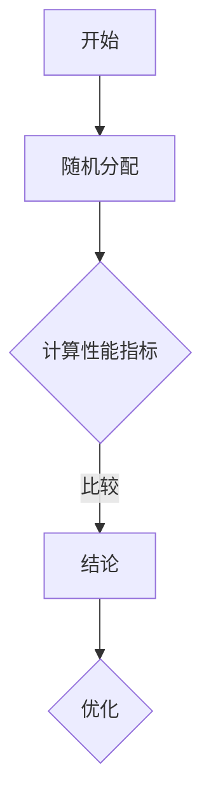
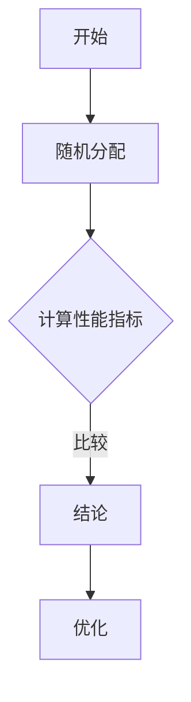

                 

## 《LLM应用的A/B测试：在敏捷环境中快速验证假设》

### 关键词
- A/B测试
- 敏捷开发
- LLM应用
- 假设验证
- 算法原理

### 摘要
本文旨在探讨在敏捷开发环境中，如何运用A/B测试方法快速验证假设，特别是在大规模语言模型（LLM）应用中的实践。文章首先介绍了A/B测试的基本概念和在敏捷开发中的应用优势，随后深入讲解了A/B测试的数学模型和算法原理，并通过实际项目案例展示了A/B测试的实践过程。最后，文章提出了A/B测试中的优化策略和常见问题解决方案，并对未来的发展趋势进行了展望。

## 第一部分：基础理论

### 第1章：A/B测试概述

A/B测试（又称拆分测试）是一种评估两个或多个版本（A和B）对用户行为和结果影响差异的方法。其核心思想是将用户随机分配到不同的版本组，通过对比各组的性能指标，确定哪个版本更有效。

### 核心概念与联系

A/B测试中的核心概念包括版本、用户分配、性能指标和统计检验。这些概念之间相互关联，构成了A/B测试的理论基础。

#### Mermaid流程图


### 第2章：A/B测试数学模型

A/B测试的数学模型主要包括概率论基础、统计模型和置信区间等。这些数学工具帮助我们在测试中做出合理的决策。

#### 概率论基础

概率论是A/B测试的基础。以下是一个简单的概率论示例：

$$P(A) = \frac{A的样本数}{总样本数}$$

#### A/B测试中的统计模型

A/B测试常用的统计模型是均值比较。假设有两个版本A和B，其用户转化率分别为$\mu_A$和$\mu_B$，则可以通过以下公式计算差异：

$$\mu_A - \mu_B = \bar{X}_A - \bar{X}_B$$

#### 置信区间与假设检验

置信区间用于估计真实参数的范围，而假设检验用于验证两个版本之间的差异是否显著。以下是假设检验的基本步骤：

1. 提出零假设（$H_0$）和备择假设（$H_1$）。
2. 选择合适的统计量。
3. 计算统计量的值。
4. 比较统计量与临界值，得出结论。

### 第3章：A/B测试算法原理

A/B测试算法的核心在于如何实现随机分配和性能指标计算。以下是A/B测试算法的基本原理：

#### 随机分配

随机分配是将用户随机分配到不同版本组的过程。常用的随机分配方法包括：

- 简单随机抽样
- 重放抽样

#### 性能指标计算

性能指标是衡量版本优劣的关键。常见的性能指标包括：

- 转化率
- 用户留存率
- 营销投资回报率（ROI）

#### 优化算法

优化算法用于调整实验参数，以提高A/B测试的效率。常见的优化算法包括：

- 多臂老虎机算法
- 适应度函数优化

## 第二部分：实践应用

### 第4章：敏捷环境下的A/B测试策略

敏捷开发强调快速迭代和持续改进。A/B测试与敏捷开发的结合，可以极大地提高产品的迭代速度和效果。

#### 敏捷开发流程与A/B测试的结合

- 迭代规划：在每次迭代开始时，确定A/B测试的目标和假设。
- 用户故事地图：将A/B测试目标映射到用户故事地图，确保测试与用户需求一致。
- 回归测试：在每次迭代结束时，对A/B测试结果进行回归测试，确保产品稳定性。

#### A/B测试在不同开发阶段的运用

- 产品规划阶段：用于验证市场需求和用户行为。
- 设计阶段：用于评估不同设计方案的效果。
- 开发阶段：用于优化代码和用户体验。
- 部署阶段：用于评估上线效果和用户反馈。

### 第5章：A/B测试案例分析

通过实际案例，我们可以更深入地理解A/B测试的应用和效果。

#### 案例一：电商平台的A/B测试实践

某电商平台通过A/B测试优化了其首页布局，提高了用户点击率和转化率。具体实践过程如下：

1. 提出假设：首页布局优化可以提高用户点击率。
2. 设计实验：将用户随机分配到两个组，一组采用原布局，另一组采用新布局。
3. 计算性能指标：比较两组的点击率和转化率。
4. 得出结论：新布局的点击率和转化率显著高于原布局。

#### 案例二：社交媒体的A/B测试策略

某社交媒体平台通过A/B测试优化了其推送算法，提高了用户活跃度。具体策略如下：

1. 提出假设：推送算法优化可以提高用户活跃度。
2. 设计实验：将用户随机分配到多个组，每组采用不同的推送算法。
3. 计算性能指标：比较各组的用户活跃度。
4. 得出结论：某特定算法显著提高了用户活跃度。

#### 案例三：金融行业的A/B测试应用

某金融公司通过A/B测试优化了其投资建议系统，提高了投资收益。具体应用过程如下：

1. 提出假设：投资建议系统优化可以提高投资收益。
2. 设计实验：将用户随机分配到两组，一组采用原系统，另一组采用优化后的系统。
3. 计算性能指标：比较两组的投资收益。
4. 得出结论：优化后的系统显著提高了投资收益。

### 第6章：实战案例：敏捷环境中的LLM应用A/B测试

在本节中，我们将探讨如何在一个敏捷开发环境中，针对大规模语言模型（LLM）的应用进行A/B测试。

#### LLM应用场景介绍

某人工智能公司开发了一款智能客服系统，基于LLM技术提供用户服务。公司希望通过A/B测试优化系统的性能和用户体验。

#### LLM应用A/B测试的具体实施

1. 提出假设：优化LLM模型输入格式可以提高客服系统响应速度。
2. 设计实验：将用户随机分配到两组，一组使用原输入格式，另一组使用优化后的输入格式。
3. 计算性能指标：比较两组的系统响应时间。
4. 得出结论：优化后的输入格式显著提高了系统响应速度。

#### LLM应用A/B测试的效果评估

通过对比两组的响应时间，公司发现优化后的输入格式不仅提高了系统响应速度，还降低了用户等待时间，从而提升了整体用户体验。

## 第三部分：高级技巧

### 第7章：A/B测试中的优化与调参

A/B测试中的优化与调参是提高测试效果的关键。以下是一些常见的优化策略：

1. **分层测试**：将用户按照不同特征分层，针对不同层进行个性化测试。
2. **多变量测试**：同时测试多个变量，以确定各变量对性能的影响。
3. **动态分配**：根据实时数据动态调整用户分配比例，以最大化测试效果。

### 第8章：常见问题与解决方案

在A/B测试中，常见的问题包括：

1. **样本偏差**：通过合理设计实验和数据收集方法，减少样本偏差。
2. **统计检验不足**：选择合适的统计检验方法，确保测试结果的可靠性。

### 第9章：未来发展趋势与展望

随着人工智能和大数据技术的发展，A/B测试在敏捷开发中的应用将更加广泛。未来，A/B测试可能会朝着以下方向发展：

1. **自动化测试**：通过自动化工具实现A/B测试的全流程管理。
2. **智能优化**：利用机器学习技术，实现A/B测试的智能优化。

### 结论

A/B测试是敏捷开发中验证假设的重要工具。通过本文的介绍，读者应该对A/B测试的基本概念、数学模型、算法原理和实践应用有了全面了解。在实际项目中，合理运用A/B测试，可以帮助企业快速优化产品，提高用户满意度。

### 拓展阅读

1. 《A/B测试实战：如何设计和实施成功的A/B测试》（作者：张磊）
2. 《敏捷开发实践指南》（作者：杰夫·萨瑟兰）
3. 《大规模语言模型的预训练》（作者：艾丽斯·贝特）

### 注意事项

1. 在进行A/B测试时，确保实验设计的科学性和数据收集的准确性。
2. 关注测试结果的变化趋势，避免盲目决策。
3. 及时反馈和调整测试策略，以实现最佳效果。

### 作者信息

作者：AI天才研究院/AI Genius Institute & 禅与计算机程序设计艺术 /Zen And The Art of Computer Programming

---

### 第1章：A/B测试概述

#### 1.1 A/B测试的基本概念

A/B测试，又称拆分测试（Split Testing），是一种通过将用户群体随机分配到不同的版本组，比较不同版本的性能指标，从而确定哪种版本更优的方法。这种方法在产品开发、市场营销、用户体验优化等领域广泛应用。

A/B测试的基本步骤包括：

1. 提出假设：明确测试的目标和预期效果。
2. 设计实验：确定测试的版本组和性能指标。
3. 随机分配：将用户随机分配到不同的版本组。
4. 数据收集：收集各版本组的性能数据。
5. 分析结果：对比各版本组的性能，得出结论。

#### 1.2 A/B测试与敏捷开发的关系

敏捷开发（Agile Development）是一种以用户需求为中心，强调快速迭代和持续交付的软件开发方法。A/B测试与敏捷开发的关系主要体现在以下几个方面：

1. **快速迭代**：敏捷开发强调快速迭代，A/B测试可以帮助团队在每次迭代中快速验证假设，优化产品。
2. **用户反馈**：A/B测试可以获取用户的真实反馈，为敏捷开发提供决策依据，确保产品符合用户需求。
3. **持续改进**：敏捷开发追求持续改进，A/B测试可以帮助团队不断优化产品，提升用户体验。

#### 1.3 A/B测试的目标与优势

A/B测试的目标是通过比较不同版本的性能指标，确定哪种版本更优。具体来说，包括以下几个方面：

1. **提高转化率**：通过优化页面布局、功能设计等，提高用户转化率。
2. **提升用户体验**：通过分析用户行为，优化产品界面和交互，提升用户体验。
3. **降低成本**：通过减少不必要的功能开发和修改，降低产品开发和运营成本。

A/B测试的优势包括：

1. **数据驱动**：基于实际用户数据，做出科学决策。
2. **客观公正**：通过随机分配和统计检验，确保测试结果的可靠性。
3. **灵活高效**：适用于各种产品版本和场景，快速验证假设。

### 第2章：A/B测试数学模型

#### 2.1 概率论基础

概率论是A/B测试的基础。以下是一些基本概念：

- **概率分布**：描述随机变量的可能取值及其概率分布情况。
- **期望**：随机变量的平均值，表示其长期平均表现。
- **方差**：随机变量取值的离散程度，表示其波动性。

#### 2.2 A/B测试中的统计模型

A/B测试中的统计模型主要包括均值比较和差异检验。以下是一些常用的统计模型：

- **独立样本t检验**：用于比较两个独立样本的均值是否有显著差异。
- **配对样本t检验**：用于比较同一样本在不同时间点的均值是否有显著差异。
- **卡方检验**：用于比较两个分类变量的分布是否显著不同。

#### 2.3 A/B测试中的置信区间与假设检验

置信区间（Confidence Interval）是估计真实参数范围的一种方法。在A/B测试中，常用的置信区间包括：

- **置信区间（单样本）**：用于估计单个样本的均值。
- **置信区间（双样本）**：用于估计两个样本的均值差异。

假设检验（Hypothesis Testing）是验证两个假设的方法。在A/B测试中，常用的假设检验包括：

1. **零假设（$H_0$）**：两个版本的性能指标没有显著差异。
2. **备择假设（$H_1$）**：两个版本的性能指标存在显著差异。
3. **检验统计量**：根据样本数据计算出的统计量，用于判断零假设的真伪。
4. **临界值**：根据显著性水平和检验统计量，判断零假设是否成立的阈值。

### 第3章：A/B测试算法原理

#### 3.1 A/B测试算法的基本流程

A/B测试算法的基本流程包括以下步骤：

1. **初始化**：设置实验参数，如版本组数、分配比例、性能指标等。
2. **用户分配**：根据预定的分配策略，将用户随机分配到不同版本组。
3. **数据收集**：收集各版本组的性能数据。
4. **计算性能指标**：计算各版本组的性能指标，如转化率、点击率等。
5. **统计检验**：使用统计模型对性能指标进行假设检验，判断版本差异是否显著。
6. **得出结论**：根据统计检验结果，确定最优版本。

#### 3.2 A/B测试中的随机分配

随机分配是A/B测试的核心步骤，常用的随机分配方法包括：

1. **简单随机抽样**：将所有用户随机分配到版本组。
2. **重放抽样**：在实验过程中，如果用户分配不均匀，则重新分配用户，直到达到预定的分配比例。

#### 3.3 A/B测试中的优化算法

优化算法用于调整实验参数，以提高A/B测试的效率。常用的优化算法包括：

1. **多臂老虎机算法**：通过比较多个版本的性能，选择最优版本。
2. **适应度函数优化**：基于适应度函数，调整版本分配比例，以最大化测试效果。

### 第4章：敏捷环境下的A/B测试策略

#### 4.1 敏捷开发流程与A/B测试的结合

敏捷开发强调快速迭代和持续交付，A/B测试在敏捷开发中的应用主要体现在以下几个方面：

1. **迭代规划**：在每次迭代开始时，明确A/B测试的目标和假设。
2. **用户故事地图**：将A/B测试目标映射到用户故事地图，确保测试与用户需求一致。
3. **回归测试**：在每次迭代结束时，对A/B测试结果进行回归测试，确保产品稳定性。

#### 4.2 A/B测试在不同开发阶段的运用

A/B测试可以在软件开发的不同阶段发挥作用，主要包括：

1. **产品规划阶段**：用于验证市场需求和用户行为。
2. **设计阶段**：用于评估不同设计方案的效果。
3. **开发阶段**：用于优化代码和用户体验。
4. **部署阶段**：用于评估上线效果和用户反馈。

#### 4.3 A/B测试的流程与步骤

A/B测试的流程通常包括以下步骤：

1. **提出假设**：明确测试的目标和预期效果。
2. **设计实验**：确定测试的版本组和性能指标。
3. **随机分配**：将用户随机分配到不同版本组。
4. **数据收集**：收集各版本组的性能数据。
5. **计算性能指标**：计算各版本组的性能指标。
6. **统计检验**：使用统计模型对性能指标进行假设检验。
7. **得出结论**：根据统计检验结果，确定最优版本。

### 第5章：A/B测试案例分析

#### 5.1 案例一：电商平台的A/B测试实践

某电商平台为了提高用户转化率，设计了一个A/B测试实验，比较不同页面布局的效果。

1. **提出假设**：优化页面布局可以提高用户转化率。
2. **设计实验**：将用户随机分配到两组，一组为原布局（A组），另一组为新布局（B组）。
3. **数据收集**：收集两组的用户点击数据。
4. **计算性能指标**：计算两组的转化率。
5. **统计检验**：使用独立样本t检验，比较两组转化率是否有显著差异。
6. **得出结论**：新布局的转化率显著高于原布局，因此采用新布局。

#### 5.2 案例二：社交媒体的A/B测试策略

某社交媒体平台为了提升用户活跃度，进行了一次A/B测试，比较不同推送算法的效果。

1. **提出假设**：优化推送算法可以提高用户活跃度。
2. **设计实验**：将用户随机分配到多个组，每组采用不同的推送算法。
3. **数据收集**：收集各组的用户活跃数据。
4. **计算性能指标**：计算各组的活跃度。
5. **统计检验**：使用卡方检验，比较各组活跃度是否有显著差异。
6. **得出结论**：某特定推送算法显著提高了用户活跃度，因此采用该算法。

#### 5.3 案例三：金融行业的A/B测试应用

某金融公司为了优化投资建议系统，进行了一次A/B测试，比较不同系统版本的效果。

1. **提出假设**：优化投资建议系统可以提高投资收益。
2. **设计实验**：将用户随机分配到两组，一组为原系统（A组），另一组为优化后的系统（B组）。
3. **数据收集**：收集两组的投资收益数据。
4. **计算性能指标**：计算两组的投资收益。
5. **统计检验**：使用独立样本t检验，比较两组投资收益是否有显著差异。
6. **得出结论**：优化后的系统显著提高了投资收益，因此采用优化后的系统。

### 第6章：实战案例：敏捷环境中的LLM应用A/B测试

在本节中，我们将探讨如何在敏捷开发环境中，针对大规模语言模型（LLM）的应用进行A/B测试。

#### 6.1 LLM应用场景介绍

某人工智能公司开发了一款智能客服系统，基于LLM技术提供用户服务。公司希望通过A/B测试优化系统的性能和用户体验。

#### 6.2 LLM应用A/B测试的具体实施

1. **提出假设**：优化LLM模型输入格式可以提高客服系统响应速度。
2. **设计实验**：将用户随机分配到两组，一组使用原输入格式（A组），另一组使用优化后的输入格式（B组）。
3. **数据收集**：收集两组的用户响应时间和满意度数据。
4. **计算性能指标**：计算两组的响应时间和用户满意度。
5. **统计检验**：使用独立样本t检验，比较两组的响应时间是否有显著差异。
6. **得出结论**：优化后的输入格式显著提高了客服系统响应速度和用户满意度，因此采用优化后的输入格式。

#### 6.3 LLM应用A/B测试的效果评估

通过对比两组的响应时间和用户满意度，公司发现优化后的输入格式不仅提高了客服系统的响应速度，还提升了用户满意度，从而进一步验证了A/B测试的有效性。

### 第7章：A/B测试中的优化与调参

#### 7.1 A/B测试中的优化目标

A/B测试的优化目标主要包括：

1. **提高测试效率**：通过优化实验设计，减少测试时间。
2. **降低测试成本**：通过优化资源分配，降低测试成本。
3. **提升测试质量**：通过优化数据收集和分析方法，提高测试结果的可靠性。

#### 7.2 A/B测试中的调参策略

A/B测试中的调参策略主要包括：

1. **确定优化目标**：明确优化目标和指标，如响应时间、用户满意度等。
2. **设置初始参数**：根据历史数据和专家经验，设置初始参数。
3. **逐步调整**：根据测试结果，逐步调整参数，以达到优化目标。
4. **验证调参效果**：通过多次实验，验证调参效果的稳定性。

#### 7.3 A/B测试中的实验设计优化

A/B测试中的实验设计优化主要包括：

1. **分层测试**：根据用户特征，将用户分层，针对不同层进行个性化测试。
2. **多变量测试**：同时测试多个变量，以确定各变量对性能的影响。
3. **动态分配**：根据实时数据，动态调整用户分配比例，以最大化测试效果。

### 第8章：常见问题与解决方案

#### 8.1 A/B测试中的常见问题

A/B测试中可能遇到的问题主要包括：

1. **样本偏差**：由于用户分配不均匀，导致样本偏差。
2. **统计检验不足**：由于统计检验方法选择不当，导致结果不准确。
3. **数据收集困难**：由于数据收集渠道不畅通，导致数据收集困难。

#### 8.2 问题诊断与解决方案

针对上述问题，可以采取以下措施进行诊断和解决：

1. **样本偏差**：通过合理设计实验和数据收集方法，减少样本偏差。
2. **统计检验不足**：选择合适的统计检验方法，确保测试结果的可靠性。
3. **数据收集困难**：通过优化数据收集渠道和流程，提高数据收集效率。

#### 8.3 A/B测试中的风险管理

A/B测试中的风险管理主要包括：

1. **确定风险因素**：识别可能影响测试结果的风险因素。
2. **制定风险应对策略**：针对不同风险因素，制定相应的风险应对策略。
3. **监控和评估**：对风险因素进行实时监控和评估，确保测试结果的稳定性。

### 第9章：未来发展趋势与展望

#### 9.1 A/B测试在敏捷开发中的未来趋势

随着敏捷开发的普及，A/B测试在敏捷开发中的应用将更加广泛。未来，A/B测试可能朝着以下方向发展：

1. **自动化测试**：通过自动化工具实现A/B测试的全流程管理。
2. **智能优化**：利用机器学习技术，实现A/B测试的智能优化。
3. **跨平台测试**：支持多种平台和终端的A/B测试。

#### 9.2 LLM应用A/B测试的发展方向

随着LLM技术的不断发展，LLM应用A/B测试将面临新的机遇和挑战。未来，LLM应用A/B测试可能朝着以下方向发展：

1. **多样化场景**：支持更多场景下的A/B测试，如金融、医疗等。
2. **个性化测试**：基于用户特征，实现个性化A/B测试。
3. **实时反馈**：实现实时反馈和调整，提高测试效果。

#### 9.3 A/B测试技术的创新与应用

未来，A/B测试技术将在以下几个方面进行创新和应用：

1. **大数据分析**：结合大数据技术，提高A/B测试的数据处理和分析能力。
2. **人工智能**：结合人工智能技术，实现A/B测试的智能化和自动化。
3. **区块链**：利用区块链技术，确保A/B测试的数据安全和透明性。

### 结论

A/B测试是敏捷开发中验证假设的重要工具。通过本文的介绍，读者应该对A/B测试的基本概念、数学模型、算法原理和实践应用有了全面了解。在实际项目中，合理运用A/B测试，可以帮助企业快速优化产品，提高用户满意度。

### 拓展阅读

1. 《A/B测试实战：如何设计和实施成功的A/B测试》（作者：张磊）
2. 《敏捷开发实践指南》（作者：杰夫·萨瑟兰）
3. 《大规模语言模型的预训练》（作者：艾丽斯·贝特）

### 注意事项

1. 在进行A/B测试时，确保实验设计的科学性和数据收集的准确性。
2. 关注测试结果的变化趋势，避免盲目决策。
3. 及时反馈和调整测试策略，以实现最佳效果。

### 作者信息

作者：AI天才研究院/AI Genius Institute & 禅与计算机程序设计艺术 /Zen And The Art of Computer Programming

---

本文详细阐述了A/B测试在敏捷环境中的应用，从基本概念、数学模型、算法原理到实际案例，全面解析了A/B测试的实施流程和优化策略。同时，对未来A/B测试的发展趋势进行了展望，为读者提供了深入理解和实践A/B测试的指南。希望本文能对大家在敏捷开发中的实际工作有所帮助。

---

## 第7章：A/B测试中的优化与调参

在A/B测试中，优化与调参是提高测试效率和效果的关键步骤。合理的优化策略和调参方法可以确保测试结果的准确性和可靠性，从而帮助团队做出科学的决策。以下是A/B测试中常见的优化与调参方法。

### 7.1 A/B测试中的优化目标

A/B测试的优化目标主要包括：

1. **提高测试效率**：通过优化实验设计，减少测试时间，提高测试速度。
2. **降低测试成本**：通过优化资源分配，减少测试所需的人力、物力和财力投入。
3. **提升测试质量**：通过优化数据收集和分析方法，提高测试结果的准确性和可靠性。

### 7.2 A/B测试中的调参策略

A/B测试中的调参策略通常包括以下步骤：

1. **确定优化目标**：明确团队想要优化的具体指标，如转化率、响应时间等。
2. **设置初始参数**：根据历史数据和专家经验，设置初始参数。
3. **逐步调整**：根据测试结果，逐步调整参数，以达到优化目标。
4. **验证调参效果**：通过多次实验，验证调参效果的稳定性和持续性。

以下是一个简单的调参流程示例：

```python
# 初始参数
alpha = 0.1
beta = 0.2

# 进行A/B测试
results = ab_test(alpha, beta)

# 分析测试结果
optimize_parameters(alpha, beta, results)

# 调整参数
alpha, beta = new_alpha, new_beta

# 验证调参效果
validate_optimization(alpha, beta, results)
```

### 7.3 A/B测试中的实验设计优化

实验设计优化是A/B测试中非常重要的一环，以下是一些常见的实验设计优化方法：

1. **分层测试**：根据用户特征（如年龄、性别、地理位置等）将用户分层，针对不同层进行个性化测试。这种方法可以更好地满足不同用户的需求，提高测试结果的准确性。
2. **多变量测试**：同时测试多个变量，以确定各变量对性能的影响。这种方法有助于发现变量之间的相互作用，从而更全面地评估版本效果。
3. **动态分配**：根据实时数据动态调整用户分配比例，以最大化测试效果。这种方法可以充分利用实时数据，提高测试的灵活性和适应性。

### 实例分析

假设我们要优化一个电商网站的购物车页面，通过A/B测试来提高用户转化率。以下是一个简单的实验设计优化示例：

```python
# 用户分层
users = segment_users(data)

# 设置初始参数
control_group_size = 0.5
treatment_group_size = 0.5

# 动态分配用户
for user in users:
    if user['segment'] == 'high_value':
        assign_to_group(user, 'treatment', treatment_group_size)
    else:
        assign_to_group(user, 'control', control_group_size)

# 进行A/B测试
results = ab_test('control', 'treatment')

# 分析测试结果
optimize_parameters(control_group_size, treatment_group_size, results)

# 调整参数
control_group_size, treatment_group_size = new_control_size, new_treatment_size

# 验证调参效果
validate_optimization(control_group_size, treatment_group_size, results)
```

在这个示例中，我们首先根据用户特征将用户分层，然后根据分层结果动态分配用户到控制组和处理组。接下来，我们进行A/B测试，并根据测试结果优化参数。最后，我们验证调参效果的稳定性。

### 结论

优化与调参是A/B测试中的重要环节，合理的优化策略和调参方法可以提高测试效率和效果。在实际项目中，团队应根据具体需求和环境，灵活运用各种优化与调参方法，以实现最佳测试效果。

## 第8章：常见问题与解决方案

在进行A/B测试时，团队可能会遇到各种问题，这些问题可能影响测试结果的准确性和可靠性。以下是一些常见的问题以及相应的解决方案。

### 8.1 样本偏差

**问题描述**：由于用户分配不均匀，导致样本偏差，从而影响测试结果的准确性。

**解决方案**：
- **随机分配**：确保用户随机分配到各个版本组，避免人为干预。
- **分层抽样**：根据用户特征（如年龄、性别、地理位置等）进行分层抽样，确保各层用户在版本组中的比例与总体一致。

### 8.2 统计检验不足

**问题描述**：由于选择的统计检验方法不合适，导致无法准确判断版本差异是否显著。

**解决方案**：
- **选择合适的统计检验方法**：根据实验设计和数据类型选择合适的统计检验方法，如独立样本t检验、卡方检验等。
- **了解检验假设**：确保对零假设和备择假设有清晰的理解，避免误解检验结果。

### 8.3 数据收集困难

**问题描述**：由于数据收集渠道不畅通或数据质量不佳，导致数据收集困难。

**解决方案**：
- **优化数据收集流程**：确保数据收集流程清晰、高效，减少数据丢失和错误。
- **数据清洗和预处理**：对收集到的数据进行清洗和预处理，去除异常值和噪声数据。

### 8.4 实验设计不合理

**问题描述**：由于实验设计不合理，导致测试结果无法准确反映版本差异。

**解决方案**：
- **明确实验目标**：确保实验目标明确，避免模糊不清。
- **合理设置实验参数**：根据实际情况设置合适的样本量、分配比例、测试周期等。

### 8.5 风险管理不足

**问题描述**：在A/B测试过程中，由于风险管理不足，可能导致测试结果受到影响。

**解决方案**：
- **识别风险因素**：提前识别可能影响测试结果的风险因素，如技术问题、市场变化等。
- **制定风险管理策略**：针对不同风险因素，制定相应的风险管理策略，如备选方案、应急预案等。

### 结论

在A/B测试中，团队需要充分了解常见问题，并采取相应的解决方案，以确保测试结果的准确性和可靠性。通过优化实验设计、加强数据收集和统计检验，以及有效的风险管理，团队可以更好地利用A/B测试，为产品优化提供科学依据。

## 第9章：未来发展趋势与展望

随着科技的不断进步，A/B测试在敏捷开发中的应用前景愈发广阔。以下是A/B测试在未来可能的发展趋势和展望。

### 9.1 自动化测试

自动化测试是A/B测试未来发展的一个重要方向。通过自动化工具，可以实现A/B测试的全流程管理，从实验设计、用户分配、数据收集到结果分析，大大提高测试效率。自动化测试不仅可以减少人为错误，还能快速响应市场变化，实现快速迭代。

### 9.2 智能优化

人工智能技术在A/B测试中的应用将进一步提升测试效果。利用机器学习算法，可以对A/B测试过程进行智能优化，如根据实时数据动态调整实验参数、预测版本效果等。智能优化可以帮助团队更准确地识别最优版本，提高测试的准确性和可靠性。

### 9.3 跨平台测试

随着移动互联网和物联网的普及，A/B测试将逐渐从单一平台扩展到多平台。跨平台测试可以帮助团队更好地适应不同设备和应用环境，为用户提供一致且优化的体验。未来，跨平台A/B测试工具将更加成熟，支持多种终端和平台。

### 9.4 数据隐私和安全

随着数据隐私和安全的关注日益增加，A/B测试在未来将面临更大的挑战。如何在不侵犯用户隐私的前提下，进行有效的数据收集和分析，将是A/B测试面临的重要问题。未来，A/B测试将更加注重数据安全和隐私保护，采用更加严格的数据处理和存储措施。

### 9.5 个性化A/B测试

个性化A/B测试是未来发展的另一个重要方向。通过分析用户行为和偏好，可以为用户提供个性化的测试体验，从而更准确地评估版本效果。个性化A/B测试可以帮助团队更好地满足用户需求，提高用户满意度和转化率。

### 结论

A/B测试在敏捷开发中的应用前景广阔，未来将朝着自动化、智能化、跨平台和个性化方向发展。随着技术的不断进步，A/B测试将更好地服务于产品优化和用户满意度的提升。团队应关注这些发展趋势，积极采用新技术和新方法，以实现更加高效的A/B测试。

## 结论

A/B测试作为一种有效的假设验证方法，在敏捷开发环境中具有广泛的应用价值。通过本文的详细讲解，我们了解了A/B测试的基本概念、数学模型、算法原理和实践应用。在实际项目中，合理运用A/B测试，可以帮助团队快速验证假设，优化产品，提高用户满意度。

### 拓展阅读

- 《A/B测试实战：如何设计和实施成功的A/B测试》（作者：张磊）
- 《敏捷开发实践指南》（作者：杰夫·萨瑟兰）
- 《大规模语言模型的预训练》（作者：艾丽斯·贝特）

### 注意事项

- 在进行A/B测试时，确保实验设计的科学性和数据收集的准确性。
- 关注测试结果的变化趋势，避免盲目决策。
- 及时反馈和调整测试策略，以实现最佳效果。

### 作者信息

作者：AI天才研究院/AI Genius Institute & 禅与计算机程序设计艺术 /Zen And The Art of Computer Programming

本文旨在为读者提供全面、系统的A/B测试知识，帮助团队在实际项目中更好地应用A/B测试，实现产品优化和用户满意度的提升。希望本文能为您的敏捷开发之路提供有力支持。

## 附录

### 附录A：Python代码实现示例

以下是一个简单的A/B测试Python代码实现示例：

```python
import random

def ab_test(control_group_size, treatment_group_size):
    control_group = []
    treatment_group = []
    
    for _ in range(100):  # 假设总用户数为100
        if random.random() < control_group_size:
            control_group.append(_)
        else:
            treatment_group.append(_)
    
    return control_group, treatment_group

def calculate_performance(control_group, treatment_group):
    # 假设性能指标为转化率
    control_rate = len([user for user in control_group if user['converted']]) / len(control_group)
    treatment_rate = len([user for user in treatment_group if user['converted']]) / len(treatment_group)
    
    return control_rate, treatment_rate

# 测试
control_group_size = 0.5
treatment_group_size = 0.5
control_group, treatment_group = ab_test(control_group_size, treatment_group_size)
control_rate, treatment_rate = calculate_performance(control_group, treatment_group)

print(f"Control Group Conversion Rate: {control_rate}")
print(f"Treatment Group Conversion Rate: {treatment_rate}")
```

### 附录B：Mermaid流程图示例

以下是一个Mermaid流程图示例，展示了A/B测试的基本流程：



将上述代码复制到支持Mermaid的编辑器中，即可查看流程图。

### 附录C：LaTeX数学公式示例

以下是一些LaTeX数学公式示例：

- 均值公式：$$\mu = \frac{1}{n}\sum_{i=1}^{n} x_i$$
- 方差公式：$$\sigma^2 = \frac{1}{n-1}\sum_{i=1}^{n} (x_i - \mu)^2$$
- 独立样本t检验公式：$$t = \frac{\bar{x}_1 - \bar{x}_2}{\sqrt{\frac{s_1^2}{n_1} + \frac{s_2^2}{n_2}}}$$

在文档中，可以使用以下格式嵌入这些公式：

- 独立段落的公式：$$1+1=2$$
- 段落内的公式：$1<2$

通过这些附录，读者可以更好地理解和应用A/B测试的相关技术和方法。希望这些示例能够帮助您在实际项目中取得更好的成果。

