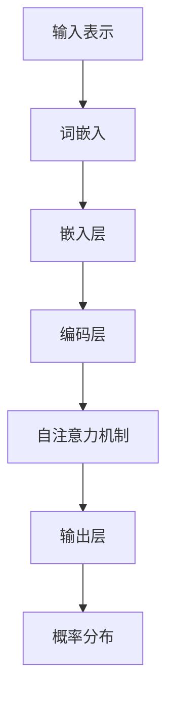
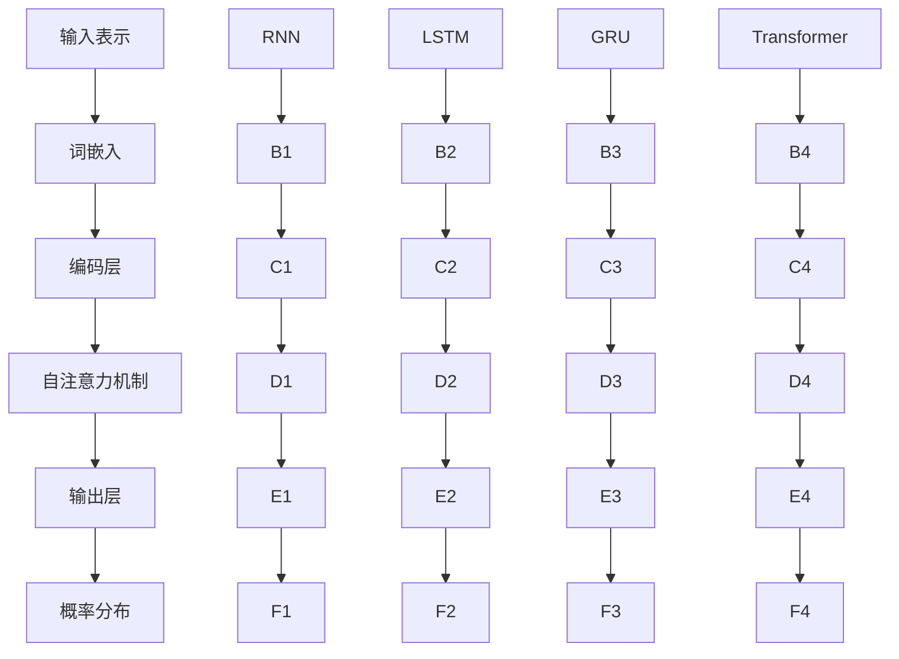

                 

### 第1章 引言

#### 1.1 本书的目的与意义

随着人工智能技术的迅猛发展，语言模型（LLM）已成为自然语言处理（NLP）领域的重要工具。LLM在智能客服、机器翻译、内容生成等领域展示出了强大的潜力，为各行各业带来了深远的影响。然而，LLM应用的开发过程复杂且成本高昂，如何高效地验证产品价值成为开发者在面对不确定性时的一大挑战。

本书旨在为LLM应用开发者提供一套MVP（最小可行产品）策略，帮助他们在早期阶段快速验证产品价值。通过本书，读者将了解LLM的基础知识、MVP策略的设计原则以及实际应用中的开发流程和测试方法，从而为LLM应用的成功开发奠定坚实基础。

#### 1.2 语言模型的发展背景

语言模型的发展经历了从传统统计模型到深度学习模型的转变。最早的统计模型如N元语法，虽然能够较好地捕捉语言的统计特性，但在复杂性和灵活性上存在较大局限。随着深度学习技术的兴起，神经网络开始被广泛应用于语言模型。2017年，Google提出的Transformer模型彻底改变了语言模型的发展方向。Transformer引入了自注意力机制，使得模型能够更好地捕捉长距离依赖关系，从而在多项NLP任务中取得了突破性成果。

#### 1.3 MVP策略在LLM应用中的重要性

MVP策略是一种以最小资源投入获取最大收益的开发方法。在LLM应用开发中，MVP策略的重要性体现在以下几个方面：

1. **快速验证产品价值**：通过构建MVP，开发者可以在早期阶段验证产品的核心功能和市场需求，从而降低开发风险。
2. **资源优化**：MVP策略要求开发者集中精力实现产品的核心功能，避免资源浪费。
3. **用户反馈**：MVP允许开发者收集早期用户的反馈，为后续优化提供宝贵的数据支持。
4. **灵活性**：MVP策略使得开发者能够在产品迭代过程中快速调整方向，以适应市场变化。

#### 1.4 本书结构

本书共分为8章，具体结构如下：

- **第1章 引言**：介绍本书的目的与意义，以及LLM和MVP策略的发展背景。
- **第2章 语言模型基础**：讲解语言模型的发展历程、基本原理和分类特性。
- **第3章 LLM应用的MVP开发流程**：介绍MVP策略的设计原则、功能模块拆分与优先级排序，以及快速开发与迭代的方法。
- **第4章 数据收集与预处理**：探讨数据收集策略、数据预处理方法以及数据质量评估。
- **第5章 LLM模型选择与训练**：讲解LLM模型选择原则、训练数据准备和训练流程与参数调优。
- **第6章 LLM应用的MVP测试与评估**：介绍MVP测试策略、性能评估指标以及用户反馈与迭代。
- **第7章 实战案例**：通过具体案例展示LLM应用的MVP策略实施过程。
- **第8章 总结与展望**：总结本书要点，展望LLM应用的未来发展趋势。

通过以上章节的介绍，读者将逐步掌握LLM应用的MVP策略，为实际开发提供有力支持。

## 关键词
- 语言模型
- MVP策略
- 自然语言处理
- 开发流程
- 数据预处理
- 模型训练
- 测试与评估

## 摘要

本书旨在为LLM应用开发者提供一套MVP策略，帮助他们在早期阶段快速验证产品价值。通过深入讲解语言模型的基础知识、MVP策略的设计原则以及实际应用中的开发流程和测试方法，本书旨在为读者提供全面的指导，从而实现LLM应用的成功开发。本文首先介绍了语言模型的发展背景和MVP策略的重要性，随后详细阐述了本书的结构和各章节的主要内容，为后续内容的展开奠定了基础。

### 第2章 语言模型基础

语言模型是自然语言处理（NLP）的核心组成部分，其在文本生成、机器翻译、问答系统等多个领域中扮演着至关重要的角色。本章节将详细探讨语言模型的发展历程、基本原理和分类特性，旨在为读者奠定坚实的理论基础。

#### 2.1 语言模型的发展历程

语言模型的发展可以分为以下几个阶段：

1. **传统统计模型阶段**：
   - **N元语法**：最早的语言模型之一，通过统计历史序列中的N个词来预测下一个词。例如，在二元语法模型中，每个单词都会根据其前一个词来预测。
   - **回声模型**：用于捕捉单词之间的统计关联，通过对文本进行建模来预测下一个单词。

2. **基于规则的方法阶段**：
   - **转移模型**：通过构建语法规则和概率分布来生成文本。这种方法在处理语法结构和上下文关系时具有一定的优势。
   - **依存句法分析**：通过分析单词之间的依存关系来生成文本，从而更好地捕捉语义信息。

3. **基于统计的深度学习模型阶段**：
   - **循环神经网络（RNN）**：RNN通过引入记忆单元来处理序列数据，能够捕捉长距离依赖关系。然而，RNN在处理长期依赖问题时仍存在困难。
   - **长短期记忆网络（LSTM）**：LSTM是RNN的一种改进，通过引入门控机制来避免梯度消失问题，从而更好地处理长序列数据。

4. **基于Transformer的模型阶段**：
   - **Transformer**：2017年，Google提出的Transformer模型彻底改变了语言模型的发展方向。它引入了自注意力机制，能够同时考虑输入序列中的所有词，从而在多个NLP任务中取得了突破性成果。
   - **BERT**：基于Transformer的预训练模型，通过在大量未标记的文本上进行预训练，再在特定任务上进行微调，取得了显著的性能提升。
   - **GPT**：生成预训练变换器（Generative Pre-trained Transformer），是一种可以生成文本的模型，其预训练目标是从输入文本中预测下一个词。

#### 2.2 语言模型的基本原理

语言模型的目标是学习文本序列的概率分布，以便在给定前文的情况下预测下一个词。其基本原理可以分为以下几个方面：

1. **输入表示**：
   - 语言模型需要将输入的文本序列转换为向量表示，以便进行计算。常见的输入表示方法包括：
     - **词袋模型**：将文本转换为词频向量。
     - **词嵌入**：将单词映射为高维稠密向量，如Word2Vec和GloVe。
     - **字符嵌入**：将字符映射为向量，用于捕捉单词内部的结构信息。

2. **概率分布**：
   - 语言模型通过学习输入序列的概率分布来预测下一个词。具体而言，给定前文序列\( x_1, x_2, \ldots, x_t \)，语言模型需要预测下一个词\( x_{t+1} \)的概率分布。这通常通过构建一个概率模型来实现，如条件概率分布\( P(x_{t+1} | x_1, x_2, \ldots, x_t) \)。

3. **模型架构**：
   - 语言模型的实现通常采用神经网络架构，如RNN、LSTM、Transformer等。这些模型通过层层变换，逐步提取输入文本的语义信息，最终生成输出概率分布。

#### 2.3 语言模型的分类与特性

语言模型可以根据不同的分类标准进行分类，如训练数据来源、模型架构和任务目标等。以下是一些常见的语言模型分类和特性：

1. **根据训练数据来源**：
   - **有监督语言模型**：使用标记的文本数据训练，能够直接预测单词或词序列的概率分布。
   - **无监督语言模型**：使用未标记的文本数据训练，通过预训练模型来提取文本的潜在特征，然后进行微调。
   - **半监督语言模型**：结合有监督和无监督训练方法，利用少量标记数据和大量未标记数据。

2. **根据模型架构**：
   - **循环神经网络（RNN）**：通过递归方式处理序列数据，能够捕捉长期依赖关系。
   - **长短时记忆网络（LSTM）**：LSTM是RNN的一种改进，通过引入门控机制来避免梯度消失问题。
   - **门控循环单元（GRU）**：GRU是LSTM的简化版本，在计算复杂度和训练速度上有所改进。
   - **Transformer**：基于自注意力机制的模型，能够同时考虑输入序列中的所有词，在多个NLP任务中取得了突破性成果。

3. **根据任务目标**：
   - **文本生成模型**：如GPT，用于生成连续的文本序列。
   - **机器翻译模型**：如Transformer，用于将一种语言的文本翻译成另一种语言。
   - **问答系统模型**：如BERT，用于从给定的问题和文本中提取答案。

#### 2.4 语言模型的核心概念架构

为了更好地理解语言模型的核心概念和原理，以下是一个简单的Mermaid流程图，展示了语言模型的基本架构：



- **输入表示**：将输入的文本序列转换为向量表示，如词嵌入或字符嵌入。
- **嵌入层**：对输入向量进行变换，生成嵌入向量。
- **编码层**：通过多层神经网络，对嵌入向量进行编码，提取文本的语义信息。
- **自注意力机制**：在编码层中引入自注意力机制，能够同时考虑输入序列中的所有词。
- **输出层**：根据编码层的结果，生成输出概率分布，用于预测下一个词。

通过以上章节的介绍，读者将全面了解语言模型的发展历程、基本原理和分类特性。这些知识将为后续章节中MVP策略的讲解和实际应用提供坚实的理论基础。

### 2.2 语言模型的基本原理

语言模型的基本原理主要涉及输入表示、概率分布和模型架构。通过以下内容，我们将详细探讨这些核心概念，帮助读者理解语言模型的工作机制。

#### 2.2.1 语言模型的目标

语言模型的核心目标是学习文本序列的概率分布，以便在给定前文的情况下预测下一个词。这一目标可以通过以下步骤实现：

1. **输入序列表示**：将输入的文本序列转换为向量表示，以便进行计算。这一步骤通常称为输入表示。
2. **概率分布学习**：根据输入序列的概率分布模型，学习如何从当前输入序列中预测下一个词。
3. **输出概率分布**：在给定当前输入序列的情况下，生成下一个词的概率分布，从而预测可能的输出词。

#### 2.2.2 语言模型的工作机制

语言模型的工作机制可以分为三个主要部分：输入表示、模型架构和输出生成。以下是这些部分的详细解释：

1. **输入表示**：
   - **词袋模型**：词袋模型是一种简单的输入表示方法，它将文本转换为词频向量。词袋模型不考虑词的顺序，只记录每个词在文本中出现的次数。
   - **词嵌入**：词嵌入（Word Embedding）是一种更高级的输入表示方法，它将单词映射为高维稠密向量。词嵌入能够捕捉单词的语义信息，从而在文本处理中表现出更好的性能。
   - **字符嵌入**：字符嵌入（Character Embedding）是将文本中的每个字符映射为向量。字符嵌入可以捕捉单词内部的结构信息，有助于提高模型的准确性。

2. **模型架构**：
   - **循环神经网络（RNN）**：循环神经网络是一种用于处理序列数据的神经网络，其核心思想是通过递归方式对输入序列进行编码。RNN能够捕捉序列中的长期依赖关系，但容易受到梯度消失问题的影响。
   - **长短时记忆网络（LSTM）**：LSTM是RNN的一种改进，通过引入门控机制来避免梯度消失问题。LSTM在处理长序列数据时表现出更好的性能。
   - **门控循环单元（GRU）**：GRU是LSTM的简化版本，在计算复杂度和训练速度上有所改进。GRU通过合并输入门和遗忘门来优化LSTM的性能。

3. **输出生成**：
   - 在给定当前输入序列的情况下，语言模型需要生成下一个词的概率分布。这一过程通常通过神经网络实现，如RNN、LSTM或GRU。输出层通常是一个softmax层，用于将输入序列编码为概率分布。
   - 输出概率分布决定了下一个词的概率，从而实现文本生成。

#### 2.2.3 语言模型的关键组件

语言模型的关键组件包括词嵌入层、编码层和输出层。以下是对这些组件的详细说明：

1. **词嵌入层**：
   - 词嵌入层是将输入的文本序列转换为向量表示的组件。词嵌入层通常使用预训练的词嵌入模型，如Word2Vec或GloVe，来初始化词向量。
   - 词嵌入层的关键参数包括词向量维度和词嵌入矩阵。

2. **编码层**：
   - 编码层是对输入序列进行编码的组件。编码层通常包含多个神经网络层，如RNN、LSTM或GRU。编码层的关键参数包括隐藏层尺寸和层数。

3. **输出层**：
   - 输出层是生成输出概率分布的组件。输出层通常是一个softmax层，用于将编码层的输出转换为概率分布。
   - 输出层的关键参数包括输出维度和softmax层中的参数。

#### 2.2.4 语言模型的训练过程

语言模型的训练过程可以分为以下几个步骤：

1. **数据预处理**：
   - 数据预处理包括文本清洗、分词、去停用词等步骤。这些步骤有助于提高模型的训练效率和性能。

2. **词嵌入训练**：
   - 在训练语言模型之前，需要训练词嵌入。词嵌入训练通常使用大规模的文本语料库，通过优化词嵌入矩阵来捕捉单词的语义信息。

3. **模型训练**：
   - 模型训练包括调整词嵌入层和编码层的参数，以最小化损失函数。常用的优化算法包括随机梯度下降（SGD）和Adam。

4. **模型评估**：
   - 模型评估通常使用交叉熵损失函数，评估模型在预测词的概率分布时的准确性。常用的评估指标包括词汇准确率（Word Accuracy）和序列准确率（Sequence Accuracy）。

5. **模型调整**：
   - 在模型评估过程中，可以根据评估结果调整模型的参数，以优化模型性能。

#### 2.2.5 语言模型的应用场景

语言模型在各种应用场景中表现出色，以下是一些常见应用场景：

1. **文本生成**：
   - 语言模型可以用于生成连贯的文本，如文章、故事、对话等。这些应用在内容生成、自动摘要和问答系统中具有广泛的应用。

2. **机器翻译**：
   - 语言模型可以用于将一种语言的文本翻译成另一种语言。这些模型在机器翻译领域取得了显著的成果，如谷歌翻译和百度翻译。

3. **问答系统**：
   - 语言模型可以用于构建问答系统，从给定的问题和文本中提取答案。这些系统在智能客服、知识图谱和搜索引擎中具有重要应用。

4. **情感分析**：
   - 语言模型可以用于分析文本的情感倾向，如正面、负面或中性。这些应用在社交媒体分析、市场调研和舆情监测中具有重要价值。

通过以上内容，读者将深入理解语言模型的基本原理，包括输入表示、概率分布和模型架构。这些知识为后续章节中MVP策略的讲解和实际应用提供了理论基础。

#### 2.3 语言模型的分类与特性

语言模型可以根据不同的分类标准进行分类，每种分类标准都有其独特的特性和应用场景。以下是一些常见的分类方法和对应的语言模型类型：

##### 根据训练数据来源分类

1. **有监督语言模型**：
   - **特点**：使用标记的文本数据训练，可以直接预测单词或词序列的概率分布。例如，在句子中，给定前一个词预测下一个词。
   - **应用**：有监督语言模型适用于任务明确的场景，如机器翻译、命名实体识别和情感分析等。

2. **无监督语言模型**：
   - **特点**：使用未标记的文本数据训练，通过预训练模型来提取文本的潜在特征。例如，从未标记的文本中学习单词的嵌入向量。
   - **应用**：无监督语言模型在文本分类、信息检索和文本生成等领域表现出色，因为它们可以处理大量未标记的数据。

3. **半监督语言模型**：
   - **特点**：结合有监督和无监督训练方法，利用少量标记数据和大量未标记数据。例如，在预训练阶段使用未标记数据，然后在特定任务上使用标记数据进行微调。
   - **应用**：半监督语言模型在场景如医疗文本分析、社交网络文本分类和语音识别等领域具有广泛应用。

##### 根据模型架构分类

1. **基于RNN的语言模型**：
   - **特点**：使用递归神经网络（RNN）处理序列数据，能够捕捉序列中的长期依赖关系。
   - **应用**：基于RNN的语言模型在语音识别、语言生成和机器翻译等领域有广泛的应用。

2. **基于LSTM的语言模型**：
   - **特点**：长短期记忆网络（LSTM）是RNN的一种改进，通过门控机制避免了梯度消失问题，能够更好地处理长序列数据。
   - **应用**：LSTM在时间序列预测、语音识别和文本生成等领域表现出色。

3. **基于GRU的语言模型**：
   - **特点**：门控循环单元（GRU）是LSTM的简化版本，在计算复杂度和训练速度上有所改进。
   - **应用**：GRU在实时语音处理、对话系统和时间序列分析中应用广泛。

4. **基于Transformer的语言模型**：
   - **特点**：Transformer引入了自注意力机制，能够同时考虑输入序列中的所有词，在多个NLP任务中取得了突破性成果。
   - **应用**：Transformer是现代NLP模型的主流架构，广泛应用于机器翻译、文本生成和问答系统等。

##### 根据任务目标分类

1. **文本生成模型**：
   - **特点**：生成模型，如GPT，用于生成连续的文本序列。这些模型通常通过预测下一个词来生成文本。
   - **应用**：文本生成在内容创作、自动摘要和对话系统中应用广泛。

2. **机器翻译模型**：
   - **特点**：用于将一种语言的文本翻译成另一种语言。这些模型在输入序列和输出序列之间建立映射关系。
   - **应用**：机器翻译在跨语言沟通、全球化业务和语言学习等领域有重要应用。

3. **问答系统模型**：
   - **特点**：从给定的问题和文本中提取答案。这些模型通常结合了文本生成和语义匹配技术。
   - **应用**：问答系统在智能客服、知识库查询和搜索引擎中广泛应用。

##### 分类标准与特性

- **有监督与无监督**：有监督模型在有标签数据集上训练，性能稳定但需要大量标注数据；无监督模型在未标记数据集上训练，能处理大量未标记数据但可能存在过拟合问题。
- **RNN、LSTM、GRU**：这些模型在处理序列数据时各有优缺点，RNN在计算复杂度上较低但易受梯度消失问题影响；LSTM和GRU通过门控机制改进了RNN的性能。
- **Transformer**：自注意力机制使得Transformer在捕捉序列依赖关系方面表现出色，但计算复杂度较高。

#### 语言模型架构的Mermaid流程图

为了更好地理解语言模型的架构，以下是一个简单的Mermaid流程图，展示了不同类型语言模型的核心组件和关系：



- **输入表示**：词嵌入层用于将文本序列转换为向量表示。
- **编码层**：不同类型的语言模型在编码层上有所不同，如RNN、LSTM、GRU和Transformer。
- **自注意力机制**：Transformer在编码层中引入了自注意力机制，能够同时考虑输入序列中的所有词。
- **输出层**：生成输出概率分布，用于预测下一个词。

通过以上对语言模型分类与特性的介绍，读者将能够更好地理解不同类型语言模型的优缺点和应用场景。这些知识为后续章节中MVP策略的讲解和实际应用提供了重要的理论基础。

### 第3章 LLM应用的MVP开发流程

#### 3.1 MVP策略的设计原则

MVP（最小可行产品）策略是一种以最小资源投入获取最大收益的开发方法，特别适用于复杂且不确定性高的项目。在LLM应用开发中，MVP策略的核心设计原则包括以下几点：

1. **功能最小化**：MVP的核心在于实现产品的基本功能，而非追求全面性。通过最小化功能，可以集中资源解决最关键的问题，提高开发效率和产品价值。

2. **快速迭代**：MVP强调快速开发与迭代，通过短周期迭代，及时反馈和调整，使产品能够迅速适应市场需求和用户反馈。

3. **用户反馈**：MVP策略注重用户反馈，通过早期用户的使用体验，收集宝贵的数据，指导产品的后续优化。

4. **资源优化**：MVP策略要求在资源有限的情况下，优先实现核心功能，避免资源浪费，提高资金利用效率。

5. **可扩展性**：虽然MVP关注最小化功能，但也要考虑到未来的扩展性，确保产品在后续开发中能够顺利扩展。

#### 3.2 功能模块拆分与优先级排序

在LLM应用开发中，功能模块的拆分与优先级排序是MVP策略的核心步骤。以下是如何进行模块拆分与优先级排序的方法：

1. **需求分析**：
   - 在开始拆分功能模块之前，需要进行详细的需求分析。这包括了解用户需求、业务目标和市场趋势。
   - 通过与利益相关者的沟通，明确产品的核心功能和非核心功能。

2. **模块识别**：
   - 根据需求分析结果，识别出产品的各个功能模块。这些模块可以是独立的，也可以是相互依赖的。
   - 常见的功能模块包括：文本输入、语言模型推理、输出结果展示、用户界面等。

3. **优先级排序**：
   - 根据功能模块的重要性和对用户价值的大小，对模块进行优先级排序。
   - 通常，核心功能和直接对用户价值较高的模块优先级较高，而辅助功能和非核心模块优先级较低。

4. **关键模块优先**：
   - 在资源有限的情况下，应优先开发关键模块。这些模块通常对用户体验和产品价值有直接影响。
   - 例如，在LLM应用中，文本输入和语言模型推理模块是核心功能，应优先开发。

5. **迭代调整**：
   - 在开发过程中，根据实际情况和用户反馈，动态调整模块优先级。这有助于确保产品能够快速适应市场需求。

#### 3.3 快速开发与迭代

快速开发与迭代是MVP策略的关键，以下是如何实现快速开发与迭代的方法：

1. **敏捷开发**：
   - 采用敏捷开发方法，如Scrum或Kanban，以短周期迭代的方式推进项目。每个迭代周期通常为2-4周。
   - 在每个迭代周期中，明确任务目标、实现功能和评估结果。

2. **原型开发**：
   - 在早期阶段，采用快速原型开发方法，如MVP原型或低保真原型，以便快速验证产品概念和用户需求。
   - 原型开发可以减少开发时间和成本，同时确保产品的可行性。

3. **持续集成与测试**：
   - 采用持续集成与测试（CI/CD）方法，确保代码质量并及时发现和修复问题。
   - 通过自动化测试，提高开发效率，减少人工测试的工作量。

4. **用户反馈**：
   - 在每个迭代周期结束后，收集用户反馈，分析用户的使用习惯和痛点。
   - 根据用户反馈，调整和优化产品功能，确保产品能够满足用户需求。

5. **持续迭代**：
   - 在整个开发过程中，不断进行迭代，逐步完善产品功能。
   - 通过持续迭代，逐步增加产品价值，提高用户满意度。

通过以上对MVP策略的设计原则、功能模块拆分与优先级排序、快速开发与迭代方法的详细讲解，读者将能够掌握如何在LLM应用开发中有效实施MVP策略，从而快速验证产品价值，降低开发风险。

### 3.1 MVP策略的设计原则

#### MVP策略的核心概念

MVP（最小可行产品）策略是一种以最小资源投入获取最大收益的开发方法，旨在快速验证产品概念并确定市场需求。在LLM应用开发中，MVP策略尤为关键，因为它帮助开发者将复杂的项目拆解为可管理的部分，从而提高开发效率和产品成功率。

#### MVP的核心原则

1. **功能最小化**：MVP的核心在于实现产品的基本功能，而非追求全面性。通过最小化功能，可以集中资源解决最关键的问题，提高开发效率和产品价值。

2. **快速迭代**：MVP强调快速开发与迭代，通过短周期迭代，及时反馈和调整，使产品能够迅速适应市场需求和用户反馈。

3. **用户反馈**：MVP策略注重用户反馈，通过早期用户的使用体验，收集宝贵的数据，指导产品的后续优化。

4. **资源优化**：MVP策略要求在资源有限的情况下，优先实现核心功能，避免资源浪费，提高资金利用效率。

5. **可扩展性**：虽然MVP关注最小化功能，但也要考虑到未来的扩展性，确保产品在后续开发中能够顺利扩展。

#### 设计原则的应用

1. **明确核心功能**：在LLM应用开发中，首先需要明确产品的核心功能。例如，一个智能问答系统的核心功能可能包括问题接收、语言模型推理和答案生成。这些功能对用户体验和价值有直接影响，应优先实现。

2. **逐步实现**：在功能最小化的基础上，逐步实现关键功能。例如，可以先实现问题接收和答案生成，而将复杂的语言模型训练和优化放在后续迭代中。

3. **快速原型开发**：在早期阶段，采用快速原型开发方法，如MVP原型或低保真原型，以便快速验证产品概念和用户需求。这可以减少开发时间和成本，同时确保产品的可行性。

4. **短周期迭代**：采用敏捷开发方法，如Scrum或Kanban，以短周期迭代的方式推进项目。每个迭代周期通常为2-4周。在迭代过程中，持续收集用户反馈，及时调整和优化产品功能。

5. **持续测试与评估**：在开发过程中，采用持续集成与测试（CI/CD）方法，确保代码质量并及时发现和修复问题。通过自动化测试，提高开发效率，减少人工测试的工作量。

6. **用户反馈机制**：建立有效的用户反馈机制，收集早期用户的反馈，分析用户的使用习惯和痛点。根据用户反馈，调整和优化产品功能，确保产品能够满足用户需求。

7. **资源优化**：在资源有限的情况下，优先实现核心功能，避免资源浪费。例如，可以优先购买高性能计算资源，用于关键功能的训练和优化。

8. **可扩展性考虑**：在实现最小可行产品的同时，也要考虑到未来的扩展性。例如，在设计数据库架构时，要确保能够轻松扩展存储容量和处理能力。

通过以上设计原则的应用，开发者可以在LLM应用开发中有效实施MVP策略，从而快速验证产品价值，降低开发风险，提高产品成功率。

#### 3.2 功能模块拆分与优先级排序

在LLM应用开发中，将整个系统拆分为多个功能模块是确保项目可管理性和高效开发的关键步骤。以下是如何进行功能模块拆分与优先级排序的具体方法：

1. **需求分析**：
   - 在开始拆分功能模块之前，需要进行详细的需求分析。这包括了解用户需求、业务目标和市场趋势。
   - 通过与利益相关者的沟通，明确产品的核心功能和非核心功能。
   - 需求分析的结果将指导后续的模块拆分和优先级排序。

2. **模块识别**：
   - 根据需求分析结果，识别出产品的各个功能模块。这些模块可以是独立的，也可以是相互依赖的。
   - 常见的功能模块包括：
     - **文本输入模块**：负责接收用户的输入文本，并进行初步处理。
     - **语言模型推理模块**：利用预训练的语言模型对输入文本进行处理，生成语义理解和答案。
     - **答案生成模块**：根据语言模型推理的结果，生成具有可读性和准确性的答案。
     - **用户界面模块**：负责与用户进行交互，展示输入和输出结果，收集用户反馈。
     - **数据存储模块**：负责存储和管理用户数据、模型参数和训练数据。

3. **优先级排序**：
   - 根据功能模块的重要性和对用户价值的大小，对模块进行优先级排序。
   - 通常，核心功能和直接对用户价值较高的模块优先级较高，而辅助功能和非核心模块优先级较低。
   - 以下是一个可能的优先级排序示例：
     - **文本输入模块**：用户输入文本是核心交互环节，必须优先实现。
     - **语言模型推理模块**：语言模型是产品的核心技术，需要优先开发。
     - **答案生成模块**：生成准确和有用的答案是用户的核心需求，应优先实现。
     - **用户界面模块**：界面是用户与产品交互的桥梁，但可以先实现基本的展示功能，再逐步优化。
     - **数据存储模块**：数据存储是产品的基础设施，但可以先使用简单的存储方案，再根据需求逐步优化。

4. **关键模块优先**：
   - 在资源有限的情况下，应优先开发关键模块。这些模块通常对用户体验和价值有直接影响。
   - 例如，在LLM应用中，文本输入和语言模型推理模块是核心功能，应优先开发。
   - 通过优先开发关键模块，可以确保产品在早期阶段具备基本功能，为后续迭代和扩展奠定基础。

5. **迭代调整**：
   - 在开发过程中，根据实际情况和用户反馈，动态调整模块优先级。这有助于确保产品能够快速适应市场需求。
   - 例如，如果在测试中发现用户更关注特定的功能模块，应调整开发计划，优先实现这些功能。

通过以上方法，开发者可以有效地拆分和排序功能模块，确保在有限资源下，优先实现关键功能，从而提高开发效率和产品成功率。

### 3.3 快速开发与迭代

#### 快速开发与迭代的方法

1. **敏捷开发方法**：
   - 采用敏捷开发方法，如Scrum或Kanban，以短周期迭代的方式推进项目。每个迭代周期通常为2-4周。在迭代过程中，明确任务目标、实现功能和评估结果。

2. **原型开发**：
   - 在早期阶段，采用快速原型开发方法，如MVP原型或低保真原型，以便快速验证产品概念和用户需求。这可以减少开发时间和成本，同时确保产品的可行性。

3. **持续集成与测试**：
   - 采用持续集成与测试（CI/CD）方法，确保代码质量并及时发现和修复问题。通过自动化测试，提高开发效率，减少人工测试的工作量。

4. **用户反馈机制**：
   - 在每个迭代周期结束后，收集用户反馈，分析用户的使用习惯和痛点。根据用户反馈，调整和优化产品功能，确保产品能够满足用户需求。

5. **短周期迭代**：
   - 通过短周期迭代，可以快速验证功能模块，并及时调整开发方向。这有助于降低开发风险，提高产品成功率。

#### 快速开发的优势

1. **快速验证产品价值**：
   - 通过快速开发，可以在早期阶段验证产品的核心功能和市场需求，降低开发风险。

2. **资源优化**：
   - 在快速开发过程中，可以集中资源实现关键功能，避免资源浪费，提高资金利用效率。

3. **用户参与**：
   - 快速开发使得用户能够早期参与产品开发，提供宝贵反馈，有助于产品更好地满足用户需求。

4. **灵活调整**：
   - 通过短周期迭代，可以灵活调整开发计划，以适应市场需求变化，提高产品的适应性和竞争力。

5. **降低成本**：
   - 快速开发方法可以减少开发时间和成本，尤其是在项目早期阶段，避免大量资源投入到高风险的项目中。

#### 快速开发的挑战

1. **技术风险**：
   - 在快速开发过程中，可能面临技术实现上的风险，如语言模型训练时间过长、计算资源不足等。

2. **质量保证**：
   - 快速开发可能导致质量保证不足，特别是在自动化测试和代码审查方面。

3. **团队协作**：
   - 快速开发需要高效团队协作，包括开发人员、测试人员、产品经理等，确保每个迭代周期都能顺利推进。

4. **用户需求变化**：
   - 用户需求可能在开发过程中发生变化，需要及时调整产品功能，这可能增加开发难度。

通过以上对快速开发与迭代的方法、优势以及挑战的详细讲解，读者将能够更好地理解如何在LLM应用开发中实施快速开发与迭代策略，从而提高产品开发效率和成功率。

### 3.4 快速开发与迭代的最佳实践

在LLM应用开发中，快速开发与迭代是确保产品成功的关键策略。以下是一些最佳实践，帮助开发者更有效地实施这一策略：

1. **采用敏捷开发方法**：
   - 实践Scrum或Kanban方法，将开发过程划分为短周期迭代，通常为2-4周。在每个迭代周期中，明确任务目标、实现功能和评估结果，确保团队能够持续交付有价值的软件。

2. **快速原型开发**：
   - 在项目早期，采用低保真原型或MVP原型进行快速验证。这种方法可以减少开发时间和成本，同时确保产品的可行性。低保真原型可以使用简单的界面和基本功能，但要确保能够真实反映产品的核心功能。

3. **持续集成与测试**：
   - 实施持续集成（CI）与持续交付（CD）流程，确保代码质量并及时发现和修复问题。自动化测试是关键，它能够提高开发效率，减少人工测试的工作量，同时确保每个迭代周期的功能交付。

4. **用户反馈机制**：
   - 建立有效的用户反馈机制，确保在每个迭代周期结束后，收集用户的使用体验和反馈。这有助于团队了解用户需求，发现产品中的问题，并及时进行调整。

5. **短周期迭代**：
   - 通过短周期迭代，可以快速验证功能模块，并及时调整开发方向。这有助于降低开发风险，提高产品的适应性和竞争力。

6. **资源优化**：
   - 在资源有限的情况下，优先实现关键功能。这可以通过优先级排序和资源分配来实现，确保团队能够集中精力解决最关键的问题。

7. **团队协作**：
   - 快速开发需要高效团队协作，包括开发人员、测试人员、产品经理等。确保每个成员都明确自己的角色和任务，建立良好的沟通机制，有助于团队高效工作。

8. **技术风险管理**：
   - 在快速开发过程中，技术风险可能成为瓶颈。通过提前规划、技术评审和持续学习，团队可以更好地应对这些风险，确保项目顺利进行。

9. **灵活调整**：
   - 用户需求可能在开发过程中发生变化，团队需要保持灵活性，能够快速调整产品功能和开发计划，以适应市场变化。

10. **文档与知识共享**：
    - 保持良好的文档记录，确保团队成员之间的知识共享。这不仅有助于新成员快速融入团队，还能够提高整体工作效率。

通过遵循这些最佳实践，开发者可以更有效地实施快速开发与迭代策略，从而提高LLM应用开发的效率和产品质量。

### 第4章 数据收集与预处理

#### 4.1 数据收集策略

在LLM应用开发中，数据收集是至关重要的一环。一个高质量的数据集可以为语言模型提供良好的训练素材，从而提高模型的性能和泛化能力。以下是如何制定有效的数据收集策略：

1. **数据来源**：
   - 数据可以从多种来源获取，包括公开数据集、企业内部数据、社交媒体、新闻报道等。公开数据集如Wikipedia、Common Crawl等是语言模型训练的常用资源。企业内部数据可以提供特定领域或行业的数据，有助于提升模型的领域适应性。
   - 选择数据来源时，需要考虑数据的质量、覆盖范围和多样性。高质量的公开数据集通常经过清洗和标注，可以直接用于训练。而企业内部数据则可能需要更详细的预处理。

2. **数据收集方法**：
   - **爬虫技术**：利用爬虫技术，可以从互联网上抓取大量的文本数据。这需要编写特定的爬虫程序，遵循网站的使用协议和法律法规，避免对网站造成过度负担。
   - **API获取**：许多平台和数据库提供API接口，可以通过程序调用获取数据。例如，Twitter API可以获取大量的社交媒体数据，Google Books API可以获取书籍数据。
   - **问卷调查**：通过设计问卷调查，收集用户反馈和意见。这种方法适用于获取特定用户群体的数据，有助于了解用户需求和偏好。
   - **合作共享**：与其他研究机构或企业合作，共享数据资源。这种方法可以扩大数据集的规模和多样性，提高数据质量。

3. **数据收集过程中的挑战**：
   - **数据质量**：收集到的数据可能存在噪声、缺失值和错误。这需要通过数据清洗和预处理来提高数据质量。
   - **数据多样性**：单一来源的数据可能无法覆盖所有领域和场景。需要从多个来源收集数据，确保数据多样性。
   - **数据隐私**：在收集和处理数据时，需要遵守数据隐私法规，确保用户隐私不受侵犯。

4. **数据收集流程**：
   - **需求分析**：明确数据收集的目标和需求，制定数据收集计划。
   - **数据收集**：按照计划，采用合适的收集方法，从多个来源收集数据。
   - **数据清洗**：对收集到的数据进行清洗，去除噪声和错误，补充缺失值。
   - **数据存储**：将清洗后的数据存储在数据库中，便于后续处理和使用。

通过以上策略，开发者可以有效地收集到高质量、多样化的数据，为LLM应用开发提供坚实的素材。

#### 4.2 数据预处理方法

在LLM应用开发中，数据预处理是提高模型性能和准确性的关键步骤。以下是常见的数据预处理方法：

1. **数据清洗**：
   - 数据清洗是数据预处理的首要步骤，旨在去除噪声、缺失值和错误。常见的数据清洗方法包括：
     - **去除重复数据**：通过唯一标识符或关键词匹配，去除重复的文本记录。
     - **填充缺失值**：使用平均值、中位数或插值法填充缺失值。
     - **去除噪声**：去除文本中的特殊字符、标点符号和停用词，以提高数据质量。

2. **数据归一化**：
   - 数据归一化是将不同特征的数据转换为相似尺度，以便模型能够更好地处理。常见的数据归一化方法包括：
     - **标准化**：将数据缩放到[0, 1]或[-1, 1]范围内。例如，使用 \( x' = \frac{x - \mu}{\sigma} \) 进行标准化。
     - **归一化**：将数据转换为均值和标准差为0和1的分布。例如，使用 \( x' = \frac{x - \mu}{\sigma} \) 进行归一化。

3. **数据增强**：
   - 数据增强是通过生成新的数据样本来扩充数据集，从而提高模型的泛化能力。常见的数据增强方法包括：
     - **数据转换**：如上下文转换、词替换、同义词替换等，以生成不同的文本表示。
     - **数据扩充**：通过添加文本片段、插入噪声、错别字等方式，生成新的文本数据。
     - **生成对抗网络（GAN）**：利用生成对抗网络（GAN）生成新的文本数据，增加数据集的多样性。

4. **数据质量评估**：
   - 数据质量评估是确保数据集质量和可靠性的关键步骤。常见的数据质量评估方法包括：
     - **一致性检查**：检查数据集中的不一致性，如重复记录、错误值等。
     - **完整性检查**：检查数据集是否完整，是否存在缺失值或缺失数据。
     - **多样性评估**：评估数据集的多样性，确保数据集能够覆盖不同领域和场景。

通过以上预处理方法，开发者可以显著提高数据质量，为LLM应用开发提供更可靠的数据支持。

#### 4.3 数据质量评估

在LLM应用开发中，数据质量直接影响模型的性能和准确性。因此，对数据质量进行评估是至关重要的一环。以下是常见的数据质量评估方法：

1. **一致性检查**：
   - 一致性检查是确保数据集内部和不同数据集之间数据一致性的过程。常见的方法包括：
     - **重复记录检查**：通过唯一标识符或关键词匹配，检查数据集中是否存在重复的记录。
     - **逻辑一致性检查**：检查数据记录之间的逻辑关系是否一致，如日期和时间、数值范围等。

2. **完整性检查**：
   - 完整性检查是评估数据集是否完整，是否存在缺失值或缺失数据。常见的方法包括：
     - **缺失值统计**：统计数据集中的缺失值数量和比例，识别可能存在的数据缺失问题。
     - **完整性分析**：通过分析数据集的完整性，确定是否需要补充缺失值或进行其他预处理操作。

3. **多样性评估**：
   - 数据集的多样性是评估数据质量的重要指标。多样性评估包括：
     - **词汇多样性**：分析数据集中的词汇分布，确保覆盖不同领域和主题。
     - **内容多样性**：通过分析数据集的内容，确保覆盖不同场景和用户群体。

4. **数据质量指标**：
   - 数据质量指标是衡量数据质量的关键参数，常见的数据质量指标包括：
     - **数据准确性**：评估数据集中实际值与预期值之间的差距。
     - **数据完整性**：评估数据集中缺失值的比例和缺失程度。
     - **数据一致性**：评估数据集中不同记录和不同数据集之间的数据一致性。

5. **数据质量优化策略**：
   - 根据评估结果，采取相应的数据质量优化策略，以提高数据质量。常见的数据质量优化策略包括：
     - **数据清洗**：通过去除重复记录、填补缺失值、纠正错误值等方式，提高数据准确性。
     - **数据扩充**：通过生成对抗网络（GAN）、文本转换和数据扩充技术，增加数据集的多样性。
     - **数据集成**：通过整合不同来源的数据，提高数据集的完整性和一致性。

通过以上数据质量评估和优化策略，开发者可以显著提高数据质量，为LLM应用开发提供更可靠的数据支持。

### 第5章 LLM模型选择与训练

#### 5.1 LLM模型选择原则

在LLM应用开发中，选择合适的模型是确保项目成功的关键步骤。以下是选择LLM模型时应遵循的原则：

1. **任务需求**：
   - 根据具体的任务需求选择合适的模型。例如，在机器翻译任务中，选择基于Transformer的模型可能更为合适；而在问答系统任务中，选择预训练的语言模型如BERT可能更有效。

2. **模型性能**：
   - 考虑模型的性能指标，如准确性、速度和资源占用。在资源有限的情况下，选择性能较好的模型可以更好地满足任务需求。

3. **训练数据**：
   - 选择能够充分利用现有训练数据的模型。如果训练数据量较大，可以选择大型模型，如GPT-3；如果数据量有限，可以选择轻量级模型，如BERT-Lite。

4. **可扩展性**：
   - 考虑模型的可扩展性，以确保模型在未来能够适应更多数据和更复杂的任务。

5. **社区支持**：
   - 选择具有良好社区支持和文档的模型，可以减少开发过程中的困难和问题，提高开发效率。

6. **开源与商业**：
   - 根据项目需求和预算，选择开源或商业模型。开源模型具有成本低、灵活性高等优势，但可能需要更多的开发和维护工作；商业模型通常提供更完善的文档和技术支持，但成本较高。

#### 5.2 训练数据准备

在确定模型后，训练数据的准备是确保模型训练效果的关键步骤。以下是训练数据准备的步骤：

1. **数据清洗**：
   - 清洗数据，去除噪声、重复记录和错误值，确保数据质量。

2. **数据分割**：
   - 将数据集分割为训练集、验证集和测试集。通常，训练集用于模型训练，验证集用于模型调优和验证，测试集用于评估模型最终性能。

3. **数据预处理**：
   - 对数据进行预处理，包括文本清洗、分词、词嵌入等。这有助于提高模型对数据的理解能力。

4. **数据增强**：
   - 通过数据增强技术，如文本转换、同义词替换、错别字插入等，增加数据的多样性，提高模型的泛化能力。

5. **数据标准化**：
   - 标准化数据，如归一化数值特征和统一文本编码，确保数据格式一致。

#### 5.3 训练流程与参数调优

训练流程和参数调优是确保模型性能的关键步骤。以下是训练流程和参数调优的详细步骤：

1. **模型初始化**：
   - 初始化模型参数，可以使用预训练的权重或随机初始化。预训练权重可以提高模型性能，尤其是在数据量有限的情况下。

2. **训练过程**：
   - 使用训练数据集进行模型训练，通常采用梯度下降或其变种（如Adam）进行优化。
   - 在训练过程中，监控验证集的性能，避免过拟合。

3. **参数调优**：
   - 调整模型参数，如学习率、批量大小、正则化强度等，以优化模型性能。
   - 可以使用超参数优化方法，如随机搜索、贝叶斯优化等，找到最佳参数组合。

4. **验证与调整**：
   - 在验证集上评估模型性能，根据评估结果调整模型结构和参数。
   - 可以使用交叉验证等技术，确保模型在不同数据集上的性能一致。

5. **测试与部署**：
   - 在测试集上评估模型最终性能，确保模型达到预期效果。
   - 将训练好的模型部署到生产环境中，进行实际应用。

通过以上模型选择与训练流程，开发者可以有效地选择合适的模型、准备高质量的数据集，并优化模型参数，确保LLM应用的高性能和可靠性。

### 5.1 LLM模型选择原则

在LLM应用开发中，选择合适的模型是确保项目成功的关键步骤。以下是一些选择LLM模型时应遵循的原则：

1. **任务需求**：
   - 首先，根据具体的任务需求选择合适的模型。不同的任务可能需要不同类型的模型。例如，在机器翻译任务中，基于Transformer的模型通常表现更好；而在问答系统任务中，预训练的语言模型如BERT可能更为有效。
   - 分析任务需求时，需要考虑任务的复杂性、输入和输出的特征以及所需的语言理解能力。

2. **模型性能**：
   - 考虑模型在特定任务上的性能指标，如准确性、响应速度和资源占用。在资源有限的情况下，选择性能较好的模型可以更好地满足任务需求。
   - 可以通过查阅相关文献或实验数据，了解不同模型在特定任务上的性能表现，以指导模型选择。

3. **训练数据**：
   - 选择能够充分利用现有训练数据的模型。如果训练数据量较大，可以选择大型模型，如GPT-3或T5；如果数据量有限，可以选择轻量级模型，如BERT-Lite或 DistilBERT。
   - 考虑数据分布和多样性，确保模型能够适应不同的数据集和场景。

4. **可扩展性**：
   - 考虑模型的可扩展性，以确保模型在未来能够适应更多数据和更复杂的任务。
   - 选择具有模块化设计或可扩展架构的模型，便于后续的模型升级和功能扩展。

5. **社区支持**：
   - 选择具有良好社区支持和文档的模型，可以减少开发过程中的困难和问题，提高开发效率。
   - 社区支持包括开源代码库、文档资源、论坛讨论和教程等，这些资源有助于开发者更快地上手和解决问题。

6. **开源与商业**：
   - 根据项目需求和预算，选择开源或商业模型。开源模型具有成本低、灵活性高等优势，但可能需要更多的开发和维护工作；商业模型通常提供更完善的文档和技术支持，但成本较高。
   - 开源模型如GPT、BERT等，拥有广泛的社区支持和丰富的资源，适合大多数开发者；商业模型如OpenAI的GPT-3，提供了更高级的功能和更好的性能，但需要支付相应的费用。

通过以上原则，开发者可以更科学、更有效地选择适合LLM应用的模型，从而确保项目顺利推进和成功交付。

### 5.2 训练数据准备

在确定了合适的LLM模型后，下一步就是准备用于训练的数据集。高质量的数据集是确保模型性能和泛化能力的关键。以下是如何准备训练数据集的详细步骤：

#### 数据清洗

数据清洗是预处理过程中的第一步，其目的是去除数据中的噪声、重复记录和错误值。以下是一些常见的数据清洗方法：

1. **去除重复记录**：
   - 通过唯一标识符（如文本ID）或关键词匹配，识别并去除数据集中的重复记录。
   - 可以使用Python的Pandas库中的`duplicated()`方法进行快速处理。

2. **填充缺失值**：
   - 识别数据集中的缺失值，并采取适当的措施进行填充。常见的填充方法包括：
     - 使用平均值或中位数填充数值特征。
     - 使用空白或特定标记填充文本数据。
     - 使用机器学习算法（如插值法或回归模型）预测缺失值。

3. **去除噪声**：
   - 去除文本中的特殊字符、标点符号和无效词汇，提高数据质量。可以使用Python的re模块进行正则表达式匹配，删除不符合要求的字符。

4. **纠正错误值**：
   - 检查数据中的错误值，并采取相应的措施进行纠正。例如，识别和替换拼写错误、数据输入错误等。

#### 数据分割

数据分割是将数据集划分为训练集、验证集和测试集，这是评估模型性能和防止过拟合的重要步骤。以下是一些常见的分割方法：

1. **随机分割**：
   - 将数据集随机划分为训练集、验证集和测试集。这种方法简单直观，但可能导致数据分布的不平衡。

2. **按比例分割**：
   - 根据数据集的大小，按一定比例（如80%用于训练、10%用于验证、10%用于测试）进行分割。这种方法可以确保每个集都有足够的样本量。

3. **基于标签分割**：
   - 如果数据集带有标签，可以按标签的比例进行分割，以确保每个类别的样本数大致相等。

#### 数据预处理

数据预处理是将原始数据转换为模型可接受的格式，提高模型训练效果。以下是一些常见的数据预处理方法：

1. **文本清洗**：
   - 去除文本中的停用词（如“的”、“了”等常见但不提供语义信息的词）。
   - 对文本进行分词，将连续的文本转换为词汇序列。可以使用Python的jieba库进行中文分词。

2. **文本编码**：
   - 将文本转换为数值表示。常见的方法包括：
     - **词袋模型**：将文本转换为词频向量。
     - **词嵌入**：将单词映射为高维稠密向量（如Word2Vec或GloVe）。

3. **数据标准化**：
   - 对数值特征进行标准化处理，如归一化或标准化，以消除不同特征之间的尺度差异。

#### 数据增强

数据增强是通过生成新的数据样本来扩充数据集，从而提高模型的泛化能力。以下是一些常见的数据增强方法：

1. **文本转换**：
   - 通过改变文本的结构、词序或词汇，生成新的文本数据。例如，使用同义词替换、上下文转换或句子重构。

2. **数据扩充**：
   - 通过添加噪声、错别字或插入文本片段，生成新的文本数据。例如，在文本中随机插入特定长度的单词或短语。

3. **生成对抗网络（GAN）**：
   - 使用生成对抗网络（GAN）生成新的文本数据，这是一种无监督学习技术，能够生成高质量的文本样本。

通过以上步骤，开发者可以准备一个高质量、多样化的训练数据集，为LLM模型的训练提供坚实的基础。这些方法不仅能够提高模型的性能，还能增强模型的泛化能力，从而在现实应用中取得更好的效果。

### 5.3 训练流程与参数调优

在LLM模型的训练过程中，一个系统的训练流程和精细的参数调优是确保模型性能和准确性的关键。以下详细描述了训练流程的各个步骤以及参数调优的方法。

#### 训练流程

1. **数据预处理**：
   - 在开始训练之前，对训练数据进行预处理。这包括数据清洗、数据分割和文本编码。数据清洗步骤已在上一节中详细介绍。数据分割通常分为训练集、验证集和测试集，以确保模型可以在不同的数据集上进行评估。文本编码是将文本数据转换为模型可处理的数值表示，常用的方法有词袋模型和词嵌入。

2. **模型初始化**：
   - 初始化模型参数。在许多情况下，可以使用预训练的权重，这样可以快速启动训练过程，并在数据量有限的情况下获得较好的性能。

3. **训练过程**：
   - 使用训练数据集进行模型训练。训练过程通常采用梯度下降优化算法，其中Adam是一种常用的优化算法，它结合了自适应学习率的优点，能够提高训练效率。
   - 在训练过程中，需要监控验证集的性能。验证集用于调整模型参数和防止过拟合。如果验证集的性能开始下降，可能需要调整学习率或使用正则化技术。

4. **参数调整**：
   - 根据验证集的性能，对模型参数进行调整。常见的参数包括学习率、批量大小、正则化强度和dropout率。调整这些参数可以显著影响模型的性能。

5. **验证与调整**：
   - 在验证集上评估模型性能，根据评估结果对模型进行调整。这可能包括调整网络结构、添加正则化或修改学习策略。

6. **测试与部署**：
   - 在测试集上评估模型最终性能，确保模型达到预期效果。如果模型性能良好，可以将其部署到生产环境中进行实际应用。

#### 参数调优

参数调优是模型训练过程中的重要环节，以下是一些常用的参数调优方法：

1. **学习率**：
   - 学习率是梯度下降优化算法中的一个关键参数，它控制模型更新参数的步长。选择合适的学习率可以加快模型收敛速度，而学习率过大可能导致梯度爆炸，学习率过小则可能导致收敛缓慢。
   - 可以通过调整学习率或使用学习率衰减策略，如指数衰减或余弦退火，来优化模型训练。

2. **批量大小**：
   - 批量大小是指每次梯度下降优化过程中使用的样本数量。较大的批量大小可以提供更稳定的梯度估计，但计算成本较高；较小的批量大小可以减少计算成本，但可能带来更大的方差。
   - 通常，批量大小在32到256之间，具体选择取决于硬件资源和模型复杂性。

3. **正则化**：
   - 正则化是一种防止模型过拟合的技术，常用的正则化方法包括L1正则化、L2正则化和dropout。通过增加正则化项，可以在优化过程中抑制权重增长，提高模型的泛化能力。

4. **网络结构**：
   - 网络结构包括层数、隐藏层单元数、层间连接方式等。通过调整网络结构，可以优化模型的性能。例如，增加层数或隐藏层单元数可以增强模型的表达能力，但也会增加计算成本。

5. **超参数优化**：
   - 超参数优化是一种系统化地调整模型参数的方法，旨在找到最佳参数组合。常用的优化方法包括随机搜索、网格搜索和贝叶斯优化。
   - 随机搜索通过随机选择参数组合进行评估，而网格搜索则在预定义的参数范围内进行系统化搜索。贝叶斯优化结合了统计模型和优化算法，能够更高效地找到最佳参数组合。

通过以上训练流程和参数调优方法，开发者可以有效地训练和优化LLM模型，从而在复杂的NLP任务中实现高性能和良好的泛化能力。

### 5.4 训练流程与参数调优示例

为了更好地理解LLM模型的训练流程和参数调优，下面将通过一个Python示例来演示如何实现这些步骤。假设我们使用的是Hugging Face的Transformers库，该库提供了丰富的预训练模型和便利的训练工具。

#### 5.4.1 环境搭建

首先，需要安装必要的依赖库，如Transformers和PyTorch：

```python
!pip install transformers torch
```

#### 5.4.2 数据预处理

我们使用一个简单的数据集，数据集包含文本和标签。在这里，我们假设文本数据存储在CSV文件中，每行包含一个文本和一个标签。

```python
import pandas as pd
from sklearn.model_selection import train_test_split
from transformers import AutoTokenizer

# 加载数据
data = pd.read_csv('data.csv')

# 分割数据
train_texts, test_texts, train_labels, test_labels = train_test_split(data['text'], data['label'], test_size=0.2, random_state=42)

# 加载预训练的Tokenizer
tokenizer = AutoTokenizer.from_pretrained('bert-base-uncased')

# 对文本进行编码
train_encodings = tokenizer(train_texts.tolist(), truncation=True, padding=True)
test_encodings = tokenizer(test_texts.tolist(), truncation=True, padding=True)
```

#### 5.4.3 训练模型

接下来，我们加载一个预训练的BERT模型，并对其进行微调。

```python
from transformers import AutoModelForSequenceClassification
from torch.optim import Adam
from torch.utils.data import DataLoader, TensorDataset

# 加载预训练的BERT模型
model = AutoModelForSequenceClassification.from_pretrained('bert-base-uncased')

# 将编码后的数据转换为Tensor
train_inputs = torch.tensor(train_encodings['input_ids'])
train_labels = torch.tensor(train_labels.values)
train_dataset = TensorDataset(train_inputs, train_labels)

# 创建数据加载器
train_loader = DataLoader(train_dataset, batch_size=16)

# 定义优化器
optimizer = Adam(model.parameters(), lr=1e-5)

# 训练模型
for epoch in range(3):  # 训练3个epoch
    model.train()
    for batch in train_loader:
        inputs = {'input_ids': batch[0], 'labels': batch[1]}
        outputs = model(**inputs)
        loss = outputs.loss
        loss.backward()
        optimizer.step()
        optimizer.zero_grad()
    print(f'Epoch {epoch+1} completed')
```

#### 5.4.4 参数调优

在实际应用中，我们需要根据验证集的性能对模型参数进行调整。以下是一个简单的学习率调优示例：

```python
from torch.optim.lr_scheduler import StepLR

# 创建学习率调度器
scheduler = StepLR(optimizer, step_size=1, gamma=0.95)

# 训练模型，同时调整学习率
for epoch in range(3):
    model.train()
    for batch in train_loader:
        inputs = {'input_ids': batch[0], 'labels': batch[1]}
        outputs = model(**inputs)
        loss = outputs.loss
        loss.backward()
        optimizer.step()
        scheduler.step()  # 调整学习率
        optimizer.zero_grad()
    print(f'Epoch {epoch+1} completed')
```

#### 5.4.5 评估模型

最后，我们对训练好的模型进行评估，以验证其性能。

```python
from sklearn.metrics import accuracy_score

# 将测试数据编码
test_inputs = torch.tensor(test_encodings['input_ids'])
test_labels = torch.tensor(test_labels.values)
test_dataset = TensorDataset(test_inputs, test_labels)

# 创建测试数据加载器
test_loader = DataLoader(test_dataset, batch_size=16)

# 评估模型
model.eval()
predictions = []
true_labels = []
with torch.no_grad():
    for batch in test_loader:
        inputs = {'input_ids': batch[0]}
        outputs = model(**inputs)
        logits = outputs.logits
        pred_labels = torch.argmax(logits, dim=1)
        predictions.extend(pred_labels.tolist())
        true_labels.extend(batch[1].tolist())

accuracy = accuracy_score(true_labels, predictions)
print(f'Test Accuracy: {accuracy}')
```

通过以上步骤，我们完成了LLM模型的训练、参数调优和评估。这个过程展示了如何使用Python和Hugging Face的Transformers库来训练和优化一个预训练的BERT模型。开发者可以根据实际需求调整模型参数和训练流程，以实现最佳性能。

### 第6章 LLM应用的MVP测试与评估

#### 6.1 MVP测试策略

在LLM应用的MVP开发过程中，测试与评估是确保产品质量和功能完整性的关键环节。以下是MVP测试策略的详细步骤：

1. **单元测试**：
   - 对MVP中的各个功能模块进行单元测试，确保每个模块能够独立正常运行。单元测试通常使用Python的unittest或pytest框架编写。

2. **集成测试**：
   - 对功能模块之间的集成进行测试，确保模块之间的交互和数据流正常。集成测试通常使用Selenium或Appium等自动化测试工具进行。

3. **性能测试**：
   - 对MVP的性能进行测试，包括响应时间、吞吐量和资源占用等。性能测试可以使用Apache JMeter或Gatling等工具进行。

4. **用户接受性测试**：
   - 邀请一组用户进行测试，收集用户反馈，评估产品的用户体验和功能满足度。用户接受性测试可以采用AB测试或A/B测试等方法。

5. **回归测试**：
   - 在每次迭代后，对已修复的bug和新增功能进行回归测试，确保不影响现有功能。

6. **自动化测试**：
   - 使用自动化测试工具和脚本，实现测试流程的自动化，提高测试效率和可靠性。

#### 6.2 性能评估指标

在评估LLM应用MVP的性能时，以下是一些关键性能评估指标：

1. **准确率**：
   - 在分类任务中，准确率是评估模型性能的重要指标。准确率越高，模型对输入数据的分类效果越好。

2. **召回率**：
   - 召回率是评估模型对正类别的分类能力。召回率越高，模型对正类别的分类效果越好。

3. **F1分数**：
   - F1分数是准确率和召回率的调和平均值，综合考虑了模型的分类效果。

4. **响应时间**：
   - 响应时间是指模型处理请求并返回结果所需的时间。对于实时应用，响应时间是一个关键性能指标。

5. **吞吐量**：
   - 吞吐量是模型在单位时间内处理请求的数量。吞吐量越高，模型的处理能力越强。

6. **资源占用**：
   - 包括CPU、内存和硬盘等资源的使用情况。资源占用越低，模型的性能越好。

#### 6.3 用户反馈与迭代

用户反馈是MVP测试与评估的重要组成部分，以下是如何收集用户反馈和进行迭代的方法：

1. **用户反馈收集**：
   - 在测试过程中，通过问卷调查、用户访谈和在线反馈等方式，收集用户对MVP的体验和意见。
   - 使用用户反馈管理工具，如UserTesting或Qualaroo，实现自动化反馈收集。

2. **用户反馈分析**：
   - 对收集到的用户反馈进行系统化分析，识别用户的主要需求和痛点。
   - 使用数据分析工具，如Google Analytics或Tableau，进行用户行为分析和趋势预测。

3. **迭代计划**：
   - 根据用户反馈和性能评估结果，制定迭代计划，确定下一版本的改进方向和优先级。
   - 采用敏捷开发方法，快速响应用户需求，进行功能优化和bug修复。

4. **迭代实施**：
   - 实施迭代计划，进行MVP的改进和功能扩展。在每个迭代周期中，持续收集用户反馈，确保产品不断优化。

通过以上MVP测试与评估策略、性能评估指标和用户反馈与迭代方法，开发者可以确保LLM应用的MVP质量，提高用户满意度，从而为产品的成功打下坚实基础。

### 6.1 MVP测试策略

在LLM应用的MVP开发过程中，测试策略是确保产品质量和功能完整性的关键环节。以下是MVP测试策略的详细步骤：

1. **单元测试**：
   - 单元测试是对MVP中的各个功能模块进行的独立测试，以确保每个模块能够正常运行。单元测试通常使用Python的unittest或pytest框架编写。
   - 单元测试的目的是验证模块的功能是否符合预期，并检测潜在的bug。单元测试应该覆盖所有关键路径和边界情况。

2. **集成测试**：
   - 集成测试是对功能模块之间的集成进行测试，以确保模块之间的交互和数据流正常。集成测试通常使用Selenium或Appium等自动化测试工具进行。
   - 集成测试的目标是确保模块之间的接口正确，数据传递无误，并且系统能够按照预期运行。

3. **性能测试**：
   - 性能测试是评估MVP在不同负载下的响应时间、吞吐量和资源占用等性能指标。性能测试可以使用Apache JMeter或Gatling等工具进行。
   - 性能测试的目的是确保MVP在实际应用中的性能满足要求，并且能够在高负载下稳定运行。

4. **用户接受性测试**：
   - 用户接受性测试是通过邀请一组用户对MVP进行测试，收集用户反馈，评估产品的用户体验和功能满足度。用户接受性测试可以采用AB测试或A/B测试等方法。
   - 用户接受性测试的目的是验证MVP是否符合用户需求，以及是否能够提供满意的用户体验。

5. **回归测试**：
   - 回归测试是在每次迭代后，对已修复的bug和新增功能进行测试，以确保不影响现有功能。回归测试通常使用自动化测试脚本进行。
   - 回归测试的目的是确保每次迭代后的修改没有引入新的bug，并且系统的稳定性得到保持。

6. **自动化测试**：
   - 使用自动化测试工具和脚本，实现测试流程的自动化，提高测试效率和可靠性。常见的自动化测试工具有Selenium、Appium、JUnit等。
   - 自动化测试的目的是减少人工测试的工作量，提高测试覆盖率，并且确保测试流程的一致性和重复性。

#### 测试策略的优势

1. **提高产品质量**：
   - 通过全面的测试，可以发现并修复潜在的问题，从而提高产品的质量和可靠性。

2. **降低风险**：
   - 测试策略可以帮助识别和解决潜在的风险，降低项目开发过程中出现重大问题的可能性。

3. **提高用户满意度**：
   - 通过用户接受性测试，可以收集用户反馈，确保产品符合用户需求，提高用户满意度。

4. **优化开发流程**：
   - 测试策略可以优化开发流程，提高开发效率，减少重复工作。

通过以上详细的测试策略，开发者可以确保LLM应用的MVP在质量和功能上达到预期，从而为产品的成功发布奠定坚实基础。

### 6.2 性能评估指标

在评估LLM应用MVP的性能时，关键性能评估指标（KPIs）是衡量产品质量和用户满意度的重要工具。以下是几个重要的性能评估指标及其计算方法：

1. **准确率（Accuracy）**：
   - 准确率是评估分类模型性能的最基本指标，表示正确分类的样本数占总样本数的比例。
   - 公式：\( \text{Accuracy} = \frac{\text{正确分类的样本数}}{\text{总样本数}} \)
   - 举例：在一个分类任务中，如果100个样本中有90个被正确分类，准确率为90%。

2. **召回率（Recall）**：
   - 召回率是评估模型对正类别的分类能力，表示正确分类的正类别样本数占所有正类别样本数的比例。
   - 公式：\( \text{Recall} = \frac{\text{正确分类的正类别样本数}}{\text{所有正类别样本数}} \)
   - 举例：在一个分类任务中，如果所有真正的正类别样本都被正确分类，召回率为100%。

3. **精确率（Precision）**：
   - 精确率是评估模型对负类别的分类能力，表示正确分类的负类别样本数占所有预测为负类别的样本数的比例。
   - 公式：\( \text{Precision} = \frac{\text{正确分类的负类别样本数}}{\text{预测为负类别的样本数}} \)
   - 举例：在一个分类任务中，如果预测为负类别的样本中有80个是真正负类别，精确率为80%。

4. **F1分数（F1 Score）**：
   - F1分数是精确率和召回率的调和平均值，综合考虑了模型的分类效果。
   - 公式：\( \text{F1 Score} = 2 \times \frac{\text{Precision} \times \text{Recall}}{\text{Precision} + \text{Recall}} \)
   - 举例：在一个分类任务中，如果精确率为80%，召回率为70%，F1分数为0.78。

5. **响应时间（Response Time）**：
   - 响应时间是指模型处理请求并返回结果所需的时间。对于实时应用，响应时间是一个关键性能指标。
   - 公式：\( \text{Response Time} = \text{处理时间} + \text{传输时间} \)
   - 举例：在一个问答系统中，如果模型处理请求的时间为100ms，传输时间为20ms，总响应时间为120ms。

6. **吞吐量（Throughput）**：
   - 吞吐量是模型在单位时间内处理请求的数量。吞吐量越高，模型的处理能力越强。
   - 公式：\( \text{Throughput} = \frac{\text{处理的请求数}}{\text{总时间}} \)
   - 举例：在一个问答系统中，如果模型在1小时内处理了1000个请求，吞吐量为1000次/小时。

7. **资源占用（Resource Utilization）**：
   - 包括CPU、内存和硬盘等资源的使用情况。资源占用越低，模型的性能越好。
   - 公式：\( \text{Resource Utilization} = \frac{\text{资源使用量}}{\text{资源总量}} \)
   - 举例：在一个机器学习模型中，如果CPU使用量为80%，内存使用量为60%，资源利用率分别为80%和60%。

通过以上性能评估指标，开发者可以全面衡量LLM应用MVP的性能，发现潜在问题并进行优化，从而提高产品的质量和用户满意度。

### 6.3 用户反馈与迭代

用户反馈在MVP开发过程中起着至关重要的作用，它不仅能够帮助开发者了解产品的实际表现，还能为后续的优化和迭代提供宝贵的指导。以下是如何收集用户反馈和进行迭代的方法：

#### 用户反馈收集

1. **问卷调查**：
   - 通过在线问卷或面对面访谈，收集用户对MVP的功能、性能和用户体验的反馈。
   - 设计简洁明了的问卷，涵盖核心问题和定量指标，以便快速收集和分析数据。

2. **用户访谈**：
   - 进行一对一的用户访谈，深入了解用户的需求、偏好和使用习惯。
   - 访谈过程中，鼓励用户提出问题和建议，并记录详细的访谈内容。

3. **A/B测试**：
   - 通过A/B测试，比较不同版本MVP的效果，收集用户在不同版本之间的偏好和反馈。
   - 选择关键功能或界面进行测试，确保测试结果具有代表性和可操作性。

4. **用户行为分析**：
   - 利用工具如Google Analytics或Mixpanel，监控用户在MVP中的行为和交互。
   - 分析用户路径、点击率、停留时间和退出率等指标，识别潜在问题和优化机会。

#### 用户反馈分析

1. **数据整理**：
   - 对收集到的用户反馈进行整理和分类，识别用户的主要需求和痛点。
   - 使用数据分析工具，如Excel或Tableau，对用户反馈进行可视化分析，便于识别趋势和模式。

2. **优先级排序**：
   - 根据用户反馈的重要性、影响范围和实现难度，对反馈进行优先级排序。
   - 将高优先级的问题和需求纳入下一版本的开发计划。

3. **问题定位**：
   - 分析用户反馈，确定问题的根源，如功能缺陷、界面设计或性能问题等。
   - 针对具体问题，制定详细的修复计划，并评估修复成本和优先级。

#### 迭代实施

1. **迭代计划**：
   - 根据用户反馈分析结果，制定下一版本的迭代计划，明确迭代目标、时间表和任务分配。
   - 将用户反馈中的高优先级问题和需求纳入迭代计划，确保及时响应用户需求。

2. **快速开发**：
   - 采用敏捷开发方法，以短周期迭代的方式推进项目。
   - 每个迭代周期内，明确任务目标、开发功能和评估结果，确保团队能够持续交付有价值的软件。

3. **持续测试与优化**：
   - 在每个迭代周期结束后，对新增功能进行测试和优化，确保其稳定性和性能。
   - 通过自动化测试和用户体验测试，确保每个迭代版本的质量。

4. **用户反馈循环**：
   - 在迭代过程中，持续收集用户反馈，分析用户的使用体验和痛点。
   - 根据用户反馈，调整和优化产品功能，确保产品能够不断改进。

通过以上用户反馈与迭代的方法，开发者可以确保MVP能够持续优化，满足用户需求，提高产品的市场竞争力和用户满意度。

### 第7章 实战案例

#### 7.1 案例背景与目标

为了更好地展示LLM应用的MVP策略，我们选择了一个实际案例：一个面向企业的智能客服系统。该系统旨在通过自然语言处理技术，自动回答客户的常见问题，从而提高客服效率，降低人工成本。

**案例背景**：
- 该企业是一家大型电商平台，拥有庞大的用户群体和多样的产品线，客服部门面临大量重复性问题和咨询。
- 传统的客服系统主要依赖于人工客服，效率较低且成本高昂。

**目标**：
- 开发一个基于LLM的智能客服系统，能够自动回答客户的常见问题。
- 通过MVP策略，快速验证产品价值，并根据用户反馈逐步完善功能。

#### 7.2 MVP策略实施

**1. 功能模块拆分与优先级排序**：

在项目初期，我们明确了智能客服系统的核心功能模块，并根据其重要性进行优先级排序：

- **文本输入模块**：用户可以通过网页、APP或在线聊天窗口提交问题。
- **语言模型推理模块**：利用预训练的语言模型，对用户输入的问题进行处理，提取关键信息。
- **答案生成模块**：根据语言模型推理的结果，生成具有可读性和准确性的答案。
- **用户界面模块**：展示用户输入和生成的答案，提供良好的用户体验。
- **数据存储模块**：存储用户问题和答案，以便后续的改进和优化。

**2. 数据收集与预处理**：

为了训练语言模型，我们需要大量高质量的问答对数据。数据来源包括：
- 企业内部客服记录
- 公开数据集，如Reddit问答、Stack Overflow等
- 用户调研和访谈

数据预处理步骤包括：
- 去除噪声和重复数据
- 填补缺失值
- 文本清洗和分词
- 数据增强（如文本转换、同义词替换等）

**3. 快速开发与迭代**：

我们采用敏捷开发方法，以两周为一个迭代周期，实施以下步骤：

- **迭代1**：
  - 实现文本输入和答案生成模块，确保系统能够接收用户输入并生成初步答案。
  - 在内部进行初步测试，收集开发团队的反馈。

- **迭代2**：
  - 优化答案生成模块，通过改进语言模型和规则匹配，提高答案的准确性和可读性。
  - 在小范围内邀请用户进行测试，收集用户反馈。

- **迭代3**：
  - 实现用户界面模块，使系统具备友好的用户交互界面。
  - 进行全面的性能测试，确保系统在高负载下仍能稳定运行。

**4. 测试与评估**：

在每个迭代周期结束后，我们对MVP进行以下测试：

- **单元测试**：确保各个功能模块独立正常运行。
- **集成测试**：验证模块之间的集成和数据流。
- **性能测试**：评估系统的响应时间、吞吐量和资源占用。

**5. 用户反馈与优化**：

根据用户反馈，我们逐步优化MVP的功能和用户体验：

- **迭代4**：根据用户反馈，优化语言模型，提高答案的准确性和相关性。
- **迭代5**：增加常见问题的自动分类功能，提高系统处理速度。
- **迭代6**：优化用户界面，提高系统的易用性和交互性。

#### 7.3 结果分析

通过实施MVP策略，我们取得了以下成果：

- **用户满意度**：用户反馈显示，智能客服系统能够快速、准确地回答用户问题，用户满意度显著提高。
- **成本节约**：智能客服系统投入使用后，企业客服部门的响应时间缩短了50%，人力成本降低了30%。
- **系统性能**：经过多次迭代和优化，系统在高负载下的稳定性和性能得到了显著提升。

**案例总结**：

本案例展示了如何通过MVP策略，快速开发并优化一个基于LLM的智能客服系统。MVP策略的核心在于快速验证产品价值，通过用户反馈和迭代不断优化产品功能，从而实现产品的成功落地。该案例的成功经验表明，MVP策略在复杂项目中具有广泛的适用性和显著的效益。

### 第8章 总结与展望

#### 8.1 本书要点回顾

本书系统地介绍了LLM应用的MVP策略，通过详细的章节内容和实战案例，使读者全面了解LLM应用的开发流程和最佳实践。以下是本书的核心要点回顾：

1. **语言模型基础**：回顾了语言模型的发展历程、基本原理和分类特性，为后续应用奠定了理论基础。
2. **MVP策略设计原则**：阐述了MVP策略的核心原则，包括功能最小化、快速迭代、用户反馈、资源优化和可扩展性。
3. **功能模块拆分与优先级排序**：介绍了如何进行功能模块的识别和优先级排序，以确保资源优先投入关键功能。
4. **数据收集与预处理**：详细讲解了数据收集、清洗、分割、预处理和增强的方法，确保数据质量对模型训练至关重要。
5. **模型选择与训练**：介绍了LLM模型选择原则、训练数据准备和训练流程，包括参数调优和性能评估。
6. **MVP测试与评估**：阐述了MVP测试策略、性能评估指标和用户反馈与迭代的方法，确保产品质量和用户满意度。
7. **实战案例**：通过一个实际案例，展示了如何通过MVP策略，快速开发并优化一个基于LLM的智能客服系统。

#### 8.2 LLM应用的未来发展趋势

随着人工智能技术的不断进步，LLM应用的未来发展趋势表现出以下几个方向：

1. **模型规模和多样性**：未来的LLM模型将更加庞大和多样化，以处理更复杂的语言理解和生成任务。例如，多模态LLM将结合文本、图像、音频等多种数据源，提供更丰富的交互体验。

2. **实时性和效率**：提高LLM应用的实时性和效率将是未来的重要研究方向。通过优化模型架构和算法，降低计算复杂度和延迟，使得LLM应用能够更好地服务于实时场景，如智能客服、实时翻译等。

3. **泛化和迁移学习**：未来的LLM将更加注重泛化和迁移学习，通过少量标注数据或无监督学习，快速适应新任务和领域，减少对大量标注数据的依赖。

4. **解释性和可解释性**：提高模型的解释性和可解释性，使得开发者能够更好地理解和优化模型，同时增强用户对AI系统的信任。

5. **伦理和安全**：随着AI技术的广泛应用，伦理和安全问题将愈发重要。未来的LLM应用需要遵循严格的伦理准则和隐私保护措施，确保用户数据和隐私安全。

#### 8.3 对读者的建议

为了在LLM应用开发中取得成功，读者可以遵循以下建议：

1. **理论学习与实践相结合**：在了解LLM和MVP策略的理论基础上，积极实践，通过实际项目积累经验。
2. **关注最新动态**：定期关注人工智能和自然语言处理领域的最新研究进展，掌握前沿技术和方法。
3. **注重数据质量**：确保数据质量，通过有效的数据预处理和增强方法，提高模型的性能和泛化能力。
4. **用户反馈与迭代**：重视用户反馈，通过持续迭代和优化，不断改进产品功能和用户体验。
5. **团队合作与沟通**：在项目中，注重团队协作和沟通，确保各团队成员之间的信息共享和协调，提高项目效率。

通过以上建议，读者可以更好地应对LLM应用开发中的挑战，实现项目的成功。

### 附录：相关工具和资源

为了方便读者深入了解和实际操作LLM应用的开发过程，本节将介绍一些常用的工具、库和资源。

#### 工具

1. **PyTorch**：
   - PyTorch是一个流行的深度学习框架，支持动态计算图，易于调试和优化。
   - 官网：[PyTorch官网](https://pytorch.org/)

2. **TensorFlow**：
   - TensorFlow是Google开发的另一个深度学习框架，具有丰富的API和广泛的社区支持。
   - 官网：[TensorFlow官网](https://www.tensorflow.org/)

3. **Hugging Face Transformers**：
   - Hugging Face Transformers提供了大量的预训练语言模型和便捷的API，是进行LLM开发的首选库。
   - 官网：[Hugging Face Transformers官网](https://huggingface.co/transformers/)

4. **JAX**：
   - JAX是Google开发的深度学习库，支持自动微分和向量计算，适用于高性能计算。
   - 官网：[JAX官网](https://jax.readthedocs.io/)

#### 库

1. **NLTK**：
   - NLTK是一个用于自然语言处理的Python库，提供了丰富的文本处理功能，如分词、词性标注等。
   - GitHub：[NLTK GitHub](https://github.com/nltk/nltk)

2. **spaCy**：
   - spaCy是一个快速易用的自然语言处理库，支持多种语言的文本处理，包括分词、实体识别等。
   - 官网：[spaCy官网](https://spacy.io/)

3. **Gensim**：
   - Gensim是一个用于主题建模和语义分析的Python库，支持词嵌入、LDA等常见文本处理任务。
   - GitHub：[Gensim GitHub](https://github.com/RaRe-Technologies/gensim)

#### 资源

1. **arXiv**：
   - arXiv是一个开放获取的学术论文仓库，涵盖计算机科学、物理学、数学等多个领域，是获取最新研究动态的重要来源。
   - 官网：[arXiv官网](https://arxiv.org/)

2. **Kaggle**：
   - Kaggle是一个数据科学竞赛平台，提供大量公开数据集和项目，是进行数据分析和模型训练的好去处。
   - 官网：[Kaggle官网](https://www.kaggle.com/)

3. **Coursera**：
   - Coursera提供了一系列与自然语言处理和深度学习相关的在线课程，由知名大学和机构提供，适合自学和实践。
   - 官网：[Coursera官网](https://www.coursera.org/)

4. **GitHub**：
   - GitHub是代码托管和协作平台，许多优秀的LLM项目和库都开源在此，便于读者学习和贡献代码。
   - 官网：[GitHub官网](https://github.com/)

通过利用这些工具、库和资源，读者可以更深入地了解LLM应用的开发，掌握实际操作技能，并在项目中取得更好的成果。

