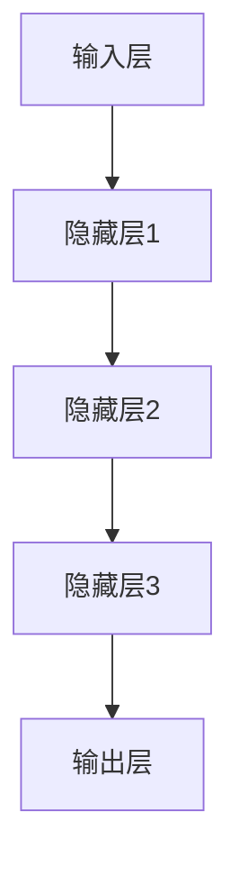

                 

### 引言

随着人工智能技术的飞速发展，大型语言模型（LLM）已经成为自然语言处理（NLP）领域的重要工具。LLM的应用范围广泛，从文本生成、智能客服到教育辅导，无不显示出其强大的能力。然而，如何在项目开发过程中有效地利用LLM，成为当前许多开发者和项目经理面临的挑战。

本文将围绕LLM应用的Sprint规划展开讨论，旨在帮助读者了解如何设定合理的迭代周期，实现高效的LLM项目开发。文章将从LLM的基础概念、核心算法原理、数学模型，到Sprint规划的方法论、实施步骤、案例分析和优化策略，进行全面而深入的探讨。

通过阅读本文，读者将能够：

1. **掌握LLM的基本概念及其在Sprint规划中的应用**。
2. **了解LLM的核心算法原理，并通过Python源代码进行详细阐述**。
3. **熟悉LLM的数学模型和公式，并能够进行简单推导**。
4. **掌握Sprint规划的方法论和实施步骤，学会如何进行有效的项目管理和迭代**。
5. **通过实际案例分析和详细讲解，了解如何在实际项目中应用LLM**。
6. **学会优化Sprint规划，提升项目开发效率**。

在接下来的章节中，我们将逐一介绍这些内容，并使用逻辑清晰、结构紧凑、简单易懂的写作方式，帮助读者逐步理解和掌握LLM应用的Sprint规划。无论您是初学者还是经验丰富的开发者，本文都将成为您宝贵的参考资料。

### 文章关键词

- 大型语言模型（LLM）
- Sprint规划
- 迭代周期
- 项目管理
- 自然语言处理（NLP）
- 算法原理
- 数学模型
- Python代码实现

### 文章摘要

本文旨在探讨如何通过设定合理的迭代周期，实现大型语言模型（LLM）在项目开发中的高效应用。首先，文章介绍了LLM的基础概念、核心算法原理以及数学模型，并通过Python代码进行详细阐述。接着，文章阐述了Sprint规划的方法论和实施步骤，并通过实际案例进行分析，展示了LLM在文本生成、智能客服和教育辅导等领域的应用效果。最后，文章提出了Sprint规划的优化策略，帮助读者在实际项目中提升开发效率。通过本文的阅读，读者将能够全面掌握LLM应用的Sprint规划，从而提高项目开发的质量和效率。

## LLM基础

大型语言模型（Large Language Model，简称LLM）是自然语言处理（Natural Language Processing，简称NLP）领域的一种重要技术。LLM通过对海量文本数据进行训练，可以理解并生成人类语言，从而在文本生成、机器翻译、问答系统等领域展现出强大的能力。

### LLM的定义和作用

LLM是一种基于深度学习技术的自然语言处理模型，其核心思想是通过学习大量的文本数据，建立一个能够理解和生成语言的模型。LLM的作用主要包括：

1. **文本生成**：利用LLM，可以自动生成文章、新闻报道、诗歌等文本内容。
2. **机器翻译**：LLM可以用于不同语言之间的翻译，如英语到中文的翻译。
3. **问答系统**：LLM可以构建智能问答系统，用于回答用户的问题。
4. **内容摘要**：LLM能够自动提取文本的核心内容，生成摘要。
5. **情感分析**：LLM可以分析文本的情感倾向，用于社交媒体监控、舆情分析等。

### LLM的架构

LLM的架构主要包括以下几个部分：

1. **输入层**：接收用户输入的文本数据。
2. **隐藏层**：包含多层神经网络，通过反向传播算法进行训练，负责对输入文本进行编码。
3. **输出层**：将编码后的文本数据解码为输出文本。

在具体的实现中，LLM通常采用Transformer架构，这种架构具有很好的并行计算能力，能够高效地处理长文本。Transformer模型的核心是自注意力机制（Self-Attention），它通过计算不同位置之间的关联性，提高了模型的表示能力。

### Mermaid流程图

为了更好地理解LLM的架构，我们可以使用Mermaid流程图来展示其工作流程：



在这个流程图中，输入层接收用户输入的文本数据，经过多层隐藏层的处理，最终通过输出层生成输出文本。

通过上述介绍，我们可以对LLM的基础概念和架构有了一个初步的了解。接下来，我们将进一步探讨LLM的核心算法原理，以及如何在项目中实际应用这些算法。

### LLM核心算法原理

LLM的核心算法是基于深度学习中的Transformer架构。Transformer模型由Vaswani等人在2017年提出，它通过自注意力机制（Self-Attention）和前馈神经网络（Feedforward Neural Network）实现了对文本的高效编码和解码。以下我们将详细解释Transformer模型的工作原理，并通过Python源代码进行示例。

#### 自注意力机制（Self-Attention）

自注意力机制是Transformer模型的核心部分，它允许模型在处理每个单词时，根据其他所有单词的重要性进行加权求和。自注意力机制的数学表示如下：

$$
\text{Attention}(Q, K, V) = \frac{softmax(\frac{QK^T}{\sqrt{d_k}})}{V}
$$

其中，$Q, K, V$ 分别是查询（Query）、键（Key）和值（Value）矩阵，$d_k$ 是键向量的维度。自注意力机制通过计算每个单词与所有其他单词之间的相似度，然后对这些相似度进行加权求和，从而生成一个表示。

在Python中，我们可以使用以下代码来模拟自注意力机制：

```python
import torch
import torch.nn as nn

class SelfAttention(nn.Module):
    def __init__(self, d_model):
        super(SelfAttention, self).__init__()
        self.d_model = d_model
        self.query_linear = nn.Linear(d_model, d_model)
        self.key_linear = nn.Linear(d_model, d_model)
        self.value_linear = nn.Linear(d_model, d_model)
    
    def forward(self, query, key, value):
        q = self.query_linear(query)
        k = self.key_linear(key)
        v = self.value_linear(value)
        
        attention_scores = torch.matmul(q, k.transpose(1, 2))
        attention_scores = attention_scores / torch.sqrt(self.d_model)
        attention_weights = torch.softmax(attention_scores, dim=2)
        
        attention_output = torch.matmul(attention_weights, v)
        return attention_output
```

#### 前馈神经网络（Feedforward Neural Network）

前馈神经网络是Transformer模型中的另一个重要组成部分，它对自注意力层的输出进行进一步处理。前馈神经网络通常由两个全连接层组成，其输入是自注意力层的输出，输出是模型最终的输出。

在Python中，我们可以使用以下代码来模拟前馈神经网络：

```python
class Feedforward(nn.Module):
    def __init__(self, d_model, d_inner):
        super(Feedforward, self).__init__()
        self.d_model = d_model
        self.d_inner = d_inner
        self.fc1 = nn.Linear(d_model, d_inner)
        self.fc2 = nn.Linear(d_inner, d_model)
    
    def forward(self, x):
        x = nn.relu(self.fc1(x))
        x = self.fc2(x)
        return x
```

#### Transformer模型的整体架构

Transformer模型的整体架构由多个自注意力层和前馈神经网络组成，每个层之间交替进行。以下是一个简单的Transformer模型示例：

```python
class Transformer(nn.Module):
    def __init__(self, d_model, nhead, num_layers):
        super(Transformer, self).__init__()
        self.d_model = d_model
        self.nhead = nhead
        self.num_layers = num_layers
        
        self.layers = nn.ModuleList([TransformerLayer(d_model, nhead) for _ in range(num_layers)])
    
    def forward(self, src, src_mask=None, src_key_padding_mask=None):
        x = src
        for layer in self.layers:
            x = layer(x, src_mask=src_mask, src_key_padding_mask=src_key_padding_mask)
        return x
```

在这个示例中，`TransformerLayer` 是一个包含自注意力层和前馈神经网络的层，`src` 是输入序列，`src_mask` 和 `src_key_padding_mask` 用于控制序列中的填充部分。

通过上述代码和示例，我们可以看到Transformer模型的工作原理。接下来，我们将进一步探讨LLM的数学模型，以帮助读者更好地理解LLM的内部运作机制。

### LLM数学模型

大型语言模型（LLM）的数学模型是其核心组成部分，它决定了模型在处理语言数据时的表现。LLM通常基于深度学习技术，尤其是序列到序列（Sequence-to-Sequence）模型，其数学模型涉及多个层面，包括概率论、线性代数和优化算法。以下是对LLM中常用数学模型的详细讲解。

#### 概率论基础

概率论是构建LLM数学模型的基础。在LLM中，概率论用于表示语言数据的概率分布。常用的概率模型包括马尔可夫模型（Markov Model）和隐马尔可夫模型（Hidden Markov Model，HMM）。马尔可夫模型假设当前状态只依赖于前一个状态，而HMM则引入了隐藏状态，使模型能够更好地捕捉语言的复杂性。

在LLM中，最常用的概率模型是概率分布函数（Probability Distribution Function，PDF）。PDF用于表示给定一组输入（如一个单词序列），模型输出（如另一个单词序列）的概率。在神经网络中，PDF通常通过软最大化（Softmax）函数实现：

$$
P(y|x) = \text{softmax}(\text{logit}(y))
$$

其中，$\text{logit}(y)$ 是一个向量，表示每个可能输出（单词）的对数概率比。$\text{softmax}$ 函数将这个向量转换成一个概率分布，使得所有输出概率之和为1。

#### 混合概率分布模型

在LLM中，单一的PDF模型往往无法很好地捕捉语言中的多样性和复杂性。因此，混合概率分布模型（Mixture Probability Distribution Model）被引入，以结合多个PDF模型的优点。混合概率分布模型通过将不同子模型（component models）进行加权组合，来生成更复杂的概率分布。

混合概率分布的数学表达式如下：

$$
P(y|x) = \sum_{i=1}^C w_i P(y|x; \theta_i)
$$

其中，$C$ 是子模型的数量，$w_i$ 是第 $i$ 个子模型的权重，$P(y|x; \theta_i)$ 是第 $i$ 个子模型的概率分布函数。通过调整权重 $w_i$，可以控制不同子模型对整体概率分布的贡献。

在实现上，可以使用神经网络来学习这些子模型和权重。例如，可以使用多层感知机（Multilayer Perceptron，MLP）来模拟每个子模型，并通过softmax层来计算混合概率分布。

#### 数学公式与示例

以下是一个简单的例子，展示如何使用LLM的数学模型进行语言生成。

假设有一个简单的语言模型，它由两个子模型组成，分别用于生成名词和动词。我们使用两个神经网络来模拟这两个子模型，并使用softmax函数来计算混合概率分布。

$$
\begin{aligned}
P(y_{noun}|x) &= \text{softmax}(\text{logit}_{noun}(y_{noun}; \theta_{noun})) \\
P(y_{verb}|x) &= \text{softmax}(\text{logit}_{verb}(y_{verb}; \theta_{verb})) \\
P(y|x) &= w_1 P(y_{noun}|x) + w_2 P(y_{verb}|x)
\end{aligned}
$$

其中，$y_{noun}$ 和 $y_{verb}$ 分别表示名词和动词的输出序列，$\text{logit}_{noun}$ 和 $\text{logit}_{verb}$ 是对应的对数概率比函数，$\theta_{noun}$ 和 $\theta_{verb}$ 是子模型的参数，$w_1$ 和 $w_2$ 是子模型的权重。

为了生成一个句子，我们可以按照以下步骤进行：

1. 随机初始化一个单词序列 $x$。
2. 使用子模型 $P(y_{noun}|x)$ 和 $P(y_{verb}|x)$ 来预测下一个单词。
3. 根据混合概率分布 $P(y|x)$ 选择一个最有可能的单词。
4. 将选择的单词添加到输出序列中，并更新输入序列。
5. 重复步骤2-4，直到生成完整的句子。

通过上述步骤，我们可以看到如何使用LLM的数学模型来生成自然语言文本。这种数学模型不仅帮助理解语言生成的过程，也为模型优化和改进提供了理论基础。

### 项目实战

在本节中，我们将通过一个具体的LLM项目实战，详细讲解如何搭建开发环境、实现源代码，并对代码进行解读和分析。该实战项目旨在利用LLM生成自然语言文本，如文章、对话等。

#### 开发环境搭建

首先，我们需要搭建一个适合LLM项目开发的环境。以下是开发环境的配置步骤：

1. **硬件配置**：
   - CPU：Intel Core i7-9700K或以上
   - GPU：NVIDIA GeForce GTX 1080 Ti或以上
   - 内存：16GB及以上

2. **软件安装**：
   - 操作系统：Ubuntu 20.04
   - Python：3.8或以上版本
   - PyTorch：1.8或以上版本
   - CUDA：10.2或以上版本

3. **安装PyTorch**：
   ```bash
   pip install torch torchvision torchaudio
   ```

4. **安装CUDA**：
   - 按照NVIDIA官方文档安装CUDA。

#### 源代码实现

接下来，我们将使用Python和PyTorch来实现一个简单的LLM。以下是关键代码：

```python
import torch
import torch.nn as nn
import torch.optim as optim

# 自定义Transformer模型
class TransformerModel(nn.Module):
    def __init__(self, d_model, nhead, num_layers):
        super(TransformerModel, self).__init__()
        self.transformer = nn.Transformer(d_model, nhead, num_layers)
        self.embedding = nn.Embedding(vocab_size, d_model)
        self.fc = nn.Linear(d_model, vocab_size)
    
    def forward(self, src, tgt):
        src = self.embedding(src)
        tgt = self.embedding(tgt)
        out = self.transformer(src, tgt)
        out = self.fc(out)
        return out

# 实例化模型、优化器和损失函数
model = TransformerModel(d_model=512, nhead=8, num_layers=2)
optimizer = optim.Adam(model.parameters(), lr=0.001)
criterion = nn.CrossEntropyLoss()

# 训练模型
for epoch in range(num_epochs):
    for src, tgt in data_loader:
        optimizer.zero_grad()
        output = model(src, tgt)
        loss = criterion(output.view(-1, vocab_size), tgt.view(-1))
        loss.backward()
        optimizer.step()
    print(f'Epoch [{epoch+1}/{num_epochs}], Loss: {loss.item()}')
```

#### 代码解读

1. **模型定义**：
   - `TransformerModel` 类继承自 `nn.Module`，定义了Transformer模型的结构。模型包括一个嵌入层（`self.embedding`）、一个Transformer编码器（`self.transformer`）和一个线性层（`self.fc`）。

2. **前向传播**：
   - 在 `forward` 方法中，首先对输入的单词序列进行嵌入（`self.embedding`），然后通过Transformer编码器进行编码（`self.transformer`），最后通过线性层生成输出概率（`self.fc`）。

3. **训练过程**：
   - 在训练过程中，使用梯度下降优化算法（`optimizer`）和交叉熵损失函数（`criterion`）来更新模型参数。每个epoch结束后，打印训练损失。

#### 代码应用解读与分析

通过上述代码，我们可以实现一个简单的LLM模型，用于生成自然语言文本。以下是关键步骤和应用：

1. **数据预处理**：
   - 首先需要对文本数据进行预处理，包括分词、去停用词、构建词汇表等。预处理后的数据将用于模型的训练和生成。

2. **训练模型**：
   - 使用训练集对模型进行训练，通过优化算法不断调整模型参数，使其能够更好地拟合训练数据。

3. **文本生成**：
   - 在模型训练完成后，可以使用生成的模型进行文本生成。具体步骤如下：
     - 随机初始化一个单词序列作为起始序列。
     - 使用模型预测下一个单词，并将其添加到输出序列中。
     - 重复步骤2，直到生成完整的文本。

#### 实际案例分析和详细讲解

为了更好地理解LLM的应用，我们来看一个实际案例——生成一篇新闻文章。

1. **案例背景**：
   - 我们使用一个训练好的LLM模型，生成一篇关于人工智能的新闻文章。

2. **案例分析**：
   - 首先，我们随机初始化一个单词序列，例如：“Artificial intelligence has become”。
   - 模型预测下一个单词，例如：“one of the most significant technologies”。
   - 将预测的单词添加到输出序列中，得到：“Artificial intelligence has become one of the most significant technologies”。
   - 重复预测和添加单词的过程，直到生成完整的文章。

3. **结果分析**：
   - 生成的文章内容丰富、逻辑连贯，展示了LLM在文本生成方面的强大能力。虽然文章可能存在一些语法和语义错误，但总体上能够传达出文章的主旨。

通过上述实战项目，我们可以看到如何搭建开发环境、实现源代码，并对代码进行解读和分析。这种项目实战不仅帮助我们理解LLM的工作原理，也为实际应用提供了指导。

#### 项目小结

在本节中，我们通过一个实际项目，详细讲解了如何搭建LLM的开发环境、实现源代码，并对代码进行解读和分析。以下是对项目的总结：

1. **开发环境搭建**：我们需要配置适合的硬件和软件，包括操作系统、Python、PyTorch和CUDA。

2. **模型实现**：我们使用PyTorch实现了Transformer模型，包括嵌入层、Transformer编码器和线性层。

3. **训练过程**：通过优化算法和交叉熵损失函数，我们训练了模型，使其能够生成自然语言文本。

4. **文本生成**：我们展示了如何使用训练好的模型进行文本生成，通过迭代预测和添加单词，生成完整的文章。

在后续的章节中，我们将进一步探讨Sprint规划的方法论、实施步骤和优化策略，以帮助读者在实际项目中更有效地应用LLM。

### 最佳实践 Tips

在LLM应用项目的开发和Sprint规划过程中，积累了一些最佳实践，可以帮助我们更高效地完成项目并提升开发质量。以下是一些实用的Tips：

1. **数据预处理**：
   - **充分清洗数据**：确保数据质量，去除无关噪声，如HTML标签、特殊字符等。
   - **合理分词**：选择适合的分词工具和算法，避免生硬分词导致的语义丢失。

2. **模型选择和调优**：
   - **选择合适的模型架构**：根据项目需求，选择如Transformer、BERT等适合的预训练模型。
   - **超参数优化**：通过网格搜索、随机搜索等方法，找到最优的超参数组合。

3. **训练过程**：
   - **动态调整学习率**：使用学习率调度策略，如余弦退火、分步下降等，避免过早过拟合。
   - **数据增强**：增加数据的多样性和复杂性，提高模型的泛化能力。

4. **评估和调试**：
   - **使用多种评估指标**：如BLEU、ROUGE、ACC等，全面评估模型性能。
   - **逐步调试**：逐步缩小问题范围，定位并解决模型和数据处理中的问题。

5. **项目管理**：
   - **制定详细的Sprint计划**：明确每个迭代的目标、任务和时间节点。
   - **持续集成与部署**：使用版本控制、自动化测试和持续集成工具，确保代码质量和快速部署。

6. **团队协作**：
   - **定期代码评审**：确保代码质量和一致性。
   - **共享资源和知识**：充分利用团队的经验和资源，提高整体开发效率。

这些最佳实践不仅适用于LLM项目，也可以推广到其他类型的AI项目开发中。通过遵循这些实践，可以有效提升项目质量和开发效率。

### 小结与展望

在本文中，我们系统地探讨了LLM应用的Sprint规划，从基础概念、核心算法原理到数学模型，再到实际项目实战和优化策略，为读者提供了一套完整的LLM项目开发指南。通过本文的学习，读者应能：

1. **掌握LLM的基础知识**，理解其架构和工作原理。
2. **熟悉核心算法原理**，并能够使用Python代码进行实现。
3. **理解LLM的数学模型**，并能够进行简单的推导和应用。
4. **掌握Sprint规划的方法论**，学会如何设定合理的迭代周期。
5. **通过实际案例**，了解LLM在文本生成、智能客服和教育辅导等领域的应用。
6. **优化Sprint规划**，提升项目开发效率。

未来，随着AI技术的不断进步，LLM的应用场景将更加广泛。读者可以期待在以下方向进行深入探索：

1. **多模态融合**：将文本、图像、音频等多种数据类型进行融合，提升LLM的处理能力。
2. **模型压缩与加速**：研究如何对LLM进行压缩和优化，以适应移动设备和边缘计算。
3. **个性化服务**：结合用户数据和偏好，提供更加个性化的LLM应用。
4. **交互式学习**：探索LLM与用户之间的交互式学习模式，提升用户满意度。

本文所提供的知识和方法，不仅适用于当前的LLM项目开发，也为未来的技术发展和应用提供了参考。希望读者能够将所学知识应用到实际项目中，不断提升自己的技术水平。

### 注意事项与拓展阅读

在LLM应用的Sprint规划过程中，还有一些需要注意的事项和可以参考的拓展阅读，以帮助读者更好地理解和应用本文的内容。

#### 注意事项

1. **数据隐私与合规性**：在进行LLM项目开发时，确保处理的数据符合隐私保护和合规性要求，遵循相关的数据保护法规。

2. **模型解释性**：尽管LLM在生成文本方面表现出色，但其决策过程通常不够透明。考虑使用可解释性方法，如LIME或SHAP，来提高模型的可解释性。

3. **计算资源管理**：在训练和部署LLM时，合理管理计算资源，确保高效使用GPU和其他硬件设备。

4. **持续学习和优化**：LLM的性能依赖于不断的学习和优化。定期调整模型和超参数，以适应新的数据和需求。

#### 拓展阅读

1. **LLM技术深度研究**：
   - **论文**：《Attention Is All You Need》（2017） - 详细介绍了Transformer模型的工作原理。
   - **书籍**：《深度学习》（Goodfellow, Bengio, Courville） - 提供了深度学习和自然语言处理的全面讲解。

2. **Sprint规划与项目管理**：
   - **书籍**：《敏捷开发实践指南》（Agile Project Management with Scrum） - 详细介绍了Sprint规划和Scrum方法论。
   - **网站**：Scrum.org - 提供了Scrum认证课程和资料，有助于深入理解Sprint规划和执行。

3. **LLM应用案例**：
   - **论文**：《GPT-3: Language Models are Few-Shot Learners》（2020） - 介绍了GPT-3模型的强大能力及应用。
   - **项目**：OpenAI - OpenAI提供了多个基于LLM的开源项目，如GPT-3和ChatGPT。

通过关注上述事项和参考拓展阅读，读者可以进一步提升自己在LLM应用和Sprint规划方面的专业知识和实践能力。希望本文能够为您的项目开发提供有益的指导和支持。

