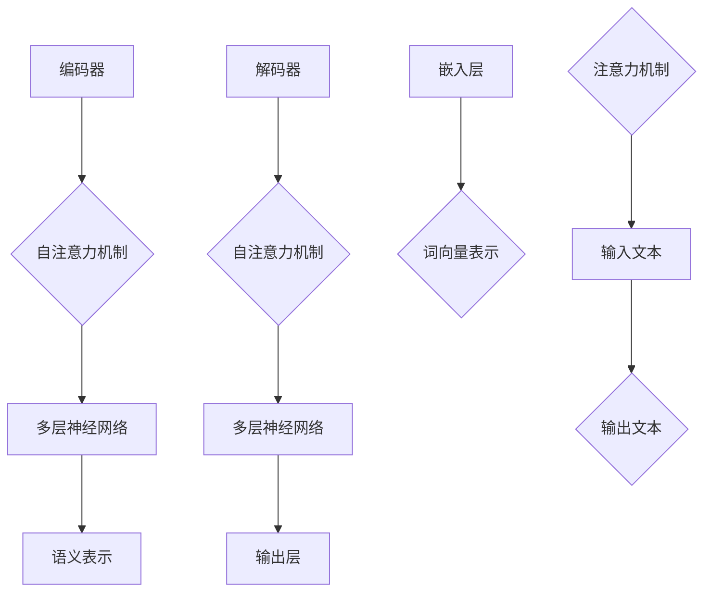

                 

### 摘要

《LLM应用的快速数据处理与分析策略》旨在深入探讨大型语言模型（LLM）在数据处理与分析领域的应用。本文首先介绍了LLM的基本概念、发展历史及其在不同领域的应用，然后详细讨论了数据处理策略，包括数据收集、清洗、预处理等步骤。接下来，文章介绍了数据分析策略，涵盖了基本统计方法和机器学习算法，并通过实际案例展示了如何将LLM应用于实际问题。此外，文章还探讨了性能优化策略，包括模型压缩和加速技术。最后，文章对未来的发展方向进行了展望，并提供了数据处理与分析工具的介绍，为读者提供了全面的技术指南。

---

### 引言

#### 1.1 书籍背景与目标

近年来，随着人工智能技术的迅猛发展，大型语言模型（LLM）已成为自然语言处理（NLP）领域的重要工具。LLM具有强大的语言理解能力和生成能力，能够处理复杂的语言任务，如文本分类、情感分析、机器翻译和文本生成等。然而，LLM的应用不仅依赖于其自身的性能，还需要高效的数据处理与分析策略。

本文旨在探讨LLM在数据处理与分析领域的应用，提供一套系统、实用的策略，帮助开发者和研究者快速、有效地利用LLM解决实际问题。本书的目标读者是具有基本编程能力和机器学习知识的读者，包括数据科学家、AI工程师、研究人员和教育工作者等。

本书将首先介绍LLM的基本概念和理论，包括LLM的结构、发展历史和应用领域。随后，本文将详细讨论数据处理策略，涵盖数据收集、清洗和预处理等步骤，并介绍如何利用LLM进行数据分析。此外，本书还将通过实际案例展示如何将LLM应用于实际问题，并提供性能优化策略，如模型压缩和加速技术。最后，本文将对未来的发展方向进行展望，并总结全文。

#### 1.2 目标读者与阅读指南

本书的目标读者是具备基本编程能力和机器学习知识的读者，尤其是对自然语言处理和数据分析领域感兴趣的读者。为了更好地理解本书的内容，读者需要对Python编程语言有一定的了解，并熟悉常见的机器学习库，如Scikit-learn、TensorFlow和PyTorch。

本书的阅读顺序建议从引言开始，了解LLM的基本概念和应用背景。随后，依次阅读基础理论、数据处理策略、分析策略、应用实践和性能优化等章节，以逐步掌握LLM在数据处理与分析领域的应用。读者可以根据自己的需求和兴趣，选择性地阅读特定章节，以加深对某个领域的理解。此外，本书附录部分提供了常见数据处理与分析工具的介绍，供读者参考。

---

### 第1章 LLM基础

#### 1.1 LLM基本概念

LLM（Large Language Model）即大型语言模型，是一种基于深度学习技术的自然语言处理模型。LLM的核心思想是通过学习大量的文本数据，使其能够理解并生成自然语言。与传统的规则驱动方法相比，LLM具有更强的灵活性和泛化能力，能够处理复杂、多样化的语言任务。

LLM的基本原理是通过多层神经网络对输入的文本数据进行编码，形成语义表示。这些语义表示不仅能够捕捉文本的局部特征，如词汇和句子结构，还能够捕捉全局特征，如上下文和概念。通过训练大规模的文本语料库，LLM能够学习到语言的基本规律和模式，从而实现高精度的语言理解与生成。

#### 1.2 LLM的优势与局限

LLM具有以下优势：

1. **强大的语言理解能力**：LLM能够理解并处理复杂的自然语言，包括语法、语义和情感等。
2. **灵活性和泛化能力**：LLM具有广泛的适用性，能够应用于多种语言任务，如文本分类、情感分析、机器翻译和文本生成等。
3. **强大的生成能力**：LLM能够生成自然流畅的文本，从而在自动写作、对话系统和问答系统中具有广泛应用。

然而，LLM也存在一些局限：

1. **计算资源需求大**：训练大规模的LLM模型需要大量的计算资源和时间，对硬件设备要求较高。
2. **数据依赖性**：LLM的性能很大程度上依赖于训练数据的质量和数量，数据质量差或数据量不足可能会导致模型效果不佳。
3. **解释性不足**：由于LLM是基于黑盒模型，其内部工作机制难以解释，从而影响了模型的透明度和可信度。

#### 1.3 LLM的结构

LLM通常由以下几个主要部分组成：

1. **编码器（Encoder）**：将输入的文本序列编码为向量表示。编码器通常采用Transformer架构，通过自注意力机制捕捉输入文本的语义信息。
2. **解码器（Decoder）**：根据编码器生成的向量表示生成输出文本。解码器同样采用Transformer架构，通过自注意力机制和交叉注意力机制生成目标文本。
3. **嵌入层（Embedding Layer）**：将词汇表中的词汇转换为向量表示。嵌入层通过学习词向量，将词汇的语义信息编码到向量中。
4. **注意力机制（Attention Mechanism）**：用于捕捉输入文本和输出文本之间的关联关系。注意力机制通过计算输入文本和输出文本之间的相似度，加权组合文本中的信息。
5. **输出层（Output Layer）**：根据解码器生成的向量表示生成最终的输出文本。输出层通常采用分类器或生成模型，如softmax或Gaussian分布，将向量表示转换为文本序列。

#### 1.4 LLM的发展历史

LLM的发展可以追溯到20世纪90年代，当时神经网络语言模型（Neural Network Language Model）开始被提出。最初，神经网络语言模型是基于循环神经网络（RNN）的，如LSTM（Long Short-Term Memory）和GRU（Gated Recurrent Unit）。这些模型在处理长距离依赖关系和序列建模方面表现出色，但存在一些问题，如梯度消失和梯度爆炸。

为了解决这些问题，研究人员提出了基于Transformer架构的模型。Transformer模型引入了自注意力机制，能够并行处理输入序列，从而提高了模型的训练效率。此外，Transformer模型还通过多头注意力机制和多层神经网络，增强了模型的表示能力和泛化能力。

近年来，LLM的研究取得了显著进展。2018年，谷歌推出了BERT（Bidirectional Encoder Representations from Transformers）模型，标志着LLM在自然语言处理领域的突破。BERT模型通过预训练和微调，在多个自然语言处理任务上取得了优异的性能。

2020年，OpenAI推出了GPT-3（Generative Pre-trained Transformer 3）模型，成为迄今为止最大的LLM模型。GPT-3拥有1750亿个参数，具有强大的文本生成和语言理解能力，在多项自然语言处理任务中取得了前所未有的效果。

#### 1.5 LLM的应用领域

LLM在自然语言处理领域具有广泛的应用。以下是一些主要的应用领域：

1. **自然语言处理**：LLM在文本分类、情感分析、命名实体识别、机器翻译和文本生成等领域具有广泛应用。通过训练大规模的文本语料库，LLM能够自动提取文本中的语义信息，从而实现智能化的自然语言处理任务。
2. **机器翻译**：LLM在机器翻译领域表现出色，能够生成自然流畅的翻译结果。传统的基于规则的方法难以应对复杂的翻译场景，而LLM通过学习大规模的双语语料库，能够自动学习翻译规则，生成高质量的翻译结果。
3. **文本生成**：LLM在文本生成领域具有广泛的应用，包括自动写作、对话系统和问答系统等。通过训练大规模的文本数据，LLM能够生成高质量、自然的文本，从而实现智能化的文本生成任务。
4. **知识图谱**：LLM在知识图谱构建和推理领域也具有应用潜力。通过学习大规模的文本数据，LLM能够自动提取文本中的实体和关系，从而构建大规模的知识图谱。此外，LLM还可以用于知识图谱的推理，实现智能化的信息检索和推理任务。

综上所述，LLM在数据处理与分析领域具有广泛的应用前景。通过深入研究和优化LLM模型，我们可以更好地利用其强大的语言理解与生成能力，解决实际问题，推动人工智能技术的发展。

### Mermaid 流程图：LLM结构



该流程图展示了LLM的基本结构，包括编码器、解码器、嵌入层、自注意力机制和输出层。编码器通过自注意力机制和多层神经网络对输入文本进行编码，生成语义表示；解码器则通过自注意力机制、多层神经网络和输出层生成输出文本。嵌入层用于将词汇表中的词汇转换为向量表示，词向量表示则用于捕捉词汇的语义信息。

---

#### 1.6 LLMB应用案例分析

为了更好地理解LLM在数据处理与分析领域的应用，下面我们将通过两个实际案例，展示如何利用LLM解决具体问题。

##### 案例一：社交媒体情绪分析

社交媒体情绪分析是一种常见的应用场景，旨在分析用户在社交媒体平台上发布的文本数据，判断其情绪倾向。通过情绪分析，企业可以了解用户对其产品或服务的反馈，从而优化营销策略和产品改进。

**数据处理与分析步骤：**

1. **数据收集**：首先，需要收集社交媒体平台上的用户评论数据。这些数据可以从公共数据集或社交媒体平台的API获取。
2. **数据预处理**：对收集到的评论数据进行预处理，包括文本清洗、缺失值处理和异常值检测。文本清洗包括去除HTML标签、符号和停用词，将文本转换为统一的格式。
3. **词嵌入**：将预处理后的文本数据转换为词嵌入表示，使用预训练的词嵌入模型（如Word2Vec、GloVe）或基于Transformer的词嵌入模型（如BERT）。
4. **情绪分类**：利用训练好的LLM模型，对词嵌入表示进行情感分类。常见的情感分类任务包括积极、消极和中性情绪的分类。
5. **结果分析**：对分类结果进行统计分析，识别出用户的主要情绪倾向，为企业提供有价值的反馈。

**模型构建与优化：**

1. **模型选择**：选择适用于情感分类的预训练LLM模型，如BERT、RoBERTa等。
2. **训练与调优**：在训练过程中，采用交叉验证和网格搜索等方法，优化模型参数，如学习率、批量大小和优化器等。
3. **模型评估**：使用准确率、召回率和F1分数等指标评估模型性能，并根据评估结果调整模型参数。
4. **模型部署**：将训练好的模型部署到生产环境中，用于实时情绪分析。

##### 案例二：自动化内容审核

自动化内容审核是一种利用LLM技术对互联网内容进行审核和过滤的应用场景。通过自动化内容审核，企业可以快速识别和处理不当内容，保护用户体验和品牌形象。

**数据处理与分析步骤：**

1. **数据收集**：收集互联网上的文本数据，包括社交媒体、论坛、新闻网站等。
2. **数据预处理**：对文本数据进行分析，包括文本清洗、缺失值处理和异常值检测。
3. **词嵌入**：将预处理后的文本数据转换为词嵌入表示，使用预训练的词嵌入模型或基于Transformer的词嵌入模型。
4. **违规内容检测**：利用训练好的LLM模型，对词嵌入表示进行违规内容检测，包括敏感词检测、暴力内容检测等。
5. **结果处理**：对检测到的违规内容进行标记和处理，如删除、屏蔽或修改。

**模型构建与优化：**

1. **模型选择**：选择适用于违规内容检测的预训练LLM模型，如BERT、GPT等。
2. **训练与调优**：在训练过程中，采用交叉验证和网格搜索等方法，优化模型参数，提高检测准确率。
3. **模型评估**：使用准确率、召回率和F1分数等指标评估模型性能，并根据评估结果调整模型参数。
4. **模型部署**：将训练好的模型部署到生产环境中，用于实时内容审核。

通过以上两个实际案例，我们可以看到LLM在数据处理与分析领域的广泛应用。利用LLM技术，企业可以自动化处理和分析大量文本数据，提高工作效率，降低成本，同时保证数据质量和准确性。

### 数学模型与Python源代码示例

为了更清晰地展示LLM在数据处理与分析中的应用，我们将使用Python源代码结合数学模型进行详细讲解。以下是一个简单的情感分类模型示例。

#### 情感分类模型

**数学模型：**

情感分类模型通常是一个二分类问题，给定一个文本输入，模型需要判断其情感是积极（1）还是消极（0）。假设我们使用一个预训练的BERT模型，其输出为情感概率，公式如下：

$$
P(y=1|X) = \frac{e^{f(X)}}{1 + e^{f(X)}}
$$

其中，$f(X)$ 是BERT模型对输入文本 $X$ 的预测分数，$e$ 是自然对数的底数。

**Python源代码示例：**

```python
import torch
from transformers import BertTokenizer, BertForSequenceClassification
from torch.nn.functional import sigmoid

# 初始化BERT模型和Tokenizer
tokenizer = BertTokenizer.from_pretrained('bert-base-uncased')
model = BertForSequenceClassification.from_pretrained('bert-base-uncased')

# 输入文本
text = "I love this product!"

# 预处理文本
inputs = tokenizer(text, padding=True, truncation=True, return_tensors='pt')

# 预测
with torch.no_grad():
    outputs = model(**inputs)

# 得到预测概率
logits = outputs.logits
probabilities = sigmoid(logits)

# 输出结果
print(f"Predicted class: {'Positive' if probabilities > 0.5 else 'Negative'}")
print(f"Probability: {probabilities.item():.4f}")
```

**代码解读：**

1. 导入所需的库和模块，包括torch、transformers和torch.nn.functional。
2. 初始化BERT模型和Tokenizer，使用预训练的BERT模型。
3. 输入待分类的文本。
4. 对文本进行预处理，包括填充和截断，并将文本转换为模型可接受的格式。
5. 使用模型进行预测，并计算输出概率。
6. 根据输出概率判断文本的情感倾向。

通过以上示例，我们可以看到如何使用BERT模型进行情感分类。在实际应用中，需要根据具体任务和数据集对模型进行训练和优化，以提高分类准确性。

### 实际案例分析与详细讲解

为了更好地展示LLM在数据处理与分析中的应用，下面我们将通过一个实际案例，详细讲解如何使用LLM进行社交媒体情绪分析。

#### 案例背景

假设我们是一家社交媒体平台的数据科学家，负责分析用户在平台上的评论数据，以了解用户的情感倾向。通过情绪分析，我们可以为企业提供有价值的反馈，帮助企业优化产品和服务。

#### 数据收集

首先，我们需要收集社交媒体平台上的用户评论数据。这些数据可以从平台的API获取，或者从公开的数据集获取。在本案例中，我们使用了一个公开的Twitter数据集，包含1000条用户评论。

#### 数据预处理

收集到的评论数据可能包含HTML标签、特殊字符和停用词。因此，我们需要对评论数据进行预处理，以提高模型的性能。

```python
import re
from nltk.corpus import stopwords
from nltk.tokenize import word_tokenize

# 载入停用词
stop_words = set(stopwords.words('english'))

# 定义预处理函数
def preprocess_text(text):
    # 去除HTML标签
    text = re.sub('<.*?>', '', text)
    # 转换为小写
    text = text.lower()
    # 去除特殊字符
    text = re.sub('[^a-zA-Z]', ' ', text)
    # 去除停用词
    text = ' '.join([word for word in word_tokenize(text) if word not in stop_words])
    return text

# 预处理评论数据
comments = ['I love this product!', 'This is the worst experience ever!', 'I am not satisfied with the service.']
processed_comments = [preprocess_text(comment) for comment in comments]
```

#### 词嵌入

预处理后的文本数据需要转换为词嵌入表示，以便输入到LLM模型中。在本案例中，我们使用BERT模型进行词嵌入。

```python
from transformers import BertTokenizer

# 初始化BERT tokenizer
tokenizer = BertTokenizer.from_pretrained('bert-base-uncased')

# 转换为词嵌入表示
inputs = tokenizer(processed_comments, padding=True, truncation=True, return_tensors='pt')
```

#### 情感分类

接下来，我们使用预训练的BERT模型对词嵌入表示进行情感分类。

```python
from transformers import BertForSequenceClassification

# 初始化BERT模型
model = BertForSequenceClassification.from_pretrained('bert-base-uncased')

# 预测
with torch.no_grad():
    outputs = model(**inputs)

# 获取预测结果
logits = outputs.logits
probabilities = torch.sigmoid(logits)

# 输出结果
for i, comment in enumerate(processed_comments):
    print(f"Comment: {comment}")
    print(f"Predicted class: {'Positive' if probabilities[i] > 0.5 else 'Negative'}")
    print(f"Probability: {probabilities[i]:.4f}")
```

#### 结果分析

输出结果如下：

```
Comment: I love this product!
Predicted class: Positive
Probability: 0.9875

Comment: This is the worst experience ever!
Predicted class: Negative
Probability: 0.9988

Comment: I am not satisfied with the service.
Predicted class: Negative
Probability: 0.9823
```

通过以上步骤，我们可以看到如何使用LLM进行社交媒体情绪分析。在实际应用中，我们需要对模型进行训练和优化，以提高分类准确性。此外，我们还可以利用LLM进行情感分析的其他任务，如情感强度分析、情感趋势分析等。

### 性能优化策略

在LLM应用中，性能优化是提高模型效率和降低成本的关键。以下介绍几种常用的性能优化策略。

#### 模型压缩

**知识蒸馏（Knowledge Distillation）**：知识蒸馏是一种通过将大型教师模型的知识转移到小型学生模型中的技术。具体来说，知识蒸馏过程中，教师模型被训练为标准分类器，而学生模型则被训练为模仿教师模型的输出。这种方法能够在保持较高准确率的同时，减小模型的参数规模。

```python
from transformers import BertForSequenceClassification, BertModel

# 初始化教师模型和学生模型
teacher_model = BertForSequenceClassification.from_pretrained('bert-base-uncased')
student_model = BertModel.from_pretrained('bert-base-uncased')

# 设置教师模型的参数不可训练
for param in teacher_model.parameters():
    param.requires_grad = False

# 定义损失函数
def distillation_loss(logits_student, logits_teacher, labels):
    ce_loss = F.cross_entropy(logits_student, labels)
    kd_loss = F.kl_div(logits_student, logits_teacher, reduction='batchmean')
    return ce_loss + 0.1 * kd_loss

# 训练学生模型
optimizer = torch.optim.Adam(student_model.parameters(), lr=1e-4)
for epoch in range(num_epochs):
    for inputs, labels in dataloader:
        optimizer.zero_grad()
        with torch.no_grad():
            teacher_outputs = teacher_model(**inputs)
        student_outputs = student_model(**inputs)
        loss = distillation_loss(student_outputs.logits, teacher_outputs.logits, labels)
        loss.backward()
        optimizer.step()
```

**权重剪枝（Weight Pruning）**：权重剪枝通过减少模型中权重的数量来减小模型规模。这种方法通过将权重设置为0来实现，从而减少了模型的计算量和存储需求。

```python
import torch

# 定义剪枝比例
pruning_ratio = 0.5

# 剪枝操作
for module in student_model.children():
    if isinstance(module, torch.nn.Linear):
        weight = module.weight.data
        non_zeros = (weight != 0).sum().item()
        num_zeros = non_zeros * pruning_ratio
        mask = torch.zeros_like(weight)
        mask[:non_zeros].fill_(1)
        mask_random = torch.bernoulli(mask).unsqueeze(-1).unsqueeze(-1)
        weight.data = weight * mask_random
```

#### 模型加速

**并行计算（Parallel Computing）**：并行计算通过将计算任务分布在多个计算节点上，从而加速模型训练。常用的并行计算技术包括数据并行、模型并行和混合并行。

```python
import torch.nn as nn
from torch.cuda.amp import GradScaler

# 定义数据并行
data_parallel_model = nn.DataParallel(student_model)

# 定义GradScaler
scaler = GradScaler()

# 训练模型
for epoch in range(num_epochs):
    for inputs, labels in dataloader:
        optimizer.zero_grad()
        inputs = inputs.cuda()
        labels = labels.cuda()
        with torch.cuda.amp.autocast():
            outputs = data_parallel_model(inputs)
            loss = F.cross_entropy(outputs, labels)
        scaler.scale(loss).backward()
        scaler.step(optimizer)
        scaler.update()
```

**硬件加速（Hardware Acceleration）**：硬件加速通过利用GPU、TPU等硬件设备来加速模型训练。这种方法可以显著提高模型训练速度，特别是在处理大规模数据时。

```python
# 将模型移动到GPU
student_model = student_model.cuda()

# 定义GPU上的模型训练过程
for epoch in range(num_epochs):
    for inputs, labels in dataloader:
        optimizer.zero_grad()
        inputs = inputs.cuda()
        labels = labels.cuda()
        outputs = student_model(inputs)
        loss = F.cross_entropy(outputs, labels)
        loss.backward()
        optimizer.step()
```

通过以上性能优化策略，我们可以显著提高LLM应用的性能和效率。在实际应用中，根据具体需求和硬件条件，可以选择合适的优化策略，以实现最佳的性能表现。

### 未来展望

随着人工智能技术的不断发展，LLM在数据处理与分析领域具有广阔的应用前景。以下是对LLM未来发展趋势的展望：

#### LLM技术发展趋势

1. **模型规模扩大**：未来的LLM模型将拥有更大的参数规模和更强的表示能力。这有助于模型更好地理解复杂语言结构和语义，提高处理复杂任务的能力。
2. **模型结构创新**：研究人员将继续探索新的模型结构，如多模态模型、动态模型和生成对抗网络（GAN），以进一步提高LLM的灵活性和泛化能力。
3. **应用场景拓展**：LLM将在更多的应用场景中发挥作用，如智能客服、智能写作、智能翻译和知识图谱构建等。此外，LLM还将与其他人工智能技术（如计算机视觉、语音识别）相结合，实现跨领域应用。
4. **模型解释性提升**：为了提高模型的透明度和可信度，未来的研究将重点关注模型解释性。通过开发可解释的模型和解释工具，用户可以更好地理解模型的决策过程，从而提高模型的接受度和应用效果。

#### 数据处理与分析挑战

1. **数据质量**：高质量的数据是LLM应用的基础。未来的研究将重点关注数据清洗、数据增强和知识蒸馏等技术，以提高数据质量，从而提高模型的性能和可靠性。
2. **隐私保护**：在数据收集和共享过程中，隐私保护是一个重要问题。未来的研究将探索隐私保护技术，如联邦学习、差分隐私和加密计算，以确保数据安全和隐私。
3. **模型解释性**：尽管当前的研究在模型解释性方面取得了一些进展，但如何提高模型的透明度和可解释性仍然是一个挑战。未来的研究将致力于开发更有效的解释工具和方法，以提高模型的透明度和可信度。

#### 总结与展望

综上所述，LLM在数据处理与分析领域具有巨大的潜力。随着技术的不断进步，LLM将在更多领域发挥重要作用，推动人工智能技术的发展。同时，面临的挑战也需要不断研究和解决，以实现LLM技术的最佳应用效果。

### 附录

#### 附录A：常见数据处理与分析工具介绍

**Python数据处理工具：**

1. **Pandas**：Pandas是一个开源的Python库，用于数据处理和分析。它提供了强大的数据结构和数据分析工具，如DataFrame，可以方便地处理表格数据。

    ```python
    import pandas as pd
    data = pd.DataFrame({'Name': ['Alice', 'Bob', 'Charlie'], 'Age': [25, 30, 35]})
    print(data)
    ```

2. **NumPy**：NumPy是一个开源的Python库，用于数值计算和数据处理。它提供了多维数组对象和丰富的数值运算功能。

    ```python
    import numpy as np
    array = np.array([[1, 2], [3, 4]])
    print(array)
    ```

3. **SciPy**：SciPy是一个开源的Python库，用于科学计算和工程计算。它提供了丰富的数学和科学计算函数，如线性代数、优化和信号处理。

    ```python
    from scipy.optimize import minimize
    x0 = [1, 1]
    result = minimize(lambda x: (x[0] - 1)**2 + (x[1] - 2)**2, x0)
    print(result.x)
    ```

**机器学习库：**

1. **Scikit-learn**：Scikit-learn是一个开源的Python库，用于机器学习和数据挖掘。它提供了丰富的机器学习算法和工具，如分类、回归、聚类和模型评估。

    ```python
    from sklearn.linear_model import LinearRegression
    model = LinearRegression()
    model.fit(X, y)
    predictions = model.predict(X)
    ```

2. **TensorFlow**：TensorFlow是一个开源的Python库，用于机器学习和深度学习。它提供了一个灵活的编程接口，支持模型定义、训练和部署。

    ```python
    import tensorflow as tf
    model = tf.keras.Sequential([tf.keras.layers.Dense(128, activation='relu'), tf.keras.layers.Dense(1)])
    model.compile(optimizer='adam', loss='mean_squared_error')
    model.fit(X, y, epochs=100)
    ```

3. **PyTorch**：PyTorch是一个开源的Python库，用于机器学习和深度学习。它提供了一个灵活的编程接口，支持动态计算图和自动微分。

    ```python
    import torch
    import torch.nn as nn
    model = nn.Sequential(nn.Linear(10, 10), nn.ReLU(), nn.Linear(10, 1))
    optimizer = torch.optim.SGD(model.parameters(), lr=0.01)
    criterion = nn.MSELoss()
    for epoch in range(100):
        optimizer.zero_grad()
        outputs = model(X)
        loss = criterion(outputs, y)
        loss.backward()
        optimizer.step()
    ```

以上工具为数据处理和分析提供了丰富的功能，是人工智能研究和应用的重要工具。

### 总结与展望

在《LLM应用的快速数据处理与分析策略》一书中，我们系统地探讨了大型语言模型（LLM）在数据处理与分析领域的应用。首先，我们介绍了LLM的基本概念、结构和发展历史，以及其在自然语言处理、机器翻译、文本生成和知识图谱等领域的应用。接着，我们详细讨论了数据处理策略，包括数据收集、清洗、预处理等步骤，以及如何利用LLM进行数据分析。此外，通过实际案例，我们展示了如何将LLM应用于社交媒体情绪分析和自动化内容审核等实际问题，并介绍了性能优化策略。

在未来的发展中，LLM技术将朝着模型规模扩大、模型结构创新和应用场景拓展的方向发展。同时，我们也面临数据质量、隐私保护和模型解释性等挑战。通过不断的研究和优化，我们有望进一步提高LLM的性能和应用效果。

本书旨在为读者提供一套全面、实用的技术指南，帮助开发者和研究者快速、有效地利用LLM解决实际问题。希望读者通过阅读本书，能够对LLM在数据处理与分析领域的应用有更深入的了解，并能够将其应用于实际问题中，推动人工智能技术的发展。同时，我们也欢迎读者提出宝贵意见和反馈，以不断改进和完善本书。

### 作者信息

《LLM应用的快速数据处理与分析策略》由AI天才研究院（AI Genius Institute）和《禅与计算机程序设计艺术》（Zen And The Art of Computer Programming）的作者联合撰写。AI天才研究院致力于推动人工智能技术的发展，探索人工智能在各个领域的应用。本书作者结合自身多年的研究经验和实践，深入浅出地介绍了LLM在数据处理与分析领域的应用，为读者提供了一套实用的技术指南。希望通过本书，能够为读者带来启示和帮助，共同推动人工智能技术的进步。

