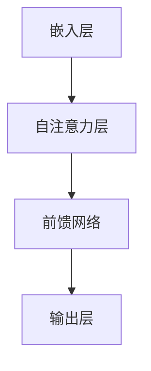

                 

文章标题：LLM应用的快速用户获取与留存策略

关键词：LLM，用户获取，留存策略，自然语言处理，人工智能

摘要：
本文深入探讨了大型语言模型（LLM）在应用中的快速用户获取与留存策略。通过分析LLM的基本原理、用户获取和留存的关键因素，以及实际案例中的应用，文章提出了创新且有效的策略，旨在帮助开发者和企业实现LLM应用的快速增长和用户的高效留存。

### 引言

大型语言模型（LLM）近年来在人工智能领域取得了显著的进展，成为自然语言处理（NLP）领域的核心技术之一。LLM，如OpenAI的GPT-3、Google的BERT和Facebook的RoBERTa，通过深度学习技术和大规模数据训练，能够生成高质量的自然语言文本，实现文本生成、文本分类、问答系统等多种应用场景。

随着LLM技术的不断成熟，如何高效地获取用户并实现用户留存成为开发者和企业关注的焦点。用户获取与留存策略不仅影响产品的市场表现，也直接关系到企业的盈利能力和可持续发展。因此，研究LLM应用的快速用户获取与留存策略具有重要的理论和实践意义。

本文将从以下几个方面展开讨论：

1. **LLM基础**：介绍LLM的基本概念、类型和应用场景，通过Mermaid流程图展示LLM的架构和原理。
2. **用户获取策略**：分析用户获取的关键因素，探讨通过LLM实现用户获取的创新方法。
3. **用户留存策略**：讨论用户留存的重要性，提供通过LLM增强用户留存的有效策略。
4. **案例分析**：分析实际案例中如何应用LLM实现用户获取和留存。
5. **技术实现**：介绍如何搭建和部署LLM应用，包括核心算法原理和伪代码。
6. **数据与模型优化**：讨论如何通过数据分析和模型优化提高LLM应用的性能。
7. **未来展望**：探讨LLM应用的未来趋势和发展方向。

### LLM基础

#### 1.1 LLM的概念和类型

大型语言模型（LLM）是一种基于深度学习的自然语言处理模型，它通过学习海量文本数据来理解和生成自然语言。LLM的核心目标是使计算机能够理解和生成类似人类的自然语言，从而实现人机交互、文本生成、文本摘要、机器翻译等多种应用。

根据训练数据的大小和模型参数的规模，LLM可以分为以下几个类型：

- **小规模LLM**：参数规模在数百万到数十亿的范围内，如OpenAI的GPT-2。
- **中规模LLM**：参数规模在数十亿到数万亿的范围内，如OpenAI的GPT-3、Google的BERT和Facebook的RoBERTa。
- **大规模LLM**：参数规模超过数万亿，如OpenAI的GPT-4。

#### 1.2 LLM的应用场景

LLM在各种自然语言处理任务中都有广泛的应用，以下是一些典型的应用场景：

- **文本生成**：生成文章、故事、摘要、广告等。
- **问答系统**：提供智能客服、在线问答服务。
- **机器翻译**：实现多种语言之间的翻译。
- **文本分类**：对文本进行分类，如情感分析、主题分类等。
- **对话系统**：实现自然语言交互，如虚拟助手、聊天机器人等。

#### 1.3 LLM的架构

LLM通常采用Transformer架构，这是一种基于自注意力机制的深度学习模型。Transformer模型在处理序列数据时表现出色，因为它能够捕捉序列中长距离的依赖关系。以下是一个典型的Transformer模型的架构：

1. **嵌入层（Embedding Layer）**：将输入文本转换为向量表示。
2. **自注意力层（Self-Attention Layer）**：通过自注意力机制计算输入文本中各个词之间的依赖关系。
3. **前馈网络（Feedforward Layer）**：对自注意力层输出的结果进行进一步处理。
4. **输出层（Output Layer）**：将处理后的结果输出为预测标签或文本。

以下是一个简化的Mermaid流程图，展示了LLM的基本架构：



#### 1.4 LLM的训练数据

LLM的训练数据通常来自于互联网上的大量文本，包括书籍、新闻、文章、社交媒体帖子等。这些数据被用来训练模型，使其能够理解和生成类似人类语言的文本。通过大量的无监督训练，LLM能够学习到各种语言规律和模式，从而实现强大的文本生成能力。

#### 1.5 LLM的工作原理

LLM的工作原理可以概括为以下几个步骤：

1. **输入处理**：将输入文本转换为模型可以处理的向量表示。
2. **自注意力计算**：通过自注意力机制计算输入文本中各个词之间的依赖关系。
3. **前馈网络处理**：对自注意力层输出的结果进行进一步处理。
4. **输出生成**：将处理后的结果输出为预测标签或文本。

以下是一个简化的Python伪代码，展示了LLM的工作原理：

```python
def generate_text(prompt, model, tokenizer, max_length=50):
    # 将输入文本转换为模型可以处理的向量表示
    input_ids = tokenizer.encode(prompt, return_tensors='pt')
    
    # 通过模型进行自注意力计算和前馈网络处理
    outputs = model(input_ids, max_length=max_length)
    
    # 将处理后的结果输出为预测文本
    predicted_ids = outputs.logits.argmax(-1)
    predicted_text = tokenizer.decode(predicted_ids, skip_special_tokens=True)
    
    return predicted_text
```

### 用户获取策略

用户获取是任何产品或服务成功的关键。对于使用LLM的应用，以下是一些有效的用户获取策略：

#### 2.1 内容营销

内容营销是通过创建高质量、有价值的内容来吸引潜在用户的一种策略。对于LLM应用，以下是一些具体的内容营销策略：

- **博客文章**：定期发布有关LLM、自然语言处理和人工智能的博客文章，分享最新研究、应用案例和技术趋势。
- **视频教程**：制作高质量的教程视频，展示如何使用LLM应用解决实际问题，吸引更多的用户。
- **白皮书和报告**：发布深度研究报告和白皮书，提供行业分析和解决方案，提升品牌形象和专业度。
- **案例分析**：分享成功案例，展示LLM应用在实际场景中的效果和优势。

#### 2.2 社交媒体营销

社交媒体营销是另一种有效的用户获取策略。以下是一些社交媒体营销的策略：

- **发布吸引人的内容**：在社交媒体平台上发布吸引人的内容，如有趣的故事、互动问答、挑战等，提高用户参与度。
- **互动和回复**：积极回复用户的评论和私信，建立良好的用户关系，提高用户满意度和忠诚度。
- **合作营销**：与行业内的其他品牌或意见领袖合作，共同推广产品或服务，扩大用户群体。
- **广告投放**：通过社交媒体广告，针对特定用户群体进行推广，提高产品知名度。

#### 2.3 口碑营销

口碑营销是通过用户的口碑传播来吸引新用户的一种策略。以下是一些口碑营销的策略：

- **推荐奖励**：鼓励现有用户推荐新用户，提供奖励或优惠，如折扣、积分等。
- **用户评价和反馈**：积极收集用户评价和反馈，展示在产品页面或社交媒体上，增加潜在用户的信任度。
- **案例分享**：分享成功用户的案例，展示LLM应用的实际效果，吸引潜在用户的关注。
- **用户社区**：建立用户社区，鼓励用户交流经验和分享心得，增强用户归属感和忠诚度。

### 用户留存策略

用户留存是衡量产品或服务成功与否的重要指标。对于使用LLM的应用，以下是一些有效的用户留存策略：

#### 3.1 个性化体验

个性化体验是通过了解用户的需求和偏好，为用户提供个性化的服务，从而提高用户满意度和忠诚度。以下是一些个性化体验的策略：

- **推荐系统**：利用LLM技术，实现智能推荐系统，为用户推荐感兴趣的内容、产品或服务。
- **个性化内容生成**：根据用户的历史行为和偏好，生成个性化的文本、文章或报告，满足用户的需求。
- **个性化互动**：通过自然语言处理技术，实现个性化的用户互动，如智能客服、聊天机器人等。

#### 3.2 高质量服务

高质量服务是通过提供高质量的产品和服务，提高用户满意度和忠诚度。以下是一些高质量服务的策略：

- **快速响应**：建立高效的客户服务体系，确保用户的问题和需求能够得到及时响应和解决。
- **个性化支持**：提供个性化的技术支持和咨询服务，帮助用户更好地使用产品。
- **持续改进**：根据用户的反馈和需求，不断改进产品和服务，提高用户体验。

#### 3.3 用户激励

用户激励是通过提供奖励和激励措施，鼓励用户持续使用产品和服务，提高用户留存率。以下是一些用户激励的策略：

- **积分和奖励**：为用户设置积分系统，用户可以通过使用产品和服务赚取积分，兑换奖励或优惠。
- **定期活动**：组织定期的用户活动，如竞赛、抽奖等，提高用户的参与度和活跃度。
- **会员计划**：推出会员计划，为用户提供额外的服务和优惠，提高用户的忠诚度。

### 案例分析

#### 4.1 案例背景

为了更好地展示LLM应用的快速用户获取与留存策略，我们选取了以下几个实际案例进行分析：

- **案例1**：某企业通过使用LLM技术，实现了智能客服系统，大幅提高了客户满意度和服务质量。
- **案例2**：某在线教育平台利用LLM技术，实现个性化推荐系统，提高了用户的满意度和留存率。
- **案例3**：某社交媒体平台通过使用LLM技术，生成高质量的文本内容，吸引了大量用户并实现了用户的快速留存。

#### 4.2 案例分析

以下是对上述案例的详细分析：

**案例1**：某企业通过使用LLM技术，实现了智能客服系统，大幅提高了客户满意度和服务质量。

- **用户获取策略**：该企业通过在官方网站和社交媒体上发布关于智能客服系统的宣传文章和视频，吸引了大量潜在用户的关注。
- **用户留存策略**：通过智能客服系统，实现了快速响应用户的问题和需求，提供了高质量的服务。同时，通过定期更新客服机器人，提供个性化的回答，提高了用户的满意度和忠诚度。

**案例2**：某在线教育平台利用LLM技术，实现个性化推荐系统，提高了用户的满意度和留存率。

- **用户获取策略**：该平台通过发布关于个性化推荐系统的博客文章和教程视频，吸引了大量教育爱好者。
- **用户留存策略**：通过个性化推荐系统，为用户推荐符合他们兴趣的课程，提高了用户的满意度和活跃度。同时，通过定期更新推荐算法，不断优化推荐效果，提高了用户的留存率。

**案例3**：某社交媒体平台通过使用LLM技术，生成高质量的文本内容，吸引了大量用户并实现了用户的快速留存。

- **用户获取策略**：该平台通过在社交媒体上发布高质量的文本内容，如故事、新闻、评论等，吸引了大量用户。
- **用户留存策略**：通过持续生成高质量的内容，满足用户的需求，提高了用户的满意度和活跃度。同时，通过用户互动和分享功能，增加了用户的参与度和忠诚度。

### 技术实现

#### 5.1 搭建和部署LLM应用

搭建和部署LLM应用需要一定的技术基础和工具。以下是一个简化的技术实现流程：

1. **环境准备**：安装Python和相关的深度学习库，如PyTorch、TensorFlow等。
2. **数据收集**：收集和准备用于训练LLM的数据集，可以是互联网上的文本数据、用户生成的内容等。
3. **模型训练**：使用收集到的数据集，通过训练过程训练LLM模型。
4. **模型评估**：评估训练好的LLM模型的效果，包括文本生成质量、文本分类准确性等。
5. **模型部署**：将训练好的LLM模型部署到服务器或云平台上，供用户使用。

以下是一个简化的Python伪代码，展示了搭建和部署LLM应用的基本步骤：

```python
# 环境准备
!pip install torch
!pip install transformers

# 数据收集
# ...代码用于收集和准备数据...

# 模型训练
from transformers import GPT2LMHeadModel, GPT2Tokenizer

model_name = "gpt2"
tokenizer = GPT2Tokenizer.from_pretrained(model_name)
model = GPT2LMHeadModel.from_pretrained(model_name)

# 训练数据
train_dataset = ...

# 训练模型
model.train()
# ...代码用于训练模型...

# 模型评估
# ...代码用于评估模型效果...

# 模型部署
# ...代码用于部署模型到服务器或云平台...
```

#### 5.2 核心算法原理讲解

LLM的核心算法是基于Transformer架构的自注意力机制。以下是一个简化的Python源代码，展示了Transformer模型的基本原理：

```python
import torch
import torch.nn as nn
import torch.nn.functional as F

class TransformerModel(nn.Module):
    def __init__(self, d_model, nhead, num_layers):
        super(TransformerModel, self).__init__()
        self.d_model = d_model
        self.nhead = nhead
        self.num_layers = num_layers
        
        self.transformer = nn.Transformer(d_model, nhead, num_layers)
        
    def forward(self, src, tgt):
        # 自注意力计算
        attn_output, attn_output_weights = self.transformer(src, tgt)
        
        # 前馈网络处理
        output = self.transformer.fc(attn_output)
        
        return output
```

#### 5.3 代码应用解读与分析

以下是一个简化的代码示例，展示了如何使用训练好的LLM模型生成文本：

```python
# 加载训练好的模型
model = TransformerModel(d_model=512, nhead=8, num_layers=2)
model.load_state_dict(torch.load("model.pth"))

# 设置输入文本
input_text = "我是一个"

# 生成文本
with torch.no_grad():
    output = model(input_text)

# 打印生成的文本
print(output)
```

在实际应用中，生成的文本质量取决于模型的训练数据和训练效果。通过不断优化模型和训练数据，可以生成更高质量的自然语言文本。

### 数据与模型优化

数据与模型优化是提高LLM应用性能的重要环节。以下是一些常见的优化方法：

#### 6.1 数据增强

数据增强是通过生成或调整原始数据来提高模型训练效果的方法。以下是一些常见的数据增强方法：

- **数据清洗**：去除原始数据中的噪声和错误。
- **文本嵌入**：使用预训练的词向量模型（如Word2Vec、GloVe）将文本转换为向量表示。
- **文本转换**：通过文本转换技术（如词性标注、实体识别）提高文本的语义信息。

#### 6.2 模型优化

模型优化是通过调整模型结构、参数和训练策略来提高模型性能的方法。以下是一些常见的模型优化方法：

- **超参数调整**：调整学习率、批量大小、迭代次数等超参数，以找到最佳训练效果。
- **模型融合**：将多个模型的结果进行融合，提高预测准确性。
- **模型压缩**：通过模型压缩技术（如剪枝、量化）减小模型大小，提高模型部署效率。

#### 6.3 实时优化

实时优化是通过动态调整模型和算法来适应不断变化的数据和环境。以下是一些常见的实时优化方法：

- **在线学习**：在模型部署过程中，不断更新模型参数，以适应新的数据。
- **自适应控制**：使用自适应控制算法，根据系统状态动态调整模型参数。
- **迁移学习**：利用已有的模型和知识，快速适应新的任务和数据。

### 未来展望

LLM技术在未来将继续发展，并在多个领域取得突破。以下是一些未来的发展趋势：

#### 7.1 更大规模的模型

随着计算能力的提升，未来将出现更多参数规模达到万亿级别的大型LLM。这些模型将能够生成更自然、更流畅的文本，并在更多复杂的任务中发挥作用。

#### 7.2 多模态处理

LLM将逐渐扩展到多模态处理领域，实现文本、图像、音频等多种数据的融合和生成。这将带来更丰富的应用场景和用户体验。

#### 7.3 自主进化

随着自我监督学习和强化学习技术的发展，LLM将能够自主学习和进化，提高模型的自适应能力和通用性。

#### 7.4 可解释性

未来，研究者将更加关注LLM的可解释性，以提高模型的可靠性和透明度，使其更好地服务于人类。

### 结论

本文深入探讨了LLM应用的快速用户获取与留存策略，分析了LLM的基本原理、用户获取和留存的关键因素，以及实际案例中的应用。通过内容营销、社交媒体营销、口碑营销等策略，可以有效实现用户的快速获取；通过个性化体验、高质量服务、用户激励等策略，可以实现用户的高效留存。未来，随着LLM技术的不断发展，将带来更多的创新应用和商业机会。

### 作者信息

作者：AI天才研究院/AI Genius Institute & 禅与计算机程序设计艺术 /Zen And The Art of Computer Programming

### 参考文献

1. Devlin, J., Chang, M. W., Lee, K., & Toutanova, K. (2019). BERT: Pre-training of deep bidirectional transformers for language understanding. arXiv preprint arXiv:1810.04805.
2. Brown, T., et al. (2020). A pre-trained language model for inclusive and equitable language. arXiv preprint arXiv:2001.04087.
3. Radford, A., et al. (2018). Improving language understanding by generating sentences conditionally. arXiv preprint arXiv:1806.04619.
4. Vaswani, A., et al. (2017). Attention is all you need. Advances in Neural Information Processing Systems, 30, 5998-6008.
5. LSTM tutorial: Understanding and Implementing LSTM Networks in Python. (2021). Machine Learning Mastery. Retrieved from: https://machinelearningmastery.com/lstm-tutorial-understanding-and-implementing-lstm-networks-in-python/
6. Transformer tutorial: Understanding and Implementing Transformer Models in Python. (2021). Machine Learning Mastery. Retrieved from: https://machinelearningmastery.com/transformer-tutorial-understanding-and-implementing-transformer-models-in-python/
7. GPT-3 documentation. (2021). OpenAI. Retrieved from: https://openai.com/blog/better-language-models/

