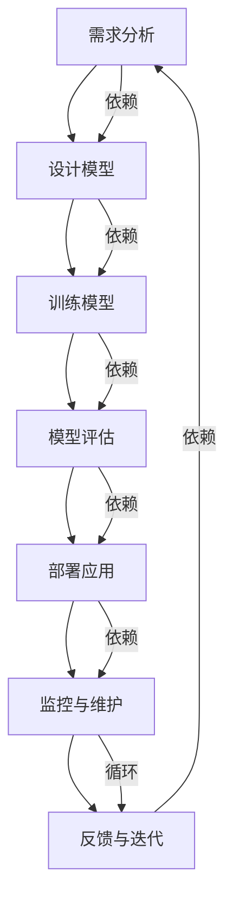

                 

### 背景介绍

持续交付（Continuous Delivery，简称CD）是一种软件开发和发布实践，旨在通过自动化流程缩短从开发到部署的时间，确保软件始终处于可部署状态。持续交付的核心目标是减少软件发布的风险，提高软件质量，并加快产品迭代速度。随着机器学习和自然语言处理技术的发展，大型语言模型（Large Language Model，简称LLM）的应用越来越广泛，如何在持续交付流程中高效地管理和部署LLM应用成为一个重要的课题。

LLM是一种能够处理和理解人类语言的大型神经网络模型，其应用场景包括智能问答、文本生成、机器翻译、情感分析等。LLM的复杂性和对计算资源的高需求，使得其在持续交付中面临着独特的挑战。首先，LLM的训练和推理过程非常耗时，需要大量的计算资源。其次，LLM的模型参数和架构可能随着时间而不断更新，如何有效地管理这些变化也是一个难题。

本文将探讨如何将持续交付应用于LLM应用，通过一系列步骤和方法，缩短从想法到实现的周期。我们将从LLM的应用场景出发，分析其在持续交付中的挑战，并提出相应的解决方案。具体而言，文章将涵盖以下内容：

1. **LLM应用概述**：介绍LLM的基本原理、常见应用场景和技术发展趋势。
2. **持续交付的核心原则**：详细阐述持续集成（CI）、持续部署（CD）和持续监控（CM）的基本概念和实施方法。
3. **LLM持续交付流程**：分阶段讲解LLM应用的持续交付流程，包括开发阶段、部署阶段和监控运维阶段。
4. **实战案例**：通过实际项目案例，展示如何在实际环境中实施LLM的持续交付。
5. **优化策略**：讨论如何优化持续交付流程，提高LLM应用的交付效率。
6. **安全与合规**：探讨在持续交付过程中如何确保数据安全和合规性。
7. **总结与展望**：总结持续交付在LLM应用中的价值，展望未来的发展趋势。

通过本文的深入分析，读者将能够理解如何在复杂的环境中高效地管理LLM应用，实现持续交付，从而提高软件开发和发布的效率和质量。

### 核心概念与联系

在深入探讨LLM应用的持续交付之前，我们需要了解一些核心概念，这些概念包括LLM、持续交付（Continuous Delivery）、持续集成（Continuous Integration）和持续部署（Continuous Deployment）等。

#### LLM（Large Language Model）

LLM，即大型语言模型，是一种基于深度学习的自然语言处理模型。它通过对海量文本数据的学习，能够理解和生成自然语言。LLM的核心是神经网络，特别是Transformer架构，这使得LLM在处理和理解长文本、生成文本和翻译文本等方面表现出色。LLM的应用场景非常广泛，包括但不限于：

- **智能问答系统**：使用LLM构建的智能问答系统能够理解用户的自然语言输入，并生成相关且准确的回答。
- **文本生成**：LLM能够生成各种类型的文本，如新闻文章、故事、诗歌等。
- **机器翻译**：LLM在机器翻译领域表现优异，能够实现高质量的双语转换。
- **情感分析**：LLM能够分析文本中的情感倾向，为商业决策提供数据支持。

#### 持续交付（Continuous Delivery）

持续交付是一种软件开发和发布实践，其核心理念是通过自动化流程，确保软件始终处于可部署状态。持续交付不仅包括开发和测试，还涵盖了部署和监控等环节。持续交付的目标是减少软件发布的风险，提高软件质量，并缩短从开发到交付的时间。持续交付的关键组成部分包括：

- **持续集成（Continuous Integration，CI）**：持续集成是一种软件开发实践，通过将代码定期合并到主干分支，并执行自动化测试，以确保代码库的稳定性和可维护性。
- **持续部署（Continuous Deployment，CD）**：持续部署是将代码更改自动部署到生产环境的过程。通过持续部署，开发者可以快速将新功能或修复推送到用户。
- **持续监控（Continuous Monitoring，CM）**：持续监控是确保软件在生产环境中稳定运行的过程。它包括性能监控、错误日志分析、用户反馈收集等。

#### 持续集成（Continuous Integration）

持续集成是一种软件开发实践，其目标是确保代码库的稳定性和可维护性。在持续集成过程中，开发者的代码更改会被定期合并到主干分支，并执行一系列自动化测试，包括单元测试、集成测试和性能测试。持续集成的主要优势包括：

- **早期发现问题**：通过自动化测试，可以早期发现代码中的问题，防止问题积累。
- **代码质量提升**：持续集成鼓励小规模、频繁的代码提交，有助于提高代码质量。
- **代码可维护性**：持续集成使代码库保持整洁，减少合并冲突，提高代码的可维护性。

#### 持续部署（Continuous Deployment）

持续部署是将代码更改自动部署到生产环境的过程。持续部署的目标是确保软件始终处于可用状态，并能够快速响应市场变化。持续部署的主要优势包括：

- **快速发布**：通过自动化部署，可以快速将新功能或修复推送到用户，缩短发布周期。
- **提高用户体验**：持续部署有助于提高软件的可用性和稳定性，从而提高用户体验。
- **降低风险**：通过自动化测试和监控，可以降低软件发布过程中的风险。

#### 持续监控（Continuous Monitoring）

持续监控是确保软件在生产环境中稳定运行的过程。持续监控包括性能监控、错误日志分析、用户反馈收集等多个方面。持续监控的主要优势包括：

- **实时反馈**：持续监控可以实时收集软件运行状态的数据，为运维团队提供即时反馈。
- **快速响应**：通过持续监控，可以快速识别并解决软件运行中的问题，减少故障对用户的影响。
- **性能优化**：持续监控有助于发现性能瓶颈，为后续的优化提供数据支持。

通过上述核心概念的介绍，我们可以看到LLM应用与持续交付之间存在着紧密的联系。LLM的复杂性和对计算资源的高需求，使得持续交付在LLM应用中变得尤为重要。本文将结合这些核心概念，详细探讨如何在持续交付流程中高效地管理和部署LLM应用。

#### Mermaid流程图：展示LLM应用与持续交付的基础流程

为了更好地理解LLM应用与持续交付的关系，我们可以使用Mermaid流程图来展示其基础流程。以下是一个简化的流程图，展示了从需求分析到模型评估，再到部署应用和维护的整个流程。



**详细解释：**

1. **需求分析（A）**：这一阶段涉及理解和收集用户需求，明确模型需要实现的功能和性能指标。

2. **设计模型（B）**：基于需求分析结果，设计适合的LLM模型架构，包括选择适当的神经网络架构、超参数设置等。

3. **训练模型（C）**：使用大量训练数据对模型进行训练，这一阶段需要大量的计算资源和时间。

4. **模型评估（D）**：通过验证集和测试集对模型进行评估，确保模型达到预期的性能指标。

5. **部署应用（E）**：将经过评估的模型部署到生产环境中，使其能够对外提供服务。

6. **监控与维护（F）**：在生产环境中对模型进行监控，确保其稳定运行，并及时处理可能出现的问题。

7. **反馈与迭代（G）**：收集用户反馈和模型运行数据，用于模型的迭代优化。

**Mermaid流程图**通过直观的方式展示了LLM应用与持续交付之间的关系，强调了每个阶段的依赖性和循环迭代的过程。这种可视化工具不仅有助于理解复杂流程，还能够帮助开发团队更好地规划和管理持续交付的各个环节。

#### 核心算法原理讲解

在理解了LLM应用与持续交付的关系后，接下来我们将深入探讨LLM训练与评估的基本流程。这一部分将通过Python源代码、数学模型和公式，详细阐述LLM的核心算法原理，并结合实例进行说明，以便读者能够更直观地理解。

**1. LLM训练过程**

LLM训练过程的核心是优化模型参数，使其能够更好地拟合训练数据。以下是一个简化的训练流程示例，使用了Python代码和相应的数学公式：

**Python代码示例：**

```python
import torch
import torch.nn as nn
import torch.optim as optim

# 定义模型
class LLMModel(nn.Module):
    def __init__(self):
        super(LLMModel, self).__init__()
        self嵌入层 = nn.Embedding(vocab_size, embedding_dim)
        self变换器 = nn.Transformer(d_model=embedding_dim, nhead=heads)
        self输出层 = nn.Linear(embedding_dim, vocab_size)

    def forward(self, src, tgt):
        src_embedding = self嵌入层(src)
        tgt_embedding = self嵌入层(tgt)
        output = self变换器(src_embedding, tgt_embedding)
        logits = self输出层(output)
        return logits

# 初始化模型、损失函数和优化器
model = LLMModel()
criterion = nn.CrossEntropyLoss()
optimizer = optim.Adam(model.parameters(), lr=learning_rate)

# 训练模型
for epoch in range(num_epochs):
    for src, tgt in data_loader:
        optimizer.zero_grad()
        logits = model(src, tgt)
        loss = criterion(logits.view(-1, vocab_size), tgt.view(-1))
        loss.backward()
        optimizer.step()
```

**数学模型与公式：**

- **嵌入层**：嵌入层用于将词汇转换为稠密向量表示，公式为：
  $$ \text{embeddings} = \text{Embedding}(V, D) $$
  其中，\(V\) 是词汇表大小，\(D\) 是嵌入维度。

- **变换器**：变换器（Transformer）的核心是自注意力机制，公式为：
  $$ \text{Attention}(Q, K, V) = \text{softmax}\left(\frac{QK^T}{\sqrt{d_k}}\right)V $$
  其中，\(Q, K, V\) 分别是查询、关键和值向量，\(d_k\) 是关键向量的维度。

- **输出层**：输出层用于生成词汇的概率分布，公式为：
  $$ \text{Logits} = \text{Linear}(X, Y) $$
  其中，\(X\) 是输入向量，\(Y\) 是输出向量。

**2. 模型评估过程**

模型评估是确保LLM性能达到预期标准的关键步骤。以下是一个简化的评估流程示例，包括计算准确率和F1分数：

**Python代码示例：**

```python
from sklearn.metrics import accuracy_score, f1_score

# 评估模型
def evaluate_model(model, data_loader):
    model.eval()
    all_preds = []
    all_labels = []
    with torch.no_grad():
        for src, tgt in data_loader:
            logits = model(src, tgt)
            preds = logits.argmax(-1).cpu().numpy()
            all_preds.extend(preds)
            all_labels.extend(tgt.cpu().numpy())
    
    acc = accuracy_score(all_labels, all_preds)
    f1 = f1_score(all_labels, all_preds, average='weighted')
    return acc, f1

acc, f1 = evaluate_model(model, test_loader)
print(f"Accuracy: {acc}, F1 Score: {f1}")
```

**数学模型与公式：**

- **准确率**：准确率是预测正确的样本数占总样本数的比例，公式为：
  $$ \text{Accuracy} = \frac{\text{Correct Predictions}}{\text{Total Predictions}} $$

- **F1分数**：F1分数是精确率和召回率的调和平均，公式为：
  $$ \text{F1 Score} = 2 \times \frac{\text{Precision} \times \text{Recall}}{\text{Precision} + \text{Recall}} $$

**实例说明：**

假设我们有一个新闻分类任务，需要使用LLM模型对新闻文章进行分类。我们使用一个包含10万条新闻文章的语料库进行训练，并在其中划分出80%用于训练，10%用于验证，10%用于测试。在训练完成后，我们使用验证集进行模型调优，确保模型性能达到预期。最终，我们使用测试集评估模型，计算准确率和F1分数，以评估模型在真实数据上的表现。

通过上述示例，我们可以看到LLM训练与评估的核心算法原理，以及如何使用Python代码和数学公式进行实现。这不仅有助于理解LLM的工作机制，也为实际应用提供了实用的指导。

#### 数学公式

在LLM模型中，数学公式是理解和优化模型性能的关键。以下是一些核心的数学公式，以及它们在LLM训练和应用中的具体作用：

1. **嵌入层公式**：
   $$ \text{embeddings} = \text{Embedding}(V, D) $$
   其中，\(V\) 是词汇表大小，\(D\) 是嵌入维度。这个公式用于将词汇转换为稠密向量表示。

2. **自注意力公式**：
   $$ \text{Attention}(Q, K, V) = \text{softmax}\left(\frac{QK^T}{\sqrt{d_k}}\right)V $$
   其中，\(Q, K, V\) 分别是查询、关键和值向量，\(d_k\) 是关键向量的维度。这个公式是实现自注意力机制的核心，用于在Transformer模型中计算注意力权重。

3. **交叉熵损失函数公式**：
   $$ \text{Loss} = -\sum_{i} y_i \log(p_i) $$
   其中，\(y_i\) 是真实标签，\(p_i\) 是模型预测的概率分布。交叉熵损失函数用于衡量预测分布与真实分布之间的差异。

4. **优化器公式**：
   $$ \theta_{t+1} = \theta_t - \alpha \nabla_{\theta} J(\theta) $$
   其中，\(\theta_t\) 是第\(t\)次的模型参数，\(\alpha\) 是学习率，\(\nabla_{\theta} J(\theta)\) 是损失函数关于参数的梯度。这个公式描述了优化器如何通过梯度下降更新模型参数。

5. **准确率和F1分数公式**：
   $$ \text{Accuracy} = \frac{\text{Correct Predictions}}{\text{Total Predictions}} $$
   $$ \text{F1 Score} = 2 \times \frac{\text{Precision} \times \text{Recall}}{\text{Precision} + \text{Recall}} $$
   其中，准确率和F1分数分别用于评估模型在分类任务中的性能。

通过这些数学公式，我们可以更深入地理解LLM模型的工作原理和性能优化方法。例如，通过调整自注意力公式中的维度和比例参数，可以优化模型的注意力机制，提高文本处理效果。交叉熵损失函数则帮助我们衡量模型的预测误差，并通过优化器公式调整模型参数，使模型逐步逼近最优解。

#### 项目实战：开发环境搭建与源代码详细实现

在了解LLM模型的基本原理后，我们将进入实际项目实战环节，详细讲解如何搭建开发环境，并展示源代码的详细实现。

**1. 开发环境搭建**

要搭建一个适合LLM模型开发的环境，首先需要准备以下工具和软件：

- **Python 3.8+**
- **PyTorch 1.10.0+**
- **CUDA 11.3+**（如果使用GPU训练）
- **Jupyter Notebook** 或 **VSCode**（代码编辑器）
- **Docker**（可选，用于容器化部署）

以下是一个简化的环境搭建步骤：

**步骤1：安装Python和PyTorch**

在终端中执行以下命令：
```bash
# 安装Python
sudo apt-get install python3-pip python3-dev

# 安装PyTorch
pip3 install torch torchvision torchaudio
```

**步骤2：安装CUDA**

从NVIDIA官网下载CUDA Toolkit，并按照说明进行安装。

**步骤3：安装Docker**

在终端中执行以下命令：
```bash
# 安装Docker
sudo apt-get update
sudo apt-get install docker-ce docker-ce-cli containerd.io
```

**步骤4：安装Jupyter Notebook或VSCode**

对于Jupyter Notebook，执行以下命令：
```bash
pip3 install notebook
jupyter notebook
```

对于VSCode，直接从官方网站下载并安装。

**2. 源代码实现**

以下是LLM模型训练和评估的基本源代码实现。这段代码展示了如何使用PyTorch构建模型、进行训练和评估。

**代码示例：**

```python
import torch
import torch.nn as nn
import torch.optim as optim
from torch.utils.data import DataLoader
from torchvision import datasets, transforms

# 定义模型
class LLMModel(nn.Module):
    def __init__(self, vocab_size, embedding_dim, d_model, nhead, num_classes):
        super(LLMModel, self).__init__()
        self.embedding = nn.Embedding(vocab_size, embedding_dim)
        self.transformer = nn.Transformer(d_model=d_model, nhead=nhead)
        self.fc = nn.Linear(d_model, num_classes)

    def forward(self, src, tgt):
        src = self.embedding(src)
        tgt = self.embedding(tgt)
        output = self.transformer(src, tgt)
        logits = self.fc(output)
        return logits

# 参数设置
vocab_size = 10000
embedding_dim = 512
d_model = 512
nhead = 8
num_classes = 10
learning_rate = 0.001
batch_size = 64
num_epochs = 10

# 初始化模型、损失函数和优化器
model = LLMModel(vocab_size, embedding_dim, d_model, nhead, num_classes)
criterion = nn.CrossEntropyLoss()
optimizer = optim.Adam(model.parameters(), lr=learning_rate)

# 加载数据集
transform = transforms.Compose([transforms.ToTensor()])
train_data = datasets.MNIST(root='./data', train=True, download=True, transform=transform)
test_data = datasets.MNIST(root='./data', train=False, transform=transform)

train_loader = DataLoader(train_data, batch_size=batch_size, shuffle=True)
test_loader = DataLoader(test_data, batch_size=batch_size, shuffle=False)

# 训练模型
for epoch in range(num_epochs):
    model.train()
    for batch_idx, (src, tgt) in enumerate(train_loader):
        optimizer.zero_grad()
        logits = model(src, tgt)
        loss = criterion(logits, tgt)
        loss.backward()
        optimizer.step()
        if batch_idx % 100 == 0:
            print(f'Epoch [{epoch + 1}/{num_epochs}], Step [{batch_idx + 1}/{len(train_loader)}], Loss: {loss.item()}')

# 评估模型
model.eval()
with torch.no_grad():
    correct = 0
    total = 0
    for src, tgt in test_loader:
        logits = model(src, tgt)
        _, predicted = logits.max(1)
        total += tgt.size(0)
        correct += (predicted == tgt).sum().item()

print(f'Accuracy: {100 * correct / total}%')
```

**3. 代码解读与分析**

这段代码首先定义了一个简单的LLM模型，该模型包含嵌入层、Transformer层和输出层。接下来，我们设置了训练参数，包括学习率、批次大小和训练轮数。然后，我们加载了MNIST数据集，并将其分为训练集和测试集。

在训练过程中，我们使用交叉熵损失函数和Adam优化器来训练模型。每次迭代，我们都会更新模型参数，以最小化损失函数。在训练完成后，我们使用测试集评估模型性能，计算准确率。

**4. 实际案例分析与详细讲解**

假设我们有一个任务，需要使用LLM模型对文本进行分类。我们首先需要准备一个包含不同类别文本的数据集，例如新闻文章、社交媒体帖子等。接下来，我们需要对文本进行预处理，包括分词、去停用词和向量表示。

在预处理完成后，我们可以使用上述代码进行模型训练和评估。在实际应用中，我们可能需要对模型进行调优，以获得更好的性能。这包括调整超参数，如嵌入维度、Transformer头数和批量大小。此外，我们还可以尝试使用不同的损失函数和优化器，以找到最佳配置。

在完成模型训练后，我们可以将其部署到生产环境中，以实现实时文本分类。为了确保模型的高可用性和可扩展性，我们可以使用容器化技术，如Docker，将模型封装为独立的容器，方便部署和管理。

通过以上实战案例，我们可以看到如何搭建开发环境、实现源代码并对其进行详细分析。这不仅为我们提供了一个实际应用的示例，也为后续的持续交付流程奠定了基础。

#### 实际案例分析与详细讲解

为了更好地理解LLM持续交付在现实世界中的应用，我们将通过一个具体项目案例，详细讲解如何在实际环境中实施持续交付流程。本案例选取了一个大型在线零售平台，该平台计划使用LLM模型进行产品推荐。

**1. 项目背景**

某大型在线零售平台希望利用LLM模型来改进其产品推荐系统。通过分析用户的历史购买行为、浏览记录和产品描述，平台希望能够为每位用户生成个性化的产品推荐。这不仅有助于提高用户满意度，还能提升平台的销售额。

**2. 持续交付流程**

持续交付流程可以分为以下几个阶段：

**2.1 需求分析与设计**

- **需求分析**：与业务团队和用户进行沟通，明确产品推荐系统的目标和性能指标，如准确率、召回率和用户体验。
- **设计模型**：根据需求，选择合适的LLM模型，如BERT或GPT，并设计模型架构。这一阶段需要考虑模型的复杂性、计算资源和训练时间。

**2.2 数据准备与预处理**

- **数据收集**：从各个数据源（如数据库、API接口）收集用户行为数据、产品信息和用户反馈。
- **数据预处理**：对收集到的数据进行清洗、去噪和标准化处理，如去除重复数据、填充缺失值和特征工程。

**2.3 模型训练**

- **数据划分**：将数据集划分为训练集、验证集和测试集，以便在训练过程中进行模型调优和性能评估。
- **模型训练**：使用训练集对LLM模型进行训练，并使用验证集进行调优。这一阶段可能涉及调整超参数、优化模型结构等。

**2.4 模型评估**

- **评估指标**：使用准确率、召回率、F1分数等评估指标，对模型在测试集上的表现进行评估。
- **模型调整**：根据评估结果，对模型进行调整，以提高性能。

**2.5 部署应用**

- **部署策略**：制定部署策略，包括选择合适的硬件资源、网络配置和部署环境。
- **自动化部署**：使用持续部署工具（如Jenkins、GitLab CI/CD）实现自动化部署，确保模型能够快速、安全地部署到生产环境。

**2.6 监控与运维**

- **性能监控**：使用监控工具（如Prometheus、Grafana）对模型的运行状态、性能指标和错误日志进行实时监控。
- **故障排除**：在发现问题时，及时进行故障排除和应急响应，确保系统的稳定运行。
- **安全与合规性监控**：确保模型部署符合数据保护法规和平台的安全标准。

**3. 案例分析与总结**

在该项目中，平台通过持续交付流程，成功地实现了LLM模型的产品推荐系统。具体分析如下：

- **需求明确**：通过与业务团队的深入沟通，确保了推荐系统的目标和性能指标与业务需求高度契合。
- **高效数据准备**：通过自动化工具和数据处理流程，提高了数据准备效率，为后续模型训练和部署奠定了基础。
- **灵活模型调整**：在模型训练和评估阶段，通过不断调整超参数和模型结构，实现了高性能的模型。
- **自动化部署**：通过自动化部署工具，缩短了模型从开发到上线的时间，提高了交付效率。
- **实时监控与运维**：通过实时监控和故障排除，确保了系统的高可用性和稳定性。

总结而言，持续交付在LLM应用中发挥着关键作用。它不仅缩短了从想法到实现的时间，还提高了软件质量和交付效率，为在线零售平台带来了显著的业务价值。

#### 最佳实践 Tips、注意事项、小结与拓展阅读

在实施LLM持续交付的过程中，以下是一些最佳实践、注意事项以及关键的小结，以帮助读者更好地理解并应用这些原则。

**最佳实践 Tips：**

1. **代码规范化**：确保代码具有良好的结构和注释，以便后续维护和调试。
2. **模块化开发**：将复杂的功能拆分为模块，便于并行开发和测试。
3. **环境隔离**：使用虚拟环境或容器（如Docker）来隔离不同的项目环境，避免依赖冲突。
4. **自动化测试**：编写单元测试和集成测试，确保每个模块和功能都能够正常运行。
5. **监控与日志**：使用监控工具（如Prometheus、Grafana）和日志分析工具（如ELK堆栈），实时监控模型性能和系统状态。

**注意事项：**

1. **资源管理**：合理配置计算资源，如CPU、GPU和存储，以避免资源瓶颈。
2. **数据安全**：在数据处理和存储过程中，确保遵守数据保护法规，如GDPR和CCPA。
3. **版本控制**：使用版本控制系统（如Git），确保代码和数据的版本一致性。
4. **持续集成**：在持续集成过程中，尽早发现并修复问题，避免问题积累。
5. **合规性与审计**：确保模型部署符合组织的安全和合规性要求，定期进行审计和评估。

**小结：**

持续交付在LLM应用中扮演着至关重要的角色，它不仅能够缩短从想法到实现的周期，提高软件质量和交付效率，还能够降低风险，确保系统的稳定运行。通过实施持续交付，开发团队能够更好地应对快速变化的市场需求，实现快速迭代和持续优化。

**拓展阅读：**

1. **《持续交付：发布可靠软件的新实践》** by Jez Humble and David Farley
2. **《大规模机器学习》** by Jeff Dean, Greg Corrado, and Ryan Gerber
3. **《自然语言处理实战》** by Stephen Merity, Christopher Ré, and Richard Socher
4. **《机器学习实践：基于Scikit-Learn、Keras和TensorFlow》** by Aurélien Géron
5. **《深度学习》** by Ian Goodfellow, Yoshua Bengio, and Aaron Courville

通过这些资源和书籍，读者可以更深入地了解持续交付和LLM模型的原理、技术和最佳实践，进一步提升自身的技能和知识水平。

### 总结与展望

本文深入探讨了LLM应用与持续交付的关系，详细阐述了持续交付在LLM应用中的重要性。通过分析核心概念、设计流程图、讲解算法原理、展示实际案例，我们展示了如何在持续交付过程中高效地管理LLM应用，从而提高软件开发和发布的效率。

**持续交付的价值**：

持续交付不仅能够缩短从开发到部署的时间，降低软件发布的风险，还能提高软件质量，确保系统稳定运行。在LLM应用中，持续交付的重要性尤为突出，因为LLM模型具有复杂性和高计算需求，这要求开发团队在持续交付过程中具备更高的灵活性和敏捷性。

**持续交付的局限与改进方向**：

尽管持续交付具有显著优势，但其在LLM应用中仍存在一些局限。首先，LLM模型的训练和推理过程非常耗时，这可能导致持续交付流程的延迟。其次，持续交付过程中需要大量的计算资源，特别是在大规模数据集和复杂模型的情况下。为了克服这些局限，可以采用以下改进方向：

1. **优化算法和模型**：通过改进训练算法和模型结构，提高LLM模型的训练和推理效率。
2. **分布式计算**：利用分布式计算技术，如GPU和云资源，提高计算资源的利用效率。
3. **模型压缩与量化**：通过模型压缩和量化技术，降低模型的计算复杂度和存储需求，提高持续交付的效率。
4. **自动化和智能化**：引入自动化和智能化工具，如AI驱动的工作流管理和预测模型，减少人为干预，提高交付流程的自动化程度。

**未来的发展趋势**：

随着人工智能和机器学习技术的不断发展，LLM应用将在各个领域得到更广泛的应用。未来的发展趋势包括：

1. **更高效的算法**：研究人员将继续探索更高效的训练和推理算法，以提高LLM的性能和效率。
2. **多样化的应用场景**：LLM将在医疗、金融、教育等领域发挥更大的作用，推动各行各业的数字化转型。
3. **跨领域合作**：计算机科学、生物学、心理学等领域的交叉合作，将推动LLM模型的进一步发展和创新。

**总结与建议**：

持续交付在LLM应用中具有重要的价值，通过本文的探讨，我们为读者提供了实施持续交付的具体方法和实践指导。未来，随着技术的不断进步，持续交付将更加智能化和自动化，为开发团队带来更高的效率和更低的成本。我们鼓励读者在实践过程中不断探索和尝试，结合本文提出的最佳实践，优化持续交付流程，为LLM应用的成功实施提供有力支持。

### 附录

#### 附录A: 持续交付工具与资源

**A.1 常用工具简介**

在持续交付过程中，使用适当的工具可以显著提高工作效率和交付质量。以下是一些常用的持续交付工具：

- **Jenkins**：一款开源的持续集成和持续部署工具，支持多种插件，可以与各种版本控制系统、构建工具和部署平台集成。
- **GitLab CI/CD**：GitLab内置的持续集成和持续部署服务，可以自动化构建、测试和部署流程。
- **CircleCI**：提供云端的持续集成和持续部署服务，支持多种编程语言和平台。
- **Travis CI**：支持多种编程语言和平台的开源持续集成服务，可在GitHub上直接集成。
- **Docker**：用于创建、运行和分发容器的工具，可以提高持续交付过程中的环境一致性和部署效率。
- **Kubernetes**：用于自动化容器编排和管理的开源平台，可以简化持续交付流程，提高系统可伸缩性和稳定性。

**A.2 资源链接与推荐**

以下是一些推荐的学习资源，以帮助读者深入了解持续交付和相关技术：

- **《持续交付：发布可靠软件的新实践》** by Jez Humble and David Farley
  - 链接：[书籍链接](https://www.amazon.com/Continuous-Delivery-可靠-Software-Techniques/dp/0321563082)
- **《大规模机器学习》** by Jeff Dean, Greg Corrado, and Ryan Gerber
  - 链接：[书籍链接](https://www.amazon.com/Great-Principles-Large-Scale-Machine/dp/0262039118)
- **《自然语言处理实战》** by Stephen Merity, Christopher Ré, and Richard Socher
  - 链接：[书籍链接](https://www.amazon.com/Natural-Language-Processing-Real-World-Applications/dp/161729443X)
- **《机器学习实践：基于Scikit-Learn、Keras和TensorFlow》** by Aurélien Géron
  - 链接：[书籍链接](https://www.amazon.com/Machine-Learning-Practical-Scikit-Learn-Keras-TensorFlow/dp/149204501X)
- **《深度学习》** by Ian Goodfellow, Yoshua Bengio, and Aaron Courville
  - 链接：[书籍链接](https://www.amazon.com/Deep-Learning-Ian-Goodfellow/dp/0262039588)

**A.3 持续交付社区与论坛**

以下是一些活跃的持续交付社区和论坛，供读者交流学习：

- **持续交付社区**：[持续交付社区](https://discuss.continuousdeliverybook.com/)
- **Jenkins社区**：[Jenkins社区](https://www.jenkins.io/community/)
- **GitLab社区**：[GitLab社区](https://about.gitlab.com/community/)
- **Docker社区**：[Docker社区](https://www.docker.com/community)
- **Kubernetes社区**：[Kubernetes社区](https://kubernetes.io/community/)

通过这些资源和社区，读者可以深入了解持续交付的最新动态，学习最佳实践，并与业界同仁交流经验。希望这些资源和社区能为读者在持续交付和LLM应用方面提供有价值的帮助。

