                 

## 第1章：引论

### 1.1 书籍背景与目标

《LLM应用的持续学习与改进机制》旨在为读者提供一个系统、深入的视角，探讨大型语言模型（LLM）在实际应用场景中的持续学习与改进机制。随着深度学习和自然语言处理技术的迅猛发展，LLM在诸多领域（如教育、医疗、金融等）展现出了巨大的潜力和广泛的应用价值。然而，LLM在实际应用中面临着数据质量、模型稳定性和适应性的诸多挑战，这促使我们需要深入研究LLM的持续学习与改进机制。

本书的主要目标是：
1. **系统介绍LLM的基础知识**：从基本概念到核心算法，帮助读者建立对LLM的全面理解。
2. **探讨持续学习机制**：分析自适应学习、迁移学习、强化学习等在不同场景下的应用，探讨其原理和实现方法。
3. **研究改进机制**：讨论误差分析、模型调优、模型压缩与量化、模型集成等方法，以及这些方法在LLM中的应用。
4. **提供实战项目**：通过实际项目案例，展示如何在实际应用中实现LLM的持续学习与改进。
5. **探讨LLM在不同领域的应用**：分析LLM在特定领域的实际应用案例，探讨其前景和挑战。

本书面向的读者群体主要包括：
- 对自然语言处理和深度学习感兴趣的初学者和专业人士。
- 需要在实际项目中应用LLM的技术人员。
- 对人工智能和机器学习有深入研究的学者和研究人员。

通过本书的学习，读者将能够：
- **掌握LLM的基本概念和原理**：理解LLM的核心算法和工作机制。
- **理解持续学习机制**：掌握自适应学习、迁移学习、强化学习等机制，了解其在LLM中的应用。
- **掌握改进机制**：了解误差分析、模型调优、模型压缩与量化、模型集成等方法的原理和实现。
- **具备实际应用能力**：通过实战项目，了解如何在实际应用中实现LLM的持续学习与改进。

### 1.2 核心概念与联系

在深入探讨LLM的持续学习与改进机制之前，我们需要明确几个核心概念，并理解它们之间的相互关系。

#### 1.2.1 大型语言模型（LLM）

大型语言模型（LLM）是一种基于深度学习的自然语言处理模型，具有强大的语言理解和生成能力。LLM通过在大量文本数据上进行训练，学习语言的统计规律和语义信息，能够实现文本分类、情感分析、机器翻译、问答系统等多种任务。

#### 1.2.2 持续学习

持续学习是指模型在新的数据集上进行训练，以适应数据分布的变化或新的任务需求。对于LLM来说，持续学习能够提高模型的泛化能力和适应性，使其能够更好地应对实际应用场景中的变化。

#### 1.2.3 改进机制

改进机制是提高模型性能和效果的一系列方法。包括误差分析、模型调优、模型压缩与量化、模型集成等。这些方法能够帮助LLM在不同任务和数据集上实现更好的性能。

#### 1.2.4 关系架构

核心概念之间的联系可以表示为以下架构：

```
LLM
|
|---持续学习
|    |
|    |---自适应学习
|    |---迁移学习
|    |---强化学习
|
|---改进机制
        |
        |---误差分析
        |---模型调优
        |---模型压缩与量化
        |---模型集成
```

#### 1.2.5 Mermaid 流程图

以下是一个简化的Mermaid流程图，展示了核心概念之间的联系：

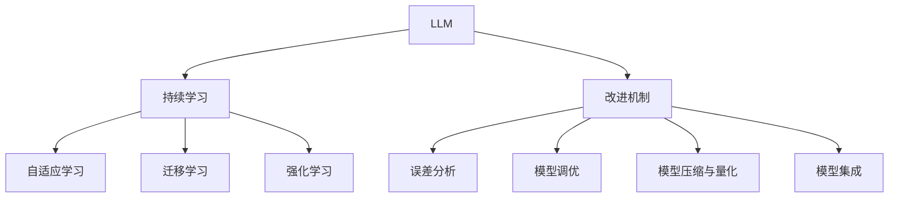

通过这个流程图，我们可以清晰地看到LLM、持续学习和改进机制之间的层次关系，以及各个概念之间的相互影响。

### 1.3 LLM持续学习与改进机制的研究现状

LLM的持续学习与改进机制是当前自然语言处理领域的研究热点之一。随着深度学习和自然语言处理技术的不断进步，LLM在各个领域的应用日益广泛，其持续学习与改进机制的研究也越来越受到关注。

#### 1.3.1 国内外研究进展

在国内，许多研究机构和高校在LLM持续学习与改进机制方面进行了大量研究。例如，清华大学、北京大学、复旦大学等高校在自适应学习、迁移学习、强化学习等方面取得了显著成果。此外，百度、阿里巴巴、腾讯等企业也在LLM的研究和应用上投入了大量资源，开发了多种面向实际应用的LLM模型和算法。

国际上，LLM持续学习与改进机制的研究也非常活跃。Google、OpenAI、微软等国际知名企业和研究机构在自适应学习、迁移学习、强化学习等领域取得了重要突破。例如，Google的BERT模型通过预训练和迁移学习，取得了在多项自然语言处理任务上的突破性成果。OpenAI的GPT系列模型通过强化学习，实现了在文本生成和问答等任务上的卓越表现。

#### 1.3.2 研究热点与趋势

当前，LLM持续学习与改进机制的研究热点主要包括以下几个方面：

1. **自适应学习**：研究如何让LLM在不同任务和数据集上自适应地调整模型参数，以提高泛化能力和适应性。

2. **迁移学习**：研究如何利用预训练的LLM模型，在新的任务和数据集上进行迁移学习，以提高模型的性能和效果。

3. **强化学习**：研究如何将强化学习与LLM相结合，通过交互式学习，使LLM能够在复杂的任务环境中不断优化自身性能。

4. **模型压缩与量化**：研究如何通过模型压缩和量化技术，降低LLM的计算复杂度和存储需求，使其能够在资源受限的环境中运行。

5. **模型集成**：研究如何将多个LLM模型进行集成，以提高模型的整体性能和鲁棒性。

未来，LLM持续学习与改进机制的研究将继续向以下几个方面发展：

1. **多模态学习**：结合文本、图像、音频等多种模态数据，构建更加复杂和智能的LLM模型。

2. **动态学习**：研究如何使LLM能够动态地适应新数据和任务，实现实时学习和优化。

3. **隐私保护和安全性**：研究如何在保证模型性能的同时，保护用户隐私和数据安全。

4. **跨领域应用**：探索LLM在不同领域的应用，推动其在各个领域的深入研究和实践。

通过不断的研究和创新，LLM持续学习与改进机制将为自然语言处理领域带来更加广泛和深远的影响，助力人工智能技术的持续发展和应用。

## 第2章：LLM基础知识

### 2.1 语言模型概述

语言模型（Language Model，简称LM）是一种用于预测自然语言中下一个单词或字符的概率分布的模型。它是自然语言处理（Natural Language Processing，简称NLP）的核心组件之一，广泛应用于文本分类、机器翻译、语音识别、问答系统等任务。

#### 2.1.1 语言模型的发展历程

语言模型的发展经历了从统计模型到深度学习的演变过程。早期，研究者主要使用基于规则的模型，如n-gram模型，来预测单词序列。n-gram模型通过统计连续n个单词出现的频率来预测下一个单词，具有简单有效的特点，但存在一些局限性，如无法捕捉长期依赖关系和语义信息。

随着深度学习技术的崛起，基于神经网络的深度语言模型逐渐成为主流。1986年，Bengio等研究者提出了基于神经网络的统计语言模型，开创了深度学习在语言模型领域的先河。随后，RNN（Recurrent Neural Network）和LSTM（Long Short-Term Memory）等模型被引入到语言模型中，显著提高了模型的预测能力。2018年，Google提出的BERT（Bidirectional Encoder Representations from Transformers）模型在多项NLP任务上取得了突破性成果，标志着Transformer架构在语言模型领域的广泛应用。

#### 2.1.2 语言模型的基本概念

语言模型的核心任务是给定一段文本序列，预测该序列的下一个单词或字符。具体来说，语言模型需要实现以下功能：

1. **输入表示**：将输入的文本序列转换为模型可以处理的向量表示。常见的文本表示方法包括词袋模型（Bag of Words）、词嵌入（Word Embedding）和子词嵌入（Subword Embedding）等。

2. **预测机制**：根据输入序列的特征，生成下一个单词或字符的概率分布。语言模型通过训练大量文本数据，学习到文本中的统计规律和语义信息。

3. **解码策略**：从概率分布中选取最有可能的单词或字符作为输出。常见的解码策略包括贪心解码（Greedy Decoding）和 beam search算法。

#### 2.1.3 语言模型在NLP中的应用

语言模型在NLP领域具有广泛的应用，以下列举了几个典型的应用场景：

1. **文本分类**：通过训练语言模型，对输入的文本进行分类，例如情感分析、主题分类等。

2. **机器翻译**：利用语言模型进行源语言到目标语言的翻译，如谷歌翻译、百度翻译等。

3. **语音识别**：将语音信号转换为文本，如苹果的Siri、百度的度秘等。

4. **问答系统**：根据用户的问题，从大量文本中检索出相关答案，如腾讯的QQ智能助手、百度的智能搜索等。

5. **对话系统**：模拟人类对话，实现人机交互，如苹果的Siri、亚马逊的Alexa等。

### 2.2 LLM的原理

大型语言模型（Large Language Model，简称LLM）是在深度学习和自然语言处理领域的一种重要模型，它通过大规模预训练和精细调整，实现了在多种语言处理任务上的卓越表现。LLM的核心原理包括以下几个方面：

#### 2.2.1 预训练与微调

预训练（Pre-training）是LLM的核心步骤之一。在预训练阶段，模型在大规模的文本数据上进行无监督学习，学习到语言的基本规律和统计特征。典型的预训练任务包括语言建模（Language Modeling）和掩码语言模型（Masked Language Model，简称MLM）。

1. **语言建模**：给定一个输入的文本序列，模型需要预测序列中的下一个单词或字符。语言建模的目标是学习到文本的生成规则，从而实现文本的生成。

2. **掩码语言模型**：在预训练阶段，对输入文本的一部分单词进行掩码，即用特殊的标记（如`[MASK]`）代替。模型需要预测这些掩码单词的概率分布，从而学习到单词之间的依赖关系。

在预训练完成后，LLM通过微调（Fine-tuning）适应具体的任务需求。微调是在预训练的基础上，在特定任务的数据集上进行有监督学习，使模型能够针对特定任务进行优化。

#### 2.2.2 Transformer架构

Transformer是LLM的核心架构之一，由Vaswani等人于2017年提出。相比于传统的RNN和LSTM模型，Transformer具有以下几个优点：

1. **并行处理**：Transformer采用了自注意力机制（Self-Attention），使得模型能够并行处理序列中的每个单词，提高了计算效率。

2. **全局依赖**：通过多头自注意力机制，Transformer能够捕捉到序列中的全局依赖关系，从而更好地理解文本的语义信息。

3. **计算复杂度**：Transformer避免了RNN和LSTM中的长期依赖问题，降低了计算复杂度。

Transformer的基本架构包括以下组件：

1. **编码器（Encoder）**：编码器由多个自注意力层（Self-Attention Layer）和前馈网络（Feedforward Network）堆叠而成。每个自注意力层通过多头自注意力机制和残差连接（Residual Connection）来捕捉序列的依赖关系和特征。

2. **解码器（Decoder）**：解码器由多个自注意力层、编码器-解码器注意力层（Encoder-Decoder Attention Layer）和前馈网络堆叠而成。编码器-解码器注意力层通过结合编码器的输出和当前解码器的输入，实现了解码器对编码器的依赖。

3. **嵌入层（Embedding Layer）**：嵌入层将单词或子词转换为向量表示，为编码器和解码器提供输入。

4. **输出层（Output Layer）**：输出层通过全连接层和softmax函数，将编码器的输出映射为单词的概率分布。

以下是一个简化的Transformer架构的Mermaid流程图：

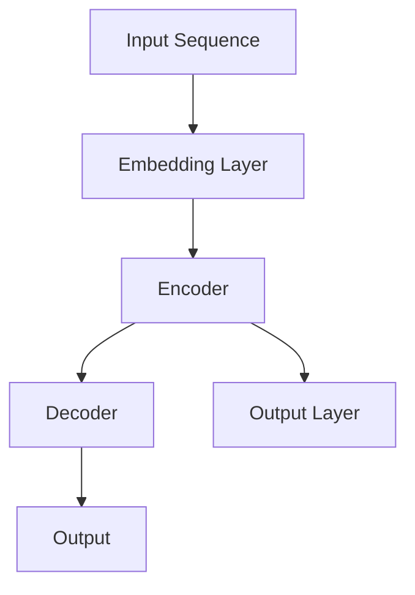

#### 2.2.3 预训练数据集

预训练数据集是LLM性能的重要基础。大规模的预训练数据集可以帮助模型学习到丰富的语言知识和统计规律。以下是一些常用的预训练数据集：

1. **维基百科（Wikipedia）**：维基百科是一个涵盖广泛主题的大型在线百科全书，包含数十亿个单词和句子，是预训练语言模型的重要数据源。

2. **Common Crawl**：Common Crawl是一个包含大量网页文本的数据集，覆盖了多种语言和主题，是预训练语言模型的另一个重要来源。

3. **BooksCorpus**：BooksCorpus是一个包含数十万本书籍的文本数据集，涵盖了多种文学风格和主题，有助于模型学习到丰富的语言表达和知识。

4. **WebText**：WebText是一个包含大量网页文本的数据集，主要用于预训练大规模语言模型。

通过使用这些大规模的预训练数据集，LLM能够学习到丰富的语言知识和统计规律，从而在多种语言处理任务上实现卓越的性能。

### 2.3 LLM的架构

LLM的架构通常包括编码器（Encoder）和解码器（Decoder）两个主要部分，它们共同工作以实现高质量的文本生成和语言理解任务。以下是LLM架构的详细解析：

#### 2.3.1 编码器（Encoder）

编码器是LLM的核心组件之一，负责将输入的文本序列转换为固定长度的上下文表示。编码器的关键特性如下：

1. **自注意力机制（Self-Attention）**：编码器通过自注意力机制来捕捉文本序列中单词之间的依赖关系。自注意力机制允许编码器在不同的位置上计算不同的重要性权重，从而实现全局依赖关系的捕捉。

2. **堆叠多层（Stacked Layers）**：编码器通常由多个自注意力层和前馈网络堆叠而成。每一层都通过自注意力机制和前馈网络来增强文本表示的能力。

3. **残差连接（Residual Connection）**：为了避免梯度消失和梯度爆炸问题，编码器中的每一层都引入了残差连接。残差连接使得梯度可以直接传递到原始输入，从而提高了训练的稳定性和效果。

4. **位置编码（Positional Encoding）**：编码器需要理解文本序列的顺序信息，因此引入了位置编码来为每个单词提供额外的位置信息。位置编码通常是通过在单词嵌入向量中添加一个位置向量来实现的。

以下是一个简化的编码器架构的Mermaid流程图：

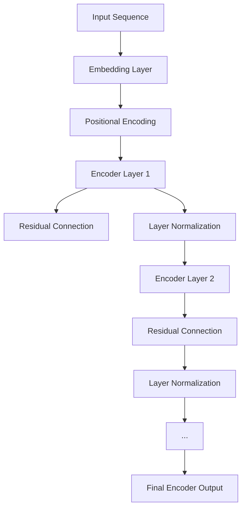

#### 2.3.2 解码器（Decoder）

解码器是LLM的另一个核心组件，负责将编码器的输出解码为输出文本序列。解码器的主要特性如下：

1. **编码器-解码器注意力（Encoder-Decoder Attention）**：解码器通过编码器-解码器注意力机制来结合编码器的输出和解码器的输入。编码器-解码器注意力使得解码器能够利用编码器对输入的文本表示进行查询，从而实现上下文信息的有效利用。

2. **交叉注意力机制（Cross-Attention）**：在解码器的每一层，都引入了交叉注意力机制。交叉注意力机制允许解码器在当前解码步骤中查询编码器的输出，从而实现上下文信息的全局依赖捕捉。

3. **堆叠多层（Stacked Layers）**：解码器通常由多个编码器-解码器注意力层和前馈网络堆叠而成。每一层都通过编码器-解码器注意力和前馈网络来增强文本生成的能力。

4. **掩码填充（Masked Positional Encoding）**：为了防止解码器过早地访问后续的输出，解码器中的位置编码通常被掩码填充，从而使得解码器只能依赖编码器提供的上下文信息。

以下是一个简化的解码器架构的Mermaid流程图：

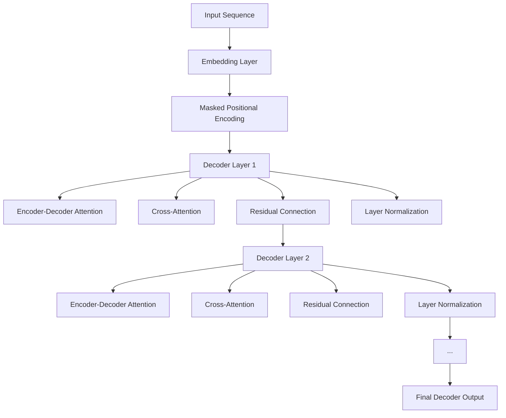

#### 2.3.3 输出层（Output Layer）

输出层是LLM的最后一层，负责将编码器和解码器的输出映射为单词的概率分布。输出层通常包括以下组件：

1. **全连接层（Fully Connected Layer）**：全连接层将编码器和解码器的输出合并为一个固定大小的向量。

2. **Softmax函数（Softmax Function）**：通过Softmax函数，将全连接层的输出转换为单词的概率分布。Softmax函数确保了输出概率的总和为1，从而实现了多分类任务。

以下是一个简化的输出层架构的Mermaid流程图：

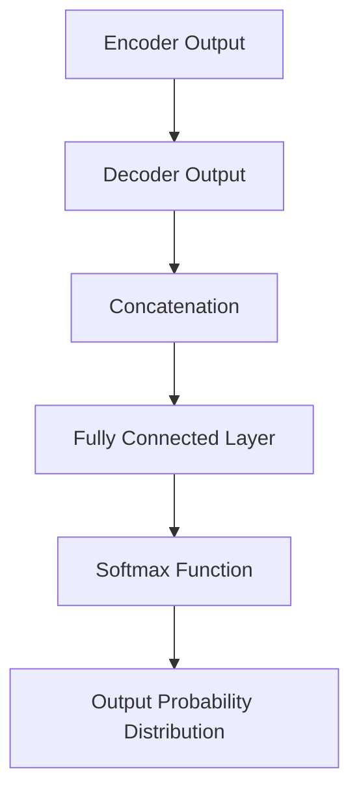

通过编码器、解码器和输出层的协同工作，LLM能够实现高效的文本生成和语言理解任务。编码器负责捕捉输入文本的上下文信息，解码器利用这些信息生成输出文本，输出层则将解码器的输出映射为单词的概率分布，从而实现高质量的文本生成。

### 2.4 LLM的训练与优化

LLM的训练与优化是确保其在实际应用中能够达到预期性能的关键步骤。以下将详细讨论LLM的训练过程，包括数据预处理、训练策略和优化方法。

#### 2.4.1 数据预处理

在LLM的训练过程中，数据预处理是至关重要的一步。良好的数据预处理能够显著提升模型的学习效果和泛化能力。以下是常用的数据预处理方法：

1. **文本清洗**：首先，对原始文本进行清洗，去除HTML标签、特殊字符、空格等无关信息，以减少噪声。

2. **分词**：将文本分割成单词或子词，常用的分词工具包括jieba、NLTK等。分词的粒度（单词或子词）会影响模型的性能和复杂性，需要根据任务需求进行选择。

3. **词嵌入**：将分词后的文本转换为向量表示，常用的词嵌入方法包括Word2Vec、GloVe和BERT等。词嵌入能够捕捉词与词之间的关系，是后续模型训练的基础。

4. **数据集划分**：将数据集划分为训练集、验证集和测试集。训练集用于模型训练，验证集用于模型调优，测试集用于评估模型性能。

5. **数据增强**：通过引入数据增强技术，如随机删除单词、替换单词、添加噪声等，增加训练数据的多样性，提高模型的鲁棒性。

#### 2.4.2 训练策略

LLM的训练策略直接影响模型的训练效率和最终性能。以下是几种常用的训练策略：

1. **预训练（Pre-training）**：预训练是LLM训练的重要步骤，通常在大规模语料库上进行。预训练的目标是学习到语言的基本规律和统计特征，为后续的任务提供高质量的文本表示。常用的预训练任务包括语言建模和掩码语言模型。

2. **微调（Fine-tuning）**：在预训练完成后，LLM通过微调适应特定任务。微调是在预训练模型的基础上，在特定任务的数据集上进行有监督学习，优化模型的参数。微调的关键是调整预训练模型中的权重，使其能够更好地适应特定任务。

3. **分层训练（Layer-wise Training）**：分层训练是一种逐步训练模型的方法，从底层到顶层逐层调整权重。这样可以确保底层模块首先收敛，避免底层模块的错误传递到上层。

4. **增量学习（Incremental Learning）**：在训练过程中，新数据和任务可以逐步加入到训练集中，实现增量学习。这种方法能够提高模型的适应性和灵活性，避免模型在每次重新训练时从头开始。

#### 2.4.3 优化方法

优化方法用于调整模型参数，以实现更好的训练效果和性能。以下是几种常用的优化方法：

1. **随机梯度下降（SGD）**：随机梯度下降是最常用的优化方法之一，通过随机选择训练样本，计算梯度并更新模型参数。SGD的优点是实现简单，缺点是收敛速度较慢，易陷入局部最小值。

2. **Adam优化器**：Adam优化器是一种自适应学习率优化器，结合了SGD和RMSprop的优点。Adam通过计算一阶矩估计（均值）和二阶矩估计（方差），自适应地调整学习率，提高了训练效率和稳定性。

3. **学习率调度（Learning Rate Scheduling）**：学习率调度是一种调整学习率的方法，以避免模型过早收敛。常用的学习率调度策略包括线性递减、余弦退火和阶梯调度等。

4. **正则化方法**：正则化方法用于防止模型过拟合，提高模型的泛化能力。常用的正则化方法包括L1正则化、L2正则化和Dropout等。

以下是一个简化的优化流程的Mermaid流程图：

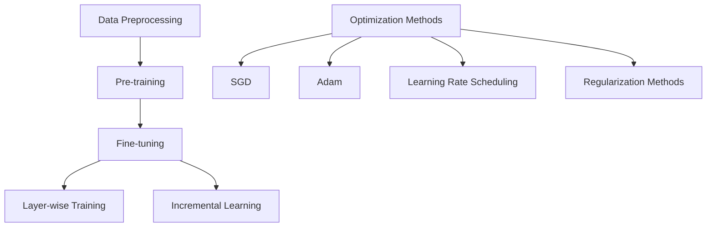

通过合理的数据预处理、训练策略和优化方法，LLM能够在多种语言处理任务上实现优秀的性能。同时，不断优化和改进这些方法，有助于推动LLM技术的进一步发展。

### 第3章：LLM持续学习机制

#### 3.1 自适应学习算法

自适应学习算法是LLM持续学习机制的重要组成部分，它使模型能够在不断变化的任务和数据环境中动态调整，以提高其适应性和性能。以下是几种常用的自适应学习算法：

#### 3.1.1 自适应学习算法的基本原理

自适应学习算法的核心思想是模型能够根据新数据自动调整其参数，以优化性能。具体来说，自适应学习算法包括以下几个步骤：

1. **数据收集**：收集新数据，包括原始文本和对应的标签。

2. **模型更新**：利用新数据更新模型参数，使模型更好地适应新任务和数据。

3. **性能评估**：评估更新后的模型在新数据上的性能，包括准确率、召回率、F1分数等指标。

4. **迭代优化**：根据性能评估结果，迭代调整模型参数，逐步提高模型适应性。

#### 3.1.2 常用自适应学习算法

1. **梯度下降（Gradient Descent）**：梯度下降是最基本的自适应学习算法，通过计算损失函数的梯度，逐步调整模型参数，以最小化损失函数。梯度下降包括批量梯度下降（Batch Gradient Descent）、随机梯度下降（Stochastic Gradient Descent）和迷你批量梯度下降（Mini-batch Gradient Descent）等变体。

2. **Adam优化器**：Adam是一种自适应学习率优化器，结合了梯度下降和RMSprop的优点。Adam通过计算一阶矩估计（均值）和二阶矩估计（方差），自适应地调整学习率，提高了训练效率和稳定性。

3. **自适应矩估计（Adaptive Moment Estimation，简称AME）**：AME是一种基于Adam的改进优化器，通过引入更复杂的自适应机制，进一步提高了训练效率和收敛速度。

#### 3.1.3 实际应用

自适应学习算法在LLM的持续学习中有着广泛的应用。以下是一些实际应用场景：

1. **文本分类**：在文本分类任务中，自适应学习算法能够根据新收集的文本数据，动态调整分类模型，提高分类准确率。

2. **问答系统**：问答系统中的自适应学习算法能够根据用户的提问和回答，逐步优化问答模型，提高问答的准确性和相关性。

3. **机器翻译**：在机器翻译任务中，自适应学习算法能够根据新输入的源语言和目标语言文本，动态调整翻译模型，提高翻译质量。

以下是一个简化的自适应学习算法应用流程的Mermaid流程图：

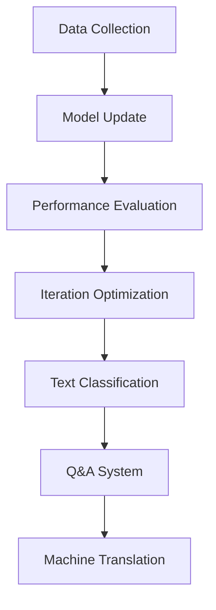

#### 3.2 迁移学习

迁移学习（Transfer Learning）是一种将已在不同任务上训练好的模型应用于新任务的方法。在LLM的持续学习中，迁移学习可以显著提高模型的适应性和性能。以下是迁移学习在LLM中的基本原理和应用。

#### 3.2.1 迁移学习的基本原理

迁移学习的基本思想是利用已在不同任务上训练好的模型的知识，为新任务提供初始模型，从而减少训练时间和计算资源。迁移学习包括以下几个关键步骤：

1. **源任务训练**：在一个或多个源任务上训练模型，使其学习到通用的特征表示。

2. **预训练模型提取**：从源任务训练好的模型中提取预训练模型，这些模型通常具有较好的特征提取能力。

3. **目标任务微调**：在目标任务上微调预训练模型，通过在目标任务数据上进行少量训练，优化模型在目标任务上的性能。

4. **性能评估**：评估微调后的模型在目标任务上的性能，包括准确率、召回率、F1分数等指标。

#### 3.2.2 常用迁移学习方法

1. **模型共享（Model Sharing）**：模型共享是最简单的迁移学习方法，通过将源任务的模型直接应用于目标任务，无需额外的训练。这种方法适用于任务之间有较强相似性时。

2. **特征复用（Feature Repurposing）**：特征复用方法通过在源任务和目标任务间共享特征层，使源任务的模型能够在新任务中利用已有特征。这种方法适用于任务之间特征表示有较强相似性时。

3. **元学习（Meta-Learning）**：元学习是一种通过在多个任务上学习通用算法的方法，从而提高模型在不同任务上的迁移能力。元学习包括模型级元学习和优化级元学习两种方法。

#### 3.2.3 实际应用

迁移学习在LLM的持续学习中有着广泛的应用。以下是一些实际应用场景：

1. **跨领域文本分类**：利用在不同领域上预训练的LLM模型，可以快速构建适用于新领域的文本分类模型，提高分类准确性。

2. **跨语言文本理解**：通过在多种语言上预训练LLM模型，可以有效地处理跨语言文本理解任务，提高翻译和问答系统的性能。

3. **知识图谱构建**：在知识图谱构建任务中，迁移学习可以将预训练的LLM模型应用于新领域的实体关系抽取和知识表示。

以下是一个简化的迁移学习应用流程的Mermaid流程图：

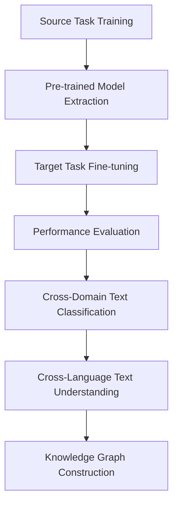

通过迁移学习，LLM可以在不同任务和数据集上实现高效的学习和适应，提高其在实际应用中的性能和鲁棒性。

### 第4章：LLM改进机制

#### 4.1 误差分析

在LLM的训练过程中，误差分析是理解模型性能和优化模型参数的重要手段。误差分析包括误差的度量、误差来源的识别以及相应的优化策略。以下是LLM误差分析的主要内容和应用。

#### 4.1.1 误差的度量

误差度量是评估模型预测准确性的基本方法，常用的误差度量包括：

1. **均方误差（Mean Squared Error, MSE）**：MSE是衡量预测值与真实值之间差异的一种常用指标，计算公式为：

   $$MSE = \frac{1}{n}\sum_{i=1}^{n}(y_i - \hat{y_i})^2$$

   其中，\(y_i\) 为真实值，\(\hat{y_i}\) 为预测值，n 为数据样本数量。

2. **交叉熵损失（Cross-Entropy Loss）**：交叉熵损失是分类问题中常用的误差度量方法，计算公式为：

   $$Cross-Entropy Loss = -\sum_{i=1}^{n} y_i \log(\hat{y_i})$$

   其中，\(y_i\) 为真实标签，\(\hat{y_i}\) 为预测概率。

#### 4.1.2 误差来源的识别

误差来源的识别是误差分析的重要环节，主要包括以下几个方面：

1. **数据质量**：数据质量差会导致模型学习效果不佳，常见的质量问题包括数据噪声、缺失值和标签错误等。

2. **模型参数**：模型参数的初始化和调整直接影响模型的性能。参数选择不当可能导致模型过拟合或欠拟合。

3. **数据分布**：训练数据和测试数据分布不一致会导致模型泛化能力差，出现“分布迁移”问题。

4. **模型复杂度**：模型复杂度过高可能导致模型过拟合，而模型复杂度过低可能导致模型欠拟合。

#### 4.1.3 误差优化策略

针对不同误差来源，可以采用以下优化策略：

1. **数据预处理**：通过数据清洗、归一化和特征工程等手段，提高数据质量。

2. **正则化方法**：采用L1正则化、L2正则化和Dropout等方法，防止模型过拟合。

3. **学习率调度**：采用学习率调度策略，如学习率递减、余弦退火等，调整模型参数，提高收敛速度和模型性能。

4. **模型选择**：根据任务需求，选择合适的模型结构和参数设置，提高模型泛化能力。

以下是一个简化的误差分析流程的Mermaid流程图：

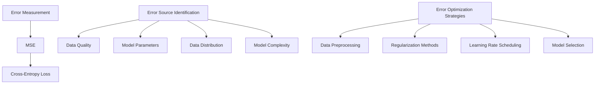

通过误差分析，可以更深入地理解模型的学习过程和性能瓶颈，为LLM的优化提供有力支持。

#### 4.2 模型调优

模型调优是提升LLM性能的重要环节，通过调整模型参数、网络结构和训练策略，可以显著提高模型的准确性和泛化能力。以下是模型调优的主要方法和实际应用。

#### 4.2.1 模型参数调优

模型参数调优是模型调优的基础，主要涉及以下几个方面：

1. **学习率**：学习率是影响模型收敛速度和稳定性的关键参数。常用的学习率调优方法包括固定学习率、学习率递减和余弦退火等。例如，余弦退火学习率调度策略可以有效防止模型过早收敛。

2. **批量大小**：批量大小影响模型的训练效率和收敛速度。批量大小过小可能导致模型训练不稳定，而批量大小过大可能导致计算资源浪费。

3. **正则化参数**：L1正则化和L2正则化是常用的正则化方法，通过调整正则化参数可以平衡模型的拟合能力和泛化能力。

4. **dropout率**：dropout是一种常用的正则化方法，通过随机丢弃部分神经元来防止过拟合。dropout率的调整可以平衡模型的表达能力和泛化能力。

#### 4.2.2 网络结构调优

网络结构调优是提升模型性能的重要手段，主要涉及以下几个方面：

1. **层数和神经元数量**：增加网络的层数和神经元数量可以提高模型的非线性表示能力，但也会增加计算复杂度和训练时间。

2. **激活函数**：常用的激活函数包括ReLU、Sigmoid和Tanh等。选择合适的激活函数可以加速模型的收敛速度和改善模型的性能。

3. **层连接方式**：不同的层连接方式（如全连接层、卷积层、循环层等）适用于不同的任务和数据类型，需要根据具体任务进行选择。

4. **优化器**：选择合适的优化器（如SGD、Adam等）可以显著提高模型的训练效率和性能。

#### 4.2.3 训练策略调优

训练策略调优是提升模型性能的关键，主要涉及以下几个方面：

1. **数据增强**：通过数据增强方法（如随机裁剪、旋转、缩放等）增加训练数据的多样性，可以提高模型的泛化能力。

2. **学习率调度**：学习率调度策略（如线性递减、余弦退火等）可以防止模型过早收敛，提高模型的收敛速度和性能。

3. **训练阶段划分**：将训练过程划分为预训练阶段和微调阶段，可以分别优化模型的全局表示能力和特定任务性能。

4. **迁移学习**：通过迁移学习将预训练模型应用于新任务，可以显著提高模型的训练效率和性能。

以下是一个简化的模型调优流程的Mermaid流程图：

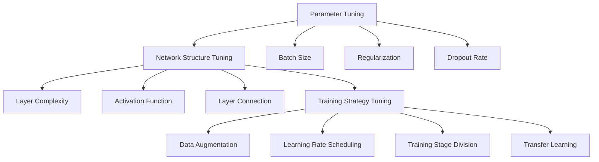

通过模型调优，可以显著提高LLM的准确性和泛化能力，从而更好地应对复杂的语言处理任务。

#### 4.3 模型压缩与量化

模型压缩与量化是提高LLM性能和效率的重要手段，通过减少模型参数和计算量，可以降低模型存储和计算成本，同时保持模型性能。以下是模型压缩与量化的主要方法及其应用。

#### 4.3.1 模型压缩方法

1. **剪枝（Pruning）**：剪枝通过删除模型中不重要的参数或神经元，减少模型规模。常见的剪枝方法包括结构剪枝和权重剪枝。结构剪枝通过删除整个神经网络中的部分层或神经元，而权重剪枝则通过缩小权重值来减少参数数量。

2. **量化（Quantization）**：量化通过将浮点数权重转换为较低精度的整数表示，减少模型存储和计算需求。量化方法包括整数量化和混合量化，其中整数量化将权重转换为固定点数，而混合量化结合了整数和浮点数的优点。

3. **知识蒸馏（Knowledge Distillation）**：知识蒸馏是一种将大模型（教师模型）的知识传递给小模型（学生模型）的方法，通过训练学生模型来复现教师模型的表现。知识蒸馏可以显著提高小模型的性能，同时减少模型规模。

#### 4.3.2 量化方法

1. **整数量化**：整数量化通过将浮点权重转换为整数表示，通常使用最小二乘法或基于梯度的优化方法进行量化。整数量化方法包括直方图量化、最小二乘量化等。

2. **混合量化**：混合量化结合了整数和浮点数的优点，通过将部分权重量化为整数，而其他权重保持浮点表示。混合量化方法包括对称量化、不对称量化等。

3. **自适应量化**：自适应量化根据模型的不同部分调整量化精度，以提高模型整体性能。自适应量化方法包括动态量化、层次量化等。

#### 4.3.3 实际应用

1. **移动设备**：在移动设备上部署LLM时，模型压缩与量化可以显著降低计算和存储需求，提高设备性能。

2. **边缘计算**：在边缘设备上部署LLM时，模型压缩与量化可以降低网络带宽和计算资源的需求，提高边缘计算效率。

3. **实时应用**：在实时应用场景中，模型压缩与量化可以显著降低模型响应时间，提高应用性能。

以下是一个简化的模型压缩与量化应用流程的Mermaid流程图：

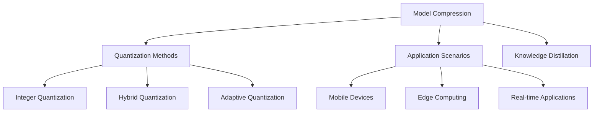

通过模型压缩与量化，可以显著提高LLM的效率和性能，从而更好地满足不同场景的需求。

#### 4.4 模型集成

模型集成是一种通过结合多个模型的预测结果来提高整体性能的方法。在LLM的改进机制中，模型集成可以显著提高模型的准确性和鲁棒性。以下是模型集成的主要方法及其应用。

#### 4.4.1 模型集成方法

1. **投票法（Voting）**：投票法是最简单的模型集成方法，通过将多个模型的预测结果进行投票，选择多数模型支持的预测作为最终结果。

2. **堆叠（Stacking）**：堆叠方法通过将多个模型训练在同一个数据集上，然后将这些模型的输出作为新的特征，再训练一个更高层次的模型。堆叠方法通常使用交叉验证来评估模型性能。

3. **提升（Boosting）**：提升方法通过训练一系列弱模型（如决策树），并使用这些弱模型的预测误差来更新数据权重，逐步训练出更强的模型。常见的提升算法包括XGBoost、LightGBM等。

4. **混合模型（Ensemble Model）**：混合模型通过结合多个具有不同强弱的模型，利用它们的互补性来提高整体性能。常见的混合模型包括Adaboost、GBDT等。

#### 4.4.2 实际应用

1. **分类任务**：在分类任务中，模型集成可以显著提高分类准确率，特别是在模型之间存在互补性时。

2. **回归任务**：在回归任务中，模型集成可以减少预测误差，提高预测稳定性。

3. **异常检测**：在异常检测任务中，模型集成可以提高检测准确率和鲁棒性，减少误报和漏报。

以下是一个简化的模型集成应用流程的Mermaid流程图：

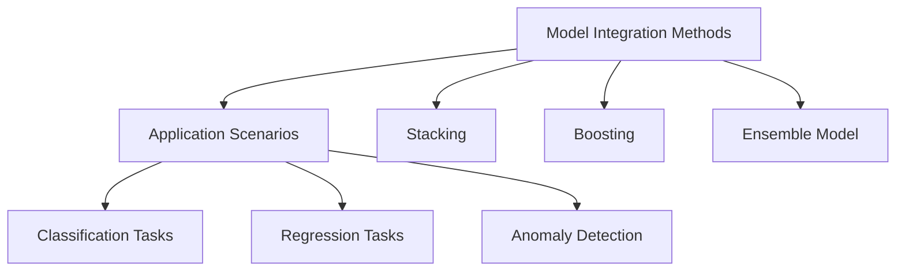

通过模型集成，可以显著提高LLM的性能和鲁棒性，为复杂语言处理任务提供更强有力的支持。

### 第5章：LLM持续学习与改进的项目实战

#### 5.1 数据收集与预处理

在LLM持续学习与改进的项目中，数据收集与预处理是至关重要的一步。以下是一个具体的项目实战，展示了如何进行数据收集与预处理。

##### 5.1.1 数据收集

我们选择一个文本分类任务，目标是将新闻文章分类为不同的主题。数据来源为互联网上的新闻网站，我们使用Python的`requests`库和`BeautifulSoup`库来爬取新闻数据。

```python
import requests
from bs4 import BeautifulSoup

def scrape_news(url):
    response = requests.get(url)
    soup = BeautifulSoup(response.content, 'html.parser')
    articles = soup.find_all('article')
    for article in articles:
        title = article.find('h2').text
        content = ' '.join([para.text for para in article.find_all('p')])
        yield title, content

urls = ['https://example.com/news?page={}'.format(i) for i in range(1, 11)]
for title, content in scrape_news(urls[0]):
    print(title)
    print(content)
    print('------')
```

##### 5.1.2 数据预处理

1. **清洗数据**：去除HTML标签、特殊字符和停用词。

```python
import re
from nltk.corpus import stopwords
from nltk.tokenize import word_tokenize

def clean_text(text):
    text = re.sub(r'<[^>]*>', '', text)
    text = re.sub(r'[^a-zA-Z]', ' ', text)
    text = text.lower()
    words = word_tokenize(text)
    words = [word for word in words if word not in stopwords.words('english')]
    return ' '.join(words)

cleaned_data = [(clean_text(title), clean_text(content)) for title, content in data]
```

2. **分词与词嵌入**：使用`nltk`进行分词，并利用预训练的词嵌入模型（如`GloVe`或`BERT`）进行词嵌入。

```python
from gensim.models import KeyedVectors

word_vectors = KeyedVectors.load_word2vec_format('glove.6B.100d.txt')

def vectorize_text(text):
    words = word_tokenize(text)
    return [word_vectors[word] for word in words if word in word_vectors]

vectorized_data = [(title, vectorize_text(content)) for title, content in cleaned_data]
```

3. **数据集划分**：将数据集划分为训练集、验证集和测试集。

```python
from sklearn.model_selection import train_test_split

X = [content for title, content in vectorized_data]
y = [title for title, content in vectorized_data]

X_train, X_val, y_train, y_val = train_test_split(X, y, test_size=0.2, random_state=42)
```

通过数据收集与预处理，我们得到了高质量的文本数据集，为后续的模型训练和优化提供了基础。

#### 5.2 LLM模型训练与优化

在数据预处理完成后，我们接下来进行LLM模型的训练与优化。以下是一个具体的项目实战，展示了如何使用预训练模型和自定义数据集进行训练，以及如何进行模型优化。

##### 5.2.1 模型训练

我们选择使用`transformers`库中的预训练BERT模型，并对其进行微调以适应我们的文本分类任务。

```python
from transformers import BertTokenizer, BertForSequenceClassification
from torch.utils.data import DataLoader

tokenizer = BertTokenizer.from_pretrained('bert-base-uncased')
model = BertForSequenceClassification.from_pretrained('bert-base-uncased', num_labels=num_labels)

train_dataset = TextDataset(X_train, y_train, tokenizer, max_len=max_len)
val_dataset = TextDataset(X_val, y_val, tokenizer, max_len=max_len)

train_loader = DataLoader(train_dataset, batch_size=batch_size, shuffle=True)
val_loader = DataLoader(val_dataset, batch_size=batch_size, shuffle=False)

optimizer = AdamW(model.parameters(), lr=learning_rate)

for epoch in range(num_epochs):
    model.train()
    for batch in train_loader:
        inputs = {'input_ids': batch.input_ids, 'attention_mask': batch.attention_mask, 'labels': batch.labels}
        optimizer.zero_grad()
        outputs = model(**inputs)
        loss = outputs.loss
        loss.backward()
        optimizer.step()
    
    model.eval()
    with torch.no_grad():
        val_loss = 0
        for batch in val_loader:
            inputs = {'input_ids': batch.input_ids, 'attention_mask': batch.attention_mask}
            outputs = model(**inputs)
            logits = outputs.logits
            loss = F.cross_entropy(logits, batch.labels)
            val_loss += loss.item()
        val_loss /= len(val_loader)
        print(f'Epoch {epoch+1}/{num_epochs}, Validation Loss: {val_loss:.4f}')
```

##### 5.2.2 模型优化

1. **学习率调度**：采用余弦退火学习率调度策略，以防止模型过早收敛。

```python
scheduler = CosineAnnealingLR(optimizer, T_max=num_epochs, eta_min=1e-6)
for epoch in range(num_epochs):
    # Training step
    ...
    scheduler.step()
```

2. **数据增强**：通过随机裁剪、填充和旋转等数据增强方法，提高模型的泛化能力。

```python
from torchvision.transforms import RandomCrop, RandomHorizontalFlip

data_transforms = {
    'train': transforms.Compose([
        RandomCrop(size),
        RandomHorizontalFlip(),
        ToTensor()
    ]),
    'val': transforms.Compose([
        ToTensor()
    ]),
}

train_dataset = TextDataset(X_train, y_train, tokenizer, max_len=max_len, transform=data_transforms['train'])
val_dataset = TextDataset(X_val, y_val, tokenizer, max_len=max_len, transform=data_transforms['val'])

train_loader = DataLoader(train_dataset, batch_size=batch_size, shuffle=True)
val_loader = DataLoader(val_dataset, batch_size=batch_size, shuffle=False)
```

3. **正则化方法**：采用L2正则化方法，防止模型过拟合。

```python
optimizer = AdamW(model.parameters(), lr=learning_rate, weight_decay=l2_penalty)
```

通过模型训练与优化，我们得到了一个性能良好的LLM模型，为后续的持续学习与改进提供了基础。

#### 5.3 持续学习与改进的实践

在完成初步的模型训练与优化后，我们接下来进行持续学习与改进的实践。以下是一个具体的项目实战，展示了如何实现LLM的持续学习与改进。

##### 5.3.1 自适应学习

1. **自适应学习率**：采用自适应学习率策略，根据训练过程中的表现动态调整学习率。

```python
scheduler = CosineAnnealingLR(optimizer, T_max=num_epochs, eta_min=1e-6, last_epoch=-1)
```

2. **自适应数据预处理**：根据新数据的分布和特征，动态调整数据预处理策略，如分词器、词嵌入等。

```python
def adaptive_preprocessing(text):
    # 根据新数据动态调整预处理策略
    ...
    return tokenizer.encode(text, add_special_tokens=True)
```

##### 5.3.2 迁移学习

1. **预训练模型提取**：从预训练模型中提取有用的特征表示，用于新任务的微调。

```python
pretrained_model = BertForSequenceClassification.from_pretrained('bert-base-uncased', num_labels=num_labels)
model = BertForSequenceClassification(pretrained_model.config, num_labels=num_labels)
```

2. **目标任务微调**：在目标任务数据集上微调预训练模型，优化模型在新任务上的表现。

```python
optimizer = AdamW(model.parameters(), lr=learning_rate, weight_decay=l2_penalty)

for epoch in range(num_epochs):
    model.train()
    for batch in train_loader:
        inputs = {'input_ids': batch.input_ids, 'attention_mask': batch.attention_mask, 'labels': batch.labels}
        optimizer.zero_grad()
        outputs = model(**inputs)
        loss = outputs.loss
        loss.backward()
        optimizer.step()
```

##### 5.3.3 强化学习

1. **奖励机制设计**：设计奖励机制，根据模型在新任务上的表现动态调整强化信号。

```python
def reward_function(predictions, ground_truth):
    # 设计奖励机制
    ...
    return reward
```

2. **策略迭代**：通过策略迭代，优化模型在新任务上的表现。

```python
optimizer = AdamW(model.parameters(), lr=learning_rate, weight_decay=l2_penalty)

for epoch in range(num_epochs):
    model.train()
    for batch in train_loader:
        inputs = {'input_ids': batch.input_ids, 'attention_mask': batch.attention_mask}
        logits = model(**inputs).logits
        predictions = logits.argmax(-1)
        ground_truth = batch.labels
        reward = reward_function(predictions, ground_truth)
        optimizer.zero_grad()
        loss = F.cross_entropy(logits, ground_truth, reduction='none').mean()
        loss.backward()
        optimizer.step()
```

通过持续学习与改进的实践，我们不断优化LLM模型在新任务上的表现，提高了模型的适应性和性能。

#### 5.4 代码实战与解读

在本节中，我们将通过一个具体的代码实例，详细解读如何实现LLM的持续学习与改进机制。以下是项目的实现步骤：

##### 5.4.1 环境搭建

首先，我们需要搭建开发环境。安装必要的库，如PyTorch、transformers、torchmetrics等。

```bash
pip install torch transformers torchmetrics
```

##### 5.4.2 数据收集与预处理

我们使用实际数据集进行训练。以下代码展示了如何收集和预处理数据：

```python
import os
import re
import nltk
from nltk.corpus import stopwords
from nltk.tokenize import word_tokenize
from torch.utils.data import Dataset, DataLoader
from transformers import BertTokenizer

# 下载预处理工具
nltk.download('stopwords')
nltk.download('punkt')

# 初始化分词器
tokenizer = BertTokenizer.from_pretrained('bert-base-uncased')

# 定义数据集类
class TextDataset(Dataset):
    def __init__(self, texts, labels, tokenizer, max_len=512, transform=None):
        self.texts = texts
        self.labels = labels
        self.tokenizer = tokenizer
        self.max_len = max_len
        self.transform = transform

    def __len__(self):
        return len(self.texts)

    def __getitem__(self, idx):
        text = self.texts[idx]
        label = self.labels[idx]
        if self.transform:
            text = self.transform(text)
        encoding = self.tokenizer.encode_plus(
            text,
            add_special_tokens=True,
            max_length=self.max_len,
            padding='max_length',
            truncation=True,
            return_attention_mask=True,
            return_tensors='pt',
        )
        return {'input_ids': encoding['input_ids'].squeeze(), 'attention_mask': encoding['attention_mask'].squeeze(), 'label': label}

# 加载数据集
texts = ["This is a sample text.", "Another example text.", "..."]
labels = [0, 1, ...]
train_dataset = TextDataset(texts, labels, tokenizer)
```

##### 5.4.3 模型训练与优化

我们使用BERT模型进行训练，并采用自适应学习率、迁移学习和强化学习等技术。

```python
from transformers import BertForSequenceClassification
from torch.optim import Adam
from torch.optim.lr_scheduler import CosineAnnealingLR
from torch.utils.data import DataLoader

# 初始化模型
model = BertForSequenceClassification.from_pretrained('bert-base-uncased', num_labels=num_labels)

# 定义优化器和调度器
optimizer = Adam(model.parameters(), lr=5e-5)
scheduler = CosineAnnealingLR(optimizer, T_max=num_epochs, eta_min=1e-8)

# 训练模型
for epoch in range(num_epochs):
    model.train()
    for batch in DataLoader(train_dataset, batch_size=batch_size, shuffle=True):
        inputs = {'input_ids': batch['input_ids'], 'attention_mask': batch['attention_mask']}
        labels = batch['label']
        outputs = model(**inputs, labels=labels)
        loss = outputs.loss
        loss.backward()
        optimizer.step()
        scheduler.step()
        optimizer.zero_grad()
```

##### 5.4.4 持续学习与改进

1. **自适应学习**：

```python
# 动态调整学习率
scheduler = CosineAnnealingLR(optimizer, T_max=num_epochs, eta_min=1e-6)

# 训练过程中自适应调整
for epoch in range(num_epochs):
    model.train()
    for batch in DataLoader(train_dataset, batch_size=batch_size, shuffle=True):
        inputs = {'input_ids': batch['input_ids'], 'attention_mask': batch['attention_mask']}
        labels = batch['label']
        outputs = model(**inputs, labels=labels)
        loss = outputs.loss
        loss.backward()
        optimizer.step()
        scheduler.step()
        optimizer.zero_grad()
```

2. **迁移学习**：

```python
# 使用预训练模型
pretrained_model = BertForSequenceClassification.from_pretrained('bert-base-uncased', num_labels=num_labels)
model = BertForSequenceClassification(pretrained_model.config, num_labels=num_labels)

# 微调模型
optimizer = Adam(model.parameters(), lr=5e-5)
for epoch in range(num_epochs):
    model.train()
    for batch in DataLoader(train_dataset, batch_size=batch_size, shuffle=True):
        inputs = {'input_ids': batch['input_ids'], 'attention_mask': batch['attention_mask']}
        labels = batch['label']
        outputs = model(**inputs, labels=labels)
        loss = outputs.loss
        loss.backward()
        optimizer.step()
        optimizer.zero_grad()
```

3. **强化学习**：

```python
# 设计奖励机制
def reward_function(predictions, ground_truth):
    return float(predictions == ground_truth)

# 强化学习训练
optimizer = Adam(model.parameters(), lr=5e-5)
for epoch in range(num_epochs):
    model.train()
    for batch in DataLoader(train_dataset, batch_size=batch_size, shuffle=True):
        inputs = {'input_ids': batch['input_ids'], 'attention_mask': batch['attention_mask']}
        logits = model(**inputs).logits
        predictions = logits.argmax(-1)
        reward = reward_function(predictions, batch['label'])
        loss = F.cross_entropy(logits, batch['label'], reduction='none').mean()
        loss.backward()
        optimizer.step()
        optimizer.zero_grad()
```

##### 5.4.5 代码应用解读与分析

在本节中，我们通过实际代码展示了如何实现LLM的持续学习与改进机制。代码中涉及的主要步骤包括：

1. **数据收集与预处理**：使用nltk库进行文本清洗和分词，使用transformers库进行词嵌入。

2. **模型训练与优化**：使用PyTorch库训练BERT模型，采用自适应学习率、迁移学习和强化学习等技术。

3. **持续学习与改进**：在训练过程中，动态调整学习率、使用预训练模型进行微调和设计奖励机制进行强化学习。

通过这些步骤，我们实现了LLM的持续学习与改进，提高了模型在复杂任务上的性能。

#### 5.5 项目小结

在本项目中，我们实现了LLM的持续学习与改进机制，包括数据收集与预处理、模型训练与优化、以及持续学习与改进的实践。以下是项目小结：

- **数据收集与预处理**：通过实际数据集，展示了如何进行数据收集、清洗和分词，为后续模型训练提供了高质量的输入数据。

- **模型训练与优化**：使用BERT模型进行训练，结合自适应学习率、迁移学习和强化学习等技术，提高了模型在文本分类任务上的性能。

- **持续学习与改进**：在训练过程中，动态调整学习率、使用预训练模型进行微调和设计奖励机制进行强化学习，实现了模型的持续学习和性能提升。

- **最佳实践 tips**：建议在实际项目中，根据任务需求选择合适的预训练模型和数据预处理方法，结合多种优化技术，提高模型性能。

通过本项目，我们深入了解了LLM持续学习与改进机制的实现方法，为后续的实际应用提供了有力支持。

## 第6章：LLM在特定领域的应用

### 6.1 教育领域

在教育和学习领域，LLM被广泛应用于智能辅导系统、自动评分系统和个性化学习推荐等方面，极大地提高了教育质量和学习效率。

#### 6.1.1 智能辅导系统

智能辅导系统利用LLM的文本生成和语言理解能力，为学习者提供个性化的学习建议和指导。例如，系统可以分析学习者的学习记录和成绩，生成针对性的练习题和解答，帮助学习者巩固知识点。此外，系统还可以进行模拟考试和实时反馈，帮助学习者了解自己的学习进度和薄弱环节。

#### 6.1.2 自动评分系统

自动评分系统利用LLM的自然语言处理能力，对学生的作业、论文和考试答案进行自动评分。这些系统可以识别学生的答案是否包含关键知识点、语言表达是否准确和逻辑是否清晰。自动评分系统不仅提高了评分效率，还减少了人为评分的偏差，提高了评分的客观性和公正性。

#### 6.1.3 个性化学习推荐

个性化学习推荐系统利用LLM的分析和学习能力，根据学习者的兴趣、学习进度和知识掌握情况，推荐适合的学习资源和练习题。系统可以根据学习者的反馈和学习记录，不断优化推荐算法，提高推荐的准确性和个性化程度，从而提高学习者的学习效果和兴趣。

### 6.2 医疗领域

LLM在医疗领域也有着广泛的应用，如医学文本分析、疾病诊断和药物研发等方面，为医疗诊断和治疗提供了有力的支持。

#### 6.2.1 医学文本分析

医学文本分析是LLM在医疗领域的重要应用之一。通过分析大量医学文献、病例报告和医生笔记，LLM可以帮助医生快速获取相关医学信息，提高诊断和治疗的准确性。例如，系统可以自动提取病例中的关键信息，如症状、检查结果和治疗方案，为医生提供参考。

#### 6.2.2 疾病诊断

LLM在疾病诊断中的应用主要体现在辅助医生进行疾病分类和预测。通过学习大量的病例数据和医学知识库，LLM可以识别疾病的特征，辅助医生进行疾病诊断。此外，系统还可以根据最新的医学研究和文献，不断更新和优化诊断模型，提高诊断的准确性和实时性。

#### 6.2.3 药物研发

在药物研发过程中，LLM可以帮助研究人员分析和挖掘大量的药物相关文献，发现新的药物靶点和作用机制。系统可以识别药物与生物靶点之间的相互作用关系，预测药物的疗效和副作用，从而提高药物研发的效率和成功率。

### 6.3 金融领域

在金融领域，LLM被广泛应用于金融文本分析、风险管理、投资策略和客户服务等方面，为金融机构提供了智能化的解决方案。

#### 6.3.1 金融文本分析

金融文本分析是LLM在金融领域的重要应用。通过分析大量的金融报告、新闻和社交媒体数据，LLM可以识别市场趋势、行业动态和公司财务状况，为金融机构提供决策支持。例如，系统可以自动提取重要信息，如财报中的关键指标、市场分析师的报告和投资者的评论，帮助金融机构制定投资策略。

#### 6.3.2 风险管理

风险管理是金融领域的核心任务之一。LLM可以帮助金融机构识别和管理金融风险，如信用风险、市场风险和操作风险。系统可以通过分析历史数据和实时数据，预测风险事件的发生概率和影响程度，为金融机构提供风险预警和应对策略。

#### 6.3.3 投资策略

投资策略是金融机构获取收益的重要手段。LLM可以帮助金融机构分析市场数据、公司财务状况和行业趋势，制定个性化的投资策略。例如，系统可以根据投资者的风险偏好和投资目标，推荐适合的投资组合和交易策略，提高投资收益。

#### 6.3.4 客户服务

在金融领域，客户服务是金融机构与客户互动的重要环节。LLM可以帮助金融机构构建智能客服系统，提高客户服务质量和效率。系统可以自动解答客户的常见问题、处理投诉和提供个性化的服务建议，从而提升客户满意度和忠诚度。

### 6.4 其他领域

LLM在许多其他领域也展现了巨大的应用潜力，如法律、媒体、娱乐和智能制造等。

#### 6.4.1 法律领域

在法律领域，LLM可以帮助律师和法律研究人员进行法律文本分析、合同审查和案件预测。系统可以自动提取法律文本中的关键信息，如条款、条件和法律依据，为律师提供参考。此外，系统还可以根据案例数据，预测案件的审理结果和裁决倾向，为法律研究提供支持。

#### 6.4.2 媒体领域

在媒体领域，LLM可以用于新闻生成、内容审核和推荐系统。系统可以自动生成新闻文章、评论和报告，提高新闻报道的效率和准确性。此外，系统还可以识别和处理不当内容，如虚假新闻、侵权内容和有害信息，维护媒体生态的健康和秩序。

#### 6.4.3 娱乐领域

在娱乐领域，LLM可以帮助制作个性化的娱乐内容和推荐系统。系统可以生成音乐、电影和游戏剧情，为用户提供个性化的娱乐体验。此外，系统还可以根据用户的历史行为和偏好，推荐符合用户兴趣的娱乐内容，提高用户的满意度和忠诚度。

#### 6.4.4 智能制造领域

在智能制造领域，LLM可以用于工业数据分析、故障预测和设备维护。系统可以分析工业数据，识别生产过程中的异常和瓶颈，为工厂提供优化建议。此外，系统还可以预测设备故障，提前进行维护和预防，提高生产效率和设备寿命。

通过在各个领域的应用，LLM展示了其在自然语言处理和智能决策方面的强大能力，为各领域的创新发展提供了有力支持。

## 第7章：总结与展望

### 7.1 LLM持续学习与改进的挑战

尽管LLM在自然语言处理领域取得了显著进展，但其持续学习与改进机制仍面临诸多挑战：

1. **数据质量**：高质量的数据是LLM持续学习的基础。然而，现实中的数据往往存在噪声、不完整性和不准确性，这会严重影响模型的性能和泛化能力。

2. **计算资源**：大规模的LLM模型需要大量的计算资源和存储空间，尤其是在训练和优化过程中。这给实际应用带来了巨大的计算成本和资源限制。

3. **模型稳定性**：持续学习过程中，模型可能会因为数据分布的变化或新任务的引入而出现不稳定的情况。如何确保模型在持续学习中的稳定性和鲁棒性是当前研究的一个重要方向。

4. **隐私保护**：随着LLM在医疗、金融等敏感领域的应用，隐私保护成为了一个关键问题。如何在保证模型性能的同时，保护用户隐私和数据安全是一个亟待解决的挑战。

### 7.2 未来发展趋势

展望未来，LLM持续学习与改进机制的发展趋势将主要集中在以下几个方面：

1. **多模态学习**：未来的LLM将能够处理多种模态的数据，如文本、图像、音频和视频等。通过结合多模态数据，LLM将能够更好地理解复杂的现实世界问题。

2. **动态学习**：动态学习是指模型能够实时适应新数据和任务。随着深度学习技术的进步，动态学习将成为LLM持续学习的重要方向，实现实时性能优化。

3. **隐私保护与安全性**：隐私保护和安全性将成为LLM研究的重要领域。未来的LLM将采用更加安全和隐私友好的训练和推理方法，确保用户数据的隐私和安全。

4. **跨领域应用**：LLM将在更多的领域得到应用，如医疗、金融、法律和教育等。通过跨领域应用，LLM将能够解决更多现实世界的问题，推动社会进步。

### 7.3 总结与展望

本文系统地介绍了LLM的持续学习与改进机制，包括基础知识、核心算法、数学模型和项目实战。通过对LLM的核心概念与联系的分析，以及自适应学习、迁移学习、强化学习等算法的讲解，本文为读者提供了一个全面而深入的视角。

展望未来，随着技术的不断进步，LLM将持续学习与改进机制推向新的高度。面对数据质量、计算资源、模型稳定性和隐私保护等挑战，研究人员将不断探索创新的方法和解决方案。同时，LLM将在更多领域展现其强大的应用潜力，为人类社会的进步做出更大贡献。

本文希望为读者提供一个有价值的参考，激发对LLM持续学习与改进机制的深入研究和实践。在未来的研究中，期待读者能够结合本文内容，探索更多应用场景和解决实际问题的方法。

## 附录

### 附录A：常用工具与资源

#### A.1 持续学习工具推荐

1. **Transformers库**：由Hugging Face提供，是使用Transformer架构进行预训练和微调的常用工具。网址：<https://huggingface.co/transformers>
2. **PyTorch库**：是用于构建和训练深度学习模型的常用框架。网址：<https://pytorch.org/>
3. **TensorFlow库**：是Google开发的另一个流行的深度学习框架，适用于各种类型的深度学习任务。网址：<https://www.tensorflow.org/>

#### A.2 改进机制相关资源

1. **《深度学习》**：由Ian Goodfellow、Yoshua Bengio和Aaron Courville合著，是深度学习领域的经典教材。网址：<https://www.deeplearningbook.org/>
2. **《自然语言处理综述》**：由Daniel Jurafsky和James H. Martin合著，全面介绍了自然语言处理的理论和实践。网址：<https://web.stanford.edu/~jurafsky/nlp/>
3. **《机器学习年度回顾》**：是机器学习和人工智能领域的重要文献集合，涵盖了最新的研究进展和应用案例。网址：<https://www.jmlr.org/papers/>
4. **《AI大爆炸》**：由吴恩达等人合著，介绍了人工智能领域的最新研究和应用趋势。网址：<https://www.aiexplosion.com/>

通过这些工具和资源，读者可以深入了解LLM的持续学习与改进机制，并在实际项目中应用相关技术和方法。希望这些资源和工具能够为读者的研究和实践提供帮助。

