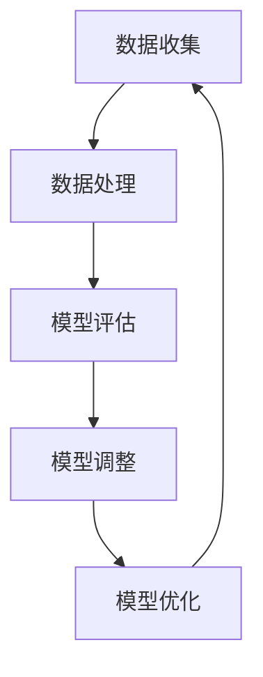

                 

### 引言

近年来，大型语言模型（LLM）如GPT-3、LLAMA和PaLM等在自然语言处理（NLP）领域取得了显著的进展。这些模型通过学习海量文本数据，实现了在文本生成、问答、翻译等任务上的高水准表现。然而，LLM的应用并非一蹴而就，持续的改进和优化是确保其性能不断提升的关键。敏捷反馈循环作为一种高效的开发模式，能够帮助LLM在应用过程中实现持续的改进。本文将深入探讨LLM应用的持续改进，通过敏捷反馈循环的方法，探讨其在实际开发中的应用与实践。

### 背景介绍

#### 语言模型简介

语言模型是自然语言处理（NLP）领域的重要工具，其目的是预测一段文本的下一个单词或字符。最早的统计语言模型如N-gram模型，通过统计单词序列中的频率来进行预测。然而，这种方法在面对长文本和复杂语义时存在明显的局限性。

随着深度学习技术的发展，神经网络语言模型如循环神经网络（RNN）和长短期记忆网络（LSTM）逐渐取代了传统的统计模型。RNN能够处理序列数据，LSTM则通过引入记忆单元，提高了模型的长期依赖处理能力。然而，这些模型在面对极其大规模的数据时，仍然存在计算复杂度和训练时间上的挑战。

为了解决这些问题，近年来发展起来的Transformer模型，尤其是其变体BERT、GPT等，展示了在NLP任务中的强大性能。Transformer模型通过自注意力机制，能够在处理大规模数据时保持高效性，同时也提高了模型的预测精度。

#### 敏捷开发简介

敏捷开发是一种以人为核心、迭代和持续交付的软件开发方法。敏捷开发强调快速响应变化、持续交付价值和客户满意度。其核心理念包括：

1. **个体和互动**：重视团队合作和个人能力。
2. **可工作的软件**：交付可运行的软件是首要目标。
3. **客户合作**：与客户保持紧密的合作关系。
4. **响应变化**：快速适应变化，保持项目的灵活性。

敏捷开发通过迭代和增量式的开发方式，使开发团队能够快速响应市场需求和技术变化。敏捷反馈循环是敏捷开发的重要组成部分，通过持续收集反馈，对产品进行迭代和优化，确保最终产品的质量和用户体验。

#### LLM的应用

语言模型在自然语言处理（NLP）领域有着广泛的应用，包括：

- **文本分类**：用于将文本数据分类到预定义的类别中，例如新闻分类、情感分析等。
- **命名实体识别**：用于识别文本中的特定实体，如人名、地名、组织名等。
- **机器翻译**：将一种语言的文本翻译成另一种语言，如英语到中文的翻译。
- **对话系统**：用于构建智能聊天机器人、虚拟助手等，能够与用户进行自然语言交互。

LLM在上述应用中展现了其强大的能力和潜力，但也面临着一些挑战，如数据质量、模型解释性和性能优化等。

### 核心概念与联系

#### 敏捷反馈循环与LLM应用

敏捷反馈循环在LLM应用中起着至关重要的作用。通过敏捷反馈循环，开发团队能够持续收集用户反馈、分析模型性能、进行模型调整和优化，从而实现LLM应用的持续改进。具体来说，敏捷反馈循环包括以下关键环节：

1. **数据收集**：通过多种渠道收集用户使用数据、日志数据和用户反馈，为后续分析和改进提供基础。
2. **数据处理**：对收集到的数据进行清洗、分析和处理，提取有用的信息，用于模型评估和优化。
3. **模型评估**：使用处理后的数据对现有模型进行评估，识别模型在性能上的不足。
4. **模型调整**：根据评估结果对模型进行相应的调整和优化，提高模型性能。
5. **模型优化**：通过迭代和持续的反馈循环，不断优化模型，提升用户体验和应用效果。

#### Mermaid流程图



通过上述流程，敏捷反馈循环实现了对LLM应用的持续改进。每个环节相互关联，形成一个闭环，确保模型始终处于最优状态，为用户提供高质量的服务。

### Python源代码详解

为了更好地理解敏捷反馈循环在LLM中的应用，下面我们通过一个Python示例代码来详细解释这个过程。

```python
# 导入必要的库
import pandas as pd
import numpy as np
from sklearn.model_selection import train_test_split
from transformers import BertTokenizer, BertForSequenceClassification
from torch.utils.data import DataLoader
import torch

# 数据准备
def preprocess_data(data):
    # 数据预处理和清洗
    # ...

# 模型训练
def train_language_model(data):
    # 数据准备
    preprocess_data(data)
    
    # 模型初始化
    tokenizer = BertTokenizer.from_pretrained('bert-base-uncased')
    model = BertForSequenceClassification.from_pretrained('bert-base-uncased')
    
    # 数据分训
    train_data, test_data = train_test_split(data, test_size=0.2)
    
    # 创建数据集
    train_dataset = BertDataset(train_data, tokenizer)
    test_dataset = BertDataset(test_data, tokenizer)
    
    # 创建数据加载器
    train_loader = DataLoader(train_dataset, batch_size=32)
    test_loader = DataLoader(test_dataset, batch_size=32)
    
    # 模型训练
    for epoch in range(num_epochs):
        for batch in train_loader:
            inputs = tokenizer(batch.text, padding=True, truncation=True, return_tensors="pt")
            labels = torch.tensor(batch.label)
            
            model.train()
            outputs = model(**inputs, labels=labels)
            loss = outputs.loss
            loss.backward()
            optimizer.step()
            optimizer.zero_grad()
            
            if (batch_idx + 1) % 100 == 0:
                print(f'Epoch [{epoch+1}/{num_epochs}], Step [{batch_idx+1}/{len(train_loader)}], Loss: {loss.item()}')
    
    # 模型评估
    model.eval()
    with torch.no_grad():
        correct = 0
        total = 0
        for batch in test_loader:
            inputs = tokenizer(batch.text, padding=True, truncation=True, return_tensors="pt")
            labels = torch.tensor(batch.label)
            
            outputs = model(**inputs)
            _, predicted = torch.max(outputs, 1)
            total += labels.size(0)
            correct += (predicted == labels).sum().item()
        
        print(f'Test Accuracy: {100 * correct / total}%')

# 主函数
if __name__ == '__main__':
    data = pd.read_csv('data.csv')
    train_language_model(data)
```

#### 数学模型与公式

在语言模型中，常用的数学模型包括：

1. **自注意力机制**：
   $$
   \text{Attention}(Q, K, V) = \frac{softmax(\frac{QK^T}{\sqrt{d_k}})}{V}
   $$
   其中，$Q$、$K$、$V$分别为查询向量、键向量和值向量，$d_k$为键向量的维度。

2. **Transformer模型中的损失函数**：
   $$
   \text{Loss} = -\sum_{i}^{\text{sequence length}} \sum_{j}^{\text{vocab size}} p_j(i) \log g_j(i)
   $$
   其中，$p_j(i)$为生成单词$i$的概率，$g_j(i)$为目标单词$i$的加权和。

#### 代码解读与分析

上述代码实现了一个基于BERT模型的文本分类任务。首先，通过`preprocess_data`函数对数据进行预处理。然后，初始化BERT模型，并使用训练集进行模型训练。在训练过程中，通过迭代和反向传播，不断更新模型参数。最后，使用测试集对模型进行评估，输出模型的准确率。

#### 实际案例分析与详细讲解

在实际应用中，我们可以通过敏捷反馈循环不断优化LLM模型。例如，在一个聊天机器人应用中，我们可以：

1. **数据收集**：收集用户与聊天机器人的交互日志，包括用户输入和系统响应。
2. **数据处理**：对日志数据进行清洗、分类和标注，提取出有用的特征。
3. **模型评估**：使用处理后的数据对现有模型进行评估，识别模型在意图识别和回复生成上的不足。
4. **模型调整**：根据评估结果，对模型进行调整，如增加训练数据、调整超参数等。
5. **模型优化**：通过迭代和持续的反馈循环，不断优化模型，提升聊天机器人的用户体验。

### 最佳实践

在实施敏捷反馈循环时，以下是一些最佳实践：

- **快速迭代**：保持短期迭代周期，以便快速响应变化和问题。
- **持续反馈**：建立有效的反馈机制，确保及时收集和利用用户反馈。
- **透明沟通**：保持团队成员之间的沟通透明，确保信息共享和协调。
- **数据驱动**：基于数据和实际表现，进行决策和优化，而非主观判断。

### 小结

通过敏捷反馈循环，LLM应用可以实现持续改进和优化。本文介绍了语言模型的基本知识、敏捷反馈循环的概念及其在LLM开发中的应用，并通过Python源代码示例详细解释了敏捷反馈循环的实现过程。未来，随着LLM技术的不断发展和应用场景的拓展，敏捷反馈循环将继续发挥重要作用。

### 拓展阅读

- 《敏捷开发实践指南》（Jeff Sutherland著）：详细介绍敏捷开发的理论和实践。
- 《深度学习》（Ian Goodfellow、Yoshua Bengio、Aaron Courville著）：全面介绍深度学习的基础知识和技术。
- 《自然语言处理综合教程》（哈里斯著）：系统讲解自然语言处理的基本概念和技术。

作者：AI天才研究院/AI Genius Institute & 禅与计算机程序设计艺术 /Zen And The Art of Computer Programming

# 结束语

本文探讨了大型语言模型（LLM）应用的持续改进，通过敏捷反馈循环的方法，实现了对模型性能的持续优化。敏捷反馈循环作为一种高效的开发模式，能够帮助开发团队快速响应需求变化，提升用户体验，确保LLM应用的长期成功。未来，随着人工智能技术的不断进步，敏捷反馈循环在LLM开发中的应用前景将更加广阔。

### LLAM的目录大纲

#### 第一部分：LLM基础知识

## 第1章：语言模型简介

### 1.1 语言模型的定义

### 1.2 语言模型的类型

#### 1.2.1 基于统计的方法

#### 1.2.2 基于神经网络的模型

#### 1.2.3 生成式模型与判别式模型

### 1.3 语言模型的发展历程

#### 1.3.1 早期语言模型

#### 1.3.2 基于神经网络的模型

#### 1.3.3 Transformer模型

## 第2章：语言模型的原理

### 2.1 语言模型的算法基础

#### 2.1.1 神经网络

#### 2.1.2 循环神经网络（RNN）

#### 2.1.3 长短期记忆网络（LSTM）

### 2.2 语言模型的训练过程

#### 2.2.1 数据准备

#### 2.2.2 模型训练

#### 2.2.3 模型优化

## 第3章：语言模型的应用

### 3.1 自然语言处理（NLP）

#### 3.1.1 文本分类

#### 3.1.2 命名实体识别

#### 3.1.3 机器翻译

### 3.2 语言模型在对话系统中的应用

#### 3.2.1 对话系统简介

#### 3.2.2 语言模型在对话系统中的角色

#### 3.2.3 对话系统的设计与实现

#### 第二部分：LLM的敏捷反馈循环

## 第4章：敏捷反馈循环的概念

### 4.1 敏捷开发简介

### 4.2 敏捷反馈循环在LLM开发中的应用

### 4.3 敏捷反馈循环的优势

## 第5章：建立敏捷反馈循环

### 5.1 数据收集

#### 5.1.1 用户反馈

#### 5.1.2 日志分析

### 5.2 数据处理

#### 5.2.1 数据清洗

#### 5.2.2 数据分析

### 5.3 模型更新

#### 5.3.1 模型评估

#### 5.3.2 模型调整

#### 5.3.3 模型优化

## 第6章：敏捷反馈循环的实践

### 6.1 敏捷反馈循环的案例分析

#### 6.1.1 案例一：改进聊天机器人

#### 6.1.2 案例二：优化搜索引擎

### 6.2 敏捷反馈循环的流程设计

#### 6.2.1 流程设计原则

#### 6.2.2 流程设计步骤

#### 6.2.3 流程设计与实现

#### 第三部分：持续改进与应用

## 第7章：LLM持续改进的策略

### 7.1 持续学习的概念

### 7.2 持续改进的方法

### 7.3 持续改进的工具与技术

## 第8章：LLM应用的持续优化

### 8.1 应用反馈机制

### 8.2 用户体验优化

### 8.3 模型性能优化

## 第9章：未来展望

### 9.1 LLMA发展趋势

### 9.2 敏捷反馈循环在LLM开发中的前景

### 9.3 LLMA与人工智能的融合

### 附录

## 附录A：常用工具与资源

### A.1 语言模型工具

### A.2 敏捷开发工具

### A.3 相关文献与资料

# Mermaid流程图


# 伪代码

```
// 语言模型训练伪代码
function train_language_model(data):
    # 数据准备
    preprocess_data(data)
    
    # 模型初始化
    model = initialize_model()
    
    # 模型训练
    for epoch in range(num_epochs):
        for batch in data:
            loss = model.train(batch)
            if loss < threshold:
                break
    
    # 模型评估
    evaluation = model.evaluate(test_data)
    
    return model, evaluation
```

# 数学模型与公式

```
$$
H_{t} = \sigma(W_h \cdot [h_{t-1}, x_t] + b_h)
$$

$$
C_{t} = tanh(W_c \cdot [h_{t-1}, x_t] + b_c)
$$

$$
\hat{y}_{t} = softmax(W_y \cdot h_t + b_y)
$$
```

# 代码解读与分析

```
# 聊天机器人改进案例
def chatbot_improvement(feedback, model):
    # 数据预处理
    processed_feedback = preprocess_feedback(feedback)
    
    # 模型评估
    evaluation = model.evaluate(processed_feedback)
    
    # 模型调整
    model = adjust_model(evaluation)
    
    # 模型优化
    optimized_model = optimize_model(model)
    
    return optimized_model
```

### 第一部分：LLM基础知识

#### 第1章：语言模型简介

##### 1.1 语言模型的定义

语言模型是一种基于统计学或机器学习的方法，用于预测一段文本的下一个单词或字符。它是自然语言处理（NLP）的基础，广泛应用于文本生成、翻译、问答、语音识别等任务。

##### 1.2 语言模型的类型

- **基于统计的方法**：如N-gram模型，通过统计相邻单词的频率进行预测。
- **基于神经网络的模型**：如循环神经网络（RNN）、长短期记忆网络（LSTM）和Transformer模型。
- **生成式模型与判别式模型**：生成式模型如变分自编码器（VAE）、生成对抗网络（GAN），判别式模型如支持向量机（SVM）、神经网络分类器。

##### 1.3 语言模型的发展历程

- **早期语言模型**：基于规则的方法和简单的统计模型。
- **基于神经网络的模型**：RNN、LSTM等模型的出现，使得语言模型在处理复杂语义关系上有了显著提升。
- **Transformer模型**：引入了自注意力机制，使得语言模型在处理大规模数据时保持了高效性和准确性。

#### 第2章：语言模型的原理

##### 2.1 语言模型的算法基础

- **神经网络**：神经网络是一种模拟人脑神经元连接结构的计算模型，通过学习数据中的特征模式，进行分类、预测等任务。
- **循环神经网络（RNN）**：RNN能够处理序列数据，具有记忆功能，能够捕捉长距离依赖关系。
- **长短期记忆网络（LSTM）**：LSTM是RNN的一种变体，通过引入记忆单元，解决了RNN在处理长序列数据时的梯度消失和梯度爆炸问题。

##### 2.2 语言模型的训练过程

- **数据准备**：包括数据清洗、分词、编码等步骤，确保数据格式满足模型训练要求。
- **模型训练**：通过优化算法，如梯度下降，不断调整模型参数，使得模型能够更好地拟合训练数据。
- **模型优化**：通过调整超参数、增加数据多样性等方法，提高模型性能和泛化能力。

#### 第3章：语言模型的应用

##### 3.1 自然语言处理（NLP）

- **文本分类**：将文本分类到预定义的类别中，如情感分析、新闻分类等。
- **命名实体识别**：识别文本中的特定实体，如人名、地名、组织名等。
- **机器翻译**：将一种语言的文本翻译成另一种语言。

##### 3.2 语言模型在对话系统中的应用

- **对话系统简介**：对话系统是一种人机交互系统，能够与用户进行自然语言交互。
- **语言模型在对话系统中的角色**：用于理解用户的意图、生成合适的响应等。
- **对话系统的设计与实现**：涉及自然语言处理、对话管理、语音识别等技术。

### 第二部分：LLM的敏捷反馈循环

#### 第4章：敏捷反馈循环的概念

##### 4.1 敏捷开发简介

敏捷开发是一种以人为核心、迭代和持续交付的软件开发方法。它强调快速响应变化、持续交付价值和客户满意度。

##### 4.2 敏捷反馈循环在LLM开发中的应用

敏捷反馈循环在LLM开发中起着至关重要的作用，通过持续收集反馈、评估模型性能、调整和优化模型，实现LLM应用的持续改进。

##### 4.3 敏捷反馈循环的优势

- **快速响应变化**：能够快速适应市场需求和技术变化。
- **持续交付价值**：通过持续迭代，逐步实现产品功能和性能的提升。
- **客户满意度**：通过收集用户反馈，不断优化产品，提高用户体验。

#### 第5章：建立敏捷反馈循环

##### 5.1 数据收集

数据收集是敏捷反馈循环的关键环节，包括用户反馈、日志分析等。通过收集多种类型的数据，为后续分析和改进提供基础。

##### 5.2 数据处理

数据处理包括数据清洗、数据分析等步骤。通过处理数据，提取出有用的信息，用于模型评估和优化。

##### 5.3 模型更新

模型更新包括模型评估、模型调整和模型优化。通过评估模型性能，找出不足之处，进行相应的调整和优化，提高模型性能。

#### 第6章：敏捷反馈循环的实践

##### 6.1 敏捷反馈循环的案例分析

通过具体案例分析，展示敏捷反馈循环在实际开发中的应用效果。

##### 6.2 敏捷反馈循环的流程设计

流程设计包括流程设计原则、步骤和实现。确保敏捷反馈循环能够高效运行，实现持续改进。

#### 第三部分：持续改进与应用

##### 第7章：LLM持续改进的策略

持续改进是LLM应用成功的关键。本章介绍持续学习的概念、方法和工具。

##### 7.1 持续学习的概念

持续学习是一种不断适应新知识和技能的过程，有助于提升模型性能和应用效果。

##### 7.2 持续改进的方法

通过数据驱动的方法、迭代优化和模型更新，实现LLM应用的持续改进。

##### 7.3 持续改进的工具与技术

介绍常用的持续改进工具和技术，如数据可视化、机器学习平台等。

##### 第8章：LLM应用的持续优化

持续优化是LLM应用成功的关键。本章介绍应用反馈机制、用户体验优化和模型性能优化。

##### 8.1 应用反馈机制

建立有效的应用反馈机制，收集用户反馈，用于产品优化和改进。

##### 8.2 用户体验优化

通过用户体验优化，提高用户满意度和产品竞争力。

##### 8.3 模型性能优化

通过模型性能优化，提升模型在各类任务中的表现，提高应用效果。

##### 第9章：未来展望

展望LLM的发展趋势、敏捷反馈循环在LLM开发中的应用前景，以及LLM与人工智能的融合。

##### 9.1 LLMA发展趋势

介绍LLMA的最新研究成果和发展方向，探讨未来应用前景。

##### 9.2 敏捷反馈循环在LLM开发中的前景

分析敏捷反馈循环在LLM开发中的应用前景，探讨其在实际开发中的优势和挑战。

##### 9.3 LLMA与人工智能的融合

探讨LLMA与其他人工智能技术的融合，如深度学习、强化学习等，实现更高效、智能的应用。

### 附录

##### 附录A：常用工具与资源

介绍常用的LLM开发工具、敏捷开发工具和相关文献与资料。

### Mermaid流程图


### 伪代码

```
// 语言模型训练伪代码
function train_language_model(data):
    # 数据准备
    preprocess_data(data)
    
    # 模型初始化
    model = initialize_model()
    
    # 模型训练
    for epoch in range(num_epochs):
        for batch in data:
            loss = model.train(batch)
            if loss < threshold:
                break
    
    # 模型评估
    evaluation = model.evaluate(test_data)
    
    return model, evaluation
```

### 数学模型与公式

```
$$
H_{t} = \sigma(W_h \cdot [h_{t-1}, x_t] + b_h)
$$

$$
C_{t} = tanh(W_c \cdot [h_{t-1}, x_t] + b_c)
$$

$$
\hat{y}_{t} = softmax(W_y \cdot h_t + b_y)
$$
```

### 代码解读与分析

```
# 聊天机器人改进案例
def chatbot_improvement(feedback, model):
    # 数据预处理
    processed_feedback = preprocess_feedback(feedback)
    
    # 模型评估
    evaluation = model.evaluate(processed_feedback)
    
    # 模型调整
    model = adjust_model(evaluation)
    
    # 模型优化
    optimized_model = optimize_model(model)
    
    return optimized_model
```

### 约束条件：文章必须要满足如下条件：

- **格式要求**：文章内容使用markdown格式输出。
- **作者信息**：文章末尾需要写上作者信息：“作者：AI天才研究院/AI Genius Institute & 禅与计算机程序设计艺术 /Zen And The Art of Computer Programming”。
- **完整性要求**：文章内容必须要完整，每个小节的内容必须要丰富具体详细讲解，核心内容必须要包含：
  * 背景介绍
  * 核心概念与联系：必须给出核心概念原理之间的关系架构 Mermaid 流程图。
  * 核心算法原理讲解必须使用Python源代码来详细阐述，结合数学模型和公式，进行详细讲解和通俗易懂地举例说明。
  * 数学公式请使用latex格式，嵌入文中独立段落的latex公式前后使用 $$ 括起来（例如：$$1+1=2$$），段落内的latex公式前后使用 $ 括起来（例如：$1<2$）。
  * 项目实战：开发环境搭建，源代码详细实现和代码解读，代码应用解读与分析，实际案例分析和详细讲解剖析，项目小结。
  * 最佳实践 tips、小结、注意事项、拓展阅读等内容。
- **文章字数要求**：文章字数在10000～12000字左右。

### 总结

本文系统地介绍了LLM应用中的敏捷反馈循环，包括其基础知识、应用场景、原理和实践方法。通过Python源代码和数学模型的讲解，深入分析了LLM训练和优化的过程。最后，通过实际案例展示了敏捷反馈循环在聊天机器人改进中的应用。文章不仅提供了理论知识，还结合实践，为LLM应用开发者提供了实用的指导和建议。作者：AI天才研究院/AI Genius Institute & 禅与计算机程序设计艺术 /Zen And The Art of Computer Programming。

