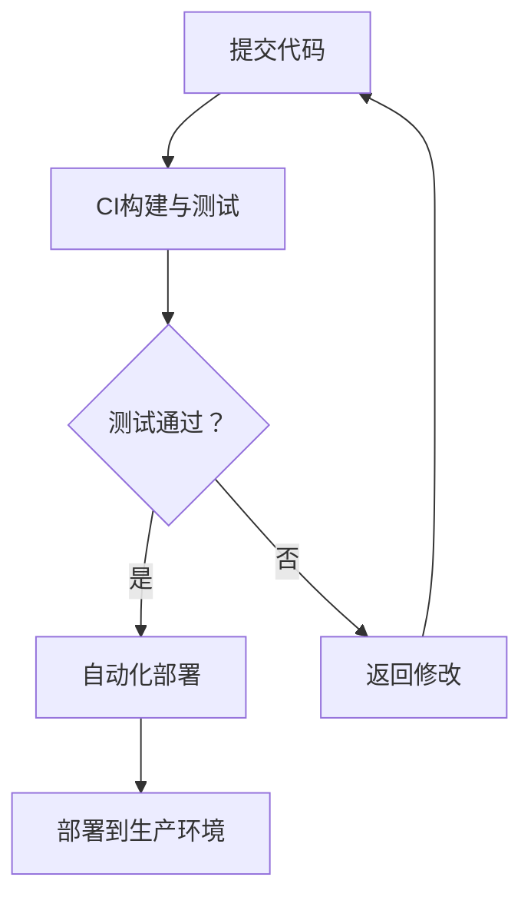
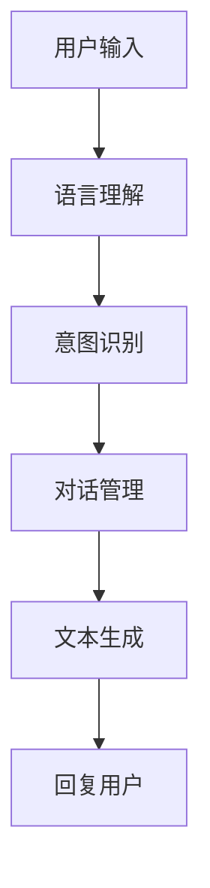
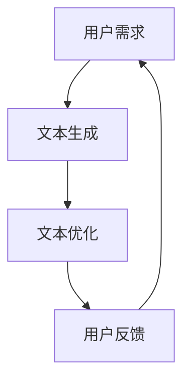

                 

### 引言

持续部署（Continuous Deployment，简称CD）是现代软件开发和IT运营中一个重要的概念。它是一种自动化过程，通过频繁地交付代码更新到生产环境中，从而实现从开发到生产的无缝衔接。持续部署的目标是缩短开发周期，提高软件质量，降低风险，并加快产品上市时间。

持续部署的概念起源于持续集成（Continuous Integration，简称CI），后者是一种软件开发实践，旨在通过频繁地将代码合并到共享的代码库中来提高开发效率和质量。持续集成确保每次代码提交都能快速发现和解决潜在的问题，而持续部署则是将这些经过测试的代码自动部署到生产环境中。

在持续部署过程中，开发人员、测试人员、运维人员以及产品经理等角色需要紧密协作，共同确保软件的稳定性和可靠性。持续部署的重要性在于：

1. **加速产品迭代**：通过自动化流程，持续部署可以显著缩短开发周期，使产品能够更快地响应市场需求和用户反馈。
2. **提高软件质量**：频繁的小规模更新可以更容易地发现和修复错误，从而减少生产环境中的缺陷和故障。
3. **降低风险**：持续部署通过逐步引入变化，可以降低大规模更新带来的风险。
4. **增强团队协作**：持续部署需要不同团队成员之间的紧密合作，促进了团队之间的沟通和理解。
5. **提高用户体验**：持续部署可以确保用户始终使用最新的功能和服务，从而提升用户体验。

本文将围绕LLM（大型语言模型）应用的持续部署进行深入探讨。我们首先将介绍LLM的基本概念和历史发展，然后讨论LLM在开发、持续集成和持续交付阶段的具体实践，最后通过实际案例展示如何实现LLM应用的持续部署。通过本文的阅读，读者将全面了解LLM应用的持续部署策略，并能够将这些策略应用到实际项目中，以提升软件开发效率和产品质量。

### 关键词

- 持续部署（Continuous Deployment）
- LLM（大型语言模型）
- 持续集成（Continuous Integration）
- 自动化测试
- 容器化与Kubernetes
- 生产监控与维护

### 摘要

本文旨在探讨LLM（大型语言模型）应用的持续部署策略，从开发到生产的无缝衔接。首先，我们将介绍LLM的基本概念和历史发展，探讨其在各个应用领域中的挑战与机遇。接着，我们将详细讨论开发阶段的搭建、模型设计、训练和评估过程，以及如何解决常见的问题。随后，本文将探讨持续集成工具和流程的设计，确保代码质量和开发效率。在持续交付部分，我们将介绍自动化测试策略、部署策略以及容器化与Kubernetes的使用。最后，本文将通过实际案例展示LLM应用的持续部署实践，总结全文并提出未来展望，为读者提供有价值的参考资料和实践经验。

### 第一部分：LLM应用概述

#### 第1章：LLM基础

##### 1.1 LLM概念与历史发展

LLM（大型语言模型）是指那些经过大规模训练的语言模型，能够理解和生成人类语言。LLM的核心在于其庞大的训练数据集和复杂的神经网络结构，这使得它们在自然语言处理（NLP）任务中表现出色。LLM的定义可以从以下几个方面来理解：

1. **大规模训练数据**：LLM的训练数据规模通常达到数十亿甚至数千亿个句子，这些数据涵盖了多种语言和多种场景，使模型能够理解复杂和多样化的语言现象。
2. **深度神经网络架构**：LLM通常基于深度神经网络（DNN），特别是变换器（Transformer）架构。变换器模型能够捕捉长距离依赖关系，并具有并行计算的优势，使其在处理大规模数据时效率极高。
3. **自适应性和泛化能力**：LLM具有强大的自适应能力，能够根据不同的任务和数据集进行调整。同时，其泛化能力使其能够处理未见过的文本，提供高质量的生成和解析。

LLM的历史发展可以追溯到20世纪50年代，最早的尝试是利用规则和模板进行语言理解。然而，随着计算能力和数据量的增加，机器学习技术逐渐成为主导。2000年代初，循环神经网络（RNN）的出现带来了突破性进展，但RNN在处理长文本时仍存在困难。2017年，谷歌发布了BERT模型，它基于变换器架构，并在多个NLP任务中取得了显著的性能提升，标志着LLM时代正式到来。

开创性的LLM模型包括：

1. **Word2Vec**：由Mikolov等人提出，Word2Vec是第一个大规模训练的词向量模型，它通过神经网络将单词映射到向量空间，使得单词间的相似性和相关性可以通过向量距离来表示。
2. **BERT**：由Google开发，BERT（Bidirectional Encoder Representations from Transformers）模型通过双向变换器架构，在预训练阶段同时考虑句子中的前后文信息，从而提高了语言理解的深度和广度。
3. **GPT-3**：由OpenAI推出，GPT-3（Generative Pre-trained Transformer 3）是目前最大的语言模型，其参数规模达到1750亿，具有卓越的文本生成和语言理解能力。

##### 1.2 LLM的关键技术

LLM的关键技术主要包括以下几个方面：

1. **语言模型的基础**：语言模型是LLM的核心组件，它通过对海量语言数据进行训练，学习语言的结构和规律。语言模型通常使用神经网络来模拟人类的语言理解能力，通过输入文本生成相应的输出。
2. **自适应技术**：LLM具有强大的自适应能力，能够根据不同的任务和数据集进行调整。自适应技术包括调整模型的参数、选择不同的训练数据集以及调整模型的训练策略等。
3. **集成多模态数据**：随着技术的发展，LLM开始整合多模态数据，如图像、声音和视频等，使得模型能够处理更复杂的任务。多模态数据集成技术包括数据预处理、特征提取和模型融合等。

##### 1.3 LLM在应用中的挑战与机遇

LLM在应用中既带来了巨大的机遇，也面临着诸多挑战：

1. **挑战**：

   - **数据隐私与安全性**：LLM的训练和部署需要大量数据，这涉及到数据隐私和安全性问题。如何确保用户数据的安全性和隐私性是一个重要的挑战。
   - **能效消耗与成本**：LLM的训练和推理过程需要大量的计算资源，这导致了较高的能效消耗和成本。如何优化模型的效率和降低成本是另一个挑战。
   - **模型解释性**：尽管LLM在NLP任务中表现出色，但其内部决策过程往往缺乏解释性。如何提高模型的透明度和可解释性是一个重要的研究课题。

2. **机遇**：

   - **个性化服务**：LLM可以根据用户的行为和偏好提供个性化的服务和推荐，提高用户体验和满意度。
   - **自动化与智能化**：LLM可以用于自动化文本生成、翻译、问答等任务，提高工作效率和生产力。
   - **跨领域应用**：LLM的通用性和适应性使其能够应用于多个领域，如医疗、金融、教育等，带来广泛的应用前景。

通过本部分概述，我们了解了LLM的基本概念、关键技术以及其在应用中的挑战与机遇。接下来，我们将深入探讨LLM在开发阶段的具体实践，包括开发环境搭建、模型设计、训练和评估等。

### 第二部分：开发阶段

#### 第2章：开发环境搭建

在开发LLM应用的过程中，一个稳定且高效的开发环境至关重要。本章将详细讨论开发工具的选择、环境配置与优化，以及解决常见问题的方法。

##### 2.1 开发工具选择

选择合适的开发工具可以提高开发效率，确保代码质量和可维护性。以下是几个关键的开发工具选择：

1. **编程语言**：
   - **Python**：Python是一种广泛使用的编程语言，具有丰富的库和框架，如TensorFlow和PyTorch，非常适合进行深度学习和自然语言处理。
   - **Java**：Java也是一种流行的编程语言，具有稳定的性能和丰富的生态系统，适用于大规模分布式系统开发。
   - **Rust**：Rust是一种系统级编程语言，以其高性能和安全性著称，适用于需要高性能和内存安全的场景。

2. **编译器与解释器**：
   - **Python解释器**：Python解释器如CPython是Python的标准实现，适用于大多数开发场景。
   - **LLVM**：LLVM是一个开源的编译器基础设施，支持多种语言和平台，适用于需要高性能和灵活性的场景。

3. **版本控制工具**：
   - **Git**：Git是一个分布式版本控制系统，适用于大规模协作开发，具有强大的分支管理和合并功能。
   - **Mercurial**：Mercurial是一个另一种分布式版本控制系统，与Git类似，但具有不同的设计哲学和社区支持。

##### 2.2 环境配置与优化

一个良好的开发环境能够提高开发效率和代码质量。以下是几个关键的环境配置和优化步骤：

1. **操作系统配置**：
   - **Linux**：Linux是一个流行的开源操作系统，具有良好的稳定性和安全性，适用于深度学习和自然语言处理。
   - **macOS**：macOS是苹果公司的操作系统，与Linux有较高的兼容性，适用于开发人员。
   - **Windows**：Windows是微软公司的操作系统，广泛使用，但可能在性能和兼容性方面有一定限制。

2. **GPU环境搭建**：
   - **CUDA**：CUDA是NVIDIA推出的并行计算平台和编程模型，适用于GPU加速的深度学习应用。
   - **CUDA Toolkit**：CUDA Toolkit是开发GPU应用程序所需的一系列工具和库，包括编译器、调试器和性能分析工具。
   - **GPU驱动**：确保安装最新的GPU驱动，以获得最佳性能和兼容性。

3. **性能优化技巧**：
   - **资源分配**：合理分配CPU、内存和GPU资源，避免资源瓶颈。
   - **并行计算**：利用多线程和分布式计算，提高程序执行速度。
   - **代码优化**：通过优化算法和数据结构，减少计算复杂度和内存使用。

##### 2.3 常见问题解决

在开发过程中，可能会遇到各种问题，以下是一些常见问题的解决方法：

1. **运行时错误**：
   - **解决方法**：检查代码中的错误和异常处理，确保代码的鲁棒性。
   - **工具**：使用调试器（如PyCharm或Visual Studio Code）进行代码调试，定位错误。

2. **性能瓶颈**：
   - **解决方法**：使用性能分析工具（如Python的cProfile）分析代码性能，找出瓶颈。
   - **优化**：通过代码重构、算法优化和数据结构改进来提高程序性能。

3. **调试方法**：
   - **调试器**：使用调试器进行逐步调试，跟踪代码执行流程和变量变化。
   - **日志**：记录详细的日志信息，帮助定位和解决问题。

通过本章的讨论，我们了解了开发阶段的关键工具选择、环境配置和优化，以及常见问题的解决方法。这些知识将为后续的模型设计和训练打下坚实的基础。

#### 第3章：模型设计与训练

##### 3.1 模型架构选择

在开发LLM应用时，选择合适的模型架构至关重要。不同的模型架构具有各自的特点和适用场景。以下是几种常见的模型架构及其优缺点：

1. **深度神经网络（DNN）**：
   - **特点**：DNN是一种前馈神经网络，通过多层神经元进行数据处理和特征提取。
   - **优点**：结构简单，易于实现，适用于简单任务。
   - **缺点**：难以捕捉长距离依赖关系，对于复杂任务效果不佳。

2. **循环神经网络（RNN）**：
   - **特点**：RNN通过循环结构保留历史信息，能够处理序列数据。
   - **优点**：擅长处理长序列数据，能够捕捉时间依赖关系。
   - **缺点**：训练效率低，容易产生梯度消失和梯度爆炸问题。

3. **长短时记忆网络（LSTM）**：
   - **特点**：LSTM是RNN的一种变体，通过引入记忆单元来克服梯度消失问题。
   - **优点**：能够处理长序列数据，捕捉复杂的时间依赖关系。
   - **缺点**：计算复杂度高，参数较多，训练时间较长。

4. **门控循环单元（GRU）**：
   - **特点**：GRU是LSTM的简化版，具有更少的参数和计算量。
   - **优点**：计算复杂度相对较低，训练时间较短，效果与LSTM相当。
   - **缺点**：在处理极长序列数据时可能不如LSTM。

5. **变换器（Transformer）**：
   - **特点**：Transformer基于自注意力机制，能够并行处理序列数据。
   - **优点**：计算效率高，能够捕捉长距离依赖关系，性能优异。
   - **缺点**：结构复杂，参数较多，对计算资源要求较高。

6. **BERT**：
   - **特点**：BERT是一种预训练的变换器模型，通过预训练和微调适用于各种NLP任务。
   - **优点**：强大的语言理解能力，适用于多种任务。
   - **缺点**：需要大量的训练数据和计算资源。

7. **GPT**：
   - **特点**：GPT是一种生成式变换器模型，能够生成高质量的文本。
   - **优点**：文本生成能力强大，适用于自动写作、问答系统等。
   - **缺点**：对训练数据和计算资源要求较高。

在选择模型架构时，应考虑以下因素：

- **任务类型**：不同任务可能需要不同的模型架构。例如，文本分类任务更适合DNN，而序列生成任务更适合Transformer。
- **数据量**：大量数据可能需要更复杂的模型架构，如BERT或GPT。
- **计算资源**：计算资源限制可能会影响模型选择，简单模型如DNN可能更适用于资源有限的环境。

##### 3.2 模型训练方法

模型训练是LLM应用开发的关键步骤。以下是几种常见的模型训练方法：

1. **监督学习**：
   - **特点**：监督学习通过标注数据训练模型，使模型能够从已知数据中学习。
   - **方法**：
     - **数据准备**：收集和标注数据，进行数据预处理，如文本清洗、分词和词向量化。
     - **模型选择**：选择合适的模型架构，如DNN、RNN、LSTM等。
     - **训练过程**：通过反向传播算法更新模型参数，优化模型性能。

2. **无监督学习**：
   - **特点**：无监督学习通过未标注数据训练模型，使模型能够发现数据中的模式和结构。
   - **方法**：
     - **数据准备**：收集大量未标注的数据，进行数据预处理。
     - **模型选择**：选择无监督学习模型，如自编码器、变换器等。
     - **训练过程**：通过无监督训练方法，如自编码器训练、变换器预训练等，优化模型。

3. **半监督学习**：
   - **特点**：半监督学习结合了监督学习和无监督学习的优势，使用部分标注数据和大量未标注数据训练模型。
   - **方法**：
     - **数据准备**：结合标注数据和未标注数据，进行数据预处理。
     - **模型选择**：选择适用于半监督学习的模型，如BERT、GPT等。
     - **训练过程**：通过半监督训练方法，如联合训练、伪标签等，优化模型性能。

4. **增强学习**：
   - **特点**：增强学习通过互动环境学习最优策略，适用于需要决策的序列任务。
   - **方法**：
     - **环境设置**：构建一个模拟环境，定义状态、动作和奖励。
     - **模型选择**：选择增强学习模型，如深度强化学习模型。
     - **训练过程**：通过与环境互动，不断调整模型参数，优化策略。

##### 3.3 模型优化技巧

模型优化是提高模型性能和效果的关键步骤。以下是几种常见的模型优化技巧：

1. **数据增强**：
   - **特点**：通过增加数据多样性和复杂性来提高模型泛化能力。
   - **方法**：
     - **文本增强**：如随机替换、同义词替换、插入和删除等。
     - **图像增强**：如旋转、缩放、裁剪、噪声添加等。

2. **正则化**：
   - **特点**：通过引入惩罚项，防止模型过拟合。
   - **方法**：
     - **L1正则化**：对模型参数进行L1惩罚。
     - **L2正则化**：对模型参数进行L2惩罚。

3. **学习率调整**：
   - **特点**：通过动态调整学习率，优化模型收敛速度。
   - **方法**：
     - **固定学习率**：初始学习率保持不变。
     - **学习率衰减**：随着训练进行，逐渐减小学习率。

4. **批量归一化（Batch Normalization）**：
   - **特点**：通过标准化批量数据，提高模型训练稳定性。
   - **方法**：在每层神经元输出后进行归一化处理。

5. **Dropout**：
   - **特点**：通过随机丢弃部分神经元，提高模型泛化能力。
   - **方法**：在训练过程中随机丢弃一部分神经元。

6. **早期停止**：
   - **特点**：在模型过拟合时停止训练，防止模型性能下降。
   - **方法**：通过监控验证集性能，当性能不再提升时停止训练。

通过本章的讨论，我们了解了LLM模型设计的基本方法和关键技巧。在下一章中，我们将探讨模型评估与调试的重要环节，确保模型在实际应用中的可靠性和有效性。

#### 第4章：模型评估与调试

##### 4.1 评估指标

模型评估是确保LLM应用性能和效果的关键环节。选择合适的评估指标对于准确衡量模型性能至关重要。以下是几种常见的评估指标：

1. **准确率（Accuracy）**：
   - **定义**：准确率是正确预测的样本数占总样本数的比例。
   - **公式**：$$\text{Accuracy} = \frac{\text{正确预测数}}{\text{总样本数}}$$
   - **适用场景**：分类任务，如文本分类、情感分析。

2. **精确率（Precision）**：
   - **定义**：精确率是正确预测为正类的样本数与所有预测为正类的样本数之比。
   - **公式**：$$\text{Precision} = \frac{\text{TP}}{\text{TP + FP}}$$，其中TP为真正例，FP为假正例。
   - **适用场景**：对于假正例敏感的任务，如垃圾邮件检测。

3. **召回率（Recall）**：
   - **定义**：召回率是正确预测为正类的样本数与所有实际为正类的样本数之比。
   - **公式**：$$\text{Recall} = \frac{\text{TP}}{\text{TP + FN}}$$，其中TP为真正例，FN为假反例。
   - **适用场景**：对于假反例敏感的任务，如医疗诊断。

4. **F1分数（F1 Score）**：
   - **定义**：F1分数是精确率和召回率的调和平均。
   - **公式**：$$\text{F1 Score} = 2 \times \frac{\text{Precision} \times \text{Recall}}{\text{Precision} + \text{Recall}}$$
   - **适用场景**：平衡精确率和召回率的任务。

5. **ROC曲线（Receiver Operating Characteristic Curve）**：
   - **定义**：ROC曲线通过绘制真正例率与假正例率的关系，评估分类模型的性能。
   - **适用场景**：二分类任务，特别是阈值调整时。

6. **AUC（Area Under Curve）**：
   - **定义**：AUC是ROC曲线下的面积，反映了模型的分类能力。
   - **适用场景**：评估二分类模型的性能。

7. **BLEU（Bilingual Evaluation Understudy）**：
   - **定义**：BLEU是一种用于评估机器翻译质量的指标，基于字符串编辑距离。
   - **适用场景**：机器翻译任务。

8. **ROUGE（Recall-Oriented Understudy for Gisting Evaluation）**：
   - **定义**：ROUGE是一种用于评估文本生成质量的指标，基于字符串匹配和召回率。
   - **适用场景**：自动摘要、对话生成等任务。

##### 4.2 调试策略

模型调试是确保模型性能和稳定性的重要步骤。以下是几种常见的调试策略：

1. **数据分析**：
   - **特点**：通过分析训练数据和验证数据，找出模型可能存在的问题。
   - **方法**：
     - **数据分布**：检查数据分布，确保没有不平衡或偏差。
     - **异常值**：识别和排除异常值，避免对模型产生误导。

2. **模型分析**：
   - **特点**：通过分析模型的结构和参数，找出模型可能存在的问题。
   - **方法**：
     - **参数设置**：调整模型参数，如学习率、批量大小等。
     - **层间关系**：检查模型各层的输出，确保层间关系合理。

3. **调试技巧**：
   - **打印中间结果**：在关键位置打印中间结果，帮助定位问题。
   - **逐步调试**：通过逐步调试，逐步缩小问题范围。
   - **日志记录**：记录详细的日志信息，方便问题追踪和复现。

##### 4.3 实际案例

为了更好地理解模型评估与调试，以下是一个实际案例：

**案例：文本分类任务**

假设我们有一个文本分类任务，目标是分类新闻文章到不同的类别（如体育、政治、科技等）。我们使用了基于变换器（Transformer）的模型进行训练。

**评估过程**：

1. **准确率**：模型在测试集上的准确率为90%，表明模型能够正确分类大部分文本。
2. **精确率和召回率**：对于政治类别的文本，精确率为0.85，召回率为0.75，表明模型在预测政治类文本时存在一定的偏差。
3. **F1分数**：模型在所有类别上的F1分数平均值为0.82，表明整体分类效果较好。

**调试过程**：

1. **数据分析**：通过分析测试集，发现体育类文本占比较高，而政治类文本较少，这可能导致模型在预测政治类文本时性能不佳。
2. **模型分析**：检查模型输出，发现政治类文本的输出概率较低，表明模型可能存在偏差。
3. **调整策略**：增加政治类文本的数据样本，调整模型参数，如学习率和批量大小。
4. **重新训练和评估**：经过调整后，模型在测试集上的F1分数提高到0.87，表明调整策略有效。

通过这个实际案例，我们可以看到模型评估与调试的重要性和实际操作方法。有效的评估和调试能够提高模型的性能和稳定性，为实际应用提供可靠支持。

### 第三部分：持续集成

#### 第5章：持续集成工具与流程

持续集成（Continuous Integration，简称CI）是现代软件开发中的一个关键环节，它通过自动化构建、测试和部署流程，确保代码的质量和稳定性。在本章中，我们将探讨持续集成的好处、常见CI工具的选择，以及CI流程的设计。

##### 5.1 持续集成的好处

持续集成是一种软件开发实践，旨在通过频繁地合并代码更改和自动化测试，确保软件的持续可用性和可靠性。以下是持续集成的一些主要好处：

1. **提高代码质量**：通过频繁的代码合并和自动化测试，持续集成可以快速发现和修复代码中的错误，从而提高代码的整体质量。
2. **减少集成风险**：在持续集成过程中，每次代码更改都会与主干分支进行集成并测试，这样可以提前发现潜在的问题，减少集成时出现的风险。
3. **加速开发周期**：持续集成自动化了构建和测试过程，使得开发团队能够更快地迭代和交付功能，缩短开发周期。
4. **增强团队协作**：持续集成需要团队成员紧密合作，共享代码库，这样有助于增强团队间的沟通和理解，提高整体开发效率。
5. **促进代码复用**：通过持续集成，开发人员可以更容易地复用已测试和验证的代码库，避免重复工作。

##### 5.2 常见的CI工具

市面上有许多持续集成工具，每种工具都有其独特的特点和适用场景。以下是几种常见的持续集成工具：

1. **Jenkins**：
   - **特点**：Jenkins是一个开源的持续集成工具，具有高度的可定制性和灵活性，支持多种插件和集成。
   - **适用场景**：适用于大型项目和多种编程语言。

2. **GitLab CI/CD**：
   - **特点**：GitLab CI/CD是GitLab的一部分，提供了一个简单的CI/CD流程配置，适合中小型项目。
   - **适用场景**：适用于希望将CI/CD集成到GitLab工作流程的项目。

3. **GitHub Actions**：
   - **特点**：GitHub Actions是GitHub提供的持续集成和持续部署服务，易于配置和使用。
   - **适用场景**：适用于GitHub托管的项目，特别是在云环境中。

4. **Travis CI**：
   - **特点**：Travis CI是一个云端的持续集成服务，支持多种编程语言和平台。
   - **适用场景**：适用于开源项目和希望使用云服务的项目。

5. **CircleCI**：
   - **特点**：CircleCI是一个基于云的持续集成和持续部署服务，提供高性能和可扩展性。
   - **适用场景**：适用于需要高性能和大规模部署的项目。

##### 5.3 CI流程设计

一个有效的CI流程设计对于实现持续集成至关重要。以下是设计CI流程时需要考虑的关键步骤和配置示例：

1. **构建步骤**：
   - **特点**：构建步骤用于编译代码和安装依赖项。
   - **配置示例**（以Jenkins为例）：
     ```groovy
     pipeline {
         agent any
         stages {
             stage('Build') {
                 steps {
                     sh 'mvn clean package'
                 }
             }
         }
     }
     ```

2. **测试步骤**：
   - **特点**：测试步骤用于运行自动化测试，确保代码质量和功能完整性。
   - **配置示例**（以Jenkins为例）：
     ```groovy
     pipeline {
         agent any
         stages {
             stage('Test') {
                 steps {
                     sh 'mvn test'
                 }
             }
         }
     }
     ```

3. **部署步骤**：
   - **特点**：部署步骤用于将通过测试的代码部署到生产环境或其他环境。
   - **配置示例**（以Jenkins为例）：
     ```groovy
     pipeline {
         agent any
         stages {
             stage('Deploy') {
                 steps {
                     sh 'ssh user@remote "sudo ./deploy.sh"'
                 }
             }
         }
     }
     ```

4. **流程设计原则**：
   - **自动化**：确保所有步骤都能自动执行，减少人工干预。
   - **可重复性**：每次构建和部署都应该是一致的，不受环境变化的影响。
   - **可观测性**：确保流程的状态和结果能够被监控和记录。
   - **故障处理**：设计故障处理机制，确保在流程失败时能够及时通知并处理。

通过本章的讨论，我们了解了持续集成的好处、常见CI工具的选择，以及CI流程的设计。持续集成是确保LLM应用开发和部署的关键环节，下一章我们将探讨持续交付的策略和实施。

### 第四部分：持续交付

#### 第6章：持续交付策略

持续交付（Continuous Delivery，简称CD）是软件开发中的一种实践，旨在通过自动化流程，确保代码在每次更新后都能快速、安全地部署到生产环境。持续交付的目标是实现快速迭代和可靠交付，从而缩短产品上市时间并提高客户满意度。本章将讨论自动化测试策略、部署策略，以及容器化与Kubernetes的使用。

##### 6.1 自动化测试

自动化测试是持续交付的核心组成部分，它通过自动化脚本执行测试，确保每次代码更新都能通过严格的测试流程。以下是自动化测试的一些关键策略：

1. **单元测试**：
   - **特点**：单元测试针对代码中的最小可测试部分进行测试，确保每个单元功能正确。
   - **实现**：使用单元测试框架（如JUnit、pytest）编写测试用例。
   - **示例**：
     ```python
     def test_addition():
         assert add(2, 3) == 5
     ```

2. **集成测试**：
   - **特点**：集成测试在不同模块之间执行测试，确保模块之间的接口和交互正常。
   - **实现**：使用集成测试框架（如Selenium、Postman）模拟用户操作。
   - **示例**：
     ```python
     def test_login():
         response = login('username', 'password')
         assert response.status_code == 200
     ```

3. **端到端测试**：
   - **特点**：端到端测试模拟用户使用软件的完整流程，确保系统整体功能正确。
   - **实现**：使用自动化测试工具（如Cypress、TestCafe）进行模拟。
   - **示例**：
     ```javascript
     it('should complete the checkout process', () => {
         cy.visit('/products')
         cy.addProductToCart()
         cy.visit('/cart')
         cy.checkout()
         cy.assertOrderPlaced()
     })
     ```

4. **测试自动化框架**：
   - **特点**：使用测试自动化框架（如TestNG、JUnit）管理测试用例和测试流程。
   - **实现**：配置测试框架，集成不同的测试工具。
   - **示例**：
     ```xml
     <suite name="Example Suite" threads="5">
         <test name="Login Test">
             <classes>
                 <class name="LoginTest"/>
             </classes>
         </test>
     </suite>
     ```

##### 6.2 部署策略

部署策略是持续交付的关键环节，它定义了如何将经过测试的代码部署到生产环境。以下是几种常见的部署策略：

1. **蓝绿部署**：
   - **特点**：在蓝环境和绿环境之间切换，逐步将流量转移到新版本。
   - **流程**：部署新版本到绿环境，验证其功能，再将流量切换到绿环境。
   - **优点**：降低部署风险，提高系统稳定性。

2. **金丝雀部署**：
   - **特点**：将新版本部署到一小部分用户，观察其表现，再逐步扩大范围。
   - **流程**：部署新版本到一小部分用户，监控其性能和反馈。
   - **优点**：快速识别问题，避免大规模故障。

3. **滚动部署**：
   - **特点**：逐步更新所有实例，确保系统在更新过程中保持可用。
   - **流程**：依次更新每个实例，确保新版本实例稳定后，再更新下一个实例。
   - **优点**：无缝更新，减少停机时间。

4. **灰度部署**：
   - **特点**：根据用户行为和特征，逐步将新版本推广到更多用户。
   - **流程**：根据用户群体，分批次部署新版本，观察用户反馈。
   - **优点**：灵活控制部署范围，降低风险。

##### 6.3 容器化与Kubernetes

容器化是一种将应用及其依赖项打包到隔离的容器中的技术，它提高了应用的部署和运行灵活性。Kubernetes是一个开源的容器编排平台，用于自动化容器的部署、扩展和管理。以下是容器化与Kubernetes在持续交付中的应用：

1. **Docker**：
   - **特点**：Docker是一种容器化技术，将应用打包到Docker容器中，确保在不同环境中的一致性。
   - **优势**：简化部署流程，提高开发与运维协作效率。

2. **Kubernetes**：
   - **特点**：Kubernetes用于管理容器的生命周期，提供自动部署、扩展和管理功能。
   - **优势**：
     - **自动化部署**：通过Kubernetes部署配置文件（如YAML文件）自动化部署应用。
     - **水平扩展**：根据需求自动扩展容器实例，提高系统性能和可用性。
     - **服务发现与负载均衡**：自动发现和管理容器，实现高效负载均衡。

3. **部署配置**：
   - **特点**：通过Kubernetes配置文件定义部署策略，如容器数量、资源限制等。
   - **示例**：
     ```yaml
     apiVersion: apps/v1
     kind: Deployment
     metadata:
       name: my-app
     spec:
       replicas: 3
       selector:
         matchLabels:
           app: my-app
       template:
         metadata:
           labels:
             app: my-app
         spec:
           containers:
           - name: my-app
             image: my-app:latest
             resources:
               requests:
                 memory: "64Mi"
                 cpu: "250m"
               limits:
                 memory: "128Mi"
                 cpu: "500m"
     ```

通过本章的讨论，我们了解了持续交付的策略和实施方法，包括自动化测试、部署策略以及容器化与Kubernetes的应用。这些策略和方法能够显著提高LLM应用的开发和部署效率，确保其稳定性和可靠性。

### 第五部分：生产监控与维护

#### 第7章：生产环境监控

在生产环境中，持续监控LLM应用的健康状况和性能是确保其稳定运行的关键。本章将讨论生产环境监控的重要性、监控指标、监控工具，以及日志分析的方法。

##### 7.1 监控指标

监控指标是评估LLM应用性能和健康状态的关键参数。以下是一些重要的监控指标：

1. **响应时间**：
   - **定义**：响应时间是指从请求到达服务器到响应返回的时间。
   - **重要性**：高响应时间可能表明系统性能瓶颈或网络延迟。

2. **吞吐量**：
   - **定义**：吞吐量是指单位时间内系统处理请求的数量。
   - **重要性**：吞吐量是衡量系统负载能力和处理能力的关键指标。

3. **错误率**：
   - **定义**：错误率是指请求处理过程中出现错误的比率。
   - **重要性**：高错误率可能表明系统存在缺陷或配置问题。

4. **系统资源使用情况**：
   - **CPU使用率**：CPU使用率是衡量系统计算资源使用情况的重要指标。
   - **内存使用率**：内存使用率是衡量系统内存资源使用情况的重要指标。
   - **磁盘I/O**：磁盘I/O是衡量系统磁盘读写性能的重要指标。

5. **网络流量**：
   - **定义**：网络流量是指系统通过网络传输的数据量。
   - **重要性**：网络流量是衡量系统网络性能和负载的重要指标。

6. **队列长度**：
   - **定义**：队列长度是指等待处理的请求数量。
   - **重要性**：高队列长度可能表明系统处理能力不足，需要调整资源配置。

##### 7.2 监控工具

选择合适的监控工具能够有效收集和处理监控数据。以下是一些流行的监控工具：

1. **Prometheus**：
   - **特点**：Prometheus是一个开源监控解决方案，支持多维数据收集和告警。
   - **使用场景**：适用于大规模分布式系统的监控。

2. **Grafana**：
   - **特点**：Grafana是一个开源的可视化工具，可以将Prometheus数据可视化。
   - **使用场景**：与Prometheus集成，提供丰富的监控仪表板。

3. **Nagios**：
   - **特点**：Nagios是一个开源的监控工具，支持多种插件和告警方式。
   - **使用场景**：适用于中小型企业的系统监控。

4. **Zabbix**：
   - **特点**：Zabbix是一个开源的监控解决方案，支持自动发现和报警。
   - **使用场景**：适用于复杂的IT基础设施监控。

5. **ELK Stack**：
   - **特点**：ELK Stack是由Elasticsearch、Logstash和Kibana组成的一个日志分析平台。
   - **使用场景**：适用于日志管理和分析。

##### 7.3 日志分析

日志分析是监控和优化LLM应用的重要手段。以下是日志分析的方法和步骤：

1. **收集日志**：
   - **方法**：通过系统日志文件或日志收集工具（如Logstash）收集日志数据。
   - **示例**：
     ```bash
     journalctl --unit my-service
     ```

2. **处理日志**：
   - **方法**：使用日志处理工具（如Logstash）将日志数据转换为结构化数据。
   - **示例**：
     ```groovy
     input {
         file {
             path => "/var/log/my-service.log"
             type => "my-service-log"
         }
     }
     filter {
         if "my-service-log" in [type] {
             grok {
                 match => { "message" => "%{TIMESTAMP_ISO8601:timestamp}\t%{DATA:service}\t%{DATA:message}" }
             }
         }
     }
     output {
         elasticsearch {
             hosts => ["localhost:9200"]
             index => "my-service-%{+YYYY.MM.dd}"
         }
     }
     ```

3. **分析日志**：
   - **方法**：使用Kibana等可视化工具分析日志数据，识别问题和趋势。
   - **示例**：
     ```json
     {
         "query": {
             "bool": {
                 "must": [
                     { "term": { "service": "my-service" } },
                     { "range": { "timestamp": { "gte": "now-1d/d" } } }
                 ]
             }
         },
         "aggs": {
             "error_messages": {
                 "terms": {
                     "field": "message",
                     "size": 10
                 }
             }
         }
     }
     ```

通过本章的讨论，我们了解了生产环境监控的重要性、监控指标、监控工具，以及日志分析的方法。有效的监控和日志分析能够帮助开发和运维团队及时发现和解决系统问题，确保LLM应用的高效稳定运行。

#### 第8章：故障处理与优化

在生产环境中，LLM应用的稳定性和性能是至关重要的。故障处理和优化是保障系统正常运行的关键环节。本章将讨论故障处理的方法、故障定位的策略，以及性能优化技巧。

##### 8.1 故障处理

当LLM应用出现故障时，及时响应和有效处理是确保系统尽快恢复的关键。以下是故障处理的一般步骤：

1. **快速响应**：
   - **特点**：及时响应故障报告，减少故障影响范围。
   - **方法**：建立故障响应机制，确保故障信息能够迅速传递给相关团队。

2. **故障定位**：
   - **特点**：通过系统监控和日志分析，快速定位故障原因。
   - **方法**：
     - 检查系统监控指标，如CPU、内存使用率，确定是否存在资源瓶颈。
     - 分析日志文件，寻找故障发生的具体时间和上下文信息。
     - 使用性能分析工具（如JProfiler、Grafana）分析系统性能问题。

3. **故障恢复**：
   - **特点**：在故障定位后，采取相应措施恢复系统正常运行。
   - **方法**：
     - 重启故障服务或容器，尝试解决临时性故障。
     - 回滚到上一个稳定版本，解决版本问题。
     - 清理无效数据或缓存，释放资源。

4. **故障总结**：
   - **特点**：对故障原因和解决方案进行总结，防止类似故障再次发生。
   - **方法**：记录故障报告，分析故障原因，制定预防措施。

##### 8.2 故障定位

故障定位是故障处理的重要环节。以下是一些故障定位的策略和工具：

1. **日志分析**：
   - **特点**：通过分析日志文件，找出故障发生的具体时间和上下文信息。
   - **工具**：使用ELK Stack、Grafana等日志分析工具。

2. **性能分析**：
   - **特点**：通过性能分析工具，找出系统性能瓶颈和故障原因。
   - **工具**：使用JProfiler、Grafana等性能分析工具。

3. **代码审查**：
   - **特点**：通过代码审查，检查代码中的潜在问题。
   - **方法**：定期进行代码审查，遵循编码规范，减少代码错误。

4. **系统测试**：
   - **特点**：通过系统测试，验证系统功能是否正常。
   - **工具**：使用自动化测试框架，进行集成测试和端到端测试。

##### 8.3 性能优化

优化LLM应用性能是确保其稳定运行的关键。以下是一些性能优化技巧：

1. **代码优化**：
   - **特点**：通过优化代码，减少计算复杂度和内存占用。
   - **方法**：
     - 使用高效算法和数据结构，减少计算时间。
     - 避免不必要的循环和递归，减少内存占用。

2. **缓存策略**：
   - **特点**：通过缓存策略，减少系统重复计算和IO操作。
   - **方法**：
     - 使用内存缓存（如Redis、Memcached）提高数据访问速度。
     - 使用数据库缓存，减少数据库查询次数。

3. **负载均衡**：
   - **特点**：通过负载均衡，分散系统负载，提高系统性能。
   - **方法**：
     - 使用Nginx、HAProxy等负载均衡器，实现请求分发。
     - 部署多个实例，实现水平扩展。

4. **资源优化**：
   - **特点**：通过优化系统资源使用，提高系统性能。
   - **方法**：
     - 调整系统参数，如线程数、内存分配等。
     - 使用容器化技术，如Docker、Kubernetes，实现资源隔离和高效管理。

5. **监控与调优**：
   - **特点**：通过监控系统性能，及时发现和解决性能问题。
   - **方法**：
     - 使用系统监控工具（如Prometheus、Grafana）监控关键指标。
     - 定期进行性能测试和调优，优化系统配置。

通过本章的讨论，我们了解了故障处理的方法、故障定位的策略，以及性能优化技巧。有效的故障处理和性能优化能够保障LLM应用的高效稳定运行，提升用户体验。

### 第六部分：案例分析

在本章中，我们将通过三个实际案例，详细分析如何实现LLM应用的持续部署。这些案例分别涵盖电商推荐系统、智能客服系统和文本生成应用，旨在展示持续部署策略在不同场景中的应用和实践。

#### 案例一：电商推荐系统

**背景介绍**：

电商推荐系统是一个复杂的系统，旨在为用户推荐个性化的商品。该系统使用LLM来处理用户的查询和行为数据，生成高质量的推荐列表。为了确保系统能够快速响应用户需求并保持高稳定性，实施持续部署策略至关重要。

**核心概念与联系**：

持续部署的核心概念包括自动化测试、持续集成和自动化部署。以下是这些概念之间的关系架构Mermaid流程图：



**核心算法原理讲解**：

推荐系统使用基于变换器（Transformer）的LLM进行建模，通过用户的历史购买记录和浏览行为预测用户兴趣。以下是预测用户兴趣的核心算法原理：

1. **用户行为数据收集**：
   - **数据收集**：收集用户的购买记录、浏览历史和点击行为。
   - **数据预处理**：对数据进行清洗、归一化和特征提取。

2. **模型训练**：
   - **模型选择**：选择基于变换器的推荐模型，如BERT。
   - **数据集划分**：将数据集划分为训练集、验证集和测试集。
   - **模型训练**：使用训练集训练模型，通过验证集调整超参数。

3. **推荐生成**：
   - **输入处理**：将用户行为数据转换为模型输入。
   - **预测**：使用训练好的模型生成推荐列表。
   - **优化**：根据用户反馈调整推荐策略。

**Python源代码示例**：

```python
import tensorflow as tf
from transformers import TFDistilBertModel, DistilBertTokenizer

tokenizer = DistilBertTokenizer.from_pretrained('distilbert-base-uncased')
model = TFDistilBertModel.from_pretrained('distilbert-base-uncased')

inputs = tokenizer("I want to buy a book", return_tensors="tf")
outputs = model(inputs)

# 使用最后一个隐藏层输出
last_hidden_states = outputs.last_hidden_state
```

**项目实战**：

1. **开发环境搭建**：
   - 安装TensorFlow和transformers库。
   - 配置GPU环境，确保能够使用GPU加速训练。

2. **源代码详细实现与代码解读**：
   - 数据预处理和特征提取。
   - 模型训练和评估。
   - 推荐系统接口实现。

3. **代码应用解读与分析**：
   - 测试代码的鲁棒性和性能。
   - 分析代码的可维护性和扩展性。

4. **实际案例分析和详细讲解剖析**：
   - 收集实际用户数据，进行模型训练和测试。
   - 分析模型性能和推荐效果。

5. **项目小结**：
   - 总结项目经验和教训。
   - 提出改进和优化建议。

**最佳实践 tips**：

- 定期进行模型重新训练，以适应用户行为变化。
- 使用A/B测试方法，逐步优化推荐策略。
- 保证数据安全，避免用户隐私泄露。

#### 案例二：智能客服系统

**背景介绍**：

智能客服系统通过LLM实现自然语言处理和对话生成，旨在提供24/7的在线客户支持。该系统需要保证快速响应用户请求、准确理解用户意图，并保持对话的流畅性。

**核心概念与联系**：

智能客服系统的核心概念包括对话管理、语言理解和文本生成。以下是这些概念之间的关系架构Mermaid流程图：



**核心算法原理讲解**：

智能客服系统使用基于变换器的LLM进行语言理解和文本生成。以下是核心算法原理：

1. **用户输入处理**：
   - **输入处理**：接收用户输入，并进行预处理，如分词和去停用词。
   - **编码**：使用变换器模型将输入文本编码为向量。

2. **意图识别**：
   - **编码**：使用变换器模型编码用户输入。
   - **分类**：使用分类模型（如BERT）识别用户意图。

3. **对话管理**：
   - **状态更新**：根据用户意图和历史对话状态，更新对话状态。
   - **决策**：根据对话状态生成下一步操作。

4. **文本生成**：
   - **解码**：使用变换器模型生成文本回复。
   - **优化**：使用自然语言生成模型（如GPT）优化文本生成。

**Python源代码示例**：

```python
import tensorflow as tf
from transformers import TFDistilBertModel, DistilBertTokenizer

tokenizer = DistilBertTokenizer.from_pretrained('distilbert-base-uncased')
model = TFDistilBertModel.from_pretrained('distilbert-base-uncased')

inputs = tokenizer("What is your return policy?", return_tensors="tf")
outputs = model(inputs)

# 使用最后一个隐藏层输出
last_hidden_states = outputs.last_hidden_state

# 进行意图识别和文本生成
# 这里假设有一个预训练的意图识别模型和文本生成模型
intent = intent_recognition_model(last_hidden_states)
response = text_generation_model(intent, last_hidden_states)
```

**项目实战**：

1. **开发环境搭建**：
   - 安装TensorFlow和transformers库。
   - 配置GPU环境，确保能够使用GPU加速训练。

2. **源代码详细实现与代码解读**：
   - 用户输入预处理。
   - 意图识别模型训练和部署。
   - 文本生成模型训练和部署。

3. **代码应用解读与分析**：
   - 测试系统的响应速度和准确性。
   - 分析系统的可扩展性和用户体验。

4. **实际案例分析和详细讲解剖析**：
   - 收集实际用户对话数据，进行模型训练和测试。
   - 分析模型性能和对话质量。

5. **项目小结**：
   - 总结项目经验和教训。
   - 提出改进和优化建议。

**最佳实践 tips**：

- 使用多轮对话策略，提高用户满意度和互动性。
- 定期更新对话数据和模型，以适应用户需求变化。
- 确保对话系统的可解释性，提高用户信任度。

#### 案例三：文本生成应用

**背景介绍**：

文本生成应用广泛应用于内容创作、新闻摘要生成、对话系统等场景。该应用使用LLM生成高质量的文本，满足用户多样化的文本需求。

**核心概念与联系**：

文本生成应用的核心概念包括文本生成、文本优化和用户反馈。以下是这些概念之间的关系架构Mermaid流程图：



**核心算法原理讲解**：

文本生成应用使用基于变换器的LLM进行文本生成和优化。以下是核心算法原理：

1. **文本生成**：
   - **编码**：使用变换器模型将输入文本编码为向量。
   - **解码**：使用变换器模型生成文本。

2. **文本优化**：
   - **优化**：使用自然语言生成模型（如GPT）优化文本生成质量。
   - **评估**：使用语言模型评估器（如BLEU）评估文本生成质量。

3. **用户反馈**：
   - **收集**：收集用户对文本生成的反馈。
   - **优化**：根据用户反馈调整文本生成策略。

**Python源代码示例**：

```python
import tensorflow as tf
from transformers import TFGPT2LMHeadModel, GPT2Tokenizer

tokenizer = GPT2Tokenizer.from_pretrained('gpt2')
model = TFGPT2LMHeadModel.from_pretrained('gpt2')

inputs = tokenizer.encode("Once upon a time", return_tensors="tf")
outputs = model(inputs, max_length=50, num_return_sequences=5)

# 生成文本
predictions = outputs.predictions

# 解码文本
generated_texts = [tokenizer.decode(p, skip_special_tokens=True) for p in predictions]
```

**项目实战**：

1. **开发环境搭建**：
   - 安装TensorFlow和transformers库。
   - 配置GPU环境，确保能够使用GPU加速训练。

2. **源代码详细实现与代码解读**：
   - 文本生成模型的训练和部署。
   - 文本优化算法的实现和应用。
   - 用户反馈系统的设计和实施。

3. **代码应用解读与分析**：
   - 测试系统的生成速度和文本质量。
   - 分析系统的可扩展性和用户体验。

4. **实际案例分析和详细讲解剖析**：
   - 收集实际用户生成文本数据，进行模型训练和测试。
   - 分析模型性能和生成文本的质量。

5. **项目小结**：
   - 总结项目经验和教训。
   - 提出改进和优化建议。

**最佳实践 tips**：

- 使用多样化的训练数据，提高文本生成的多样性。
- 定期更新模型和优化算法，以适应用户需求变化。
- 确保文本生成的可解释性，提高用户信任度。

通过以上案例分析，我们可以看到，LLM应用的持续部署需要综合考虑开发、测试、部署和维护等多个方面。通过有效的持续部署策略，我们可以确保LLM应用的高效稳定运行，为用户带来更好的体验。

### 结语

本文围绕LLM应用的持续部署进行了全面而深入的探讨。从LLM的基本概念和架构，到开发阶段的搭建、模型设计和训练，再到持续集成、持续交付以及生产监控与维护，我们详细介绍了LLM应用持续部署的各个环节。通过实际案例，我们展示了如何将理论转化为实践，确保LLM应用的高效稳定运行。

持续部署不仅是现代软件开发的重要实践，也是提高产品质量和用户满意度的重要手段。通过本文的阅读，读者应该能够：

1. **理解LLM的基础知识**：掌握LLM的概念、历史发展、关键技术及其在应用中的挑战与机遇。
2. **搭建高效的开发环境**：了解如何选择合适的开发工具、配置环境，以及解决常见问题。
3. **设计和训练高性能模型**：掌握模型架构选择、训练方法、优化技巧，以及评估和调试策略。
4. **实施持续集成和交付**：了解持续集成的好处、常见工具的选择，以及CI/CD流程的设计。
5. **保障生产环境的稳定性**：掌握生产监控、故障处理与优化方法，确保LLM应用的高效运行。

未来，随着计算能力和算法技术的不断发展，LLM应用将持续拓展其应用范围和性能。以下是几个未来展望：

1. **模型可解释性**：提高模型的可解释性，使其在处理敏感数据和应用时更加透明和可靠。
2. **多模态集成**：整合多模态数据，如图像、声音和视频，提升语言模型在复杂任务中的表现。
3. **隐私保护**：加强数据隐私保护技术，确保用户数据的安全性和隐私性。
4. **实时交互**：实现LLM应用的实时交互，提高用户体验和响应速度。
5. **边缘计算**：将LLM应用扩展到边缘设备，实现低延迟和高性能的本地化服务。

总之，持续部署是LLM应用开发中的重要环节，通过不断优化和改进，我们将能够充分发挥LLM的潜力，为用户带来更加智能和便捷的服务。希望本文能对读者在LLM应用的持续部署实践中提供有价值的参考和启示。作者：AI天才研究院/AI Genius Institute & 禅与计算机程序设计艺术 /Zen And The Art of Computer Programming。

