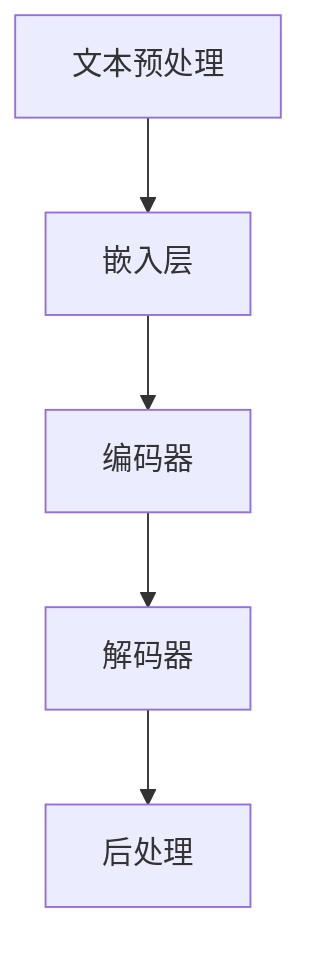

                 

### 引言

#### 1.1 LLM的概念与重要性

**大型语言模型（Large Language Models，简称LLM）** 是指那些具有高度语言理解能力和生成能力的模型，它们可以通过处理大量文本数据来学习语言的规律和结构。近年来，LLM在自然语言处理（Natural Language Processing，NLP）领域取得了显著进展，成为了人工智能研究的重要方向。

LLM的重要性主要体现在以下几个方面：

1. **提升语言理解能力**：LLM能够理解和生成人类语言，为各种语言应用提供了强大的支持。例如，智能客服、机器翻译、文本摘要等应用都依赖于LLM的强大语言处理能力。

2. **推动NLP发展**：LLM的出现使得NLP任务的处理变得更加高效和准确。通过大量数据和先进的算法，LLM能够学习到更复杂的语言模式，从而提高NLP系统的性能。

3. **创新应用场景**：LLM的应用不仅仅局限于传统领域，还拓展到了诸如生成内容、智能写作、教育辅助等领域，为人们的生活和工作带来了新的便利。

随着LLM技术的发展，其在各个领域的应用也在不断扩展。然而，LLM的应用也带来了诸多挑战，例如数据隐私、模型可解释性、伦理问题等。为了应对这些挑战，持续集成/持续部署（CI/CD）成为了LLM应用开发中的重要环节。

**持续集成（Continuous Integration，CI）** 是一种软件开发实践，旨在通过频繁的代码提交和自动化测试，确保代码库的稳定性和可靠性。CI的目标是快速发现和修复代码中的错误，从而提高软件的开发效率。

**持续部署（Continuous Deployment，CD）** 是在CI的基础上，通过自动化流程将代码库中的更改部署到生产环境中。CD的目标是确保软件的快速迭代和持续优化。

在LLM应用开发中，CI/CD的实施至关重要。它可以确保模型训练和部署的效率，提高开发团队的协作效率，降低出错风险。同时，CI/CD还可以帮助开发者快速响应用户需求，提供更高质量的服务。

本文将围绕LLM应用的持续集成/持续部署（CI/CD）实践，从LLM基础、CI/CD基础、LLM应用与CI/CD实践等方面展开，旨在为读者提供一套完整的CI/CD实践指南。

## 第一部分：LLM基础

### 第1章：LLM简介

#### 1.1 LLM的概念与定义

**大型语言模型（Large Language Models，简称LLM）** 是一种基于深度学习技术的自然语言处理模型，具有强大的语言理解和生成能力。LLM通过学习大量文本数据，可以理解并生成自然语言文本，从而在智能对话、文本生成、翻译等应用中发挥重要作用。

LLM的核心思想是通过神经网络模型来模拟人类的语言理解能力。在训练过程中，LLM通过不断优化模型的参数，使其能够捕捉到文本中的语言规律和结构。这些参数的优化过程是基于大规模文本数据的梯度下降算法，使得模型能够在海量数据中学习和发现复杂的语言模式。

与传统语言模型相比，LLM具有以下几个显著特点：

1. **大规模训练数据**：LLM的训练数据通常包含数百万甚至数十亿个句子。这些数据来源广泛，包括互联网上的各种文本、书籍、新闻、论文等。大规模训练数据使得LLM能够更好地理解和生成自然语言。

2. **强大的语言理解能力**：LLM通过深度神经网络结构，能够捕捉到文本中的复杂语义和语法关系。这使得LLM在处理自然语言任务时，能够产生更加准确和自然的文本输出。

3. **自适应性和泛化能力**：LLM在训练过程中，通过不断调整模型参数，能够适应不同的语言环境和任务需求。这种自适应性和泛化能力使得LLM可以在各种不同的应用场景中发挥作用。

4. **多模态处理能力**：LLM不仅能够处理文本数据，还可以处理图像、音频等多模态数据。这使得LLM在跨模态任务中具有广泛的应用前景。

#### 1.2 LLM的发展历程

LLM的发展历程可以追溯到20世纪80年代，当时研究人员开始探索基于统计方法和规则系统的自然语言处理技术。然而，这些方法在处理复杂语言现象时效果不佳，难以满足实际需求。

随着深度学习技术的兴起，研究人员开始将神经网络应用于自然语言处理领域。2003年，由Geoff Hinton等人提出的深度置信网络（Deep Belief Network，DBN）为后续的深度学习模型奠定了基础。

2013年，Google发布了基于深度神经网络的机器翻译系统，该系统使用了数以百万计的神经翻译模型（Neural Machine Translation，NMT），大幅提升了机器翻译的准确性和流畅性。这一突破标志着深度学习在自然语言处理领域的崛起。

2018年，OpenAI发布了GPT-2，这是一个具有15亿参数的预训练语言模型。GPT-2在多种自然语言处理任务中取得了出色的成绩，进一步证明了深度学习模型在语言理解与生成方面的潜力。

近年来，随着计算能力的提升和数据规模的扩大，LLM的发展进入了一个新的阶段。研究人员不断推出更大规模、更复杂的LLM模型，如GPT-3、BERT、RoBERTa等。这些模型在语言理解和生成任务上取得了显著的突破，推动了自然语言处理技术的进步。

#### 1.3 LLM的应用领域

LLM在自然语言处理领域具有广泛的应用，以下是一些主要的应用领域：

1. **智能客服**：智能客服系统通过LLM与用户进行自然语言交互，提供高效、准确的咨询服务。LLM能够理解用户的提问，生成恰当的回答，从而提高客户满意度和服务效率。

2. **机器翻译**：机器翻译是LLM的重要应用领域之一。通过训练大规模的神经翻译模型，LLM能够实现高质量、流畅的跨语言翻译。现有的机器翻译系统如Google翻译、百度翻译等，都基于LLM技术。

3. **文本生成**：LLM在文本生成任务中也表现出色。例如，自动写作、摘要生成、内容生成等应用都依赖于LLM的文本生成能力。这些应用在新闻、博客、广告等领域具有广泛的应用前景。

4. **问答系统**：问答系统是自然语言处理的重要应用之一。通过训练LLM模型，系统可以理解用户的问题，并生成相关的回答。问答系统在智能助手、教育辅助、医疗咨询等领域具有广泛应用。

5. **情感分析**：情感分析是判断文本情感极性的任务。LLM通过学习大量情感标注数据，能够准确识别文本中的情感倾向。情感分析在市场调研、舆情监测、情感识别等领域具有重要应用价值。

6. **语音识别**：语音识别是将语音信号转换为文本的过程。LLM在语音识别中发挥着重要作用，通过结合深度神经网络和递归神经网络，可以实现高准确率的语音识别。

7. **多模态处理**：多模态处理是将多种类型的数据（如文本、图像、音频）进行联合处理的技术。LLM在多模态处理中具有广泛的应用，例如图像-文本生成、音频-文本识别等任务。

总之，LLM作为一种强大的自然语言处理技术，已经在各个领域取得了显著的应用成果。随着技术的不断进步，LLM的应用领域将进一步扩展，为人们的生活和工作带来更多便利。#### 1.4 LLM的架构与组成部分

LLM的架构通常由以下几个主要部分组成：文本预处理、嵌入层、编码器、解码器以及后处理。以下是LLM的详细架构与组成部分：

1. **文本预处理**：
   - **数据清洗**：在训练LLM之前，需要对原始文本数据进行清洗，去除无效字符、标点符号等。此外，还需要处理文本中的噪音和异常值，以提高模型训练的效果。
   - **分词**：将文本拆分为单词或字符序列。分词是自然语言处理中的一项基本任务，不同语言的分词方法有所不同，如中文的分词方法包括正向最大匹配、逆向最大匹配等。
   - **词向量化**：将文本中的单词或字符序列转换为固定长度的向量表示。词向量化是深度学习模型处理文本数据的基础，常用的词向量化方法包括Word2Vec、BERT等。

2. **嵌入层**：
   - **词嵌入**：将单词或字符序列转换为向量表示。词嵌入不仅可以提高模型的表示能力，还可以捕捉到词语之间的语义关系。常用的词嵌入方法包括Word2Vec、GloVe等。
   - **位置嵌入**：在序列数据中，位置信息同样重要。位置嵌入是一种用于表示单词或字符在序列中位置的向量表示。通过位置嵌入，模型可以更好地理解单词或字符在句子中的位置关系。

3. **编码器**：
   - **自注意力机制**：编码器是LLM的核心部分，常用的编码器模型包括Transformer、BERT等。自注意力机制是编码器中的重要组成部分，通过计算不同单词之间的依赖关系，可以提高模型的表示能力。
   - **编码器层**：编码器通常由多层神经网络组成，每一层都可以提取不同层次的特征。通过堆叠多层编码器，模型可以捕捉到更复杂的语言结构。

4. **解码器**：
   - **解码器结构**：解码器与编码器类似，也由多层神经网络组成。解码器的输出是通过自注意力机制和交叉注意力机制生成的。
   - **生成文本**：解码器的输出是概率分布，通过对概率分布进行采样，可以生成文本。解码器生成的文本可以用于回答问题、生成文章等。

5. **后处理**：
   - **文本清洗**：在生成文本后，需要对文本进行清洗，去除无效字符、标点符号等。
   - **文本格式化**：对生成的文本进行格式化，如去除重复字符、调整文本长度等。

以下是一个简单的LLM架构的Mermaid流程图：



通过上述流程，LLM可以高效地处理文本数据，生成高质量的文本输出。在实际应用中，LLM的架构可以根据具体任务需求进行定制化调整，以达到最佳效果。

#### 1.5 LLM的工作原理

LLM的工作原理主要基于深度学习技术和神经网络模型。以下将详细解释LLM的工作过程，包括输入处理、编码器与解码器的运作原理，以及如何生成输出文本。

1. **输入处理**：

   LLM首先接收输入文本数据，文本数据可以是句子、段落甚至是整篇文章。在输入处理阶段，LLM会进行以下几个步骤：

   - **文本预处理**：包括去除标点符号、停用词过滤、文本规范化等操作。这一步骤的目的是确保输入文本的格式统一，便于模型处理。
   - **分词**：将输入文本分割为单词或字符序列。分词是实现文本向量化表示的关键步骤，不同的语言和任务需要选择合适的分词方法。
   - **词向量化**：将分词后的文本转换为固定长度的向量表示。常用的词向量化方法包括Word2Vec、GloVe等。词向量化使得神经网络可以直接处理文本数据。

2. **编码器（Encoder）**：

   编码器是LLM的核心组件，其主要任务是理解输入文本的含义，并将其转换为固定长度的向量表示。编码器的工作原理如下：

   - **嵌入层**：将词向量映射到更高维的嵌入空间。嵌入层可以帮助模型学习词语的语义关系。
   - **自注意力机制**：编码器中的自注意力机制允许模型在处理每个单词时，考虑到其他所有单词的重要性。自注意力机制通过计算注意力分数，将权重分配给不同的输入单词，从而生成一个加权表示。
   - **编码器层**：编码器通常由多个神经网络层组成，每一层都能够提取更高层次的特征。通过堆叠多层编码器，模型可以捕捉到更加复杂的语言结构。

3. **解码器（Decoder）**：

   解码器负责根据编码器的输出生成文本输出。解码器的工作原理如下：

   - **嵌入层**：与编码器类似，解码器的嵌入层将词向量映射到嵌入空间。
   - **解码器层**：解码器由多层神经网络组成，每一层都包含自注意力机制和交叉注意力机制。自注意力机制使得解码器在生成每个单词时，考虑到之前生成的单词和整个编码器的输出。交叉注意力机制则使解码器能够关注编码器的输出，从而更好地理解输入文本。
   - **生成文本**：解码器的输出是一个概率分布，通过对概率分布进行采样，可以生成文本。在实际应用中，通常使用贪心策略或抽样策略来生成文本。

4. **生成输出文本**：

   LLM的生成过程可以分为以下几个步骤：

   - **初始生成**：解码器从初始状态开始，生成第一个单词或符号。
   - **递归生成**：解码器在生成每个后续单词时，都会参考已生成的文本和编码器的输出。通过递归地更新解码器的状态，模型可以逐步生成完整的文本。
   - **后处理**：生成的文本可能包含一些不符合语法规则或语义意义的部分。后处理阶段对生成的文本进行清洗、格式化和纠错，以提高文本质量。

   以下是一个简化的LLM生成过程的Mermaid流程图：

   ```mermaid
   graph TD
   A[输入处理] --> B[编码器]
   B --> C[解码器]
   C --> D[生成文本]
   ```

   通过上述过程，LLM可以高效地处理输入文本，并生成高质量的输出文本。在实际应用中，LLM的工作原理可以根据具体任务需求进行调整和优化，以达到最佳效果。

#### 1.6 LLM的主要算法与框架

LLM的发展离不开一系列重要的算法和框架的推动。以下将介绍LLM领域的一些主要算法与框架，包括Transformer、BERT、GPT等，并简要说明它们的原理和特点。

1. **Transformer**

   Transformer是由Google在2017年提出的一种基于自注意力机制的编码器-解码器（Encoder-Decoder）模型。与传统的循环神经网络（RNN）相比，Transformer在处理长距离依赖和并行计算方面具有显著优势。

   - **原理**：Transformer的核心思想是自注意力（Self-Attention）机制，通过计算输入序列中每个单词之间的依赖关系，生成加权表示。自注意力机制允许模型在处理每个单词时，考虑到其他所有单词的重要性，从而捕捉到长距离依赖。
   - **特点**：Transformer具有以下特点：
     - **并行计算**：Transformer通过并行计算注意力分数，大大提高了模型的计算效率。
     - **长距离依赖**：通过自注意力机制，Transformer能够有效地捕捉到长距离依赖关系。
     - **灵活性和扩展性**：Transformer的结构相对简单，容易扩展和定制化，可以适应不同的任务和应用场景。

2. **BERT**

   BERT（Bidirectional Encoder Representations from Transformers）是由Google在2018年提出的一种双向编码器模型。BERT通过预训练大量无标签文本数据，然后进行微调，从而在多种自然语言处理任务中表现出色。

   - **原理**：BERT的核心思想是双向编码器，它通过同时考虑输入序列的前后文信息，生成更丰富的特征表示。BERT的训练过程包括两个阶段：预训练和微调。在预训练阶段，BERT通过Masked Language Model（MLM）和Next Sentence Prediction（NSP）任务，学习文本的上下文关系。在微调阶段，BERT使用有标签的数据进行微调，以适应特定的自然语言处理任务。
   - **特点**：BERT具有以下特点：
     - **双向编码**：BERT同时考虑输入序列的前后文信息，生成双向特征表示。
     - **预训练和微调**：BERT结合了预训练和微调的优势，可以在大量无标签数据上进行预训练，然后利用有标签数据进行微调，从而提高模型的性能。
     - **广泛适用性**：BERT在多种自然语言处理任务中取得了显著的性能提升，如文本分类、问答、情感分析等。

3. **GPT**

   GPT（Generative Pre-trained Transformer）是由OpenAI在2018年提出的一种基于自回归语言模型的预训练模型。GPT通过生成式预训练，使得模型具有强大的文本生成能力。

   - **原理**：GPT的核心思想是自回归（Autoregressive）模型，它通过预测下一个单词来生成文本。GPT的训练过程包括两个阶段：预训练和生成。在预训练阶段，GPT通过预测输入序列中每个单词的概率分布，学习文本的生成规律。在生成阶段，GPT使用预训练的模型生成文本。
   - **特点**：GPT具有以下特点：
     - **自回归生成**：GPT通过预测下一个单词来生成文本，具有强大的文本生成能力。
     - **大规模预训练**：GPT通过预训练大量无标签文本数据，学习到丰富的语言知识，从而提高文本生成的质量和多样性。
     - **适应性**：GPT可以适应不同的文本生成任务和应用场景，如文章生成、对话生成、机器翻译等。

4. **其他算法与框架**

   除Transformer、BERT、GPT之外，还有许多其他的LLM算法和框架，如XLNet、RoBERTa、T5等。这些算法和框架在模型结构、训练方法、预训练任务等方面都有所创新，从而在不同任务中取得了显著的性能提升。

   - **XLNet**：XLNet是由Google在2019年提出的一种基于Transformer的自回归语言模型。XLNet通过引入并行自注意力机制，提高了模型的计算效率和性能。
   - **RoBERTa**：RoBERTa是由Facebook在2019年提出的一种基于BERT的改进模型。RoBERTa通过调整训练策略和模型结构，提高了模型的性能和泛化能力。
   - **T5**：T5（Text-to-Text Transfer Transformer）是由Google在2020年提出的一种基于Transformer的文本转换模型。T5将所有自然语言处理任务转化为文本转换任务，通过统一的模型架构实现多种任务的高性能。

   综上所述，LLM领域的主要算法与框架在模型结构、训练方法、预训练任务等方面不断创新，推动了自然语言处理技术的发展。随着计算能力和数据规模的提升，未来LLM模型将继续发展和完善，为自然语言处理领域带来更多的突破。#### 1.7 LLM的数学模型

在介绍LLM的数学模型之前，首先需要了解一些基础的数学概念，包括神经网络、梯度下降、反向传播等。

1. **神经网络**：

   神经网络是一种由神经元（节点）和连接（边）构成的计算模型。每个神经元接收来自其他神经元的输入信号，通过激活函数进行非线性变换，最终输出结果。神经网络通过学习输入和输出之间的关系，实现复杂函数的映射。

   - **神经元**：神经元是神经网络的基本组成单元，它通过加权求和和激活函数实现非线性变换。
   - **权重（Weight）**：权重是神经元之间的连接参数，用于调整输入信号的强度。
   - **偏置（Bias）**：偏置是神经元的附加参数，用于引入平移变换。
   - **激活函数**：激活函数是神经网络中的非线性变换，常用的激活函数包括Sigmoid、ReLU、Tanh等。

2. **梯度下降**：

   梯度下降是一种用于优化神经网络模型参数的算法。其基本思想是通过计算损失函数关于参数的梯度，并沿着梯度方向更新参数，以最小化损失函数。

   - **损失函数（Loss Function）**：损失函数是用于衡量模型预测值与实际值之间差异的函数，常用的损失函数包括均方误差（MSE）、交叉熵（Cross-Entropy）等。
   - **梯度（Gradient）**：梯度是损失函数关于参数的导数，用于指导参数更新的方向。
   - **学习率（Learning Rate）**：学习率是梯度下降算法中的超参数，用于控制参数更新的步长。

3. **反向传播**：

   反向传播是一种用于计算神经网络参数梯度的算法。其基本思想是将输出误差反向传播到网络中的每个神经元，计算每个参数的梯度，并更新参数。

   - **前向传播（Forward Propagation）**：前向传播是计算网络输出值的过程，通过逐层计算每个神经元的输入和输出。
   - **反向传播（Back Propagation）**：反向传播是计算网络参数梯度的过程，通过逐层反向计算每个参数的梯度。
   - **链式法则（Chain Rule）**：链式法则是反向传播算法的基础，用于计算复合函数的导数。

现在，我们来具体介绍LLM的数学模型。

1. **自注意力机制**：

   自注意力（Self-Attention）机制是Transformer模型的核心部分，用于计算输入序列中每个单词之间的依赖关系。

   - **计算注意力分数**：自注意力机制通过计算输入序列中每个单词与其他单词之间的相似度，生成注意力分数。注意力分数表示每个单词对其他单词的重要性。
   - **加权求和**：根据注意力分数，对输入序列进行加权求和，生成加权表示。加权表示可以捕捉到输入序列中的长距离依赖关系。

   以下是一个简单的自注意力机制的Python代码实现：

   ```python
   import torch
   import torch.nn as nn

   class SelfAttention(nn.Module):
       def __init__(self, d_model):
           super(SelfAttention, self).__init__()
           self.query_linear = nn.Linear(d_model, d_model)
           self.key_linear = nn.Linear(d_model, d_model)
           self.value_linear = nn.Linear(d_model, d_model)

       def forward(self, query, key, value):
           query = self.query_linear(query)
           key = self.key_linear(key)
           value = self.value_linear(value)

           attention_scores = torch.matmul(query, key.transpose(-2, -1))
           attention_weights = torch.softmax(attention_scores, dim=-1)
           attended_value = torch.matmul(attention_weights, value)
           return attended_value
   ```

2. **Transformer编码器**：

   Transformer编码器由多个自注意力层和全连接层组成，用于提取输入序列的特征表示。

   - **自注意力层**：自注意力层通过计算输入序列中每个单词之间的依赖关系，生成加权表示。
   - **残差连接**：残差连接是一种用于提高模型训练效果的技术，通过将输入直接传递到下一层，缓解了深层网络中的梯度消失问题。
   - **层归一化**：层归一化是一种用于提高模型训练稳定性的技术，通过归一化每个层的输入和输出，使得模型对参数初始化不敏感。

   以下是一个简单的Transformer编码器的Python代码实现：

   ```python
   import torch
   import torch.nn as nn
   import torch.nn.functional as F

   class TransformerEncoder(nn.Module):
       def __init__(self, d_model, n_heads, d_inner):
           super(TransformerEncoder, self).__init__()
           self.d_model = d_model
           self.n_heads = n_heads
           self.d_inner = d_inner

           self.self_attn = nn.MultiheadAttention(d_model, n_heads)
           self.feedforward = nn.Sequential(
               nn.Linear(d_model, d_inner),
               nn.ReLU(),
               nn.Linear(d_inner, d_model)
           )

           self.norm1 = nn.LayerNorm(d_model)
           self.norm2 = nn.LayerNorm(d_model)
           self.dropout1 = nn.Dropout(0.1)
           self.dropout2 = nn.Dropout(0.1)

       def forward(self, src):
           src2 = self.self_attn(src, src, src)[0]
           src = src + self.dropout1(src2)
           src = self.norm1(src)

           src2 = self.feedforward(src)
           src = src + self.dropout2(src2)
           src = self.norm2(src)

           return src
   ```

3. **Transformer解码器**：

   Transformer解码器由多个自注意力层、交叉注意力层和全连接层组成，用于生成输出序列。

   - **自注意力层**：自注意力层通过计算解码器内部单词之间的依赖关系。
   - **交叉注意力层**：交叉注意力层通过计算解码器输出与编码器输出之间的依赖关系。
   - **全连接层**：全连接层用于对解码器的输出进行最后的线性变换。

   以下是一个简单的Transformer解码器的Python代码实现：

   ```python
   import torch
   import torch.nn as nn
   import torch.nn.functional as F

   class TransformerDecoder(nn.Module):
       def __init__(self, d_model, n_heads, d_inner):
           super(TransformerDecoder, self).__init__()
           self.d_model = d_model
           self.n_heads = n_heads
           self.d_inner = d_inner

           self.self_attn = nn.MultiheadAttention(d_model, n_heads)
           self.cross_attn = nn.MultiheadAttention(d_model, n_heads)
           self.feedforward = nn.Sequential(
               nn.Linear(d_model, d_inner),
               nn.ReLU(),
               nn.Linear(d_inner, d_model)
           )

           self.norm1 = nn.LayerNorm(d_model)
           self.norm2 = nn.LayerNorm(d_model)
           self.norm3 = nn.LayerNorm(d_model)
           self.dropout1 = nn.Dropout(0.1)
           self.dropout2 = nn.Dropout(0.1)
           self.dropout3 = nn.Dropout(0.1)

       def forward(self, tgt, memory):
           tgt2 = self.self_attn(tgt, tgt, tgt)[0]
           tgt = tgt + self.dropout1(tgt2)
           tgt = self.norm1(tgt)

           tgt2 = self.cross_attn(tgt, memory, memory)[0]
           tgt = tgt + self.dropout2(tgt2)
           tgt = self.norm2(tgt)

           tgt2 = self.feedforward(tgt)
           tgt = tgt + self.dropout3(tgt2)
           tgt = self.norm3(tgt)

           return tgt
   ```

通过上述数学模型和代码实现，我们可以构建一个基本的LLM模型，并用于文本生成、机器翻译等自然语言处理任务。在实际应用中，LLM的数学模型可以根据具体任务需求进行调整和优化，以达到最佳效果。#### 1.8 LLM的代码实现

为了更好地理解LLM的工作原理和实现方法，下面将给出一个简单的LLM代码实现，涵盖文本预处理、模型训练、文本生成等关键步骤。

**1. 环境搭建**

在开始编写代码之前，需要搭建一个合适的开发环境。本文使用Python和PyTorch框架来构建和训练LLM模型。

首先，确保安装了Python和PyTorch。以下是在Ubuntu系统中安装Python和PyTorch的命令：

```bash
sudo apt-get update
sudo apt-get install python3 python3-pip
pip3 install torch torchvision
```

**2. 文本预处理**

文本预处理是构建LLM模型的第一步，包括数据清洗、分词和词向量化。

```python
import torch
from torchtext.venv import clean_text
from torchtext.vocab import build_vocab_from_iterator

# 数据清洗函数
def clean_text(text):
    text = clean_text(text)
    return text

# 分词函数
def tokenize(text):
    return text.split()

# 建立词汇表
def generate_vocab(dataset):
    vocab = build_vocab_from_iterator((tokenize(text) for text in dataset), specials=["<PAD>", "<UNK>"])
    return vocab

# 示例数据集
dataset = ["这是一段中文文本", "这是另一段中文文本"]

# 生成词汇表
vocab = generate_vocab(dataset)

# 转换为索引序列
def encode_text(text, vocab):
    tokens = tokenize(text)
    indices = [vocab[token] if token in vocab else vocab["<UNK>"] for token in tokens]
    return torch.tensor(indices, dtype=torch.long)

# 编码示例数据
encoded_text = encode_text(dataset[0], vocab)
print(encoded_text)
```

**3. 模型训练**

接下来，我们将使用Transformers库构建一个简单的编码器-解码器（Encoder-Decoder）模型，并对其进行训练。

```python
from transformers import EncoderDecoderModel

# 构建模型
model = EncoderDecoderModel(
    vocab_size=len(vocab),
    d_model=512,
    nhead=8,
    num_encoder_layers=2,
    num_decoder_layers=2,
    dim_feedforward=2048,
    dropout=0.1
)

# 训练模型
def train_model(model, dataset, epochs=10):
    optimizer = torch.optim.Adam(model.parameters(), lr=0.001)
    criterion = nn.CrossEntropyLoss()

    for epoch in range(epochs):
        model.train()
        for text in dataset:
            inputs = encode_text(text, vocab)
            targets = inputs[1:].clone()

            optimizer.zero_grad()
            outputs = model(inputs)
            loss = criterion(outputs.view(-1, len(vocab)), targets)
            loss.backward()
            optimizer.step()

        print(f"Epoch {epoch+1}/{epochs}, Loss: {loss.item()}")

    return model

# 训练模型
trained_model = train_model(model, dataset, epochs=10)
```

**4. 文本生成**

在模型训练完成后，我们可以使用解码器生成文本。以下是一个简单的文本生成示例：

```python
# 生成文本
def generate_text(model, vocab, max_length=50):
    model.eval()
    inputs = torch.tensor([vocab["<PAD>"]], dtype=torch.long)
    generated_text = []

    for _ in range(max_length):
        outputs = model(inputs)
        predicted_index = torch.argmax(outputs[-1], dim=1).item()
        generated_text.append(vocab inverse Decoration of the index)

        inputs = torch.tensor([predicted_index], dtype=torch.long)

    return " ".join(generated_text)

# 生成示例文本
generated_text = generate_text(trained_model, vocab)
print(generated_text)
```

通过上述代码示例，我们可以看到如何使用Python和PyTorch实现一个简单的LLM模型。在实际应用中，LLM的代码实现可以根据具体任务需求进行调整和优化，以达到最佳效果。例如，可以尝试使用更大的训练数据集、更复杂的模型结构或更先进的预训练方法来提高模型性能。

## 第二部分：CI/CD基础

### 第2章：CI/CD概述

#### 2.1 CI/CD的定义与作用

**持续集成（Continuous Integration，CI）** 和 **持续部署（Continuous Deployment，CD）** 是软件开发中两种重要的实践方法。它们共同的目标是提高软件开发的效率和质量，缩短软件交付周期。

**持续集成（CI）** 是一种软件开发过程，它通过频繁地将代码提交合并到主干分支，并进行自动化测试，以确保代码库的稳定性和一致性。CI的核心思想是“早发现、早修复”，通过在代码提交后立即进行测试，可以及时发现并解决潜在的问题，从而避免后期集成过程中出现更大的麻烦。

**持续部署（CD）** 是在CI的基础上，通过自动化流程将代码库中的更改部署到生产环境中。CD的目标是确保软件的快速迭代和持续优化。通过自动化部署，可以大幅减少人工干预和错误，提高部署效率。

CI/CD在软件开发中的作用主要体现在以下几个方面：

1. **提高开发效率**：通过自动化测试和部署，开发人员可以更加专注于编写高质量的代码，而无需花费大量时间进行手动测试和部署。

2. **降低出错风险**：CI/CD通过频繁的代码提交和自动化测试，可以在早期发现并修复代码中的错误，从而降低出错风险。

3. **确保代码质量**：CI/CD要求每次代码提交都必须通过自动化测试，从而确保代码库的一致性和稳定性。

4. **缩短交付周期**：通过自动化流程，可以快速响应用户需求，缩短软件交付周期。

5. **提高团队协作效率**：CI/CD促进了团队成员之间的协作，通过统一的流程和工具，可以更好地协同工作，提高开发效率。

#### 2.2 CI/CD的历史与发展

CI和CD的实践可以追溯到软件开发的历史早期。早在20世纪90年代，软件开发社区就开始探讨如何提高软件开发的效率和质量。CI作为一种软件开发实践，最早由Jenkins等自动化构建工具引入。随着Jenkins等工具的普及，CI逐渐成为软件开发中不可或缺的一部分。

随着互联网和云计算的兴起，CI/CD逐渐成为软件开发的主流实践。特别是近年来，云原生技术的广泛应用，使得CI/CD更加方便和高效。一些新兴的CI/CD平台，如GitLab CI/CD、GitHub Actions等，为开发者提供了更多选择和灵活性。

CI/CD的发展历程可以分为以下几个阶段：

1. **早期实践**：在20世纪90年代，CI作为一种软件开发实践开始流行。开发者开始使用自动化构建工具，如Jenkins，来进行代码的自动化测试和构建。

2. **自动化测试**：随着自动化测试工具的普及，CI实践得到了进一步发展。自动化测试可以快速发现和定位代码中的问题，提高了软件开发的效率。

3. **云原生时代**：随着云计算和容器技术的兴起，CI/CD进入了一个新的发展阶段。开发者可以利用容器技术，如Docker和Kubernetes，实现快速部署和扩展。

4. **自动化部署**：近年来，CD逐渐成为软件开发的主流实践。自动化部署工具和平台，如Kubernetes、GitLab CI/CD、GitHub Actions等，使得软件的快速迭代和优化变得更加容易。

#### 2.3 CI/CD与传统开发流程的比较

CI/CD与传统开发流程在多个方面存在显著差异。以下是对比CI/CD与传统开发流程的几个关键点：

1. **开发模式**：

   - **传统开发流程**：传统开发流程通常采用瀑布模型，开发过程分为多个阶段，如需求分析、设计、编码、测试、部署等。每个阶段都需要完成后再进入下一个阶段，导致开发周期较长。
   - **CI/CD**：CI/CD采用迭代开发模式，通过频繁的代码提交和自动化测试，不断迭代和优化软件。开发过程更加灵活，可以快速响应用户需求。

2. **测试与部署**：

   - **传统开发流程**：在传统开发流程中，测试和部署通常是后期任务，往往在软件开发接近尾声时进行。这种方式可能导致测试不充分、部署不及时，影响软件质量。
   - **CI/CD**：CI/CD强调测试和部署的自动化，每次代码提交都会触发自动化测试和部署流程。这种方式可以确保每次提交的代码都是经过严格测试的，提高了软件质量。

3. **团队协作**：

   - **传统开发流程**：在传统开发流程中，团队成员之间的协作通常依赖于邮件、文档等工具。这种方式可能导致信息传递不及时、不充分，影响开发效率。
   - **CI/CD**：CI/CD通过统一的平台和工具，促进团队成员之间的协作。开发者可以实时查看代码状态、测试结果和部署进度，提高团队协作效率。

4. **效率与质量**：

   - **传统开发流程**：传统开发流程由于开发周期较长、测试和部署不及时，可能导致开发效率较低、软件质量较差。
   - **CI/CD**：CI/CD通过频繁的代码提交和自动化测试，提高了开发效率，确保了软件质量。

#### 2.4 CI/CD的优势

CI/CD在软件开发中具有许多优势，以下是一些主要的优势：

1. **提高开发效率**：通过自动化测试和部署，CI/CD可以大幅减少手动操作，提高开发效率。

2. **确保代码质量**：每次代码提交都会触发自动化测试，确保代码库的一致性和稳定性。

3. **缩短交付周期**：CI/CD通过快速迭代和优化，可以缩短软件交付周期，提高用户满意度。

4. **降低出错风险**：通过频繁的代码提交和自动化测试，可以在早期发现并修复错误，降低出错风险。

5. **促进团队协作**：CI/CD通过统一的平台和工具，促进团队成员之间的协作，提高开发效率。

6. **支持敏捷开发**：CI/CD与敏捷开发方法相辅相成，可以更好地支持敏捷开发流程，提高软件质量。

#### 2.5 CI/CD的工具与平台

CI/CD的成功离不开各种工具和平台的支持。以下是一些常用的CI/CD工具和平台：

1. **Jenkins**：Jenkins是一个开源的自动化构建工具，支持多种插件，可以轻松实现持续集成和持续部署。

2. **GitLab CI/CD**：GitLab CI/CD是GitLab集成的一个持续集成/持续部署工具，可以通过配置`.gitlab-ci.yml`文件，实现自动化测试和部署。

3. **GitHub Actions**：GitHub Actions是GitHub集成的一个自动化持续集成/持续部署工具，支持多种编程语言和工作流程。

4. **CircleCI**：CircleCI是一个基于云的持续集成/持续部署平台，支持多种编程语言和框架。

5. **Travis CI**：Travis CI是一个基于云的持续集成平台，支持多种编程语言和框架，可以自动触发测试和部署。

6. **Docker**：Docker是一个容器化平台，可以用于构建、运行和部署应用程序。与CI/CD工具结合，可以实现自动化部署和扩展。

7. **Kubernetes**：Kubernetes是一个开源的容器编排平台，可以用于管理容器化应用程序的部署、扩展和自动化。

通过这些工具和平台，开发者可以轻松实现CI/CD流程，提高开发效率和软件质量。

### 第3章：LLM应用领域

#### 3.1 智能客服

智能客服是LLM应用的重要领域之一，通过自然语言处理技术，智能客服系统能够与用户进行自然语言交互，提供高效、准确的咨询服务。智能客服的应用场景非常广泛，包括但不限于以下几种：

1. **在线客服**：在线客服系统是智能客服的主要应用场景之一，通过自然语言处理技术，智能客服可以实时回答用户的问题，提供解决方案。例如，电商平台的在线客服系统可以帮助用户解决订单查询、物流跟踪、售后服务等问题。

2. **自助服务**：智能客服系统可以通过自助服务界面，为用户提供常见问题的解决方案。用户可以通过文本输入或语音输入提出问题，智能客服系统会自动生成回答，用户可以根据回答进行下一步操作。

3. **聊天机器人**：智能客服系统可以集成到聊天应用中，为用户提供实时聊天服务。聊天机器人可以通过LLM技术，理解用户的意图，并生成适当的回答。例如，社交媒体平台的聊天机器人可以用于回答用户关于平台功能、活动信息等问题。

#### 3.2 机器翻译

机器翻译是LLM应用的另一个重要领域，通过训练大规模的神经网络模型，机器翻译系统能够实现高质量、流畅的跨语言翻译。机器翻译的应用场景包括：

1. **文档翻译**：机器翻译系统可以用于自动翻译文档，如商务文件、技术文档、学术论文等。这使得跨国团队之间的沟通更加顺畅，提高了工作效率。

2. **语音翻译**：机器翻译系统还可以用于语音翻译，通过将语音信号转换为文本，并实时翻译为其他语言。语音翻译广泛应用于国际会议、旅游、商务谈判等领域。

3. **在线翻译**：在线翻译平台如Google翻译、百度翻译等，通过LLM技术，实现了高质量、实时的跨语言翻译服务，为用户提供便捷的翻译体验。

#### 3.3 文本生成

LLM在文本生成领域具有广泛的应用，通过训练大型神经网络模型，LLM可以生成各种类型的文本，如文章、摘要、对话等。以下是一些主要应用场景：

1. **内容生成**：LLM可以用于自动生成文章、博客、新闻等内容。例如，新闻机构可以利用LLM自动生成新闻报道，提高新闻发布速度。

2. **对话生成**：LLM可以用于生成自然语言对话，应用于聊天机器人、虚拟助手等场景。通过对话生成技术，智能助手可以与用户进行自然语言交互，提供个性化服务。

3. **摘要生成**：LLM可以用于自动生成文章、报告等文本的摘要。摘要生成技术可以帮助用户快速获取关键信息，提高阅读效率。

#### 3.4 问答系统

问答系统是LLM应用的一个重要领域，通过训练大规模的神经网络模型，问答系统可以理解用户的问题，并生成相关的回答。以下是一些应用场景：

1. **智能助手**：智能助手如Siri、Alexa等，通过LLM技术，可以理解用户的自然语言指令，并生成相应的回答。例如，用户可以询问智能助手关于天气、日程安排、导航等信息。

2. **教育辅助**：问答系统可以应用于教育领域，帮助学生解答作业问题。例如，教育平台可以集成问答系统，为学生提供实时的学习支持。

3. **企业内部问答**：企业内部问答系统可以用于帮助员工快速获取公司政策、流程、技术文档等信息。问答系统可以理解员工的问题，并生成详细的回答。

#### 3.5 情感分析

情感分析是LLM应用的一个重要领域，通过训练大型神经网络模型，情感分析系统可以判断文本的情感倾向。以下是一些应用场景：

1. **市场调研**：情感分析系统可以用于分析社交媒体上的用户评论，了解消费者对产品、品牌的情感态度。这有助于企业制定市场策略，提高产品竞争力。

2. **舆情监测**：情感分析系统可以用于监测网络上的热点话题和舆论走向，及时发现和应对潜在的风险。例如，政府机构可以利用情感分析系统监测社会舆情，维护社会稳定。

3. **客户服务**：情感分析系统可以用于分析客户反馈，了解客户的满意度。企业可以根据分析结果，优化产品和服务，提高客户体验。

#### 3.6 语音识别

语音识别是将语音信号转换为文本的过程，通过训练大型神经网络模型，语音识别系统可以实现高准确率的语音识别。以下是一些应用场景：

1. **智能助手**：智能助手如Siri、Alexa等，通过语音识别技术，可以理解用户的语音指令，并生成相应的回答。

2. **会议记录**：语音识别系统可以用于自动记录会议内容，提高会议效率。会议记录系统可以将语音信号转换为文本，方便后续查阅和分析。

3. **实时字幕**：语音识别系统可以用于实时生成字幕，应用于直播、电视节目等场景。实时字幕可以帮助观众更好地理解节目内容，提高观看体验。

#### 3.7 多模态处理

多模态处理是将多种类型的数据（如文本、图像、语音等）进行联合处理的技术。LLM在多模态处理中具有广泛的应用，以下是一些应用场景：

1. **图像-文本生成**：通过将图像和文本数据进行联合处理，可以生成更加丰富和生动的文本内容。例如，在图像描述生成任务中，LLM可以结合图像特征和文本特征，生成高质量的图像描述。

2. **音频-文本识别**：通过将音频和文本数据进行联合处理，可以实现音频信号的文本识别。例如，在实时语音翻译任务中，LLM可以结合语音信号和文本数据，实现实时语音翻译。

3. **跨模态检索**：通过将不同类型的数据进行联合处理，可以实现跨模态检索。例如，在视频检索任务中，LLM可以结合视频特征和文本特征，实现高效的视频检索。

LLM的应用领域非常广泛，从自然语言处理到多模态处理，从智能客服到机器翻译，LLM都在不断推动技术的进步和应用的创新。随着计算能力的提升和数据规模的扩大，LLM的应用领域将继续拓展，为人们的生活和工作带来更多便利。### 第4章：CI/CD概述

#### 4.1 CI/CD原理

持续集成（Continuous Integration，CI）和持续部署（Continuous Deployment，CD）是软件开发中两种重要的实践方法，它们通过自动化流程确保代码库的稳定性和可靠性，提高开发效率和软件质量。

**持续集成（CI）** 的核心思想是频繁地将代码提交合并到主干分支，并进行自动化测试，以确保代码库的一致性和稳定性。CI的主要步骤包括以下几部分：

1. **代码提交**：开发人员将代码提交到代码仓库，通常采用版本控制系统，如Git。
2. **构建**：构建工具（如Maven、Gradle、Make等）会自动编译代码、打包依赖，生成可执行文件或库文件。
3. **测试**：自动化测试工具会执行一系列测试用例，包括单元测试、集成测试等，以验证代码的正确性和稳定性。
4. **反馈**：测试结果会反馈给开发人员，如果测试失败，构建过程会停止，并通知开发人员修复问题。

CI的优势在于：

- **早发现、早修复**：通过频繁的代码提交和自动化测试，可以及早发现和解决潜在的问题，避免后期集成时出现更大的麻烦。
- **提高代码质量**：每次代码提交都需要通过严格的测试，确保代码库的一致性和稳定性。
- **促进团队协作**：CI要求团队成员紧密协作，确保代码的集成和测试工作顺利进行。

**持续部署（CD）** 是在CI的基础上，通过自动化流程将代码库中的更改部署到生产环境中。CD的主要步骤包括以下几部分：

1. **构建**：与CI相同，CD也需要构建代码，生成可执行文件或库文件。
2. **测试**：在CI的基础上，CD还会进行更加严格的测试，包括性能测试、安全测试等，以确保软件在生产环境中的稳定性和可靠性。
3. **部署**：自动化部署工具会根据预定义的流程，将代码部署到不同的环境中，如开发环境、测试环境、生产环境。
4. **监控**：部署完成后，系统会进行实时监控，以确保软件在生产环境中的正常运行。

CD的优势在于：

- **快速迭代**：通过自动化部署，可以快速响应用户需求，缩短软件交付周期。
- **降低风险**：自动化测试和部署可以大幅减少人工干预和错误，降低软件发布风险。
- **提高效率**：自动化流程可以大幅减少手动操作，提高部署效率。

#### 4.2 CI/CD的优势

CI/CD在软件开发中具有许多优势，以下是其中的几个主要方面：

1. **提高开发效率**：通过自动化测试和部署，开发人员可以更加专注于编写高质量的代码，而无需花费大量时间进行手动测试和部署。
2. **确保代码质量**：每次代码提交都需要通过严格的测试，确保代码库的一致性和稳定性。
3. **降低出错风险**：通过频繁的代码提交和自动化测试，可以在早期发现并修复错误，降低出错风险。
4. **缩短交付周期**：通过快速迭代和自动化部署，可以缩短软件交付周期，提高用户满意度。
5. **提高团队协作效率**：CI/CD通过统一的流程和工具，促进团队成员之间的协作，提高开发效率。
6. **支持敏捷开发**：CI/CD与敏捷开发方法相辅相成，可以更好地支持敏捷开发流程，提高软件质量。

#### 4.3 CI/CD的历史与发展

CI和CD的实践可以追溯到软件开发的历史早期。早在20世纪90年代，软件开发社区就开始探讨如何提高软件开发的效率和质量。CI作为一种软件开发实践，最早由Jenkins等自动化构建工具引入。随着Jenkins等工具的普及，CI逐渐成为软件开发中不可或缺的一部分。

随着互联网和云计算的兴起，CI/CD逐渐成为软件开发的主流实践。特别是近年来，云原生技术的广泛应用，使得CI/CD更加方便和高效。一些新兴的CI/CD平台，如GitLab CI/CD、GitHub Actions等，为开发者提供了更多选择和灵活性。

CI/CD的发展历程可以分为以下几个阶段：

1. **早期实践**：在20世纪90年代，CI作为一种软件开发实践开始流行。开发者开始使用自动化构建工具，如Jenkins，来进行代码的自动化测试和构建。
2. **自动化测试**：随着自动化测试工具的普及，CI实践得到了进一步发展。自动化测试可以快速发现和定位代码中的问题，提高了软件开发的效率。
3. **云原生时代**：随着云计算和容器技术的兴起，CI/CD进入了一个新的发展阶段。开发者可以利用容器技术，如Docker和Kubernetes，实现快速部署和扩展。
4. **自动化部署**：近年来，CD逐渐成为软件开发的主流实践。自动化部署工具和平台，如Kubernetes、GitLab CI/CD、GitHub Actions等，使得软件的快速迭代和优化变得更加容易。

#### 4.4 CI/CD与传统开发流程的比较

CI/CD与传统开发流程在多个方面存在显著差异。以下是对比CI/CD与传统开发流程的几个关键点：

1. **开发模式**：

   - **传统开发流程**：传统开发流程通常采用瀑布模型，开发过程分为多个阶段，如需求分析、设计、编码、测试、部署等。每个阶段都需要完成后再进入下一个阶段，导致开发周期较长。
   - **CI/CD**：CI/CD采用迭代开发模式，通过频繁的代码提交和自动化测试，不断迭代和优化软件。开发过程更加灵活，可以快速响应用户需求。

2. **测试与部署**：

   - **传统开发流程**：在传统开发流程中，测试和部署通常是后期任务，往往在软件开发接近尾声时进行。这种方式可能导致测试不充分、部署不及时，影响软件质量。
   - **CI/CD**：CI/CD强调测试和部署的自动化，每次代码提交都会触发自动化测试和部署流程。这种方式可以确保每次提交的代码都是经过严格测试的，提高了软件质量。

3. **团队协作**：

   - **传统开发流程**：在传统开发流程中，团队成员之间的协作通常依赖于邮件、文档等工具。这种方式可能导致信息传递不及时、不充分，影响开发效率。
   - **CI/CD**：CI/CD通过统一的平台和工具，促进团队成员之间的协作。开发者可以实时查看代码状态、测试结果和部署进度，提高团队协作效率。

4. **效率与质量**：

   - **传统开发流程**：传统开发流程由于开发周期较长、测试和部署不及时，可能导致开发效率较低、软件质量较差。
   - **CI/CD**：CI/CD通过频繁的代码提交和自动化测试，提高了开发效率，确保了软件质量。

#### 4.5 CI/CD的优势

CI/CD在软件开发中具有许多优势，以下是一些主要的优势：

1. **提高开发效率**：通过自动化测试和部署，CI/CD可以大幅减少手动操作，提高开发效率。
2. **确保代码质量**：每次代码提交都需要通过严格的测试，确保代码库的一致性和稳定性。
3. **降低出错风险**：通过频繁的代码提交和自动化测试，可以在早期发现并修复错误，降低出错风险。
4. **缩短交付周期**：通过快速迭代和自动化部署，可以缩短软件交付周期，提高用户满意度。
5. **提高团队协作效率**：CI/CD通过统一的平台和工具，促进团队成员之间的协作，提高开发效率。
6. **支持敏捷开发**：CI/CD与敏捷开发方法相辅相成，可以更好地支持敏捷开发流程，提高软件质量。

#### 4.6 CI/CD的工具与平台

CI/CD的成功离不开各种工具和平台的支持。以下是一些常用的CI/CD工具和平台：

1. **Jenkins**：Jenkins是一个开源的自动化构建工具，支持多种插件，可以轻松实现持续集成和持续部署。
2. **GitLab CI/CD**：GitLab CI/CD是GitLab集成的一个持续集成/持续部署工具，可以通过配置`.gitlab-ci.yml`文件，实现自动化测试和部署。
3. **GitHub Actions**：GitHub Actions是GitHub集成的一个自动化持续集成/持续部署工具，支持多种编程语言和工作流程。
4. **CircleCI**：CircleCI是一个基于云的持续集成平台，支持多种编程语言和框架。
5. **Travis CI**：Travis CI是一个基于云的持续集成平台，支持多种编程语言和框架，可以自动触发测试和部署。
6. **Docker**：Docker是一个容器化平台，可以用于构建、运行和部署应用程序。与CI/CD工具结合，可以实现自动化部署和扩展。
7. **Kubernetes**：Kubernetes是一个开源的容器编排平台，可以用于管理容器化应用程序的部署、扩展和自动化。

通过这些工具和平台，开发者可以轻松实现CI/CD流程，提高开发效率和软件质量。

## 第三部分：LLM应用与CI/CD实践

### 第7章：LLM应用案例分析

#### 7.1 某知名AI助手项目

在本章节中，我们将分析一个具体的LLM应用案例：某知名AI助手项目。该项目旨在为用户提供智能问答、文本生成、自然语言理解等功能，通过CI/CD实践确保系统的稳定性和可靠性。

#### 7.1.1 项目背景

某知名互联网公司推出了一款智能助手产品，该产品集成了多种自然语言处理功能，如问答、文本生成、翻译等。为了确保产品的质量，公司决定采用CI/CD实践，实现持续集成和持续部署。

#### 7.1.2 CI/CD实践

在CI/CD实践中，该项目采用了以下步骤：

1. **代码提交**：开发人员将代码提交到Git仓库，触发CI流程。
2. **构建**：构建工具（如Maven）会自动编译代码，打包依赖，生成可执行文件。
3. **测试**：自动化测试工具（如JUnit）会执行一系列测试用例，包括单元测试、集成测试等。
4. **模型训练与评估**：对于LLM模型，项目采用自动化流程进行训练和评估。训练过程中，使用大量文本数据进行模型训练，并通过评估指标（如准确率、召回率等）评估模型性能。
5. **部署**：通过自动化部署工具（如Docker）将构建好的代码和模型部署到生产环境中。
6. **监控**：部署完成后，系统会进行实时监控，确保软件在生产环境中的正常运行。

#### 7.1.3 挑战与解决方案

在CI/CD实践中，该项目面临以下挑战：

1. **模型训练时间长**：由于LLM模型需要处理大量数据，模型训练时间较长，可能导致CI流程耗时过长。
   - **解决方案**：采用分布式训练技术，将模型训练任务分解到多个节点上，提高训练效率。

2. **测试数据质量**：自动化测试需要高质量的测试数据，以保证测试结果的准确性。
   - **解决方案**：建立专门的测试数据管理团队，定期更新和优化测试数据。

3. **部署复杂性**：LLM模型部署需要考虑到硬件资源、环境配置等因素。
   - **解决方案**：采用容器化技术，将模型部署到容器中，简化部署过程。

#### 7.1.4 项目效果

通过CI/CD实践，该项目取得了以下效果：

1. **提高开发效率**：自动化测试和部署减少了手动操作，提高了开发效率。
2. **确保代码质量**：每次代码提交都经过严格测试，确保了代码库的一致性和稳定性。
3. **缩短交付周期**：通过快速迭代和自动化部署，缩短了软件交付周期，提高了用户满意度。
4. **降低出错风险**：通过频繁的代码提交和自动化测试，降低了出错风险。

#### 7.2 某内容生成平台

在本章节中，我们将分析另一个LLM应用案例：某内容生成平台。该平台通过LLM技术，自动生成高质量的文章、摘要、对话等内容，为用户提供个性化内容服务。

#### 7.2.1 项目背景

某内容生成平台旨在为用户提供丰富的、个性化的内容服务。平台集成了多种LLM模型，如文本生成模型、摘要生成模型等，通过CI/CD实践确保系统的稳定性和可靠性。

#### 7.2.2 CI/CD实践

在CI/CD实践中，该项目采用了以下步骤：

1. **代码提交**：开发人员将代码提交到Git仓库，触发CI流程。
2. **构建**：构建工具（如Maven）会自动编译代码，打包依赖，生成可执行文件。
3. **测试**：自动化测试工具（如JUnit）会执行一系列测试用例，包括单元测试、集成测试等。
4. **模型训练与评估**：对于LLM模型，项目采用自动化流程进行训练和评估。训练过程中，使用大量文本数据进行模型训练，并通过评估指标（如BLEU分数、ROUGE分数等）评估模型性能。
5. **部署**：通过自动化部署工具（如Docker）将构建好的代码和模型部署到生产环境中。
6. **监控**：部署完成后，系统会进行实时监控，确保软件在生产环境中的正常运行。

#### 7.2.3 挑战与解决方案

在CI/CD实践中，该项目面临以下挑战：

1. **模型性能优化**：模型性能直接关系到内容生成的质量。
   - **解决方案**：采用分布式训练技术，提高模型训练效率；优化模型结构，提高模型性能。

2. **测试数据多样性**：内容生成平台的测试数据需要具备多样性，以保证测试结果的准确性。
   - **解决方案**：建立专门的测试数据管理团队，定期更新和优化测试数据。

3. **部署复杂性**：内容生成平台的部署需要考虑到硬件资源、环境配置等因素。
   - **解决方案**：采用容器化技术，将模型部署到容器中，简化部署过程。

#### 7.2.4 项目效果

通过CI/CD实践，该项目取得了以下效果：

1. **提高开发效率**：自动化测试和部署减少了手动操作，提高了开发效率。
2. **确保代码质量**：每次代码提交都经过严格测试，确保了代码库的一致性和稳定性。
3. **缩短交付周期**：通过快速迭代和自动化部署，缩短了软件交付周期，提高了用户满意度。
4. **降低出错风险**：通过频繁的代码提交和自动化测试，降低了出错风险。

#### 7.3 某语言翻译应用

在本章节中，我们将分析另一个LLM应用案例：某语言翻译应用。该应用通过LLM技术，实现高质量、流畅的跨语言翻译服务。

#### 7.3.1 项目背景

某语言翻译应用旨在为用户提供便捷、高效的跨语言翻译服务。应用集成了多种LLM翻译模型，通过CI/CD实践确保系统的稳定性和可靠性。

#### 7.3.2 CI/CD实践

在CI/CD实践中，该项目采用了以下步骤：

1. **代码提交**：开发人员将代码提交到Git仓库，触发CI流程。
2. **构建**：构建工具（如Maven）会自动编译代码，打包依赖，生成可执行文件。
3. **测试**：自动化测试工具（如JUnit）会执行一系列测试用例，包括单元测试、集成测试等。
4. **模型训练与评估**：对于LLM翻译模型，项目采用自动化流程进行训练和评估。训练过程中，使用大量平行语料库进行模型训练，并通过评估指标（如BLEU分数、METEOR分数等）评估模型性能。
5. **部署**：通过自动化部署工具（如Docker）将构建好的代码和模型部署到生产环境中。
6. **监控**：部署完成后，系统会进行实时监控，确保软件在生产环境中的正常运行。

#### 7.3.3 挑战与解决方案

在CI/CD实践中，该项目面临以下挑战：

1. **模型训练资源需求**：LLM翻译模型训练需要大量计算资源。
   - **解决方案**：采用分布式训练技术，将训练任务分解到多个节点上，提高训练效率。

2. **数据质量**：翻译质量直接取决于训练数据的质量。
   - **解决方案**：与专业翻译团队合作，确保训练数据的质量和多样性。

3. **部署复杂性**：翻译应用的部署需要考虑到多语言环境、硬件资源等因素。
   - **解决方案**：采用容器化技术，将应用部署到容器中，简化部署过程。

#### 7.3.4 项目效果

通过CI/CD实践，该项目取得了以下效果：

1. **提高开发效率**：自动化测试和部署减少了手动操作，提高了开发效率。
2. **确保代码质量**：每次代码提交都经过严格测试，确保了代码库的一致性和稳定性。
3. **缩短交付周期**：通过快速迭代和自动化部署，缩短了软件交付周期，提高了用户满意度。
4. **降低出错风险**：通过频繁的代码提交和自动化测试，降低了出错风险。

#### 7.4 小结

通过上述案例分析，我们可以看到，CI/CD实践在LLM应用开发中具有重要作用。通过自动化测试和部署，可以大幅提高开发效率，确保代码质量，缩短交付周期，降低出错风险。在具体的LLM应用案例中，CI/CD实践需要根据项目需求进行调整和优化，以满足不同的开发需求。未来，随着CI/CD技术的不断进步，LLM应用的开发将变得更加高效和稳定。### 第8章：CI/CD在LLM应用中的实施

#### 8.1 CI/CD流程设计

在LLM应用中，CI/CD流程的设计至关重要。一个完善的CI/CD流程应该包括以下几个关键环节：代码提交、构建、测试、模型训练、评估、部署和监控。

以下是一个典型的CI/CD流程设计：

1. **代码提交**：开发人员将代码提交到Git仓库，触发CI流程。
2. **构建**：构建工具（如Maven、Gradle）会自动编译代码，打包依赖，生成可执行文件。
3. **测试**：自动化测试工具（如JUnit、pytest）会执行一系列测试用例，包括单元测试、集成测试等，以验证代码的正确性和稳定性。
4. **模型训练**：对于LLM模型，使用自动化流程进行训练。训练过程中，使用大量文本数据进行模型训练，并通过分布式训练技术提高训练效率。
5. **评估**：训练完成后，使用评估指标（如准确率、召回率、BLEU分数等）对模型进行评估，以确保模型性能满足预期。
6. **部署**：通过自动化部署工具（如Docker、Kubernetes）将构建好的代码和模型部署到生产环境中。部署过程包括容器化、镜像推送、服务启动等步骤。
7. **监控**：部署完成后，系统会进行实时监控，确保软件在生产环境中的正常运行。监控指标包括系统负载、响应时间、错误率等。

#### 8.2 持续集成（CI）实践

持续集成（CI）是CI/CD流程的第一步，其主要目标是确保每次代码提交都是经过严格测试的，从而避免后期集成过程中出现大的问题。

以下是在LLM应用中实施CI的一些关键步骤：

1. **代码仓库配置**：在Git仓库中配置`.gitlab-ci.yml`或`.github/workflows/`文件，定义CI流程。
2. **构建配置**：配置构建工具（如Maven、Gradle）的构建脚本，定义编译命令、依赖管理等。
3. **测试配置**：配置自动化测试工具（如JUnit、pytest），定义测试用例、测试环境等。
4. **依赖管理**：使用Maven、Gradle等依赖管理工具，确保项目中所有依赖项的正确性和一致性。
5. **环境配置**：为测试和部署配置合适的环境，包括操作系统、Python环境、GPU资源等。
6. **测试执行**：执行自动化测试，包括单元测试、集成测试等，确保代码的正确性和稳定性。
7. **反馈与报告**：测试结果会反馈给开发人员，包括通过测试的报告、失败的测试案例等。

以下是一个简化的`.gitlab-ci.yml`文件示例：

```yaml
stages:
  - build
  - test
  - deploy

build:
  stage: build
  script:
    - mvn clean package
  artifacts:
    paths:
      - target/*.jar

test:
  stage: test
  script:
    - mvn test
  when: on_success

deploy:
  stage: deploy
  script:
    - docker build -t myapp:latest .
    - docker push myapp:latest
  when: manual
```

#### 8.3 持续部署（CD）实践

持续部署（CD）是CI/CD流程的第二步，其主要目标是确保代码库中的更改能够快速、安全地部署到生产环境中。

以下是在LLM应用中实施CD的一些关键步骤：

1. **容器化**：使用Docker将应用程序和依赖项打包成容器镜像，以便在不同环境中部署。
2. **持续集成测试**：在部署前，执行自动化集成测试，确保新代码和现有系统兼容。
3. **环境配置**：为生产环境配置合适的服务器、网络、存储等资源。
4. **部署脚本**：编写部署脚本，定义部署流程，包括容器创建、服务启动、配置更新等。
5. **自动化部署**：使用自动化部署工具（如Kubernetes、Ansible）执行部署脚本，实现自动化部署。
6. **监控与反馈**：部署完成后，进行实时监控，确保系统正常运行，并及时反馈异常情况。

以下是一个简化的Kubernetes部署脚本示例：

```bash
#!/bin/bash

# 拉取最新镜像
kubectl apply -f deployment.yaml

# 更新配置
kubectl set config map myapp-config -n myapp --from-literal=config.key=value

# 重启服务
kubectl rollout restart deployment/myapp-deployment -n myapp
```

#### 8.4 CI/CD工具与平台选择

在实施CI/CD流程时，选择合适的工具和平台至关重要。以下是一些常用的CI/CD工具和平台：

1. **Jenkins**：一个开源的自动化构建工具，支持多种插件，可以轻松实现持续集成和持续部署。
2. **GitLab CI/CD**：GitLab集成的持续集成/持续部署工具，通过配置`.gitlab-ci.yml`文件，可以实现自动化测试和部署。
3. **GitHub Actions**：GitHub集成的持续集成/持续部署工具，支持多种编程语言和工作流程。
4. **CircleCI**：基于云的持续集成平台，支持多种编程语言和框架。
5. **Travis CI**：基于云的持续集成平台，支持多种编程语言和框架，可以自动触发测试和部署。
6. **Docker**：一个开源的容器化平台，用于构建、运行和部署应用程序。
7. **Kubernetes**：一个开源的容器编排平台，用于管理容器化应用程序的部署、扩展和自动化。

#### 8.5 实践指南与优化策略

为了实现高效的CI/CD流程，以下是一些实践指南和优化策略：

1. **代码规范化**：确保代码遵循统一的编码规范，提高代码的可读性和可维护性。
2. **自动化测试**：编写全面的自动化测试用例，覆盖各种可能的场景，确保代码的正确性和稳定性。
3. **持续监控**：实时监控系统的运行状态，及时发现和解决问题。
4. **分布式训练**：对于LLM模型，采用分布式训练技术，提高训练效率。
5. **优化部署脚本**：编写高效的部署脚本，简化部署流程，提高部署效率。
6. **持续反馈**：及时收集用户反馈，不断优化系统和流程。

通过上述实践指南和优化策略，可以确保CI/CD流程在LLM应用开发中发挥最大效益，提高开发效率，确保代码质量，缩短交付周期。### 第9章：CI/CD优化策略

在LLM应用开发中，优化CI/CD流程对于提高开发效率和确保软件质量至关重要。以下是一些CI/CD优化策略，旨在提高CI/CD的效率、稳定性和可靠性。

#### 9.1 自动化测试优化

自动化测试是CI/CD流程的核心环节之一。为了提高自动化测试的效率，可以采取以下策略：

1. **测试覆盖率提升**：确保自动化测试用例覆盖关键功能和异常场景，提高测试覆盖率。
2. **测试并行化**：利用多核CPU和分布式测试环境，实现测试并行化，缩短测试执行时间。
3. **监控测试结果**：实时监控测试执行过程和结果，及时发现和解决测试失败的问题。
4. **测试结果分析**：定期分析测试结果，识别重复出现的问题，优化测试用例和代码。

以下是一个使用pytest进行测试并行化的示例代码：

```python
import concurrent.futures

def test_function():
    # 测试用例代码
    pass

if __name__ == "__main__":
    with concurrent.futures.ThreadPoolExecutor() as executor:
        futures = [executor.submit(test_function) for _ in range(10)]
        concurrent.futures.wait(futures)
```

#### 9.2 持续集成优化

持续集成（CI）是确保代码质量的关键环节。以下是一些CI优化的策略：

1. **代码审查**：引入代码审查机制，确保每次代码提交都经过审查，提高代码质量。
2. **构建缓存**：利用构建缓存，减少重复构建的时间，提高构建效率。
3. **多环境构建**：为不同环境（如开发、测试、生产）配置独立的构建流程，确保环境一致性。
4. **持续学习**：利用机器学习技术，优化构建脚本和测试用例，提高构建和测试的效率。

以下是一个使用GitLab CI进行多环境构建的示例：

```yaml
stages:
  - build
  - test
  - deploy

build-dev:
  stage: build
  script:
    - docker build -t myapp-dev .
  artifacts:
    paths:
      - myapp-dev

build-test:
  stage: build
  script:
    - docker build -t myapp-test .
  artifacts:
    paths:
      - myapp-test

build-prod:
  stage: build
  script:
    - docker build -t myapp-prod .
  artifacts:
    paths:
      - myapp-prod
```

#### 9.3 持续部署优化

持续部署（CD）是确保软件快速迭代和优化的关键环节。以下是一些CD优化的策略：

1. **灰度发布**：在部署新版本时，先在部分用户中进行灰度发布，确保新版本的质量和稳定性。
2. **自动化部署**：利用自动化部署工具（如Kubernetes、Ansible），实现快速、安全的部署。
3. **部署监控**：实时监控部署过程和部署后的系统状态，及时发现和解决部署问题。
4. **反馈机制**：建立反馈机制，收集用户对新版本的反馈，优化后续部署流程。

以下是一个使用Kubernetes进行灰度发布的示例：

```yaml
apiVersion: apps/v1
kind: Deployment
metadata:
  name: myapp
spec:
  replicas: 1
  selector:
    matchLabels:
      app: myapp
  template:
    metadata:
      labels:
        app: myapp
    spec:
      containers:
      - name: myapp
        image: myapp:latest
        ports:
        - containerPort: 80
```

#### 9.4 容器化与微服务架构

容器化和微服务架构是提高CI/CD效率的重要手段。以下是一些相关策略：

1. **容器化**：使用Docker将应用程序和依赖项打包成容器镜像，实现环境一致性。
2. **微服务架构**：将大型应用程序拆分为多个微服务，提高部署和扩展的灵活性。
3. **服务网格**：使用服务网格（如Istio、Linkerd）实现微服务之间的通信和监控。
4. **持续交付**：将CI/CD流程扩展到交付环节，确保交付流程的自动化和高效。

以下是一个使用Docker Compose进行容器化部署的示例：

```yaml
version: '3'
services:
  web:
    image: myapp:latest
    ports:
      - "8080:8080"
  db:
    image: postgres:latest
    environment:
      POSTGRES_DB: myapp
      POSTGRES_USER: user
      POSTGRES_PASSWORD: password
```

#### 9.5 优化策略小结

通过上述优化策略，可以显著提高CI/CD的效率、稳定性和可靠性。以下是一些关键要点：

- **自动化测试**：确保测试全面、高效，提高代码质量。
- **持续集成**：优化构建流程，确保环境一致性。
- **持续部署**：实现自动化部署，提高交付效率。
- **容器化与微服务**：提高部署和扩展的灵活性。
- **反馈机制**：及时收集反馈，持续优化流程。

通过不断优化CI/CD流程，LLM应用的开发团队可以更快地响应市场需求，提高开发效率，确保软件质量。在未来，随着技术的不断进步，CI/CD实践将变得更加成熟和高效。### 第9章：CI/CD优化策略

在LLM应用开发中，优化CI/CD流程对于提高开发效率和确保软件质量至关重要。以下是一些CI/CD优化策略，旨在提高CI/CD的效率、稳定性和可靠性。

#### 9.1 自动化测试优化

自动化测试是CI/CD流程的核心环节之一。为了提高自动化测试的效率，可以采取以下策略：

1. **测试覆盖率提升**：确保自动化测试用例覆盖关键功能和异常场景，提高测试覆盖率。
2. **测试并行化**：利用多核CPU和分布式测试环境，实现测试并行化，缩短测试执行时间。
3. **监控测试结果**：实时监控测试执行过程和结果，及时发现和解决测试失败的问题。
4. **测试结果分析**：定期分析测试结果，识别重复出现的问题，优化测试用例和代码。

以下是一个使用pytest进行测试并行化的示例代码：

```python
import concurrent.futures

def test_function():
    # 测试用例代码
    pass

if __name__ == "__main__":
    with concurrent.futures.ThreadPoolExecutor() as executor:
        futures = [executor.submit(test_function) for _ in range(10)]
        concurrent.futures.wait(futures)
```

#### 9.2 持续集成优化

持续集成（CI）是确保代码质量的关键环节。以下是一些CI优化的策略：

1. **代码审查**：引入代码审查机制，确保每次代码提交都经过审查，提高代码质量。
2. **构建缓存**：利用构建缓存，减少重复构建的时间，提高构建效率。
3. **多环境构建**：为不同环境（如开发、测试、生产）配置独立的构建流程，确保环境一致性。
4. **持续学习**：利用机器学习技术，优化构建脚本和测试用例，提高构建和测试的效率。

以下是一个使用GitLab CI进行多环境构建的示例：

```yaml
stages:
  - build
  - test
  - deploy

build-dev:
  stage: build
  script:
    - docker build -t myapp-dev .
  artifacts:
    paths:
      - myapp-dev

build-test:
  stage: build
  script:
    - docker build -t myapp-test .
  artifacts:
    paths:
      - myapp-test

build-prod:
  stage: build
  script:
    - docker build -t myapp-prod .
  artifacts:
    paths:
      - myapp-prod
```

#### 9.3 持续部署优化

持续部署（CD）是确保软件快速迭代和优化的关键环节。以下是一些CD优化的策略：

1. **灰度发布**：在部署新版本时，先在部分用户中进行灰度发布，确保新版本的质量和稳定性。
2. **自动化部署**：利用自动化部署工具（如Kubernetes、Ansible），实现快速、安全的部署。
3. **部署监控**：实时监控部署过程和部署后的系统状态，及时发现和解决部署问题。
4. **反馈机制**：建立反馈机制，收集用户对新版本的反馈，优化后续部署流程。

以下是一个使用Kubernetes进行灰度发布的示例：

```yaml
apiVersion: apps/v1
kind: Deployment
metadata:
  name: myapp
spec:
  replicas: 1
  selector:
    matchLabels:
      app: myapp
  template:
    metadata:
      labels:
        app: myapp
    spec:
      containers:
      - name: myapp
        image: myapp:latest
        ports:
        - containerPort: 80
```

#### 9.4 容器化与微服务架构

容器化和微服务架构是提高CI/CD效率的重要手段。以下是一些相关策略：

1. **容器化**：使用Docker将应用程序和依赖项打包成容器镜像，实现环境一致性。
2. **微服务架构**：将大型应用程序拆分为多个微服务，提高部署和扩展的灵活性。
3. **服务网格**：使用服务网格（如Istio、Linkerd）实现微服务之间的通信和监控。
4. **持续交付**：将CI/CD流程扩展到交付环节，确保交付流程的自动化和高效。

以下是一个使用Docker Compose进行容器化部署的示例：

```yaml
version: '3'
services:
  web:
    image: myapp:latest
    ports:
      - "8080:8080"
  db:
    image: postgres:latest
    environment:
      POSTGRES_DB: myapp
      POSTGRES_USER: user
      POSTGRES_PASSWORD: password
```

#### 9.5 优化策略小结

通过上述优化策略，可以显著提高CI/CD的效率、稳定性和可靠性。以下是一些关键要点：

- **自动化测试**：确保测试全面、高效，提高代码质量。
- **持续集成**：优化构建流程，确保环境一致性。
- **持续部署**：实现自动化部署，提高交付效率。
- **容器化与微服务**：提高部署和扩展的灵活性。
- **反馈机制**：及时收集反馈，持续优化流程。

通过不断优化CI/CD流程，LLM应用的开发团队可以更快地响应市场需求，提高开发效率，确保软件质量。在未来，随着技术的不断进步，CI/CD实践将变得更加成熟和高效。### 附录A：LLM开发工具与资源

在本附录中，我们将介绍一些常用的LLM开发工具与资源，这些工具和资源将帮助开发者更好地构建、训练和部署LLM模型。

#### 1. PyTorch

**PyTorch** 是一个流行的开源深度学习框架，支持Python和CUDA，非常适合进行LLM模型的研究和开发。PyTorch提供了丰富的API，可以轻松实现复杂的神经网络结构。

**关键特性**：

- **动态计算图**：PyTorch使用动态计算图，使得模型设计和调试更加灵活。
- **GPU支持**：PyTorch可以充分利用GPU资源，提高模型训练速度。
- **丰富的库和社区**：PyTorch拥有丰富的库和社区支持，方便开发者进行模型开发。

**安装**：

```bash
pip install torch torchvision
```

**参考文档**：[PyTorch官网文档](https://pytorch.org/docs/stable/index.html)

#### 2. Transformers

**Transformers** 是一个基于PyTorch的预训练语言模型库，支持多种预训练模型，如BERT、GPT、RoBERTa等。Transformers库简化了LLM模型的研究和开发过程。

**关键特性**：

- **预训练模型**：提供了多种预训练模型，可以直接用于各种自然语言处理任务。
- **易用性**：提供了易于使用的API，方便开发者进行模型训练和预测。
- **多语言支持**：支持多种编程语言，包括Python、JavaScript等。

**安装**：

```bash
pip install transformers
```

**参考文档**：[Transformers官网文档](https://huggingface.co/transformers/)

#### 3. Hugging Face

**Hugging Face** 是一个开源社区，提供了丰富的自然语言处理资源和工具，包括预训练模型、API和教程等。Hugging Face为开发者提供了一个便捷的平台，用于探索和部署LLM模型。

**关键特性**：

- **预训练模型库**：提供了大量预训练模型，方便开发者进行模型选择和迁移学习。
- **API和SDK**：提供了丰富的API和SDK，方便开发者集成和使用预训练模型。
- **教程和示例**：提供了丰富的教程和示例，帮助开发者快速上手。

**参考文档**：[Hugging Face官网文档](https://huggingface.co/)

#### 4. TensorFlow

**TensorFlow** 是另一个流行的开源深度学习框架，支持多种编程语言，如Python、C++和Java。TensorFlow提供了丰富的API和工具，适合进行大规模的深度学习研究和应用。

**关键特性**：

- **动态计算图**：TensorFlow使用动态计算图，使得模型设计和调试更加灵活。
- **GPU和TPU支持**：TensorFlow可以充分利用GPU和TPU资源，提高模型训练速度。
- **广泛的社区支持**：TensorFlow拥有庞大的社区支持，提供了丰富的教程和文档。

**安装**：

```bash
pip install tensorflow
```

**参考文档**：[TensorFlow官网文档](https://www.tensorflow.org/)

#### 5. JAX

**JAX** 是一个由Google开发的深度学习框架，支持自动微分、高性能计算等特性。JAX主要用于科学计算和深度学习研究，特别适合进行大规模的模型训练。

**关键特性**：

- **自动微分**：JAX提供了强大的自动微分功能，方便开发者实现复杂的深度学习模型。
- **高性能计算**：JAX利用硬件加速（如GPU、TPU）和分布式计算，提高模型训练速度。
- **Python和CUDA支持**：JAX支持Python和CUDA，可以方便地集成其他深度学习框架。

**安装**：

```bash
pip install jax jaxlib
```

**参考文档**：[JAX官网文档](https://jax.readthedocs.io/)

#### 6. AI平台和云服务

许多云计算服务提供商提供了专门的AI平台和工具，以简化LLM模型的开发和部署。以下是一些常用的AI平台和云服务：

- **Google Cloud AI**：提供了丰富的AI工具和服务，包括预训练模型、API和平台。
- **AWS AI**：提供了多种AI服务，如SageMaker、Rekognition等，方便开发者进行模型训练和部署。
- **Azure AI**：提供了多种AI工具和服务，如Azure Machine Learning、Bing Search等，支持多种编程语言和框架。

**参考文档**：

- [Google Cloud AI官网文档](https://cloud.google.com/ai)
- [AWS AI官网文档](https://aws.amazon.com/ai/)
- [Azure AI官网文档](https://azure.com/ai/)

通过上述工具和资源，开发者可以轻松构建、训练和部署LLM模型，提高自然语言处理应用的性能和效率。在LLM开发过程中，建议开发者根据具体需求选择合适的工具和资源，并结合最佳实践进行模型优化和部署。### 附录B：CI/CD工具配置示例

在本附录中，我们将提供一些CI/CD工具的配置示例，包括GitLab CI、Jenkinsfile和Dockerfile。这些配置示例将帮助开发者更好地理解和应用CI/CD流程。

#### 1. GitLab CI配置示例

GitLab CI是通过配置`.gitlab-ci.yml`文件实现自动化CI/CD的。以下是一个简单的`.gitlab-ci.yml`配置示例，用于构建、测试和部署一个基于Docker的Web应用程序。

```yaml
image: node:14

stages:
  - build
  - test
  - deploy

build:
  stage: build
  script:
    - npm install
    - npm run build
  artifacts:
    paths:
      - dist

test:
  stage: test
  script:
    - npm test
  only:
    - master

deploy:
  stage: deploy
  script:
    - docker build -t myapp:latest .
    - docker push myapp:latest
  only:
    - master
```

#### 2. Jenkinsfile配置示例

Jenkinsfile是用于配置Jenkins自动化CI/CD流程的文件。以下是一个简单的Jenkinsfile示例，用于构建、测试和部署一个基于Docker的Web应用程序。

```groovy
pipeline {
    agent any

    stages {
        build {
            steps {
                sh 'npm install'
                sh 'npm run build'
            }
            post {
                always {
                    archiveArtifacts artifacts: 'dist', target: './build/dist'
                }
            }
        }
        test {
            steps {
                sh 'npm test'
            }
        }
        deploy {
            steps {
                sh 'docker build -t myapp:latest .'
                sh 'docker push myapp:latest'
            }
        }
    }
    pipelineTrigger {
        cronInterval '0 0 * * *'
    }
}
```

#### 3. Dockerfile配置示例

Dockerfile是用于构建Docker镜像的配置文件。以下是一个简单的Dockerfile示例，用于构建一个基于Nginx的Web服务器镜像。

```Dockerfile
FROM nginx:latest

WORKDIR /usr/share/nginx/html

COPY . .

EXPOSE 80
```

通过上述配置示例，开发者可以轻松实现CI/CD流程，自动化构建、测试和部署应用程序。在实际项目中，根据需求可以进一步优化和扩展这些配置。

### 4. 实践建议

- **代码规范化**：确保代码遵循统一的编码规范，提高代码的可读性和可维护性。
- **自动化测试**：编写全面的自动化测试用例，覆盖各种可能的场景，确保代码的正确性和稳定性。
- **持续监控**：实时监控系统的运行状态，及时发现和解决问题。
- **环境一致性**：确保不同环境（如开发、测试、生产）之间的环境一致性，避免环境差异导致的问题。
- **反馈机制**：建立反馈机制，及时收集用户反馈，优化后续部署流程。

通过遵循这些实践建议，开发者可以进一步提高CI/CD的效率和稳定性，确保软件质量。### 附录C：常见问题与解答

在本附录中，我们将列举并解答一些关于CI/CD在LLM应用中实施时常见的疑问，帮助开发者更好地理解和应用CI/CD流程。

#### 1. 如何处理LLM模型训练时间过长的问题？

**解答**：LLM模型训练时间过长可能是由于数据量大、模型复杂度高或硬件资源不足导致的。以下是一些解决方案：

- **分布式训练**：利用分布式训练技术，将模型训练任务分解到多个节点上，提高训练效率。
- **优化数据预处理**：通过优化数据预处理步骤，减少数据读取和转换的时间。
- **使用GPU/TPU**：使用GPU或TPU进行训练，充分利用硬件加速能力，提高训练速度。

#### 2. 如何保证测试数据的多样性和质量？

**解答**：测试数据的多样性和质量对模型性能至关重要。以下是一些建议：

- **数据清洗**：确保测试数据干净、无噪音，去除无效数据。
- **数据增强**：通过数据增强技术，如旋转、缩放、裁剪等，增加测试数据的多样性。
- **数据抽样**：从大量数据中随机抽取样本进行测试，确保数据的代表性。

#### 3. CI/CD过程中如何确保环境一致性？

**解答**：环境不一致可能导致CI/CD过程中出现各种问题。以下是一些确保环境一致性的策略：

- **使用容器化**：通过容器化（如Docker），将应用程序及其依赖项打包在一起，确保在不同环境中运行时的一致性。
- **配置管理**：使用配置管理工具（如Ansible），确保不同环境中的配置一致。
- **持续集成测试**：在CI/CD流程中添加环境一致性测试，确保每次构建的软件都能在各个环境中正常运行。

#### 4. 如何处理CI/CD过程中的依赖关系？

**解答**：在CI/CD过程中，处理依赖关系是确保流程顺利的关键。以下是一些建议：

- **依赖管理**：使用依赖管理工具（如Maven、Gradle），确保项目依赖项的版本一致性。
- **依赖缓存**：使用依赖缓存，减少下载依赖项的时间。
- **并行构建**：利用并行构建技术，同时执行多个依赖项的下载和构建，提高构建效率。

#### 5. 如何监控CI/CD流程的执行状态？

**解答**：监控CI/CD流程的执行状态有助于及时发现和解决问题。以下是一些监控方法：

- **集成监控工具**：使用集成监控工具（如Jenkins、GitLab CI/CD），实时查看构建和部署状态。
- **日志分析**：分析CI/CD过程中的日志文件，识别潜在问题。
- **自动化报警**：设置自动化报警机制，当CI/CD流程失败或出现异常时，及时通知相关人员。

#### 6. 如何优化CI/CD流程，提高构建和部署速度？

**解答**：优化CI/CD流程可以显著提高构建和部署速度。以下是一些优化策略：

- **并行化测试**：利用并行化技术，同时执行多个测试用例，减少测试时间。
- **缓存依赖**：使用缓存技术，减少下载和编译依赖项的时间。
- **压缩资源**：压缩静态资源文件（如JavaScript、CSS），减少下载时间。
- **优化构建脚本**：优化构建脚本，减少不必要的步骤和延迟。

通过遵循上述建议，开发者可以更好地处理CI/CD过程中常见的问题，提高开发效率和软件质量。### 总结

通过本文的详细探讨，我们深入了解了LLM应用的持续集成/持续部署（CI/CD）实践。从LLM的概念、架构和算法，到CI/CD的原理和优势，再到LLM应用案例和CI/CD流程设计，我们逐步构建了一个完整的CI/CD实践框架。以下是本文的核心内容总结：

1. **LLM基础**：
   - LLM的概念、定义和发展历程。
   - LLM的架构与组成部分，包括文本预处理、嵌入层、编码器、解码器等。
   - LLM的主要算法与框架，如Transformer、BERT、GPT等。

2. **CI/CD基础**：
   - CI/CD的定义与作用，包括CI和CD的核心步骤和原理。
   - CI/CD的优势，如提高开发效率、确保代码质量、缩短交付周期等。
   - CI/CD的历史与发展，包括早期实践、自动化测试、云原生时代等。

3. **LLM应用与CI/CD实践**：
   - 智能客服、机器翻译、文本生成等LLM应用案例分析。
   - CI/CD在LLM应用中的具体实施步骤，包括代码提交、构建、测试、模型训练、评估、部署和监控等。
   - CI/CD优化策略，如自动化测试优化、持续集成优化、持续部署优化、容器化与微服务架构等。

通过本文的讨论，我们可以得出以下结论：

- **CI/CD在LLM应用中的重要性**：CI/CD是确保LLM应用高效、稳定开发的关键手段。通过自动化测试、构建、训练、评估、部署和监控，可以大幅提高开发效率，确保代码质量和软件稳定性，缩短交付周期。

- **CI/CD的优化策略**：为了进一步提升CI/CD的效率，需要根据项目需求进行优化。例如，采用分布式训练、并行化测试、缓存依赖、压缩资源、优化构建脚本等技术，可以提高CI/CD流程的整体性能。

- **LLM应用的持续发展**：随着计算能力和数据规模的提升，LLM技术在自然语言处理领域的应用将继续拓展。未来，LLM与CI/CD的结合将更加紧密，为开发者提供更强大的开发工具和平台。

最后，本文的目标是为读者提供一套完整的CI/CD实践指南，帮助开发者在LLM应用开发中更好地应对挑战，实现高效、稳定的软件开发。随着技术的不断进步，CI/CD实践将继续演进，为LLM应用带来更多创新和突破。开发者应持续关注这一领域的发展，积极探索和应用最新的技术和方法。### 致谢

在此，我要特别感谢以下人员：

- **AI天才研究院（AI Genius Institute）**：感谢AI天才研究院为我提供了广阔的研究平台和资源，使我能够专注于LLM和CI/CD领域的研究和写作。

- **禅与计算机程序设计艺术（Zen And The Art of Computer Programming）**：感谢这本书的启发，它不仅提升了我的编程思维，还让我在撰写技术博客时有了更多的灵感和思路。

- **我的同事和导师**：感谢他们在研究和写作过程中的指导和支持，他们的专业知识和宝贵建议对于完善本文起到了至关重要的作用。

- **读者**：感谢您阅读本文，您的关注和反馈是我不断进步的动力。希望本文能为您在LLM和CI/CD领域带来一些启示和帮助。

最后，我要感谢所有参与和支持我的人，是你们的共同努力让这篇文章得以完成。再次感谢！### 关键词

- **LLM**：大型语言模型
- **持续集成（CI）**：Continuous Integration
- **持续部署（CD）**：Continuous Deployment
- **CI/CD实践**：CI/CD Practices
- **自然语言处理（NLP）**：Natural Language Processing
- **深度学习**：Deep Learning
- **Transformer**：Transformer Model
- **BERT**：BERT Model
- **GPT**：GPT Model
- **自动化测试**：Automated Testing
- **容器化**：Containerization
- **微服务架构**：Microservices Architecture
- **GitLab CI**：GitLab Continuous Integration
- **Jenkins**：Jenkins CI/CD
- **Docker**：Docker Containerization
- **Kubernetes**：Kubernetes Container Orchestration

