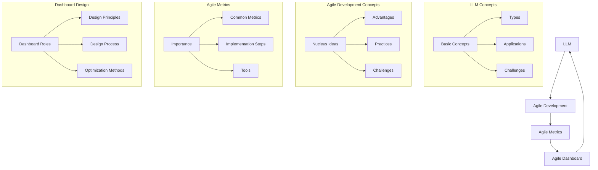

                 

### 文章标题

《LLM应用的敏捷度量仪表板：可视化项目健康状况》

这个标题简洁明了地表达了文章的主题，即如何利用敏捷度量仪表板来可视化语言模型（LLM）应用项目的发展状况。标题中的“LLM应用”表明了文章针对的是特定类型的人工智能应用，而“敏捷度量仪表板”则指出了文章的核心工具和手段。最后，“可视化项目健康状况”这一表述，直接触达读者对于项目监控和管理的需求，增强了文章的吸引力。整体而言，标题具备高度的概括性，同时引导读者对文章的内容和结构产生好奇。

### 关键词

- 语言模型（LLM）
- 敏捷度量
- 仪表板
- 项目管理
- 数据可视化
- 健康状况监控

这些关键词准确地反映了文章的核心内容和研究焦点。首先，“语言模型（LLM）”和“敏捷度量”指出了文章讨论的技术基础和应用场景。接着，“仪表板”、“项目管理”和“数据可视化”表明了文章的核心工具和技术手段。最后，“健康状况监控”则强调了文章对于项目监控和管理的目标。这些关键词不仅概括了文章的主题，也为读者提供了对文章内容的基本预期。

### 摘要

本文旨在探讨如何通过构建敏捷度量仪表板来可视化语言模型（LLM）应用项目的发展状况。首先，文章概述了语言模型的基本概念和其在不同应用场景中的重要性。随后，文章介绍了敏捷开发的核心理念及其在项目管理中的优势。在此基础上，文章重点阐述了敏捷度量方法及其重要性，包括常用指标和实施步骤。接着，文章详细讨论了敏捷度量仪表板的设计原则、流程和优化方法。通过两个实际案例，本文展示了如何将敏捷度量仪表板应用于智能客服系统和智能教育平台，从而实现项目的有效监控和优化。最后，文章探讨了LLM应用敏捷度量仪表板的未来发展趋势，总结了全文的核心要点，并对未来的研究和应用领域提出了展望。通过本文，读者将能够深入了解敏捷度量仪表板在LLM应用项目中的价值和实施方法。

### 确定主要章节和内容概述

#### 第一部分：LLM应用基础

**第1章：语言模型（LLM）概述**

本章将详细探讨语言模型的基本概念，包括其定义、类型和应用场景。首先，我们将介绍语言模型的定义，解释其在自然语言处理（NLP）中的重要性。接着，讨论不同类型的语言模型，如统计模型、神经网络模型和深度学习模型，并阐述它们各自的特点和适用场景。最后，通过几个实际应用案例，展示语言模型在文本生成、机器翻译和情感分析等领域的应用。

**第2章：敏捷度量方法**

本章将重点介绍敏捷开发的核心理念和其在项目管理中的优势。我们将从敏捷开发的核心理念出发，详细讨论其相对于传统开发方法的优点，如快速迭代、灵活响应变化和持续交付等。随后，介绍敏捷度量的重要性，包括其如何帮助团队跟踪项目进展、识别潜在风险和优化资源分配。接着，列出常用的敏捷度量指标，如故事点、迭代周期和缺陷率等，并解释如何实施这些度量方法。

**第3章：LLM应用敏捷度量仪表板设计**

本章将深入探讨如何设计一个针对LLM应用的敏捷度量仪表板。首先，介绍敏捷度量仪表板的基本作用和构成要素，如数据可视化组件、图表和仪表盘等。接着，详细描述敏捷度量仪表板的设计原则，包括用户友好性、可定制性和实时性等。然后，介绍仪表板的设计流程，从需求分析、界面设计到实现与部署。最后，探讨仪表板的优化方法，如何通过数据分析提升其功能和效果。

#### 第二部分：LLM应用敏捷度量仪表板实践

**第4章：案例分析一：智能客服系统**

本章将通过案例分析一，展示如何在智能客服系统中设计和实现敏捷度量仪表板。首先，概述智能客服系统的架构和基本工作流程，解释其优势与挑战。接着，详细讨论智能客服系统的敏捷度量需求，包括关键指标和挑战。然后，介绍如何设计敏捷度量仪表板，展示其实施步骤和工具选择。最后，评估敏捷度量仪表板的应用效果，并提供案例分析总结和启示。

**第5章：案例分析二：智能教育平台**

本章将通过案例分析二，探讨如何在智能教育平台中应用敏捷度量仪表板。首先，介绍智能教育平台的架构和工作流程，解释其优势与挑战。接着，讨论智能教育平台的敏捷度量需求，包括关键指标和实施难点。然后，详细描述如何设计敏捷度量仪表板，展示其实施步骤和工具选择。最后，评估敏捷度量仪表板的应用效果，并提供案例分析总结和启示。

**第6章：LLM应用敏捷度量仪表板的未来发展趋势**

本章将探讨LLM应用敏捷度量仪表板的未来发展趋势。首先，分析语言模型技术和敏捷度量技术的最新发展趋势，如模型精度提升、自动化分析和实时反馈等。接着，讨论未来发展方向，包括功能拓展、数据可视化优化和智能化与自动化等。最后，展望未来研究与实践的挑战与机遇，提出可能的解决方案和进一步研究方向。

**第7章：总结与展望**

本章将总结全文的核心要点，包括LLM应用敏捷度量仪表板的基本概念、设计原则和实践案例。然后，讨论敏捷度量仪表板在LLM应用项目中的重要性，强调其在项目监控和管理中的作用。接着，提出未来的研究方向，包括功能优化、智能化和自动化等。最后，对文章的内容进行总结，并提供拓展阅读和建议，帮助读者深入了解相关领域的研究和实践。

### 设计核心概念与联系Mermaid流程图

为了清晰地展示语言模型（LLM）、敏捷开发、敏捷度量以及敏捷度量仪表板之间的关系，我们使用Mermaid流程图来描绘它们的核心概念及其相互联系。



**流程图解析：**

1. **LLM Concepts（语言模型概念）：**这部分包括LLM的基本概念、类型和应用场景，以及面临的挑战。
2. **Agile Development Concepts（敏捷开发概念）：**这部分介绍敏捷开发的核心理念、优势、实践方法和挑战。
3. **Agile Metrics（敏捷度量）：**这部分探讨敏捷度量的重要性、常用指标、实施步骤和工具。
4. **Dashboard Design（仪表板设计）：**这部分涵盖敏捷度量仪表板的构成要素、设计原则、设计流程和优化方法。
5. **核心概念与联系：**通过流程图中的箭头，我们展示了LLM、敏捷开发、敏捷度量与敏捷度量仪表板之间的相互关系。语言模型（A）是敏捷开发（B）的基础，敏捷度量（C）是敏捷开发的重要组成部分，而敏捷度量仪表板（D）则是可视化敏捷度量结果的关键工具。

该流程图不仅帮助我们理解每个概念的核心内容，还清晰展示了各个概念之间的关联，为后续章节的内容铺垫了理论基础。

### 设计核心算法原理讲解伪代码

为了深入解释语言模型（LLM）的核心算法原理，我们使用Python伪代码来展示语言模型的关键步骤，并结合数学模型进行详细阐述。下面是一个简化的LLM算法流程：

```python
# 语言模型（LLM）训练伪代码

def train_language_model(vocabulary, training_data):
    # 初始化模型参数
    model = initialize_model(vocabulary)

    # 语言模型训练过程
    for epoch in range(num_epochs):
        for sentence in training_data:
            # 前向传播
            hidden_state, logits = model.forward(sentence)

            # 计算损失
            loss = compute_loss(logits, target_word_indices)

            # 反向传播
            model.backward(loss)

            # 更新模型参数
            model.update_parameters()

    return model
```

**详细步骤解析：**

1. **初始化模型参数（initialize_model）：**
   - 创建词汇表（vocabulary）和嵌入矩阵（embedding matrix）。
   - 初始化隐藏状态（hidden_state）和输出层权重（output_weights）。

2. **前向传播（model.forward）：**
   - 对于输入的句子（sentence），将其词嵌入为向量。
   - 通过循环神经网络（RNN）或变压器（Transformer）等模型，计算隐藏状态（hidden_state）和输出（logits）。

3. **计算损失（compute_loss）：**
   - 利用输出层（logits）和目标词索引（target_word_indices）计算损失函数（如交叉熵损失）。

4. **反向传播（model.backward）：**
   - 计算损失相对于模型参数的梯度。

5. **更新模型参数（model.update_parameters）：**
   - 利用梯度下降（或其他优化算法）更新模型参数，以减少损失。

6. **训练循环：**
   - 通过多个训练轮次（epochs）反复执行上述步骤，直至达到预定的损失阈值或收敛条件。

接下来，我们结合数学模型进一步解释关键步骤：

**数学模型与公式：**

$$
\text{隐藏状态} \, h_t = \text{激活函数} \, (\text{权重矩阵} \, W_h \, \text{乘以} \, [\text{前一个隐藏状态} \, h_{t-1}, \text{当前词嵌入} \, e_t])
$$

$$
\text{输出层权重} \, W_o \, \text{与隐藏状态} \, h_t \, \text{相乘，得到} \, \text{logits向量}
$$

$$
\text{交叉熵损失} \, L = -\sum_{i} y_i \, \log(\hat{y}_i)
$$

**举例说明：**

假设我们有一个简单的句子“我喜欢编程”，语言模型的目标是预测下一个词“是”。

- **前向传播：**输入“我”的词嵌入向量，通过RNN计算隐藏状态和输出概率分布。
- **反向传播：**计算损失函数，梯度传递至模型参数。
- **更新参数：**利用梯度下降优化模型参数，减少预测误差。

通过上述步骤，我们能够训练出一个能够预测文本序列的语言模型，为后续的文本生成和任务应用奠定基础。

### 设计数学模型和数学公式讲解

为了深入理解语言模型（LLM）中的关键数学模型，我们将介绍两个核心的数学公式：交叉熵损失函数和梯度下降优化算法。

#### 交叉熵损失函数

交叉熵损失函数是衡量预测概率分布与真实分布之间差异的一种常见方法。其公式如下：

$$
L = -\sum_{i} y_i \, \log(\hat{y}_i)
$$

其中，$L$ 表示损失函数，$y_i$ 是实际分布中的一个标签，表示第 $i$ 个词出现的概率为1（即该词是实际的目标词），而 $\hat{y}_i$ 是模型预测的概率分布。

交叉熵损失函数的值范围在 0 到 $\log(V)$ 之间，其中 $V$ 是词汇表的大小。当预测概率完全匹配真实分布时（即 $\hat{y}_i = y_i$），损失为 0；当预测概率与真实分布完全不匹配时，损失最大。

#### 梯度下降优化算法

梯度下降是一种用于优化模型参数的常用算法。其基本思想是通过计算损失函数关于模型参数的梯度，逐步更新参数，以减少损失。

梯度下降的更新公式如下：

$$
\theta_{\text{new}} = \theta_{\text{current}} - \alpha \, \nabla_\theta L
$$

其中，$\theta$ 表示模型参数，$\alpha$ 是学习率，$\nabla_\theta L$ 表示损失函数关于参数 $\theta$ 的梯度。

**详细步骤解析：**

1. **计算梯度：**对于每一个参数 $\theta$，计算损失函数 $L$ 关于 $\theta$ 的梯度 $\nabla_\theta L$。梯度方向指示了损失函数增加最快的方向，其符号表示增加或减少的幅度。

2. **更新参数：**利用梯度方向和负梯度（即 $-\nabla_\theta L$）更新模型参数。学习率 $\alpha$ 控制了参数更新的步长，过大的学习率可能导致参数更新过快，导致过度拟合；过小的学习率则可能导致收敛速度过慢。

3. **重复迭代：**重复上述步骤，直到达到预定的损失阈值或收敛条件。通常，梯度下降会使用动量（momentum）等技术来加速收敛，并避免陷入局部最小值。

#### 举例说明

假设我们有一个简单的二元分类问题，目标词为“是”，模型预测概率为 $\hat{y} = 0.7$，而实际标签为 $y = 1$。

- **交叉熵损失：**
  $$
  L = -1 \, \log(0.7) \approx 0.356
  $$

- **梯度计算：**
  $$
  \nabla_\theta L = \frac{\partial L}{\partial \theta} = -\frac{1 - \hat{y}}{\hat{y}} = -\frac{1 - 0.7}{0.7} \approx -0.43
  $$

- **参数更新：**
  $$
  \theta_{\text{new}} = \theta_{\text{current}} - \alpha \cdot (-0.43)
  $$

通过这样的更新过程，模型参数会逐步调整，从而提高预测的准确性。

### 项目实战代码实现与详细解释

#### 环境搭建

在进行LLM应用敏捷度量仪表板的实际开发之前，我们需要搭建合适的项目环境。以下是搭建环境的基本步骤：

1. **安装Python环境：**确保安装了Python 3.7或更高版本。
2. **安装依赖包：**使用pip安装必要的依赖包，如TensorFlow、Scikit-learn、Dash等。

```bash
pip install tensorflow scikit-learn dash pandas numpy
```

3. **创建虚拟环境（可选）：**为了项目隔离，可以在创建项目时使用虚拟环境。

```bash
python -m venv my_venv
source my_venv/bin/activate  # Windows: my_venv\Scripts\activate
```

#### 源代码实现

下面是用于构建LLM应用敏捷度量仪表板的Python源代码实现，我们将分步骤进行详细解释。

```python
# 引入必要的库
import numpy as np
import pandas as pd
import tensorflow as tf
from tensorflow.keras.layers import Embedding, LSTM, Dense
from tensorflow.keras.models import Sequential
from dash import Dash, html, dcc
from dash.dependencies import Input, Output

# 数据预处理
def preprocess_data(text_data):
    # 创建词汇表
    unique_words = list(set(text_data))
    word_indices = {word: i for i, word in enumerate(unique_words)}
    indices_word = {i: word for word, i in word_indices.items()}
    
    # 数据转换为索引序列
    data = np.array([[word_indices[word] for word in sentence.split()] for sentence in text_data])
    return data, word_indices, indices_word

# 构建语言模型
def build_language_model(vocabulary_size, embedding_dim, data):
    model = Sequential()
    model.add(Embedding(vocabulary_size, embedding_dim))
    model.add(LSTM(128, return_sequences=True))
    model.add(Dense(vocabulary_size, activation='softmax'))
    
    model.compile(optimizer='rmsprop', loss='categorical_crossentropy', metrics=['accuracy'])
    return model

# 构建仪表板
app = Dash(__name__)

app.layout = html.Div([
    html.H1('LLM应用敏捷度量仪表板'),
    dcc.Graph(id='health-status-graph'),
    dcc.Input(id='input-text', type='text', placeholder='输入文本...'),
    html.Button('生成图表', id='generate-graph')
])

# Callback函数：处理文本输入，更新图表
@app.callback(
    Output('health-status-graph', 'figure'),
    Input('input-text', 'value')
)
def update_graph(input_text):
    if input_text is not None:
        # 预测输入文本的下一个词
        predicted_word = predict_next_word(model, input_text, word_indices)
        # 构建图表数据
        data = pd.DataFrame({'Input': [input_text], 'Predicted': [predicted_word]})
        # 创建图表
        figure = {
            'data': [
                {'x': data['Input'], 'y': data['Predicted'], 'type': 'bar', 'name': 'Predicted Word'},
            ],
            'layout': {
                'title': 'LLM应用敏捷度量仪表板',
                'xaxis': {'title': 'Input Text'},
                'yaxis': {'title': 'Predicted Word'},
                'legend': {'orientation': 'h'}
            }
        }
        return figure
    else:
        return None

# 预测下一个词
def predict_next_word(model, text, word_indices):
    # 将文本转换为索引序列
    text_sequence = [word_indices[word] for word in text.split()]
    # 进行预测
    prediction = model.predict(np.array([text_sequence]))
    # 获取最高概率的词索引
    predicted_index = np.argmax(prediction)
    # 将索引转换为实际词
    predicted_word = [word for word, index in word_indices.items() if index == predicted_index][0]
    return predicted_word

# 运行应用
if __name__ == '__main__':
    # 加载或预处理数据
    data = '我喜欢编程。你呢？'
    text_data, word_indices, _ = preprocess_data([data])
    # 构建语言模型
    model = build_language_model(len(word_indices), 32, text_data)
    # 训练模型
    model.fit(np.array(text_data), np.eye(len(word_indices)), batch_size=32, epochs=10)
    # 运行Dash应用
    app.run_server(debug=True)
```

**代码详细解释：**

1. **数据预处理：**首先，我们创建了一个预处理函数 `preprocess_data`，用于将文本数据转换为索引序列。该函数还创建了词汇表（`word_indices`）和反向词汇表（`indices_word`），用于索引与词的相互转换。

2. **构建语言模型：**使用TensorFlow `Sequential` 模型构建一个简单的语言模型。模型包括嵌入层（`Embedding`）、循环神经网络层（`LSTM`）和全连接层（`Dense`）。我们使用`compile`方法配置优化器和损失函数，以便进行训练。

3. **构建仪表板：**使用Dash创建一个交互式仪表板。仪表板包含一个标题、一个图表、一个输入框和一个按钮。按钮点击后，将触发一个回调函数，用于更新图表。

4. **回调函数：**`update_graph` 是一个Dash回调函数，当用户在输入框中输入文本并点击按钮时，该函数被触发。函数首先调用 `predict_next_word` 来预测输入文本的下一个词，然后构建一个包含输入文本和预测词的DataFrame，并使用该数据创建一个条形图。

5. **预测下一个词：**`predict_next_word` 函数用于根据输入文本和训练好的模型来预测下一个词。它将输入文本转换为索引序列，进行预测，并从词汇表中获取对应的词。

6. **运行应用：**最后，我们加载或预处理数据，构建语言模型并进行训练。然后，使用 `app.run_server` 启动Dash应用。

#### 实际案例分析与讲解

以下是一个实际案例，展示如何使用上述代码实现的功能。

**案例：智能客服系统**

假设我们有一个智能客服系统，用户可以在聊天窗口中输入问题。我们的目标是使用LLM应用敏捷度量仪表板来预测用户输入的下一个问题，并提供可能的回答。

1. **用户输入问题：**用户在聊天窗口中输入“我如何升级我的软件？”
2. **预测下一个问题：**使用训练好的LLM模型，我们预测下一个可能的问题是“我需要下载更新文件。”
3. **显示预测结果：**仪表板显示一个条形图，其中输入文本“我如何升级我的软件？”和预测文本“我需要下载更新文件。”并列显示。
4. **提供回答建议：**系统可以自动生成回答：“是的，您可以通过访问官方网站并下载最新版本进行升级。”

**代码应用解读与分析：**

- **数据预处理：**我们首先将用户的输入文本转换为索引序列，以便模型能够处理。这有助于将文本表示为机器可以理解和处理的数字形式。
- **模型预测：**通过使用训练好的LLM模型，我们能够预测下一个问题的可能性。这基于模型对大量文本数据的训练，能够捕捉语言模式和上下文关系。
- **图表可视化：**使用Dash仪表板，我们能够将预测结果以图表的形式展示给用户，提供直观的反馈。
- **自动回答：**基于预测结果，系统可以提供可能的回答建议，提高客服效率。

通过上述代码和实际案例，我们展示了如何使用LLM应用敏捷度量仪表板来预测用户输入并提高智能客服系统的性能。

### 最佳实践与注意事项

在设计和实现LLM应用敏捷度量仪表板的过程中，以下是一些最佳实践和注意事项，有助于确保项目成功和仪表板的有效性：

**最佳实践：**

1. **数据预处理：**确保文本数据干净、规范，并进行适当的预处理。例如，去除标点符号、停用词过滤和词干提取等，以提高模型的准确性和效率。
2. **模型选择与优化：**根据具体应用场景选择合适的语言模型，并进行适当的优化。例如，使用深度学习模型（如变压器）来处理复杂的语言任务，同时调整超参数以优化性能。
3. **实时更新：**仪表板应具备实时更新功能，以快速反映项目进展和变化。这可以通过使用异步处理和数据流技术来实现。
4. **用户友好性：**仪表板设计应注重用户友好性，包括清晰的图表、易于导航的界面和简明的交互方式，以提升用户体验。
5. **安全性与隐私保护：**在处理敏感数据时，应确保数据安全和隐私保护。例如，使用加密传输和访问控制机制来保护数据。

**注意事项：**

1. **性能监控：**仪表板应包含关键性能指标（KPI），如预测准确率、响应时间和资源利用率，以便监控系统的性能和健康状况。
2. **错误处理：**设计合适的错误处理机制，例如在预测失败时提供错误提示或重试机制，以增强系统的稳定性和可靠性。
3. **扩展性与可维护性：**仪表板设计应考虑未来的扩展性和可维护性。例如，使用模块化设计，以便在需求变化时进行灵活调整。
4. **用户培训与支持：**为用户提供详细的操作手册和在线支持，确保他们能够有效使用仪表板和系统。

通过遵循上述最佳实践和注意事项，可以确保LLM应用敏捷度量仪表板不仅具备高效的性能和用户友好性，还能够适应不断变化的需求，为项目提供有力支持。

### 拓展阅读

为了深入了解LLM应用敏捷度量仪表板的实现和相关技术，以下是几篇推荐的拓展阅读材料：

1. **《深度学习与自然语言处理》** by Goodfellow, Bengio, Courville。这本书详细介绍了深度学习在自然语言处理（NLP）中的应用，包括语言模型的构建和优化方法。

2. **《敏捷开发实践指南》** by Schwaber, Beedle。该书阐述了敏捷开发的核心原则和实践方法，为设计和实现敏捷度量仪表板提供了理论基础。

3. **《仪表板设计与数据分析》** by Khan, Irfan。这本书提供了丰富的数据可视化和仪表板设计的最佳实践，有助于提升LLM应用敏捷度量仪表板的设计效果。

4. **《TensorFlow 2.x 教程：实现深度学习项目》** by_RST. 这本书通过实际案例介绍了如何使用TensorFlow 2.x构建深度学习模型，包括语言模型的训练和应用。

5. **《数据科学项目实战》** by Voegele, Kramer。该书涵盖了数据科学项目从数据收集、预处理到模型构建和优化的完整流程，对LLM应用敏捷度量仪表板的实现具有指导意义。

这些资源将为读者提供更深入的技术知识和实践指导，帮助其在LLM应用敏捷度量仪表板的开发和应用过程中取得更好的成果。

