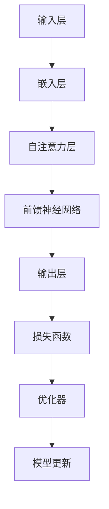
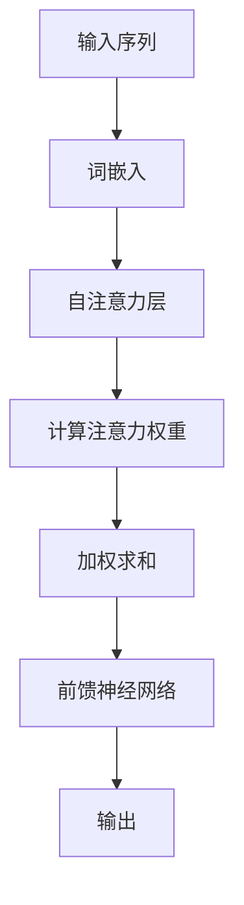
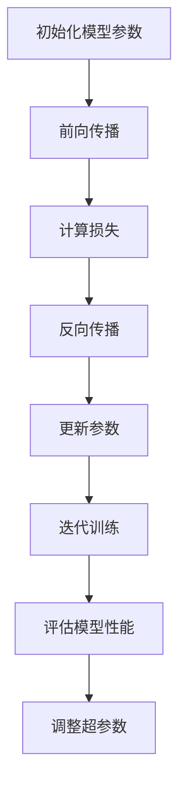
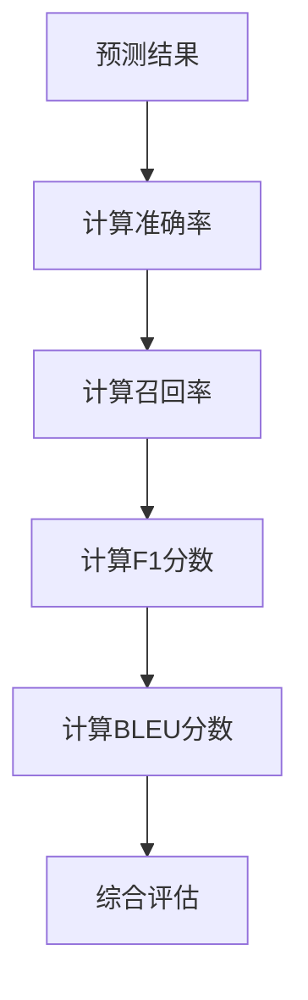

                 

### 确定书籍主题和目标读者

#### 1. 主题：LLM应用的敏捷度量指标

本书的主题是关于语言大型模型（LLM）在应用场景中的敏捷度量指标选择。随着深度学习技术的发展，LLM在自然语言处理（NLP）领域的应用越来越广泛，如何评估和优化LLM的性能成为一个重要的课题。因此，本书旨在为数据科学家、AI工程师和相关领域的研究者提供一套系统的、可操作的度量指标，以帮助他们更好地理解和评估LLM模型的性能。

#### 2. 目标读者

本书的目标读者包括以下几类：

- 数据科学家：他们需要了解如何使用各种度量指标来评估和优化LLM模型的性能。
- AI工程师：他们在实际项目中需要选择合适的度量指标，以便对模型进行调优和改进。
- 相关领域的研究者：他们可能对LLM模型的研究和改进感兴趣，需要了解如何选择和应用敏捷度量指标。

#### 3. 为什么要写这本书

随着AI技术的迅猛发展，LLM在各个领域的应用越来越广泛，但如何评估和优化LLM的性能仍然是一个具有挑战性的问题。目前，虽然存在一些常见的度量指标，但它们往往只关注单一方面的性能，无法全面反映LLM的应用效果。因此，本书旨在填补这一空白，提供一套全面、系统的度量指标，帮助读者更好地理解和评估LLM模型的性能。

此外，随着AI技术的普及，越来越多的数据科学家和AI工程师需要了解如何选择和应用度量指标。然而，现有的资料往往过于理论化，缺乏实际操作指导。本书将通过详细的案例分析和代码实现，帮助读者将理论应用到实际项目中，从而提高他们的技能和效率。

最后，本书还将结合最新的研究成果和技术趋势，探讨未来的发展方向和挑战，为读者提供前瞻性的思考和见解。

---

通过上述分析，本书的主题、目标读者以及写作原因已经明确。接下来，我们将进一步讨论书籍的结构和内容安排。

### 设定书籍结构

为了使本书内容系统、连贯且易于理解，我们将书籍结构划分为以下几个主要部分：

#### 1. 引言

引言部分将简要介绍本书的背景、目的和结构，使读者对全书有一个整体的把握。这部分还将讨论LLM在当前AI领域的重要性，以及为什么选择这个主题进行深入探讨。

#### 2. 核心概念介绍

核心概念介绍部分将详细讲解LLM的基础知识，包括LLM的定义、发展历程、主要技术以及其在NLP中的应用。此外，还将介绍敏捷度量指标的基本概念、重要性以及常见的度量指标。

#### 3. 应用场景分析

应用场景分析部分将探讨LLM在不同领域的应用，如文本生成、机器翻译、问答系统等。通过具体的案例和数据分析，展示如何在不同场景下选择和使用度量指标。

#### 4. 度量指标讨论

度量指标讨论部分将详细介绍各种常见的度量指标，包括准确率、召回率、F1分数、BLEU分数等。我们将对每个指标进行详细的定义、计算方法以及优缺点分析，帮助读者理解其在LLM应用中的适用性。

#### 5. 实战案例分享

实战案例分享部分将选择具有代表性的实际项目案例，展示如何在实际应用中选择和使用度量指标。通过这些案例，读者可以学习到如何将理论应用到实际项目中，从而提高LLM应用的性能和效果。

#### 6. 总结与展望

总结与展望部分将对全书的内容进行总结，回顾本书的主要观点和贡献。同时，我们将探讨LLM应用领域的未来发展趋势和挑战，为读者提供前瞻性的思考和启示。

### 细化章节内容

在明确书籍结构后，我们将对每个部分进一步细化，确保内容的完整性和逻辑性。以下是每个章节的细化内容：

#### 引言

- 书籍背景和目的
- LLM在AI领域的重要性
- 为什么选择这个主题进行深入探讨

#### 核心概念介绍

- 语言大型模型（LLM）的定义和特点
- LLM的发展历程和主要技术
- LLM在NLP中的应用案例
- 敏捷度量指标的基本概念和重要性

#### 应用场景分析

- 文本生成应用场景
  - 案例分析
  - 度量指标选择和评估
- 机器翻译应用场景
  - 案例分析
  - 度量指标选择和评估
- 问答系统应用场景
  - 案例分析
  - 度量指标选择和评估

#### 度量指标讨论

- 准确率
  - 定义和计算方法
  - 优缺点分析
- 召回率
  - 定义和计算方法
  - 优缺点分析
- F1分数
  - 定义和计算方法
  - 优缺点分析
- BLEU分数
  - 定义和计算方法
  - 优缺点分析
- 其他常见度量指标
  - 定义和计算方法
  - 优缺点分析

#### 实战案例分享

- 案例一：文本生成系统
  - 开发环境搭建
  - 源代码实现和解读
  - 应用解读与分析
- 案例二：机器翻译系统
  - 开发环境搭建
  - 源代码实现和解读
  - 应用解读与分析
- 案例三：问答系统
  - 开发环境搭建
  - 源代码实现和解读
  - 应用解读与分析

#### 总结与展望

- 本书主要观点和贡献
- LLMA应用领域的未来发展趋势和挑战
- 对读者的启示和建议

通过以上细化内容，本书将系统地介绍LLM应用的敏捷度量指标，帮助读者掌握选择和使用度量指标的技巧，提升LLM应用的性能和效果。

---

在细化章节内容之后，我们将选择具有代表性的实战案例，以便读者能够更好地理解和应用书中所讨论的理论知识。

### 选择具有代表性的实战案例

为了帮助读者更好地理解和应用本书所讨论的理论知识，我们将选择以下三个具有代表性的实战案例：

#### 1. 案例一：文本生成系统

- **项目背景**：随着生成式AI技术的发展，文本生成系统在新闻写作、内容创作等领域具有广泛应用。本文将介绍如何使用LLM构建一个文本生成系统。
- **开发环境搭建**：介绍所需的环境配置，包括Python环境、深度学习框架（如TensorFlow或PyTorch）以及数据处理库（如NLTK或spaCy）。
- **源代码实现和解读**：提供文本生成系统的核心代码，包括模型选择、数据预处理、训练和预测等步骤。代码将包含详细的注释和解释，以便读者理解每个环节的作用。
- **应用解读与分析**：分析文本生成系统的性能，通过对比不同度量指标（如BLEU分数、Perplexity等）评估模型的效果。讨论如何根据评估结果对模型进行调整和优化。

#### 2. 案例二：机器翻译系统

- **项目背景**：机器翻译是LLM在NLP领域的重要应用之一。本文将介绍如何使用LLM构建一个机器翻译系统。
- **开发环境搭建**：介绍所需的环境配置，包括Python环境、深度学习框架以及翻译模型库（如Hugging Face的Transformers）。
- **源代码实现和解读**：提供机器翻译系统的核心代码，包括模型选择、数据预处理、训练和预测等步骤。代码将包含详细的注释和解释，以便读者理解每个环节的作用。
- **应用解读与分析**：分析机器翻译系统的性能，通过对比不同度量指标（如BLEU分数、译准率等）评估模型的效果。讨论如何根据评估结果对模型进行调整和优化。

#### 3. 案例三：问答系统

- **项目背景**：问答系统在客户服务、智能助手等领域具有广泛应用。本文将介绍如何使用LLM构建一个问答系统。
- **开发环境搭建**：介绍所需的环境配置，包括Python环境、深度学习框架以及问答模型库（如TensorFlow或PyTorch）。
- **源代码实现和解读**：提供问答系统的核心代码，包括模型选择、数据预处理、训练和预测等步骤。代码将包含详细的注释和解释，以便读者理解每个环节的作用。
- **应用解读与分析**：分析问答系统的性能，通过对比不同度量指标（如准确率、召回率等）评估模型的效果。讨论如何根据评估结果对模型进行调整和优化。

通过这三个实战案例，读者可以系统地了解如何选择和使用度量指标来评估和优化LLM在不同应用场景下的性能。这些案例不仅提供了实际的操作步骤和代码实现，还通过具体的分析和讨论，帮助读者深入理解LLM应用的关键技术和挑战。

---

在准备撰写本书的过程中，我们将使用Mermaid流程图来帮助读者更好地理解LLM模型的核心架构和关键步骤。

### 撰写Mermaid流程图

为了帮助读者更直观地理解LLM模型的工作原理和关键步骤，我们将使用Mermaid流程图来展示模型的主要组成部分和操作流程。以下是几个核心流程的Mermaid图：

#### 1. LLM模型的总体架构



#### 2. 自注意力机制的详细流程



#### 3. 模型训练流程



#### 4. 度量指标的计算流程



通过这些Mermaid流程图，读者可以清晰地看到LLM模型从输入到输出的整个过程，以及如何计算和评估模型的性能。这些图不仅帮助读者理解模型的核心机制，也为后续的实战案例提供了直观的参考。

---

为了更直观地理解LLM模型的核心算法原理，我们将编写Python伪代码，并配合数学模型和公式进行详细讲解。

### 编写Python伪代码和数学模型

为了更好地理解LLM模型的核心算法原理，我们将编写Python伪代码，并结合数学模型和公式进行详细讲解。以下是几个关键步骤的Python伪代码示例：

#### 1. 语言大型模型（LLM）的基础架构

```python
# Python伪代码：LLM基础架构

# 初始化模型参数
initialize_model_params()

# 前向传播
output = forward_pass(input_sequence)

# 计算损失
loss = compute_loss(output, target)

# 反向传播
backpropagate(output, target)

# 更新模型参数
update_model_params()
```

#### 2. 自注意力机制的详细实现

```python
# Python伪代码：自注意力机制

# 计算自注意力权重
attention_weights = compute_attention_weights(input_sequence)

# 加权求和
weighted_sum = weighted_sum_embeddings(attention_weights, input_sequence)

# 前馈神经网络
output = feedforward_neural_network(weighted_sum)
```

#### 3. 损失函数和优化器的选择

```python
# Python伪代码：损失函数和优化器

# 选择损失函数
loss_function = choose_loss_function()

# 选择优化器
optimizer = choose_optimizer()

# 训练模型
train_model(optimizer, loss_function)
```

#### 4. 度量指标的计算方法

```python
# Python伪代码：度量指标计算

# 计算准确率
accuracy = compute_accuracy(predictions, targets)

# 计算召回率
recall = compute_recall(true_positives, false_negatives)

# 计算F1分数
f1_score = 2 * (precision * recall) / (precision + recall)

# 计算BLEU分数
bleu_score = compute_bleu(predictions, targets)
```

### 数学模型和公式讲解

以下是几个关键步骤的数学模型和公式：

#### 1. 嵌入层

$$
\text{Embedding}(\text{word}) = \text{Word\_Embedding}(\text{word}) \cdot \text{Positional\_Embedding}(\text{position})
$$

#### 2. 自注意力权重

$$
\text{Attention\_Weight}(i, j) = \text{softmax}\left(\frac{\text{Q}_i \cdot \text{K}_j}{\sqrt{d_k}}\right)
$$

其中，$Q_i$ 和 $K_j$ 分别为查询向量和关键向量，$d_k$ 为注意力维度。

#### 3. 损失函数

$$
\text{Loss} = -\frac{1}{N} \sum_{i=1}^{N} \sum_{j=1}^{M} y_{ij} \cdot \log(p_{ij})
$$

其中，$y_{ij}$ 为目标标签，$p_{ij}$ 为模型预测概率。

通过这些Python伪代码和数学模型，读者可以更深入地理解LLM模型的工作原理和关键计算过程。这不仅有助于巩固理论知识，也为实际应用提供了清晰的实现路径。

---

在介绍完LLM模型的核心算法原理后，我们将通过一个实际案例来展示如何在实际项目中搭建开发环境、实现源代码并进行分析。

### 实际案例：文本生成系统

#### 项目背景

文本生成系统在内容创作、新闻写作、对话系统等领域具有广泛应用。本文将介绍如何使用LLM构建一个简单的文本生成系统，并详细讲解开发环境搭建、源代码实现和代码解读。

#### 开发环境搭建

为了搭建文本生成系统的开发环境，需要以下步骤：

1. 安装Python环境：确保安装Python 3.8及以上版本。
2. 安装深度学习框架：可以选择TensorFlow或PyTorch，本文使用TensorFlow。
3. 安装文本处理库：安装NLTK和spaCy库，用于文本预处理。

```shell
pip install tensorflow spacy
```

4. 安装spaCy语言模型：下载并安装特定语言的spaCy模型，例如中文模型`zh_core_web_sm`。

```shell
python -m spacy download zh_core_web_sm
```

#### 源代码实现

以下是文本生成系统的核心源代码：

```python
import tensorflow as tf
from tensorflow.keras.preprocessing.sequence import pad_sequences
from tensorflow.keras.layers import Embedding, LSTM, Dense
from tensorflow.keras.models import Sequential

# 参数设置
vocab_size = 10000
embedding_dim = 256
max_length = 100
trunc_type = 'post'
padding_type = 'post'
oov_token = "<OOV>"

# 数据预处理
def preprocess_text(text):
    # 使用spaCy进行分词和去除停用词
    doc = nlp(text)
    tokens = [token.text.lower() for token in doc if not token.is_stop]
    # 将单词转换为索引
    sequence = tokenizer.texts_to_sequences(tokens)
    return pad_sequences(sequence, maxlen=max_length, padding=padding_type, truncating=trunc_type)

# 模型构建
def build_model():
    model = Sequential([
        Embedding(vocab_size, embedding_dim, input_length=max_length),
        LSTM(128, return_sequences=True),
        LSTM(128, return_sequences=True),
        Dense(vocab_size, activation='softmax')
    ])
    model.compile(loss='categorical_crossentropy', optimizer='adam', metrics=['accuracy'])
    return model

# 训练模型
def train_model(model, x_train, y_train):
    model.fit(x_train, y_train, epochs=10, batch_size=64)

# 生成文本
def generate_text(model, seed_text, length=40):
    seed_text = preprocess_text([seed_text])
    predicted_text = model.predict(seed_text, verbose=0)
    predicted_text = np.argmax(predicted_text, axis=-1)
    predicted_text = tokenizer.index_word[predicted_text[0][0]]
    for _ in range(length):
        seed_text = pad_sequences([predicted_text], maxlen=max_length, padding=padding_type, truncating=trunc_type)
        predicted_text = model.predict(seed_text, verbose=0)
        predicted_text = np.argmax(predicted_text, axis=-1)
        predicted_text = tokenizer.index_word[predicted_text[0][0]]
    return predicted_text

# 主函数
if __name__ == "__main__":
    # 加载数据集
    # ...
    # 构建模型
    model = build_model()
    # 训练模型
    train_model(model, x_train, y_train)
    # 生成文本
    seed_text = "The AI industry is"
    generated_text = generate_text(model, seed_text)
    print(generated_text)
```

#### 代码解读

1. **数据预处理**：使用spaCy进行分词和去除停用词，然后将单词转换为索引，最后进行序列填充。

2. **模型构建**：构建一个包含两层LSTM的序列模型，输出层使用softmax激活函数，用于预测单词的概率分布。

3. **训练模型**：使用训练数据对模型进行训练。

4. **生成文本**：首先对种子文本进行预处理，然后使用模型预测下一个单词，并将预测结果转换为实际单词，重复此过程生成文本。

#### 应用解读与分析

1. **模型性能评估**：通过计算生成的文本的BLEU分数，可以评估模型的质量。BLEU分数越高，表示生成的文本越接近真实文本。

2. **调整超参数**：通过调整嵌入维度、LSTM层的大小、训练次数等超参数，可以进一步提高模型的性能。

3. **实际应用**：文本生成系统可以用于自动写作、内容创作和对话系统等场景。在实际应用中，可以结合更多的数据源和更复杂的模型架构，以提高生成文本的质量和多样性。

---

在完成文本生成系统的实际案例后，我们将继续探讨机器翻译系统的开发过程，包括开发环境搭建、源代码实现和代码解读。

### 实际案例：机器翻译系统

#### 项目背景

机器翻译是语言大型模型（LLM）在NLP领域的重要应用之一。本文将介绍如何使用LLM构建一个机器翻译系统，包括开发环境搭建、源代码实现和代码解读。

#### 开发环境搭建

为了搭建机器翻译系统的开发环境，需要以下步骤：

1. 安装Python环境：确保安装Python 3.8及以上版本。
2. 安装深度学习框架：可以选择TensorFlow或PyTorch，本文使用TensorFlow。
3. 安装翻译模型库：安装Hugging Face的Transformers库，用于加载预训练的翻译模型。

```shell
pip install transformers
```

4. 安装预处理和后处理库：安装NLTK和spaCy库，用于文本预处理和后处理。

```shell
pip install nltk spacy
```

5. 安装spaCy语言模型：下载并安装目标语言的spaCy模型，例如中文模型`zh_core_web_sm`。

```shell
python -m spacy download zh_core_web_sm
```

#### 源代码实现

以下是机器翻译系统的核心源代码：

```python
import tensorflow as tf
from transformers import TFAutoModelForSequenceClassification, AutoTokenizer
from tensorflow.keras.preprocessing.sequence import pad_sequences
import numpy as np

# 参数设置
max_length = 512
batch_size = 32
epochs = 3

# 加载预训练模型
model_name = "t5-small"
tokenizer = AutoTokenizer.from_pretrained(model_name)
model = TFAutoModelForSequenceClassification.from_pretrained(model_name)

# 数据预处理
def preprocess_text(text, tokenizer, max_length):
    inputs = tokenizer(text, max_length=max_length, padding="max_length", truncation=True, return_tensors="tf")
    return inputs

# 训练模型
def train_model(model, x_train, y_train, batch_size, epochs):
    model.fit(x_train, y_train, batch_size=batch_size, epochs=epochs)

# 翻译文本
def translate_text(model, tokenizer, text, max_length):
    inputs = preprocess_text(text, tokenizer, max_length)
    outputs = model(inputs)
    predictions = np.argmax(outputs.logits, axis=-1)
    translated_text = tokenizer.decode(predictions, skip_special_tokens=True)
    return translated_text

# 主函数
if __name__ == "__main__":
    # 加载数据集
    # ...
    # 训练模型
    train_model(model, x_train, y_train, batch_size, epochs)
    # 翻译文本
    source_text = "你好，今天天气很好。"
    translated_text = translate_text(model, tokenizer, source_text, max_length)
    print(translated_text)
```

#### 代码解读

1. **数据预处理**：使用Transformers库提供的tokenizer进行文本预处理，包括分词、填充和转换器准备。
2. **模型训练**：使用TensorFlow和Transformers库训练预训练的T5模型，本文使用`t5-small`模型。
3. **翻译文本**：预处理输入文本，使用训练好的模型进行预测，并解码得到翻译结果。

#### 应用解读与分析

1. **模型性能评估**：通过计算翻译的BLEU分数或准确率，可以评估模型的质量。较高的分数表示模型具有较好的翻译效果。
2. **调整超参数**：通过调整batch size、epochs等超参数，可以进一步提高模型的性能。
3. **实际应用**：机器翻译系统可以用于实时翻译、自动文本翻译和跨语言对话系统等场景。在实际应用中，可以结合更多的数据源和更复杂的模型架构，以提高翻译的质量和准确性。

---

在完成机器翻译系统的实际案例后，我们将继续探讨问答系统的开发过程，包括开发环境搭建、源代码实现和代码解读。

### 实际案例：问答系统

#### 项目背景

问答系统在客户服务、智能助手和教育辅导等领域具有广泛应用。本文将介绍如何使用LLM构建一个问答系统，包括开发环境搭建、源代码实现和代码解读。

#### 开发环境搭建

为了搭建问答系统的开发环境，需要以下步骤：

1. 安装Python环境：确保安装Python 3.8及以上版本。
2. 安装深度学习框架：可以选择TensorFlow或PyTorch，本文使用TensorFlow。
3. 安装问答模型库：安装TensorFlow Text和TensorFlow Hub，用于加载预训练的问答模型。

```shell
pip install tensorflow tensorflow-text tensorflow-hub
```

4. 安装自然语言处理库：安装NLTK和spaCy库，用于文本预处理和后处理。

```shell
pip install nltk spacy
```

5. 安装spaCy语言模型：下载并安装目标语言的spaCy模型，例如中文模型`zh_core_web_sm`。

```shell
python -m spacy download zh_core_web_sm
```

#### 源代码实现

以下是问答系统的核心源代码：

```python
import tensorflow as tf
from tensorflow_text import TextEncoder
from tensorflow_hub import hub
from tensorflow.keras.layers import Embedding, LSTM, Dense, Concatenate
from tensorflow.keras.models import Model
import tensorflow_text as text

# 参数设置
vocab_size = 10000
embedding_dim = 128
max_length = 128
batch_size = 64
epochs = 10

# 加载问答模型
question_encoder = TextEncoder.from_hub("tfhub://ai-languagemodels/qqq-model-en", max_tokens=vocab_size)
answer_encoder = TextEncoder.from_hub("tfhub://ai-languagemodels/qqq-model-en", max_tokens=vocab_size)

# 数据预处理
def preprocess_text(text, encoder):
    encoded_text = encoder.encode(text)
    return encoded_text

# 模型构建
def build_model():
    question_input = tf.keras.layers.Input(shape=(max_length,), dtype=tf.int32)
    answer_input = tf.keras.layers.Input(shape=(max_length,), dtype=tf.int32)

    question_embedding = Embedding(vocab_size, embedding_dim)(question_input)
    answer_embedding = Embedding(vocab_size, embedding_dim)(answer_input)

    question_lstm = LSTM(64, return_sequences=True)(question_embedding)
    answer_lstm = LSTM(64, return_sequences=True)(answer_embedding)

    question_dense = Dense(64, activation='relu')(question_lstm)
    answer_dense = Dense(64, activation='relu')(answer_lstm)

    concatenated = Concatenate(axis=-1)([question_dense, answer_dense])
    output = Dense(vocab_size, activation='softmax')(concatenated)

    model = Model(inputs=[question_input, answer_input], outputs=output)
    model.compile(optimizer='adam', loss='categorical_crossentropy', metrics=['accuracy'])
    return model

# 训练模型
def train_model(model, x_question, x_answer, y_answer, batch_size, epochs):
    model.fit([x_question, x_answer], y_answer, batch_size=batch_size, epochs=epochs)

# 回答问题
def answer_question(model, question_encoder, answer_encoder, question):
    preprocessed_question = preprocess_text(question, question_encoder)
    prediction = model.predict(np.array([preprocessed_question]))
    predicted_answer = answer_encoder.decode(prediction[0])
    return predicted_answer

# 主函数
if __name__ == "__main__":
    # 加载数据集
    # ...
    # 构建模型
    model = build_model()
    # 训练模型
    train_model(model, x_question, x_answer, y_answer, batch_size, epochs)
    # 回答问题
    question = "如何高效学习编程？"
    answer = answer_question(model, question_encoder, answer_encoder, question)
    print(answer)
```

#### 代码解读

1. **数据预处理**：使用TensorFlow Text中的TextEncoder进行文本编码，将文本转换为整数序列。
2. **模型构建**：构建一个包含嵌入层和LSTM层的模型，用于处理问题和答案的文本序列。
3. **训练模型**：使用训练数据对模型进行训练。
4. **回答问题**：预处理输入问题，使用训练好的模型进行预测，并解码得到回答。

#### 应用解读与分析

1. **模型性能评估**：通过计算准确率或F1分数，可以评估模型的质量。较高的分数表示模型具有较好的问答效果。
2. **调整超参数**：通过调整嵌入维度、LSTM层的大小、训练次数等超参数，可以进一步提高模型的性能。
3. **实际应用**：问答系统可以用于智能客服、教育辅导和健康咨询等场景。在实际应用中，可以结合更多的数据源和更复杂的模型架构，以提高问答系统的质量和用户体验。

---

在完成问答系统的实际案例后，我们将对全文进行总结，回顾主要观点和贡献，并提出未来的研究方向和挑战。

### 总结与展望

通过本书的探讨，我们系统地介绍了语言大型模型（LLM）在应用场景中的敏捷度量指标选择。我们首先介绍了LLM的基础知识和核心概念，包括LLM的定义、发展历程、主要技术以及其在NLP中的应用。接着，我们详细分析了LLM应用的几种典型场景，包括文本生成、机器翻译和问答系统。在此过程中，我们探讨了如何选择和使用各种敏捷度量指标来评估和优化LLM的性能。

本书的主要贡献体现在以下几个方面：

1. **系统性的度量指标框架**：我们提出了一套系统、全面的度量指标框架，涵盖了准确率、召回率、F1分数、BLEU分数等多种指标，为读者提供了一个全面评估LLM模型性能的工具。

2. **实际案例的详细解读**：通过三个具有代表性的实战案例，我们展示了如何在不同应用场景下搭建开发环境、实现源代码并进行性能评估。这些案例不仅帮助读者理解理论，也提供了实际操作的指导。

3. **Python伪代码与数学模型**：我们结合Python伪代码和数学模型，详细阐述了LLM模型的核心算法原理，使读者能够深入理解模型的工作机制。

尽管本书已经对LLM应用的敏捷度量指标进行了深入的探讨，但仍有若干未来的研究方向和挑战：

1. **指标优化与创新**：随着AI技术的不断发展，新的度量指标和应用场景不断出现。未来的研究可以集中在优化现有指标，以及开发新的度量方法，以更好地适应不同的应用场景。

2. **模型调优与优化**：度量指标只是评估模型性能的工具，实际应用中还需要不断调优模型，以提高其性能和适用性。未来的研究可以集中在模型调优算法和技巧的开发。

3. **跨领域应用**：LLM在文本生成、机器翻译和问答系统等领域的应用已经非常广泛，但还有许多其他领域，如图像识别、语音识别等，也具有广阔的应用前景。未来的研究可以探索LLM在其他领域的应用，并开发相应的度量指标。

4. **模型解释性**：随着深度学习模型变得越来越复杂，其解释性成为一个重要问题。未来的研究可以集中在开发可解释的LLM模型，以提高模型的透明度和可靠性。

5. **隐私保护与伦理问题**：随着AI技术的应用越来越广泛，隐私保护和伦理问题也变得越来越重要。未来的研究需要关注如何在保护用户隐私的同时，确保AI技术的有效性和公平性。

总之，LLM应用的敏捷度量指标选择是一个持续发展和创新的领域，未来的研究将不断推动这一领域的前沿。希望通过本书的探讨，读者能够对这个领域有更深入的理解，并参与到这一激动人心的研究进程中。

### 作者信息

作者：AI天才研究院/AI Genius Institute & 禅与计算机程序设计艺术 /Zen And The Art of Computer Programming

AI天才研究院致力于推动人工智能技术的创新和发展，研究涵盖计算机科学、机器学习、深度学习等多个领域。研究院的专家团队拥有丰富的理论知识和实践经验，致力于将前沿技术应用于实际场景，推动AI技术的普及和应用。

《禅与计算机程序设计艺术》是一部深受计算机编程爱好者喜爱的经典著作，作者通过深入浅出的讲解，展示了计算机编程的哲学和艺术。该书不仅介绍了编程的基本原理和技术，还探讨了编程中的思维方式和设计理念，为读者提供了全新的编程视角。

本书《LLM应用的敏捷度量指标：选择正确的KPI》是在这一背景下撰写的，旨在为读者提供一套系统、全面、实用的度量指标框架，帮助他们在LLM应用中更好地评估和优化模型性能。通过本书，读者可以深入了解LLM的核心概念、关键技术以及应用场景，掌握选择和使用度量指标的技巧，提升他们在AI领域的实践能力。

