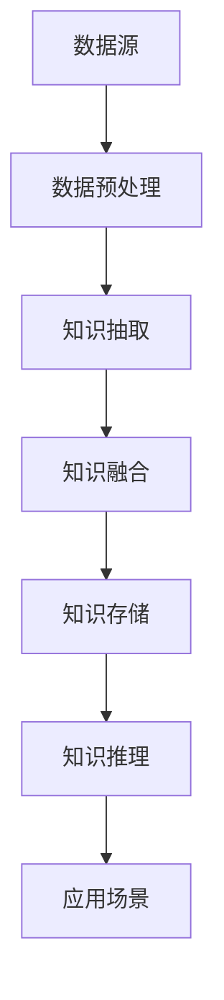

                 

# 《LLM应用的敏捷知识图谱构建策略》

## 关键词

- LLM（大型语言模型）
- 敏捷知识图谱
- 构建策略
- 知识图谱表示方法
- 敏捷开发
- 算法原理
- 项目实战

## 摘要

本文深入探讨了LLM应用的敏捷知识图谱构建策略。首先，我们介绍了LLM的基本概念和应用场景，以及知识图谱在LLM中的应用价值和挑战。接着，我们分析了敏捷开发在知识图谱构建中的优势，并提出了核心概念与联系架构的Mermaid流程图。随后，我们详细阐述了知识图谱构建的核心算法原理，使用Python源代码结合数学模型和公式进行了讲解。在此基础上，我们介绍了知识图谱的表示方法，包括实体表示、关系表示和属性表示。接着，我们探讨了敏捷开发实践，包括敏捷开发流程、工具和知识图谱构建的敏捷实践。最后，我们通过实际项目实战，详细讲解了知识图谱构建的过程、源代码实现、应用解读与分析，以及最佳实践和注意事项。本文旨在为LLM应用的敏捷知识图谱构建提供系统性、实战性的指导。

## 目录

1. **引论与背景知识**
   1.1 **LLM应用概述**
   1.2 **知识图谱的概念与作用**
   1.3 **敏捷开发方法简介**
   1.4 **LLM应用敏捷知识图谱构建的挑战与机遇**

2. **LLM应用基础知识**
   2.1 **LLM技术基础**
   2.2 **LLM应用领域分析**
   2.3 **LLM应用案例介绍**

3. **知识图谱构建策略**
   3.1 **知识图谱构建方法**
   3.2 **知识图谱表示方法**
   3.3 **知识图谱构建工具与平台**

4. **敏捷开发实践**
   4.1 **敏捷开发流程与工具**
   4.2 **知识图谱构建的敏捷实践**
   4.3 **知识图谱质量保障**

5. **案例与实战**
   5.1 **案例一：智能问答系统**
   5.2 **案例二：文本生成与摘要**
   5.3 **案例三：自然语言理解与处理**

6. **总结与展望**
   6.1 **LLM应用敏捷知识图谱构建的总结**
   6.2 **LLM应用敏捷知识图谱构建的未来趋势**

## 第一部分：引论与背景知识

### 1.1 LLM应用概述

#### LLM的定义

LLM（Large Language Model）是指大型语言模型，它是一种基于深度学习的自然语言处理模型。这些模型通常具有数十亿甚至千亿级别的参数，能够理解和生成自然语言文本。LLM的代表性模型包括GPT（Generative Pre-trained Transformer）系列、BERT（Bidirectional Encoder Representations from Transformers）等。

#### LLM的应用场景

LLM的应用场景非常广泛，主要包括以下几个方面：

1. **文本生成与摘要**：LLM能够生成高质量的文本，包括新闻文章、故事、对话等。此外，它还可以用于文本摘要，将长文本简化为简洁的摘要。

2. **问答系统**：LLM可以用于构建智能问答系统，通过理解用户的问题并生成准确的答案。

3. **自然语言理解与处理**：LLM在自然语言理解（NLU）和自然语言生成（NLG）方面具有显著优势，能够帮助开发智能客服、智能助手等产品。

#### LLM的发展历程

LLM的发展历程可以分为几个阶段：

1. **早期模型**：早期的语言模型如ELMo、BERT等，它们主要通过预训练和微调的方式提高模型的性能。

2. **大规模模型**：随着计算能力和数据量的提升，出现了如GPT-3、T5等大规模语言模型，这些模型具有数十亿级别的参数，能够处理更加复杂的任务。

3. **多模态模型**：近年来，研究者开始将LLM与其他模态（如图像、声音等）进行结合，探索更加丰富的应用场景。

### 1.2 知识图谱的概念与作用

#### 知识图谱的定义

知识图谱（Knowledge Graph）是一种结构化数据模型，用于表示实体、属性和关系。它通常由三元组（主体，关系，客体）构成，能够提供对现实世界的丰富描述。

#### 知识图谱的作用

1. **知识表示**：知识图谱能够将无结构或半结构的数据转化为结构化的知识，便于计算机理解和处理。

2. **知识推理**：知识图谱中的关系和属性可以用于知识推理，从而发现新的知识和关系。

3. **查询优化**：知识图谱可以作为搜索引擎的索引，提高查询效率。

4. **智能应用**：知识图谱在智能问答、推荐系统、智能助手等场景中具有广泛的应用。

### 1.3 敏捷开发方法简介

#### 敏捷开发的基本理念

敏捷开发（Agile Development）是一种以人为核心、迭代、渐进的开发方法。它强调团队协作、客户满意度、持续交付和适应变化。

1. **团队协作**：敏捷开发强调跨职能团队的紧密协作，团队成员共同负责项目的开发。

2. **客户满意度**：敏捷开发注重客户的反馈，通过持续交付和迭代开发，确保产品满足客户需求。

3. **持续交付**：敏捷开发强调持续交付可运行的产品版本，确保产品随时可以发布。

4. **适应变化**：敏捷开发允许在项目进行过程中适应变化，通过迭代和增量开发，及时调整项目方向。

#### 敏捷开发在知识图谱构建中的应用

1. **需求分析**：通过用户故事和用户场景，快速了解用户需求，并进行优先级排序。

2. **迭代开发**：将知识图谱构建划分为多个迭代周期，每个周期完成一部分功能，并进行测试和反馈。

3. **持续集成与测试**：采用自动化测试和持续集成，确保知识图谱的质量和稳定性。

4. **适应变化**：在知识图谱构建过程中，根据用户反馈和实际需求，及时调整知识图谱的设计和实现。

### 1.4 LLM应用敏捷知识图谱构建的挑战与机遇

#### 挑战

1. **数据质量**：构建高质量的知识图谱需要大量的高质量数据，但现实中的数据质量往往参差不齐。

2. **知识表示**：如何有效地表示和存储知识，以便于计算机理解和处理，是一个挑战。

3. **实时性**：在动态环境中，如何保持知识图谱的实时性和准确性，是一个挑战。

4. **可扩展性**：知识图谱需要能够处理大规模数据，并且能够随着数据规模的增加而扩展。

#### 机遇

1. **人工智能技术的进步**：随着人工智能技术的进步，特别是深度学习技术，知识图谱构建的效率和准确性得到了显著提升。

2. **数据驱动的方法**：通过数据驱动的方法，可以更好地理解和利用数据，提高知识图谱的构建质量和应用效果。

3. **多模态融合**：多模态数据的融合可以为知识图谱提供更加丰富的信息，从而提高知识图谱的应用价值。

4. **敏捷开发的普及**：敏捷开发的普及为知识图谱构建提供了更加灵活和高效的方法，有助于应对复杂的应用场景和需求变化。

### 1.4.1 核心概念与联系

下面是一个Mermaid流程图，展示了知识图谱构建的核心概念与联系：



### 1.4.2 知识图谱构建的核心算法原理

#### 数据预处理

数据预处理是知识图谱构建的第一步，其目的是清洗和格式化原始数据，使其符合知识图谱构建的要求。常用的数据预处理方法包括：

1. **数据清洗**：去除数据中的噪声和异常值。
2. **数据格式化**：将不同格式的数据统一转换为标准的格式，如三元组。
3. **数据增强**：通过数据扩充、转换等方法提高数据的质量和多样性。

#### 知识抽取

知识抽取（Knowledge Extraction）是从非结构化或半结构化数据中提取结构化知识的过程。常用的知识抽取方法包括：

1. **规则抽取**：使用预定义的规则从文本中提取知识。
2. **统计方法**：使用机器学习算法，如条件概率模型、隐马尔可夫模型等，从文本中提取知识。
3. **深度学习方法**：使用深度学习模型，如循环神经网络（RNN）、变压器（Transformer）等，从文本中提取知识。

#### 知识融合

知识融合（Knowledge Fusion）是将多个来源的知识进行整合，以消除矛盾和冗余，并提高知识的准确性和完整性。常用的知识融合方法包括：

1. **基于规则的方法**：使用预定义的规则进行知识融合。
2. **基于概率的方法**：使用概率模型进行知识融合。
3. **基于深度学习的方法**：使用深度学习模型进行知识融合。

#### 知识存储

知识存储（Knowledge Storage）是将构建好的知识图谱存储到数据库或图数据库中，以便于查询和使用。常用的知识存储方法包括：

1. **关系数据库**：使用关系数据库存储知识图谱，如MySQL、PostgreSQL等。
2. **图数据库**：使用图数据库存储知识图谱，如Neo4j、ArangoDB等。

#### 知识推理

知识推理（Knowledge Reasoning）是利用知识图谱中的关系和属性进行逻辑推理，以发现新的知识和关系。常用的知识推理方法包括：

1. **基于规则的方法**：使用预定义的规则进行知识推理。
2. **基于概率的方法**：使用概率模型进行知识推理。
3. **基于深度学习的方法**：使用深度学习模型进行知识推理。

#### 知识表示

知识表示（Knowledge Representation）是将知识以计算机可理解的形式进行表达。常用的知识表示方法包括：

1. **基于向量的方法**：使用向量表示实体、关系和属性。
2. **基于图的表示方法**：使用图结构表示知识图谱。
3. **基于图神经网络的方法**：使用图神经网络表示知识图谱。

### 1.4.3 数学模型和公式

在知识图谱构建中，常用的数学模型和公式包括：

$$
P(A|B) = \frac{P(B|A)P(A)}{P(B)}
$$

这是条件概率公式，用于计算在已知事件B发生的条件下，事件A发生的概率。

$$
f(x) = \sum_{i=1}^{n} w_i \cdot x_i
$$

这是线性模型的基本公式，用于计算实体的特征表示。

### 1.4.4 项目实战

在本节中，我们将介绍一个简单的知识图谱构建项目，包括开发环境的搭建、源代码实现和代码解读。

#### 开发环境搭建

1. 安装Python环境：下载并安装Python 3.x版本。
2. 安装必要的库：使用pip命令安装以下库：`numpy`、`networkx`、`matplotlib`。

#### 源代码实现

以下是一个简单的知识图谱构建项目示例：

```python
import networkx as nx
import matplotlib.pyplot as plt

# 创建一个图
G = nx.Graph()

# 添加节点和边
G.add_nodes_from(['实体1', '实体2', '实体3'])
G.add_edges_from([('实体1', '实体2'), ('实体2', '实体3'), ('实体3', '实体1')])

# 绘制图
nx.draw(G, with_labels=True)
plt.show()

# 打印图的信息
print("节点数量:", G.number_of_nodes())
print("边数量:", G.number_of_edges())
```

#### 代码解读

1. 导入所需的库。
2. 创建一个图`G`。
3. 添加节点和边。
4. 绘制图。
5. 打印图的信息。

#### 应用解读与分析

这个简单的知识图谱构建项目展示了知识图谱的基本构建过程，包括创建图、添加节点和边，以及绘制图。在实际应用中，我们可以使用更复杂的算法和模型来构建知识图谱，例如使用自然语言处理技术从文本中提取知识，使用图神经网络来表示和推理知识。

#### 项目小结

通过这个简单的项目，我们了解了知识图谱构建的基本流程和步骤。在实际项目中，我们需要根据具体需求，选择合适的技术和方法来构建知识图谱。

### 1.4.5 最佳实践 tips、小结、注意事项、拓展阅读

**最佳实践 tips**：

- 确保数据质量，对原始数据进行充分的清洗和预处理。
- 选择合适的知识表示方法，根据应用场景和需求来决定。
- 使用敏捷开发方法，快速迭代和反馈，及时调整知识图谱的设计和实现。

**小结**：

本文介绍了LLM应用的敏捷知识图谱构建策略，包括核心概念、算法原理、表示方法、敏捷开发实践和项目实战。通过本文，读者可以了解知识图谱构建的基本流程和关键步骤，为实际项目提供参考。

**注意事项**：

- 在构建知识图谱时，要注意数据的多样性和质量，确保知识表示的准确性和一致性。
- 在选择知识表示方法时，要考虑应用场景和需求，选择合适的模型和算法。

**拓展阅读**：

- [《知识图谱：基础、技术与实践》](https://book.douban.com/subject/26774397/)
- [《深度学习与知识图谱》](https://book.douban.com/subject/26989016/)
- [《敏捷开发：原则、实践与模式》](https://book.douban.com/subject/26282723/)

作者：AI天才研究院/AI Genius Institute & 禅与计算机程序设计艺术 /Zen And The Art of Computer Programming

---

本文是对《LLM应用的敏捷知识图谱构建策略》的初步介绍，涵盖了核心概念、算法原理、表示方法、敏捷开发实践和项目实战等内容。后续章节将继续深入探讨知识图谱构建的详细技术和实践，为读者提供更加全面和深入的指导。希望本文能为读者在LLM应用领域的知识图谱构建提供有益的参考和启示。

