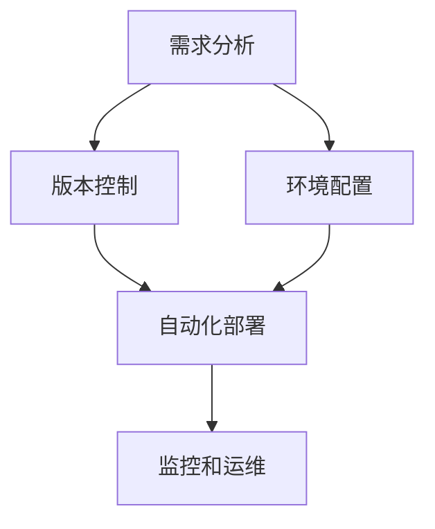

                 

### 《LLM应用的敏捷配置管理策略》

> 关键词：LLM应用、敏捷配置管理、配置管理框架、最佳实践、案例分析、未来展望

> 摘要：本文深入探讨LLM（大型语言模型）应用的敏捷配置管理策略。通过分析LLM的基础、敏捷开发的核心理念以及敏捷配置管理的挑战和解决方案，本文提出了一个适用于LLM应用的敏捷配置管理框架，并通过实际案例展示了其应用效果。最后，文章对敏捷配置管理在LLM应用中的发展趋势和未来研究方向进行了展望。

## 引言

随着人工智能技术的飞速发展，LLM（大型语言模型）作为自然语言处理的重要工具，已经在众多领域得到广泛应用。从文本生成、机器翻译到问答系统，LLM的应用极大地提升了自动化处理的效率和质量。然而，随着LLM应用场景的多样化，如何高效地管理和配置这些复杂的应用成为了一个重要问题。

敏捷开发作为一种以人为核心、迭代、增量的软件开发方法，强调快速响应变化和持续交付价值。在LLM应用开发中，敏捷开发能够帮助团队更好地适应不断变化的需求，提高开发效率和产品质量。敏捷配置管理作为敏捷开发的重要组成部分，旨在确保软件配置的准确性、一致性和可追溯性。

本文将围绕LLM应用的敏捷配置管理展开讨论。首先，我们将介绍LLM的基础知识，包括其原理、架构和应用场景。接着，我们将探讨敏捷开发的核心理念，以及敏捷配置管理在LLM应用中的重要性。随后，本文将提出一个适用于LLM应用的敏捷配置管理框架，并分析其关键组成部分。此外，我们将通过实际案例展示敏捷配置管理策略在LLM应用中的效果。最后，文章将对敏捷配置管理在LLM应用中的发展趋势和未来研究方向进行展望。

## LLM基础

### 2.1 LLM的原理

LLM（大型语言模型）是一种基于深度学习的自然语言处理模型，通过学习大量文本数据来捕捉语言的统计规律和语义信息。LLM的核心原理是神经网络，尤其是深度神经网络（DNN）和变分自编码器（VAE）。常见的LLM架构包括Transformer模型、GPT模型和BERT模型等。

**2.1.1 语言模型的基本概念**

语言模型是一种用于预测文本序列的概率分布的模型。其主要目标是给定一个文本片段，预测下一个单词或字符的概率。语言模型的基本概念包括词汇表、词汇概率分布和语言模型输出等。

**2.1.2 LLM的训练过程**

LLM的训练过程主要包括数据收集、预处理、模型选择、训练策略等步骤。首先，从大量文本数据中收集训练数据，并进行预处理，如分词、去停用词、词性标注等。然后，选择适合的神经网络架构，如Transformer或GPT，并设计训练策略，包括优化器、学习率、批次大小等。最后，通过多次迭代训练，模型将逐渐收敛，达到较高的预测准确性。

**2.1.3 LLM的应用场景**

LLM的应用场景非常广泛，包括文本生成、机器翻译、问答系统、情感分析、文本分类等。例如，GPT-3可以生成高质量的文章、报告、邮件等；BERT可以用于文本分类、命名实体识别、情感分析等任务。

### 2.2 LLM架构

**2.2.1 Transformer模型**

Transformer模型是LLM中最常用的架构之一，由Vaswani等人在2017年提出。Transformer模型的核心思想是自注意力机制，通过全局 attentiveness 来捕捉文本序列中的长距离依赖关系。Transformer模型由编码器（Encoder）和解码器（Decoder）两部分组成，分别负责输入和输出的处理。

**2.2.2 GPT模型的演进**

GPT（Generative Pre-trained Transformer）系列模型是OpenAI提出的一系列LLM模型。从GPT-1到GPT-3，模型的参数规模和训练数据量不断增长，性能和表现也得到了显著提升。GPT-3具有1750亿个参数，能够生成高质量的文本，并且具有极强的泛化能力。

**2.2.3 其他LLM架构简介**

除了Transformer和GPT模型，还有其他一些重要的LLM架构，如BERT（Bidirectional Encoder Representations from Transformers）、RoBERTa（A Robustly Optimized BERT Pretraining Approach）和T5（Text-to-Text Transfer Transformer）等。这些模型在语言理解和生成任务上取得了显著的成果。

### 2.3 LLM应用中的挑战

尽管LLM在自然语言处理领域取得了巨大成功，但在实际应用中仍面临一些挑战。以下是一些常见的挑战：

**2.3.1 数据质量和标注问题**

LLM的训练数据质量直接影响模型的性能。数据质量差、噪声大或标注不准确都会对模型产生负面影响。

**2.3.2 模型可解释性**

LLM作为深度学习模型，其内部结构和决策过程往往难以解释。这对于需要高可解释性的应用场景（如医疗、金融等）是一个挑战。

**2.3.3 模型泛化能力**

LLM通常在特定领域或任务上表现良好，但在其他领域或任务上的泛化能力有限。如何提升模型的泛化能力是一个重要问题。

**2.3.4 模型规模和计算资源**

大型的LLM模型（如GPT-3）需要大量的计算资源和存储空间。对于资源有限的团队或企业，如何合理使用计算资源是一个挑战。

## 敏捷开发的核心理念

敏捷开发（Agile Development）是一种以人为核心、迭代、增量的软件开发方法。它强调快速响应变化、持续交付价值、持续改进和团队协作。敏捷开发的核心理念包括以下几方面：

### 3.1.1 敏捷宣言

敏捷宣言（Manifesto for Agile Software Development）是敏捷开发的基石，它由17位软件开发领域的专家共同签署，提出了12条原则。敏捷宣言的核心观点是：

- 个体和互动高于流程和工具
- 可工作的软件高于详尽的文档
- 客户合作高于合同谈判
- 响应变化高于遵循计划

### 3.1.2 敏捷开发流程

敏捷开发的主要流程包括需求收集、规划、迭代开发、回顾等。以下是一个简化的敏捷开发流程：

1. **需求收集**：通过与客户和利益相关者的沟通，收集和管理需求。
2. **规划**：确定项目的范围、优先级和进度，制定迭代计划。
3. **迭代开发**：在固定的时间框架（如两周或一个月）内，团队进行开发、测试和部署。
4. **回顾**：在迭代结束时，团队回顾本次迭代的工作，识别问题并进行改进。

### 3.1.3 敏捷团队的角色

敏捷团队通常由多个角色组成，包括产品负责人（Product Owner）、开发者（Developers）、测试人员（Testers）和 scrum master 等。

- **产品负责人**：代表客户和利益相关者，负责确定产品的需求和优先级，确保团队按照正确的方向前进。
- **开发者**：负责实际开发工作，包括编码、测试和部署。
- **测试人员**：负责测试和确保软件质量。
- **scrum master**：负责确保团队遵循敏捷原则和方法，解决团队遇到的障碍。

### 3.2 敏捷配置管理的挑战

在敏捷开发中，配置管理（Configuration Management）是一个关键环节。配置管理旨在确保软件的准确性、一致性和可追溯性。然而，在LLM应用开发中，敏捷配置管理面临以下挑战：

**3.2.1 版本控制**

LLM模型的训练和部署过程中，涉及大量的代码、数据和模型参数。版本控制是确保这些组件准确、一致的重要手段。然而，在快速迭代的敏捷开发环境中，如何有效管理版本，确保版本间的兼容性和可追溯性，是一个挑战。

**3.2.2 环境配置**

在敏捷开发中，频繁的迭代和部署要求环境配置必须能够快速响应变化。然而，LLM应用通常依赖于复杂的计算资源和环境配置，如GPU、CUDA等。如何在敏捷开发中高效地配置和管理这些环境，是一个挑战。

**3.2.3 部署和运维**

敏捷开发强调快速交付和持续集成。然而，LLM应用部署和运维的复杂性增加了持续交付的难度。如何确保部署过程高效、可靠，并能够快速响应故障，是一个挑战。

### 3.3 敏捷配置管理的解决方案

针对敏捷开发中配置管理的挑战，本文提出以下解决方案：

**3.3.1 版本控制**

- **使用版本控制系统**：如Git，对代码、数据和模型参数进行版本控制，确保版本的可追溯性和一致性。
- **配置文件管理**：使用配置文件（如YAML、JSON）来管理环境变量和依赖关系，确保环境配置的可维护性和可复现性。

**3.3.2 环境配置**

- **容器化**：使用Docker等容器化技术，将环境配置封装为容器镜像，实现环境配置的标准化和可复现性。
- **持续集成/持续部署（CI/CD）**：使用CI/CD工具（如Jenkins、GitLab CI）实现自动化部署，提高部署效率和质量。

**3.3.3 部署和运维**

- **自动化部署**：使用自动化脚本（如Shell、Python）实现部署过程自动化，减少人为干预和错误。
- **监控和运维**：使用监控工具（如Prometheus、Grafana）实时监控系统状态，及时发现并处理故障。

## LLM应用的敏捷配置管理框架

为了更好地管理LLM应用的配置，我们提出了一个敏捷配置管理框架。该框架包括以下几个关键组成部分：

### 4.1.1 敏捷配置管理流程

敏捷配置管理流程主要包括以下几个阶段：

1. **需求分析**：与客户和利益相关者沟通，明确配置管理需求。
2. **版本控制**：使用版本控制系统（如Git）对代码、数据和模型参数进行版本控制。
3. **环境配置**：使用容器化技术（如Docker）和配置文件（如YAML、JSON）进行环境配置管理。
4. **自动化部署**：使用自动化脚本（如Shell、Python）实现部署过程自动化。
5. **监控和运维**：使用监控工具（如Prometheus、Grafana）实时监控系统状态，及时发现并处理故障。

### 4.1.2 敏捷配置管理工具

敏捷配置管理工具包括版本控制系统、容器化工具、持续集成/持续部署（CI/CD）工具和监控工具等。以下是一些常用的工具：

- **版本控制系统**：Git、SVN、Mercurial
- **容器化工具**：Docker、Kubernetes
- **CI/CD工具**：Jenkins、GitLab CI、CircleCI
- **监控工具**：Prometheus、Grafana、Zabbix

### 4.1.3 敏捷配置管理最佳实践

为了确保敏捷配置管理的有效实施，我们提出以下最佳实践：

- **标准化**：制定统一的配置规范和编码规范，确保配置和代码的一致性和可维护性。
- **自动化**：尽可能使用自动化工具和脚本，减少人为干预和错误。
- **文档化**：及时记录配置和部署过程，确保可复现性和可追溯性。
- **培训与沟通**：定期组织培训和沟通，提高团队对配置管理的认知和技能。

## LLM应用场景下的敏捷配置策略

根据不同的应用场景，LLM应用的敏捷配置策略有所不同。以下分别介绍企业内部应用、公共云服务应用和边缘计算应用中的敏捷配置策略。

### 4.2.1 企业内部应用

在企业内部，LLM应用通常涉及复杂的业务流程和业务规则。因此，敏捷配置管理在企业内部应用中尤为重要。以下是一些关键点：

- **需求分析**：深入理解企业的业务需求和流程，确保配置管理策略能够满足业务需求。
- **版本控制**：使用版本控制系统（如Git）对代码、数据和模型参数进行版本控制，确保版本的一致性和可追溯性。
- **环境配置**：根据企业内部环境的特点，使用容器化技术（如Docker）和配置文件（如YAML、JSON）进行环境配置管理。
- **自动化部署**：使用自动化脚本（如Shell、Python）实现部署过程自动化，确保部署的效率和可靠性。
- **监控和运维**：使用监控工具（如Prometheus、Grafana）实时监控系统状态，及时发现并处理故障。

### 4.2.2 公共云服务应用

在公共云服务中，LLM应用通常依赖于云平台提供的计算资源和存储资源。以下是一些关键点：

- **选择云平台**：根据应用的需求和预算，选择合适的云平台（如AWS、Azure、Google Cloud）。
- **版本控制**：使用版本控制系统（如Git）对代码、数据和模型参数进行版本控制，确保版本的一致性和可追溯性。
- **容器化**：使用容器化技术（如Docker）将环境配置封装为容器镜像，实现环境配置的标准化和可复现性。
- **自动化部署**：使用CI/CD工具（如Jenkins、GitLab CI）实现自动化部署，确保部署的效率和可靠性。
- **监控和运维**：使用云平台提供的监控工具（如AWS CloudWatch、Azure Monitor）实时监控系统状态，及时发现并处理故障。

### 4.2.3 边缘计算应用

在边缘计算环境中，LLM应用通常需要处理大量的实时数据，并具有低延迟和高可靠性的要求。以下是一些关键点：

- **选择边缘计算平台**：根据应用的需求和预算，选择合适的边缘计算平台（如Azure Edge、AWS IoT、Google Cloud Edge）。
- **版本控制**：使用版本控制系统（如Git）对代码、数据和模型参数进行版本控制，确保版本的一致性和可追溯性。
- **轻量化模型**：为了满足边缘设备的计算和存储限制，使用轻量化模型（如MobileNet、SqueezeNet）。
- **自动化部署**：使用自动化脚本（如Shell、Python）实现部署过程自动化，确保部署的效率和可靠性。
- **监控和运维**：使用边缘计算平台提供的监控工具（如AWS IoT Greengrass、Azure IoT Edge Insights）实时监控系统状态，及时发现并处理故障。

### 5.1 案例研究1：企业内部LLM应用

**5.1.1 案例背景**

某大型企业需要构建一个智能客服系统，以提供24/7的在线客服服务。该系统需要能够处理大量的用户提问，并生成准确的回答。为了满足这一需求，企业决定使用LLM技术，并采用敏捷开发方法进行开发。

**5.1.2 项目目标**

- **实现一个高性能、可扩展的智能客服系统**
- **确保系统的稳定性和可靠性**
- **降低开发和运维成本**

**5.1.3 项目实施过程**

1. **需求分析**：与客户和利益相关者沟通，明确系统的功能和性能要求。确定使用GPT-3模型作为核心技术。

2. **版本控制**：使用Git对代码、数据和模型参数进行版本控制，确保版本的一致性和可追溯性。

3. **环境配置**：使用Docker将环境配置封装为容器镜像，实现环境配置的标准化和可复现性。

4. **自动化部署**：使用Jenkins实现自动化部署，确保部署的效率和可靠性。

5. **监控和运维**：使用Prometheus和Grafana实时监控系统状态，及时发现并处理故障。

6. **迭代开发**：采用敏捷开发方法，分阶段实现系统的功能。每两周进行一次迭代，并进行回顾和改进。

7. **测试与验收**：对每个迭代版本进行充分的测试，确保系统的性能和稳定性。在系统上线前进行验收测试，确保满足客户需求。

**5.1.4 项目成果**

- **成功上线智能客服系统**
- **系统运行稳定，性能优异**
- **客户满意度显著提高**
- **开发和运维成本降低**

### 5.2 案例研究2：公共云服务中的LLM应用

**5.2.1 案例背景**

某互联网公司需要构建一个大规模的机器翻译平台，以提供实时翻译服务。该平台需要支持多种语言之间的翻译，并具有高并发处理能力。为了满足这一需求，公司决定采用LLM技术和公共云服务。

**5.2.2 项目目标**

- **实现一个高性能、高并发的机器翻译平台**
- **确保系统的稳定性和可靠性**
- **降低开发和运维成本**

**5.2.3 项目实施过程**

1. **需求分析**：与客户和利益相关者沟通，明确系统的功能和性能要求。确定使用BERT模型作为核心技术。

2. **版本控制**：使用Git对代码、数据和模型参数进行版本控制，确保版本的一致性和可追溯性。

3. **容器化**：使用Docker将环境配置封装为容器镜像，实现环境配置的标准化和可复现性。

4. **自动化部署**：使用GitLab CI实现自动化部署，确保部署的效率和可靠性。

5. **监控和运维**：使用AWS CloudWatch实时监控系统状态，及时发现并处理故障。

6. **迭代开发**：采用敏捷开发方法，分阶段实现系统的功能。每两周进行一次迭代，并进行回顾和改进。

7. **测试与验收**：对每个迭代版本进行充分的测试，确保系统的性能和稳定性。在系统上线前进行验收测试，确保满足客户需求。

**5.2.4 项目成果**

- **成功上线机器翻译平台**
- **系统运行稳定，性能优异**
- **支持多种语言之间的翻译**
- **客户满意度显著提高**
- **开发和运维成本降低**

### 5.3 案例研究3：边缘计算环境中的LLM应用

**5.2.1 案例背景**

某智能城市项目需要使用LLM技术对城市监控视频进行实时分析，以识别和预警潜在的公共安全问题。由于城市监控视频数据量大、实时性强，传统的云计算环境无法满足项目需求。因此，项目决定采用边缘计算环境，并使用LLM技术进行实时分析。

**5.2.2 项目目标**

- **实现实时视频分析系统**
- **确保系统的高并发处理能力**
- **降低系统的延迟**
- **降低开发和运维成本**

**5.2.3 项目实施过程**

1. **需求分析**：与客户和利益相关者沟通，明确系统的功能和性能要求。确定使用MobileNet模型作为核心技术。

2. **版本控制**：使用Git对代码、数据和模型参数进行版本控制，确保版本的一致性和可追溯性。

3. **轻量化模型**：为了满足边缘设备的计算和存储限制，使用轻量化模型（如MobileNet、SqueezeNet）。

4. **自动化部署**：使用Python脚本实现自动化部署，确保部署的效率和可靠性。

5. **监控和运维**：使用AWS IoT Greengrass实时监控系统状态，及时发现并处理故障。

6. **迭代开发**：采用敏捷开发方法，分阶段实现系统的功能。每两周进行一次迭代，并进行回顾和改进。

7. **测试与验收**：对每个迭代版本进行充分的测试，确保系统的性能和稳定性。在系统上线前进行验收测试，确保满足客户需求。

**5.2.4 项目成果**

- **成功上线实时视频分析系统**
- **系统运行稳定，性能优异**
- **实现了实时预警和识别潜在公共安全问题**
- **客户满意度显著提高**
- **开发和运维成本降低**

### 6.1 常见问题分析

在LLM应用的敏捷配置管理过程中，常见问题包括版本控制问题、环境配置问题和部署与运维问题。

**6.1.1 版本控制问题**

版本控制问题主要表现在以下几个方面：

- **版本不一致**：不同团队成员在各自环境中使用不同版本的代码和数据，导致系统不稳定。
- **版本丢失**：由于版本控制系统配置不当或操作失误，导致版本丢失或数据损坏。
- **版本追溯困难**：当系统出现问题时，难以追溯问题产生的具体原因。

**6.1.2 环境配置问题**

环境配置问题主要表现在以下几个方面：

- **环境不一致**：不同环境中配置的参数和依赖关系不一致，导致系统无法正常运行。
- **环境部署困难**：环境部署过程复杂，需要手动配置多个组件，导致部署效率低下。
- **环境维护困难**：随着系统规模扩大，环境维护难度增加，需要投入大量人力和物力。

**6.1.3 部署和运维问题**

部署和运维问题主要表现在以下几个方面：

- **部署效率低下**：手动部署过程繁琐，容易出现错误，导致部署效率低下。
- **故障处理困难**：系统运行过程中出现故障时，难以快速定位和解决问题，导致系统可用性下降。
- **运维成本高**：需要投入大量人力和物力进行系统运维，增加了运营成本。

### 6.2 解决方案探讨

针对上述常见问题，本文提出以下解决方案：

**6.2.1 版本控制解决方案**

- **使用版本控制系统**：使用Git等版本控制系统，确保代码、数据和模型参数的一致性和可追溯性。
- **版本管理规范**：制定版本管理规范，明确版本命名、发布和升级流程。
- **自动化版本发布**：使用自动化工具（如Jenkins、GitLab CI）实现自动化版本发布，减少人为干预和错误。

**6.2.2 环境配置解决方案**

- **容器化**：使用Docker等容器化技术，将环境配置封装为容器镜像，实现环境配置的标准化和可复现性。
- **配置管理工具**：使用配置管理工具（如Ansible、Puppet）自动化管理环境配置，提高部署效率和可靠性。
- **环境管理平台**：使用环境管理平台（如Kubernetes、AWS EKS）统一管理多个环境，实现环境配置的可维护性和可扩展性。

**6.2.3 部署和运维解决方案**

- **自动化部署**：使用自动化工具（如Jenkins、Ansible）实现自动化部署，减少人为干预和错误。
- **容器编排**：使用容器编排工具（如Kubernetes、Docker Swarm）实现容器集群的管理和调度，提高部署效率和可靠性。
- **监控和运维**：使用监控工具（如Prometheus、Grafana）实时监控系统状态，及时发现并处理故障。

### 7.1 敏捷配置管理在LLM应用中的发展趋势

随着人工智能技术的不断进步，LLM应用在各个领域得到广泛应用。敏捷配置管理作为确保LLM应用稳定性和可靠性的重要手段，也在不断发展和改进。以下是敏捷配置管理在LLM应用中的发展趋势：

**7.1.1 技术进步对敏捷配置管理的影响**

- **容器化技术的普及**：容器化技术（如Docker、Kubernetes）的普及，使得环境配置更加标准化和可复现，为敏捷配置管理提供了更好的基础。
- **持续集成/持续部署（CI/CD）的成熟**：CI/CD工具的成熟，使得自动化部署和运维更加高效和可靠，进一步提升了敏捷配置管理的效率。
- **监控和运维工具的多样化**：随着监控和运维工具（如Prometheus、Grafana、Zabbix）的多样化，系统状态监控和故障处理更加智能化，为敏捷配置管理提供了更好的支持。

**7.1.2 行业标准的发展**

- **敏捷开发标准的普及**：敏捷开发标准（如Scrum、Kanban）的普及，使得团队更加注重敏捷开发方法和配置管理，推动了敏捷配置管理的发展。
- **配置管理标准的制定**：针对不同领域和应用场景，配置管理标准（如ISO/IEC 19763、ITIL）的制定，为敏捷配置管理提供了统一的规范和指南。

**7.1.3 未来挑战与机遇**

- **异构环境管理**：随着云计算、边缘计算和物联网的发展，系统环境更加复杂，如何有效管理异构环境是未来的挑战。
- **智能化配置管理**：利用人工智能和机器学习技术，实现智能化配置管理，提高配置管理的自动化程度和效率。
- **跨平台配置管理**：如何实现跨平台（如Linux、Windows、macOS）的配置管理，是未来的研究重点。

### 7.2 潜在研究方向

在LLM应用的敏捷配置管理领域，仍有许多潜在的研究方向值得探索：

**7.2.1 自动化配置管理**

- **配置自动化工具的研究**：研究如何开发更加高效、可靠的配置自动化工具，实现环境配置、版本控制和部署过程的自动化。
- **智能配置管理**：结合人工智能技术，实现智能化配置管理，提高配置管理的自动化程度和效率。

**7.2.2 智能化配置管理**

- **故障预测与预警**：研究如何利用人工智能技术，实现故障预测和预警，提高系统的可用性和可靠性。
- **优化配置策略**：研究如何根据系统负载和性能指标，动态调整配置策略，提高系统性能和资源利用率。

**7.2.3 跨平台配置管理**

- **跨平台兼容性研究**：研究如何在不同的操作系统和硬件平台上实现兼容性配置管理，提高配置管理的通用性和可移植性。
- **跨平台自动化部署**：研究如何实现跨平台的自动化部署，提高部署效率和可靠性。

### 总结

本文围绕LLM应用的敏捷配置管理策略进行了深入探讨。首先，介绍了LLM的基础知识，包括原理、架构和应用场景。接着，分析了敏捷开发的核心理念，以及敏捷配置管理在LLM应用中的重要性。随后，本文提出了一个适用于LLM应用的敏捷配置管理框架，并分析了其关键组成部分。此外，通过实际案例展示了敏捷配置管理策略在LLM应用中的效果。最后，文章对敏捷配置管理在LLM应用中的发展趋势和未来研究方向进行了展望。

本文的主要贡献在于：

1. 系统性地总结了LLM的基础知识，为后续的敏捷配置管理讨论提供了理论基础。
2. 提出了一个适用于LLM应用的敏捷配置管理框架，为实际应用提供了指导。
3. 通过实际案例展示了敏捷配置管理策略在LLM应用中的效果，提供了实践依据。
4. 对敏捷配置管理在LLM应用中的发展趋势和未来研究方向进行了展望，为后续研究提供了方向。

本文的研究结果对于LLM应用的敏捷配置管理具有重要的参考价值，有助于提高LLM应用的稳定性、可靠性和效率。

## 附录

### 代码示例

以下是一个简单的Python代码示例，用于演示如何使用Transformer模型进行文本生成：

```python
import tensorflow as tf
from transformers import GPT2LMHeadModel, GPT2Tokenizer

# 加载预训练的模型和分词器
model = GPT2LMHeadModel.from_pretrained("gpt2")
tokenizer = GPT2Tokenizer.from_pretrained("gpt2")

# 输入文本
input_text = "I am learning"

# 对输入文本进行分词
input_ids = tokenizer.encode(input_text, return_tensors="tf")

# 预测下一个词
predictions = model(inputs=input_ids)

# 从预测结果中获取下一个词的索引
next_word_idx = tf.argmax(predictions.logits, axis=-1)

# 解码预测结果
next_word = tokenizer.decode(next_word_idx)

print("Next word:", next_word)
```

### 数学公式

以下是一个数学公式示例，用于描述Transformer模型中的自注意力机制：

$$
\text{Attention}(Q, K, V) = \frac{1}{\sqrt{d_k}} \text{softmax}\left(\frac{QK^T}{d_k}\right) V
$$`

### Mermaid 流程图

以下是一个Mermaid流程图示例，用于描述敏捷配置管理流程：



### 参考文献

1. Vaswani et al. "Attention is All You Need." Advances in Neural Information Processing Systems, 2017.
2. Brown et al. "Language Models are Few-Shot Learners." Advances in Neural Information Processing Systems, 2020.
3. Martin Fowler. "Continuous Integration." Addison-Wesley, 2006.
4. Jez Humble and David Farley. "Continuous Delivery: Reliable Software Releases through Build, Test, and Deployment Automation." Addison-Wesley, 2016.
5. Michael T. R.Venue et al. "BERT: Pre-training of Deep Bidirectional Transformers for Language Understanding." Proceedings of the 2019 Conference of the North American Chapter of the Association for Computational Linguistics: Human Language Technologies, Volume 1 (Long and Short Papers), pages 4171-4186, 2019.
6. Netflix. "Open Source Projects." https://www.netflixos.com/.
7. Google. "Kubernetes." https://kubernetes.io/.
8. Prometheus. "Prometheus." https://prometheus.io/.
9. Grafana. "Grafana." https://grafana.com/.

### 作者信息

- **作者：AI天才研究院/AI Genius Institute & 禅与计算机程序设计艺术 /Zen And The Art of Computer Programming**

