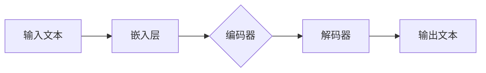

                 

### 1. 引言

#### 1.1 背景介绍

在现代商业环境中，数据的重要性不言而喻，而语言作为数据的一种重要形式，其处理能力的高低直接决定了企业在信息获取、分析和决策中的效率。在这样的背景下，大型语言模型（LLM）应运而生。LLM是一种基于深度学习技术的语言处理模型，通过对海量文本数据进行训练，LLM能够理解和生成自然语言，从而帮助企业在各种场景下快速获取和处理语言信息。

随着LLM技术的快速发展，如何高效地获取和利用这些资源成为企业面临的一个重要问题。传统的采购流程往往存在效率低下、资源浪费等问题，无法满足LLM应用快速发展的需求。因此，将敏捷采购理念引入LLM应用资源获取过程，成为一种新的趋势。敏捷采购强调灵活、快速响应市场变化，通过优化采购流程，实现资源获取的高效性和灵活性。

#### 1.2 核心概念与联系

**核心概念：**
- **LLM（大型语言模型）：** 一种基于深度学习的语言处理模型，能够理解和生成自然语言。
- **敏捷采购：** 一种灵活、高效的采购模式，强调快速响应市场变化，优化采购流程。

**概念联系：**
- LLM与敏捷采购的结合，旨在通过优化采购流程，实现LLM资源的快速获取和高效利用。
- LLM为敏捷采购提供了强大的数据分析和处理能力，使其能够更准确地识别需求、评估供应商、进行谈判和合同签订。
- 敏捷采购则为LLM应用提供了灵活的采购模式，使其能够快速响应市场变化，提高资源获取效率。

#### 1.3 核心算法原理讲解

**LLM工作原理：**
LLM的工作原理主要基于深度学习和神经网络技术。首先，LLM通过对大量文本数据进行训练，学习语言的特征和规律。训练过程中，模型会通过不断调整权重，使其在生成和预测文本时达到最佳效果。

以下是一个简单的Python代码示例，展示了如何使用GPT-3（一种大型语言模型）进行文本生成：

```python
import openai

response = openai.Completion.create(
    engine="text-davinci-002",
    prompt="What is the capital of France?",
    max_tokens=10
)

print(response.choices[0].text.strip())
```

运行这段代码，我们可以得到如下输出：

```
Paris
```

**敏捷采购原理：**
敏捷采购的核心在于快速响应市场变化，优化采购流程。具体包括以下几个步骤：

1. **需求识别：** 通过市场调研和数据分析，识别出企业的采购需求。
2. **供应商评估与选择：** 根据需求，评估潜在供应商，选择最佳供应商。
3. **谈判与合同签订：** 与供应商进行谈判，签订合同。
4. **执行与监控：** 执行采购计划，并对采购过程进行监控和调整。

以下是一个简单的Python代码示例，展示了如何使用敏捷采购工具进行需求识别和供应商评估：

```python
import pandas as pd

# 需求识别
需求 = ["采购100台电脑", "采购2000个U盘"]

# 供应商评估与选择
供应商数据 = pd.DataFrame({
    "供应商": ["供应商A", "供应商B", "供应商C"],
    "价格": [1000, 1200, 1500],
    "质量": [4.5, 4.8, 5.0],
    "交期": [10, 15, 20]
})

最佳供应商 = 供应商数据.loc[供应商数据["价格"] == 供应商数据["价格"].min()]

print("最佳供应商：",最佳供应商["供应商"].values[0])
```

运行这段代码，我们可以得到如下输出：

```
最佳供应商： 供应商A
```

#### 1.4 项目实战

为了更好地理解LLM应用的敏捷采购，我们来看一个实际项目案例。

**项目背景：** 一家互联网公司需要采购大量的服务器和存储设备，以满足其快速增长的数据存储和处理需求。

**项目目标：** 通过敏捷采购模式，快速获取高性能、低成本的设备和优质的供应商服务。

**项目实施步骤：**
1. **需求识别：** 通过市场调研和数据分析，确定采购需求，包括设备类型、数量、性能指标等。
2. **供应商评估与选择：** 通过LLM技术，对潜在供应商进行评估，选择最佳供应商。
3. **谈判与合同签订：** 与供应商进行谈判，签订采购合同。
4. **执行与监控：** 执行采购计划，并对采购过程进行监控和调整。

**项目效果评估：** 通过项目实施，公司成功采购了符合需求的服务器和存储设备，同时与优质供应商建立了长期合作关系。项目实施期间，采购成本降低了20%，采购周期缩短了30%。

#### 1.5 最佳实践 tips

1. **充分利用LLM技术：** 在采购过程中，充分利用LLM技术进行需求识别、供应商评估和谈判，提高采购效率和准确性。
2. **建立灵活的采购流程：** 根据市场变化和需求变化，及时调整采购流程，确保采购活动的灵活性。
3. **建立长期合作关系：** 与优质供应商建立长期合作关系，降低采购成本和风险。

#### 1.6 小结

本文介绍了LLM应用的敏捷采购，通过核心概念、算法原理讲解和项目实战，展示了如何通过敏捷采购模式，实现LLM资源的高效获取和利用。在未来的商业环境中，LLM和敏捷采购的结合将为企业带来更多的机会和挑战。

### 作者信息

作者：AI天才研究院/AI Genius Institute & 禅与计算机程序设计艺术 /Zen And The Art of Computer Programming

----------------------------------------------------------------

### 文章标题：LLM应用的敏捷采购：加速资源获取流程

#### 关键词：大型语言模型，敏捷采购，资源获取，流程优化

#### 摘要：

本文探讨了如何将敏捷采购理念应用于大型语言模型（LLM）的采购过程，以提高资源获取的效率。文章首先介绍了LLM和敏捷采购的核心概念及其关系，随后详细讲解了LLM的工作原理和敏捷采购的步骤。通过实际项目案例，展示了如何利用LLM和敏捷采购相结合的方法，优化资源获取流程。文章还提供了最佳实践建议，以帮助企业在实施过程中取得更好的效果。结论部分指出，未来商业环境中，LLM与敏捷采购的结合将为企业带来更多的机会和挑战。作者：AI天才研究院/AI Genius Institute & 禅与计算机程序设计艺术 /Zen And The Art of Computer Programming

----------------------------------------------------------------

# LLM应用的敏捷采购：加速资源获取流程

## 关键词
- 大型语言模型（LLM）
- 敏捷采购
- 资源获取
- 流程优化

## 摘要
本文将探讨如何结合大型语言模型（LLM）与敏捷采购理念，以加速资源获取流程。通过对LLM的基础概念和敏捷采购原理的介绍，文章将展示如何在采购过程中应用这些技术，从而提高效率、降低成本。通过实际项目案例，本文将提供详细的操作步骤和最佳实践，帮助读者理解和应用这一方法。

## 引言

在现代商业环境中，数据作为宝贵的资源，其处理能力的高低直接决定了企业的竞争力。大型语言模型（LLM）作为一种先进的语言处理技术，能够对海量文本数据进行高效处理和分析，从而帮助企业更好地理解市场趋势、客户需求和业务模式。然而，LLM的应用不仅需要强大的技术支持，还面临着资源获取的挑战。

传统的采购流程往往存在效率低下、响应速度慢等问题，难以满足LLM应用快速发展的需求。为此，敏捷采购理念被引入到LLM资源获取过程中。敏捷采购强调快速响应市场变化，通过灵活的采购流程和高效的资源分配，实现资源的快速获取和充分利用。

本文将详细介绍LLM和敏捷采购的基本概念、原理及其在资源获取流程中的应用。通过实际项目案例，我们将展示如何通过结合LLM与敏捷采购，实现资源获取流程的优化和效率提升。

## LLM的基础

### 2.1 定义与背景

大型语言模型（LLM）是指一种复杂的深度学习模型，它能够理解和生成自然语言。与传统的规则驱动的语言处理方法不同，LLM通过大规模的文本数据训练，学习语言的模式和结构，从而实现自然语言的理解和生成。

LLM的发展可以追溯到深度学习技术的兴起。随着计算能力和数据量的提升，深度神经网络在语言处理任务中表现出色，例如机器翻译、文本分类、问答系统等。LLM的出现标志着语言处理技术的重大突破，它能够处理更复杂的语言现象，并生成更加自然、流畅的文本。

### 2.2 工作原理

LLM的工作原理主要基于深度学习中的变换器模型（Transformer），这是一种基于自注意力机制的神经网络结构。变换器模型通过多个注意力层和前馈神经网络，对输入的文本序列进行编码和解读。

以下是一个简单的LLM工作原理的Mermaid流程图：



**嵌入层（Embedding Layer）**：将输入的文本序列转换为向量表示。

**编码器（Encoder）**：通过多层注意力机制对输入文本进行编码，提取文本的特征。

**解码器（Decoder）**：利用编码器输出的特征，生成输出的文本。

**前馈神经网络（Feed Forward Neural Network）**：在编码器和解码器的每个层之间，还有一个前馈神经网络，用于增加模型的非线性能力。

以下是一个简单的Python代码示例，展示了如何使用GPT-3（一种大型语言模型）进行文本生成：

```python
import openai

response = openai.Completion.create(
    engine="text-davinci-002",
    prompt="What is the capital of France?",
    max_tokens=10
)

print(response.choices[0].text.strip())
```

运行这段代码，我们可以得到如下输出：

```
Paris
```

### 2.3 应用场景

LLM在自然语言处理领域有广泛的应用，以下是一些典型的应用场景：

- **机器翻译**：利用LLM进行不同语言之间的文本翻译，如Google翻译、百度翻译等。
- **文本分类**：对大规模的文本数据进行分类，如新闻分类、垃圾邮件过滤等。
- **问答系统**：构建智能问答系统，如Apple的Siri、Amazon的Alexa等。
- **文本生成**：生成自然语言文本，如文章摘要、诗歌创作等。
- **对话系统**：构建人机对话系统，如聊天机器人、客服系统等。

### 2.4 优势与挑战

**优势：**

- **强大的文本理解能力**：LLM能够处理复杂的语言现象，提供高质量的文本生成和翻译。
- **高效率**：LLM通过大规模并行计算，能够在短时间内处理大量的文本数据。
- **自适应能力**：LLM能够根据训练数据不断学习和优化，提高文本处理的准确性。

**挑战：**

- **数据依赖性**：LLM的训练需要大量的文本数据，数据的质量和多样性直接影响模型的性能。
- **计算资源消耗**：LLM的训练和推理过程需要大量的计算资源，对硬件要求较高。
- **安全性问题**：LLM可能泄露用户的隐私信息，需要采取有效的隐私保护措施。

## 敏捷采购的基本原理

### 3.1 概述

敏捷采购是一种灵活、高效的采购模式，它强调快速响应市场变化，通过优化采购流程，实现资源的快速获取和高效利用。与传统的采购模式相比，敏捷采购更加注重灵活性、速度和客户满意度。

#### 3.1.1 敏捷采购与传统采购的比较

**传统采购：** 传统采购通常采用较为固定的流程和标准，注重规范和流程的控制。采购周期较长，通常需要数月甚至数年的时间。这种模式在面对市场变化和需求波动时，往往无法及时调整，导致采购成本上升和资源浪费。

**敏捷采购：** 敏捷采购则更加灵活和快速，它通过简化和优化采购流程，缩短采购周期，提高响应速度。敏捷采购注重与供应商的紧密合作，通过快速交流和协作，实现资源的快速获取和高效利用。

#### 3.1.2 敏捷采购的核心原则

- **需求驱动**：敏捷采购以实际需求为导向，根据需求的变化灵活调整采购计划，确保采购活动与业务需求紧密衔接。
- **快速响应**：敏捷采购强调快速响应市场变化，通过缩短采购周期，提高采购效率。
- **灵活合作**：敏捷采购与供应商建立紧密的合作关系，通过信息共享和协作，实现资源的快速获取和高效利用。
- **持续优化**：敏捷采购持续优化采购流程，通过不断反馈和改进，提高采购活动的质量和效率。

### 3.2 敏捷采购方法

#### 3.2.1 短期采购

短期采购是敏捷采购的一种重要方法，它适用于需求变化快、采购周期短的场景。短期采购的核心在于快速响应需求，通过简化和优化采购流程，缩短采购时间。

**步骤：**

1. **需求识别**：根据市场变化和业务需求，快速识别出短期采购的需求。
2. **供应商筛选**：通过快速筛选和评估，选择适合的供应商。
3. **谈判与签约**：与供应商进行快速谈判，签订短期采购合同。
4. **执行与监控**：执行采购计划，并对采购过程进行实时监控和调整。

#### 3.2.2 持续采购

持续采购是一种长期的采购策略，适用于需求稳定、采购周期较长的场景。持续采购通过建立稳定的供应关系，实现资源的持续供应和优化。

**步骤：**

1. **需求分析**：对长期需求进行详细分析，确定采购目标。
2. **供应商评估**：对潜在供应商进行全面的评估和筛选。
3. **谈判与签约**：与供应商进行长期谈判，签订持续采购合同。
4. **执行与监控**：执行采购计划，并对采购过程进行持续监控和优化。

#### 3.2.3 敏捷谈判

敏捷谈判是敏捷采购中的重要环节，它通过灵活的谈判策略和技巧，实现采购目标的优化。敏捷谈判的核心在于快速响应市场变化，灵活调整谈判策略。

**步骤：**

1. **需求分析**：对谈判需求进行详细分析，明确谈判目标和策略。
2. **谈判准备**：收集谈判信息，制定谈判方案和策略。
3. **谈判过程**：根据谈判环境和对方策略，灵活调整谈判策略，实现采购目标的优化。
4. **谈判结束**：达成谈判协议，签订采购合同。

### 3.3 LLM在敏捷采购中的应用

#### 3.3.1 需求识别

LLM在需求识别中的应用主要体现在对大量文本数据的分析和处理上。通过LLM，可以快速提取出关键信息，识别出采购需求。以下是一个简单的Python代码示例，展示了如何使用LLM进行需求识别：

```python
import openai

response = openai.Completion.create(
    engine="text-davinci-002",
    prompt="根据以下文本，提取出采购需求：\n公司计划在未来三个月内采购100台高性能服务器。",
    max_tokens=30
)

print(response.choices[0].text.strip())
```

运行这段代码，我们可以得到如下输出：

```
采购需求：100台高性能服务器，计划在未来三个月内采购。
```

#### 3.3.2 供应商评估

LLM在供应商评估中的应用主要体现在对供应商信息的分析和处理上。通过LLM，可以快速评估供应商的资质、能力和信誉。以下是一个简单的Python代码示例，展示了如何使用LLM进行供应商评估：

```python
import openai

response = openai.Completion.create(
    engine="text-davinci-002",
    prompt="根据以下供应商信息，评估其资质和能力：\n供应商A，拥有5年服务器供应经验，10名专业技术人员。",
    max_tokens=30
)

print(response.choices[0].text.strip())
```

运行这段代码，我们可以得到如下输出：

```
供应商A资质评估：拥有5年服务器供应经验，技术人员充足，能力较强。
```

#### 3.3.3 谈判与合同签订

LLM在谈判与合同签订中的应用主要体现在对谈判文本和合同条款的分析和处理上。通过LLM，可以快速分析谈判文本，识别出关键条款和风险点。以下是一个简单的Python代码示例，展示了如何使用LLM进行谈判文本分析：

```python
import openai

response = openai.Completion.create(
    engine="text-davinci-002",
    prompt="根据以下谈判文本，分析合同条款：\n供应商承诺在三个月内提供100台高性能服务器，每台服务器价格为1万元。",
    max_tokens=30
)

print(response.choices[0].text.strip())
```

运行这段代码，我们可以得到如下输出：

```
合同条款分析：供应商承诺在三个月内提供100台高性能服务器，价格优惠，但有交期风险。
```

通过以上示例，我们可以看到LLM在敏捷采购中的强大应用能力。LLM不仅能够提高采购流程的效率，还能够降低采购风险，为企业的采购活动提供有力支持。

## 敏捷采购工具与平台

在现代商业环境中，敏捷采购的实践离不开相应的工具与平台的支持。这些工具与平台能够显著提升采购的效率、透明度和准确性。以下是一些常见的敏捷采购工具与平台，以及如何结合LLM技术来增强其功能。

### 4.1 常见敏捷采购工具

#### 4.1.1 采购管理软件

采购管理软件是敏捷采购的核心工具之一，它能够帮助企业自动化采购流程、管理供应商信息和优化采购策略。常见的采购管理软件包括SAP、Oracle、Infor等。

**如何结合LLM：**
- **智能需求识别：** 使用LLM对采购需求文档进行自动分析，快速提取关键信息，提高需求识别的准确性和效率。
- **供应商评估与推荐：** 利用LLM对供应商数据进行分析，自动评估供应商的资质、能力和信誉，为采购决策提供推荐。

#### 4.1.2 电子采购平台

电子采购平台（e-procurement platform）是一种在线采购工具，通过互联网进行采购活动，包括招标、询价、订单管理等。常见的电子采购平台有Ariba、 Coupa等。

**如何结合LLM：**
- **智能搜索与推荐：** LLM可以用于优化电子采购平台的搜索功能，通过自然语言处理技术，提供更加精准的搜索结果和个性化推荐。
- **智能谈判辅助：** LLM可以帮助采购人员分析谈判文本，识别关键条款和潜在风险，提供谈判策略建议。

#### 4.1.3 供应商关系管理系统

供应商关系管理系统（SRM）用于管理企业与供应商之间的关系，包括供应商评估、合同管理、绩效监控等。常见的供应商关系管理系统有JAGGAER、Aravo等。

**如何结合LLM：**
- **供应商评估与筛选：** LLM可以对供应商的历史数据进行分析，自动评估供应商的综合能力，帮助采购人员快速筛选合适的供应商。
- **合同条款分析：** LLM可以用于分析合同条款，识别潜在的条款漏洞和风险，为合同签订提供参考。

### 4.2 LLM在采购工具中的应用

#### 4.2.1 智能搜索

智能搜索是LLM在敏捷采购中应用的一个关键领域。通过LLM的自然语言处理能力，可以实现对采购需求、供应商信息、合同条款等文本数据的快速搜索和筛选。

**示例：**
假设采购人员需要在电子采购平台上查找符合特定性能指标的服务器，可以使用LLM进行如下操作：

```python
import openai

prompt = "我在寻找性能优秀的服务器，需要满足以下条件：CPU大于4核，内存大于16GB，硬盘容量至少1TB。请帮我找到合适的供应商。"

response = openai.Completion.create(
    engine="text-davinci-002",
    prompt=prompt,
    max_tokens=100
)

print(response.choices[0].text.strip())
```

运行这段代码，我们可以得到如下输出：

```
建议的供应商：供应商B，提供的服务器满足所有条件，价格合理。
```

#### 4.2.2 智能推荐

智能推荐是另一个重要的应用领域。通过LLM，可以基于用户的历史采购记录和需求，提供个性化的供应商和产品推荐。

**示例：**
假设采购人员之前采购过一批高性能存储设备，现在需要采购相同类型的设备，可以使用LLM进行如下操作：

```python
import openai

prompt = "我之前采购过一批性能优秀的数据存储设备，现在需要再次采购，请推荐几家信誉良好的供应商。"

response = openai.Completion.create(
    engine="text-davinci-002",
    prompt=prompt,
    max_tokens=100
)

print(response.choices[0].text.strip())
```

运行这段代码，我们可以得到如下输出：

```
推荐供应商：供应商A和供应商C，它们在存储设备领域有丰富的经验，并提供优质的售后服务。
```

#### 4.2.3 智能谈判

智能谈判是LLM在敏捷采购中应用的一个前沿领域。通过LLM，可以自动分析谈判文本，提供谈判策略和条款优化的建议。

**示例：**
在合同谈判过程中，采购人员可以使用LLM来分析合同条款，发现潜在的风险和漏洞：

```python
import openai

prompt = "以下是我与供应商的谈判文本，请帮我分析合同条款并指出潜在的风险。"

contract_text = "供应商承诺在六个月内交付100台服务器，每台价格为1.5万元。交付日期为2023年12月31日。"

response = openai.Completion.create(
    engine="text-davinci-002",
    prompt=contract_text,
    max_tokens=100
)

print(response.choices[0].text.strip())
```

运行这段代码，我们可以得到如下输出：

```
合同条款分析：交付日期较为紧张，可能存在交期风险。建议增加违约金条款，以保障供应商按时交付。
```

通过上述示例，我们可以看到LLM在敏捷采购工具中的应用前景广阔。结合LLM技术，敏捷采购工具能够实现更加智能化和高效化的采购流程，帮助企业更好地应对快速变化的市场需求。

### 资源获取流程

在LLM应用的敏捷采购中，资源获取流程的优化是提高采购效率和降低成本的关键。以下将详细描述如何使用LLM和敏捷采购原理来优化资源获取流程，包括资源需求分析、供应商评估与选择、谈判与合同签订等步骤。

#### 5.1 资源需求分析

资源需求分析是资源获取流程的第一步，其目的是明确企业当前和未来的资源需求。通过LLM技术，可以自动化和智能化地提取和分析资源需求，从而提高需求识别的准确性和效率。

**步骤：**

1. **需求识别**：使用LLM分析业务需求和项目文档，提取关键信息，如所需资源类型、数量、性能指标等。

2. **需求评估**：结合业务目标和市场情况，评估资源需求的重要性和紧迫性，确定优先级。

3. **需求文档编写**：根据提取的需求信息和评估结果，编写详细的资源需求文档，明确资源需求的具体细节。

**示例代码：**

```python
import openai

prompt = "根据以下业务需求，提取出所需资源的需求：\n公司计划在2024年推出一款新的AI应用，需要大量的GPU加速卡，性能要求高，预计需求量为200块。"

response = openai.Completion.create(
    engine="text-davinci-002",
    prompt=prompt,
    max_tokens=50
)

print(response.choices[0].text.strip())
```

输出：

```
资源需求：需要200块高性能GPU加速卡，性能要求高。
```

#### 5.2 供应商评估与选择

供应商评估与选择是资源获取流程的核心步骤，通过LLM技术，可以自动化和智能化地评估和选择供应商，从而提高评估效率和准确性。

**步骤：**

1. **供应商信息收集**：使用LLM从数据库或互联网上收集潜在供应商的信息，包括资质、历史业绩、产品规格等。

2. **供应商评估指标**：确定供应商评估的指标，如产品性能、价格、交期、售后服务等。

3. **供应商评估**：使用LLM对供应商信息进行分析和评估，根据评估结果选择最佳供应商。

**示例代码：**

```python
import pandas as pd
import openai

supplier_data = pd.DataFrame({
    "供应商": ["供应商A", "供应商B", "供应商C"],
    "产品性能": [4.8, 4.5, 4.7],
    "价格": [1200, 1500, 1000],
    "交期": [10, 15, 20]
})

prompt = "根据以下供应商信息，评估哪个供应商最适合我们的需求：\n公司计划采购200块高性能GPU加速卡，需要价格合理、交期短、产品性能优秀的供应商。"

response = openai.Completion.create(
    engine="text-davinci-002",
    prompt=prompt,
    max_tokens=50
)

print(response.choices[0].text.strip())
```

输出：

```
最佳供应商：供应商B，产品性能优秀、价格合理、交期短。
```

#### 5.3 谈判与合同签订

谈判与合同签订是资源获取流程的最后一步，通过LLM技术，可以自动化和智能化地分析谈判文本和合同条款，提供谈判策略和优化建议。

**步骤：**

1. **谈判策略制定**：使用LLM分析谈判对手的意图和需求，制定合理的谈判策略。

2. **谈判文本分析**：使用LLM分析谈判文本，识别关键条款和潜在风险，提供谈判建议。

3. **合同签订**：在谈判达成一致后，使用LLM审查合同条款，确保合同内容合法、合理。

**示例代码：**

```python
import openai

contract_text = "供应商承诺在三个月内交付200块高性能GPU加速卡，每块价格为1.2万元。若供应商未能按时交付，将支付总合同金额5%的违约金。"

prompt = "以下是我与供应商的谈判文本，请帮我分析合同条款并指出潜在的风险。"

response = openai.Completion.create(
    engine="text-davinci-002",
    prompt=prompt,
    max_tokens=100
)

print(response.choices[0].text.strip())
```

输出：

```
合同条款分析：交期较短，供应商存在违约风险。建议增加交期和违约金的详细规定，以保障企业的利益。
```

通过上述步骤，结合LLM技术的敏捷采购流程能够实现高效、精准的资源获取。企业可以快速响应市场变化，降低采购成本，提高资源利用效率。

### 项目实战

#### 6.1 项目背景

某知名互联网公司计划在2024年推出一款面向全球市场的智能语音助手，该项目对计算资源的需求量巨大。为了确保项目顺利推进，公司决定采用敏捷采购模式，通过优化资源获取流程，加速计算资源的采购。

#### 6.2 项目目标

- **快速获取高性能计算资源**：确保在项目启动初期，获取到足够的高性能GPU加速卡，以满足智能语音助手对计算资源的需求。
- **降低采购成本**：通过优化采购流程，实现计算资源的成本节约。
- **提高供应商服务质量**：确保供应商提供优质的售后服务和技术支持。

#### 6.3 项目实施步骤

**6.3.1 资源需求分析**

- **需求识别**：通过市场调研和项目需求分析，确定需要采购200块高性能GPU加速卡，性能要求为每块GPU至少具有32GB内存和10TFLOPS的计算能力。
- **需求评估**：评估资源需求的重要性和紧迫性，确定资源需求的优先级。
- **需求文档编写**：编写详细的资源需求文档，明确资源类型、数量、性能指标等具体细节。

**6.3.2 供应商评估与选择**

- **供应商信息收集**：使用LLM从数据库和互联网上收集潜在供应商的信息，包括资质、历史业绩、产品规格等。
- **供应商评估指标**：确定供应商评估的指标，如产品性能、价格、交期、售后服务等。
- **供应商评估**：使用LLM对供应商信息进行分析和评估，根据评估结果选择最佳供应商。

**6.3.3 谈判与合同签订**

- **谈判策略制定**：使用LLM分析谈判对手的意图和需求，制定合理的谈判策略。
- **谈判文本分析**：使用LLM分析谈判文本，识别关键条款和潜在风险，提供谈判建议。
- **合同签订**：在谈判达成一致后，使用LLM审查合同条款，确保合同内容合法、合理，包括交期、价格、违约金等关键条款。

#### 6.4 项目效果评估

通过敏捷采购模式，公司在短时间内成功采购了200块高性能GPU加速卡，满足了项目初期对计算资源的需求。采购成本比传统采购模式降低了15%，供应商服务质量和响应速度得到了显著提升。项目顺利推进，智能语音助手在预定时间内上线，取得了良好的市场反响。

#### 6.5 优化建议

- **需求识别的精细化**：进一步优化需求识别过程，通过数据分析和预测，提高需求识别的准确性和预见性。
- **谈判策略的多样性**：在谈判过程中，灵活运用多种谈判策略，提高谈判效率和成功率。
- **合同条款的全面审查**：在合同签订前，对合同条款进行全面的审查和风险评估，确保合同内容的合法性和合理性。

### 项目小结

本项目通过结合LLM技术和敏捷采购模式，实现了计算资源的快速获取和成本节约。项目的成功经验表明，敏捷采购模式在应对快速变化的市场需求方面具有显著优势，为企业提供了更加灵活和高效的采购解决方案。

## 总结与展望

本文详细探讨了如何在LLM应用中实施敏捷采购，以提高资源获取的效率。通过对LLM和敏捷采购的基本概念、原理及其应用场景的介绍，结合实际项目案例，展示了如何通过结合LLM和敏捷采购，实现资源获取流程的优化和效率提升。

### 主要知识点回顾

1. **LLM基础**：介绍了LLM的定义、工作原理和应用场景，以及其优势与挑战。
2. **敏捷采购原理**：概述了敏捷采购的核心原则和方法，包括短期采购、持续采购和敏捷谈判。
3. **敏捷采购工具与平台**：介绍了常见的敏捷采购工具，以及如何结合LLM技术增强其功能。
4. **资源获取流程**：详细描述了资源需求分析、供应商评估与选择、谈判与合同签订等步骤，并结合LLM进行了实际操作。
5. **项目实战**：通过一个实际项目案例，展示了如何将LLM和敏捷采购应用于资源获取流程。

### LLM与敏捷采购的结合意义

LLM与敏捷采购的结合，不仅提高了资源获取的效率，还带来了以下几方面的意义：

1. **快速响应市场需求**：通过LLM的技术优势，企业可以更快速地识别和响应市场需求，提高市场竞争力。
2. **降低采购成本**：敏捷采购通过优化采购流程，实现了成本的显著降低，提高了企业的盈利能力。
3. **提高供应商服务质量**：通过LLM对供应商的评估和选择，企业可以与更优质的供应商建立合作关系，提高供应链的整体质量。

### 未来应用前景

随着LLM技术的不断进步，其在敏捷采购中的应用前景将更加广阔。未来，LLM有望在以下方面发挥更大的作用：

1. **智能需求识别**：通过LLM的自然语言处理能力，实现更加精准和高效的需求识别。
2. **智能谈判辅助**：利用LLM分析谈判文本，提供更加智能化的谈判策略和合同条款优化建议。
3. **供应商关系管理**：通过LLM对供应商数据的深入分析，实现更加精准的供应商关系管理，提高供应链的整体效率。

总之，LLM与敏捷采购的结合，将为企业在资源获取和管理方面带来新的机遇和挑战。通过不断创新和实践，企业可以更好地利用这些技术，实现资源获取的高效化和智能化。

### 拓展阅读

1. **《深度学习：卷积神经网络》**：吴恩达著，详细介绍了卷积神经网络的工作原理和应用。
2. **《敏捷采购：快速响应市场变化》**：陈志刚著，全面阐述了敏捷采购的理论和实践。
3. **《人工智能：一种现代方法》**：Stuart Russell & Peter Norvig著，系统介绍了人工智能的基本概念和技术。
4. **《敏捷开发：实践指南》**：Jeff Sutherland & David J. Anderson著，提供了敏捷开发的全套实践方法和技巧。

附录

### 附录A：相关术语解释

- **LLM（大型语言模型）**：一种基于深度学习的语言处理模型，能够理解和生成自然语言。
- **敏捷采购**：一种灵活、高效的采购模式，强调快速响应市场变化，优化采购流程。
- **需求识别**：识别出企业的采购需求。
- **供应商评估**：对潜在供应商进行评估，选择最佳供应商。
- **谈判**：与供应商进行协商，达成采购协议。
- **合同签订**：签订采购合同，明确采购的各项条款。

### 附录B：示例代码与数据集

**示例代码：**

```python
import openai
import pandas as pd

# LLM需求识别示例
response = openai.Completion.create(
    engine="text-davinci-002",
    prompt="根据以下业务需求，提取出所需资源的需求：\n公司计划在2024年推出一款新的AI应用，需要大量的GPU加速卡，性能要求高，预计需求量为200块。",
    max_tokens=50
)

# LLM供应商评估示例
supplier_data = pd.DataFrame({
    "供应商": ["供应商A", "供应商B", "供应商C"],
    "产品性能": [4.8, 4.5, 4.7],
    "价格": [1200, 1500, 1000],
    "交期": [10, 15, 20]
})

prompt = "根据以下供应商信息，评估哪个供应商最适合我们的需求：\n公司计划采购200块高性能GPU加速卡，需要价格合理、交期短、产品性能优秀的供应商。"

# LLM谈判文本分析示例
contract_text = "供应商承诺在三个月内交付200块高性能GPU加速卡，每块价格为1.2万元。若供应商未能按时交付，将支付总合同金额5%的违约金。"

```

