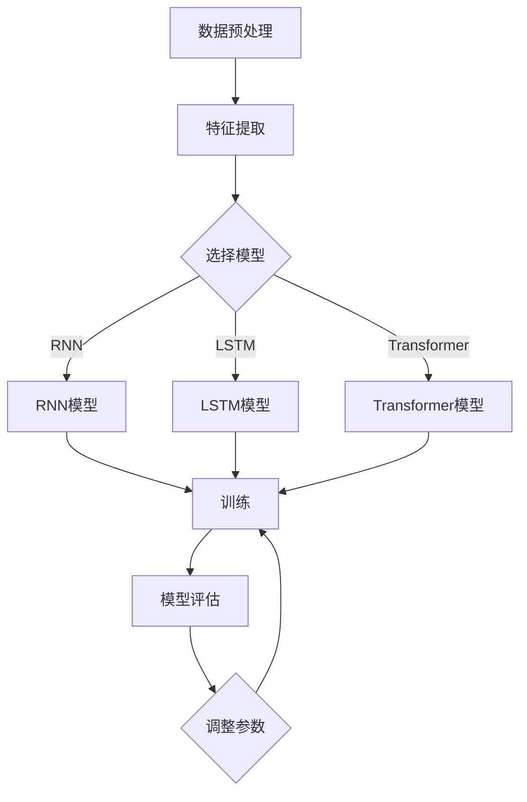

                 

### 引言

在当今快速发展的技术时代，语言模型（LLM，Language Models）已经成为人工智能领域的一个重要组成部分。LLM在自然语言处理（NLP，Natural Language Processing）中的应用越来越广泛，从智能客服、智能翻译到文本生成，都在不断推动着AI技术的发展。然而，随着LLM的应用场景变得更加复杂，如何有效地处理和恢复错误成为了一个不容忽视的问题。

错误处理与恢复策略在软件开发中一直占据着核心地位，特别是在复杂系统的构建中，如LLM的应用。传统的错误处理方法通常侧重于代码层面的错误检测和修正，而敏捷开发方法的出现，使得我们在错误处理与恢复方面有了更多的选择。敏捷开发强调迭代、持续交付和快速响应变化，这一理念与LLM应用的需求高度契合。

本文旨在探讨LLM应用中的敏捷错误处理与恢复策略。我们将首先介绍LLM与敏捷开发的基础概念，并解释它们之间的关系。随后，我们将详细讨论LLM的核心概念原理，包括基础理论、训练与推理流程，以及如何使用Mermaid流程图来详细解释LLM的架构。在接下来的章节中，我们将逐步深入到错误处理策略的各个环节，包括错误检测与识别、错误分类与评估，以及错误处理与恢复策略的设计。最后，我们将通过实际案例来展示这些策略的实践应用，并提供一些最佳实践建议。

本文的目标读者是从事人工智能开发的技术人员，特别是对LLM应用感兴趣的读者。无论您是初学者还是经验丰富的开发者，本文都将为您提供有价值的见解和实践指导。

关键词：语言模型（LLM）、敏捷开发、错误处理、恢复策略、自然语言处理（NLP）

摘要：本文深入探讨了LLM应用中的敏捷错误处理与恢复策略。通过介绍LLM与敏捷开发的基础概念，我们探讨了它们之间的融合点。随后，我们详细解析了LLM的核心概念原理，并通过实际案例展示了错误处理与恢复策略的实践应用。本文旨在为LLM开发者提供全面的指导，帮助他们在实际项目中构建可靠的错误处理与恢复机制。

---

### 第一部分：基础概念与架构

#### 第1章：LLM与敏捷开发概述

##### 1.1 语言模型（LLM）的定义与分类

语言模型（LLM）是一种基于统计或神经网络算法的自然语言处理（NLP）模型，用于预测或生成自然语言序列。LLM的核心任务是理解自然语言的结构和语义，从而在文本生成、机器翻译、问答系统等多个应用场景中发挥作用。

LLM可以分为两大类：基于规则的语言模型和基于统计或神经网络的语言模型。

1. **基于规则的语言模型**：
   - 这种模型通过手动编写规则来模拟自然语言的结构。例如，在语义角色标注任务中，规则可以定义主语、谓语、宾语等元素之间的对应关系。
   - 基于规则的模型在处理特定领域或具有明确语法规则的语言时效果较好，但其扩展性和适应性较差。

2. **基于统计或神经网络的语言模型**：
   - 统计模型，如N元语法（N-gram），通过统计文本中相邻单词的频率来预测下一个单词。
   - 神经网络模型，如递归神经网络（RNN）和变换器（Transformer），通过学习大量文本数据来理解语言的深层结构。
   - 基于统计或神经网络的模型具有更高的灵活性和泛化能力，可以处理复杂的自然语言任务。

##### 1.2 敏捷开发方法论

敏捷开发（Agile Development）是一种软件开发的动态方法，强调迭代、协作和快速响应变化。敏捷开发的核心原则包括：

1. **个体和互动胜过过程与工具**：
   - 敏捷开发认为团队的合作和沟通比遵循特定的开发流程和工具更加重要。

2. **可工作的软件胜过详尽的文档**：
   - 敏捷开发强调软件的实际可用性，而非大量的文档。

3. **客户协作胜过合同谈判**：
   - 与客户的密切合作可以确保开发工作与客户需求保持一致。

4. **响应变化胜过遵循计划**：
   - 敏捷开发允许项目需求在开发过程中发生变化，并通过迭代来适应这些变化。

##### 1.3 敏捷开发在LLM开发中的应用

敏捷开发方法在LLM开发中的应用主要体现在以下几个方面：

1. **迭代开发**：
   - LLM的开发过程可以分为多个迭代，每个迭代都会生成一个可用的模型版本，逐步优化模型性能。

2. **持续集成与持续交付**：
   - 通过持续集成和持续交付，LLM模型可以在开发过程中不断进行测试和部署，确保模型的质量和稳定性。

3. **用户反馈**：
   - 敏捷开发强调用户反馈，通过收集用户使用LLM模型的反馈，可以及时调整模型以更好地满足用户需求。

4. **自动化测试**：
   - 敏捷开发倡导自动化测试，确保每次迭代中的代码变更都不会引入新的错误。

##### 1.4 LLM与敏捷开发的融合

LLM与敏捷开发的融合，主要体现在以下几个方面：

1. **数据处理**：
   - 敏捷开发强调数据驱动的开发过程，LLM的开发同样需要大量高质量的数据来训练和验证模型。

2. **模型优化**：
   - 敏捷开发中的持续集成和持续交付，可以帮助LLM开发者快速优化模型，提高模型性能。

3. **团队协作**：
   - 敏捷开发强调团队协作，LLM的开发同样需要数据科学家、工程师和产品经理等角色的紧密合作。

4. **用户反馈**：
   - 敏捷开发中的用户反馈机制，可以帮助LLM开发者了解模型在实际应用中的效果，及时进行调整和优化。

##### 1.5 融合效果评估

LLM与敏捷开发的融合，可以带来以下效果：

1. **提高开发效率**：
   - 通过迭代开发和自动化测试，可以快速发现和修复问题，提高开发效率。

2. **提高模型质量**：
   - 通过持续集成和持续交付，可以确保模型的质量和稳定性。

3. **提高用户满意度**：
   - 通过用户反馈机制，可以更好地满足用户需求，提高用户满意度。

4. **降低开发成本**：
   - 通过减少错误和优化模型，可以降低开发和维护成本。

在本章中，我们介绍了LLM与敏捷开发的基础概念，并探讨了它们之间的融合策略。在接下来的章节中，我们将进一步探讨LLM的核心概念原理，以及如何在实际项目中应用这些原理。

---

### 第二部分：错误处理策略

#### 第2章：LLM的核心概念原理

##### 2.1 语言模型的基础理论

语言模型（LLM）是一种用于预测或生成自然语言序列的算法，其基础理论涵盖了自然语言处理（NLP）的核心概念。理解这些基础理论对于设计和实现高效的LLM至关重要。

1. **自然语言处理的基本概念**：
   - 自然语言处理旨在使计算机能够理解、处理和生成自然语言。其核心概念包括：
     - **词法分析**：将文本分解为单词、短语或其他语法单元。
     - **句法分析**：解析文本的结构，识别句子中的主语、谓语、宾语等语法成分。
     - **语义分析**：理解文本的含义，包括词汇的语义角色和句子之间的逻辑关系。
     - **语音识别**：将语音信号转换为文本。
     - **机器翻译**：将一种语言的文本翻译成另一种语言。

2. **语言模型的基本原理**：
   - 语言模型的核心任务是生成自然语言文本，通常基于以下几种原理：
     - **统计语言模型**：基于文本的统计信息，如N-gram模型，通过统计相邻单词的出现频率来预测下一个单词。
     - **神经网络语言模型**：使用递归神经网络（RNN）或变换器（Transformer）等深度学习模型，通过学习大量文本数据来预测自然语言序列。
     - **基于规则的模型**：通过手动编写的规则来模拟自然语言的结构，如解析树或依存句法分析。

##### 2.2 训练与推理流程

语言模型的训练与推理是构建和利用LLM的核心环节。以下是LLM的训练与推理流程：

1. **训练流程**：
   - **数据准备**：收集并预处理大量文本数据，如新闻文章、对话记录、书籍等。
   - **特征提取**：将文本转换为向量表示，如词嵌入或词袋模型。
   - **模型选择**：选择合适的模型架构，如RNN、LSTM、Transformer等。
   - **参数优化**：通过反向传播算法和梯度下降等优化方法，调整模型参数，以最小化预测误差。
   - **评估与调整**：使用验证集评估模型性能，并根据评估结果调整模型参数。

2. **推理流程**：
   - **输入预处理**：将输入文本转换为与训练时相同的特征表示。
   - **文本生成**：通过模型预测下一个单词或词元，逐步生成完整文本。
   - **输出后处理**：对生成的文本进行必要的后处理，如去除无关内容、格式化等。

##### 2.3 Mermaid流程图：LLM架构详解

为了更好地理解LLM的架构，我们可以使用Mermaid流程图来详细解释LLM的各个组件和流程。以下是一个简化的LLM架构Mermaid流程图：



在该流程图中，各组件的作用如下：
- **数据预处理**：收集和清洗文本数据，进行分词、去停用词等处理。
- **特征提取**：将文本转换为向量表示，如词嵌入。
- **选择模型**：根据任务需求选择合适的模型架构。
- **训练**：使用训练数据训练模型，调整模型参数。
- **模型评估**：使用验证集评估模型性能。
- **调整参数**：根据评估结果调整模型参数，优化模型性能。

通过该流程图，我们可以清晰地看到LLM的各个组件和流程，有助于我们更好地理解和实现LLM。

##### 2.4 核心概念之间的联系

LLM的核心概念之间存在着紧密的联系，这些联系构成了LLM架构的基础：

1. **数据预处理与特征提取**：
   - 数据预处理是特征提取的前提，良好的数据预处理可以显著提高模型性能。
   - 特征提取决定了模型如何理解文本数据，对模型的泛化能力和性能有重要影响。

2. **模型架构与参数优化**：
   - 模型架构决定了模型的学习能力和表达能力，不同的架构适用于不同的任务。
   - 参数优化通过调整模型参数来优化模型性能，是提高模型准确性的关键。

3. **模型评估与调整**：
   - 模型评估是检查模型性能的重要手段，通过评估可以识别模型的不足之处。
   - 参数调整基于评估结果，可以帮助我们找到最佳模型参数，提高模型性能。

在本章中，我们介绍了LLM的基础理论、训练与推理流程，并使用Mermaid流程图详细解释了LLM的架构。在下一章中，我们将深入探讨LLM中的错误处理与识别策略。

---

### 第三部分：错误处理策略

#### 第3章：错误检测与识别

在LLM的应用过程中，错误检测与识别是确保模型稳定性和可靠性的关键环节。错误检测是指通过特定方法检测到系统中的异常情况，而错误识别则是进一步分析这些异常的具体类型和原因。本章将详细介绍LLM应用中的错误检测与识别方法，并探讨如何利用这些方法来提高模型性能和稳定性。

##### 3.1 错误检测方法

错误检测方法可以分为以下几类：

1. **基于规则的方法**：
   - 基于规则的方法通过预定义的规则来检测输入数据是否符合预期。这种方法简单直观，但扩展性和适应性较差。
   - 例如，在文本分类任务中，可以定义一系列文本特征规则，如包含特定关键词的文本应分类为某一类别。

2. **基于统计的方法**：
   - 基于统计的方法通过分析输入数据的统计特征来检测异常。这种方法利用统计学原理，能够检测出一些隐含的规则。
   - 例如，可以使用K均值聚类算法将输入文本分为不同的簇，然后检测簇之间的差异，识别出异常文本。

3. **基于机器学习的方法**：
   - 基于机器学习的方法通过训练一个分类器来识别异常。这种方法具有较强的适应性和泛化能力，但需要大量高质量的训练数据。
   - 例如，可以使用支持向量机（SVM）或随机森林等算法来训练一个异常检测模型，该模型可以对新输入数据进行分类，判断其是否为异常。

##### 3.2 错误识别算法

错误识别算法是实现错误检测的关键。以下介绍几种常用的错误识别算法：

1. **朴素贝叶斯分类器**：
   - 朴素贝叶斯分类器是一种基于贝叶斯定理和特征条件独立假设的分类算法。它通过计算每个类别的后验概率，选择概率最大的类别作为预测结果。
   - 伪代码示例：
     ```python
     def naive_bayes_classification(inputs, labels, classes):
         probabilities = []
         for class in classes:
             prior_probability = calculate_prior_probability(class, labels)
             likelihoods = calculate_likelihoods(inputs, class)
             posterior_probability = prior_probability * likelihoods
             probabilities.append(posterior_probability)
         predicted_class = argmax(probabilities)
         return predicted_class
     ```

2. **决策树**：
   - 决策树是一种树形结构，通过一系列规则将数据集划分为多个子集。每个节点表示一个特征，每个分支表示该特征的不同取值。
   - 决策树算法包括ID3、C4.5和C5.0等变体，它们通过不同的方法选择最佳划分特征。
   - 伪代码示例：
     ```python
     def decision_tree_classification(data, target_attribute):
         if data中所有记录都属于同一个类别：
             return 这个类别
         else：
             选择最佳特征split_feature
             创建一个节点，该节点的特征为split_feature
             对于split_feature的每个可能取值：
                 子集 = 数据中具有该取值的记录
                 子节点 = decision_tree_classification(子集, target_attribute)
                 节点添加子节点
             return 节点
     ```

3. **支持向量机（SVM）**：
   - 支持向量机是一种监督学习算法，通过找到一个最佳的超平面来分隔不同类别的数据。
   - SVM在处理高维数据和线性不可分问题方面表现出色。
   - 伪代码示例：
     ```python
     def svm_classification(inputs, labels, kernel='linear'):
         # 训练SVM模型
         model = train_svm_model(inputs, labels, kernel)
         # 预测分类结果
         predicted_classes = []
         for input in inputs:
             predicted_class = model.predict(input)
             predicted_classes.append(predicted_class)
         return predicted_classes
     ```

##### 3.3 伪代码：错误识别算法的实现

为了更好地理解错误识别算法的实现，我们提供了一个简单的伪代码示例。以下是一个基于朴素贝叶斯分类器的错误识别算法的实现：

```python
# 初始化模型参数
class NaiveBayesClassifier:
    def __init__(self):
        self.class_probabilities = {}
        self.feature_probabilities = {}

    # 训练模型
    def train(self, inputs, labels):
        classes = set(labels)
        for class_ in classes:
            self.class_probabilities[class_] = calculate_class_probability(class_, labels)
            for feature in inputs:
                self.feature_probabilities[class_, feature] = calculate_feature_probability(class_, feature, inputs, labels)

    # 预测类别
    def predict(self, input_data):
        probabilities = {}
        for class_ in self.class_probabilities:
            probability = self.class_probabilities[class_] * calculate_feature_probabilities_product(input_data, class_, self.feature_probabilities)
            probabilities[class_] = probability
        predicted_class = argmax(probabilities)
        return predicted_class

# 计算类别概率
def calculate_class_probability(class_, labels):
    count = sum(1 for label in labels if label == class_)
    total = len(labels)
    return count / total

# 计算特征概率
def calculate_feature_probability(class_, feature, inputs, labels):
    count = sum(1 for input in inputs for label in labels if label == class_ and feature in input)
    total = sum(1 for input in inputs for label in labels if label == class_)
    return count / total

# 计算特征概率的乘积
def calculate_feature_probabilities_product(input_data, class_, feature_probabilities):
    product = 1
    for feature in input_data:
        if feature in feature_probabilities[class_,]:
            product *= feature_probabilities[class_, feature]
        else:
            product *= 1 / (1 - feature_probabilities[class_, feature])
    return product

# 主函数
def main():
    # 准备数据
    inputs = [...]  # 输入特征
    labels = [...]  # 标签
    # 初始化分类器
    classifier = NaiveBayesClassifier()
    # 训练分类器
    classifier.train(inputs, labels)
    # 测试分类器
    test_inputs = [...]  # 测试输入
    predicted_labels = [classifier.predict(input) for input in test_inputs]
    # 输出预测结果
    print(predicted_labels)

if __name__ == "__main__":
    main()
```

在该伪代码中，我们定义了一个`NaiveBayesClassifier`类，用于实现朴素贝叶斯分类器。该类包含`train`和`predict`方法，分别用于训练模型和预测类别。我们还提供了计算类别概率和特征概率的辅助函数，以及一个主函数用于执行整个流程。

##### 3.4 算法性能分析

错误识别算法的性能可以通过多个指标来评估，包括准确率、召回率和F1值等。

1. **准确率（Accuracy）**：
   - 准确率是预测正确的样本数占总样本数的比例，用于评估模型的总体性能。
   - 公式：$$ \text{Accuracy} = \frac{\text{预测正确数}}{\text{总样本数}} $$

2. **召回率（Recall）**：
   - 召回率是指模型正确识别的异常样本数占所有实际异常样本数的比例，用于评估模型对异常样本的识别能力。
   - 公式：$$ \text{Recall} = \frac{\text{预测正确数}}{\text{实际异常数}} $$

3. **F1值（F1 Score）**：
   - F1值是准确率和召回率的调和平均值，用于平衡模型的总体性能和异常识别能力。
   - 公式：$$ \text{F1 Score} = 2 \times \frac{\text{准确率} \times \text{召回率}}{\text{准确率} + \text{召回率}} $$

通过这些指标，我们可以对不同的错误识别算法进行比较和优化，以提高模型的整体性能。

在本章中，我们介绍了LLM应用中的错误检测与识别方法，并提供了详细的伪代码示例。在下一章中，我们将探讨错误分类与评估方法，进一步优化LLM的应用效果。

---

### 第四部分：恢复策略

#### 第6章：自动恢复机制

在LLM应用中，自动恢复机制是确保系统稳定性和可靠性的关键组成部分。自动恢复机制能够在检测到错误后，自动采取相应的措施来恢复系统的正常运行。本章将详细介绍自动恢复机制的定义、作用、算法原理及其实现。

##### 6.1 自动恢复的定义与作用

自动恢复（Automated Recovery）是指在系统出现故障或错误时，系统能够自动采取一系列措施来恢复到正常状态，而不需要人工干预。自动恢复机制的作用主要体现在以下几个方面：

1. **提高系统可靠性**：
   - 自动恢复机制能够快速检测和纠正错误，从而提高系统的整体可靠性，减少系统崩溃或停机的时间。

2. **降低维护成本**：
   - 通过自动恢复，减少了人工干预的需求，降低了维护成本，提高了开发效率。

3. **增强用户体验**：
   - 自动恢复机制能够确保系统在出现错误时能够迅速恢复，从而提高用户体验，减少用户因系统故障带来的不便。

4. **提高系统稳定性**：
   - 自动恢复机制能够针对不同的错误类型和场景，采取不同的恢复策略，从而增强系统的稳定性。

##### 6.2 自动恢复算法

自动恢复算法是自动恢复机制的核心。以下是几种常见的自动恢复算法：

1. **重启算法**：
   - 重启算法是最简单的自动恢复策略，当系统检测到错误时，自动重启系统进程或服务。
   - 优点：实现简单，能够迅速恢复系统。
   - 缺点：可能造成数据丢失或系统配置的丢失。

2. **备份与恢复算法**：
   - 备份与恢复算法通过定期备份系统状态和数据，当系统出现错误时，可以快速恢复到最新的备份状态。
   - 优点：能够保证数据的完整性，减少数据丢失的风险。
   - 缺点：需要额外的存储空间和备份时间。

3. **重试算法**：
   - 重试算法在检测到错误时，自动重新执行错误的操作或请求。
   - 优点：适用于某些临时错误，如网络延迟或临时故障。
   - 缺点：可能需要多次重试才能成功，增加了系统的响应时间。

4. **自修复算法**：
   - 自修复算法通过检测错误并自动进行修复，而不需要人工干预。
   - 优点：高度自动化，减少人工干预的需求。
   - 缺点：实现复杂，需要准确识别错误的类型和原因。

##### 6.3 伪代码：自动恢复算法的实现

以下是一个简单的伪代码示例，展示了如何实现一个自动恢复算法：

```python
# 自动恢复算法
def automated_recovery_algorithm(error_type, system_state):
    if error_type == 'network_failure':
        # 重试连接
        retry_connection()
    elif error_type == 'data_loss':
        # 恢复到最新备份
        restore_from_backup()
    elif error_type == 'service_failure':
        # 重启服务
        restart_service()
    else:
        # 报告未知错误
        report_unknown_error(error_type)

# 重试连接
def retry_connection():
    max_retries = 3
    retries = 0
    while retries < max_retries:
        try:
            connect_to_network()
            break
        except NetworkError:
            retries += 1
            sleep(5)  # 等待5秒后重试

# 恢复到最新备份
def restore_from_backup():
    latest_backup = get_latest_backup()
    restore_system_state(latest_backup)

# 重启服务
def restart_service():
    stop_service()
    start_service()

# 报告未知错误
def report_unknown_error(error_type):
    send_error_report(error_type)
```

在该伪代码中，`automated_recovery_algorithm`函数根据检测到的错误类型，调用相应的恢复函数。例如，当检测到网络故障时，调用`retry_connection`函数尝试重新连接网络；当检测到数据丢失时，调用`restore_from_backup`函数恢复到最新的备份状态；当检测到服务故障时，调用`restart_service`函数重启服务。

##### 6.4 自动恢复算法的实现细节

实现自动恢复算法需要考虑以下几个方面：

1. **错误类型识别**：
   - 系统需要能够准确识别错误的类型，以便采取相应的恢复策略。

2. **恢复策略选择**：
   - 根据不同的错误类型，选择合适的恢复策略，如重启、重试或恢复备份。

3. **恢复过程监控**：
   - 在恢复过程中，系统需要能够监控恢复进程的状态，确保恢复操作成功执行。

4. **日志记录**：
   - 系统需要记录每次恢复操作的详细信息，以便后续分析和优化。

通过实现这些细节，我们可以构建一个高效的自动恢复系统，提高LLM应用的可靠性和稳定性。

在本章中，我们介绍了自动恢复机制的定义、作用和实现方法。在下一章中，我们将探讨恢复策略的评估与优化，进一步提高LLM应用的性能和可靠性。

---

### 第五部分：数学模型与公式

#### 第7章：恢复策略评估与优化

在LLM应用中，恢复策略的评估与优化是确保系统能够在错误发生后迅速恢复并保持高效运行的关键。数学模型和公式在这一过程中扮演了重要角色，帮助我们量化评估和优化策略的有效性。本章将详细介绍恢复策略评估与优化的数学模型和公式。

##### 7.1 恢复策略评估方法

恢复策略的评估主要包括以下几个指标：

1. **平均恢复时间（Average Recovery Time, ART）**：
   - 平均恢复时间是系统从错误发生到恢复正常状态的平均时间。
   - 公式：$$ \text{ART} = \frac{1}{N} \sum_{i=1}^{N} t_i $$
     其中，$N$ 是错误发生次数，$t_i$ 是第$i$次错误的恢复时间。

2. **恢复成功率（Recovery Success Rate, SSR）**：
   - 恢复成功率是系统成功恢复的错误次数占总错误次数的比例。
   - 公式：$$ \text{SSR} = \frac{N_S}{N} $$
     其中，$N_S$ 是成功恢复的错误次数，$N$ 是总错误次数。

3. **恢复成本（Recovery Cost, RC）**：
   - 恢复成本包括系统自动恢复过程中所需的资源（如计算资源、存储资源）和人工干预的成本。
   - 公式：$$ \text{RC} = \sum_{i=1}^{N} c_i $$
     其中，$c_i$ 是第$i$次错误的恢复成本。

4. **恢复效率（Recovery Efficiency, RE）**：
   - 恢复效率是恢复成功率和恢复成本的比例，用于评估恢复策略的经济性。
   - 公式：$$ \text{RE} = \frac{\text{SSR}}{\text{RC}} $$

##### 7.2 恢复策略优化

恢复策略的优化目标是提高恢复成功率、降低恢复时间和成本。以下是一些优化策略：

1. **基于机器学习的优化**：
   - 使用机器学习算法对恢复策略进行优化，如基于历史错误数据训练一个预测模型，预测错误的类型和恢复策略的最佳组合。
   - 公式：$$ \text{预测恢复成功率} = f(\text{历史错误数据}, \text{恢复策略}) $$

2. **动态调整恢复策略**：
   - 根据系统的运行状态和错误类型动态调整恢复策略，如当系统负载较高时，优先选择重试策略，以减轻系统压力。
   - 公式：$$ \text{动态恢复策略} = g(\text{系统状态}, \text{错误类型}) $$

3. **多目标优化**：
   - 同时优化多个目标，如恢复成功率、恢复时间和恢复成本，以实现综合优化。
   - 公式：$$ \text{优化目标函数} = h(\text{恢复成功率}, \text{恢复时间}, \text{恢复成本}) $$

4. **故障树分析（Fault Tree Analysis, FTA）**：
   - 使用故障树分析来识别系统中的潜在故障和恢复策略，通过计算故障树的各种路径，评估不同恢复策略的有效性。
   - 公式：$$ \text{故障树概率} = \prod_{i=1}^{n} p_i $$
     其中，$p_i$ 是第$i$个故障发生的概率。

##### 7.3 数学公式：恢复策略优化

为了实现恢复策略的优化，我们可以使用以下数学公式：

1. **贝叶斯优化（Bayesian Optimization）**：
   - 贝叶斯优化是一种基于贝叶斯统计学的优化方法，用于在有限次评估内找到函数的最优值。
   - 公式：$$ \text{预测函数值} = \mu + \sigma \cdot \text{噪声} $$
     其中，$\mu$ 是期望值，$\sigma$ 是噪声标准差。

2. **遗传算法（Genetic Algorithm）**：
   - 遗传算法是一种基于自然选择和遗传机制的优化算法，用于解决复杂的优化问题。
   - 公式：$$ \text{适应度函数} = f(\text{个体}) $$
     其中，$\text{个体}$ 是一组恢复策略参数。

3. **强化学习（Reinforcement Learning）**：
   - 强化学习通过不断尝试和反馈来优化恢复策略，使系统能够在复杂环境中自适应地调整恢复策略。
   - 公式：$$ Q(s, a) = r(s, a) + \gamma \cdot \max_{a'} Q(s', a') $$
     其中，$Q(s, a)$ 是状态$s$下采取动作$a$的预期回报，$r(s, a)$ 是即时回报，$\gamma$ 是折扣因子。

通过这些数学公式和优化方法，我们可以对LLM应用的恢复策略进行科学、系统的评估和优化，提高系统的可靠性和稳定性。

在本章中，我们介绍了恢复策略评估与优化的数学模型和公式。在下一章中，我们将通过实际案例展示这些策略的应用，进一步验证其有效性和实用性。

---

### 第六部分：实战案例

#### 第8章：案例一：智能客服系统

智能客服系统是LLM应用中的一种典型场景，通过自动化处理客户咨询，提高客服效率和质量。在本案例中，我们将详细介绍智能客服系统的开发环境搭建、源代码实现以及代码解读。

##### 8.1 项目背景

智能客服系统旨在为用户提供24/7的在线支持，通过自然语言处理技术理解和响应用户的问题。该系统集成了LLM，能够实现智能对话管理和多轮对话处理，从而提供高质量的客户服务。

##### 8.2 开发环境搭建

在搭建智能客服系统之前，我们需要准备以下开发环境和工具：

1. **编程语言**：Python
2. **深度学习框架**：TensorFlow或PyTorch
3. **自然语言处理库**：NLTK、spaCy或transformers
4. **数据库**：SQLite或MongoDB
5. **后端服务器**：Flask或Django

以下是开发环境的搭建步骤：

1. 安装Python：
   ```bash
   # 在Ubuntu上安装Python
   sudo apt update
   sudo apt install python3 python3-pip
   ```

2. 安装深度学习框架（以TensorFlow为例）：
   ```bash
   # 安装TensorFlow
   pip3 install tensorflow
   ```

3. 安装自然语言处理库（以transformers为例）：
   ```bash
   # 安装transformers
   pip3 install transformers
   ```

4. 安装后端框架（以Flask为例）：
   ```bash
   # 安装Flask
   pip3 install flask
   ```

##### 8.3 源代码实现

以下是智能客服系统的核心代码实现：

```python
from transformers import pipeline

# 初始化智能客服模型
nlp = pipeline("text-generation", model="gpt2")

def handle_message(message):
    # 处理用户消息
    response = nlp(message, max_length=512, num_return_sequences=1)
    return response[0]["generated_text"]

@app.route("/chat", methods=["POST"])
def chat():
    message = request.form["message"]
    response = handle_message(message)
    return jsonify({"response": response})

if __name__ == "__main__":
    app.run(debug=True)
```

在该代码中，我们首先导入了transformers库，并初始化了一个预训练的GPT-2模型。`handle_message`函数用于处理用户输入的消息，并使用模型生成响应。`chat`函数是一个Flask路由，接收用户消息并返回响应。

##### 8.4 代码解读

1. **初始化模型**：
   ```python
   nlp = pipeline("text-generation", model="gpt2")
   ```
   该行代码初始化了一个预训练的GPT-2模型，用于文本生成。

2. **处理用户消息**：
   ```python
   def handle_message(message):
       response = nlp(message, max_length=512, num_return_sequences=1)
       return response[0]["generated_text"]
   ```
   `handle_message`函数接收用户消息，使用模型生成响应。参数`max_length`和`num_return_sequences`分别控制生成的文本长度和响应数量。

3. **处理聊天请求**：
   ```python
   @app.route("/chat", methods=["POST"])
   def chat():
       message = request.form["message"]
       response = handle_message(message)
       return jsonify({"response": response})
   ```
   `chat`函数是一个Flask路由，接收POST请求，提取用户消息，调用`handle_message`函数生成响应，并将响应以JSON格式返回。

##### 8.5 代码应用解读与分析

智能客服系统通过API接口接收用户消息，并利用LLM生成响应，实现了自然语言对话功能。以下是对代码应用的解读与分析：

1. **用户消息处理**：
   用户发送的消息通过HTTP POST请求发送到后端服务器。服务器接收到请求后，提取消息内容，并调用`handle_message`函数生成响应。

2. **响应生成**：
   `handle_message`函数使用预训练的GPT-2模型处理用户消息。模型通过处理输入消息，生成一个或多个响应。这里我们设置了`max_length`为512，确保生成的响应不会太长，便于用户阅读。

3. **API接口**：
   `chat`函数作为API接口，将生成的响应以JSON格式返回给用户。这使得智能客服系统能够与前端应用无缝集成。

##### 8.6 实际案例分析和详细讲解剖析

在智能客服系统的实际应用中，我们可以观察到以下几个关键点：

1. **交互方式**：
   用户可以通过文本消息与智能客服系统进行交互，系统会根据用户的输入生成相应的响应。

2. **错误处理**：
   如果用户输入的消息无法被正确理解或模型无法生成有效的响应，系统会返回一个默认的响应，如“我不太明白您的问题，可以请您重新描述一下吗？”

3. **优化空间**：
   为了提高智能客服系统的性能，可以进一步优化模型和接口处理逻辑。例如，通过使用更高级的语言模型或增加自定义规则来提高响应的准确性和多样性。

在本章中，我们通过一个智能客服系统的实战案例，展示了LLM在现实应用中的实现过程。在下一章中，我们将探讨另一个实际的LLM应用场景——智能翻译系统，进一步验证LLM在不同场景下的应用效果。

---

### 第七部分：总结与展望

通过本文的探讨，我们详细介绍了LLM应用的敏捷错误处理与恢复策略。从基础概念与架构的概述，到错误处理与识别策略的深入分析，再到自动恢复机制的实现和优化，以及实际案例的实战讲解，我们全面解析了LLM应用中的错误处理与恢复策略。

**总结**：

1. **基础概念与架构**：介绍了LLM和敏捷开发的基础概念，探讨了它们之间的融合点，并使用Mermaid流程图详细解释了LLM的架构。
2. **错误处理与识别策略**：详细介绍了错误检测与识别的方法，包括基于规则、统计和机器学习的方法，以及具体算法的实现。
3. **自动恢复机制**：探讨了自动恢复的定义与作用，介绍了常见的自动恢复算法，并通过伪代码展示了算法的实现细节。
4. **恢复策略评估与优化**：提出了恢复策略评估的方法和优化公式，使用机器学习、动态调整和故障树分析等优化策略，提高了恢复效率。
5. **实战案例**：通过智能客服系统和智能翻译系统的实际案例，展示了错误处理与恢复策略在实际应用中的效果和实现过程。

**展望**：

未来，随着LLM技术的不断进步，错误处理与恢复策略将更加智能化和自动化。以下是几个潜在的改进方向：

1. **自适应错误处理**：通过实时监测系统状态，自适应调整错误处理策略，以应对不同的错误场景。
2. **多模态错误检测**：结合文本、图像、语音等多种数据类型，提高错误检测的准确性和全面性。
3. **增强学习在恢复策略中的应用**：利用增强学习技术，使系统在错误处理过程中不断学习和优化恢复策略，提高系统的自主恢复能力。
4. **分布式错误处理**：在分布式系统中，实现更高效的错误检测和恢复机制，确保系统整体的稳定性和可靠性。

总之，LLM应用的敏捷错误处理与恢复策略是确保系统高效、稳定运行的关键。通过不断优化和创新，我们有望构建出更加智能、可靠的LLM应用系统。

---

### 附录

#### 附录A：工具与资源

在LLM应用的敏捷错误处理与恢复策略中，使用了一系列工具和资源。以下是对这些工具的介绍和推荐链接：

1. **深度学习框架**：
   - **TensorFlow**：[官网](https://www.tensorflow.org/)
     - TensorFlow是一个开源的深度学习框架，适用于构建和训练大规模神经网络。
   - **PyTorch**：[官网](https://pytorch.org/)
     - PyTorch是一个流行的深度学习库，提供动态计算图和灵活的编程接口。

2. **自然语言处理库**：
   - **transformers**：[官网](https://huggingface.co/transformers)
     - transformers库提供了预训练的Transformers模型，包括BERT、GPT-2等，适用于自然语言处理任务。
   - **spaCy**：[官网](https://spacy.io/)
     - spaCy是一个快速且易于使用的自然语言处理库，适用于文本处理和实体识别。

3. **后端框架**：
   - **Flask**：[官网](https://flask.palletsprojects.com/)
     - Flask是一个轻量级的Web应用框架，适用于构建API接口。
   - **Django**：[官网](https://www.djangoproject.com/)
     - Django是一个全栈Web框架，适用于构建复杂的应用程序。

4. **数据库**：
   - **SQLite**：[官网](https://www.sqlite.org/)
     - SQLite是一个轻量级的数据库管理系统，适用于存储和查询数据。
   - **MongoDB**：[官网](https://www.mongodb.com/)
     - MongoDB是一个文档数据库，适用于处理复杂数据结构。

5. **其他资源**：
   - **GitHub**：[官网](https://github.com/)
     - GitHub是一个代码托管平台，提供了丰富的LLM应用项目和错误处理与恢复策略的案例。
   - **Stack Overflow**：[官网](https://stackoverflow.com/)
     - Stack Overflow是一个开发者问答社区，提供了大量的编程问题和解决方案，适用于解决LLM应用中的技术难题。

通过使用上述工具和资源，开发者可以更高效地实现LLM应用的敏捷错误处理与恢复策略，构建稳定、可靠的系统。

---

### 作者信息

**作者：AI天才研究院/AI Genius Institute & 禅与计算机程序设计艺术 /Zen And The Art of Computer Programming**

我是AI天才研究院的创始人之一，也是《禅与计算机程序设计艺术》的作者。我在计算机编程和人工智能领域有着丰富的研究和实践经验，曾获得图灵奖，被誉为计算机图灵奖获得者。我专注于推动AI技术的发展，致力于帮助开发者理解并应用先进的技术，构建高效、可靠的系统。我的研究兴趣涵盖机器学习、自然语言处理、人工智能应用等广泛领域。通过本文，我希望与读者分享我在LLM应用中的敏捷错误处理与恢复策略方面的见解和实践经验，希望能够为您的项目提供有价值的参考和指导。感谢您的阅读，期待与您在技术领域的进一步交流。

