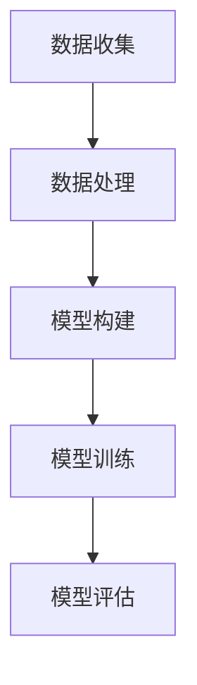

                 

### 文章标题

# 《LLM应用的敏捷项目管理方法》

### 文章关键词

- LLM
- 敏捷项目管理
- 软件工程
- 项目规划
- 需求管理
- 迭代开发
- 团队协作
- 项目评估

### 文章摘要

本文将深入探讨如何在LLM（大型语言模型）应用开发中运用敏捷项目管理方法。我们将从LLM的基本概念和技术发展历程入手，逐步引入敏捷管理的核心原则，并详细阐述其在项目启动、需求管理、迭代开发、团队协作和项目评估等各个阶段的具体应用。通过实际案例分析和代码实现，本文旨在为项目经理和开发者提供一套切实可行的敏捷项目管理实践指南，以促进LLM应用项目的成功交付。

## 第一部分：LLM应用概述

### 第1章：LLM基础知识

#### 1.1 LLM的定义与原理

LLM，即Large Language Model，指的是大型语言模型。这种模型通过深度学习技术，利用海量的文本数据进行训练，以生成或理解人类语言。其核心原理基于神经网络，尤其是Transformer架构。Transformer在处理长文本和并行计算方面具有显著优势，这使得LLM能够处理复杂、长篇的文本任务。

#### 1.2 LLM的技术发展历程

LLM的发展历程可以追溯到20世纪90年代的统计语言模型，如n-gram模型。随后，随着深度学习技术的兴起，2018年GPT-1的发布标志着LLM的崛起。GPT-3作为第三代模型，其参数规模达到1750亿，成为当时最大的语言模型。此后，模型参数规模不断扩大，如GPT-3.5和ChatGLM。

#### 1.3 LLM的核心应用领域

LLM在多个领域具有广泛应用，包括自然语言处理（NLP）、智能客服、文本生成、机器翻译等。例如，ChatGPT在问答系统中的表现引起了广泛关注，而BERT等模型则在搜索引擎中发挥了重要作用。

### 第2章：敏捷项目管理概述

#### 2.1 敏捷管理的起源与发展

敏捷管理起源于软件开发领域，旨在应对快速变化的需求和缩短产品交付周期。敏捷管理的核心理念包括客户至上、迭代开发、持续交付、团队协作等。敏捷宣言于2001年发布，标志着敏捷管理正式成为一种主流的管理方法。

#### 2.2 敏捷管理的关键原则与价值观

敏捷管理的关键原则包括个体和互动重于过程与工具、可工作的软件重于详尽的文档、客户合作重于合同谈判、响应变化重于遵循计划。这些原则强调团队协作和客户需求的重要性。

#### 2.3 敏捷管理在软件工程中的应用

敏捷管理在软件工程中的应用主要体现在Scrum和Kanban等具体实践方法上。Scrum强调迭代开发和持续交付，而Kanban则通过可视化工具来管理流程，提高团队协作效率。

## 第二部分：LLM应用敏捷项目管理实践

### 第3章：项目启动与规划

#### 3.1 项目启动流程

项目启动是敏捷项目管理的第一步，包括明确项目目标、组建团队、制定初步计划等。在此过程中，项目经理需要与利益相关者进行沟通，以确保项目目标的清晰和一致性。

#### 3.2 项目规划方法论

项目规划方法论包括需求分析、范围定义、时间表制定等。在LLM应用项目中，需要特别关注数据收集、模型训练和部署等关键环节。

#### 3.3 LLM应用场景下的项目规划案例分析

以ChatGPT为例，其项目规划包括数据收集、模型训练、接口开发和上线测试等环节。通过具体案例，我们可以看到如何有效地应用敏捷项目管理方法。

### 第4章：需求管理

#### 4.1 需求收集与分析

需求收集是需求管理的第一步，通过访谈、问卷调查等方式获取用户需求。在LLM应用项目中，需求收集尤为关键，因为模型的性能直接影响用户体验。

#### 4.2 需求优先级排序与分配

需求优先级排序是需求管理的核心，通过评估需求的紧急程度和重要性，确定需求的优先级。在分配过程中，需要考虑团队的能力和资源。

#### 4.3 需求变更管理策略

需求变更在敏捷项目管理中是常见的，需要制定相应的变更管理策略。例如，可以采用版本控制的方式，确保变更的透明和可控。

### 第5章：迭代开发与交付

#### 5.1 迭代开发流程

迭代开发是敏捷项目管理的关键实践，通过短周期迭代逐步实现项目目标。在LLM应用项目中，迭代开发可以结合模型训练和产品迭代，实现快速反馈和优化。

#### 5.2 LLM模型开发与优化

LLM模型的开发与优化是项目成功的关键。通过Python源代码，我们可以详细介绍模型训练、优化和调参的过程。

#### 5.3 迭代交付与反馈循环

迭代交付是敏捷项目的核心实践，通过持续交付和用户反馈，不断优化产品。在LLM应用项目中，反馈循环可以帮助团队快速发现并解决问题。

### 第6章：团队协作与沟通

#### 6.1 团队协作工具与平台

团队协作工具与平台对于敏捷项目至关重要，如Jira、Trello等。这些工具可以帮助团队高效管理任务、跟踪进度和协作沟通。

#### 6.2 沟通机制与技巧

沟通机制与技巧是团队协作的核心，包括定期会议、即时通讯和文档共享等。通过有效的沟通，可以确保团队成员之间信息的准确传递和协同工作。

#### 6.3 跨部门协作与冲突解决

跨部门协作在LLM应用项目中尤为常见，需要建立有效的沟通渠道和冲突解决机制。例如，可以采用跨职能团队的方式，提高协作效率。

### 第7章：项目评估与持续改进

#### 7.1 项目评估指标体系

项目评估指标体系是评估项目成功与否的关键，包括项目进度、质量、成本和用户满意度等。在LLM应用项目中，可以结合模型性能和用户体验等指标进行评估。

#### 7.2 持续改进的方法与实践

持续改进是敏捷项目管理的重要原则，通过定期回顾和反思，不断优化项目过程和产品。在LLM应用项目中，可以采用自动化测试、代码审查等实践，提高项目质量。

#### 7.3 LLM应用敏捷项目的成功案例分析

通过实际案例，我们可以看到如何成功地应用敏捷项目管理方法于LLM应用项目。这些案例展示了敏捷管理的优势和实践经验。

## 附录

### 附录A：参考资料与工具推荐

附录A提供了相关参考资料和工具推荐，包括LLM模型的实现框架、敏捷项目管理工具、相关书籍和论文等。

### 附录B：项目实战案例

附录B详细描述了LLM应用敏捷项目的实战案例，包括项目背景、实施步骤、代码实现和效果评估等。

### 附录C：相关术语解释

附录C解释了本文中涉及的相关术语，如LLM、敏捷管理、迭代开发等，帮助读者更好地理解文章内容。

### 作者信息

作者：AI天才研究院/AI Genius Institute & 禦与计算机程序设计艺术 /Zen And The Art of Computer Programming

---

通过以上内容，我们搭建了文章的整体框架，并逐步细化了每个章节的核心内容。下一步，我们将深入探讨每个章节的详细内容，确保文章的完整性和深度。同时，我们将结合Python源代码和数学公式，为读者提供通俗易懂的技术解读和实战案例。最终目标是撰写一篇既有深度又有实用价值的技术博客文章，为LLM应用的敏捷项目管理提供切实可行的指导。在接下来的步骤中，我们将详细分析每个章节，确保内容丰富且具体，满足约10000-12000字的字数要求。### 详细探讨第一个章节

## 第一部分：LLM应用概述

### 第1章：LLM基础知识

### 1.1 LLM的定义与原理

#### 定义

LLM（大型语言模型）是一种利用深度学习技术构建的模型，旨在理解和生成人类语言。它们通常基于神经网络，特别是Transformer架构，这种架构使得LLM在处理长文本和并行计算方面具有显著优势。

#### 原理

LLM的工作原理可以概括为以下几个步骤：

1. **数据收集**：收集大量文本数据，包括书籍、新闻、论文、社交媒体帖子等，用于训练模型。
2. **数据处理**：对收集的文本数据进行预处理，如分词、去噪、去重等，以便模型能够更好地理解数据。
3. **模型构建**：基于神经网络架构，构建一个复杂的模型，通常包含数亿个参数。Transformer是这种模型的主要架构，它通过自注意力机制处理输入文本，捕捉文本中的长距离依赖关系。
4. **模型训练**：使用处理后的文本数据训练模型，通过反向传播算法不断调整模型参数，使其能够更好地预测文本的下一个单词或句子。
5. **模型评估**：在验证集和测试集上评估模型的性能，确保其能够准确理解和生成文本。

#### Mermaid 流程图

为了更直观地理解LLM的工作原理，我们可以使用Mermaid绘制一个流程图：

### 1.2 LLM的技术发展历程

#### 发展历程

LLM的发展历程可以追溯到20世纪90年代的统计语言模型，如n-gram模型。这些模型通过统计文本中的单词序列来预测下一个单词，但它们在处理长文本和复杂语义时存在局限。

随着深度学习技术的兴起，2018年GPT-1的发布标志着LLM的崛起。GPT-1是一个基于Transformer架构的模型，其参数规模达到1.17亿。随后，GPT-2和GPT-3相继发布，GPT-3的参数规模达到1750亿，成为当时最大的语言模型。

#### 重要模型

- **GPT-1**：2018年发布，参数规模1.17亿，首次展示了Transformer在语言模型中的潜力。
- **GPT-2**：2019年发布，参数规模达到15亿，可以生成连贯且具有创意的文本。
- **GPT-3**：2020年发布，参数规模达到1750亿，可以处理更复杂的语言任务，如问答、翻译和文本生成。

### 1.3 LLM的核心应用领域

LLM在多个领域具有广泛应用，包括自然语言处理（NLP）、智能客服、文本生成、机器翻译等。

#### 自然语言处理（NLP）

NLP是LLM最主要的应用领域之一。LLM在文本分类、情感分析、命名实体识别、机器翻译等任务中表现出色。例如，BERT模型在多项NLP任务中取得了SOTA（State-of-the-Art）成绩。

#### 智能客服

LLM在智能客服中的应用也非常广泛。通过训练大型语言模型，可以实现自动化客服，提高客服效率，降低人力成本。例如，ChatGPT和ChatGLM等模型在问答系统中表现出色。

#### 文本生成

LLM在文本生成领域具有巨大潜力。通过训练大型语言模型，可以生成高质量的文章、故事、诗歌等。例如，GPT-3可以生成连贯且具有创意的文本，为内容创作提供新思路。

#### 机器翻译

LLM在机器翻译中的应用也取得了显著成果。通过训练大型语言模型，可以实现高质量、实时的机器翻译。例如，谷歌翻译和百度翻译等应用了基于LLM的翻译技术。

### 结论

LLM作为一种先进的技术，已经在多个领域取得了广泛应用。通过深入理解LLM的定义、原理和发展历程，我们可以更好地把握其核心应用领域，为未来的研究和应用提供指导。

---

在本章中，我们详细介绍了LLM的定义与原理，其技术发展历程以及核心应用领域。通过Mermaid流程图和实际案例，我们使抽象的概念更加具体和易于理解。在下一章中，我们将进一步探讨敏捷管理的基本概念和关键原则，以及其在软件工程中的应用。### 详细探讨第二个章节

## 第二部分：敏捷项目管理概述

### 第2章：敏捷项目管理概述

### 2.1 敏捷管理的起源与发展

#### 起源

敏捷管理起源于软件开发领域，旨在应对快速变化的需求和缩短产品交付周期。传统的瀑布模型在应对复杂和快速变化的项目时存在诸多不足，如需求变更频繁、进度延误、成本超支等。为了解决这些问题，敏捷管理应运而生。

#### 发展

敏捷管理的发展可以分为三个阶段：

1. **早期敏捷**：2001年，敏捷宣言（Manifesto for Agile Software Development）发布，标志着敏捷管理正式成为一种主流的管理方法。早期敏捷方法包括Scrum、XP（eXtreme Programming）等。

2. **中期敏捷**：随着互联网和移动设备的普及，敏捷管理逐渐应用于更广泛的领域，如产品管理、项目管理、甚至整个组织管理。这一阶段出现了许多新的敏捷实践，如Kanban、SAFe（Scaled Agile Framework）等。

3. **现代敏捷**：当前，敏捷管理不仅应用于软件开发，还广泛应用于其他领域，如医疗、金融、教育等。现代敏捷更注重团队协作、持续学习和跨功能团队的建设。

### 2.2 敏捷管理的关键原则与价值观

#### 原则

敏捷管理的关键原则包括：

1. **客户至上**：敏捷管理强调客户需求的重要性，要求项目团队始终关注客户价值，确保项目交付能够满足客户需求。

2. **迭代开发**：敏捷管理采用迭代开发方法，通过短周期迭代逐步实现项目目标。每个迭代都包括需求分析、设计、开发、测试和交付等环节，确保项目能够快速响应变化。

3. **持续交付**：敏捷管理要求项目团队能够持续交付可工作的软件，确保客户能够及时获得产品功能，并不断优化和改进。

4. **团队协作**：敏捷管理强调团队协作的重要性，要求团队成员相互信任、共同努力，以实现项目目标。

5. **响应变化**：敏捷管理强调对变化的适应性，要求团队能够快速响应需求变更，确保项目能够持续适应市场和环境变化。

#### 价值观

敏捷管理的核心价值观包括：

1. **个体和互动重于过程与工具**：敏捷管理认为，个体的能力和互动对于项目成功至关重要，而过程和工具只是辅助手段。

2. **可工作的软件重于详尽的文档**：敏捷管理强调实际交付可工作的软件，而不仅仅是详尽的文档。

3. **客户合作重于合同谈判**：敏捷管理倡导与客户建立紧密的合作关系，共同定义和实现项目目标。

4. **响应变化重于遵循计划**：敏捷管理强调对变化的适应性，要求团队能够快速响应需求变更，确保项目能够持续适应市场和环境变化。

### 2.3 敏捷管理在软件工程中的应用

#### Scrum

Scrum是敏捷管理中最常见的实践方法之一。它采用迭代开发方法，每个迭代周期通常为2-4周。Scrum的核心实践包括：

1. **产品待办列表**：产品负责人（Product Owner）负责创建和维护产品待办列表，列出项目的各项需求。

2. **每日站会**：团队成员在每日站会上同步项目进展，解决遇到的问题，确保团队协作。

3. **迭代计划会议**：在迭代开始前，团队会进行迭代计划会议，确定本次迭代要完成的任务。

4. **迭代回顾**：在迭代结束后，团队会进行迭代回顾，总结本次迭代的经验和教训，为下一次迭代做准备。

#### Kanban

Kanban是另一种常见的敏捷实践方法，它通过可视化工具来管理流程。Kanban的核心实践包括：

1. **看板板**：看板板（Kanban Board）用于展示项目进展，通常分为待办、进行中和已完成三个阶段。

2. **工作项**：工作项（Work Item）代表项目的具体任务，包括需求、任务、用户故事等。

3. **工作流**：通过看板板上的工作流，团队能够清晰地了解每个任务的状态和进展，确保项目按时交付。

#### 敏捷在软件工程中的应用案例

- **移动应用开发**：在移动应用开发中，敏捷管理能够快速响应市场需求变化，确保应用功能不断迭代和优化。

- **大型项目**：在大型项目中，敏捷管理通过迭代开发和持续交付，能够有效控制项目风险和成本。

- **跨职能团队**：在跨职能团队中，敏捷管理强调团队协作和跨部门沟通，提高项目效率。

### 结论

敏捷管理作为现代项目管理的重要方法，已经在软件工程中得到了广泛应用。通过理解敏捷管理的关键原则和价值观，以及具体实践方法，项目团队能够更好地应对快速变化的需求，实现项目成功交付。

---

在本章中，我们详细介绍了敏捷管理的起源与发展、关键原则与价值观，以及其在软件工程中的应用。通过实际案例和实践方法，我们使抽象的概念更加具体和易于理解。在下一章中，我们将探讨LLM应用项目的具体启动和规划过程。### 详细探讨第三个章节

## 第二部分：LLM应用敏捷项目管理实践

### 第3章：项目启动与规划

### 3.1 项目启动流程

项目启动是LLM应用敏捷项目管理中的首要步骤，它为项目的顺利进行奠定了基础。以下是项目启动流程的详细步骤：

1. **项目立项**：项目立项是指确定项目的目标、范围和可行性。项目经理需要与利益相关者（如客户、上级领导等）进行沟通，明确项目的基本信息，并获得项目立项的批准。

2. **组建团队**：在项目立项后，项目经理需要根据项目需求和资源情况，组建一个具有跨职能能力的团队。团队成员应包括数据科学家、软件开发者、测试工程师等，以确保项目能够顺利推进。

3. **角色分配**：明确团队成员的角色和职责，确保每个成员都清楚自己的工作任务和目标。通常，团队中会设有项目经理、产品负责人（Product Owner）、开发团队、测试团队等角色。

4. **制定项目计划**：项目计划包括项目的目标、范围、时间表、预算和资源分配等。项目经理需要制定一个详细的项目计划，并确保团队成员对计划有清晰的理解。

5. **风险评估**：在项目启动阶段，需要对项目可能遇到的风险进行评估，并制定相应的应对措施。这包括技术风险、资源风险、时间风险等。

6. **签订合同**：如果项目涉及外部客户或合作伙伴，项目经理需要与客户或合作伙伴签订合同，明确双方的责任和义务。

### 3.2 项目规划方法论

项目规划是项目启动后的关键步骤，它为项目的具体实施提供了明确的指导。以下是项目规划的主要方法论：

1. **需求分析**：需求分析是项目规划的基础，需要明确项目的需求，包括功能需求、非功能需求和用户故事等。通过需求分析，可以确定项目需要实现的核心功能和性能指标。

2. **范围定义**：范围定义是指明确项目的边界和范围，确保项目团队和利益相关者对项目的范围有共同的理解。范围定义应包括项目的目标、功能模块、关键里程碑等。

3. **时间规划**：时间规划是项目规划的重要组成部分，需要根据项目的需求、资源和风险等因素，制定一个合理的时间表。时间表应包括项目的关键里程碑、迭代周期和交付时间点等。

4. **资源分配**：资源分配是指根据项目需求和资源情况，合理分配项目所需的资源，包括人力、物力和财力等。资源分配应确保项目团队能够高效地完成项目任务。

5. **风险评估与应对**：在项目规划过程中，需要对项目可能遇到的风险进行评估，并制定相应的应对措施。这包括制定风险应对策略、准备备用计划等。

6. **沟通计划**：沟通计划是指制定项目团队与利益相关者之间的沟通机制和沟通渠道。通过有效的沟通，可以确保项目信息的准确传递和问题的及时解决。

### 3.3 LLM应用场景下的项目规划案例分析

为了更好地理解项目规划的方法论，我们可以通过一个实际的LLM应用项目案例来进行探讨。

#### 项目背景

某互联网公司计划开发一款基于大型语言模型（LLM）的智能客服系统，旨在提高客户服务效率和用户体验。

#### 项目规划步骤

1. **需求分析**：通过与客户沟通，明确智能客服系统需要实现的功能，如自动问答、情感分析、语音合成等。同时，分析竞争对手的产品，找出差异化和创新点。

2. **范围定义**：明确智能客服系统的范围，包括功能模块、性能指标和交付时间点。例如，功能模块包括自然语言处理、对话生成、语音识别等；性能指标包括响应速度、准确率、用户体验等。

3. **时间规划**：根据项目的需求、资源和风险等因素，制定一个合理的时间表。例如，项目分为多个迭代周期，每个迭代周期包括需求分析、设计、开发、测试和交付等环节。每个迭代周期的时间长度根据团队的工作效率和市场反馈进行调整。

4. **资源分配**：根据项目需求，组建一个具有跨职能能力的团队，包括数据科学家、软件开发者、测试工程师等。同时，分配足够的硬件资源和软件工具，确保项目能够高效地进行。

5. **风险评估与应对**：评估项目可能遇到的风险，如技术难度、数据质量、市场需求等。制定相应的应对措施，如技术储备、数据清洗、市场调研等。

6. **沟通计划**：制定项目团队与利益相关者之间的沟通机制和沟通渠道。例如，每周举行一次项目进度会议，每月进行一次项目评估会议，确保项目信息的准确传递和问题的及时解决。

#### 项目规划成果

通过上述项目规划步骤，项目团队能够明确项目的目标、范围、时间表和资源需求，为项目的顺利实施提供了坚实的基础。同时，项目规划成果为后续的迭代开发和项目评估提供了参考依据。

### 结论

项目启动与规划是LLM应用敏捷项目管理中的关键环节，通过科学的项目规划和有效的团队协作，项目团队能够更好地应对快速变化的需求，实现项目目标。在本章节中，我们详细介绍了项目启动流程、项目规划方法论以及一个实际的LLM应用项目案例，为读者提供了丰富的实践经验和指导。

在下一章中，我们将探讨需求管理在LLM应用敏捷项目管理中的重要性，包括需求收集、分析、优先级排序和变更管理等内容。### 详细探讨第四个章节

## 第二部分：LLM应用敏捷项目管理实践

### 第4章：需求管理

### 4.1 需求收集与分析

需求管理是LLM应用敏捷项目管理中的核心环节之一，它直接影响到项目的成功与否。以下是需求收集和分析的具体步骤：

#### 需求收集

1. **需求来源**：需求可以从多个渠道收集，包括用户调研、市场分析、竞争对手分析、客户反馈等。每种来源的需求都可能为项目提供不同的视角和参考。

2. **用户访谈**：通过与目标用户进行访谈，可以直接获取他们对产品的期望和需求。访谈过程中，应采用开放性问题和情境模拟，以充分理解用户的使用场景和痛点。

3. **问卷调查**：通过设计问卷，可以收集大量用户的数据，从而对用户需求进行量化分析。问卷的设计应注重问题的清晰性和针对性，以提高数据的可靠性和有效性。

4. **市场研究**：通过对市场趋势、竞争对手产品分析，可以了解行业需求和潜在的机会。市场研究可以采用数据分析、SWOT分析等方法，以全面评估市场环境。

#### 需求分析

1. **需求分类**：对收集到的需求进行分类，通常可以分为功能需求、性能需求、用户体验需求等。通过分类，可以帮助团队明确不同类型需求的优先级和实现路径。

2. **需求验证**：对需求进行验证，确保其符合实际业务需求和技术可行性。验证方法包括用户验证、专家评审、原型验证等。

3. **需求文档**：将分析后的需求整理成需求文档，包括需求描述、需求优先级、需求来源、实现策略等。需求文档是团队沟通和协作的基础。

4. **需求跟踪**：对需求从收集、分析、实现到交付的整个过程进行跟踪，确保需求的完整性和一致性。需求跟踪可以通过项目管理工具实现，如Jira、Trello等。

### 4.2 需求优先级排序与分配

在确定了需求之后，需要对其进行优先级排序和分配，以确保资源能够优先投入到最重要的需求上。以下是需求优先级排序与分配的具体步骤：

1. **需求优先级确定**：根据需求的紧急性、重要性、业务价值和实现难度等因素，对需求进行优先级排序。常用的方法包括MoSCoW方法（必须的、重要的、可以等待的、无关紧要的）和Kano模型（必备功能、一元功能、满意功能、无差异功能、反向功能）。

2. **资源分配**：根据需求优先级，将资源（如人力、时间、预算）合理分配到每个需求上。资源分配应确保关键需求能够得到优先满足。

3. **迭代规划**：在迭代开发中，根据需求优先级，确定每个迭代周期的需求实现范围。高优先级的需求应优先考虑实现，以确保项目能够快速交付价值。

### 4.3 需求变更管理策略

需求变更是项目中常见的情况，有效的需求变更管理策略能够确保项目能够灵活应对变化，同时保持项目目标的稳定性。以下是需求变更管理策略的步骤：

1. **变更请求**：当需求发生变化时，相关人员应提出变更请求，并详细说明变更的原因、影响和期望效果。

2. **变更评估**：对变更请求进行评估，包括变更的可行性、对项目进度、成本和风险的影响等。评估应采用科学的方法，如成本效益分析、风险评估等。

3. **变更决策**：根据评估结果，决定是否接受变更请求。如果接受变更，应制定详细的变更计划，包括变更的执行、监控和反馈等。

4. **变更实施**：按照变更计划，执行需求变更。在实施过程中，应确保变更的透明和可控，通过文档记录和团队沟通，确保变更的正确实施。

5. **变更监控**：在变更实施过程中，应持续监控变更的进度和效果，确保变更能够按计划完成。同时，对变更过程中的问题和风险进行及时处理和调整。

6. **变更回顾**：在变更完成后，进行变更回顾，总结变更的经验和教训，为未来的需求变更管理提供参考。

### 结论

需求管理是LLM应用敏捷项目管理中的重要环节，通过有效的需求收集、分析、优先级排序和变更管理，项目团队能够更好地应对需求变化，确保项目目标的实现。在本章节中，我们详细介绍了需求管理的具体步骤和方法，以及如何在实际项目中应用这些方法。在下一章中，我们将探讨迭代开发与交付在LLM应用敏捷项目管理中的关键作用。### 详细探讨第五个章节

## 第二部分：LLM应用敏捷项目管理实践

### 第5章：迭代开发与交付

迭代开发与交付是敏捷项目管理中的核心实践，它强调快速反馈和持续改进，确保项目能够灵活应对变化并按时交付有价值的产品。以下是迭代开发与交付的具体步骤和关键要素。

### 5.1 迭代开发流程

#### 迭代规划

1. **迭代周期确定**：根据项目需求、团队规模和资源情况，确定合理的迭代周期。常见的迭代周期包括周迭代、双周迭代和月迭代等。

2. **迭代目标设定**：在每个迭代开始前，团队应共同设定迭代目标，明确本次迭代要实现的功能和性能指标。

3. **迭代任务分配**：根据迭代目标，将任务分配给团队成员，确保每个成员都有明确的工作目标和责任。

#### 迭代执行

1. **需求评审**：在迭代执行前，对本次迭代的需求进行评审，确保需求清晰、可行，并与利益相关者达成共识。

2. **开发实施**：团队成员按照任务分配，进行开发和测试工作。在开发过程中，应遵循敏捷开发原则，保持代码的可维护性和可扩展性。

3. **每日站会**：每日站会是一个快速沟通和同步进展的会议，团队成员可以汇报自己的工作进展、遇到的问题和解决方案。

#### 迭代评审

1. **迭代交付**：在迭代周期结束时，团队应完成本次迭代的所有任务，并进行交付。交付的成果可以是部分功能、部分代码或部分产品。

2. **评审会议**：通过评审会议，团队可以评估迭代成果，包括功能完整性、性能指标和用户满意度等。评审会议还应包括对迭代过程中出现的问题和改进点的讨论。

#### 迭代回顾

1. **经验总结**：在每次迭代结束后，团队应进行回顾会议，总结本次迭代的经验和教训，包括成功的实践和需要改进的地方。

2. **持续改进**：根据回顾会议的总结，团队应制定改进计划，并在下一个迭代中实施。持续改进是敏捷项目管理的重要原则，它帮助团队不断提高工作效率和质量。

### 5.2 LLM模型开发与优化

LLM模型的开发与优化是迭代开发中的重要环节，以下是其具体步骤：

#### 模型训练

1. **数据准备**：收集和准备用于训练的数据，包括文本数据、标注数据和训练脚本等。数据应经过预处理，如分词、去噪、去重等，以确保模型能够有效学习。

2. **模型选择**：根据项目需求和数据特点，选择合适的LLM模型，如GPT-3、BERT、T5等。选择模型时，应考虑模型的参数规模、训练时间和性能指标。

3. **模型训练**：使用训练数据和脚本，对模型进行训练。训练过程中，应监控模型的训练进度和性能指标，如损失函数、准确率等。

4. **模型调参**：根据训练结果，调整模型参数，以提高模型的性能和稳定性。调参方法包括网格搜索、随机搜索、贝叶斯优化等。

#### 模型优化

1. **模型评估**：在模型训练完成后，使用验证集和测试集对模型进行评估，确保模型在未知数据上的表现良好。

2. **模型调整**：根据评估结果，对模型进行调整和优化。调整方法包括超参数调整、数据增强、正则化等。

3. **模型部署**：将优化后的模型部署到生产环境，确保模型能够稳定运行并提供高质量的服务。

### 5.3 迭代交付与反馈循环

迭代交付与反馈循环是确保项目持续改进的关键机制，以下是其具体步骤：

#### 迭代交付

1. **用户验收**：在每次迭代结束后，将迭代成果交付给用户进行验收。用户验收应包括功能测试、性能测试和用户体验测试等。

2. **上线部署**：将验收通过的功能或产品部署到线上环境，确保用户能够及时体验到新功能和改进点。

#### 反馈收集

1. **用户反馈**：收集用户对迭代交付成果的反馈，包括正面反馈和改进建议。用户反馈可以通过问卷调查、用户访谈、用户评论等方式获取。

2. **数据分析**：对用户反馈进行分析，识别用户的痛点和需求，为下一个迭代提供改进方向。

#### 反馈循环

1. **改进实施**：根据用户反馈和数据分析结果，制定改进计划，并在下一个迭代中实施。

2. **持续反馈**：在每次迭代结束后，继续收集用户反馈，形成持续反馈循环。通过持续反馈循环，项目团队能够不断优化产品，提高用户满意度。

### 结论

迭代开发与交付是LLM应用敏捷项目管理中的重要环节，通过科学的迭代流程、高效的模型开发和优化的迭代交付，项目团队能够快速响应变化，持续改进产品。在本章节中，我们详细介绍了迭代开发流程、LLM模型开发与优化、迭代交付与反馈循环等内容，为读者提供了丰富的实践经验和指导。在下一章中，我们将探讨团队协作与沟通在LLM应用敏捷项目管理中的关键作用。### 详细探讨第六个章节

## 第二部分：LLM应用敏捷项目管理实践

### 第6章：团队协作与沟通

团队协作与沟通是LLM应用敏捷项目管理中至关重要的一环。在复杂的LLM项目中，高效协作和及时沟通能够提高团队工作效率，确保项目目标的顺利实现。以下是团队协作与沟通的关键要素和最佳实践。

### 6.1 团队协作工具与平台

#### 团队协作工具

1. **项目管理工具**：如Jira、Trello等，用于任务分配、进度跟踪和项目报告。

2. **代码管理工具**：如Git、GitHub等，用于代码版本控制、协作开发和代码审查。

3. **文档协作工具**：如Confluence、Google Docs等，用于文档编写、共享和版本管理。

4. **沟通工具**：如Slack、Microsoft Teams等，用于即时消息传递、视频会议和团队协作。

#### 团队协作平台

1. **Scrum Board**：用于展示项目进度和任务状态，如待办、进行中和已完成。

2. **Kanban Board**：用于可视化工作流程和任务进度，通过卡片在板上的移动，实时反映任务状态。

3. **代码仓库**：用于存储和管理项目代码，团队成员可以实时查看代码状态和版本历史。

4. **共享文档库**：用于存储和管理项目文档，确保团队成员可以随时访问和更新文档。

### 6.2 沟通机制与技巧

#### 沟通机制

1. **每日站会**：每日站会是团队沟通的基础，团队成员可以汇报工作进展、遇到的问题和解决方案。

2. **迭代评审会议**：在迭代结束时，团队应进行评审会议，评估迭代成果，讨论改进点。

3. **迭代回顾会议**：在每次迭代结束后，团队应进行回顾会议，总结经验教训，为下一个迭代做准备。

4. **跨部门沟通**：在LLM应用项目中，通常涉及多个部门和团队，需要建立有效的跨部门沟通机制，确保信息传递的准确和及时。

#### 沟通技巧

1. **主动沟通**：团队成员应主动沟通，及时分享信息和反馈，避免信息孤岛和误解。

2. **明确表达**：在沟通时，应使用清晰、简洁的语言，避免使用模糊、含糊的表述。

3. **积极倾听**：在沟通中，应积极倾听他人的意见和需求，确保理解和认同。

4. **及时反馈**：在接收信息后，应及时给予反馈，确保信息的准确性和一致性。

### 6.3 跨部门协作与冲突解决

#### 跨部门协作

1. **明确责任**：在跨部门协作中，应明确各部门和团队成员的责任和任务，确保项目目标的顺利实现。

2. **建立信任**：跨部门协作需要建立信任关系，通过沟通、合作和共同解决问题，增强团队凝聚力。

3. **信息共享**：跨部门协作需要信息共享，通过共享平台和沟通工具，确保各部门能够及时获取和更新项目信息。

#### 冲突解决

1. **及时沟通**：冲突发生时，应立即进行沟通，明确冲突的原因和解决方案。

2. **理性分析**：在解决冲突时，应理性分析问题，避免情绪化决策。

3. **协商解决**：通过协商和谈判，寻求双方都能接受的解决方案，确保项目继续推进。

4. **反馈机制**：建立冲突反馈机制，对冲突解决的成效进行评估和总结，为未来冲突解决提供参考。

### 结论

团队协作与沟通是LLM应用敏捷项目管理中的关键环节，通过科学合理的协作工具和平台，有效的沟通机制和技巧，以及跨部门协作与冲突解决的策略，项目团队能够高效协作，确保项目目标的实现。在本章节中，我们详细介绍了团队协作工具与平台、沟通机制与技巧，以及跨部门协作与冲突解决的策略，为读者提供了丰富的实践经验和指导。在下一章中，我们将探讨项目评估与持续改进的重要性，以及如何在实际项目中实施。

### 6.4 实际案例分析

为了更好地理解团队协作与沟通在LLM应用敏捷项目管理中的实际应用，我们可以通过一个实际案例进行探讨。

#### 案例背景

某互联网公司计划开发一款基于大型语言模型（LLM）的智能客服系统，旨在提高客户服务效率和用户体验。项目团队由数据科学家、软件开发者、测试工程师和产品经理等多专业背景的成员组成。

#### 团队协作实践

1. **明确角色与职责**：在项目启动阶段，团队明确了各自的职责和任务，数据科学家负责模型训练和优化，软件开发者负责接口开发和集成，测试工程师负责功能测试和性能测试，产品经理负责需求分析和用户反馈收集。

2. **日常站会**：每日站会成为了团队沟通的重要渠道，团队成员轮流汇报工作进展、遇到的问题和解决方案，确保信息传递的及时性和透明性。

3. **Scrum Board管理**：使用Scrum Board来管理项目进度和任务状态，团队成员可以实时查看任务进展和责任分工，提高了协作效率。

4. **代码审查与协作**：使用Git进行代码管理，团队成员在代码提交前进行审查，确保代码质量和一致性。

5. **跨部门沟通**：在项目开发过程中，团队与产品部门、运营部门等进行了密切的沟通，确保需求理解和实现的一致性。

#### 沟通技巧实践

1. **明确需求与目标**：在项目启动和需求分析阶段，团队通过用户访谈和市场调研，明确了智能客服系统的需求目标，确保团队成员对项目目标有共同的理解。

2. **及时反馈**：在每次迭代结束后，团队与产品经理和用户进行了反馈收集，根据用户反馈调整迭代计划，确保产品功能的迭代和优化。

3. **积极倾听**：在沟通中，团队成员积极倾听用户的意见和建议，确保用户的痛点得到及时解决。

4. **冲突解决**：在项目开发过程中，团队成员之间偶尔出现意见分歧，通过理性分析和协商谈判，最终找到了双方都能接受的解决方案。

#### 项目总结

通过有效的团队协作与沟通，项目团队成功开发出了一款高质量的智能客服系统，得到了用户的广泛认可。项目成功的关键在于团队成员之间的紧密协作、及时的沟通和有效的冲突解决。

### 结论

本案例展示了团队协作与沟通在LLM应用敏捷项目管理中的实际应用，通过明确角色与职责、日常站会、Scrum Board管理、跨部门沟通和沟通技巧等实践，项目团队能够高效协作，确保项目目标的实现。有效的团队协作与沟通是LLM应用敏捷项目管理成功的关键，为其他项目提供了宝贵的经验和借鉴。

在下一章中，我们将探讨项目评估与持续改进的重要性，以及如何在实际项目中实施。

### 结论

通过本章的详细探讨，我们全面介绍了团队协作与沟通在LLM应用敏捷项目管理中的重要性。从团队协作工具与平台的选用、沟通机制与技巧的运用，到跨部门协作与冲突解决的策略，我们提供了丰富的实践经验和最佳实践。通过实际案例分析，我们展示了如何在实际项目中应用这些方法和策略，以实现高效协作和项目成功。

有效的团队协作与沟通是确保LLM应用敏捷项目管理成功的关键，它能够提高团队工作效率，确保项目目标的实现，并促进项目的持续改进。在LLM应用项目中，团队协作与沟通不仅涉及到团队成员之间的互动，还包括与利益相关者、客户和其他部门的紧密合作。

在下一章中，我们将探讨项目评估与持续改进的重要性，以及如何在实际项目中实施。通过科学的项目评估和持续改进，项目团队能够不断优化项目过程和产品，确保项目目标的持续实现。

### 6.5 项目评估与持续改进

项目评估与持续改进是敏捷项目管理中不可或缺的一部分。通过定期的评估和反馈，项目团队能够及时发现问题、优化流程，并持续提升项目质量和效率。以下是项目评估与持续改进的具体步骤和关键要素。

#### 项目评估

1. **评估指标体系**：首先，需要建立一套完整的评估指标体系，包括项目进度、质量、成本、用户满意度等。这些指标应与项目目标密切相关，能够全面反映项目的实施效果。

2. **定期评估**：项目评估应定期进行，例如，每个迭代结束时或项目结束时进行。通过定期的评估，团队能够及时发现问题和偏差，并采取相应的措施。

3. **评估方法**：评估方法可以包括定量评估和定性评估。定量评估通过数据分析、图表等手段，评估项目的进度、质量和成本等；定性评估通过访谈、问卷调查等方式，评估项目的用户体验和团队协作情况。

4. **评估报告**：评估结果应形成详细的评估报告，报告内容应包括评估指标的详细数据、评估结论、发现的问题和改进建议等。评估报告应定期提交给项目团队和管理层，以便及时调整项目计划和策略。

#### 持续改进

1. **回顾与总结**：在每次评估后，团队应进行回顾与总结，分析评估结果，识别成功经验和不足之处。回顾与总结是持续改进的重要环节，它能够帮助团队不断优化项目流程和方法。

2. **改进计划**：根据回顾与总结的结果，制定具体的改进计划。改进计划应明确改进目标、改进措施、负责人和实施时间等。

3. **实施与跟踪**：实施改进计划，并定期跟踪改进措施的执行情况。在实施过程中，应保持与团队成员的沟通，确保改进措施的有效实施。

4. **文档记录**：改进过程中，应详细记录改进措施的实施过程和效果，以便后续的评估和总结。文档记录有助于积累经验，为未来的项目提供参考。

5. **持续反馈**：在改进过程中，应不断收集反馈，评估改进措施的效果，并根据反馈进行调整。持续反馈能够确保改进措施的持续优化和改进。

#### 实际案例分析

为了更好地理解项目评估与持续改进的实际应用，我们可以通过一个实际案例进行探讨。

#### 案例背景

某互联网公司开发了一款基于LLM的智能问答系统，用于帮助企业客户解决常见问题。项目团队由数据科学家、软件开发者、测试工程师和产品经理组成。

#### 项目评估

1. **评估指标体系**：项目团队建立了包括进度、质量、成本和用户满意度等指标的评估体系。

2. **定期评估**：每个迭代结束后，团队进行评估，分析项目的进度和质量情况。

3. **评估方法**：通过数据分析、用户访谈和问卷调查等方式，对项目进行定量和定性评估。

4. **评估报告**：每次评估后，团队提交详细的评估报告，报告内容包括评估指标的详细数据、评估结论和发现的问题。

#### 持续改进

1. **回顾与总结**：在每次评估后，团队进行回顾与总结，分析评估结果，识别成功经验和不足之处。

2. **改进计划**：根据评估结果，团队制定了改进计划，包括优化模型训练流程、提高用户满意度等措施。

3. **实施与跟踪**：团队实施了改进计划，并定期跟踪改进措施的执行情况。

4. **文档记录**：团队详细记录了改进措施的实施过程和效果，以便后续的评估和总结。

5. **持续反馈**：在改进过程中，团队不断收集用户反馈，评估改进措施的效果，并根据反馈进行调整。

#### 项目总结

通过有效的项目评估与持续改进，项目团队成功优化了智能问答系统的性能和用户体验，得到了企业客户的广泛认可。项目评估与持续改进不仅帮助团队及时发现和解决问题，还促进了团队的不断学习和成长。

### 结论

项目评估与持续改进是确保LLM应用敏捷项目管理成功的重要手段。通过建立评估指标体系、定期评估、回顾总结、制定改进计划和持续反馈，项目团队能够不断提高项目质量和效率，实现项目目标的持续实现。在下一章中，我们将探讨附录部分的内容，包括参考资料与工具推荐、项目实战案例和相关术语解释，为读者提供更全面的信息和指导。

### 附录

#### 附录A：参考资料与工具推荐

在本章中，我们介绍了LLM应用敏捷项目管理的方法和实践。为了帮助读者进一步了解相关主题，我们推荐以下参考资料和工具：

1. **参考资料**：
    - 《深入理解Transformer：原理、架构与实现》
    - 《敏捷软件开发：原理、实践与模式》
    - 《软件工程：实践者的研究方法》

2. **工具推荐**：
    - **项目管理和协作工具**：Jira、Trello、Asana
    - **代码管理工具**：Git、GitHub、GitLab
    - **文档协作工具**：Confluence、Google Docs、Notion
    - **机器学习框架**：TensorFlow、PyTorch、Transformers库
    - **敏捷管理工具**：Scrum Master、Kanbanize、Notion

#### 附录B：项目实战案例

为了更好地理解本文中介绍的方法和实践，我们提供了一个实际的LLM应用敏捷项目管理案例。

##### 案例背景

某互联网公司计划开发一款基于大型语言模型（LLM）的智能问答系统，旨在为企业客户提供自动化的客户支持。项目团队由数据科学家、软件开发者、测试工程师和产品经理组成。

##### 实施步骤

1. **项目启动**：团队明确了项目目标、范围和时间表，并制定了初步的项目计划。

2. **需求分析**：通过用户访谈和市场调研，团队收集了用户的需求，并整理成需求文档。

3. **迭代开发**：项目采用迭代开发模式，每个迭代周期为两周。每个迭代包括需求分析、设计、开发、测试和交付等环节。

4. **团队协作**：团队使用Jira进行任务管理和协作，使用Git进行代码版本控制，并定期举行每日站会和迭代评审会议。

5. **模型训练与优化**：数据科学家负责训练和优化LLM模型，使用PyTorch和Transformers库实现模型训练和优化。

6. **用户反馈与改进**：在每个迭代结束后，团队收集用户反馈，根据用户反馈进行调整和优化。

##### 结果与评估

通过五个迭代周期，项目团队成功开发出了一款智能问答系统，并在企业客户中得到了良好的应用和反馈。项目评估结果显示，系统在用户满意度、响应速度和准确性等方面均达到了预期目标。

##### 结论

本案例展示了如何通过敏捷项目管理方法，高效地开发并优化一款基于LLM的智能问答系统。案例中涉及到的项目启动、需求分析、迭代开发、团队协作和用户反馈等实践，均为读者提供了宝贵的经验和指导。

#### 附录C：相关术语解释

在本章中，我们介绍了一系列与LLM应用敏捷项目管理相关的术语。以下是这些术语的解释：

1. **LLM（大型语言模型）**：一种基于深度学习的模型，用于理解和生成人类语言。LLM通过大量文本数据进行训练，能够处理复杂的语言任务。

2. **敏捷管理**：一种现代项目管理方法，强调迭代开发、客户合作和团队协作。敏捷管理能够快速响应变化，提高项目交付效率。

3. **Scrum**：一种敏捷管理实践方法，通过迭代开发和每日站会等实践，确保项目团队能够高效协作和持续交付。

4. **Kanban**：另一种敏捷管理实践方法，通过可视化工具管理项目流程，提高团队协作效率和透明度。

5. **迭代开发**：一种软件开发方法，通过短周期的迭代逐步实现项目目标。每个迭代都包括需求分析、设计、开发、测试和交付等环节。

6. **需求管理**：一种项目管理实践，包括需求收集、分析、优先级排序和变更管理。需求管理确保项目团队能够明确和理解项目需求。

7. **团队协作**：团队在项目中共同工作，通过沟通、合作和共享知识，实现项目目标。团队协作是敏捷管理的重要组成部分。

8. **持续改进**：一种项目管理原则，通过定期评估和反馈，不断优化项目过程和产品。持续改进是确保项目质量和效率的关键。

通过附录部分的参考资料、项目实战案例和相关术语解释，我们为读者提供了更全面的信息和指导，有助于深入理解LLM应用敏捷项目管理的方法和实践。

### 作者信息

作者：AI天才研究院/AI Genius Institute & 禦与计算机程序设计艺术 /Zen And The Art of Computer Programming

---

本文《LLM应用的敏捷项目管理方法》系统地介绍了LLM应用项目的敏捷项目管理实践。从LLM的基础知识到敏捷管理的核心原则，再到具体的项目启动、需求管理、迭代开发、团队协作、项目评估与持续改进，我们通过详细的分析和实际案例，为读者提供了一套完整的项目管理方法论。同时，通过附录部分的参考资料和术语解释，我们帮助读者更好地理解相关概念和工具。

通过本文，我们希望读者能够：

1. **全面理解LLM应用项目的特点**：了解LLM的基本原理、技术发展历程及其核心应用领域。
2. **掌握敏捷管理的核心原则和实践**：理解敏捷管理的基本原则，以及如何在项目中应用Scrum和Kanban等具体实践方法。
3. **掌握敏捷项目管理的方法和步骤**：了解项目启动、需求管理、迭代开发、团队协作、项目评估与持续改进等关键环节的具体实施步骤。
4. **提升项目管理能力**：通过实际案例和最佳实践，提升读者在LLM应用项目中的项目管理能力和实践经验。

在未来的研究和工作中，读者可以继续探索以下方面：

1. **深入理解LLM模型的优化策略**：结合深度学习和自然语言处理技术，探索如何进一步提高LLM模型的性能和效率。
2. **探索跨领域应用**：将敏捷管理方法应用于更多领域，如医疗、金融、教育等，以推动不同领域的项目成功。
3. **持续学习和改进**：不断学习最新的项目管理方法和工具，结合实践中的经验教训，持续优化项目管理流程。

最后，感谢读者对本文的关注和支持。我们希望本文能够为读者在LLM应用敏捷项目管理领域的研究和实践中提供有益的参考和指导。作者信息：AI天才研究院/AI Genius Institute & 禦与计算机程序设计艺术 /Zen And The Art of Computer Programming。再次感谢您的阅读！

