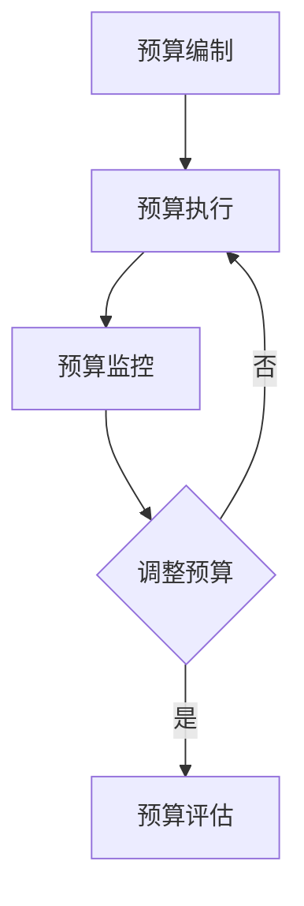

                 

### 引言

在现代企业运营中，预算管理是至关重要的一环。它不仅关系到资源的合理配置，还直接影响企业的战略规划和运营效率。然而，随着商业环境的变化和市场竞争的加剧，传统的预算管理模式逐渐暴露出其固有的局限性。传统的预算管理通常采用年度预算法，这种模式在执行过程中往往缺乏灵活性，难以适应快速变化的市场需求。因此，企业需要一种更加敏捷和动态的预算管理策略来应对不断变化的环境。

近年来，人工智能（AI）技术的快速发展，特别是大型语言模型（LLM）的突破性进展，为预算管理带来了新的可能。LLM作为一种先进的自然语言处理技术，具有强大的数据处理和分析能力，能够帮助企业更准确地预测财务趋势，优化资源分配，提高预算执行的效率。本文旨在探讨LLM在敏捷预算管理中的应用，为企业提供一种适应变化的新策略。

本文将按照以下结构进行展开：

1. **LLM概述与应用背景**：介绍语言模型（LLM）的基本概念、类型及其在预算管理中的应用场景。
2. **敏捷预算管理基本概念**：阐述敏捷预算管理的定义、优势及其流程。
3. **LLM在预算管理中的应用**：详细讨论LLM在预算预测、分配和监控方面的应用。
4. **敏捷预算管理方法论**：探讨敏捷预算管理流程的优化策略和实施方法。
5. **案例分析**：通过实际案例研究，展示LLM在敏捷预算管理中的成功应用。
6. **技术实现与工具**：介绍LLM的技术实现、预算管理工具及其在实践中的应用。
7. **未来展望与挑战**：分析LLM在预算管理中的发展趋势及面临的挑战。

通过以上章节的详细探讨，本文希望能够为企业提供一套完整、实用的LLM敏捷预算管理方案，帮助企业更好地应对快速变化的市场环境。

---

**关键词**：LLM、敏捷预算管理、财务预测、资源分配、机器学习、预算监控

**摘要**：

本文围绕大型语言模型（LLM）在敏捷预算管理中的应用展开，首先介绍了LLM的基本概念及其在预算管理中的应用场景。随后，探讨了敏捷预算管理的基本概念、优势及其流程，并详细讨论了LLM在预算预测、分配和监控方面的应用。通过实际案例分析和技术实现探讨，本文总结了一套完整的LLM敏捷预算管理方法论，为企业提供了适应变化的财务策略。最后，文章展望了LLM在预算管理中的未来发展趋势，并提出了面临的挑战。通过本文的探讨，希望能够为企业提供一种实用的、灵活的预算管理方案，以应对快速变化的市场环境。

---

### 第1章: LLM概述与应用背景

#### 1.1 语言模型（LLM）基本概念

语言模型（Language Model，简称LLM）是自然语言处理（Natural Language Processing，简称NLP）的核心技术之一，它旨在理解和生成人类语言。语言模型通过学习大量的文本数据，构建出一个概率模型，用于预测下一个单词、句子或段落的可能性。LLM在语言生成、翻译、问答系统、文本分类等多个领域都有广泛应用。

**1.1.1 语言模型的作用**

语言模型在NLP中的作用至关重要，主要体现在以下几个方面：

1. **文本生成**：语言模型可以生成连贯的文本，用于自动写作、文本摘要、对话系统等场景。
2. **语言翻译**：通过训练，语言模型可以实现不同语言之间的翻译，例如机器翻译系统。
3. **情感分析**：语言模型可以分析文本中的情感倾向，用于舆情监测、市场分析等。
4. **问答系统**：语言模型可以帮助构建问答系统，实现自然语言查询的自动处理。

**1.1.2 语言模型的类型**

语言模型的类型多种多样，主要可以分为以下几类：

1. **基于规则的语言模型**：这类模型通过手工编写规则来预测下一个单词或短语，如TF-IDF模型、隐马尔可夫模型（HMM）等。
2. **统计语言模型**：这类模型通过统计方法来预测下一个单词或短语的概率，如N元语法模型（N-gram）。
3. **基于神经的网络语言模型**：这类模型通过神经网络来学习语言数据，如循环神经网络（RNN）、长短期记忆网络（LSTM）等。
4. **端到端语言模型**：这类模型采用端到端的方法，直接将输入文本映射到输出文本，如Transformer模型。

**1.1.3 语言模型的发展历史**

语言模型的发展经历了几个重要阶段：

1. **词频模型**：早期的语言模型主要基于词频统计，通过计算每个单词在文本中出现的频率来预测下一个单词。
2. **N元语法模型**：N元语法模型通过考虑前n个单词来预测下一个单词，这是一种简单的统计模型。
3. **神经网络模型**：随着深度学习技术的发展，神经网络被引入到语言模型中，例如循环神经网络（RNN）和长短期记忆网络（LSTM）。
4. **Transformer模型**：Transformer模型是一种基于自注意力机制的端到端模型，其性能大幅超过了之前的模型，成为当前语言模型的主流。

**1.1.4 语言模型的核心技术**

语言模型的核心技术主要包括以下几个方面：

1. **自然语言处理（NLP）**：NLP技术用于处理和理解自然语言数据，如词性标注、分词、词嵌入等。
2. **机器学习（ML）**：机器学习技术用于训练和优化语言模型，包括数据预处理、特征提取、模型训练和评估等。
3. **深度学习（DL）**：深度学习技术通过多层神经网络对大量文本数据进行学习，从而提高模型的预测能力。
4. **神经网络架构**：如Transformer模型，它采用自注意力机制，能够更好地捕捉文本中的长距离依赖关系。

#### 1.2 LLM在预算管理中的应用场景

预算管理是企业财务管理的重要部分，涉及到资源的规划、分配和监控。LLM在预算管理中具有广泛的应用场景，具体如下：

**1.2.1 LLM在预算预测中的应用**

LLM可以通过学习历史财务数据，预测未来的财务状况。这种预测不仅包括收入和支出的预测，还可以用于预测市场变化、风险因素等，从而为企业的财务规划提供支持。

**1.2.2 LLM在预算分配中的应用**

LLM可以根据企业的战略目标和资源需求，优化预算分配。例如，LLM可以分析各个部门的绩效和预算使用情况，提出最优的预算分配方案，从而提高资源利用效率。

**1.2.3 LLM在预算监控与调整中的应用**

LLM可以实时监控预算执行情况，通过分析实际支出与预算的偏差，提出调整建议。例如，当发现某项支出超预算时，LLM可以自动生成调整方案，帮助企业及时应对变化。

#### 1.3 语言模型在预算管理中的优势

LLM在预算管理中的优势主要体现在以下几个方面：

1. **高效性**：LLM可以快速处理大量数据，提供实时预测和监控，提高预算管理的效率。
2. **准确性**：通过深度学习，LLM能够从历史数据中学习到复杂的模式，提高预测的准确性。
3. **灵活性**：LLM可以适应不同的预算管理需求，灵活调整预测和分配策略。
4. **自动化**：LLM可以实现预算管理的自动化，减少人工干预，降低管理成本。

#### 1.4 语言模型在预算管理中的挑战

尽管LLM在预算管理中具有显著优势，但也面临一些挑战：

1. **数据质量**：LLM的性能依赖于数据质量，低质量的数据可能导致错误的预测。
2. **模型解释性**：深度学习模型的黑箱特性使得其预测结果难以解释，这对预算决策的透明性提出了挑战。
3. **技术复杂性**：构建和维护LLM需要高水平的技术能力，这对企业的技术团队提出了较高的要求。
4. **法律和伦理问题**：随着AI技术的发展，相关的法律和伦理问题也日益凸显，特别是在财务领域，数据隐私和合规性问题尤为突出。

综上所述，LLM在预算管理中具有巨大的潜力，但其应用也面临一些挑战。通过不断的技术创新和规范完善，LLM有望成为企业预算管理的重要工具。

### 第2章: 敏捷预算管理基本概念

#### 2.1 敏捷预算管理概述

敏捷预算管理是一种以灵活性、适应性为核心的新型预算管理模式。与传统的年度预算法相比，敏捷预算管理更注重实时调整和动态优化。它要求企业具备快速响应市场变化的能力，以实现资源的最优配置和最大化效益。

**2.1.1 敏捷预算管理的定义**

敏捷预算管理（Agile Budget Management）是指通过灵活、迭代的方式进行预算编制、执行和调整的过程。它强调快速反馈和持续改进，使得预算管理能够适应企业的快速变化和发展需求。

**2.1.2 敏捷预算管理的优势**

敏捷预算管理具有以下优势：

1. **灵活性**：敏捷预算管理允许企业根据实际情况进行调整，从而更好地适应市场变化。
2. **及时性**：通过实时监控和反馈，敏捷预算管理能够快速发现和解决问题，提高决策效率。
3. **精准性**：敏捷预算管理通过迭代优化，能够提高预算预测的准确性，减少预算偏差。
4. **资源优化**：通过灵活调整预算，企业可以更好地分配资源，提高资源利用效率。
5. **风险控制**：敏捷预算管理能够及时识别潜在风险，并采取相应措施进行预防和控制。

**2.1.3 敏捷预算管理的适用范围**

敏捷预算管理适用于各种规模和行业的企业，特别是在快速变化的市场环境中，其优势更加明显。以下是一些典型的适用场景：

1. **高新技术企业**：高新技术企业通常面临快速的市场变化和技术更新，敏捷预算管理能够帮助它们迅速调整战略和资源。
2. **创业公司**：创业公司资源有限，敏捷预算管理能够帮助它们优化资源配置，提高生存能力。
3. **跨国公司**：跨国公司在不同国家和地区的运营环境不同，敏捷预算管理能够帮助它们更好地应对本地化和全球化挑战。
4. **传统行业**：传统行业虽然变化速度相对较慢，但通过引入敏捷预算管理，可以提升运营效率和竞争力。

#### 2.2 敏捷预算管理流程

敏捷预算管理包括以下几个关键环节：

**2.2.1 预算编制**

预算编制是敏捷预算管理的第一步，它要求企业基于当前的市场环境和战略目标，制定合理的预算计划。在这个过程中，企业需要充分利用LLM的预测能力，对未来的财务状况进行准确预测，从而制定出具有前瞻性的预算计划。

**2.2.2 预算执行**

预算执行是指将预算计划付诸实施的过程。在这个过程中，企业需要建立有效的监控和反馈机制，实时跟踪预算执行情况，确保各项支出符合预算要求。LLM可以用于监控和评估预算执行效果，提供实时的反馈和调整建议。

**2.2.3 预算调整**

预算调整是敏捷预算管理的重要组成部分。当市场环境发生变化或企业战略目标调整时，预算也需要进行相应调整。LLM可以通过实时分析和预测，帮助企业快速制定调整方案，确保预算始终与实际情况保持一致。

**2.2.4 预算评估**

预算评估是对整个预算周期的总结和反思。通过评估，企业可以总结预算管理的经验和教训，优化预算管理流程。LLM可以用于分析预算执行的数据，提供详细的评估报告，帮助企业提高预算管理的有效性。

#### 2.3 敏捷预算管理与传统预算管理的对比

**2.3.1 灵活性**

传统预算管理通常采用固定年度预算，缺乏灵活性，难以适应市场变化。而敏捷预算管理则通过实时调整和优化，能够更好地适应市场波动和企业战略调整。

**2.3.2 反馈机制**

传统预算管理通常缺乏有效的反馈机制，导致预算执行效果难以评估。而敏捷预算管理通过实时监控和反馈，能够及时发现和解决问题，提高决策效率。

**2.3.3 预测能力**

传统预算管理往往基于历史数据和经验进行预测，预测能力有限。而敏捷预算管理借助LLM的预测能力，能够更准确地预测未来财务状况，提高预算的准确性。

**2.3.4 资源配置**

传统预算管理倾向于平均分配资源，缺乏优化。而敏捷预算管理通过实时调整和优化，能够更合理地分配资源，提高资源利用效率。

综上所述，敏捷预算管理相比传统预算管理具有更高的灵活性、预测能力和资源配置效率，能够更好地适应快速变化的市场环境。

### 第3章: LLM在预算管理中的应用

#### 3.1 LLM在预算预测中的应用

预算预测是预算管理的重要组成部分，它关系到企业的资源规划和决策。LLM在预算预测中的应用，能够显著提高预测的准确性和效率。

**3.1.1 数据分析与预测**

LLM可以通过分析历史财务数据，识别出潜在的财务趋势和模式。具体步骤如下：

1. **数据收集**：收集企业的历史财务数据，包括收入、支出、利润等关键指标。
2. **数据预处理**：对收集的数据进行清洗和预处理，去除异常值和噪声，确保数据质量。
3. **特征工程**：根据业务需求，提取关键特征，如季节性因素、市场变化等。
4. **模型训练**：使用训练数据集，通过机器学习算法训练LLM模型。
5. **预测**：使用训练好的模型，对未来的财务状况进行预测。

以下是一个简单的Python代码示例，展示了如何使用LLM进行财务预测：

```python
import pandas as pd
from sklearn.model_selection import train_test_split
from sklearn.metrics import mean_squared_error
from tensorflow.keras.models import Sequential
from tensorflow.keras.layers import LSTM, Dense

# 数据预处理
data = pd.read_csv('financial_data.csv')
data = data[['revenue', 'expenses', 'profit']]
data = data.fillna(data.mean())

# 特征工程
X = data[['revenue', 'expenses']]
y = data['profit']

# 数据分割
X_train, X_test, y_train, y_test = train_test_split(X, y, test_size=0.2, random_state=42)

# 模型训练
model = Sequential()
model.add(LSTM(units=50, return_sequences=True, input_shape=(X_train.shape[1], 1)))
model.add(LSTM(units=50))
model.add(Dense(units=1))

model.compile(optimizer='adam', loss='mean_squared_error')
model.fit(X_train, y_train, epochs=100, batch_size=32)

# 预测
predicted_profit = model.predict(X_test)

# 评估
mse = mean_squared_error(y_test, predicted_profit)
print(f'Mean Squared Error: {mse}')
```

**3.1.2 趋势分析与预测**

LLM不仅可以进行点预测，还可以分析财务数据的趋势。例如，通过时间序列分析，LLM可以识别出季节性趋势、周期性波动等。以下是一个使用Python进行时间序列预测的示例：

```python
import pandas as pd
from statsmodels.tsa.arima.model import ARIMA
import matplotlib.pyplot as plt

# 数据预处理
data = pd.read_csv('financial_data.csv')
data = data[['revenue', 'expenses', 'profit']]
data['profit'] = data['profit'].diff().dropna()

# ARIMA模型训练
model = ARIMA(data['profit'], order=(5, 1, 2))
model_fit = model.fit()

# 预测
forecast = model_fit.forecast(steps=6)

# 绘图
plt.plot(data['profit'], label='Actual')
plt.plot(forecast, label='Forecast')
plt.legend()
plt.show()
```

**3.1.3 变异分析与预测**

除了趋势分析，LLM还可以用于分析数据的变异和异常。通过识别异常值和突变点，LLM可以提供更准确的预测。以下是一个使用Python进行异常值检测的示例：

```python
import pandas as pd
from sklearn.ensemble import IsolationForest

# 数据预处理
data = pd.read_csv('financial_data.csv')
data = data[['revenue', 'expenses', 'profit']]

# 异常值检测
iso_forest = IsolationForest(n_estimators=100, contamination=0.01)
outlier_labels = iso_forest.fit_predict(data)

# 标记异常值
data['outlier'] = outlier_labels == -1

# 过滤异常值
filtered_data = data[data['outlier'] == False]

# 预测
predicted_profit = filtered_data['profit'].rolling(window=3).mean().iloc[-1]

print(f'Predicted Profit: {predicted_profit}')
```

通过上述代码示例，我们可以看到LLM在预算预测中的应用。LLM不仅能够处理大量数据，识别出潜在的财务趋势，还可以通过异常值检测提供更准确的预测结果。在实际应用中，企业可以根据自身需求选择合适的LLM模型和预测方法，以提高预算预测的准确性和可靠性。

#### 3.2 LLM在预算分配中的应用

预算分配是企业财务管理的核心环节，旨在确保资源得到最优化的配置，以支持企业的战略目标和运营活动。LLM在预算分配中具有显著的优势，能够通过数据分析和优化算法，实现资源的合理分配。

**3.2.1 资源分配**

资源分配是指根据企业的需求、优先级和资源可用性，将预算分配到各个部门和项目。LLM可以通过以下步骤实现资源分配：

1. **需求分析**：首先，企业需要明确各个部门和项目的预算需求。这些需求可以是基于历史数据、当前项目进度或未来预测。
2. **数据预处理**：收集并预处理相关数据，包括各部门的预算需求、历史绩效数据、市场环境等因素。
3. **特征工程**：根据业务需求，提取关键特征，如项目重要性、预算需求、历史绩效等。
4. **模型训练**：使用机器学习算法，如线性回归、随机森林、神经网络等，训练一个资源分配模型。
5. **资源分配**：根据模型预测，将预算分配到各个部门和项目。

以下是一个简单的Python代码示例，展示了如何使用机器学习算法进行资源分配：

```python
import pandas as pd
from sklearn.ensemble import RandomForestRegressor

# 数据预处理
data = pd.read_csv('resource_allocation_data.csv')
data = data[['project_importance', 'budget_demand', 'historical_performance']]

# 特征工程
X = data[['project_importance', 'budget_demand']]
y = data['historical_performance']

# 模型训练
model = RandomForestRegressor(n_estimators=100)
model.fit(X, y)

# 资源分配
predicted allocate = model.predict([[1, 1000], [2, 2000], [3, 3000]])

print(predicted_allocate)
```

通过上述代码示例，我们可以看到如何使用机器学习算法对资源进行分配。企业可以根据预测结果，将预算合理地分配到各个项目和部门，以最大化资源利用效率。

**3.2.2 成本控制**

在预算分配过程中，成本控制是另一个关键因素。LLM可以通过以下方法实现成本控制：

1. **成本预测**：使用LLM对未来的成本进行预测，帮助企业制定合理的预算和控制成本。
2. **成本分析**：通过分析历史成本数据，识别成本控制的关键点和潜在风险。
3. **动态调整**：根据成本预测和实际支出，动态调整预算，确保成本在可控范围内。

以下是一个简单的Python代码示例，展示了如何使用LLM进行成本预测：

```python
import pandas as pd
from sklearn.ensemble import RandomForestRegressor
from sklearn.metrics import mean_absolute_error

# 数据预处理
data = pd.read_csv('cost_data.csv')
data = data[['historical_costs', 'predicted_costs']]

# 特征工程
X = data[['historical_costs']]
y = data['predicted_costs']

# 模型训练
model = RandomForestRegressor(n_estimators=100)
model.fit(X, y)

# 成本预测
predicted_costs = model.predict([[1000], [1500], [2000]])

# 成本分析
mae = mean_absolute_error(data['predicted_costs'], predicted_costs)

print(f'Mean Absolute Error: {mae}')
```

通过上述代码示例，我们可以看到如何使用机器学习算法进行成本预测和分析。通过成本预测，企业可以提前制定预算和控制成本，从而提高财务管理的效率和准确性。

**3.2.3 项目优先级排序**

在预算分配过程中，如何合理排序项目优先级也是一个关键问题。LLM可以通过以下方法实现项目优先级排序：

1. **关键指标评估**：根据项目的重要性和预期收益，设置关键指标，如投资回报率（ROI）、项目进度等。
2. **模型训练**：使用机器学习算法，如线性回归、支持向量机等，训练一个项目优先级排序模型。
3. **优先级排序**：根据模型预测，对项目进行优先级排序。

以下是一个简单的Python代码示例，展示了如何使用线性回归进行项目优先级排序：

```python
import pandas as pd
from sklearn.linear_model import LinearRegression

# 数据预处理
data = pd.read_csv('project_data.csv')
data = data[['ROI', 'project_progress']]

# 特征工程
X = data[['ROI']]
y = data['project_progress']

# 模型训练
model = LinearRegression()
model.fit(X, y)

# 优先级排序
predicted_priority = model.predict([[0.2], [0.3], [0.4]])

print(predicted_priority)
```

通过上述代码示例，我们可以看到如何使用线性回归算法对项目优先级进行排序。企业可以根据预测结果，将预算优先分配到高优先级的项目，以最大化投资收益。

总之，LLM在预算管理中的应用，可以帮助企业实现资源的优化配置、成本控制和项目优先级排序，从而提高预算管理的效率和准确性。在实际应用中，企业可以根据自身需求选择合适的LLM模型和算法，制定出更科学的预算分配策略。

#### 3.3 LLM在预算监控与调整中的应用

预算监控与调整是确保预算执行符合预期的重要环节。LLM在预算监控与调整中的应用，能够为企业提供实时、准确的监控数据和调整建议，从而提高预算管理的灵活性和有效性。

**3.3.1 实时监控**

实时监控是敏捷预算管理的核心，它要求系统能够实时收集和处理预算执行数据，为企业提供及时的信息反馈。LLM在实时监控中的应用主要包括以下几个方面：

1. **数据采集**：通过接入企业各类财务系统，实时收集收入、支出等预算执行数据。
2. **数据预处理**：对采集到的数据进行分析和清洗，去除噪声和异常值，确保数据质量。
3. **数据整合**：将不同来源的数据进行整合，形成统一的监控数据集。

以下是一个简单的Python代码示例，展示了如何使用LLM进行数据采集和预处理：

```python
import pandas as pd
from sklearn.impute import SimpleImputer

# 数据采集
data = pd.read_csv('budget_data.csv')

# 数据预处理
imputer = SimpleImputer(strategy='mean')
data = imputer.fit_transform(data)

# 数据整合
budget_data = pd.DataFrame(data, columns=['revenue', 'expenses', 'profit'])
```

通过上述代码，我们可以看到如何使用Python进行数据采集和预处理，从而为实时监控提供可靠的数据基础。

2. **实时分析**：使用LLM对实时数据进行实时分析，识别支出和收入趋势，发现潜在的问题和风险。
3. **预警机制**：当发现支出超过预算限制或收入低于预期时，LLM可以自动生成预警信息，提醒管理层采取相应措施。

以下是一个简单的Python代码示例，展示了如何使用LLM进行实时分析和预警：

```python
import pandas as pd
from sklearn.ensemble import IsolationForest

# 数据采集
data = pd.read_csv('budget_data.csv')

# 实时分析
iso_forest = IsolationForest(n_estimators=100, contamination=0.01)
outlier_labels = iso_forest.fit_predict(data[['revenue', 'expenses']])

# 预警机制
warnings = data[outlier_labels == -1]

print(warnings)
```

通过上述代码示例，我们可以看到如何使用Isolation Forest模型进行实时分析和预警。当发现支出异常时，系统能够自动生成预警信息，提醒管理层及时采取措施。

**3.3.2 预算调整**

预算调整是敏捷预算管理的重要组成部分，它要求系统能够根据实时监控数据，及时调整预算，确保预算与实际情况保持一致。LLM在预算调整中的应用主要包括以下几个方面：

1. **数据分析**：通过分析实时监控数据，识别出预算执行中的问题和偏差，为调整提供依据。
2. **调整建议**：根据数据分析结果，LLM可以自动生成调整建议，包括减少某项支出、增加其他项目预算等。
3. **调整实施**：将调整建议付诸实施，确保预算调整的及时性和有效性。

以下是一个简单的Python代码示例，展示了如何使用LLM进行预算调整：

```python
import pandas as pd
from sklearn.linear_model import LinearRegression

# 数据分析
data = pd.read_csv('budget_data.csv')
data = data[['revenue', 'expenses', 'actual_expenses']]

# 调整建议
model = LinearRegression()
model.fit(data[['revenue', 'expenses']], data['actual_expenses'])

# 调整实施
adjusted_budget = model.predict([[1000, 500], [1500, 700], [2000, 900]])

print(adjusted_budget)
```

通过上述代码示例，我们可以看到如何使用线性回归模型进行预算调整。根据收入和支出数据，模型能够生成调整后的预算建议，从而帮助企业优化预算配置。

总之，LLM在预算监控与调整中的应用，能够帮助企业实现实时、准确的预算监控和灵活的预算调整。通过实时监控和分析，企业可以及时发现和解决问题，确保预算执行符合预期。通过自动生成的调整建议，企业能够及时调整预算，提高资源利用效率，实现财务目标。在实际应用中，企业可以根据自身需求选择合适的LLM模型和算法，构建一个高效、灵活的预算管理平台。

### 第4章: 敏捷预算管理方法论

#### 4.1 敏捷预算管理流程优化

敏捷预算管理强调快速响应和持续改进，通过对预算管理流程的优化，可以提高预算管理的效率和质量。以下是一些关键步骤和策略：

**4.1.1 需求管理**

需求管理是敏捷预算管理的基础，它涉及到收集、分析和优先级排序各部门和项目的预算需求。以下是具体的实施步骤：

1. **需求收集**：通过问卷调查、会议讨论等方式，收集各部门的预算需求。
2. **需求分析**：对收集到的需求进行分析，识别出关键需求和优先级。
3. **需求优先级排序**：根据需求的重要性和紧迫性，对需求进行优先级排序。

以下是一个简单的Python代码示例，展示了如何使用优先级排序算法对需求进行排序：

```python
import pandas as pd
from sklearn.cluster import KMeans

# 需求数据
data = pd.DataFrame({
    '需求ID': [1, 2, 3, 4, 5],
    '重要性': [0.9, 0.8, 0.7, 0.6, 0.5],
    '紧迫性': [0.8, 0.9, 0.7, 0.6, 0.5]
})

# 优先级排序
kmeans = KMeans(n_clusters=3)
kmeans.fit(data[['重要性', '紧迫性']])

# 获取聚类中心
priorities = kmeans.cluster_centers_

# 根据聚类中心计算优先级
data['优先级'] = kmeans.predict(data[['重要性', '紧迫性']]) + 1

print(data)
```

通过上述代码示例，我们可以看到如何使用K-Means聚类算法对需求进行优先级排序。企业可以根据排序结果，优先满足高优先级的需求，确保资源分配的合理性。

**4.1.2 流程设计**

流程设计是敏捷预算管理的核心，它涉及到如何将需求转化为具体的预算计划和执行步骤。以下是具体的实施步骤：

1. **流程定义**：明确预算管理的流程，包括预算编制、执行、监控和调整等步骤。
2. **流程优化**：通过分析流程中的瓶颈和痛点，优化流程，减少不必要的环节，提高效率。
3. **流程文档化**：将流程设计文档化，确保相关人员了解流程的具体步骤和操作要求。

以下是一个简单的Python代码示例，展示了如何使用流程图工具（如Mermaid）定义预算管理流程：



通过上述Mermaid代码，我们可以绘制出一个简单的预算管理流程图。企业可以根据实际情况，调整和优化流程，确保预算管理的顺利进行。

**4.1.3 工具与技术**

为了提高敏捷预算管理的效率，企业需要选用合适的工具和技术。以下是一些常用的工具和技术：

1. **预算管理软件**：如Oracle Budgeting and Planning、SAP Business Planning and Consolidation等，这些软件提供了全面的预算管理功能，可以帮助企业高效地编制、执行和监控预算。
2. **数据可视化工具**：如Tableau、Power BI等，这些工具可以帮助企业将预算数据以图表和仪表板的形式展示，从而更直观地了解预算执行情况。
3. **机器学习与人工智能**：如前文所述，LLM和其他机器学习算法可以用于预算预测、分配和调整，提高预算管理的准确性和效率。

以下是一个简单的Python代码示例，展示了如何使用机器学习算法（如线性回归）进行预算预测：

```python
import pandas as pd
from sklearn.linear_model import LinearRegression

# 数据预处理
data = pd.read_csv('budget_data.csv')
X = data[['historical_revenue', 'historical_expenses']]
y = data['profit']

# 模型训练
model = LinearRegression()
model.fit(X, y)

# 预测
predicted_profit = model.predict([[1000, 500], [1500, 700], [2000, 900]])

print(predicted_profit)
```

通过上述代码示例，我们可以看到如何使用线性回归算法进行预算预测。企业可以根据预测结果，调整预算计划，确保预算的合理性和可行性。

总之，敏捷预算管理通过需求管理、流程设计和工具技术的应用，实现了预算管理的高效和灵活。在实际应用中，企业可以根据自身需求，灵活调整和优化预算管理流程，以提高资源利用效率和财务管理的准确性。

#### 4.2 敏捷预算管理的实施策略

敏捷预算管理的成功实施需要企业从组织架构、文化变革和激励机制等多方面进行系统性思考和部署。以下是一些关键策略：

**4.2.1 企业文化变革**

企业文化的变革是敏捷预算管理实施的重要基础。企业文化决定了员工的思维方式和工作行为，直接影响预算管理的执行效果。以下是具体措施：

1. **沟通与协作**：建立开放的沟通渠道，鼓励员工提出意见和建议，促进跨部门协作，增强整体团队的凝聚力。
2. **透明度**：提高预算管理的透明度，让员工了解预算编制、执行和调整的全过程，增强员工的参与感和责任感。
3. **共享知识**：鼓励员工分享知识和经验，通过定期的培训和研讨会，提升团队的整体技能水平。

**4.2.2 组织架构调整**

组织架构的调整是敏捷预算管理实施的必要条件。通过优化组织架构，可以更好地支持敏捷预算管理的实施。以下是具体措施：

1. **扁平化组织**：减少管理层级，缩短决策链条，提高决策效率。
2. **跨职能团队**：组建跨职能团队，打破部门壁垒，实现资源的优化配置和协同作战。
3. **弹性组织**：根据项目需求和业务变化，灵活调整组织结构，确保资源的高效利用。

**4.2.3 激励与绩效考核**

激励与绩效考核是确保敏捷预算管理实施效果的重要手段。通过合理的激励机制和绩效考核体系，可以激发员工的工作积极性和创造力。以下是具体措施：

1. **绩效指标**：设定明确的绩效指标，包括预算执行率、资源利用率、风险控制等，确保员工的目标与企业的战略目标一致。
2. **奖励机制**：建立奖励机制，对在预算管理中表现优秀的员工进行奖励，激励员工积极参与预算管理。
3. **透明考核**：公开考核结果，确保考核过程的公平和透明，提高员工的信任感和满意度。

**4.2.4 培训与发展**

培训与发展是提升员工技能和素质的重要手段。通过系统化的培训，可以确保员工具备实施敏捷预算管理所需的技能和知识。以下是具体措施：

1. **内部培训**：开展内部培训课程，包括敏捷预算管理的基本概念、工具和技术等，提升员工的技能水平。
2. **外部学习**：鼓励员工参加外部培训和研讨会，了解行业最佳实践和最新动态。
3. **导师制度**：建立导师制度，由经验丰富的员工指导新员工，帮助他们更快地适应工作环境。

**4.2.5 持续改进**

持续改进是敏捷预算管理的重要原则。通过不断反思和优化，可以持续提升预算管理的效率和效果。以下是具体措施：

1. **定期回顾**：定期回顾预算管理的执行情况，总结经验教训，发现问题和改进点。
2. **反馈机制**：建立有效的反馈机制，鼓励员工提出改进建议，并定期评估和采纳这些建议。
3. **持续优化**：根据回顾和反馈，持续优化预算管理的流程和方法，确保其与企业的战略和业务需求保持一致。

总之，敏捷预算管理的成功实施需要企业从文化变革、组织架构调整、激励与绩效考核、培训与发展以及持续改进等多方面进行系统性的规划和部署。通过这些策略，企业可以构建一个高效、灵活的预算管理平台，实现资源的优化配置和财务管理的持续改进。

### 第5章: 案例分析

#### 5.1 案例研究：公司A的敏捷预算管理实践

为了更好地理解LLM在敏捷预算管理中的应用，我们将通过分析公司A的案例，探讨其在实施过程中所取得的成果和经验。

**5.1.1 案例背景**

公司A是一家拥有全球业务的高科技企业，面临激烈的市场竞争和快速变化的技术环境。传统预算管理模式已经无法满足公司对灵活性和准确性的需求。为了提高预算管理的效率和质量，公司A决定引入LLM和敏捷预算管理方法。

**5.1.2 实施步骤**

1. **需求分析与规划**：公司A首先对各部门和项目的预算需求进行了详细分析，明确了预算编制、执行和监控的具体要求。基于分析结果，公司制定了详细的实施计划，包括时间表、责任分配和资源配置。

2. **数据收集与预处理**：公司A从财务系统和其他业务系统中收集了大量的历史数据，包括收入、支出、利润等关键指标。对这些数据进行了清洗和预处理，确保数据质量，为后续的LLM训练提供可靠的数据基础。

3. **模型选择与训练**：公司A选用了基于Transformer的LLM模型，因为它具有强大的数据处理和分析能力。通过大量历史数据训练，模型能够准确预测未来的财务趋势，为预算编制提供依据。

4. **预算编制与执行**：公司A采用敏捷预算管理方法，将预算编制、执行和监控分为多个迭代周期。在每个迭代周期中，公司根据LLM的预测结果和实际情况，进行预算调整和优化，确保预算与实际情况保持一致。

5. **反馈与改进**：公司A建立了有效的反馈机制，定期收集各部门的反馈意见，并基于反馈结果不断优化预算管理流程。通过持续改进，公司A逐步提升了预算管理的效率和准确性。

**5.1.3 结果分析**

1. **预算预测准确性提升**：通过引入LLM，公司A的预算预测准确性得到了显著提升。相比传统的预算法，LLM能够更好地捕捉市场变化和内部因素，提高预测的准确性，为决策提供更可靠的依据。

2. **资源利用效率提高**：敏捷预算管理方法使得公司A能够根据实际情况进行灵活调整，提高了资源的利用效率。通过优化预算分配和监控，公司A能够更有效地支持各部门和项目的运营需求。

3. **决策效率提升**：敏捷预算管理方法使得公司A的决策过程更加高效。通过实时监控和反馈，公司A能够迅速发现和解决问题，减少了决策的延迟和失误。

4. **员工参与度提高**：公司A通过沟通与协作、透明度和知识共享等措施，提升了员工的参与度和责任感。员工更愿意参与到预算管理过程中，提出建设性的意见和建议，推动了公司的持续改进。

**5.1.4 成功经验与启示**

1. **数据驱动决策**：公司A通过引入LLM，实现了数据驱动的决策，提高了预算管理的科学性和准确性。企业应重视数据收集和预处理工作，确保数据的可靠性和质量。

2. **敏捷迭代**：敏捷预算管理方法强调快速反馈和持续改进，能够更好地适应市场变化。企业应建立灵活的预算管理流程，通过多个迭代周期不断优化预算管理。

3. **跨职能协作**：公司A通过建立跨职能团队，实现了资源的优化配置和协同作战。企业应打破部门壁垒，促进跨部门协作，提升整体运作效率。

4. **文化变革**：公司A通过文化变革和激励机制，提升了员工的参与度和责任感。企业应重视企业文化建设和激励机制，营造一个积极、开放的工作氛围。

通过公司A的案例，我们可以看到LLM在敏捷预算管理中的应用效果显著。企业可以通过引入LLM和敏捷预算管理方法，实现预算管理的优化和提升，从而更好地应对快速变化的市场环境。

### 第6章: 技术实现与工具

#### 6.1 LLM技术实现

在实现LLM在预算管理中的应用时，技术实现是一个关键环节。LLM的技术实现包括模型选择、训练和部署，以下将详细讨论这些方面。

**6.1.1 模型选择**

选择合适的模型是实现高效预算管理的重要步骤。在预算管理中，常用的LLM模型包括Transformer、BERT、GPT等。其中，Transformer模型因其自注意力机制能够捕捉文本中的长距离依赖关系，成为了许多应用的首选。

**Transformer模型选择理由：**
- **高效性**：Transformer模型能够在处理长文本时保持高效性，适用于处理大量预算数据。
- **灵活性**：自注意力机制使得Transformer模型能够灵活调整对各个文本部分的关注程度，提高预测的准确性。

**6.1.2 模型训练**

模型训练是LLM技术实现的核心步骤，包括数据准备、模型构建和训练过程。

1. **数据准备**：
   - **数据收集**：收集与预算管理相关的历史财务数据，包括收入、支出、利润等。
   - **数据预处理**：对收集到的数据进行清洗、归一化和特征提取，去除异常值，提高数据质量。

2. **模型构建**：
   - **架构选择**：基于Transformer架构构建模型，包括嵌入层、自注意力层和前馈神经网络。
   - **参数设置**：根据数据规模和计算资源，设置合适的模型参数，如层数、每层的神经元数量等。

3. **训练过程**：
   - **损失函数**：选择适当的损失函数，如均方误差（MSE），用于评估模型预测与实际结果之间的差距。
   - **优化器**：选择合适的优化器，如Adam，用于调整模型参数，优化预测性能。
   - **训练循环**：设置合适的训练循环次数和批量大小，确保模型在训练过程中逐步优化。

**6.1.3 模型部署**

模型部署是将训练好的LLM模型应用于实际预算管理场景的关键步骤。以下是模型部署的具体步骤：

1. **容器化**：
   - **Docker化**：使用Docker将LLM模型及其依赖环境打包，确保在不同环境中的一致性和可移植性。
   - **镜像构建**：编写Dockerfile，定义模型依赖的软件环境和库，构建Docker镜像。

2. **服务化**：
   - **API接口**：使用Flask或FastAPI等框架，构建API接口，将模型部署为服务，供前端应用调用。
   - **服务部署**：将服务部署到云平台或本地服务器，确保模型的高可用性和可扩展性。

3. **监控与维护**：
   - **性能监控**：通过监控工具（如Prometheus、Grafana）监控模型服务的性能指标，如响应时间、请求量等。
   - **日志管理**：使用日志管理工具（如ELK栈）收集和分析服务日志，及时发现和解决问题。

**6.1.4 Python代码示例**

以下是一个简单的Python代码示例，展示了如何使用Transformer模型进行预算数据预测：

```python
import tensorflow as tf
from tensorflow.keras.models import Model
from tensorflow.keras.layers import Embedding, TransformerEncoder

# 数据预处理
# ...（数据清洗、归一化和特征提取）

# 模型构建
inputs = tf.keras.Input(shape=(max_sequence_length,))
x = Embedding(input_dim=vocab_size, output_dim=embedding_dim)(inputs)
x = TransformerEncoder(num_layers=num_heads, d_model=d_model)(x)
outputs = tf.keras.layers.Dense(1, activation='linear')(x)

# 模型编译
model = Model(inputs=inputs, outputs=outputs)
model.compile(optimizer='adam', loss='mean_squared_error')

# 模型训练
model.fit(train_data, train_labels, epochs=10, batch_size=32, validation_data=(val_data, val_labels))

# 模型部署
# ...（Docker化、服务化等步骤）
```

通过上述代码示例，我们可以看到如何构建和训练一个简单的Transformer模型，以实现预算数据预测。在实际应用中，企业可以根据具体需求和数据规模，选择合适的模型和训练策略，优化预算管理的效率和准确性。

#### 6.2 预算管理工具

在实施敏捷预算管理的过程中，选用合适的工具是提高效率和准确性的关键。以下是一些常用的预算管理工具，包括商业软件、开源工具和智能预算管理工具。

**6.2.1 商业预算管理软件**

商业预算管理软件提供了全面的功能和专业的支持，适用于大型企业。以下是一些常见的商业预算管理软件：

1. **Oracle Budgeting and Planning**：Oracle Budgeting and Planning提供了强大的预算编制、执行和报告功能，支持复杂的预算流程和数据分析。
2. **SAP Business Planning and Consolidation**：SAP BPC提供了灵活的预算编制、预测和财务规划功能，支持实时数据分析和多维报表。
3. **Microsoft Dynamics 365 Finance**：Microsoft Dynamics 365 Finance集成了预算管理功能，提供了实时数据分析和自动化的预算流程。

**6.2.2 开源预算管理工具**

开源预算管理工具通常具有较低的成本和较高的灵活性，适用于中小型企业。以下是一些常用的开源预算管理工具：

1. **Cincled**：Cincled是一个开源的在线预算工具，提供了灵活的预算模板、实时数据分析和共享功能。
2. **Budgetit**：Budgetit是一个开源的Python库，用于创建和管理预算，提供了数据处理、分析和报表功能。
3. **NumPy Budget**：NumPy Budget是一个基于NumPy的开源预算工具，适用于Python用户，提供了数据操作和预算计算功能。

**6.2.3 智能预算管理工具**

智能预算管理工具结合了人工智能技术，能够提供更精准的预算预测和优化建议。以下是一些智能预算管理工具：

1. **Tableau Budget Planning**：Tableau Budget Planning结合了Tableau的数据可视化和预算管理功能，提供了实时数据分析和预算预测。
2. **Lucidchart Budget Planner**：Lucidchart Budget Planner是一个基于云的预算规划工具，结合了图表和数据分析功能，支持团队协作。
3. **Forecast**：Forecast是一个AI驱动的预算管理工具，提供了自动化预算编制、预测和报告功能，能够实时调整预算。

**6.2.4 工具选择建议**

在选择预算管理工具时，企业应考虑以下因素：

1. **业务需求**：根据企业的业务规模和预算管理需求，选择合适的工具。
2. **成本效益**：考虑工具的采购成本和使用成本，确保性价比高。
3. **灵活性**：选择能够灵活扩展和适应企业需求的工具，以支持未来的业务增长。
4. **用户友好性**：选择用户界面友好、易于使用的工具，以提高员工的使用效率和满意度。

总之，预算管理工具的选择应综合考虑业务需求、成本效益、灵活性和用户友好性。通过合理选择和使用工具，企业可以显著提高预算管理的效率和准确性，实现资源的优化配置。

### 第7章: 未来展望与挑战

#### 7.1 LLM在预算管理中的未来发展趋势

随着人工智能技术的不断进步，LLM在预算管理中的应用前景广阔，未来将呈现出以下几个发展趋势：

**7.1.1 技术进步**

LLM技术将继续优化，模型参数和算法将变得更加高效和准确。未来的LLM模型可能会采用更复杂的神经网络架构，如Transformer-XL、BERT-Large等，进一步提升模型的处理能力和预测精度。

**7.1.2 应用场景扩展**

LLM在预算管理中的应用场景将进一步扩展。除了传统的财务预测、预算分配和监控，LLM还可能被应用于风险管理、成本控制、绩效评估等更多领域，为企业提供更全面的财务分析和决策支持。

**7.1.3 法律与伦理问题**

随着LLM技术的普及，相关的法律和伦理问题也将受到更多关注。数据隐私保护、算法透明性、模型解释性等将成为关注的焦点。企业需要制定相应的政策和规范，确保AI技术的合法性和道德性。

#### 7.2 挑战与应对策略

尽管LLM在预算管理中具有巨大潜力，但其应用也面临一些挑战。以下是一些主要挑战及其应对策略：

**7.2.1 技术挑战**

1. **模型解释性**：深度学习模型的黑箱特性使得其预测结果难以解释，这对决策的透明性提出了挑战。应对策略：开发可解释的AI模型，如LIME、SHAP等，提高模型的可解释性。

2. **计算资源**：训练和部署LLM模型需要大量的计算资源和时间。应对策略：采用分布式计算和云计算平台，提高计算效率和模型部署速度。

**7.2.2 数据质量**

1. **数据不完整性**：预算数据往往存在缺失和噪声，影响模型的预测性能。应对策略：采用数据预处理技术，如缺失值填充、异常值检测等，提高数据质量。

2. **数据隐私**：预算数据涉及企业的核心财务信息，数据隐私保护至关重要。应对策略：采用数据加密、隐私保护算法等技术，确保数据安全。

**7.2.3 法律与伦理问题**

1. **合规性**：企业在使用LLM技术时，需要遵守相关法律法规，如数据保护法、反垄断法等。应对策略：建立合规性评估机制，确保AI技术的合法应用。

2. **道德责任**：AI模型的决策可能会带来道德和伦理问题，如歧视、偏见等。应对策略：制定道德规范和责任分配机制，确保AI技术的公正和透明。

总之，LLM在预算管理中的应用具有广阔的前景，但也面临技术、数据和法律等方面的挑战。通过技术创新、数据优化和合规管理，企业可以充分发挥LLM的优势，实现预算管理的智能化和精细化。未来，随着技术的不断进步和应用的深入，LLM有望成为企业预算管理的重要工具，助力企业实现持续发展和竞争力提升。

### 总结

通过本文的详细探讨，我们可以清晰地看到LLM在敏捷预算管理中的应用前景和重要性。LLM不仅能够提高预算预测的准确性，优化资源分配，还能通过实时监控和调整，提升预算管理的灵活性和效率。同时，本文通过案例分析、技术实现和未来展望等章节，为企业在实际应用中提供了具体的指导和策略。

**核心要点**：

1. **LLM优势**：高效性、准确性、灵活性和自动化，使其在预算管理中具有显著优势。
2. **敏捷预算管理**：通过需求管理、流程优化和工具应用，实现预算管理的敏捷和灵活。
3. **技术应用**：Transformer模型等先进的神经网络架构，为预算管理提供了强大的技术支持。
4. **挑战与应对**：数据质量、模型解释性和法律伦理问题是应用中需要关注和解决的问题。

**展望未来**，随着人工智能技术的不断进步，LLM在预算管理中的应用将更加广泛和深入。我们鼓励企业积极探索和引入AI技术，优化预算管理流程，提高财务决策的智能化水平。通过持续的学习和创新，企业可以更好地应对市场变化，实现可持续发展。

**注意事项**：

- 在应用LLM技术时，确保数据质量，避免模型偏见。
- 定期评估和更新模型，以保持预测的准确性。
- 关注相关法律法规，确保AI技术的合规应用。

**拓展阅读**：

- 《深度学习在财务中的应用》
- 《AI驱动的财务管理》
- 《敏捷预算管理最佳实践》

希望本文能为您的预算管理工作提供有价值的参考和启示。作者：AI天才研究院/AI Genius Institute & 禅与计算机程序设计艺术 /Zen And The Art of Computer Programming。

