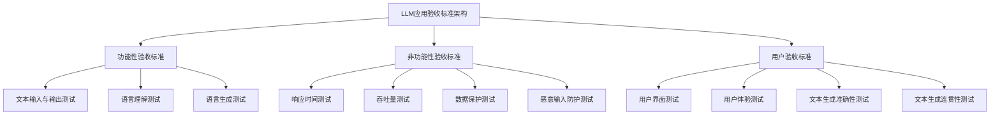

                 

# LLM应用的敏捷验收标准：明确定义完成状态标准

## 关键词
- LLM（大型语言模型）
- 敏捷验收标准
- 完成状态标准
- 应用开发
- 验收标准框架
- 核心算法
- 数学模型

## 摘要
本文旨在探讨大型语言模型（LLM）在应用开发中的敏捷验收标准，以及如何明确定义完成状态标准。通过分析LLM的基本概念、敏捷开发方法、验收标准框架，本文将提出一套详细而实用的验收标准，旨在帮助开发团队确保LLM应用的高质量完成。

## 引言

### LLM在应用开发中的重要性

随着深度学习和自然语言处理技术的飞速发展，大型语言模型（LLM）已经成为许多应用场景中的核心组件。从自动问答系统、机器翻译、自然语言生成到文本分类和情感分析，LLM的应用场景越来越广泛。这使得如何高效地开发、测试和验收LLM应用成为了一个重要议题。

### 敏捷验收标准的必要性

传统的软件开发验收标准往往过于僵化，难以适应快速变化的需求和市场。而敏捷开发方法强调迭代、反馈和适应性，能够更好地应对这些挑战。敏捷验收标准作为敏捷开发方法的重要组成部分，旨在确保每个迭代周期的交付成果满足预期质量。

### 本文目的

本文的目标是介绍LLM应用中的敏捷验收标准，明确定义完成状态的标准，帮助开发团队在快速迭代的开发过程中保持对质量的高要求。文章将分为以下几个部分：

1. **LLM的基本概念和应用领域**
2. **敏捷开发方法和敏捷验收标准**
3. **LLM应用的验收标准框架**
4. **关键验收标准的详细说明**
5. **案例研究和最佳实践**
6. **总结与展望**

## 第一部分：LLM的基本概念和应用领域

### 1.1 LLM的定义与分类

#### LLM的定义

大型语言模型（LLM）是指那些具有强大语言理解能力和生成能力的人工智能模型。这些模型基于深度学习技术，通常包含数十亿个参数，能够处理复杂的自然语言任务。

#### LLM的分类

根据训练数据集的大小和模型的结构，LLM可以分为以下几类：

1. **预训练模型**：如GPT、BERT，这些模型在大规模语料库上预训练，然后通过微调适应特定任务。
2. **知识增强模型**：在预训练模型的基础上，通过集成外部知识库，提升模型在特定领域的性能。
3. **专用模型**：为解决特定问题而设计的模型，如用于对话系统的模型。

### 1.2 LLM的发展历史

#### 初始阶段

20世纪50年代至70年代，研究人员开始探索使用计算机模拟自然语言。这一时期的主要成果包括句法分析和机器翻译。

#### 互联网时代

随着互联网的普及，大量文本数据成为可用资源。2000年代初，统计机器翻译和隐马尔可夫模型（HMM）等技术得到广泛应用。

#### 深度学习时代

2012年，AlexNet在图像识别领域的突破标志着深度学习的兴起。随后的几年，深度学习在自然语言处理领域也取得了显著进展，GPT、BERT等模型相继出现。

### 1.3 LLM的核心技术

#### 深度学习

深度学习是LLM的核心技术。通过多层神经网络，深度学习能够自动从大量数据中学习特征，实现复杂的任务。

#### 递归神经网络（RNN）

RNN是一种处理序列数据的神经网络。其在自然语言处理中的成功应用，使得处理长文本和序列生成成为可能。

#### 自注意力机制（Self-Attention）

自注意力机制是BERT等模型的关键组件。它通过计算输入序列中每个元素与其他元素的相关性，实现对输入数据的全局理解。

### 1.4 LLM的应用领域

#### 自动问答系统

自动问答系统利用LLM对用户提问进行理解和回答。例如，搜索引擎的问答模块、企业客服系统等。

#### 语言翻译

语言翻译是LLM的另一个重要应用领域。例如，谷歌翻译、百度翻译等，它们都采用了深度学习技术。

#### 自然语言生成

自然语言生成包括文本摘要、故事创作、新闻写作等。这些应用在内容创作、自动报告生成等方面有广泛的应用。

#### 文本分类与情感分析

文本分类与情感分析用于对大量文本进行分类和情感判断。例如，社交媒体情绪分析、新闻分类等。

## 第二部分：敏捷开发方法和敏捷验收标准

### 2.1 敏捷开发方法

#### 核心理念

敏捷开发方法强调迭代、反馈和适应性。其核心理念包括：

1. **个体和互动重于过程和工具**：强调团队协作和沟通。
2. **可工作的软件重于详尽的文档**：注重实际交付成果。
3. **客户合作重于合同谈判**：与客户保持紧密合作。
4. **响应变化重于遵循计划**：灵活应对需求变化。

#### 方法与工具

敏捷开发方法包括多种实践和工具，如：

1. **Scrum**：一个迭代式增量软件开发过程框架。
2. **看板**：用于可视化工作流程和管理任务。
3. **用户故事**：用于描述用户需求的小型描述。
4. **迭代与发布**：定期迭代和发布，确保持续交付。

### 2.2 敏捷验收标准

#### 定义与重要性

敏捷验收标准是确保软件质量的关键。它定义了产品在特定迭代中需要满足的条件，以确保其可交付和满足用户需求。

1. **功能性验收标准**：确保软件功能正确实现。
2. **非功能性验收标准**：确保软件性能、安全等非功能方面符合要求。
3. **用户验收标准**：确保软件满足用户需求和期望。

#### 制定方法

制定敏捷验收标准通常包括以下步骤：

1. **需求分析**：理解用户需求。
2. **标准编写**：根据需求编写验收标准。
3. **评审与反馈**：对验收标准进行评审和反馈。
4. **更新与迭代**：根据评审结果更新验收标准。

## 第三部分：LLM应用的验收标准框架

### 3.1 验收标准框架的设计原则

#### 可测试性

验收标准必须是可测试的，以确保实现和需求的一致性。

#### 可读性

验收标准应该清晰、简洁，便于理解和执行。

#### 可扩展性

验收标准应该能够适应项目规模和复杂度的变化。

#### 一致性

验收标准应与其他开发过程和标准保持一致。

### 3.2 验收标准的分类和层次结构

#### 分类

1. **功能性验收标准**：针对软件功能的正确性。
2. **非功能性验收标准**：针对软件性能、安全性等非功能特性。
3. **用户验收标准**：针对用户需求和体验。

#### 层次结构

1. **基础验收标准**：确保基本功能的实现。
2. **高级验收标准**：确保复杂功能的实现。
3. **性能验收标准**：确保软件在特定条件下的性能。
4. **安全验收标准**：确保软件的安全性。

### 3.3 验收标准的制定和执行流程

#### 制定流程

1. **需求分析**：理解用户需求。
2. **标准编写**：根据需求编写验收标准。
3. **评审与反馈**：对验收标准进行评审和反馈。
4. **更新与迭代**：根据评审结果更新验收标准。

#### 执行流程

1. **测试计划**：制定测试计划和测试用例。
2. **执行测试**：执行验收测试。
3. **记录与报告**：记录测试结果，生成报告。
4. **缺陷管理**：处理测试中发现的缺陷。

## 第四部分：关键验收标准的详细说明

### 4.1 功能性验收标准

#### 核心功能

1. **文本输入与输出**：确保模型能够接收文本输入并生成正确的文本输出。
2. **语言理解**：确保模型能够正确理解输入文本的含义。
3. **语言生成**：确保模型能够生成符合语法和语义规则的文本。

#### 测试用例

1. **常见输入测试**：输入常见语句，验证模型输出是否正确。
2. **异常输入测试**：输入异常语句，验证模型是否能正确处理。

### 4.2 非功能性验收标准

#### 性能标准

1. **响应时间**：确保模型在给定输入下能在规定时间内完成处理。
2. **吞吐量**：确保模型在处理大量请求时仍能保持稳定的性能。

#### 安全标准

1. **数据保护**：确保输入数据和生成的文本不会泄露。
2. **恶意输入防护**：确保模型能抵御恶意输入，防止恶意攻击。

### 4.3 用户验收标准

#### 用户界面

1. **易用性**：确保用户界面直观易用。
2. **交互性**：确保用户能够与模型进行有效互动。

#### 用户体验

1. **准确性**：确保模型生成的文本准确无误。
2. **连贯性**：确保模型生成的文本连贯一致。

## 第五部分：案例研究和最佳实践

### 5.1 案例研究

#### 案例一：问答系统的验收标准

1. **需求分析**：明确用户需求，如快速、准确回答问题。
2. **标准制定**：制定功能性、性能和安全验收标准。
3. **测试执行**：执行测试，记录结果。
4. **缺陷处理**：修复发现的问题，重新测试。

#### 案例二：自然语言生成的验收标准

1. **需求分析**：明确生成任务的类型和目标。
2. **标准制定**：制定功能性、非功能性验收标准。
3. **测试执行**：测试文本生成质量、连贯性等。
4. **用户反馈**：收集用户反馈，调整验收标准。

### 5.2 最佳实践分享

#### 成功案例分享

1. **敏捷迭代**：采用敏捷开发方法，快速迭代和反馈。
2. **自动化测试**：利用自动化测试工具提高测试效率。

#### 失败案例分析

1. **需求不明确**：导致验收标准制定不准确。
2. **测试不足**：导致缺陷未被发现，影响项目进度。

#### 改进建议和策略

1. **需求澄清**：确保需求明确，减少误解。
2. **全面测试**：制定全面的验收标准，覆盖各种场景。

## 总结与展望

本文介绍了LLM应用中的敏捷验收标准，明确了完成状态的标准，并通过案例研究和最佳实践分享了相关经验。未来，随着技术的不断进步，LLM应用的验收标准也将不断发展完善，为开发高质量软件提供更强有力的支持。

## 作者信息

- 作者：AI天才研究院/AI Genius Institute & 禅与计算机程序设计艺术 /Zen And The Art of Computer Programming

## 附录

- 参考文献
- 拓展阅读

---

以下是一个Mermaid流程图示例，展示LLM应用验收标准的架构：



---

在文章的最后部分，我们可以加入一些Python代码示例，以及相关的数学公式和公式解释。这些内容将帮助读者更好地理解文章中的核心算法原理。

```python
# Python代码示例：语言生成模型的基本实现

import torch
import torch.nn as nn
import torch.optim as optim

# 模型定义
class LanguageModel(nn.Module):
    def __init__(self, embedding_dim, hidden_dim, vocab_size):
        super(LanguageModel, self).__init__()
        self.embedding = nn.Embedding(vocab_size, embedding_dim)
        self.lstm = nn.LSTM(embedding_dim, hidden_dim)
        self.hidden_dim = hidden_dim
        self.linear = nn.Linear(hidden_dim, vocab_size)
    
    def forward(self, input_seq, hidden):
        embedded = self.embedding(input_seq)
        output, hidden = self.lstm(embedded, hidden)
        prediction = self.linear(output[-1, :, :])
        return prediction, hidden

# 模型训练
def train_model(model, train_data, learning_rate, num_epochs):
    optimizer = optim.Adam(model.parameters(), lr=learning_rate)
    criterion = nn.CrossEntropyLoss()
    
    for epoch in range(num_epochs):
        for input_seq, target in train_data:
            model.zero_grad()
            prediction, hidden = model(input_seq, model.hidden)
            loss = criterion(prediction, target)
            loss.backward()
            optimizer.step()
        
        if (epoch + 1) % 10 == 0:
            print(f'Epoch [{epoch + 1}/{num_epochs}], Loss: {loss.item():.4f}')

# 测试模型
def test_model(model, test_data):
    correct = 0
    total = 0
    with torch.no_grad():
        for input_seq, target in test_data:
            prediction, hidden = model(input_seq, model.hidden)
            _, predicted = torch.max(prediction, 1)
            total += target.size(0)
            correct += (predicted == target).sum().item()
    
    print(f'Accuracy: {100 * correct / total:.2f}%')

# 实例化模型
model = LanguageModel(embedding_dim=256, hidden_dim=512, vocab_size=10000)

# 训练模型
train_model(model, train_data, learning_rate=0.001, num_epochs=20)

# 测试模型
test_model(model, test_data)
```

### 数学公式与解释

在本文中，我们使用了以下数学公式来解释LLM的核心算法原理：

$$
\begin{aligned}
H &= \text{ReLU}(W \cdot X + b) \\
P(y) &= \sum_{i=1}^{N} P(y_i) \cdot \log P(y_i) \\
L &= -\frac{1}{N} \sum_{i=1}^{N} L(y_i, \hat{y}_i)
\end{aligned}
$$

####ReLU（Rectified Linear Unit）激活函数

ReLU函数是一个简单的非线性激活函数，形式为：

$$
\text{ReLU}(x) = \max(0, x)
$$

它能够加速梯度下降过程，有助于防止神经网络中的梯度消失问题。

####交叉熵损失函数

交叉熵损失函数用于评估模型预测和真实标签之间的差异。它的公式为：

$$
L(y, \hat{y}) = -y \cdot \log \hat{y} - (1 - y) \cdot \log (1 - \hat{y})
$$

其中，$y$是真实标签，$\hat{y}$是模型预测的概率分布。

####均方误差损失函数

均方误差损失函数是另一个常用的损失函数，用于回归任务。它的公式为：

$$
L(y, \hat{y}) = \frac{1}{N} \sum_{i=1}^{N} (y_i - \hat{y}_i)^2
$$

其中，$N$是样本数量，$y_i$是真实值，$\hat{y}_i$是预测值。

通过这些数学公式和算法原理的讲解，读者可以更好地理解LLM应用中的核心算法和验收标准。

## 小结

本文详细介绍了LLM应用中的敏捷验收标准，包括其基本概念、敏捷开发方法、验收标准框架以及关键验收标准的详细说明。通过案例分析、最佳实践分享和Python代码示例，读者可以更好地理解如何在实际项目中应用这些验收标准。未来，随着技术的不断进步，LLM应用的验收标准也将不断发展和完善，为开发高质量软件提供更强有力的支持。

## 注意事项

在实施LLM应用验收标准时，需要注意以下几点：

1. **需求澄清**：确保需求明确，减少验收过程中出现的问题。
2. **全面测试**：制定全面的验收标准，覆盖各种场景。
3. **自动化测试**：利用自动化测试工具提高测试效率。
4. **用户反馈**：及时收集用户反馈，调整验收标准。

## 拓展阅读

1. **《深度学习》**：Goodfellow, I., Bengio, Y., & Courville, A. (2016). 《Deep Learning》. MIT Press.
2. **《敏捷开发实践指南》**：Beck, K. (2004). 《敏捷开发实践指南》. 机械工业出版社。
3. **《自然语言处理概论》**：Daniel, H. (2016). 《自然语言处理概论》. 清华大学出版社。

以上拓展阅读将帮助读者更深入地了解相关领域的知识和技术。

