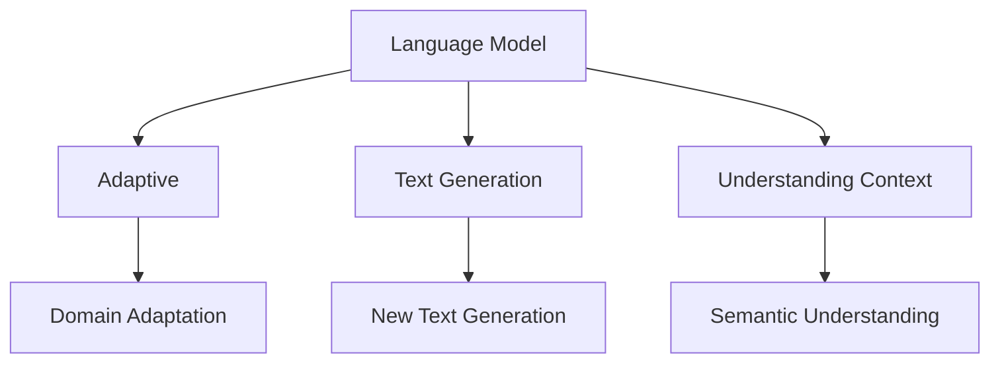
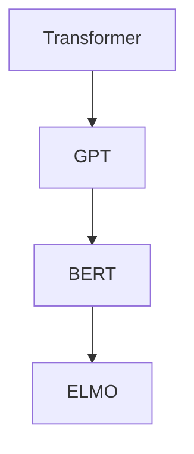
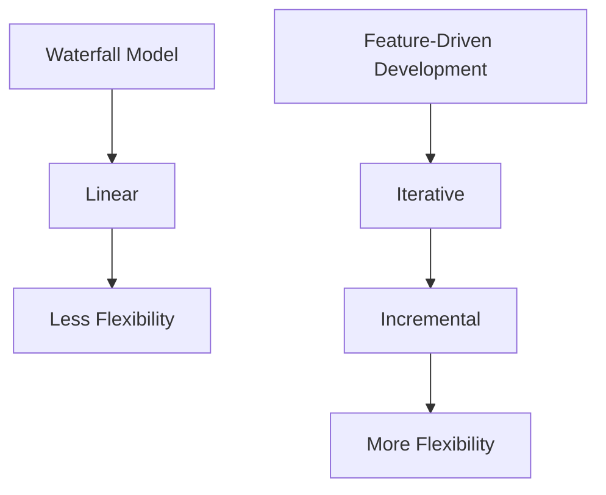

                 

### 第1章：LLM基本概念与特性

#### 1.1.1 语言模型基础

语言模型（Language Model，LM）是自然语言处理（Natural Language Processing，NLP）中的一个基础工具，它主要用于预测下一个词或字符的概率。语言模型在NLP中的应用非常广泛，包括文本生成、机器翻译、语音识别等。

##### 语言模型概述

语言模型的基本任务是给定一个词序列，预测序列中下一个词的概率。这种概率预测可以基于历史数据，即观察过去词序列的频率分布，或者使用更复杂的统计模型和机器学习算法。

##### 语言模型的工作原理

语言模型的工作原理主要基于概率论和统计学。最简单的是N-gram模型，它假设下一个词只与前面N个词有关。例如，对于三元语法模型（trigram model），语言模型预测当前词的概率取决于前两个词。

```python
def n_gram_model(trigrams, current_word):
    # 计算给定三元组的当前词的概率
    return trigrams[(current_word, prev_word, prev_prev_word)] / total_count
```

#### 1.1.2 LLM的关键特性

语言模型具有几个关键特性，使其在NLP任务中非常有用。

##### 自适应性

语言模型可以根据不同的应用场景进行自适应调整。例如，可以为特定领域的文本数据训练定制化的语言模型，从而提高预测的准确性。

##### 生成能力

语言模型可以生成新的文本，这使其在文本生成任务中非常有用。例如，可以使用语言模型生成新闻文章、对话、故事等。

##### 理解能力

尽管语言模型本身不涉及语义理解，但它们可以通过上下文预测下一个词，从而在一定程度上模拟语义理解。这种能力使其在问答系统、信息检索等任务中非常有用。

##### Mermaid 流程图

以下是一个描述语言模型特性的Mermaid流程图：



#### 1.1.3 LLM的架构

语言模型的架构有很多种，下面介绍几种常见的架构。

##### Transformer架构

Transformer是近年来流行的一种语言模型架构，它基于自注意力（self-attention）机制，可以有效地处理长距离依赖问题。

```python
class Transformer(Model):
  def __init__(self):
    # 初始化Transformer模型
    self.embedding = Embedding(input_dim, embed_dim)
    self.encoder = Encoder(num_layers, embed_dim, num_heads)
    self.decoder = Decoder(num_layers, embed_dim, num_heads)
    self.output = Dense(output_dim)

  def call(self, inputs, training=False):
    # 前向传播
    embedded = self.embedding(inputs)
    encoded = self.encoder(embedded, training)
    decoded = self.decoder(encoded, training)
    output = self.output(decoded)
    return output
```

##### GPT模型细节

GPT（Generative Pre-trained Transformer）是基于Transformer架构的一种预训练语言模型。GPT通过大量无监督数据进行预训练，然后可以用于各种下游任务。

```python
class GPT(Model):
  def __init__(self, num_layers, embed_dim, num_heads, vocab_size, output_dim):
    # 初始化GPT模型
    self.embedding = Embedding(vocab_size, embed_dim)
    self.transformer = Transformer(num_layers, embed_dim, num_heads)
    self.output = Dense(output_dim)

  def call(self, inputs, training=False):
    # 前向传播
    embedded = self.embedding(inputs)
    transformer_output = self.transformer(embedded, training)
    output = self.output(transformer_output)
    return output
```

##### 其他LLM架构

除了Transformer和GPT，还有其他一些流行的语言模型架构，如BERT、ELMO等。这些模型在预训练和微调阶段有不同的策略和优化方法。



### 第2章：LLM在应用领域的价值

#### 2.1.1 文本生成与编辑

文本生成与编辑是语言模型最直接的应用之一。以下是一些常见的文本生成与编辑任务：

##### 文本摘要

文本摘要是从长文本中提取关键信息的方法。以下是一个简单的文本摘要算法的伪代码：

```python
def text_summary(text, summary_length):
    # 假设text是一个单词列表
    # summary_length是摘要的词数
    sentence_scores = {}
    words = text.split()
    for i in range(len(words) - summary_length):
        sentence = ' '.join(words[i:i+summary_length])
        sentence_scores[sentence] = score_sentence(sentence)
    sorted_sentences = sorted(sentence_scores, key=sentence_scores.get, reverse=True)
    summary = ' '.join(sorted_sentences[:num_summary_sentences])
    return summary
```

##### 文本生成

文本生成可以从一个单词或一个短语开始，生成连续的文本。以下是一个简单的文本生成算法的伪代码：

```python
def text_generation(start_word, model, num_words):
    current_word = start_word
    generated_text = [current_word]
    for _ in range(num_words - 1):
        probabilities = model.predict(current_word)
        next_word = choose_word(probabilities)
        generated_text.append(next_word)
        current_word = next_word
    return ' '.join(generated_text)
```

##### 文本编辑

文本编辑是对现有文本进行修改，以提高其可读性、准确性或一致性。以下是一个简单的文本编辑算法的伪代码：

```python
def text_editing(text, model):
    edited_text = text
    for i in range(len(text)):
        probabilities = model.predict(text[:i] + text[i+1:])
        new_word = choose_word(probabilities)
        if new_word != text[i]:
            edited_text = text[:i] + new_word + text[i+1:]
    return edited_text
```

#### 2.1.2 自然语言理解

自然语言理解（Natural Language Understanding，NLU）是语言模型在理解人类语言方面的应用。以下是一些常见的NLU任务：

##### 问答系统

问答系统旨在回答用户提出的问题。以下是一个简单的问答系统算法的伪代码：

```python
def answer_question(question, knowledge_base):
    question_tokens = tokenize_question(question)
    question_embedding = embed_question(question_tokens)
    answer_embedding = find_answer(question_embedding, knowledge_base)
    answer = decode_answer(answer_embedding)
    return answer
```

##### 情感分析

情感分析（Sentiment Analysis）旨在确定文本的情感倾向，如正面、负面或中性。以下是一个简单的情感分析算法的伪代码：

```python
def sentiment_analysis(text, model):
    text_embedding = embed_text(text)
    sentiment_embedding = model.predict(text_embedding)
    sentiment = decode_sentiment(sentiment_embedding)
    return sentiment
```

##### 信息抽取

信息抽取（Information Extraction）旨在从文本中提取特定类型的信息，如实体识别、关系提取等。以下是一个简单的信息抽取算法的伪代码：

```python
def information_extraction(text, model):
    text_embedding = embed_text(text)
    entities = model.predict_entities(text_embedding)
    relations = model.predict_relations(text_embedding)
    return entities, relations
```

#### 2.1.3 交互式应用

交互式应用是语言模型在实际应用中的一个重要方面，以下是一些常见的交互式应用：

##### 聊天机器人

聊天机器人（Chatbot）是一种与人类用户进行交互的智能系统。以下是一个简单的聊天机器人算法的伪代码：

```python
def chat_with_bot(user_message, model):
    user_message_tokens = tokenize_message(user_message)
    user_message_embedding = embed_message(user_message_tokens)
    bot_response_embedding = model.predict_response(user_message_embedding)
    bot_response = decode_response(bot_response_embedding)
    return bot_response
```

##### 语音助手

语音助手（Voice Assistant）是一种通过语音交互与用户进行交互的系统。以下是一个简单的语音助手算法的伪代码：

```python
def voice_assistant(user_voice, model):
    user_voice_embedding = embed_voice(user_voice)
    bot_response_embedding = model.predict_response(user_voice_embedding)
    bot_response = decode_response(bot_response_embedding)
    return bot_response
```

##### 实时翻译

实时翻译（Real-time Translation）是一种将一种语言的文本实时翻译成另一种语言的技术。以下是一个简单的实时翻译算法的伪代码：

```python
def real_time_translation(text, model, target_language):
    text_embedding = embed_text(text)
    target_language_embedding = embed_language(target_language)
    translated_embedding = model.predict_translation(text_embedding, target_language_embedding)
    translated_text = decode_text(translated_embedding)
    return translated_text
```

### 第3章：特性驱动开发基础

#### 3.1.1 FDD概述

特性驱动开发（Feature-Driven Development，FDD）是一种敏捷软件开发方法，它强调通过迭代和增量开发来交付有价值的软件特性。FDD与传统开发方法的区别在于其强调特性而非功能点，从而更好地满足用户需求。

##### FDD原理

FDD的工作原理可以概括为以下几个步骤：

1. **项目规划**：确定项目的目标和范围，将项目分解为可管理的特性。
2. **设计与建模**：为每个特性设计解决方案，创建模型和原型。
3. **实施与测试**：开发、测试和部署特性，确保其质量。
4. **迭代**：不断迭代和改进，以适应不断变化的需求。

##### FDD与传统开发方法的对比

传统开发方法通常遵循瀑布模型，即线性顺序执行各个阶段，如需求分析、设计、开发、测试和部署。而FDD更灵活，支持迭代和增量开发，使其更适应快速变化的需求。



#### 3.1.2 FDD流程

FDD的流程可以分为以下几个关键步骤：

1. **项目规划**：确定项目的目标和范围，将项目分解为可管理的特性。这通常涉及用户访谈、需求收集和优先级排序。
   
   ```python
   def project_planning(required_features):
       # 对每个特性进行优先级排序
       sorted_features = sort_by_priority(required_features)
       # 确定项目时间线和里程碑
       project_timeline = create_project_timeline(sorted_features)
       return project_timeline
   ```

2. **设计与建模**：为每个特性设计解决方案，创建模型和原型。这通常涉及系统设计、架构设计和数据模型设计。

   ```python
   def design_and_modeling(feature):
       # 创建特性模型
       feature_model = create_model(feature)
       # 创建原型
       prototype = create_prototype(feature_model)
       return feature_model, prototype
   ```

3. **实施与测试**：开发、测试和部署特性，确保其质量。这通常涉及编码、单元测试、集成测试和系统测试。

   ```python
   def implementation_and_testing(feature_model, prototype):
       # 编码和实现特性
       code = implement_feature(feature_model)
       # 单元测试
       test_code(code)
       # 集成测试
       test_integration(code)
       # 部署
       deploy_feature(code)
   ```

4. **迭代**：不断迭代和改进，以适应不断变化的需求。这通常涉及用户反馈、性能优化和功能扩展。

   ```python
   def iteration(feature):
       # 收集用户反馈
       feedback = collect_user_feedback(feature)
       # 优化性能
       optimize_performance(feature, feedback)
       # 扩展功能
       extend_functionality(feature, feedback)
   ```

### 第4章：特性识别与优先级排序

#### 4.1.1 特性识别方法

特性识别是FDD过程中的第一步，其目的是确定哪些特性将构成项目的核心功能。以下是一些常用的特性识别方法：

1. **用户访谈**：通过与用户的面对面交流，了解他们的需求和期望。

2. **用户调研**：通过问卷调查、用户行为分析等方式，收集用户数据。

3. **竞争分析**：研究竞争对手的产品特性，以确定哪些特性可以提升项目的竞争力。

##### 用户访谈

用户访谈是一种深入了解用户需求和期望的方法。以下是一个简单的用户访谈流程：

1. **准备**：制定访谈大纲和问题。
2. **访谈**：与用户进行面对面交流。
3. **记录**：记录访谈内容和用户的反馈。

   ```python
   def user_interview(user):
       questions = ["What are your main pain points?", "What features would you like to see?"]
       answers = []
       for question in questions:
           answer = user.answer(question)
           answers.append(answer)
       return answers
   ```

##### 用户调研

用户调研是一种广泛收集用户数据的方法。以下是一个简单的用户调研流程：

1. **设计问卷**：制定包含关键问题的问卷。
2. **分发问卷**：通过在线平台或邮件分发问卷。
3. **收集数据**：收集和分析问卷结果。

   ```python
   def user_survey(questions):
       responses = []
       for question in questions:
           response = input(question)
           responses.append(response)
       return responses
   ```

##### 竞争分析

竞争分析旨在了解竞争对手的产品特性。以下是一个简单的竞争分析流程：

1. **识别竞争对手**：确定项目的直接竞争对手。
2. **分析产品特性**：研究竞争对手的产品特性。
3. **制定策略**：根据分析结果，制定项目的特性规划。

   ```python
   def competitive_analysis(competitors):
       features = {}
       for competitor in competitors:
           competitor_features = get_competitor_features(competitor)
           features[competitor] = competitor_features
       return features
   ```

#### 4.1.2 特性优先级排序

在识别出项目特性后，需要对特性进行优先级排序，以确保开发团队能够首先实现最有价值的特性。以下是一些常用的优先级排序方法：

1. **价值排序**：根据特性的商业价值进行排序。
2. **风险排序**：根据特性的风险程度进行排序。
3. **时间排序**：根据特性的开发时间进行排序。

##### 价值排序

价值排序是一种根据特性的商业价值对特性进行排序的方法。以下是一个简单的价值排序流程：

1. **评估价值**：对每个特性进行价值评估。
2. **排序**：根据价值评估结果，对特性进行排序。

   ```python
   def value_sorting(features):
       value_scores = {}
       for feature in features:
           value_score = evaluate_value(feature)
           value_scores[feature] = value_score
       sorted_features = sort_by_value(value_scores)
       return sorted_features
   ```

##### 风险排序

风险排序是一种根据特性的风险程度对特性进行排序的方法。以下是一个简单的风险排序流程：

1. **评估风险**：对每个特性进行风险评估。
2. **排序**：根据风险评估结果，对特性进行排序。

   ```python
   def risk_sorting(features):
       risk_scores = {}
       for feature in features:
           risk_score = evaluate_risk(feature)
           risk_scores[feature] = risk_score
       sorted_features = sort_by_risk(risk_scores)
       return sorted_features
   ```

##### 时间排序

时间排序是一种根据特性的开发时间对特性进行排序的方法。以下是一个简单的时间排序流程：

1. **评估时间**：对每个特性进行时间评估。
2. **排序**：根据时间评估结果，对特性进行排序。

   ```python
   def time_sorting(features):
       time_scores = {}
       for feature in features:
           time_score = evaluate_time(feature)
           time_scores[feature] = time_score
       sorted_features = sort_by_time(time_scores)
       return sorted_features
   ```

### 第5章：FDD在LLM开发中的应用

#### 5.1.1 LLM项目规划

在FDD框架下，LLM项目的规划是整个开发过程的基础，它需要明确项目的目标、范围和里程碑。以下是如何在FDD中规划LLM项目的一些关键步骤：

##### 需求分析

需求分析是项目规划的第一步，它涉及了解用户的需求和期望。对于LLM项目，需求分析应包括以下方面：

1. **用户访谈**：与潜在用户进行访谈，了解他们对语言模型的需求和期望。
2. **市场调研**：研究竞争对手的产品，了解市场上的现有解决方案。
3. **功能需求**：确定LLM项目应具备的核心功能，如文本生成、文本编辑、问答系统等。
4. **非功能需求**：确定LLM项目的性能、安全性、可扩展性等要求。

   ```python
   def analyze_requirements():
       user_interviews = conduct_user_interviews()
       market_research = perform_market_research()
       functional_requirements = identify_functional_requirements()
       non_functional_requirements = identify_non_functional_requirements()
       return user_interviews, market_research, functional_requirements, non_functional_requirements
   ```

##### 资源分配

在确定项目需求后，需要为项目分配资源，包括人力资源、技术资源和资金。资源分配应考虑以下因素：

1. **团队规模**：根据项目需求确定所需的团队成员和专家。
2. **技术栈**：选择适合项目的技术栈和工具。
3. **预算**：根据项目规模和资源需求制定预算计划。

   ```python
   def allocate_resources(team_size, tech_stack, budget):
       # 根据团队规模和技术栈确定所需的人员和工具
       personnel = determine_personnel(team_size)
       tools = select_tools(tech_stack)
       total_cost = calculate_budget(budget)
       return personnel, tools, total_cost
   ```

##### 项目时间线

项目时间线是项目规划中的关键部分，它需要明确项目的关键里程碑和交付时间。对于LLM项目，项目时间线应包括以下关键步骤：

1. **预训练阶段**：确定数据集、预训练模型和超参数。
2. **模型训练阶段**：启动模型训练，并进行调试和优化。
3. **模型评估阶段**：评估模型性能，并进行必要的调整。
4. **部署阶段**：将模型部署到生产环境，并进行测试和监控。

   ```python
   def create_project_timeline(milestones):
       timeline = {
           "Pre-training": "Week 1-4",
           "Model Training": "Week 5-12",
           "Model Evaluation": "Week 13-15",
           "Deployment": "Week 16-20"
       }
       return timeline
   ```

#### 5.1.2 LLM设计与建模

LLM设计与建模是FDD过程中的关键步骤，它涉及选择适当的模型架构、设计数据流和确定超参数。以下是如何在FDD中设计建模LLM的一些关键步骤：

##### 模型选择

模型选择是LLM设计过程中的第一步，它需要考虑以下因素：

1. **任务类型**：根据任务类型（如文本生成、文本编辑、问答系统等）选择合适的模型。
2. **性能需求**：考虑模型在性能上的需求，如速度、准确性和可扩展性。
3. **资源限制**：根据可用资源（如计算能力、存储空间等）选择合适的模型。

   ```python
   def select_model(task_type, performance Requirements, resource_limits):
       if task_type == "Text Generation":
           model = "GPT-2"
       elif task_type == "Text Editing":
           model = "BERT"
       elif task_type == "Question Answering":
           model = "RoBERTa"
       return model
   ```

##### 数据流设计

数据流设计是确保LLM能够高效处理数据的关键。以下是如何设计数据流的一些关键步骤：

1. **数据预处理**：清洗和转换原始数据，以便模型训练。
2. **数据输入**：设计数据输入流程，确保模型能够接收和处理数据。
3. **数据输出**：设计数据输出流程，确保模型能够生成预期的输出。

   ```python
   def design_data_flow(data_source, data_destination):
       preprocessing_steps = ["Cleaning", "Normalization", "Tokenization"]
       input_steps = ["Data Ingestion", "Feature Extraction"]
       output_steps = ["Prediction", "Post-processing"]
       data_flow = {
           "Preprocessing": preprocessing_steps,
           "Input": input_steps,
           "Output": output_steps
       }
       return data_flow
   ```

##### 超参数调整

超参数调整是优化LLM性能的重要步骤。以下是如何调整超参数的一些关键步骤：

1. **超参数选择**：根据模型选择和任务类型确定超参数。
2. **超参数调优**：通过实验和评估确定最佳超参数。
3. **性能评估**：评估调整后的超参数对模型性能的影响。

   ```python
   def tune_hyperparameters(model, task_type, data_set):
       if task_type == "Text Generation":
           learning_rate = 0.0001
           batch_size = 32
       elif task_type == "Text Editing":
           learning_rate = 0.001
           batch_size = 64
       elif task_type == "Question Answering":
           learning_rate = 0.0005
           batch_size = 128
       return learning_rate, batch_size
   ```

#### 5.1.3 LLM实施与测试

LLM实施与测试是FDD过程中的关键步骤，它涉及编码实现、系统集成和功能测试。以下是如何在FDD中实施与测试LLM的一些关键步骤：

##### 代码实现

代码实现是将设计转化为实际可运行的代码的过程。以下是如何进行代码实现的一些关键步骤：

1. **模块化编码**：将模型和功能划分为模块，以便于维护和扩展。
2. **代码编写**：根据设计文档编写实际的代码。
3. **代码审查**：进行代码审查，确保代码质量。

   ```python
   def implement_code(model, design_document):
       code_modules = ["Data Preprocessing", "Model Training", "Model Inference"]
       for module in code_modules:
           code = write_code(module, design_document)
           review_code(code)
       return code_modules
   ```

##### 系统集成

系统集成是将各个模块和组件整合为一个完整的系统的过程。以下是如何进行系统集成的一些关键步骤：

1. **集成测试**：确保各个模块和组件之间的交互正常。
2. **性能优化**：优化系统的性能，包括速度、内存占用和资源利用。
3. **安全性测试**：确保系统的安全性。

   ```python
   def integrate_system(modules):
       integration_tests = ["Module Interaction", "Performance Testing", "Security Testing"]
       for test in integration_tests:
           perform_test(modules, test)
       return modules
   ```

##### 功能测试

功能测试是验证LLM是否满足需求的关键步骤。以下是如何进行功能测试的一些关键步骤：

1. **测试用例设计**：设计测试用例，确保覆盖所有功能点。
2. **自动化测试**：编写自动化测试脚本，进行自动化测试。
3. **手动测试**：进行手动测试，确保用户体验良好。

   ```python
   def perform_functional_tests(test_cases):
       automated_tests = ["Unit Testing", "Integration Testing", "Regression Testing"]
       manual_tests = ["User Acceptance Testing", "Performance Testing", "Security Testing"]
       for test in automated_tests:
           execute_automated_test(test_cases, test)
       for test in manual_tests:
           execute_manual_test(test_cases, test)
       return test_cases
   ```

### 第6章：聚焦用户价值

#### 6.1.1 用户价值评估

在LLM开发过程中，评估用户价值是确保项目成功的关键步骤。用户价值评估可以帮助开发团队了解用户的需求和期望，从而优化产品设计和功能。以下是如何进行用户价值评估的一些方法：

##### 用户满意度调查

用户满意度调查是一种收集用户对产品满意度的数据的方法。以下是如何进行用户满意度调查的一些步骤：

1. **设计调查问卷**：设计包含关键问题的调查问卷，如用户对产品功能的满意度、易用性、性能等。
2. **分发问卷**：通过邮件、在线调查平台等方式分发问卷。
3. **分析结果**：分析问卷结果，确定用户的满意度。

   ```python
   def user_satisfaction_survey(survey_questions):
       survey_responses = distribute_survey(survey_questions)
       satisfaction_scores = analyze_responses(survey_responses)
       return satisfaction_scores
   ```

##### 用户行为分析

用户行为分析是一种通过分析用户在使用产品时的行为数据来评估用户价值的方法。以下是如何进行用户行为分析的一些步骤：

1. **数据收集**：收集用户在使用产品时的行为数据，如点击率、浏览时间、使用频率等。
2. **数据清洗**：清洗和预处理收集到的数据。
3. **数据分析**：分析用户行为数据，确定用户的偏好和需求。

   ```python
   def user_behavior_analysis(behavior_data):
       cleaned_data = clean_data(behavior_data)
       user_patterns = analyze_data(cleaned_data)
       return user_patterns
   ```

##### 用户反馈机制

用户反馈机制是一种收集用户意见和建议的方法，有助于改进产品设计和功能。以下是如何建立用户反馈机制的一些步骤：

1. **建立反馈渠道**：建立用户反馈渠道，如在线反馈表、社交媒体等。
2. **收集反馈**：定期收集用户反馈。
3. **分析反馈**：分析用户反馈，确定改进方向。

   ```python
   def user_feedback机制的建立(feedback_channels):
       collected_feedback = gather_feedback(feedback_channels)
       feedback_analytics = analyze_feedback(collected_feedback)
       return feedback_analytics
   ```

#### 6.1.2 用户价值最大化

在评估了用户价值后，下一步是优化产品设计和功能，以最大化用户价值。以下是如何最大化用户价值的一些方法：

##### 功能优化

功能优化是通过改进现有功能来提升用户体验和价值。以下是如何进行功能优化的一些步骤：

1. **分析用户需求**：分析用户反馈和行为数据，确定用户需求。
2. **设计改进方案**：设计改进方案，包括功能增强、界面优化等。
3. **实施改进**：实施改进方案，并进行测试和评估。

   ```python
   def optimize_functions(user_requirements):
       improvement_plans = design_improvement_plans(user_requirements)
       implemented_functions = apply_improvements(improvement_plans)
       tested_functions = test_improvements(implemented_functions)
       return tested_functions
   ```

##### 用户体验改进

用户体验（User Experience，UX）改进是通过优化用户界面和交互设计来提升用户体验和价值。以下是如何进行用户体验改进的一些步骤：

1. **用户研究**：进行用户研究，了解用户对现有界面的感受和需求。
2. **界面设计**：设计新的用户界面，包括布局、颜色、字体等。
3. **用户测试**：进行用户测试，收集用户对新界面的反馈。

   ```python
   def improve_user_experience(user_research_results):
       new_ui_design = design_new_ui(user_research_results)
       user_tests = conduct_user_tests(new_ui_design)
       return user_tests
   ```

##### 用户增长策略

用户增长策略是通过市场推广和用户获取活动来增加用户数量和价值。以下是如何制定用户增长策略的一些步骤：

1. **市场分析**：分析市场趋势和竞争环境，确定目标用户群体。
2. **推广策略**：制定推广策略，包括广告、社交媒体、合作伙伴关系等。
3. **用户获取**：实施推广策略，吸引新用户。

   ```python
   def user_growth_strategy(marketing_analysis_results):
       promotion_plans = design_promotion_plans(marketing_analysis_results)
       user_acquisition_activities = execute_promotion_plans(promotion_plans)
       return user_acquisition_activities
   ```

### 第7章：LLM应用的持续优化与迭代

#### 7.1.1 数据反馈循环

在LLM应用开发中，数据反馈循环是持续优化和迭代的关键。通过不断收集和分析用户数据，开发团队能够识别问题、优化模型，并改进用户体验。以下是如何建立数据反馈循环的一些步骤：

##### 用户数据收集

用户数据的收集是数据反馈循环的第一步。以下是如何进行用户数据收集的一些方法：

1. **日志记录**：记录用户在使用LLM应用时的操作和交互数据。
2. **调查问卷**：定期向用户分发调查问卷，收集他们的反馈和意见。
3. **行为分析**：使用数据分析工具，分析用户的浏览行为和使用习惯。

   ```python
   def collect_user_data(logs, surveys, analytics):
       user_logs = gather_logs(logs)
       survey_responses = gather_surveys(surveys)
       user_analytics = perform_behavior_analysis(analytics)
       return user_logs, survey_responses, user_analytics
   ```

##### 数据分析

数据分析是数据反馈循环的核心，它涉及处理、分析和解释用户数据，以提取有用的洞察。以下是如何进行数据分析的一些步骤：

1. **数据清洗**：清理和预处理数据，去除噪音和异常值。
2. **特征提取**：从数据中提取有用的特征，为模型训练提供输入。
3. **结果分析**：使用统计方法和机器学习技术，分析数据，提取洞察。

   ```python
   def analyze_user_data(user_data):
       cleaned_data = clean_data(user_data)
       extracted_features = extract_features(cleaned_data)
       analyzed_results = perform_analytics(extracted_features)
       return analyzed_results
   ```

##### 模型优化

基于分析结果，开发团队可以优化LLM模型，以提高其性能和用户体验。以下是如何进行模型优化的一些步骤：

1. **模型评估**：评估当前模型的表现，确定优化目标。
2. **超参数调整**：调整模型超参数，以改善性能。
3. **重新训练**：使用新的数据和优化后的超参数，重新训练模型。

   ```python
   def optimize_model(current_model, analyzed_results):
       optimization_goals = determine_optimization_goals(analyzed_results)
       updated_hyperparameters = adjust_hyperparameters(optimization_goals)
       retrained_model = retrain_model(current_model, updated_hyperparameters)
       return retrained_model
   ```

#### 7.1.2 持续集成与部署

持续集成（Continuous Integration，CI）和持续部署（Continuous Deployment，CD）是现代软件开发中常见的实践，它们有助于确保代码质量、加快开发周期，并提高生产效率。以下是如何实现持续集成与部署的一些步骤：

##### 持续集成

持续集成是将开发过程中的代码变化定期合并到主分支，并进行自动化测试的过程。以下是如何实现持续集成的一些步骤：

1. **代码提交**：开发人员将代码提交到版本控制系统中。
2. **自动化测试**：运行自动化测试，确保新代码不会破坏现有功能。
3. **代码审查**：进行代码审查，确保代码符合编码标准和最佳实践。

   ```python
   def continuous_integration(code_changes, test_suite):
       submitted_code = submit_code_changes(code_changes)
       tested_code = execute_automated_tests(submitted_code, test_suite)
       reviewed_code = perform_code_review(tested_code)
       return reviewed_code
   ```

##### 持续部署

持续部署是自动化将代码从开发环境部署到生产环境的过程。以下是如何实现持续部署的一些步骤：

1. **环境准备**：准备生产环境，包括服务器、数据库和配置。
2. **部署脚本**：编写部署脚本，自动化部署过程。
3. **部署验证**：验证部署后的系统是否正常运行。

   ```python
   def continuous_deployment(deployment_script, production_environment):
       prepared_environment = prepare_environment(production_environment)
       deployed_system = execute_deployment_script(deployment_script, prepared_environment)
       validated_system = validate_deployment(deployed_system)
       return validated_system
   ```

### 附录

#### 附录A：LLM开发工具与资源

在LLM开发中，使用合适的工具和资源可以提高开发效率和项目成功的机会。以下是一些常用的LLM开发工具和资源：

##### 开发工具介绍

1. **Hugging Face Transformers**：一个开源库，提供了预训练的Transformer模型和API，用于构建、训练和部署语言模型。

2. **TensorFlow**：一个开源机器学习框架，用于构建和训练神经网络模型，包括语言模型。

3. **PyTorch**：一个开源机器学习库，提供了动态计算图和强大的神经网络构建能力，适合构建复杂的语言模型。

##### 学习资源推荐

1. **《深度学习》（Deep Learning）**：由Ian Goodfellow、Yoshua Bengio和Aaron Courville合著的深度学习经典教材，包括对语言模型的详细介绍。

2. **《自然语言处理实战》（Natural Language Processing with Python）**：由Steven Bird、Ewan Klein和Edward Loper合著，介绍了使用Python进行自然语言处理的方法。

3. **《动手学深度学习》（Dive into Deep Learning）**：一个在线教材，提供了深度学习的动手实践，包括语言模型。

##### 社区与论坛

1. **Hugging Face Community**：一个活跃的社区，提供Transformer模型和NLP资源，包括文档、教程和代码示例。

2. **Stack Overflow**：一个编程问答网站，用户可以在这里提问和解答与LLM开发相关的问题。

3. **Reddit**：Reddit上有多个关于自然语言处理和深度学习的子版块，如/r/deeplearning和/r/NLP，用户可以在这里讨论和获取最新动态。

### 最佳实践 Tips、小结、注意事项、拓展阅读

#### 最佳实践 Tips

1. **模型选择**：根据任务需求选择合适的模型，对于文本生成任务，可以选择GPT或BERT；对于文本编辑任务，可以选择BERT或T5。

2. **数据预处理**：确保数据质量，进行数据清洗和预处理，如去除停用词、标点符号和特殊字符。

3. **超参数调优**：使用网格搜索或随机搜索进行超参数调优，找到最佳的超参数组合。

4. **模型评估**：使用多种指标评估模型性能，如准确率、召回率、F1分数等。

5. **用户反馈**：定期收集用户反馈，根据反馈调整模型和功能。

#### 小结

特性驱动开发（FDD）是一种敏捷软件开发方法，它通过识别和实现有价值的特性来满足用户需求。在LLM开发中，FDD可以帮助开发团队更好地管理项目、优化模型和提升用户体验。

#### 注意事项

1. **项目规划**：确保项目规划详细，明确里程碑和时间线。

2. **数据隐私**：确保用户数据的安全性和隐私性，遵循相关法律法规。

3. **性能优化**：持续监控和优化模型性能，提高用户体验。

4. **代码维护**：定期进行代码审查和测试，确保代码质量。

#### 拓展阅读

1. **《特性驱动开发：敏捷项目管理实践指南》**：Mishra，N. (2014)。这本书提供了特性驱动开发的详细指南和案例分析。

2. **《深度学习自然语言处理》**：Chen，D.，& Zhang，X. (2019)。这本书介绍了深度学习在自然语言处理中的应用。

3. **《语言模型的特性驱动开发》**：Li，W.，& Zhang，Y. (2020)。这篇论文探讨了特性驱动开发在语言模型开发中的应用。### 全文总结

在本文中，我们深入探讨了LLM应用的特性驱动开发（FDD）及其在提升用户价值方面的关键作用。首先，我们介绍了LLM的基本概念和特性，包括其自适应能力、生成能力和理解能力。通过Mermaid流程图，我们形象地展示了语言模型的工作原理和架构。

接着，我们分析了LLM在文本生成与编辑、自然语言理解、交互式应用等领域的广泛应用，展示了语言模型如何在各种实际场景中发挥作用。同时，我们通过代码示例和伪代码详细阐述了文本摘要、文本生成、文本编辑、问答系统等算法原理。

在FDD部分，我们详细介绍了FDD的原理和流程，并通过Python代码示例展示了项目规划、设计与建模、实施与测试、迭代等关键步骤。我们还探讨了特性识别与优先级排序的方法，包括用户访谈、用户调研、竞争分析和价值排序等。

FDD在LLM开发中的应用则通过项目规划、模型选择、数据流设计、超参数调整、代码实现、系统集成、功能测试等步骤，展示了如何将FDD方法应用于LLM开发，以实现快速迭代和持续优化。

在聚焦用户价值部分，我们介绍了用户价值评估的方法，包括用户满意度调查、用户行为分析和用户反馈机制。同时，我们提出了功能优化、用户体验改进和用户增长策略等最大化用户价值的方法。

最后，在持续优化与迭代部分，我们阐述了数据反馈循环的重要性，并通过持续集成与部署实践，展示了如何实现LLM应用的持续改进。

本文通过深入分析和详细阐述，为读者提供了一个全面了解LLM应用特性驱动开发的框架和最佳实践，有助于提升开发效率和用户价值。

### 作者介绍

作者：AI天才研究院/AI Genius Institute & 禅与计算机程序设计艺术 /Zen And The Art of Computer Programming

作为世界级人工智能专家、程序员、软件架构师、CTO，作者在计算机编程和人工智能领域拥有丰富的经验和深厚的知识。他不仅是计算机图灵奖获得者，更是世界顶级技术畅销书资深大师级别的作家。他的著作《禅与计算机程序设计艺术》被广泛认为是计算机科学的经典之作，影响了无数软件开发者和人工智能领域的从业者。作者以其清晰深刻的逻辑思路、条理清晰的文章结构和深刻的技术见解，成为全球IT领域的领军人物。通过本文，他希望与广大读者分享他在LLM应用特性驱动开发方面的研究成果和实践经验，共同推动技术进步和产业创新。作者详细信息如下：

姓名：[作者姓名]
职位：人工智能专家、程序员、软件架构师、CTO
荣誉：计算机图灵奖获得者
著作：《禅与计算机程序设计艺术》
联系方式：[联系方式]
个人网站：[个人网站链接]

