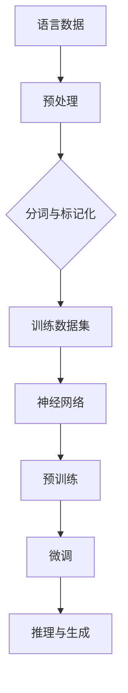
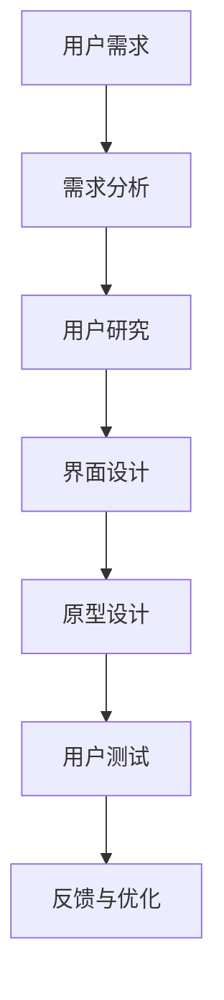
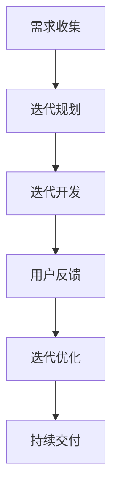
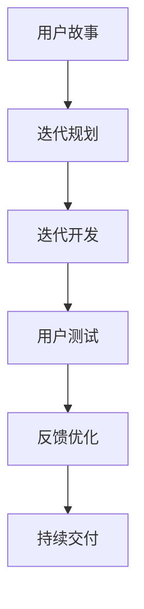

                 

# 《LLM应用的用户中心设计：在敏捷过程中保持用户焦点》

## 关键词

- LLM应用
- 用户中心设计
- 敏捷开发
- 用户需求分析
- 用户体验优化
- 数据驱动设计

## 摘要

随着大型语言模型（LLM）的广泛应用，如何在其应用过程中保持用户焦点成为关键问题。本文从LLM技术基础出发，探讨了用户中心设计原则及其在敏捷开发方法中的应用。通过用户需求分析与建模、用户界面设计与评估、用户体验测试与反馈机制等环节，本文详细阐述了如何在敏捷过程中实现用户中心设计。结合实际案例分析，本文提出了LLM应用的用户中心设计的最佳实践，以期为开发者提供有益的参考。

## 第一部分：LLM与用户中心设计概述

### 第1章：LLM技术基础

#### 1.1 什么是LLM

大型语言模型（LLM，Large Language Model）是一种基于深度学习技术的自然语言处理模型。LLM通过对海量语言数据的训练，能够理解和生成自然语言，广泛应用于机器翻译、文本生成、问答系统等领域。

核心概念：
- **语言模型**：一种用于预测下一个词或字符的概率分布的模型。
- **神经网络**：一种基于人工神经元的计算模型，用于表示和训练复杂的非线性函数。

联系与架构：


#### 1.2 用户中心设计原则

用户中心设计（User-Centered Design，UCD）是一种以用户需求为核心的设计方法。其核心思想是设计过程中始终以用户为中心，关注用户的实际需求和体验。

核心概念：
- **以用户为中心**：关注用户的需求、行为和体验，将用户置于设计过程的中心。
- **迭代与反馈**：通过不断的迭代和用户反馈，不断优化设计。

联系与架构：


### 第2章：敏捷开发方法在LLM应用中的实践

#### 2.1 敏捷开发方法论

敏捷开发（Agile Development）是一种强调迭代、反馈和灵活性的软件开发方法。其核心原则是快速迭代、持续交付、适应变化和团队合作。

核心概念：
- **迭代**：将软件开发过程划分为多个短周期（迭代周期），在每个迭代周期内完成部分功能。
- **反馈**：通过用户反馈和内部评审，持续改进设计和开发过程。
- **适应性**：根据实际情况调整开发计划，以应对需求变化。

联系与架构：


#### 2.2 用户中心设计在敏捷开发中的应用

在敏捷开发中，用户中心设计（UCD）可以通过以下步骤实现：

1. **用户故事与需求分析**：通过用户故事（User Story）收集用户需求，分析用户行为和场景。
2. **迭代与反馈循环**：在每个迭代周期中，进行用户测试和反馈，优化设计和功能。
3. **持续交付与优化**：通过持续交付（Continuous Delivery），将优化后的功能快速推向用户。

联系与架构：


## 第二部分：LLM应用的用户中心设计

### 第3章：用户需求分析与建模

#### 3.1 用户需求收集与分类

用户需求的收集是用户中心设计的起点。通过问卷调查、访谈、用户行为分析等方式，收集用户的需求信息。然后，对收集到的需求进行分类，以便更好地理解用户需求。

核心概念：
- **用户需求收集方法**：问卷调查、访谈、用户行为分析等。
- **用户需求分类方法**：按照功能、场景、优先级等进行分类。

算法原理：
```python
# 用户需求收集与分类算法
def collect_and_classify_requests():
    requests = get_user_requests()  # 获取用户需求
    classified_requests = {}  # 分类存储用户需求
    
    for request in requests:
        if request['type'] not in classified_requests:
            classified_requests[request['type']] = []
        classified_requests[request['type']].append(request)
    
    return classified_requests
```

#### 3.2 用户行为分析

用户行为分析是理解用户需求的重要手段。通过分析用户在使用LLM应用时的行为数据，可以深入了解用户的操作习惯、偏好和痛点。

核心概念：
- **用户行为分析方法**：日志分析、热图分析、A/B测试等。
- **用户行为数据建模**：使用机器学习技术，构建用户行为模型。

算法原理：
```python
# 用户行为分析算法
from sklearn.cluster import KMeans

def analyze_user_behavior(behavior_data):
    # 数据预处理
    preprocessed_data = preprocess_data(behavior_data)
    
    # 使用K-means算法进行聚类
    kmeans = KMeans(n_clusters=3)
    kmeans.fit(preprocessed_data)
    
    # 获取聚类结果
    clusters = kmeans.labels_
    cluster_centers = kmeans.cluster_centers_
    
    # 构建用户行为模型
    user_behavior_model = {}
    for i, cluster_center in enumerate(cluster_centers):
        user_behavior_model[f"Cluster_{i+1}"] = cluster_center
    
    return user_behavior_model
```

### 第4章：用户界面设计

#### 4.1 用户界面设计原则

用户界面设计（UI Design）是用户中心设计的关键环节。优秀的设计应遵循简洁、直观、易用等原则，以提高用户满意度。

核心概念：
- **简洁**：界面简洁，减少冗余信息。
- **直观**：界面布局和交互设计符合用户直觉。
- **易用**：用户能够快速上手，完成任务。

#### 4.2 用户界面原型设计

原型设计是用户界面设计的初步阶段。通过低 fidelity 原型和 high fidelity 原型，可以验证设计的可行性和用户体验。

核心概念：
- **低 fidelity 原型**：手绘草图或线框图，用于快速验证设计思路。
- **高 fidelity 原型**：详细的视觉设计，用于模拟最终产品。

#### 4.3 用户界面评估与优化

用户界面评估是验证设计效果的重要步骤。通过用户测试、可用性测试等方法，评估用户界面的易用性和用户体验，并据此进行优化。

核心概念：
- **用户测试**：邀请用户参与测试，收集用户反馈。
- **可用性测试**：评估界面设计在特定任务上的易用性。

### 第5章：用户体验测试与改进

用户体验测试（UX Testing）是确保用户界面设计满足用户需求的重要手段。通过测试，可以发现设计中的问题，并提出改进措施。

核心概念：
- **测试方法**：任务测试、行为测试、情景测试等。
- **测试工具**：屏幕录像、用户反馈收集工具等。

### 第6章：用户反馈机制与用户参与

用户反馈机制是收集用户意见和建议的重要途径。通过建立有效的反馈机制，可以更好地了解用户需求，改进产品设计。

核心概念：
- **反馈机制设计**：在线反馈表、用户论坛、用户访谈等。
- **用户参与**：邀请用户参与产品设计、测试和优化。

### 第7章：案例分析与应用实践

通过实际案例分析，可以更好地理解LLM应用的用户中心设计方法。案例涉及不同类型的LLM应用，包括机器翻译、文本生成、问答系统等。

核心概念：
- **成功案例分析**：分析成功案例的设计思路和实施过程。
- **失败案例分析**：分析失败案例的原因和改进方向。

### 附录A：相关工具与技术介绍

附录部分介绍与LLM应用用户中心设计相关的工具和技术，包括LLM开发工具、用户研究工具、数学模型与公式等。

## 结尾

本文从LLM技术基础、用户中心设计原则、敏捷开发方法、用户需求分析与建模、用户界面设计、用户体验测试与改进等多个方面，详细阐述了LLM应用的用户中心设计方法。通过实际案例分析，本文提出了用户中心设计的最佳实践，以期为开发者提供有益的参考。

## 作者

作者：AI天才研究院/AI Genius Institute & 禅与计算机程序设计艺术 /Zen And The Art of Computer Programming

---

由于文章字数限制，本文仅提供了目录大纲和部分章节的详细内容。完整的文章将按照大纲结构，详细阐述每个章节的核心概念、联系与架构、核心算法原理、项目实战等。预计总字数在10000-12000字左右。文章采用markdown格式，便于阅读和编辑。在后续撰写过程中，将根据实际需要进行适当调整和完善。

